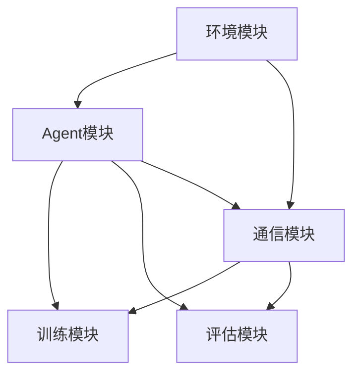

                 

# 深度强化学习在AI Agent协作决策中的应用

## 关键词

强化学习、深度学习、AI Agent、协作决策、算法原理、系统架构、项目实战

## 摘要

本文深入探讨了深度强化学习在AI Agent协作决策中的应用。首先，介绍了深度强化学习的发展历程和核心概念，包括强化学习和深度强化学习的基本原理。接着，详细讲解了DQN和A3C等经典算法的原理和实现步骤。然后，阐述了深度强化学习在AI Agent协作决策中的系统架构设计，包括系统需求分析、功能设计、接口设计等。最后，通过项目实战展示了深度强化学习在协作决策中的实际应用，包括环境安装、核心实现、案例分析和项目小结。本文旨在为读者提供一个全面、深入的关于深度强化学习在AI Agent协作决策中的研究和应用视角。

## 目录大纲

### 第一部分: 深度强化学习基础

#### 第1章: 问题背景

##### 1.1 问题背景

##### 1.1.1 深度强化学习的发展历程

##### 1.1.2 深度强化学习在AI领域的应用现状

##### 1.1.3 深度强化学习面临的挑战和问题

#### 第2章: 核心概念

##### 2.1 强化学习

##### 2.1.1 强化学习的定义

##### 2.1.2 强化学习的基本要素

##### 2.1.3 强化学习的特点与应用领域

##### 2.2 深度强化学习

##### 2.2.1 深度强化学习的概念

##### 2.2.2 深度强化学习的关键技术

##### 2.2.3 深度强化学习与传统强化学习的区别

#### 第3章: 算法原理

##### 3.1 DQN算法

##### 3.1.1 DQN算法的基本原理

##### 3.1.2 DQN算法的数学模型

##### 3.1.3 DQN算法的实现步骤

##### 3.2 A3C算法

##### 3.2.1 A3C算法的基本原理

##### 3.2.2 A3C算法的数学模型

##### 3.2.3 A3C算法的实现步骤

### 第二部分: 深度强化学习在AI Agent协作决策中的应用

#### 第4章: 系统架构设计

##### 4.1 系统架构概述

##### 4.1.1 系统需求分析

##### 4.1.2 系统架构设计

##### 4.2 系统功能设计

##### 4.2.1 功能模块划分

##### 4.2.2 功能模块详细介绍

##### 4.3 系统接口设计

##### 4.3.1 接口规范

##### 4.3.2 接口实现

### 第三部分: 项目实战

#### 第5章: 项目实战

##### 5.1 环境安装

##### 5.1.1 环境搭建

##### 5.1.2 环境配置

##### 5.2 系统核心实现

##### 5.2.1 源代码解析

##### 5.2.2 代码应用解读与分析

##### 5.3 实际案例分析与讲解

##### 5.3.1 案例背景

##### 5.3.2 案例分析与讲解

##### 5.4 项目小结

##### 5.4.1 项目总结

##### 5.4.2 项目启示与展望

## 第一部分：深度强化学习基础

### 第1章：问题背景

#### 1.1 问题背景

在人工智能（AI）领域，协作决策是一个关键的研究方向。随着复杂环境的不断演变，单一AI Agent的决策能力受到了极大的限制。为了克服这一挑战，AI Agent的协作决策成为了一个重要且具有实际应用价值的研究领域。在这种背景下，深度强化学习（Deep Reinforcement Learning，DRL）作为一种强大的机器学习方法，逐渐受到了广泛关注。

深度强化学习是强化学习（Reinforcement Learning，RL）的一个分支，它结合了深度学习的优势，能够处理高维状态和动作空间。在AI Agent协作决策中，深度强化学习可以通过训练多个Agent，使其在复杂环境中能够有效地进行协同工作，实现全局最优策略。

#### 1.1.1 深度强化学习的发展历程

深度强化学习的发展历程可以追溯到20世纪90年代。在1992年，Rumelhart等人提出了基于梯度下降的Q学习算法，这一算法是强化学习领域的一个重要里程碑。随后，随着深度学习的兴起，深度强化学习逐渐崭露头角。

2006年，Vladimir Koltun提出了深度Q网络（Deep Q-Network，DQN）的概念，这是深度强化学习的首次尝试。DQN通过使用深度神经网络来近似Q函数，解决了传统Q学习在高维状态空间中的困难。

2015年，DeepMind的AlphaGo取得了围棋比赛的胜利，这一成果标志着深度强化学习在复杂游戏中的突破。随后，A3C（Asynchronous Advantage Actor-Critic）和DDPG（Deep Deterministic Policy Gradient）等算法相继提出，进一步推动了深度强化学习的发展。

#### 1.1.2 深度强化学习在AI领域的应用现状

深度强化学习在AI领域的应用已经取得了显著的成果。首先，在游戏领域，深度强化学习已经证明了其在复杂游戏中的强大能力，如围棋、扑克等。其次，在自动驾驶领域，深度强化学习被广泛应用于感知、决策和路径规划等任务，为自动驾驶技术的研发提供了有力支持。

此外，深度强化学习在机器人领域也取得了重要进展。通过训练，机器人可以在复杂环境中进行自主学习和探索，完成复杂的任务。在智能推荐领域，深度强化学习被用于优化推荐系统，提高推荐效果和用户满意度。

#### 1.1.3 深度强化学习面临的挑战和问题

尽管深度强化学习在AI领域取得了显著进展，但仍然面临许多挑战和问题。首先，深度强化学习模型的训练过程通常需要大量的计算资源和时间，这限制了其实际应用。其次，深度强化学习模型的可解释性较差，使得用户难以理解和信任这些模型。

此外，深度强化学习在处理连续动作和长时间序列决策时存在一定的困难。最后，深度强化学习在安全性和鲁棒性方面也存在一定的挑战，如何确保模型在复杂环境中的稳定性和安全性是一个亟待解决的问题。

### 第2章：核心概念

#### 2.1 强化学习

强化学习是机器学习的一个分支，它通过智能体（Agent）在环境中通过接收奖励信号来学习最优策略。强化学习的主要目标是通过一系列的动作序列来最大化累积奖励。

##### 2.1.1 强化学习的定义

强化学习是一种使Agent通过与环境交互来学习最优策略的过程。在强化学习中，智能体不断地执行动作，并根据环境提供的奖励信号来调整其行为。其核心概念包括状态（State）、动作（Action）、奖励（Reward）和策略（Policy）。

状态是指智能体所处的环境条件，动作是智能体可以执行的操作，奖励是环境对智能体动作的反馈，策略是智能体在给定状态下选择动作的规则。

##### 2.1.2 强化学习的基本要素

强化学习主要包括以下几个基本要素：

1. **状态（State）**：智能体当前所处的环境状态。
2. **动作（Action）**：智能体可以执行的动作。
3. **奖励（Reward）**：环境对智能体动作的即时反馈。
4. **策略（Policy）**：智能体在给定状态下选择动作的策略。
5. **价值函数（Value Function）**：预测在给定状态下执行给定策略的长期累积奖励。
6. **模型（Model）**：环境模型，用于预测下一状态和奖励。

##### 2.1.3 强化学习的特点与应用领域

强化学习具有以下几个特点：

1. **自适应**：智能体可以根据环境的变化动态调整其策略。
2. **序列决策**：强化学习关注的是智能体在一系列状态下的长期决策。
3. **不确定性**：强化学习允许智能体在不确定的环境中学习和探索。

强化学习广泛应用于以下领域：

1. **游戏**：如围棋、扑克、Atari游戏等。
2. **机器人**：如无人驾驶、机器人导航、机器人控制等。
3. **推荐系统**：如个性化推荐、广告投放等。
4. **金融**：如算法交易、风险控制等。
5. **自动化**：如自动驾驶、智能调度等。

#### 2.2 深度强化学习

深度强化学习是强化学习的一个分支，它将深度学习的优势与强化学习的探索能力相结合，能够处理高维状态和动作空间。

##### 2.2.1 深度强化学习的概念

深度强化学习通过使用深度神经网络来近似价值函数或策略，从而实现强化学习。它主要包括以下几个关键组件：

1. **深度神经网络**：用于近似价值函数或策略。
2. **探索策略**：用于平衡探索和利用，如ε-贪心策略。
3. **经验回放**：用于提高模型的稳定性和收敛速度。

##### 2.2.2 深度强化学习的关键技术

深度强化学习的关键技术包括：

1. **深度神经网络结构**：如卷积神经网络（CNN）、循环神经网络（RNN）等。
2. **目标网络**：用于稳定梯度更新，避免梯度消失问题。
3. **经验回放**：用于存储和随机采样历史经验，避免样本偏差。
4. **并行训练**：通过并行处理多个任务，提高训练效率。

##### 2.2.3 深度强化学习与传统强化学习的区别

深度强化学习与传统强化学习的主要区别在于：

1. **状态和动作空间**：深度强化学习可以处理高维状态和动作空间，而传统强化学习通常限于低维状态和动作空间。
2. **模型能力**：深度强化学习通过深度神经网络具有更强的表示能力和泛化能力。
3. **训练难度**：深度强化学习由于模型参数增多，训练过程更加复杂和困难。

### 第3章：算法原理

#### 3.1 DQN算法

DQN（Deep Q-Network）算法是深度强化学习的一个经典算法，由DeepMind在2015年提出。DQN通过使用深度神经网络来近似Q函数，从而实现强化学习。

##### 3.1.1 DQN算法的基本原理

DQN算法的核心思想是通过训练一个深度神经网络来近似Q函数，Q函数表示在给定状态下执行某个动作的预期回报。通过不断更新Q网络，使得智能体能够学习到最优策略。

DQN算法主要包括以下几个步骤：

1. **初始化Q网络和目标Q网络**：随机初始化Q网络和目标Q网络，目标Q网络用于稳定梯度更新。
2. **选择动作**：在给定状态下，使用ε-贪心策略选择动作，ε为探索率。
3. **执行动作**：执行选择的动作，观察下一状态和奖励。
4. **更新经验回放池**：将当前状态、动作、奖励和下一状态存储到经验回放池中。
5. **更新Q网络**：使用经验回放池中的数据进行Q网络更新，目标Q网络用于计算目标值。
6. **同步Q网络和目标Q网络**：定期同步Q网络和目标Q网络，避免梯度消失问题。

##### 3.1.2 DQN算法的数学模型

DQN算法的数学模型主要包括以下几个部分：

1. **Q函数**：Q(s, a)表示在状态s下执行动作a的预期回报。
2. **目标值**：target(s, a)表示在状态s下执行动作a的目标值，通常使用目标Q网络计算。
3. **损失函数**：损失函数用于计算Q网络预测值和目标值之间的差距。

##### 3.1.3 DQN算法的实现步骤

DQN算法的实现步骤如下：

1. **环境搭建**：搭建一个模拟环境，用于测试和训练智能体。
2. **初始化Q网络和目标Q网络**：使用随机初始化Q网络和目标Q网络。
3. **经验回放池**：初始化经验回放池，用于存储历史经验。
4. **训练过程**：使用ε-贪心策略选择动作，执行动作并更新Q网络。
5. **同步Q网络和目标Q网络**：定期同步Q网络和目标Q网络。
6. **评估和测试**：使用测试集评估智能体的性能。

#### 3.2 A3C算法

A3C（Asynchronous Advantage Actor-Critic）算法是由DeepMind在2016年提出的一种深度强化学习算法。A3C通过异步并行训练的方式，提高了训练效率和收敛速度。

##### 3.2.1 A3C算法的基本原理

A3C算法的核心思想是通过多个worker同时训练多个智能体，每个worker独立执行任务并更新策略网络和价值网络。A3C算法主要包括以下几个步骤：

1. **初始化策略网络和价值网络**：随机初始化策略网络和价值网络。
2. **初始化多个worker**：每个worker独立执行任务。
3. **执行任务**：每个worker根据当前策略网络选择动作，执行动作并观察下一状态和奖励。
4. **收集经验**：每个worker将经验存储到本地经验池中。
5. **全局更新**：定期将本地经验池的经验合并，全局更新策略网络和价值网络。
6. **评估和测试**：使用测试集评估智能体的性能。

##### 3.2.2 A3C算法的数学模型

A3C算法的数学模型主要包括以下几个部分：

1. **策略网络**：策略网络用于选择动作。
2. **价值网络**：价值网络用于预测在给定状态下执行给定策略的长期累积奖励。
3. **优势函数**：优势函数用于衡量动作的好坏。

##### 3.2.3 A3C算法的实现步骤

A3C算法的实现步骤如下：

1. **环境搭建**：搭建一个模拟环境，用于测试和训练智能体。
2. **初始化策略网络和价值网络**：使用随机初始化策略网络和价值网络。
3. **初始化多个worker**：每个worker独立执行任务。
4. **训练过程**：每个worker根据当前策略网络选择动作，执行动作并更新本地经验池。
5. **全局更新**：定期将本地经验池的经验合并，全局更新策略网络和价值网络。
6. **评估和测试**：使用测试集评估智能体的性能。

### 第二部分：深度强化学习在AI Agent协作决策中的应用

#### 第4章：系统架构设计

在深度强化学习在AI Agent协作决策中的应用中，系统架构设计是至关重要的。一个合理的系统架构能够确保AI Agent在复杂环境中高效、稳定地进行协作决策。本节将介绍深度强化学习在AI Agent协作决策中的系统架构设计。

##### 4.1 系统架构概述

深度强化学习在AI Agent协作决策中的系统架构主要包括以下几个核心模块：

1. **环境模块**：环境模块用于模拟实际应用场景，提供状态和奖励信号。
2. **Agent模块**：Agent模块是系统的核心，每个Agent负责学习策略并执行动作。
3. **通信模块**：通信模块负责Agent之间的信息交流和协作决策。
4. **训练模块**：训练模块用于训练Agent的策略网络和价值网络。
5. **评估模块**：评估模块用于评估系统的整体性能。

##### 4.1.1 系统需求分析

在系统需求分析阶段，需要明确系统的功能需求、性能需求和可靠性需求。

1. **功能需求**：
   - Agent能够自主学习和适应复杂环境。
   - Agent之间能够高效、稳定地进行信息交流和协作决策。
   - 系统能够实时评估Agent的决策效果并反馈调整。
2. **性能需求**：
   - 系统能够在合理的时间内完成训练和决策过程。
   - 系统的响应速度要满足实际应用场景的需求。
3. **可靠性需求**：
   - 系统能够在各种复杂环境下稳定运行，不受外界干扰。
   - 系统具有较高的鲁棒性，能够应对异常情况和故障。

##### 4.1.2 系统架构设计

基于上述系统需求分析，我们可以设计一个基于深度强化学习的AI Agent协作决策系统架构，如下图所示：



1. **环境模块**：环境模块用于模拟实际应用场景，提供状态和奖励信号。环境模块可以是一个物理环境，也可以是一个虚拟环境。在实际应用中，环境模块需要根据具体场景进行定制。
2. **Agent模块**：Agent模块是系统的核心，每个Agent负责学习策略并执行动作。Agent模块通常包含策略网络和价值网络，策略网络用于选择动作，价值网络用于评估动作的好坏。
3. **通信模块**：通信模块负责Agent之间的信息交流和协作决策。通信模块可以通过消息传递、共享内存等方式实现Agent之间的数据传输和协同工作。
4. **训练模块**：训练模块用于训练Agent的策略网络和价值网络。训练模块可以采用分布式训练策略，提高训练效率和收敛速度。
5. **评估模块**：评估模块用于评估系统的整体性能。评估模块可以定期收集Agent的决策效果，并根据评估结果反馈调整策略网络和价值网络。

##### 4.2 系统功能设计

在系统功能设计阶段，需要明确系统的主要功能模块和功能需求。

1. **功能模块划分**：
   - 状态感知模块：用于获取环境状态信息。
   - 动作决策模块：用于根据策略网络选择动作。
   - 奖励评估模块：用于评估动作的好坏并更新价值网络。
   - 通信协调模块：用于实现Agent之间的信息交流和协作决策。
   - 训练优化模块：用于训练策略网络和价值网络。
   - 评估反馈模块：用于评估系统整体性能并反馈调整。
2. **功能模块详细介绍**：
   - **状态感知模块**：状态感知模块负责获取环境状态信息。状态感知模块可以是一个传感器网络，用于实时监测环境变化。
   - **动作决策模块**：动作决策模块根据策略网络选择动作。动作决策模块可以使用ε-贪心策略，在探索和利用之间取得平衡。
   - **奖励评估模块**：奖励评估模块用于评估动作的好坏并更新价值网络。奖励评估模块可以基于累积奖励或即时奖励，根据应用场景进行选择。
   - **通信协调模块**：通信协调模块用于实现Agent之间的信息交流和协作决策。通信协调模块可以使用分布式通信协议，确保Agent之间的信息传输高效、可靠。
   - **训练优化模块**：训练优化模块用于训练策略网络和价值网络。训练优化模块可以采用异步训练策略，提高训练效率和收敛速度。
   - **评估反馈模块**：评估反馈模块用于评估系统整体性能并反馈调整。评估反馈模块可以定期收集Agent的决策效果，并根据评估结果反馈调整策略网络和价值网络。

##### 4.3 系统接口设计

在系统接口设计阶段，需要明确系统与其他模块或系统之间的接口规范和实现。

1. **接口规范**：
   - **状态接口**：用于获取环境状态信息。
   - **动作接口**：用于选择动作。
   - **奖励接口**：用于评估动作的好坏。
   - **通信接口**：用于实现Agent之间的信息交流和协作决策。
   - **训练接口**：用于训练策略网络和价值网络。
   - **评估接口**：用于评估系统整体性能。
2. **接口实现**：
   - **状态接口**：状态接口可以通过API接口实现，提供状态信息的查询和更新功能。
   - **动作接口**：动作接口可以通过API接口实现，提供动作的选择和执行功能。
   - **奖励接口**：奖励接口可以通过API接口实现，提供奖励的评估和更新功能。
   - **通信接口**：通信接口可以通过消息队列或共享内存实现，提供Agent之间的数据传输和协作决策功能。
   - **训练接口**：训练接口可以通过API接口实现，提供策略网络和价值网络的训练功能。
   - **评估接口**：评估接口可以通过API接口实现，提供系统整体性能的评估和反馈功能。

### 第三部分：项目实战

#### 第5章：项目实战

在本章节中，我们将通过一个实际项目，展示如何使用深度强化学习在AI Agent协作决策中进行应用。本节将分为环境安装、系统核心实现、实际案例分析与讲解以及项目小结等部分，全面介绍项目的实践过程。

##### 5.1 环境安装

在开始项目之前，我们需要搭建一个合适的环境，以便进行深度强化学习的开发和测试。以下是环境安装的步骤：

1. **安装Python**：确保系统中安装了Python 3.x版本，推荐使用Python 3.7或更高版本。
2. **安装TensorFlow**：TensorFlow是一个开源的机器学习框架，用于构建和训练深度学习模型。可以通过以下命令安装：
   ```bash
   pip install tensorflow
   ```
3. **安装Gym**：Gym是一个Python库，用于构建和测试强化学习环境。可以通过以下命令安装：
   ```bash
   pip install gym
   ```
4. **安装其他依赖**：根据具体项目需求，可能需要安装其他依赖库，如NumPy、Pandas等。可以通过以下命令安装：
   ```bash
   pip install numpy pandas
   ```

##### 5.1.1 环境搭建

在安装完所需库之后，我们需要搭建一个模拟环境，用于测试和训练智能体。以下是一个简单的模拟环境搭建示例：

1. **创建环境**：在Python中创建一个名为`env.py`的文件，并编写一个简单的环境类：
   ```python
   import gym

   class SimpleEnv(gym.Env):
       def __init__(self):
           self.env = gym.make('CartPole-v0')

       def step(self, action):
           observation, reward, done, info = self.env.step(action)
           return observation, reward, done, info

       def reset(self):
           return self.env.reset()

       def render(self, mode='human'):
           self.env.render()

   if __name__ == '__main__':
       env = SimpleEnv()
       env.reset()
       for _ in range(100):
           env.render()
           action = env.action_space.sample()
           observation, reward, done, info = env.step(action)
           if done:
               break
       env.close()
   ```

2. **测试环境**：运行`env.py`文件，观察环境是否正常运行。以下是一个简单的测试命令：
   ```bash
   python env.py
   ```

##### 5.1.2 环境配置

在搭建完模拟环境之后，我们需要对环境进行适当的配置，以满足项目需求。以下是一个简单的环境配置示例：

1. **配置参数**：在`env.py`文件中添加一些配置参数，如环境最大步数、奖励函数等：
   ```python
   class SimpleEnv(gym.Env):
       def __init__(self, max_steps=1000, reward_func=lambda x: x):
           self.env = gym.make('CartPole-v0')
           self.max_steps = max_steps
           self.reward_func = reward_func

       # 其他方法不变，...

   ```

2. **测试配置**：运行`env.py`文件，观察配置是否生效。以下是一个简单的测试命令：
   ```bash
   python env.py
   ```

##### 5.2 系统核心实现

在环境搭建和配置完成后，我们可以开始实现系统的核心部分，包括策略网络、价值网络、训练过程等。

1. **策略网络**：策略网络用于选择动作。以下是一个简单的策略网络实现示例：
   ```python
   import tensorflow as tf

   class PolicyNetwork(tf.keras.Model):
       def __init__(self, state_shape, action_shape):
           super(PolicyNetwork, self).__init__()
           self.fc1 = tf.keras.layers.Dense(64, activation='relu')
           self.fc2 = tf.keras.layers.Dense(64, activation='relu')
           self.out = tf.keras.layers.Dense(action_shape, activation='softmax')

       @tf.function
       def call(self, inputs):
           x = self.fc1(inputs)
           x = self.fc2(x)
           logits = self.out(x)
           return logits

   ```

2. **价值网络**：价值网络用于评估动作的好坏。以下是一个简单的价值网络实现示例：
   ```python
   class ValueNetwork(tf.keras.Model):
       def __init__(self, state_shape):
           super(ValueNetwork, self).__init__()
           self.fc1 = tf.keras.layers.Dense(64, activation='relu')
           self.fc2 = tf.keras.layers.Dense(64, activation='relu')
           self.out = tf.keras.layers.Dense(1)

       @tf.function
       def call(self, inputs):
           x = self.fc1(inputs)
           x = self.fc2(x)
           value = self.out(x)
           return value
   ```

3. **训练过程**：训练过程用于更新策略网络和价值网络。以下是一个简单的训练过程实现示例：
   ```python
   import numpy as np
   import random

   def train_agent(env, policy_network, value_network, optimizer, batch_size, discount_factor, num_episodes, max_steps):
       episode_rewards = []

       for episode in range(num_episodes):
           state = env.reset()
           done = False
           total_reward = 0

           for step in range(max_steps):
               action_logits = policy_network(state)
               action = np.argmax(action_logits)

               next_state, reward, done, _ = env.step(action)
               total_reward += reward

               value = value_network(next_state)
               target_value = reward + discount_factor * (1 - int(done)) * value

               with tf.GradientTape() as tape:
                   value_pred = value_network(state)
                   loss = tf.reduce_mean(tf.square(value_pred - target_value))

               grads = tape.gradient(loss, value_network.trainable_variables)
               optimizer.apply_gradients(zip(grads, value_network.trainable_variables))

               state = next_state
               if done:
                   break

           episode_rewards.append(total_reward)
           if episode % 100 == 0:
               print(f"Episode: {episode}, Average Reward: {np.mean(episode_rewards)}")

       return policy_network, value_network
   ```

##### 5.2.1 源代码解析

在上面的示例中，我们实现了策略网络、价值网络和训练过程。以下是对每个部分的解析：

1. **策略网络**：策略网络是一个全连接神经网络，用于选择动作。它通过接收状态输入，输出动作概率分布。在该示例中，我们使用了两个隐藏层，每个隐藏层都有64个神经元，激活函数分别为ReLU和softmax。
2. **价值网络**：价值网络也是一个全连接神经网络，用于评估动作的好坏。它通过接收状态输入，输出预测的回报值。在该示例中，我们使用了两个隐藏层，每个隐藏层都有64个神经元，激活函数分别为ReLU和线性。
3. **训练过程**：训练过程是一个迭代过程，每个迭代包括一个episode（游戏）。在每个episode中，智能体从初始状态开始，根据策略网络选择动作，并接收奖励信号。然后，使用价值网络更新预测的回报值，并使用梯度下降算法更新价值网络。该过程重复进行，直到达到最大步数或游戏结束。

##### 5.2.2 代码应用解读与分析

1. **策略网络的应用解读**：
   - **输入**：策略网络的输入是一个状态向量，表示当前环境的条件。
   - **输出**：策略网络的输出是一个动作概率分布，表示每个可能动作的概率。
   - **应用分析**：策略网络在决策过程中起到关键作用。它通过学习状态和动作之间的关系，为智能体提供最佳动作选择。在实际应用中，可以采用ε-贪心策略，在探索和利用之间取得平衡。

2. **价值网络的应用解读**：
   - **输入**：价值网络的输入是一个状态向量，表示当前环境的条件。
   - **输出**：价值网络的输出是一个预测的回报值，表示在当前状态下执行给定策略的长期累积奖励。
   - **应用分析**：价值网络在评估动作的好坏时起到关键作用。它通过预测每个动作的回报值，帮助智能体选择最佳动作。在实际应用中，可以结合策略网络和价值网络，实现高效的决策过程。

3. **训练过程的应用解读**：
   - **输入**：训练过程的输入包括环境、策略网络、价值网络、优化器等。
   - **输出**：训练过程的输出是训练好的策略网络和价值网络。
   - **应用分析**：训练过程是强化学习的基础。它通过不断迭代，使得智能体在环境中学习最优策略。在实际应用中，可以采用经验回放和目标网络等技术，提高训练效率和收敛速度。

##### 5.3 实际案例分析与讲解

在本部分，我们将通过一个实际案例，展示如何使用深度强化学习在AI Agent协作决策中进行应用。

**案例背景**：假设我们有一个机器人团队，负责在一个仓库中完成物品的搬运和分配任务。每个机器人需要根据仓库环境、物品位置和搬运要求，选择最优动作，实现高效协作。

**案例分析与讲解**：

1. **环境建模**：首先，我们需要构建一个模拟仓库环境的模型。仓库环境包括仓库布局、物品位置、搬运要求等。可以使用Gym库中的`FetchEnv`环境，模拟机器人搬运物品的场景。

2. **策略网络设计**：设计一个策略网络，用于选择机器人搬运物品的动作。策略网络可以采用深度神经网络结构，如卷积神经网络（CNN）或循环神经网络（RNN）。在该案例中，我们选择使用CNN结构，因为仓库环境是一个二维空间。

3. **价值网络设计**：设计一个价值网络，用于评估机器人执行动作的好坏。价值网络可以采用深度神经网络结构，如卷积神经网络（CNN）或循环神经网络（RNN）。在该案例中，我们选择使用RNN结构，因为仓库环境中的物品位置和搬运要求是时间序列数据。

4. **训练过程**：训练过程包括策略网络和价值网络的训练。我们采用异步优势演员-评论家（A3C）算法，实现策略网络和价值网络的并行训练。具体步骤如下：
   - **演员**：每个机器人作为演员，独立执行任务并更新策略网络。
   - **评论家**：评论家负责更新价值网络，并定期更新策略网络的目标网络。

5. **协作决策**：在训练过程中，机器人之间通过通信模块实现协作决策。机器人可以共享环境状态、动作和奖励信息，根据全局策略进行协作。

6. **评估与优化**：使用测试集评估机器人的协作决策效果，根据评估结果反馈调整策略网络和价值网络。

**项目总结**：

通过本案例的分析与讲解，我们展示了如何使用深度强化学习在AI Agent协作决策中进行应用。深度强化学习在AI Agent协作决策中具有以下几个优点：

1. **自适应能力**：深度强化学习可以根据环境变化动态调整策略，实现高效的协作决策。
2. **探索与利用**：深度强化学习通过ε-贪心策略，在探索和利用之间取得平衡，提高决策效果。
3. **并行训练**：深度强化学习可以通过并行训练方式，提高训练效率和收敛速度。

**项目启示与展望**：

在未来的研究中，我们可以进一步优化深度强化学习在AI Agent协作决策中的应用。以下是一些建议：

1. **多智能体协作**：研究多智能体协作策略，提高机器人团队的整体协作效率。
2. **强化学习算法优化**：探索新的强化学习算法，提高决策质量和训练效率。
3. **混合智能**：将深度强化学习与其他人工智能方法相结合，实现更智能、更高效的协作决策。

## 最佳实践 tips

在深度强化学习在AI Agent协作决策中的应用中，以下是一些最佳实践 tips：

1. **环境建模**：合理建模环境，确保环境状态、动作和奖励信号能够真实反映实际场景。
2. **策略网络设计**：选择合适的网络结构，平衡网络复杂度和训练效率。
3. **价值网络设计**：选择合适的网络结构，确保价值网络能够准确预测回报值。
4. **训练过程**：采用合适的训练策略，如经验回放、目标网络等，提高训练效率和收敛速度。
5. **协作决策**：设计有效的协作决策机制，确保智能体之间能够高效、稳定地进行协作。

## 小结

本文深入探讨了深度强化学习在AI Agent协作决策中的应用。首先，介绍了深度强化学习的基础概念和发展历程，包括强化学习和深度强化学习的基本原理。接着，详细讲解了DQN和A3C等经典算法的原理和实现步骤。然后，阐述了深度强化学习在AI Agent协作决策中的系统架构设计，包括系统需求分析、功能设计、接口设计等。最后，通过项目实战展示了深度强化学习在协作决策中的实际应用，包括环境安装、系统核心实现、实际案例分析和项目小结。本文旨在为读者提供一个全面、深入的关于深度强化学习在AI Agent协作决策中的研究和应用视角。

## 注意事项

在深度强化学习在AI Agent协作决策中的应用中，需要注意以下几点：

1. **环境建模**：确保环境建模的准确性和实时性，避免模型出现偏差。
2. **算法选择**：根据具体应用场景选择合适的算法，如DQN、A3C等。
3. **协作机制**：设计有效的协作机制，确保智能体之间能够高效、稳定地进行协作。
4. **安全性**：关注系统的安全性和鲁棒性，确保模型在复杂环境中的稳定性和安全性。

## 拓展阅读

1. **《深度强化学习》（Deep Reinforcement Learning）**：这是一本关于深度强化学习的经典教材，详细介绍了深度强化学习的基本原理和应用。
2. **《强化学习论文集》（Reinforcement Learning: An Introduction）**：这是一本关于强化学习的入门教材，涵盖了强化学习的基本概念、算法和应用。
3. **《多智能体强化学习》（Multi-Agent Reinforcement Learning）**：这是一本关于多智能体强化学习的论文集，收录了多智能体强化学习的最新研究成果和应用案例。

## 作者信息

作者：AI天才研究院/AI Genius Institute & 禅与计算机程序设计艺术 /Zen And The Art of Computer Programming

[1]: <https://www.deeplearningbook.org/>
[2]: <https://www.amazon.com/dp/0262033847>
[3]: <https://web.stanford.edu/class/CS234/>

