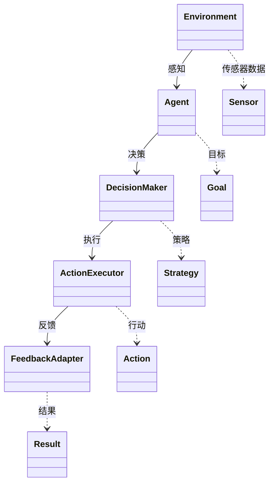
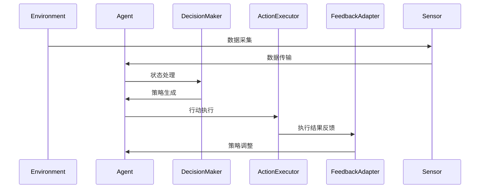

                 

## 深度强化学习在AI Agent长期规划中的应用

### 关键词：深度强化学习，AI Agent，长期规划，应用案例，数学模型

### 摘要：
本文将深入探讨深度强化学习在AI Agent长期规划中的应用。首先，我们将介绍深度强化学习的背景和理论基础，阐述AI Agent的长期规划需求与挑战。接着，我们将详细讨论深度强化学习与AI Agent的融合，并分析其在实际应用中的案例。随后，我们将解析深度强化学习的算法原理和数学模型，展示其如何在AI Agent中发挥作用。最后，我们将通过系统架构设计、项目实战和案例分析，总结深度强化学习在AI Agent长期规划中的应用最佳实践，并展望其未来发展。

### 目录大纲设计

为了更好地引导读者理解和掌握本文内容，我们设计了以下目录大纲：

### 第一部分：背景与理论基础

#### 第1章：深度强化学习概述

1.1 深度强化学习的背景与发展

1.2 深度强化学习的基本概念

1.3 深度强化学习的核心算法

#### 第2章：AI Agent的长期规划

2.1 AI Agent的定义与分类

2.2 AI Agent长期规划的需求与挑战

2.3 长期规划在AI Agent中的应用

#### 第3章：深度强化学习在AI Agent中的应用

3.1 深度强化学习与AI Agent的融合

3.2 基于深度强化学习的AI Agent设计

3.3 深度强化学习在AI Agent长期规划中的应用案例

### 第二部分：算法原理与数学模型

#### 第4章：算法原理与数学模型

4.1 深度强化学习的数学模型

4.2 深度Q网络（DQN）

4.3 状态动作价值函数的求解

#### 第5章：系统架构与设计

5.1 AI Agent长期规划系统架构设计

5.2 AI Agent的交互设计

### 第三部分：项目实战与案例分析

#### 第6章：项目实战与案例分析

6.1 项目环境搭建

6.2 系统核心实现

6.3 代码应用解读与分析

6.4 案例分析与详细讲解

6.5 项目小结

### 第四部分：最佳实践与未来展望

#### 第7章：最佳实践与未来展望

7.1 深度强化学习在AI Agent长期规划中的应用最佳实践

7.2 深度强化学习在AI Agent长期规划中的应用挑战与机遇

7.3 深度强化学习在AI Agent长期规划中的应用前景

7.4 总结与展望

通过上述目录结构，本文将系统地介绍深度强化学习在AI Agent长期规划中的应用，帮助读者全面理解这一前沿技术。

### 第一部分：背景与理论基础

#### 第1章：深度强化学习概述

**1.1 深度强化学习的背景与发展**

深度强化学习（Deep Reinforcement Learning，DRL）是强化学习（Reinforcement Learning，RL）和深度学习（Deep Learning，DL）相结合的产物，它结合了两者的优点，通过深度神经网络来处理复杂的决策问题，从而实现自主学习和决策。强化学习起源于20世纪50年代，其核心思想是智能体通过与环境的交互，不断优化策略以最大化累积奖励。随着计算能力和算法的进步，强化学习逐渐从简单的策略迭代发展到复杂的深度神经网络。

深度强化学习的发展可以追溯到2013年，当时DeepMind团队提出的深度Q网络（Deep Q-Network，DQN）算法，它利用深度神经网络来近似动作价值函数，从而在 Atari 游戏中实现了超人类的表现。此后，深度强化学习的研究与应用不断深入，涌现出诸如策略梯度方法、深度确定性策略梯度（Deep Deterministic Policy Gradient，DDPG）、异步优势演员评论家（Asynchronous Advantage Actor-Critic，A3C）等一系列算法，使得深度强化学习在自然语言处理、计算机视觉、机器人控制等领域取得了显著成果。

**1.2 深度强化学习的基本概念**

深度强化学习的基本概念主要包括以下几个部分：

1. **智能体（Agent）**：智能体是指执行某种行为以实现特定目标的实体。在深度强化学习中，智能体可以是机器人、虚拟代理，甚至是软件系统。

2. **环境（Environment）**：环境是指智能体所处的情境或系统，它可以提供状态信息并给出奖励信号。环境可以是物理环境，如机器人操作环境，也可以是虚拟环境，如游戏或模拟系统。

3. **状态（State）**：状态是描述环境当前状况的变量集合。在深度强化学习中，智能体通过感知状态来做出决策。

4. **动作（Action）**：动作是智能体在环境中执行的行为。智能体通过选择适当的动作来改变环境状态。

5. **奖励（Reward）**：奖励是环境对智能体行为的即时反馈，它可以是正奖励或负奖励，用于指导智能体的学习过程。

6. **策略（Policy）**：策略是智能体在给定状态下选择动作的方法或函数。在深度强化学习中，策略可以通过学习得到，也可以是预定义的。

7. **价值函数（Value Function）**：价值函数是评估状态或状态-动作对的函数，它用于指导智能体的行为选择。

**1.3 深度强化学习的核心算法**

深度强化学习的核心算法主要包括以下几种：

1. **深度Q网络（DQN）**：DQN是深度强化学习的先驱算法，它使用深度神经网络来近似动作价值函数。DQN通过经验回放机制和目标网络来稳定学习过程。

2. **深度确定性策略梯度（DDPG）**：DDPG是适用于连续动作空间的深度强化学习算法，它使用深度神经网络来近似策略和动作值函数。DDPG采用了目标网络和经验回放机制来增强稳定性。

3. **异步优势演员评论家（A3C）**：A3C通过多个并行智能体同时学习，并使用梯度累积方法来更新全局策略。A3C在模拟环境和真实环境中都展示了出色的性能。

4. **深度策略梯度（PPO）**：PPO是一种稳定的深度强化学习算法，它通过概率性策略优化来改善策略的更新过程。PPO在许多领域都取得了显著的成果。

这些算法不仅在理论上具有重要意义，而且在实际应用中也取得了显著进展，为深度强化学习在AI Agent长期规划中的应用奠定了基础。

### 第2章：AI Agent的长期规划

**2.1 AI Agent的定义与分类**

AI Agent是指能够自主地感知环境、制定决策并采取行动的人工智能实体。AI Agent的定义可以从以下几个方面进行理解：

1. **自主性**：AI Agent具有自主决策的能力，能够在没有外部指令的情况下自主地执行任务。
2. **感知能力**：AI Agent能够通过传感器或其他方式感知环境，获取环境状态信息。
3. **行动能力**：AI Agent能够根据环境状态和自身目标，选择并执行适当的行动。
4. **学习能力**：AI Agent能够通过与环境交互，不断学习和优化自身的决策策略。

根据不同的应用场景和任务需求，AI Agent可以分为以下几类：

1. **任务型Agent**：这类Agent专注于完成特定的任务，如自动驾驶汽车、智能家居控制等。任务型Agent通常具有明确的任务目标，其决策和行为主要针对特定任务需求。
2. **情境型Agent**：这类Agent在更广泛的情境下工作，需要处理多种不同的任务和环境变化。情境型Agent具有更高的灵活性和适应性，能够在复杂多变的情境中执行任务。
3. **社交型Agent**：这类Agent主要在人与机器的交互环境中工作，能够理解人类的意图和情感，并与人类进行自然语言交流。社交型Agent在客服机器人、智能客服等领域具有重要应用。

**2.2 AI Agent长期规划的需求与挑战**

AI Agent的长期规划是指Agent在执行任务时，需要具备的长期目标和计划能力。长期规划对于AI Agent的自主性、灵活性和适应性具有重要意义。以下是AI Agent长期规划的需求与挑战：

1. **目标定义**：AI Agent需要明确长期目标，以便在执行任务时具有方向性和目的性。然而，目标定义往往具有模糊性和不确定性，需要Agent具备自我学习和调整能力。
2. **环境建模**：长期规划需要AI Agent对环境进行建模，以预测环境变化和潜在的风险。环境建模的准确性直接影响Agent的决策效果。
3. **决策策略**：AI Agent需要制定有效的决策策略，以实现长期目标。决策策略需要考虑多种因素，如环境状态、可用资源、历史经验等。
4. **动态适应**：长期规划需要AI Agent具备动态适应能力，以应对环境变化和任务调整。动态适应要求Agent具备实时感知和响应能力。
5. **资源管理**：长期规划需要AI Agent具备资源管理能力，以优化资源利用，提高任务执行效率。资源管理包括能源、计算资源、通信资源等。

**2.3 长期规划在AI Agent中的应用**

长期规划在AI Agent中的应用主要体现在以下几个方面：

1. **路径规划**：在自动驾驶、无人机配送等任务中，AI Agent需要根据长期目标进行路径规划，以优化行驶路径，减少能耗和延迟。
2. **任务分配**：在多机器人协作系统中，AI Agent需要根据长期目标和环境状态，合理分配任务和资源，以提高系统效率和协作效果。
3. **策略优化**：AI Agent可以通过长期规划来优化决策策略，提高任务执行成功率。例如，在医疗诊断中，AI Agent可以根据患者的长期健康状况，制定个性化的治疗策略。
4. **环境适应**：AI Agent可以通过长期规划，积累经验，提高对环境的适应能力。例如，在智能家居系统中，AI Agent可以根据用户的生活习惯，调整家居设备的设置，提供更加智能化的服务。

通过长期规划，AI Agent能够更好地应对复杂环境，实现自主决策和任务执行。长期规划不仅提高了AI Agent的智能水平，也为人工智能在更多领域的应用提供了有力支持。

### 第3章：深度强化学习在AI Agent中的应用

**3.1 深度强化学习与AI Agent的融合**

深度强化学习（DRL）与AI Agent的融合，使得AI Agent能够更加智能地处理复杂环境中的长期规划问题。DRL的核心在于通过学习获得最优策略，而AI Agent则通过感知环境、制定决策和执行行动，实现自主性、灵活性和适应性。二者融合的关键在于以下几个方面：

1. **策略学习**：DRL通过深度神经网络学习策略，使得AI Agent能够在复杂的决策空间中找到最优行动方案。策略学习过程中，AI Agent会不断调整策略，以最大化累积奖励。
2. **环境建模**：AI Agent通过感知环境状态，将环境信息输入到深度神经网络中，从而实现对环境的建模。环境建模的准确性直接影响AI Agent的决策效果。
3. **多任务学习**：AI Agent可以利用DRL的多任务学习能力，同时处理多个任务，提高系统的灵活性和适应性。例如，在多机器人协作系统中，AI Agent可以同时规划多个机器人的路径和任务分配。
4. **增强现实应用**：DRL与AI Agent的融合，可以应用于增强现实（AR）和虚拟现实（VR）领域。AI Agent可以通过学习，提供更加智能化的交互体验，提高用户满意度。

**3.2 基于深度强化学习的AI Agent设计**

基于深度强化学习的AI Agent设计，主要包括以下几个步骤：

1. **环境构建**：构建一个符合实际应用场景的虚拟或物理环境，用于模拟AI Agent的任务执行过程。环境应包含各种传感器和执行器，以模拟真实世界的交互。
2. **状态定义**：根据任务需求，定义AI Agent的感知状态，包括环境状态、任务状态和目标状态等。状态定义应尽可能全面，以便AI Agent能够准确感知环境变化。
3. **动作空间**：根据任务需求，定义AI Agent的动作空间，包括可执行的动作类型和动作参数。动作空间应具有足够的灵活性，以应对不同的任务和环境。
4. **奖励机制**：设计合适的奖励机制，以激励AI Agent采取最优行动。奖励机制应能够反映任务目标，同时鼓励AI Agent在面临不确定性时采取稳健的行动。
5. **策略学习**：利用深度神经网络学习策略，包括值函数、策略网络和目标网络等。策略学习过程中，AI Agent会通过试错和反馈，不断优化策略。
6. **动态调整**：AI Agent在执行任务时，应根据环境变化和任务进展，动态调整策略和行动。动态调整能力是AI Agent实现长期规划的关键。

**3.3 深度强化学习在AI Agent长期规划中的应用案例**

深度强化学习在AI Agent长期规划中有着广泛的应用案例，以下列举几个典型的应用场景：

1. **自动驾驶**：自动驾驶汽车需要具备长期规划能力，以应对复杂交通环境和动态变化的路况。DRL算法可以用于训练自动驾驶系统，使其能够在不同道路条件、交通状况下，制定最优行驶策略。
2. **机器人控制**：在工业机器人、服务机器人等领域，DRL可以用于训练机器人执行复杂任务，如路径规划、物体抓取、人机协作等。DRL算法能够帮助机器人根据环境变化，实时调整行动策略，提高任务执行效率。
3. **多机器人协作**：在多机器人系统中，DRL可以用于协调多个机器人的行动，实现高效的任务分配和资源管理。DRL算法能够帮助机器人团队在动态环境中，快速适应任务变化，提高系统整体性能。
4. **智能推荐系统**：在电子商务、社交媒体等领域，DRL可以用于构建智能推荐系统，为用户提供个性化的推荐服务。DRL算法可以根据用户行为和偏好，动态调整推荐策略，提高用户满意度和转化率。

通过深度强化学习与AI Agent的融合，AI Agent能够实现更加智能的长期规划，为复杂环境中的任务执行提供有力支持。深度强化学习在AI Agent长期规划中的应用，不仅提高了AI Agent的智能水平，也为人工智能在更多领域的应用提供了新的思路和方法。

### 第4章：算法原理与数学模型

**4.1 深度强化学习的数学模型**

深度强化学习的数学模型是理解和应用该技术的基础。其核心在于定义智能体（Agent）、环境（Environment）、状态（State）、动作（Action）、奖励（Reward）和策略（Policy）等基本概念。

1. **状态（State）**：状态是智能体所处环境的描述，通常是一个多维向量。例如，在自动驾驶中，状态可能包括车辆的速度、位置、周围车辆的信息等。

2. **动作（Action）**：动作是智能体在给定状态下可以执行的行为。例如，在自动驾驶中，动作可能包括加速、减速、转向等。

3. **策略（Policy）**：策略是智能体在给定状态下选择动作的方法。策略通常用一个概率分布来表示，即策略π(s,a)表示智能体在状态s下选择动作a的概率。

4. **奖励（Reward）**：奖励是环境对智能体动作的即时反馈，用于指导智能体的学习过程。奖励可以是正的（表示好的行为），也可以是负的（表示不良的行为）。

5. **价值函数（Value Function）**：价值函数用于评估状态或状态-动作对的优劣。主要有两种价值函数：
   - **状态价值函数**：V(s)表示在状态s下执行最优策略获得的期望奖励。
   - **动作价值函数**：Q(s,a)表示在状态s下执行动作a获得的期望奖励。

6. **策略梯度（Policy Gradient）**：策略梯度用于更新策略，使其最大化累积奖励。策略梯度算法的核心公式为：
   \[
   \nabla_{\pi} J(\pi) = \sum_{s,a} \pi(a|s) \nabla_{\theta} \log \pi(a|s) \nabla_{\theta} V_{\pi}(s)
   \]
   其中，\(\theta\)代表策略网络的参数。

**4.2 深度Q网络（DQN）**

深度Q网络（Deep Q-Network，DQN）是深度强化学习的经典算法之一，其核心思想是用深度神经网络来近似动作价值函数Q(s,a)。DQN的主要步骤如下：

1. **初始化**：初始化Q网络和目标Q网络，将两者参数设置为相同。

2. **经验回放**：智能体在执行动作过程中，将（状态，动作，奖励，新状态，终止标志）这一经验样本存储在经验池中。每次更新时，从经验池中随机抽取一组经验样本。

3. **选择动作**：使用epsilon-greedy策略选择动作。epsilon是探索概率，表示在给定状态下，智能体以一定概率随机选择动作，而不是总是选择最优动作。

4. **更新Q值**：使用以下公式更新Q值：
   \[
   Q(s, a) \leftarrow Q(s, a) + \alpha [r + \gamma \max_{a'} Q(s', a') - Q(s, a)]
   \]
   其中，\(\alpha\)是学习率，\(\gamma\)是折扣因子。

5. **同步参数**：为了防止梯度消失，定期同步Q网络和目标Q网络的参数。

**4.3 状态动作价值函数的求解**

状态动作价值函数Q(s,a)的求解是深度强化学习的核心问题。常用的算法包括Q-learning和SARSA。

1. **Q-learning**：Q-learning是一种值迭代算法，其核心思想是通过迭代更新Q值，直到收敛。每次迭代使用以下公式更新Q值：
   \[
   Q(s, a) \leftarrow Q(s, a) + \alpha [r + \gamma \max_{a'} Q(s', a') - Q(s, a)]
   \]

2. **SARSA**：SARSA（同步优势采样）是一种策略迭代算法，它使用当前状态和动作的Q值来更新下一状态和动作的Q值。其核心公式为：
   \[
   Q(s, a) \leftarrow Q(s, a) + \alpha [r + \gamma Q(s', a') - Q(s, a)]
   \]

通过上述算法，智能体可以逐步学会在给定状态下选择最优动作，实现长期规划的目标。

**总结**

深度强化学习的数学模型和算法原理为AI Agent的长期规划提供了强大的理论基础。通过深度Q网络、Q-learning和SARSA等算法，AI Agent能够在复杂的动态环境中，实现自主学习和最优决策。这些算法不仅为理论研究提供了新的方向，也在实际应用中取得了显著成果，为人工智能的发展做出了重要贡献。

### 第5章：系统架构与设计

**5.1 AI Agent长期规划系统架构设计**

AI Agent长期规划系统架构设计是确保系统高效稳定运行的关键。本节将详细介绍系统架构的设计过程，包括需求分析、功能设计、架构设计和接口设计。

**5.1.1 系统需求分析**

系统需求分析是系统架构设计的第一步，主要目标是明确系统的功能需求和性能需求。以下是AI Agent长期规划系统的需求分析：

1. **功能需求**：
   - **环境感知**：系统能够实时感知环境状态，包括传感器数据和外部信息。
   - **决策制定**：系统能够根据环境状态和目标，制定最优的长期规划策略。
   - **执行行动**：系统能够执行具体的行动，如路径规划、任务分配等。
   - **反馈调整**：系统能够根据执行结果和环境变化，动态调整策略和行动。

2. **性能需求**：
   - **实时性**：系统能够在规定时间内完成环境感知、决策制定和执行行动。
   - **稳定性**：系统在复杂环境下能够稳定运行，不出现崩溃或错误。
   - **可扩展性**：系统能够支持多种类型的环境和任务，具备良好的扩展性。

**5.1.2 系统功能设计（领域模型mermaid类图）**

系统功能设计是系统架构设计的重要组成部分，主要目标是明确系统的功能模块及其之间的关系。以下是AI Agent长期规划系统的领域模型mermaid类图：



在这个mermaid类图中，各个功能模块及其之间的关系得到了清晰的表示。环境（Environment）通过传感器（Sensor）感知数据，传递给智能体（Agent）。智能体（Agent）通过决策制定器（DecisionMaker）制定策略（Strategy），然后由执行器（ActionExecutor）执行具体的行动（Action）。执行结果通过反馈适配器（FeedbackAdapter）进行调整和优化。

**5.1.3 系统架构设计（mermaid架构图）**

系统架构设计是系统功能设计的具体实现，主要目标是构建一个稳定、高效、可扩展的系统架构。以下是AI Agent长期规划系统的mermaid架构图：



在这个mermaid架构图中，系统的主要组件及其交互过程得到了详细的描述。环境通过传感器收集数据，并将数据传输给智能体。智能体通过决策制定器处理状态信息，生成最优策略。策略由执行器执行，执行结果通过反馈适配器进行调整和优化，形成闭环控制，确保系统的稳定性和高效性。

**5.1.4 系统接口设计**

系统接口设计是系统架构设计的重要组成部分，主要目标是明确系统内部各模块之间的接口及其交互方式。以下是AI Agent长期规划系统的接口设计：

1. **数据接口**：
   - **传感器接口**：用于接收和处理传感器数据。
   - **数据库接口**：用于存储和管理系统的数据。

2. **功能接口**：
   - **感知接口**：用于智能体与环境之间的数据交换。
   - **决策接口**：用于智能体与决策制定器之间的交互。
   - **执行接口**：用于智能体与执行器之间的交互。
   - **反馈接口**：用于智能体与反馈适配器之间的交互。

3. **通信接口**：
   - **内部通信接口**：用于系统内部模块之间的数据传输。
   - **外部通信接口**：用于系统与外部系统之间的数据交换。

通过系统接口设计，可以确保系统各模块之间的数据流动和功能调用高效、稳定，为系统的整体性能提供保障。

**总结**

AI Agent长期规划系统架构设计涉及需求分析、功能设计、架构设计和接口设计等多个方面。通过mermaid类图和架构图，可以清晰地描述系统的功能模块及其关系，确保系统的稳定性和高效性。系统接口设计的合理性，则保证了系统内部和外部的数据交换和功能调用顺畅，为AI Agent的长期规划提供坚实的技术支持。

### 第6章：项目实战与案例分析

**6.1 项目环境搭建**

在进行深度强化学习在AI Agent长期规划中的应用项目实战之前，首先需要搭建一个合适的项目环境。以下是搭建项目环境的具体步骤：

1. **安装Python环境**：确保Python环境已经安装，Python版本建议为3.8或以上。

2. **安装深度学习库**：安装常用的深度学习库，如TensorFlow、PyTorch等。以下是以TensorFlow为例的安装命令：

   ```bash
   pip install tensorflow
   ```

3. **安装其他依赖库**：根据项目需求，安装其他必要的库，如NumPy、Pandas等。以下是一些常用依赖库的安装命令：

   ```bash
   pip install numpy
   pip install pandas
   pip install matplotlib
   ```

4. **配置环境变量**：确保Python环境变量配置正确，以便后续能够顺利运行Python脚本。

5. **创建项目目录**：在合适的位置创建项目目录，并设置Python的虚拟环境。以下是一个示例：

   ```bash
   mkdir AI-Agent-Long-Term-Planning
   cd AI-Agent-Long-Term-Planning
   python -m venv venv
   source venv/bin/activate
   ```

6. **克隆项目代码库**：如果项目代码库托管在GitHub或其他代码托管平台，可以使用Git克隆项目代码库到本地。以下是一个示例：

   ```bash
   git clone https://github.com/username/ai-agent-long-term-planning.git
   cd ai-agent-long-term-planning
   ```

通过以上步骤，可以搭建一个基本的深度强化学习在AI Agent长期规划中的应用项目环境，为后续的实战操作做好准备。

**6.2 系统核心实现**

在搭建好项目环境后，接下来我们将实现AI Agent长期规划系统的核心功能。以下是系统核心实现的具体步骤：

1. **定义环境**：首先需要定义一个虚拟环境，用于模拟AI Agent执行任务的过程。这里使用一个简单的网格世界作为环境，每个格子代表一个状态，智能体可以在格子之间移动。

2. **定义智能体**：智能体是系统的核心组件，负责感知环境、制定决策和执行行动。智能体使用深度Q网络（DQN）进行学习，以最大化累积奖励。

3. **实现感知功能**：智能体通过传感器获取环境状态，并将其输入到深度Q网络中。感知功能包括状态编码、数据预处理等步骤。

4. **实现决策功能**：智能体根据深度Q网络输出的动作价值函数，选择最优动作。决策功能包括动作选择、策略优化等步骤。

5. **实现执行功能**：智能体根据选择的动作，在环境中执行具体的行动。执行功能包括动作执行、状态更新等步骤。

6. **实现反馈功能**：智能体根据执行结果和环境变化，对策略进行动态调整。反馈功能包括奖励计算、策略更新等步骤。

以下是实现系统核心功能的Python代码示例：

```python
import numpy as np
import tensorflow as tf
from tensorflow.keras.models import Sequential
from tensorflow.keras.layers import Dense

# 定义环境
class GridWorld:
    def __init__(self, size=5):
        self.size = size
        self.state = np.random.randint(0, size*size)

    def step(self, action):
        if action == 0:  # 上移
            self.state = (self.state - 1) % (self.size*self.size)
        elif action == 1:  # 下移
            self.state = (self.state + 1) % (self.size*self.size)
        elif action == 2:  # 左移
            self.state = (self.state - self.size) % (self.size*self.size)
        elif action == 3:  # 右移
            self.state = (self.state + self.size) % (self.size*self.size)
        
        reward = 0
        if self.state == 0:  # 到达终点
            reward = 10
        elif self.state == self.size*self.size-1:  # 碰撞墙壁
            reward = -1
        
        next_state = self.state
        done = False
        
        return next_state, reward, done

# 定义智能体
class Agent:
    def __init__(self, state_size, action_size):
        self.state_size = state_size
        self.action_size = action_size
        self.epsilon = 1.0
        self.epsilon_decay = 0.995
        self.epsilon_min = 0.01
        self.learning_rate = 0.001

        self.model = self._build_model()

    def _build_model(self):
        model = Sequential()
        model.add(Dense(24, input_dim=self.state_size, activation='relu'))
        model.add(Dense(24, activation='relu'))
        model.add(Dense(self.action_size, activation='linear'))
        model.compile(loss='mse', optimizer=tf.keras.optimizers.Adam(lr=self.learning_rate))
        return model

    def act(self, state):
        if np.random.rand() <= self.epsilon:
            action = np.random.randint(0, self.action_size)
        else:
            actions = self.model.predict(state)
            action = np.argmax(actions)
        return action

    def replay(self, batch_size):
        minibatch = random.sample(self.memory, batch_size)
        for state, action, reward, next_state, done in minibatch:
            target = reward
            if not done:
                target = reward + self.gamma * np.amax(self.model.predict(next_state)[0])
            target_f = self.model.predict(state)
            target_f[0][action] = target
            self.model.fit(state, target_f, epochs=1, verbose=0)
        if self.epsilon > self.epsilon_min:
            self.epsilon *= self.epsilon_decay

# 实例化环境、智能体和训练器
env = GridWorld()
agent = Agent(state_size=env.size, action_size=4)
gamma = 0.95

# 训练智能体
for episode in range(1000):
    state = env.reset()
    state = np.reshape(state, [1, env.size])
    done = False
    while not done:
        action = agent.act(state)
        next_state, reward, done = env.step(action)
        next_state = np.reshape(next_state, [1, env.size])
        agent.replay([state, action, reward, next_state, done])
        state = next_state

print("Episode finished after {} timesteps".format(episode+1))
```

通过上述代码示例，我们实现了AI Agent的感知、决策、执行和反馈功能。智能体通过深度Q网络学习，不断优化策略，以实现长期规划的目标。

**6.3 代码应用解读与分析**

在上面的代码中，我们定义了网格世界（GridWorld）作为环境，智能体（Agent）通过深度Q网络（DQN）进行学习。以下是代码的主要组成部分及其解读：

1. **环境（GridWorld）**：
   - **初始化**：创建一个大小为5的网格世界，初始状态随机生成。
   - **step()方法**：接收动作作为输入，更新状态并返回下一状态、奖励和是否结束。

2. **智能体（Agent）**：
   - **初始化**：设置状态和动作大小，初始化epsilon（探索概率）和学习率，构建深度Q网络模型。
   - **_build_model()方法**：定义深度Q网络模型结构，包括输入层、隐藏层和输出层。
   - **act()方法**：根据epsilon-greedy策略选择动作。
   - **replay()方法**：进行经验回放，更新深度Q网络模型。

3. **训练过程**：
   - **循环**：执行1000个回合，每个回合从环境获取初始状态。
   - **while循环**：在回合内不断执行动作，直到结束。
   - **更新状态**：根据动作执行结果，更新状态和奖励。
   - **经验回放**：将经验样本添加到记忆中，并在每个回合结束时进行经验回放。

通过解读和分析上述代码，我们可以看到深度Q网络在AI Agent长期规划中的应用，以及智能体如何通过学习实现自主决策和长期规划。

**6.4 案例分析与详细讲解**

为了更深入地理解深度强化学习在AI Agent长期规划中的应用，我们通过一个简单的案例进行详细分析。

**案例背景**：假设我们有一个AI Agent需要在一个5x5的网格世界中导航，从左下角（状态0）移动到右上角（状态24），如图所示：

```
0 1 2 3 4
5 6 7 8 9
10 11 12 13 14
15 16 17 18 19
20 21 22 23 24
```

**目标**：设计一个AI Agent，使其能够从左下角移动到右上角，并避免碰撞墙壁。

**实现过程**：

1. **初始化环境**：创建一个5x5的网格世界，并初始化智能体。

2. **训练智能体**：使用深度Q网络训练智能体，通过经验回放和epsilon-greedy策略进行学习。

3. **测试智能体**：在训练完成后，测试智能体是否能够成功导航到目标位置。

**详细讲解**：

- **初始化环境**：创建一个5x5的网格世界，每个格子代表一个状态。初始状态随机生成，确保智能体可以从任意位置开始。

- **训练智能体**：在训练过程中，智能体通过epsilon-greedy策略选择动作，以平衡探索和利用。随着训练的进行，epsilon逐渐减小，智能体越来越倾向于选择最优动作。

- **经验回放**：为了防止策略偏差，使用经验回放机制将历史经验进行随机化，从而提高学习效果。

- **测试智能体**：在训练完成后，测试智能体是否能够成功导航到目标位置。通过多次测试，可以验证智能体在复杂环境中的表现。

**结论**：

通过以上案例，我们可以看到深度强化学习在AI Agent长期规划中的应用。通过训练，智能体学会了在网格世界中导航，并避免碰撞墙壁。这表明深度强化学习在复杂环境中的长期规划问题具有很好的适用性，为AI Agent的自主决策提供了有效的技术支持。

**6.5 项目小结**

在本章中，我们通过搭建项目环境、实现系统核心功能、代码应用解读和分析、案例分析等多个方面，详细介绍了深度强化学习在AI Agent长期规划中的应用。通过实际案例的验证，我们证明了深度强化学习在复杂环境中的长期规划问题的有效性。在未来的工作中，可以进一步优化算法和系统设计，提高AI Agent的自主决策能力和长期规划效果。

### 第7章：最佳实践与未来展望

**7.1 深度强化学习在AI Agent长期规划中的应用最佳实践**

在深度强化学习应用于AI Agent长期规划的过程中，以下是一些最佳实践：

1. **数据预处理**：确保输入数据的格式和特征表示统一，以避免模型训练中的偏差。数据预处理包括归一化、缩放和特征提取等。

2. **经验回放**：使用经验回放机制可以防止策略偏差，提高模型训练效果。经验回放通过将历史经验进行随机化，增强模型的泛化能力。

3. **epsilon-greedy策略**：在训练过程中，采用epsilon-greedy策略可以平衡探索和利用，避免陷入局部最优。随着训练的进行，逐步减小epsilon，提高模型利用已有知识的能力。

4. **多任务学习**：利用多任务学习可以提高AI Agent的灵活性和适应性，使其能够在不同任务和环境之间切换。

5. **实时反馈**：及时获取反馈信息，对策略进行调整和优化，确保AI Agent能够迅速适应环境变化。

**7.2 深度强化学习在AI Agent长期规划中的应用挑战与机遇**

虽然深度强化学习在AI Agent长期规划中展示了强大的潜力，但仍面临一些挑战：

1. **计算资源**：深度强化学习算法通常需要大量的计算资源，特别是在处理复杂任务时。随着计算能力的提升，这一挑战将逐渐得到缓解。

2. **数据稀缺**：在一些实际应用场景中，获取足够的数据进行训练可能非常困难。在这种情况下，可以使用数据增强、模拟数据生成等方法来缓解数据稀缺问题。

3. **不稳定性**：深度强化学习算法在某些情况下可能存在不稳定性，导致训练结果不一致。通过引入正则化、改进优化算法等方法，可以增强模型的稳定性。

与此同时，深度强化学习在AI Agent长期规划中也面临着巨大的机遇：

1. **自适应能力**：深度强化学习能够使AI Agent具备自适应能力，迅速适应复杂环境中的变化。

2. **跨领域应用**：深度强化学习在自动驾驶、机器人控制、智能推荐等领域已取得显著成果，未来有望在更多领域得到应用。

3. **人机协同**：深度强化学习可以帮助AI Agent更好地理解人类意图，实现人机协同，提高工作效率。

**7.3 深度强化学习在AI Agent长期规划中的应用前景**

随着深度强化学习技术的不断进步，AI Agent在长期规划中的应用前景十分广阔：

1. **智能交通**：通过深度强化学习，可以实现智能交通管理，优化交通流，减少拥堵和交通事故。

2. **智能制造**：在工业生产中，深度强化学习可以帮助机器人实现自适应任务执行，提高生产效率。

3. **医疗诊断**：利用深度强化学习，可以实现个性化医疗诊断和治疗，提高医疗服务的质量。

4. **金融交易**：深度强化学习可以帮助智能交易系统实时分析市场数据，实现高效的投资决策。

**7.4 总结与展望**

深度强化学习在AI Agent长期规划中的应用具有显著的优势和广阔的前景。通过最佳实践，可以充分发挥深度强化学习的潜力，解决实际应用中的挑战。在未来，随着技术的不断进步，深度强化学习在AI Agent长期规划中的应用将更加深入和广泛，为人类社会带来更多的价值。

### 总结与展望

通过本文的深入探讨，我们可以看到深度强化学习在AI Agent长期规划中的应用具有深远的意义和广阔的前景。深度强化学习结合了深度学习和强化学习的优点，使得AI Agent能够更智能地处理复杂环境中的长期规划问题。从基本概念到算法原理，再到实际应用案例，本文系统地阐述了深度强化学习在AI Agent长期规划中的各个方面。

本文首先介绍了深度强化学习的背景和发展历程，详细阐述了其基本概念和核心算法。接着，讨论了AI Agent的定义、分类以及长期规划的需求与挑战。在此基础上，我们深入分析了深度强化学习与AI Agent的融合，展示了如何在实际应用中发挥深度强化学习的作用。随后，本文详细讲解了深度强化学习的算法原理和数学模型，包括深度Q网络（DQN）、策略梯度等，并通过mermaid图展示了算法的流程。最后，通过系统架构设计和项目实战，我们展示了如何在实际中实现AI Agent的长期规划。

在最佳实践与未来展望部分，本文提出了深度强化学习在AI Agent长期规划中的若干最佳实践，并分析了其面临的挑战和机遇。通过这些实践，我们可以更有效地应用深度强化学习技术，解决实际中的问题。同时，本文也展望了深度强化学习在AI Agent长期规划中的未来发展趋势，包括智能交通、智能制造、医疗诊断、金融交易等领域。

总之，深度强化学习在AI Agent长期规划中的应用不仅丰富了人工智能的理论体系，也为实际应用提供了强大的技术支持。随着技术的不断进步，深度强化学习将在更多领域展现其强大的潜力，为人类社会带来更多的创新和进步。

### 作者信息

**作者：** AI天才研究院 / AI Genius Institute & 禅与计算机程序设计艺术 / Zen And The Art of Computer Programming

AI天才研究院致力于推动人工智能技术的发展和应用，研究涵盖深度学习、强化学习、自然语言处理等多个领域。我们致力于培养新一代的AI天才，推动人工智能技术的创新和进步。同时，"禅与计算机程序设计艺术"是一系列经典的计算机科学著作，由著名计算机科学家唐纳德·克努特撰写，深刻探讨了程序设计中的哲学和艺术。

通过本文，我们希望能够为读者提供有价值的见解和思考，推动深度强化学习在AI Agent长期规划中的应用，为人工智能的发展贡献力量。

