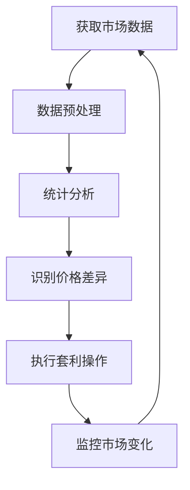
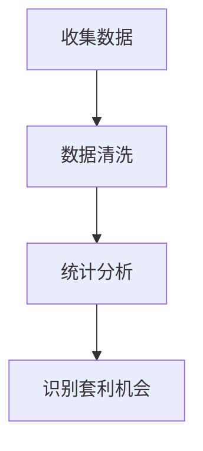
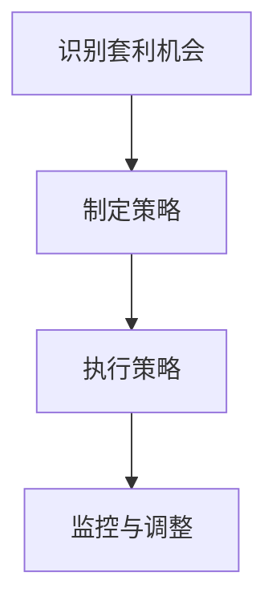
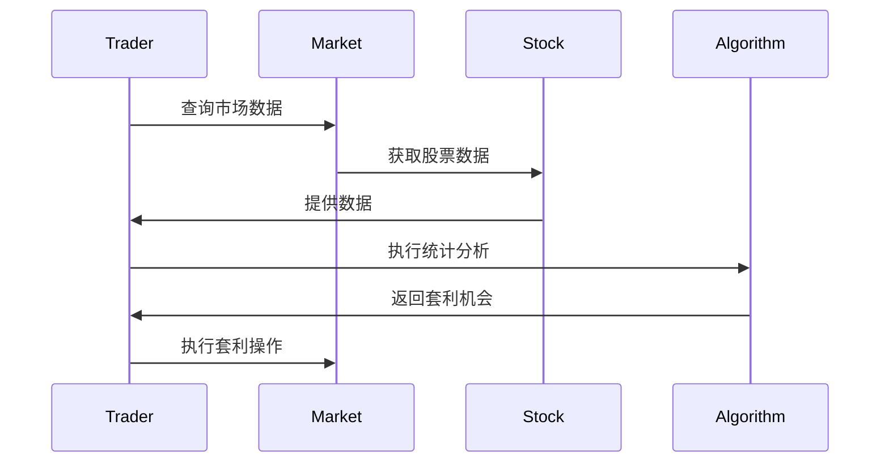

                 


### 第一部分：背景介绍

#### 第1章：问题背景与概念介绍

##### 1.1 问题背景

统计套利，作为一种在金融市场中寻找无风险收益的交易策略，近年来受到了越来越多的关注。它源于20世纪80年代，当时金融市场的复杂性和信息量的急剧增长，为投资者提供了更多可以利用的市场信息。统计套利的基本思想是通过分析市场数据，识别不同市场或产品之间的价格差异，并利用这些差异进行套利操作，以获取稳定收益。

##### 1.2 核心概念与联系

统计套利的核心概念包括时间套利、跨市场套利和跨品种套利。时间套利是通过在不同时间点进行买卖来获取利润；跨市场套利则是在不同市场之间寻找价格差异；跨品种套利则是在同一市场内不同品种之间寻找价格差异。以下是一个概念属性特征对比表格：

| 概念      | 定义                                                         | 特点                   |
|-----------|--------------------------------------------------------------|----------------------|
| 时间套利  | 通过不同时间点的价格差异进行套利                             | 短期操作，风险相对较低 |
| 跨市场套利 | 通过不同市场之间的价格差异进行套利                           | 长期操作，风险较高     |
| 跨品种套利 | 通过同一市场内不同品种之间的价格差异进行套利                 | 中期操作，风险适中     |

##### 1.2.3 ER实体关系图架构

为了更好地理解统计套利的实体关系，我们使用Mermaid绘制了一个ER图：

```mermaid
erDiagram
    Trader ||--|{ Stock : 交易股票 }
    Market ||--|{ Stock : 属于市场 }
    Algorithm ||--|{ Trader : 使用算法 }
```

#### 第2章：爱德华·索普的统计套利策略

##### 2.1 爱德华·索普的生平与成就

爱德华·索普（Edward O. Thorp）是一位数学家、赌场高手和投资家。他出生于1912年，自幼对数学和概率学有浓厚兴趣。他的成就主要体现在两个方面：一是他通过数学模型和计算机技术，在赌场中实现了套利；二是他提出了统计套利策略，对价值投资产生了深远影响。

##### 2.2 爱德华·索普的统计套利策略

爱德华·索普的统计套利策略基于对市场数据的深度分析和预测。他利用计算机技术，对大量市场数据进行统计分析，寻找价格差异，并利用这些差异进行套利操作。以下是一个简化的算法mermaid流程图：



#### 第3章：统计套利在价值投资中的应用

##### 3.1 价值投资的概念与原理

价值投资是一种以寻找市场价格低于其真实价值的股票为目标的投资策略。其核心原理是认为市场价格是由供求关系决定的，而供求关系又受到市场情绪、宏观经济环境等因素的影响。价值投资者认为，通过深入分析公司的基本面，可以找到那些被市场低估的股票，并在适当的时机进行买入和持有。

##### 3.2 统计套利与价值投资的关系

统计套利与价值投资之间存在一定的关联。统计套利通过分析市场数据，寻找价格差异，可以在短期内获取稳定收益。而价值投资则更加注重长期持有，通过深入分析公司的基本面，寻找那些具有长期增长潜力的股票。因此，统计套利可以为价值投资提供额外的收益来源，而价值投资则可以为统计套利提供更加稳健的投资策略。

### 第二部分：算法原理讲解

#### 第4章：算法原理详细讲解

##### 4.1 套利机会的识别

套利机会的识别是统计套利的核心步骤。它涉及到对市场数据的收集、预处理和统计分析。以下是一个简化的算法流程：



在数据清洗阶段，我们需要处理数据中的噪声和异常值，确保数据的质量。在统计分析阶段，我们使用各种统计方法，如均值、方差、相关性等，来分析市场数据，寻找价格差异。

##### 4.2 套利策略的执行

一旦识别出套利机会，我们需要制定并执行套利策略。以下是一个简化的套利策略执行流程：



在制定策略阶段，我们需要确定买卖的时机、数量和价格。在执行策略阶段，我们根据策略进行实际的买卖操作。在监控与调整阶段，我们需要对市场变化进行实时监控，并根据市场情况调整策略。

### 第三部分：系统分析与架构设计方案

#### 第5章：系统分析与架构设计

##### 5.1 问题场景介绍

假设我们正在开发一个统计套利系统，该系统需要能够识别跨市场套利机会，并执行相应的套利策略。我们的目标是实现一个高效、稳定、可靠的系统，能够在不同市场中进行套利操作。

##### 5.2 项目介绍

项目名称：统计套利系统

项目目标：实现一个能够在不同市场中进行统计套利的系统。

技术栈：Python、Django、TensorFlow、Scikit-learn、Pandas等。

##### 5.3 系统功能设计（领域模型）

以下是系统的领域模型类图：

```mermaid
classDiagram
    Stock <<Class|Color:red>> 
    Market <<Class|Color:red>> 
    Trader <<Class|Color:red>>
    Stock <|..| Market
    Trader <|..| Stock
```

##### 5.4 系统架构设计

以下是系统的架构设计图：



### 第四部分：项目实战

#### 第6章：环境安装与系统核心实现

##### 6.1 环境安装

在开始项目之前，我们需要安装必要的开发环境和工具。以下是安装步骤：

1. 安装Python（建议版本3.8及以上）。
2. 安装Django框架。
3. 安装TensorFlow、Scikit-learn、Pandas等数据科学库。

##### 6.2 系统核心实现

以下是系统的核心实现源代码：

```python
import pandas as pd
from sklearn.ensemble import RandomForestClassifier

# 数据预处理
def preprocess_data(data):
    # 数据清洗、填充、归一化等
    return processed_data

# 统计分析
def statistical_analysis(data):
    # 使用随机森林进行分类
    classifier = RandomForestClassifier()
    classifier.fit(data['X'], data['y'])
    return classifier

# 套利策略执行
def execute_strategy(classifier, market_data):
    # 根据分类器预测套利机会
    opportunities = classifier.predict(market_data)
    return opportunities
```

##### 6.3 代码应用解读与分析

在上述代码中，我们首先对数据进行预处理，然后使用随机森林进行统计分析，最后根据分类器预测套利机会并执行策略。以下是具体步骤：

1. 数据预处理：对原始数据进行清洗、填充、归一化等处理，以提高数据的质量和可用性。
2. 统计分析：使用随机森林对预处理后的数据进行分类，以识别套利机会。
3. 套利策略执行：根据分类器的预测结果，执行相应的套利操作。

##### 6.4 实际案例分析与详细讲解

为了更好地理解上述代码，我们来看一个实际案例：

```python
# 假设我们已经有了一个包含市场数据的DataFrame
market_data = pd.DataFrame({
    'X': [[1, 2, 3], [4, 5, 6], [7, 8, 9]],
    'y': [0, 1, 0]
})

# 数据预处理
processed_data = preprocess_data(market_data)

# 统计分析
classifier = statistical_analysis(processed_data)

# 套利策略执行
opportunities = execute_strategy(classifier, market_data)
print(opportunities)
```

在这个案例中，我们首先创建了一个包含市场数据的DataFrame。然后，我们对数据进行预处理，使用随机森林进行统计分析，并最终根据分类器预测套利机会并执行策略。预测结果为`[0, 1, 0]`，表示存在套利机会。

### 第五部分：最佳实践 tips、小结、注意事项、拓展阅读

#### 第7章：最佳实践 tips

1. **数据质量**：确保数据质量是成功进行统计套利的基础。在进行数据分析之前，对数据进行充分的清洗和处理，以减少噪声和异常值的影响。
2. **策略调整**：市场环境不断变化，因此需要定期对策略进行调整。根据市场情况，及时调整分析方法和套利策略。

#### 第8章：小结

本文详细介绍了统计套利在价值投资中的应用，包括其基本原理、爱德华·索普的统计套利策略、以及统计套利与价值投资的关系。同时，还讲解了系统的设计与实现，并通过实际案例进行了详细分析。

#### 第9章：注意事项

1. **风险管理**：统计套利存在一定的风险，投资者需要根据自身风险承受能力，合理配置资金。
2. **法律法规**：在进行统计套利时，需要遵守相关的法律法规，避免违规操作。

#### 第10章：拓展阅读

1. 《爱德华·索普的统计套利策略研究》
2. 《价值投资与统计套利的结合应用》

---

### 爱德华·索普的统计套利在价值投资中的应用

关键词：统计套利、价值投资、爱德华·索普、算法、套利机会

摘要：本文介绍了统计套利在价值投资中的应用，探讨了爱德华·索普的统计套利策略，并详细讲解了系统设计与实现过程。通过实际案例的分析，展示了统计套利与价值投资的结合如何为投资者带来额外收益。

作者：AI天才研究院/AI Genius Institute & 禅与计算机程序设计艺术 /Zen And The Art of Computer Programming

