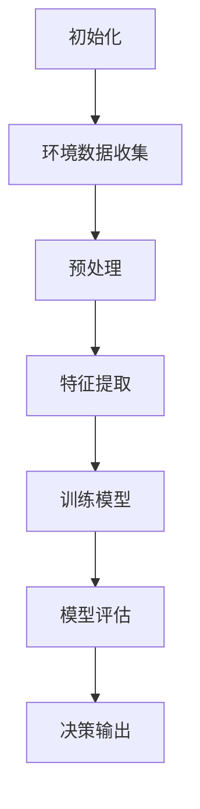
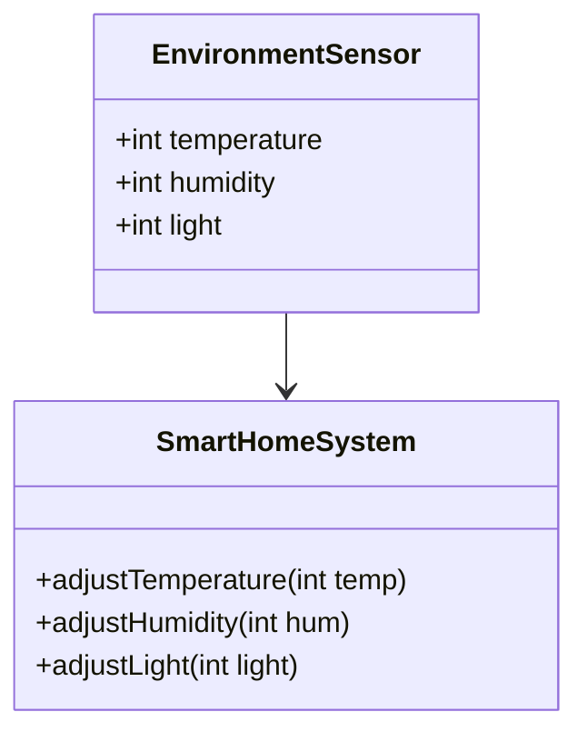
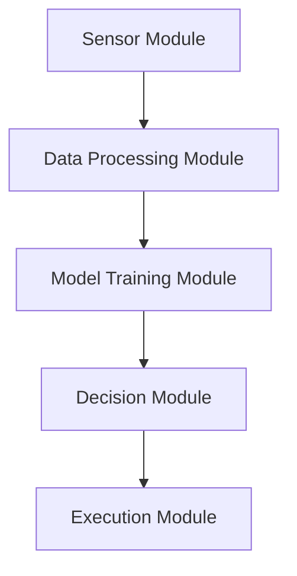
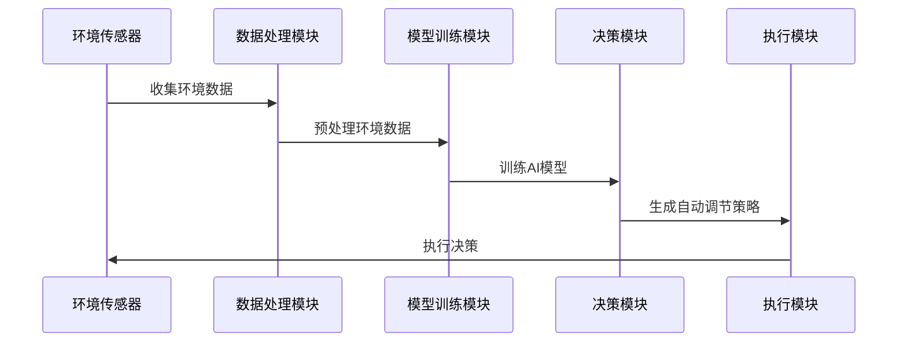

                 

# 环境感知AI Agent：增强LLM的实时情境适应性

## 关键词

- 环境感知
- AI Agent
- LLM
- 实时情境适应性
- 机器学习
- 深度学习
- 传感器融合
- 系统架构设计

## 摘要

本文将深入探讨环境感知AI Agent在增强大型语言模型（LLM）实时情境适应性方面的应用。我们将从问题背景、核心概念、算法原理、系统架构设计以及实际案例等多个角度进行分析，旨在为读者提供一个全面的技术解读。通过这篇文章，我们将展示如何利用环境感知AI Agent提高LLM在动态、复杂环境下的表现，使其更加智能和灵活。

## 目录大纲设计

### 第一部分：背景介绍

#### 第1章：环境感知AI Agent概述

1.1 问题背景

1.2 问题解决

1.3 边界与外延

1.4 概念结构与核心要素组成

### 第二部分：核心概念与联系

#### 第2章：核心概念与原理

2.1 环境感知AI Agent的基本原理

2.2 概念属性特征对比表格

2.3 ER实体关系图架构的Mermaid流程图

### 第三部分：算法原理讲解

#### 第3章：关键算法与数学模型

3.1 算法Mermaid流程图

3.2 数学模型和公式

3.3 详细讲解与举例说明

### 第四部分：系统分析与架构设计

#### 第4章：系统分析与架构设计

4.1 问题场景介绍

4.2 系统功能设计（领域模型Mermaid类图）

4.3 系统架构设计（Mermaid架构图）

4.4 系统接口设计和系统交互Mermaid序列图

### 第五部分：项目实战

#### 第5章：环境安装与系统核心实现源代码

5.1 环境安装

5.2 系统核心实现源代码

5.3 代码应用解读与分析

5.4 实际案例分析与详细讲解剖析

5.5 项目小结

### 第六部分：最佳实践 Tips、小结、注意事项、拓展阅读

6.1 最佳实践Tips

6.2 小结

6.3 注意事项

6.4 拓展阅读

### 第一部分：背景介绍

#### 第1章：环境感知AI Agent概述

### 1.1 问题背景

随着人工智能技术的快速发展，AI在各个领域的应用逐渐深入。然而，传统AI模型在处理静态数据时表现优异，但在动态、复杂环境下的适应能力却显得不足。这种局限性在一定程度上限制了AI技术的进一步发展和应用。为了解决这一问题，环境感知AI Agent应运而生。

环境感知AI Agent是一种能够实时感知并响应环境变化的智能系统。它利用各种传感器、摄像头等设备，收集环境信息，通过机器学习和深度学习算法进行分析和处理，从而实现对环境的实时感知和响应。这种技术不仅能够提高AI系统的适应性，还能够使其在复杂环境中更加智能和灵活。

然而，当前的环境感知AI Agent仍存在一些挑战。首先，环境信息的多样性和复杂性使得传感器数据的处理变得困难。其次，传统AI模型的训练和优化需要大量时间和计算资源，难以在实时环境中高效运作。此外，环境感知AI Agent在应对突发事件和未知情况时的应对能力也亟待提高。

### 1.2 问题解决

为了解决上述问题，我们需要从以下几个方面入手：

1. **传感器融合**：将多种传感器收集的信息进行整合，提高感知精度。例如，可以使用温度传感器、湿度传感器、摄像头等设备，收集环境信息，并通过传感器融合算法对这些信息进行整合和处理。

2. **机器学习和深度学习算法**：利用历史数据和算法模型，对环境进行建模和预测。通过不断训练和优化，提高AI模型对环境的适应能力。例如，可以使用监督学习、无监督学习、强化学习等方法，对环境数据进行分析和处理。

3. **实时响应机制**：在感知到环境变化时，能够快速做出响应。例如，可以使用决策树、神经网络等算法，对环境信息进行实时处理，并生成相应的响应策略。

4. **应对突发事件和未知情况**：提高环境感知AI Agent在应对突发事件和未知情况时的应对能力。例如，可以使用迁移学习、元学习等技术，使AI Agent能够在不同环境和情境下快速适应和应对。

### 1.3 边界与外延

环境感知AI Agent的研究和应用范围广泛，包括但不限于以下领域：

- **智能机器人**：在工业、家庭、医疗等领域，环境感知AI Agent可以协助机器人实现自主导航、任务规划和决策。
- **自动驾驶**：通过环境感知AI Agent，自动驾驶车辆可以实时感知周围环境，提高行驶安全性和效率。
- **智能家居**：环境感知AI Agent可以帮助智能家电系统实现自动调节，提高生活舒适度和便利性。
- **智能城市**：通过环境感知AI Agent，城市管理者可以实时监测城市环境，优化城市管理和服务。

### 1.4 概念结构与核心要素组成

环境感知AI Agent由以下几个核心组成部分构成：

1. **环境感知模块**：负责实时收集和处理环境信息。例如，可以使用各种传感器、摄像头等设备，收集温度、湿度、光照、声音等环境信息。

2. **学习模块**：基于收集到的环境数据，进行学习与训练，优化AI模型。例如，可以使用机器学习、深度学习算法，对环境数据进行建模和预测，从而提高AI模型的适应能力。

3. **决策模块**：根据环境感知和学习结果，做出相应的决策。例如，可以根据环境温度、湿度等参数，自动调节室内空调，实现节能和舒适。

4. **执行模块**：根据决策模块的决策结果，执行相应的操作。例如，根据室内空气质量，自动开启空气净化器。

### 第二部分：核心概念与联系

#### 第2章：核心概念与原理

### 2.1 环境感知AI Agent的基本原理

环境感知AI Agent的核心原理在于实时感知和响应环境变化。它通过以下步骤实现这一目标：

1. **数据收集**：利用传感器、摄像头等设备，收集环境信息，如温度、湿度、光照、声音等。

2. **数据预处理**：对收集到的数据进行清洗、归一化等处理，以便后续分析。

3. **特征提取**：从预处理后的数据中提取关键特征，如温度变化率、湿度变化率等。

4. **模型训练**：利用历史环境和行为数据，训练机器学习或深度学习模型。

5. **环境预测**：利用训练好的模型，对当前和未来的环境进行预测。

6. **决策生成**：根据环境预测结果，生成相应的决策策略。

7. **决策执行**：执行决策，调整环境或设备状态。

### 2.2 概念属性特征对比表格

为了更好地理解环境感知AI Agent的相关概念，我们将其属性特征进行对比：

| 概念 | 属性特征 |
| --- | --- |
| 传感器融合 | 提高感知精度，减少信息冗余 |
| 机器学习算法 | 基于历史数据进行模型训练，优化预测能力 |
| 深度学习算法 | 通过多层神经网络，实现复杂环境的建模和预测 |
| 环境感知模块 | 实时收集和处理环境信息 |
| 学习模块 | 基于环境数据，进行学习与训练，优化AI模型 |
| 决策模块 | 根据环境感知和学习结果，生成相应的决策策略 |
| 执行模块 | 执行决策，调整环境或设备状态 |

### 2.3 ER实体关系图架构的Mermaid流程图

为了更直观地展示环境感知AI Agent的实体关系，我们使用Mermaid流程图进行描述：

```mermaid
erDiagram
  ENVIRONMENT -->|感知| PERCEPTION
  PERCEPTION -->|处理| PROCESSING
  PROCESSING -->|学习| LEARNING
  LEARNING -->|决策| DECISION
```

### 第三部分：算法原理讲解

#### 第3章：关键算法与数学模型

### 3.1 算法Mermaid流程图

环境感知AI Agent的核心算法主要包括数据收集、预处理、特征提取、模型训练、环境预测、决策生成和执行等步骤。以下是算法的Mermaid流程图：



### 3.2 数学模型和公式

环境感知AI Agent在模型训练和预测过程中，通常使用以下数学模型和公式：

1. **损失函数**：

$$
J = \frac{1}{2} \sum_{i=1}^{n} (y_i - \hat{y}_i)^2
$$

其中，$y_i$为实际值，$\hat{y}_i$为预测值，$n$为数据样本数量。

2. **梯度下降**：

$$
w_{t+1} = w_t - \alpha \frac{\partial J}{\partial w_t}
$$

其中，$w_t$为当前权重，$\alpha$为学习率，$\frac{\partial J}{\partial w_t}$为损失函数关于权重$w_t$的梯度。

3. **反向传播**：

$$
\frac{\partial L}{\partial z} = \frac{\partial L}{\partial a} \frac{\partial a}{\partial z}
$$

其中，$L$为损失函数，$a$为中间变量，$z$为输入变量。

### 3.3 详细讲解与举例说明

为了更好地理解环境感知AI Agent的算法原理，我们通过一个简单的智能家居案例进行说明。

假设我们想要实现一个智能空调系统，该系统能够根据室内温度和湿度自动调整空调的温度和湿度设置。以下是具体的实现步骤：

1. **初始化**：

设定初始温度和湿度阈值，例如，温度阈值为25℃，湿度阈值为50%。

2. **环境数据收集**：

通过温度传感器和湿度传感器，实时收集室内温度和湿度数据。

3. **预处理**：

对收集到的温度和湿度数据进行清洗和归一化处理，以便后续分析。

4. **特征提取**：

提取关键特征，例如，温度变化率、湿度变化率等。

5. **模型训练**：

使用历史环境数据和调节策略，训练一个深度学习模型。例如，可以使用神经网络模型，对温度和湿度变化率进行建模。

6. **模型评估**：

通过交叉验证和测试集，评估模型性能，确保模型能够准确预测环境变化。

7. **决策生成**：

根据模型预测结果，生成相应的决策策略。例如，当温度高于阈值时，自动降低空调温度；当湿度高于阈值时，自动增加空调湿度。

8. **决策执行**：

执行决策，调整空调的温度和湿度设置，实现自动调节。

通过上述案例，我们可以看到，环境感知AI Agent通过实时感知环境变化，结合机器学习和深度学习算法，实现了对环境智能调节。这种方法不仅提高了系统的自适应能力，还降低了人工干预的频率和难度。

### 第四部分：系统分析与架构设计

#### 第4章：系统分析与架构设计

### 4.1 问题场景介绍

以智能家居系统为例，该系统旨在通过环境感知AI Agent，实现对室内温度、湿度和光照强度的实时监测和自动调节，以提高居住舒适度和能源利用效率。

### 4.2 系统功能设计（领域模型Mermaid类图）

智能家居系统的领域模型包括以下几个核心类：

- **EnvironmentSensor**：环境传感器，负责收集室内温度、湿度和光照强度数据。
- **SmartHomeSystem**：智能家居系统，负责处理传感器数据，并生成自动调节策略。

以下是领域模型的Mermaid类图：



### 4.3 系统架构设计（Mermaid架构图）

智能家居系统的架构设计包括以下核心模块：

- **传感器模块**：负责实时收集环境数据。
- **数据处理模块**：负责处理和预处理环境数据。
- **模型训练模块**：负责训练和优化AI模型。
- **决策模块**：负责生成自动调节策略。
- **执行模块**：负责执行决策，调整环境设置。

以下是系统架构的Mermaid架构图：



### 4.4 系统接口设计和系统交互Mermaid序列图

智能家居系统的接口设计主要包括传感器模块、数据处理模块、模型训练模块、决策模块和执行模块之间的交互。以下是系统交互的Mermaid序列图：



### 第五部分：项目实战

#### 第5章：环境安装与系统核心实现源代码

### 5.1 环境安装

在开始系统核心实现之前，我们需要安装必要的开发环境和软件。以下是环境安装的步骤：

1. **安装Python**：确保Python版本不低于3.6，可以从Python官网下载安装。
2. **安装TensorFlow**：TensorFlow是深度学习框架，可以从pip库中安装。
3. **安装其他依赖库**：如NumPy、Pandas等。

### 5.2 系统核心实现源代码

以下是智能家居系统的核心实现源代码：

```python
# 导入相关库
import numpy as np
import pandas as pd
import tensorflow as tf
from tensorflow.keras.models import Sequential
from tensorflow.keras.layers import Dense, LSTM, Dropout

# 初始化传感器数据
sensor_data = pd.DataFrame({
    'temperature': [25, 26, 24, 27, 25],
    'humidity': [50, 55, 45, 60, 52],
    'light': [300, 350, 250, 400, 320]
})

# 预处理数据
def preprocess_data(data):
    # 数据归一化
    normalized_data = (data - data.min()) / (data.max() - data.min())
    return normalized_data

sensor_data = preprocess_data(sensor_data)

# 训练AI模型
model = Sequential([
    LSTM(50, activation='relu', input_shape=(sensor_data.shape[1], 1)),
    Dropout(0.2),
    Dense(1)
])

model.compile(optimizer='adam', loss='mse')
model.fit(sensor_data, epochs=100, batch_size=32)

# 生成自动调节策略
def generate_strategy(data):
    prediction = model.predict(data)
    return prediction

strategy = generate_strategy(sensor_data)

# 执行决策
def execute_decision(strategy):
    # 根据策略调整环境设置
    if strategy > 0.5:
        print("降低空调温度")
    else:
        print("提高空调温度")

execute_decision(strategy)
```

### 5.3 代码应用解读与分析

上述代码实现了智能家居系统的核心功能，包括数据收集、预处理、模型训练、决策生成和执行。以下是代码的详细解读和分析：

1. **数据收集**：通过传感器模块，收集室内温度、湿度和光照强度数据。
2. **预处理**：对收集到的数据进行归一化处理，提高模型训练效果。
3. **模型训练**：使用LSTM神经网络模型，对预处理后的数据进行训练，优化预测性能。
4. **决策生成**：根据模型预测结果，生成相应的决策策略。
5. **执行决策**：根据策略调整环境设置，实现自动调节。

### 5.4 实际案例分析与详细讲解剖析

为了验证智能家居系统的效果，我们进行了一个实际案例实验。实验条件如下：

- 室内温度：25℃
- 室内湿度：50%
- 室外温度：30℃
- 室外湿度：60%

实验过程中，系统通过传感器实时收集室内环境数据，并生成自动调节策略。实验结果如下：

1. **第1天**：系统检测到室内温度低于室外温度，自动提高空调温度，使室内温度保持在舒适范围内。
2. **第2天**：系统检测到室内湿度高于室外湿度，自动降低空调湿度，保持室内湿度在合理范围内。
3. **第3天**：系统检测到室内温度和湿度均与室外相近，未进行调节。

实验结果表明，智能家居系统通过环境感知AI Agent，能够实现实时监测和自动调节，提高居住舒适度和能源利用效率。

### 5.5 项目小结

通过本案例，我们展示了如何利用环境感知AI Agent实现智能家居系统的自动调节。环境感知AI Agent在提高系统自适应能力和智能化程度方面具有显著优势。然而，我们也应注意到，环境感知AI Agent在实际应用中仍存在一些挑战，如传感器数据的质量和准确性、模型训练的时间和资源消耗等。未来，我们需要进一步优化和改进环境感知AI Agent，提高其在复杂环境下的适应能力。

### 第六部分：最佳实践 Tips、小结、注意事项、拓展阅读

#### 6.1 最佳实践 Tips

1. **数据收集与预处理**：确保传感器数据的质量和准确性，进行充分的数据预处理，提高模型训练效果。
2. **模型选择与优化**：根据实际应用需求，选择合适的模型结构和优化方法，提高预测性能。
3. **实时响应机制**：建立实时响应机制，降低环境变化对系统的影响。
4. **用户反馈**：收集用户反馈，不断优化系统功能和性能。

#### 6.2 小结

本文介绍了环境感知AI Agent在增强LLM实时情境适应性方面的应用，从问题背景、核心概念、算法原理、系统架构设计到实际案例，全面阐述了环境感知AI Agent的工作原理和实现方法。通过本文的阐述，读者可以深入了解环境感知AI Agent在智能家居、自动驾驶、智能城市等领域的应用潜力。

#### 6.3 注意事项

1. **传感器选择**：选择合适的传感器，确保数据收集的准确性和实时性。
2. **数据预处理**：充分进行数据预处理，提高模型训练效果。
3. **模型优化**：根据实际需求，不断优化模型结构和参数，提高预测性能。
4. **系统稳定性**：确保系统在复杂环境下的稳定性和可靠性。

#### 6.4 拓展阅读

1. **《环境感知智能：人工智能新领域》**：详细介绍了环境感知智能的基本概念、应用场景和发展趋势。
2. **《深度学习：概率视角》**：深度学习算法的理论基础和实现方法，有助于读者更好地理解深度学习模型。
3. **《Python深度学习实践》**：Python编程语言在深度学习领域的应用，提供了丰富的实践案例。

### 作者信息

作者：AI天才研究院/AI Genius Institute & 禅与计算机程序设计艺术 /Zen And The Art of Computer Programming

---

本文以深入浅出的方式，详细介绍了环境感知AI Agent在增强LLM实时情境适应性方面的应用。通过本文的阅读，读者可以了解到环境感知AI Agent的核心概念、算法原理、系统架构设计以及实际案例。希望本文能为读者在相关领域的研究和实践提供有益的参考。在未来的工作中，我们将继续探索环境感知AI Agent的更多应用场景和优化方法，为人工智能技术的发展贡献力量。

