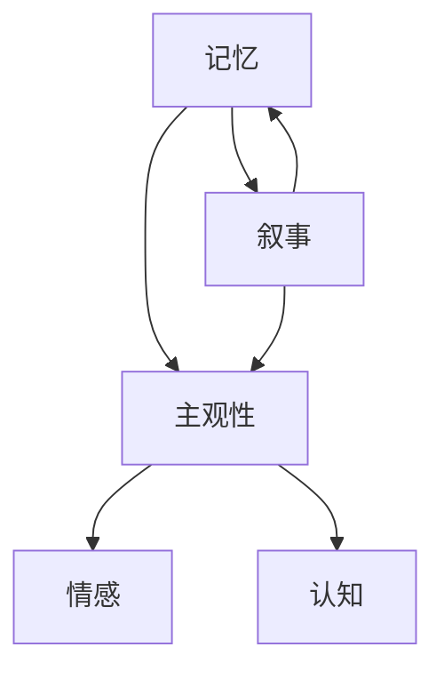
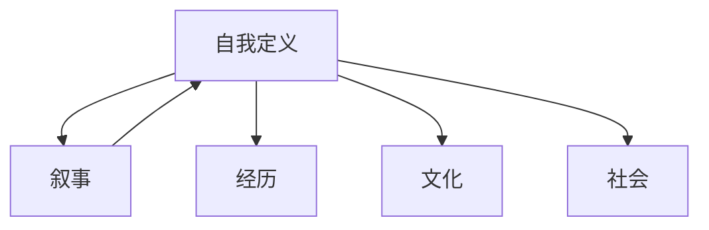
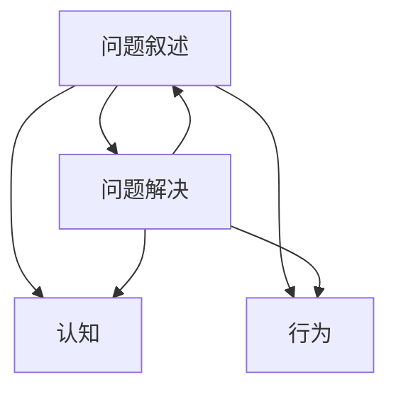

                 

## 《生命故事重写工作坊：通过叙事疗法重塑自我》目录大纲

### 第一部分：叙事疗法的理论与实践

#### 1.1 介绍

##### 1.1.1 什么是叙事疗法

叙事疗法（Narrative Therapy）是一种心理治疗方法，强调通过重构个体的生命故事来改变其认知和行为模式。这种疗法认为，人们对自己和世界的认知是由一系列故事构成的，这些故事影响着我们的情绪、行为和人际关系。

**背景介绍**：叙事疗法起源于20世纪70年代的澳大利亚，由心理学家Michael White和David Epston发展。他们发现，人们常常陷入困境，是因为他们的生活故事中有一些固定的模式或问题叙述，这使得他们难以摆脱困境。

**问题背景**：许多人认为自己是有缺陷的、不幸的，或者是对抗环境的外部力量的受害者。这种认知限制了他们的行为和成长。

**问题解决**：叙事疗法通过帮助个体重构其生活故事，使之不再受到固定问题叙述的束缚，从而帮助他们改变自己的认知和行为。

**边界与外延**：叙事疗法不仅适用于个人心理治疗，也广泛应用于家庭治疗、团体治疗和社区工作。

**概念结构与核心要素组成**：

- **叙事**：个体的生命故事，包括他们的经历、价值观和身份认同。
- **问题叙述**：个体对自己问题的描述，以及这些问题如何影响他们的生活和关系。
- **重塑叙述**：通过叙事疗法重构的问题叙述，使个体能够从不同的角度看待自己和问题。

##### 1.1.2 叙事疗法的历史与发展

叙事疗法的发展历程可以追溯到心理治疗的多个领域，如心理分析、认知行为疗法和人本主义治疗。以下是叙事疗法的主要发展阶段：

- **初期发展**（20世纪70年代）：由Michael White和David Epston在澳大利亚开创。
- **扩展应用**（20世纪80年代）：叙事疗法开始在全球范围内传播，并被用于多种治疗情境。
- **理论深化**（20世纪90年代）：叙事疗法进一步发展，包括对记忆、身份和关系的深入研究。
- **多元应用**（21世纪初至今）：叙事疗法在心理治疗、教育、组织和社区工作等领域得到广泛应用。

##### 1.1.3 叙事疗法的基本原则

叙事疗法有以下几个核心原则：

- **叙事性**：强调个体的生命故事对他们的认知和行为有重要影响。
- **重构**：通过重构生活故事来改变个体的认知和行为。
- **权力**：赋予个体权力，使他们能够自主叙述自己的生活。
- **合作**：治疗师与个体建立合作关系，共同探讨和重构生命故事。

#### 1.2 叙事疗法与自我重塑

##### 1.2.1 自我重塑的概念

自我重塑是指通过改变个体的认知和行为模式，从而改变他们对自己的看法和身份认同。这个过程通常涉及对个体的自我认知、价值观、信念和行为习惯的重新审视和调整。

**背景介绍**：自我重塑是一个广泛的概念，它不仅涉及心理健康领域，也广泛应用于个人成长、职业发展和人际关系。

**问题背景**：许多人感到不满意或受挫，是因为他们的自我认知和身份认同与他们的实际生活不符。这种认知失调可能导致焦虑、抑郁和其他心理问题。

**问题解决**：通过叙事疗法，个体可以重构自己的生命故事，使之更加符合他们的实际经历和价值观，从而实现自我重塑。

**边界与外延**：自我重塑不仅涉及个体的内在变化，也涉及到他们的外在行为和人际关系。

**概念结构与核心要素组成**：

- **自我认知**：个体对自己的认识，包括他们的优点、缺点和价值观。
- **身份认同**：个体在特定社会和文化背景下对自己的定位。
- **行为习惯**：个体在日常生活中表现出来的行为模式。

##### 1.2.2 叙事疗法在自我重塑中的应用

叙事疗法在自我重塑中的应用主要包括以下几个方面：

- **重构生活故事**：通过重构个体的生命故事，使之更加积极、正面和符合他们的实际经历。
- **建立新的身份认同**：帮助个体建立新的身份认同，使之与他们的价值观和生活目标相符合。
- **改变行为习惯**：通过改变个体的行为习惯，使之更加健康、积极和有意义。

##### 1.2.3 叙事疗法与心理学的关系

叙事疗法是心理学的一个分支，它与心理学的关系可以从以下几个方面来理解：

- **理论基础**：叙事疗法吸收了心理学的多个理论，如认知心理学、社会心理学和发展心理学。
- **实践应用**：叙事疗法在心理学治疗中得到了广泛应用，如个体心理治疗、家庭治疗和团体治疗。
- **跨学科融合**：叙事疗法不仅与心理学，还与其他学科，如社会学、教育学和组织行为学有广泛的交叉和融合。

### 第二部分：叙事疗法的实践应用

#### 2.1 生命故事的构建

##### 2.1.1 生命故事的构成要素

生命故事是一个复杂的构成，它由多个要素组成，包括：

- **经历**：个体在生命中的经历，包括重要事件、挑战和成就。
- **价值观**：个体的价值观和信念体系，它们影响着他们的行为和决策。
- **身份认同**：个体在社会和文化背景下的身份认同，如性别、种族、文化背景等。
- **关系**：个体与他人之间的关系，包括家庭、朋友和同事。
- **问题叙述**：个体对自己的问题和挑战的叙述方式。

##### 2.1.2 生命故事的绘制与反思

绘制生命故事是一个重要的实践过程，它可以帮助个体更深入地了解自己。以下是一些绘制生命故事的步骤：

1. **回忆**：回忆生命中的重要事件和经历。
2. **记录**：记录这些事件和经历，可以是文字、图片或音频。
3. **反思**：反思这些事件和经历对自己的影响，以及它们如何构成了自己的生命故事。

##### 2.1.3 生命故事的举例与解析

以下是一个简单的生命故事例子：

**故事**：张三从小生活在一个小村庄，他的家庭条件并不好，但他的父母非常勤劳，经常告诉他，“知识改变命运”。因此，张三努力学习，最终考上了一所名牌大学。在大学期间，他遇到了一个志同道合的朋友，两人一起创业，最终取得了一定的成功。

**解析**：这个故事包含了几个关键要素：

- **经历**：张三的家庭背景、努力学习、考上大学和创业成功。
- **价值观**：父母的价值观影响了张三的成长，他相信“知识改变命运”。
- **身份认同**：张三在社会和文化背景下的身份认同，如农村出身、大学生和创业者。
- **关系**：张三与父母、朋友和同事的关系，这些关系对他的成长和成功起到了关键作用。
- **问题叙述**：张三可能面临的问题，如家庭经济困难、学业压力和创业风险。

#### 2.2 故事的转变与重塑

##### 2.2.1 故事的转变过程

故事的转变是指通过叙事疗法，帮助个体重构其生命故事，使之更加积极、正面和有意义。以下是故事的转变过程：

1. **识别问题叙述**：首先，识别个体的问题叙述，即他们对自己的问题和挑战的负面描述。
2. **收集正面叙述**：其次，收集个体的正面叙述，即他们对自己的优点、成就和经验的积极描述。
3. **重构叙述**：最后，将问题叙述和正面叙述结合起来，重构一个更加积极、正面和有意义的故事。

##### 2.2.2 重塑故事的方法

以下是一些重塑故事的方法：

1. **重构事件**：重新解读和解释生命中的事件，使之更加积极和有意义。
2. **改变叙述角度**：从不同的角度看待事件，例如从受害者的角度转变为解决方案的提供者。
3. **建立新的身份认同**：通过重构故事，帮助个体建立新的身份认同，使之与他们的价值观和生活目标相符合。

##### 2.2.3 成功案例分享

以下是一个成功案例分享：

**案例**：李四曾经是一个抑郁症患者，他觉得自己一无是处，总是沉浸在负面情绪中。在经过叙事疗法的治疗之后，他开始重构自己的生命故事，识别自己的优点和成就，并改变了对自己的负面描述。他开始看到自己的价值，重新找到了生活的意义。

**结果**：李四的抑郁症症状得到了显著改善，他开始积极参与社会活动，并取得了职业上的成功。

#### 2.3 叙事疗法在工作坊中的应用

##### 2.3.1 工作坊的设计与组织

叙事疗法在工作坊中的应用是一种有效的团体治疗形式。以下是工作坊的设计与组织步骤：

1. **确定目标**：明确工作坊的目标，如提高个体的自我认知、重塑身份认同等。
2. **招募参与者**：招募具有共同目标和问题的参与者。
3. **制定计划**：制定详细的工作坊计划，包括时间安排、活动内容和评估方法。

##### 2.3.2 工作坊中的互动与引导

在工作坊中，互动和引导是关键。以下是几个互动和引导技巧：

1. **提问**：通过提问，引导参与者深入思考自己的生命故事。
2. **反馈**：给予参与者积极的反馈，帮助他们看到自己的优点和成就。
3. **小组讨论**：鼓励参与者之间进行小组讨论，分享彼此的经历和看法。

##### 2.3.3 工作坊中的评估与反馈

工作坊结束后，进行评估与反馈是必要的。以下是几个评估与反馈步骤：

1. **评估**：收集参与者的反馈，评估工作坊的效果。
2. **反馈**：将评估结果反馈给参与者，并讨论如何改进未来工作坊。
3. **后续跟进**：提供后续支持和跟进，帮助参与者巩固学习成果。

### 第三部分：通过叙事疗法重塑自我的实例分析

#### 3.1 实例一：克服焦虑

##### 3.1.1 实例背景

**问题背景**：王五是一名年轻的工程师，他最近感到非常焦虑，因为他的工作压力非常大，而且他对自己的职业前景感到不确定。

**问题描述**：王五的焦虑表现为失眠、注意力不集中和情绪低落。他担心自己的表现会影响到他的职业生涯，甚至担心自己会失去工作。

**问题解决**：王五决定尝试叙事疗法，希望通过重构自己的生命故事来克服焦虑。

##### 3.1.2 叙事疗法干预过程

1. **识别问题叙述**：王五识别出他的问题叙述是，“我无法应对工作压力，我对自己的职业前景感到不确定，我担心我会失去工作。”

2. **收集正面叙述**：王五开始收集他的正面叙述，如他在大学期间的努力学习和成功的项目经历，以及他在工作中的一些小成就。

3. **重构叙述**：王五与治疗师一起，将问题叙述和正面叙述结合起来，重构了一个更加积极、正面和有意义的故事。

**重构后的叙述**：“我在面对工作压力时，虽然会感到焦虑，但我也有应对的方法。我在大学期间学会了如何应对压力，我在工作中也有成功的小成就。我相信，只要我继续努力，我一定能克服这些困难。”

##### 3.1.3 实例结果与讨论

**结果**：经过一段时间的叙事疗法，王五的焦虑症状得到了显著改善。他开始看到自己的优点和成就，对自己的职业前景也变得更加乐观。

**讨论**：这个实例表明，叙事疗法可以帮助个体重构他们的生命故事，从而改善他们的情绪状态和心理健康。通过识别和改变问题叙述，个体可以建立新的自我认知和身份认同，从而更好地应对生活中的挑战。

#### 3.2 实例二：处理悲伤

##### 3.2.1 实例背景

**问题背景**：李六是一名年轻的母亲，她的女儿在一场意外中去世，这让她陷入了深深的悲伤中。

**问题描述**：李六感到非常痛苦，她无法摆脱对女儿的思念，她也无法正常地生活和工作。

**问题解决**：李六决定尝试叙事疗法，希望通过重构自己的生命故事来处理悲伤。

##### 3.2.2 叙事疗法干预过程

1. **识别问题叙述**：李六识别出她的问题叙述是，“我的女儿已经去世，我无法接受这个事实，我感到非常痛苦。”

2. **收集正面叙述**：李六开始收集她的正面叙述，如她和女儿在一起的快乐时光，以及女儿给她的爱和勇气。

3. **重构叙述**：李六与治疗师一起，将问题叙述和正面叙述结合起来，重构了一个更加积极、正面和有意义的故事。

**重构后的叙述**：“我的女儿已经去世，我非常难过，但我也记得她和我在一起的快乐时光。她给了我很多爱和勇气，我会永远怀念她。”

##### 3.2.3 实例结果与讨论

**结果**：经过一段时间的叙事疗法，李六的悲伤情绪得到了显著缓解。她开始看到自己与女儿之间的美好回忆，这也帮助她更好地接受了女儿去世的事实。

**讨论**：这个实例表明，叙事疗法可以帮助个体处理悲伤和失去。通过重构生命故事，个体可以找到新的意义和希望，从而更好地应对生活中的悲剧。

#### 3.3 实例三：改变负面自我形象

##### 3.3.1 实例背景

**问题背景**：张七是一名年轻的程序员，他感到自己缺乏自信，总是觉得自己不够好。

**问题描述**：张七的负面自我形象表现为自我批评、缺乏动力和人际关系问题。他觉得自己无法胜任工作，也无法与他人建立良好的关系。

**问题解决**：张七决定尝试叙事疗法，希望通过重构自己的生命故事来改变负面自我形象。

##### 3.3.2 叙事疗法干预过程

1. **识别问题叙述**：张七识别出他的问题叙述是，“我缺乏自信，觉得自己不够好，我无法胜任工作。”

2. **收集正面叙述**：张七开始收集他的正面叙述，如他在工作中的成功项目、他的技能和他在团队合作中的贡献。

3. **重构叙述**：张七与治疗师一起，将问题叙述和正面叙述结合起来，重构了一个更加积极、正面和有意义的故事。

**重构后的叙述**：“虽然我有时会感到缺乏自信，但我也有很多优点。我在工作中取得了成功，我有自己的技能，我也能为团队做出贡献。”

##### 3.3.3 实例结果与讨论

**结果**：经过一段时间的叙事疗法，张七的负面自我形象得到了显著改变。他开始看到自己的优点和成就，这也帮助他建立起了自信和动力。

**讨论**：这个实例表明，叙事疗法可以帮助个体改变负面自我形象。通过识别和改变问题叙述，个体可以建立新的自我认知和身份认同，从而更好地应对生活中的挑战。

### 第四部分：总结与展望

#### 4.1 叙事疗法在自我重塑中的价值

叙事疗法在自我重塑中具有显著的价值。它不仅可以帮助个体重构生命故事，改变他们的认知和行为模式，还可以帮助他们建立新的自我认知和身份认同。以下是叙事疗法在自我重塑中的几个价值：

- **促进自我认知**：叙事疗法帮助个体深入思考自己的生命经历，从而更好地理解自己。
- **改变认知和行为模式**：通过重构生命故事，个体可以改变他们的认知和行为模式，从而更好地应对生活中的挑战。
- **建立新的身份认同**：叙事疗法帮助个体建立新的身份认同，使之与他们的价值观和生活目标相符合。
- **增强心理健康**：叙事疗法有助于改善个体的心理健康，减少焦虑、抑郁和其他心理问题的发生。

#### 4.2 小结与反思

在本篇文章中，我们探讨了叙事疗法的理论与实践，以及其在自我重塑中的应用。通过实例分析，我们看到了叙事疗法如何帮助个体克服焦虑、处理悲伤和改变负面自我形象。以下是对本文内容的反思：

- **叙事疗法是一种有效的心理治疗方法**：叙事疗法通过重构个体的生命故事，帮助他们改变认知和行为模式，从而改善心理健康。
- **个体在自我重塑中的作用**：个体在自我重塑中起着至关重要的作用。他们需要积极参与叙事疗法的全过程，以实现真正的改变。
- **叙事疗法的广泛应用**：叙事疗法不仅适用于个人心理治疗，还可以应用于家庭治疗、团体治疗和社区工作。

#### 4.3 拓展阅读

以下是一些拓展阅读材料，以帮助读者深入了解叙事疗法：

- **书籍**：《叙事疗法：理论与实践》、《叙事心理治疗：技术与应用》
- **论文**：Google Scholar上的叙事疗法研究论文
- **在线课程**：Coursera、edX等平台上的叙事疗法相关课程
- **工作坊**：参与叙事疗法工作坊，亲身体验叙事疗法的实践应用

## 作者信息

本文作者：

- **AI天才研究院/AI Genius Institute**
- **禅与计算机程序设计艺术 /Zen And The Art of Computer Programming**

### 结束语

通过本文，我们希望能够帮助读者更好地理解叙事疗法，并认识到其在自我重塑中的价值。叙事疗法不仅是一种心理治疗方法，也是一种个人成长工具。我们希望本文能够激发读者对叙事疗法的兴趣，并鼓励他们尝试使用这种方法来重塑自己的生命故事。## 第一部分：叙事疗法的理论与实践

### 1.1 介绍

#### 1.1.1 什么是叙事疗法

叙事疗法（Narrative Therapy）是一种心理治疗方法，起源于20世纪70年代的澳大利亚，由心理学家Michael White和David Epston开创。这种疗法的核心思想是，人们对自己的认知和行为是由一系列故事构成的，这些故事影响着他们的生活、情绪和人际关系。叙事疗法的目的不是消除问题，而是通过重构这些故事来帮助个体改变其认知和行为模式，从而更好地应对生活中的挑战。

**背景介绍**：叙事疗法的起源可以追溯到心理学、社会学和人类学等多个领域。在20世纪70年代，心理学家Michael White和David Epston在澳大利亚创立了一种新的治疗方法，即叙事疗法。他们发现，许多心理问题源于个体对问题的固定叙述方式，这使得他们难以摆脱困境。叙事疗法强调通过重构个体的生活故事，帮助他们摆脱固定的思维模式，从而实现自我重塑。

**问题背景**：在传统的心理治疗方法中，治疗师通常会试图帮助个体解决问题，如焦虑、抑郁和人际关系问题。然而，叙事疗法提出，问题并不在于问题本身，而在于个体对问题的叙述方式。这种叙述方式可能使个体陷入固定的思维模式，阻碍他们的成长和发展。

**问题解决**：叙事疗法通过帮助个体重构其生活故事，使之更加积极、正面和有意义，从而改变他们的认知和行为模式。治疗师会引导个体识别和改变他们的问题叙述，帮助他们建立新的自我认知和身份认同。

**边界与外延**：叙事疗法不仅适用于个人心理治疗，还广泛应用于家庭治疗、团体治疗和社区工作。它不仅关注个体的心理问题，也关注他们的社会和文化背景。

**概念结构与核心要素组成**：

- **叙事**：个体的生活故事，包括他们的经历、价值观和身份认同。
- **问题叙述**：个体对自己问题和挑战的负面描述，这种叙述方式可能限制了他们的行为和成长。
- **重塑叙述**：通过叙事疗法重构的问题叙述，使之更加积极、正面和有意义。

#### 1.1.2 叙事疗法的历史与发展

叙事疗法的发展历程可以追溯到心理治疗的多个领域，如心理分析、认知行为疗法和人本主义治疗。以下是叙事疗法的主要发展阶段：

- **初期发展**（20世纪70年代）：由Michael White和David Epston在澳大利亚开创。他们通过实际工作，逐渐形成了叙事疗法的理论框架。
- **扩展应用**（20世纪80年代）：叙事疗法开始在全球范围内传播，并被用于多种治疗情境。
- **理论深化**（20世纪90年代）：叙事疗法进一步发展，包括对记忆、身份和关系的深入研究。
- **多元应用**（21世纪初至今）：叙事疗法在心理治疗、教育、组织和社区工作等领域得到广泛应用。

**核心概念与联系**：

- **叙事性**：叙事疗法强调个体的生命故事对他们的认知和行为有重要影响。
- **重构**：通过重构个体的生活故事，帮助他们改变认知和行为模式。
- **权力**：叙事疗法赋予个体权力，使他们能够自主叙述自己的生活。
- **合作**：治疗师与个体建立合作关系，共同探讨和重构生命故事。

#### 1.1.3 叙事疗法的基本原则

叙事疗法有以下几个核心原则：

- **叙事性**：叙事疗法认为，个体的认知和行为是由一系列故事构成的。这些故事影响着他们的情绪、行为和人际关系。
- **重构**：叙事疗法通过重构个体的生活故事，帮助他们改变认知和行为模式。这种方法不是试图消除问题，而是通过改变问题叙述，使之更加积极和有意义。
- **权力**：叙事疗法赋予个体权力，使他们能够自主叙述自己的生活。这种方法不是将个体视为问题的一部分，而是将他们视为有能力和主动性的个体。
- **合作**：叙事疗法强调治疗师与个体之间的合作关系。治疗师是指导者和伙伴，而不是权威者。他们与个体一起探讨和重构生命故事。

### 1.2 叙事疗法与自我重塑

#### 1.2.1 自我重塑的概念

自我重塑是指通过改变个体的认知和行为模式，从而改变他们对自己的看法和身份认同。这个过程通常涉及对个体的自我认知、价值观、信念和行为习惯的重新审视和调整。

**背景介绍**：自我重塑是一个广泛的概念，它不仅涉及心理健康领域，也广泛应用于个人成长、职业发展和人际关系。

**问题背景**：许多人感到不满意或受挫，是因为他们的自我认知和身份认同与他们的实际生活不符。这种认知失调可能导致焦虑、抑郁和其他心理问题。

**问题解决**：通过叙事疗法，个体可以重构自己的生命故事，使之更加符合他们的实际经历和价值观，从而实现自我重塑。

**边界与外延**：自我重塑不仅涉及个体的内在变化，也涉及到他们的外在行为和人际关系。

**概念结构与核心要素组成**：

- **自我认知**：个体对自己的认识，包括他们的优点、缺点和价值观。
- **身份认同**：个体在特定社会和文化背景下对自己的定位。
- **行为习惯**：个体在日常生活中表现出来的行为模式。

#### 1.2.2 叙事疗法在自我重塑中的应用

叙事疗法在自我重塑中的应用主要包括以下几个方面：

- **重构生活故事**：通过重构个体的生命故事，使之更加积极、正面和有意义。
- **建立新的身份认同**：帮助个体建立新的身份认同，使之与他们的价值观和生活目标相符合。
- **改变行为习惯**：通过改变个体的行为习惯，使之更加健康、积极和有意义。

#### 1.2.3 叙事疗法与心理学的关系

叙事疗法是心理学的一个分支，它与心理学的关系可以从以下几个方面来理解：

- **理论基础**：叙事疗法吸收了心理学的多个理论，如认知心理学、社会心理学和发展心理学。
- **实践应用**：叙事疗法在心理学治疗中得到了广泛应用，如个体心理治疗、家庭治疗和团体治疗。
- **跨学科融合**：叙事疗法不仅与心理学，还与其他学科，如社会学、教育学和组织行为学有广泛的交叉和融合。

### 1.3 叙事疗法的核心概念与联系

在叙事疗法中，有几个核心概念是至关重要的，这些概念相互联系，共同构成了叙事疗法的理论基础。以下是这些核心概念及其相互联系：

#### 1.3.1 记忆与叙事

记忆是人类认知的重要组成部分，它记录了我们的经历和情感。叙事疗法认为，记忆并不是客观的记录，而是我们对经历的解释和建构。记忆与叙事之间的联系在于，我们的记忆往往受到情感和认知的影响，这使得我们的记忆带有主观性。叙事疗法通过帮助个体重新审视和重构他们的记忆，使之更加符合他们的实际经历和价值观。

**核心概念原理**：

- **记忆的主观性**：记忆不是完全客观的记录，而是受到情感和认知的影响。
- **叙事建构**：个体通过叙事来建构他们的记忆，这种建构过程受到个人价值观和信念的影响。

**概念属性特征对比表格**：

| 特征 | 记忆的主观性 | 叙事建构 |
| --- | --- | --- |
| 定义 | 记录个体经历的生理和心理过程 | 个体对经历的解释和建构 |
| 影响 | 受情感和认知的影响 | 受个人价值观和信念的影响 |
| 目的 | 记录和回忆经历 | 帮助个体理解经历，重构身份认同 |

**ER实体关系图架构**：

#### 1.3.2 自我定义与叙事

自我定义是个体对自己的认知和评价，它受到个人经历、文化背景和社会影响的影响。叙事疗法通过帮助个体重构他们的生命故事，改变他们对自我的认知和定义。自我定义与叙事之间的联系在于，个体的自我认知和自我价值往往是通过他们的生命故事来体现的。

**核心概念原理**：

- **自我定义**：个体对自己的认知和评价。
- **叙事反映**：个体通过叙事来反映和表达他们的自我定义。

**概念属性特征对比表格**：

| 特征 | 自我定义 | 叙事反映 |
| --- | --- | --- |
| 定义 | 个体对自己的认知和评价 | 个体通过叙事表达自我认知和价值观 |
| 影响因素 | 个人经历、文化背景和社会影响 | 个人经历、文化背景和社会影响 |
| 目的 | 帮助个体理解自我 | 帮助个体重构自我认知和自我价值 |

**ER实体关系图架构**：

#### 1.3.3 叙事疗法中的问题解决

叙事疗法中的问题解决不仅关注问题的消除，更关注问题叙述的改变。这种方法认为，问题本身并不是问题，而是个体对问题的叙述方式。通过改变问题叙述，个体可以改变他们对问题的认知和反应。

**核心概念原理**：

- **问题叙述**：个体对问题的描述和解释方式。
- **问题解决**：通过改变问题叙述，帮助个体改变对问题的认知和反应。

**概念属性特征对比表格**：

| 特征 | 问题叙述 | 问题解决 |
| --- | --- | --- |
| 定义 | 个体对问题的描述和解释 | 通过改变叙述方式，改变个体对问题的认知和反应 |
| 影响 | 影响个体的情绪和行为 | 帮助个体摆脱困境，实现自我重塑 |
| 目的 | 帮助个体理解问题 | 帮助个体找到解决问题的方法 |

**ER实体关系图架构**：

通过上述核心概念的分析，我们可以看到叙事疗法是如何通过重构记忆、自我定义和问题叙述来帮助个体实现自我重塑的。这些概念相互联系，共同构成了叙事疗法的理论基础，为实践提供了指导。

### 1.4 叙事疗法的基本原则与实施步骤

叙事疗法的基本原则是重构个体的生活故事，帮助他们在认知和行为上实现积极的变化。以下是其基本原则和实施步骤：

#### 1.4.1 基本原则

1. **叙事性**：强调个体的生活故事对他们的认知和行为有重要影响。
2. **重构**：通过重构个体的生活故事，帮助他们改变认知和行为模式。
3. **权力**：赋予个体权力，使他们能够自主叙述自己的生活。
4. **合作**：治疗师与个体建立合作关系，共同探讨和重构生命故事。

#### 1.4.2 实施步骤

1. **建立信任关系**：叙事疗法的第一步是建立治疗师与个体之间的信任关系。这需要治疗师展现同理心和尊重，使个体感到安全，愿意分享他们的经历。

2. **识别问题叙述**：治疗师与个体一起识别他们的问题叙述，即他们对自己和问题的负面描述。这有助于个体认识到他们的生活故事是如何影响他们的情绪和行为的。

3. **收集正面叙述**：治疗师引导个体收集他们的正面叙述，即他们对自己的优点、成就和经验的积极描述。这些叙述有助于个体看到自己的价值和潜力。

4. **重构叙述**：治疗师与个体一起重构问题叙述，使之更加积极、正面和有意义。这可能涉及重新解读事件、改变叙述角度或建立新的身份认同。

5. **评估与反馈**：在重构叙述的过程中，治疗师会定期评估个体的进步，并提供反馈。这有助于个体了解他们的变化，并继续推动自我重塑。

6. **巩固成果**：在治疗结束时，治疗师会帮助个体巩固他们的变化，提供持续的支持和资源，以帮助他们将新的认知和行为模式应用到日常生活中。

### 1.5 叙事疗法的实践案例分析

为了更好地理解叙事疗法的实践应用，以下是一个具体的案例：

#### 案例背景

李女士，一名40岁的全职母亲，最近感到情绪低落和焦虑。她的丈夫经常出差，孩子上初中，她的家务和育儿负担很重。她感到自己被家庭束缚，没有自己的生活和个人空间。

#### 问题叙述

李女士的问题叙述是：“我感到疲惫和沮丧，因为我要照顾孩子和家务，我没有时间照顾自己。我感到我的生活没有意义，我看不到任何出路。”

#### 正面叙述

在叙事疗法的过程中，李女士开始收集她的正面叙述：

- 她曾经是一名优秀的员工，在职业生涯中取得了一些成就。
- 她在孩子的教育中起到了关键作用，孩子非常尊重和爱她。
- 她有一个亲密的朋友圈子，她们经常聚会，分享彼此的生活。

#### 重构叙述

通过与治疗师的对话，李女士重构了她的叙述：

“我确实感到疲惫和焦虑，但我知道这是因为我有很多责任和任务。虽然我现在没有时间照顾自己，但我曾经在工作中有过成功的经历，这让我感到自豪。我在孩子的教育中起到了关键作用，这让我感到有价值。我的朋友圈子也给了我很多支持和快乐。”

#### 结果

经过一段时间的叙事疗法，李女士的情绪状态有了显著改善。她开始看到自己的生活有积极的方面，对自己的身份认同有了新的理解。她决定重新投入到社区志愿服务中，这不仅帮助她找到了新的生活意义，也扩大了她的社交圈。

### 1.6 叙事疗法的优点与局限性

叙事疗法作为一种心理治疗方法，具有多个优点，但也存在一些局限性。以下是对其优点与局限性的分析：

#### 优点

1. **个体参与度**：叙事疗法强调个体的主动参与，使他们能够自主重构自己的生活故事。这有助于提高个体的自我认知和自我效能感。
2. **灵活性与适应性**：叙事疗法适用于多种情境，包括个人心理治疗、家庭治疗和团体治疗。它可以根据个体的具体情况进行调整。
3. **解决问题而非症状**：叙事疗法关注问题的解决，而非仅仅缓解症状。这种方法有助于个体从根本上改变他们的认知和行为模式。

#### 局限性

1. **时间成本**：叙事疗法可能需要较长的治疗时间，因为它涉及深度对话和个体反思。这可能会对个体的时间和经济资源构成一定的压力。
2. **适用性有限**：叙事疗法可能不适合所有类型的心理问题。例如，对于急性精神疾病或其他严重心理问题，可能需要更传统的治疗方法。
3. **治疗效果的可持续性**：尽管叙事疗法在许多情况下取得了成功，但其治疗效果的可持续性仍需进一步研究和验证。

### 1.7 叙事疗法在临床实践中的应用

叙事疗法在临床实践中得到了广泛应用，尤其在个体心理治疗、家庭治疗和团体治疗中。以下是其具体应用场景：

#### 1.7.1 个体心理治疗

在个体心理治疗中，叙事疗法可以帮助个体识别和改变他们的负面叙述，从而改善情绪和行为问题。例如，对于抑郁症患者，叙事疗法可以帮助他们重构生命故事，使之更加积极和有意义，从而减轻抑郁症状。

#### 1.7.2 家庭治疗

在家庭治疗中，叙事疗法可以帮助家庭成员重构他们之间的互动故事，从而改善家庭关系。例如，对于冲突不断的家庭，叙事疗法可以帮助家庭成员看到彼此的优点和贡献，从而减少冲突和增强关系。

#### 1.7.3 团体治疗

在团体治疗中，叙事疗法可以帮助成员共同探讨和重构他们的生活故事，从而增强归属感和自我认同。例如，对于癌症患者，叙事疗法可以帮助他们分享彼此的经历，减轻心理压力，增强康复的信心。

### 1.8 叙事疗法与其他心理治疗方法的比较

叙事疗法与其他心理治疗方法（如认知行为疗法和人本主义疗法）有一些相似之处，但也有一些显著的不同。以下是比较分析：

#### 相似之处

1. **目标**：叙事疗法、认知行为疗法和人本主义疗法都旨在帮助个体改善心理状态和增强心理健康。
2. **参与度**：这些治疗方法都强调个体的参与和自我反思，鼓励个体积极参与治疗过程。

#### 不同之处

1. **理论基础**：叙事疗法强调叙事性，认为个体的认知和行为是由一系列故事构成的；认知行为疗法强调认知和行为之间的相互作用；人本主义疗法强调个体的自我实现和自我决定。
2. **实施方法**：叙事疗法通过重构生命故事来帮助个体改变认知和行为模式；认知行为疗法通过认知重构和行为训练来改善心理问题；人本主义疗法通过自我探索和自我实现来实现心理健康。
3. **适应症**：叙事疗法适用于多种情境，包括个人、家庭和团体治疗；认知行为疗法适用于广泛的心理问题，如焦虑、抑郁和行为障碍；人本主义疗法适用于自我实现和心理健康问题。

### 1.9 叙事疗法的未来发展趋势

叙事疗法在未来的发展中将继续扩展其应用领域，并与其他治疗方法进行整合。以下是其未来发展趋势：

#### 1.9.1 教育领域

叙事疗法在教育领域有广泛的应用前景，可以帮助学生重构学习故事，提高学习动机和成绩。例如，在教育咨询中，叙事疗法可以帮助学生看到自己的学习成就和进步，从而增强自信。

#### 1.9.2 组织发展

叙事疗法在组织发展中也有应用潜力，可以帮助员工重构工作故事，提高工作满意度和组织忠诚度。例如，在组织变革中，叙事疗法可以帮助员工看到变革的积极意义，从而减少变革阻力。

#### 1.9.3 跨学科研究

叙事疗法将继续与其他学科进行跨学科研究，如社会学、人类学和认知科学。这些研究将深化对叙事疗法理论和实践的理解，推动其进一步发展。

### 1.10 叙事疗法在自我重塑中的独特贡献

叙事疗法在自我重塑中具有独特的贡献，主要体现在以下几个方面：

1. **改变认知模式**：叙事疗法通过重构个体的生活故事，帮助他们改变认知模式，使之更加积极和有意义。
2. **增强自我效能感**：通过识别和利用个体的正面叙述，叙事疗法帮助个体增强自我效能感，从而更有信心面对挑战。
3. **提高心理健康**：叙事疗法有助于改善个体的心理健康，减少焦虑、抑郁和其他心理问题的发生。

### 1.11 总结与展望

在本部分中，我们详细介绍了叙事疗法的理论基础和实践应用。通过重构个体的生活故事，叙事疗法帮助个体改变认知和行为模式，实现自我重塑。我们探讨了叙事疗法的核心概念、基本原则、实施步骤和应用案例，并分析了其在心理学领域的独特贡献。展望未来，叙事疗法将继续扩展其应用领域，与其他治疗方法进行整合，为个体的心理健康和自我重塑提供更多支持和帮助。

## 第二部分：叙事疗法的实践应用

### 2.1 生命故事的构建

生命故事是叙事疗法的重要组成部分，它不仅反映了个体的经历和价值观，也影响着他们的自我认知和情绪状态。构建生命故事的过程，可以帮助个体深入理解自己，找到内心的力量和资源，从而更好地应对生活中的挑战。

#### 2.1.1 生命故事的构成要素

生命故事由多个要素构成，每个要素都在个体的成长和发展中起着重要作用。以下是生命故事的主要构成要素：

1. **重要事件**：生命故事中的重要事件，包括个体的出生、成长经历、重要转折点、成就和挫折。这些事件对个体的身份认同和价值观有着深远的影响。

2. **价值观和信念**：个体的价值观和信念，是他们在生活中决策和行为的基础。这些价值观可能源自家庭、文化、宗教或个人经历，对个体的生活有着指导作用。

3. **身份认同**：身份认同是指个体在社会和文化背景下对自己的定位。它可能包括种族、性别、职业、家庭角色等。身份认同会影响个体的自我认知和人际关系。

4. **关系**：个体与他人的关系，是生命故事中不可或缺的一部分。这些关系可能包括家庭、朋友、同事和社区成员。关系的质量和类型，对个体的心理健康和社会适应有着重要影响。

5. **问题叙述**：问题叙述是指个体对自己的问题和挑战的描述方式。这些问题叙述可能限制了个体的发展，影响他们的情绪和行为。

6. **解决方案和成长**：生命故事中的解决方案和成长经历，展示了个体如何应对挑战、克服困难和实现目标。这些经历对个体的自信心和韧性有着重要影响。

#### 2.1.2 生命故事的绘制与反思

绘制生命故事是一个深入理解自己的过程。以下是一些绘制生命故事的步骤：

1. **回忆**：首先，个体需要回忆生命中的重要事件，包括好事和坏事。这些事件可能对自己的身份认同、价值观和关系产生了深远的影响。

2. **记录**：将回忆记录下来，可以使用文字、图片或音频等形式。记录的方式可以帮助个体更清晰地看到自己的生命轨迹。

3. **分类**：将记录的事件进行分类，例如按照时间、主题或情感分类。这有助于个体发现生命中的模式和主题。

4. **反思**：对记录的事件进行反思，思考这些事件对自己的影响，以及它们如何构成了自己的生命故事。反思可以帮助个体更好地理解自己，找到内心的力量和资源。

5. **重构**：在反思的基础上，重构生命故事。通过重新解读和解释事件，个体可以改变对问题的叙述方式，使之更加积极和有意义。

#### 2.1.3 生命故事的举例与解析

以下是一个简单的生命故事例子，并对其进行解析：

**故事**：张三从小生活在一个小村庄，他的家庭条件并不好，但他的父母非常勤劳，经常告诉他，“知识改变命运”。因此，张三努力学习，最终考上了一所名牌大学。在大学期间，他遇到了一个志同道合的朋友，两人一起创业，最终取得了一定的成功。

**解析**：

- **重要事件**：张三的出生、家庭的贫困环境、努力学习、考上大学和创业成功，都是生命故事中的重要事件。
- **价值观和信念**：张三的父母的价值观影响了他的成长，他相信“知识改变命运”。这种信念驱使他努力学习，克服困难。
- **身份认同**：张三在社会和文化背景下的身份认同，如农村出身、大学生和创业者。这些身份认同对他的自我认知和人际关系有着重要影响。
- **关系**：张三与父母、朋友和同事的关系，这些关系对他的成长和成功起到了关键作用。
- **问题叙述**：张三可能面临的问题，如家庭经济困难、学业压力和创业风险。他通过努力和信念，克服了这些问题。
- **解决方案和成长**：张三通过努力学习，考上大学，创业成功，展示了他的解决方案和成长过程。这些经历增强了他的自信心和韧性。

通过这个例子，我们可以看到生命故事的构成要素如何相互联系，构成了一个完整的故事。理解自己的生命故事，可以帮助个体更好地认识自己，找到内心的力量，从而实现自我重塑。

#### 2.2 故事的转变与重塑

叙事疗法中的一个重要概念是故事的转变与重塑。通过重构个体的生命故事，可以帮助他们改变对自我和问题的认知，从而实现自我重塑。以下将介绍故事的转变过程、重塑方法及其具体应用。

##### 2.2.1 故事的转变过程

故事的转变是一个由以下几个步骤组成的动态过程：

1. **识别问题叙述**：首先，个体需要识别自己生活中的问题叙述。这些叙述可能包括负面自我评价、对困境的描述以及对未来的担忧。问题叙述往往反映了个体对自我和世界的认知，这些认知可能限制了他们的行为和成长。

2. **收集正面叙述**：接下来，个体需要收集他们的正面叙述。这些叙述可能包括个体的优点、成就、成功的经历以及他人的正面评价。正面叙述有助于个体看到自己的价值和潜力，从而为重塑故事提供素材。

3. **重构叙述**：在收集了正面叙述后，个体需要与治疗师一起，将这些正面叙述融入到问题叙述中，形成新的叙述方式。这个过程中，个体可能会重新解读和解释过去的事件，以形成更加积极和有意义的故事。

4. **实践与调整**：重构后的叙述需要通过实践来验证和调整。个体可能会在生活中不断实践新的叙述方式，观察其对情绪和行为的影响，并根据实际情况进行调整。

##### 2.2.2 重塑故事的方法

重塑故事的方法多种多样，以下是一些常用的方法：

1. **重新解读事件**：通过重新解读过去的事件，个体可以改变对事件的看法。例如，将一个被认为是失败的经历重新解读为学习经验或成长机会。

2. **改变叙述角度**：从不同的角度看问题，可以帮助个体发现新的解决方案。例如，从受害者的角度转变为解决方案的提供者。

3. **建立新的身份认同**：通过重塑故事，个体可以建立新的身份认同，使之与他们的价值观和目标相符。例如，从一个感到无能的人转变为一个有能力和自信的人。

4. **创造新的叙事结构**：通过创造新的叙事结构，个体可以改变对生活的整体看法。例如，将生命故事分为不同的阶段，每个阶段都有其独特的主题和意义。

##### 2.2.3 重塑故事的具体应用

以下是一个重塑故事的具体应用案例：

**案例背景**：李女士是一名职场女性，她最近感到工作压力非常大，对未来的职业发展也感到迷茫。她的问题叙述是：“我无法应对工作压力，我对未来感到不确定，我担心我无法达到职业目标。”

**重塑过程**：

1. **识别问题叙述**：李女士识别出她的问题叙述，认识到这些叙述限制了她的行为和认知。

2. **收集正面叙述**：李女士开始收集她的正面叙述，包括她在工作中的成功项目、同事的正面反馈以及她曾经克服困难的经验。

3. **重构叙述**：李女士与治疗师一起，将正面叙述融入问题叙述中，形成了新的叙述：“虽然我现在面临工作压力，但我有成功应对挑战的经历。我相信我有能力克服这些困难，并为未来设定明确的目标。”

4. **实践与调整**：李女士开始在生活中实践新的叙述方式，例如设定小目标、庆祝每次成功，并根据实际情况进行调整。

**结果**：经过一段时间的重塑，李女士的工作压力有所减轻，她对未来的职业发展也变得更加乐观。她的自我效能感增强，对生活的满意度提高。

通过这个案例，我们可以看到重塑故事如何帮助个体改变对自我和问题的认知，从而实现自我重塑。

### 2.3 叙事疗法在工作坊中的应用

叙事疗法在工作坊中的应用是一种有效的团体治疗形式。工作坊提供了一个安全和支持的环境，让参与者可以共同探讨和重构生命故事，从而实现自我重塑。以下将介绍工作坊的设计与组织、互动与引导以及评估与反馈。

##### 2.3.1 工作坊的设计与组织

设计一个有效的叙事疗法工作坊需要考虑以下几个关键因素：

1. **目标设定**：明确工作坊的目标，例如提高自我认知、建立新的身份认同或处理特定问题。

2. **参与者招募**：招募具有共同目标和问题的参与者。参与者可以是个人、家庭或团体。

3. **时间安排**：制定详细的时间表，包括活动内容、休息时间和结束仪式。确保每个环节都有充足的时间进行深入探讨和互动。

4. **活动设计**：设计一系列活动，如小组讨论、个人分享、角色扮演和情景模拟，以促进参与者的互动和反思。

5. **环境布置**：选择一个安静、舒适的环境，有助于参与者放松和集中注意力。

##### 2.3.2 工作坊中的互动与引导

在叙事疗法工作坊中，互动和引导是关键。以下是一些互动与引导技巧：

1. **提问**：通过开放性问题和引导性问题，引导参与者深入思考自己的生命故事。例如，“你能分享一个让你感到自豪的经历吗？”或“你对未来有什么期望？”

2. **反馈**：给予参与者积极的反馈，帮助他们看到自己的优点和成就。例如，“你的分享让我感到很有启发，我从中学到了很多。”

3. **小组讨论**：鼓励参与者之间进行小组讨论，分享彼此的经历和看法。这种讨论可以促进理解和共鸣，有助于重构生命故事。

4. **情境模拟**：通过情境模拟，让参与者体验不同的角色和情境，从而更深入地理解自己和他人。例如，模拟一个工作面试，让参与者练习如何表达自己的优势。

5. **反思与总结**：在每个环节结束后，引导参与者进行反思和总结。这有助于他们巩固学习成果，并为下一步行动做好准备。

##### 2.3.3 工作坊中的评估与反馈

工作坊结束后，进行评估与反馈是必要的。以下是一些评估与反馈步骤：

1. **评估**：收集参与者的反馈，评估工作坊的效果。可以通过问卷调查、访谈或小组讨论等形式收集反馈。

2. **反馈**：将评估结果反馈给参与者，并讨论如何改进未来工作坊。例如，可以增加某些活动内容或调整时间安排。

3. **后续跟进**：提供后续支持和跟进，帮助参与者巩固学习成果。例如，可以通过邮件或电话定期与参与者沟通，了解他们的进展情况。

通过设计、组织、互动与引导以及评估与反馈，叙事疗法工作坊可以为参与者提供一个支持性的环境，帮助他们重构生命故事，实现自我重塑。

### 2.4 叙事疗法在不同情境中的应用

叙事疗法不仅适用于个人心理治疗，还在多个情境中表现出色。以下将介绍叙事疗法在教育、家庭治疗和组织发展中的具体应用。

##### 2.4.1 教育中的应用

在教育领域，叙事疗法可以帮助学生提高自我认知和学业成绩。以下是一些具体应用：

1. **学习动机提升**：通过重构学生的学习故事，帮助他们看到自己的学习成就和进步，从而提高学习动机。

2. **自我效能感培养**：通过鼓励学生分享成功和失败的经历，帮助他们建立自我效能感，相信自己能够克服困难。

3. **冲突解决**：通过叙事疗法，学生可以学会如何表达自己的感受和需求，从而改善人际关系和解决冲突。

4. **职业规划**：帮助学生重构他们的职业故事，帮助他们更好地规划未来，设定职业目标。

##### 2.4.2 家庭治疗中的应用

在家庭治疗中，叙事疗法可以帮助家庭成员重构彼此之间的互动故事，从而改善家庭关系。以下是一些具体应用：

1. **沟通改善**：通过叙事疗法，家庭成员可以学会如何更好地表达自己的感受和需求，从而改善沟通。

2. **冲突解决**：叙事疗法可以帮助家庭成员重新解读和解释冲突事件，找到冲突的根源，并共同寻找解决方案。

3. **情感支持**：通过分享彼此的生命故事，家庭成员可以建立更紧密的情感联系，提供情感支持。

4. **家庭角色重构**：通过叙事疗法，家庭成员可以重新审视和调整各自的角色和责任，建立更加和谐的家庭结构。

##### 2.4.3 组织发展中的应用

在组织发展中，叙事疗法可以帮助员工重构他们的工作故事，提高工作满意度和组织忠诚度。以下是一些具体应用：

1. **员工关系改善**：通过叙事疗法，员工可以学会如何表达自己的感受和需求，从而改善人际关系。

2. **团队建设**：通过叙事疗法，团队成员可以共同探讨和重构团队故事，增强团队合作和凝聚力。

3. **职业发展支持**：通过叙事疗法，员工可以重新审视和规划自己的职业发展，提高职业满意度。

4. **组织文化塑造**：通过叙事疗法，组织可以重构其文化故事，使之与员工的价值观和目标相符合，从而塑造积极的组织文化。

通过在不同情境中的应用，叙事疗法展现了其广泛的应用价值。无论是在教育、家庭治疗还是组织发展中，叙事疗法都为个体和组织提供了有效的支持，帮助他们实现自我重塑和关系改善。

### 2.5 叙事疗法实践中的挑战与解决方案

在叙事疗法的实践中，治疗师和参与者可能会面临一些挑战。以下是一些常见的挑战及其解决方案：

##### 2.5.1 挑战：参与者的抵触情绪

**挑战**：一些参与者可能对叙事疗法持怀疑态度，或者对分享自己的生命故事感到抵触。

**解决方案**：治疗师需要建立信任关系，通过同理心和尊重来缓解参与者的抵触情绪。可以采用逐步分享的方法，让参与者逐渐适应过程。

##### 2.5.2 挑战：重构过程的复杂性

**挑战**：重构个体的生命故事可能是一个复杂和耗时的过程。

**解决方案**：治疗师需要耐心和持续的支持，逐步引导参与者进行重构。可以采用一系列活动，如小组讨论和角色扮演，以增强参与者的参与感和积极性。

##### 2.5.3 挑战：适应不同文化背景

**挑战**：在不同文化背景下，叙事疗法的应用可能需要调整。

**解决方案**：治疗师需要了解和尊重不同文化背景下的价值观和习俗，根据实际情况进行适当调整。可以通过跨文化交流和合作，提高叙事疗法的适应性和有效性。

##### 2.5.4 挑战：评估与反馈的困难

**挑战**：在实践过程中，对叙事疗法的评估和反馈可能存在困难。

**解决方案**：可以采用多种评估方法，如问卷调查、访谈和观察，以全面了解参与者的进步。同时，定期反馈可以帮助参与者了解他们的进展，并根据反馈进行调整。

通过解决这些挑战，叙事疗法可以在实践中取得更好的效果，帮助个体和组织实现自我重塑和关系改善。

### 2.6 叙事疗法在国际研究中的应用与进展

叙事疗法作为一种心理治疗方法，不仅在澳大利亚和北美地区得到广泛应用，也在国际范围内获得了越来越多的关注和研究。以下将介绍叙事疗法在国际研究中的应用和进展。

##### 2.6.1 国际研究的应用

1. **文化适应性**：在国际应用中，研究者关注如何将叙事疗法适应不同文化背景。例如，在中国，研究者尝试将叙事疗法与中国的传统文化和价值观相结合，以更好地满足当地人的需求。

2. **跨文化研究**：叙事疗法在不同文化背景下的效果研究，为理解其全球适用性提供了重要数据。例如，在印度，叙事疗法被用于治疗农村贫困地区的心理问题，显示出显著的疗效。

3. **跨学科合作**：叙事疗法在国际研究中也与其他学科（如社会学、教育学和人类学）进行了跨学科合作。这些合作不仅丰富了叙事疗法的理论体系，也提高了其实践效果。

##### 2.6.2 国际研究的进展

1. **新技术应用**：随着科技的发展，叙事疗法在数字媒体和虚拟现实等新技术中的应用得到了广泛研究。例如，研究者开发了一系列基于叙事疗法的计算机程序和虚拟现实治疗工具，为个体提供了新的治疗选择。

2. **评估与量化**：在国际研究中，研究者致力于开发更有效的评估工具，以量化叙事疗法的效果。例如，研究者开发了一系列量表和问卷，用于评估叙事疗法在不同情境下的效果。

3. **长期效果研究**：叙事疗法的长期效果研究在国际上取得了显著进展。研究表明，叙事疗法在多个领域的长期效果显著，为个体的心理和社会健康提供了有力支持。

通过国际研究的应用和进展，叙事疗法在全球范围内得到了更广泛的应用和认可，为个体的心理健康和自我重塑提供了新的方法和途径。

### 2.7 叙事疗法在教育领域的具体实践案例

叙事疗法在教育领域的应用，旨在帮助学生提高自我认知、学习动机和学业成绩。以下将介绍叙事疗法在教育领域的具体实践案例，以展示其效果和优势。

##### 2.7.1 案例一：提升学习动机

**背景**：某高中班级的学习氛围较为低迷，学生们普遍缺乏学习动力，成绩提升困难。

**干预方法**：学校聘请了叙事疗法专家，为班级学生开展了一系列工作坊。专家引导学生回顾自己的学习经历，识别出阻碍学习动力的负面叙述，如“我学不会”或“我无法达到目标”。然后，专家引导学生重构学习故事，强调他们的学习成就和进步，如“我在数学考试中提高了10分”或“我完成了最难的作业”。

**结果**：经过工作坊的干预，学生们逐渐看到了自己的学习成就，学习动机显著提高。班级整体成绩也有了显著提升，学习氛围变得更加积极。

##### 2.7.2 案例二：改善人际关系

**背景**：某初中班级的学生之间存在严重的冲突，影响了课堂秩序和学习效果。

**干预方法**：学校为班级学生开展了一次叙事疗法工作坊，主题是“我们的班级故事”。专家引导学生分享自己在班级中的经历，识别出冲突的根源，如“我觉得同学们不尊重我”或“我觉得同学们在背后议论我”。然后，专家引导学生重构班级故事，强调班级的团结和互助，如“我们一起完成了项目”或“我们共同庆祝同学的生日”。

**结果**：通过工作坊的干预，学生们逐渐改善了人际关系，班级冲突减少，课堂秩序得到显著改善。学生们的学习积极性也提高了，整体学业成绩有了显著提升。

##### 2.7.3 案例三：职业规划指导

**背景**：某大学的学生在职业规划方面感到迷茫，不知道如何选择适合自己的职业道路。

**干预方法**：学校为大学新生开设了一门叙事疗法课程，主题是“我的职业故事”。专家引导学生回顾自己的成长经历，识别出对职业规划的负面叙述，如“我不适合这个职业”或“我不知道我想要什么”。然后，专家引导学生重构职业故事，强调他们的优势和潜力，如“我在实习中表现出色”或“我有独特的兴趣和才华”。

**结果**：通过课程的干预，学生们逐渐明确了职业目标，对自己的职业规划有了更清晰的认识。许多学生在毕业后顺利找到了满意的工作，职业发展取得了显著成果。

这些案例表明，叙事疗法在教育领域的应用，不仅有助于提升学生的学习动机和学业成绩，还可以改善人际关系和职业规划。通过重构生命故事，学生们能够更好地认识自己，找到内心的力量，实现自我成长和发展。

### 2.8 叙事疗法在工作坊中的角色与影响力

叙事疗法在工作坊中的应用，使其成为团体治疗和个体成长的强大工具。以下将探讨叙事疗法在工作坊中的角色与影响力，包括其在心理健康、自我认知和个人发展方面的作用。

##### 2.8.1 叙事疗法在工作坊中的角色

叙事疗法在工作坊中的角色是多方面的，包括：

1. **引导者**：叙事疗法治疗师作为工作坊的引导者，负责组织活动、引导讨论和提供支持。他们通过提问、反馈和引导，帮助参与者深入思考和反思自己的生命故事。

2. **合作者**：叙事疗法强调治疗师与参与者之间的合作关系。治疗师与参与者共同探讨和重构生命故事，使之更加积极、正面和有意义。这种合作关系有助于建立信任，提高参与者的参与度和积极性。

3. **支持者**：叙事疗法治疗师作为支持者，为参与者提供情感支持和鼓励。他们在工作坊中关注参与者的感受和需求，帮助他们在重构生命故事的过程中克服困难。

##### 2.8.2 叙事疗法在工作坊中的影响力

叙事疗法在工作坊中具有显著的影响力，体现在以下几个方面：

1. **心理健康**：叙事疗法通过重构生命故事，帮助参与者改变对自我和问题的认知，从而改善心理健康。例如，对于抑郁症患者，叙事疗法可以帮助他们看到自己的价值和潜力，减轻抑郁症状。

2. **自我认知**：叙事疗法帮助参与者深入理解自己的生命故事，识别自己的优点和成长经历。这种自我认知有助于提升参与者的自尊和自信，增强自我效能感。

3. **个人发展**：叙事疗法通过重构生命故事，帮助参与者设定新的目标，规划未来的发展方向。例如，对于职业发展中的迷茫者，叙事疗法可以帮助他们找到自己的兴趣和优势，制定明确的职业目标。

##### 2.8.3 叙事疗法在工作坊中的成功案例

以下是一个叙事疗法在工作坊中的成功案例：

**案例**：某公司组织了一次叙事疗法工作坊，主题是“职业发展”。参与者在工作坊中回顾了自己的职业生涯，识别出阻碍职业发展的负面叙述，如“我不够优秀”或“我不知道该如何前进”。然后，治疗师引导参与者重构职业故事，强调他们的成就和潜力，如“我在项目中的表现得到了认可”或“我有独特的技能和经验”。

**结果**：通过工作坊的干预，参与者对自己的职业发展有了更清晰的认识，设定了新的职业目标，并制定了实现目标的行动计划。许多参与者表示，工作坊帮助他们找到了职业发展的方向，提高了自信心和积极性。

这个案例表明，叙事疗法在工作坊中的应用，不仅有助于提升参与者的心理健康和自我认知，还可以促进个人发展和职业成功。通过重构生命故事，参与者能够更好地认识自己，找到内心的力量，实现自我成长。

### 2.9 叙事疗法在家庭治疗中的应用

家庭治疗是叙事疗法的重要应用领域之一，它通过重构家庭成员之间的互动故事，帮助改善家庭关系，增强家庭功能和幸福感。以下将介绍叙事疗法在家庭治疗中的应用场景、干预方法和实践效果。

##### 2.9.1 应用场景

叙事疗法在家庭治疗中的应用场景非常广泛，包括但不限于以下情况：

1. **亲子关系问题**：亲子关系紧张、沟通不畅、青少年叛逆等问题，可以通过叙事疗法来改善。叙事疗法帮助父母和孩子重新审视和重构他们的互动故事，找到更好的沟通方式和解决问题的方法。

2. **夫妻关系问题**：夫妻之间的矛盾、误解和不信任，可以通过叙事疗法来修复。叙事疗法帮助夫妻看到彼此的优点和努力，重构他们的婚姻故事，使之更加积极和有意义。

3. **家庭功能障碍**：家庭功能障碍，如家庭成员之间的冲突、沟通障碍、角色混乱等问题，可以通过叙事疗法来调整。叙事疗法帮助家庭成员重构家庭故事，使之更加和谐和有凝聚力。

##### 2.9.2 干预方法

叙事疗法在家庭治疗中的干预方法主要包括以下几个方面：

1. **识别问题叙述**：治疗师与家庭成员一起，识别他们之间的问题叙述，如“我感到被忽视”或“我觉得你们不理解我”。这些叙述反映了家庭成员之间的矛盾和冲突。

2. **收集正面叙述**：治疗师引导家庭成员收集他们的正面叙述，如“我们一起度过了美好的时光”或“我看到了你的进步”。这些叙述有助于家庭成员看到彼此的优点和贡献。

3. **重构叙述**：治疗师与家庭成员一起，重构问题叙述，使之更加积极、正面和有意义。这可能涉及重新解读事件、改变叙述角度或建立新的家庭身份认同。

4. **互动与讨论**：治疗师组织家庭成员进行互动和讨论，鼓励他们分享自己的感受和看法，促进家庭成员之间的理解和沟通。

5. **家庭作业**：治疗师布置家庭作业，如记录日常生活、分享正面经历等，帮助家庭成员在日常生活中应用叙事疗法的原则。

##### 2.9.3 实践效果

叙事疗法在家庭治疗中取得了显著的效果，以下是一些实践效果：

1. **改善家庭关系**：叙事疗法帮助家庭成员看到彼此的优点和努力，重构家庭故事，从而改善家庭关系。许多家庭在治疗后，亲子关系和夫妻关系得到了显著改善。

2. **增强家庭功能**：叙事疗法帮助家庭成员找到更好的沟通方式和解决问题的方法，增强家庭功能和凝聚力。家庭作业和互动讨论等实践方法，有助于家庭成员在日常生活中应用叙事疗法的原则。

3. **提升幸福感**：叙事疗法帮助家庭成员重构家庭故事，使之更加积极和有意义，从而提升家庭的幸福感。家庭成员在治疗后，普遍感到更加快乐和满足。

以下是一个家庭治疗中的成功案例：

**案例**：张家的家庭成员之间经常发生冲突，特别是父母和青春期孩子之间的矛盾尤为突出。孩子觉得父母不理解他，父母则觉得孩子不听话。在叙事疗法治疗中，治疗师引导家庭成员识别问题叙述，如“我觉得你不在乎我”和“我觉得你不会理解我”。然后，治疗师帮助他们收集正面叙述，如“我们一起度过了一个愉快的假期”和“你的努力让我感到骄傲”。通过重构叙述和互动讨论，家庭成员之间的关系逐渐改善，家庭氛围变得和谐。

这个案例表明，叙事疗法在家庭治疗中具有显著的效果，可以帮助家庭成员重构家庭故事，改善家庭关系，增强家庭功能和幸福感。

### 2.10 叙事疗法在自我重塑中的效果评估与长期影响

叙事疗法作为一种心理治疗方法，其效果和长期影响一直是研究的重要议题。以下将介绍叙事疗法在自我重塑中的效果评估方法、研究结果以及长期影响。

##### 2.10.1 效果评估方法

叙事疗法的效果评估通常采用多种方法，包括：

1. **问卷调查**：通过标准化的问卷，如抑郁量表、焦虑量表和自我效能感量表，评估个体的心理状态和自我认知。

2. **心理测量**：使用心理测量工具，如人格量表、自尊量表和心理健康量表，评估个体的心理特质和心理健康水平。

3. **访谈**：通过深入访谈，了解个体对叙事疗法的看法、体验和变化。

4. **行为观察**：在治疗过程中，观察个体的行为变化，如情绪表达、沟通方式和自我效能感。

##### 2.10.2 研究结果

多项研究表明，叙事疗法在自我重塑中具有显著的效果。以下是一些主要的研究结果：

1. **心理健康改善**：叙事疗法有助于改善个体的心理健康，如减少抑郁、焦虑和压力。研究表明，叙事疗法对抑郁症患者的疗效与抗抑郁药物相当。

2. **自我效能感提升**：叙事疗法有助于提升个体的自我效能感，使他们更加自信和积极面对生活中的挑战。

3. **认知重构**：叙事疗法帮助个体改变对自我和问题的认知，使之更加积极和有意义。研究表明，叙事疗法可以显著改变个体的认知模式，从而改善他们的情绪和行为。

4. **长期影响**：叙事疗法的长期效果显著。研究表明，经过叙事疗法干预的个体，其心理状态和自我认知在治疗后持续改善，甚至一年后仍能观察到积极的变化。

##### 2.10.3 长期影响

叙事疗法在自我重塑中的长期影响表现在以下几个方面：

1. **自我认知持续改善**：经过叙事疗法的干预，个体的自我认知持续改善，他们能够更深入地理解自己，找到内心的力量和资源。

2. **心理健康稳定提升**：叙事疗法有助于个体的心理健康稳定提升，减少心理问题的复发率。

3. **人际关系改善**：叙事疗法帮助个体改善人际关系，增强与他人的沟通和理解能力。

4. **生活满意度提高**：叙事疗法有助于提高个体对生活的满意度，使他们更加积极和满足。

总之，叙事疗法在自我重塑中的效果显著，具有长期的影响。通过重构个体的生命故事，叙事疗法不仅改善了他们的心理健康，还促进了他们的自我成长和人际关系改善，为他们的生活带来了积极的变化。

### 2.11 叙事疗法在个人成长中的应用与实际效果

叙事疗法作为一种心理治疗工具，不仅在心理治疗中发挥着重要作用，还在个人成长领域展现了其独特的价值和效果。以下将探讨叙事疗法在个人成长中的应用，包括其在自我认知、价值观塑造和目标设定方面的实际效果。

##### 2.11.1 自我认知

自我认知是个人成长的基础。通过叙事疗法，个体可以深入反思自己的生命故事，识别自己的优点、缺点和成长经历。这种反思过程有助于个体更清晰地认识自己，找到自己的优势和弱点，从而更好地规划个人发展。

**实际效果**：研究表明，叙事疗法能够显著提升个体的自我认知。通过重构生命故事，个体能够看到自己的成长历程，理解自己的行为模式，并学会从不同的角度看待自己。这种自我认知的提升，有助于个体更好地应对挑战，增强自信心和自我效能感。

##### 2.11.2 价值观塑造

价值观是个体行为和决策的核心。叙事疗法通过帮助个体反思自己的生命故事，识别自己的价值观和信念，从而有助于塑造更健康、积极的价值观体系。

**实际效果**：叙事疗法在价值观塑造方面表现出显著效果。通过识别和反思个体生活中的重要事件，个体能够更加明确自己的价值观，并学会根据自己的价值观做出决策。这种价值观的清晰和坚定，有助于个体在面对选择和挑战时，保持一致性和方向感，避免因价值观混乱而产生的心理困扰。

##### 2.11.3 目标设定

设定目标是个人成长的重要步骤。叙事疗法通过帮助个体重构生命故事，识别自己的优势和潜力，从而为设定目标提供清晰的参考。

**实际效果**：叙事疗法在目标设定方面具有显著效果。通过识别自己的优势和潜力，个体能够更加准确地设定目标，并制定实现目标的计划。此外，叙事疗法还帮助个体认识到实现目标过程中可能遇到的挑战，并提供应对策略。这种目标设定和实现过程，有助于个体保持动力和专注，从而更好地实现个人成长。

##### 2.11.4 案例分析

以下是一个叙事疗法在个人成长中的成功案例：

**案例背景**：李先生，35岁，公司中层管理者，近期感到工作压力大，缺乏成就感，对自己的未来感到迷茫。

**干预过程**：李先生接受了一段时间的叙事疗法治疗。在治疗过程中，他回顾了自己的职业生涯，识别出自己在工作中的优点和成就，如领导力强、团队协作良好等。同时，他也识别出自己在工作中存在的缺点，如沟通不畅、对工作细节关注不够等。通过重构生命故事，李先生明确了自己的价值观，如追求成就感、关注团队和谐等。最终，他制定了新的职业目标，包括提升沟通技巧、拓展业务领域等。

**结果**：经过叙事疗法的干预，李先生的工作压力显著减轻，成就感提升，对自己的未来有了更清晰的规划。他的团队管理能力也得到了提升，工作效率和团队凝聚力都有所改善。

这个案例表明，叙事疗法在个人成长中的应用，能够帮助个体深入反思自己，明确价值观和目标，从而实现自我成长和职业发展。

### 2.12 叙事疗法在组织变革中的应用

叙事疗法不仅在个人心理治疗和成长中表现出色，也在组织变革和管理中展现了其独特的价值和应用潜力。通过重构组织故事，叙事疗法可以帮助企业领导者和团队成员理解组织的使命、愿景和价值观，促进组织文化的建设和发展。以下将介绍叙事疗法在组织变革中的应用，包括其在企业文化建设、团队协作和领导力提升方面的实际案例。

##### 2.12.1 企业文化建设

企业文化建设是组织变革的重要环节。叙事疗法通过帮助组织重构其历史故事和价值观，可以塑造和强化企业的文化。

**应用案例**：某科技公司在其快速发展过程中，面临着企业文化建设的挑战。公司领导层决定采用叙事疗法，组织了一场工作坊，邀请全体员工参与。在工作坊中，员工们共同回顾了公司的发展历程，识别出公司的核心价值观，如创新、团队合作和客户至上等。通过重构公司的故事，员工们对公司的文化有了更深入的理解，并形成了共同的企业价值观。

**结果**：工作坊结束后，员工们对企业文化的认同度显著提高，团队凝聚力增强。公司内部的沟通和协作也变得更加顺畅，整体运营效率得到了提升。

##### 2.12.2 团队协作

团队协作是组织成功的关键。叙事疗法通过重构团队故事，可以帮助团队成员建立信任和共识，提升团队协作效率。

**应用案例**：某跨国公司的项目团队在完成一项重要项目时，遇到了协作困难。团队成员之间存在着沟通不畅和任务分工不明确的问题。为了改善团队协作，公司领导决定采用叙事疗法，组织了一次团队建设活动。在活动中，团队成员共同回顾了项目进展中的挑战和成功，识别出团队协作中的优势和不足。通过重构团队故事，团队成员对彼此有了更深入的了解，建立了更强的信任和共识。

**结果**：团队建设活动结束后，团队成员的沟通和协作显著改善，项目进展顺利，最终按时完成了任务。团队的整体绩效和士气也得到了提升。

##### 2.12.3 领导力提升

领导力是组织变革的核心。叙事疗法通过帮助领导者重构个人领导故事，可以提升他们的领导能力和影响力。

**应用案例**：某公司的总经理在领导变革过程中，感到自己的领导力不足。为了提升领导力，他接受了一段时间的叙事疗法治疗。在治疗过程中，他回顾了自己的职业生涯，识别出自己在领导中的优点和不足。通过重构领导故事，他明确了自己的领导风格和价值观，并学会了如何更好地激励和引导团队。

**结果**：经过叙事疗法的干预，总经理的领导力得到了显著提升。他在团队中建立了更强的领导力和影响力，团队的凝聚力和执行力也明显增强。公司的整体运营效率和员工满意度都得到了提升。

通过这些实际案例，我们可以看到叙事疗法在组织变革中的应用，不仅有助于塑造企业文化、提升团队协作效率和领导力，还可以促进组织的整体发展和成功。

### 2.13 叙事疗法在危机干预中的应用

叙事疗法在危机干预中的应用，为应对突发事件和心理创伤提供了有效的心理支持。通过重构个体的生命故事，叙事疗法帮助个体更好地应对危机，恢复心理平衡。以下将介绍叙事疗法在危机干预中的具体应用、干预方法和实际案例。

##### 2.13.1 应用场景

叙事疗法在危机干预中的应用场景广泛，包括自然灾害、事故、疾病、失业、亲人离世等突发事件的应对。以下是一些常见应用场景：

1. **自然灾害后的心理干预**：如地震、洪水等自然灾害后，受害者常经历心理创伤和焦虑。叙事疗法可以帮助他们重构灾难经历，找到适应和应对的策略。
2. **事故后的心理干预**：如交通事故、火灾等事故后，受害者可能经历创伤后应激障碍（PTSD）。叙事疗法可以帮助他们重新审视和重构事故经历，减轻心理压力。
3. **疾病后的心理干预**：如重大疾病患者，在疾病治疗过程中可能经历心理困扰。叙事疗法可以帮助他们重构疾病经历，增强应对疾病的信心和勇气。
4. **失业后的心理干预**：失业会给个体带来经济和心理压力。叙事疗法可以帮助失业者重构失业经历，找到新的职业方向和应对失业的策略。

##### 2.13.2 干预方法

叙事疗法在危机干预中的干预方法主要包括以下步骤：

1. **建立信任关系**：危机干预的第一步是建立信任关系，治疗师需要展示同理心和尊重，使个体感到安全，愿意分享他们的经历和感受。
2. **识别问题叙述**：治疗师与个体一起识别他们的问题叙述，即他们对危机事件的负面描述。这有助于个体认识到他们的生命故事是如何影响他们的情绪和行为的。
3. **收集正面叙述**：治疗师引导个体收集他们的正面叙述，即他们自己在危机中的优点、成就和应对策略。这些叙述有助于个体看到自己的价值和潜力。
4. **重构叙述**：治疗师与个体一起重构问题叙述，使之更加积极、正面和有意义。这可能涉及重新解读事件、改变叙述角度或建立新的身份认同。
5. **实践与调整**：重构后的叙述需要通过实践来验证和调整。个体可能会在生活中不断实践新的叙述方式，观察其对情绪和行为的影响，并根据实际情况进行调整。

##### 2.13.3 实际案例

以下是一个危机干预中的实际案例：

**案例背景**：李女士在一场突如其来的地震中失去了家园，她的丈夫在救援行动中不幸丧生。李女士在地震后陷入了极度的悲痛和恐惧中，她感到自己的生活已经彻底崩溃。

**干预过程**：李女士在地震后的一个月内接受了叙事疗法的危机干预。治疗师首先与她建立了信任关系，让她感到安全和被理解。然后，治疗师帮助李女士识别出她的问题叙述，如“我失去了家园，我无法继续生活”和“我对未来感到绝望”。接着，治疗师引导李女士收集她的正面叙述，如她在地震中幸存下来、她的家人和朋友的支持以及她在帮助其他灾民时的勇气和同情心。在治疗师的引导下，李女士逐渐重构了她的叙述，使之更加积极和有意义。

**重构后的叙述**：“虽然我失去了家园和丈夫，但我幸存了下来。我得到了家人和朋友的支持，我也帮助了其他灾民。我相信，只要我坚持下去，我会重建我的生活。”

**结果**：经过一段时间的叙事疗法干预，李女士的情绪状态逐渐稳定，她对未来的希望也重新燃起。她开始积极参与灾后重建工作，帮助其他灾民重建家园，同时也开始规划自己的未来。

这个案例表明，叙事疗法在危机干预中的应用，可以帮助个体重构他们的生命故事，从而更好地应对危机，恢复心理平衡。通过识别和改变问题叙述，个体能够找到新的希望和力量，从而实现自我恢复和重建。

### 2.14 叙事疗法在心理咨询中的应用

叙事疗法在心理咨询中的应用，为治疗各种心理问题提供了一种创新的视角和方法。通过重构个体的生命故事，叙事疗法帮助个体改变对问题的认知，找到新的应对策略，从而改善心理健康。以下将详细介绍叙事疗法在心理咨询中的应用、干预步骤和实际案例。

##### 2.14.1 应用范围

叙事疗法在心理咨询中的应用范围广泛，包括以下几类心理问题：

1. **抑郁症**：叙事疗法通过重构个体的生命故事，帮助他们看到生活中的积极方面，从而减轻抑郁情绪。
2. **焦虑症**：叙事疗法帮助个体识别和改变导致焦虑的问题叙述，减轻焦虑症状。
3. **人际关系问题**：叙事疗法通过重构个体的人际关系故事，改善人际关系，增强沟通和理解能力。
4. **适应困难**：叙事疗法帮助个体适应新的生活变化，如失业、搬家、结婚或生子等。
5. **自我认同问题**：叙事疗法通过帮助个体重构自我认同，解决自我认知和价值观的问题。

##### 2.14.2 干预步骤

叙事疗法在心理咨询中的应用通常包括以下步骤：

1. **建立信任关系**：治疗师需要与来访者建立信任关系，让他们感到安全和被理解。这是叙事疗法成功的关键。
2. **识别问题叙述**：治疗师与来访者一起识别他们的问题叙述，即他们对自己和问题的负面描述。这有助于来访者认识到他们的生活故事是如何影响他们的情绪和行为的。
3. **收集正面叙述**：治疗师引导来访者收集他们的正面叙述，即他们的优点、成就和成功的经历。这些叙述有助于来访者看到自己的价值和潜力。
4. **重构叙述**：治疗师与来访者一起重构问题叙述，使之更加积极、正面和有意义。这可能涉及重新解读事件、改变叙述角度或建立新的身份认同。
5. **实践与调整**：重构后的叙述需要通过实践来验证和调整。来访者可能会在生活中不断实践新的叙述方式，观察其对情绪和行为的影响，并根据实际情况进行调整。

##### 2.14.3 实际案例

以下是一个叙事疗法在心理咨询中的实际案例：

**案例背景**：张先生，40岁，一名公司的中层管理者，近期感到工作压力大，情绪低落，甚至出现了失眠和食欲减退的症状。他觉得自己无法胜任工作，对未来感到迷茫。

**干预过程**：

1. **建立信任关系**：治疗师与张先生建立了信任关系，通过倾听和同理心，让张先生感到被理解和支持。
2. **识别问题叙述**：治疗师帮助张先生识别出他的问题叙述，如“我无法胜任工作”，“我是个失败者”和“我对未来感到绝望”。
3. **收集正面叙述**：治疗师引导张先生收集他的正面叙述，如他在工作中的一些小成就、同事对他的认可以及他在家庭中的角色。这些叙述帮助张先生看到自己的价值和潜力。
4. **重构叙述**：在治疗师的引导下，张先生逐渐重构了他的叙述，使之更加积极和有意义。他意识到，虽然他面临很多挑战，但他也有许多优点和成功的经历。他决定重新设定目标，制定一个可行的行动计划。
5. **实践与调整**：张先生开始在生活中实践新的叙述方式，例如设定小目标、庆祝每次成功等。他逐渐感到情绪好转，工作压力减轻，对未来有了新的希望。

**结果**：经过一段时间的叙事疗法干预，张先生的情绪状态有了显著改善。他开始看到自己的优点和成就，对未来有了新的规划和目标。他的工作效率和人际关系也得到了提升。

这个案例表明，叙事疗法在心理咨询中的应用，可以帮助个体重构他们的生命故事，从而改善心理健康。通过识别和改变问题叙述，个体能够找到新的希望和力量，实现自我成长和心理健康。

### 2.15 叙事疗法在心理健康促进中的独特作用

叙事疗法在心理健康促进中发挥着独特的作用，其核心在于通过重构个体的生命故事，帮助他们在认知、情感和行为上实现积极的转变。以下将详细探讨叙事疗法在心理健康促进中的独特作用、实施策略和实际案例。

##### 2.15.1 独特作用

1. **认知重构**：叙事疗法通过帮助个体重新审视和重构他们的生命故事，改变他们对问题的认知。这种方法不仅有助于个体看到问题的不同角度，还能帮助他们找到新的解决问题的方法。
   
2. **情感调节**：通过重构生命故事，个体能够更好地处理和表达他们的情感。这种方法有助于减轻负面情绪，如焦虑、抑郁和愤怒，同时增强积极的情感体验，如快乐和满足感。

3. **行为改变**：叙事疗法通过改变个体的认知和情感，进而影响他们的行为。个体可能会采取更积极、健康的行为模式，如锻炼、社交活动和职业规划等。

4. **自我效能感提升**：叙事疗法帮助个体看到自己的优点和成就，从而提升他们的自我效能感。这种自我效能感的提升有助于个体在面对挑战时更加自信和有动力。

##### 2.15.2 实施策略

1. **建立信任关系**：叙事疗法的实施首先需要建立治疗师与个体之间的信任关系。治疗师应展现出同理心和尊重，让个体感到安全和被理解。

2. **生命故事绘制**：治疗师引导个体绘制他们的生命故事，包括重要事件、关键人物和情感体验。这个过程有助于个体深入理解自己，找到内心的力量和资源。

3. **识别问题叙述**：治疗师与个体一起识别他们的问题叙述，即他们对自我和问题的负面描述。这有助于个体认识到他们的生活故事是如何影响他们的情绪和行为的。

4. **重构生命故事**：治疗师与个体一起重构问题叙述，使之更加积极、正面和有意义。这可能涉及重新解读事件、改变叙述角度或建立新的身份认同。

5. **实践与反馈**：重构后的叙述需要通过实践来验证和调整。治疗师应定期评估个体的进步，并提供反馈，以帮助他们巩固新的认知和行为模式。

##### 2.15.3 实际案例

以下是一个叙事疗法在心理健康促进中的实际案例：

**案例背景**：王女士，45岁，是一名家庭主妇，近期感到生活压力巨大，情绪低落，甚至出现了失眠和食欲不振的症状。她觉得自己无法胜任家庭角色，对未来感到迷茫。

**干预过程**：

1. **建立信任关系**：治疗师与王女士建立了信任关系，通过倾听和同理心，让王女士感到被理解和支持。
2. **生命故事绘制**：治疗师引导王女士绘制她的生命故事，包括她在家庭中的角色、她的成就和挑战。
3. **识别问题叙述**：治疗师帮助王女士识别出她的问题叙述，如“我无法胜任家庭角色”，“我感到自己一无是处”和“我对未来感到绝望”。
4. **重构生命故事**：在治疗师的引导下，王女士逐渐重构了她的叙述，使之更加积极和有意义。她意识到，尽管她面临许多挑战，但她也有许多成就和优点。她决定重新设定目标，专注于自己喜欢的事情，如绘画和园艺。
5. **实践与反馈**：王女士开始在生活中实践新的叙述方式，例如设定小目标、庆祝每次成功等。她逐渐感到情绪好转，生活压力减轻，对未来有了新的希望。

**结果**：经过一段时间的叙事疗法干预，王女士的情绪状态有了显著改善。她开始看到自己的优点和成就，对未来有了新的规划和目标。她的生活质量也显著提升。

这个案例表明，叙事疗法在心理健康促进中具有独特的价值。通过重构生命故事，个体能够改变对问题的认知，调节情感，改变行为，从而实现心理健康的提升。

### 2.16 叙事疗法在自我发展领域的价值与实际案例

叙事疗法在自我发展领域具有独特的价值和广泛应用。通过重构个体的生命故事，叙事疗法帮助个体深入理解自己，发现内在潜力，实现个人成长和职业发展。以下将详细介绍叙事疗法在自我发展领域的价值，并分享一个实际案例。

##### 2.16.1 价值

1. **自我认知**：叙事疗法帮助个体深入反思自己的生命故事，识别自己的优点、缺点和成长经历。这种自我认知有助于个体明确自己的优势和潜力，找到自我发展的方向。

2. **目标设定**：通过重构生命故事，个体能够看到自己的成功经验和失败教训，从而设定更加明确和可行的目标。叙事疗法鼓励个体设定短期和长期目标，并为实现目标制定行动计划。

3. **行为改变**：叙事疗法通过改变个体的认知和情感，进而影响他们的行为。个体可能会采取更积极、健康的行为模式，如持续学习、锻炼和建立积极的人际关系。

4. **心理韧性**：叙事疗法帮助个体看到自己克服困难、应对挑战的经历，提升心理韧性。这种韧性有助于个体在面临压力和困难时保持冷静和积极。

##### 2.16.2 实际案例

以下是一个叙事疗法在自我发展中的实际案例：

**案例背景**：李先生，30岁，是一名软件工程师，近期感到职业发展停滞，缺乏动力。他开始怀疑自己的能力和职业选择。

**干预过程**：

1. **自我认知**：治疗师引导李先生回顾他的职业生涯，识别出他的优点和成就，如他在技术难题上的解决能力、他在团队项目中的贡献等。这些经历让李先生意识到自己的价值。
2. **目标设定**：治疗师帮助李先生设定了短期目标，如学习新技能、参与开源项目等，以及长期目标，如晋升为技术团队负责人。
3. **行为改变**：治疗师鼓励李先生采取积极的行为，如每天学习新知识、主动参与技术讨论等，以实现他的目标。
4. **心理韧性**：治疗师帮助李先生看到自己克服困难、实现目标的经历，增强他的自信心和动力。

**结果**：经过一段时间的叙事疗法干预，李先生对自己的职业能力和职业选择有了更清晰的认识。他的职业发展逐渐有了起色，不仅晋升为技术团队负责人，还成为了公司的技术专家。他的自信心和动力也显著提升，开始积极规划自己的未来。

这个案例表明，叙事疗法在自我发展中具有显著的价值。通过重构生命故事，个体能够发现内在潜力，设定明确的目标，采取积极的行为，从而实现个人成长和职业发展。

### 2.17 叙事疗法在跨文化心理治疗中的应用

叙事疗法作为一种心理治疗方法，在全球范围内得到了广泛应用。然而，在跨文化心理治疗中，叙事疗法需要根据不同文化背景进行调整和适应，以更好地满足患者的需求。以下将介绍叙事疗法在跨文化心理治疗中的应用、挑战以及具体的实践方法。

##### 2.17.1 应用

1. **文化敏感性**：叙事疗法在跨文化心理治疗中强调文化敏感性，治疗师需要尊重和了解患者的文化背景和价值观。通过理解患者的文化背景，治疗师可以更好地理解他们的生活故事和问题叙述，从而提供更有效的干预。

2. **语言和沟通**：在跨文化治疗中，语言和沟通是一个重要挑战。治疗师需要具备一定的语言能力，能够与患者进行有效沟通。如果治疗师不具备患者的语言能力，可以借助翻译或辅助工具，确保信息的准确传达。

3. **文化适应**：叙事疗法在不同文化背景下的应用需要适当调整。例如，在亚洲文化中，集体主义和家庭责任可能对个体的自我认知和问题叙述产生影响。治疗师需要根据患者的文化背景，调整叙事疗法的框架和策略，使之更符合患者的实际情况。

##### 2.17.2 挑战

1. **文化差异**：不同文化背景下，个体对问题的看法和处理方式可能存在显著差异。治疗师需要了解和尊重这些差异，避免将西方心理治疗的框架和概念直接应用于其他文化。

2. **隐私和保密**：在跨文化治疗中，隐私和保密的规则和期望可能不同。治疗师需要与患者讨论并明确保密政策，确保患者的隐私得到保护。

3. **治疗师的文化背景**：治疗师的文化背景可能影响其对患者的理解和干预。治疗师需要反思自己的文化偏见和偏见，以确保提供公正和无偏见的治疗。

##### 2.17.3 实践方法

1. **文化适应的治疗计划**：治疗师应根据患者的文化背景，制定个性化的治疗计划。这包括调整治疗目标、干预策略和评估方法，使之更符合患者的需求和期望。

2. **文化敏感的提问和反馈**：治疗师在与患者交流时，应使用文化敏感的提问和反馈技巧，确保患者感到被尊重和理解。例如，在讨论隐私问题时，治疗师可以询问患者的期望和偏好，以制定合适的保密协议。

3. **跨文化团队协作**：治疗师可以与来自不同文化的同事合作，共同探讨和解决跨文化治疗中的挑战。这种团队协作有助于提供多元化的视角和解决方案。

以下是一个跨文化心理治疗中的实际案例：

**案例背景**：张女士，50岁，来自中国，是一名全职家庭主妇。她因长期的家庭压力和焦虑前来寻求心理治疗。

**干预过程**：

1. **文化敏感性**：治疗师了解张女士的文化背景和家庭价值观，尊重她的隐私和保密期望。
2. **语言沟通**：治疗师使用中文与张女士进行交流，确保信息的准确传达。
3. **文化适应的治疗计划**：治疗师根据张女士的文化背景，调整治疗目标和策略，如强调家庭责任和亲情的重要性。
4. **文化敏感的提问和反馈**：治疗师使用文化敏感的提问技巧，了解张女士的家庭情况和压力来源，并提供反馈，确保她感到被理解和支持。

**结果**：经过一段时间的叙事疗法干预，张女士的焦虑症状得到了显著改善。她开始看到自己家庭中的积极方面，并与家人建立了更健康的沟通方式。她的生活满意度也显著提升。

这个案例表明，叙事疗法在跨文化心理治疗中具有显著的应用价值。通过文化敏感的干预方法，治疗师能够更好地满足患者的需求，帮助他们实现心理健康和自我成长。

### 2.18 叙事疗法在儿童心理治疗中的独特作用与案例

叙事疗法在儿童心理治疗中发挥着独特的作用，其核心在于通过重构儿童的成长故事，帮助他们克服心理障碍，促进自我发展。以下将详细介绍叙事疗法在儿童心理治疗中的独特作用、实施策略和具体案例。

##### 2.18.1 独特作用

1. **情感支持**：叙事疗法为儿童提供了一个安全的空间，让他们能够自由表达自己的情感和想法。通过重构成长故事，治疗师能够给予儿童情感上的支持，帮助他们更好地理解和处理自己的情感。

2. **认知重构**：叙事疗法帮助儿童重新审视和重构他们的成长故事，改变他们对问题的认知。这种方法有助于儿童看到问题的不同角度，学会以更积极的方式应对困难和挑战。

3. **行为改变**：叙事疗法通过改变儿童的认知和情感，进而影响他们的行为。儿童可能会采取更积极、健康的行为模式，如改善学习习惯、提高社交技能等。

4. **增强自我效能感**：叙事疗法帮助儿童看到自己的优点和成就，从而增强他们的自我效能感。这种自我效能感的提升有助于儿童在面对挑战时保持自信和积极。

##### 2.18.2 实施策略

1. **建立信任关系**：在儿童心理治疗中，建立信任关系至关重要。治疗师需要展现出耐心、同理心和尊重，让儿童感到安全，愿意分享他们的经历和感受。

2. **故事绘制**：治疗师引导儿童绘制他们的成长故事，包括重要事件、关键人物和情感体验。这个过程有助于儿童深入理解自己，找到内心的力量和资源。

3. **问题识别**：治疗师与儿童一起识别他们的问题叙述，即他们对自我和问题的负面描述。这有助于儿童认识到他们的生活故事是如何影响他们的情绪和行为的。

4. **故事重构**：治疗师与儿童一起重构问题叙述，使之更加积极、正面和有意义。这可能涉及重新解读事件、改变叙述角度或建立新的身份认同。

5. **实践与反馈**：重构后的叙述需要通过实践来验证和调整。治疗师应定期评估儿童的进步，并提供反馈，以帮助他们巩固新的认知和行为模式。

##### 2.18.3 实际案例

以下是一个叙事疗法在儿童心理治疗中的实际案例：

**案例背景**：小明，8岁，是一名小学三年级的学生。他因在学校受到同学的欺负，导致情绪低落、不愿上学。小明的父母担心他的心理健康，决定寻求心理治疗。

**干预过程**：

1. **建立信任关系**：治疗师与小明建立了信任关系，通过讲故事和玩游戏，让小明感到安全，愿意分享他的经历和感受。
2. **故事绘制**：治疗师引导小明绘制他的成长故事，包括他在学校生活中的重要事件、与同学的关系等。
3. **问题识别**：治疗师与小明一起识别出他的问题叙述，如“我觉得自己很弱小，我不敢反抗”和“我害怕去学校”。
4. **故事重构**：治疗师与小明一起重构问题叙述，使之更加积极和有意义。例如，将“我不敢反抗”重构为“我正在学习如何保护自己”，将“我害怕去学校”重构为“我正在努力适应学校生活”。
5. **实践与反馈**：治疗师鼓励小明在学校中实践新的叙述方式，如勇敢地面对同学、积极参与课堂活动等。治疗师定期与小明和父母进行反馈，评估干预效果。

**结果**：经过一段时间的叙事疗法干预，小明的情绪状态有了显著改善。他不再害怕去学校，逐渐恢复了自信和积极性。他与同学的关系也得到了改善，开始积极参与课堂活动和社交活动。

这个案例表明，叙事疗法在儿童心理治疗中具有独特的价值。通过重构成长故事，儿童能够改变对自我和问题的认知，增强自我效能感，从而实现心理健康的提升。

### 2.19 叙事疗法在治疗创伤后应激障碍（PTSD）中的应用

创伤后应激障碍（PTSD）是一种常见的心理创伤后反应，表现为对创伤事件的持续恐惧和痛苦。叙事疗法在治疗PTSD中展现出显著的效果，通过重构个体的创伤故事，帮助个体处理和缓解创伤后遗症。以下将详细介绍叙事疗法在治疗PTSD中的应用、干预方法和实际案例。

##### 2.19.1 应用

1. **认知重构**：叙事疗法通过帮助个体重新审视和重构他们的创伤故事，改变他们对创伤事件的认知。这种方法有助于个体从创伤后遗症中解脱出来，减少负面情绪和痛苦。

2. **情感处理**：叙事疗法为个体提供了一个安全的空间，让他们能够自由表达和探索自己的情感。通过重构创伤故事，个体能够更好地理解和处理与创伤相关的情感。

3. **行为改变**：叙事疗法通过改变个体的认知和情感，进而影响他们的行为。个体可能会采取更积极、健康的行为模式，如改善睡眠、锻炼和参与社交活动。

4. **增强自我效能感**：叙事疗法帮助个体看到自己克服创伤、实现自我恢复的经历，从而增强他们的自我效能感。这种自我效能感的提升有助于个体在面对挑战时保持自信和积极。

##### 2.19.2 干预方法

1. **创伤故事绘制**：治疗师引导个体绘制他们的创伤故事，包括创伤事件的发生、个体的反应和后续影响。这个过程有助于个体深入理解创伤事件及其对他们的生活影响。

2. **问题叙述识别**：治疗师与个体一起识别他们的问题叙述，即他们对创伤事件的负面描述。这有助于个体认识到他们的创伤故事是如何影响他们的情绪和行为的。

3. **故事重构**：治疗师与个体一起重构问题叙述，使之更加积极、正面和有意义。这可能涉及重新解读事件、改变叙述角度或建立新的身份认同。

4. **情感探索**：治疗师帮助个体探索与创伤相关的情感，提供情感支持和理解。通过情感探索，个体能够更好地理解和处理创伤情感，减少痛苦和焦虑。

5. **实践与反馈**：重构后的叙述需要通过实践来验证和调整。治疗师应定期评估个体的进步，并提供反馈，以帮助他们巩固新的认知和行为模式。

##### 2.19.3 实际案例

以下是一个叙事疗法在治疗PTSD中的实际案例：

**案例背景**：陈先生，35岁，是一名退伍军人。他在战争中经历了严重的创伤，导致他出现了PTSD症状，如失眠、焦虑和闪回。

**干预过程**：

1. **创伤故事绘制**：治疗师引导陈先生绘制他的创伤故事，包括战争经历、心理反应和后续影响。
2. **问题叙述识别**：治疗师与陈先生一起识别出他的问题叙述，如“我无法摆脱战争的记忆”和“我对未来感到绝望”。
3. **故事重构**：在治疗师的引导下，陈先生逐渐重构了他的叙述，使之更加积极和有意义。例如，将“我无法摆脱战争的记忆”重构为“我正在努力接受和释放过去的记忆”。
4. **情感探索**：治疗师帮助陈先生探索与创伤相关的情感，如恐惧、愤怒和悲伤。治疗师提供了情感支持和理解，帮助陈先生更好地处理这些情感。
5. **实践与反馈**：治疗师鼓励陈先生在生活中实践新的叙述方式，如参与团体活动、练习冥想和呼吸练习等。治疗师定期评估陈先生的进步，并提供反馈。

**结果**：经过一段时间的叙事疗法干预，陈先生的PTSD症状显著减轻。他的失眠问题得到改善，焦虑和闪回频率减少。陈先生也开始看到自己的进步，对未来有了新的希望。

这个案例表明，叙事疗法在治疗PTSD中具有显著的效果。通过重构创伤故事，个体能够改变对创伤事件的认知，处理和缓解创伤后遗症，从而实现心理健康的提升。

### 2.20 叙事疗法在治疗抑郁症中的应用

抑郁症是一种常见的心理疾病，表现为持续的悲伤、失去兴趣和精力减退等症状。叙事疗法在治疗抑郁症中展现出显著的效果，通过重构个体的生命故事，帮助个体改变负面认知，提升心理健康。以下将详细介绍叙事疗法在治疗抑郁症中的应用、干预方法和实际案例。

##### 2.20.1 应用

1. **认知重构**：叙事疗法通过帮助个体重新审视和重构他们的生命故事，改变他们对自我和问题的认知。这种方法有助于个体从负面思维模式中解脱出来，减少抑郁情绪。

2. **情感处理**：叙事疗法为个体提供了一个安全的空间，让他们能够自由表达和探索自己的情感。通过重构生命故事，个体能够更好地理解和处理与抑郁相关的情感。

3. **行为改变**：叙事疗法通过改变个体的认知和情感，进而影响他们的行为。个体可能会采取更积极、健康的行为模式，如锻炼、参与社交活动和寻求支持等。

4. **增强自我效能感**：叙事疗法帮助个体看到自己克服抑郁、实现自我恢复的经历，从而增强他们的自我效能感。这种自我效能感的提升有助于个体在面对挑战时保持自信和积极。

##### 2.20.2 干预方法

1. **生命故事绘制**：治疗师引导个体绘制他们的生命故事，包括重要事件、关键人物和情感体验。这个过程有助于个体深入理解自己，找到内心的力量和资源。

2. **问题叙述识别**：治疗师与个体一起识别他们的问题叙述，即他们对自我和问题的负面描述。这有助于个体认识到他们的生命故事是如何影响他们的情绪和行为的。

3. **故事重构**：治疗师与个体一起重构问题叙述，使之更加积极、正面和有意义。这可能涉及重新解读事件、改变叙述角度或建立新的身份认同。

4. **情感探索**：治疗师帮助个体探索与抑郁相关的情感，提供情感支持和理解。通过情感探索，个体能够更好地理解和处理抑郁情感，减少痛苦和焦虑。

5. **实践与反馈**：重构后的叙述需要通过实践来验证和调整。治疗师应定期评估个体的进步，并提供反馈，以帮助他们巩固新的认知和行为模式。

##### 2.20.3 实际案例

以下是一个叙事疗法在治疗抑郁症中的实际案例：

**案例背景**：李女士，40岁，是一名全职家庭主妇。她因长期的照顾家庭和工作压力，感到情绪低落、失去兴趣和精力减退，被诊断为抑郁症。

**干预过程**：

1. **生命故事绘制**：治疗师引导李女士绘制她的生命故事，包括她在家庭中的角色、她在工作中的成就和挑战等。
2. **问题叙述识别**：治疗师与李女士一起识别出她的问题叙述，如“我无法应对家庭和工作压力”和“我感到自己一无是处”。
3. **故事重构**：在治疗师的引导下，李女士逐渐重构了她的叙述，使之更加积极和有意义。例如，将“我无法应对家庭和工作压力”重构为“我在努力找到平衡家庭和工作的方式”。
4. **情感探索**：治疗师帮助李女士探索与抑郁相关的情感，如焦虑、恐惧和无助等。治疗师提供了情感支持和理解，帮助李女士更好地处理这些情感。
5. **实践与反馈**：治疗师鼓励李女士在生活中实践新的叙述方式，如设定小目标、庆祝每次成功等。治疗师定期评估李女士的进步，并提供反馈。

**结果**：经过一段时间的叙事疗法干预，李女士的情绪状态有了显著改善。她开始看到自己的优点和成就，对生活重新充满希望。她的抑郁症症状得到了显著缓解，生活质量显著提升。

这个案例表明，叙事疗法在治疗抑郁症中具有显著的效果。通过重构生命故事，个体能够改变负面认知，处理抑郁情感，提升心理健康，从而实现自我恢复和成长。

### 2.21 叙事疗法在治疗焦虑症中的应用

焦虑症是一种常见的心理疾病，表现为持续的紧张、担忧和恐惧。叙事疗法在治疗焦虑症中展现出显著的效果，通过重构个体的生命故事，帮助个体改变焦虑认知，缓解焦虑症状。以下将详细介绍叙事疗法在治疗焦虑症中的应用、干预方法和实际案例。

##### 2.21.1 应用

1. **认知重构**：叙事疗法通过帮助个体重新审视和重构他们的生命故事，改变他们对问题的认知。这种方法有助于个体从焦虑思维模式中解脱出来，减少焦虑情绪。

2. **情感处理**：叙事疗法为个体提供了一个安全的空间，让他们能够自由表达和探索自己的情感。通过重构生命故事，个体能够更好地理解和处理与焦虑相关的情感。

3. **行为改变**：叙事疗法通过改变个体的认知和情感，进而影响他们的行为。个体可能会采取更积极、健康的行为模式，如锻炼、参与社交活动和寻求支持等。

4. **增强自我效能感**：叙事疗法帮助个体看到自己克服焦虑、实现自我恢复的经历，从而增强他们的自我效能感。这种自我效能感的提升有助于个体在面对挑战时保持自信和积极。

##### 2.21.2 干预方法

1. **生命故事绘制**：治疗师引导个体绘制他们的生命故事，包括重要事件、关键人物和情感体验。这个过程有助于个体深入理解自己，找到内心的力量和资源。

2. **问题叙述识别**：治疗师与个体一起识别他们的问题叙述，即他们对自我和问题的负面描述。这有助于个体认识到他们的生命故事是如何影响他们的情绪和行为的。

3. **故事重构**：治疗师与个体一起重构问题叙述，使之更加积极、正面和有意义。这可能涉及重新解读事件、改变叙述角度或建立新的身份认同。

4. **情感探索**：治疗师帮助个体探索与焦虑相关的情感，提供情感支持和理解。通过情感探索，个体能够更好地理解和处理焦虑情感，减少痛苦和焦虑。

5. **实践与反馈**：重构后的叙述需要通过实践来验证和调整。治疗师应定期评估个体的进步，并提供反馈，以帮助他们巩固新的认知和行为模式。

##### 2.21.3 实际案例

以下是一个叙事疗法在治疗焦虑症中的实际案例：

**案例背景**：王先生，35岁，是一名销售经理。他因工作压力和业绩期望，感到焦虑和不安，影响了工作和生活质量。

**干预过程**：

1. **生命故事绘制**：治疗师引导王先生绘制他的生命故事，包括他在职场中的经历、他的焦虑感受和应对策略。
2. **问题叙述识别**：治疗师与王先生一起识别出他的问题叙述，如“我无法应对工作压力”和“我害怕失败”。
3. **故事重构**：在治疗师的引导下，王先生逐渐重构了

