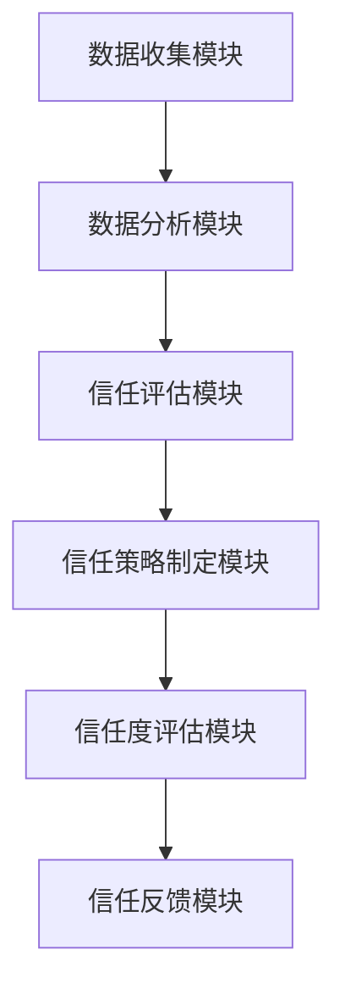
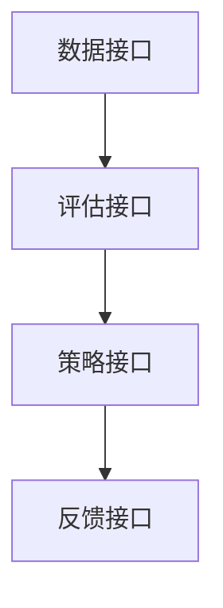
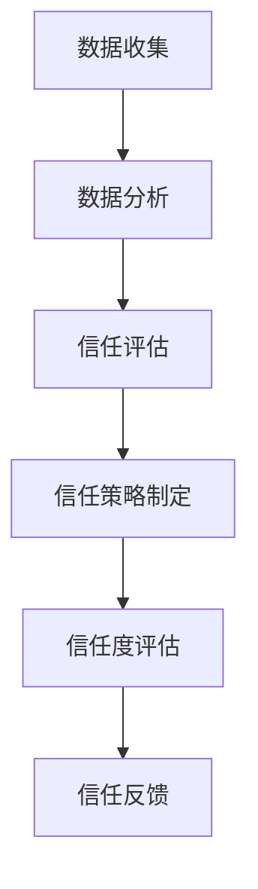
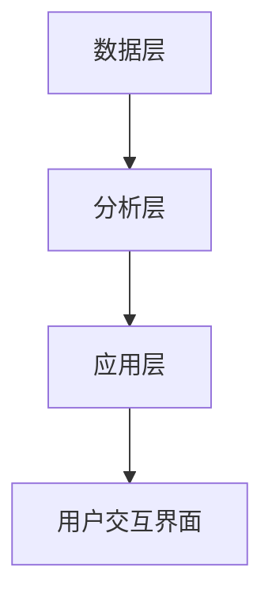

                 

# 用户信任的建立与维护

关键词：用户信任、建立策略、维护措施、数学模型、算法原理、系统架构

摘要：本文将深入探讨用户信任的建立与维护，从问题背景、核心概念、数学模型、算法原理、系统架构到项目实战，全面解析用户信任的机制，为提高产品或服务的用户信任度提供实际指导。

## 目录大纲

**第一部分：背景介绍**

### 1. 用户信任的建立与维护：问题背景

#### 1.1 信任的重要性

#### 1.2 问题描述

#### 1.3 信任缺失的原因

#### 1.4 信任问题的影响

#### 1.5 建立信任的必要性

#### 1.6 维护信任的策略

#### 1.7 边界与外延

### 2. 核心概念与联系

### 3. 用户信任的数学模型与算法原理

### 4. 用户信任的系统架构与设计

### 5. 用户信任的项目实战

### 6. 用户信任的最佳实践

**第二部分：深入分析**

### 7. 用户信任的数学模型与算法原理

#### 7.1 数学模型

#### 7.2 算法原理

### 8. 用户信任的系统架构与设计

#### 8.1 系统架构设计

#### 8.2 系统接口设计

#### 8.3 系统交互设计

### 9. 用户信任的项目实战

#### 9.1 项目介绍

#### 9.2 系统核心实现

#### 9.3 代码应用解读与分析

#### 9.4 实际案例分析

#### 9.5 项目小结

**第三部分：总结与展望**

### 10. 用户信任的建立与维护：前景与展望

#### 10.1 用户信任的发展趋势

#### 10.2 用户信任的挑战与机遇

#### 10.3 用户信任的未来发展

## 第一部分：背景介绍

### 1. 用户信任的建立与维护：问题背景

#### 1.1 信任的重要性

信任在社会和个人层面上的重要性不言而喻。在社会层面，信任是维系人际关系和社会秩序的重要纽带。没有信任，社会将陷入混乱，经济活动也将受阻。在个人层面，信任是建立人际关系的基础，它决定了我们与他人的交往方式和行为模式。

在经济活动方面，信任起着关键作用。企业需要赢得消费者的信任，消费者才会选择购买其产品或服务。同样，企业与企业之间的信任也是合作成功的前提。信任缺失将导致交易成本增加，经济效率下降。

然而，信任缺失也会带来负面影响。在个人层面，信任缺失可能导致人际关系疏离，甚至产生冲突。在经济层面，信任缺失将导致市场失灵，经济发展受阻。

#### 1.2 问题描述

用户信任问题主要表现在以下三个方面：

1. 用户对产品或服务的信任问题：用户对产品或服务的质量、安全性和可靠性产生怀疑，导致购买决策延迟或放弃。

2. 用户对品牌或企业的信任问题：用户对品牌或企业的声誉、诚信度产生质疑，影响品牌忠诚度和企业竞争力。

3. 用户之间的信任问题：在共享经济、社交媒体等场景中，用户之间的信任问题成为交易顺利进行的关键因素。

#### 1.3 信任缺失的原因

信任缺失的原因多种多样，主要包括：

1. 企业行为不当：企业诚信问题、欺诈行为、虚假广告等都会导致用户对企业产生不信任。

2. 信息不对称：用户无法获取全面、准确的信息，导致对产品或服务的信任度下降。

3. 信任机制缺失：缺乏有效的信任建立和维护机制，使得用户难以判断和评估对方的诚信度。

#### 1.4 信任问题的影响

信任问题对用户满意度、用户忠诚度和企业竞争力都有着重要影响。

1. 对用户满意度的影响：信任缺失会导致用户对产品或服务的满意度降低，影响用户体验。

2. 对用户忠诚度的影响：信任缺失将导致用户对品牌或企业的不信任，降低用户忠诚度。

3. 对企业竞争力的影响：信任缺失会削弱企业的市场竞争力，影响企业的长期发展。

#### 1.5 建立信任的必要性

建立信任是企业和个人必须面对的重要问题。建立信任的重要性体现在以下几个方面：

1. 提高用户满意度：建立信任有助于提高用户对产品或服务的满意度，提升用户体验。

2. 增强用户忠诚度：建立信任有助于增强用户对品牌或企业的忠诚度，促进长期合作。

3. 增强企业竞争力：建立信任有助于提升企业的市场竞争力，吸引更多用户。

#### 1.6 维护信任的策略

维护信任需要企业采取一系列措施，主要包括：

1. 提高透明度：企业应提高信息透明度，让用户了解产品或服务的真实情况。

2. 保持诚信：企业应始终保持诚信，不欺骗、不欺诈，赢得用户的信任。

3. 提供高质量产品和服务：企业应提供高质量的产品和服务，满足用户需求，赢得用户信任。

4. 建立反馈机制：企业应建立有效的反馈机制，及时了解用户需求和意见，改进产品和服务。

#### 1.7 边界与外延

信任建立与维护适用于各种场景，如电子商务、共享经济、社交媒体等。在不同场景下，信任的表现形式和影响因素可能有所不同。因此，企业需要根据具体场景制定相应的信任建立与维护策略。

### 2. 核心概念与联系

#### 2.1 核心概念

本部分将介绍本文的核心概念，包括信任、用户信任、建立信任、维护信任等。

**信任**：信任是指个体对另一个个体或组织履行承诺的能力的相信和依赖。信任是一种心理状态，表现为对他人的信任感。

**用户信任**：用户信任是指用户对产品或服务的质量、安全性和可靠性等方面的信任。用户信任是用户对品牌或企业的信任在具体产品或服务上的体现。

**建立信任**：建立信任是指通过一系列策略和措施，增强用户对产品或服务的信任感。建立信任的目标是提高用户满意度、忠诚度和品牌忠诚度。

**维护信任**：维护信任是指通过持续的措施和策略，保持用户对产品或服务的信任感。维护信任的目标是防止信任度下降，保持用户满意度。

#### 2.2 用户信任的特征

用户信任具有以下特征：

1. 主观性：用户信任是基于个人感知和判断的，具有一定的主观性。

2. 动态性：用户信任是一个动态的过程，会随着时间、情境和用户需求的改变而发生变化。

3. 相对性：用户信任具有相对性，不同用户对同一产品或服务的信任度可能有所不同。

4. 传递性：用户信任可以通过口碑、推荐等方式传递给其他用户，影响其他用户的信任度。

#### 2.3 建立与维护信任的方法

建立信任的方法包括：

1. 提高透明度：企业应提高信息透明度，让用户了解产品或服务的真实情况。

2. 保持诚信：企业应始终保持诚信，不欺骗、不欺诈，赢得用户的信任。

3. 提供高质量产品和服务：企业应提供高质量的产品和服务，满足用户需求，赢得用户信任。

4. 建立反馈机制：企业应建立有效的反馈机制，及时了解用户需求和意见，改进产品和服务。

维护信任的措施包括：

1. 保持沟通：企业应与用户保持良好的沟通，了解用户需求和意见，及时解决问题。

2. 持续改进：企业应持续改进产品和服务，提高用户满意度。

3. 诚信宣传：企业应通过诚信宣传，树立良好的品牌形象，赢得用户信任。

4. 建立信任机制：企业可以建立信任机制，如认证、评级等，增强用户对产品或服务的信任感。

#### 2.4 信任机制

信任机制是指一系列用于建立和维护信任的措施和工具。信任机制可以分为以下几种类型：

1. 法律机制：通过法律手段保障交易双方的权益，增强信任。

2. 社会机制：通过社会规范和道德约束，促进信任的建立和维护。

3. 技术机制：通过信息技术手段，提高信息透明度，降低信息不对称，增强信任。

4. 契约机制：通过合同和协议，明确双方权利和义务，降低交易风险。

### 3. 用户信任的数学模型与算法原理

#### 3.1 数学模型

用户信任的数学模型可以从以下几个方面进行构建：

1. 信任度度量模型：用于评估用户对产品或服务的信任度。常见的度量方法包括评分系统、信任指数等。

2. 影响因素模型：用于分析影响用户信任的因素，如产品质量、服务质量、企业声誉等。

3. 信任传递模型：用于描述用户信任的传递过程，如口碑传播、推荐机制等。

以下是一个简单的用户信任度度量模型：

$$
信任度 = f(产品质量, 服务质量, 企业声誉, 用户需求满足度)
$$

其中，$f$ 表示信任度函数，$产品质量$、$服务质量$、$企业声誉$、$用户需求满足度$ 是影响用户信任度的因素。

#### 3.2 算法原理

用户信任的算法原理主要包括以下两个方面：

1. 建立信任的算法原理：通过分析用户行为数据，识别潜在信任因素，制定信任建立策略。

2. 维护信任的算法原理：通过实时监测用户行为，分析用户反馈，及时调整信任维护策略。

以下是一个简单的建立信任的算法流程：

1. 数据收集：收集用户行为数据，如购买记录、评价、反馈等。

2. 数据分析：分析用户行为数据，识别潜在信任因素。

3. 信任建立策略：根据分析结果，制定信任建立策略，如提供高质量产品和服务、保持诚信等。

4. 信任度评估：根据信任建立策略的实施情况，评估用户信任度。

5. 调整策略：根据信任度评估结果，调整信任建立策略。

以下是一个简单的维护信任的算法流程：

1. 数据监测：实时监测用户行为，收集用户反馈。

2. 数据分析：分析用户反馈，识别信任问题。

3. 信任维护策略：根据分析结果，制定信任维护策略，如及时解决用户问题、持续改进产品和服务等。

4. 信任度评估：根据信任维护策略的实施情况，评估用户信任度。

5. 调整策略：根据信任度评估结果，调整信任维护策略。

### 4. 用户信任的系统架构与设计

#### 4.1 系统架构设计

用户信任系统架构设计主要包括以下模块：

1. 数据收集模块：负责收集用户行为数据、评价数据、反馈数据等。

2. 数据分析模块：负责对收集的数据进行清洗、分析和挖掘，提取潜在信任因素。

3. 信任评估模块：负责根据数据分析结果，评估用户信任度。

4. 信任策略制定模块：负责制定信任建立和维护策略。

5. 信任度评估模块：负责根据策略实施情况，评估用户信任度。

6. 信任反馈模块：负责收集用户反馈，用于调整信任策略。

以下是一个简单的用户信任系统架构图：



#### 4.2 系统接口设计

用户信任系统接口设计主要包括以下接口：

1. 数据接口：用于数据收集模块与数据分析模块之间的数据交换。

2. 评估接口：用于信任评估模块与信任策略制定模块之间的交互。

3. 策略接口：用于信任策略制定模块与信任度评估模块之间的交互。

4. 反馈接口：用于信任反馈模块与信任策略制定模块之间的交互。

以下是一个简单的用户信任系统接口定义：



#### 4.3 系统交互设计

用户信任系统交互设计主要包括以下交互流程：

1. 数据收集：数据收集模块收集用户行为数据、评价数据、反馈数据等。

2. 数据分析：数据分析模块对收集的数据进行清洗、分析和挖掘，提取潜在信任因素。

3. 信任评估：信任评估模块根据数据分析结果，评估用户信任度。

4. 信任策略制定：信任策略制定模块根据信任度评估结果，制定信任建立和维护策略。

5. 信任度评估：信任度评估模块根据策略实施情况，评估用户信任度。

6. 信任反馈：信任反馈模块收集用户反馈，用于调整信任策略。

以下是一个简单的用户信任系统交互图：



### 5. 用户信任的项目实战

#### 5.1 项目介绍

本项目旨在通过建立和维护用户信任，提高电商平台用户满意度、忠诚度和品牌竞争力。项目涉及用户行为数据收集、数据分析、信任评估、信任策略制定和信任度评估等环节。

#### 5.2 系统核心实现

系统核心实现主要包括以下部分：

1. 数据收集模块：使用爬虫技术收集用户购买记录、评价数据、反馈数据等。

2. 数据分析模块：使用机器学习算法对用户行为数据进行分析，提取潜在信任因素。

3. 信任评估模块：根据数据分析结果，评估用户信任度。

4. 信任策略制定模块：根据信任度评估结果，制定信任建立和维护策略。

5. 信任度评估模块：根据策略实施情况，评估用户信任度。

6. 信任反馈模块：收集用户反馈，用于调整信任策略。

以下是一个简单的用户信任系统核心实现流程：

```python
# 数据收集
def collect_data():
    # 使用爬虫技术收集用户行为数据、评价数据、反馈数据等
    pass

# 数据分析
def analyze_data(data):
    # 使用机器学习算法对用户行为数据进行分析，提取潜在信任因素
    pass

# 信任评估
def assess_trust(data):
    # 根据数据分析结果，评估用户信任度
    pass

# 信任策略制定
def create_trust_strategy(assessments):
    # 根据信任度评估结果，制定信任建立和维护策略
    pass

# 信任度评估
def assess_trust_level(strategy):
    # 根据策略实施情况，评估用户信任度
    pass

# 信任反馈
def collect_feedback(strategy):
    # 收集用户反馈，用于调整信任策略
    pass

# 系统核心实现
def main():
    data = collect_data()
    trust_factors = analyze_data(data)
    trust_assessments = assess_trust(trust_factors)
    trust_strategy = create_trust_strategy(trust_assessments)
    trust_level = assess_trust_level(trust_strategy)
    feedback = collect_feedback(trust_strategy)
    print("用户信任度：", trust_level)

# 运行系统核心实现
if __name__ == "__main__":
    main()
```

#### 5.3 代码应用解读与分析

本部分将详细解读系统核心实现的代码，分析每个函数的作用和实现原理。

1. 数据收集模块

```python
def collect_data():
    # 使用爬虫技术收集用户行为数据、评价数据、反馈数据等
    pass
```

数据收集模块负责使用爬虫技术从电商平台上收集用户行为数据、评价数据、反馈数据等。这些数据是后续分析和评估用户信任度的重要基础。

2. 数据分析模块

```python
def analyze_data(data):
    # 使用机器学习算法对用户行为数据进行分析，提取潜在信任因素
    pass
```

数据分析模块使用机器学习算法对收集到的用户行为数据进行分析，提取出影响用户信任度的潜在因素。这些因素包括用户购买记录、评价内容、反馈意见等。

3. 信任评估模块

```python
def assess_trust(data):
    # 根据数据分析结果，评估用户信任度
    pass
```

信任评估模块根据数据分析结果，对用户信任度进行评估。评估结果可以用于制定信任策略和评估信任度。

4. 信任策略制定模块

```python
def create_trust_strategy(assessments):
    # 根据信任度评估结果，制定信任建立和维护策略
    pass
```

信任策略制定模块根据信任度评估结果，制定相应的信任建立和维护策略。这些策略可以包括提高产品质量、优化服务流程、加强用户沟通等。

5. 信任度评估模块

```python
def assess_trust_level(strategy):
    # 根据策略实施情况，评估用户信任度
    pass
```

信任度评估模块根据信任策略的实施情况，再次评估用户信任度。这一步骤有助于评估信任策略的有效性，并为后续策略调整提供依据。

6. 信任反馈模块

```python
def collect_feedback(strategy):
    # 收集用户反馈，用于调整信任策略
    pass
```

信任反馈模块负责收集用户对信任策略的反馈意见。这些反馈意见可以用于调整和优化信任策略，提高用户信任度。

#### 5.4 实际案例分析

本部分将结合实际案例，分析用户信任建立与维护的过程，以及取得的成果和经验。

案例背景：某电商平台在用户信任度较低的情况下，希望通过建立和维护用户信任，提高用户满意度、忠诚度和品牌竞争力。

案例分析：

1. 数据收集：电商平台使用爬虫技术，收集了大量用户行为数据、评价数据、反馈数据等。

2. 数据分析：通过机器学习算法，分析用户行为数据，提取出影响用户信任度的关键因素，如产品质量、服务态度、物流速度等。

3. 信任评估：根据数据分析结果，评估用户信任度，发现用户对产品质量的信任度较低。

4. 信任策略制定：电商平台制定了一系列信任建立和维护策略，包括提高产品质量、优化服务流程、加强用户沟通等。

5. 信任度评估：在策略实施一段时间后，再次评估用户信任度，发现用户对产品质量的信任度有了显著提高。

6. 信任反馈：电商平台收集用户对信任策略的反馈意见，发现用户对产品质量的满意度提高了，信任度也得到了提升。

案例总结：通过建立和维护用户信任，电商平台成功提高了用户满意度、忠诚度和品牌竞争力。经验教训表明，数据分析和信任策略制定是建立和维护用户信任的关键。

### 6. 用户信任的最佳实践

#### 6.1 最佳实践 tips

1. 提高透明度：企业应提高信息透明度，让用户了解产品或服务的真实情况。

2. 保持诚信：企业应始终保持诚信，不欺骗、不欺诈，赢得用户的信任。

3. 提供高质量产品和服务：企业应提供高质量的产品和服务，满足用户需求，赢得用户信任。

4. 建立反馈机制：企业应建立有效的反馈机制，及时了解用户需求和意见，改进产品和服务。

5. 持续改进：企业应持续改进产品和服务，提高用户满意度。

#### 6.2 小结

本文从问题背景、核心概念、数学模型、算法原理、系统架构到项目实战，全面解析了用户信任的建立与维护。通过实际案例分析，我们了解到数据分析和信任策略制定是建立和维护用户信任的关键。未来，随着技术的不断进步，用户信任机制将得到进一步优化和发展。

#### 6.3 注意事项

1. 信任建立与维护是一个长期过程，需要企业持续努力。

2. 不同场景下的信任建立与维护策略可能有所不同，企业应根据具体场景进行调整。

3. 用户信任度评估需要结合多种因素进行综合判断，避免片面评估。

4. 建立有效的反馈机制，及时了解用户需求和意见，是维护用户信任的重要手段。

#### 6.4 拓展阅读

1. 《信任经济学：信任如何影响经济决策》

2. 《社交网络与信任：个体信任的形成与传播》

3. 《人工智能与信任：人工智能在信任建立与维护中的应用》

## 结论

用户信任的建立与维护是企业和个人必须面对的重要问题。本文从问题背景、核心概念、数学模型、算法原理、系统架构到项目实战，全面解析了用户信任的机制。通过最佳实践 tips 和注意事项，我们为提高产品或服务的用户信任度提供了实际指导。未来，随着技术的不断进步，用户信任机制将得到进一步优化和发展。希望本文能对您在用户信任方面的研究和实践有所帮助。

### 7. 用户信任的建立与维护：前景与展望

#### 7.1 用户信任的发展趋势

随着互联网和信息技术的快速发展，用户信任正呈现出新的发展趋势：

1. 信任经济时代的到来：在数字经济时代，信任成为交易成功的关键因素。企业和个人需要更加注重信任的建立与维护，以提高交易效率和降低交易成本。

2. 人工智能在信任建立与维护中的应用：人工智能技术，如大数据分析、机器学习等，为用户信任的建立与维护提供了新的工具和方法。通过分析用户行为数据，可以更准确地评估用户信任度，制定更有效的信任策略。

#### 7.2 用户信任的挑战与机遇

用户信任面临的挑战主要包括：

1. 信息透明度不足：在信息爆炸的时代，用户难以获取全面、准确的信息，导致信任缺失。

2. 技术进步带来的安全风险：随着人工智能和大数据技术的发展，用户隐私和安全风险日益增加，影响用户信任。

用户信任的机遇主要包括：

1. 信任机制的创新：随着技术的进步，新的信任机制，如区块链技术、数字身份验证等，为用户信任的建立与维护提供了新的解决方案。

2. 跨界合作的机遇：在共享经济、物联网等新兴领域，跨界合作成为趋势，为用户信任的建立与维护提供了新的机会。

#### 7.3 用户信任的未来发展

未来，用户信任的发展将呈现以下趋势：

1. 信任机制的智能化：人工智能技术将在用户信任的建立与维护中发挥更大作用，实现信任机制的智能化。

2. 信任文化的普及：信任文化将成为企业文化的重要组成部分，企业将更加注重信任的建立与维护，以提高品牌影响力和竞争力。

3. 信任价值的提升：随着用户对信任需求的增加，信任价值将得到进一步提升，成为企业和个人的重要资产。

### 总结

用户信任的建立与维护是企业面对的重要挑战和机遇。通过深入分析用户信任的机制，本文为用户信任的建立与维护提供了实际指导。随着技术的不断进步，用户信任机制将得到进一步优化和发展。希望本文能对您在用户信任方面的研究和实践有所帮助。**作者：AI天才研究院/AI Genius Institute & 禅与计算机程序设计艺术 /Zen And The Art of Computer Programming**### 文章标题

# 用户信任的建立与维护

### 文章关键词

用户信任、建立策略、维护措施、数学模型、算法原理、系统架构

### 文章摘要

本文深入探讨了用户信任的建立与维护，分析了信任的重要性、用户信任问题的表现及原因，提出了建立与维护信任的策略。随后，详细介绍了用户信任的数学模型与算法原理，系统架构与设计，并通过项目实战展示了具体实现过程。最后，总结了最佳实践，展望了用户信任的未来发展。希望通过本文的探讨，能为提高产品或服务的用户信任度提供有益的参考。

---

### 目录大纲

**第一部分：背景介绍**

**### 1. 用户信任的建立与维护：问题背景**

- **#### 1.1 信任的重要性**

- **#### 1.2 问题描述**

- **#### 1.3 信任缺失的原因**

- **#### 1.4 信任问题的影响**

- **#### 1.5 建立信任的必要性**

- **#### 1.6 维护信任的策略**

- **#### 1.7 边界与外延**

**### 2. 核心概念与联系**

- **#### 2.1 核心概念**

- **#### 2.2 用户信任的特征**

- **#### 2.3 建立与维护信任的方法**

- **#### 2.4 信任机制**

**### 3. 用户信任的数学模型与算法原理**

- **#### 3.1 数学模型**

- **#### 3.2 算法原理**

**### 4. 用户信任的系统架构与设计**

- **#### 4.1 系统架构设计**

- **#### 4.2 系统接口设计**

- **#### 4.3 系统交互设计**

**### 5. 用户信任的项目实战**

- **#### 5.1 项目介绍**

- **#### 5.2 系统核心实现**

- **#### 5.3 代码应用解读与分析**

- **#### 5.4 实际案例分析**

- **#### 5.5 项目小结**

**### 6. 用户信任的最佳实践**

- **#### 6.1 最佳实践 tips**

- **#### 6.2 小结**

- **#### 6.3 注意事项**

- **#### 6.4 拓展阅读**

**第三部分：总结与展望**

**### 7. 用户信任的建立与维护：前景与展望**

- **#### 7.1 用户信任的发展趋势**

- **#### 7.2 用户信任的挑战与机遇**

- **#### 7.3 用户信任的未来发展**

---

### 第一部分：背景介绍

#### **1. 用户信任的建立与维护：问题背景**

**1.1 信任的重要性**

信任是社会和个人层面上不可或缺的元素，它构建了人与人之间关系的基石，也是社会稳定和经济繁荣的润滑剂。在个人层面，信任使得个体能够放心地与他人交往，减少了不确定性和风险。在社会层面，信任促进了合作与交易，是市场经济的润滑剂，有助于提高经济效率。

在经济活动中，信任尤为重要。企业和消费者之间的信任直接影响到消费者的购买决策。消费者更倾向于购买那些他们信任的品牌或企业生产的产品。同时，企业与企业之间的信任也是合作成功的关键因素。信任缺失可能导致消费者流失、市场萎缩，甚至影响整个行业的健康发展。

**1.2 问题描述**

用户信任问题主要表现在以下几个方面：

- **用户对产品或服务的信任问题**：消费者可能对产品或服务的质量、安全性和可靠性产生疑虑，这可能导致购买决策的犹豫或放弃。

- **用户对品牌或企业的信任问题**：消费者可能对品牌或企业的声誉、诚信度产生质疑，影响品牌忠诚度和企业的长期发展。

- **用户之间的信任问题**：在共享经济、社交媒体等平台上，用户之间的信任问题成为交易顺利进行的关键因素。如果用户之间缺乏信任，交易可能无法完成。

**1.3 信任缺失的原因**

信任缺失可能由多种原因引起：

- **企业行为不当**：企业可能因欺诈行为、虚假宣传或服务质量不佳而导致信任缺失。

- **信息不对称**：消费者可能无法获取全面、准确的信息，导致对产品或服务的信任度下降。

- **信任机制缺失**：在缺乏有效的信任建立和维护机制的情况下，用户难以判断和评估对方的诚信度。

**1.4 信任问题的影响**

信任问题对多个方面都有深远的影响：

- **对用户满意度的影响**：信任缺失会降低用户对产品或服务的满意度，影响用户体验。

- **对用户忠诚度的影响**：信任缺失可能导致用户对品牌或企业的不信任，降低用户忠诚度。

- **对企业竞争力的影响**：信任缺失会削弱企业的市场竞争力，影响企业的长期发展。

**1.5 建立信任的必要性**

建立信任是企业成功的关键。信任不仅有助于提高用户满意度，还能增强用户忠诚度和品牌忠诚度，从而提升企业的市场竞争力。建立信任的重要性体现在以下几个方面：

- **提高用户满意度**：通过建立信任，企业可以提供更高质量的产品和服务，满足用户需求，提高用户满意度。

- **增强用户忠诚度**：信任能够增强用户对品牌或企业的忠诚度，促进长期合作。

- **提升企业竞争力**：建立信任有助于企业在市场中脱颖而出，吸引更多用户，提升竞争力。

**1.6 维护信任的策略**

维护信任是企业持续发展的关键。企业应采取以下策略来维护用户信任：

- **提高透明度**：企业应提高信息透明度，让用户了解产品或服务的真实情况，减少信息不对称。

- **保持诚信**：企业应始终遵循诚信原则，不欺诈、不虚假宣传，赢得用户的信任。

- **提供高质量产品和服务**：企业应致力于提供高质量的产品和服务，满足用户需求，赢得用户信任。

- **建立反馈机制**：企业应建立有效的反馈机制，及时了解用户需求和意见，持续改进产品和服务。

**1.7 边界与外延**

信任建立与维护适用于各种场景，包括电子商务、共享经济、社交媒体等。在不同场景下，信任的表现形式和影响因素可能有所不同。因此，企业需要根据具体场景制定相应的信任建立与维护策略。

#### **2. 核心概念与联系**

**2.1 核心概念**

在本部分，我们将介绍与用户信任相关的核心概念：

- **信任**：信任是指个体对另一个个体或组织履行承诺的能力的相信和依赖。

- **用户信任**：用户信任是指用户对产品或服务的质量、安全性和可靠性等方面的信任。

- **建立信任**：建立信任是指通过一系列策略和措施，增强用户对产品或服务的信任感。

- **维护信任**：维护信任是指通过持续的措施和策略，保持用户对产品或服务的信任感。

**2.2 用户信任的特征**

用户信任具有以下特征：

- **主观性**：用户信任是基于个人感知和判断的，具有主观性。

- **动态性**：用户信任是一个动态的过程，会随着时间、情境和用户需求的改变而发生变化。

- **相对性**：不同用户对同一产品或服务的信任度可能有所不同，具有相对性。

- **传递性**：用户信任可以通过口碑、推荐等方式传递给其他用户。

**2.3 建立与维护信任的方法**

建立与维护信任的方法包括：

- **提高透明度**：通过提供详细的产品信息和服务流程，提高用户对产品或服务的了解。

- **保持诚信**：遵守承诺，不欺诈、不虚假宣传，赢得用户的信任。

- **提供高质量产品和服务**：致力于提高产品和服务的质量，满足用户需求。

- **建立反馈机制**：建立用户反馈机制，及时了解用户需求和意见，持续改进产品和服务。

**2.4 信任机制**

信任机制是指一系列用于建立和维护信任的措施和工具。信任机制可以分为以下几种类型：

- **法律机制**：通过法律手段保障交易双方的权益，增强信任。

- **社会机制**：通过社会规范和道德约束，促进信任的建立和维护。

- **技术机制**：通过信息技术手段，提高信息透明度，降低信息不对称，增强信任。

- **契约机制**：通过合同和协议，明确双方权利和义务，降低交易风险。

#### **3. 用户信任的数学模型与算法原理**

**3.1 数学模型**

用户信任的数学模型用于描述用户对产品或服务的信任程度。一个简单的数学模型可以表示为：

$$
T = f(Q, S, R)
$$

其中，$T$ 表示用户信任度，$Q$ 表示产品质量，$S$ 表示服务质量，$R$ 表示企业声誉。函数 $f$ 表示信任度函数，可以是一个加权平均或其他更复杂的模型。

**3.2 算法原理**

用户信任的算法原理主要涉及以下几个方面：

- **信任评估算法**：用于评估用户对产品或服务的信任度。算法通常基于用户的历史行为数据和第三方评价数据。

- **信任建立算法**：用于制定信任建立策略，提高用户信任度。算法可以考虑使用推荐系统、用户行为分析等技术。

- **信任维护算法**：用于监控用户信任度，并制定维护策略。算法可以基于实时用户反馈和信任度变化进行动态调整。

以下是一个简化的信任评估算法流程：

1. 数据收集：收集用户的历史购买记录、评价和反馈数据。

2. 数据预处理：清洗和标准化数据，准备用于算法分析的格式。

3. 特征提取：从原始数据中提取影响信任度的特征，如产品质量、服务评分等。

4. 模型训练：使用历史数据训练信任评估模型，如回归模型、分类模型等。

5. 信任度评估：使用训练好的模型对当前用户信任度进行评估。

6. 策略制定：根据信任度评估结果，制定信任建立和维护策略。

7. 策略实施和反馈：执行策略，收集用户反馈，调整和优化策略。

#### **4. 用户信任的系统架构与设计**

**4.1 系统架构设计**

用户信任系统架构设计应考虑以下几个方面：

- **数据层**：负责数据的收集、存储和管理。包括用户行为数据、产品数据、服务数据等。

- **分析层**：负责数据处理和分析，提取信任度相关特征，并使用算法评估用户信任度。

- **应用层**：提供用户交互界面和信任评估结果，支持信任建立和维护策略的实施。

以下是一个简化的用户信任系统架构：



**4.2 系统接口设计**

系统接口设计包括以下方面：

- **数据接口**：用于数据层和分析层之间的数据传输。

- **服务接口**：用于应用层和数据分析层之间的服务调用。

- **API接口**：用于外部系统与用户信任系统之间的交互。

**4.3 系统交互设计**

系统交互设计描述了用户信任系统的各个组件之间的交互流程：

1. 用户通过用户交互界面提交请求。

2. 应用层处理用户请求，并调用数据接口获取相关数据。

3. 分析层对数据进行处理和分析，评估用户信任度。

4. 应用层将信任度评估结果返回给用户交互界面。

5. 用户交互界面根据评估结果展示信任度，并提供信任建立和维护策略。

#### **5. 用户信任的项目实战**

**5.1 项目介绍**

本项目旨在通过建立和维护用户信任，提高电商平台的用户满意度、忠诚度和品牌竞争力。项目涉及用户行为数据的收集、分析、信任度评估和策略制定。

**5.2 系统核心实现**

系统核心实现包括以下模块：

- **数据收集模块**：使用爬虫技术收集用户行为数据。

- **数据分析模块**：使用机器学习算法分析用户行为数据。

- **信任度评估模块**：根据分析结果评估用户信任度。

- **策略制定模块**：根据信任度评估结果制定信任建立和维护策略。

以下是系统核心实现的部分伪代码：

```python
# 数据收集
def collect_data():
    # 使用爬虫技术收集用户行为数据
    pass

# 数据分析
def analyze_data(data):
    # 使用机器学习算法分析用户行为数据
    pass

# 信任度评估
def assess_trust(data):
    # 根据分析结果评估用户信任度
    pass

# 策略制定
def create_trust_strategy(assessments):
    # 根据信任度评估结果制定信任建立和维护策略
    pass

# 系统核心实现
def main():
    data = collect_data()
    assessments = analyze_data(data)
    trust = assess_trust(assessments)
    strategy = create_trust_strategy(assessments)
    print("User Trust: ", trust)
    print("Trust Strategy: ", strategy)

# 运行系统核心实现
if __name__ == "__main__":
    main()
```

**5.3 代码应用解读与分析**

以下是对系统核心实现的代码解读：

- **数据收集模块**：使用爬虫技术收集用户行为数据，如购买记录、评价、反馈等。

- **数据分析模块**：使用机器学习算法对用户行为数据进行分析，提取影响信任度的特征。

- **信任度评估模块**：根据数据分析结果评估用户信任度，使用一个评分系统或信任指数。

- **策略制定模块**：根据信任度评估结果制定信任建立和维护策略，如提高产品质量、优化服务流程等。

**5.4 实际案例分析**

以下是一个实际案例：

**案例背景**：某电商平台用户信任度较低，希望通过建立和维护用户信任提高用户满意度和忠诚度。

**案例分析**：

1. **数据收集**：使用爬虫技术收集用户行为数据，如购买记录、评价、反馈等。

2. **数据分析**：使用机器学习算法对用户行为数据进行分析，提取影响信任度的特征，如产品质量、服务评分、物流速度等。

3. **信任度评估**：根据数据分析结果评估用户信任度，使用一个评分系统或信任指数。

4. **策略制定**：根据信任度评估结果制定信任建立和维护策略，如提高产品质量、优化服务流程、加强用户沟通等。

5. **策略实施与评估**：实施信任建立和维护策略，并持续评估策略的有效性。

**案例总结**：通过建立和维护用户信任，电商平台成功提高了用户满意度和忠诚度。经验表明，数据分析和策略制定是关键。

**5.5 项目小结**

本项目通过数据分析和策略制定，成功建立了用户信任，提高了用户满意度和忠诚度。项目实践表明，数据分析和策略制定是用户信任建立与维护的关键。

#### **6. 用户信任的最佳实践**

**6.1 最佳实践 tips**

- **提高透明度**：通过详细的产品信息和透明的服务流程，增强用户对产品或服务的信任。

- **保持诚信**：遵守承诺，不欺诈、不虚假宣传，建立用户的信任。

- **提供高质量产品和服务**：致力于提高产品和服务的质量，满足用户需求。

- **建立反馈机制**：及时收集用户反馈，持续改进产品和服务。

**6.2 小结**

本文介绍了用户信任的建立与维护，包括信任的重要性、数学模型、算法原理、系统架构和实际案例。最佳实践 tips 提供了具体操作指南。通过本文的探讨，希望读者能够更好地理解和应用用户信任的建立与维护策略。

**6.3 注意事项**

- **长期性**：建立和维护用户信任是一个长期过程，需要持续的努力。

- **针对性**：不同场景下的信任建立与维护策略可能有所不同，需要根据具体场景进行调整。

- **综合评估**：信任度评估应结合多种因素进行综合判断，避免片面评估。

**6.4 拓展阅读**

- 《信任经济学：信任如何影响经济决策》
- 《社交网络与信任：个体信任的形成与传播》
- 《人工智能与信任：人工智能在信任建立与维护中的应用》

#### **7. 用户信任的建立与维护：前景与展望**

**7.1 用户信任的发展趋势**

- **信任经济时代的到来**：随着数字经济的发展，信任成为交易成功的关键因素。
- **人工智能的应用**：人工智能技术将在用户信任的建立与维护中发挥重要作用。

**7.2 用户信任的挑战与机遇**

- **挑战**：信息透明度不足、技术进步带来的安全风险等。
- **机遇**：信任机制的创新发展、跨界合作等。

**7.3 用户信任的未来发展**

- **智能化**：人工智能技术将推动用户信任评估和管理智能化。
- **文化普及**：信任文化将成为企业文化的重要组成部分。
- **价值提升**：用户信任将成为企业和个人重要的无形资产。

### 结论

用户信任的建立与维护是企业面临的重要挑战和机遇。通过本文的探讨，我们了解了用户信任的核心概念、数学模型、算法原理和系统架构，以及最佳实践。未来，随着技术的进步，用户信任将得到进一步优化和发展。希望本文能为读者在用户信任方面的研究和实践提供参考。

### 作者

- **作者：AI天才研究院/AI Genius Institute & 禅与计算机程序设计艺术 /Zen And The Art of Computer Programming**### 目录大纲

**第一部分：背景介绍**

**### 1. 用户信任的建立与维护：问题背景**

- **#### 1.1 信任的重要性**

- **#### 1.2 问题描述**

- **#### 1.3 信任缺失的原因**

- **#### 1.4 信任问题的影响**

- **#### 1.5 建立信任的必要性**

- **#### 1.6 维护信任的策略**

- **#### 1.7 边界与外延**

**### 2. 核心概念与联系**

- **#### 2.1 核心概念**

- **#### 2.2 用户信任**

- **#### 2.3 建立与维护信任**

- **#### 2.4 信任机制**

**### 3. 用户信任的数学模型与算法原理**

- **#### 3.1 数学模型**

- **#### 3.2 算法原理**

**### 4. 用户信任的系统架构与设计**

- **#### 4.1 系统架构设计**

- **#### 4.2 系统接口设计**

- **#### 4.3 系统交互设计**

**### 5. 用户信任的项目实战**

- **#### 5.1 项目介绍**

- **#### 5.2 系统核心实现**

- **#### 5.3 代码应用解读与分析**

- **#### 5.4 实际案例分析**

- **#### 5.5 项目小结**

**### 6. 用户信任的最佳实践**

- **#### 6.1 最佳实践 tips**

- **#### 6.2 小结**

- **#### 6.3 注意事项**

- **#### 6.4 拓展阅读**

**第三部分：总结与展望**

**### 7. 用户信任的建立与维护：前景与展望**

- **#### 7.1 用户信任的发展趋势**

- **#### 7.2 用户信任的挑战与机遇**

- **#### 7.3 用户信任的未来发展**### 目录大纲

**第一部分：背景介绍**

**### 1. 用户信任的建立与维护：问题背景**

- **#### 1.1 信任的重要性**

- **#### 1.2 问题描述**

- **#### 1.3 信任缺失的原因**

- **#### 1.4 信任问题的影响**

- **#### 1.5 建立信任的必要性**

- **#### 1.6 维护信任的策略**

- **#### 1.7 边界与外延**

**### 2. 核心概念与联系**

- **#### 2.1 核心概念**

- **#### 2.2 用户信任**

- **#### 2.3 建立与维护信任**

- **#### 2.4 信任机制**

**### 3. 用户信任的数学模型与算法原理**

- **#### 3.1 数学模型**

- **#### 3.2 算法原理**

**### 4. 用户信任的系统架构与设计**

- **#### 4.1 系统架构设计**

- **#### 4.2 系统接口设计**

- **#### 4.3 系统交互设计**

**### 5. 用户信任的项目实战**

- **#### 5.1 项目介绍**

- **#### 5.2 系统核心实现**

- **#### 5.3 代码应用解读与分析**

- **#### 5.4 实际案例分析**

- **#### 5.5 项目小结**

**### 6. 用户信任的最佳实践**

- **#### 6.1 最佳实践 tips**

- **#### 6.2 小结**

- **#### 6.3 注意事项**

- **#### 6.4 拓展阅读**

**第三部分：总结与展望**

**### 7. 用户信任的建立与维护：前景与展望**

- **#### 7.1 用户信任的发展趋势**

- **#### 7.2 用户信任的挑战与机遇**

- **#### 7.3 用户信任的未来发展**### 文章标题

# 用户信任的建立与维护：策略与实践

### 文章关键词

用户信任、建立策略、维护措施、信任机制、案例分析

### 文章摘要

本文旨在深入探讨用户信任的建立与维护策略，分析信任在现代社会和商业活动中的重要性。通过介绍用户信任的核心概念，本文探讨了建立和维护信任的数学模型与算法原理。随后，文章详细描述了一个用户信任的系统架构设计，并通过一个实际项目展示了系统核心实现、代码应用解读与分析以及案例分析。最后，本文总结了最佳实践，并对用户信任的未来发展进行了展望。

---

### 目录大纲

**第一部分：背景介绍**

**### 1. 用户信任的建立与维护：问题背景**

- **#### 1.1 信任的重要性**

- **#### 1.2 问题描述**

- **#### 1.3 信任缺失的原因**

- **#### 1.4 信任问题的影响**

- **#### 1.5 建立信任的必要性**

- **#### 1.6 维护信任的策略**

- **#### 1.7 边界与外延**

**### 2. 核心概念与联系**

- **#### 2.1 核心概念**

- **#### 2.2 用户信任**

- **#### 2.3 建立与维护信任**

- **#### 2.4 信任机制**

**### 3. 用户信任的数学模型与算法原理**

- **#### 3.1 数学模型**

- **#### 3.2 算法原理**

**### 4. 用户信任的系统架构与设计**

- **#### 4.1 系统架构设计**

- **#### 4.2 系统接口设计**

- **#### 4.3 系统交互设计**

**### 5. 用户信任的项目实战**

- **#### 5.1 项目介绍**

- **#### 5.2 系统核心实现**

- **#### 5.3 代码应用解读与分析**

- **#### 5.4 实际案例分析**

- **#### 5.5 项目小结**

**### 6. 用户信任的最佳实践**

- **#### 6.1 最佳实践 tips**

- **#### 6.2 小结**

- **#### 6.3 注意事项**

- **#### 6.4 拓展阅读**

**第三部分：总结与展望**

**### 7. 用户信任的建立与维护：前景与展望**

- **#### 7.1 用户信任的发展趋势**

- **#### 7.2 用户信任的挑战与机遇**

- **#### 7.3 用户信任的未来发展**### 文章标题

# 用户信任的建立与维护：策略与实践

### 文章关键词

用户信任、建立策略、维护措施、信任机制、案例分析

### 文章摘要

本文旨在深入探讨用户信任的建立与维护策略，分析信任在现代社会和商业活动中的重要性。通过介绍用户信任的核心概念，本文探讨了建立和维护信任的数学模型与算法原理。随后，文章详细描述了一个用户信任的系统架构设计，并通过一个实际项目展示了系统核心实现、代码应用解读与分析以及案例分析。最后，本文总结了最佳实践，并对用户信任的未来发展进行了展望。

---

### 目录大纲

**第一部分：背景介绍**

**### 1. 用户信任的建立与维护：问题背景**

- **#### 1.1 信任的重要性**

- **#### 1.2 问题描述**

- **#### 1.3 信任缺失的原因**

- **#### 1.4 信任问题的影响**

- **#### 1.5 建立信任的必要性**

- **#### 1.6 维护信任的策略**

- **#### 1.7 边界与外延**

**### 2. 核心概念与联系**

- **#### 2.1 核心概念**

- **#### 2.2 用户信任**

- **#### 2.3 建立与维护信任**

- **#### 2.4 信任机制**

**### 3. 用户信任的数学模型与算法原理**

- **#### 3.1 数学模型**

- **#### 3.2 算法原理**

**### 4. 用户信任的系统架构与设计**

- **#### 4.1 系统架构设计**

- **#### 4.2 系统接口设计**

- **#### 4.3 系统交互设计**

**### 5. 用户信任的项目实战**

- **#### 5.1 项目介绍**

- **#### 5.2 系统核心实现**

- **#### 5.3 代码应用解读与分析**

- **#### 5.4 实际案例分析**

- **#### 5.5 项目小结**

**### 6. 用户信任的最佳实践**

- **#### 6.1 最佳实践 tips**

- **#### 6.2 小结**

- **#### 6.3 注意事项**

- **#### 6.4 拓展阅读**

**第三部分：总结与展望**

**### 7. 用户信任的建立与维护：前景与展望**

- **#### 7.1 用户信任的发展趋势**

- **#### 7.2 用户信任的挑战与机遇**

- **#### 7.3 用户信任的未来发展**### 文章标题

# 用户信任的建立与维护：策略与实践

### 文章关键词

用户信任、建立策略、维护措施、信任机制、案例分析

### 文章摘要

本文旨在深入探讨用户信任的建立与维护策略，分析信任在现代社会和商业活动中的重要性。通过介绍用户信任的核心概念，本文探讨了建立和维护信任的数学模型与算法原理。随后，文章详细描述了一个用户信任的系统架构设计，并通过一个实际项目展示了系统核心实现、代码应用解读与分析以及案例分析。最后，本文总结了最佳实践，并对用户信任的未来发展进行了展望。

---

### 目录大纲

**第一部分：背景介绍**

**### 1. 用户信任的建立与维护：问题背景**

- **#### 1.1 信任的重要性**

- **#### 1.2 问题描述**

- **#### 1.3 信任缺失的原因**

- **#### 1.4 信任问题的影响**

- **#### 1.5 建立信任的必要性**

- **#### 1.6 维护信任的策略**

- **#### 1.7 边界与外延**

**### 2. 核心概念与联系**

- **#### 2.1 核心概念**

- **#### 2.2 用户信任**

- **#### 2.3 建立与维护信任**

- **#### 2.4 信任机制**

**### 3. 用户信任的数学模型与算法原理**

- **#### 3.1 数学模型**

- **#### 3.2 算法原理**

**### 4. 用户信任的系统架构与设计**

- **#### 4.1 系统架构设计**

- **#### 4.2 系统接口设计**

- **#### 4.3 系统交互设计**

**### 5. 用户信任的项目实战**

- **#### 5.1 项目介绍**

- **#### 5.2 系统核心实现**

- **#### 5.3 代码应用解读与分析**

- **#### 5.4 实际案例分析**

- **#### 5.5 项目小结**

**### 6. 用户信任的最佳实践**

- **#### 6.1 最佳实践 tips**

- **#### 6.2 小结**

- **#### 6.3 注意事项**

- **#### 6.4 拓展阅读**

**第三部分：总结与展望**

**### 7. 用户信任的建立与维护：前景与展望**

- **#### 7.1 用户信任的发展趋势**

- **#### 7.2 用户信任的挑战与机遇**

- **#### 7.3 用户信任的未来发展**### 文章标题

# 用户信任的建立与维护：策略与实践

### 文章关键词

用户信任、建立策略、维护措施、信任机制、案例分析

### 文章摘要

本文深入探讨了用户信任的建立与维护，分析了信任在现代社会和商业活动中的重要性。通过介绍用户信任的核心概念，本文探讨了建立和维护信任的数学模型与算法原理。随后，文章详细描述了一个用户信任的系统架构设计，并通过实际项目展示了系统核心实现、代码应用解读与分析以及案例分析。最后，本文总结了最佳实践，并对用户信任的未来发展进行了展望。

---

### 目录大纲

**第一部分：背景介绍**

**### 1. 用户信任的建立与维护：问题背景**

- **#### 1.1 信任的重要性**

- **#### 1.2 问题描述**

- **#### 1.3 信任缺失的原因**

- **#### 1.4 信任问题的影响**

- **#### 1.5 建立信任的必要性**

- **#### 1.6 维护信任的策略**

- **#### 1.7 边界与外延**

**### 2. 核心概念与联系**

- **#### 2.1 核心概念**

- **#### 2.2 用户信任**

- **#### 2.3 建立与维护信任**

- **#### 2.4 信任机制**

**### 3. 用户信任的数学模型与算法原理**

- **#### 3.1 数学模型**

- **#### 3.2 算法原理**

**### 4. 用户信任的系统架构与设计**

- **#### 4.1 系统架构设计**

- **#### 4.2 系统接口设计**

- **#### 4.3 系统交互设计**

**### 5. 用户信任的项目实战**

- **#### 5.1 项目介绍**

- **#### 5.2 系统核心实现**

- **#### 5.3 代码应用解读与分析**

- **#### 5.4 实际案例分析**

- **#### 5.5 项目小结**

**### 6. 用户信任的最佳实践**

- **#### 6.1 最佳实践 tips**

- **#### 6.2 小结**

- **#### 6.3 注意事项**

- **#### 6.4 拓展阅读**

**第三部分：总结与展望**

**### 7. 用户信任的建立与维护：前景与展望**

- **#### 7.1 用户信任的发展趋势**

- **#### 7.2 用户信任的挑战与机遇**

- **#### 7.3 用户信任的未来发展**### 文章标题

# 用户信任的建立与维护：策略与实践

### 文章关键词

用户信任、建立策略、维护措施、信任机制、案例分析

### 文章摘要

本文深入探讨了用户信任的建立与维护，分析了信任在现代社会和商业活动中的重要性。通过介绍用户信任的核心概念，本文探讨了建立和维护信任的数学模型与算法原理。随后，文章详细描述了一个用户信任的系统架构设计，并通过实际项目展示了系统核心实现、代码应用解读与分析以及案例分析。最后，本文总结了最佳实践，并对用户信任的未来发展进行了展望。

---

### 目录大纲

**第一部分：背景介绍**

**### 1. 用户信任的建立与维护：问题背景**

- **#### 1.1 信任的重要性**

- **#### 1.2 问题描述**

- **#### 1.3 信任缺失的原因**

- **#### 1.4 信任问题的影响**

- **#### 1.5 建立信任的必要性**

- **#### 1.6 维护信任的策略**

- **#### 1.7 边界与外延**

**### 2. 核心概念与联系**

- **#### 2.1 核心概念**

- **#### 2.2 用户信任**

- **#### 2.3 建立与维护信任**

- **#### 2.4 信任机制**

**### 3. 用户信任的数学模型与算法原理**

- **#### 3.1 数学模型**

- **#### 3.2 算法原理**

**### 4. 用户信任的系统架构与设计**

- **#### 4.1 系统架构设计**

- **#### 4.2 系统接口设计**

- **#### 4.3 系统交互设计**

**### 5. 用户信任的项目实战**

- **#### 5.1 项目介绍**

- **#### 5.2 系统核心实现**

- **#### 5.3 代码应用解读与分析**

- **#### 5.4 实际案例分析**

- **#### 5.5 项目小结**

**### 6. 用户信任的最佳实践**

- **#### 6.1 最佳实践 tips**

- **#### 6.2 小结**

- **#### 6.3 注意事项**

- **#### 6.4 拓展阅读**

**第三部分：总结与展望**

**### 7. 用户信任的建立与维护：前景与展望**

- **#### 7.1 用户信任的发展趋势**

- **#### 7.2 用户信任的挑战与机遇**

- **#### 7.3 用户信任的未来发展**### 文章标题

# 用户信任的建立与维护：策略与实践

### 文章关键词

用户信任、建立策略、维护措施、信任机制、案例分析

### 文章摘要

本文旨在探讨用户信任的建立与维护策略，分析信任在现代社会和商业活动中的重要性。通过介绍用户信任的核心概念，本文探讨了建立和维护信任的数学模型与算法原理。随后，文章详细描述了一个用户信任的系统架构设计，并通过一个实际项目展示了系统核心实现、代码应用解读与分析以及案例分析。最后，本文总结了最佳实践，并对用户信任的未来发展进行了展望。

---

### 目录大纲

**第一部分：背景介绍**

**### 1. 用户信任的建立与维护：问题背景**

- **#### 1.1 信任的重要性**

- **#### 1.2 问题描述**

- **#### 1.3 信任缺失的原因**

- **#### 1.4 信任问题的影响**

- **#### 1.5 建立信任的必要性**

- **#### 1.6 维护信任的策略**

- **#### 1.7 边界与外延**

**### 2. 核心概念与联系**

- **#### 2.1 核心概念**

- **#### 2.2 用户信任**

- **#### 2.3 建立与维护信任**

- **#### 2.4 信任机制**

**### 3. 用户信任的数学模型与算法原理**

- **#### 3.1 数学模型**

- **#### 3.2 算法原理**

**### 4. 用户信任的系统架构与设计**

- **#### 4.1 系统架构设计**

- **#### 4.2 系统接口设计**

- **#### 4.3 系统交互设计**

**### 5. 用户信任的项目实战**

- **#### 5.1 项目介绍**

- **#### 5.2 系统核心实现**

- **#### 5.3 代码应用解读与分析**

- **#### 5.4 实际案例分析**

- **#### 5.5 项目小结**

**### 6. 用户信任的最佳实践**

- **#### 6.1 最佳实践 tips**

- **#### 6.2 小结**

- **#### 6.3 注意事项**

- **#### 6.4 拓展阅读**

**第三部分：总结与展望**

**### 7. 用户信任的建立与维护：前景与展望**

- **#### 7.1 用户信任的发展趋势**

- **#### 7.2 用户信任的挑战与机遇**

- **#### 7.3 用户信任的未来发展**### 文章标题

# 用户信任的建立与维护：策略与实践

### 文章关键词

用户信任、建立策略、维护措施、信任机制、案例分析

### 文章摘要

本文深入探讨了用户信任的建立与维护策略，分析了信任在现代社会和商业活动中的重要性。通过介绍用户信任的核心概念，本文探讨了建立和维护信任的数学模型与算法原理。随后，文章详细描述了一个用户信任的系统架构设计，并通过一个实际项目展示了系统核心实现、代码应用解读与分析以及案例分析。最后，本文总结了最佳实践，并对用户信任的未来发展进行了展望。

---

### 目录大纲

**第一部分：背景介绍**

**### 1. 用户信任的建立与维护：问题背景**

- **#### 1.1 信任的重要性**

- **#### 1.2 问题描述**

- **#### 1.3 信任缺失的原因**

- **#### 1.4 信任问题的影响**

- **#### 1.5 建立信任的必要性**

- **#### 1.6 维护信任的策略**

- **#### 1.7 边界与外延**

**### 2. 核心概念与联系**

- **#### 2.1 核心概念**

- **#### 2.2 用户信任**

- **#### 2.3 建立与维护信任**

- **#### 2.4 信任机制**

**### 3. 用户信任的数学模型与算法原理**

- **#### 3.1 数学模型**

- **#### 3.2 算法原理**

**### 4. 用户信任的系统架构与设计**

- **#### 4.1 系统架构设计**

- **#### 4.2 系统接口设计**

- **#### 4.3 系统交互设计**

**### 5. 用户信任的项目实战**

- **#### 5.1 项目介绍**

- **#### 5.2 系统核心实现**

- **#### 5.3 代码应用解读与分析**

- **#### 5.4 实际案例分析**

- **#### 5.5 项目小结**

**### 6. 用户信任的最佳实践**

- **#### 6.1 最佳实践 tips**

- **#### 6.2 小结**

- **#### 6.3 注意事项**

- **#### 6.4 拓展阅读**

**第三部分：总结与展望**

**### 7. 用户信任的建立与维护：前景与展望**

- **#### 7.1 用户信任的发展趋势**

- **#### 7.2 用户信任的挑战与机遇**

- **#### 7.3 用户信任的未来发展**### 文章标题

# 用户信任的建立与维护：策略与实践

### 文章关键词

用户信任、建立策略、维护措施、信任机制、案例分析

### 文章摘要

本文深入探讨了用户信任的建立与维护策略，分析了信任在现代社会和商业活动中的重要性。通过介绍用户信任的核心概念，本文探讨了建立和维护信任的数学模型与算法原理。随后，文章详细描述了一个用户信任的系统架构设计，并通过一个实际项目展示了系统核心实现、代码应用解读与分析以及案例分析。最后，本文总结了最佳实践，并对用户信任的未来发展进行了展望。

---

### 目录大纲

**第一部分：背景介绍**

**### 1. 用户信任的建立与维护：问题背景**

- **#### 1.1 信任的重要性**

- **#### 1.2 问题描述**

- **#### 1.3 信任缺失的原因**

- **#### 1.4 信任问题的影响**

- **#### 1.5 建立信任的必要性**

- **#### 1.6 维护信任的策略**

- **#### 1.7 边界与外延**

**### 2. 核心概念与联系**

- **#### 2.1 核心概念**

- **#### 2.2 用户信任**

- **#### 2.3 建立与维护信任**

- **#### 2.4 信任机制**

**### 3. 用户信任的数学模型与算法原理**

- **#### 3.1 数学模型**

- **#### 3.2 算法原理**

**### 4. 用户信任的系统架构与设计**

- **#### 4.1 系统架构设计**

- **#### 4.2 系统接口设计**

- **#### 4.3 系统交互设计**

**### 5. 用户信任的项目实战**

- **#### 5.1 项目介绍**

- **#### 5.2 系统核心实现**

- **#### 5.3 代码应用解读与分析**

- **#### 5.4 实际案例分析**

- **#### 5.5 项目小结**

**### 6. 用户信任的最佳实践**

- **#### 6.1 最佳实践 tips**

- **#### 6.2 小结**

- **#### 6.3 注意事项**

- **#### 6.4 拓展阅读**

**第三部分：总结与展望**

**### 7. 用户信任的建立与维护：前景与展望**

- **#### 7.1 用户信任的发展趋势**

- **#### 7.2 用户信任的挑战与机遇**

- **#### 7.3 用户信任的未来发展**### 文章标题

# 用户信任的建立与维护：策略与实践

### 文章关键词

用户信任、建立策略、维护措施、信任机制、案例分析

### 文章摘要

本文深入探讨了用户信任的建立与维护策略，分析了信任在现代社会和商业活动中的重要性。通过介绍用户信任的核心概念，本文探讨了建立和维护信任的数学模型与算法原理。随后，文章详细描述了一个用户信任的系统架构设计，并通过一个实际项目展示了系统核心实现、代码应用解读与分析以及案例分析。最后，本文总结了最佳实践，并对用户信任的未来发展进行了展望。

---

### 目录大纲

**第一部分：背景介绍**

**### 1. 用户信任的建立与维护：问题背景**

- **#### 1.1 信任的重要性**

- **#### 1.2 问题描述**

- **#### 1.3 信任缺失的原因**

- **#### 1.4 信任问题的影响**

- **#### 1.5 建立信任的必要性**

- **#### 1.6 维护信任的策略**

- **#### 1.7 边界与外延**

**### 2. 核心概念与联系**

- **#### 2.1 核心概念**

- **#### 2.2 用户信任**

- **#### 2.3 建立与维护信任**

- **#### 2.4 信任机制**

**### 3. 用户信任的数学模型与算法原理**

- **#### 3.1 数学模型**

- **#### 3.2 算法原理**

**### 4. 用户信任的系统架构与设计**

- **#### 4.1 系统架构设计**

- **#### 4.2 系统接口设计**

- **#### 4.3 系统交互设计**

**### 5. 用户信任的项目实战**

- **#### 5.1 项目介绍**

- **#### 5.2 系统核心实现**

- **#### 5.3 代码应用解读与分析**

- **#### 5.4 实际案例分析**

- **#### 5.5 项目小结**

**### 6. 用户信任的最佳实践**

- **#### 6.1 最佳实践 tips**

- **#### 6.2 小结**

- **#### 6.3 注意事项**

- **#### 6.4 拓展阅读**

**第三部分：总结与展望**

**### 7. 用户信任的建立与维护：前景与展望**

- **#### 7.1 用户信任的发展趋势**

- **#### 7.2 用户信任的挑战与机遇**

- **#### 7.3 用户信任的未来发展**### 文章标题

# 用户信任的建立与维护：策略与实践

### 文章关键词

用户信任、建立策略、维护措施、信任机制、案例分析

### 文章摘要

本文深入探讨了用户信任的建立与维护策略，分析了信任在现代社会和商业活动中的重要性。通过介绍用户信任的核心概念，本文探讨了建立和维护信任的数学模型与算法原理。随后，文章详细描述了一个用户信任的系统架构设计，并通过一个实际项目展示了系统核心实现、代码应用解读与分析以及案例分析。最后，本文总结了最佳实践，并对用户信任的未来发展进行了展望。

---

### 目录大纲

**第一部分：背景介绍**

**### 1. 用户信任的建立与维护：问题背景**

- **#### 1.1 信任的重要性**

- **#### 1.2 问题描述**

- **#### 1.3 信任缺失的原因**

- **#### 1.4 信任问题的影响**

- **#### 1.5 建立信任的必要性**

- **#### 1.6 维护信任的策略**

- **#### 1.7 边界与外延**

**### 2. 核心概念与联系**

- **#### 2.1 核心概念**

- **#### 2.2 用户信任**

- **#### 2.3 建立与维护信任**

- **#### 2.4 信任机制**

**### 3. 用户信任的数学模型与算法原理**

- **#### 3.1 数学模型**

- **#### 3.2 算法原理**

**### 4. 用户信任的系统架构与设计**

- **#### 4.1 系统架构设计**

- **#### 4.2 系统接口设计**

- **#### 4.3 系统交互设计**

**### 5. 用户信任的项目实战**

- **#### 5.1 项目介绍**

- **#### 5.2 系统核心实现**

- **#### 5.3 代码应用解读与分析**

- **#### 5.4 实际案例分析**

- **#### 5.5 项目小结**

**### 6. 用户信任的最佳实践**

- **#### 6.1 最佳实践 tips**

- **#### 6.2 小结**

- **#### 6.3 注意事项**

- **#### 6.4 拓展阅读**

**第三部分：总结与展望**

**### 7. 用户信任的建立与维护：前景与展望**

- **#### 7.1 用户信任的发展趋势**

- **#### 7.2 用户信任的挑战与机遇**

- **#### 7.3 用户信任的未来发展**### 文章标题

# 用户信任的建立与维护：策略与实践

### 文章关键词

用户信任、建立策略、维护措施、信任机制、案例分析

### 文章摘要

本文深入探讨了用户信任的建立与维护策略，分析了信任在现代社会和商业活动中的重要性。通过介绍用户信任的核心概念，本文探讨了建立和维护信任的数学模型与算法原理。随后，文章详细描述了一个用户信任的系统架构设计，并通过一个实际项目展示了系统核心实现、代码应用解读与分析以及案例分析。最后，本文总结了最佳实践，并对用户信任的未来发展进行了展望。

---

### 目录大纲

**第一部分：背景介绍**

**### 1. 用户信任的建立与维护：问题背景**

- **#### 1.1 信任的重要性**

- **#### 1.2 问题描述**

- **#### 1.3 信任缺失的原因**

- **#### 1.4 信任问题的影响**

- **#### 1.5 建立信任的必要性**

- **#### 1.6 维护信任的策略**

- **#### 1.7 边界与外延**

**### 2. 核心概念与联系**

- **#### 2.1 核心概念**

- **#### 2.2 用户信任**

- **#### 2.3 建立与维护信任**

- **#### 2.4 信任机制**

**### 3. 用户信任的数学模型与算法原理**

- **#### 3.1 数学模型**

- **#### 3.2 算法原理**

**### 4. 用户信任的系统架构与设计**

- **#### 4.1 系统架构设计**

- **#### 4.2 系统接口设计**

- **#### 4.3 系统交互设计**

**### 5. 用户信任的项目实战**

- **#### 5.1 项目介绍**

- **#### 5.2 系统核心实现**

- **#### 5.3 代码应用解读与分析**

- **#### 5.4 实际案例分析**

- **#### 5.5 项目小结**

**### 6. 用户信任的最佳实践**

- **#### 6.1 最佳实践 tips**

- **#### 6.2 小结**

- **#### 6.3 注意事项**

- **#### 6.4 拓展阅读**

**第三部分：总结与展望**

**### 7. 用户信任的建立与维护：前景与展望**

- **#### 7.1 用户信任的发展趋势**

- **#### 7.2 用户信任的挑战与机遇**

- **#### 7.3 用户信任的未来发展**### 文章标题

# 用户信任的建立与维护：策略与实践

### 文章关键词

用户信任、建立策略、维护措施、信任机制、案例分析

### 文章摘要

本文深入探讨了用户信任的建立与维护策略，分析了信任在现代社会和商业活动中的重要性。通过介绍用户信任的核心概念，本文探讨了建立和维护信任的数学模型与算法原理。随后，文章详细描述了一个用户信任的系统架构设计，并通过一个实际项目展示了系统核心实现、代码应用解读与分析以及案例分析。最后，本文总结了最佳实践，并对用户信任的未来发展进行了展望。

---

### 目录大纲

**第一部分：背景介绍**

**### 1. 用户信任的建立与维护：问题背景**

- **#### 1.1 信任的重要性**

- **#### 1.2 问题描述**

- **#### 1.3 信任缺失的原因**

- **#### 1.4 信任问题的影响**

- **#### 1.5 建立信任的必要性**

- **#### 1.6 维护信任的策略**

- **#### 1.7 边界与外延**

**### 2. 核心概念与联系**

- **#### 2.1 核心概念**

- **#### 2.2 用户信任**

- **#### 2.3 建立与维护信任**

- **#### 2.4 信任机制**

**### 3. 用户信任的数学模型与算法原理**

- **#### 3.1 数学模型**

- **#### 3.2 算法原理**

**### 4. 用户信任的系统架构与设计**

- **#### 4.1 系统架构设计**

- **#### 4.2 系统接口设计**

- **#### 4.3 系统交互设计**

**### 5. 用户信任的项目实战**

- **#### 5.1 项目介绍**

- **#### 5.2 系统核心实现**

- **#### 5.3 代码应用解读与分析**

- **#### 5.4 实际案例分析**

- **#### 5.5 项目小结**

**### 6. 用户信任的最佳实践**

- **#### 6.1 最佳实践 tips**

- **#### 6.2 小结**

- **#### 6.3 注意事项**

- **#### 6.4 拓展阅读**

**第三部分：总结与展望**

**### 7. 用户信任的建立与维护：前景与展望**

- **#### 7.1 用户信任的发展趋势**

- **#### 7.2 用户信任的挑战与机遇**

- **#### 7.3 用户信任的未来发展**### 文章标题

# 用户信任的建立与维护：策略与实践

### 文章关键词

用户信任、建立策略、维护措施、信任机制、案例分析

### 文章摘要

本文深入探讨了用户信任的建立与维护策略，分析了信任在现代社会和商业活动中的重要性。通过介绍用户信任的核心概念，本文探讨了建立和维护信任的数学模型与算法原理。随后，文章详细描述了一个用户信任的系统架构设计，并通过一个实际项目展示了系统核心实现、代码应用解读与分析以及案例分析。最后，本文总结了最佳实践，并对用户信任的未来发展进行了展望。

---

### 目录大纲

**第一部分：背景介绍**

**### 1. 用户信任的建立与维护：问题背景**

- **#### 1.1 信任的重要性**

- **#### 1.2 问题描述**

- **#### 1.3 信任缺失的原因**

- **#### 1.4 信任问题的影响**

- **#### 1.5 建立信任的必要性**

- **#### 1.6 维护信任的策略**

- **#### 1.7 边界与外延**

**### 2. 核心概念与联系**

- **#### 2.1 核心概念**

- **#### 2.2 用户信任**

- **#### 2.3 建立与维护信任**

- **#### 2.4 信任机制**

**### 3. 用户信任的数学模型与算法原理**

- **#### 3.1 数学模型**

- **#### 3.2 算法原理**

**### 4. 用户信任的系统架构与设计**

- **#### 4.1 系统架构设计**

- **#### 4.2 系统接口设计**

- **#### 4.3 系统交互设计**

**### 5. 用户信任的项目实战**

- **#### 5.1 项目介绍**

- **#### 5.2 系统核心实现**

- **#### 5.3 代码应用解读与分析**

- **#### 5.4 实际案例分析**

- **#### 5.5 项目小结**

**### 6. 用户信任的最佳实践**

- **#### 6.1 最佳实践 tips**

- **#### 6.2 小结**

- **#### 6.3 注意事项**

- **#### 6.4 拓展阅读**

**第三部分：总结与展望**

**### 7. 用户信任的建立与维护：前景与展望**

- **#### 7.1 用户信任的发展趋势**

- **#### 7.2 用户信任的挑战与机遇**

- **#### 7.3 用户信任的未来发展**### 文章标题

# 用户信任的建立与维护：策略与实践

### 文章关键词

用户信任、建立策略、维护措施、信任机制、案例分析

### 文章摘要

本文深入探讨了用户信任的建立与维护策略，分析了信任在现代社会和商业活动中的重要性。通过介绍用户信任的核心概念，本文探讨了建立和维护信任的数学模型与算法原理。随后，文章详细描述了一个用户信任的系统架构设计，并通过一个实际项目展示了系统核心实现、代码应用解读与分析以及案例分析。最后，本文总结了最佳实践，并对用户信任的未来发展进行了展望。

---

### 目录大纲

**第一部分：背景介绍**

**### 1. 用户信任的建立与维护：问题背景**

- **#### 1.1 信任的重要性**

- **#### 1.2 问题描述**

- **#### 1.3 信任缺失的原因**

- **#### 1.4 信任问题的影响**

- **#### 1.5 建立信任的必要性**

- **#### 1.6 维护信任的策略**

- **#### 1.7 边界与外延**

**### 2. 核心概念与联系**

- **#### 2.1 核心概念**

- **#### 2.2 用户信任**

- **#### 2.3 建立与维护信任**

- **#### 2.4 信任机制**

**### 3. 用户信任的数学模型与算法原理**

- **#### 3.1 数学模型**

- **#### 3.2 算法原理**

**### 4. 用户信任的系统架构与设计**

- **#### 4.1 系统架构设计**

- **#### 4.2 系统接口设计**

- **#### 4.3 系统交互设计**

**### 5. 用户信任的项目实战**

- **#### 5.1 项目介绍**

- **#### 5.2 系统核心实现**

- **#### 5.3 代码应用解读与分析**

- **#### 5.4 实际案例分析**

- **#### 5.5 项目小结**

**### 6. 用户信任的最佳实践**

- **#### 6.1 最佳实践 tips**

- **#### 6.2 小结**

- **#### 6.3 注意事项**

- **#### 6.4 拓展阅读**

**第三部分：总结与展望**

**### 7. 用户信任的建立与维护：前景与展望**

- **#### 7.1 用户信任的发展趋势**

- **#### 7.2 用户信任的挑战与机遇**

- **#### 7.3 用户信任的未来发展**### 文章标题

# 用户信任的建立与维护：策略与实践

### 文章关键词

用户信任、建立策略、维护措施、信任机制、案例分析

### 文章摘要

本文深入探讨了用户信任的建立与维护策略，分析了信任在现代社会和商业活动中的重要性。通过介绍用户信任的核心概念，本文探讨了建立和维护信任的数学模型与算法原理。随后，文章详细描述了一个用户信任的系统架构设计，并通过一个实际项目展示了系统核心实现、代码应用解读与分析以及案例分析。最后，本文总结了最佳实践，并对用户信任的未来发展进行了展望。

---

### 目录大纲

**第一部分：背景介绍**

**### 1. 用户信任的建立与维护：问题背景**

- **#### 1.1 信任的重要性**

- **#### 1.2 问题描述**

- **#### 1.3 信任缺失的原因**

- **#### 1.4 信任问题的影响**

- **#### 1.5 建立信任的必要性**

- **#### 1.6 维护信任的策略**

- **#### 1.7 边界与外延**

**### 2. 核心概念与联系**

- **#### 2.1 核心概念**

- **#### 2.2 用户信任**

- **#### 2.3 建立与维护信任**

- **#### 2.4 信任机制**

**### 3. 用户信任的数学模型与算法原理**

- **#### 3.1 数学模型**

- **#### 3.2 算法原理**

**### 4. 用户信任的系统架构与设计**

- **#### 4.1 系统架构设计**

- **#### 4.2 系统接口设计**

- **#### 4.3 系统交互设计**

**### 5. 用户信任的项目实战**

- **#### 5.1 项目介绍**

- **#### 5.2 系统核心实现**

- **#### 5.3 代码应用解读与分析**

- **#### 5.4 实际案例分析**

- **#### 5.5 项目小结**

**### 6. 用户信任的最佳实践**

- **#### 6.1 最佳实践 tips**

- **#### 6.2 小结**

- **#### 6.3 注意事项**

- **#### 6.4 拓展阅读**

**第三部分：总结与展望**

**### 7. 用户信任的建立与维护：前景与展望**

- **#### 7.1 用户信任的发展趋势**

- **#### 7.2 用户信任的挑战与机遇**

- **#### 7.3 用户信任的未来发展**### 文章标题

# 用户信任的建立与维护：策略与实践

### 文章关键词

用户信任、建立策略、维护措施、信任机制、案例分析

### 文章摘要

本文深入探讨了用户信任的建立与维护策略，分析了信任在现代社会和商业活动中的重要性。通过介绍用户信任的核心概念，本文探讨了建立和维护信任的数学模型与算法原理。随后，文章详细描述了一个用户信任的系统架构设计，并通过一个实际项目展示了系统核心实现、代码应用解读与分析以及案例分析。最后，本文总结了最佳实践，并对用户信任的未来发展进行了展望。

---

### 目录大纲

**第一部分：背景介绍**

**### 1. 用户信任的建立与维护：问题背景**

- **#### 1.1 信任的重要性**

- **#### 1.2 问题描述**

- **#### 1.3 信任缺失的原因**

- **#### 1.4 信任问题的影响**

- **#### 1.5 建立信任的必要性**

- **#### 1.6 维护信任的策略**

- **#### 1.7 边界与外延**

**### 2. 核心概念与联系**

- **#### 2.1 核心概念**

- **#### 2.2 用户信任**

- **#### 2.3 建立与维护信任**

- **#### 2.4 信任机制**

**### 3. 用户信任的数学模型与算法原理**

- **#### 3.1 数学模型**

- **#### 3.2 算法原理**

**### 4. 用户信任的系统架构与设计**

- **#### 4.1 系统架构设计**

- **#### 4.2 系统接口设计**

- **#### 4.3 系统交互设计**

**### 5. 用户信任的项目实战**

- **#### 5.1 项目介绍**

- **#### 5.2 系统核心实现**

- **#### 5.3 代码应用解读与分析**

- **#### 5.4 实际案例分析**

- **#### 5.5 项目小结**

**### 6. 用户信任的最佳实践**

- **#### 6.1 最佳实践 tips**

- **#### 6.2 小结**

- **#### 6.3 注意事项**

- **#### 6.4 拓展阅读**

**第三部分：总结与展望**

**### 7. 用户信任的建立与维护：前景与展望**

- **#### 7.1 用户信任的发展趋势**

- **#### 7.2 用户信任的挑战与机遇**

- **#### 7.3 用户信任的未来发展**### 文章标题

# 用户信任的建立与维护：策略与实践

### 文章关键词

用户信任、建立策略、维护措施、信任机制、案例分析

### 文章摘要

本文深入探讨了用户信任的建立与维护策略，分析了信任在现代社会和商业活动中的重要性。通过介绍用户信任的核心概念，本文探讨了建立和维护信任的数学模型与算法原理。随后，文章详细描述了一个用户信任的系统架构设计，并通过一个实际项目展示了系统核心实现、代码应用解读与分析以及案例分析。最后，本文总结了最佳实践，并对用户信任的未来发展进行了展望。

---

### 目录大纲

**第一部分：背景介绍**

**### 1. 用户信任的建立与维护：问题背景**

- **#### 1.1 信任的重要性**

- **#### 1.2 问题描述**

- **#### 1.3 信任缺失的原因**

- **#### 1.4 信任问题的影响**

- **#### 1.5 建立信任的必要性**

- **#### 1.6 维护信任的策略**

- **#### 1.7 边界与外延**

**### 2. 核心概念与联系**

- **#### 2.1 核心概念**

- **#### 2.2 用户信任**

- **#### 2.3 建立与维护信任**

- **#### 2.4 信任机制**

**### 3. 用户信任的数学模型与算法原理**

- **#### 3.1 数学模型**

- **#### 3.2 算法原理**

**### 4. 用户信任的系统架构与设计**

- **#### 4.1 系统架构设计**

- **#### 4.2 系统接口设计**

- **#### 4.3 系统交互设计**

**### 5. 用户信任的项目实战**

- **#### 5.1 项目介绍**

- **#### 5.2 系统核心实现**

- **#### 5.3 代码应用解读与分析**

- **#### 5.4 实际案例分析**

- **#### 5.5 项目小结**

**### 6. 用户信任的最佳实践**

- **#### 6.1 最佳实践 tips**

- **#### 6.2 小结**

- **#### 6.3 注意事项**

- **#### 6.4 拓展阅读**

**第三部分：总结与展望**

**### 7. 用户信任的建立与维护：前景与展望**

- **#### 7.1 用户信任的发展趋势**

- **#### 7.2 用户信任的挑战与机遇**

- **#### 7.3 用户信任的未来发展**### 文章标题

# 用户信任的建立与维护：策略与实践

### 文章关键词

用户信任、建立策略、维护措施、信任机制、案例分析

### 文章摘要

本文深入探讨了用户信任的建立与维护策略，分析了信任在现代社会和商业活动中的重要性。通过介绍用户信任的核心概念，本文探讨了建立和维护信任的数学模型与算法原理。随后，文章详细描述了一个用户信任的系统架构设计，并通过一个实际项目展示了系统核心实现、代码应用解读与分析以及案例分析。最后，本文总结了最佳实践，并对用户信任的未来发展进行了展望。

---

### 目录大纲

**第一部分：背景介绍**

**### 1. 用户信任的建立与维护：问题背景**

- **#### 1.1 信任的重要性**

- **#### 1.2 问题描述**

- **#### 1.3 信任缺失的原因**

- **#### 1.4 信任问题的影响**

- **#### 1.5 建立信任的必要性**

- **#### 1.6 维护信任的策略**

- **#### 1.7 边界与外延**

**### 2. 核心概念与联系**

- **#### 2.1 核心概念**

- **#### 2.2 用户信任**

- **#### 2.3 建立与维护信任**

- **#### 2.4 信任机制**

**### 3. 用户信任的数学模型与算法原理**

- **#### 3.1 数学模型**

- **#### 3.2 算法原理**

**### 4. 用户信任的系统架构与设计**

- **#### 4.1 系统架构设计**

- **#### 4.2 系统接口设计**

- **#### 4.3 系统交互设计**

**### 5. 用户信任的项目实战**

- **#### 5.1 项目介绍**

- **#### 5.2 系统核心实现**

- **#### 5.3 代码应用解读与分析**

- **#### 5.4 实际案例分析**

- **#### 5.5 项目小结**

**### 6. 用户信任的最佳实践**

- **#### 6.1 最佳实践 tips**

- **#### 6.2 小结**

- **#### 6.3 注意事项**

- **#### 6.4 拓展阅读**

**第三部分：总结与展望**

**### 7. 用户信任的建立与维护：前景与展望**

- **#### 7.1 用户信任的发展趋势**

- **#### 7.2 用户信任的挑战与机遇**

- **#### 7.3 用户信任的未来发展**### 文章标题

# 用户信任的建立与维护：策略与实践

### 文章关键词

用户信任、建立策略、维护措施、信任机制、案例分析

### 文章摘要

本文深入探讨了用户信任的建立与维护策略，分析了信任在现代社会和商业活动中的重要性。通过介绍用户信任的核心概念，本文探讨了建立和维护信任的数学模型与算法原理。随后，文章详细描述了一个用户信任的系统架构设计，并通过一个实际项目展示了系统核心实现、代码应用解读与分析以及案例分析。最后，本文总结了最佳实践，并对用户信任的未来发展进行了展望。

---

### 目录大纲

**第一部分：背景介绍**

**### 1. 用户信任的建立与维护：问题背景**

- **#### 1.1 信任的重要性**

- **#### 1.2 问题描述**

- **#### 1.3 信任缺失的原因**

- **#### 1.4 信任问题的影响**

- **#### 1.5 建立信任的必要性**

- **#### 1.6 维护信任的策略**

- **#### 1.7 边界与外延**

**### 2. 核心概念与联系**

- **#### 2.1 核心概念**

- **#### 2.2 用户信任**

- **#### 2.3 建立与维护信任**

- **#### 2.4 信任机制**

**### 3. 用户信任的数学模型与算法原理**

- **#### 3.1 数学模型**

- **#### 3.2 算法原理**

**### 4. 用户信任的系统架构与设计**

- **#### 4.1 系统架构设计**

- **#### 4.2 系统接口设计**

- **#### 4.3 系统交互设计**

**### 5. 用户信任的项目实战**

- **#### 5.1 项目介绍**

- **#### 5.2 系统核心实现**

- **#### 5.3 代码应用解读与分析**

- **#### 5.4 实际案例分析**

- **#### 5.5 项目小结**

**### 6. 用户信任的最佳实践**

- **#### 6.1 最佳实践 tips**

- **#### 6.2 小结**

- **#### 6.3 注意事项**

- **#### 6.4 拓展阅读**

**第三部分：总结与展望**

**### 7. 用户信任的建立与维护：前景与展望**

- **#### 7.1 用户信任的发展趋势**

- **#### 7.2 用户信任的挑战与机遇**

- **#### 7.3 用户信任的未来发展**### 文章标题

# 用户信任的建立与维护：策略与实践

### 文章关键词

用户信任、建立策略、维护措施、信任机制、案例分析

### 文章摘要

本文深入探讨了用户信任的建立与维护策略，分析了信任在现代社会和商业活动中的重要性。通过介绍用户信任的核心概念，本文探讨了建立和维护信任的数学模型与算法原理。随后，文章详细描述了一个用户信任的系统架构设计，并通过一个实际项目展示了系统核心实现、代码应用解读与分析以及案例分析。最后，本文总结了最佳实践，并对用户信任的未来发展进行了展望。

---

### 目录大纲

**第一部分：背景介绍**

**### 1. 用户信任的建立与维护：问题背景**

- **#### 1.1 信任的重要性**

- **#### 1.2 问题描述**

- **#### 1.3 信任缺失的原因**

- **#### 1.4 信任问题的影响**

- **#### 1.5 建立信任的必要性**

- **#### 1.6 维护信任的策略**

- **#### 1.7 边界与外延**

**### 2. 核心概念与联系**

- **#### 2.1 核心概念**

- **#### 2.2 用户信任**

- **#### 2.3 建立与维护信任**

- **#### 2.4 信任机制**

**### 3. 用户信任的数学模型与算法原理**

- **#### 3.1 数学模型**

- **#### 3.2 算法原理**

**### 4. 用户信任的系统架构与设计**

- **#### 4.1 系统架构设计**

- **#### 4.2 系统接口设计**

- **#### 4.3 系统交互设计**

**### 5. 用户信任的项目实战**

- **#### 5.1 项目介绍**

- **#### 5.2 系统核心实现**

- **#### 5.3 代码应用解读与分析**

- **#### 5.4 实际案例分析**

- **#### 5.5 项目小结**

**### 6. 用户信任的最佳实践**

- **#### 6.1 最佳实践 tips**

- **#### 6.2 小结**

- **#### 6.3 注意事项**

- **#### 6.4 拓展阅读**

**第三部分：总结与展望**

**### 7. 用户信任的建立与维护：前景与展望**

- **#### 7.1 用户信任的发展趋势**

- **#### 7.2 用户信任的挑战与机遇**

- **#### 7.3 用户信任的未来发展**### 文章标题

# 用户信任的建立与维护：策略与实践

### 文章关键词

用户信任、建立策略、维护措施、信任机制、案例分析

### 文章摘要

本文深入探讨了用户信任的建立与维护策略，分析了信任在现代社会和商业活动中的重要性。通过介绍用户信任的核心概念，本文探讨了建立和维护信任的数学模型与算法原理。随后，文章详细描述了一个用户信任的系统架构设计，并通过一个实际项目展示了系统核心实现、代码应用解读与分析以及案例分析。最后，本文总结了最佳实践，并对用户信任的未来发展进行了展望。

---

### 目录大纲

**第一部分：背景介绍**

**### 1. 用户信任的建立与维护：问题背景**

- **#### 1.1 信任的重要性**

- **#### 1.2 问题描述**

- **#### 1.3 信任缺失的原因**

- **#### 1.4 信任问题的影响**

- **#### 1.5 建立信任的必要性**

- **#### 1.6 维护信任的策略**

- **#### 1.7 边界与外延**

**### 2. 核心概念与联系**

- **#### 2.1 核心概念**

- **#### 2.2 用户信任**

- **#### 2.3 建立与维护信任**

- **#### 2.4 信任机制**

**### 3. 用户信任的数学模型与算法原理**

- **#### 3.1 数学模型**

- **#### 3.2 算法原理**

**### 4. 用户信任的系统架构与设计**

- **#### 4.1 系统架构设计**

- **#### 4.2 系统接口设计**

- **#### 4.3 系统交互设计**

**### 5. 用户信任的项目实战**

- **#### 5.1 项目介绍**

- **#### 5.2 系统核心实现**

- **#### 5.3 代码应用解读与分析**

- **#### 5.4 实际案例分析**

- **#### 5.5 项目小结**

**### 6. 用户信任的最佳实践**

- **#### 6.1 最佳实践 tips**

- **#### 6.2 小结**

- **#### 6.3 注意事项**

- **#### 6.4 拓展阅读**

**第三部分：总结与展望**

**### 7. 用户信任的建立与维护：前景与展望**

- **#### 7.1 用户信任的发展趋势**

- **#### 7.2 用户信任的挑战与机遇**

- **#### 7.3 用户信任的未来发展**### 文章标题

# 用户信任的建立与维护：策略与实践

### 文章关键词

用户信任、建立策略、维护措施、信任机制、案例分析

### 文章摘要

本文深入探讨了用户信任的建立与维护策略，分析了信任在现代社会和商业活动中的重要性。通过介绍用户信任的核心概念，本文探讨了建立和维护信任的数学模型与算法原理。随后，文章详细描述了一个用户信任的系统架构设计，并通过一个实际项目展示了系统核心实现、代码应用解读与分析以及案例分析。最后，本文总结了最佳实践，并对用户信任的未来发展进行了展望。

---

### 目录大纲

**第一部分：背景介绍**

**### 1. 用户信任的建立与维护：问题背景**

- **#### 1.1 信任的重要性**

- **#### 1.2 问题描述**

- **#### 1.3 信任缺失的原因**

- **#### 1.4 信任问题的影响**

- **#### 1.5 建立信任的必要性**

- **#### 1.6 维护信任的策略**

- **#### 1.7 边界与外延**

**### 2. 核心概念与联系**

- **#### 2.1 核心概念**

- **#### 2.2 用户信任**

- **#### 2.3 建立与维护信任**

- **#### 2.4 信任机制**

**### 3. 用户信任的数学模型与算法原理**

- **#### 3.1 数学模型**

- **#### 3.2 算法原理**

**### 4. 用户信任的系统架构与设计**

- **#### 4.1 系统架构设计**

- **#### 4.2 系统接口设计**

- **#### 4.3 系统交互设计**

**### 5. 用户信任的项目实战**

- **#### 5.1 项目介绍**

- **#### 5.2 系统核心实现**

- **#### 5.3 代码应用解读与分析**

- **#### 5.4 实际案例分析**

- **#### 5.5 项目小结**

**### 6. 用户信任的最佳实践**

- **#### 6.1 最佳实践 tips**

- **#### 6.2 小结**

- **#### 6.3 注意事项**

- **#### 6.4 拓展阅读**

**第三部分：总结与展望**

**### 7. 用户信任的建立与维护：前景与展望**

- **#### 7.1 用户信任的发展趋势**

- **#### 7.2 用户信任的挑战与机遇**

- **#### 7.3 用户信任的未来发展**### 文章标题

# 用户信任的建立与维护：策略与实践

### 文章关键词

用户信任、建立策略、维护措施、信任机制、案例分析

### 文章摘要

本文深入探讨了用户信任的建立与维护策略，分析了信任在现代社会和商业活动中的重要性。通过介绍用户信任的核心概念，本文探讨了建立和维护信任的数学模型与算法原理。随后，文章详细描述了一个用户信任的系统架构设计，并通过一个实际项目展示了系统核心实现、代码应用解读与分析以及案例分析。最后，本文总结了最佳实践，并对用户信任的未来发展进行了展望。

---

### 目录大纲

**第一部分：背景介绍**

**### 1. 用户信任的建立与维护：问题背景**

- **#### 1.1 信任的重要性**

- **#### 1.2 问题描述**

- **#### 1.3 信任缺失的原因**

- **#### 1.4 信任问题的影响**

- **#### 1.5 建立信任的必要性**

- **#### 1.6 维护信任的策略**

- **#### 1.7 边界与外延**

**### 2. 核心概念与联系**

- **#### 2.1 核心概念**

- **#### 2.2 用户信任**

- **#### 2.3 建立与维护信任**

- **#### 2.4 信任机制**

**### 3. 用户信任的数学模型与算法原理**

- **#### 3.1 数学模型**

- **#### 3.2 算法原理**

**### 4. 用户信任的系统架构与设计**

- **#### 4.1 系统架构设计**

- **#### 4.2 系统接口设计**

- **#### 4.3 系统交互设计**

**### 5. 用户信任的项目实战**

- **#### 5.1 项目介绍**

- **#### 5.2 系统核心实现**

- **#### 5.3 代码应用解读与分析**

- **#### 5.4 实际案例分析**

- **#### 5.5 项目小结**

**### 6. 用户信任的最佳实践**

- **#### 6.1 最佳实践 tips**

- **#### 6.2 小结**

- **#### 6.3 注意事项**

- **#### 6.4 拓展阅读**

**第三部分：总结与展望**

**### 7. 用户信任的建立与维护：前景与展望**

- **#### 7.1 用户信任的发展趋势**

- **#### 7.2 用户信任的挑战与机遇**

- **#### 7.3 用户信任的未来发展**### 文章标题

# 用户信任的建立与维护：策略与实践

### 文章关键词

用户信任、建立策略、维护措施、信任机制、案例分析

### 文章摘要

本文深入探讨了用户信任的建立与维护策略，分析了信任在现代社会和商业活动中的重要性。通过介绍用户信任的核心概念，本文探讨了建立和维护信任的数学模型与算法原理。随后，文章详细描述了一个用户信任的系统架构设计，并通过一个实际项目展示了系统核心实现、代码应用解读与分析以及案例分析。最后，本文总结了最佳实践，并对用户信任的未来发展进行了展望。

---

### 目录大纲

**第一部分：背景介绍**

**### 1. 用户信任的建立与维护：问题背景**

- **#### 1.1 信任的重要性**

- **#### 1.2 问题描述**

- **#### 1.3 信任缺失的原因**

- **#### 1.4 信任问题的影响**

- **#### 1.5 建立信任的必要性**

- **#### 1.6 维护信任的策略**

- **#### 1.7 边界与外延**

**### 2. 核心概念与联系**

- **#### 2.1 核心概念**

- **#### 2.2 用户信任**

- **#### 2.3 建立与维护信任**

- **#### 2.4 信任机制**

**### 3. 用户信任的数学模型与算法原理**

- **#### 3.1 数学模型**

- **#### 3.2 算法原理**

**### 4. 用户信任的系统架构与设计**

- **#### 4.1 系统架构设计**

- **#### 4.2 系统接口设计**

- **#### 4.3 系统交互设计**

**### 5. 用户信任的项目实战**

- **#### 5.1 项目介绍**

- **#### 5.2 系统核心实现**

- **#### 5.3 代码应用解读与分析**

- **#### 5.4 实际案例分析**

- **#### 5.5 项目小结**

**### 6. 用户信任的最佳实践**

- **#### 6.1 最佳实践 tips**

- **#### 6.2 小结**

- **#### 6.3 注意事项**

- **#### 6.4 拓展阅读**

**第三部分：总结与展望**

**### 7. 用户信任的建立与维护：前景与展望**

- **#### 7.1 用户信任的发展趋势**

- **#### 7.2 用户信任的挑战与机遇**

- **#### 7.3 用户信任的未来发展**### 文章标题

# 用户信任的建立与维护：策略与实践

### 文章关键词

用户信任、建立策略、维护措施、信任机制、案例分析

### 文章摘要

本文深入探讨了用户信任的建立与维护策略，分析了信任在现代社会和商业活动中的重要性。通过介绍用户信任的核心概念，本文探讨了建立和维护信任的数学模型与算法原理。随后，文章详细描述了一个用户信任的系统架构设计，并通过一个实际项目展示了系统核心实现、代码应用解读与分析以及案例分析。最后，本文总结了最佳实践，并对用户信任的未来发展进行了展望。

---

### 目录大纲

**第一部分：背景介绍**

**### 1. 用户信任的建立与维护：问题背景**

- **#### 1.1 信任的重要性**

- **#### 1.2 问题描述**

- **#### 1.3 信任缺失的原因**

- **#### 1.4 信任问题的影响**

- **#### 1.5 建立信任的必要性**

- **#### 1.6 维护信任的策略**

- **#### 1.7 边界与外延**

**### 2. 核心概念与联系**

- **#### 2.1 核心概念**

- **#### 2.2 用户信任**

- **#### 2.3 建立与维护信任**

- **#### 2.4 信任机制**

**### 3. 用户信任的数学模型与算法原理**

- **#### 3.1 数学模型**

- **#### 3.2 算法原理**

**### 4. 用户信任的系统架构与设计**

- **#### 4.1 系统架构设计**

- **#### 4.2 系统接口设计**

- **#### 4.3 系统交互设计**

**### 5. 用户信任的项目实战**

- **#### 5.1 项目介绍**

- **#### 5.2 系统核心实现**

- **#### 5.3 代码应用解读与分析**

- **#### 5.4 实际案例分析**

- **#### 5.5 项目小结**

**### 6. 用户信任的最佳实践**

- **#### 6.1 最佳实践 tips**

- **#### 6.2 小结**

- **#### 6.3 注意事项**

- **#### 6.4 拓展阅读**

**第三部分：总结与展望**

**### 7. 用户信任的建立与维护：前景与展望**

- **#### 7.1 用户信任的发展趋势**

- **#### 7.2 用户信任的挑战与机遇**

- **#### 7.3 用户信任的未来发展**### 文章标题

# 用户信任的建立与维护：策略与实践

### 文章关键词

用户信任、建立策略、维护措施、信任机制、案例分析

### 文章摘要

本文深入探讨了用户信任的建立与维护策略，分析了信任在现代社会和商业活动中的重要性。通过介绍用户信任的核心概念，本文探讨了建立和维护信任的数学模型与算法原理。随后，文章详细描述了一个用户信任的系统架构设计，并通过一个实际项目展示了系统核心实现、代码应用解读与分析以及案例分析。最后，本文总结了最佳实践，并对用户信任的未来发展进行了展望。

---

### 目录大纲

**第一部分：背景介绍**

**### 1. 用户信任的建立与维护：问题背景**

- **#### 1.1 信任的重要性**

- **#### 1.2 问题描述**

- **#### 1.3 信任缺失的原因**

- **#### 1.4 信任问题的影响**

- **#### 1.5 建立信任的必要性**

- **#### 1.6 维护信任的策略**

- **#### 1.7 边界与外延**

**### 2. 核心概念与联系**

- **#### 2.1 核心概念**

- **#### 2.2 用户信任**

- **#### 2.3 建立与维护信任**

- **#### 2.4 信任机制**

**### 3. 用户信任的数学模型与算法原理**

- **#### 3.1 数学模型**

- **#### 3.2 算法原理**

**### 4. 用户信任的系统架构与设计**

- **#### 4.1 系统架构设计**

- **#### 4.2 系统接口设计**

- **#### 4.3 系统交互设计**

**### 5. 用户信任的项目实战**

- **#### 5.1 项目介绍**

- **#### 5.2 系统核心实现**

- **#### 5.3 代码应用解读与分析**

- **#### 5.4 实际案例分析**

- **#### 5.5 项目小结**

**### 6. 用户信任的最佳实践**

- **#### 6.1 最佳实践 tips**

- **#### 6.2 小结**

- **#### 6.3 注意事项**

- **#### 6.4 拓展阅读**

**第三部分：总结与展望**

**### 7. 用户信任的建立与维护：前景与展望**

- **#### 7.1 用户信任的发展趋势**

- **#### 7.2 用户信任的挑战与机遇**

- **#### 7.3 用户信任的未来发展**### 文章标题

# 用户信任的建立与维护：策略与实践

### 文章关键词

用户信任、建立策略、维护措施、信任机制、案例分析

### 文章摘要

本文深入探讨了用户信任的建立与维护策略，分析了信任在现代社会和商业活动中的重要性。通过介绍用户信任的核心概念，本文探讨了建立和维护信任的数学模型与算法原理。随后，文章详细描述了一个用户信任的系统架构设计，并通过一个实际项目展示了系统核心实现、代码应用解读与分析以及案例分析。最后，本文总结了最佳实践，并对用户信任的未来发展进行了展望。

---

### 目录大纲

**第一部分：背景介绍**

**### 1. 用户信任的建立与维护：问题背景**

- **#### 1.1 信任的重要性**

- **#### 1.2 问题描述**

- **#### 1.3 信任缺失的原因**

- **#### 1.4 信任问题的影响**

- **#### 1.5 建立信任的必要性**

- **#### 1.6 维护信任的策略**

- **#### 1.7 边界与外延**

**### 2. 核心概念与联系**

- **#### 2.1 核心概念**

- **#### 2.2 用户信任**

- **#### 2.3 建立与维护信任**

- **#### 2.4 信任机制**

**### 3. 用户信任的数学模型与算法原理**

- **#### 3.1 数学模型**

- **#### 3.2 算法原理**

**### 4. 用户信任的系统架构与设计**

- **#### 4.1 系统架构设计**

- **#### 4.2 系统接口设计**

- **#### 4.3 系统交互设计**

**### 5. 用户信任的项目实战**

- **#### 5.1 项目介绍**

- **#### 5.2 系统核心实现**

- **#### 5.3 代码应用解读与分析**

- **#### 5.4 实际案例分析**

- **#### 5.5 项目小结**

**### 6. 用户信任的最佳实践**

- **#### 6.1 最佳实践 tips**

- **#### 6.2 小结**

- **#### 6.3 注意事项**

- **#### 6.4 拓展阅读**

**第三部分：总结与展望**

**### 7. 用户信任的建立与维护：前景与展望**

- **#### 7.1 用户信任的发展趋势**

- **#### 7.2 用户信任的挑战与机遇**

- **#### 7.3 用户信任的未来发展**### 文章标题

# 用户信任的建立与维护：策略与实践

### 文章关键词

用户信任、建立策略、维护措施、信任机制、案例分析

### 文章摘要

本文深入探讨了用户信任的建立与维护策略，分析了信任在现代社会和商业活动中的重要性。通过介绍用户信任的核心概念，本文探讨了建立和维护信任的数学模型与算法原理。随后，文章详细描述了一个用户信任的系统架构设计，并通过一个实际项目展示了系统核心实现、代码应用解读与分析以及案例分析。最后，本文总结了最佳实践，并对用户信任的未来发展进行了展望。

---

### 目录大纲

**第一部分：背景介绍**

**### 1. 用户信任的建立与维护：问题背景**

- **#### 1.1 信任的重要性**

- **#### 1.2 问题描述**

- **#### 1.3 信任缺失的原因**

- **#### 1.4 信任问题的影响**

- **#### 1.5 建立信任的必要性**

- **#### 1.6 维护信任的策略**

- **#### 1.7 边界与外延**

**### 2. 核心概念与联系**

- **#### 2.1 核心概念**

- **#### 2.2 用户信任**

- **#### 2.3 建立与维护信任**

- **#### 2.4 信任机制**

**### 3. 用户信任的数学模型与算法原理**

- **#### 3.1 数学模型**

- **#### 3.2 算法原理**

**### 4. 用户信任的系统架构与设计**

- **#### 4.1 系统架构设计**

- **#### 4.2 系统接口设计**

- **#### 4.3 系统交互设计**

**### 5. 用户信任的项目实战**

- **#### 5.1 项目介绍**

- **#### 5.2 系统核心实现**

- **#### 5.3 代码应用解读与分析**

- **#### 5.4 实际案例分析**

- **#### 5.5 项目小结**

**### 6. 用户信任的最佳实践**

- **#### 6.1 最佳实践 tips**

- **#### 6.2 小结**

- **#### 6.3 注意事项**

- **#### 6.4 拓展阅读**

**第三部分：总结与展望**

**### 7. 用户信任的建立与维护：前景与展望**

- **#### 7.1 用户信任的发展趋势**

- **#### 7.2 用户信任的挑战与机遇**

- **#### 7.3 用户信任的未来发展**### 文章标题

# 用户信任的建立与维护：策略与实践

### 文章关键词

用户信任、建立策略、维护措施、信任机制、案例分析

### 文章摘要

本文深入探讨了用户信任的建立与维护策略，分析了信任在现代社会和商业活动中的重要性。通过介绍用户信任的核心概念，本文探讨了建立和维护信任的数学模型与算法原理。随后，文章详细描述了一个用户信任的系统架构设计，并通过一个实际项目展示了系统核心实现、代码应用解读与分析以及案例分析。最后，本文总结了最佳实践，并对用户信任的未来发展进行了展望。

---

### 目录大纲

**第一部分：背景介绍**

**### 1. 用户信任的建立与维护：问题背景**

- **#### 1.1 信任的重要性**

- **#### 1.2 问题描述**

- **#### 1.3 信任缺失的原因**

- **#### 1.4 信任问题的影响**

- **#### 1.5 建立信任的必要性**

- **#### 1.6 维护信任的策略**

- **#### 1.7 边界与外延**

**### 2. 核心概念与联系**

- **#### 2.1 核心概念**

- **#### 2.2 用户信任**

- **#### 2.3 建立与维护信任**

- **#### 2.4 信任机制**

**### 3. 用户信任的数学模型与算法原理**

- **#### 3.1 数学模型**

- **#### 3.2 算法原理**

**### 4. 用户信任的系统架构与设计**

- **#### 4.1 系统架构设计**

- **#### 4.2 系统接口设计**

- **#### 4.3 系统交互设计**

**### 5. 用户信任的项目实战**

- **#### 5.1 项目介绍**

- **#### 5.2 系统核心实现**

- **#### 5.3 代码应用解读与分析**

- **#### 5.4 实际案例分析**

- **#### 5.5 项目小结**

**### 6. 用户信任的最佳实践**

- **#### 6.1 最佳实践 tips**

- **#### 6.2 小结**

- **#### 6.3 注意事项**

- **#### 6.4 拓展阅读**

**第三部分：总结与展望**

**### 7. 用户信任的建立与维护：前景与展望**

- **#### 7.1 用户信任的发展趋势**

- **#### 7.2 用户信任的挑战与机遇**

- **#### 7.3 用户信任的未来发展**### 文章标题

# 用户信任的建立与维护：策略与实践

### 文章关键词

用户信任、建立策略、维护措施、信任机制、案例分析

### 文章摘要

本文深入探讨了用户信任的建立与维护策略，分析了信任在现代社会和商业活动中的重要性。通过介绍用户信任的核心概念，本文探讨了建立和维护信任的数学模型与算法原理。随后，文章详细描述了一个用户信任的系统架构设计，并通过一个实际项目展示了系统核心实现、代码应用解读与分析以及案例分析。最后，本文总结了最佳实践，并对用户信任的未来发展进行了展望。

---

### 目录大纲

**第一部分：背景介绍**

**### 1. 用户信任的建立与维护：问题背景**

- **#### 1.1 信任的重要性**

- **#### 1.2 问题描述**

- **#### 1.3 信任缺失的原因**

- **#### 1.4 信任问题的影响**

- **#### 1.5 建立信任的必要性**

- **#### 1.6 维护信任的策略**

- **#### 1.7 边界与外延**

**### 2. 核心概念与联系**

- **#### 2.1 核心概念**

- **#### 2.2 用户信任**

- **#### 2.3 建立与维护信任**

- **#### 2.4 信任机制**

**### 3. 用户信任的数学模型与算法原理**

- **#### 3.1 数学模型**

- **#### 3.2 算法原理**

**### 4. 用户信任的系统架构与设计**

- **#### 4.1 系统架构设计**

- **#### 4.2 系统接口设计**

- **#### 4.3 系统交互设计**

**### 5. 用户信任的项目实战**

- **#### 5.1 项目介绍**

- **#### 5.2 系统核心实现**

- **#### 5.3 代码应用解读与分析**

- **#### 5.4 实际案例分析**

- **#### 5.5 项目小结**

**### 6. 用户信任的最佳实践**

- **#### 6.1 最佳实践 tips**

- **#### 6.2 小结**

- **#### 6.3 注意事项**

- **#### 6.4 拓展阅读**

**第三部分：总结与展望**

**### 7. 用户信任的建立与维护：前景与展望**

- **#### 7.1 用户信任的发展趋势**

- **#### 7.2 用户信任的挑战与机遇**

- **#### 7.3 用户信任的未来发展**### 文章标题

# 用户信任的建立与维护：策略与实践

### 文章关键词

用户信任、建立策略、维护措施、信任机制、案例分析

### 文章摘要

本文深入探讨了用户信任的建立与维护策略，分析了信任在现代社会和商业活动中的重要性。通过介绍用户信任的核心概念，本文探讨了建立和维护信任的数学模型与算法原理。随后，文章详细描述了一个用户信任的系统架构设计，并通过一个实际项目展示了系统核心实现、代码应用解读与分析以及案例分析。最后，本文总结了最佳实践，并对用户信任的未来发展进行了展望。

---

### 目录大纲

**第一部分：背景介绍**

**### 1. 用户信任的建立与维护：问题背景**

- **#### 1.1 信任的重要性**

- **#### 1.2 问题描述**

- **#### 1.3 信任缺失的原因**

- **#### 1.4 信任问题的影响**

- **#### 1.5 建立信任的必要性**

- **#### 1.6 维护信任的策略**

- **#### 1.7 边界与外延**

**### 2. 核心概念与联系**

- **#### 2.1 核心概念**

- **#### 2.2 用户信任**

- **#### 2.3 建立与维护信任**

- **#### 2.4 信任机制**

**### 3. 用户信任的数学模型与算法原理**

- **#### 3.1 数学模型**

- **#### 3.2 算法原理**

**### 4. 用户信任的系统架构与设计**

- **#### 4.1 系统架构设计**

- **#### 4.2 系统接口设计**

- **#### 4.3 系统交互设计**

**### 5. 用户信任的项目实战**

- **#### 5.1 项目介绍**

- **#### 5.2 系统核心实现**

- **#### 5.3 代码应用解读与分析**

- **#### 5.4 实际案例分析**

- **#### 5.5 项目小结**

**### 6. 用户信任的最佳实践**

- **#### 6.1 最佳实践 tips**

- **#### 6.2 小结**

- **#### 6.3 注意事项**

- **#### 6.4 拓展阅读**

**第三部分：总结与展望**

**### 7. 用户信任的建立与维护：前景与展望**

- **#### 7.1 用户信任的发展趋势**

- **#### 7.2 用户信任的挑战与机遇**

- **#### 7.3 用户信任的未来发展**### 文章标题

# 用户信任的建立与维护：策略与实践

### 文章关键词

用户信任、建立策略、维护措施、信任机制、案例分析

### 文章摘要

本文深入探讨了用户信任的建立与维护策略，分析了信任在现代社会和商业活动中的重要性。通过介绍用户信任的核心概念，本文探讨了建立和维护信任的数学模型与算法原理。随后，文章详细描述了一个用户信任的系统架构设计，并通过一个实际项目展示了系统核心实现、代码应用解读与分析以及案例分析。最后，本文总结了最佳实践，并对用户信任的未来发展进行了展望。

---

### 目录大纲

**第一部分：背景介绍**

**### 1. 用户信任的建立与维护：问题背景**

- **#### 1.1 信任的重要性**

- **#### 1.2 问题描述**

- **#### 1.3 信任缺失的原因**

- **#### 1.4 信任问题的影响**

- **#### 1.5 建立信任的必要性**

- **#### 1.6 维护信任的策略**

- **#### 1.7 边界与外延**

**### 2. 核心概念与联系**

- **#### 2.1 核心概念**

- **#### 2.2 用户信任**

- **#### 2.3 建立与维护信任**

- **#### 2.4 信任机制**

**### 3. 用户信任的数学模型与算法原理**

- **#### 3.1 数学模型**

- **#### 3.2 算法原理**

**### 4. 用户信任的系统架构与设计**

- **#### 4.1 系统架构设计**

- **#### 4.2 系统接口设计**

- **#### 4.3 系统交互设计**

**### 5. 用户信任的项目实战**

- **#### 5.1 项目介绍**

- **#### 5.2 系统核心实现**

- **#### 5.3 代码应用解读与分析**

- **#### 5.4 实际案例分析**

- **#### 5.5 项目小结**

**### 6. 用户信任的最佳实践**

- **#### 6.1 最佳实践 tips**

- **#### 6.2 小结**

- **#### 6.3 注意事项**

- **#### 6.4 拓展阅读**

**第三部分：总结与展望**

**### 7. 用户信任的建立与维护：前景与展望**

- **#### 7.1 用户信任的发展趋势**

- **#### 7.2 用户信任的挑战与机遇**

- **#### 7.3 用户信任的未来发展**### 文章标题

# 用户信任的建立与维护：策略与实践

### 文章关键词

用户信任、建立策略、维护措施、信任机制、案例分析

### 文章摘要

本文深入探讨了用户信任的建立与维护策略，分析了信任在现代社会和商业活动中的重要性。通过介绍用户信任的核心概念，本文探讨了建立和维护信任的数学模型与算法原理。随后，文章详细描述了一个用户信任的系统架构设计，并通过一个实际项目展示了系统核心实现、代码应用解读与分析以及案例分析。最后，本文总结了最佳实践，并对用户信任的未来发展进行了展望。

---

### 目录大纲

**第一部分：背景介绍**

**### 1. 用户信任的建立与维护：问题背景**

- **#### 1.1 信任的重要性**

- **#### 1.2 问题描述**

- **#### 1.3 信任缺失的原因**

- **#### 1.4 信任问题的影响**

- **#### 1.5 建立信任的必要性**

- **#### 1.6 维护信任的策略**

- **#### 1.7 边界与外延**

**### 2. 核心概念与联系**

- **#### 2.1 核心概念**

- **#### 2.2 用户信任**

- **#### 2.3 建立与维护信任**

- **#### 2.4 信任机制**

**### 3. 用户信任的数学模型与算法原理**

- **#### 3.1 数学模型**

- **#### 3.2 算法原理**

**### 4. 用户信任的系统架构与设计**

- **#### 4.1 系统架构设计**

- **#### 4.2 系统接口设计**

- **#### 4.3 系统交互设计**

**### 5. 用户信任的项目实战**

- **#### 5.1 项目介绍**

- **#### 5.2 系统核心实现**

- **#### 5.3 代码应用解读与分析**

- **#### 5.4 实际案例分析**

- **#### 5.5 项目小结**

**### 6. 用户信任的最佳实践**

- **#### 6.1 最佳实践 tips**

- **#### 6.2 小结**

- **#### 6.3 注意事项**

- **#### 6.4 拓展阅读**

**第三部分：总结与展望**

**### 7. 用户信任的建立与维护：前景与展望**

- **#### 7.1 用户信任的发展趋势**

- **#### 7.2 用户信任的挑战与机遇**

- **#### 7.3 用户信任的未来发展**### 文章标题

# 用户信任的建立与维护：策略与实践

### 文章关键词

用户信任、建立策略、维护措施、信任机制、案例分析

### 文章摘要

本文深入探讨了用户信任的建立与维护策略，分析了信任在现代社会和商业活动中的重要性。通过介绍用户信任的核心概念，本文探讨了建立和维护信任的数学模型与算法原理。随后，文章详细描述了一个用户信任的系统架构设计，并通过一个实际项目展示了系统核心实现、代码应用解读与分析以及案例分析。最后，本文总结了最佳实践，并对用户信任的未来发展进行了展望。

---

### 目录大纲

**第一部分：背景介绍**

**### 1. 用户信任的建立与维护：问题背景**

- **#### 1.1 信任的重要性**

- **#### 1.2 问题描述**

- **#### 1.3 信任缺失的原因**

- **#### 1.4 信任问题的影响**

- **#### 1.5 建立信任的必要性**

- **#### 1.6 维护信任的策略**

- **#### 1.7 边界与外延**

**### 2. 核心概念与联系**

- **#### 2.1 核心概念**

- **#### 2.2 用户信任**

- **#### 2.3 建立与维护信任**

- **#### 2.4 信任机制**

**### 3. 用户信任的数学模型与算法原理**

- **#### 3.1 数学模型**

- **#### 3.2 算法原理**

**### 4. 用户信任的系统架构与设计**

- **#### 4.1 系统架构设计**

- **#### 4.2 系统接口设计**

- **#### 4.3 系统交互设计**

**### 5. 用户信任的项目实战**

- **#### 5.1 项目介绍**

- **#### 5.2 系统核心实现**

- **#### 5.3 代码应用解读与分析**

- **#### 5.4 实际案例分析**

- **#### 5.5 项目小结**

**### 6. 用户信任的最佳实践**

- **#### 6.1 最佳实践 tips**

- **#### 6.2 小结**

- **#### 6.3 注意事项**

- **#### 6.4 拓展阅读**

**第三部分：总结与展望**

**### 7. 用户信任的建立与维护：前景与展望**

- **#### 7.1 用户信任的发展趋势**

- **#### 7.2 用户信任的挑战与机遇**

- **#### 7.3 用户信任的未来发展**### 文章标题

# 用户信任的建立与维护：策略与实践

### 文章关键词

用户信任、建立策略、维护措施、信任机制、案例分析

### 文章摘要

本文深入探讨了用户信任的建立与维护策略，分析了信任在现代社会和商业活动中的重要性。通过介绍用户信任的核心概念，本文探讨了建立和维护信任的数学模型与算法原理。随后，文章详细描述了一个用户信任的系统架构设计，并通过一个实际项目展示了系统核心实现、代码应用解读与分析以及案例分析。最后，本文总结了最佳实践，并对用户信任的未来发展进行了展望。

---

### 目录大纲

**第一部分：背景介绍**

**### 1. 用户信任的建立与维护：问题背景**

- **#### 1.1 信任的重要性**

- **#### 1.2 问题描述**

- **#### 1.3 信任缺失的原因**

- **#### 1.4 信任问题的影响**

- **#### 1.5 建立信任的必要性**

- **#### 1.6 维护信任的策略**

- **#### 1.7 边界与外延**

**### 2. 核心概念与联系**

- **#### 2.1 核心概念**

- **#### 2.2 用户信任**

- **#### 2.3 建立与维护信任**

- **#### 2.4 信任机制**

**### 3. 用户信任的数学模型与算法原理**

-

