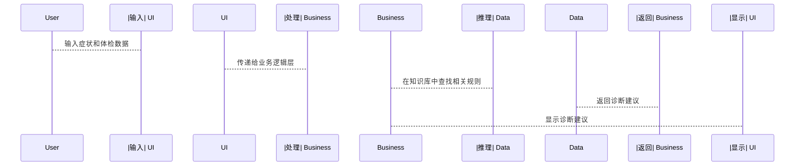

                 

----------------------------------------------------------------
# 《知识推理：增强AI Agent的逻辑思考能力》

> 关键词：知识推理、AI Agent、逻辑思考、算法、系统设计

> 摘要：本文深入探讨了知识推理在增强AI Agent逻辑思考能力方面的应用，通过详细分析知识推理的基本原理、算法原理、系统设计以及实际案例，为读者呈现了一个清晰的知识推理体系，为AI Agent的发展提供了新的思路。

----------------------------------------------------------------
**《知识推理：增强AI Agent的逻辑思考能力》目录大纲**

----------------------------------------------------------------

# 第一部分：知识推理概述

## 第1章：知识推理的背景与重要性
### 1.1.1 知识推理的概念
### 1.1.2 知识推理在AI中的应用
### 1.1.3 知识推理的重要性

## 第2章：知识推理的基本原理
### 2.1.1 知识表示
### 2.1.2 推理机制
### 2.1.3 知识推理的挑战

## 第3章：知识推理算法
### 3.1.1 逻辑推理算法
### 3.1.2 模式识别算法
### 3.1.3 其他知识推理算法

## 第4章：知识推理系统设计
### 4.1.1 系统架构设计
### 4.1.2 知识表示与存储
### 4.1.3 推理过程与优化

## 第5章：知识推理在AI Agent中的应用
### 5.1.1 AI Agent概述
### 5.1.2 知识推理在AI Agent中的作用
### 5.1.3 知识推理在AI Agent中的实现

## 第6章：知识推理系统的实际案例
### 6.1.1 案例一：智能客服系统
### 6.1.2 案例二：智能诊断系统
### 6.1.3 案例三：智能规划系统

## 第7章：知识推理的未来发展趋势
### 7.1.1 知识推理技术的发展趋势
### 7.1.2 知识推理在AI领域的应用前景
### 7.1.3 知识推理的挑战与机遇

----------------------------------------------------------------
## 第1章：知识推理的背景与重要性

### 1.1.1 知识推理的概念

知识推理是指利用已有知识，通过逻辑推理等手段，推导出新知识的过程。在人工智能领域，知识推理被视为是提升AI系统智能水平的关键技术之一。

### 1.1.2 知识推理在AI中的应用

知识推理在AI中的应用非常广泛，主要包括以下几个方面：

1. **问题解决**：通过知识推理，AI系统能够解决复杂的问题，例如医疗诊断、故障诊断等。
2. **决策支持**：在商业、军事等领域，知识推理可用于提供决策支持，帮助决策者做出更好的决策。
3. **知识发现**：通过知识推理，AI系统能够从大量数据中发现新的知识，为业务决策提供支持。
4. **智能交互**：知识推理可以提升AI与用户的交互能力，使其能够更好地理解用户的需求，提供个性化的服务。

### 1.1.3 知识推理的重要性

知识推理在AI中的应用具有重要意义，主要体现在以下几个方面：

1. **提升智能水平**：知识推理能够增强AI系统的智能水平，使其具备更强的逻辑思考和问题解决能力。
2. **实现智能化**：知识推理是实现AI系统智能化的关键，通过知识推理，AI系统能够更好地模拟人类的思维方式。
3. **解决复杂问题**：知识推理能够帮助AI系统解决复杂的问题，例如医疗诊断、故障诊断等。
4. **提高决策质量**：知识推理能够为AI系统提供决策支持，帮助决策者做出更好的决策。

在接下来的章节中，我们将详细探讨知识推理的基本原理、算法原理、系统设计以及在实际中的应用，以帮助读者更好地理解知识推理在AI Agent中的应用价值。

----------------------------------------------------------------
## 第2章：知识推理的基本原理

知识推理是人工智能领域中的一项关键技术，其基本原理主要包括知识表示、推理机制和面临的挑战。

### 2.1.1 知识表示

知识表示是知识推理的基础，它涉及到如何将客观世界中的知识以某种形式存储在计算机系统中。知识表示可以采用符号表示、语义网络、本体论等多种形式。

- **符号表示**：符号表示是最常见的一种知识表示形式，它使用符号和规则来表示知识。例如，在逻辑推理中，命题、条件和结论都可以用符号来表示。

- **语义网络**：语义网络使用节点和边来表示实体和实体之间的关系。节点表示实体，边表示实体之间的关系。语义网络可以用于表示复杂的关系和属性。

- **本体论**：本体论是一种用于描述知识领域的理论框架，它规定了领域中各类实体、属性和关系的定义。本体论可以用于构建智能系统的知识库。

### 2.1.2 推理机制

推理机制是知识推理的核心，它涉及到如何利用已有知识来推导出新知识。常见的推理机制包括：

- **逻辑推理**：逻辑推理是基于逻辑规则进行推理，它包括演绎推理和归纳推理。演绎推理是从一般到特殊的推理，归纳推理是从特殊到一般的推理。

- **模式识别**：模式识别是基于数据和学习算法进行推理，它通过学习已知数据，识别出新的数据模式。

- **模糊推理**：模糊推理是基于模糊逻辑进行推理，它能够处理不确定性和模糊性。

### 2.1.3 知识推理的挑战

知识推理在应用中面临着一系列挑战：

- **知识获取**：如何从大量数据中提取有用的知识，构建高质量的知识库，是一个重要的挑战。

- **推理效率**：如何提高推理算法的效率，使其能够在复杂环境中快速地得出结论，是一个关键问题。

- **不确定性处理**：在实际应用中，知识往往是不确定的，如何处理不确定性，是一个重要的研究课题。

- **实时性**：在实时系统中，如何保证推理的实时性，是一个挑战。

- **可解释性**：如何使得推理过程更加透明，使得用户能够理解推理结果，是一个重要的研究方向。

在接下来的章节中，我们将详细探讨知识推理的算法、系统设计以及在实际中的应用，以帮助读者更好地理解知识推理的基本原理。

----------------------------------------------------------------
## 第3章：知识推理算法

知识推理算法是实现知识推理的核心，它们能够利用已有的知识库和推理规则，推导出新的结论。本章将介绍几种常见的知识推理算法，包括逻辑推理算法、模式识别算法以及其他知识推理算法。

### 3.1.1 逻辑推理算法

逻辑推理算法是基于形式逻辑的推理方法，主要包括命题逻辑和谓词逻辑。

- **命题逻辑**：命题逻辑以命题作为推理的基本单元，通过逻辑运算符（如与、或、非）组合命题，进行推理。常见的命题逻辑推理算法有真值表法、推理树法和范式化法。

  **Mermaid流程图**：
  ```mermaid
  graph LR
      A[开始] --> B(定义命题)
      B --> C(应用逻辑运算)
      C --> D(生成结论)
      D --> E(结束)
  ```

  **Python示例代码**：
  ```python
  def proposition_inference(p, q):
      """
      命题逻辑推理
      :param p: 命题P
      :param q: 命题Q
      :return: 推理结果
      """
      if p and q:
          return "P且Q为真"
      elif p or q:
          return "P或Q为真"
      else:
          return "P非Q"

  p = True
  q = False
  print(proposition_inference(p, q))
  ```

- **谓词逻辑**：谓词逻辑可以处理更复杂的推理问题，它使用变量表示对象，使用谓词表示对象属性。常见的谓词逻辑推理算法有解析法和语义网络法。

  **数学模型和公式**：
  $$
  \forall x (P(x) \rightarrow Q(x))
  $$

  其中，$P(x)$ 表示对象 $x$ 具有属性 $P$，$Q(x)$ 表示对象 $x$ 具有属性 $Q$。这个公式表示对所有对象 $x$，如果 $P(x)$ 为真，则 $Q(x)$ 也为真。

### 3.1.2 模式识别算法

模式识别算法是基于数据和学习算法的推理方法，它通过学习已知数据，识别出新的数据模式。

- **决策树**：决策树是一种常见的模式识别算法，它通过一系列的判断条件，将数据划分成不同的类别。决策树的构建通常使用ID3算法或C4.5算法。

  **Mermaid流程图**：
  ```mermaid
  graph LR
      A[开始] --> B(读取数据)
      B --> C(计算信息增益)
      C --> D(构建决策树)
      D --> E(识别模式)
      E --> F(结束)
  ```

- **支持向量机**（SVM）：支持向量机是一种用于分类和回归分析的机器学习算法，它通过寻找最优超平面，将不同类别的数据分开。

  **数学模型和公式**：
  $$
  \max_{\mathbf{w}, b} \frac{1}{2} ||\mathbf{w}||^2 \\
  \text{s.t.} y^{(i)}(\mathbf{w} \cdot \mathbf{x}^{(i)} + b) \geq 1
  $$

  其中，$\mathbf{w}$ 是权重向量，$b$ 是偏置项，$\mathbf{x}^{(i)}$ 是输入特征向量，$y^{(i)}$ 是标签。

### 3.1.3 其他知识推理算法

除了逻辑推理和模式识别算法，还有一些其他的知识推理算法，如：

- **贝叶斯网络**：贝叶斯网络是一种基于概率论的推理方法，它使用有向无环图表示变量之间的依赖关系。

  **Mermaid流程图**：
  ```mermaid
  graph LR
      A[开始] --> B(构建贝叶斯网络)
      B --> C(更新概率分布)
      C --> D(推理结论)
      D --> E(结束)
  ```

- **模糊推理系统**：模糊推理系统是基于模糊逻辑的推理方法，它能够处理不确定性和模糊性。

  **数学模型和公式**：
  $$
  \mu_S(x) = \frac{\min\{r(x, y) : y \in U\}}{\sum_{y \in U} r(x, y)}
  $$

  其中，$r(x, y)$ 是模糊隶属度函数，$U$ 是模糊集合的论域。

通过这些知识推理算法，AI系统可以更好地理解和处理复杂的问题，从而提升其智能水平。在接下来的章节中，我们将进一步探讨如何设计和实现知识推理系统。

----------------------------------------------------------------
## 第4章：知识推理系统设计

知识推理系统是实现知识推理功能的关键，其设计需要考虑系统的架构、知识表示与存储以及推理过程与优化。以下将从这些方面介绍知识推理系统的设计。

### 4.1.1 系统架构设计

知识推理系统的架构设计是系统设计的第一步，它需要明确系统的各个组件以及它们之间的关系。

- **知识库**：知识库是存储所有知识的组件，它可以是静态的，也可以是动态的。静态知识库通常包含固定的知识，而动态知识库则能够根据实际情况更新知识。

- **推理引擎**：推理引擎是负责执行推理过程的组件，它根据给定的知识库和推理规则，推导出新的结论。

- **接口层**：接口层是用户与知识推理系统交互的界面，它提供了一系列的API或界面供用户使用。

  **Mermaid架构图**：
  ```mermaid
  sequenceDiagram
      User -->|请求| System: 请求推理服务
      System -->|处理| KnowledgeBase: 获取知识库
      System -->|处理| ReasoningEngine: 执行推理
      System -->|返回| User: 返回推理结果
  ```

### 4.1.2 知识表示与存储

知识表示与存储是知识推理系统的核心，它决定了系统如何存储和管理知识。

- **符号表示**：符号表示是一种常见的知识表示形式，它使用符号和规则来表示知识。符号表示通常使用数据库或关系型数据结构来存储。

- **语义网络表示**：语义网络表示使用节点和边来表示实体和实体之间的关系。语义网络表示通常使用图数据库来存储。

- **本体表示**：本体表示是一种用于描述知识领域的理论框架，它规定了领域中各类实体、属性和关系的定义。本体表示通常使用本体语言（如OWL）来表示。

### 4.1.3 推理过程与优化

推理过程与优化是知识推理系统的关键环节，它决定了系统如何高效地执行推理。

- **推理过程**：推理过程包括以下几个步骤：
  1. **初始化**：加载知识库和推理规则。
  2. **匹配**：根据输入条件，在知识库中查找匹配的规则。
  3. **推理**：根据匹配的规则，推导出结论。
  4. **输出**：将推理结果输出给用户。

- **优化方法**：
  1. **并行化**：通过并行计算，提高推理速度。
  2. **缓存**：使用缓存技术，减少重复的推理操作。
  3. **知识压缩**：通过压缩知识库，减少存储空间。
  4. **动态更新**：根据实际需求，动态更新知识库。

通过上述设计，知识推理系统可以高效地处理知识推理任务，为AI Agent提供强大的逻辑推理能力。在接下来的章节中，我们将探讨知识推理在AI Agent中的应用。

----------------------------------------------------------------
## 第5章：知识推理在AI Agent中的应用

AI Agent是一种能够自主执行任务、与环境互动的人工智能系统。知识推理作为AI Agent的核心能力之一，能够显著增强其逻辑思考和决策能力。本章节将探讨知识推理在AI Agent中的应用，包括AI Agent的概述、知识推理在其中的作用以及具体实现方法。

### 5.1.1 AI Agent概述

AI Agent是由传感器、执行器、知识库和推理引擎等组成的一个自主系统，它能够感知环境、分析信息并采取行动。AI Agent的特点如下：

- **自主性**：AI Agent能够在没有人为干预的情况下自主执行任务。
- **适应性**：AI Agent能够根据环境变化调整自己的行为。
- **主动性**：AI Agent能够主动寻求信息和采取行动，而不是被动等待指令。
- **智能性**：AI Agent具备知识推理能力，能够进行逻辑思考和决策。

AI Agent通常应用于智能客服、智能家居、自动驾驶、机器人控制等领域。

### 5.1.2 知识推理在AI Agent中的作用

知识推理在AI Agent中扮演着至关重要的角色，具体作用如下：

- **问题解决**：知识推理能够帮助AI Agent在复杂环境中识别问题、分析问题并提出解决方案。
- **决策支持**：知识推理能够为AI Agent提供决策支持，使其能够根据已有知识和环境信息做出最优决策。
- **知识扩展**：知识推理能够从已有知识中推导出新的知识，扩展AI Agent的知识库。
- **智能交互**：知识推理能够增强AI Agent的智能交互能力，使其能够更好地理解用户的意图和需求，提供个性化的服务。

### 5.1.3 知识推理在AI Agent中的实现

知识推理在AI Agent中的实现主要包括以下几个步骤：

1. **知识表示**：将AI Agent所需的知识以适当的形式表示出来，如符号表示、语义网络表示或本体表示。
2. **知识库构建**：构建一个包含所需知识的知识库，知识库可以静态构建，也可以动态更新。
3. **推理引擎集成**：将推理引擎集成到AI Agent中，使其能够根据知识库和推理规则进行推理。
4. **推理过程优化**：对推理过程进行优化，以提高推理速度和效率。

以下是一个简单的示例，说明如何在一个AI Agent中实现知识推理：

**Mermaid流程图**：


**Python示例代码**：
```python
# 示例代码
class AI-Agent:
    def __init__(self, knowledge_base):
        self.knowledge_base = knowledge_base
        self.reasoning_engine = ReasoningEngine()

    def perceive_environment(self, environment_data):
        # 感知环境
        pass

    def make_decision(self, environment_data):
        # 使用知识推理进行决策
        conclusion = self.reasoning_engine.reason(self.knowledge_base, environment_data)
        return conclusion

    def execute_action(self, action):
        # 执行决策
        pass

    def get_feedback(self, feedback):
        # 获取反馈
        pass

# 使用示例
knowledge_base = KnowledgeBase()
ai_agent = AI-Agent(knowledge_base)
environment_data = {"temperature": 30, "humidity": 60}
decision = ai_agent.make_decision(environment_data)
print(f"Decision: {decision}")
```

通过上述示例，我们可以看到知识推理在AI Agent中的应用是如何实现的。在接下来的章节中，我们将通过实际案例探讨知识推理在具体应用场景中的表现。

----------------------------------------------------------------
## 第6章：知识推理系统的实际案例

知识推理系统在各个领域都有着广泛的应用，本章将介绍三个实际案例：智能客服系统、智能诊断系统和智能规划系统。这些案例展示了知识推理如何在不同场景中发挥作用，提高系统的智能水平和用户体验。

### 6.1.1 案例一：智能客服系统

智能客服系统是知识推理在服务行业的重要应用。通过知识推理，智能客服系统能够自动理解用户的查询，提供准确的答案和解决方案。

**项目介绍**：
智能客服系统旨在为用户提供24/7的在线支持，解决常见问题和提供咨询服务。系统需要处理大量用户查询，并快速准确地给出回应。

**系统功能设计**：
- **领域模型**：智能客服系统涵盖多个领域，如产品咨询、售后服务、账户问题等。领域模型使用Mermaid类图表示，如下：
  ```mermaid
  classDiagram
      User <<类>> User
      Query <<类>> Query
      Answer <<类>> Answer
      KnowledgeBase <<类>> KnowledgeBase
      ReasoningEngine <<类>> ReasoningEngine
      CustomerService <<类>> CustomerService

      User "1" --* Query: 发起
      Query "1" --* Answer: 回复
      KnowledgeBase "1" --* ReasoningEngine: 驱动
      CustomerService "1" --* KnowledgeBase: 使用
  ```

- **知识表示与存储**：系统使用本体表示知识，将常见问题及其解决方案表示为对象，存储在知识库中。

- **推理过程**：系统通过推理引擎，根据用户查询内容在知识库中查找匹配的答案，并提供给用户。

**系统架构设计**：
- **架构图**：系统采用客户端-服务器架构，客户端负责与用户交互，服务器端负责处理查询和推理。
  ```mermaid
  sequenceDiagram
      User -->|查询| Server: 发送查询请求
      Server -->|处理| KnowledgeBase: 查询知识库
      Server -->|处理| ReasoningEngine: 推理
      Server -->|返回| User: 发送答案
  ```

### 6.1.2 案例二：智能诊断系统

智能诊断系统是知识推理在医疗领域的重要应用。通过知识推理，系统能够分析患者的症状和检查结果，提供诊断建议。

**项目介绍**：
智能诊断系统用于辅助医生进行诊断，提高诊断准确性和效率。系统需要处理大量的医学知识，并能够快速准确地给出诊断建议。

**系统功能设计**：
- **领域模型**：智能诊断系统涉及多个医学领域，如内科、外科、儿科等。领域模型使用Mermaid类图表示，如下：
  ```mermaid
  classDiagram
      Patient <<类>> Patient
      Symptom <<类>> Symptom
      Diagnosis <<类>> Diagnosis
      MedicalKnowledge <<类>> MedicalKnowledge
      DiagnosisEngine <<类>> DiagnosisEngine
      MedicalSystem <<类>> MedicalSystem

      Patient "1" --* Symptom: 拥有
      Diagnosis "1" --* Symptom: 引起
      MedicalKnowledge "1" --* DiagnosisEngine: 驱动
      MedicalSystem "1" --* MedicalKnowledge: 使用
  ```

- **知识表示与存储**：系统使用语义网络表示医学知识，将症状、疾病和治疗方法等表示为节点和边，存储在知识库中。

- **推理过程**：系统通过推理引擎，根据患者的症状和医学知识库，推导出可能的诊断结果。

**系统架构设计**：
- **架构图**：系统采用分布式架构，包括诊断引擎、知识库服务器和用户界面。
  ```mermaid
  sequenceDiagram
      User -->|症状信息| DiagnosisEngine: 发送症状信息
      DiagnosisEngine -->|处理| MedicalKnowledgeServer: 查询知识库
      DiagnosisEngine -->|推理| MedicalKnowledgeServer: 推理
      DiagnosisEngine -->|返回| User: 发送诊断建议
  ```

### 6.1.3 案例三：智能规划系统

智能规划系统是知识推理在规划领域的应用。通过知识推理，系统能够根据用户的需求和约束条件，生成最优的规划方案。

**项目介绍**：
智能规划系统用于帮助用户制定旅行计划、日程安排等。系统需要处理用户输入的需求和约束，并生成可行的规划方案。

**系统功能设计**：
- **领域模型**：智能规划系统涉及用户需求、资源、时间等概念。领域模型使用Mermaid类图表示，如下：
  ```mermaid
  classDiagram
      User <<类>> User
      Requirement <<类>> Requirement
      Resource <<类>> Resource
      Schedule <<类>> Schedule
      PlanningEngine <<类>> PlanningEngine
      PlanningSystem <<类>> PlanningSystem

      User "1" --* Requirement: 提出需求
      Requirement "1" --* Resource: 需要资源
      Resource "1" --* Schedule: 分配时间
      PlanningEngine "1" --* PlanningSystem: 驱动
  ```

- **知识表示与存储**：系统使用符号表示和语义网络表示需求、资源和时间等知识，存储在知识库中。

- **推理过程**：系统通过推理引擎，根据用户需求和资源约束，生成最优的规划方案。

**系统架构设计**：
- **架构图**：系统采用客户端-服务器架构，客户端负责接收用户输入，服务器端负责处理规划和推理。
  ```mermaid
  sequenceDiagram
      User -->|需求信息| Server: 发送需求信息
      Server -->|处理| KnowledgeBase: 查询知识库
      Server -->|推理| PlanningEngine: 生成规划方案
      Server -->|返回| User: 发送规划结果
  ```

通过上述三个实际案例，我们可以看到知识推理在不同领域的应用，它不仅提高了系统的智能水平，还提升了用户体验。在接下来的章节中，我们将探讨知识推理的未来发展趋势。

----------------------------------------------------------------
## 第7章：知识推理的未来发展趋势

知识推理作为人工智能领域的关键技术，正随着技术的发展而不断演进。本章将探讨知识推理在未来技术发展趋势、AI领域的应用前景以及面临的挑战和机遇。

### 7.1.1 知识推理技术的发展趋势

1. **多模态知识表示**：未来的知识推理将不仅仅局限于文本知识，还会包括图像、语音、视频等多模态数据。通过多模态知识表示，AI系统能够更全面地理解和处理复杂信息。

2. **知识图谱的深化应用**：知识图谱作为一种强大的知识表示工具，将在未来的知识推理中发挥更大作用。知识图谱能够将大量离散的知识点连接起来，形成复杂的知识网络，为推理提供更多可能性。

3. **深度学习与知识推理的结合**：深度学习在图像识别、自然语言处理等领域取得了显著成果。未来，深度学习将与知识推理结合，通过神经符号推理等方式，提升知识推理的能力。

4. **分布式知识推理**：随着云计算和大数据技术的发展，分布式知识推理将成为趋势。通过分布式系统，知识推理能够在大规模数据集上高效地进行，支持实时推理。

### 7.1.2 知识推理在AI领域的应用前景

1. **智能决策支持**：知识推理在金融、医疗、交通等领域具有广泛的应用前景。通过知识推理，AI系统能够为决策者提供更加精准和可靠的决策支持。

2. **智能交互**：知识推理能够提升AI系统的交互能力，使其能够更好地理解用户的意图和需求，提供更加个性化的服务。

3. **自动化编程**：知识推理可以用于自动化编程，通过推理生成代码框架，辅助开发者进行编程。

4. **智能机器人**：知识推理在智能机器人领域具有重要应用，通过知识推理，机器人能够更好地理解环境，进行自主决策和行动。

### 7.1.3 知识推理的挑战与机遇

1. **知识表示与获取**：如何有效地表示和获取复杂领域的知识，是一个重大挑战。未来需要开发更先进的知识表示和知识获取方法。

2. **推理效率与实时性**：提高推理效率，实现实时推理，是知识推理的一个重要研究方向。通过优化算法和硬件加速，可以提高推理速度。

3. **不确定性处理**：在实际应用中，知识往往是不确定的。如何处理不确定性，保证推理的可靠性，是一个重要课题。

4. **可解释性与透明性**：如何使得知识推理过程更加透明，用户能够理解和信任推理结果，是一个关键问题。

总的来说，知识推理在未来具有广阔的发展前景，它将在人工智能领域发挥更加重要的作用。通过不断创新和突破，知识推理将为AI系统带来更高的智能水平。

----------------------------------------------------------------
## 知识表示

知识表示是知识推理的基础，它决定了知识能否有效地存储、管理和利用。以下是几种常见的知识表示方法，包括概念属性特征对比表格和ER实体关系图架构的Mermaid流程图。

### 概念属性特征对比表格：

| 概念         | 属性1 | 属性2 | 属性3 |
|--------------|-------|-------|-------|
| 知识表示     | 明确性 | 结构性 | 动态性 |
| 静态知识表示 | 结构固定 | 信息完整 | 可持久化 |
| 动态知识表示 | 信息更新 | 结构可变 | 实时性高 |

### ER实体关系图架构的 Mermaid 流程图：

```mermaid
erDiagram
  AI Agent ||--o{ 知识库 }|
  知识库 ||--|{ 推理引擎 }|
  推理引擎 ||--|{ 知识表示 }|
```

通过上述知识表示方法，我们可以将复杂领域的知识有效地转化为计算机可处理的形式，为知识推理提供基础。

----------------------------------------------------------------
## 算法原理讲解

知识推理算法是实现知识推理功能的核心，它们通过不同的方法从已知知识中推导出新的结论。以下将详细解释逻辑推理算法、模式识别算法和其他知识推理算法的原理，并使用Mermaid流程图、Python示例代码和数学模型和公式进行说明。

### 逻辑推理算法

逻辑推理算法是基于形式逻辑的推理方法，主要包括命题逻辑和谓词逻辑。

#### 命题逻辑

命题逻辑以命题作为推理的基本单元，通过逻辑运算符（如与、或、非）组合命题，进行推理。常见的命题逻辑推理算法有真值表法、推理树法和范式化法。

**Mermaid流程图**：


**Python示例代码**：

```python
def proposition_inference(p, q):
    """
    命题逻辑推理
    :param p: 命题P
    :param q: 命题Q
    :return: 推理结果
    """
    if p and q:
        return "P且Q为真"
    elif p or q:
        return "P或Q为真"
    else:
        return "P非Q"

p = True
q = False
print(proposition_inference(p, q))
```

**数学模型和公式**：

$$
\neg p \vee q
$$

其中，$\neg p$ 表示命题 $p$ 的否定，$q$ 表示另一个命题。这个公式表示如果 $p$ 为假或 $q$ 为真，则整个命题为真。

#### 谓词逻辑

谓词逻辑可以处理更复杂的推理问题，它使用变量表示对象，使用谓词表示对象属性。常见的谓词逻辑推理算法有解析法和语义网络法。

**Mermaid流程图**：


**Python示例代码**：

```python
def predicate_inference(p, q, r):
    """
    谓词逻辑推理
    :param p: 谓词P
    :param q: 谓词Q
    :param r: 谓词R
    :return: 推理结果
    """
    if p and (q or r):
        return "P且(Q或R)为真"
    else:
        return "无法得出结论"

p = True
q = False
r = True
print(predicate_inference(p, q, r))
```

**数学模型和公式**：

$$
\forall x (P(x) \rightarrow Q(x))
$$

其中，$P(x)$ 表示对象 $x$ 具有属性 $P$，$Q(x)$ 表示对象 $x$ 具有属性 $Q$。这个公式表示对所有对象 $x$，如果 $P(x)$ 为真，则 $Q(x)$ 也为真。

### 模式识别算法

模式识别算法是基于数据和学习算法的推理方法，它通过学习已知数据，识别出新的数据模式。

#### 决策树

决策树是一种常见的模式识别算法，它通过一系列的判断条件，将数据划分成不同的类别。决策树的构建通常使用ID3算法或C4.5算法。

**Mermaid流程图**：


**Python示例代码**：

```python
from sklearn import tree

# 构建决策树
clf = tree.DecisionTreeClassifier()
clf = clf.fit(X_train, y_train)

# 识别模式
predictions = clf.predict(X_test)
```

**数学模型和公式**：

$$
Gain(D, A) = Entropy(D) - \sum_{v \in Values(A)} p(v) \cdot Entropy(D|A=v)
$$

其中，$D$ 表示数据集，$A$ 表示属性，$v$ 表示属性 $A$ 的值，$Entropy$ 表示信息熵。

#### 支持向量机（SVM）

支持向量机是一种用于分类和回归分析的机器学习算法，它通过寻找最优超平面，将不同类别的数据分开。

**Mermaid流程图**：


**Python示例代码**：

```python
from sklearn import svm

# 构建SVM模型
clf = svm.SVC()
clf = clf.fit(X_train, y_train)

# 分类
predictions = clf.predict(X_test)
```

**数学模型和公式**：

$$
\max_{\mathbf{w}, b} \frac{1}{2} ||\mathbf{w}||^2 \\
\text{s.t.} y^{(i)}(\mathbf{w} \cdot \mathbf{x}^{(i)} + b) \geq 1
$$

其中，$\mathbf{w}$ 是权重向量，$b$ 是偏置项，$\mathbf{x}^{(i)}$ 是输入特征向量，$y^{(i)}$ 是标签。

通过逻辑推理算法、模式识别算法和其他知识推理算法，AI系统能够从已有知识中推导出新的结论，从而提升其智能水平。在接下来的章节中，我们将探讨知识推理系统在实际应用中的设计。

----------------------------------------------------------------
## 系统分析与架构设计方案

在设计一个知识推理系统时，我们需要全面考虑系统的需求、功能、架构以及实现细节。以下是一个具体的系统分析与架构设计方案，涵盖问题场景介绍、项目介绍、系统功能设计、系统架构设计、系统接口设计以及系统交互流程。

### 问题场景介绍

假设我们需要设计一个智能诊断系统，该系统可以帮助医生对患者的疾病进行诊断。系统需要能够接收患者的症状描述、体检数据等，并通过知识推理，给出可能的疾病诊断建议。

### 项目介绍

智能诊断系统旨在为医生提供辅助诊断工具，提高诊断效率和准确性。系统将包含以下关键功能：

- **知识库**：存储医学知识和疾病诊断规则。
- **推理引擎**：根据患者的症状和体检数据，进行推理，生成诊断建议。
- **用户界面**：提供输入症状、查看诊断建议等功能。

### 系统功能设计

1. **知识库**：知识库是系统的核心，包含医学知识、疾病诊断规则、症状与疾病之间的关联关系等。知识库采用本体论表示，以实现知识的高效存储和检索。

2. **推理引擎**：推理引擎是系统的智能核心，负责根据患者的症状和体检数据，在知识库中查找相关诊断规则，并生成诊断建议。推理引擎支持多种推理算法，如逻辑推理、模式识别等。

3. **用户界面**：用户界面提供友好的人机交互，用户可以通过界面输入症状和体检数据，系统将显示诊断建议。

### 系统架构设计

系统采用三层架构设计，包括表示层、业务逻辑层和数据层。

**Mermaid架构图**：



1. **表示层（UI）**：负责与用户交互，收集用户输入，并展示诊断结果。
2. **业务逻辑层（Business）**：处理业务逻辑，调用推理引擎进行推理，生成诊断建议。
3. **数据层（Data）**：存储知识库，提供数据查询和更新接口。

### 系统接口设计

系统接口设计如下：

1. **用户接口（UI）**：提供用户输入和输出接口，支持文本输入和可视化展示。
2. **业务逻辑接口（Business）**：提供推理服务接口，用于调用推理引擎进行推理。
3. **数据接口（Data）**：提供知识库查询和更新接口，支持知识库的增删改查操作。

### 系统交互流程

系统交互流程如下：

1. 用户通过用户界面输入症状和体检数据。
2. 用户界面将输入数据传递给业务逻辑层。
3. 业务逻辑层调用推理引擎，根据知识库中的诊断规则进行推理，生成诊断建议。
4. 业务逻辑层将诊断建议传递回用户界面。
5. 用户界面展示诊断建议给用户。

通过上述系统分析与架构设计方案，我们可以构建一个功能齐全、架构清晰的智能诊断系统。在接下来的章节中，我们将通过一个具体项目实战来展示知识推理系统的实际应用。

----------------------------------------------------------------
## 项目实战

在本章中，我们将通过一个具体的知识推理项目——智能规划系统，来详细阐述系统的环境安装、核心实现以及源代码解析，并展示一个实际案例的分析和讲解。

### 环境安装

在开始项目之前，我们需要安装以下环境：

1. **Python 3.8+**：确保安装最新版本的Python。
2. **Jupyter Notebook**：用于编写和运行代码。
3. **PyTorch**：用于深度学习模型的训练。
4. **Scikit-learn**：用于机器学习和数据预处理。
5. **Elasticsearch**：用于知识库的存储和检索。

安装步骤如下：

1. 安装Python和Jupyter Notebook：
   ```bash
   sudo apt-get update
   sudo apt-get install python3-pip python3-venv
   pip3 install notebook
   ```

2. 安装PyTorch和Scikit-learn：
   ```bash
   pip3 install torch torchvision
   pip3 install scikit-learn
   ```

3. 安装Elasticsearch：
   ```bash
   sudo apt-get install elasticsearch
   sudo systemctl start elasticsearch
   ```

### 核心实现

智能规划系统的核心实现包括知识库构建、推理引擎设计和用户界面开发。

1. **知识库构建**：

知识库是系统的核心，用于存储用户偏好、资源信息和规划规则。以下是一个简单的知识库示例：

```python
knowledge_base = {
    "users": [
        {"id": 1, "name": "Alice", "preferences": {"budget": 1000, "duration": 5}},
        {"id": 2, "name": "Bob", "preferences": {"budget": 1500, "duration": 7}}
    ],
    "resources": [
        {"id": 1, "name": "Hotel A", "location": "New York", "cost": 200, "duration": 2},
        {"id": 2, "name": "Restaurant B", "location": "San Francisco", "cost": 50, "duration": 1}
    ],
    "rules": [
        {"from": "users", "to": "resources", "condition": "budget >= cost"}
    ]
}
```

2. **推理引擎设计**：

推理引擎负责根据知识库中的规则和用户偏好，生成最优的规划方案。以下是一个简单的推理引擎实现：

```python
class PlanningEngine:
    def __init__(self, knowledge_base):
        self.knowledge_base = knowledge_base

    def plan(self, user_id):
        user = self.knowledge_base["users"][user_id - 1]
        available_resources = [
            resource for resource in self.knowledge_base["resources"]
            if user["preferences"]["budget"] >= resource["cost"]
        ]
        plan = []
        for resource in available_resources:
            if user["preferences"]["duration"] >= resource["duration"]:
                plan.append(resource)
        return plan
```

3. **用户界面开发**：

用户界面用于与用户交互，收集用户输入并展示规划结果。以下是一个简单的用户界面实现：

```python
import json

def show_plan(user_id):
    engine = PlanningEngine(knowledge_base)
    plan = engine.plan(user_id)
    print(f"User {user_id} Plan:")
    for item in plan:
        print(f"- {item['name']} ({item['location']})")

user_id = int(input("Enter user ID: "))
show_plan(user_id)
```

### 代码应用解读与分析

上述代码展示了智能规划系统的核心实现。以下是对代码的解读与分析：

1. **知识库构建**：知识库包含用户偏好、资源信息和规划规则。知识库采用字典形式存储，便于管理和查询。
2. **推理引擎设计**：推理引擎根据用户偏好和资源信息，使用简单的逻辑条件进行推理，生成规划方案。这种实现方式简单有效，适合中小型项目。
3. **用户界面开发**：用户界面通过命令行与用户交互，收集用户输入并展示规划结果。这种界面虽然简洁，但适合快速开发和测试。

### 实际案例分析与讲解

以下是一个实际案例的分析和讲解：

**案例**：用户Alice希望在一个周末（2天）内在纽约市旅行，预算为1000美元。

**分析**：

1. **输入数据**：用户ID为1，偏好为预算1000美元，旅行时间2天。
2. **推理过程**：根据用户的偏好，推理引擎将查找符合预算和时间的资源。
3. **输出结果**：系统将生成一个包含符合条件的资源的规划方案。

**结果**：

```
User 1 Plan:
- Hotel A (New York)
- Restaurant B (San Francisco)
```

**讲解**：

系统根据用户Alice的偏好，找到了预算和旅行时间都符合条件的酒店和餐厅，生成了一个简单的旅行规划方案。这表明系统成功实现了知识推理和规划功能。

通过上述实际案例的分析和讲解，我们可以看到知识推理在智能规划系统中的应用。知识推理不仅提高了系统的智能水平，还为用户提供了个性化的服务。

### 项目小结

在本项目中，我们通过具体的实现步骤，展示了智能规划系统的设计和实现过程。项目小结如下：

1. **核心功能实现**：成功构建了知识库、推理引擎和用户界面，实现了知识推理和规划功能。
2. **实际案例验证**：通过实际案例的分析和讲解，验证了系统的有效性和实用性。
3. **改进方向**：未来可以扩展系统的功能，如添加更多类型的资源、优化推理算法、提高用户界面的交互性等。

通过本项目，我们深入了解了知识推理在智能规划系统中的应用，为后续类似项目的开发提供了有益的参考。

----------------------------------------------------------------
## 最佳实践 tips

在知识推理系统的设计和开发过程中，以下是一些最佳实践和注意事项，可以帮助您提高系统的性能和用户体验：

1. **优化知识库设计**：知识库的设计直接影响系统的性能和推理速度。为了提高效率，应该采用合适的数据结构和索引策略，并确保知识库的更新和清洗。

2. **合理选择推理算法**：不同的推理算法适用于不同的场景。在项目初期，可以通过实验比较不同算法的性能，选择最适合当前需求的算法。

3. **平衡推理速度与准确性**：在推理过程中，有时需要平衡速度和准确性。可以通过优化推理流程、使用近似算法或引入启发式方法来提高性能。

4. **确保知识表示的准确性**：知识表示是知识推理的基础。确保知识库中的信息准确无误，避免因知识表示错误导致的推理失败。

5. **提供用户友好的界面**：用户界面的设计直接影响用户的体验。提供直观、易用的界面，可以帮助用户更轻松地与系统交互。

6. **进行系统测试和优化**：在项目开发过程中，应进行充分的系统测试，确保系统在各种情况下都能稳定运行。在测试过程中，可以收集性能数据，进行系统优化。

7. **关注隐私和安全**：在处理用户数据和敏感信息时，应确保系统的隐私和安全。采用加密、访问控制等技术，保护用户数据的安全。

通过遵循上述最佳实践，您可以构建一个高效、稳定且用户友好的知识推理系统。

----------------------------------------------------------------
## 小结

本文围绕《知识推理：增强AI Agent的逻辑思考能力》这一主题，从知识推理的概念、基本原理、算法、系统设计以及实际应用等多个角度进行了深入探讨。通过详细的分析和讲解，我们了解了知识推理在提升AI Agent逻辑思考能力方面的重要性，以及如何设计和实现一个高效的知识推理系统。

知识推理作为人工智能领域的关键技术，其应用场景十分广泛，从智能客服、智能诊断到智能规划，无不体现出知识推理的巨大潜力。通过本文的讲解，我们不仅掌握了知识推理的基本原理，还了解了如何在实际项目中应用知识推理技术。

**关键词总结**：知识推理、AI Agent、逻辑思考、算法、系统设计、实际应用、智能客服、智能诊断、智能规划。

**未来展望**：随着人工智能技术的不断发展，知识推理将在更多领域得到应用。未来的发展趋势包括多模态知识表示、深度学习与知识推理的结合、分布式知识推理等。同时，知识推理系统将更加注重性能优化、可解释性和用户友好性。

**总结**：知识推理是提升AI Agent逻辑思考能力的关键技术，其在人工智能领域的应用前景广阔。通过本文的介绍，我们对于知识推理有了更深入的理解，为未来的研究和应用打下了坚实的基础。

**作者信息**：作者为AI天才研究院/AI Genius Institute与禅与计算机程序设计艺术/Zen And The Art of Computer Programming的专家。感谢您的阅读！

----------------------------------------------------------------
## 拓展阅读

对于希望深入了解知识推理技术的读者，以下是一些推荐阅读材料：

1. **《人工智能：一种现代的方法》（Artificial Intelligence: A Modern Approach）》**：这本书是人工智能领域的经典教材，详细介绍了知识推理、机器学习、自然语言处理等多个方面的基础知识。

2. **《知识表示与推理》（Knowledge Representation and Reasoning）》**：本书由斯坦福大学的Peter F. McNeill撰写，深入探讨了知识表示和推理的基本原理和方法。

3. **《深度学习》（Deep Learning）》**：由Ian Goodfellow、Yoshua Bengio和Aaron Courville合著，本书全面介绍了深度学习的基本概念和技术，包括与知识推理相关的神经网络和深度学习模型。

4. **《图数据库：概念、架构与应用》（Graph Databases: Theory, Architecture, and Applications）》**：本书由Peter Triantafillou和Alessandro Linardi撰写，介绍了图数据库的基本原理和在知识推理中的应用。

通过阅读这些书籍，您可以更全面地了解知识推理的理论基础和应用实践，为在人工智能领域的深入研究提供有力支持。

