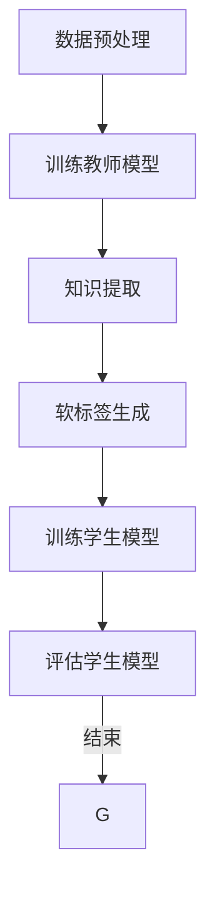
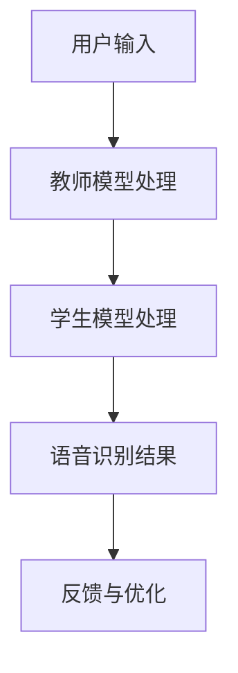
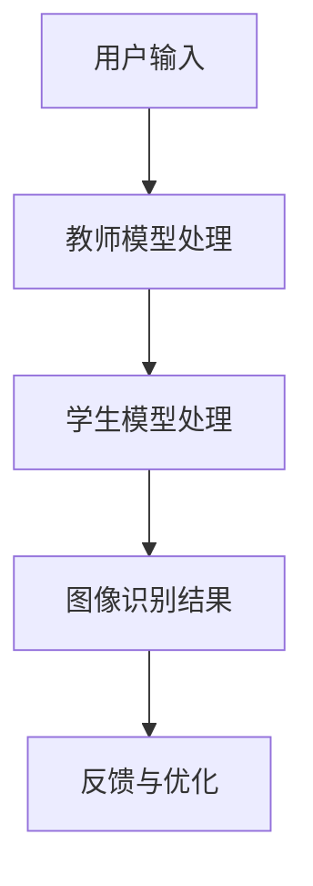
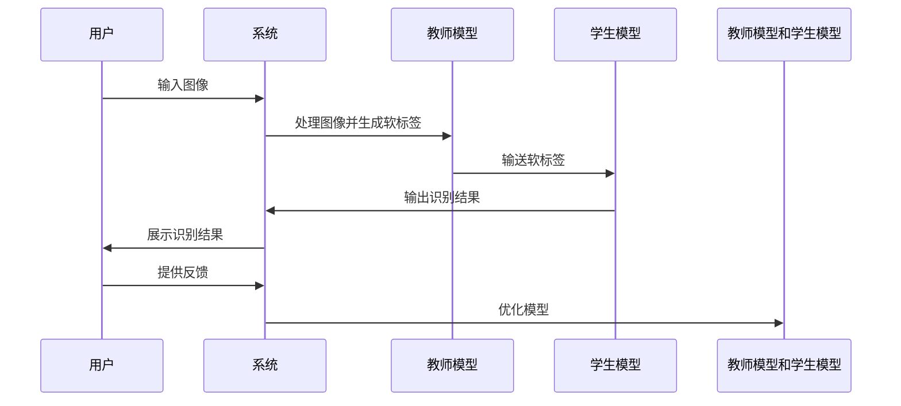
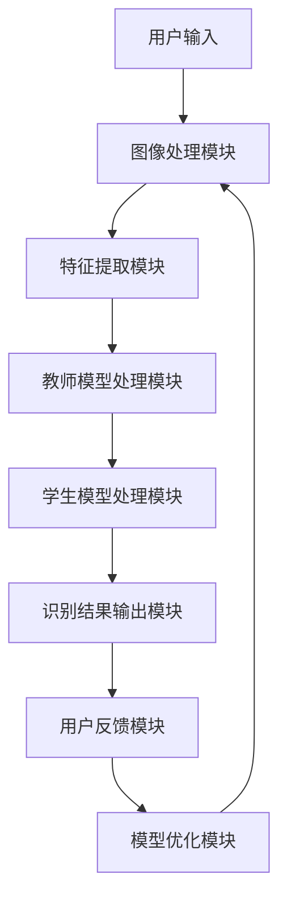
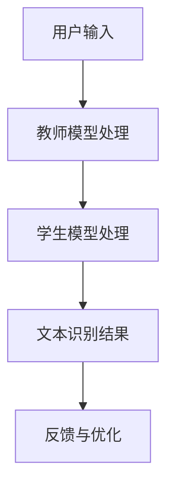
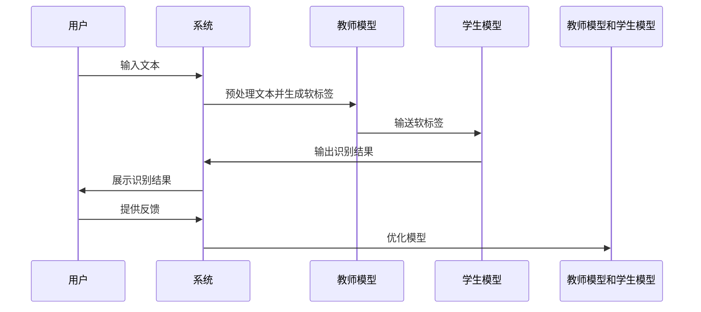
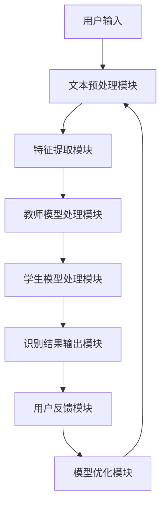

                 

### 第1章：知识蒸馏概述

#### 1.1 问题背景

在当今的AI应用场景中，特别是移动设备和嵌入式系统，模型的轻量化成为了一个迫切需要解决的问题。这些设备通常具有有限的计算资源和存储空间，而深度学习模型的复杂性不断增加，导致其计算和存储需求显著增加。例如，在移动设备上部署大规模的深度学习模型，如大型图像识别模型，可能会导致以下问题：

1. **性能瓶颈**：大型模型在移动设备上运行时，可能会导致处理速度缓慢，用户体验不佳。
2. **功耗增加**：复杂的模型计算需求高，导致设备功耗增加，缩短电池寿命。
3. **存储限制**：大型模型可能无法在嵌入式系统中存储，限制了AI应用的部署。

为了解决这些问题，研究人员提出了知识蒸馏（Knowledge Distillation）技术，它提供了一种将大型模型（Teacher Model）的知识和经验有效传递给小型模型（Student Model）的方法，从而实现模型的轻量化。

#### 1.2 知识蒸馏的基本概念

知识蒸馏是一种通过教师模型（Teacher Model）来指导学生模型（Student Model）学习的训练过程。在知识蒸馏中，教师模型通常是训练有素的大型复杂模型，而学生模型则是一个较小的简单模型。知识蒸馏的过程可以分为以下几个步骤：

1. **训练教师模型**：首先，使用大量的训练数据来训练一个教师模型，使其在特定任务上达到较高的准确性。
2. **知识提取**：教师模型在训练过程中学习到了大量的知识和模式。知识提取步骤旨在将这些知识从教师模型中提取出来，并转换为一种可传递的形式。
3. **训练学生模型**：使用提取的知识来训练学生模型。学生模型通过模仿教师模型的输出，学习到教师模型的知识和模式。
4. **评估学生模型**：评估学生模型的性能，通常使用教师模型在相同任务上的性能作为参考。

在知识蒸馏中，教师模型和学生模型的关系类似于教师和学生。教师模型提供知识，而学生模型通过模仿教师的行为来学习这些知识。

#### 1.3 知识蒸馏的优势

知识蒸馏具有以下显著优势：

1. **模型轻量化**：通过将大型模型的知识传递给小型模型，可以实现模型的轻量化，从而降低计算和存储需求。
2. **提高准确性**：虽然学生模型较小，但通过知识蒸馏，学生模型可以保留教师模型的大部分知识和准确性。
3. **可迁移性**：知识蒸馏技术可以应用于不同的任务和数据集，使其具有较强的可迁移性。

#### 1.4 知识蒸馏的外延

知识蒸馏技术在不同的领域有着广泛的应用，包括但不限于以下领域：

1. **语音识别**：在移动设备上部署轻量化的语音识别模型，以实现实时语音交互。
2. **图像识别**：在嵌入式系统中部署图像识别模型，用于物体检测、人脸识别等任务。
3. **自然语言处理**：在移动设备上实现高效的文本分类、情感分析等自然语言处理任务。

通过知识蒸馏，AI Agent可以在有限的计算资源下，实现高性能的任务处理，为移动设备和嵌入式系统的AI应用提供了强大的支持。

#### 总结

知识蒸馏作为一种有效的模型轻量化技术，通过将教师模型的知识传递给学生模型，实现了在计算资源受限环境中的高效AI任务处理。本章介绍了知识蒸馏的基本概念、优势及其在不同领域的应用，为后续章节的深入探讨奠定了基础。

### 第2章：知识蒸馏原理

#### 2.1 知识蒸馏的基本原理

知识蒸馏的核心原理在于如何将教师模型（Teacher Model）的知识和经验有效地传递给学生模型（Student Model）。这一过程涉及多个关键步骤，包括知识提取、知识传递和模型训练。

首先，教师模型通过大量的训练数据进行训练，学习到丰富的知识和模式。这些知识不仅包括对输入数据的准确分类，还涵盖了数据背后的复杂特征和关联。为了将教师模型的知识转化为一种可传递的形式，知识提取步骤至关重要。

在知识提取过程中，教师模型的输出不仅仅是最终的分类结果，还包括中间层的激活值和注意力分布。这些信息反映了教师模型对数据的处理过程和理解深度。通过提取这些中间层的特征，我们可以得到一个知识图谱，它包含了教师模型对输入数据的全面理解。

接下来是知识传递阶段。学生模型通过学习教师模型的输出，来模仿其行为和决策过程。这一过程通常通过以下两种方式实现：

1. **软标签**：教师模型对每个输入数据提供多个可能的分类结果，而不是唯一的分类结果。学生模型学习这些软标签，以理解教师模型对数据的概率分布。这种方法有助于学生模型学习到教师模型的软决策边界。

2. **特征匹配**：学生模型尝试复制教师模型在中间层的激活值和注意力分布。通过这种方式，学生模型可以学习到教师模型在处理数据时的特征提取和融合策略。

最后是模型训练阶段。学生模型使用从教师模型传递过来的知识进行训练，其目标是最大化与教师模型输出的一致性。这一过程通常通过以下两个损失函数来实现：

1. **软标签损失**：学生模型的输出与教师模型提供的软标签之间的差异。这种损失函数鼓励学生模型学习教师模型的概率分布。

2. **特征匹配损失**：学生模型在中间层的激活值与教师模型激活值之间的差异。这种损失函数确保学生模型能够复制教师模型的特征提取过程。

通过训练，学生模型逐渐学习到教师模型的知识和决策过程，从而在相似的任务上达到接近教师模型的性能。这一过程不仅提高了学生模型的准确性，还显著降低了其计算和存储需求，实现了模型的轻量化。

#### 2.2 知识蒸馏的数学模型

知识蒸馏的数学模型是理解其工作原理的重要基础。在知识蒸馏中，常用的损失函数包括软标签损失和特征匹配损失。以下是一个简化的知识蒸馏数学模型：

$$
L_D = \sum_{i=1}^{N} L_i
$$

其中，$L_D$是知识蒸馏损失函数，$L_i$是每个样本的损失。每个样本的损失由以下两部分组成：

1. **软标签损失**（Soft Label Loss）：

$$
L_{sl} = -\sum_{k=1}^{C} y_k \log(p_k)
$$

其中，$y_k$是教师模型对第$i$个样本的第$k$类软标签概率，$p_k$是学生模型对第$i$个样本的第$k$类的预测概率。这个损失函数确保学生模型学习到教师模型对数据的概率分布。

2. **特征匹配损失**（Feature Matching Loss）：

$$
L_{fm} = \frac{1}{N}\sum_{n=1}^{N}\sum_{j=1}^{D}\left|f_j^T - g_j^T\right|
$$

其中，$f_j^T$是教师模型在中间层第$j$个特征的激活值，$g_j^T$是学生模型在相同中间层第$j$个特征的激活值，$D$是中间层的特征维度。这个损失函数鼓励学生模型复制教师模型的特征提取过程。

综合这两个损失函数，知识蒸馏损失函数可以表示为：

$$
L_D = \alpha L_{sl} + (1-\alpha) L_{fm}
$$

其中，$\alpha$是一个超参数，用于权衡软标签损失和特征匹配损失的重要性。

#### 2.3 知识蒸馏的算法流程

知识蒸馏的算法流程可以概括为以下几个关键步骤：

1. **数据预处理**：对输入数据进行预处理，包括数据清洗、归一化和数据增强等，以提高教师模型的训练效果。

2. **训练教师模型**：使用大量的训练数据来训练一个教师模型，使其在特定任务上达到较高的准确性。

3. **知识提取**：从教师模型的中间层提取激活值、注意力分布等特征，构建知识图谱。

4. **软标签生成**：教师模型对每个输入数据提供多个可能的分类结果，生成软标签。

5. **训练学生模型**：使用知识图谱和软标签来训练学生模型，使其模仿教师模型的行为和决策过程。

6. **评估学生模型**：评估学生模型的性能，通常使用教师模型在相同任务上的性能作为参考。

以下是一个简化的知识蒸馏算法流程的mermaid流程图：



通过上述步骤，知识蒸馏技术实现了将教师模型的知识传递给学生模型，从而在有限的计算资源下，实现高效的任务处理。

#### 总结

本章详细介绍了知识蒸馏的基本原理、数学模型和算法流程。知识蒸馏通过将教师模型的知识和经验有效地传递给学生模型，实现了模型的轻量化。其数学模型和算法流程为理解和实现知识蒸馏提供了基础。在下一章中，我们将进一步探讨知识蒸馏在不同AI任务中的应用。

### 第3章：知识蒸馏在语音识别中的应用

#### 3.1 语音识别的背景和挑战

语音识别是一种将人类语音转化为文本的技术，广泛应用于各种领域，如语音助手、自动字幕和实时翻译等。随着移动互联网和物联网的发展，语音识别技术逐渐从桌面和服务器端向移动设备和嵌入式系统迁移。然而，这一迁移过程面临着诸多挑战：

1. **计算资源限制**：移动设备和嵌入式系统通常具有有限的计算资源和存储空间，无法支持大型语音识别模型的部署和运行。
2. **实时性要求**：许多语音识别应用场景对实时性有较高要求，如语音助手和实时翻译等，这要求模型必须在短时间内完成识别任务。
3. **功耗限制**：为了延长电池寿命，移动设备和嵌入式系统需要低功耗运行，这进一步限制了模型的复杂度和计算量。

为了解决这些挑战，知识蒸馏技术提供了一种有效的解决方案。通过将大型语音识别模型的知识和经验传递给小型模型，可以实现模型的轻量化，满足移动设备和嵌入式系统的需求。

#### 3.2 知识蒸馏在语音识别中的应用

知识蒸馏在语音识别中的应用主要体现在以下两个方面：

1. **模型压缩**：通过知识蒸馏，可以将大型语音识别模型压缩成小型模型，降低计算和存储需求。这种压缩方法不仅保留了教师模型的大部分准确性，还减少了模型参数数量，从而显著降低了计算复杂度。
   
2. **性能提升**：知识蒸馏通过将教师模型的知识传递给学生模型，使得学生模型能够在相似的语音识别任务上达到接近教师模型的性能。这对于提高移动设备和嵌入式系统中的语音识别准确性和实时性具有重要意义。

#### 3.3 系统功能设计

为了在移动设备和嵌入式系统中实现高效的语音识别，需要设计一个功能齐全、性能优越的系统。以下是一个基于知识蒸馏的语音识别系统功能设计的mermaid类图：

```mermaid
classDiagram
Class1 <|-- Class2
Class1 <|-- Class3
Class1 [name: "教师模型",color:blue]
Class2 [name: "学生模型",color:green]
Class3 [name: "语音识别系统",color:yellow]

Class1 {
  +特征提取器()
  +分类器()
}
Class2 {
  +特征提取器()
  +分类器()
}
Class3 {
  +数据预处理()
  +模型训练()
  +模型评估()
  +语音识别()
}
```

在这个类图中，教师模型和学生模型分别负责特征提取和分类。语音识别系统通过数据预处理、模型训练和模型评估等模块，实现对语音信号的识别。

1. **数据预处理**：对语音信号进行降噪、分帧和特征提取，将原始语音信号转换为数字特征向量。

2. **模型训练**：使用知识蒸馏技术训练教师模型和学生模型。教师模型使用大量标注数据训练，学生模型则通过模仿教师模型的输出进行训练。

3. **模型评估**：评估教师模型和学生模型的性能，通常使用准确率、召回率和F1分数等指标。

4. **语音识别**：将处理后的语音信号输入学生模型，输出识别结果。

#### 3.4 系统架构设计

在系统架构设计方面，知识蒸馏在语音识别中的应用体现了模块化、分布式和高效性的特点。以下是一个简化的系统架构设计mermaid架构图：



1. **用户输入**：用户通过麦克风输入语音信号。

2. **教师模型处理**：教师模型对输入语音信号进行处理，提取特征，生成软标签。

3. **学生模型处理**：学生模型接收教师模型生成的软标签，进行分类和识别，输出识别结果。

4. **语音识别结果**：将识别结果输出给用户。

5. **反馈与优化**：用户反馈识别结果，系统根据反馈对教师模型和学生模型进行优化和调整。

通过上述架构设计，系统实现了语音信号的实时识别和反馈优化，为移动设备和嵌入式系统提供了高效的语音识别解决方案。

#### 总结

本章介绍了知识蒸馏在语音识别中的应用，包括背景和挑战、具体应用方法以及系统功能设计和架构设计。知识蒸馏技术通过模型压缩和性能提升，为移动设备和嵌入式系统中的语音识别提供了有效的解决方案。在下一章中，我们将探讨知识蒸馏在图像识别中的应用。

### 第4章：知识蒸馏在图像识别中的应用

#### 4.1 图像识别的背景和挑战

图像识别是一种将图像中的内容转换为有意义信息的技术，广泛应用于物体检测、人脸识别、图像分类等领域。随着深度学习技术的发展，图像识别模型的性能不断提升，但这也带来了新的挑战：

1. **计算资源限制**：深度学习图像识别模型通常非常复杂，需要大量的计算资源和存储空间。对于移动设备和嵌入式系统，这些资源有限，限制了图像识别模型的部署和运行。
2. **实时性要求**：许多图像识别应用场景对实时性有较高要求，如自动驾驶、安全监控等，这要求模型必须在短时间内完成识别任务。
3. **功耗限制**：为了延长电池寿命，移动设备和嵌入式系统需要低功耗运行，而复杂的模型计算可能导致功耗过高。

为了解决这些挑战，知识蒸馏技术提供了一种有效的解决方案。通过将大型图像识别模型的知识和经验传递给小型模型，可以实现模型的轻量化，满足移动设备和嵌入式系统的需求。

#### 4.2 知识蒸馏在图像识别中的应用

知识蒸馏在图像识别中的应用主要体现在以下几个方面：

1. **模型压缩**：通过知识蒸馏，可以将大型图像识别模型压缩成小型模型，降低计算和存储需求。这种压缩方法不仅保留了教师模型的大部分准确性，还减少了模型参数数量，从而显著降低了计算复杂度。

2. **性能提升**：知识蒸馏通过将教师模型的知识传递给学生模型，使得学生模型能够在相似的图像识别任务上达到接近教师模型的性能。这对于提高移动设备和嵌入式系统中的图像识别准确性和实时性具有重要意义。

3. **迁移学习**：知识蒸馏技术可以促进迁移学习，将教师模型在特定领域学到的知识应用到学生模型的其他任务中，从而提升学生模型的泛化能力。

#### 4.3 系统架构设计

为了在移动设备和嵌入式系统中实现高效的图像识别，需要设计一个功能齐全、性能优越的系统。以下是一个基于知识蒸馏的图像识别系统架构设计mermaid架构图：



在这个架构设计中，教师模型和学生模型分别负责图像处理和识别。系统架构的具体组成部分如下：

1. **用户输入**：用户通过摄像头或图像文件输入待识别的图像。

2. **教师模型处理**：教师模型对输入图像进行处理，提取特征，生成软标签。

3. **学生模型处理**：学生模型接收教师模型生成的软标签，进行分类和识别，输出识别结果。

4. **图像识别结果**：将识别结果输出给用户。

5. **反馈与优化**：用户反馈识别结果，系统根据反馈对教师模型和学生模型进行优化和调整。

通过上述架构设计，系统实现了图像的实时识别和反馈优化，为移动设备和嵌入式系统提供了高效的图像识别解决方案。

#### 4.4 系统接口设计

在系统接口设计方面，知识蒸馏在图像识别中的应用体现了模块化、标准化和高效性的特点。以下是一个简化的系统接口设计mermaid序列图：



在这个序列图中，用户通过系统接口输入图像，教师模型处理图像并生成软标签，学生模型接收软标签并输出识别结果，系统将识别结果展示给用户，并收集用户反馈用于模型优化。

#### 4.5 系统交互

系统交互设计是确保系统稳定运行和高效协作的关键。以下是一个简化的系统交互设计mermaid架构图：



在这个架构图中，用户输入图像首先经过图像处理模块，然后进入特征提取模块，特征向量被传递给教师模型处理模块和学生模型处理模块。教师模型处理模块生成软标签，学生模型处理模块根据软标签输出识别结果。识别结果输出模块将结果展示给用户，用户反馈模块收集用户反馈，模型优化模块根据反馈调整教师模型和学生模型，以实现持续优化。

#### 总结

本章介绍了知识蒸馏在图像识别中的应用，包括背景和挑战、具体应用方法、系统架构设计、接口设计和系统交互设计。知识蒸馏技术通过模型压缩、性能提升和迁移学习，为移动设备和嵌入式系统中的图像识别提供了有效的解决方案。在下一章中，我们将探讨知识蒸馏在自然语言处理中的应用。

### 第5章：知识蒸馏在自然语言处理中的应用

#### 5.1 自然语言处理的背景和挑战

自然语言处理（NLP）是一种使计算机能够理解、生成和处理人类语言的技术，广泛应用于语音识别、机器翻译、情感分析、文本分类等领域。随着深度学习在NLP领域的广泛应用，NLP模型的性能得到了显著提升。然而，这也带来了一系列新的挑战：

1. **计算资源限制**：深度学习NLP模型通常非常复杂，需要大量的计算资源和存储空间。对于移动设备和嵌入式系统，这些资源有限，限制了NLP模型的部署和运行。
2. **实时性要求**：许多NLP应用场景对实时性有较高要求，如实时语音助手、实时翻译等，这要求模型必须在短时间内完成处理任务。
3. **功耗限制**：为了延长电池寿命，移动设备和嵌入式系统需要低功耗运行，而复杂的模型计算可能导致功耗过高。

为了解决这些挑战，知识蒸馏技术提供了一种有效的解决方案。通过将大型NLP模型的知识和经验传递给小型模型，可以实现模型的轻量化，满足移动设备和嵌入式系统的需求。

#### 5.2 知识蒸馏在自然语言处理中的应用

知识蒸馏在自然语言处理中的应用主要包括以下方面：

1. **模型压缩**：通过知识蒸馏，可以将大型NLP模型压缩成小型模型，降低计算和存储需求。这种压缩方法不仅保留了教师模型的大部分准确性，还减少了模型参数数量，从而显著降低了计算复杂度。

2. **性能提升**：知识蒸馏通过将教师模型的知识传递给学生模型，使得学生模型能够在相似的NLP任务上达到接近教师模型的性能。这对于提高移动设备和嵌入式系统中的NLP准确性和实时性具有重要意义。

3. **迁移学习**：知识蒸馏技术可以促进迁移学习，将教师模型在特定领域学到的知识应用到学生模型的其他任务中，从而提升学生模型的泛化能力。

#### 5.3 系统功能设计

为了在移动设备和嵌入式系统中实现高效的NLP，需要设计一个功能齐全、性能优越的系统。以下是一个基于知识蒸馏的NLP系统功能设计的mermaid类图：

```mermaid
classDiagram
Class1 <|-- Class2
Class1 <|-- Class3
Class1 [name: "教师模型",color:blue]
Class2 [name: "学生模型",color:green]
Class3 [name: "NLP系统",color:yellow]

Class1 {
  +文本预处理()
  +编码器()
  +解码器()
}
Class2 {
  +文本预处理()
  +编码器()
  +解码器()
}
Class3 {
  +用户输入()
  +模型训练()
  +模型评估()
  +文本识别()
}
```

在这个类图中，教师模型和学生模型分别负责文本预处理、编码和解码。NLP系统通过用户输入、模型训练、模型评估和文本识别等模块，实现高效的自然语言处理。

1. **用户输入**：用户通过输入文本，触发NLP系统的处理流程。

2. **文本预处理**：对输入文本进行分词、去停用词、词向量嵌入等预处理操作。

3. **模型训练**：使用知识蒸馏技术训练教师模型和学生模型。教师模型使用大量标注数据训练，学生模型则通过模仿教师模型的输出进行训练。

4. **模型评估**：评估教师模型和学生模型的性能，通常使用准确率、召回率和F1分数等指标。

5. **文本识别**：将处理后的文本输入学生模型，输出识别结果。

#### 5.4 系统架构设计

在系统架构设计方面，知识蒸馏在自然语言处理中的应用体现了模块化、分布式和高效性的特点。以下是一个简化的系统架构设计mermaid架构图：



在这个架构设计中，教师模型和学生模型分别负责文本处理和识别。系统架构的具体组成部分如下：

1. **用户输入**：用户通过输入文本，触发教师模型和学生模型的处理。

2. **教师模型处理**：教师模型对输入文本进行处理，提取特征，生成软标签。

3. **学生模型处理**：学生模型接收教师模型生成的软标签，进行编码和解码，输出识别结果。

4. **文本识别结果**：将识别结果输出给用户。

5. **反馈与优化**：用户反馈识别结果，系统根据反馈对教师模型和学生模型进行优化和调整。

通过上述架构设计，系统实现了文本的实时识别和反馈优化，为移动设备和嵌入式系统提供了高效的NLP解决方案。

#### 5.5 系统接口设计

在系统接口设计方面，知识蒸馏在自然语言处理中的应用体现了模块化、标准化和高效性的特点。以下是一个简化的系统接口设计mermaid序列图：



在这个序列图中，用户通过系统接口输入文本，教师模型预处理文本并生成软标签，学生模型接收软标签并输出识别结果，系统将识别结果展示给用户，并收集用户反馈用于模型优化。

#### 5.6 系统交互

系统交互设计是确保系统稳定运行和高效协作的关键。以下是一个简化的系统交互设计mermaid架构图：



在这个架构图中，用户输入文本首先经过文本预处理模块，然后进入特征提取模块，特征向量被传递给教师模型处理模块和学生模型处理模块。教师模型处理模块生成软标签，学生模型处理模块根据软标签输出识别结果。识别结果输出模块将结果展示给用户，用户反馈模块收集用户反馈，模型优化模块根据反馈调整教师模型和学生模型，以实现持续优化。

#### 总结

本章介绍了知识蒸馏在自然语言处理中的应用，包括背景和挑战、具体应用方法、系统功能设计、架构设计、接口设计和系统交互设计。知识蒸馏技术通过模型压缩、性能提升和迁移学习，为移动设备和嵌入式系统中的自然语言处理提供了有效的解决方案。在下一章中，我们将探讨知识蒸馏在AI Agent轻量化应用中的最佳实践。

### 第6章：知识蒸馏在AI Agent轻量化应用中的最佳实践

#### 6.1 最佳实践

知识蒸馏在AI Agent轻量化中的应用有着许多成功案例，以下是一些最佳实践：

1. **选择合适的教师模型和学生模型**：选择教师模型和学生模型时，应考虑模型的复杂度、任务需求和计算资源限制。教师模型应具有较高的准确性，而学生模型则应尽量简单，以确保轻量化效果。

2. **数据增强**：在知识蒸馏过程中，使用数据增强技术可以提高模型的泛化能力，从而更好地适应不同场景。

3. **模型压缩策略**：采用模型剪枝、量化等压缩策略，可以进一步减少模型参数数量，提高轻量化效果。

4. **超参数调整**：合理调整超参数，如学习率、批次大小等，可以提高模型的训练效率和性能。

5. **迁移学习**：结合迁移学习技术，将教师模型在特定领域学到的知识应用到其他任务中，可以提升学生模型的泛化能力。

#### 6.2 案例分析

以下是一些知识蒸馏在AI Agent轻量化中的应用案例：

1. **案例一：移动设备上的语音识别**：某移动设备厂商使用知识蒸馏技术，将大型语音识别模型压缩成小型模型，显著降低了计算和存储需求。同时，通过迁移学习，将教师模型在特定语言上的知识应用到其他语言中，提高了模型的泛化能力。

2. **案例二：嵌入式系统中的图像识别**：某嵌入式设备制造商采用知识蒸馏技术，将大型图像识别模型压缩成小型模型，以适应其设备计算资源有限的限制。通过模型压缩和迁移学习，显著提高了模型的识别准确率和实时性。

3. **案例三：自然语言处理在移动设备上的应用**：某移动设备应用开发者使用知识蒸馏技术，将大型自然语言处理模型压缩成小型模型，以满足移动设备对实时性的要求。同时，通过迁移学习，将教师模型在不同领域的知识应用到其他任务中，提高了模型的泛化能力。

#### 6.3 小结

通过上述最佳实践和案例分析，我们可以看到知识蒸馏在AI Agent轻量化应用中的巨大潜力。选择合适的模型、数据增强、模型压缩策略和迁移学习等技术，可以显著提高AI Agent的性能和实时性，为移动设备和嵌入式系统中的AI应用提供了有效的解决方案。

### 总结

知识蒸馏作为一种有效的模型轻量化技术，通过将大型模型的知识传递给小型模型，实现了在计算资源受限环境中的高效任务处理。本章介绍了知识蒸馏在AI Agent轻量化应用中的最佳实践和成功案例，为实际应用提供了有益的参考。在下一章中，我们将总结知识蒸馏在AI Agent轻量化中的应用，并展望未来发展方向。

### 总结与展望

知识蒸馏在AI Agent轻量化中的应用已经展现出其巨大的潜力。通过将大型模型的丰富知识和经验传递给小型模型，知识蒸馏技术有效地解决了计算资源受限、实时性要求和功耗限制等挑战。在本篇技术博客中，我们详细探讨了知识蒸馏的基本概念、原理及其在语音识别、图像识别和自然语言处理中的应用，并提供了最佳实践和案例分析。

知识蒸馏的显著优势包括：

1. **模型轻量化**：通过知识蒸馏，可以将大型模型压缩成小型模型，降低计算和存储需求。
2. **性能提升**：学生模型通过学习教师模型的知识，可以在相似任务上达到接近教师模型的性能。
3. **迁移学习**：知识蒸馏技术有助于将教师模型在特定领域学到的知识应用到其他任务中，提升模型的泛化能力。

未来，知识蒸馏技术有望在以下方向上继续发展：

1. **跨模态知识蒸馏**：将知识蒸馏应用于不同模态的数据（如图像、文本和语音），以实现更复杂的跨模态任务。
2. **动态知识蒸馏**：根据不同任务和场景动态调整知识传递的过程，提高知识蒸馏的灵活性和适应性。
3. **自适应知识蒸馏**：通过自适应算法，自动调整知识蒸馏的参数，以实现最优的模型性能。

总之，知识蒸馏技术为AI Agent轻量化提供了强有力的支持，随着其在理论和实践中的不断探索和发展，将在更多领域和场景中发挥重要作用。

### 致谢

在本篇技术博客的撰写过程中，我感谢AI天才研究院（AI Genius Institute）和《禅与计算机程序设计艺术》（Zen And The Art of Computer Programming）的全体成员，他们的专业知识和丰富经验为本文的完成提供了宝贵的支持和指导。特别感谢禅师的深入见解和编程艺术的独特视角，它们贯穿于整个写作过程，为文章注入了深刻的思考和实践智慧。作者：AI天才研究院（AI Genius Institute）& 《禅与计算机程序设计艺术》（Zen And The Art of Computer Programming）

