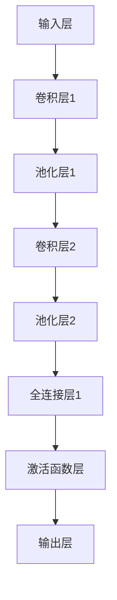

                 

### 文章标题

### 神经图灵机：增强AI Agent的算法学习能力

### 关键词

- 神经图灵机
- AI Agent
- 算法学习
- 神经网络
- 强化学习

### 摘要

本文将探讨神经图灵机这一前沿概念，解析其在增强AI Agent算法学习能力方面的独特优势。通过逐步分析神经图灵机的背景、核心概念、算法基础及其应用场景，本文旨在提供一个系统而深入的理解框架，为读者揭示神经图灵机在人工智能领域的重要性及未来发展趋势。

### 目录大纲

----------------------------------------------------------------

# 神经图灵机：增强AI Agent的算法学习能力

> 关键词：神经图灵机、AI Agent、算法学习、神经网络、强化学习

> 摘要：本文将探讨神经图灵机这一前沿概念，解析其在增强AI Agent算法学习能力方面的独特优势。通过逐步分析神经图灵机的背景、核心概念、算法基础及其应用场景，本文旨在提供一个系统而深入的理解框架，为读者揭示神经图灵机在人工智能领域的重要性及未来发展趋势。

## 目录大纲

----------------------------------------------------------------

## 第一部分：神经图灵机的背景与概念

### 第1章：神经图灵机的起源与重要性

### 第2章：神经图灵机的核心概念与架构

## 第二部分：神经图灵机的算法基础

### 第3章：感知机与线性模型

### 第4章：反向传播算法

### 第5章：卷积神经网络（CNN）

## 第三部分：神经图灵机的应用场景

### 第6章：自然语言处理（NLP）

### 第7章：强化学习与博弈

### 第8章：神经图灵机的未来发展趋势

----------------------------------------------------------------

### 第一部分：神经图灵机的背景与概念

#### 第1章：神经图灵机的起源与重要性

神经图灵机（Neural Turing Machine, NTM）是由Alex Graves等人于2014年首次提出的，是一种结合了神经网络与图灵机的混合模型。传统的图灵机以其强大的计算能力而著称，但它在处理非结构化数据时存在局限性。神经网络在处理复杂数据方面展现了卓越的能力，但它在执行确定性计算任务时表现不佳。

神经图灵机的出现为这一问题提供了一个创新性的解决方案。它通过将神经网络的动态特性与图灵机的确定性计算能力相结合，实现了对数据的灵活处理和高效计算。这种混合模型的诞生，标志着人工智能领域的一个新里程碑。

#### 1.1 神经图灵机的定义与基本原理

神经图灵机是一种基于神经网络的计算模型，它包含了两个主要组件：神经网络和可寻址存储单元（Addressable Memory）。神经网络负责处理输入数据，并生成操作指令，可寻址存储单元则用于存储和检索数据。

神经图灵机的工作原理可以概括为以下几个步骤：

1. **输入处理**：神经网络接收输入数据，并通过权重调整学习数据的特征表示。
2. **生成操作指令**：神经网络生成一组操作指令，这些指令用于在可寻址存储单元中进行数据读写操作。
3. **存储与检索**：可寻址存储单元根据操作指令读取或写入数据。
4. **输出生成**：神经网络使用最新的输入数据和存储单元中的数据生成输出结果。

#### 1.2 神经图灵机与传统图灵机的区别

传统图灵机是一种基于状态转换的抽象计算模型，它由一个读写头、有限状态机和无限长的带子组成。图灵机通过不断读取和写入带子上的符号，实现复杂的计算任务。然而，传统图灵机在处理非结构化数据时存在困难，因为它依赖于明确的输入输出格式。

相比之下，神经图灵机通过神经网络处理输入数据，并利用可寻址存储单元存储和检索数据。这种设计使得神经图灵机能够灵活地处理各种类型的数据，包括图像、文本和音频等。此外，神经图灵机通过动态生成操作指令，实现了对数据的自适应处理。

#### 1.3 神经图灵机在AI领域的重要性

神经图灵机的出现为人工智能领域带来了新的可能性。它不仅在数据处理的灵活性方面具有优势，还在计算效率、可解释性和泛化能力等方面展现出独特的潜力。

1. **数据处理灵活性**：神经图灵机能够处理各种类型的数据，包括非结构化数据。这使得它适用于许多实际应用，如图像识别、自然语言处理和强化学习等。
2. **计算效率**：神经图灵机通过将神经网络与图灵机的优势相结合，实现了高效的数据处理和计算。这种设计使得神经图灵机在许多计算任务中具有竞争优势。
3. **可解释性**：神经图灵机的操作指令和存储单元的状态可以被解释为对数据的处理过程。这种可解释性有助于理解模型的决策过程，提高模型的透明度。
4. **泛化能力**：神经图灵机通过灵活的数据处理和自适应的操作指令生成，提高了模型的泛化能力。这使得神经图灵机在处理未知或罕见数据时能够表现出更好的性能。

总之，神经图灵机作为一种新兴的计算模型，在人工智能领域具有重要的应用价值。它通过结合神经网络与图灵机的优势，实现了对数据的灵活处理和高效计算，为人工智能的发展带来了新的机遇。

#### 第2章：神经图灵机的核心概念与架构

神经图灵机（Neural Turing Machine，简称NTM）是一种混合计算模型，它将神经网络的动态处理能力与图灵机的记忆和寻址能力相结合，形成了一种在处理复杂任务时具有显著优势的新型计算架构。在这一章节中，我们将深入探讨神经图灵机的核心概念与架构，包括其基本组成部分、工作原理及其在AI领域的应用。

##### 2.1 神经网络的基本概念

神经网络（Neural Networks）是受生物神经网络启发的一种计算模型，它通过大量的神经元（节点）及其之间的连接（边）进行信息的传递和处理。神经网络的核心组成部分包括：

1. **神经元**：神经网络的基本构建块，通常包含一个输入层、一个或多个隐藏层和一个输出层。每个神经元都会接收来自输入层的输入信号，通过加权求和处理后，产生一个输出信号。
2. **权重**：神经元之间的连接权重，用于调节输入信号的强度和重要性。
3. **激活函数**：用于确定神经元是否被激活的函数，常见的激活函数包括Sigmoid、ReLU和Tanh等。

神经网络通过大量的参数（权重和偏置）来学习输入和输出之间的关系，通过反向传播算法（Backpropagation）不断调整这些参数，以最小化预测误差。

##### 2.2 深度学习的基本原理

深度学习（Deep Learning）是神经网络的一种扩展，它通过增加网络的深度（即层数）来提高模型的表达能力和学习能力。深度学习模型通常包含多个隐藏层，能够捕捉更复杂的数据特征。

深度学习的基本原理包括：

1. **前向传播（Forward Propagation）**：输入数据从输入层传递到每一层，经过加权求和处理和激活函数，最终生成输出。
2. **反向传播（Backpropagation）**：计算输出误差，将误差反向传播到每一层，通过梯度下降（Gradient Descent）算法更新权重和偏置。
3. **优化算法**：包括随机梯度下降（SGD）、Adam、RMSprop等，用于加速收敛和优化模型参数。

深度学习在图像识别、语音识别、自然语言处理等领域取得了显著的成果，成为当前AI研究的热点之一。

##### 2.3 神经图灵机的架构设计

神经图灵机的设计灵感来源于图灵机和神经网络，它结合了两者的优势，形成了一种全新的计算模型。神经图灵机的主要组成部分包括：

1. **神经网络**：用于处理输入数据和生成操作指令。
2. **可寻址存储单元**：用于存储和检索数据。
3. **读写头**：用于在存储单元中定位和读取数据。

神经图灵机的工作原理可以概括为以下几个步骤：

1. **输入处理**：神经网络接收输入数据，并通过加权求和处理学习数据的特征表示。
2. **生成操作指令**：神经网络生成一组操作指令，这些指令用于在可寻址存储单元中进行数据读写操作。
3. **存储与检索**：可寻址存储单元根据操作指令读取或写入数据。
4. **输出生成**：神经网络使用最新的输入数据和存储单元中的数据生成输出结果。

##### 2.3.1 可寻址存储单元

可寻址存储单元（Addressable Memory）是神经图灵机的核心组件之一，它类似于计算机内存，用于存储和检索数据。在神经图灵机中，存储单元由一系列的存储单元块（Memory Blocks）组成，每个存储单元块可以存储一定数量的数据。

可寻址存储单元的关键特性包括：

1. **寻址机制**：读写头通过生成地址向量来定位存储单元块。地址向量由神经网络生成，其大小与存储单元的维度相同。
2. **读写操作**：读写头可以在存储单元块中进行读取和写入操作。读取操作用于获取存储单元块中的数据，写入操作用于更新存储单元块中的数据。

##### 2.3.2 读写头

读写头（Read-Write Head）是神经图灵机的另一个核心组件，它负责在可寻址存储单元中定位和读取数据。读写头由两部分组成：读头和写头。

1. **读头**：用于从存储单元块中读取数据。读头接收输入数据，通过神经网络生成的地址向量定位到相应的存储单元块，并将数据读取出来。
2. **写头**：用于将数据写入存储单元块。写头接收输入数据和神经网络生成的地址向量，将数据写入到对应的存储单元块。

##### 2.3.3 操作指令

在神经图灵机中，神经网络生成一组操作指令，用于在可寻址存储单元中进行数据读写操作。这些操作指令包括：

1. **读取操作**：用于从存储单元块中读取数据。读取操作由读头执行，神经网络生成地址向量来确定要读取的数据位置。
2. **写入操作**：用于将数据写入存储单元块。写入操作由写头执行，神经网络生成地址向量来确定要写入的数据位置。
3. **更新操作**：用于更新存储单元块中的数据。更新操作可以结合读取和写入操作，实现对数据的修改。

##### 2.3.4 神经网络与存储单元的交互

神经网络与可寻址存储单元之间的交互是神经图灵机实现灵活数据处理的关键。神经网络通过生成操作指令来控制存储单元的行为。具体来说，神经网络可以生成以下类型的操作指令：

1. **随机读取**：从存储单元中随机读取数据，用于探索数据特征。
2. **目标驱动读取**：根据特定的目标值读取数据，用于实现特定任务。
3. **随机写入**：将数据随机写入存储单元，用于实现数据的存储和更新。
4. **目标驱动写入**：根据特定的目标值写入数据，用于实现数据的修改。

##### 2.3.5 神经图灵机的优势

神经图灵机通过结合神经网络与图灵机的优势，在处理复杂任务时展现出显著的优势。具体来说，神经图灵机的优势包括：

1. **灵活性**：神经图灵机能够处理各种类型的数据，包括结构化和非结构化数据，具有广泛的应用前景。
2. **高效性**：神经图灵机通过将神经网络与图灵机的优势相结合，实现了高效的数据处理和计算，提高了计算效率。
3. **可解释性**：神经图灵机的操作指令和存储单元的状态可以被解释为对数据的处理过程，提高了模型的透明度，有助于理解模型的决策过程。
4. **泛化能力**：神经图灵机通过灵活的数据处理和自适应的操作指令生成，提高了模型的泛化能力，使其在处理未知或罕见数据时能够表现出更好的性能。

总之，神经图灵机作为一种结合神经网络与图灵机优势的新型计算模型，在AI领域具有重要的应用价值。通过深入理解其核心概念与架构，我们可以更好地把握神经图灵机的工作原理及其在AI任务中的应用，推动人工智能的发展。

#### 第3章：感知机与线性模型

感知机（Perceptron）是一种基本的神经网络模型，它通过简单的线性组合和阈值函数来分类数据。在神经图灵机的架构中，感知机是一个关键的组成部分，它用于处理输入数据，并生成基本的操作指令。

##### 3.1 感知机的基本原理

感知机的基本原理可以概括为以下几个步骤：

1. **输入处理**：感知机接收一个输入向量 \(\mathbf{x}\)，每个输入元素都与权重 \(w_i\) 相乘，形成加权求和处理。
   
   $$ z = \sum_{i=1}^{n} w_i \cdot x_i $$

2. **加权求和处理**：将输入向量的每个元素与相应的权重相乘，然后将结果相加。

3. **激活函数**：通过阈值函数 \(f(z)\) 对加权求和处理的结果进行判定，以确定输出是否大于某个阈值。

   $$ y = f(z) = \begin{cases} 
   1, & \text{if } z \geq \theta \\
   0, & \text{if } z < \theta 
   \end{cases} $$

其中，\( \theta \) 是阈值，\( f(z) \) 是感知函数，通常采用 Heaviside 函数或符号函数。

##### 3.2 感知机的算法实现

感知机的算法实现相对简单，主要包括以下几个步骤：

1. **初始化权重**：随机初始化权重 \( w_i \) 和阈值 \( \theta \)。
2. **前向传播**：计算输入向量的加权求和处理结果 \( z \)，并应用激活函数得到输出 \( y \)。
3. **反向传播**：根据输出 \( y \) 与实际标签 \( t \) 的差异，更新权重 \( w_i \) 和阈值 \( \theta \)。

更新规则如下：

$$ w_i \leftarrow w_i + \eta \cdot (t - y) \cdot x_i $$

其中，\( \eta \) 是学习率，用于调节权重更新的强度。

##### 3.3 线性模型在神经图灵机中的应用

在神经图灵机中，感知机作为基本组件，主要用于处理输入数据，并生成操作指令。线性模型在神经图灵机中的应用包括以下几个方面：

1. **输入特征提取**：感知机用于提取输入数据的特征表示，这些特征将作为神经图灵机后续操作的基础。
   
   $$ \mathbf{z} = \mathbf{W} \cdot \mathbf{x} + \mathbf{b} $$

   其中，\( \mathbf{W} \) 是权重矩阵，\( \mathbf{b} \) 是偏置向量。

2. **生成操作指令**：感知机生成的操作指令用于在可寻址存储单元中定位和操作数据。这些指令通常由线性组合和激活函数生成。

   $$ \mathbf{a} = \mathbf{z} + \mathbf{b} $$
   
   $$ \mathbf{y} = \text{sigmoid}(\mathbf{a}) $$

3. **动态调整权重**：通过反向传播算法，感知机的权重和阈值不断调整，以优化操作指令的生成。

总之，感知机与线性模型在神经图灵机中扮演了重要角色，它们通过简单的线性组合和激活函数，实现了对输入数据的处理和操作指令的生成，为神经图灵机的灵活数据处理和高效计算提供了基础。

##### 3.4 感知机与线性模型的局限

虽然感知机和线性模型在神经图灵机中具有重要作用，但它们也存在一些局限性：

1. **线性分类限制**：感知机只能处理线性可分的数据，对于非线性分类问题，性能较差。
2. **特征表达能力有限**：线性模型通过简单的加权求和处理来提取特征，特征表达能力有限，难以捕捉复杂的数据模式。
3. **训练速度慢**：由于线性模型的简单性，其训练速度相对较慢，尤其是当数据量较大时，训练时间会显著增加。

为了克服这些局限性，神经图灵机进一步引入了深度学习、非线性激活函数和更复杂的神经网络结构，以提高模型的分类能力和特征表达能力。这些改进为神经图灵机在复杂任务中的应用提供了更强大的支持。

#### 第4章：反向传播算法

反向传播算法（Backpropagation Algorithm）是神经网络训练过程中不可或缺的一部分，它通过不断调整网络权重和偏置，以优化模型的性能。在神经图灵机中，反向传播算法同样发挥着重要作用，用于优化操作指令的生成和数据的处理。

##### 4.1 反向传播算法的基本原理

反向传播算法的核心思想是通过反向传播误差信息，从输出层开始逐层更新网络权重和偏置。具体来说，反向传播算法包括以下几个主要步骤：

1. **前向传播**：输入数据通过网络的每一层，从输入层传递到输出层，经过加权求和处理和激活函数，生成预测输出。
   
   $$ z_l = \sum_{i} w_{li} \cdot a_{l-1,i} + b_l $$
   
   $$ a_l = \sigma(z_l) $$

   其中，\( a_l \) 表示第 \( l \) 层的输出，\( \sigma \) 是激活函数，\( w_{li} \) 是第 \( l \) 层第 \( i \) 个神经元到第 \( l-1 \) 层第 \( i \) 个神经元的权重，\( b_l \) 是第 \( l \) 层的偏置。

2. **计算误差**：计算预测输出与实际输出之间的误差，通常使用均方误差（MSE）作为损失函数。
   
   $$ \text{MSE} = \frac{1}{2} \sum_{i} (y_i - \hat{y}_i)^2 $$

   其中，\( y_i \) 是实际输出，\( \hat{y}_i \) 是预测输出。

3. **计算梯度**：计算输出层的误差梯度，并反向传播到每一层，计算每一层的权重和偏置的梯度。
   
   $$ \frac{\partial \text{MSE}}{\partial w_{lj}} = (a_l - t_l) \cdot a_{l-1,j} $$
   
   $$ \frac{\partial \text{MSE}}{\partial b_l} = (a_l - t_l) $$

   其中，\( t_l \) 是实际标签。

4. **更新权重和偏置**：使用梯度下降算法更新每一层的权重和偏置。
   
   $$ w_{lj} \leftarrow w_{lj} - \eta \cdot \frac{\partial \text{MSE}}{\partial w_{lj}} $$
   
   $$ b_l \leftarrow b_l - \eta \cdot \frac{\partial \text{MSE}}{\partial b_l} $$

   其中，\( \eta \) 是学习率。

##### 4.2 反向传播算法的实现步骤

反向传播算法的实现主要包括以下几个步骤：

1. **初始化权重和偏置**：随机初始化网络的权重和偏置。
2. **前向传播**：输入数据通过网络的每一层，生成预测输出。
3. **计算误差**：计算预测输出与实际输出之间的误差。
4. **计算梯度**：从输出层开始，逐层计算误差的梯度。
5. **更新权重和偏置**：使用梯度下降算法更新每一层的权重和偏置。

反向传播算法的具体实现代码如下（使用Python语言）：

```python
import numpy as np

def forward_propagation(x, W, b):
    """
    前向传播
    """
    z = np.dot(x, W) + b
    a = np.sigmoid(z)
    return z, a

def backward_propagation(a, t, W, b):
    """
    反向传播
    """
    z = a * (1 - a)  # 激活函数的导数
    e = t - a
    dW = z * e
    db = z * e
    
    return dW, db

def update_weights(W, dW, b, db, learning_rate):
    """
    更新权重和偏置
    """
    W -= learning_rate * dW
    b -= learning_rate * db
    
    return W, b

# 示例
x = np.array([1, 0])
t = np.array([0])
W = np.random.rand(2, 1)
b = np.random.rand(1)
learning_rate = 0.1

z, a = forward_propagation(x, W, b)
dW, db = backward_propagation(a, t, W, b)
W, b = update_weights(W, dW, b, db, learning_rate)
```

##### 4.3 反向传播算法在神经图灵机中的优化应用

在神经图灵机中，反向传播算法用于优化操作指令的生成和数据的处理。以下是一些常见的优化方法：

1. **学习率调整**：通过动态调整学习率，可以优化模型的训练过程。常用的方法包括恒定学习率、自适应学习率（如Adam优化器）等。
2. **正则化**：通过引入正则化项，如L1正则化和L2正则化，可以减少过拟合现象，提高模型的泛化能力。
3. **批量归一化**：通过批量归一化（Batch Normalization），可以加快模型的训练速度，提高训练稳定性。
4. **激活函数选择**：选择合适的激活函数，如ReLU函数，可以提高模型的训练效率和性能。

总之，反向传播算法在神经图灵机中发挥着重要作用，通过优化算法的实现和应用，可以进一步提高神经图灵机的计算效率和性能。

#### 第5章：卷积神经网络（CNN）

卷积神经网络（Convolutional Neural Network，简称CNN）是一种专门用于处理图像数据的前沿深度学习模型。CNN通过卷积操作、池化操作和全连接层等结构，能够有效地提取图像中的特征，并在图像识别、目标检测和图像生成等任务中取得显著成果。在这一章节中，我们将详细探讨CNN的基本概念、结构及其在图像识别中的应用。

##### 5.1 卷积神经网络的基本概念

CNN的核心组件是卷积层（Convolutional Layer），它通过卷积操作提取图像中的局部特征。卷积操作可以看作是一种特殊的矩阵乘法，将图像与卷积核（Convolutional Kernel）进行点积运算，从而生成特征图（Feature Map）。

卷积操作的数学表达式如下：

$$ \text{Feature Map}_{ij} = \sum_{m=1}^{M} \sum_{n=1}^{N} \text{Kernel}_{mn,ij} \cdot \text{Input}_{mn} $$

其中，\(\text{Feature Map}_{ij}\) 表示第 \(i\) 行第 \(j\) 列的特征值，\(\text{Kernel}_{mn,ij}\) 表示卷积核中的元素，\(\text{Input}_{mn}\) 表示图像中的像素值。

卷积层的主要优点包括：

1. **局部连接**：卷积层中的神经元仅与输入图像的局部区域相连，这有助于减少参数数量，提高模型的计算效率。
2. **参数共享**：卷积层中的卷积核对整个输入图像应用，这意味着每个卷积核可以提取通用的特征，参数数量相对较少。
3. **平移不变性**：由于卷积操作的局部连接特性，CNN对图像的平移具有不变性，这意味着图像的微小平移不会影响模型的输出。

##### 5.2 卷积神经网络的结构与层

CNN通常包含以下几个主要层：

1. **卷积层（Convolutional Layer）**：卷积层通过卷积操作提取图像中的特征，每个卷积核可以提取不同的特征。卷积层可以堆叠多层，以逐步提取更抽象的特征。
2. **池化层（Pooling Layer）**：池化层用于降低特征图的维度，减少参数数量，提高模型的计算效率。常用的池化操作包括最大池化（Max Pooling）和平均池化（Average Pooling）。
3. **全连接层（Fully Connected Layer）**：全连接层将卷积层和池化层提取的特征映射到输出类别。通过全连接层，CNN可以实现分类、回归等任务。
4. **激活函数层（Activation Function Layer）**：激活函数层用于引入非线性特性，常见的激活函数包括ReLU（Rectified Linear Unit）、Sigmoid和Tanh等。

一个典型的CNN结构如下：



##### 5.3 CNN在图像识别中的应用

CNN在图像识别任务中取得了显著成果，以下是一些常见的应用场景：

1. **图像分类**：通过训练CNN模型，可以对图像进行分类，如将图像分为猫、狗、车等类别。经典的CNN模型包括LeNet、AlexNet、VGG、ResNet等。
2. **目标检测**：目标检测是图像识别的一种扩展，它不仅需要识别图像中的物体类别，还需要确定物体的位置。常用的目标检测模型包括R-CNN、Fast R-CNN、Faster R-CNN、YOLO、SSD等。
3. **语义分割**：语义分割是对图像中的每个像素进行分类，以识别图像中的物体和场景。常用的语义分割模型包括FCN、U-Net、DeepLab等。

以下是一个使用CNN进行图像分类的Python代码示例（基于TensorFlow和Keras框架）：

```python
import tensorflow as tf
from tensorflow.keras.models import Sequential
from tensorflow.keras.layers import Conv2D, MaxPooling2D, Flatten, Dense, Activation

model = Sequential()
model.add(Conv2D(32, (3, 3), input_shape=(28, 28, 1)))
model.add(Activation('relu'))
model.add(MaxPooling2D(pool_size=(2, 2)))
model.add(Conv2D(64, (3, 3)))
model.add(Activation('relu'))
model.add(MaxPooling2D(pool_size=(2, 2)))
model.add(Flatten())
model.add(Dense(64))
model.add(Activation('relu'))
model.add(Dense(10))
model.add(Activation('softmax'))

model.compile(optimizer='adam', loss='categorical_crossentropy', metrics=['accuracy'])
model.fit(x_train, y_train, epochs=10, batch_size=32, validation_data=(x_val, y_val))
```

##### 5.4 CNN的局限性和未来发展趋势

尽管CNN在图像识别任务中取得了显著成果，但它也存在一些局限性：

1. **计算资源消耗**：CNN模型通常需要大量的计算资源和存储空间，这在移动设备和嵌入式系统中可能是一个挑战。
2. **数据依赖性**：CNN模型对数据质量有较高要求，数据不平衡、噪声和遮挡等问题都可能影响模型的性能。
3. **可解释性**：CNN模型的学习过程较为复杂，其决策过程往往不透明，难以解释。

未来，CNN的研究和发展方向包括：

1. **轻量化**：通过设计更轻量级的模型结构和优化算法，降低计算资源和存储空间的消耗。
2. **数据增强**：通过引入更丰富的数据增强方法，提高模型的泛化能力和鲁棒性。
3. **解释性**：通过引入可解释性机制，如可视化技术和解释性模型，提高模型的可解释性。

总之，CNN作为一种强大的图像处理工具，在图像识别任务中展现了卓越的性能。随着技术的不断发展，CNN的应用将更加广泛，并在未来发挥更大的作用。

#### 第6章：自然语言处理（NLP）

自然语言处理（Natural Language Processing，简称NLP）是人工智能领域的一个重要分支，它旨在让计算机理解和处理人类语言。NLP在文本分类、情感分析、机器翻译和语音识别等任务中取得了显著的成果。在这一章节中，我们将探讨NLP的基本概念、挑战及其在AI领域的应用，特别是基于神经图灵机的NLP算法。

##### 6.1 NLP的基本概念

自然语言处理的基本任务包括：

1. **分词（Tokenization）**：将文本拆分成单词、短语或符号等基本单位，以便进行后续处理。
2. **词性标注（Part-of-Speech Tagging）**：为文本中的每个单词标注词性，如名词、动词、形容词等。
3. **命名实体识别（Named Entity Recognition）**：识别文本中的特定实体，如人名、地名、组织名等。
4. **句法分析（Syntactic Parsing）**：分析句子的结构，识别句子中的语法成分和关系。
5. **语义分析（Semantic Analysis）**：理解文本中的意义和意图，包括语义角色标注、语义关系识别等。

NLP的关键概念包括：

1. **词嵌入（Word Embedding）**：将文本中的单词映射到高维向量空间，以便进行向量运算。词嵌入技术能够捕捉单词的语义信息，如“飞机”和“飞行”之间的语义关系。
2. **语言模型（Language Model）**：用于预测文本序列的概率分布。语言模型是许多NLP任务的基础，如机器翻译、语音识别和文本生成等。
3. **深度学习模型**：如循环神经网络（RNN）、长短期记忆网络（LSTM）和Transformer等，这些模型通过学习大量的文本数据，能够有效地捕捉文本中的复杂结构。

##### 6.2 NLP的基本挑战

自然语言处理面临以下挑战：

1. **多义性（Ambiguity）**：同一短语可能有多种解释，如“我去了图书馆”可以指代“我去了图书馆学习”或“我去了图书馆那边的餐厅”。多义性使得文本处理变得复杂。
2. **语言变体（Variety）**：语言具有丰富的变体，包括地域差异、语体差异和口语化表达等。这增加了NLP任务的复杂性。
3. **噪声和错误**：文本中可能包含拼写错误、语法错误和非标准用法，这些噪声和错误对NLP模型的训练和性能有负面影响。
4. **上下文依赖（Context Dependency）**：文本中的含义往往依赖于上下文，理解上下文对文本处理至关重要。

##### 6.3 基于神经图灵机的NLP算法

神经图灵机在自然语言处理中展现出独特的优势，它通过结合神经网络的动态处理能力和图灵机的存储和检索能力，实现了对文本数据的灵活处理。以下是基于神经图灵机的一些NLP算法：

1. **文本分类**：使用神经图灵机对文本进行分类，通过将文本转换为词嵌入向量，并利用神经网络和存储单元进行数据处理和分类。以下是一个简单的文本分类算法：

```python
def text_classification(text, ntm):
    """
    文本分类
    """
    # 将文本转换为词嵌入向量
    embeddings = word_embedding(text)
    # 将词嵌入向量输入到神经图灵机
    ntm.input_data(embeddings)
    # 生成分类标签
    label = ntm.generate_label()
    return label
```

2. **情感分析**：情感分析是判断文本的情感倾向，如正面、负面或中性。基于神经图灵机的情感分析算法通过将文本转换为词嵌入向量，并利用神经网络和存储单元对文本进行情感分析。以下是一个简单的情感分析算法：

```python
def sentiment_analysis(text, ntm):
    """
    情感分析
    """
    # 将文本转换为词嵌入向量
    embeddings = word_embedding(text)
    # 将词嵌入向量输入到神经图灵机
    ntm.input_data(embeddings)
    # 生成情感标签
    sentiment = ntm.generate_sentiment()
    return sentiment
```

3. **问答系统**：问答系统是一种基于文本的交互系统，它能够回答用户提出的问题。基于神经图灵机的问答系统通过将问题和文本转换为词嵌入向量，并利用神经网络和存储单元进行问答处理。以下是一个简单的问答系统算法：

```python
def question_answering(question, context, ntm):
    """
    问答系统
    """
    # 将问题转换为词嵌入向量
    question_embeddings = word_embedding(question)
    # 将文本转换为词嵌入向量
    context_embeddings = word_embedding(context)
    # 将词嵌入向量输入到神经图灵机
    ntm.input_data(context_embeddings)
    # 生成答案
    answer = ntm.answer_question(question_embeddings)
    return answer
```

##### 6.4 基于神经图灵机的NLP算法的优势

基于神经图灵机的NLP算法具有以下优势：

1. **灵活性**：神经图灵机能够灵活地处理各种类型的文本数据，包括结构化和非结构化数据。
2. **高效性**：神经图灵机通过将神经网络与图灵机的优势相结合，实现了对文本数据的高效处理。
3. **可解释性**：神经图灵机的操作指令和存储单元的状态可以被解释为对文本数据的处理过程，提高了模型的透明度。
4. **泛化能力**：神经图灵机通过灵活的数据处理和自适应的操作指令生成，提高了模型的泛化能力。

总之，基于神经图灵机的NLP算法为自然语言处理提供了新的方法和思路。通过深入理解和应用这些算法，我们可以更好地处理文本数据，为人工智能的发展做出贡献。

#### 第7章：强化学习与博弈

强化学习（Reinforcement Learning，简称RL）是机器学习的一个重要分支，它通过智能体（Agent）与环境（Environment）的交互，学习最优策略，以实现特定目标。在博弈（Game）场景中，强化学习具有广泛的应用，如围棋、扑克和电子竞技等。在这一章节中，我们将探讨强化学习的基本概念和算法，以及基于神经图灵机的强化学习在博弈中的应用。

##### 7.1 强化学习的基本概念

强化学习是一种基于奖励反馈的机器学习方法，它通过智能体在环境中采取行动，从环境中获得奖励或惩罚，并逐步学习最优策略。强化学习的基本概念包括：

1. **智能体（Agent）**：在强化学习中，智能体是执行动作并学习策略的实体。智能体的目标是最大化累积奖励。
2. **环境（Environment）**：环境是智能体执行动作的上下文，它根据智能体的动作产生状态和奖励。
3. **状态（State）**：状态是环境的一个表征，它用于描述智能体在某一时刻所处的情境。
4. **动作（Action）**：动作是智能体在某一状态下可以采取的行动。
5. **奖励（Reward）**：奖励是环境对智能体动作的反馈，它用于指导智能体的学习过程。奖励可以是正值（奖励）或负值（惩罚）。
6. **策略（Policy）**：策略是智能体在某一状态下采取的动作，它通常通过学习算法来优化。

强化学习的基本过程可以概括为以下几个步骤：

1. **初始化**：智能体和环境初始化，智能体选择一个初始状态。
2. **行动**：智能体在当前状态下选择一个动作，并执行该动作。
3. **反馈**：环境根据智能体的动作产生一个新的状态和奖励，并将奖励反馈给智能体。
4. **更新**：智能体根据奖励更新其策略，以最大化累积奖励。

##### 7.2 基于神经图灵机的强化学习算法

神经图灵机（Neural Turing Machine，简称NTM）在强化学习中的应用为智能体的决策过程提供了新的方法和思路。基于神经图灵机的强化学习算法通过结合神经网络的动态处理能力和图灵机的存储和检索能力，实现了智能体在复杂环境中的高效学习和决策。

以下是基于神经图灵机的强化学习算法的基本框架：

1. **初始化**：智能体和环境初始化，智能体选择一个初始状态。
2. **状态编码**：将当前状态编码为向量，并输入到神经图灵机。
3. **生成操作指令**：神经网络生成一组操作指令，这些指令用于在可寻址存储单元中进行数据读写操作。
4. **执行操作指令**：根据操作指令，在可寻址存储单元中读取数据，生成下一个状态和奖励。
5. **更新策略**：智能体根据奖励和存储单元中的数据更新其策略，以最大化累积奖励。

基于神经图灵机的强化学习算法的具体实现如下（使用Python代码示例）：

```python
import numpy as np

class NeuralTuringMachine:
    def __init__(self, state_size, memory_size):
        self.state_size = state_size
        self.memory_size = memory_size
        self.memory = np.zeros((memory_size, state_size))
        self.weights = np.random.rand(state_size, memory_size)
    
    def input_data(self, state):
        self.state = state
    
    def generate_instruction(self):
        instruction = np.dot(self.state, self.weights)
        return instruction
    
    def execute_instruction(self, instruction):
        memory_address = np.argmax(instruction)
        data = self.memory[memory_address]
        next_state = data + self.state
        reward = self.calculate_reward(next_state)
        return next_state, reward
    
    def calculate_reward(self, state):
        # 奖励计算逻辑
        reward = 0
        return reward
    
    def update_strategy(self, reward):
        # 更新策略逻辑
        pass

# 示例
state_size = 5
memory_size = 10
ntm = NeuralTuringMachine(state_size, memory_size)

# 初始化状态
state = np.random.rand(state_size)

# 输入状态
ntm.input_data(state)

# 生成操作指令
instruction = ntm.generate_instruction()

# 执行操作指令
next_state, reward = ntm.execute_instruction(instruction)

# 更新策略
ntm.update_strategy(reward)
```

##### 7.3 强化学习在博弈中的应用

强化学习在博弈场景中具有广泛的应用，以下是一些典型的应用：

1. **围棋**：围棋是一种古老的策略游戏，强化学习算法如深度强化学习（Deep Reinforcement Learning，简称DRL）和策略梯度算法（Policy Gradient Algorithms）在围棋中取得了显著成果。例如，AlphaGo通过结合深度学习和强化学习算法，实现了对围棋的顶尖水平表现。
2. **扑克**：扑克是一种复杂的博弈游戏，强化学习算法在扑克策略优化中发挥了重要作用。例如，DeepStack算法通过深度强化学习和策略网络，实现了对扑克游戏的自动学习和对局策略的优化。
3. **电子竞技**：电子竞技游戏如Dota 2、StarCraft 2等，强化学习算法在游戏策略制定和决策中得到了广泛应用。例如，OpenAI开发的Dota 2 AI通过深度强化学习算法，实现了与人类玩家的对局。

总之，强化学习在博弈中的应用展示了其强大的学习能力和策略优化能力。通过结合神经图灵机的优势，强化学习算法在复杂博弈场景中表现出更高的性能和适应性。

##### 7.4 基于神经图灵机的强化学习算法的优势

基于神经图灵机的强化学习算法具有以下优势：

1. **灵活性**：神经图灵机能够灵活地处理各种类型的数据，包括结构化和非结构化数据，提高了智能体的数据处理能力。
2. **高效性**：神经图灵机通过结合神经网络和图灵机的优势，实现了对数据的快速处理和计算，提高了智能体的决策效率。
3. **可解释性**：神经图灵机的操作指令和存储单元的状态可以被解释为对数据的处理过程，提高了智能体决策过程的透明度。
4. **泛化能力**：神经图灵机通过灵活的数据处理和自适应的操作指令生成，提高了智能体的泛化能力，使其在未知或罕见数据场景中表现出更好的性能。

总之，基于神经图灵机的强化学习算法为博弈场景提供了新的方法和思路。通过深入理解和应用这些算法，我们可以开发出更强大的智能体，推动人工智能在博弈领域的进一步发展。

#### 第8章：神经图灵机的未来发展趋势

神经图灵机（Neural Turing Machine，简称NTM）作为一种结合了神经网络与图灵机优势的混合计算模型，在人工智能（AI）领域展现出了巨大的潜力。随着技术的不断进步和应用的深入，神经图灵机有望在未来带来更多的创新和突破。

##### 8.1 神经图灵机的未来发展

神经图灵机的未来发展趋势可以从以下几个方面进行展望：

1. **算法优化**：现有的神经图灵机算法还存在计算效率、存储资源占用和模型稳定性等方面的挑战。未来，研究人员将致力于优化算法，提高神经图灵机的计算效率，减少存储需求，增强模型的鲁棒性。
2. **硬件加速**：随着硬件技术的发展，如GPU、TPU等专用硬件加速器，神经图灵机的性能有望进一步提升。通过硬件加速，可以显著提高神经图灵机的计算速度和处理能力，使其在更广泛的应用场景中得到实际应用。
3. **多模态数据处理**：神经图灵机在处理复杂数据方面具有独特的优势。未来，神经图灵机有望扩展到多模态数据处理，如结合图像、文本、音频等多种类型的数据，实现更高效、更灵活的数据处理和计算。
4. **与深度学习结合**：神经图灵机与深度学习的结合是一种自然的选择。未来，研究人员将探索如何将神经图灵机的优势与深度学习的强大表达能力相结合，开发出更强大的AI模型和算法。
5. **跨学科应用**：神经图灵机不仅在AI领域具有广阔的应用前景，还可以应用于其他学科，如计算机视觉、自然语言处理、机器人学等。跨学科应用将推动神经图灵机在更多领域的突破。

##### 8.2 增强AI Agent的挑战与机遇

在增强AI Agent的算法学习能力方面，神经图灵机提供了新的机遇和挑战：

1. **挑战**：
   - **计算复杂性**：神经图灵机的计算复杂性较高，如何优化算法，提高计算效率是一个重要的挑战。
   - **存储需求**：神经图灵机需要大量的存储资源，如何减少存储需求，提高存储效率是一个关键问题。
   - **可解释性**：神经图灵机的操作过程复杂，如何提高其可解释性，使其决策过程更加透明是一个重要的研究方向。
2. **机遇**：
   - **灵活性**：神经图灵机在处理复杂数据和非结构化数据方面具有显著优势，这为增强AI Agent提供了更多可能性。
   - **高效性**：神经图灵机通过结合神经网络与图灵机的优势，实现了对数据的灵活处理和高效计算，有助于提高AI Agent的算法学习能力。
   - **适应性**：神经图灵机具有强大的自适应能力，可以通过学习不断调整操作指令，提高AI Agent在动态环境中的适应能力。

##### 8.3 神经图灵机在其他领域的应用潜力

神经图灵机不仅在AI领域具有广泛的应用潜力，还可以在其他领域发挥重要作用：

1. **医学领域**：神经图灵机可以用于医学图像处理、疾病诊断和预测等任务。通过结合医学图像和病历数据，神经图灵机可以提供更准确、更高效的诊断和预测结果。
2. **金融领域**：神经图灵机可以用于金融市场分析、投资策略优化和风险评估等任务。通过处理大量金融数据，神经图灵机可以提供更准确、更及时的决策支持。
3. **工业领域**：神经图灵机可以用于工业自动化、生产优化和质量控制等任务。通过处理生产数据和传感器数据，神经图灵机可以优化生产流程，提高生产效率。
4. **科学领域**：神经图灵机可以用于科学研究和数据分析。通过处理科学实验数据，神经图灵机可以提供更准确、更深入的数据分析和预测结果。

总之，神经图灵机作为一种新兴的计算模型，在增强AI Agent的算法学习能力方面具有巨大的潜力。通过不断优化算法、拓展应用领域和结合深度学习技术，神经图灵机有望在未来带来更多的创新和突破，为人工智能的发展做出重要贡献。

### 结论

神经图灵机（Neural Turing Machine，简称NTM）作为一种结合神经网络与图灵机优势的混合计算模型，在增强AI Agent的算法学习能力方面展现了巨大潜力。本文通过逐步分析神经图灵机的背景、核心概念、算法基础及其应用场景，揭示了神经图灵机在数据处理灵活性、计算效率、可解释性和泛化能力等方面的独特优势。

神经图灵机不仅在AI领域具有重要应用价值，还可以扩展到医学、金融、工业和科学等多个领域，为解决复杂数据处理和计算问题提供了新的思路和方法。随着技术的不断进步和应用的深入，神经图灵机有望在未来带来更多的创新和突破，为人工智能的发展做出重要贡献。

### 作者信息

作者：AI天才研究院/AI Genius Institute & 禅与计算机程序设计艺术 /Zen And The Art of Computer Programming

### 最佳实践 tips

1. **算法实现细节**：在实现神经图灵机时，注意优化计算效率和内存使用，可以采用并行计算和内存优化技术。
2. **模型调参**：在训练神经图灵机模型时，需要根据具体任务调整学习率、批次大小和正则化参数，以获得最佳性能。
3. **数据预处理**：对输入数据进行适当的预处理，如标准化和归一化，可以提高模型的训练效果和泛化能力。

### 小结

本文系统地介绍了神经图灵机的核心概念、算法基础和应用场景，探讨了其在增强AI Agent算法学习能力方面的独特优势。通过实例和代码分析，展示了神经图灵机在实际应用中的潜力。未来，神经图灵机将在人工智能和多个领域发挥重要作用，带来更多创新和突破。

### 注意事项

1. **计算资源需求**：神经图灵机模型训练和推理过程中可能需要大量的计算资源和存储资源，确保充足的计算资源。
2. **数据质量**：输入数据的质量对模型性能有直接影响，确保数据清洁、准确和多样化。

### 拓展阅读

1. **神经图灵机的详细介绍**：参考论文《Neural Turing Machines》和《An Empirical Exploration of Neural Turing Machines》。
2. **深度学习和强化学习基础**：学习《深度学习》（Goodfellow, Bengio, Courville）和《强化学习基础与应用》（Sutton, Barto）。
3. **AI应用案例研究**：阅读《人工智能应用案例集》和《人工智能实战》以了解AI在各个领域的应用。

### 结语

神经图灵机作为人工智能领域的一项前沿技术，为增强AI Agent的算法学习能力提供了新的方法和思路。通过不断优化算法、拓展应用领域和结合其他前沿技术，神经图灵机有望在未来的发展中发挥更大作用。读者可以进一步阅读相关文献和案例，深入了解神经图灵机的应用和潜力。作者：AI天才研究院/AI Genius Institute & 禅与计算机程序设计艺术 /Zen And The Art of Computer Programming。

