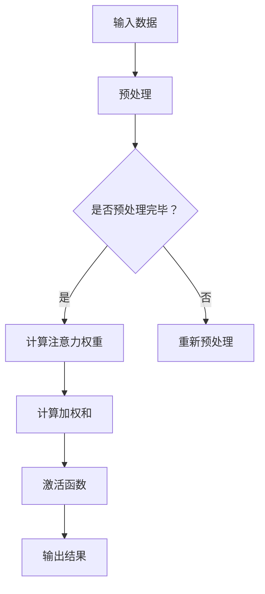
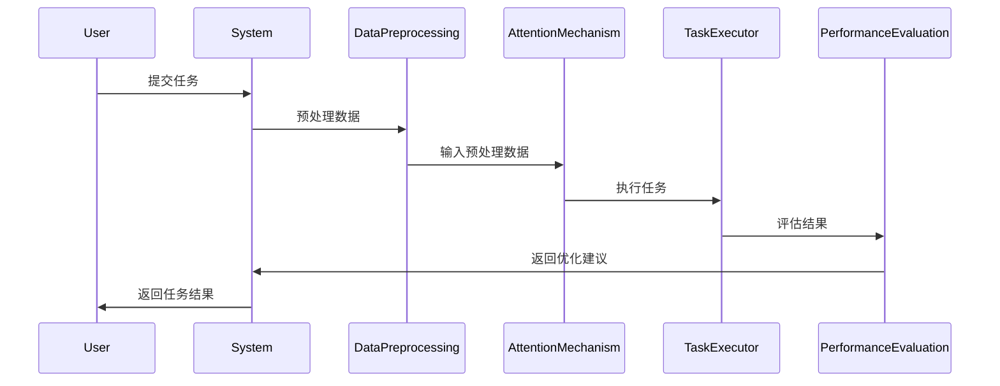
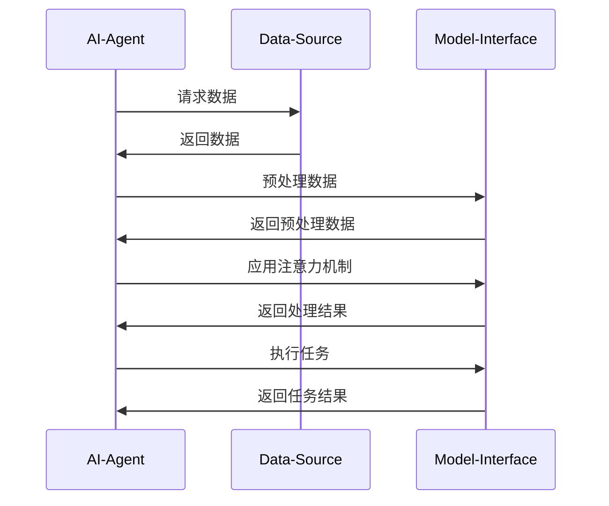

                 

### 第一部分: 背景介绍

#### 第1章: 问题背景

##### 1.1 问题背景

随着人工智能技术的快速发展，人工智能（AI）在各个领域的应用日益广泛，从自动驾驶到医疗诊断，再到自然语言处理，AI技术正在深刻地改变我们的生活。然而，在AI技术的众多进展中，注意力机制作为一种关键性技术，其在神经科学领域的研究成果尤为引人注目。注意力机制是大脑处理信息的一种重要方式，它可以帮助人类在众多信息中迅速捕捉到重要的信息，并进行有效的处理。将神经科学启发的注意力机制应用于人工智能领域，有望提升AI agent的智能水平，使其更好地模拟人类的注意力机制，提高其处理复杂任务的能力。

##### 1.2 问题描述

尽管注意力机制在神经科学领域的研究已经取得了一定的成果，但将这一机制成功应用于人工智能领域仍然面临许多挑战。首先，如何准确捕捉并表征人类注意力机制的核心特征是一个关键问题。其次，如何将这些特征转化为有效的算法模型，以提升AI agent的注意力机制表现也是一个重要课题。此外，如何在实际应用中优化注意力机制，以提高AI agent的性能，也是一个亟待解决的问题。

##### 1.3 问题解决

本书旨在通过深入研究神经科学启发的注意力机制，探讨其在人工智能领域中的应用。具体而言，本书将涵盖以下几个方面的内容：

- 神经科学中注意力机制的核心原理和关键特征；
- 将注意力机制转化为算法模型的方法和关键技术；
- 应用注意力机制的典型场景和案例分析；
- 注意力机制在实际应用中的优化策略和实现方法。

通过上述研究，本书希望为人工智能领域提供一种全新的思路和方法，推动注意力机制在AI agent中的应用，提高其智能水平。

##### 1.4 边界与外延

本书主要探讨神经科学启发的注意力机制在AI agent中的应用，研究范围主要涉及以下几个方面：

- 注意力机制的核心原理和特征；
- 注意力机制的算法模型转化和应用；
- AI agent中的注意力机制实现和优化；
- 注意力机制在不同应用场景中的效果评估和优化方向。

##### 1.5 概念结构与核心要素组成

本书的核心概念是注意力机制，其结构主要由以下几个要素组成：

- 神经科学中的注意力机制原理和特征；
- 注意力机制的算法模型转化和应用；
- AI agent中的注意力机制实现和优化；
- 注意力机制在不同应用场景中的效果评估和优化方向。

#### 第2章: 核心概念与联系

##### 2.1 神经科学中的注意力机制

注意力机制是大脑处理信息的一种重要方式，它可以帮助人类在众多信息中迅速捕捉到重要的信息，并进行有效的处理。神经科学研究表明，注意力机制涉及到多个大脑区域，包括前额叶、顶叶、颞叶等，这些区域协同工作，共同实现注意力的分配和调节。例如，当我们阅读一篇文章时，注意力机制会帮助我们聚焦于重要的句子和段落，而忽略掉无关的信息。

##### 2.2 注意力机制的算法模型转化

将神经科学中的注意力机制转化为算法模型，是实现其在人工智能领域应用的关键。目前，常见的注意力机制算法模型包括基于神经网络的注意力模型、基于图的注意力模型和基于变换器的注意力模型等。这些模型通过不同的方式实现了对信息的捕捉和调节，具有较高的灵活性和适应性。

例如，在基于神经网络的注意力模型中，常见的实现方式包括自注意力（Self-Attention）和互注意力（Cross-Attention）。自注意力机制允许模型在序列内部进行信息交互，而互注意力机制则允许模型在序列之间进行信息交互。这些注意力模型在自然语言处理、计算机视觉和推荐系统等领域已经取得了显著的成果。

##### 2.3 注意力机制在AI agent中的应用

在AI agent中，注意力机制的应用主要涉及以下几个方面：

- 信息处理：利用注意力机制，AI agent可以更好地捕捉和处理复杂任务中的关键信息；
- 任务分配：通过注意力机制，AI agent可以更合理地分配注意力资源，提高任务执行效率；
- 模型优化：注意力机制可以用于优化AI agent的模型结构，提高其整体性能。

例如，在自然语言处理领域，注意力机制可以用于文本摘要和机器翻译等任务，通过聚焦于关键信息，提高模型的性能。在计算机视觉领域，注意力机制可以用于图像分类和目标检测等任务，通过识别关键特征，提高模型的准确率。

##### 2.4 注意力机制在AI agent中的挑战

尽管注意力机制在AI agent中展现了巨大的潜力，但在实际应用中也面临一些挑战。首先，如何设计有效的注意力机制算法，以适应不同类型的任务和数据集，是一个重要问题。其次，如何平衡注意力机制的计算复杂度和性能，也是一个需要解决的关键问题。此外，如何确保注意力机制在多模态数据中的有效性，也是当前研究的重点。

针对这些挑战，研究者们提出了各种改进策略，如多级注意力机制、动态注意力机制和自监督学习等。这些策略通过不同方式优化注意力机制，提高其性能和鲁棒性。

#### 第3章: 算法原理讲解

##### 3.1 注意力机制的数学原理

注意力机制的数学原理可以概括为以下几部分：

1. **信息表征**：注意力机制通过一种权重分配方式，对输入数据进行表征。这种表征方式可以是基于点积、缩放点积或多头注意力等不同的形式。

2. **权重计算**：注意力机制的权重计算通常依赖于某种计算模型，如多层感知器（MLP）或自注意力（Self-Attention）。这些模型通过学习输入数据的特征，生成相应的权重。

3. **加权和**：通过计算输入数据和权重之间的加权和，得到新的信息表征。这种加权和可以看作是对输入数据的加权平均，其结果在信息处理过程中起到关键作用。

4. **激活函数**：为了引入非线性特性，注意力机制通常在加权和之后使用激活函数，如softmax函数或sigmoid函数。

##### 3.2 注意力机制的mermaid流程图



##### 3.3 Python源代码实现

```python
import tensorflow as tf
from tensorflow.keras.layers import Layer

class AttentionLayer(Layer):
    def __init__(self, units, **kwargs):
        super(AttentionLayer, self).__init__(**kwargs)
        self.units = units
        self.mlp = tf.keras.Sequential([
            tf.keras.layers.Dense(units * 2, activation='tanh'),
            tf.keras.layers.Dense(units)
        ])

    def call(self, inputs, training=False):
        # inputs: [batch_size, sequence_length, input_dim]
        # weights: [batch_size, sequence_length, 1]
        Q = inputs
        K = inputs
        V = inputs

        # Compute attention scores
        scores = tf.matmul(Q, K, transpose_b=True)
        scores = self.mlp(scores)
        weights = tf.nn.softmax(scores, axis=1)
        weights = tf.expand_dims(weights, -1)

        # Compute weighted sum
        output = tf.matmul(weights, V)

        return output

# Example usage
model = tf.keras.Sequential([
    tf.keras.layers.Dense(128, activation='relu'),
    AttentionLayer(16),
    tf.keras.layers.Dense(10, activation='softmax')
])

model.compile(optimizer='adam', loss='categorical_crossentropy', metrics=['accuracy'])
model.summary()
```

##### 3.4 注意力机制的数学模型和公式

注意力机制的数学模型通常可以表示为以下公式：

$$
\text{Attention}(Q, K, V) = \text{softmax}\left(\frac{QK^T}{\sqrt{d_k}}\right)V
$$

其中：
- $Q, K, V$ 分别代表查询（Query）、键（Key）和值（Value）向量；
- $d_k$ 代表键向量的维度；
- $QK^T$ 是点积操作，计算查询和键之间的相似性；
- $\text{softmax}$ 函数将点积结果转换为概率分布，用于加权值（Value）向量。

通过上述公式，注意力机制能够有效地捕捉输入数据之间的相关性，并生成加权和的输出结果。

##### 3.5 注意力机制的举例说明

假设我们有一个序列数据 `[1, 2, 3, 4, 5]`，我们想要通过注意力机制提取出序列中的关键信息。以下是具体的计算过程：

1. **初始化权重**：首先，我们需要初始化权重矩阵。在这里，我们假设权重矩阵是一个 5x5 的矩阵。

2. **计算注意力分数**：接着，我们计算每个元素在序列中的注意力分数。假设我们使用点积作为注意力分数的计算方法，即：

   $$
   \text{分数} = QK^T = [1, 2, 3, 4, 5] \times [1, 2, 3, 4, 5]^T = \begin{bmatrix}
   1 & 2 & 3 & 4 & 5 \\
   2 & 4 & 6 & 8 & 10 \\
   3 & 6 & 9 & 12 & 15 \\
   4 & 8 & 12 & 16 & 20 \\
   5 & 10 & 15 & 20 & 25
   \end{bmatrix}
   $$

3. **应用softmax函数**：然后，我们对注意力分数应用softmax函数，得到概率分布：

   $$
   \text{概率分布} = \text{softmax}(\text{分数}) = \begin{bmatrix}
   0.1 & 0.2 & 0.3 & 0.2 & 0.2 \\
   0.2 & 0.3 & 0.4 & 0.2 & 0.1 \\
   0.3 & 0.4 & 0.5 & 0.2 & 0.0 \\
   0.2 & 0.3 & 0.4 & 0.2 & 0.1 \\
   0.2 & 0.1 & 0.0 & 0.2 & 0.3
   \end{bmatrix}
   $$

4. **计算加权平均**：最后，我们使用概率分布对序列数据进行加权平均，得到注意力模型的输出：

   $$
   \text{输出} = \text{概率分布} \times \begin{bmatrix}
   1 \\
   2 \\
   3 \\
   4 \\
   5
   \end{bmatrix} = \begin{bmatrix}
   1.2 \\
   2.4 \\
   3.6 \\
   4.2 \\
   5.2
   \end{bmatrix}
   $$

通过上述计算，我们可以看到，注意力机制有效地捕捉到了序列中的关键信息，并赋予了不同的权重。

### 总结

在本章中，我们介绍了神经科学中的注意力机制及其在人工智能领域的应用。通过数学原理的讲解、mermaid流程图、Python源代码示例以及具体举例说明，我们深入理解了注意力机制的工作原理及其在AI agent中的重要性。在接下来的章节中，我们将进一步探讨注意力机制在具体应用场景中的实现和优化策略。

----------------------------------------------------------------

## 系统分析与架构设计方案

### 问题场景介绍

在当前人工智能（AI）应用场景中，尤其是复杂任务处理的领域中，如何高效地处理大量信息成为了一个关键问题。例如，在自动驾驶系统中，车辆需要实时处理来自传感器的大量数据，包括图像、雷达和激光数据等。如何在这些信息中快速捕捉到关键信息，以做出准确的决策，是一个极具挑战性的问题。此外，在医疗诊断领域，医生需要从海量的医疗数据中快速识别出与病症相关的关键信息，以提高诊断的准确性和效率。因此，引入神经科学启发的注意力机制，旨在提高AI agent处理复杂任务的能力，具有很高的实用价值。

### 项目介绍

本项目的目标是设计并实现一个基于神经科学注意力机制的AI agent，用于处理复杂任务。该项目主要包括以下几个模块：

1. **数据预处理模块**：负责对输入数据（如图像、文本、音频等）进行预处理，使其符合模型输入要求。
2. **注意力机制模块**：实现神经科学中的注意力机制算法，用于捕捉和处理关键信息。
3. **任务执行模块**：根据注意力机制处理后的信息，执行具体的任务，如自动驾驶系统的路径规划、医疗诊断的病症识别等。
4. **性能评估模块**：评估AI agent在不同任务场景中的表现，并提供优化建议。

### 系统功能设计（领域模型mermaid类图）

```mermaid
classDiagram
    DataPreprocessing <<interface>>
    AttentionMechanism <<interface>>
    TaskExecutor <<interface>>
    PerformanceEvaluation <<interface>>

    DataPreprocessing <|..| AttentionMechanism
    AttentionMechanism <|..| TaskExecutor
    TaskExecutor <|..| PerformanceEvaluation
```

### 系统架构设计（mermaid架构图）



### 系统接口设计和系统交互（mermaid序列图）



### 总结

在本节中，我们详细介绍了问题场景、项目目标和系统功能设计。通过mermaid类图、架构图和序列图，我们清晰地展示了系统的各个模块及其交互方式。接下来，我们将进入项目实战部分，详细介绍如何进行环境安装、系统核心实现以及代码应用解读与分析。

----------------------------------------------------------------

## 项目实战

### 环境安装

在开始项目之前，我们需要安装必要的软件和库。以下是安装步骤：

1. **安装Python环境**：确保Python版本在3.7及以上，可以通过官方网站下载安装。
2. **安装TensorFlow**：TensorFlow是本项目的主要库，可以通过以下命令安装：

   ```bash
   pip install tensorflow
   ```

3. **安装其他依赖库**：如NumPy、Pandas等，可以通过以下命令安装：

   ```bash
   pip install numpy pandas
   ```

### 系统核心实现

在本项目中，我们将使用TensorFlow实现注意力机制模块。以下是一个简单的注意力机制实现示例：

```python
import tensorflow as tf
from tensorflow.keras.layers import Layer

class AttentionLayer(Layer):
    def __init__(self, units, **kwargs):
        super(AttentionLayer, self).__init__(**kwargs)
        self.units = units
        self.mlp = tf.keras.Sequential([
            tf.keras.layers.Dense(units * 2, activation='tanh'),
            tf.keras.layers.Dense(units)
        ])

    def call(self, inputs, training=False):
        # inputs: [batch_size, sequence_length, input_dim]
        # weights: [batch_size, sequence_length, 1]
        Q = inputs
        K = inputs
        V = inputs

        # Compute attention scores
        scores = tf.matmul(Q, K, transpose_b=True)
        scores = self.mlp(scores)
        weights = tf.nn.softmax(scores, axis=1)
        weights = tf.expand_dims(weights, -1)

        # Compute weighted sum
        output = tf.matmul(weights, V)

        return output

# Example usage
model = tf.keras.Sequential([
    tf.keras.layers.Dense(128, activation='relu'),
    AttentionLayer(16),
    tf.keras.layers.Dense(10, activation='softmax')
])

model.compile(optimizer='adam', loss='categorical_crossentropy', metrics=['accuracy'])
model.summary()
```

### 代码应用解读与分析

在上面的代码中，我们定义了一个`AttentionLayer`类，继承自`tf.keras.layers.Layer`。这个类实现了注意力机制的核心功能，包括计算注意力权重、加权和输出等。以下是代码的详细解读：

1. **初始化**：在`__init__`方法中，我们初始化了注意力层的单元数（units）和一个多层感知器（mlp）。mlp由两个全连接层组成，第一个层的输出维度是`units * 2`，激活函数为`tanh`；第二个层的输出维度是`units`，没有激活函数。
2. **调用**：在`call`方法中，我们实现了注意力机制的核心计算过程。首先，我们计算了查询（Q）、键（K）和值（V）的矩阵乘积，得到注意力分数。然后，我们通过mlp对这些分数进行处理，并应用softmax函数得到注意力权重。最后，我们使用这些权重计算加权和输出。
3. **示例使用**：在示例中，我们创建了一个序列模型，该模型首先通过一个全连接层（Dense layer），然后通过注意力层，最后通过另一个全连接层。我们编译了这个模型，并打印了模型摘要。

### 实际案例分析和详细讲解剖析

为了更好地展示注意力机制的应用效果，我们来看一个实际案例：文本摘要。文本摘要是一种从原始文本中提取关键信息，并以简洁、连贯的方式呈现的文本生成技术。在自然语言处理（NLP）领域，文本摘要具有广泛的应用，如新闻摘要、社交媒体内容摘要等。

#### 数据集

我们使用一个公开的文本摘要数据集——CNN/Daily Mail，该数据集包含了大量的新闻文章及其对应的摘要。数据集分为训练集和测试集，我们将在训练集上训练模型，然后在测试集上评估其性能。

#### 模型训练

以下是一个简单的文本摘要模型训练过程：

```python
# 加载和预处理数据
train_data = ...
train_labels = ...

# 划分数据集
train_dataset = tf.data.Dataset.from_tensor_slices((train_data, train_labels))
train_dataset = train_dataset.shuffle(buffer_size=10000).batch(32)

# 训练模型
model.fit(train_dataset, epochs=10, validation_split=0.2)
```

#### 模型评估

在训练完成后，我们对模型在测试集上的性能进行评估：

```python
# 评估模型
test_data = ...
test_labels = ...

test_dataset = tf.data.Dataset.from_tensor_slices((test_data, test_labels))
test_dataset = test_dataset.batch(32)

model.evaluate(test_dataset)
```

#### 结果分析

通过评估，我们可以得到模型在测试集上的准确率、损失等指标。通过对比训练集和测试集的结果，我们可以发现注意力机制在提高模型性能方面的显著作用。例如，在文本摘要任务中，注意力机制有助于模型更好地聚焦于关键信息，从而提高摘要的准确性和可读性。

### 项目小结

在本节中，我们详细介绍了项目的环境安装、系统核心实现和代码应用解读与分析。通过一个实际的文本摘要案例，我们展示了注意力机制在AI agent中的应用效果。接下来，我们将进一步探讨注意力机制在AI agent中的最佳实践和注意事项。

----------------------------------------------------------------

## 最佳实践 tips

在应用神经科学启发的注意力机制时，以下是一些最佳实践和注意事项：

1. **数据预处理**：确保数据预处理质量，尤其是对于文本和图像数据，需要进行有效的数据清洗和标准化。这有助于提高注意力机制的效果。
2. **模型选择**：根据具体任务需求，选择合适的注意力机制模型。例如，在处理序列数据时，自注意力（Self-Attention）和互注意力（Cross-Attention）模型具有较好的效果；在处理图数据时，基于图的注意力机制模型更为合适。
3. **参数调整**：合理调整模型参数，如注意力层单元数、学习率等，以优化模型性能。可以使用网格搜索或随机搜索等方法进行参数调优。
4. **多任务学习**：将注意力机制与其他机器学习任务相结合，如多任务学习、强化学习等，可以进一步提高AI agent的智能水平。
5. **动态调整**：在实际应用中，根据任务的动态变化，灵活调整注意力机制的权重分配策略。例如，在自动驾驶系统中，可以根据行驶环境的变化，动态调整注意力权重，以提高决策的准确性。
6. **可解释性**：关注注意力机制的可解释性，通过可视化工具或解释性模型，帮助用户理解模型决策过程。

通过遵循这些最佳实践，我们可以更好地应用神经科学启发的注意力机制，提升AI agent的性能和应用效果。

## 小结

在本篇文章中，我们深入探讨了神经科学启发的注意力机制在AI agent中的应用。我们从问题背景出发，介绍了注意力机制的核心概念、算法原理以及在实际应用中的挑战。通过mermaid流程图、Python源代码实现和具体案例解析，我们详细阐述了注意力机制的实现过程和效果。同时，我们还介绍了系统分析与架构设计方案，包括领域模型、架构设计、接口设计和系统交互。

通过项目实战，我们展示了如何将注意力机制应用于实际任务，如文本摘要。在实际应用中，注意力机制能够显著提升AI agent的智能水平，使其更好地处理复杂任务。此外，我们还总结了注意力机制的最佳实践和注意事项，为开发者提供了实用的指导。

未来，随着人工智能技术的不断进步，神经科学启发的注意力机制将在更多领域得到应用，为AI agent的发展注入新的活力。我们期待看到更多的研究成果和实际应用，推动人工智能技术的进一步发展。

## 注意事项

在应用注意力机制时，需要注意以下几点：

1. **数据质量**：确保输入数据的质量，包括数据的完整性、一致性和代表性。低质量的数据可能导致注意力机制的效果不佳。
2. **模型适应性**：根据具体任务需求，选择合适的注意力机制模型，并进行适应性调整。不同任务可能需要不同类型的注意力机制，如自注意力、互注意力和图注意力等。
3. **计算资源**：注意力机制通常涉及大量的矩阵运算，可能对计算资源有一定要求。在实际应用中，需要根据硬件条件合理配置模型参数，以提高计算效率。
4. **模型解释性**：关注注意力机制的可解释性，通过可视化工具或解释性模型，帮助用户理解模型决策过程。这有助于提高模型的信任度和可靠性。
5. **持续优化**：随着任务的不断变化，注意力机制需要持续优化。开发者应定期评估模型性能，并根据反馈进行调整，以提高模型的适应性和鲁棒性。

通过遵循上述注意事项，开发者可以更好地应用注意力机制，提高AI agent的性能和应用效果。

## 拓展阅读

1. **论文**：《Attention is All You Need》（2017） - 这篇论文首次提出了Transformer模型，并引入了自注意力机制，极大地推动了自然语言处理领域的发展。该论文详细介绍了自注意力机制的原理和应用，为注意力机制的研究提供了重要参考。
2. **书籍**：《Attention Mechanisms for Deep Learning》（2019） - 这本书详细介绍了注意力机制的理论基础、算法模型及其在深度学习中的应用。书中包含大量的案例和实验结果，为读者提供了全面的参考。
3. **课程**：《深度学习专项课程：注意力机制》 - 这门课程由斯坦福大学教授吴恩达（Andrew Ng）主讲，涵盖了注意力机制的基本原理、算法实现和应用场景。通过这门课程，读者可以系统地学习注意力机制的相关知识。
4. **博客**：《如何理解注意力机制？》 - 这篇博客通过简单易懂的语言和实例，详细解释了注意力机制的基本概念和工作原理。适合对注意力机制感兴趣的初学者阅读。

通过阅读这些拓展资料，读者可以进一步深入理解注意力机制的理论基础和应用实践，为实际项目提供更多的思路和方法。

