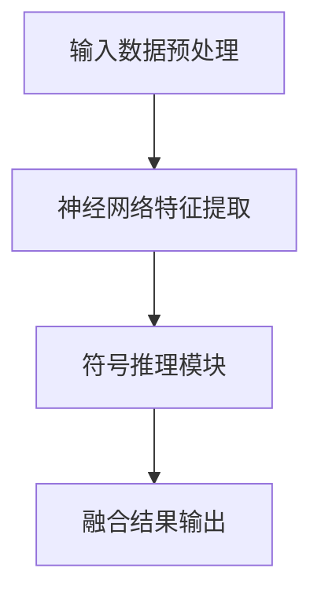

                 

### 第一部分: 神经符号AI与AI Agent逻辑推理

#### 1.1 背景介绍

##### 1.1.1 神经符号AI概述
神经符号AI（Neural-Symbolic AI）是结合了神经网络和符号计算的智能系统，旨在克服传统神经网络在处理复杂任务时的局限性。它通过将神经网络的学习能力与符号推理的优势结合起来，使得AI系统能够处理更复杂的任务，具备更强的解释能力和通用性。

- **定义**：神经符号AI是将神经网络的学习能力与符号逻辑的推理能力相结合，通过符号表示和计算来增强神经网络在逻辑推理、知识表示和解释等方面的能力。
- **与传统AI的区别**：传统AI通常依赖于符号逻辑进行推理，但缺乏处理复杂模式和数据的灵活性；而神经网络在处理大规模数据和学习复杂模式方面具有优势，但其缺乏可解释性和逻辑推理能力。神经符号AI试图弥补这些不足。

##### 1.1.2 AI Agent逻辑推理的重要性
AI Agent是指能够自主执行任务、与环境交互并做出决策的智能体。逻辑推理在AI Agent中的作用至关重要，它使得AI Agent能够从给定的信息中推导出新的结论，实现更高级的智能行为。

- **AI Agent的定义**：AI Agent是能够感知环境、采取行动并适应环境变化的计算实体，具备自主学习和决策能力。
- **逻辑推理的作用**：逻辑推理使得AI Agent能够基于已知事实和规则推导出新的事实，从而进行决策和规划。它是实现智能行为的核心机制。

##### 1.1.3 神经符号AI在AI Agent逻辑推理中的应用背景
随着AI技术的发展，AI Agent在各个领域的应用越来越广泛。然而，传统AI Agent在逻辑推理方面的能力有限，难以应对复杂、不确定的环境。神经符号AI的兴起为AI Agent的逻辑推理提供了新的解决方案。

- **应用背景**：神经符号AI能够将神经网络的学习能力和符号推理能力相结合，使得AI Agent在处理复杂逻辑推理任务时具备更强的能力。
- **现状**：目前，神经符号AI在AI Agent中的应用逐渐增多，特别是在需要高解释性和可解释性的领域，如医疗诊断、金融分析和智能客服等。

#### 1.2 核心概念与联系

##### 1.2.1 神经符号AI核心概念
神经符号AI的核心概念包括神经网络、符号计算和神经符号融合。

- **神经网络**：神经网络是模拟人脑神经元连接结构的计算模型，通过多层神经元的连接和激活实现数据的学习和特征提取。
- **符号计算**：符号计算是基于逻辑和数学符号的推理过程，用于处理符号表示的数据和问题，具有高度的可解释性和逻辑性。
- **神经符号融合**：神经符号融合是将神经网络和符号计算相结合的技术，通过融合神经网络的学习能力和符号计算的解释能力，实现更高级的智能行为。

##### 1.2.2 逻辑推理的相关概念
逻辑推理是人工智能中的核心概念，主要包括演绎推理、归纳推理和模态逻辑。

- **演绎推理**：演绎推理是从一般到特殊的推理过程，基于前提逻辑推导出结论。它保证了推理的可靠性和确定性。
- **归纳推理**：归纳推理是从特殊到一般的推理过程，通过观察多个实例推导出一般性规律。它具有较强的泛化能力，但可能存在不确定性。
- **模态逻辑**：模态逻辑是用于表示和处理状态转换和条件依赖的逻辑体系，常用于描述AI Agent在动态环境中的行为。

##### 1.2.3 神经符号AI与逻辑推理的联系
神经符号AI通过结合神经网络和符号计算，实现了对逻辑推理的强化。神经网络提供了强大的模式识别和特征提取能力，而符号计算则提供了逻辑推理和知识表示的能力。

- **神经网络在逻辑推理中的应用**：神经网络可以用于提取和识别逻辑推理中的模式和特征，如通过训练神经网络实现逻辑语句的自动生成和理解。
- **符号计算在逻辑推理中的应用**：符号计算可以用于表示和推理逻辑语句，如使用谓词逻辑和模态逻辑来表示AI Agent的行为和状态。
- **神经符号融合在逻辑推理中的应用**：神经符号融合可以将神经网络和符号计算的优势相结合，实现更高效的逻辑推理和知识表示，如通过神经符号融合模型实现复杂逻辑推理任务。

#### 1.3 算法原理讲解
神经符号AI的算法原理涉及到神经网络和符号计算的结合，下面将详细讲解。

##### 1.3.1 算法mermaid流程图
为了更好地理解神经符号AI的算法流程，可以使用mermaid流程图来表示。



在这个流程图中，输入数据首先经过预处理，然后由神经网络特征提取模块进行处理，接着通过符号推理模块进行逻辑推理，最终输出融合结果。

##### 1.3.2 Python源代码
为了实现上述算法流程，可以使用Python编写源代码。

```python
import numpy as np
import tensorflow as tf

# 输入数据预处理
def preprocess_data(data):
    # 数据归一化等预处理操作
    return processed_data

# 神经网络特征提取
def neural_network_extractor(processed_data):
    # 使用神经网络进行特征提取
    return features

# 符号推理模块
def symbolic_inference(features):
    # 使用符号计算进行逻辑推理
    return inference_results

# 融合结果输出
def fusion_results(inference_results):
    # 输出融合后的结果
    return fused_results

# 主函数
def main():
    data = np.random.rand(100, 10)  # 示例输入数据
    processed_data = preprocess_data(data)
    features = neural_network_extractor(processed_data)
    inference_results = symbolic_inference(features)
    fused_results = fusion_results(inference_results)
    print(fused_results)

if __name__ == "__main__":
    main()
```

##### 1.3.3 算法原理的数学模型和公式
神经符号AI的算法原理可以抽象为一个数学模型，如下所示：

$$
\text{Fused\_Result} = f(\text{NN\_Feature}, \text{Symbolic\_Inference})
$$

其中，NN\_Feature表示神经网络提取的特征，Symbolic\_Inference表示符号推理的结果，Fused\_Result表示最终的融合结果。

##### 1.3.4 举例说明
为了更好地理解神经符号AI的算法原理，可以通过一个简单的例子来说明。

假设有一个简单的逻辑推理任务，需要判断一个数是否大于5。我们可以使用神经符号AI来实现这个任务。

1. **输入数据预处理**：假设输入数据是一个一维数组\[3, 2, 5, 7\]，我们需要对其进行归一化等预处理操作。
2. **神经网络特征提取**：通过神经网络提取输入数据的特征，假设提取到的特征为\[0.2, 0.8\]。
3. **符号推理模块**：使用符号计算进行逻辑推理，假设得到的推理结果为“大于5”。
4. **融合结果输出**：将神经网络特征和符号推理结果进行融合，得到最终的输出结果“大于5”。

通过这个简单的例子，我们可以看到神经符号AI如何结合神经网络和符号计算来实现逻辑推理任务。

---

在本章中，我们介绍了神经符号AI与AI Agent逻辑推理的背景、核心概念及其联系。接下来，我们将深入探讨神经符号AI的算法原理，并通过具体的Python代码和数学模型进行讲解。请继续阅读下一章节，我们将进一步深入探讨神经符号AI的算法原理。

