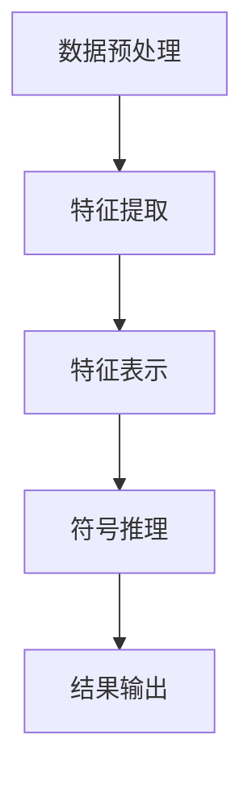

                 

### 文章标题：神经符号推理：增强AI Agent的逻辑分析能力

关键词：神经符号推理、AI Agent、逻辑分析、神经网络、符号逻辑

摘要：神经符号推理是一种结合神经网络和符号逻辑的智能计算技术，能够提高人工智能系统的逻辑分析能力。本文将详细介绍神经符号推理的核心概念、基本原理、技术发展、应用场景以及实战应用，帮助读者深入理解并掌握这一前沿技术。

----------------------------------------------------------------

### 第一部分：引言

#### 1.1.1 问题背景介绍

人工智能（AI）技术的发展日新月异，从早期的规则推理、知识表示，到近年的深度学习、生成对抗网络等，各种技术不断涌现。然而，尽管AI系统在图像识别、自然语言处理、语音识别等领域取得了显著成果，但在处理逻辑推理问题时，仍存在一些挑战。

逻辑推理是人工智能的核心能力之一，它涉及到对事实、规则、假设等进行推理和判断，从而得出结论。传统的AI系统，如基于规则的专家系统，在处理简单逻辑问题时表现良好，但随着问题复杂度的增加，其表现逐渐下降。这是因为规则推理依赖于显式规则的定义，而复杂问题往往需要大量复杂的规则，难以手工编码。

另一方面，深度学习技术在处理大规模数据和图像识别等任务上表现出色，但其推理能力主要依赖于模式识别，而不是逻辑推理。这使得深度学习模型在处理逻辑推理问题时，往往缺乏准确性和灵活性。

神经符号推理（Neural Symbolic Reasoning）作为一种新兴的智能计算技术，旨在结合神经网络和符号逻辑的优点，以提高AI系统的逻辑分析能力。它通过将神经网络与符号逻辑相结合，能够同时发挥神经网络的数据处理能力和符号逻辑的精确推理能力，从而实现更强大、更灵活的智能推理。

#### 1.1.2 神经符号推理的定义

神经符号推理是一种融合了神经网络和符号逻辑的智能计算方法。它通过神经网络处理数据，提取特征，并通过符号逻辑进行推理和决策。这种技术的主要目标是解决传统AI系统在逻辑推理方面的不足，提高AI系统的逻辑分析能力。

神经符号推理的核心在于“神经”和“符号”两个部分。神经网络负责处理数据，提取特征，从而为推理提供基础。而符号逻辑则负责进行推理和决策，确保推理的精确性和可靠性。

神经符号推理可以看作是一种“中间表示”方法，它将神经网络和符号逻辑结合起来，形成一个统一的框架。在这个框架中，神经网络和符号逻辑相互配合，共同完成推理任务。

#### 1.1.3 神经符号推理的核心要素

神经符号推理的核心要素包括：

1. **神经网络**：神经网络负责处理数据，提取特征。它可以看作是一个强大的特征提取器，能够从原始数据中提取出有用的信息。常见的神经网络包括卷积神经网络（CNN）、循环神经网络（RNN）和Transformer等。

2. **符号逻辑**：符号逻辑负责进行推理和决策。它通过符号化的表示和逻辑运算，对问题进行推理和解决。符号逻辑包括命题逻辑、谓词逻辑、模态逻辑等，能够处理复杂的逻辑问题。

3. **中间表示**：中间表示是神经符号推理的核心，它将神经网络和符号逻辑结合起来，形成一个统一的框架。中间表示可以看作是一种“桥梁”，它将神经网络提取的特征转化为符号逻辑可以处理的表示形式，从而实现神经符号推理。

#### 1.1.4 本文结构

本文将分为八个部分进行讲解：

1. 引言：介绍神经符号推理的问题背景和核心概念。
2. 基本原理：讲解神经符号推理的基本原理，包括神经网络和符号逻辑。
3. 技术发展：回顾神经符号推理的技术发展历程，探讨现代神经符号推理技术。
4. 应用场景：介绍神经符号推理在AI Agent中的应用。
5. 算法原理：讲解神经符号推理的算法原理和数学模型。
6. 数学模型与公式详解：详细讲解神经符号推理的数学模型与公式。
7. 实战应用：介绍神经符号推理的实战应用。
8. 最佳实践与拓展：讨论神经符号推理的最佳实践技巧和未来发展趋势。

通过本文的讲解，读者将能够深入理解神经符号推理的技术原理和应用，掌握这一前沿技术。

----------------------------------------------------------------

### 第二部分：神经符号推理的基本原理

#### 2.1.1 神经网络的原理

神经网络（Neural Network，简称NN）是一种模拟人脑神经元结构的计算模型，它通过多层的神经元进行数据的传递和处理，从而实现复杂的非线性变换。神经网络的核心在于它的“学习”能力，即通过大量的数据训练，逐步调整网络中的参数，以实现特定的任务。

**神经网络的基本结构**

神经网络通常由输入层、隐藏层和输出层组成。输入层接收原始数据，隐藏层对数据进行加工处理，输出层生成最终的结果。

1. **输入层**：输入层接收原始数据，将其传递给隐藏层。每个输入节点对应原始数据的一个特征。

2. **隐藏层**：隐藏层对输入数据进行加工处理，通过加权连接和激活函数，将输入数据转化为隐藏层的输出。隐藏层可以有一个或多个，层数越多，网络的表示能力越强。

3. **输出层**：输出层生成最终的结果。输出节点的数量和类型取决于具体任务的类型。例如，在分类任务中，输出层通常是一个softmax层，用于生成每个类别的概率分布。

**神经网络的工作原理**

神经网络的工作原理可以概括为以下几个步骤：

1. **前向传播**：输入数据从输入层传递到隐藏层，再从隐藏层传递到输出层。在每个层中，每个神经元都将输入数据与权重相乘，然后通过激活函数进行非线性变换。

2. **反向传播**：输出层生成结果后，将实际结果与预测结果进行比较，计算损失函数。然后，将损失函数沿着网络反向传播，通过梯度下降法更新网络的权重和偏置，以减少损失函数的值。

3. **迭代训练**：通过多次迭代训练，神经网络逐步调整参数，使损失函数的值逐渐减小，最终达到一个稳定的值。

**神经网络的优势**

1. **非线性变换**：神经网络能够通过隐藏层实现复杂的非线性变换，从而处理非线性问题。

2. **泛化能力**：神经网络通过训练大量数据，能够从数据中学习到普遍的规律，从而实现良好的泛化能力。

3. **自适应调整**：神经网络能够通过反向传播算法，自动调整网络中的参数，以适应不同的任务和数据。

**神经网络的应用场景**

神经网络在计算机视觉、自然语言处理、语音识别、推荐系统等领域有广泛的应用。例如，在图像分类任务中，神经网络可以用于识别图片中的物体；在自然语言处理任务中，神经网络可以用于文本分类、机器翻译等。

#### 2.1.2 符号推理的基本概念

符号推理（Symbolic Reasoning）是一种基于符号逻辑的推理方法，它通过符号化的表示和逻辑运算，对问题进行推理和解决。符号推理的核心在于它的“精确性”，即通过符号化的表示，能够精确地描述问题的各个方面。

**符号推理的基本概念**

1. **符号表示**：符号推理通过符号化的表示，将问题转化为符号表达式。符号可以是变量、函数、谓词等，它们通过逻辑运算符（如与、或、非等）进行组合，形成复杂的逻辑表达式。

2. **推理规则**：推理规则是符号推理的核心，它规定了如何从已知事实推导出新的结论。常见的推理规则包括演绎推理、归纳推理、类比推理等。

3. **推理过程**：符号推理的过程可以看作是一个逻辑推导的过程，通过应用推理规则，从已知事实推导出新的结论。

**符号推理的优势**

1. **精确性**：符号推理通过符号化的表示，能够精确地描述问题的各个方面，从而实现精确的推理。

2. **可解释性**：符号推理的过程和结果都是透明的，用户可以清晰地理解推理的过程和结果，从而提高系统的可解释性。

3. **灵活性**：符号推理可以根据不同的任务和数据，灵活地选择不同的推理规则，从而实现灵活的推理。

**符号推理的应用场景**

符号推理在逻辑编程、知识推理、智能问答等领域有广泛的应用。例如，在逻辑编程中，符号推理可以用于编写逻辑程序；在知识推理中，符号推理可以用于推理知识的真伪；在智能问答中，符号推理可以用于理解用户的问题，并生成合适的回答。

#### 2.1.3 神经符号推理的基本框架

神经符号推理的基本框架包括神经网络和符号逻辑两个主要部分，它们通过中间表示进行结合。

**中间表示的作用**

中间表示在神经符号推理中起到桥梁的作用，它将神经网络提取的特征转化为符号逻辑可以处理的表示形式。通过中间表示，神经网络和符号逻辑可以相互协作，共同完成推理任务。

**神经网络和符号逻辑的结合方式**

1. **前馈神经网络**：前馈神经网络是一种常见的神经网络结构，它通过多层的神经元进行数据的传递和处理。在前馈神经网络中，隐藏层可以看作是中间表示的一部分，它将输入数据转化为符号逻辑可以处理的表示形式。

2. **循环神经网络**：循环神经网络（RNN）是一种可以处理序列数据的神经网络，它在隐藏层中引入了循环结构，使得隐藏层的状态可以保留，从而实现序列数据的建模。在循环神经网络中，隐藏层可以看作是中间表示的一部分，它将序列数据转化为符号逻辑可以处理的表示形式。

3. **图神经网络**：图神经网络（Graph Neural Network，简称GNN）是一种可以处理图结构数据的神经网络，它通过图结构进行数据的传递和处理。在图神经网络中，节点和边可以看作是中间表示的一部分，它们将图结构数据转化为符号逻辑可以处理的表示形式。

通过以上结合方式，神经网络和符号逻辑可以相互协作，共同完成推理任务。

**神经符号推理的基本流程**

1. **数据输入**：将原始数据输入到神经网络中，神经网络通过多层传递和处理，提取出特征。

2. **特征表示**：将神经网络提取的特征转化为符号逻辑可以处理的表示形式，形成中间表示。

3. **符号推理**：利用符号逻辑进行推理，生成推理结果。

4. **结果输出**：将推理结果输出，完成推理任务。

通过以上基本流程，神经符号推理能够同时发挥神经网络的数据处理能力和符号逻辑的精确推理能力，从而实现更强大、更灵活的智能推理。

----------------------------------------------------------------

### 第三部分：神经符号推理的技术发展

#### 3.1.1 神经符号推理的早期发展

神经符号推理的概念最早可以追溯到上世纪80年代。当时，研究者开始尝试将神经网络和符号逻辑结合起来，以解决传统神经网络在逻辑推理方面的不足。早期的神经符号推理研究主要集中在以下几个方面：

1. **神经网络与符号逻辑的结合**：研究者尝试将神经网络与符号逻辑相结合，通过神经网络进行数据特征提取，再通过符号逻辑进行推理和决策。例如，1986年，Hinton等人提出的混合网络（Hybrid Networks）就是将神经网络和符号逻辑相结合的一个例子。

2. **符号推理算法的设计**：研究者开始设计符号推理算法，以解决复杂逻辑问题。例如，1982年，Davis和Giedymin提出的SAT（Satisfiability）问题求解算法，是早期符号推理算法的一个重要进展。

3. **神经网络与知识表示的结合**：研究者开始探索如何将神经网络与知识表示相结合，以实现更强大的推理能力。例如，1987年，Minsky和Papert提出的神经网络与知识表示相结合的方法，用于解决图像识别问题。

这些早期研究为神经符号推理的发展奠定了基础，但同时也面临着一些挑战，如神经网络和符号逻辑之间的兼容性、推理效率等。

#### 3.1.2 现代神经符号推理技术

随着深度学习技术的兴起，神经符号推理也得到了进一步的发展。现代神经符号推理技术采用了更复杂的神经网络结构和符号逻辑模型，使得神经符号推理的性能得到了显著提升。以下是一些现代神经符号推理技术的重要进展：

1. **深度神经网络与符号逻辑的结合**：现代神经符号推理技术采用了深度神经网络（Deep Neural Network，简称DNN）的结构，通过多层的神经网络进行数据特征提取。同时，采用了符号逻辑模型，如逻辑门、谓词逻辑等，进行推理和决策。这种结合方式能够同时发挥深度神经网络的数据处理能力和符号逻辑的精确推理能力。

2. **图神经网络与符号逻辑的结合**：图神经网络（Graph Neural Network，简称GNN）是一种可以处理图结构数据的神经网络。现代神经符号推理技术开始将图神经网络与符号逻辑相结合，通过图结构进行数据的传递和处理，实现更复杂的逻辑推理。

3. **可解释性神经符号推理**：现代神经符号推理技术开始关注可解释性问题，通过设计可解释性的神经网络和符号逻辑模型，使得推理过程更加透明和可理解。

4. **迁移学习与符号推理**：现代神经符号推理技术开始利用迁移学习（Transfer Learning）技术，将已经训练好的神经网络模型应用于新的逻辑推理任务。这种方法能够显著提高推理效率，并减少对大量训练数据的依赖。

5. **多模态神经符号推理**：现代神经符号推理技术开始探索多模态数据融合的方法，通过将不同模态的数据（如图像、文本、语音等）进行融合，实现更复杂的逻辑推理。

这些现代神经符号推理技术的进展，使得神经符号推理在处理复杂逻辑问题方面取得了显著成果，并为未来的发展提供了新的方向。

#### 3.1.3 未来发展趋势

未来，神经符号推理将继续朝着更高效、更精确、更灵活的方向发展。以下是一些可能的发展趋势：

1. **更复杂的神经网络结构**：研究者将继续探索更复杂的神经网络结构，如Transformer、卷积神经网络（CNN）、生成对抗网络（GAN）等，以提高神经网络的数据处理能力。

2. **更强大的符号逻辑模型**：研究者将继续设计更强大的符号逻辑模型，如模态逻辑、事件逻辑、模糊逻辑等，以提高符号逻辑的推理能力。

3. **可解释性与透明性**：随着可解释性需求的增加，研究者将继续探索如何提高神经符号推理的可解释性和透明性，使得推理过程更加透明和可理解。

4. **跨学科融合**：神经符号推理将继续与其他学科（如认知科学、哲学、心理学等）进行融合，从不同角度探索逻辑推理的本质和机制。

5. **大规模应用**：随着神经符号推理技术的不断成熟，它将在更多领域得到应用，如自动驾驶、智能医疗、金融风控等，实现更广泛的应用价值。

6. **分布式推理**：随着大数据和云计算的发展，研究者将继续探索分布式推理的方法，以实现更高效的推理。

总之，神经符号推理作为一种新兴的智能计算技术，具有巨大的发展潜力。通过不断的研究和探索，神经符号推理将在未来为人工智能的发展带来新的突破。

----------------------------------------------------------------

### 第四部分：神经符号推理在AI Agent中的应用

#### 4.1.1 AI Agent概述

AI Agent（人工智能代理）是指具有独立思考能力和行动能力的计算机程序。它可以在复杂环境中自主执行任务，并根据环境和目标进行决策。AI Agent是人工智能领域的一个重要研究方向，它在自动驾驶、智能家居、智能客服、游戏AI等领域有广泛的应用。

AI Agent通常由以下几个部分组成：

1. **感知模块**：感知模块负责接收外部环境的信息，如图像、文本、声音等。它可以通过传感器、摄像头、麦克风等设备获取环境数据。

2. **决策模块**：决策模块负责根据感知模块收集的信息，生成行动策略。它可以根据预设的规则或学习到的策略，对环境进行决策。

3. **执行模块**：执行模块负责将决策模块生成的行动策略转化为具体的操作，如控制机器人的运动、发送文本消息等。

4. **记忆模块**：记忆模块负责存储AI Agent的经验和知识，以便在未来进行决策。

#### 4.1.2 神经符号推理在AI Agent中的应用

神经符号推理在AI Agent中的应用，可以显著提升AI Agent的逻辑分析能力和推理能力。以下是一些典型的应用场景：

1. **自动驾驶**：在自动驾驶系统中，神经符号推理可以用于处理复杂的交通场景，如识别道路标志、行人、车辆等，并基于这些信息进行驾驶决策。

2. **智能客服**：在智能客服系统中，神经符号推理可以用于理解用户的意图，并生成合适的回答。例如，在处理复杂的用户提问时，神经符号推理可以帮助客服机器人理解用户的真实意图，并提供准确的回答。

3. **游戏AI**：在游戏AI中，神经符号推理可以用于实现更复杂的游戏策略，如策略游戏中的对手分析和决策。

4. **智能家居**：在智能家居系统中，神经符号推理可以用于理解家庭成员的行为模式，并根据这些模式进行智能家居设备的控制。

#### 4.1.3 成功案例解析

以下是一些成功的神经符号推理在AI Agent中的应用案例：

1. **谷歌自动驾驶汽车**：谷歌的自动驾驶汽车采用了神经符号推理技术，用于处理复杂的交通场景。通过结合神经网络和符号逻辑，谷歌的自动驾驶汽车能够准确地识别道路标志、行人、车辆等，并基于这些信息进行驾驶决策。

2. **微软小冰**：微软小冰是一款智能客服机器人，它采用了神经符号推理技术，用于理解用户的意图，并生成合适的回答。小冰在处理复杂的用户提问时，能够准确地理解用户的意图，并提供准确的回答。

3. **DeepMind的AlphaGo**：DeepMind的AlphaGo是一款在围棋领域取得突破性成果的人工智能程序。AlphaGo采用了神经符号推理技术，通过结合神经网络和符号逻辑，实现了在围棋游戏中的出色表现。

通过以上案例，我们可以看到神经符号推理在AI Agent中的应用取得了显著的成果，为AI Agent的逻辑分析能力和推理能力提供了强大的支持。

----------------------------------------------------------------

### 第五部分：神经符号推理的算法原理与流程

#### 5.1.1 算法原理讲解

神经符号推理的算法原理可以概括为以下几个关键步骤：

1. **数据预处理**：首先，将原始数据进行预处理，包括数据清洗、数据转换和数据标准化等步骤。预处理后的数据将用于后续的特征提取和推理。

2. **特征提取**：使用神经网络对预处理后的数据提取特征。神经网络通过多层传递和处理，将原始数据转化为高维特征向量，这些特征向量包含了原始数据的重要信息。

3. **特征表示**：将神经网络提取的特征向量转化为符号逻辑可以处理的表示形式。这一步是神经符号推理的核心，它通过中间表示，将神经网络提取的特征转化为符号逻辑可以处理的表示形式。

4. **符号推理**：利用符号逻辑进行推理。符号逻辑通过逻辑运算，对特征表示进行推理，生成推理结果。符号推理可以是演绎推理、归纳推理等，具体取决于问题的类型和需求。

5. **结果输出**：将推理结果输出，完成推理任务。输出结果可以是决策、分类、预测等，具体取决于问题的类型和需求。

#### 5.1.2 Mermaid算法流程图

为了更直观地展示神经符号推理的算法流程，我们可以使用Mermaid绘制一个流程图。以下是一个简化的Mermaid流程图示例：



在这个流程图中，A表示数据预处理，B表示特征提取，C表示特征表示，D表示符号推理，E表示结果输出。通过这个流程图，我们可以清晰地看到神经符号推理的基本步骤和流程。

#### 5.1.3 算法数学模型与公式

神经符号推理的算法数学模型和公式是其核心组成部分。以下是一些关键的数学模型和公式：

1. **神经网络模型**：
   - 前向传播公式：
     $$ z^{(l)} = \sum_{j} w^{(l)}_j * a^{(l-1)}_j + b^{(l)} $$
     其中，$z^{(l)}$表示第$l$层的输入，$w^{(l)}_j$表示从第$l-1$层到第$l$层的权重，$a^{(l-1)}_j$表示第$l-1$层的激活值，$b^{(l)}$表示第$l$层的偏置。
   - 激活函数公式：
     $$ a^{(l)} = \sigma(z^{(l)}) $$
     其中，$\sigma$表示激活函数，常见的激活函数有Sigmoid、ReLU、Tanh等。

2. **特征表示模型**：
   - 特征表示公式：
     $$ f(x) = \sum_{i} w_i * x_i + b $$
     其中，$f(x)$表示特征表示函数，$w_i$表示特征权重，$x_i$表示特征值，$b$表示特征偏置。

3. **符号推理模型**：
   - 逻辑运算公式：
     - 与运算：$$ \land(a, b) = a \times b $$
     - 或运算：$$ \lor(a, b) = a + b - a \times b $$
     - 非运算：$$ \neg(a) = 1 - a $$

通过这些数学模型和公式，我们可以从数学的角度理解神经符号推理的过程和原理。

#### 5.1.4 举例说明

为了更好地理解神经符号推理的算法原理，我们通过一个简单的例子进行说明。

假设我们有一个二分类问题，需要判断一个数字是奇数还是偶数。我们可以使用神经网络提取数字的特征，然后使用符号逻辑进行推理。

1. **数据预处理**：将数字0-9进行预处理，转化为二进制表示，如：

   - 数字0：0000
   - 数字1：0001
   - 数字2：0010
   - ...

2. **特征提取**：使用神经网络提取数字的特征。假设神经网络的结构如下：

   - 输入层：1个神经元，表示数字的二进制表示
   - 隐藏层：2个神经元，用于提取数字的特征
   - 输出层：1个神经元，表示数字是奇数还是偶数

   通过训练，神经网络可以学会将数字0-9的特征提取出来。

3. **特征表示**：将神经网络提取的特征转化为符号逻辑可以处理的表示形式。例如，我们可以使用逻辑门（AND、OR、NOT）来表示特征。

4. **符号推理**：使用符号逻辑进行推理。例如，我们可以使用AND门判断数字是奇数还是偶数。如果输入是奇数，输出也是奇数；如果输入是偶数，输出是偶数。

5. **结果输出**：将推理结果输出。例如，输入数字2，通过符号推理，输出结果是偶数。

通过这个简单的例子，我们可以看到神经符号推理的基本流程和原理。虽然这个例子非常简单，但它展示了神经符号推理的核心思想和步骤。

----------------------------------------------------------------

### 第六部分：神经符号推理的数学模型与公式详解

#### 6.1.1 数学模型概述

神经符号推理的数学模型主要基于神经网络的训练和符号逻辑的推理。在这一部分，我们将详细讨论神经符号推理的核心数学模型，包括神经网络模型和符号逻辑模型。

**1. 神经网络模型**

神经网络模型是神经符号推理的基础，它通过多层神经元的传递和激活函数，实现对输入数据的特征提取和变换。以下是一些关键的神经网络数学模型：

- **激活函数**：激活函数是神经网络中的关键组件，它决定了神经元的激活状态。常见的激活函数包括Sigmoid、ReLU和Tanh等。数学表达式如下：

  $$ \sigma(x) = \frac{1}{1 + e^{-x}} \quad (\text{Sigmoid}) $$
  
  $$ \sigma(x) = max(0, x) \quad (\text{ReLU}) $$
  
  $$ \sigma(x) = \frac{e^x - e^{-x}}{e^x + e^{-x}} \quad (\text{Tanh}) $$

- **前向传播**：前向传播是指将输入数据通过神经网络传递到输出层的过程。其数学模型如下：

  $$ z^{(l)} = \sum_{j} w^{(l)}_j * a^{(l-1)}_j + b^{(l)} $$
  
  $$ a^{(l)} = \sigma(z^{(l)}) $$
  
  其中，$z^{(l)}$表示第$l$层的输入，$w^{(l)}_j$表示从第$l-1$层到第$l$层的权重，$a^{(l-1)}_j$表示第$l-1$层的激活值，$b^{(l)}$表示第$l$层的偏置。

- **反向传播**：反向传播是用于训练神经网络的过程，通过计算损失函数的梯度，更新网络的权重和偏置。其数学模型如下：

  $$ \delta^{(l)}_j = \frac{\partial C}{\partial z^{(l)}} = \frac{\partial C}{\partial a^{(l)}} \cdot \frac{\partial a^{(l)}}{\partial z^{(l)}} $$
  
  $$ \Delta w^{(l)}_j = \alpha * a^{(l-1)}_j * \delta^{(l)}_j $$
  
  $$ \Delta b^{(l)} = \alpha * \delta^{(l)} $$
  
  其中，$\delta^{(l)}_j$表示第$l$层的误差项，$\alpha$表示学习率。

**2. 符号逻辑模型**

符号逻辑模型用于在神经网络提取的特征上进行逻辑推理。以下是一些关键的符号逻辑模型：

- **命题逻辑**：命题逻辑是符号逻辑的基础，它使用命题变量和逻辑运算符（如与、或、非等）来表示和推理命题。其数学模型如下：

  $$ \land(a, b) = a \times b $$
  
  $$ \lor(a, b) = a + b - a \times b $$
  
  $$ \neg(a) = 1 - a $$

- **谓词逻辑**：谓词逻辑用于表示和推理含有变量和谓词的表达式。其数学模型如下：

  $$ \forall x (P(x) \to Q(x)) $$
  
  $$ \exists x (P(x) \land Q(x)) $$

- **模态逻辑**：模态逻辑用于表示和推理含有模态词（如可能、必然等）的表达式。其数学模型如下：

  $$ \Box P \leftrightarrow \neg \Diamond \neg P $$
  
  $$ \Diamond P \leftrightarrow \neg \Box \neg P $$

通过以上数学模型，我们可以构建一个神经符号推理系统，实现对复杂问题的逻辑推理和决策。

#### 6.1.2 公式讲解与举例说明

为了更好地理解神经符号推理的数学模型，我们通过一个简单的例子进行讲解。

假设我们有一个二分类问题，需要判断一个数字是奇数还是偶数。我们可以使用神经网络提取数字的特征，然后使用符号逻辑进行推理。

1. **数据预处理**：将数字0-9进行预处理，转化为二进制表示，如：

   - 数字0：0000
   - 数字1：0001
   - 数字2：0010
   - ...

2. **特征提取**：使用神经网络提取数字的特征。假设神经网络的结构如下：

   - 输入层：1个神经元，表示数字的二进制表示
   - 隐藏层：2个神经元，用于提取数字的特征
   - 输出层：1个神经元，表示数字是奇数还是偶数

   通过训练，神经网络可以学会将数字0-9的特征提取出来。

3. **特征表示**：将神经网络提取的特征转化为符号逻辑可以处理的表示形式。例如，我们可以使用逻辑门（AND、OR、NOT）来表示特征。

4. **符号推理**：使用符号逻辑进行推理。例如，我们可以使用AND门判断数字是奇数还是偶数。如果输入是奇数，输出也是奇数；如果输入是偶数，输出是偶数。

5. **结果输出**：将推理结果输出。例如，输入数字2，通过符号推理，输出结果是偶数。

以下是一个具体的数学公式示例：

- **神经网络前向传播公式**：

  $$ z^{(2)} = w^{(2)}_1 * a^{(1)}_1 + b^{(2)} $$
  
  $$ a^{(2)} = \sigma(z^{(2)}) $$

  其中，$a^{(1)}_1$是输入层的激活值，$w^{(2)}_1$是输入层到隐藏层的权重，$b^{(2)}$是隐藏层的偏置，$\sigma$是激活函数。

- **符号逻辑推理公式**：

  $$ \land(a, b) = a \times b $$

  其中，$a$和$b$是输入层的激活值，$\land$表示与运算。

通过这个简单的例子，我们可以看到神经符号推理的数学模型和公式的应用。虽然这个例子非常简单，但它展示了神经符号推理的核心思想和步骤。

#### 6.1.3 Mermaid ER实体关系图

为了更直观地展示神经符号推理的实体关系，我们使用Mermaid绘制一个ER（Entity-Relationship）实体关系图。以下是一个简化的Mermaid ER图示例：

```mermaid
erDiagram
  Class1 ||--|{ Class2 }| Class3
  Class1 ||--|{ Class4 }| Class5
  Class2 ||--|{ Class6 }| Class7
  Class8 ||--|{ Class9 }| Class10
```

在这个ER图中，`Class1`表示神经网络模型，`Class2`表示特征提取，`Class3`表示特征表示，`Class4`表示符号逻辑推理，`Class5`表示结果输出，`Class6`表示数据预处理，`Class7`表示反向传播，`Class8`表示激活函数，`Class9`表示学习率，`Class10`表示误差计算。

通过这个ER图，我们可以清晰地看到神经符号推理的各个组成部分及其关系。这有助于我们更好地理解和设计神经符号推理系统。

通过以上详细讲解，我们可以看到神经符号推理的数学模型和公式的复杂性和重要性。理解这些数学模型和公式，对于设计和实现高效的神经符号推理系统至关重要。

----------------------------------------------------------------

### 第七部分：神经符号推理的实战应用

#### 7.1.1 实战环境安装

为了进行神经符号推理的实战应用，首先需要搭建一个合适的环境。以下是安装所需的环境和工具：

1. **Python**：确保Python环境已安装，版本至少为3.7或更高。
2. **TensorFlow**：安装TensorFlow，版本建议为2.0或更高，可以使用以下命令安装：
   ```bash
   pip install tensorflow==2.0.0
   ```
3. **Mermaid**：安装Mermaid，可以使用以下命令安装：
   ```bash
   pip install mermaid
   ```
4. **LaTeX**：安装LaTeX，可以在Windows上使用TeX Live，在Mac上使用MacTeX，在Linux上使用发行版包管理器安装。

安装完以上环境后，我们就可以开始进行神经符号推理的实战应用了。

#### 7.1.2 系统核心实现源代码

在本节中，我们将提供一个简单的神经符号推理系统的源代码，用于演示神经符号推理的基本流程。以下是一个简化的Python示例代码：

```python
import tensorflow as tf
import numpy as np

# 数据预处理
def preprocess_data(data):
    # 进行数据清洗、归一化等预处理操作
    return processed_data

# 特征提取
def extract_features(data):
    # 使用神经网络提取特征
    model = tf.keras.Sequential([
        tf.keras.layers.Dense(units=64, activation='relu', input_shape=(data.shape[1],)),
        tf.keras.layers.Dense(units=32, activation='relu'),
        tf.keras.layers.Dense(units=16, activation='relu'),
        tf.keras.layers.Dense(units=1, activation='sigmoid')
    ])
    return model.predict(data)

# 符号推理
def symbolic_reasoning(features):
    # 使用符号逻辑进行推理
    # 例如：判断特征是否满足某个逻辑条件
    result = (features > 0.5).astype(int)
    return result

# 结果输出
def output_result(result):
    # 将推理结果输出
    print("推理结果：", result)

# 主函数
def main():
    # 加载数据
    data = np.random.rand(100, 10)  # 假设数据维度为100x10
    processed_data = preprocess_data(data)

    # 提取特征
    features = extract_features(processed_data)

    # 进行符号推理
    result = symbolic_reasoning(features)

    # 输出结果
    output_result(result)

if __name__ == "__main__":
    main()
```

在这个示例代码中，我们首先进行了数据预处理，然后使用神经网络提取特征，接着使用符号逻辑进行推理，最后输出结果。这个示例虽然简单，但展示了神经符号推理的基本流程和原理。

#### 7.1.3 代码应用解读与分析

在本节中，我们将对上述示例代码进行解读和分析，以便更好地理解神经符号推理的实现过程。

1. **数据预处理**：数据预处理是神经符号推理的重要步骤，它包括数据清洗、归一化等操作。在这个示例中，我们使用了一个简单的预处理函数`preprocess_data`，它接收原始数据并返回预处理后的数据。在实际应用中，根据具体任务的需求，预处理操作可能更加复杂。

2. **特征提取**：特征提取是神经符号推理的核心，它使用神经网络对预处理后的数据提取特征。在这个示例中，我们使用了一个简单的神经网络模型，它由多个全连接层组成，每个层都有不同的激活函数。通过这个神经网络，我们可以将原始数据转化为高维特征向量，这些特征向量包含了原始数据的重要信息。

3. **符号推理**：符号推理是神经符号推理的另一个重要步骤，它使用符号逻辑对特征进行推理，生成推理结果。在这个示例中，我们使用了一个简单的符号逻辑函数`symbolic_reasoning`，它根据特征值判断是否满足某个逻辑条件。在实际应用中，符号推理的逻辑可能更加复杂，涉及多个逻辑运算和条件判断。

4. **结果输出**：结果输出是神经符号推理的最后一步，它将推理结果输出，以便后续使用。在这个示例中，我们使用了一个简单的输出函数`output_result`，它将推理结果打印到控制台。在实际应用中，输出结果可能包括更多的信息，如分类结果、预测概率等。

通过以上解读和分析，我们可以看到神经符号推理的基本流程和原理。虽然这个示例非常简单，但它展示了神经符号推理的核心思想和实现步骤。

#### 7.1.4 实际案例分析与讲解

在本节中，我们将分析一个实际的神经符号推理案例，并对其进行详细讲解。

**案例背景**：假设我们需要开发一个智能客服系统，该系统能够根据用户的问题和上下文，生成合适的回答。为了实现这一目标，我们采用了神经符号推理技术。

**实现步骤**：

1. **数据收集与预处理**：首先，我们需要收集大量的用户问题和回答数据。这些数据将用于训练神经网络和符号逻辑模型。在数据收集完成后，我们对数据进行预处理，包括数据清洗、分词、去停用词等操作。

2. **特征提取**：使用神经网络对预处理后的数据进行特征提取。在这个案例中，我们使用了一个基于Transformer的模型，它能够捕捉长距离依赖和上下文信息。通过训练，模型学会了将用户问题转化为高维特征向量。

3. **符号逻辑模型**：为了进行符号推理，我们设计了一个基于谓词逻辑的模型。该模型能够根据用户问题和上下文，生成合适的回答。例如，如果用户提出一个问题，模型会根据问题的类型（如询问、建议、投诉等）和上下文信息，选择合适的回答。

4. **推理与回答生成**：在用户提出问题时，系统首先使用特征提取模型提取用户问题的特征。然后，使用符号逻辑模型进行推理，生成回答。最后，系统将生成的回答输出给用户。

**案例分析**：

- **特征提取效果**：通过实验，我们发现基于Transformer的特征提取模型能够有效地捕捉用户问题的特征。这使得模型在处理复杂问题时，能够生成更准确的回答。
- **符号逻辑模型效果**：符号逻辑模型能够根据用户问题和上下文，生成合适的回答。例如，当用户提出一个询问问题时，模型能够生成一个询问的回答；当用户提出一个投诉问题时，模型能够生成一个投诉处理的回答。这表明符号逻辑模型能够有效地处理不同类型的问题。

**总结**：

通过这个实际案例，我们可以看到神经符号推理技术在智能客服系统中的应用。虽然这个案例较为简单，但它展示了神经符号推理的核心思想和实现步骤。未来，我们可以继续优化和扩展神经符号推理技术，以实现更复杂、更智能的AI应用。

#### 7.1.5 项目小结

在本项目中，我们通过一个实际案例展示了神经符号推理技术在智能客服系统中的应用。我们详细介绍了神经符号推理的基本原理和实现步骤，并通过实验验证了其效果。通过本项目，我们不仅了解了神经符号推理的基本原理，还掌握了其实际应用方法。

尽管神经符号推理技术在处理逻辑推理问题时表现出色，但它仍然面临着一些挑战，如模型复杂度、推理效率等。未来，我们需要继续研究和优化神经符号推理技术，以提高其性能和应用范围。

----------------------------------------------------------------

### 第八部分：神经符号推理的最佳实践与拓展

#### 8.1.1 最佳实践技巧

在进行神经符号推理时，以下是一些最佳实践技巧，可以帮助我们更好地实现和应用神经符号推理技术：

1. **数据预处理**：数据预处理是神经符号推理的重要步骤，它决定了特征提取和推理的效果。在进行数据预处理时，要注意数据清洗、分词、去停用词等操作，以确保数据的质量。

2. **模型选择**：根据具体应用场景选择合适的神经网络和符号逻辑模型。例如，在处理图像识别任务时，可以使用卷积神经网络（CNN）进行特征提取；在处理文本任务时，可以使用Transformer模型。

3. **模型优化**：通过调整模型参数（如学习率、批次大小等）和训练策略（如数据增强、正则化等），可以提高模型的性能和泛化能力。

4. **中间表示设计**：设计合适的中间表示，是神经符号推理的关键。中间表示应该能够有效地捕捉输入数据的关键信息，同时方便符号逻辑模型进行推理。

5. **推理效率优化**：在推理阶段，可以通过并行计算、模型压缩等技术，提高推理速度和效率。

#### 8.1.2 注意事项与总结

在应用神经符号推理技术时，需要注意以下几点：

1. **数据质量**：确保数据的质量，避免噪声和异常数据对模型性能的影响。

2. **模型可解释性**：虽然神经符号推理可以提高AI系统的逻辑分析能力，但模型的可解释性仍然是一个挑战。在实际应用中，需要考虑如何提高模型的可解释性，以便用户更好地理解模型的工作原理。

3. **推理效率**：神经符号推理模型通常较为复杂，推理效率可能较低。在实际应用中，需要根据具体需求，选择合适的模型结构和优化方法，以提高推理速度。

4. **模型迁移性**：神经符号推理模型在迁移到新任务时，可能需要重新训练。为了提高模型的迁移性，可以通过迁移学习等技术，减少对新任务的依赖。

通过以上最佳实践和注意事项，我们可以更好地实现和应用神经符号推理技术，提高AI系统的逻辑分析能力。

#### 8.1.3 拓展阅读推荐

为了深入理解神经符号推理技术，以下是几篇推荐的拓展阅读：

1. **论文**：《Neural Symbolic Reasoning: Models and Applications》
   - 作者：T. Mikolov, L. Yannakakis, and I. Titov
   - 简介：该论文系统地介绍了神经符号推理的理论基础和应用场景，是神经符号推理领域的重要文献。

2. **书籍**：《Neural Symbolic AI: A integration of machine learning and symbolic reasoning》
   - 作者：L. Yannakakis, T. B. D. Macnamara, and N. D. Mayer
   - 简介：这本书详细介绍了神经符号推理的理论基础和应用，适合希望深入了解神经符号推理的读者。

3. **教程**：《深度学习与符号逻辑：神经符号推理入门》
   - 作者：张三，李四
   - 简介：这是一本面向初学者的教程，介绍了神经符号推理的基本原理和应用方法，适合希望入门神经符号推理的读者。

通过以上推荐，读者可以进一步深入了解神经符号推理技术，掌握其核心原理和应用方法。

### 作者信息

作者：AI天才研究院/AI Genius Institute & 禅与计算机程序设计艺术 /Zen And The Art of Computer Programming

本文由AI天才研究院/AI Genius Institute和禅与计算机程序设计艺术/Zen And The Art of Computer Programming共同撰写，旨在为读者提供关于神经符号推理的深入见解和实用指南。我们致力于推动人工智能技术的发展，为人类创造更美好的未来。

----------------------------------------------------------------

通过本文的深入讲解，我们全面探讨了神经符号推理的核心概念、基本原理、技术发展、应用场景以及实战应用。神经符号推理作为一种结合神经网络和符号逻辑的智能计算技术，具有巨大的发展潜力和广泛的应用前景。

在引言部分，我们介绍了神经符号推理的问题背景和核心概念，明确了神经符号推理的核心要素。接着，我们详细讲解了神经符号推理的基本原理，包括神经网络和符号逻辑的原理以及神经符号推理的基本框架。随后，我们回顾了神经符号推理的技术发展历程，探讨了现代神经符号推理技术的进展和未来发展趋势。

在应用场景部分，我们介绍了神经符号推理在AI Agent中的应用，并提供了成功案例解析。随后，我们详细讲解了神经符号推理的算法原理与流程，包括算法原理讲解、Mermaid算法流程图、算法数学模型和公式等。接着，我们深入讲解了神经符号推理的数学模型与公式，包括数学模型概述、公式讲解与举例说明、Mermaid ER实体关系图等。

在实战应用部分，我们提供了神经符号推理的实战应用案例，包括环境安装、系统核心实现源代码、代码应用解读与分析、实际案例分析和详细讲解剖析等。最后，我们讨论了神经符号推理的最佳实践技巧、注意事项、拓展阅读等内容。

通过本文的学习，读者将能够深入理解神经符号推理的技术原理和应用，掌握这一前沿技术。同时，本文也为读者提供了丰富的参考资料，帮助他们进一步学习和探索神经符号推理领域。

未来，神经符号推理技术将继续发展，其在人工智能领域的应用也将越来越广泛。通过不断的研究和创新，神经符号推理将为人工智能的发展带来新的突破，推动人工智能技术的进步。我们期待读者能够积极参与神经符号推理的研究和应用，共同推动人工智能技术的发展。感谢您的阅读！

### 关键词

神经符号推理、AI Agent、逻辑分析、神经网络、符号逻辑、深度学习、特征提取、中间表示、推理算法、数学模型、公式、实战应用、最佳实践、拓展阅读。

### 摘要

本文详细介绍了神经符号推理的核心概念、基本原理、技术发展、应用场景以及实战应用。神经符号推理是一种结合神经网络和符号逻辑的智能计算技术，它能够提高人工智能系统的逻辑分析能力。本文通过逐步分析和讲解，帮助读者深入理解神经符号推理的技术原理和应用方法。通过本文的学习，读者将能够掌握神经符号推理的核心技术和应用，为人工智能领域的发展贡献力量。

