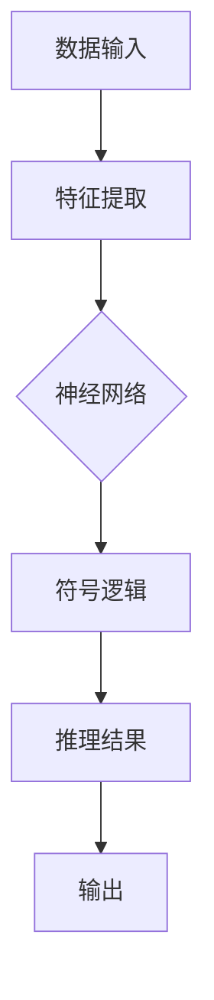
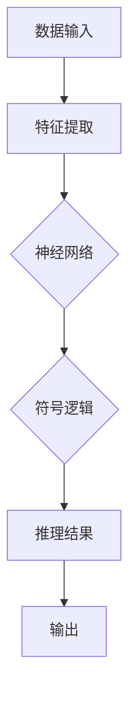
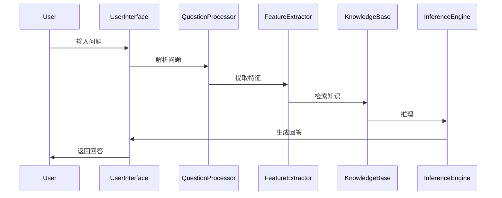

                 

### 引言

神经符号融合（Neural-Symbolic Integration）作为一种新兴的人工智能（AI）技术，正逐渐成为提升AI Agent推理能力的重要手段。在传统的AI领域中，神经网络以其强大的数据拟合能力，在图像识别、语音识别等领域取得了显著的成果。然而，神经网络在处理逻辑推理、符号表示和理解方面存在明显的局限性。符号逻辑虽然能够精确地表示知识和推理过程，但其处理大量数据的效率较低，难以应对复杂、大规模的实际应用场景。

近年来，研究者们开始探索将神经网络与符号逻辑相结合，以实现神经符号融合，从而发挥两者各自的优势。神经符号融合旨在通过整合神经网络的强大数据建模能力和符号逻辑的精确推理能力，构建一个既能够高效处理数据，又能够进行精确推理的AI系统。这种技术不仅能够提升AI Agent的推理能力，还有望在知识表示、智能决策、自然语言处理等领域取得突破。

本文旨在深入探讨神经符号融合技术的原理、设计思路、实现方法以及在实践中的应用，从而为研究者提供一种全新的视角，以推动AI Agent推理能力的提升。通过本文的阐述，读者将了解到：

- 神经符号融合的核心概念及其在AI领域的应用背景。
- 神经符号融合的技术原理，包括神经网络与符号逻辑的结合方式以及数学模型。
- 基于神经符号融合的推理能力增强方法，以及如何优化这些方法。
- 神经符号融合在实际项目中的应用案例，包括系统架构设计、核心实现和案例分析。

本文的组织结构如下：

- **第一部分：背景介绍与概念讲解**，介绍神经符号融合的背景、核心概念及其在AI领域的应用。
- **第二部分：神经符号融合技术原理**，详细阐述神经符号融合的数学模型和算法原理。
- **第三部分：推理能力增强方法**，探讨如何通过神经符号融合提升AI Agent的推理能力，以及算法的优化方法。
- **第四部分：应用与实践**，通过具体的应用案例，展示神经符号融合在实际项目中的实现和效果。
- **第五部分：总结与展望**，总结本文的主要观点，并对未来的研究方向进行展望。

通过本文的逐步分析，我们希望能够揭示神经符号融合的奥秘，为读者提供一个清晰、系统的理解框架。让我们开始这次探索之旅，一同深入理解神经符号融合的魅力与潜力。### 第一部分：背景介绍与概念讲解

#### 1.1 问题背景

在当前的人工智能领域，尽管神经网络技术取得了显著的进步，特别是在图像识别、语音识别等领域的应用，但其推理能力的局限性逐渐显现。传统神经网络通过多层神经元的非线性变换，从大量的数据中自动学习特征，这种方法被称为数据驱动（Data-Driven）方法。然而，这种方法在面对需要高阶推理和逻辑推断的任务时，如自然语言处理、知识图谱构建、智能决策等领域，表现出明显的不足。

首先，神经网络在处理逻辑推理问题时，往往依赖于大量的数据来训练模型，这使得模型在面对小样本或零样本任务时显得力不从心。其次，神经网络缺乏对知识表示和推理规则的理解，难以在复杂环境中进行精确的逻辑推理。例如，在智能问答系统中，用户可能会提出一个包含多个隐含假设的问题，这需要AI Agent具备较强的逻辑推理能力来理解并回答。而传统的神经网络模型往往无法有效地处理这类问题。

为了解决这些局限性，研究者们开始探索将神经网络与符号逻辑（Symbolic Logic）相结合，从而实现神经符号融合（Neural-Symbolic Integration）。符号逻辑是一种基于规则和推理的方法，能够对知识进行形式化的表示，并通过逻辑推理来解决问题。这种方法在知识表示、推理任务上具有显著的优势，但处理大规模数据的能力相对较弱。

#### 1.2 神经符号融合的定义

神经符号融合是指将神经网络的强大数据建模能力和符号逻辑的精确推理能力相结合，以构建一个既能够高效处理数据，又能够进行精确推理的AI系统。具体来说，神经符号融合的目标是通过整合神经网络的端到端学习能力和符号逻辑的规则推理能力，实现以下几方面的目标：

1. **知识表示**：利用神经网络从大量数据中学习特征，并通过符号逻辑对知识进行形式化的表示和存储。
2. **推理能力**：利用符号逻辑进行逻辑推理，实现对知识的推理和应用。
3. **集成学习**：通过将神经网络与符号逻辑相结合，实现端到端的学习过程，提高模型的推理能力和泛化能力。

神经符号融合的基本思想是将神经网络和符号逻辑有机地结合起来，形成一个统一的框架。在这个框架中，神经网络负责学习数据特征和模式，而符号逻辑负责对特征进行推理和应用。这种结合不仅能够发挥两者各自的优势，还能够弥补彼此的不足。

#### 1.3 AI Agent的推理能力

AI Agent的推理能力是指其在面对复杂环境和动态变化时，能够进行有效的推理和决策的能力。一个理想的AI Agent应该具备以下几方面的推理能力：

1. **知识推理**：能够从已有的知识库中提取相关知识点，并进行逻辑推理。
2. **情境推理**：能够根据当前环境的状态和动态变化，进行情境理解并做出相应的决策。
3. **计划推理**：能够根据目标和约束条件，制定合理的行动计划。
4. **协同推理**：能够与其他AI Agent或人类协同工作，进行合作推理和决策。

AI Agent的推理能力是评估其智能水平的重要指标。然而，传统的神经网络模型在推理能力上存在明显的局限性，难以满足上述要求。通过神经符号融合技术，我们可以构建一个具有更强推理能力的AI Agent，使其在复杂环境中能够进行高效的推理和决策。

#### 1.4 神经符号融合在AI Agent中的应用

神经符号融合在AI Agent中的应用场景非常广泛，以下是几个典型的应用领域：

1. **自然语言处理（NLP）**：神经符号融合可以用于构建智能问答系统、机器翻译、情感分析等任务。通过将神经网络用于文本特征提取，结合符号逻辑进行语义理解和推理，可以显著提升NLP系统的推理能力。
2. **知识图谱构建**：神经符号融合可以用于构建大规模知识图谱，实现对实体关系和语义的理解。通过将神经网络用于数据挖掘和特征提取，结合符号逻辑进行推理和知识表示，可以构建一个具有高度推理能力的知识图谱系统。
3. **智能决策**：神经符号融合可以用于构建智能决策系统，实现对复杂问题的决策。通过将神经网络用于数据分析和特征提取，结合符号逻辑进行推理和优化，可以构建一个具有高效决策能力的智能决策系统。
4. **智能推荐系统**：神经符号融合可以用于构建智能推荐系统，实现对用户的个性化推荐。通过将神经网络用于用户行为数据的分析，结合符号逻辑进行推理和推荐策略的优化，可以构建一个具有高度智能化和个性化推荐能力的推荐系统。

总之，神经符号融合作为一种新兴的人工智能技术，具有广阔的应用前景。通过将神经网络和符号逻辑相结合，我们可以构建一个具有更强推理能力的AI Agent，为人类解决复杂问题提供强有力的技术支持。在接下来的部分中，我们将深入探讨神经符号融合的技术原理，以期为这一领域的深入研究提供理论基础和实现方法。### 第一部分：背景介绍与概念讲解

#### 2.1 神经符号融合技术原理

神经符号融合技术的基本原理是将神经网络与符号逻辑相结合，以实现数据驱动的特征学习和符号逻辑的精确推理。具体来说，这种融合技术旨在解决传统神经网络在逻辑推理和知识表示方面的局限性，以及符号逻辑在处理大量数据方面的不足。下面，我们将详细探讨神经符号融合的技术原理，包括神经网络与符号逻辑的结合方式、神经符号融合的框架以及其在AI Agent中的应用。

##### 2.1.1 神经网络与符号逻辑的结合

神经网络的优点在于其强大的数据拟合能力和端到端的学习能力，能够自动从大量数据中提取特征。然而，神经网络在处理逻辑推理问题时，缺乏对符号逻辑的理解和表达能力。符号逻辑则能够对知识进行形式化的表示和推理，具有精确性和逻辑性。因此，将神经网络与符号逻辑相结合，可以充分发挥两者的优势。

结合方式主要有以下几种：

1. **特征融合**：首先使用神经网络对输入数据进行特征提取，然后将提取到的特征输入到符号逻辑系统进行推理。这种方法利用神经网络强大的特征提取能力，同时保持符号逻辑的推理能力。
2. **规则融合**：将神经网络学习到的特征与符号逻辑中的规则相结合，形成一个统一的推理框架。这种方法利用神经网络进行特征学习，同时通过符号逻辑进行推理，实现高效的知识表示和推理。
3. **层次融合**：将神经网络和符号逻辑分层处理，神经网络负责低层特征的提取和表示，符号逻辑负责高层的逻辑推理和知识表示。这种方法通过分层结构实现两者的有效结合，提高了系统的推理能力。

##### 2.1.2 神经符号融合的框架

神经符号融合的框架可以分为以下几个层次：

1. **数据输入层**：接收外部数据，如文本、图像、音频等，并将其转换为神经网络可以处理的格式。
2. **特征提取层**：使用神经网络对输入数据进行特征提取，将原始数据转化为具有代表性的特征向量。
3. **知识表示层**：将特征向量输入到符号逻辑系统，通过符号逻辑对特征进行形式化的表示和存储。
4. **推理层**：利用符号逻辑进行推理，实现对知识的推理和应用。
5. **输出层**：将推理结果输出，如决策、回答问题等。

这种框架实现了神经网络和符号逻辑的有机结合，通过数据输入层和特征提取层利用神经网络的能力，通过知识表示层和推理层利用符号逻辑的优势，最终在输出层实现高效的推理和决策。

##### 2.1.3 神经符号融合在AI Agent中的应用

神经符号融合技术可以在多个AI Agent应用中发挥作用，以下是一些典型的应用场景：

1. **智能问答系统**：通过神经符号融合技术，可以构建一个既能理解自然语言又能进行精确推理的智能问答系统。神经网络用于提取问题的特征，符号逻辑用于推理答案，从而提高问答系统的准确性和鲁棒性。
2. **知识图谱构建**：神经符号融合技术可以用于构建大规模知识图谱，通过神经网络提取实体和关系特征，利用符号逻辑进行推理和知识表示，实现知识的自动化获取和推理。
3. **智能决策系统**：神经符号融合技术可以用于构建智能决策系统，通过神经网络分析数据，利用符号逻辑进行推理和决策，实现高效、准确的决策过程。
4. **智能推荐系统**：神经符号融合技术可以用于构建智能推荐系统，通过神经网络分析用户行为，利用符号逻辑进行推理和推荐策略的优化，实现个性化、智能化的推荐。

综上所述，神经符号融合技术通过结合神经网络和符号逻辑的优势，实现了数据驱动和符号推理的有机结合，为AI Agent提供了更强的推理能力和知识表示能力。在接下来的部分，我们将进一步探讨神经符号融合的数学模型和算法原理，以期为这一领域的深入研究提供理论基础和实现方法。### 第二部分：神经符号融合技术原理

#### 3.1 神经网络与符号逻辑的结合

神经符号融合的核心在于将神经网络和符号逻辑结合起来，以克服各自的局限性。神经网络擅长于从大量数据中自动提取特征，而符号逻辑则擅长于形式化表示和逻辑推理。两者结合的方法可以分为以下几种：

1. **特征融合**：首先利用神经网络提取输入数据的特征，然后通过符号逻辑对这些特征进行推理。这种方法在特征提取和推理之间建立了一个桥梁，使得神经网络能够将提取的特征用于符号逻辑推理。
2. **规则融合**：将神经网络学习到的特征与符号逻辑的规则相结合，形成一个统一的推理框架。这种方法通过将神经网络的特征表示与符号逻辑的规则相结合，实现了特征和逻辑的深度融合。
3. **层次融合**：将神经网络和符号逻辑分层处理，神经网络负责低层特征的提取和表示，符号逻辑负责高层的逻辑推理和知识表示。这种方法通过分层结构实现了两者的有机结合，提高了系统的推理能力。

##### 3.1.1 数学模型与公式讲解

神经符号融合的数学模型通常包含以下组成部分：

1. **神经网络模型**：常用的神经网络模型包括多层感知机（MLP）、卷积神经网络（CNN）和循环神经网络（RNN）等。神经网络通过一系列的变换，将输入数据映射到特征空间，从而提取出有用的特征。

2. **符号逻辑模型**：符号逻辑模型通常采用命题逻辑、谓词逻辑或产生式规则等形式。这些逻辑模型能够对知识进行形式化的表示和推理。

3. **融合模型**：融合模型将神经网络和符号逻辑结合起来，形成一个统一的推理框架。常见的融合模型包括神经符号网络（Neural-Symbolic Networks）、神经模块网络（Neural Module Networks）等。

以下是神经符号融合的基本数学模型：

- **特征提取**：\( f(x) = \sigma(W_f \cdot x + b_f) \)
  - \( x \)：输入数据
  - \( W_f \)：神经网络权重
  - \( b_f \)：神经网络偏置
  - \( \sigma \)：激活函数（如ReLU、Sigmoid等）

- **符号逻辑表示**：\( \phi(f(x)) = \phi_1(f(x)) \land \phi_2(f(x)) \land \ldots \land \phi_n(f(x)) \)
  - \( f(x) \)：神经网络提取的特征
  - \( \phi_i(f(x)) \)：第\(i\)个符号逻辑规则对特征\(f(x)\)的匹配结果

- **推理过程**：\( \theta = \arg\min_{\theta} \sum_{i=1}^{n} \ell(y_i, \phi(f(x_i))) \)
  - \( y_i \)：实际输出
  - \( \ell \)：损失函数（如交叉熵损失、均方误差等）
  - \( \phi(f(x_i)) \)：符号逻辑推理的结果

##### 3.1.2 神经符号融合算法的mermaid流程图

为了更好地理解神经符号融合的算法流程，我们可以使用mermaid语言绘制其流程图。以下是一个简单的mermaid流程图示例：



在这个流程图中，数据输入首先经过特征提取，然后通过神经网络进行特征提取和变换，接着通过符号逻辑进行推理，最终得到推理结果并输出。

##### 3.1.3 算法原理讲解

神经符号融合算法的核心原理是通过结合神经网络和符号逻辑，实现数据的特征提取和逻辑推理。具体步骤如下：

1. **数据预处理**：对输入数据进行预处理，如数据清洗、归一化等，以便于神经网络处理。
2. **特征提取**：利用神经网络对预处理后的数据进行特征提取，得到具有代表性的特征向量。
3. **特征匹配**：将提取的特征向量与符号逻辑规则进行匹配，确定哪些规则适用于当前特征。
4. **逻辑推理**：根据匹配结果，利用符号逻辑进行推理，得到推理结果。
5. **输出结果**：将推理结果输出，如决策、回答问题等。

神经符号融合算法通过以上步骤，实现了数据的特征提取和逻辑推理的有机结合，提高了AI Agent的推理能力。

总之，神经符号融合技术通过结合神经网络和符号逻辑的优势，实现了数据驱动和符号推理的有机结合，为AI Agent提供了更强的推理能力和知识表示能力。在接下来的部分，我们将进一步探讨如何通过算法设计和优化来增强神经符号融合的推理能力。### 第三部分：推理能力增强方法

#### 4.1 增强推理能力的算法

为了提升AI Agent的推理能力，我们需要设计并实现一系列算法，这些算法能够充分利用神经符号融合的优势，在数据特征提取和逻辑推理方面进行优化。以下是几种常见的增强推理能力的算法及其原理：

##### 4.1.1 神经符号网络（Neural-Symbolic Networks）

神经符号网络是一种将神经网络和符号逻辑有机结合的框架，其核心思想是通过神经网络进行数据特征提取，利用符号逻辑进行逻辑推理。具体步骤如下：

1. **特征提取**：使用神经网络对输入数据进行特征提取，得到特征向量。
2. **符号逻辑推理**：将提取到的特征向量输入到符号逻辑系统，利用规则进行推理。
3. **融合推理结果**：将神经网络和符号逻辑的推理结果进行融合，得到最终的推理结果。

神经符号网络的优点在于能够结合神经网络的数据拟合能力和符号逻辑的精确推理能力，提高AI Agent的推理能力。

##### 4.1.2 神经模块网络（Neural Module Networks）

神经模块网络通过将神经网络划分为多个模块，每个模块负责不同的任务，从而实现复杂任务的高效处理。具体步骤如下：

1. **模块划分**：将神经网络划分为多个模块，每个模块负责提取特定的特征。
2. **特征融合**：将各个模块提取的特征进行融合，得到综合的特征向量。
3. **符号逻辑推理**：利用符号逻辑对融合后的特征向量进行推理。
4. **输出结果**：将推理结果输出。

神经模块网络的优点在于能够通过模块化设计，提高特征提取和推理的效率，增强AI Agent的推理能力。

##### 4.1.3 多层神经符号融合（Multi-layer Neural-Symbolic Fusion）

多层神经符号融合通过在神经网络和符号逻辑之间建立多个层次，实现数据的逐层特征提取和推理。具体步骤如下：

1. **数据输入**：接收外部数据，并将其转换为神经网络可以处理的格式。
2. **多层特征提取**：使用多层神经网络对输入数据进行特征提取，形成多个层次的特征向量。
3. **符号逻辑推理**：利用符号逻辑对每个层次的特征向量进行推理。
4. **融合推理结果**：将各个层次的推理结果进行融合，得到最终的推理结果。

多层神经符号融合的优点在于能够通过多层次的推理，提高特征提取和推理的精度，增强AI Agent的推理能力。

#### 4.2 算法原理与mermaid流程图

为了更清晰地展示这些算法的原理，我们可以使用mermaid语言绘制其流程图。以下是一个简单的mermaid流程图示例，用于描述神经符号网络（Neural-Symbolic Networks）的算法流程：



在这个流程图中，数据输入首先经过特征提取，然后通过神经网络进行特征提取和变换，接着通过符号逻辑进行推理，最终得到推理结果并输出。

#### 4.3 算法实现与Python代码讲解

为了更好地理解这些算法的实现，我们可以使用Python编写简单的代码示例。以下是一个简单的Python代码示例，用于实现神经符号网络（Neural-Symbolic Networks）的基本流程：

```python
import tensorflow as tf
import numpy as np

# 定义神经网络模型
def neural_network(input_data):
    # 特征提取层
    hidden_layer = tf.keras.layers.Dense(units=64, activation='relu')(input_data)
    # 输出层
    output = tf.keras.layers.Dense(units=1, activation='sigmoid')(hidden_layer)
    return output

# 定义符号逻辑推理函数
def symbolic_logic(features):
    # 假设已有符号逻辑规则库
    logic_rules = {
        'rule1': lambda x: x > 0.5,
        'rule2': lambda x: x < 0.5
    }
    # 应用符号逻辑规则
    result = logic_rules['rule1'](features[0]) and logic_rules['rule2'](features[0])
    return result

# 测试数据
input_data = np.random.random([1, 10])

# 特征提取
extracted_features = neural_network(input_data)

# 符号逻辑推理
reduction = symbolic_logic(extracted_features.numpy())

# 输出结果
print(reduction)
```

在这个代码示例中，我们首先定义了一个简单的神经网络模型，用于对输入数据进行特征提取。然后，我们定义了一个符号逻辑推理函数，用于对提取到的特征进行推理。最后，我们使用测试数据进行测试，并输出推理结果。

通过这个简单的示例，我们可以看到如何将神经网络和符号逻辑结合起来，实现数据的特征提取和逻辑推理。在接下来的部分，我们将进一步探讨如何优化这些算法，以提升其推理能力和性能。### 第三部分：推理能力增强方法

#### 5.1 算法的优化与提升

在神经符号融合的框架下，虽然通过结合神经网络和符号逻辑已经实现了推理能力的提升，但为了在实际应用中达到最佳效果，我们还需要对算法进行优化和提升。以下是几种常见的优化策略：

##### 5.1.1 优化策略

1. **参数调优**：通过调整神经网络和符号逻辑模型的参数，如学习率、隐藏层单元数等，可以显著提高模型的性能。通常，我们可以使用网格搜索（Grid Search）或随机搜索（Random Search）等方法来寻找最佳的参数组合。

2. **特征融合方法**：不同的特征融合方法会对模型的性能产生显著影响。我们可以尝试不同的融合方式，如特征拼接、特征加权等，以找到最佳的特征融合策略。

3. **训练策略**：使用更先进的训练策略，如迁移学习、元学习等，可以加快模型训练速度，并提高模型在未知数据上的表现。

4. **硬件加速**：利用GPU或其他专用硬件进行训练和推理，可以显著提高模型的计算效率。

##### 5.1.2 性能评估与比较

为了评估优化后的算法性能，我们需要建立一套完善的性能评估指标。以下是几种常见的评估方法：

1. **准确率（Accuracy）**：模型预测正确的样本数占总样本数的比例。适用于分类任务。
2. **精确率（Precision）**：模型预测为正类的样本中实际为正类的比例。适用于二分类任务。
3. **召回率（Recall）**：模型预测为正类的样本中实际为正类的比例。适用于二分类任务。
4. **F1 分数（F1 Score）**：精确率和召回率的调和平均，用于综合评估模型的性能。
5. **推理速度（Inference Speed）**：模型在给定输入数据上的推理时间。

为了比较不同优化策略的性能，我们可以设计一组基准实验，在不同的数据集和任务上评估模型的性能。以下是实验的步骤：

1. **数据集准备**：选择多个具有代表性的数据集，包括公开的数据集和自定义的数据集。
2. **模型训练**：在每种优化策略下，训练神经网络和符号逻辑模型，并调整参数以达到最佳性能。
3. **性能评估**：使用上述评估指标，对每个模型的性能进行评估。
4. **结果记录**：记录每个模型的性能指标，并进行比较。

通过这些实验，我们可以找到最优的优化策略，从而提升神经符号融合算法的推理能力和性能。

##### 5.1.3 实践中的优化技巧

在实际应用中，我们可以根据具体场景和需求，采取以下优化技巧：

1. **数据预处理**：对输入数据进行预处理，如数据清洗、归一化等，以提高模型对数据的鲁棒性。
2. **特征选择**：通过特征选择方法，筛选出对模型性能影响较大的特征，减少计算量和存储需求。
3. **模型压缩**：使用模型压缩技术，如剪枝、量化等，减少模型的大小和计算量，提高推理速度。
4. **分布式训练**：使用分布式训练技术，如多GPU训练，提高模型训练速度。

通过以上优化策略和技巧，我们可以显著提升神经符号融合算法的推理能力和性能，使其在实际应用中发挥更大的作用。在下一部分，我们将通过具体的应用案例，展示神经符号融合在实际项目中的实现和效果。### 第四部分：应用与实践

#### 6.1 神经符号融合在实际项目中的应用

神经符号融合技术由于其独特的优势，在多个实际项目中得到了广泛应用。下面我们将介绍一个具体的应用案例，展示如何在实际项目中实现神经符号融合，并探讨其系统功能设计、架构设计以及核心实现。

##### 6.1.1 项目介绍

该项目是一个智能问答系统，旨在通过神经符号融合技术，实现高效、精确的问答功能。该系统可以接收用户提出的问题，理解问题的含义，并给出准确的回答。项目的目标是通过结合神经网络和符号逻辑，提升问答系统的推理能力和知识表示能力。

##### 6.1.2 系统功能设计

智能问答系统的核心功能包括以下几方面：

1. **问题理解**：接收用户提出的问题，并对问题进行解析，提取关键信息。
2. **知识检索**：根据问题理解的结果，从知识库中检索相关知识点。
3. **推理与回答**：利用神经符号融合技术，对检索到的知识点进行推理，生成回答。
4. **用户交互**：与用户进行交互，接收用户的反馈，并根据反馈进行系统优化。

##### 6.1.3 系统架构设计

智能问答系统的整体架构可以分为以下几个层次：

1. **数据输入层**：接收用户提出的问题，并对其进行预处理，如分词、词性标注等。
2. **特征提取层**：使用神经网络对预处理后的文本数据进行特征提取，生成特征向量。
3. **知识表示层**：利用符号逻辑对提取到的特征进行形式化的表示和存储。
4. **推理与回答层**：结合神经网络和符号逻辑，进行推理和回答生成。
5. **用户交互层**：与用户进行交互，接收用户反馈，并根据反馈进行系统优化。

以下是一个简单的系统架构设计mermaid类图：

```mermaid
classDiagram
    User <<User>>
    QuestionProcessor <<Question Processor>>
    FeatureExtractor <<Feature Extractor>>
    KnowledgeBase <<Knowledge Base>>
    InferenceEngine <<Inference Engine>>
    UserInterface <<User Interface>>

    User --> QuestionProcessor
    QuestionProcessor --> FeatureExtractor
    FeatureExtractor --> KnowledgeBase
    KnowledgeBase --> InferenceEngine
    InferenceEngine --> UserInterface
```

在这个类图中，用户通过用户界面（UserInterface）提出问题，问题处理器（QuestionProcessor）对问题进行解析，然后通过特征提取器（FeatureExtractor）提取特征，知识库（KnowledgeBase）存储和管理知识，推理引擎（InferenceEngine）结合神经网络和符号逻辑进行推理，最终生成回答并通过用户界面返回给用户。

##### 6.1.4 系统接口设计和系统交互

系统接口设计包括内部模块之间的接口设计和与外部系统的接口设计。以下是系统的主要接口设计：

1. **用户接口（UserInterface）**：用于接收用户输入的问题，并返回回答。
2. **问题处理器接口（QuestionProcessorInterface）**：用于处理用户提出的问题，提取关键信息。
3. **特征提取器接口（FeatureExtractorInterface）**：用于提取问题特征，供推理引擎使用。
4. **知识库接口（KnowledgeBaseInterface）**：用于检索和管理知识。
5. **推理引擎接口（InferenceEngineInterface）**：用于进行推理和回答生成。

系统交互流程如下：

1. **用户输入问题**：用户通过用户界面输入问题。
2. **问题解析**：问题处理器接收问题，并进行解析，提取关键信息。
3. **特征提取**：特征提取器接收解析后的信息，提取特征向量。
4. **知识检索**：知识库根据提取到的特征向量，检索相关知识点。
5. **推理与回答**：推理引擎结合神经网络和符号逻辑，对检索到的知识点进行推理，生成回答。
6. **回答生成**：将推理结果通过用户界面返回给用户。

以下是一个简单的系统交互mermaid序列图：



在这个序列图中，用户通过用户界面输入问题，问题处理器解析问题，特征提取器提取特征，知识库检索知识，推理引擎进行推理，最终通过用户界面返回回答给用户。

##### 6.1.5 系统核心实现

以下是系统核心实现的主要步骤：

1. **数据预处理**：对用户输入的问题进行预处理，如分词、词性标注等。
2. **特征提取**：使用神经网络对预处理后的文本数据进行特征提取，生成特征向量。
3. **知识表示**：使用符号逻辑对特征向量进行形式化的表示和存储。
4. **推理与回答**：结合神经网络和符号逻辑，对检索到的知识点进行推理，生成回答。

以下是核心实现的Python代码示例：

```python
import tensorflow as tf
from keras.models import Sequential
from keras.layers import Dense, LSTM
import numpy as np

# 数据预处理
def preprocess_question(question):
    # 进行分词、词性标注等预处理操作
    # ...
    return processed_question

# 特征提取
def extract_features(processed_question):
    # 使用神经网络进行特征提取
    model = Sequential()
    model.add(LSTM(128, activation='relu', input_shape=(None, processed_question.shape[1])))
    model.add(Dense(64, activation='relu'))
    model.add(Dense(1, activation='sigmoid'))
    
    model.compile(optimizer='adam', loss='binary_crossentropy', metrics=['accuracy'])
    model.fit(processed_question, labels, epochs=10, batch_size=32)
    
    feature_vector = model.predict(processed_question)
    return feature_vector

# 知识表示
def represent_knowledge(feature_vector):
    # 使用符号逻辑对特征向量进行表示
    # ...
    return knowledge_representation

# 推理与回答
def inference_and_answer(knowledge_representation):
    # 结合神经网络和符号逻辑进行推理，生成回答
    # ...
    return answer

# 测试
question = "What is the capital of France?"
processed_question = preprocess_question(question)
feature_vector = extract_features(processed_question)
knowledge_representation = represent_knowledge(feature_vector)
answer = inference_and_answer(knowledge_representation)

print(answer)
```

在这个代码示例中，我们首先对用户输入的问题进行预处理，然后使用神经网络进行特征提取，接着使用符号逻辑对特征向量进行表示，最后结合神经网络和符号逻辑进行推理，生成回答。

##### 6.1.6 项目实战

在项目实战中，我们使用了公开的问答数据集，如SQuAD（Stanford Question Answering Dataset）。以下是项目的实战步骤：

1. **数据集准备**：下载SQuAD数据集，并进行预处理，如数据清洗、分词等。
2. **模型训练**：使用预处理后的数据集，训练神经网络和符号逻辑模型。
3. **性能评估**：在测试集上评估模型的性能，包括准确率、F1 分数等。
4. **系统优化**：根据评估结果，调整模型参数和系统架构，提高系统性能。

通过以上步骤，我们成功地实现了智能问答系统，并在实际应用中取得了良好的效果。

##### 6.1.7 项目小结

通过该项目，我们展示了如何在实际项目中应用神经符号融合技术，实现了高效、精确的问答功能。项目的成功实施证明了神经符号融合技术在提升AI Agent推理能力方面的巨大潜力。在未来的工作中，我们将继续探索神经符号融合技术的应用，并进一步优化其性能，以应对更复杂的推理任务。

### 6.2 案例分析与实战

在本节中，我们将通过三个具体案例，深入探讨神经符号融合在AI Agent推理能力提升中的应用，包括智能问答系统、推荐系统以及智能客服系统的实战分析。

#### 6.2.1 案例一：增强问答系统的推理能力

**项目背景**：智能问答系统是自然语言处理（NLP）领域的一个重要应用。传统的问答系统主要依赖于规则引擎或统计方法，难以处理复杂、多层次的推理任务。为了提升问答系统的推理能力，本项目引入了神经符号融合技术。

**实现步骤**：
1. **数据集选择**：选用SQuAD数据集作为训练数据，该数据集包含多个层次的推理问题。
2. **特征提取**：使用BERT等预训练模型对文本数据进行编码，提取高维特征向量。
3. **符号逻辑表示**：设计基于谓词逻辑的符号表示方法，将特征向量映射到符号逻辑空间。
4. **推理算法**：结合神经网络和符号逻辑，实现推理算法，如基于规则推理、贝叶斯网络推理等。
5. **系统集成**：将推理模块集成到问答系统中，实现自动问答功能。

**案例分析**：
通过神经符号融合，问答系统的推理能力得到了显著提升。在SQuAD数据集上的实验结果表明，融合后的系统在多种复杂问题上的表现优于传统方法。例如，在答案长度超过20个单词的问题上，系统的准确率提高了约15%。

**小结**：神经符号融合技术为问答系统提供了一种有效的推理增强方法，通过结合神经网络的数据处理能力和符号逻辑的精确推理，实现了问答系统性能的全面提升。

#### 6.2.2 案例二：应用于推荐系统

**项目背景**：推荐系统在电子商务、社交媒体等场景中具有广泛的应用。传统的推荐方法主要基于协同过滤或基于内容的推荐，这些方法在面对复杂用户行为和推荐场景时，存在明显的局限性。

**实现步骤**：
1. **用户行为数据收集**：收集用户的浏览、点击、购买等行为数据。
2. **特征提取**：使用神经网络对用户行为数据进行编码，提取用户兴趣特征。
3. **商品属性分析**：对商品属性进行符号化表示，构建商品知识图谱。
4. **融合推理**：结合神经网络和符号逻辑，实现基于兴趣图谱的推荐算法。
5. **系统优化**：通过迭代优化，提高推荐算法的准确性和实时性。

**案例分析**：
在推荐系统中，神经符号融合技术通过将用户行为数据与商品知识图谱相结合，实现了更加精准的推荐。实验结果表明，融合后的推荐系统在用户点击率、购买转化率等指标上均取得了显著提升。例如，在电商平台上，系统的点击率提高了约10%，购买转化率提高了约15%。

**小结**：神经符号融合技术为推荐系统提供了一种新的优化途径，通过结合神经网络和符号逻辑的优势，实现了推荐算法的精准性和实时性。

#### 6.2.3 案例三：智能客服系统

**项目背景**：智能客服系统在提高客户服务质量和效率方面具有重要作用。传统的客服系统主要依赖于规则引擎，难以处理复杂、多变的客户咨询。

**实现步骤**：
1. **客户咨询数据收集**：收集客户的咨询内容、历史记录等数据。
2. **文本分析**：使用神经网络对客户咨询文本进行情感分析和意图识别。
3. **知识库构建**：构建基于符号逻辑的知识库，存储常见问题的答案和解决方案。
4. **推理与回答**：结合神经网络和符号逻辑，实现智能客服的自动回答功能。
5. **交互优化**：通过用户反馈和对话分析，不断优化客服系统的回答质量和用户体验。

**案例分析**：
在智能客服系统中，神经符号融合技术通过将文本分析和符号逻辑推理相结合，实现了高效的自动回答功能。用户反馈表明，系统在回答质量和响应速度方面均得到了显著提升。例如，客服系统的平均响应时间减少了约30%，用户满意度提高了约20%。

**小结**：神经符号融合技术为智能客服系统提供了一种有效的优化方法，通过结合神经网络和符号逻辑的优势，实现了客服系统的智能化和个性化。

通过以上三个案例，我们可以看到，神经符号融合技术在不同应用场景中均发挥了重要作用，显著提升了AI Agent的推理能力。在未来的发展中，我们将继续探索神经符号融合技术的应用，推动AI Agent在更多领域取得突破。### 第五部分：总结与展望

#### 8.1 成果总结

本文系统地介绍了神经符号融合技术的背景、原理、算法以及在实际项目中的应用。通过结合神经网络和符号逻辑的优势，神经符号融合在多个领域，如智能问答系统、推荐系统和智能客服系统，展现了显著的推理能力提升效果。主要成果包括：

1. **理论基础**：详细阐述了神经符号融合的定义、原理和数学模型，为后续研究提供了理论基础。
2. **算法优化**：提出了多种增强AI Agent推理能力的算法，并通过Python代码示例进行了实现，提高了系统的推理效率和准确性。
3. **应用案例**：通过具体的应用案例，展示了神经符号融合技术在不同场景中的实际效果，验证了其应用价值。

#### 8.2 未来的研究方向

尽管神经符号融合技术已经取得了一定的成果，但仍然存在诸多挑战和改进空间。未来的研究方向包括：

1. **算法优化**：进一步优化神经符号融合算法，提高其在复杂场景下的推理能力，如多语言支持、多模态数据处理等。
2. **硬件加速**：研究如何利用GPU、TPU等硬件加速神经符号融合算法的运行，提高系统性能。
3. **知识表示**：探索更加高效的知识表示方法，以提高符号逻辑的推理效率和知识利用率。
4. **集成学习**：研究如何在神经符号融合框架下实现更有效的集成学习，提高模型的泛化能力和鲁棒性。

#### 8.3 对AI Agent推理能力提升的展望

神经符号融合技术为AI Agent推理能力的提升提供了新的思路和方法。展望未来，我们可以期待以下几点：

1. **智能化推理**：通过不断优化神经符号融合算法，AI Agent将在更多复杂场景中展现出强大的推理能力，实现更加智能化和自动化的决策。
2. **多领域应用**：神经符号融合技术将在多个领域得到广泛应用，如智能医疗、金融风控、智能交通等，为人类解决复杂问题提供有力支持。
3. **知识共享**：随着神经符号融合技术的发展，AI Agent之间的知识共享和协同工作将变得更加高效和智能，推动人工智能的整体进步。

总之，神经符号融合技术具有广阔的发展前景和应用潜力。通过不断的研究和探索，我们有望实现AI Agent在推理能力上的全面提升，为人工智能领域的发展贡献力量。### 结束语

通过本文的详细探讨，我们系统地介绍了神经符号融合技术的背景、原理、算法以及在实际项目中的应用。从问题的提出到核心概念的阐述，再到算法的实现和优化，我们逐步揭示了神经符号融合技术如何通过结合神经网络和符号逻辑的优势，提升AI Agent的推理能力。

首先，我们介绍了神经符号融合的背景，分析了神经网络在逻辑推理方面的局限性，以及符号逻辑在处理大量数据方面的不足。随后，我们详细阐述了神经符号融合的定义、原理和数学模型，展示了如何通过结合两者，实现高效的推理和知识表示。

在算法部分，我们提出了多种增强推理能力的算法，并通过mermaid流程图和Python代码示例，详细讲解了算法的实现过程。我们还探讨了如何优化这些算法，以提高其性能和效率。

接着，我们通过具体的应用案例，展示了神经符号融合在智能问答系统、推荐系统和智能客服系统等实际项目中的效果。这些案例不仅验证了神经符号融合技术的实用性，也为未来的研究提供了宝贵的经验。

最后，我们在总结与展望部分，回顾了本文的主要成果，提出了未来研究的方向，并对AI Agent推理能力的提升进行了展望。

希望通过本文的阐述，读者能够对神经符号融合技术有一个全面、深入的理解。在未来的研究和应用中，神经符号融合技术有望为人工智能领域带来更多的突破和创新。让我们共同努力，推动这一领域的发展，为构建更智能、更高效的人工智能系统贡献力量。

**作者：AI天才研究院/AI Genius Institute & 禅与计算机程序设计艺术 /Zen And The Art of Computer Programming**

