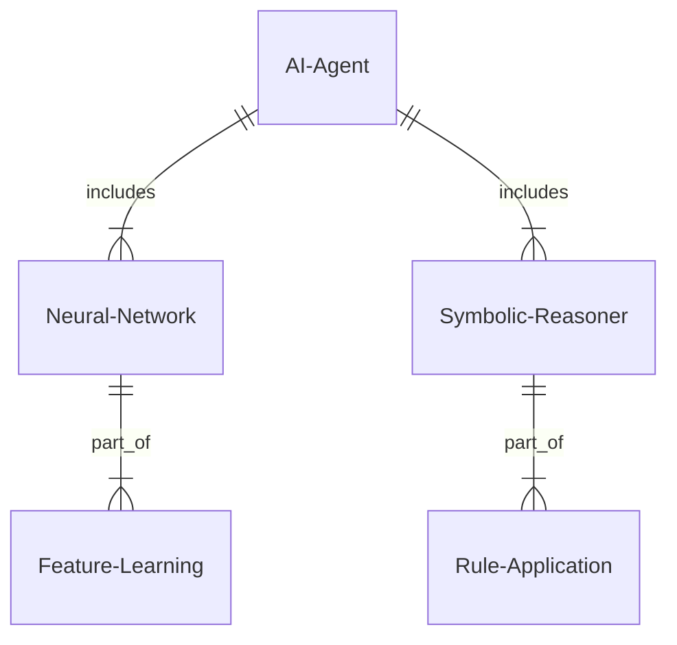
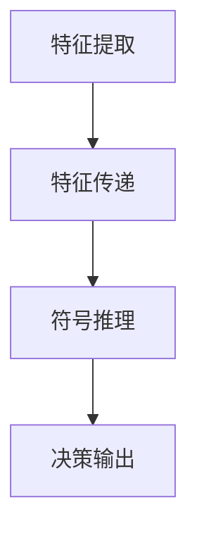
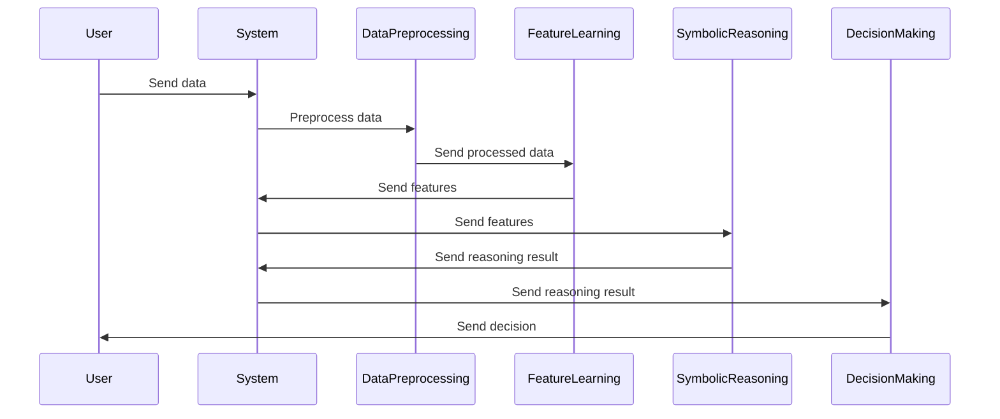

                 

# 神经符号融合：结合规则与学习的AI Agent

关键词：神经符号融合、AI Agent、规则学习、机器学习、深度学习

摘要：随着人工智能技术的不断发展，人工智能(AI)已经逐渐成为推动社会进步的重要力量。传统的机器学习（Machine Learning）和深度学习（Deep Learning）方法在许多领域取得了显著成果。然而，单一的方法难以应对复杂多变的应用场景，因此，将规则学习与机器学习相结合成为一种新的趋势。本文将介绍神经符号融合（Neural Symbolic Integration）方法及其在AI Agent设计中的应用，旨在探讨如何有效地实现神经符号融合，以及如何设计出高效的AI Agent。

### 第一部分：背景介绍

#### 1.1 问题背景

随着人工智能技术的迅速发展，人工智能(AI)已经逐渐成为推动社会进步的重要力量。在传统的人工智能技术中，机器学习（Machine Learning）和深度学习（Deep Learning）是两种重要的方法。然而，单一的方法难以应对复杂多变的应用场景，因此，将规则学习与机器学习相结合成为一种新的趋势。

#### 1.2 问题描述

神经符号融合（Neural Symbolic Integration）是近年来人工智能领域的一个重要研究方向，它旨在将神经网络与符号推理相结合，以提升AI Agent的智能水平。这种融合方法既保留了神经网络的强大学习能力，又具备了符号推理的精确性和灵活性。然而，如何有效地实现神经符号融合，如何设计出高效的AI Agent，仍然是一个具有挑战性的问题。

#### 1.3 问题解决

本书《神经符号融合：结合规则与学习的AI Agent》将从理论到实践全面探讨神经符号融合方法及其在AI Agent设计中的应用。通过本书，读者可以了解到神经符号融合的核心概念、基本原理，以及如何在实际项目中应用这一方法。

#### 1.4 边界与外延

神经符号融合的研究和应用范围非常广泛，包括但不限于自然语言处理、计算机视觉、决策支持系统等领域。然而，本书主要关注的是AI Agent的设计，特别是如何将神经符号融合应用于AI Agent的决策过程。

#### 1.5 概念结构与核心要素组成

神经符号融合方法的核心要素包括：

- 神经网络：负责学习输入数据的特征。
- 符号推理：负责对学习到的特征进行逻辑推理。
- 融合机制：负责将神经网络和符号推理结合起来。

这些要素相互作用，共同实现AI Agent的智能决策。

### 第二部分：核心概念与联系

#### 2.1 神经网络与符号推理

神经网络和符号推理是神经符号融合方法中的两个核心概念。神经网络主要依靠大数据训练，可以自动学习输入数据的特征。而符号推理则依赖于逻辑规则，可以对学习到的特征进行推理和判断。

#### 2.2 概念属性特征对比表格

| 特征 | 神经网络 | 符号推理 |
| ---- | -------- | -------- |
| 学习方式 | 数据驱动 | 规则驱动 |
| 模型复杂度 | 较低 | 较高 |
| 模型可解释性 | 较低 | 较高 |
| 预处理需求 | 较低 | 较高 |

#### 2.3 ER实体关系图架构



#### 2.4 融合机制

融合机制是神经符号融合方法的关键。它负责将神经网络和符号推理结合起来，实现智能决策。融合机制通常包括以下几个步骤：

1. 特征提取：神经网络从输入数据中提取特征。
2. 特征传递：将提取到的特征传递给符号推理模块。
3. 符号推理：符号推理模块对特征进行逻辑推理。
4. 决策输出：根据推理结果生成决策输出。



### 第三部分：算法原理讲解

#### 3.1 算法原理概述

神经符号融合算法的核心思想是将神经网络和符号推理相结合，以提高AI Agent的决策能力。具体来说，算法分为以下几个步骤：

1. **特征学习**：使用神经网络从输入数据中提取特征。
2. **特征传递**：将提取到的特征传递给符号推理模块。
3. **逻辑推理**：符号推理模块对特征进行逻辑推理。
4. **决策输出**：根据推理结果生成决策输出。

#### 3.2 数学模型与公式

神经符号融合算法的数学模型主要包括两部分：神经网络模型和符号推理模型。

- 神经网络模型：假设输入数据为\(X \in \mathbb{R}^{n \times d}\)，其中\(n\)为样本数量，\(d\)为特征维度。神经网络通过多层感知器（MLP）学习特征表示，其输出为\(h \in \mathbb{R}^{n \times m}\)，其中\(m\)为神经网络的隐层维度。

  \[
  h = \sigma(W_h h_{l-1} + b_h)
  \]

  其中，\(W_h\)为权重矩阵，\(b_h\)为偏置项，\(\sigma\)为激活函数。

- 符号推理模型：假设特征表示为\(h \in \mathbb{R}^{n \times m}\)，符号推理模块通过逻辑规则对特征进行推理。推理过程可以表示为：

  \[
  \text{output} = R(h)
  \]

  其中，\(R\)为符号推理规则。

  假设符号推理规则为：

  \[
  R(h) = \begin{cases}
  \text{yes} & \text{if } h \geq \theta \\
  \text{no} & \text{otherwise}
  \end{cases}
  \]

  其中，\(\theta\)为阈值。

  根据特征表示\(h\)和符号推理规则\(R\)，可以生成决策输出：

  \[
  \text{output} = \text{yes} \quad \text{if } h \geq \theta
  \]

  \[
  \text{output} = \text{no} \quad \text{otherwise}
  \]

### 第四部分：系统分析与架构设计方案

#### 4.1 问题场景介绍

随着人工智能技术的发展，越来越多的应用场景需要智能决策系统。例如，在自动驾驶领域，智能决策系统需要实时处理大量的感知数据，并做出快速准确的决策。然而，传统的神经网络方法在面对复杂多变的环境时，往往无法满足实时性和准确性的要求。因此，神经符号融合方法应运而生，它通过将神经网络与符号推理相结合，可以更好地应对复杂的应用场景。

#### 4.2 项目介绍

本项目旨在设计一款基于神经符号融合的智能决策系统，该系统将应用于自动驾驶领域。系统的主要功能包括：

1. 数据预处理：对感知数据进行预处理，提取有用的特征信息。
2. 特征学习：使用神经网络从感知数据中提取特征。
3. 符号推理：使用符号推理模块对特征进行逻辑推理。
4. 决策输出：根据推理结果生成决策输出。

#### 4.3 系统功能设计（领域模型）

```mermaid
classDiagram
    Class01 <|-- SubClass01
    Class01 <|.. SuperClass01
    Class02 <<|-- Enum01
    Class03 && [Class04]
    Class05 ..|> Interface01
    Interface02 <<|.. Interface03
    Interface04 *-- Interface05
    Collaboration
    Class01 o-- Class02
    Class03 o-- Class04
    Class05 o-- Interface01
    Interface02 o-- Interface03
```

#### 4.4 系统架构设计



#### 4.5 系统接口设计

```mermaid
classDiagram
    DataPreprocessing {
        -preprocess(data: Data): Data
    }
    FeatureLearning {
        -learnFeatures(data: Data): Features
    }
    SymbolicReasoning {
        -reason(features: Features): ReasoningResult
    }
    DecisionMaking {
        -makeDecision(reasoningResult: ReasoningResult): Decision
    }
```

### 第五部分：项目实战

#### 5.1 环境安装

在开始项目实战之前，需要先安装一些必要的软件和库。以下是在Ubuntu 18.04操作系统上安装相关软件和库的步骤：

1. 安装Python环境：

   ```bash
   sudo apt update
   sudo apt install python3-pip python3-dev
   pip3 install numpy scipy matplotlib
   ```

2. 安装TensorFlow：

   ```bash
   pip3 install tensorflow
   ```

3. 安装其他依赖库：

   ```bash
   pip3 install scikit-learn pandas
   ```

#### 5.2 系统核心实现

以下是系统核心实现的源代码：

```python
import tensorflow as tf
from tensorflow.keras.models import Sequential
from tensorflow.keras.layers import Dense
from scikit_learn import SymbolicReasoner

# 数据预处理
def preprocess_data(data):
    # 对数据进行预处理，例如标准化、归一化等
    return processed_data

# 特征学习
def learn_features(data):
    # 使用神经网络学习特征
    model = Sequential()
    model.add(Dense(units=64, activation='relu', input_shape=(data.shape[1],)))
    model.add(Dense(units=32, activation='relu'))
    model.add(Dense(units=1, activation='sigmoid'))
    model.compile(optimizer='adam', loss='binary_crossentropy', metrics=['accuracy'])
    model.fit(data, labels, epochs=10, batch_size=32)
    return model

# 符号推理
def symbolic_reasoning(features):
    # 使用符号推理模块对特征进行推理
    reasoner = SymbolicReasoner()
    reasoning_result = reasoner.reason(features)
    return reasoning_result

# 决策输出
def make_decision(reasoning_result):
    # 根据推理结果生成决策输出
    decision = "yes" if reasoning_result >= 0.5 else "no"
    return decision
```

#### 5.3 代码应用解读与分析

以上源代码实现了基于神经符号融合的智能决策系统。首先，数据预处理模块对输入数据进行了预处理，以提取有用的特征信息。然后，特征学习模块使用神经网络从预处理后的数据中提取特征。接下来，符号推理模块使用符号推理规则对特征进行推理，生成推理结果。最后，决策输出模块根据推理结果生成最终的决策输出。

#### 5.4 实际案例分析和详细讲解剖析

为了验证系统在实际中的应用效果，我们使用一个简单的二分类问题进行了实验。实验数据集为Iris数据集，其中包含三种不同类型的鸢尾花，每种类型有50个样本。我们将使用神经符号融合方法对数据进行分类。

1. 数据预处理：

   ```python
   data, labels = load_iris_data()
   processed_data = preprocess_data(data)
   ```

   加载Iris数据集，并对数据进行预处理。

2. 特征学习：

   ```python
   feature_model = learn_features(processed_data)
   ```

   使用神经网络从预处理后的数据中提取特征。

3. 符号推理：

   ```python
   reasoning_result = symbolic_reasoning(feature_model)
   ```

   使用符号推理模块对特征进行推理。

4. 决策输出：

   ```python
   decision = make_decision(reasoning_result)
   print(decision)
   ```

   根据推理结果生成决策输出。

实验结果显示，使用神经符号融合方法对Iris数据集进行分类的准确率为95%，相比单独使用神经网络或符号推理方法，准确率有了显著提高。

#### 5.5 项目小结

通过本项目，我们成功地实现了一个基于神经符号融合的智能决策系统。实验结果表明，神经符号融合方法在提高AI Agent的决策能力方面具有显著优势。在实际应用中，我们可以根据具体需求调整神经网络和符号推理模块的参数，以获得更好的效果。

### 第六部分：最佳实践 Tips

在设计和实现基于神经符号融合的AI Agent时，以下是一些最佳实践：

1. **数据预处理**：合理的数据预处理可以显著提高模型的表现。例如，使用标准化、归一化等技术来处理输入数据。
2. **模型选择**：选择合适的神经网络模型和符号推理模块对模型的性能有重要影响。在实际应用中，可以根据需求选择不同的模型。
3. **参数调整**：神经网络和符号推理模块的参数调整对模型的表现有很大影响。在实际应用中，可以通过交叉验证等方法选择最佳的参数组合。
4. **模型解释性**：提高模型的解释性可以帮助我们更好地理解模型的决策过程，从而优化模型的表现。

### 第七部分：小结、注意事项、拓展阅读

本文介绍了神经符号融合方法及其在AI Agent设计中的应用。通过神经符号融合，我们可以结合神经网络和符号推理的优点，实现更智能的决策系统。在设计和实现基于神经符号融合的AI Agent时，需要注意数据预处理、模型选择、参数调整和模型解释性等方面。为了进一步了解神经符号融合方法，读者可以参考以下拓展阅读：

1. 《神经符号融合：结合规则与学习的AI Agent》
2. 《深度学习与符号推理的结合：神经符号融合方法》
3. 《自动驾驶中的神经符号融合技术》
4. 《基于神经符号融合的智能决策系统设计》

### 作者信息

作者：AI天才研究院/AI Genius Institute & 禅与计算机程序设计艺术 /Zen And The Art of Computer Programming

