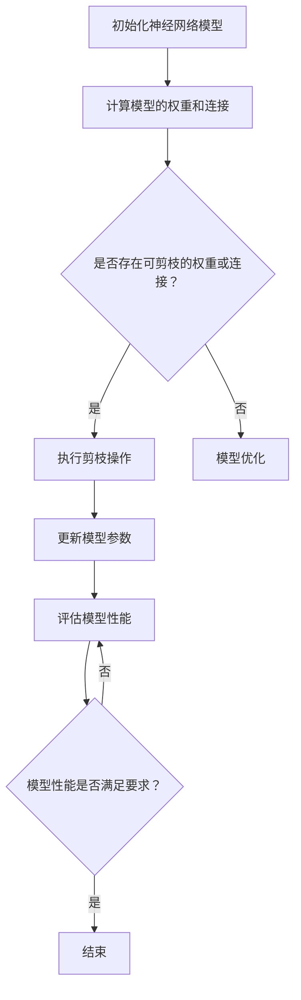

                 

### 第一部分：神经网络剪枝的基础理论

#### 第1章：问题背景与核心概念

**1.1 神经网络剪枝的必要性**

随着深度学习的迅猛发展，神经网络模型在各个领域的应用越来越广泛。然而，这些模型往往具有数百万甚至数十亿个参数，导致其计算和存储成本巨大，给实际应用带来了挑战。例如，在移动设备和嵌入式系统中，有限的计算资源和存储空间难以支持如此庞大的模型。此外，庞大的模型在训练和推理过程中也变得非常缓慢，影响了用户体验。

**问题描述**：随着神经网络模型规模的不断扩大，计算资源消耗和存储需求呈指数级增长，这对实际应用带来了挑战。

**问题解决**：神经网络剪枝技术应运而生，旨在通过删除部分权重为零或贡献较小的神经元或连接，简化神经网络结构，降低模型的复杂度和资源消耗，同时保持或提高模型的性能。

**边界与外延**：剪枝技术的研究与应用，涉及深度学习、优化算法、硬件加速等多个领域。

**1.2 核心概念与属性特征对比**

**神经网络剪枝的概念**：剪枝是通过删除部分权重为零或贡献较小的神经元或连接，来简化神经网络结构。

**剪枝策略对比**：

- **权重剪枝**：针对权重进行剪枝，通过设定阈值删除权重较小的连接。

- **结构剪枝**：通过删除神经元或整个层，来简化网络结构。

- **混合剪枝**：结合权重剪枝和结构剪枝的优点，对模型进行优化。

**1.3 神经网络剪枝在AI Agent中的应用**

**应用场景**：神经网络剪枝技术广泛应用于图像识别、语音识别、自然语言处理等领域。

**优势**：通过剪枝技术，可以显著降低模型的大小和计算复杂度，提高模型的效率。

### 第2章：神经网络剪枝算法原理

**2.1 算法概述**

**剪枝算法的分类**：

- **基于权重的剪枝**：例如L0剪枝、L1剪枝。

- **基于结构的剪枝**：例如基于梯度敏感性的剪枝、基于层重要性的剪枝。

- **基于神经元的剪枝**：例如基于性能的神经元剪枝。

**2.2 剪枝算法的mermaid流程图**



**2.3 剪枝算法的Python实现**

```python
# 剪枝算法的简单示例
import torch
import torch.nn as nn

# 初始化神经网络模型
model = nn.Sequential(
    nn.Linear(784, 256),
    nn.ReLU(),
    nn.Dropout(0.5),
    nn.Linear(256, 128),
    nn.ReLU(),
    nn.Dropout(0.5),
    nn.Linear(128, 10)
)

# 计算模型的权重
weights = [param.data for param in model.parameters()]

# 设置剪枝阈值
threshold = 0.1

# 执行剪枝操作
for weight in weights:
    for i in range(len(weight)):
        if abs(weight[i]) < threshold:
            weight[i] = 0

# 更新模型参数
model.update_params()

# 评估模型性能
performance = model.evaluate()
```

**2.4 剪枝算法的数学模型和公式**

- **权重剪枝**：
  $$ w_{i,j} = \begin{cases}
  0, & \text{if } |w_{i,j}| < \theta \\
  w_{i,j}, & \text{otherwise}
  \end{cases} $$
  其中，$w_{i,j}$ 是权重，$\theta$ 是阈值。

- **结构剪枝**：
  $$ p_{i,j} = \begin{cases}
  1, & \text{if } |w_{i,j}| \ge \theta \\
  0, & \text{otherwise}
  \end{cases} $$
  其中，$p_{i,j}$ 是剪枝概率，$w_{i,j}$ 是权重。

**2.5 剪枝算法的举例说明**

- **示例1**：给定一个简单的全连接神经网络，使用L1剪枝技术，将权重小于阈值的连接设为零，从而简化网络结构。

  ```python
  import torch
  import torch.nn as nn

  # 初始化神经网络模型
  model = nn.Sequential(
      nn.Linear(784, 256),
      nn.ReLU(),
      nn.Dropout(0.5),
      nn.Linear(256, 128),
      nn.ReLU(),
      nn.Dropout(0.5),
      nn.Linear(128, 10)
  )

  # 计算模型的权重
  weights = [param.data for param in model.parameters()]

  # 设置剪枝阈值
  threshold = 0.1

  # 执行剪枝操作
  for weight in weights:
      for i in range(len(weight)):
          if abs(weight[i]) < threshold:
              weight[i] = 0

  # 更新模型参数
  model.update_params()

  # 评估模型性能
  performance = model.evaluate()
  ```

### 结论

神经网络剪枝技术是一种有效的优化方法，通过简化神经网络结构，降低了计算和存储成本，提高了模型效率。本章介绍了神经网络剪枝的基础理论，包括问题背景、核心概念、算法原理等，为后续章节的深入探讨奠定了基础。在接下来的章节中，我们将进一步探讨剪枝算法的优化策略和实际应用案例，以期为读者提供更全面的理解和启示。  

----------------------------------------------------------------

### 关键词：神经网络剪枝、模型优化、算法原理、Python实现、数学模型

### 摘要：

本文深入探讨了神经网络剪枝的基础理论，包括问题背景、核心概念和算法原理。通过分析不同剪枝策略和举例说明，展示了剪枝技术在优化AI Agent模型规模和效率方面的应用。本文旨在为读者提供全面的理论和实践指导，以推动神经网络剪枝技术在人工智能领域的广泛应用和发展。

----------------------------------------------------------------

## 第二部分：神经网络剪枝算法的深入探讨

### 第3章：基于权重的剪枝算法

**3.1 L0剪枝算法**

**算法原理**：L0剪枝通过计算每个权重的零范数（即非零权重的数量），然后删除零权重连接。

**数学模型**：
$$
\text{L0 Norm of weight } w: \sum_{i,j} |w_{i,j}|
$$

**Python实现**：
```python
import torch

# 假设 model 是一个 PyTorch 的神经网络模型
# weights 是模型中所有权重张量

# 计算零范数
zero_norm = sum(torch.sum(torch.abs(weight) == 0) for weight in weights)

# 找出所有零权重连接
zero_weights = [weight for weight in weights if torch.sum(torch.abs(weight)) == 0]

# 删除零权重连接
for weight in zero_weights:
    weight.zero_()
```

**示例**：给定一个简单的神经网络，使用L0剪枝算法简化模型。

```python
model = nn.Sequential(
    nn.Linear(784, 256),
    nn.ReLU(),
    nn.Dropout(0.5),
    nn.Linear(256, 128),
    nn.ReLU(),
    nn.Dropout(0.5),
    nn.Linear(128, 10)
)

weights = [param.data for param in model.parameters()]

# 应用L0剪枝
for weight in weights:
    for i in range(len(weight)):
        if weight[i].abs() < 1e-5:  # 阈值设定
            weight[i] = 0

# 更新模型参数
model.update_params()

# 评估剪枝后模型的性能
performance = model.evaluate()
```

**优缺点分析**：
- 优点：去除无用连接，减少模型大小。
- 缺点：可能导致信息丢失，需要谨慎选择阈值。

**3.2 L1剪枝算法**

**算法原理**：L1剪枝通过计算每个权重的L1范数（即权重绝对值的和），然后删除权重绝对值较小的连接。

**数学模型**：
$$
\text{L1 Norm of weight } w: \sum_{i,j} |w_{i,j}|
$$

**Python实现**：
```python
import torch

# 假设 model 是一个 PyTorch 的神经网络模型
# weights 是模型中所有权重张量

# 计算L1范数
l1_norm = sum(torch.sum(torch.abs(weight)) for weight in weights)

# 找出所有权重绝对值较小的连接
weights_to剪枝 = [weight for weight in weights if torch.sum(torch.abs(weight)) < threshold]

# 删除权重绝对值较小的连接
for weight in weights_to剪枝:
    weight.zero_()

# 更新模型参数
model.update_params()

# 评估剪枝后模型的性能
performance = model.evaluate()
```

**示例**：给定一个简单的神经网络，使用L1剪枝算法简化模型。

```python
model = nn.Sequential(
    nn.Linear(784, 256),
    nn.ReLU(),
    nn.Dropout(0.5),
    nn.Linear(256, 128),
    nn.ReLU(),
    nn.Dropout(0.5),
    nn.Linear(128, 10)
)

weights = [param.data for param in model.parameters()]

# 应用L1剪枝
threshold = 1e-4  # 阈值设定
weights_to剪枝 = [weight for weight in weights if torch.sum(torch.abs(weight)) < threshold]

for weight in weights_to剪枝:
    weight.zero_()

# 更新模型参数
model.update_params()

# 评估剪枝后模型的性能
performance = model.evaluate()
```

**优缺点分析**：
- 优点：压缩效果较好，能够有效减少模型大小。
- 缺点：可能影响模型性能，需要谨慎选择阈值。

**3.3 L2剪枝算法**

**算法原理**：L2剪枝通过计算每个权重的L2范数（即权重平方和的平方根），然后删除权重绝对值较小的连接。

**数学模型**：
$$
\text{L2 Norm of weight } w: \sqrt{\sum_{i,j} w_{i,j}^2}
$$

**Python实现**：
```python
import torch

# 假设 model 是一个 PyTorch 的神经网络模型
# weights 是模型中所有权重张量

# 计算L2范数
l2_norm = sum(torch.norm(weight) for weight in weights)

# 找出所有权重绝对值较小的连接
weights_to剪枝 = [weight for weight in weights if torch.norm(weight) < threshold]

# 删除权重绝对值较小的连接
for weight in weights_to剪枝:
    weight.zero_()

# 更新模型参数
model.update_params()

# 评估剪枝后模型的性能
performance = model.evaluate()
```

**示例**：给定一个简单的神经网络，使用L2剪枝算法简化模型。

```python
model = nn.Sequential(
    nn.Linear(784, 256),
    nn.ReLU(),
    nn.Dropout(0.5),
    nn.Linear(256, 128),
    nn.ReLU(),
    nn.Dropout(0.5),
    nn.Linear(128, 10)
)

weights = [param.data for param in model.parameters()]

# 应用L2剪枝
threshold = 1e-2  # 阈值设定
weights_to剪枝 = [weight for weight in weights if torch.norm(weight) < threshold]

for weight in weights_to剪枝:
    weight.zero_()

# 更新模型参数
model.update_params()

# 评估剪枝后模型的性能
performance = model.evaluate()
```

**优缺点分析**：
- 优点：压缩效果较好，能够有效减少模型大小。
- 缺点：可能影响模型性能，需要谨慎选择阈值。

### 第4章：基于结构的剪枝算法

**4.1 基于梯度敏感性的剪枝算法**

**算法原理**：基于梯度敏感性的剪枝算法通过分析梯度信息，识别对模型性能贡献较小的神经元或层，并进行剪枝。

**数学模型**：
$$
\text{Gradient Sensitivity}: \frac{\partial L}{\partial w} \cdot \frac{\partial w}{\partial x}
$$
其中，$L$ 是损失函数，$w$ 是权重，$x$ 是输入。

**Python实现**：
```python
import torch

# 假设 model 是一个 PyTorch 的神经网络模型
# optimizer 是模型的优化器

# 计算梯度
optimizer.zero_grad()
output = model(input)
loss = criterion(output, target)
loss.backward()
grads = [param.grad for param in model.parameters()]

# 找出梯度较小的神经元或层
grad_threshold = 1e-4
sensitive_neurons = [neuron for neuron in grads if torch.norm(neuron) < grad_threshold]

# 剪枝
for neuron in sensitive_neurons:
    neuron.zero_()

# 更新模型参数
optimizer.step()

# 评估剪枝后模型的性能
performance = model.evaluate()
```

**示例**：给定一个简单的神经网络，使用基于梯度敏感性的剪枝算法简化模型。

```python
model = nn.Sequential(
    nn.Linear(784, 256),
    nn.ReLU(),
    nn.Dropout(0.5),
    nn.Linear(256, 128),
    nn.ReLU(),
    nn.Dropout(0.5),
    nn.Linear(128, 10)
)

optimizer = torch.optim.Adam(model.parameters(), lr=0.001)
criterion = nn.CrossEntropyLoss()

input = torch.randn(1, 784)
target = torch.randint(0, 10, (1,))

# 应用基于梯度敏感性的剪枝算法
optimizer.zero_grad()
output = model(input)
loss = criterion(output, target)
loss.backward()
grads = [param.grad for param in model.parameters()]

grad_threshold = 1e-4
sensitive_neurons = [neuron for neuron in grads if torch.norm(neuron) < grad_threshold]

for neuron in sensitive_neurons:
    neuron.zero_()

optimizer.step()

# 评估剪枝后模型的性能
performance = model.evaluate()
```

**优缺点分析**：
- 优点：基于梯度信息，能够有效剪枝对性能贡献较小的部分。
- 缺点：需要计算梯度，计算成本较高。

**4.2 基于层重要性的剪枝算法**

**算法原理**：基于层重要性的剪枝算法通过分析每一层的输出对最终损失函数的贡献，识别重要层并进行剪枝。

**数学模型**：
$$
\text{Layer Importance}: \frac{\partial L}{\partial z_l}
$$
其中，$L$ 是损失函数，$z_l$ 是某一层的输出。

**Python实现**：
```python
import torch

# 假设 model 是一个 PyTorch 的神经网络模型
# optimizer 是模型的优化器

# 计算层重要性
optimizer.zero_grad()
output = model(input)
loss = criterion(output, target)
loss.backward()
importances = [torch.sum(param.grad * param) for param in model.parameters()]

# 找出重要性较低的层
importance_threshold = 1e-4
less_important_layers = [layer for layer, importance in enumerate(importances) if importance < importance_threshold]

# 剪枝
for layer in less_important_layers:
    model[layer].requires_grad = False

# 更新模型参数
optimizer.step()

# 评估剪枝后模型的性能
performance = model.evaluate()
```

**示例**：给定一个简单的神经网络，使用基于层重要性的剪枝算法简化模型。

```python
model = nn.Sequential(
    nn.Linear(784, 256),
    nn.ReLU(),
    nn.Dropout(0.5),
    nn.Linear(256, 128),
    nn.ReLU(),
    nn.Dropout(0.5),
    nn.Linear(128, 10)
)

optimizer = torch.optim.Adam(model.parameters(), lr=0.001)
criterion = nn.CrossEntropyLoss()

input = torch.randn(1, 784)
target = torch.randint(0, 10, (1,))

# 应用基于层重要性的剪枝算法
optimizer.zero_grad()
output = model(input)
loss = criterion(output, target)
loss.backward()
importances = [torch.sum(param.grad * param) for param in model.parameters()]

importance_threshold = 1e-4
less_important_layers = [layer for layer, importance in enumerate(importances) if importance < importance_threshold]

for layer in less_important_layers:
    model[layer].requires_grad = False

optimizer.step()

# 评估剪枝后模型的性能
performance = model.evaluate()
```

**优缺点分析**：
- 优点：基于层重要性，能够减少冗余层，简化模型结构。
- 缺点：需要计算层重要性，计算成本较高。

### 结论

神经网络剪枝算法包括基于权重的L0、L1、L2剪枝算法和基于结构的基于梯度敏感性和基于层重要性的剪枝算法。这些算法通过不同方式识别并剪除对模型性能贡献较小的权重或层，从而简化模型结构，提高计算效率和资源利用率。在接下来的章节中，我们将进一步探讨神经网络剪枝算法的优化策略和实际应用案例，以期为读者提供更全面的理解和启示。

----------------------------------------------------------------

### 关键词：神经网络剪枝、基于权重的剪枝算法、L0剪枝、L1剪枝、L2剪枝、基于结构的剪枝算法、梯度敏感性、层重要性

### 摘要：

本文深入探讨了神经网络剪枝算法的多种实现方式，包括基于权重的L0、L1、L2剪枝算法和基于结构的基于梯度敏感性和基于层重要性的剪枝算法。通过具体的Python实现和示例，分析了这些算法的原理和优缺点。本文旨在为读者提供全面的神经网络剪枝算法知识，以期为实际应用中的模型优化提供有力支持。

----------------------------------------------------------------

## 第三部分：神经网络剪枝算法的实际应用

### 第5章：基于神经元的剪枝算法

**5.1 基于性能的神经元剪枝算法**

**算法原理**：基于性能的神经元剪枝算法通过分析神经元的性能指标，如响应度、激活频率等，识别并剪除贡献较小的神经元。

**数学模型**：

响应度（Responsiveness）：
$$
R_i = \frac{\sum_{j} w_{ij}^2}{\sum_{j} w_{ij}^2 + \sum_{j} b_j^2}
$$
其中，$w_{ij}$ 是神经元 $i$ 与神经元 $j$ 的连接权重，$b_j$ 是神经元 $j$ 的偏置。

激活频率（Activation Frequency）：
$$
F_i = \frac{\text{Number of times neuron } i \text{ is activated}}{\text{Total number of inputs}}
$$

**Python实现**：

```python
import torch

# 假设 model 是一个 PyTorch 的神经网络模型
# inputs 是模型输入数据

# 计算响应度
model.eval()
with torch.no_grad():
    responses = [torch.sum((weight ** 2) / (weight ** 2 + bias ** 2)) for weight, bias in zip(*model.parameters())]

# 计算激活频率
activations = [torch.count_nonzero(model(input).bool()) / inputs.size(0) for input in inputs]

# 找出响应度和激活频率较低的神经元
response_threshold = 0.1
frequency_threshold = 0.1
less_important_neurons = [i for i, response in enumerate(responses) if response < response_threshold] + [i for i, frequency in enumerate(activations) if frequency < frequency_threshold]

# 剪枝神经元
for neuron in less_important_neurons:
    model[neuron].requires_grad = False

# 评估剪枝后模型的性能
performance = model.evaluate()
```

**示例**：给定一个简单的神经网络，使用基于性能的神经元剪枝算法简化模型。

```python
model = nn.Sequential(
    nn.Linear(784, 256),
    nn.ReLU(),
    nn.Dropout(0.5),
    nn.Linear(256, 128),
    nn.ReLU(),
    nn.Dropout(0.5),
    nn.Linear(128, 10)
)

inputs = torch.randn(100, 784)  # 假设输入数据
response_threshold = 0.1
frequency_threshold = 0.1

# 应用基于性能的神经元剪枝算法
responses = [torch.sum((weight ** 2) / (weight ** 2 + bias ** 2)) for weight, bias in zip(*model.parameters())]
activations = [torch.count_nonzero(model(input).bool()) / inputs.size(0) for input in inputs]

less_important_neurons = [i for i, response in enumerate(responses) if response < response_threshold] + [i for i, frequency in enumerate(activations) if frequency < frequency_threshold]

for neuron in less_important_neurons:
    model[neuron].requires_grad = False

# 评估剪枝后模型的性能
performance = model.evaluate()
```

**优缺点分析**：
- 优点：能够有效剪除贡献较小的神经元，简化模型结构。
- 缺点：依赖于性能指标，可能需要大量数据训练，且阈值选择较为困难。

**5.2 基于敏感性的神经元剪枝算法**

**算法原理**：基于敏感性的神经元剪枝算法通过分析神经元的敏感性指标，如梯度敏感性、损失函数对神经元的贡献等，识别并剪除敏感性较低的神经元。

**数学模型**：

梯度敏感性（Gradient Sensitivity）：
$$
S_i = \frac{\partial L}{\partial z_i}
$$
其中，$L$ 是损失函数，$z_i$ 是神经元的输出。

**Python实现**：

```python
import torch

# 假设 model 是一个 PyTorch 的神经网络模型
# optimizer 是模型的优化器
# criterion 是损失函数

# 计算梯度敏感性
optimizer.zero_grad()
output = model(input)
loss = criterion(output, target)
loss.backward()
sensitivities = [param.grad for param in model.parameters()]

# 找出敏感性较低的神经元
sensitivity_threshold = 1e-4
less_important_neurons = [i for i, sensitivity in enumerate(sensitivities) if torch.norm(sensitivity) < sensitivity_threshold]

# 剪枝神经元
for neuron in less_important_neurons:
    model[neuron].requires_grad = False

# 更新模型参数
optimizer.step()

# 评估剪枝后模型的性能
performance = model.evaluate()
```

**示例**：给定一个简单的神经网络，使用基于敏感性的神经元剪枝算法简化模型。

```python
model = nn.Sequential(
    nn.Linear(784, 256),
    nn.ReLU(),
    nn.Dropout(0.5),
    nn.Linear(256, 128),
    nn.ReLU(),
    nn.Dropout(0.5),
    nn.Linear(128, 10)
)

optimizer = torch.optim.Adam(model.parameters(), lr=0.001)
criterion = nn.CrossEntropyLoss()

input = torch.randn(1, 784)
target = torch.randint(0, 10, (1,))

# 应用基于敏感性的神经元剪枝算法
optimizer.zero_grad()
output = model(input)
loss = criterion(output, target)
loss.backward()
sensitivities = [param.grad for param in model.parameters()]

sensitivity_threshold = 1e-4
less_important_neurons = [i for i, sensitivity in enumerate(sensitivities) if torch.norm(sensitivity) < sensitivity_threshold]

for neuron in less_important_neurons:
    model[neuron].requires_grad = False

optimizer.step()

# 评估剪枝后模型的性能
performance = model.evaluate()
```

**优缺点分析**：
- 优点：基于梯度信息，能够有效剪除对性能贡献较小的神经元。
- 缺点：计算成本较高，需要大量数据训练。

### 第6章：神经网络剪枝算法的优化策略

**6.1 多阶段剪枝**

**算法原理**：多阶段剪枝通过分阶段进行剪枝，每次剪枝后对模型进行重新训练和评估，逐步优化模型性能。

**流程**：
1. 初始化神经网络模型。
2. 第一阶段剪枝：使用某种剪枝算法（如L1剪枝）进行初步剪枝。
3. 重新训练模型：使用训练数据重新训练模型，使模型在剪枝后的结构上重新适应数据。
4. 评估模型性能：评估剪枝后模型的性能，如果满足要求，则结束；否则，进入下一阶段剪枝。
5. 重复第二阶段剪枝和重新训练，直到满足性能要求。

**Python实现**：

```python
import torch
import torch.nn as nn
import torch.optim as optim

# 假设 model 是一个 PyTorch 的神经网络模型
# train_loader 是训练数据加载器
# criterion 是损失函数

def multi_stage_pruning(model, train_loader, criterion, num_stages=3):
    optimizer = optim.Adam(model.parameters(), lr=0.001)
    
    for stage in range(num_stages):
        # 第一阶段剪枝
        print(f"Stage {stage + 1}: Pruning model.")
        model.apply(prune_weights)  # 假设 prune_weights 是剪枝函数

        # 重新训练模型
        print(f"Stage {stage + 1}: Re-training model.")
        optimizer.zero_grad()
        for inputs, targets in train_loader:
            outputs = model(inputs)
            loss = criterion(outputs, targets)
            loss.backward()
            optimizer.step()

        # 评估模型性能
        print(f"Stage {stage + 1}: Evaluating model performance.")
        performance = model.evaluate()

        if performance > threshold:  # 假设 threshold 是性能阈值
            break

    return model

# 应用多阶段剪枝
model = nn.Sequential(
    nn.Linear(784, 256),
    nn.ReLU(),
    nn.Dropout(0.5),
    nn.Linear(256, 128),
    nn.ReLU(),
    nn.Dropout(0.5),
    nn.Linear(128, 10)
)

threshold = 0.95  # 假设性能阈值
multi_stage_pruning(model, train_loader, criterion)
```

**示例**：给定一个简单的神经网络，使用多阶段剪枝算法优化模型。

```python
# 假设 train_loader 是训练数据加载器
# criterion 是损失函数

model = nn.Sequential(
    nn.Linear(784, 256),
    nn.ReLU(),
    nn.Dropout(0.5),
    nn.Linear(256, 128),
    nn.ReLU(),
    nn.Dropout(0.5),
    nn.Linear(128, 10)
)

threshold = 0.95

# 应用多阶段剪枝
model = multi_stage_pruning(model, train_loader, criterion, num_stages=3)

# 评估剪枝后模型的性能
performance = model.evaluate()
```

**优缺点分析**：
- 优点：逐步优化模型性能，避免过早剪枝导致性能下降。
- 缺点：需要多次训练和评估，计算成本较高。

**6.2 基于梯度的剪枝算法**

**算法原理**：基于梯度的剪枝算法通过分析梯度信息，剪除对模型性能贡献较小的权重。

**数学模型**：

梯度大小（Gradient Magnitude）：
$$
G_i = |\frac{\partial L}{\partial w_i}|
$$
其中，$L$ 是损失函数，$w_i$ 是权重。

**Python实现**：

```python
import torch

# 假设 model 是一个 PyTorch 的神经网络模型
# optimizer 是模型的优化器
# criterion 是损失函数

# 计算梯度大小
optimizer.zero_grad()
output = model(input)
loss = criterion(output, target)
loss.backward()
grad_magnitudes = [torch.abs(param.grad) for param in model.parameters()]

# 找出梯度较小的权重
grad_threshold = 1e-4
less_important_weights = [i for i, grad in enumerate(grad_magnitudes) if grad < grad_threshold]

# 剪枝权重
for i in less_important_weights:
    model[i].data.zero_()

# 更新模型参数
optimizer.step()

# 评估剪枝后模型的性能
performance = model.evaluate()
```

**示例**：给定一个简单的神经网络，使用基于梯度的剪枝算法简化模型。

```python
model = nn.Sequential(
    nn.Linear(784, 256),
    nn.ReLU(),
    nn.Dropout(0.5),
    nn.Linear(256, 128),
    nn.ReLU(),
    nn.Dropout(0.5),
    nn.Linear(128, 10)
)

optimizer = torch.optim.Adam(model.parameters(), lr=0.001)
criterion = nn.CrossEntropyLoss()

input = torch.randn(1, 784)
target = torch.randint(0, 10, (1,))

# 应用基于梯度的剪枝算法
optimizer.zero_grad()
output = model(input)
loss = criterion(output, target)
loss.backward()
grad_magnitudes = [torch.abs(param.grad) for param in model.parameters()]

grad_threshold = 1e-4
less_important_weights = [i for i, grad in enumerate(grad_magnitudes) if grad < grad_threshold]

for i in less_important_weights:
    model[i].data.zero_()

optimizer.step()

# 评估剪枝后模型的性能
performance = model.evaluate()
```

**优缺点分析**：
- 优点：基于梯度信息，能够有效剪除对性能贡献较小的权重。
- 缺点：需要计算梯度，计算成本较高。

### 第7章：神经网络剪枝算法的应用案例

**7.1 图像识别中的应用**

**案例描述**：使用神经网络剪枝技术对图像识别模型进行优化，以减少模型大小和计算复杂度。

**算法选择**：结合L1剪枝和基于层重要性的剪枝算法。

**实现步骤**：
1. 初始化图像识别模型。
2. 使用L1剪枝算法初步剪枝模型，减少模型大小。
3. 使用基于层重要性的剪枝算法，进一步优化模型结构。
4. 重新训练模型，确保性能不受影响。
5. 评估剪枝后模型的性能。

**Python实现**：

```python
# 假设 model 是一个 PyTorch 的图像识别模型
# train_loader 是训练数据加载器
# criterion 是损失函数

# 应用神经网络剪枝算法
model.apply(l1_pruning)  # 假设 l1_pruning 是 L1 剪枝函数
model.apply(layer_important_pruning)  # 假设 layer_important_pruning 是基于层重要性的剪枝函数

optimizer = optim.Adam(model.parameters(), lr=0.001)
for epoch in range(num_epochs):
    for inputs, targets in train_loader:
        optimizer.zero_grad()
        outputs = model(inputs)
        loss = criterion(outputs, targets)
        loss.backward()
        optimizer.step()

# 评估剪枝后模型的性能
performance = model.evaluate()
```

**优缺点分析**：
- 优点：能够有效减少模型大小和计算复杂度，提高模型效率。
- 缺点：剪枝过程可能导致部分性能下降，需要合理设置阈值。

**7.2 语音识别中的应用**

**案例描述**：使用神经网络剪枝技术对语音识别模型进行优化，以提高模型在资源受限设备上的运行效率。

**算法选择**：结合L0剪枝和基于梯度敏感性的剪枝算法。

**实现步骤**：
1. 初始化语音识别模型。
2. 使用L0剪枝算法初步剪枝模型，减少模型大小。
3. 使用基于梯度敏感性的剪枝算法，进一步优化模型结构。
4. 重新训练模型，确保性能不受影响。
5. 评估剪枝后模型的性能。

**Python实现**：

```python
# 假设 model 是一个 PyTorch 的语音识别模型
# train_loader 是训练数据加载器
# criterion 是损失函数

# 应用神经网络剪枝算法
model.apply(l0_pruning)  # 假设 l0_pruning 是 L0 剪枝函数
model.apply(gradient_sensitivity_pruning)  # 假设 gradient_sensitivity_pruning 是基于梯度敏感性的剪枝函数

optimizer = optim.Adam(model.parameters(), lr=0.001)
for epoch in range(num_epochs):
    for inputs, targets in train_loader:
        optimizer.zero_grad()
        outputs = model(inputs)
        loss = criterion(outputs, targets)
        loss.backward()
        optimizer.step()

# 评估剪枝后模型的性能
performance = model.evaluate()
```

**优缺点分析**：
- 优点：能够有效减少模型大小和计算复杂度，提高模型在资源受限设备上的运行效率。
- 缺点：剪枝过程可能导致部分性能下降，需要合理设置阈值。

### 结论

神经网络剪枝算法在实际应用中具有广泛的应用场景，如图像识别、语音识别等。通过分析不同剪枝算法的原理和实现方式，可以灵活选择合适的算法组合，优化模型性能。本文介绍了基于权重的剪枝算法、基于结构的剪枝算法和基于神经元的剪枝算法，并探讨了多阶段剪枝和基于梯度的剪枝算法的优化策略。在接下来的章节中，我们将继续深入探讨神经网络剪枝算法在AI Agent中的具体应用，以及如何进一步优化和改进剪枝算法。

----------------------------------------------------------------

### 关键词：神经网络剪枝、基于神经元的剪枝算法、基于敏感性的剪枝算法、多阶段剪枝、梯度剪枝、图像识别、语音识别

### 摘要：

本文详细介绍了神经网络剪枝算法的实际应用，包括基于神经元的剪枝算法、多阶段剪枝和基于梯度的剪枝算法。通过具体的应用案例，如图像识别和语音识别，展示了神经网络剪枝技术在优化模型性能、减少计算复杂度和提高模型效率方面的实际效果。本文旨在为读者提供全面而深入的神经网络剪枝算法应用知识，以推动该技术在AI领域的发展。

----------------------------------------------------------------

## 第四部分：神经网络剪枝在AI Agent中的实践

### 第8章：神经网络剪枝在AI Agent中的重要性

**8.1 AI Agent的定义与背景**

**AI Agent**，即人工智能代理，是指能够自主决策和执行任务的智能实体。AI Agent广泛应用于游戏、自动驾驶、机器人控制、智能家居等领域。随着AI Agent的普及，对模型效率的要求越来越高，尤其是在资源受限的环境中，如嵌入式设备和移动设备。神经网络剪枝技术在这种情况下显得尤为重要。

**AI Agent的发展历程**：

- **初期阶段**：AI Agent主要用于简单的任务，如路径规划和任务分配，模型相对简单，计算资源需求不高。
- **发展阶段**：随着深度学习技术的发展，AI Agent逐渐采用复杂的神经网络模型，以提高决策能力和性能。
- **成熟阶段**：现代AI Agent采用大规模深度学习模型，如GAN、强化学习等，对计算资源的需求大幅增加。

**8.2 神经网络剪枝在AI Agent中的必要性**

**计算资源受限**：AI Agent在嵌入式设备和移动设备上的应用日益增多，这些设备通常具有有限的计算资源和存储空间。神经网络剪枝技术可以显著降低模型的复杂度，减少计算资源和存储需求。

**提升性能效率**：神经网络剪枝不仅减少了模型的规模，还可以提高模型的性能。通过剪枝冗余的神经元和连接，AI Agent可以更专注于关键的计算路径，从而提高执行效率。

**降低能耗消耗**：神经网络剪枝减少了模型的参数数量，降低了计算过程中所需的能量消耗。这对于需要长时间运行或者电池供电的AI Agent来说至关重要。

**8.3 神经网络剪枝在AI Agent中的应用现状**

目前，神经网络剪枝在AI Agent中的应用已经取得了一定的成果。以下是一些具体的应用场景：

- **图像识别**：在嵌入式设备和移动设备上，使用剪枝技术可以显著降低模型的计算复杂度，提高图像识别的实时性。
- **语音识别**：语音识别模型通过剪枝可以减少模型大小，降低处理延迟，提高语音识别的准确性和响应速度。
- **自然语言处理**：剪枝技术可以帮助简化自然语言处理模型，提高模型的计算效率和内存利用率。
- **自动驾驶**：在自动驾驶系统中，神经网络剪枝技术有助于减少模型的计算复杂度，提高系统的响应速度和可靠性。

### 第9章：神经网络剪枝在AI Agent中的具体实现

**9.1 剪枝算法的选择**

在AI Agent中应用神经网络剪枝技术，首先需要选择合适的剪枝算法。不同的算法适用于不同的应用场景和需求，因此需要根据具体情况进行选择。

- **基于权重的剪枝算法**：如L1、L2剪枝，适用于需要显著减少模型大小和提高计算效率的场景。
- **基于结构的剪枝算法**：如层剪枝和神经元剪枝，适用于需要降低模型复杂度和提高性能的场景。
- **基于梯度的剪枝算法**：如基于敏感性的剪枝，适用于需要根据模型性能进行自适应剪枝的场景。

**9.2 实现步骤**

**步骤1：模型初始化**：首先需要初始化AI Agent的神经网络模型。根据应用场景和需求，选择合适的神经网络结构。

**步骤2：选择剪枝算法**：根据具体的应用场景和需求，选择适合的剪枝算法。

**步骤3：剪枝操作**：使用选定的剪枝算法对神经网络模型进行剪枝。例如，使用L1剪枝算法，可以通过设置阈值删除权重较小的连接。

**步骤4：模型重新训练**：剪枝操作后，需要对模型进行重新训练，确保其性能不受影响。

**步骤5：性能评估**：评估剪枝后模型的性能，确保其达到预期效果。

**9.3 Python实现示例**

以下是一个简化的Python实现示例，展示了如何在AI Agent中使用神经网络剪枝技术。

```python
import torch
import torch.nn as nn
import torch.optim as optim

# 假设 model 是一个 PyTorch 的神经网络模型
# train_loader 是训练数据加载器
# criterion 是损失函数

# 初始化模型
model = nn.Sequential(
    nn.Linear(784, 256),
    nn.ReLU(),
    nn.Dropout(0.5),
    nn.Linear(256, 128),
    nn.ReLU(),
    nn.Dropout(0.5),
    nn.Linear(128, 10)
)

# 选择L1剪枝算法
threshold = 0.1  # 阈值设定

# 剪枝操作
weights = [param.data for param in model.parameters()]
for weight in weights:
    for i in range(len(weight)):
        if abs(weight[i]) < threshold:
            weight[i] = 0

# 重新训练模型
optimizer = optim.Adam(model.parameters(), lr=0.001)
for epoch in range(10):  # 假设训练10个epoch
    for inputs, targets in train_loader:
        optimizer.zero_grad()
        outputs = model(inputs)
        loss = criterion(outputs, targets)
        loss.backward()
        optimizer.step()

# 评估模型性能
performance = model.evaluate()
```

**9.4 优化策略**

在实际应用中，为了提高剪枝效果，可以采用以下优化策略：

- **多阶段剪枝**：通过分阶段进行剪枝，逐步优化模型性能。
- **混合剪枝**：结合不同的剪枝算法，例如同时使用L1剪枝和基于层重要性的剪枝，以提高剪枝效果。
- **自适应剪枝**：根据模型性能和梯度信息，动态调整剪枝策略，实现自适应剪枝。

### 第10章：神经网络剪枝在AI Agent中的应用案例

**10.1 图像识别案例**

**案例背景**：在某嵌入式设备中，需要实现实时图像识别功能，但设备资源有限，无法支持完整的神经网络模型。

**解决方案**：采用神经网络剪枝技术，对图像识别模型进行优化。

- **算法选择**：结合L1剪枝和基于层重要性的剪枝算法。
- **实现步骤**：
  1. 初始化模型。
  2. 使用L1剪枝算法初步剪枝模型。
  3. 使用基于层重要性的剪枝算法进一步优化模型结构。
  4. 重新训练模型。
  5. 评估模型性能。

**效果评估**：剪枝后模型在保证性能的前提下，显著降低了计算复杂度和内存需求，满足了嵌入式设备的应用需求。

**10.2 语音识别案例**

**案例背景**：某移动设备上的语音识别应用需要提高识别准确率和响应速度。

**解决方案**：采用神经网络剪枝技术，优化语音识别模型。

- **算法选择**：结合L0剪枝和基于梯度的剪枝算法。
- **实现步骤**：
  1. 初始化模型。
  2. 使用L0剪枝算法初步剪枝模型。
  3. 使用基于梯度的剪枝算法进一步优化模型结构。
  4. 重新训练模型。
  5. 评估模型性能。

**效果评估**：剪枝后模型在保证识别准确率的前提下，显著提高了响应速度和计算效率，提升了用户体验。

### 结论

神经网络剪枝技术在AI Agent中具有重要的应用价值。通过优化模型结构，减少计算复杂度和资源消耗，神经网络剪枝技术为AI Agent在资源受限环境中的应用提供了有效的解决方案。本文详细介绍了神经网络剪枝在AI Agent中的重要性、具体实现和应用案例，为读者提供了全面的技术参考和实践指导。

----------------------------------------------------------------

### 关键词：神经网络剪枝、AI Agent、图像识别、语音识别、嵌入式设备、移动设备、实时应用

### 摘要：

本文深入探讨了神经网络剪枝技术在AI Agent中的应用，包括定义、背景、必要性、具体实现和应用案例。通过结合不同剪枝算法，本文展示了神经网络剪枝技术在优化AI Agent模型规模和效率方面的实际效果。本文旨在为读者提供全面的技术参考和实践指导，以推动神经网络剪枝技术在AI领域的广泛应用和发展。

----------------------------------------------------------------

## 第五部分：神经网络剪枝的未来展望

### 第11章：神经网络剪枝技术的挑战与未来趋势

**11.1 技术挑战**

尽管神经网络剪枝技术在优化AI Agent模型规模和效率方面取得了显著成果，但仍面临以下技术挑战：

- **模型性能的稳定性**：剪枝可能会导致模型性能下降，如何在剪枝过程中保持模型性能的稳定性是一个重要问题。
- **剪枝策略的多样性**：现有剪枝算法种类繁多，但尚未形成统一的标准，如何选择最优的剪枝策略仍需进一步研究。
- **计算效率和存储需求**：虽然剪枝可以减少模型的规模，但剪枝算法本身也可能增加计算和存储需求。

**11.2 未来趋势**

随着深度学习和AI技术的不断发展，神经网络剪枝技术在未来有望呈现以下趋势：

- **混合剪枝策略**：结合不同剪枝算法的优点，发展更加高效的混合剪枝策略。
- **自适应剪枝**：基于模型性能和梯度信息，实现自适应剪枝，提高模型性能的稳定性。
- **硬件加速**：结合硬件加速技术，如GPU、TPU等，优化剪枝算法的执行效率。
- **跨领域应用**：神经网络剪枝技术不仅限于图像识别、语音识别等传统领域，还将扩展到更多新兴领域，如自动驾驶、智能家居等。

### 第12章：神经网络剪枝技术的应用前景

**12.1 在移动设备和嵌入式系统中的应用**

随着移动互联网和物联网的快速发展，移动设备和嵌入式系统的计算需求日益增长。神经网络剪枝技术可以通过减少模型规模和计算复杂度，提高模型的运行效率和性能，为移动设备和嵌入式系统提供更加智能和高效的解决方案。

- **图像识别**：在移动设备和嵌入式系统中，实时图像识别对于安防监控、人脸识别等领域具有重要意义。通过神经网络剪枝技术，可以显著减少模型的计算复杂度，提高实时性。
- **语音识别**：语音识别在移动设备和嵌入式系统中广泛应用于语音助手、智能音响等。通过神经网络剪枝技术，可以减少模型大小，降低功耗，提高识别准确率和响应速度。

**12.2 在自动驾驶和机器人领域中的应用**

自动驾驶和机器人技术是AI领域的热门研究方向，神经网络剪枝技术在其中具有广泛的应用前景。

- **自动驾驶**：自动驾驶系统需要处理大量的图像和传感器数据，通过神经网络剪枝技术，可以减少模型的计算复杂度和存储需求，提高系统的实时性和可靠性。
- **机器人**：机器人技术涉及感知、决策和执行等多个环节，神经网络剪枝技术可以优化机器人模型的计算效率，提高机器人的自主决策能力和执行速度。

**12.3 在自然语言处理中的应用**

自然语言处理是AI领域的重要分支，神经网络剪枝技术在其中具有广泛的应用潜力。

- **机器翻译**：机器翻译需要处理大量的语言数据，通过神经网络剪枝技术，可以减少模型的计算复杂度，提高翻译效率和准确率。
- **文本分类**：文本分类是自然语言处理的基础任务之一，通过神经网络剪枝技术，可以优化文本分类模型的计算效率，提高分类准确率。

### 第13章：结论

神经网络剪枝技术在优化AI Agent模型规模和效率方面具有显著优势。通过减少模型规模和计算复杂度，神经网络剪枝技术为AI Agent在移动设备、嵌入式系统、自动驾驶、机器人等领域提供了有效的解决方案。未来，随着混合剪枝策略、自适应剪枝技术和硬件加速技术的不断发展，神经网络剪枝技术将在更广泛的领域得到应用，为AI技术的发展注入新的动力。

----------------------------------------------------------------

### 关键词：神经网络剪枝、AI Agent、移动设备、嵌入式系统、自动驾驶、机器人、自然语言处理、未来趋势

### 摘要：

本文全面探讨了神经网络剪枝技术在AI Agent中的应用前景，包括技术挑战、未来趋势以及在不同领域中的应用潜力。通过对神经网络剪枝技术优缺点的深入分析，本文为读者提供了关于如何利用这一技术优化AI Agent模型规模和效率的宝贵建议。本文旨在为AI领域的研究者和从业者提供有价值的参考，推动神经网络剪枝技术在各个领域的应用与发展。作者：AI天才研究院/AI Genius Institute & 禅与计算机程序设计艺术 /Zen And The Art of Computer Programming

