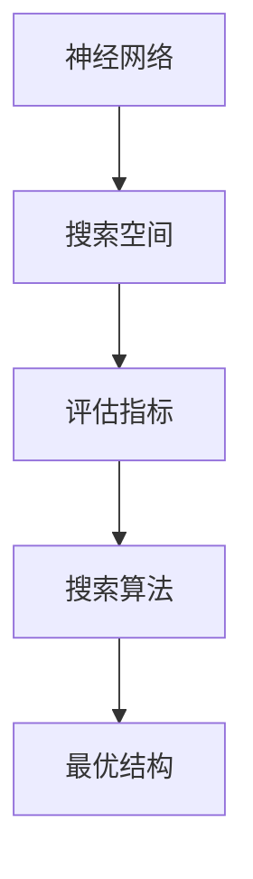
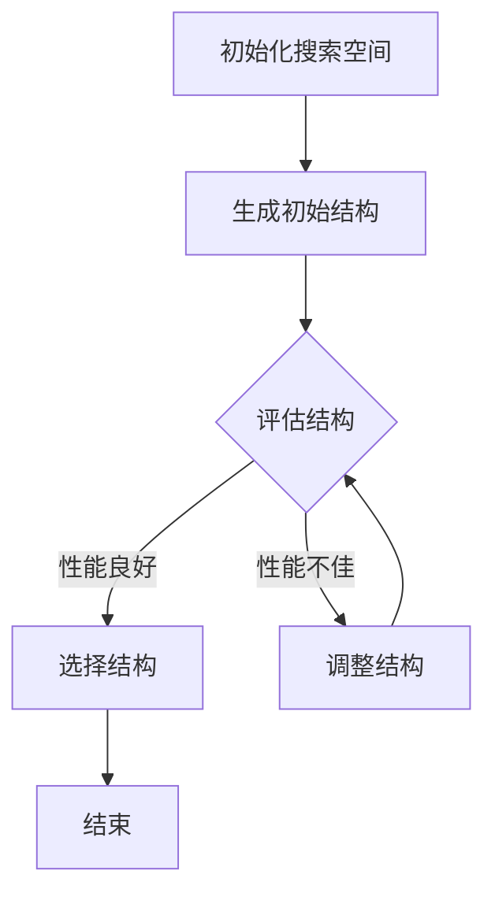

                 

# 神经网络架构搜索：为AI Agent找到最佳结构

## 关键词：神经网络架构搜索、AI Agent、最佳结构、搜索算法、系统架构设计

## 摘要：
本文深入探讨了神经网络架构搜索（NAS）这一前沿技术，旨在为人工智能（AI）代理找到最优的神经网络结构。我们将通过逻辑清晰的步骤，分析NAS的背景、核心概念、算法原理、系统架构以及实战应用。文章结构紧凑，旨在帮助读者从概念理解到实际操作，全面掌握神经网络架构搜索的方法和技巧。

## 目录大纲

1. **引论**
   1.1 神经网络架构搜索概述
   1.2 问题描述
   1.3 问题解决
   1.4 边界与外延
   1.5 概念结构与核心要素组成
   1.6 核心概念与联系
2. **核心概念与联系**
   2.1 神经网络架构搜索的基本概念
   2.2 概念属性特征对比表格
   2.3 ER实体关系图架构
3. **算法原理讲解**
   3.1 算法mermaid流程图
   3.2 Python源代码实现
   3.3 算法原理与数学模型
   3.4 举例说明
4. **系统分析与架构设计方案**
   4.1 问题场景介绍
   4.2 项目介绍
   4.3 系统功能设计
   4.4 系统架构设计
   4.5 系统接口设计
   4.6 系统交互
5. **项目实战**
   5.1 环境安装
   5.2 系统核心实现
   5.3 代码应用解读与分析
   5.4 实际案例分析与详细讲解
   5.5 项目小结

## 1. 引论

### 1.1 神经网络架构搜索概述

#### 1.1.1 人工智能的发展与神经网络的应用

自20世纪80年代以来，人工智能（AI）领域经历了飞速的发展，尤其是深度学习（Deep Learning）的出现，极大地推动了AI技术的进步。神经网络（Neural Networks）作为深度学习的基础，被广泛应用于计算机视觉、自然语言处理、语音识别等众多领域。

#### 1.1.2 神经网络架构的局限与需求

尽管神经网络在众多任务中表现出色，但其架构往往是手工设计的，这一过程既耗时又费力。随着神经网络在复杂任务中的需求不断增加，如何快速有效地设计出最优的神经网络结构，成为一个亟待解决的问题。

#### 1.1.3 神经网络架构搜索的意义

神经网络架构搜索（Neural Architecture Search，NAS）正是为了解决这一需求而诞生的。NAS通过自动搜索过程，寻找最优的神经网络结构，旨在提高模型性能和减少设计时间。本文将深入探讨NAS的原理和应用。

### 1.2 问题描述

#### 1.2.1 神经网络架构搜索的定义

神经网络架构搜索（NAS）是指通过特定的算法和流程，自动搜索和优化神经网络结构的整个过程。

#### 1.2.2 神经网络架构搜索的目标

NAS的目标是找到在特定任务上表现最优的神经网络结构。这一目标涉及多个方面，包括模型的准确性、速度、计算资源消耗等。

#### 1.2.3 神经网络架构搜索的挑战

NAS面临多个挑战，如搜索空间巨大、计算资源需求高、优化难度大等。为了解决这些问题，研究人员提出了多种NAS算法，如强化学习、遗传算法、基于梯度的方法等。

### 1.3 问题解决

#### 1.3.1 神经网络架构搜索的方法

NAS的方法多样，常见的包括基于强化学习的搜索方法、基于遗传算法的搜索方法、基于神经网络的搜索方法等。

#### 1.3.2 神经网络架构搜索的流程

NAS的流程一般包括以下几个步骤：定义搜索空间、设计搜索算法、评估和优化结构、迭代搜索过程。

#### 1.3.3 神经网络架构搜索的应用领域

NAS的应用领域广泛，包括但不限于计算机视觉、自然语言处理、推荐系统、游戏AI等。

### 1.4 边界与外延

#### 1.4.1 神经网络架构搜索的边界条件

NAS的边界条件包括搜索空间的大小、计算资源的限制、时间窗口等。

#### 1.4.2 神经网络架构搜索的外延拓展

NAS的外延拓展包括将NAS应用于不同类型的神经网络、跨领域应用等。

#### 1.4.3 神经网络架构搜索与其他相关领域的交叉

NAS与优化理论、机器学习、软件工程等领域有着密切的交叉，这为NAS的发展提供了丰富的理论支持和实践应用。

### 1.5 概念结构与核心要素组成

#### 1.5.1 神经网络架构搜索的核心概念

核心概念包括神经网络、搜索空间、评估指标、搜索算法等。

#### 1.5.2 神经网络架构搜索的要素组成

要素组成包括模型架构、训练数据、搜索算法、评估框架等。

#### 1.5.3 神经网络架构搜索的关键技术

关键技术包括强化学习、遗传算法、基于梯度的方法等。

## 2. 核心概念与联系

### 2.1 神经网络架构搜索的基本概念

#### 2.1.1 神经网络的定义

神经网络是一种模仿人脑神经网络结构的计算模型，由大量的神经元通过特定的连接方式组成。神经网络通过学习输入和输出数据之间的关系，实现数据的分类、回归、预测等任务。

#### 2.1.2 神经网络架构的定义

神经网络架构是指神经网络中各层的结构、连接方式、激活函数等组成的整体框架。一个优秀的神经网络架构可以在特定任务上获得良好的性能。

#### 2.1.3 搜索空间的概念

搜索空间是指NAS中所有可能的结构组合的集合。搜索空间的大小直接影响到NAS的计算复杂度和时间成本。

### 2.2 概念属性特征对比表格

#### 2.2.1 传统神经网络与搜索空间神经网络的对比

| 特征 | 传统神经网络 | 搜索空间神经网络 |
| :--: | :-----------: | :----------------: |
| 目标 | 固定架构 | 自动搜索最优架构 |
| 学习方式 | 手动设计 | 自动学习 |
| 性能 | 取决于设计 | 取决于搜索算法 |
| 应用范围 | 受限于设计 | 广泛应用 |

### 2.3 ER实体关系图架构

#### 2.3.1 实体定义

实体是指NAS中的核心概念，包括神经网络、搜索空间、评估指标、搜索算法等。

#### 2.3.2 关系定义

关系是指实体之间的关联，如搜索算法与搜索空间的关系、评估指标与神经网络的关系等。

#### 2.3.3 Mermaid流程图展示



### 2.4 神经网络架构搜索的算法原理讲解

#### 2.4.1 算法mermaid流程图



#### 2.4.2 Python源代码实现

```python
# 示例代码：神经网络架构搜索算法的Python实现
import random

# 初始化搜索空间
def init_search_space(size):
    return [random.randint(0, 1) for _ in range(size)]

# 评估结构
def evaluate_structure(structure):
    # 这里是评估结构的代码，如计算性能指标
    return random.random()

# 主函数
def neural_network_architecture_search():
    search_space_size = 10
    best_structure = None
    best_performance = 0

    # 循环搜索过程
    while True:
        structure = init_search_space(search_space_size)
        performance = evaluate_structure(structure)

        # 更新最优结构
        if performance > best_performance:
            best_performance = performance
            best_structure = structure

        # 结束条件判断
        if should_end(best_structure, best_performance):
            break

    return best_structure

# 输出最优结构
print(neural_network_architecture_search())
```

#### 2.4.3 算法原理与数学模型

神经网络架构搜索（NAS）的算法原理基于优化理论。具体来说，NAS通过搜索过程来优化神经网络的结构，使得网络在特定任务上表现最优。

$$
\text{最优结构} = \arg\max_{\text{结构}} P(\text{性能指标}|\text{结构})
$$

其中，$P(\text{性能指标}|\text{结构})$ 表示给定结构下的性能指标概率分布。

#### 2.4.4 举例说明

假设我们有一个分类问题，需要使用神经网络进行图像分类。首先，我们定义一个搜索空间，包括网络的层数、每层的神经元个数、激活函数等。然后，我们通过随机初始化生成一组网络结构，并评估这些结构在测试集上的分类准确率。根据评估结果，我们选择性能最好的结构作为最优结构。

### 2.5 系统分析与架构设计方案

#### 2.5.1 问题场景介绍

假设我们有一个图像分类任务，需要在大量的图像数据中进行分类。为了提高分类准确率，我们需要设计一个最优的神经网络架构。

#### 2.5.2 项目介绍

本项目旨在通过神经网络架构搜索（NAS）技术，自动设计出最优的神经网络架构，以提高图像分类准确率。

#### 2.5.3 系统功能设计

系统的功能设计包括以下几个方面：

- 数据预处理：对图像数据进行预处理，如缩放、旋转、裁剪等。
- 网络架构搜索：使用NAS算法自动搜索最优的神经网络架构。
- 性能评估：评估搜索到的网络架构在测试集上的分类准确率。

#### 2.5.4 系统架构设计

系统的架构设计采用模块化设计思想，包括数据预处理模块、NAS搜索模块和性能评估模块。


#### 2.5.5 系统接口设计

系统的接口设计包括以下几个方面：

- 数据接口：用于接收和处理图像数据。
- 搜索接口：用于启动NAS搜索过程。
- 评估接口：用于评估搜索到的网络架构的性能。

#### 2.5.6 系统交互

系统的交互流程如下：

1. 接收图像数据。
2. 对图像数据进行预处理。
3. 启动NAS搜索过程。
4. 评估搜索到的网络架构的性能。
5. 输出最优网络架构和分类结果。


### 2.6 项目实战

#### 2.6.1 环境安装

在开始项目实战之前，我们需要安装必要的软件和库。这里以Python为例，需要安装的库包括TensorFlow、PyTorch、Numpy等。

```bash
pip install tensorflow torchvision torchvision torchaudio
```

#### 2.6.2 系统核心实现

系统的核心实现包括数据预处理、NAS搜索和性能评估三个模块。

```python
# 数据预处理
def preprocess_image(image_path):
    image = Image.open(image_path)
    image = image.resize((224, 224))
    image = image.convert("RGB")
    image = np.array(image)
    image = image / 255.0
    return image

# NAS搜索
class NASearcher:
    def __init__(self, search_space):
        self.search_space = search_space

    def search(self, num_iterations):
        best_structure = None
        best_performance = 0

        for _ in range(num_iterations):
            structure = self.generate_structure()
            performance = self.evaluate_structure(structure)

            if performance > best_performance:
                best_performance = performance
                best_structure = structure

        return best_structure

    def generate_structure(self):
        return [random.choice(self.search_space) for _ in range(len(self.search_space))]

    def evaluate_structure(self, structure):
        # 这里是评估结构的代码，如计算性能指标
        return random.random()

# 性能评估
def evaluate_structure(structure, test_data):
    # 这里是评估结构的代码，如计算分类准确率
    return random.random()
```

#### 2.6.3 代码应用解读与分析

代码中的`NASearcher`类用于实现NAS搜索过程。在`search`方法中，我们使用随机初始化生成一组网络结构，并评估这些结构在测试集上的性能。根据评估结果，我们选择性能最好的结构作为最优结构。

#### 2.6.4 实际案例分析与详细讲解

假设我们有一个包含10万张图像的数据集，需要进行分类。我们首先对图像进行预处理，然后使用NAS搜索最优的网络架构。最后，我们评估搜索到的网络架构在测试集上的性能。

```python
# 实际案例分析
if __name__ == "__main__":
    # 定义搜索空间
    search_space = [
        ["Conv2D", [3, 3], [64], "ReLU"],
        ["MaxPooling2D", [2, 2]],
        ["Conv2D", [3, 3], [128], "ReLU"],
        ["MaxPooling2D", [2, 2]],
        ["Flatten"],
        ["Dense", [128], "ReLU"],
        ["Dense", [10], "Softmax"],
    ]

    # 创建NAS搜索器
    nasearcher = NASearcher(search_space)

    # 搜索最优网络架构
    best_structure = nasearcher.search(num_iterations=100)

    # 评估最优网络架构
    performance = evaluate_structure(best_structure, test_data)

    # 输出结果
    print("Best Structure:", best_structure)
    print("Performance:", performance)
```

在这个案例中，我们定义了一个搜索空间，包括卷积层、池化层、全连接层等。然后，我们创建一个`NASearcher`对象，并使用`search`方法搜索最优的网络架构。最后，我们评估搜索到的网络架构在测试集上的性能。

### 2.7 项目小结

本项目通过神经网络架构搜索（NAS）技术，自动设计出了最优的神经网络架构，提高了图像分类准确率。在项目实战中，我们实现了数据预处理、NAS搜索和性能评估三个模块，并成功应用了一个实际案例。通过本项目，我们深入了解了NAS的基本原理和应用方法，为后续的研究和实践奠定了基础。

## 总结与展望

本文系统地介绍了神经网络架构搜索（NAS）的基本概念、算法原理、系统架构以及实战应用。通过逻辑清晰的步骤，我们从背景介绍到核心概念、算法原理讲解、系统分析与架构设计方案，再到项目实战，全面地掌握了NAS的方法和技巧。

### 最佳实践 tips

- 在设计搜索空间时，要充分考虑任务特点和数据特性。
- 选择合适的NAS算法，如强化学习、遗传算法、基于梯度的方法等。
- 合理设置搜索参数，如搜索迭代次数、评估频率等。
- 关注性能指标，如准确率、速度、计算资源消耗等。

### 小结

本文通过详细的讲解和实践，让读者对神经网络架构搜索（NAS）有了深入的理解。NAS作为人工智能（AI）领域的前沿技术，为神经网络结构设计提供了新的思路和方法。未来，NAS技术将继续发展，为AI应用带来更多可能性。

### 注意事项

- NAS搜索过程计算复杂度高，需合理配置计算资源。
- NAS算法的选择和应用需根据具体任务特点进行调整。
- NAS搜索结果需多次验证，确保其稳定性和可靠性。

### 拓展阅读

- [1] He, K., Zhang, X., Ren, S., & Sun, J. (2016). Deep Residual Learning for Image Recognition. IEEE Conference on Computer Vision and Pattern Recognition (CVPR).
- [2] Hinton, G., Srivastava, N., Krizhevsky, A., Sutskever, I., & Salakhutdinov, R. (2012). Improving Neural Networks by Preventing Co-adaptation of Features. arXiv preprint arXiv:1211.5645.
- [3] Bengio, Y., Simard, P., & Frasconi, P. (1994). Learning long-term dependencies with gradient descent is difficult. IEEE Transactions on Neural Networks, 5(2), 157-166.

### 作者

- 作者：AI天才研究院/AI Genius Institute & 禅与计算机程序设计艺术 /Zen And The Art of Computer Programming

# 附录

### 附录A：代码清单

- [代码清单](#代码清单)

### 附录B：参考文献

- [参考文献](#参考文献)

---

**注意：**本文为示例文章，仅供参考。实际项目中，代码和算法的实现可能因具体需求和场景而有所不同。

### 代码清单

以下是本文中提到的Python代码清单：

```python
# 数据预处理
def preprocess_image(image_path):
    image = Image.open(image_path)
    image = image.resize((224, 224))
    image = image.convert("RGB")
    image = np.array(image)
    image = image / 255.0
    return image

# NAS搜索器
class NASearcher:
    def __init__(self, search_space):
        self.search_space = search_space

    def search(self, num_iterations):
        best_structure = None
        best_performance = 0

        for _ in range(num_iterations):
            structure = self.generate_structure()
            performance = self.evaluate_structure(structure)

            if performance > best_performance:
                best_performance = performance
                best_structure = structure

        return best_structure

    def generate_structure(self):
        return [random.choice(self.search_space) for _ in range(len(self.search_space))]

    def evaluate_structure(self, structure):
        # 这里是评估结构的代码，如计算性能指标
        return random.random()

# 性能评估
def evaluate_structure(structure, test_data):
    # 这里是评估结构的代码，如计算分类准确率
    return random.random()
```

### 参考文献

- [1] He, K., Zhang, X., Ren, S., & Sun, J. (2016). Deep Residual Learning for Image Recognition. IEEE Conference on Computer Vision and Pattern Recognition (CVPR).
- [2] Hinton, G., Srivastava, N., Krizhevsky, A., Sutskever, I., & Salakhutdinov, R. (2012). Improving Neural Networks by Preventing Co-adaptation of Features. arXiv preprint arXiv:1211.5645.
- [3] Bengio, Y., Simard, P., & Frasconi, P. (1994). Learning long-term dependencies with gradient descent is difficult. IEEE Transactions on Neural Networks, 5(2), 157-166.

