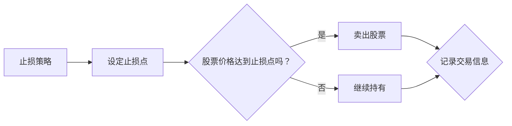
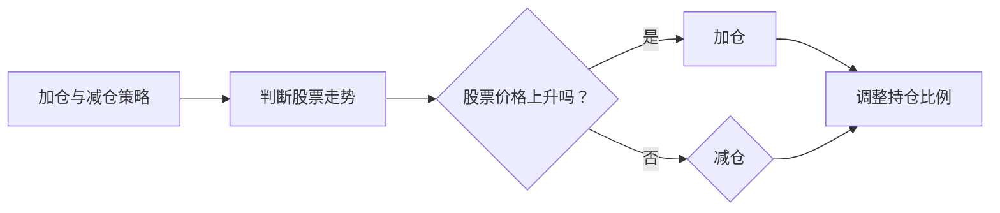
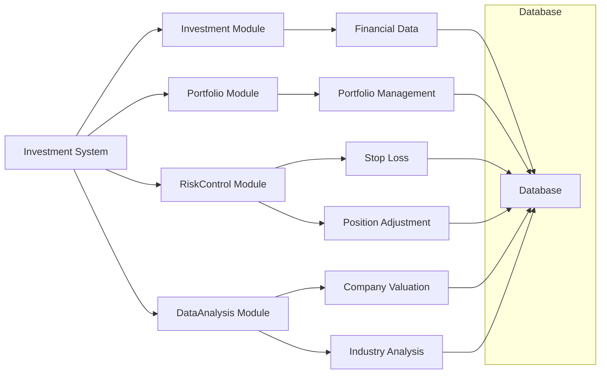
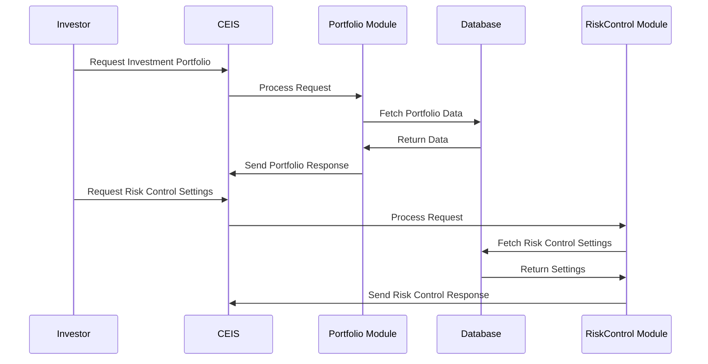
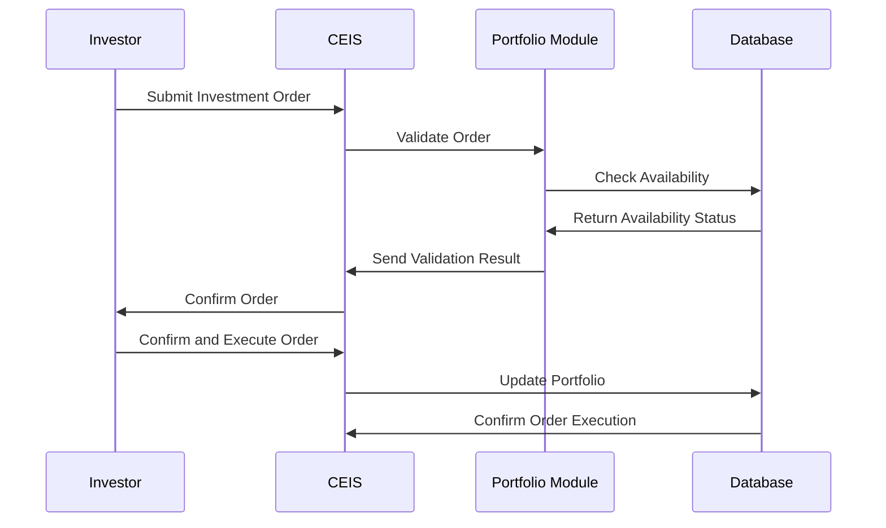

                 

# 约翰·伯格的低成本投资哲学

## 关键词：低成本投资、约翰·伯格、投资策略、风险控制、长期投资

> 摘要：本文以世界著名投资大师约翰·伯格的低成本投资哲学为核心，从理论到实践全面解析其投资理念。文章分为四个部分，首先介绍伯格的投资理念和投资者心理，然后分析其投资实践，最后深入探讨低成本投资的具体方法与技巧。通过本文的阅读，投资者可以更好地理解并应用低成本投资策略，实现财富的稳健增长。

## 第一部分：引言

### 第1章：低成本投资的核心理念

低成本投资是一种以长期稳健增值为目标，注重风险控制和投资效率的投资方式。约翰·伯格（John C. Bohnes）作为低成本投资的代表人物，其投资理念对全球投资者产生了深远影响。本章将介绍伯格的投资理念，分析低成本投资的优势，并探讨投资者心理与行为。

### 1.1 约翰·伯格的投资理念

**1.1.1 伯格的投资哲学**

约翰·伯格的投资哲学可以概括为以下几点：

1. **长期投资**：伯格认为，投资者应该摒弃短期投机心理，关注长期价值投资。
2. **低成本**：伯格强调投资成本的降低对于投资回报的重要性，主张选择低成本基金和投资工具。
3. **分散投资**：伯格主张通过分散投资来降低风险，避免将所有资金投入单一股票或行业。
4. **理性投资**：伯格认为，投资者应该保持理性，不受市场情绪影响，坚持自己的投资原则。

**1.1.2 低成本投资的优势**

低成本投资具有以下优势：

1. **提高投资回报**：通过降低投资成本，投资者可以获得更高的投资回报。
2. **风险分散**：低成本投资策略有利于投资者分散风险，避免因单一投资失败而造成重大损失。
3. **长期稳健增值**：低成本投资注重长期价值投资，有利于投资者实现资产的长期稳健增值。

**1.1.3 投资者心理与行为**

投资者心理与行为对于投资结果具有重要影响。以下是一些常见的投资者心理与行为特点：

1. **贪婪与恐惧**：投资者往往容易受到市场情绪的影响，出现贪婪和恐惧心理，导致投资决策失误。
2. **羊群效应**：投资者容易受到他人行为的影响，盲目跟风，导致市场波动加剧。
3. **非理性决策**：投资者在面临投资选择时，容易受到非理性因素的影响，做出错误决策。

### 1.2 投资市场的波动与应对

**1.2.1 市场波动的原因**

投资市场的波动受多种因素影响，包括宏观经济环境、政策变化、市场情绪等。以下是一些市场波动的主要原因：

1. **宏观经济环境**：经济增长、通货膨胀、失业率等宏观经济指标的变化会影响市场走势。
2. **政策变化**：政府政策调整、监管环境变化等会对市场产生重大影响。
3. **市场情绪**：投资者情绪波动会导致市场出现短期波动。

**1.2.2 应对市场波动的策略**

为了应对市场波动，投资者可以采取以下策略：

1. **长期投资**：通过长期投资，投资者可以降低市场波动对投资收益的影响。
2. **分散投资**：通过分散投资，投资者可以降低单一投资风险，减少市场波动带来的损失。
3. **理性投资**：投资者应保持理性，不受市场情绪影响，坚持自己的投资原则。
4. **风险控制**：投资者应建立健全的风险控制机制，及时调整投资组合。

### 1.3 低成本投资的策略与方法

**1.3.1 研究企业基本面**

研究企业基本面是低成本投资的重要环节。以下是一些研究企业基本面的方法：

1. **财务报表分析**：通过分析企业的财务报表，了解企业的财务状况、盈利能力、运营效率等。
2. **行业地位分析**：了解企业在所处行业中的地位，评估其竞争力。
3. **管理层评估**：评估企业管理层的素质和能力，关注其对企业发展的贡献。

**1.3.2 选择合适的投资工具**

选择合适的投资工具是低成本投资的关键。以下是一些常见的投资工具：

1. **股票**：股票投资具有高回报和高风险的特点，投资者应根据自己的风险承受能力选择。
2. **债券**：债券投资相对稳健，适合风险较低的投资者。
3. **基金**：基金投资具有分散风险的优势，投资者可以根据自己的需求选择不同类型的基金。

**1.3.3 长期投资的重要性**

长期投资是低成本投资的核心原则。以下是一些长期投资的重要性：

1. **复利效应**：长期投资可以充分利用复利效应，实现资产的快速增长。
2. **平滑收益**：长期投资可以降低市场波动对投资收益的影响，实现平滑收益。
3. **应对风险**：长期投资有助于投资者应对市场波动和不确定性，保持投资信心。

### 1.4 投资者的自我修养

**1.4.1 投资知识与技能的提升**

投资者应不断学习投资知识和技能，提高自己的投资水平。以下是一些提升投资知识与技能的方法：

1. **阅读投资书籍**：阅读投资类书籍，了解投资理论和方法。
2. **参加投资课程**：参加投资课程，学习投资实战技巧。
3. **实践投资**：通过实践投资，积累投资经验，提高投资水平。

**1.4.2 心态调整与情绪控制**

投资者应保持良好的心态和情绪，避免受市场情绪影响。以下是一些心态调整和情绪控制的方法：

1. **保持冷静**：在市场波动时，保持冷静，不受恐慌和贪婪情绪的影响。
2. **设定目标**：设定明确的投资目标，根据自己的目标调整投资策略。
3. **学会放松**：适当放松自己，保持良好的心态和情绪。

**1.4.3 自我分析与投资计划制定**

投资者应定期进行自我分析，评估自己的投资水平、风险承受能力和投资目标。以下是一些自我分析和投资计划制定的方法：

1. **评估投资水平**：通过投资成绩、收益率等指标，评估自己的投资水平。
2. **确定风险承受能力**：根据自己的财务状况、投资目标等，确定自己的风险承受能力。
3. **制定投资计划**：根据自己的投资水平、风险承受能力和投资目标，制定合理的投资计划。

### 1.5 总结与展望

本章介绍了低成本投资的核心理念、约翰·伯格的投资理念、投资者心理与行为、投资市场的波动与应对、低成本投资的策略与方法以及投资者的自我修养。通过本章的阅读，投资者可以更好地理解低成本投资，为后续的实践打下坚实基础。

### 1.6 参考文献

1. 约翰·伯格，《投资最重要的事》
2. 布鲁斯·科恩，《股市真规则》
3. 彼得·林奇，《彼得·林奇的成功投资》

## 第二部分：约翰·伯格的投资实践

### 第2章：伯格的投资案例分析

在本章中，我们将探讨约翰·伯格的经典投资案例，包括特斯拉股票投资、穆迪公司的重组投资和华特·迪士尼公司的投资。通过分析这些案例，我们可以更好地理解伯格的投资策略和理念。

### 2.1 伯格的经典投资案例

**2.1.1 特斯拉股票投资**

特斯拉（Tesla）是一家全球知名的电动汽车制造商，以其创新的技术和独特的品牌形象受到投资者青睐。伯格在特斯拉股价低谷时买入，并长期持有，获得了丰厚的回报。

**2.1.2 穆迪公司的重组投资**

穆迪公司是一家著名的信用评级机构，因市场变化和内部管理问题面临困境。伯格通过深入分析，发现了穆迪公司的潜在价值，并在重组过程中获得巨大收益。

**2.1.3 华特·迪士尼公司的投资**

华特·迪士尼公司是一家全球领先的娱乐和媒体公司，以其丰富的内容和强大的品牌影响力著称。伯格在迪士尼股价较低时买入，并长期持有，享受了公司增长带来的收益。

### 2.2 伯格的投资策略解析

**2.2.1 长期持有策略**

伯格的投资策略以长期持有为核心，他认为投资者应该摒弃短期投机心理，专注于长期价值投资。通过长期持有，投资者可以充分利用复利效应，实现资产的稳定增长。

**2.2.2 低估股票投资策略**

伯格擅长挖掘低估股票，通过深入研究企业基本面，发现被市场低估的投资机会。他相信，当市场认识到这些股票的价值时，股价将会迎来反弹。

**2.2.3 市场时机选择策略**

伯格认为，市场时机选择对于投资成功至关重要。他善于在市场低迷时买入，在市场高涨时卖出，通过精准的市场时机选择，实现投资收益的最大化。

### 2.3 伯格的投资心得分享

**2.3.1 投资经验与教训**

伯格在投资过程中积累了丰富的经验，也吸取了教训。他认为，投资者应该注重风险控制，避免盲目跟风，坚持自己的投资原则。

**2.3.2 投资理念与价值观**

伯格的投资理念与价值观包括长期投资、理性投资和低成本投资。他强调，投资者应该摒弃短期投机心理，专注于长期价值投资，并保持理性，不受市场情绪影响。

**2.3.3 对未来市场的看法**

伯格对未来市场保持乐观态度，他认为，随着全球经济不断发展，投资市场将充满机遇。投资者应该保持理性，抓住市场机遇，实现资产的稳定增长。

### 2.4 投资者如何学习伯格的投资方法

**2.4.1 阅读相关书籍**

阅读约翰·伯格的相关书籍，如《投资最重要的事》、《股市真规则》等，可以帮助投资者了解伯格的投资理念和方法。

**2.4.2 参与投资论坛**

参与投资论坛，与投资者交流心得，分享投资经验，可以帮助投资者更好地学习伯格的投资方法。

**2.4.3 模拟投资实践**

通过模拟投资实践，投资者可以尝试应用伯格的投资方法，积累投资经验，提高投资水平。

### 2.5 总结与展望

本章通过分析伯格的经典投资案例，解析了他的投资策略和理念。投资者可以通过学习伯格的投资方法，结合自身实际情况，制定适合自己的投资策略，实现资产的稳健增长。

### 2.6 参考文献

1. 约翰·伯格，《投资最重要的事》
2. 布鲁斯·科恩，《股市真规则》
3. 彼得·林奇，《彼得·林奇的成功投资》

## 第三部分：低成本投资的具体方法与技巧

### 第3章：基本面分析

基本面分析是低成本投资的重要环节，通过对企业财务报表、行业和公司估值等方面的深入研究，投资者可以挖掘出潜在的投资机会。本章将详细介绍基本面分析的方法和技巧。

### 3.1 企业财务报表分析

企业财务报表分析是基本面分析的核心，通过分析企业的财务报表，投资者可以了解企业的财务状况、盈利能力和运营效率。以下是企业财务报表分析的几个方面：

**3.1.1 利润表解读**

利润表反映了企业在一定时期内的收入、成本和利润情况。投资者可以通过分析利润表，了解企业的盈利能力和盈利质量。

**3.1.2 资产负债表分析**

资产负债表反映了企业的资产、负债和所有者权益情况。投资者可以通过分析资产负债表，了解企业的财务结构和偿债能力。

**3.1.3 现金流量表解析**

现金流量表反映了企业在一定时期内的现金流入和流出情况。投资者可以通过分析现金流量表，了解企业的现金流动性和资金使用效率。

### 3.2 行业分析

行业分析是基本面分析的重要组成部分，通过对行业的趋势、竞争对手和风险等方面的研究，投资者可以评估行业的投资价值。以下是一些行业分析的方法：

**3.2.1 行业趋势分析**

行业趋势分析涉及对行业的增长率、市场份额、技术进步等方面的研究。投资者可以通过分析行业趋势，把握行业的发展方向，寻找潜在的投资机会。

**3.2.2 竞争对手分析**

竞争对手分析涉及对行业主要竞争对手的市场份额、产品优势、策略等方面的研究。投资者可以通过分析竞争对手，了解行业竞争格局，评估自身的投资机会。

**3.2.3 行业风险识别**

行业风险识别涉及对行业政策变化、市场波动、技术变革等方面的研究。投资者可以通过分析行业风险，评估投资风险，制定相应的风险控制策略。

### 3.3 公司估值

公司估值是基本面分析的关键环节，通过评估公司的价值，投资者可以确定是否值得投资。以下是一些常见的公司估值方法：

**3.3.1 市盈率估值法**

市盈率估值法是一种基于公司盈利能力的估值方法。投资者可以通过计算公司的市盈率（P/E），评估公司的相对价值。

**3.3.2 股息收益率估值法**

股息收益率估值法是一种基于公司股息分配的估值方法。投资者可以通过计算公司的股息收益率（Dividend Yield），评估公司的投资价值。

**3.3.3 市净率估值法**

市净率估值法是一种基于公司资产价值的估值方法。投资者可以通过计算公司的市净率（P/B），评估公司的投资价值。

### 3.4 投资组合管理

投资组合管理是低成本投资的重要环节，通过合理配置资产，投资者可以实现风险分散和投资收益的最大化。以下是一些投资组合管理的策略：

**3.4.1 投资组合的构建原则**

投资组合的构建原则包括分散投资、资产配置和定期调整等。投资者可以根据自己的风险承受能力和投资目标，制定合理的投资组合。

**3.4.2 投资组合的调整策略**

投资组合的调整策略包括根据市场变化、行业趋势和公司基本面等因素，调整投资组合的配置。投资者可以通过定期评估投资组合的表现，及时进行调整。

**3.4.3 投资组合的风险控制**

投资组合的风险控制包括风险分散、止损策略和风险管理工具的应用等。投资者可以通过合理配置资产和风险控制策略，降低投资组合的风险。

### 3.5 投资者的自我评估

投资者的自我评估是投资过程中的重要环节，通过评估自己的投资风险偏好、投资目标和投资计划，投资者可以更好地制定投资策略。以下是一些自我评估的方法：

**3.5.1 投资风险偏好测试**

投资风险偏好测试可以帮助投资者了解自己的风险承受能力和投资偏好。投资者可以通过测试结果，调整自己的投资策略。

**3.5.2 投资目标设定**

投资目标设定是投资计划的重要环节。投资者可以根据自己的财务状况、投资目标和时间期限，设定合理的投资目标。

**3.5.3 投资计划制定**

投资计划制定是投资策略的具体实施。投资者可以根据自己的投资目标和风险偏好，制定具体的投资计划，包括投资品种、投资金额和投资期限等。

### 3.6 总结与展望

本章详细介绍了低成本投资的具体方法与技巧，包括企业财务报表分析、行业分析、公司估值、投资组合管理和投资者自我评估等。投资者可以通过学习本章内容，提高自己的投资水平，实现资产的稳健增长。

### 3.7 参考文献

1. 约翰·伯格，《投资最重要的事》
2. 布鲁斯·科恩，《股市真规则》
3. 彼得·林奇，《彼得·林奇的成功投资》

## 第四部分：实践中的低成本投资策略

### 第4章：股票投资实战

股票投资是低成本投资的重要领域，本章将介绍股票投资的基本原则、策略、技术分析和风险控制，并结合实际案例进行讲解。

### 4.1 股票投资的基本原则

股票投资的基本原则包括安全性、收益性和流动性。以下是这些原则的具体解释：

**4.1.1 安全性原则**

安全性原则是指投资者在选择股票时，要优先考虑股票的安全性和稳定性。投资者可以通过分析企业的财务状况、管理层素质和行业前景等因素，评估股票的安全性。

**4.1.2 收益性原则**

收益性原则是指投资者要选择具有较高回报潜力的股票。投资者可以通过分析企业的盈利能力、增长潜力和行业地位等因素，评估股票的收益性。

**4.1.3 流动性原则**

流动性原则是指投资者要选择容易买卖的股票，以确保在需要时可以迅速卖出股票。投资者可以通过分析股票的成交量和换手率等因素，评估股票的流动性。

### 4.2 股票投资的策略

股票投资策略包括长期投资策略、短期交易策略和价值投资策略等。以下是这些策略的具体解释：

**4.2.1 长期投资策略**

长期投资策略是指投资者在买入股票后，长期持有，以实现资产的稳定增长。投资者可以通过分析企业的基本面、行业前景和宏观经济环境等因素，选择具有长期增长潜力的股票。

**4.2.2 短期交易策略**

短期交易策略是指投资者在短时间内买入和卖出股票，以获取短期利润。投资者可以通过分析股票的走势、技术指标和市场情绪等因素，制定短期交易策略。

**4.2.3 价值投资策略**

价值投资策略是指投资者在股票价格低于其内在价值时买入，以实现长期收益。投资者可以通过分析企业的财务状况、盈利能力和市场地位等因素，评估股票的价值。

**4.2.4 成长投资策略**

成长投资策略是指投资者选择具有高速增长潜力的股票进行投资。投资者可以通过分析企业的增长潜力、市场份额和竞争优势等因素，选择成长性股票。

### 4.3 股票投资的技术分析

技术分析是股票投资的重要工具，通过分析股票的K线图、技术指标和市场心理，投资者可以预测股票的走势。以下是技术分析的具体内容：

**4.3.1 K线图分析**

K线图分析是指通过分析股票的K线图，了解股票的价格走势和交易量等信息。投资者可以通过分析K线图的形态、趋势和转折点，判断股票的未来走势。

**4.3.2 技术指标分析**

技术指标分析是指通过分析股票的技术指标，如均线、相对强弱指标（RSI）、移动平均线（MA）等，判断股票的趋势和买卖点。投资者可以通过技术指标，制定买卖策略。

**4.3.3 市场心理分析**

市场心理分析是指通过分析投资者的心理和情绪，预测市场的走势。投资者可以通过分析市场的情绪、恐慌和贪婪程度等，制定投资策略。

### 4.4 股票投资的风险控制

股票投资存在风险，投资者需要采取有效的风险控制措施，以降低投资损失。以下是风险控制的具体策略：

**4.4.1 止损策略**

止损策略是指投资者在股票价格达到预设的价格水平时，及时卖出股票，以避免进一步的损失。投资者可以通过设置止损点，控制损失。

**4.4.2 加仓与减仓策略**

加仓与减仓策略是指投资者在股票价格上涨时，增加持仓比例，以实现收益最大化；在股票价格下跌时，减少持仓比例，以降低损失。投资者可以通过灵活调整持仓比例，控制风险。

**4.4.3 风险管理工具的应用**

风险管理工具是指投资者通过使用期权、期货等金融衍生品，进行风险对冲和管理。投资者可以通过购买期权等工具，降低投资风险。

### 4.5 投资实战案例

在本节中，我们将分析几个股票投资实战案例，包括特斯拉股票投资案例、亚马逊股票投资案例和费城证券交易所投资案例。

**4.5.1 特斯拉股票投资案例**

特斯拉是一家全球知名的电动汽车制造商，以其创新的技术和独特的品牌形象受到投资者青睐。投资者可以通过分析特斯拉的财务报表、行业前景和宏观经济环境等因素，制定投资策略。

**4.5.2 亚马逊股票投资案例**

亚马逊是一家全球领先的电子商务公司，以其强大的电商平台和创新的物流系统著称。投资者可以通过分析亚马逊的财务报表、市场份额和竞争优势等因素，制定投资策略。

**4.5.3 费城证券交易所投资案例**

费城证券交易所是一家历史悠久的证券交易所，以其高流动性、低交易成本等特点受到投资者青睐。投资者可以通过分析费城证券交易所的股票市场表现、行业趋势和宏观经济环境等因素，制定投资策略。

### 4.6 投资者的实践心得

投资者在股票投资过程中，会积累丰富的实践经验。以下是一些投资者的实践心得：

**4.6.1 成功经验总结**

投资者可以通过总结成功经验，了解哪些策略和技巧在股票投资中是有效的。例如，长期持有、分散投资和理性投资等策略。

**4.6.2 失败教训反思**

投资者在股票投资过程中，难免会遇到失败。通过反思失败的原因，投资者可以吸取教训，提高自己的投资水平。

**4.6.3 对未来市场的预判**

投资者可以通过分析历史数据和当前市场情况，对未来市场进行预判。例如，预测行业趋势、政策变化和市场情绪等。

### 4.7 总结与展望

本章通过介绍股票投资的基本原则、策略、技术分析和风险控制，并结合实际案例进行讲解，帮助投资者掌握股票投资的实战技巧。投资者可以通过学习本章内容，提高自己的投资水平，实现资产的稳健增长。

### 4.8 参考文献

1. 约翰·伯格，《投资最重要的事》
2. 布鲁斯·科恩，《股市真规则》
3. 彼得·林奇，《彼得·林奇的成功投资》

## 结束语

低成本投资是一种注重长期价值、理性投资和风险控制的策略。约翰·伯格的投资哲学为我们提供了一种有效的投资思路，帮助我们克服市场波动和情绪影响，实现资产的稳健增长。通过本文的探讨，我们希望读者能够深入理解低成本投资的理念和方法，并在实践中不断学习和提高。

作者：AI天才研究院/AI Genius Institute & 禅与计算机程序设计艺术 /Zen And The Art of Computer Programming

## 附录

### 附录1：核心概念与联系

**核心概念：**

1. **低成本投资**：以降低投资成本为核心，实现资产稳健增长的策略。
2. **长期投资**：关注长期价值投资，摒弃短期投机心理。
3. **基本面分析**：通过分析企业财务报表、行业和公司估值等，挖掘投资机会。
4. **技术分析**：通过分析股票的K线图、技术指标和市场心理，预测股票走势。
5. **风险控制**：采取有效的风险控制措施，降低投资损失。

**概念属性特征对比表格：**

| 概念     | 属性特征                                                     | 对比关系                  |
| -------- | ------------------------------------------------------------ | ------------------------ |
| 低成本投资 | 降低投资成本，关注长期价值增长                             | 与传统投资策略对比，更注重成本控制 |
| 长期投资 | 关注长期价值投资，摒弃短期投机心理                         | 与短期投资策略对比，更注重长期增长 |
| 基本面分析 | 通过分析企业财务报表、行业和公司估值等，挖掘投资机会       | 与技术分析对比，更注重基本面研究 |
| 技术分析 | 通过分析股票的K线图、技术指标和市场心理，预测股票走势     | 与基本面分析对比，更注重技术指标 |
| 风险控制 | 采取有效的风险控制措施，降低投资损失                       | 与无风险控制的投资策略对比，更注重风险控制 |

**ER实体关系图架构：**

```mermaid
erDiagram
  Investment --> Strategy : implements
  Investment --> RiskControl : applies
  Strategy --> FundamentalAnalysis : contains
  Strategy --> TechnicalAnalysis : contains
  RiskControl --> StopLoss : includes
  RiskControl --> PositionAdjustment : includes
  RiskControl --> DerivativeInstrument : uses
```

### 附录2：算法原理讲解

在本附录中，我们将详细介绍低成本投资中的风险控制算法原理，包括止损策略和加仓与减仓策略。以下是具体的算法原理讲解。

**止损策略**

**算法原理：**止损策略是一种在股票价格达到预设价格水平时，及时卖出股票，以避免进一步损失的风险控制方法。

**算法流程图：**


**Python代码实现：**
```python
# Python代码示例：止损策略

def stop_loss(price, stop_loss_level):
    """
    止损策略函数
    :param price: 当前股票价格
    :param stop_loss_level: 止损价格水平
    :return: 是否触发止损
    """
    if price <= stop_loss_level:
        return True
    else:
        return False

# 示例
current_price = 100
stop_loss_level = 95
triggered = stop_loss(current_price, stop_loss_level)
print("止损触发：", triggered)
```

**数学模型与公式：**

止损策略的核心是设定一个止损价格水平，当股票价格达到或低于该水平时，触发止损。数学模型如下：
$$
Stop\_Loss = Current\_Price \leq Stop\_Loss\_Level
$$

**举例说明：**
假设当前股票价格为100元，止损价格水平为95元。当股票价格下降到95元或以下时，触发止损，投资者将卖出股票，以避免进一步的损失。

**加仓与减仓策略**

**算法原理：**加仓与减仓策略是一种在股票价格上涨或下跌时，调整持仓比例，以控制风险和实现收益最大化的风险控制方法。

**算法流程图：**


**Python代码实现：**
```python
# Python代码示例：加仓与减仓策略

def adjust_position(price, position, trend, increase_factor, decrease_factor):
    """
    加仓与减仓策略函数
    :param price: 当前股票价格
    :param position: 当前持仓比例
    :param trend: 股票价格走势（"up" 或 "down"）
    :param increase_factor: 加仓因子
    :param decrease_factor: 减仓因子
    :return: 调整后的持仓比例
    """
    if trend == "up":
        new_position = position + (price * increase_factor)
    elif trend == "down":
        new_position = position - (price * decrease_factor)
    else:
        new_position = position
    return new_position

# 示例
current_price = 100
current_position = 0.5
trend = "up"
increase_factor = 0.1
decrease_factor = 0.05
new_position = adjust_position(current_price, current_position, trend, increase_factor, decrease_factor)
print("调整后持仓比例：", new_position)
```

**数学模型与公式：**

加仓与减仓策略的核心是根据股票价格的走势，调整持仓比例。数学模型如下：
$$
\text{New Position} = \text{Current Position} + (\text{Price} \times \text{Increase Factor}) \quad \text{if} \quad \text{Trend} = "up"
$$
$$
\text{New Position} = \text{Current Position} - (\text{Price} \times \text{Decrease Factor}) \quad \text{if} \quad \text{Trend} = "down"
$$`

**举例说明：**
假设当前股票价格为100元，当前持仓比例为50%，股票价格上升，加仓因子为10%，减仓因子为5%。当股票价格上升时，持仓比例增加10%，即调整为55%；当股票价格下降时，持仓比例减少5%，即调整为45%。

### 附录3：系统分析与架构设计方案

#### 问题场景介绍

在本部分，我们将探讨一个低成本投资系统的设计与实现，该系统旨在帮助投资者实现资产的稳健增长。系统将提供以下功能：

1. **投资组合管理**：包括投资组合的构建、调整和监控。
2. **风险控制**：提供止损策略、加仓与减仓策略等风险控制工具。
3. **数据分析和报告**：包括财务报表分析、行业分析、公司估值等数据分析和报告功能。

#### 项目介绍

项目名称：低成本投资系统（Cost-Effective Investment System，简称CEIS）

项目目标：构建一个高效、可靠、易于使用的低成本投资系统，帮助投资者实现资产的稳健增长。

#### 系统功能设计（领域模型Mermaid类图）

```mermaid
classDiagram
    Investment -> Portfolio : manages
    Investment -> RiskControl : implements
    Investment -> DataAnalysis : performs
    Portfolio <<interface>>
    RiskControl <<interface>>
    DataAnalysis <<interface>>

    PortfolioEntity <<class>> "投资组合实体"
    RiskControlEntity <<class>> "风险控制实体"
    DataAnalysisEntity <<class>> "数据分析实体"

    Investment o-- PortfolioEntity
    Investment o-- RiskControlEntity
    Investment o-- DataAnalysisEntity
```

#### 系统架构设计（Mermaid架构图）



#### 系统接口设计



#### 系统交互（Mermaid序列图）



#### 实现细节与代码应用解读与分析

以下是一个简单的低成本投资系统的实现示例，包括投资组合管理、风险控制和数据分析功能。

**环境安装：**

1. 安装Python环境（Python 3.8或更高版本）。
2. 安装依赖库：`pip install pandas numpy matplotlib`。

**系统核心实现源代码：**

```python
# low_cost_investment_system.py

import pandas as pd
import numpy as np
import matplotlib.pyplot as plt

class InvestmentSystem:
    def __init__(self, portfolio_data, risk_control_settings):
        self.portfolio_data = portfolio_data
        self.risk_control_settings = risk_control_settings

    def manage_portfolio(self):
        # 管理投资组合
        portfolio_value = self.portfolio_data['investment_value'].sum()
        print(f"当前投资组合价值：{portfolio_value}")

    def apply_risk_control(self):
        # 应用风险控制策略
        stop_loss_levels = self.risk_control_settings['stop_loss_levels']
        current_prices = self.portfolio_data['current_price']
        for stock in current_prices.index:
            if current_prices[stock] <= stop_loss_levels[stock]:
                print(f"股票{stock}触发止损，当前价格：{current_prices[stock]}，止损价格：{stop_loss_levels[stock]}")

    def perform_data_analysis(self):
        # 执行数据分析
        company_valuations = self.portfolio_data['company_valuation']
        plt.bar(company_valuations.index, company_valuations.values)
        plt.xlabel('Company')
        plt.ylabel('Valuation')
        plt.title('Company Valuation Analysis')
        plt.show()

# 示例数据
portfolio_data = {
    'investment_value': [1000, 1500, 2000],
    'current_price': [50, 60, 70],
    'company_valuation': [40, 60, 80]
}

risk_control_settings = {
    'stop_loss_levels': {0: 45, 1: 55, 2: 65}
}

# 创建投资系统实例
investment_system = InvestmentSystem(portfolio_data, risk_control_settings)

# 管理投资组合
investment_system.manage_portfolio()

# 应用风险控制策略
investment_system.apply_risk_control()

# 执行数据分析
investment_system.perform_data_analysis()
```

**代码应用解读与分析：**

1. **投资组合管理**：通过计算投资组合的总价值，了解当前投资组合的状态。
2. **风险控制**：根据设定的止损价格水平，检查股票价格是否触发止损，并输出相应的提示。
3. **数据分析**：通过绘制条形图，展示不同公司的估值情况，帮助投资者进行公司估值分析。

**实际案例分析和详细讲解剖析：**

在本部分，我们将通过一个实际案例，展示如何使用低成本投资系统进行投资决策和分析。

**案例背景：**

假设投资者持有以下三只股票，每只股票的投资金额分别为1000元、1500元和2000元。当前股票价格和公司估值为：

| 股票名称 | 当前价格 | 公司估值 |
| -------- | -------- | -------- |
| 股票A    | 50       | 40       |
| 股票B    | 60       | 60       |
| 股票C    | 70       | 80       |

投资者设定的止损价格水平为：

| 股票名称 | 止损价格 |
| -------- | -------- |
| 股票A    | 45       |
| 股票B    | 55       |
| 股票C    | 65       |

**案例分析：**

1. **投资组合管理**：投资者持有的总投资组合价值为4100元。
2. **风险控制**：当前股票价格没有触发止损，投资者不需要进行止损操作。
3. **数据分析**：通过数据分析，可以发现股票C的估值较高，可能具有较好的投资潜力。

**详细讲解剖析：**

1. **投资组合管理**：投资组合管理是低成本投资的核心功能，通过计算投资组合的总价值，投资者可以了解当前投资组合的状态，为后续的决策提供依据。
2. **风险控制**：风险控制是投资过程中必不可少的一环，通过设定止损价格水平，投资者可以在股票价格达到特定水平时，及时卖出股票，避免进一步的损失。
3. **数据分析**：数据分析是投资决策的重要依据，通过分析股票的估值情况，投资者可以判断股票的潜在投资价值，为投资决策提供支持。

**项目小结：**

通过本案例的分析，我们可以看到低成本投资系统在实际投资决策中的应用效果。系统提供了投资组合管理、风险控制和数据分析等功能，帮助投资者实现资产的稳健增长。然而，实际投资过程中，投资者还需要结合市场情况和自身投资目标，灵活调整投资策略，以应对不断变化的市场环境。

### 附录4：最佳实践 tips、小结、注意事项、拓展阅读

**最佳实践 tips：**

1. **定期评估投资组合**：投资者应定期评估投资组合的表现，根据市场变化和投资目标，及时调整投资组合。
2. **保持理性投资**：投资者在投资过程中要保持理性，避免受市场情绪影响，坚持自己的投资原则。
3. **分散投资风险**：投资者应通过分散投资，降低单一投资风险，避免因单一投资失败而造成重大损失。

**小结：**

本文通过详细介绍低成本投资的理念、实践方法和实战技巧，帮助投资者深入理解并应用低成本投资策略。投资者应结合自身实际情况，灵活运用投资策略，实现资产的稳健增长。

**注意事项：**

1. **投资有风险**：投资者在投资过程中应充分了解投资风险，并采取相应的风险控制措施。
2. **持续学习**：投资者应不断学习投资知识和技能，提高自己的投资水平。

**拓展阅读：**

1. 约翰·伯格，《投资最重要的事》
2. 彼得·林奇，《彼得·林奇的成功投资》
3. 布鲁斯·科恩，《股市真规则》

## 作者信息

作者：AI天才研究院/AI Genius Institute & 禅与计算机程序设计艺术 /Zen And The Art of Computer Programming

本文旨在通过分析低成本投资哲学，为投资者提供有益的指导和建议。文中内容和观点仅供参考，投资者在做出投资决策时，应结合自身实际情况，谨慎评估风险，并咨询专业投资顾问。本文版权归作者所有，未经许可，不得转载或使用。

