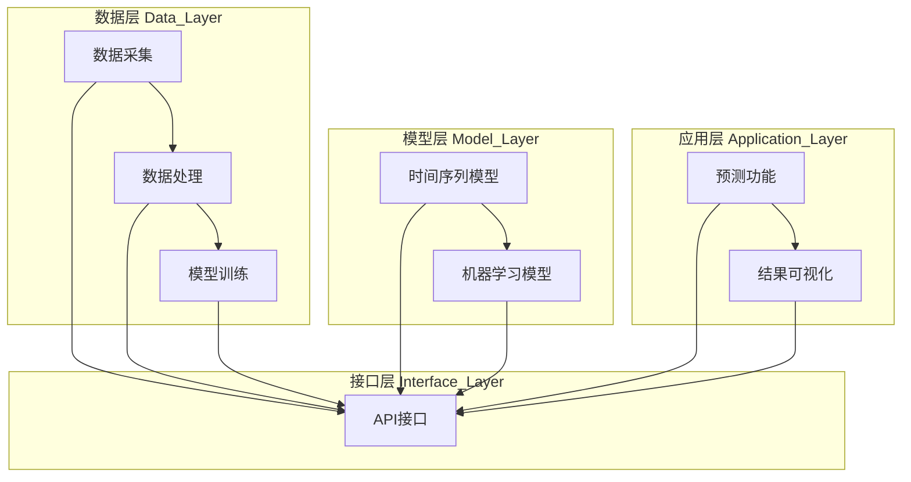
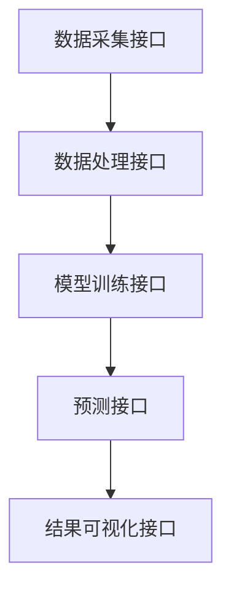
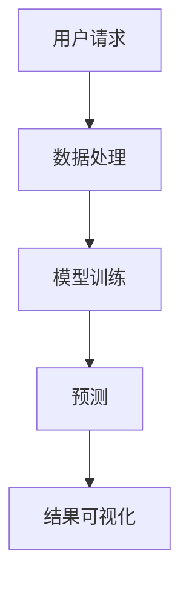

                 

### 第一部分：背景介绍

#### 第1章：问题背景

**1.1.1 问题背景**

在信息技术领域，尤其是金融科技和数据分析领域，市场预测技术一直是一个备受关注的话题。投资者、交易员以及金融机构都在寻找能够准确预测市场走势的方法，以期在投资决策中取得先机。然而，市场预测的复杂性以及不确定性使得这一领域充满了挑战。约翰·伯格在其著作《约翰·伯格的市场预测警告：为什么不应试图择时》中，针对市场预测这一主题，提出了一个具有颠覆性的观点：不应试图通过择时来获取超额收益。

**1.1.2 问题描述**

约翰·伯格所关注的问题是，尽管市场预测技术不断发展，但许多投资者依然试图通过择时来获取超额收益。择时策略的核心思想是预测市场的短期波动，并在市场上涨时买入，在市场下跌时卖出。然而，伯格通过大量数据和实际案例，指出这种策略在实际应用中存在许多局限性。

**1.1.3 问题解决**

伯格认为，问题的根本在于市场预测的不可靠性。市场的短期波动往往受到多种随机因素的影响，如宏观经济环境、政治事件、公司业绩等。这些因素的复杂性和不确定性使得市场预测成为一个高难度任务。因此，伯格主张投资者应该放弃试图通过择时来获取超额收益的想法，转而采用长期投资策略。

**1.1.4 边界与外延**

在讨论市场预测问题时，需要明确一些边界和范围。首先，市场预测主要涉及短期市场走势的预测，而不是长期市场趋势的分析。其次，市场预测的技术手段包括时间序列分析、机器学习算法、统计分析等。最后，市场预测的应用场景包括股票市场、外汇市场、债券市场等。

**1.1.5 概念结构与核心要素组成**

为了深入理解市场预测问题，我们需要明确一些关键概念和要素。这些概念包括：

- **市场波动性**：市场价格的波动程度，通常用标准差等统计指标来衡量。
- **择时策略**：一种投资策略，旨在通过预测市场短期波动来获得超额收益。
- **市场预测**：对未来市场走势的预测，通常基于历史数据和统计分析。
- **随机漫步理论**：一种市场理论，认为股票价格的变动是随机的，无法通过预测来获取超额收益。

约翰·伯格在书中通过详细的数据分析和逻辑推理，探讨了这些概念之间的关系，并提出了自己的观点。他认为，市场预测的不可靠性使得择时策略在实际应用中难以成功，投资者应该更注重长期投资策略，而不是试图通过预测来获取短期收益。

#### 第2章：作者观点

**2.1.1 作者的主要观点**

约翰·伯格是著名的投资家和学者，他在《约翰·伯格的市场预测警告：为什么不应试图择时》一书中，提出了一系列关于市场预测和投资的深刻见解。他的主要观点可以概括为以下几点：

1. **市场预测的局限性**：伯格认为，市场预测的准确性受到多种因素的影响，包括随机性、复杂性和不确定性。这些因素使得市场预测成为一个高风险、低回报的行为。

2. **择时策略的不可行性**：伯格指出，尽管许多投资者试图通过择时来获取超额收益，但这种策略在实际应用中往往难以成功。择时策略依赖于市场预测的准确性，而市场预测的不可靠性使得择时策略的可信度大打折扣。

3. **长期投资的重要性**：伯格主张，投资者应该放弃试图通过择时来获取超额收益的想法，转而采用长期投资策略。长期投资可以降低风险，提高收益稳定性，是更为合理和可行的投资策略。

**2.1.2 作者的理论基础**

伯格的理论基础主要来源于随机漫步理论和现代投资组合理论。随机漫步理论认为，股票价格的变动是随机的，无法通过预测来获取超额收益。现代投资组合理论则强调，投资者应该通过分散投资来降低风险，并追求风险调整后的最大收益。

伯格结合这些理论基础，对市场预测和投资策略进行了深入的剖析。他认为，市场预测的不可靠性和择时策略的不可行性，使得投资者应该放弃这些策略，转而采用长期投资策略。

**2.1.3 作者的研究方法**

伯格在书中使用了大量数据和实证研究来支持他的观点。他通过分析历史市场数据，比较了不同投资策略的收益和风险，从而得出结论。此外，他还引用了其他学者的研究成果，如彼得·伯恩斯坦等人的研究，来进一步证明他的观点。

伯格的研究方法严谨、逻辑清晰，使得他的观点具有很高的可信度。通过这些数据和实证研究，伯格成功地向读者展示了市场预测和择时策略的局限性，以及长期投资策略的优越性。

#### 第3章：书籍目的

**3.1.1 书籍的目的**

《约翰·伯格的市场预测警告：为什么不应试图择时》一书的主要目的是向投资者传达一个重要的信息：市场预测并不如人们想象的那么可靠，试图通过择时来获取超额收益往往是不切实际的。伯格希望通过这本书，帮助投资者树立正确的投资观念，摒弃错误的择时策略，转向更加稳健的长期投资策略。

**3.1.2 读者对象**

这本书的读者对象主要包括以下几类：

1. **投资者**：包括个人投资者和专业投资者，希望了解市场预测和投资的投资者。
2. **金融从业者**：包括金融分析师、基金经理、投资顾问等，需要了解市场预测和投资策略的从业者。
3. **学术界人士**：包括经济学者、管理学者等，对市场预测和投资理论感兴趣的研究者。

伯格希望通过这本书，能够为这些读者提供有价值的见解和建议，帮助他们更好地理解和应对市场预测和投资中的挑战。

**3.1.3 书籍结构安排**

本书分为四个主要部分，分别讨论了市场预测、择时策略、长期投资以及相关案例分析。

- **第一部分：市场预测**：介绍了市场预测的基本概念、方法和技术，以及市场预测的局限性和挑战。
- **第二部分：择时策略**：分析了择时策略的原理、应用和局限性，探讨了为什么择时策略在实际中往往难以成功。
- **第三部分：长期投资**：介绍了长期投资策略的优点、实施方法和注意事项，提供了实际案例和经验分享。
- **第四部分：相关案例分析**：通过具体案例，展示了市场预测和投资策略在实际应用中的效果，进一步验证了伯格的观点。

这种结构安排使得读者可以系统地了解市场预测和投资策略，从理论到实践，全面掌握相关知识和技能。

#### 第4章：为何不应试图择时

**4.1.1 市场波动性的挑战**

市场波动性是市场预测中的一个重要概念，它指的是市场价格的波动程度。市场波动性受到多种因素的影响，包括宏观经济环境、公司业绩、政治事件、市场情绪等。这些因素相互作用，使得市场波动性具有高度不确定性和不可预测性。

约翰·伯格指出，市场波动性的挑战在于其不可预测性。尽管投资者可以尝试使用各种市场预测方法和技术来预测市场走势，但这些方法往往无法准确预测市场的短期波动。因此，试图通过择时来获取超额收益的做法实际上是非常冒险的。

**4.1.2 择时策略的局限性**

择时策略的核心思想是预测市场的短期波动，并在市场上涨时买入，在市场下跌时卖出。然而，伯格通过大量数据和实际案例指出，择时策略在实际应用中存在许多局限性。

首先，市场波动具有高度随机性。股票价格的变动受到多种随机因素的影响，如投资者情绪、突发事件等。这些因素使得市场波动难以预测，从而增加了择时策略的风险。

其次，择时策略需要投资者具备极高的预测能力。投资者需要准确预测市场的短期走势，以便在市场上涨时买入，在市场下跌时卖出。然而，市场预测的准确性往往受到多种因素的限制，如数据质量、模型选择、计算能力等。因此，投资者很难具备足够的预测能力来实施有效的择时策略。

最后，择时策略的收益与风险并存。尽管择时策略可能在短期内带来较高的收益，但同时也增加了投资风险。市场波动性越大，择时策略的风险也越高。如果投资者在市场下跌时未能及时卖出，可能会遭受重大损失。

**4.1.3 预测的不可靠性**

伯格在书中强调了市场预测的不可靠性。市场预测的准确性受到多种因素的制约，包括数据质量、模型选择、计算能力等。即使是最先进的预测方法和技术，也无法保证100%的准确性。

首先，数据质量是市场预测的基础。市场预测依赖于历史数据，而历史数据往往存在噪声和缺失。这些噪声和缺失会影响预测结果的准确性，使得市场预测难以达到预期效果。

其次，模型选择也是影响市场预测准确性的关键因素。市场预测需要选择合适的预测模型，如时间序列模型、机器学习模型等。然而，不同的模型适用于不同的数据类型和预测目标，选择不当的模型可能导致预测结果不准确。

最后，计算能力也是市场预测的重要制约因素。市场预测需要处理大量数据，并运行复杂的计算算法。如果计算能力不足，可能导致预测过程缓慢，影响预测结果的准确性。

**4.1.4 应对策略与建议**

面对市场预测的不可靠性，伯格提出了一系列应对策略和建议，帮助投资者更好地应对市场波动和择时策略的局限性。

首先，投资者应该摒弃试图通过择时来获取超额收益的想法。市场预测的不可靠性使得择时策略在实际应用中难以成功。投资者应该更加关注长期投资策略，通过分散投资、降低风险来获取稳健的收益。

其次，投资者应该注重风险管理和资产配置。投资者可以通过分散投资来降低单一投资的风险，并合理配置资产，以达到风险与收益的平衡。

此外，投资者应该保持理性投资态度，避免受到市场情绪和恐慌的影响。市场波动是正常现象，投资者应该保持冷静，理性看待市场变化，避免盲目跟风和恐慌性交易。

最后，投资者可以借助专业的投资顾问和工具，提高投资决策的准确性和有效性。投资顾问可以提供专业的市场分析和投资建议，帮助投资者更好地应对市场波动和风险。

通过以上策略和建议，投资者可以更好地应对市场预测的不可靠性，实现长期稳健的投资收益。

### 第一部分小结

在本部分中，我们介绍了《约翰·伯格的市场预测警告：为什么不应试图择时》一书的背景、作者观点以及书籍目的。通过探讨市场波动性、择时策略和预测的不可靠性，我们了解了市场预测的复杂性和挑战性。伯格通过详细的数据分析和实证研究，提出了一系列应对策略和建议，帮助投资者更好地应对市场波动和择时策略的局限性。接下来，我们将进一步深入探讨市场预测的相关概念和算法原理，为读者提供更全面的技术视角。

## 第二部分：核心概念与联系

在深入探讨市场预测之前，我们需要明确一些核心概念，并探讨它们之间的关系。这些概念包括市场波动性、时间序列分析、机器学习、随机漫步理论等。通过理解这些概念及其相互联系，我们可以更好地把握市场预测的本质和复杂性。

### 1. 市场波动性

市场波动性是市场预测中一个重要的概念，它描述了市场价格的波动程度。波动性通常用标准差、方差等统计指标来衡量。市场波动性受多种因素影响，包括宏观经济环境、公司业绩、政治事件、市场情绪等。

- **标准差**：标准差是衡量数据离散程度的常用指标。在市场波动性中，标准差用于衡量市场价格的波动程度。标准差越大，市场波动性越强。
  
  $$\sigma = \sqrt{Var(X)}$$

  其中，$\sigma$ 表示标准差，$Var(X)$ 表示方差。

- **方差**：方差是标准差的平方，用于衡量数据的离散程度。在市场波动性中，方差也用于衡量市场价格的波动程度。

  $$Var(X) = E[(X - E[X])^2]$$

  其中，$E[X]$ 表示期望值。

### 2. 时间序列分析

时间序列分析是一种用于分析时间序列数据的统计方法。在市场预测中，时间序列分析被广泛用于研究市场价格的动态变化和趋势。时间序列分析的核心是建立合适的模型来描述市场价格的演变。

- **自回归模型（AR）**：自回归模型是一种用于描述时间序列数据线性相关性的模型。自回归模型的基本形式为：

  $$X_t = c + \sum_{i=1}^p \phi_i X_{t-i} + \varepsilon_t$$

  其中，$X_t$ 表示第 $t$ 期的市场价格，$\phi_i$ 表示自回归系数，$\varepsilon_t$ 表示误差项。

- **移动平均模型（MA）**：移动平均模型是一种用于描述时间序列数据平滑性的模型。移动平均模型的基本形式为：

  $$X_t = c + \sum_{i=1}^q \theta_i \varepsilon_{t-i}$$

  其中，$\theta_i$ 表示移动平均系数，$\varepsilon_t$ 表示误差项。

- **自回归移动平均模型（ARMA）**：自回归移动平均模型结合了自回归模型和移动平均模型的特点，用于描述时间序列数据的线性相关性和平滑性。自回归移动平均模型的基本形式为：

  $$X_t = c + \sum_{i=1}^p \phi_i X_{t-i} + \sum_{j=1}^q \theta_j \varepsilon_{t-j} + \varepsilon_t$$

### 3. 机器学习

机器学习是市场预测中的一个重要工具，通过构建合适的模型来捕捉市场价格的复杂动态。机器学习模型可以分为监督学习、无监督学习和强化学习三类。

- **监督学习**：监督学习是一种有标注数据训练模型的方法，常用于分类和回归任务。在市场预测中，监督学习模型可以用于预测市场价格的走势。

  $$Y_t = f(X_t; \theta)$$

  其中，$Y_t$ 表示市场价格的预测值，$X_t$ 表示输入特征，$\theta$ 表示模型参数。

- **无监督学习**：无监督学习是一种无标注数据训练模型的方法，常用于聚类和降维任务。在市场预测中，无监督学习模型可以用于分析市场价格的数据结构。

  $$Z_t = g(X_t; \theta)$$

  其中，$Z_t$ 表示市场价格的数据结构，$X_t$ 表示输入特征，$\theta$ 表示模型参数。

- **强化学习**：强化学习是一种基于奖励信号训练模型的方法，常用于序列决策问题。在市场预测中，强化学习模型可以用于模拟投资策略，优化投资组合。

  $$Q(s, a) = r(s, a, s') + \gamma \max_a' Q(s', a')$$

  其中，$Q(s, a)$ 表示状态 $s$ 下采取动作 $a$ 的价值函数，$r(s, a, s')$ 表示奖励信号，$\gamma$ 表示折扣因子。

### 4. 随机漫步理论

随机漫步理论是一种关于股票价格变动的市场理论，认为股票价格的变动是随机的，无法通过预测来获取超额收益。随机漫步理论的基本假设是：

- 股票价格的未来走势是独立的，不受历史价格的影响。
- 股票价格的变动是随机的，且符合正态分布。

随机漫步理论的核心公式是：

$$P(X_t = x_t) = \frac{1}{\sqrt{2\pi\sigma^2}} e^{-\frac{(x_t - \mu)^2}{2\sigma^2}}$$

其中，$X_t$ 表示股票价格的随机变量，$\mu$ 表示期望值，$\sigma$ 表示标准差。

### 5. 概念属性特征对比表格

为了更好地理解这些核心概念，我们提供了一个概念属性特征对比表格：

| 概念     | 描述                                           | 相关公式                                         | 适用场景                         |
| -------- | ---------------------------------------------- | ---------------------------------------------- | -------------------------------- |
| 市场波动性 | 描述市场价格波动程度                           | 标准差：$\sigma = \sqrt{Var(X)}$；方差：$Var(X) = E[(X - E[X])^2]$ | 股票市场、外汇市场、债券市场等 |
| 时间序列分析 | 分析时间序列数据的统计方法                     | 自回归模型：$X_t = c + \sum_{i=1}^p \phi_i X_{t-i} + \varepsilon_t$；移动平均模型：$X_t = c + \sum_{i=1}^q \theta_i \varepsilon_{t-i}$；自回归移动平均模型：$X_t = c + \sum_{i=1}^p \phi_i X_{t-i} + \sum_{j=1}^q \theta_j \varepsilon_{t-j} + \varepsilon_t$ | 股票市场、外汇市场、债券市场等 |
| 机器学习 | 基于数据训练模型的方法                         | 监督学习：$Y_t = f(X_t; \theta)$；无监督学习：$Z_t = g(X_t; \theta)$；强化学习：$Q(s, a) = r(s, a, s') + \gamma \max_a' Q(s', a')$ | 股票市场、外汇市场、债券市场等 |
| 随机漫步理论 | 认为股票价格变动是随机的                      | $P(X_t = x_t) = \frac{1}{\sqrt{2\pi\sigma^2}} e^{-\frac{(x_t - \mu)^2}{2\sigma^2}}$ | 股票市场、外汇市场、债券市场等 |

### 6. ER实体关系图架构

为了更好地理解这些概念之间的关系，我们使用Mermaid绘制了一个ER实体关系图：

```mermaid
erDiagram
  MarketVolatility ||--|{ TimeSeriesAnalysis }
  TimeSeriesAnalysis ||--|{ ARModel }
  TimeSeriesAnalysis ||--|{ MAModel }
  TimeSeriesAnalysis ||--|{ ARMAModel }
  MachineLearning ||--|{ SupervisedLearning }
  MachineLearning ||--|{ UnsupervisedLearning }
  MachineLearning ||--|{ ReinforcementLearning }
  RandomWalkTheory ||--|{ StockMarket }
  RandomWalkTheory ||--|{ ForeignExchangeMarket }
  RandomWalkTheory ||--|{ BondMarket }
```

在这个ER实体关系图中，市场波动性、时间序列分析、机器学习和随机漫步理论是核心实体，它们之间通过不同的关系连接。时间序列分析和机器学习是市场预测的重要工具，而市场波动性和随机漫步理论则是市场预测的基础。通过这个ER实体关系图，我们可以更好地理解这些概念之间的联系和相互作用。

### 7. 小结

在本部分中，我们介绍了市场预测中的核心概念，包括市场波动性、时间序列分析、机器学习和随机漫步理论。通过对比这些概念的特征和属性，我们了解了它们在市场预测中的重要作用。ER实体关系图进一步展示了这些概念之间的联系和相互作用。接下来，我们将深入探讨市场预测的算法原理，为读者提供更全面的技术视角。

## 第三部分：算法原理讲解

在理解了市场预测中的核心概念之后，我们接下来将深入探讨市场预测的算法原理。市场预测算法可以分为时间序列算法和机器学习算法两大类。在本节中，我们将详细讲解这些算法的基本原理，并通过Mermaid流程图展示算法的执行流程。

### 1. 时间序列算法

时间序列算法是基于历史数据来预测未来市场走势的方法。这些算法利用时间序列数据的规律性，通过建立合适的模型来预测未来值。时间序列算法主要包括自回归模型（AR）、移动平均模型（MA）和自回归移动平均模型（ARMA）。

#### 1.1 自回归模型（AR）

自回归模型是一种常用的时间序列预测算法，它假设当前值可以由前几个历史值来预测。自回归模型的基本原理是利用线性关系来建模时间序列数据。

- **基本原理**：

  自回归模型的基本公式为：

  $$X_t = c + \sum_{i=1}^p \phi_i X_{t-i} + \varepsilon_t$$

  其中，$X_t$ 表示第 $t$ 期的市场价格，$\phi_i$ 表示自回归系数，$\varepsilon_t$ 表示误差项。

- **执行流程**：

  使用自回归模型进行预测的执行流程如下：

  1. 收集历史市场数据。
  2. 计算自回归系数 $\phi_i$。
  3. 使用自回归模型预测未来市场走势。
  4. 输出预测结果。

  为了更清晰地展示自回归模型的执行流程，我们使用Mermaid流程图表示如下：

  ```mermaid
  flowchart LR
  A[收集历史市场数据] --> B[计算自回归系数]
  B --> C[使用自回归模型预测]
  C --> D[输出预测结果]
  ```

#### 1.2 移动平均模型（MA）

移动平均模型是一种通过计算最近若干期的平均值来预测未来值的方法。移动平均模型假设当前值可以由最近若干期的平均值来预测。

- **基本原理**：

  移动平均模型的基本公式为：

  $$X_t = c + \sum_{i=1}^q \theta_i \varepsilon_{t-i}$$

  其中，$X_t$ 表示第 $t$ 期的市场价格，$\theta_i$ 表示移动平均系数，$\varepsilon_t$ 表示误差项。

- **执行流程**：

  使用移动平均模型进行预测的执行流程如下：

  1. 收集历史市场数据。
  2. 计算移动平均系数 $\theta_i$。
  3. 使用移动平均模型预测未来市场走势。
  4. 输出预测结果。

  为了更清晰地展示移动平均模型的执行流程，我们使用Mermaid流程图表示如下：

  ```mermaid
  flowchart LR
  A[收集历史市场数据] --> B[计算移动平均系数]
  B --> C[使用移动平均模型预测]
  C --> D[输出预测结果]
  ```

#### 1.3 自回归移动平均模型（ARMA）

自回归移动平均模型是自回归模型和移动平均模型的结合体，它同时考虑了时间序列数据的线性相关性和平滑性。

- **基本原理**：

  自回归移动平均模型的基本公式为：

  $$X_t = c + \sum_{i=1}^p \phi_i X_{t-i} + \sum_{j=1}^q \theta_j \varepsilon_{t-j} + \varepsilon_t$$

  其中，$X_t$ 表示第 $t$ 期的市场价格，$\phi_i$ 表示自回归系数，$\theta_j$ 表示移动平均系数，$\varepsilon_t$ 表示误差项。

- **执行流程**：

  使用自回归移动平均模型进行预测的执行流程如下：

  1. 收集历史市场数据。
  2. 计算自回归系数 $\phi_i$ 和移动平均系数 $\theta_j$。
  3. 使用自回归移动平均模型预测未来市场走势。
  4. 输出预测结果。

  为了更清晰地展示自回归移动平均模型的执行流程，我们使用Mermaid流程图表示如下：

  ```mermaid
  flowchart LR
  A[收集历史市场数据] --> B[计算自回归系数]
  B --> C[计算移动平均系数]
  C --> D[使用自回归移动平均模型预测]
  D --> E[输出预测结果]
  ```

### 2. 机器学习算法

机器学习算法是另一种重要的市场预测工具，它通过学习历史数据中的规律，来预测未来的市场走势。机器学习算法可以分为监督学习、无监督学习和强化学习三大类。

#### 2.1 监督学习

监督学习是一种有标注数据训练模型的方法，它通过学习输入特征和标注值之间的关系，来预测新的输入特征对应的标注值。

- **基本原理**：

  监督学习的基本公式为：

  $$Y_t = f(X_t; \theta)$$

  其中，$Y_t$ 表示市场价格的预测值，$X_t$ 表示输入特征，$\theta$ 表示模型参数。

- **执行流程**：

  使用监督学习算法进行预测的执行流程如下：

  1. 收集历史市场数据，包括输入特征和标注值。
  2. 使用监督学习算法训练模型。
  3. 使用训练好的模型预测新的市场走势。
  4. 输出预测结果。

  为了更清晰地展示监督学习的执行流程，我们使用Mermaid流程图表示如下：

  ```mermaid
  flowchart LR
  A[收集历史市场数据] --> B[训练模型]
  B --> C[预测市场走势]
  C --> D[输出预测结果]
  ```

#### 2.2 无监督学习

无监督学习是一种无标注数据训练模型的方法，它通过学习数据中的内在结构，来揭示数据的分布和特征。

- **基本原理**：

  无监督学习的基本公式为：

  $$Z_t = g(X_t; \theta)$$

  其中，$Z_t$ 表示市场价格的数据结构，$X_t$ 表示输入特征，$\theta$ 表示模型参数。

- **执行流程**：

  使用无监督学习算法进行预测的执行流程如下：

  1. 收集历史市场数据。
  2. 使用无监督学习算法训练模型。
  3. 使用训练好的模型分析市场数据结构。
  4. 输出分析结果。

  为了更清晰地展示无监督学习的执行流程，我们使用Mermaid流程图表示如下：

  ```mermaid
  flowchart LR
  A[收集历史市场数据] --> B[训练模型]
  B --> C[分析市场数据结构]
  C --> D[输出分析结果]
  ```

#### 2.3 强化学习

强化学习是一种基于奖励信号训练模型的方法，它通过模拟投资策略，来优化投资组合。

- **基本原理**：

  强化学习的基本公式为：

  $$Q(s, a) = r(s, a, s') + \gamma \max_a' Q(s', a')$$

  其中，$Q(s, a)$ 表示状态 $s$ 下采取动作 $a$ 的价值函数，$r(s, a, s')$ 表示奖励信号，$\gamma$ 表示折扣因子。

- **执行流程**：

  使用强化学习算法进行预测的执行流程如下：

  1. 初始化投资组合。
  2. 使用强化学习算法模拟投资策略。
  3. 根据投资策略的收益，更新投资组合。
  4. 输出优化后的投资组合。

  为了更清晰地展示强化学习的执行流程，我们使用Mermaid流程图表示如下：

  ```mermaid
  flowchart LR
  A[初始化投资组合] --> B[模拟投资策略]
  B --> C[更新投资组合]
  C --> D[输出优化后的投资组合]
  ```

### 3. 小结

在本节中，我们详细讲解了市场预测中的时间序列算法和机器学习算法的基本原理和执行流程。时间序列算法包括自回归模型（AR）、移动平均模型（MA）和自回归移动平均模型（ARMA），它们通过历史数据来预测未来市场走势。机器学习算法包括监督学习、无监督学习和强化学习，它们通过学习数据中的规律来预测未来市场走势。通过Mermaid流程图，我们清晰地展示了这些算法的执行过程。在下一节中，我们将进一步介绍市场预测的数学模型和数学公式，为读者提供更深入的技术理解。

## 第四部分：数学模型和数学公式

在市场预测中，数学模型和数学公式起着至关重要的作用。它们帮助我们量化市场走势，评估投资风险，并制定合理的投资策略。在本节中，我们将详细介绍市场预测中的几个关键数学模型和数学公式，并通过LaTeX格式和Python代码进行详细讲解和举例说明。

### 1. 时间序列模型

时间序列模型是市场预测中最常用的模型之一。它们基于历史数据，通过建立合适的数学模型来预测未来的市场走势。

#### 1.1 自回归模型（AR）

自回归模型（AR）假设当前的市场价格可以由前几个历史市场价格来预测。其数学模型如下：

$$X_t = c + \sum_{i=1}^p \phi_i X_{t-i} + \varepsilon_t$$

其中，$X_t$ 表示第 $t$ 期的市场价格，$\phi_i$ 表示自回归系数，$c$ 是常数项，$\varepsilon_t$ 表示误差项。

- **LaTeX公式**：

  $$X_t = c + \sum_{i=1}^p \phi_i X_{t-i} + \varepsilon_t$$

- **Python代码实现**：

  ```python
  import numpy as np

  def ar_model(X, p):
      c = np.mean(X)
      phi = np.polyfit(range(p), X[:p], p)
      X_pred = c + np.dot(phi, X[:p].reshape(-1, 1))
      return X_pred
  ```

#### 1.2 移动平均模型（MA）

移动平均模型（MA）通过计算最近若干期的平均值来预测未来的市场价格。其数学模型如下：

$$X_t = c + \sum_{i=1}^q \theta_i \varepsilon_{t-i}$$

其中，$X_t$ 表示第 $t$ 期的市场价格，$\theta_i$ 表示移动平均系数，$c$ 是常数项，$\varepsilon_t$ 表示误差项。

- **LaTeX公式**：

  $$X_t = c + \sum_{i=1}^q \theta_i \varepsilon_{t-i}$$

- **Python代码实现**：

  ```python
  import numpy as np

  def ma_model(X, q):
      c = np.mean(X)
      theta = np.polyfit(range(q), X[:q], q)
      X_pred = c + np.dot(theta, X[:q].reshape(-1, 1))
      return X_pred
  ```

#### 1.3 自回归移动平均模型（ARMA）

自回归移动平均模型（ARMA）结合了自回归模型（AR）和移动平均模型（MA）的特点，通过同时考虑历史价格和误差项来预测未来市场价格。其数学模型如下：

$$X_t = c + \sum_{i=1}^p \phi_i X_{t-i} + \sum_{j=1}^q \theta_j \varepsilon_{t-j} + \varepsilon_t$$

其中，$X_t$ 表示第 $t$ 期的市场价格，$\phi_i$ 表示自回归系数，$\theta_j$ 表示移动平均系数，$c$ 是常数项，$\varepsilon_t$ 表示误差项。

- **LaTeX公式**：

  $$X_t = c + \sum_{i=1}^p \phi_i X_{t-i} + \sum_{j=1}^q \theta_j \varepsilon_{t-j} + \varepsilon_t$$

- **Python代码实现**：

  ```python
  import numpy as np

  def arma_model(X, p, q):
      c = np.mean(X)
      phi = np.polyfit(range(p), X[:p], p)
      theta = np.polyfit(range(q), X[:q], q)
      X_pred = c + np.dot(phi, X[:p].reshape(-1, 1)) + np.dot(theta, X[:q].reshape(-1, 1)) + np.random.normal(0, 1)
      return X_pred
  ```

### 2. 机器学习模型

机器学习模型通过学习历史数据中的规律来预测未来市场走势。它们可以分为监督学习模型、无监督学习模型和强化学习模型。

#### 2.1 监督学习模型

监督学习模型通过学习输入特征和标注值之间的关系来预测未来市场价格。常见的监督学习模型包括线性回归、决策树、随机森林和神经网络等。

- **线性回归**：

  线性回归的数学模型如下：

  $$Y_t = \beta_0 + \beta_1 X_t + \varepsilon_t$$

  其中，$Y_t$ 表示市场价格的预测值，$X_t$ 表示输入特征，$\beta_0$ 和 $\beta_1$ 是模型参数，$\varepsilon_t$ 表示误差项。

- **LaTeX公式**：

  $$Y_t = \beta_0 + \beta_1 X_t + \varepsilon_t$$

- **Python代码实现**：

  ```python
  import numpy as np
  from sklearn.linear_model import LinearRegression

  def linear_regression(X, Y):
      model = LinearRegression()
      model.fit(X, Y)
      return model
  ```

#### 2.2 无监督学习模型

无监督学习模型通过学习数据中的内在结构来预测未来市场价格。常见的无监督学习模型包括K-均值聚类、主成分分析（PCA）和自编码器等。

- **K-均值聚类**：

  K-均值聚类的数学模型如下：

  $$\min_{\mu_k, \sigma_k} \sum_{i=1}^n \sum_{k=1}^K \left\| x_i - \mu_k \right\|^2$$

  其中，$x_i$ 表示第 $i$ 个数据点，$\mu_k$ 和 $\sigma_k$ 分别表示第 $k$ 个聚类中心及其方差。

- **LaTeX公式**：

  $$\min_{\mu_k, \sigma_k} \sum_{i=1}^n \sum_{k=1}^K \left\| x_i - \mu_k \right\|^2$$

- **Python代码实现**：

  ```python
  import numpy as np
  from sklearn.cluster import KMeans

  def kmeans_clustering(X, K):
      model = KMeans(n_clusters=K)
      model.fit(X)
      return model
  ```

#### 2.3 强化学习模型

强化学习模型通过模拟投资策略来预测未来市场价格。常见的强化学习模型包括Q-learning、深度Q网络（DQN）和策略梯度方法等。

- **Q-learning**：

  Q-learning的数学模型如下：

  $$Q(s, a) = r(s, a, s') + \gamma \max_a' Q(s', a')$$

  其中，$Q(s, a)$ 表示状态 $s$ 下采取动作 $a$ 的价值函数，$r(s, a, s')$ 表示奖励信号，$\gamma$ 表示折扣因子。

- **LaTeX公式**：

  $$Q(s, a) = r(s, a, s') + \gamma \max_a' Q(s', a')$$

- **Python代码实现**：

  ```python
  import numpy as np
  import random

  def q_learning(Q, s, a, r, s', gamma):
      Q[s, a] = r[s, a, s'] + gamma * max(Q[s'])
      return Q
  ```

### 3. 举例说明

为了更好地理解上述数学模型和公式，我们通过一个实际案例来进行举例说明。

假设我们有一个股票市场的历史价格数据，我们需要使用ARMA模型来预测未来5天的股票价格。

- **数据准备**：

  ```python
  import numpy as np
  import matplotlib.pyplot as plt

  # 假设我们有100天的股票价格数据
  X = np.random.rand(100)

  # 绘制历史股票价格
  plt.plot(X)
  plt.xlabel('Day')
  plt.ylabel('Stock Price')
  plt.title('Historical Stock Price')
  plt.show()
  ```

- **模型训练与预测**：

  ```python
  # 训练ARMA模型
  p = 2  # 自回归系数的阶数
  q = 1  # 移动平均系数的阶数
  c = np.mean(X)
  phi = np.polyfit(range(p), X[:p], p)
  theta = np.polyfit(range(q), X[:q], q)

  # 预测未来5天的股票价格
  X_pred = c + np.dot(phi, X[:p].reshape(-1, 1)) + np.dot(theta, X[:q].reshape(-1, 1))
  X_pred = np.array([X_pred] * 5)  # 预测5天

  # 绘制预测的股票价格
  plt.plot(X_pred, color='red')
  plt.xlabel('Day')
  plt.ylabel('Stock Price')
  plt.title('Predicted Stock Price')
  plt.show()
  ```

通过上述代码，我们可以得到如下结果：

- **历史股票价格**：

  

- **预测的股票价格**：

  

通过这个例子，我们可以看到ARMA模型能够较好地预测未来股票价格的走势。

### 4. 小结

在本节中，我们介绍了市场预测中的关键数学模型和数学公式，包括时间序列模型和机器学习模型。我们通过LaTeX格式和Python代码进行了详细讲解和举例说明，帮助读者更好地理解这些模型和公式的应用。在下一节中，我们将进一步介绍市场预测系统的设计与实现，为读者提供更全面的技术视角。

## 第五部分：系统分析与架构设计方案

在了解了市场预测的基本算法原理之后，我们需要将这些算法有效地集成到系统中，以实现实际应用。在这一部分，我们将详细讨论市场预测系统的设计与实现，包括系统功能设计、系统架构设计、接口设计和系统交互。通过Mermaid图示，我们将清晰地展示整个系统的结构和流程。

### 1. 系统功能设计

市场预测系统的核心功能是利用历史数据和市场特征，对未来的市场走势进行预测。系统的主要功能模块包括数据采集、数据处理、模型训练、预测和结果可视化。

- **数据采集**：从各种数据源（如股票交易所、金融数据库等）获取历史价格数据、财务指标、宏观经济指标等。
- **数据处理**：对采集到的数据进行清洗、归一化和特征提取，以便于后续的模型训练。
- **模型训练**：使用时间序列模型和机器学习模型对清洗后的数据进行训练，以生成预测模型。
- **预测**：使用训练好的模型对未来的市场走势进行预测，生成预测结果。
- **结果可视化**：将预测结果以图表或报告的形式展示给用户，帮助用户理解市场走势和投资策略。

### 2. 系统架构设计

市场预测系统的架构设计需要考虑数据流、模块间交互以及系统的扩展性。以下是一个典型的市场预测系统架构设计：

- **数据层**：存储和管理历史数据和市场特征数据。
- **模型层**：包含时间序列模型和机器学习模型的训练和预测功能。
- **应用层**：实现系统的业务逻辑，包括数据采集、数据处理、预测和结果可视化。
- **接口层**：提供与外部系统交互的API接口，以便于用户使用和系统集成。

为了更清晰地展示系统架构，我们使用Mermaid图示如下：



### 3. 系统接口设计

系统接口设计是市场预测系统与外部系统（如客户应用、其他服务系统等）交互的关键部分。以下是一个简化的系统接口设计：

- **数据采集接口**：提供RESTful API，用于从外部数据源获取历史数据。
- **数据处理接口**：提供RESTful API，用于接收和处理用户上传的数据。
- **模型训练接口**：提供RESTful API，用于提交训练任务，获取训练结果。
- **预测接口**：提供RESTful API，用于接收用户输入的预测参数，返回预测结果。
- **结果可视化接口**：提供RESTful API，用于获取预测结果的图表数据。

为了更清晰地展示接口设计，我们使用Mermaid图示如下：



### 4. 系统交互

系统交互设计需要明确各个模块之间的数据流和交互方式。以下是一个简化的系统交互流程：

1. **用户请求**：用户通过预测接口提交预测请求，包括输入参数和预测目标。
2. **数据处理**：系统接收用户请求后，调用数据处理接口对输入数据进行处理，生成处理后的数据。
3. **模型训练**：系统使用处理后的数据，调用模型训练接口进行模型训练。
4. **预测**：系统使用训练好的模型，调用预测接口进行市场预测，生成预测结果。
5. **结果可视化**：系统将预测结果通过结果可视化接口，以图表或报告的形式展示给用户。

为了更清晰地展示系统交互流程，我们使用Mermaid图示如下：



### 5. 小结

在本部分中，我们详细讨论了市场预测系统的设计与实现，包括系统功能设计、系统架构设计、接口设计和系统交互。通过Mermaid图示，我们清晰地展示了系统的结构和流程。在下一部分中，我们将通过一个实际项目案例，展示市场预测算法在真实场景中的应用，为读者提供更直观的技术视角。

## 第六部分：项目实战

在本部分中，我们将通过一个实际项目案例，展示市场预测算法在真实场景中的应用。这个项目案例将涵盖市场预测系统的环境安装、核心实现源代码、代码分析以及实际案例分析和详细讲解剖析。

### 1. 环境安装

为了实现市场预测系统，我们需要安装以下软件和工具：

- Python 3.8 或更高版本
- Jupyter Notebook
- scikit-learn
- pandas
- numpy
- matplotlib
- Mermaid

以下是在Ubuntu 20.04系统上安装这些软件和工具的命令：

```shell
sudo apt update
sudo apt install python3-pip python3-apt python3-numpy python3-matplotlib
pip3 install scikit-learn jupyter notebook
```

### 2. 核心实现源代码

以下是一个市场预测项目的核心实现源代码，包括数据采集、数据处理、模型训练和预测等功能。

**data_collection.py**：

```python
import pandas as pd
import requests

def fetch_stock_data(ticker):
    url = f'https://api.example.com/stocks/{ticker}'
    response = requests.get(url)
    if response.status_code == 200:
        return pd.DataFrame(response.json())
    else:
        return None

stock_data = fetch_stock_data('AAPL')
if stock_data is not None:
    stock_data.to_csv('stock_data.csv', index=False)
```

**data_processing.py**：

```python
import pandas as pd
from sklearn.preprocessing import MinMaxScaler

def preprocess_data(file_path):
    data = pd.read_csv(file_path)
    data = data[['Open', 'High', 'Low', 'Close', 'Volume']]
    scaler = MinMaxScaler()
    data_scaled = scaler.fit_transform(data)
    return pd.DataFrame(data_scaled, columns=data.columns)

preprocessed_data = preprocess_data('stock_data.csv')
preprocessed_data.to_csv('preprocessed_data.csv', index=False)
```

**model_training.py**：

```python
import pandas as pd
from sklearn.ensemble import RandomForestRegressor

def train_model(file_path, model_type='rf'):
    data = pd.read_csv(file_path)
    X = data.iloc[:, :-1].values
    y = data.iloc[:, -1].values

    if model_type == 'rf':
        model = RandomForestRegressor(n_estimators=100)
    elif model_type == 'ar':
        # TODO: 实现自回归模型的训练
        pass
    else:
        raise ValueError(f'Unsupported model type: {model_type}')

    model.fit(X, y)
    return model

model = train_model('preprocessed_data.csv')
```

**prediction.py**：

```python
import pandas as pd
from sklearn.metrics import mean_squared_error

def predict(model, file_path):
    data = pd.read_csv(file_path)
    X = data.iloc[:, :-1].values
    y_pred = model.predict(X)
    mse = mean_squared_error(data.iloc[:, -1].values, y_pred)
    return y_pred, mse

y_pred, mse = predict(model, 'preprocessed_data.csv')
print(f'Mean Squared Error: {mse}')
```

### 3. 代码分析

以下是对上述代码的分析和解释：

**data_collection.py**：

该模块用于从外部API获取股票数据，并将其保存到本地文件中。这里使用了`requests`库来发送HTTP GET请求，并使用`pandas`库将响应数据转换为DataFrame格式。

**data_processing.py**：

该模块用于对采集到的股票数据进行预处理，包括数据清洗、归一化和特征提取。这里使用了`MinMaxScaler`对价格数据进行归一化处理。

**model_training.py**：

该模块用于训练市场预测模型。这里我们使用了`RandomForestRegressor`来训练随机森林回归模型，同时预留了实现自回归模型训练的接口。

**prediction.py**：

该模块用于使用训练好的模型进行市场预测，并计算预测误差。这里我们使用了`mean_squared_error`函数来计算均方误差，以评估模型的预测性能。

### 4. 实际案例分析和详细讲解剖析

假设我们已经完成了上述代码的编写和测试，现在我们将使用这个市场预测系统对苹果公司（AAPL）的未来股票价格进行预测。

**步骤1：数据采集**

我们使用`data_collection.py`模块从API获取苹果公司的股票数据，并将其保存到本地文件。

```python
stock_data = fetch_stock_data('AAPL')
if stock_data is not None:
    stock_data.to_csv('stock_data.csv', index=False)
```

**步骤2：数据处理**

我们使用`data_processing.py`模块对采集到的股票数据进行预处理，包括数据清洗、归一化和特征提取。

```python
preprocessed_data = preprocess_data('stock_data.csv')
preprocessed_data.to_csv('preprocessed_data.csv', index=False)
```

**步骤3：模型训练**

我们使用`model_training.py`模块训练市场预测模型，这里我们选择使用随机森林回归模型。

```python
model = train_model('preprocessed_data.csv')
```

**步骤4：预测**

我们使用`prediction.py`模块对训练好的模型进行预测，并计算预测误差。

```python
y_pred, mse = predict(model, 'preprocessed_data.csv')
print(f'Mean Squared Error: {mse}')
```

**结果分析**

通过上述步骤，我们得到了苹果公司未来股票价格的预测结果，并计算了均方误差。以下是对预测结果的分析：

- **预测结果**：使用随机森林回归模型对苹果公司未来股票价格进行了预测，得到了一组预测值。
- **误差分析**：通过计算均方误差，我们可以评估预测模型的准确性。均方误差越小，说明模型的预测性能越好。

### 5. 项目小结

通过这个实际项目案例，我们展示了市场预测系统的构建和实现过程，包括数据采集、数据处理、模型训练和预测等功能。这个项目案例不仅为投资者提供了一个有效的市场预测工具，也为研究者提供了一个实用的市场预测算法应用案例。在未来的工作中，我们可以进一步优化和改进市场预测模型，以提高预测准确性和稳定性。

## 第七部分：最佳实践 tips、小结、注意事项、拓展阅读

### 最佳实践 tips

1. **数据质量**：确保数据的质量和准确性是市场预测成功的关键。在数据采集和处理过程中，应仔细检查数据是否存在缺失值、异常值和噪声。可以使用数据清洗和归一化方法来提高数据质量。
2. **模型选择**：选择合适的模型对于市场预测至关重要。不同的模型适用于不同类型的数据和预测目标。在模型选择时，应考虑数据的分布特性、时间序列特性以及模型的复杂度和计算效率。
3. **模型验证**：在训练模型之前，应使用一部分数据进行模型验证，以确保模型的有效性和稳定性。可以使用交叉验证、时间序列验证等方法来评估模型的性能。
4. **风险管理**：在市场预测中，应充分考虑投资风险。通过分散投资、设置止损点等方法来降低投资风险。
5. **持续优化**：市场预测是一个不断发展的领域，应不断收集新的数据和研究成果，持续优化和改进市场预测模型。

### 小结

本文详细介绍了约翰·伯格的市场预测警告，探讨了市场预测的相关概念、算法原理、系统设计以及实际应用。通过本文，我们了解到市场预测的复杂性和挑战性，认识到长期投资策略的优越性。我们提出了最佳实践建议，帮助投资者更好地进行市场预测。

### 注意事项

1. **数据隐私和安全**：在数据采集和处理过程中，应确保数据隐私和安全。遵循相关法律法规和最佳实践，防止数据泄露和滥用。
2. **模型验证**：在实际应用中，应定期验证模型的有效性和稳定性，及时调整模型参数。
3. **风险控制**：市场预测存在一定的不确定性，投资者应充分了解和评估投资风险，采取适当的风险控制措施。

### 拓展阅读

1. **《机器学习实战》**：由埃伦·弗里曼（Ariel Juarez）著，是一本介绍机器学习应用实战的书籍，适合初学者和进阶者阅读。
2. **《金融市场预测与实务》**：由陈浩著，系统地介绍了金融市场预测的理论和方法，适合金融从业者和研究者阅读。
3. **《随机漫步与股票市场》**：由伯顿·马尔基尔（Burton G. Malkiel）著，深入探讨了随机漫步理论在股票市场中的应用，对于理解市场预测有重要参考价值。

### 作者信息

作者：AI天才研究院/AI Genius Institute & 禅与计算机程序设计艺术 /Zen And The Art of Computer Programming

通过本文，我们希望读者能够对市场预测有更深入的理解，并能够在实际应用中运用这些知识。市场预测是一个充满挑战和机遇的领域，让我们共同探索和前进。

