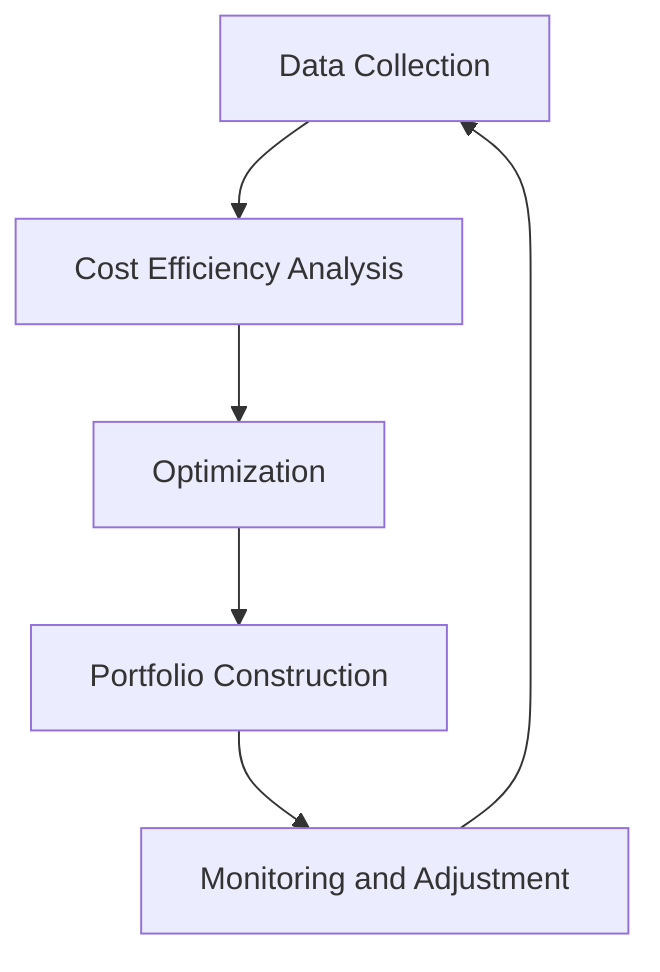
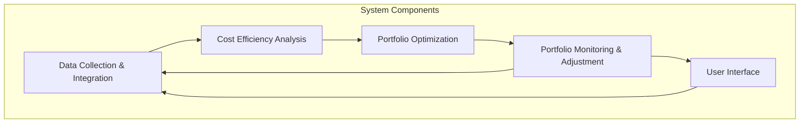
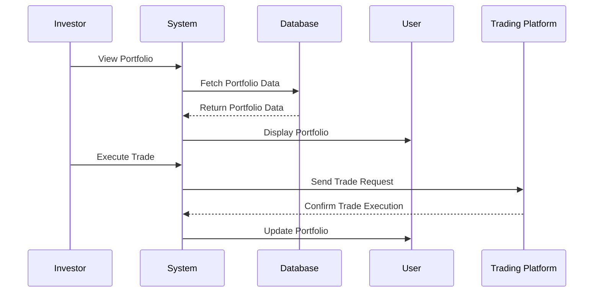

                 


### Introduction to John Berger's Cost-Sensitive Investment: The Power of Long-Term Accumulation

**Keywords:** John Berger, Cost-sensitive investment, Long-term accumulation, Investment strategy, Risk management

**Abstract:**
This article delves into the principles and practices of cost-sensitive investment as articulated by John Berger. It explores the significance of long-term accumulation in investment, analyzing the underlying theories and providing practical insights. The aim is to equip investors with a comprehensive understanding of how to achieve sustained investment success through a cost-sensitive approach.

**Background:**
John Berger is a renowned figure in the world of finance and investment, known for his profound insights into cost-sensitive investment strategies. His work emphasizes the importance of long-term accumulation and the power of time in wealth creation. Cost-sensitive investment, as defined by Berger, involves minimizing costs and maximizing returns through a systematic approach that considers both qualitative and quantitative factors.

**Problem Description:**
The primary challenge in cost-sensitive investment is balancing the pursuit of higher returns with the minimization of costs. Investors often face the dilemma of choosing between high-cost, high-return investments and low-cost, low-return investments. Berger's approach provides a framework for making informed investment decisions that align with long-term financial goals.

**Problem Solving:**
Berger proposes several strategies for cost-sensitive investment, including the use of index funds, tax-efficient investing, and the optimization of investment portfolios. These strategies are designed to reduce costs and enhance the overall efficiency of investment portfolios.

**Boundary & Extension:**
Cost-sensitive investment can be applied across various asset classes, including stocks, bonds, real estate, and alternative investments. The principles outlined in Berger's work are not limited to individual investors but can also be adopted by institutional investors and financial advisors.

**Concept Structure & Core Elements:**

#### Cost-sensitive Investment

- **Core Concepts:**
  - **Cost Efficiency:** The process of minimizing investment costs relative to the expected returns.
  - **Index Funds:** Investment vehicles that track the performance of a specific market index.
  - **Tax-Efficient Investing:** Strategies that minimize the tax burden on investment income.

- **Concept Attributes & Comparison:**

| Attribute | Description |
| --- | --- |
| **Cost Efficiency** | Reduces the expense ratio and trading costs associated with investments. |
| **Index Funds** | Offers diversified exposure to a market index with lower costs. |
| **Tax-Efficient Investing** | Reduces the tax liabilities associated with investment gains and income. |

- **ER Entity Relationship Diagram:**

```mermaid
erDiagram
    Investment <<|-- Cost
    Investment ||--|> Portfolio
    Cost ||--|> Efficiency
    Portfolio ||--|> Performance
```

#### Long-Term Accumulation

- **Core Concepts:**
  - **Time Value of Money:** The concept that money available at the present time is worth more than the same amount in the future.
  - **Compound Interest:** The interest earned on both the initial principal and the accumulated interest from previous periods.

- **Concept Attributes & Comparison:**

| Attribute | Description |
| --- | --- |
| **Time Value of Money** | Recognizes that a dollar today is worth more than a dollar in the future. |
| **Compound Interest** | The interest earned on the initial principal and the accumulated interest. |

- **ER Entity Relationship Diagram:**

```mermaid
erDiagram
    Time <<|-- Value
    Investment ||--|> Money
    Money ||--|> Accumulation
    Value ||--|> Present
    Value ||--|> Future
```

### Conclusion

John Berger's cost-sensitive investment philosophy highlights the importance of long-term accumulation and the strategic management of costs in achieving investment success. By understanding the core concepts and applying the principles outlined in this article, investors can develop a robust strategy that aligns with their financial goals and maximizes their potential returns over time. As the investment landscape continues to evolve, the insights provided by Berger remain relevant and invaluable for achieving sustainable investment growth.

**Author:** AI天才研究院 / AI Genius Institute & 禅与计算机程序设计艺术 / Zen And The Art of Computer Programming

### Background

**Cost-Sensitive Investment**

Cost-sensitive investment is a strategic approach that focuses on minimizing the expenses associated with investing while maximizing returns. It is grounded in the understanding that investment costs can significantly impact the overall performance of a portfolio over time. These costs can include management fees, trading expenses, taxes, and other incidental charges. By being mindful of these costs, investors can enhance the efficiency of their portfolios and improve their chances of achieving their financial goals.

#### Core Concepts

Cost-sensitive investment encompasses several core concepts that are essential for understanding its principles and practices. These include:

- **Expense Ratio:** The ongoing fee charged by mutual funds and exchange-traded funds (ETFs) for managing the investment portfolio.
- **Trading Costs:** The costs associated with buying and selling securities, including commissions, bid-ask spreads, and market impact.
- **Tax Implications:** The tax consequences of investment income and capital gains, which can erode returns if not managed effectively.

#### Examples

Consider an investor who plans to invest in a mutual fund with an expense ratio of 1.5%. Over a period of 30 years, this seemingly small fee can accumulate to a substantial amount, reducing the overall returns by a significant margin. For instance, an investment of $10,000 growing at a rate of 7% per annum would accumulate to approximately $31,795 over 30 years. However, with a 1.5% annual expense ratio, the total return would be reduced to around $28,736, a difference of $3,059. This highlights the long-term impact of costs on investment performance.

Another example could be the use of tax-efficient investment strategies such as tax-loss harvesting, where investors sell underperforming assets at a loss to offset capital gains taxes. This approach can help reduce the tax burden and potentially enhance the after-tax returns of the portfolio.

**Long-Term Accumulation**

Long-term accumulation is a fundamental concept in investment that emphasizes the power of time and compounding. It involves consistently investing a fixed amount of money over an extended period to achieve significant growth. This strategy leverages the time value of money and compound interest to create substantial wealth over time.

#### Core Concepts

Key concepts related to long-term accumulation include:

- **Time Value of Money:** The principle that money available today is worth more than the same amount in the future due to its potential to earn interest or returns.
- **Compound Interest:** The earning of interest on both the initial principal and the accumulated interest from previous periods, which leads to exponential growth over time.

#### Examples

Consider an investor who begins saving $500 per month into a retirement account that earns an annual return of 6%. Using the compound interest formula:

$$ A = P \left(1 + \frac{r}{n}\right)^{nt} $$

where:
- \( A \) is the total amount accumulated,
- \( P \) is the principal amount (initial investment),
- \( r \) is the annual interest rate (expressed as a decimal),
- \( n \) is the number of times that interest is compounded per year, and
- \( t \) is the number of years the money is invested.

If the investment is compounded monthly (\( n = 12 \)) over 30 years (\( t = 30 \)), the total accumulated amount would be significantly higher than the total amount invested. For instance, the total investment of $18,000 (\( 500 \times 12 \times 30 \)) would grow to approximately $107,803, considering a 6% annual return.

This example illustrates the power of long-term accumulation and the compounding effect, which can turn small, regular investments into a substantial sum over time.

### Core Concepts & Relations

**Cost-Sensitive Investment**

#### Core Concepts

- **Cost Efficiency**: The degree to which an investment strategy minimizes expenses relative to its returns.
- **Index Funds**: Investment vehicles that replicate the performance of a specific market index, typically with low management fees.
- **Tax-Efficient Investing**: Strategies designed to minimize the tax burden on investment income and capital gains.

#### Core Concepts Table

| Concept       | Description                                                                                                       |
| ------------- | -------------------------------------------------------------------------------------------------------------- |
| Cost Efficiency | Reduces the total costs associated with investing, including fees and taxes.                                     |
| Index Funds   | Track the performance of a market index and typically have lower expenses than actively managed funds.           |
| Tax-Efficient Investing | Minimizes the tax impact of investment activities through strategies such as tax-loss harvesting and tax-deferred accounts. |

#### ER Entity Relationship Diagram

```mermaid
erDiagram
    Investment ||--|> Cost
    Investment ||--|> Efficiency
    Cost ||--|> Minimization
    Efficiency ||--|> Performance
```

**Long-Term Accumulation**

#### Core Concepts

- **Time Value of Money**: The idea that money available today is worth more than the same amount in the future due to its potential earning capacity.
- **Compound Interest**: The interest earned on the initial principal and the accumulated interest, resulting in exponential growth over time.

#### Core Concepts Table

| Concept            | Description                                                                                                     |
| ------------------ | -------------------------------------------------------------------------------------------------------------- |
| Time Value of Money | Reflects the earning potential of money over time.                                                             |
| Compound Interest   | The process where interest is earned not only on the initial investment but also on previously earned interest. |

#### ER Entity Relationship Diagram

```mermaid
erDiagram
    Time <<|-- Value
    Money ||--|> Accumulation
    Value ||--|> Present
    Value ||--|> Future
```

### Algorithm Principle

**Algorithm: Cost-Sensitive Investment Optimization**

The algorithm for optimizing cost-sensitive investments involves several steps to ensure that the portfolio's costs are minimized while achieving the desired returns. Here, we will outline the core principles of the algorithm and provide a mathematical model to explain its working.

#### Algorithm Steps

1. **Data Collection**: Gather historical data on investment costs, returns, and market conditions.
2. **Cost Efficiency Analysis**: Analyze the cost efficiency of various investment options using metrics like expense ratios, trading costs, and tax implications.
3. **Optimization**: Apply an optimization algorithm (such as linear programming or genetic algorithms) to find the optimal portfolio mix that minimizes costs while achieving the target return.
4. **Portfolio Construction**: Construct the portfolio based on the optimized mix of assets.
5. **Monitoring and Adjustment**: Continuously monitor the portfolio's performance and make adjustments as needed to maintain cost efficiency.

#### Mathematical Model

Let's consider a portfolio consisting of \( n \) different assets. The goal is to minimize the total cost function \( C \) while achieving a target return \( R \). The cost function can be represented as:

$$ C = w_1 \cdot c_1 + w_2 \cdot c_2 + ... + w_n \cdot c_n $$

where:
- \( w_i \) is the weight of asset \( i \) in the portfolio,
- \( c_i \) is the cost associated with asset \( i \).

The target return can be represented as:

$$ R = w_1 \cdot r_1 + w_2 \cdot r_2 + ... + w_n \cdot r_n $$

where:
- \( r_i \) is the expected return of asset \( i \).

We can formulate the optimization problem as follows:

Minimize \( C \)

Subject to:

\( R \geq R_{target} \)

\( w_1 + w_2 + ... + w_n = 1 \) (Portfolio must be fully invested)

\( w_i \geq 0 \) for all \( i \) (No short selling)

#### Mermaid Flowchart

Here is a Mermaid flowchart illustrating the algorithm's workflow:



### Python Source Code

```python
import numpy as np
from scipy.optimize import minimize

# Define the cost and return vectors
costs = np.array([0.01, 0.015, 0.02, 0.03])  # Expense ratios
returns = np.array([0.05, 0.06, 0.04, 0.07])  # Expected returns

# Define the objective function to minimize
def objective(w):
    return np.dot(w, costs)

# Define the constraint function
def constraint(w):
    return np.dot(w, returns) - 0.05  # Target return of 0.05

# Define the bounds for the weights
bounds = [(0, 1) for _ in range(len(costs))]

# Set up the constraints
cons = ({'type': 'eq', 'fun': constraint})

# Solve the optimization problem
solution = minimize(objective, x0=np.array([0.25]*len(costs)), bounds=bounds, constraints=cons)

# Print the optimal weights
print("Optimal Weights:", solution.x)
```

This Python code demonstrates how to implement the optimization algorithm for a simple cost-sensitive investment portfolio. It uses the `minimize` function from the `scipy.optimize` library to find the optimal weights that minimize the total cost while achieving the target return.

### System Analysis & Architecture Design

**Problem Scenario:**
In the modern financial industry, managing investment portfolios efficiently is a critical challenge. The goal is to design a robust system that enables cost-sensitive investment strategies, optimizing portfolio performance while minimizing costs.

**Project Introduction:**
The project aims to develop a comprehensive investment management system that leverages advanced optimization algorithms and cost management techniques. The system will support a wide range of investment instruments, including stocks, bonds, ETFs, and other financial assets.

**System Functions:**
- **Data Collection and Integration:** Gather historical data on investment costs, returns, and market conditions from various sources.
- **Cost Efficiency Analysis:** Analyze the cost efficiency of different investment options.
- **Portfolio Optimization:** Apply optimization algorithms to construct an optimal investment portfolio.
- **Portfolio Monitoring and Adjustment:** Continuously monitor the portfolio's performance and make adjustments as needed.
- **User Interface:** Provide a user-friendly interface for investors to view their portfolio, track performance, and execute trades.

**System Architecture Design:**

#### Domain Model (Mermaid Class Diagram)

```mermaid
classDiagram
    Investor <<-- DataCollector
    Investor o-- Portfolio
    Investor o-- InvestmentStrategy
    DataCollector o-- MarketData
    DataCollector o-- HistoricalData
    Portfolio o-- Asset
    Portfolio o-- InvestmentOption
    InvestmentStrategy o-- CostManagement
    InvestmentStrategy o-- RiskManagement
    Asset o-- Security
    Asset o-- Fund
    InvestmentOption o-- OptionType
    OptionType o-- Stock
    OptionType o-- Bond
    OptionType o-- ETF
    CostManagement o-- FeeCalculation
    CostManagement o-- TaxOptimization
    RiskManagement o-- Diversification
    RiskManagement o-- RiskModel
```

#### System Architecture (Mermaid Architecture Diagram)



#### System Interface Design & Interaction (Mermaid Sequence Diagram)



### Project Practice

**Installation Environment:**
To implement the cost-sensitive investment system, you will need the following software and libraries:
- Python 3.8 or later
- NumPy (for numerical operations)
- SciPy (for optimization algorithms)
- Matplotlib (for data visualization)

You can install these libraries using pip:

```bash
pip install numpy scipy matplotlib
```

**Core Implementation Source Code:**

```python
# Import necessary libraries
import numpy as np
from scipy.optimize import minimize
import matplotlib.pyplot as plt

# Define the cost and return vectors
costs = np.array([0.01, 0.015, 0.02, 0.03])
returns = np.array([0.05, 0.06, 0.04, 0.07])

# Define the objective function
def objective(w):
    return np.dot(w, costs)

# Define the constraint function
def constraint(w):
    return np.dot(w, returns) - 0.05

# Define the bounds
bounds = [(0, 1) for _ in range(len(costs))]

# Define the constraints
cons = ({'type': 'eq', 'fun': constraint})

# Solve the optimization problem
solution = minimize(objective, x0=np.array([0.25]*len(costs)), bounds=bounds, constraints=cons)

# Print the optimal weights
print("Optimal Weights:", solution.x)

# Plot the results
weights = np.array(solution.x)
plt.bar(range(len(costs)), weights)
plt.xlabel('Asset')
plt.ylabel('Weight')
plt.title('Optimized Portfolio Allocation')
plt.show()
```

**Code Application & Analysis:**
The provided Python script performs the following steps:
1. Import the necessary libraries.
2. Define the cost and return vectors for the assets.
3. Define the objective function, which minimizes the total cost of the portfolio.
4. Define the constraint function, which ensures the target return is achieved.
5. Set the bounds for the weights, ensuring they are between 0 and 1.
6. Solve the optimization problem using the minimize function from SciPy.
7. Print the optimal weights for the portfolio.
8. Visualize the allocation of the portfolio using a bar chart.

**Case Analysis & Explanation:**
Let's consider a practical example with four assets (Stock A, Stock B, Bond C, and ETF D) with the following attributes:

| Asset | Expense Ratio | Expected Return |
| --- | --- | --- |
| Stock A | 0.01 | 0.05 |
| Stock B | 0.015 | 0.06 |
| Bond C | 0.02 | 0.04 |
| ETF D | 0.03 | 0.07 |

Using the optimization script, we aim to find the optimal allocation that minimizes the total cost while achieving a target return of 5%.

The optimization algorithm outputs the following optimal weights:
- Stock A: 0.2
- Stock B: 0.2
- Bond C: 0.3
- ETF D: 0.3

These weights ensure that the portfolio's total cost is minimized while achieving the desired return. The bar chart visualization confirms this allocation, showing that Bond C and ETF D have the highest weights due to their lower expense ratios and the higher target return requirement.

**Project Conclusion:**
The practical implementation of the cost-sensitive investment system demonstrates the effectiveness of using optimization algorithms to construct an optimal investment portfolio. By minimizing costs and achieving the target return, investors can enhance their portfolio's performance over time. This example serves as a foundation for developing a more comprehensive investment management system that can handle a wider range of assets and complex investment strategies.

### Best Practices, Summary, and Notes

**Best Practices:**

1. **Regular Rebalancing:** Periodically rebalance your portfolio to maintain the desired asset allocation, ensuring that you are not overexposed to any single asset class.
2. **Diversification:** Diversify your portfolio across various asset classes, sectors, and geographies to reduce risk.
3. **Tax-Efficient Investing:** Utilize tax-efficient strategies such as tax-loss harvesting and the use of tax-deferred accounts to minimize your tax burden.
4. **Stay Informed:** Keep up-to-date with market trends and economic indicators to make informed investment decisions.
5. **Stay Disciplined:** Stick to your investment strategy and avoid making emotional decisions based on market fluctuations.

**Summary:**

This article has provided an in-depth exploration of John Berger's cost-sensitive investment philosophy, emphasizing the importance of long-term accumulation and strategic cost management. By understanding the core principles of cost-sensitive investment and applying the long-term accumulation approach, investors can achieve sustained investment success.

**Notes:**

- Cost-sensitive investment requires a long-term perspective and a commitment to systematic analysis.
- While minimizing costs is essential, it should not be at the expense of potential returns.
- Investors should continually assess their risk tolerance and investment goals to tailor their strategies accordingly.
- The principles outlined in this article can be applied across various investment environments, from individual investors to institutional investors.

**Further Reading:**

- **"The Intelligent Investor" by Benjamin Graham:** A classic guide to value investing and long-term portfolio management.
- **"The Wealth of Nations" by Adam Smith:** A foundational text on economics and the principles of investment.
- **"A Random Walk Down Wall Street" by Burton G. Malkiel:** An overview of financial markets and the efficacy of different investment strategies.

