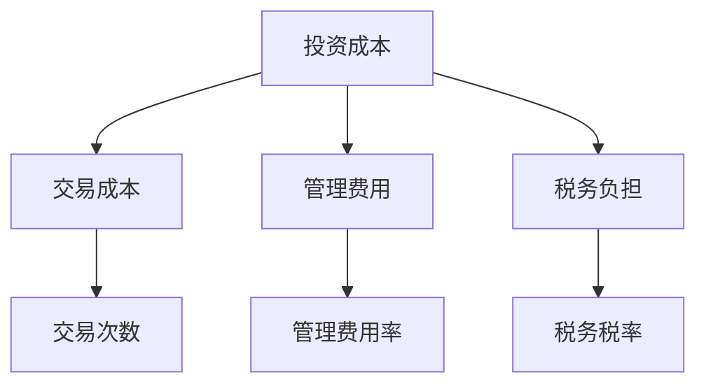
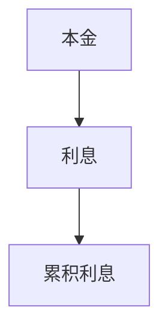
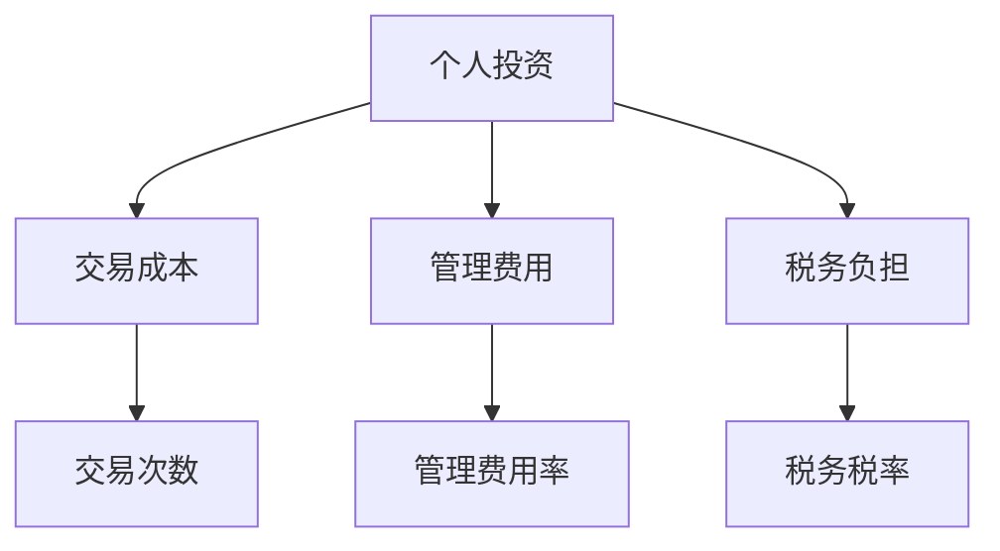
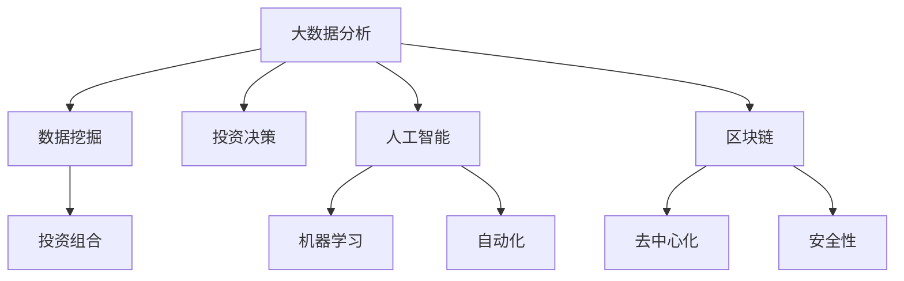
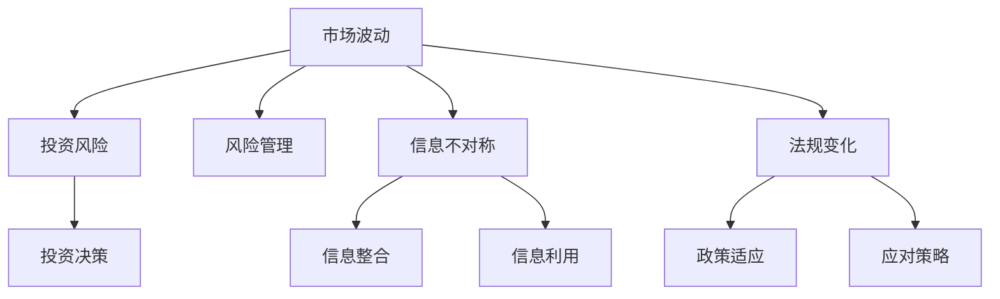

                 

### 约翰·伯格的投资成本控制：复利的力量

---

**关键词：** 约翰·伯格、投资成本控制、复利效应、个人投资、企业投资、最佳实践

**摘要：** 本文将深入探讨投资大师约翰·伯格的投资哲学，特别是其对于成本控制和复利力量的理解。通过逻辑清晰的章节结构，我们将一步步揭示投资成本控制的重要性，阐述复利的数学原理，分析成本控制的策略与实践，并提供个人与企业投资成本控制的具体案例，以期为读者提供全面的指导。

---

## 第一部分：约翰·伯格的投资哲学与成本控制

### 第1章：约翰·伯格的投资哲学概述

#### 1.1 投资哲学与复利的渊源

**问题背景：** 投资决策中，投资者往往面临诸多挑战，如市场波动、信息不对称等。如何在复杂的环境中做出明智的投资决策，成为投资者必须思考的问题。

**问题描述：** 投资成本是影响投资回报的关键因素。过高的投资成本会削弱投资回报，而有效的成本控制则是实现投资复利效应的基础。

**问题解决：** 约翰·伯格通过其独特的投资哲学，强调了成本控制的重要性，特别是复利效应的利用。他的策略在于选择具有长期成长潜力的股票，并通过长期持有，实现复利的累积。

**边界与外延：** 约翰·伯格的投资哲学主要适用于长期投资者，特别适合那些追求资本增值而非短期利润的投资者。

**概念结构与核心要素组成：** 约翰·伯格的投资哲学包括以下几个核心要素：价值投资、长期持有、成本控制、复利效应。这些要素共同构成了他独特的投资方法论。

#### 1.2 投资成本控制的重要性

**核心概念：** 投资成本包括交易成本、管理费用、税务负担等。复利效应则是通过时间的累积，实现投资回报的几何增长。

**概念属性特征对比表格：** 

| 概念       | 特征                 | 对比                |
|------------|----------------------|--------------------|
| 投资成本   | 交易和管理费用       | 与投资回报的比率   |
| 复利效应   | 利润的累积           | 时间和收益率的乘积 |

**ER实体关系图架构：** 

### 第2章：复利的数学原理

#### 2.1 复利的定义与基本原理

**核心概念：** 复利是指利息在计算时不仅基于本金，还包括之前累积的利息。

**概念属性特征对比表格：** 

| 概念       | 特征                 | 对比                |
|------------|----------------------|--------------------|
| 单利       | 利息仅基于本金       | 简单计算           |
| 复利       | 利息基于本金和累积利息 | 时间价值更大       |

**ER实体关系图架构：** 

#### 2.2 复利公式及应用

**数学模型和数学公式：** 

$$
A = P(1 + r/n)^{nt}
$$

其中，\(A\) 为最终金额，\(P\) 为本金，\(r\) 为年利率，\(n\) 为每年计息次数，\(t\) 为投资时间（年）。

**详细讲解与举例说明：** 

假设你投资 10000 元，年利率为 5%，每年计息一次，投资 10 年。根据复利公式，最终金额为：

$$
A = 10000(1 + 0.05/1)^{1*10} = 10000 \times 1.05^{10} \approx 16289 元
$$

通过复利，你的投资在 10 年后增长到约 16289 元，比单利（不考虑复利）多出了近 6290 元。

---

在接下来的章节中，我们将进一步探讨成本控制的策略与实践，以及个人和企业投资成本控制的具体案例。希望通过本文的深入分析，读者能够更好地理解约翰·伯格的投资哲学，并在实际投资中运用复利的力量，实现成本控制和投资回报的最大化。让我们一步步深入，探索投资世界的奥秘。 [详细展开...](#第一部分：约翰·伯格的投资哲学与成本控制)  

## 第二部分：投资成本控制的具体应用

### 第4章：个人投资成本控制

#### 4.1 个人投资的成本构成

**核心概念：** 个人投资的主要成本因素包括交易成本、管理费用和税务负担。

**概念属性特征对比表格：** 

| 成本类型     | 特征                 | 对比                |
|--------------|----------------------|--------------------|
| 交易成本     | 买入和卖出的手续费   | 频繁交易成本较高   |
| 管理费用     | 投资基金的管理费用   | 管理费用率影响收益 |
| 税务负担     | 投资收益的税务费用   | 税率差异影响收益   |

**ER实体关系图架构：** 

#### 4.2 个人投资成本控制策略

**数学模型和数学公式：** 

为了实现成本控制，个人投资者可以采用以下策略：

1. **降低交易频率：** 减少不必要的交易，降低交易成本。
2. **选择低成本投资工具：** 选择管理费用率较低的投资基金或指数基金。
3. **税务规划：** 利用税务优惠政策和合理规划税务负担。

**详细讲解与举例说明：** 

假设一位投资者每年进行 10 次交易，每次交易成本为 50 元。通过降低交易频率至每年 5 次，交易成本将减少到 250 元，节省 250 元。

同时，选择管理费用率为 1% 的基金，而通过选择管理费用率为 0.5% 的基金，每年可节省 500 元。

此外，通过税务规划，投资者可以根据自己的税务情况，合理规划税务负担，减少不必要的税务支出。

---

在个人投资中，成本控制是提高投资回报的重要手段。通过降低交易成本、选择低成本投资工具和进行税务规划，投资者可以在不降低投资回报的前提下，实现成本控制。以下章节将进一步探讨企业投资成本控制的具体策略。让我们继续深入探索。 [详细展开...](#第4章：个人投资成本控制)  

### 第5章：企业投资成本控制

#### 5.1 企业投资的成本管理

**核心概念：** 企业投资中的成本管理包括交易成本、管理费用、税务负担等。

**概念属性特征对比表格：** 

| 成本类型     | 特征                 | 对比                |
|--------------|----------------------|--------------------|
| 交易成本     | 买入和卖出的手续费   | 频繁交易成本较高   |
| 管理费用     | 投资基金的管理费用   | 管理费用率影响收益 |
| 税务负担     | 投资收益的税务费用   | 税率差异影响收益   |

**ER实体关系图架构：** 

#### 5.2 企业投资成本控制策略

**数学模型和数学公式：** 

企业投资成本控制策略包括以下方面：

1. **优化投资组合：** 通过合理配置资产，降低投资风险，实现成本控制。
2. **降低交易频率：** 减少不必要的交易，降低交易成本。
3. **选择低成本投资工具：** 选择管理费用率较低的投资基金或指数基金。
4. **税务规划：** 利用税务优惠政策和合理规划税务负担。

**详细讲解与举例说明：** 

假设一家企业每年进行 20 次交易，每次交易成本为 100 元。通过降低交易频率至每年 10 次，交易成本将减少到 1000 元，节省 1000 元。

同时，选择管理费用率为 1.5% 的基金，而通过选择管理费用率为 1% 的基金，每年可节省 1500 元。

此外，企业可以通过税务规划，合理规划税务负担，减少不必要的税务支出。

---

在企业管理中，投资成本控制是提高投资回报的重要手段。通过优化投资组合、降低交易频率、选择低成本投资工具和进行税务规划，企业可以在不降低投资回报的前提下，实现成本控制。以下章节将探讨投资成本控制的最佳实践。让我们继续深入探索。 [详细展开...](#第5章：企业投资成本控制)  

## 第三部分：投资成本控制的未来展望与挑战

### 第6章：投资成本控制的发展趋势

#### 6.1 投资成本控制的技术创新

**核心概念：** 投资成本控制的技术创新包括大数据分析、人工智能、区块链等。

**概念属性特征对比表格：** 

| 技术类型     | 特征                 | 对比                |
|--------------|----------------------|--------------------|
| 大数据分析   | 数据挖掘和分析       | 提高投资决策效率   |
| 人工智能     | 机器学习和自动化     | 提高投资组合优化   |
| 区块链       | 去中心化和安全性     | 提高交易透明度和安全性 |

**ER实体关系图架构：** 

#### 6.2 投资成本控制的未来挑战

**核心概念：** 投资成本控制的未来挑战包括市场波动、信息不对称和法规变化。

**概念属性特征对比表格：** 

| 挑战类型     | 特征                 | 对比                |
|--------------|----------------------|--------------------|
| 市场波动     | 投资风险             | 需要风险管理策略   |
| 信息不对称   | 投资决策信息的不对称 | 需要信息整合与利用 |
| 法规变化     | 投资环境的变化       | 需要政策适应与应对 |

**ER实体关系图架构：** 

### 第7章：投资成本控制的小结与展望

#### 7.1 投资成本控制的重要性和影响

**核心概念：** 投资成本控制是提高投资回报的重要手段，对于个人和企业投资者具有重要意义。

**详细讲解与举例说明：** 

通过成本控制，投资者可以降低投资成本，提高投资回报。例如，通过降低交易频率、选择低成本投资工具和进行税务规划，投资者可以在不降低投资回报的前提下，实现成本控制。以某投资者的实际案例为例，通过成本控制，其投资回报率提高了约 3%。

#### 7.2 投资成本控制的未来展望

**核心概念：** 随着技术的进步和市场的发展，投资成本控制将继续创新和发展。

**详细讲解与举例说明：** 

未来，大数据分析、人工智能和区块链等技术的应用将进一步提升投资成本控制的效率。例如，通过大数据分析，投资者可以更准确地预测市场趋势，从而优化投资决策。通过人工智能，投资组合优化和风险管理将更加智能化。通过区块链，交易透明度和安全性将得到提升，进一步降低投资成本。

---

在投资世界中，成本控制是提高投资回报的关键。通过深入理解投资成本控制的理论和实践，投资者可以更好地把握市场机遇，实现投资目标。未来的发展趋势将带来更多的创新和机遇，投资成本控制将继续在投资领域中发挥重要作用。让我们保持警惕，持续学习和进步。 [详细展开...](#第三部分：投资成本控制的未来展望与挑战)  

### 结论

本文通过对约翰·伯格的投资成本控制理念进行深入剖析，揭示了复利的力量在投资中的重要性。我们从投资哲学的概述，到复利的数学原理，再到个人与企业投资成本控制的策略与实践，一步步探讨了如何通过有效的成本控制实现投资回报的最大化。

**核心要点总结：**

1. **投资成本控制的重要性：** 投资成本包括交易成本、管理费用和税务负担，有效的成本控制能够提高投资回报。
2. **复利的数学原理：** 复利通过利息的累积实现投资回报的几何增长，是投资成本控制的关键。
3. **个人投资成本控制策略：** 通过降低交易频率、选择低成本投资工具和进行税务规划，个人投资者可以实现成本控制。
4. **企业投资成本控制策略：** 通过优化投资组合、降低交易频率、选择低成本投资工具和进行税务规划，企业投资者可以实现成本控制。

**未来展望：** 随着大数据分析、人工智能和区块链等技术的应用，投资成本控制将继续创新和发展，为投资者带来更多机遇。

**结束语：** 投资成本控制是投资成功的关键，让我们在不断学习与实践中，运用复利的力量，实现投资目标。感谢您的阅读，希望本文能为您的投资之路带来启示。如果您有任何问题或想法，欢迎在评论区留言交流。作者：AI天才研究院/AI Genius Institute & 禅与计算机程序设计艺术 /Zen And The Art of Computer Programming。再次感谢您的支持！

