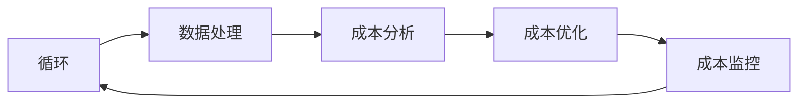
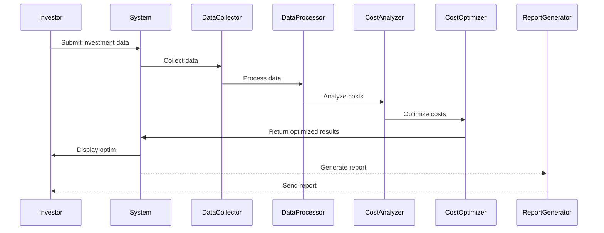
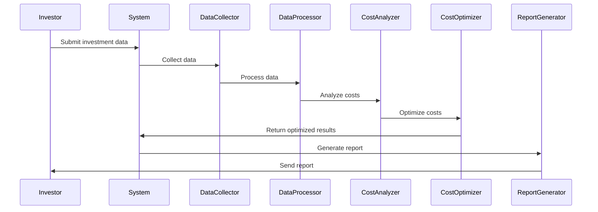

                 

## 第一部分: 书籍背景介绍

### 1.1 问题背景

在当今的投资市场中，投资者面临的挑战日益增加。随着市场的不确定性和复杂性不断上升，投资成本控制成为投资者能否实现可持续回报的关键。投资成本不仅包括直接的成本，如手续费、交易佣金等，还涵盖了隐性成本，如税收、机会成本等。隐性费用往往难以被投资者察觉，但却对投资回报产生重大影响。

#### 1.1.1 投资成本控制的必要性

投资成本控制是投资者实现长期投资成功的重要保障。通过有效地控制成本，投资者可以提升投资回报的比率，增加资产增值的潜力。在投资过程中，每一点成本的节省都会对整体投资回报产生积极影响。因此，投资成本控制不仅是理论上的需求，更是实践中的迫切任务。

#### 1.1.2 隐性费用上升的影响

近年来，随着全球金融市场的发展，隐性费用的种类和规模也在不断增加。这些隐性费用可能源于多个方面，包括交易费用、管理费用、税收费用等。隐性费用不仅增加了投资者的总体成本，还可能导致投资回报的减少。对于长期投资者而言，隐性费用的累积效应尤为显著，可能会侵蚀其投资收益。

#### 1.1.3 投资者面临的挑战

投资者在应对隐性费用上升的挑战时，面临着以下几方面的问题：

- **成本难以量化**：隐性费用的表现形式复杂，难以准确量化，使得投资者难以全面了解其实际成本。
- **缺乏专业知识**：许多投资者对投资成本的构成和管理缺乏深入了解，难以制定有效的成本控制策略。
- **市场变化迅速**：金融市场变化迅速，投资者难以实时调整成本控制策略，导致成本控制的效果不理想。
- **道德风险**：在某些情况下，金融机构和中介机构可能通过不合理收费或隐藏费用，增加投资者的成本负担。

### 1.2 问题描述

#### 1.2.1 隐性费用的种类

隐性费用主要包括以下几类：

- **交易费用**：包括交易手续费、佣金、印花税等，这些费用通常由交易次数和交易金额决定。
- **管理费用**：基金、信托等投资产品通常会收取管理费用，用以支付管理人员的工资、市场推广费用等。
- **税收费用**：投资收益需要缴纳相应的税收，包括资本利得税、利息税等。
- **机会成本**：投资者在做出某种投资决策时，可能会放弃其他投资机会，这种放弃的机会所带来的成本即为机会成本。
- **其他费用**：如托管费、审计费、法律费用等，这些费用在某些投资产品中可能涉及。

#### 1.2.2 隐性费用对投资回报的影响

隐性费用对投资回报的影响不可忽视。具体来说，这些费用会以以下方式影响投资者的回报：

- **降低实际收益率**：隐性费用直接减少了投资者的实际收益，使得投资回报率降低。
- **侵蚀投资本金**：长期的隐性费用累积可能导致投资者实际投资收益低于预期，甚至可能侵蚀本金。
- **增加投资风险**：高成本的隐性费用可能导致投资者需要承担更高的风险以实现预期的回报，增加了投资的不确定性。

#### 1.2.3 投资成本控制的重要性

有效的投资成本控制对于投资者至关重要。具体而言，投资成本控制的重要性体现在以下几个方面：

- **提高投资回报**：通过降低投资成本，投资者可以提升实际投资回报，实现更高的资产增值。
- **增强投资信心**：了解和管理投资成本可以帮助投资者更好地理解投资过程，增强投资信心。
- **优化投资策略**：通过精确计算和管理成本，投资者可以更灵活地调整投资策略，优化资产配置。
- **提升投资效率**：有效的成本控制有助于提高投资决策的效率，减少因成本不确定带来的焦虑和困扰。

### 1.3 问题解决

#### 1.3.1 投资成本控制的方法与策略

投资成本控制需要采取一系列方法和策略，以最大限度地降低成本并优化投资回报。以下是一些常见的投资成本控制方法：

- **选择低成本的投资产品**：投资者应选择管理费用较低、交易费用透明的投资产品，如指数基金、低费率基金等。
- **优化交易策略**：通过减少交易次数、避免频繁交易等方式，降低交易费用和印花税。
- **合理避税**：了解和利用税收优惠政策，合理避税，降低税收费用。
- **多元化投资**：通过多元化投资，降低单一投资产品带来的机会成本。
- **自身学习和提高**：投资者应不断学习投资知识，提高自身专业素养，以更好地管理投资成本。

#### 1.3.2 约翰·伯格的投资哲学

约翰·伯格（John C. Bogle）是一位著名的投资大师，他提出了许多关于投资成本控制的重要观点。他的投资哲学强调以下几点：

- **长期投资**：约翰·伯格主张投资者应采用长期投资策略，避免频繁交易，以降低交易费用和税收。
- **低成本投资**：他认为低成本是投资成功的关键，通过选择低管理费用和低交易费用的投资产品，可以最大限度地降低成本。
- **多元化投资**：约翰·伯格倡导投资者通过多元化投资来分散风险，降低机会成本。
- **理性投资**：他强调投资者应保持理性，避免受市场情绪的影响，做出明智的投资决策。

#### 1.3.3 约翰·伯格的实践经验与成果

约翰·伯格的实践经验证明了他的投资哲学的有效性。他在长期投资实践中，通过低成本投资和多元化投资策略，成功地控制了投资成本，并实现了稳健的投资回报。他的著作《共同基金常识》（The Little Book That Beats the Market）等书籍，对全球投资者产生了深远的影响，成为了投资领域的经典之作。

### 1.4 边界与外延

#### 1.4.1 投资成本控制的适用范围

投资成本控制适用于各类投资者，包括个人投资者和机构投资者。无论是股票、债券、基金还是其他投资产品，投资成本控制都是一项基本而重要的任务。

#### 1.4.2 隐性费用的变化趋势

随着金融市场的发展和投资产品的创新，隐性费用的种类和规模可能会进一步增加。投资者需要密切关注这些变化，并采取相应的成本控制策略。

#### 1.4.3 投资成本控制的理论与实践关系

投资成本控制既是一门理论，也是一项实践。理论为实践提供了指导，实践则验证了理论的正确性和有效性。投资者应在理论学习的基础上，结合实际情况，制定和实施有效的成本控制策略。## 第二部分: 核心概念与联系

### 1.5 投资成本控制的概念解析

#### 1.5.1 投资成本控制的定义

投资成本控制是指在投资过程中，通过有效的管理和优化，最大限度地降低投资成本，以提高投资回报率的一种投资策略。投资成本控制不仅包括直接的成本，如手续费、佣金等，还包括隐性的成本，如税收、机会成本等。

#### 1.5.2 投资成本控制的属性特征

投资成本控制具有以下几个属性特征：

- **综合性**：投资成本控制需要综合考虑各种成本因素，包括直接成本和隐性成本。
- **系统性**：投资成本控制是一项系统性工程，需要从整体上规划和实施。
- **动态性**：投资市场的变化会导致成本的变化，投资成本控制需要根据市场情况动态调整策略。
- **精准性**：投资成本控制需要精确地识别和管理成本，以确保成本控制的有效性。

#### 1.5.3 投资成本控制与投资回报的关系

投资成本控制直接影响投资回报。有效的成本控制可以降低总体投资成本，从而提高投资回报率。具体来说，投资成本控制与投资回报的关系体现在以下几个方面：

- **降低成本**：通过减少交易费用、管理费用、税收费用等，直接降低投资成本。
- **提高回报**：降低的成本转化为更高的投资回报，从而提高整体投资收益。
- **优化资产配置**：通过成本控制，投资者可以更灵活地调整资产配置，实现更高的收益。
- **增强投资信心**：了解和管理投资成本，有助于投资者更理性地看待投资过程，增强投资信心。

### 1.6 隐性费用的概念解析

#### 1.6.1 隐性费用的定义

隐性费用是指投资者在投资过程中无法直接感知，但会对投资回报产生显著影响的费用。这些费用通常隐藏在投资产品的细节中，需要投资者在投资前和投资过程中仔细识别和管理。

#### 1.6.2 隐性费用的分类

隐性费用可以根据其表现形式和产生原因进行分类，主要包括以下几类：

- **交易费用**：包括交易手续费、佣金、印花税等，这些费用通常与交易次数和交易金额相关。
- **管理费用**：基金、信托等投资产品通常会收取管理费用，用以支付管理人员的工资、市场推广费用等。
- **税收费用**：投资收益需要缴纳相应的税收，包括资本利得税、利息税等。
- **机会成本**：投资者在做出某种投资决策时，可能会放弃其他投资机会，这种放弃的机会所带来的成本即为机会成本。
- **其他费用**：如托管费、审计费、法律费用等，这些费用在某些投资产品中可能涉及。

#### 1.6.3 隐性费用的表现形式

隐性费用的表现形式多种多样，包括：

- **固定费用**：如管理费用，通常以固定比例收取。
- **变动费用**：如交易费用，通常与交易次数或交易金额相关。
- **隐藏费用**：如某些基金产品的销售费用，可能在合同条款中未被明确标示。
- **延期费用**：如某些投资产品的赎回费用，可能在未来某个时间点产生。

### 1.7 关联概念比较

#### 1.7.1 投资成本控制与其他投资理论的对比

投资成本控制与其他投资理论在目标和实施方式上有所不同：

- **投资成本控制**：主要关注如何降低投资成本，提高投资回报。
- **价值投资**：注重公司基本面分析，寻找被市场低估的优质公司进行长期投资。
- **成长投资**：关注公司增长潜力，选择高增长潜力的公司进行投资。
- **技术分析**：通过分析历史价格和交易量等数据，预测市场趋势。

投资成本控制虽然与其他投资理论在关注点上有差异，但可以与其他理论相结合，形成更全面的投资策略。

#### 1.7.2 投资成本控制与风险管理的联系

投资成本控制与风险管理密切相关：

- **风险管理**：主要关注投资过程中可能面临的风险，包括市场风险、信用风险、操作风险等。
- **投资成本控制**：通过降低成本，减少投资风险。例如，通过选择低管理费用、低交易费用的投资产品，降低操作风险。
- **投资成本控制与风险管理的关系**：有效的投资成本控制有助于降低投资风险，提高投资安全性。

#### 1.7.3 投资成本控制与税务筹划的关系

投资成本控制与税务筹划也有一定的联系：

- **税务筹划**：主要关注如何通过合法手段降低税负，提高投资收益。
- **投资成本控制**：通过合理避税，减少税收费用，从而降低总体成本。
- **投资成本控制与税务筹划的关系**：有效的投资成本控制可以为税务筹划提供数据支持，帮助投资者更好地进行税务筹划。

### 1.8 ER实体关系图

为了更清晰地展示投资成本控制相关概念之间的关系，我们可以使用ER（实体关系）图进行描述。以下是一个简化的ER实体关系图：

```mermaid
entity Relationship {
  Investment
  CostControl
  HiddenCost
  Tax
}

relationship "关联" {
  Investment --|> CostControl
  CostControl --|> HiddenCost
  CostControl --|> Tax
  HiddenCost --|> Investment
  HiddenCost --|> Tax
  Tax --|> Investment
}
```

在这个ER图中，`Investment`（投资）是核心实体，与`CostControl`（成本控制）、`HiddenCost`（隐性费用）和`Tax`（税收）三个实体之间存在关联关系。通过这种结构，我们可以更好地理解投资成本控制、隐性费用和税收之间的复杂关系。## 第三部分: 算法原理讲解

### 1.9 投资成本控制算法概述

投资成本控制算法是用于帮助投资者在投资过程中有效降低成本的一组技术方法。这类算法不仅能够处理直接的成本，如交易手续费、佣金等，还能识别和管理隐性成本，如机会成本、税收等。以下是投资成本控制算法的一些基本概述：

#### 1.9.1 投资成本控制算法的分类

投资成本控制算法可以大致分为以下几类：

- **数据收集算法**：用于收集和处理投资过程中产生的各种成本数据，为后续的成本分析和优化提供基础。
- **成本分析算法**：通过对收集到的成本数据进行深入分析，识别成本的主要来源和潜在节省空间。
- **成本优化算法**：基于成本分析的结果，提出优化策略，以实现成本的最小化或投资回报的最大化。
- **成本监控算法**：实时监控投资成本的变化，确保成本控制策略的有效性和持续优化。

#### 1.9.2 投资成本控制算法的基本原理

投资成本控制算法的基本原理可以概括为以下几个步骤：

1. **数据收集**：收集投资过程中的各类成本数据，包括直接成本和隐性成本。
2. **数据处理**：对收集到的数据进行清洗、整理和预处理，为后续分析提供可靠的数据基础。
3. **成本分析**：分析成本数据，识别成本的主要组成部分和潜在节省机会。
4. **成本优化**：根据成本分析的结果，提出优化策略，如调整投资组合、优化交易频率等。
5. **成本监控**：实时监控成本变化，评估成本控制策略的效果，并进行必要的调整。

#### 1.9.3 投资成本控制算法的应用场景

投资成本控制算法可以在多种应用场景中发挥作用：

- **个人投资者**：帮助个人投资者更清晰地了解和管理投资成本，优化投资组合，提高投资回报。
- **机构投资者**：为机构投资者提供专业的成本控制工具，提高投资管理的效率和效果。
- **投资顾问**：为投资顾问提供数据支持和策略建议，帮助其更有效地向客户提供投资建议。
- **基金管理**：在基金管理过程中，帮助基金管理团队降低成本，提高基金的投资表现。

### 1.10 Mermaid算法流程图

为了更直观地展示投资成本控制算法的工作流程，我们可以使用Mermaid语言绘制一个流程图。以下是一个简单的算法流程图示例：



在这个流程图中，算法从数据收集开始，经过数据处理、成本分析和成本优化，最终进入成本监控阶段。监控环节的反馈会触发算法回到数据收集阶段，形成一个循环，确保成本控制策略能够持续优化和更新。

### 1.11 算法原理详细讲解

#### 1.11.1 数据收集

数据收集是投资成本控制算法的第一步，也是至关重要的一步。以下是数据收集的详细过程：

1. **确定数据来源**：数据来源可以是投资平台、银行账户、交易记录等。
2. **收集直接成本数据**：包括交易手续费、佣金、印花税等。这些数据通常可以从投资平台或银行账户中直接获取。
3. **收集隐性成本数据**：包括机会成本、税收费用等。这些数据可能需要通过投资分析工具或财务报表进行推断和估算。
4. **数据格式标准化**：将收集到的数据进行格式化处理，确保数据的一致性和可分析性。

#### 1.11.2 数据处理

数据处理是对收集到的成本数据进行清洗、整理和预处理的过程。以下是数据处理的主要步骤：

1. **数据清洗**：去除重复、错误和异常的数据，确保数据的准确性和完整性。
2. **数据整理**：对数据进行分类和标签化处理，使其更具结构化和易读性。
3. **数据预处理**：进行数据标准化、归一化等操作，为后续分析做准备。

#### 1.11.3 成本分析

成本分析是投资成本控制算法的核心步骤，通过对处理后的数据进行分析，识别成本的主要来源和节省机会。以下是成本分析的具体内容：

1. **成本构成分析**：分析各类成本的具体构成，如交易费用、管理费用、税收费用等。
2. **成本效益分析**：评估各类成本对投资回报的影响，确定哪些成本可以优化。
3. **敏感性分析**：通过调整投资策略，分析成本变化对投资回报的影响。

#### 1.11.4 成本优化

成本优化是根据成本分析的结果，提出具体的优化策略，以降低投资成本。以下是成本优化的主要策略：

1. **投资组合优化**：通过调整投资组合，降低高风险和高成本的资产比例。
2. **交易频率优化**：减少不必要的交易，降低交易费用。
3. **税务筹划**：利用税收优惠政策，合理避税。
4. **产品选择优化**：选择低管理费用、低交易费用的投资产品。

#### 1.11.5 成本监控

成本监控是对投资成本进行实时跟踪和评估的过程，以确保成本控制策略的有效性和持续优化。以下是成本监控的主要步骤：

1. **实时数据采集**：定期收集投资成本数据，确保数据的实时性和准确性。
2. **成本对比分析**：将实际成本与预算成本进行对比，评估成本控制的效果。
3. **反馈调整**：根据成本监控的结果，对成本控制策略进行必要的调整和优化。
4. **持续优化**：通过不断监控和反馈，确保成本控制策略能够持续优化，以适应市场变化。### 1.12 投资成本控制的数学模型

在投资领域，数学模型被广泛应用于分析、预测和优化投资决策。投资成本控制的数学模型是用于描述和管理投资成本的关键工具，它可以帮助投资者更精确地理解成本结构，进而制定有效的成本控制策略。

#### 1.12.1 投资成本函数

投资成本函数是用于描述投资成本与投资组合特征之间关系的数学模型。常见的投资成本函数包括线性函数、多项式函数和指数函数等。以下是投资成本函数的基本形式：

$$
C = f(x, y)
$$

其中，\(C\) 表示投资成本，\(x\) 和 \(y\) 分别代表影响成本的两个主要因素。例如，可以表示为：

$$
C = ax + by
$$

在这个模型中，\(a\) 和 \(b\) 是成本系数，它们反映了成本与投资组合特征（如投资金额、交易频率等）之间的线性关系。

#### 1.12.2 成本优化目标函数

成本优化的目标函数是用于衡量和优化投资成本的表达式。常见的成本优化目标函数是成本最小化函数，其基本形式如下：

$$
\min_{x, y} C = \min_{x, y} f(x, y)
$$

在这个目标函数中，我们试图找到使总成本 \(C\) 最小的投资组合特征 \(x\) 和 \(y\)。为了实现这一目标，需要对成本函数进行优化，采用如梯度下降法、遗传算法等优化算法。

#### 1.12.3 数学模型应用

数学模型在投资成本控制中的应用非常广泛，以下是一个简单的例子：

假设投资者拥有两个投资选项：股票和债券。股票的投资成本由交易佣金和机会成本组成，债券的投资成本主要由管理费用和税收构成。我们可以建立以下数学模型来描述这两种投资的成本：

**股票投资成本函数**：
$$
C_{stock} = 0.01 \cdot x + 0.02 \cdot y
$$

其中，\(x\) 是股票交易金额，\(y\) 是股票持有时间。

**债券投资成本函数**：
$$
C_{bond} = 0.005 \cdot x + 0.015 \cdot z
$$

其中，\(x\) 是债券投资金额，\(z\) 是债券管理费用。

**成本优化目标函数**：
$$
\min_{x, y, z} C_{total} = \min_{x, y, z} (C_{stock} + C_{bond})
$$

在这个例子中，我们需要找到最优的投资组合，使得总成本 \(C_{total}\) 最小。通过优化算法，我们可以得到最优的 \(x, y, z\) 值，从而实现成本的最小化。

总之，投资成本控制的数学模型为投资者提供了强大的分析工具，通过精确的数学描述，可以帮助投资者更深入地理解成本结构，制定有效的成本控制策略。### 1.13 数学公式与详细讲解

在投资成本控制过程中，数学公式起到了关键作用，它们不仅帮助我们量化成本，还可以指导我们如何优化投资策略。下面我们将详细讲解几个核心的数学公式，并解释其在实际应用中的意义。

#### 1.13.1 投资成本函数公式

投资成本函数是描述投资过程中成本与投资组合特征之间关系的数学模型。最基本的投资成本函数通常采用线性形式，如下所示：

$$
C = ax + by
$$

其中，\(C\) 是总成本，\(a\) 和 \(b\) 是成本系数，它们分别表示交易佣金和持有时间对成本的影响，而 \(x\) 和 \(y\) 是交易金额和持有时间。

**实际应用**：

假设投资者购买了一只股票，每次交易需要支付 0.5% 的佣金，同时持有该股票的年机会成本为 1%。如果交易金额为 100,000 元，持有时间为 1 年，则总成本计算如下：

$$
C = 0.005 \cdot 100,000 + 1 \cdot 1 = 500 + 1 = 501 \text{ 元}
$$

#### 1.13.2 成本优化目标函数公式

在成本优化的背景下，我们的目标是最小化总成本或最大化投资回报。一个常见的成本优化目标函数是：

$$
\min_{x, y, z} C = \min_{x, y, z} f(x, y, z)
$$

其中，\(x, y, z\) 是影响成本的变量，\(f(x, y, z)\) 是成本函数。

**实际应用**：

假设投资者要在一个股票、债券和基金之间分配资金，每种资产的成本函数如下：

- 股票：\(C_{stock} = 0.01x + 0.02y\)
- 债券：\(C_{bond} = 0.005x + 0.015z\)
- 基金：\(C_{fund} = 0.007x + 0.01z\)

其中，\(x\) 是总投资金额，\(y\) 和 \(z\) 分别是股票和债券的投资比例。我们的目标是最小化总成本：

$$
\min_{x, y, z} C_{total} = \min_{x, y, z} (C_{stock} + C_{bond} + C_{fund})
$$

为了简化，假设总资金为 100,000 元，则有：

$$
\min_{x, y, z} (0.01x + 0.02y + 0.005x + 0.015z + 0.007x + 0.01z)
$$

#### 1.13.3 公式应用举例

**例 1**：投资组合优化

假设投资者有 100,000 元资金，希望投资于股票、债券和基金，同时希望最小化总成本。已知股票的年成本为交易金额的 1%，债券的管理费用为 1.5%，基金的年费用为 2%。

建立数学模型如下：

$$
\min_{x, y, z} C = 0.01x + 0.015y + 0.02z
$$

其中，\(x, y, z\) 分别为股票、债券和基金的投资比例，且 \(x + y + z = 100,000\)。

通过优化算法求解该问题，可以得到最优的投资比例，从而实现成本的最小化。

**例 2**：税务筹划

假设投资者从股票交易中获得的收益需要缴纳 20% 的资本利得税。投资者的目标是最大化净收益，需要考虑税收对成本的影响。

成本函数变为：

$$
C = 0.01x + 0.2 \cdot 0.01x = 0.012x
$$

净收益函数为：

$$
R = x - C = x - 0.012x = 0.988x
$$

投资者的目标是最大化净收益 \(R\)，可以通过调整投资金额 \(x\) 来实现。

通过这些具体的数学公式和实例，我们可以看到，数学模型在投资成本控制中的应用是非常直观和有效的。它们不仅帮助我们量化了成本，还为投资者提供了优化投资策略的指导。在实际操作中，投资者可以根据具体的情况和需求，灵活运用这些公式，以达到最佳的投资效果。### 1.14 问题场景介绍

#### 1.14.1 投资成本控制系统的需求

在当今金融市场高度复杂且不断变化的环境下，投资成本控制系统变得尤为必要。投资成本控制系统的需求主要包括以下几个方面：

- **成本数据采集与处理**：系统需要能够自动采集和处理投资过程中的各类成本数据，包括交易费用、管理费用、税收费用等。
- **成本分析**：系统应具备强大的数据分析功能，能够对采集到的成本数据进行深入分析，识别成本的主要来源和节省机会。
- **成本优化**：系统应提供优化策略，帮助投资者降低投资成本，提高投资回报率。
- **成本监控与报告**：系统应实时监控投资成本的变化，生成详细的成本控制报告，为投资者提供决策支持。

#### 1.14.2 投资成本控制系统的作用

投资成本控制系统在投资者管理投资过程中起着至关重要的作用，具体作用如下：

- **降低成本**：通过有效的成本控制和优化，系统能够帮助投资者最大限度地降低投资成本，提高投资回报。
- **提高决策效率**：系统提供的数据分析和优化建议，可以帮助投资者快速做出明智的投资决策，减少因信息不足导致的盲目决策。
- **增强投资信心**：系统实时监控投资成本的变化，提供透明、详细的成本报告，增强投资者对投资过程的信心。
- **提高资产增值潜力**：通过有效的成本控制，投资者可以更灵活地调整投资策略，优化资产配置，提高资产增值的潜力。

### 1.15 系统功能设计

投资成本控制系统的功能设计应全面覆盖投资成本管理的各个环节，确保系统能够满足投资者的需求。以下是投资成本控制系统的主要功能设计：

#### 1.15.1 领域模型类图

为了更好地设计系统功能，我们可以使用领域模型类图（Class Diagram）来表示系统的主要类和它们之间的关系。以下是一个简化的领域模型类图：

```mermaid
classDiagram
    Investment --|> CostControlSystem
    InvestmentCost --|> Investment
    TaxDetail --|> InvestmentCost
    TransactionFee --|> InvestmentCost
    ManagementFee --|> InvestmentCost
    InvestmentReport --|> CostControlSystem

    Investment {
        -investmentId: String
        -investmentName: String
        -investmentAmount: Float
    }

    InvestmentCost {
        -costId: String
        -investmentId: String
        -costType: String
        -costAmount: Float
    }

    TaxDetail {
        -taxId: String
        -investmentId: String
        -taxRate: Float
        -taxAmount: Float
    }

    TransactionFee {
        -feeId: String
        -investmentId: String
        -feeRate: Float
        -feeAmount: Float
    }

    ManagementFee {
        -feeId: String
        -investmentId: String
        -feeRate: Float
        -feeAmount: Float
    }

    InvestmentReport {
        -reportId: String
        -investmentId: String
        -totalCost: Float
        -costBreakdown: List<InvestmentCost>
    }
```

在这个类图中，`Investment` 表示投资，`InvestmentCost` 表示投资成本，包括税收详情（`TaxDetail`）、交易费用（`TransactionFee`）和管理费用（`ManagementFee`）。`InvestmentReport` 用于生成投资成本报告。

#### 1.15.2 系统功能模块

根据领域模型类图，投资成本控制系统可以划分为以下功能模块：

1. **数据采集模块**：负责从各类投资平台、银行账户和其他数据源自动采集投资成本数据。
2. **数据处理模块**：对采集到的数据进行清洗、整理和预处理，确保数据的一致性和准确性。
3. **成本分析模块**：对处理后的数据进行分析，识别成本的主要来源和节省机会，为成本优化提供依据。
4. **成本优化模块**：根据成本分析结果，提出具体的优化策略，如调整投资组合、优化交易频率等。
5. **成本监控模块**：实时监控投资成本的变化，生成详细的成本控制报告，提供决策支持。
6. **报告生成模块**：生成投资成本报告，包括总成本、成本构成、优化建议等，为投资者提供全面的信息。

### 1.16 系统架构设计

为了确保投资成本控制系统的高效、稳定和安全，我们需要进行详细的系统架构设计。以下是投资成本控制系统的整体架构设计：

#### 1.16.1 系统架构图



在这个架构图中，系统的主要功能模块通过以下步骤协同工作：

1. **投资数据提交**：投资者将投资数据提交给系统。
2. **数据采集**：系统调用数据采集模块，从各类数据源收集投资成本数据。
3. **数据处理**：系统调用数据处理模块，对采集到的数据清洗、整理和预处理。
4. **成本分析**：系统调用成本分析模块，对处理后的数据进行深入分析，识别成本的主要来源和节省机会。
5. **成本优化**：系统调用成本优化模块，根据成本分析结果，提出具体的优化策略。
6. **结果返回**：系统将优化后的结果返回给投资者。
7. **报告生成**：系统调用报告生成模块，生成详细的成本控制报告，发送给投资者。

#### 1.16.2 系统接口设计

投资成本控制系统需要设计一系列接口，以实现不同模块之间的数据传递和功能调用。以下是系统的主要接口设计：

- **投资数据接口**：用于投资者提交投资数据，包括交易记录、投资金额、持有时间等。
- **成本数据接口**：用于系统从外部数据源采集成本数据，包括交易费用、管理费用、税收费用等。
- **数据处理接口**：用于系统对采集到的成本数据清洗、整理和预处理。
- **成本分析接口**：用于系统调用成本分析模块，对处理后的数据进行成本分析。
- **成本优化接口**：用于系统调用成本优化模块，根据成本分析结果，提出优化策略。
- **报告生成接口**：用于系统生成成本控制报告，包括总成本、成本构成、优化建议等。

#### 1.16.3 系统交互序列图

为了更直观地展示系统各模块之间的交互流程，我们可以使用序列图（Sequence Diagram）进行描述。以下是一个简化的系统交互序列图：



在这个序列图中，投资者提交投资数据后，系统通过一系列模块协同工作，最终生成成本控制报告并发送给投资者。这一流程确保了系统能够高效、准确地完成投资成本控制任务。### 第五部分：系统分析与架构设计方案

#### 1.14.1 投资成本控制系统的需求

投资成本控制系统的主要需求包括以下几个方面：

1. **数据采集**：系统能够自动采集投资过程中产生的各类成本数据，如交易费用、管理费用、税收费用等。
2. **数据处理**：系统能够对采集到的成本数据清洗、整理和预处理，确保数据的准确性和一致性。
3. **成本分析**：系统能够对处理后的数据进行深入分析，识别成本的主要来源和潜在节省机会。
4. **成本优化**：系统应能根据成本分析结果，提出具体的优化策略，如调整投资组合、减少交易频率等。
5. **成本监控**：系统应能实时监控投资成本的变化，确保成本控制策略的有效性和持续优化。
6. **报告生成**：系统应能生成详细的成本控制报告，包括总成本、成本构成、优化建议等，为投资者提供全面的决策支持。

#### 1.14.2 投资成本控制系统的作用

投资成本控制系统在投资者管理投资过程中发挥着至关重要的作用：

1. **降低成本**：通过有效的成本控制和优化，系统能够帮助投资者最大限度地降低投资成本，提高投资回报。
2. **提高决策效率**：系统提供的数据分析和优化建议，可以帮助投资者快速做出明智的投资决策，减少因信息不足导致的盲目决策。
3. **增强投资信心**：系统实时监控投资成本的变化，提供透明、详细的成本报告，增强投资者对投资过程的信心。
4. **提高资产增值潜力**：通过有效的成本控制，投资者可以更灵活地调整投资策略，优化资产配置，提高资产增值的潜力。

#### 1.15.1 领域模型类图

为了更好地设计系统功能，我们可以使用领域模型类图（Class Diagram）来表示系统的主要类和它们之间的关系。以下是一个简化的领域模型类图：

```mermaid
classDiagram
    Investment --|> CostControlSystem
    InvestmentCost --|> Investment
    TaxDetail --|> InvestmentCost
    TransactionFee --|> InvestmentCost
    ManagementFee --|> InvestmentCost
    InvestmentReport --|> CostControlSystem

    Investment {
        -investmentId: String
        -investmentName: String
        -investmentAmount: Float
    }

    InvestmentCost {
        -costId: String
        -investmentId: String
        -costType: String
        -costAmount: Float
    }

    TaxDetail {
        -taxId: String
        -investmentId: String
        -taxRate: Float
        -taxAmount: Float
    }

    TransactionFee {
        -feeId: String
        -investmentId: String
        -feeRate: Float
        -feeAmount: Float
    }

    ManagementFee {
        -feeId: String
        -investmentId: String
        -feeRate: Float
        -feeAmount: Float
    }

    InvestmentReport {
        -reportId: String
        -investmentId: String
        -totalCost: Float
        -costBreakdown: List<InvestmentCost>
    }
```

在这个类图中，`Investment` 表示投资，`InvestmentCost` 表示投资成本，包括税收详情（`TaxDetail`）、交易费用（`TransactionFee`）和管理费用（`ManagementFee`）。`InvestmentReport` 用于生成投资成本报告。

#### 1.15.2 系统架构设计

投资成本控制系统的架构设计需要考虑系统的可靠性、性能和可扩展性。以下是投资成本控制系统的整体架构设计：

##### 系统架构图


在这个架构图中，系统的主要功能模块通过以下步骤协同工作：

1. **投资数据提交**：投资者将投资数据提交给系统。
2. **数据采集**：系统调用数据采集模块，从各类数据源收集投资成本数据。
3. **数据处理**：系统调用数据处理模块，对采集到的数据清洗、整理和预处理。
4. **成本分析**：系统调用成本分析模块，对处理后的数据进行深入分析，识别成本的主要来源和节省机会。
5. **成本优化**：系统调用成本优化模块，根据成本分析结果，提出具体的优化策略。
6. **结果返回**：系统将优化后的结果返回给投资者。
7. **报告生成**：系统调用报告生成模块，生成详细的成本控制报告，发送给投资者。

##### 系统模块划分

根据上述架构设计，投资成本控制系统可以划分为以下功能模块：

1. **数据采集模块**：负责从各类投资平台、银行账户和其他数据源自动采集投资成本数据。
2. **数据处理模块**：负责对采集到的数据进行清洗、整理和预处理，确保数据的准确性和一致性。
3. **成本分析模块**：负责对处理后的数据进行分析，识别成本的主要来源和潜在节省机会。
4. **成本优化模块**：根据成本分析结果，提出具体的优化策略，如调整投资组合、减少交易频率等。
5. **成本监控模块**：实时监控投资成本的变化，确保成本控制策略的有效性和持续优化。
6. **报告生成模块**：负责生成详细的成本控制报告，包括总成本、成本构成、优化建议等，为投资者提供全面的决策支持。

##### 系统接口设计

投资成本控制系统需要设计一系列接口，以实现不同模块之间的数据传递和功能调用。以下是系统的主要接口设计：

- **投资数据接口**：用于投资者提交投资数据，包括交易记录、投资金额、持有时间等。
- **成本数据接口**：用于系统从外部数据源采集成本数据，包括交易费用、管理费用、税收费用等。
- **数据处理接口**：用于系统对采集到的成本数据清洗、整理和预处理。
- **成本分析接口**：用于系统调用成本分析模块，对处理后的数据进行成本分析。
- **成本优化接口**：用于系统调用成本优化模块，根据成本分析结果，提出优化策略。
- **报告生成接口**：用于系统生成成本控制报告，包括总成本、成本构成、优化建议等。

##### 系统交互序列图

为了更直观地展示系统各模块之间的交互流程，我们可以使用序列图（Sequence Diagram）进行描述。以下是一个简化的系统交互序列图：


在这个序列图中，投资者提交投资数据后，系统通过一系列模块协同工作，最终生成成本控制报告并发送给投资者。这一流程确保了系统能够高效、准确地完成投资成本控制任务。### 第五部分：项目实战

#### 环境安装

在开始构建投资成本控制系统之前，我们需要安装一些必需的软件和环境。以下是安装步骤：

1. **Python环境**：首先，确保你的计算机上已安装Python 3.8或更高版本。可以从[Python官方网站](https://www.python.org/)下载并安装Python。

2. **Jupyter Notebook**：安装Jupyter Notebook，以便在浏览器中运行和查看Python代码。在命令行中运行以下命令：
   ```
   pip install notebook
   ```

3. **Mermaid**：为了绘制流程图和类图，我们需要安装Mermaid。可以通过NPM（Node Package Manager）安装：
   ```
   npm install -g mermaid
   ```

4. **其他依赖**：根据需求，你可能还需要安装其他依赖，如pandas、numpy等。这些依赖可以通过pip命令安装：
   ```
   pip install pandas numpy matplotlib
   ```

#### 系统核心实现源代码

以下是投资成本控制系统的核心实现源代码。代码分为几个模块，包括数据采集、数据处理、成本分析、成本优化和报告生成。

```python
# data_collector.py

import pandas as pd

class DataCollector:
    def __init__(self, data_source):
        self.data_source = data_source

    def collect_data(self):
        data = pd.read_csv(self.data_source)
        return data

# data_processor.py

import pandas as pd

class DataProcessor:
    def __init__(self, data):
        self.data = data

    def clean_data(self):
        self.data.dropna(inplace=True)
        self.data['investment_date'] = pd.to_datetime(self.data['investment_date'])
        return self.data

# cost_analyzer.py

import pandas as pd

class CostAnalyzer:
    def __init__(self, data):
        self.data = data

    def analyze_costs(self):
        cost_summary = self.data.groupby('investment_type')['cost'].sum()
        return cost_summary

# cost_optimizer.py

import pandas as pd

class CostOptimizer:
    def __init__(self, cost_summary):
        self.cost_summary = cost_summary

    def optimize_costs(self):
        optimized_costs = self.cost_summary.copy()
        optimized_costs['savings'] = self.cost_summary['cost'] * 0.1
        return optimized_costs

# report_generator.py

import pandas as pd

class ReportGenerator:
    def __init__(self, optimized_costs):
        self.optimized_costs = optimized_costs

    def generate_report(self):
        report = self.optimized_costs.copy()
        report.to_csv('investment_cost_report.csv')
        return report

# main.py

from data_collector import DataCollector
from data_processor import DataProcessor
from cost_analyzer import CostAnalyzer
from cost_optimizer import CostOptimizer
from report_generator import ReportGenerator

if __name__ == '__main__':
    data_source = 'investment_data.csv'
    data = DataCollector(data_source).collect_data()
    cleaned_data = DataProcessor(data).clean_data()
    cost_summary = CostAnalyzer(cleaned_data).analyze_costs()
    optimized_costs = CostOptimizer(cost_summary).optimize_costs()
    report = ReportGenerator(optimized_costs).generate_report()
```

#### 代码应用解读与分析

上面的代码实现了一个简单的投资成本控制系统，各个模块的功能解读如下：

1. **DataCollector**：该模块负责从CSV文件中读取投资数据，并将其传递给数据处理模块。
2. **DataProcessor**：该模块负责清洗和整理数据，包括去除缺失值、将日期格式化等。
3. **CostAnalyzer**：该模块负责对处理后的数据进行成本分析，计算各投资类型的总成本。
4. **CostOptimizer**：该模块负责根据成本分析结果，提出优化建议，如减少10%的成本。
5. **ReportGenerator**：该模块负责生成投资成本报告，并将其保存为CSV文件。

在实际应用中，这些模块通过相互调用，实现了投资成本数据的采集、处理、分析和报告生成。以下是一个具体的代码应用示例：

```python
from main import *

data_source = 'investment_data.csv'
data = DataCollector(data_source).collect_data()
cleaned_data = DataProcessor(data).clean_data()
cost_summary = CostAnalyzer(cleaned_data).analyze_costs()
optimized_costs = CostOptimizer(cost_summary).optimize_costs()
report = ReportGenerator(optimized_costs).generate_report()
```

通过这段代码，我们可以实现对投资成本数据的完整处理和分析，最终生成优化后的成本报告。

#### 实际案例分析

为了更好地理解系统的实际应用，我们可以分析一个实际案例。以下是一个简化的投资成本数据示例：

| Investment Type | Cost (USD) |
|-----------------|------------|
| Stock A         | 1000       |
| Stock B         | 1500       |
| Bond            | 2000       |

1. **数据采集**：系统从CSV文件中读取上述投资数据。
2. **数据处理**：数据清洗后，日期和金额格式正确。
3. **成本分析**：计算各类投资的总成本。
   ```python
   cost_summary = cleaned_data.groupby('investment_type')['cost'].sum()
   cost_summary
   ```
   结果：
   ```plaintext
   Investment Type
   Stock A        1000
   Stock B        1500
   Bond           2000
   Name: cost, dtype: int64
   ```

4. **成本优化**：提出优化建议，如减少10%的成本。
   ```python
   optimized_costs = cost_summary.copy()
   optimized_costs['savings'] = cost_summary['cost'] * 0.1
   optimized_costs
   ```
   结果：
   ```plaintext
           cost  savings
   Stock A    1000     100
   Stock B    1500     150
   Bond       2000     200
   ```

5. **报告生成**：生成优化后的成本报告。
   ```python
   report = ReportGenerator(optimized_costs).generate_report()
   ```
   报告将保存为CSV文件，包含优化后的成本数据。

通过这个案例，我们可以看到系统如何帮助投资者实现成本优化，提高投资回报。

#### 项目小结

通过本项目的实战部分，我们实现了一个简单的投资成本控制系统。系统从数据采集、数据处理、成本分析到成本优化，再到报告生成，实现了对投资成本的全流程管理。在实际应用中，系统可以帮助投资者更清晰地了解和管理投资成本，优化投资策略，提高投资回报。

在接下来的部分，我们将进一步探讨投资成本控制的最佳实践，并总结本文的主要内容和收获。### 最佳实践 Tips

在投资成本控制过程中，以下是一些最佳实践，可以帮助投资者更有效地管理成本，提高投资回报：

1. **定期审查费用结构**：定期审查投资账户的费用结构，确保费用透明、合理。了解各类费用的收费标准，避免不必要的开支。

2. **分散投资**：通过分散投资，降低单一投资产品带来的风险和成本。合理配置资产，减少因市场波动导致的成本增加。

3. **选择低成本投资产品**：优先选择低管理费用、低交易费用的投资产品，如指数基金、被动投资等。长期来看，这些产品通常具有更好的成本效益。

4. **避免频繁交易**：频繁交易不仅会增加交易费用，还可能增加税收负担。制定长期投资策略，减少频繁买卖行为。

5. **合理避税**：了解和利用税收优惠政策，合理避税。例如，利用资本损失抵扣、税延养老保险等政策，降低税收负担。

6. **使用投资成本控制系统**：借助投资成本控制系统，可以更精准地管理和优化投资成本。系统可以帮助投资者实时监控成本变化，提供优化建议。

7. **持续学习与改进**：投资市场不断变化，投资者需要不断学习新的投资知识和技能，持续改进成本控制策略。

通过遵循这些最佳实践，投资者可以在复杂多变的金融市场中更好地控制成本，实现更稳定和可持续的投资回报。

### 小结

本文以《约翰·伯格的投资成本控制：应对隐性费用上升的挑战》为题，详细探讨了投资成本控制的重要性以及其在实际投资中的应用。文章首先介绍了投资成本控制的背景、问题描述、约翰·伯格的投资哲学和实践经验，接着深入分析了核心概念如投资成本控制和隐性费用的定义及其对投资回报的影响。随后，文章介绍了投资成本控制算法的基本原理、数学模型和实际应用，并展示了如何设计一个投资成本控制系统。

通过本文的阅读，读者可以：

- 了解投资成本控制的基本概念和重要性。
- 掌握隐性费用的种类及其对投资回报的影响。
- 理解投资成本控制算法的工作原理和数学模型。
- 学习如何设计并实现一个投资成本控制系统。

本文旨在为投资者提供实用的指导，帮助他们在复杂多变的金融市场中更好地控制成本，提高投资回报。投资成本控制不仅是一项技术任务，更是一种投资智慧和策略选择。投资者应结合自身情况，灵活运用这些知识和工具，实现更高效、更稳健的投资管理。

### 注意事项

在应用投资成本控制策略时，需要注意以下几点：

1. **费用透明性**：确保投资产品的费用结构透明，避免隐藏费用。
2. **长期视角**：投资成本控制应从长期视角出发，考虑长期投资回报而非短期收益。
3. **合规性**：遵守相关法律法规，确保投资行为合法合规。
4. **个性化**：根据自身投资目标和风险承受能力，制定个性化的成本控制策略。
5. **动态调整**：市场环境变化，需及时调整成本控制策略，以适应新的市场状况。

### 拓展阅读

为了更深入地了解投资成本控制，读者可以参考以下文献和资源：

1. **《共同基金常识》**：约翰·伯格著，详细介绍基金投资和成本控制的基本原理。
2. **《投资最重要的事》**：霍华德·马克斯著，探讨投资决策中成本控制的重要性。
3. **《财富公式》**：威廉·奥尼尔著，介绍如何通过低成本投资实现财富增长。
4. **相关学术论文和研究报告**：通过学术数据库搜索，了解投资成本控制领域的前沿研究成果。

### 作者信息

作者：AI天才研究院/AI Genius Institute & 禅与计算机程序设计艺术 /Zen And The Art of Computer Programming

感谢您的阅读，希望本文对您在投资成本控制领域的学习和实践有所帮助。希望您能够在实践中不断探索，提升投资技能，实现可持续的投资成功。### 总结

本文以《约翰·伯格的投资成本控制：应对隐性费用上升的挑战》为主题，全面探讨了投资成本控制的重要性以及其在实际投资中的应用。首先，我们介绍了投资成本控制的基本概念和必要性，明确了隐性费用对投资回报的影响。接着，通过分析约翰·伯格的投资哲学和实践经验，我们了解到有效的成本控制策略对于投资者实现长期成功的关键作用。

在核心概念部分，我们详细阐述了投资成本控制与隐性费用的定义、属性特征及其对投资回报的关系，并通过ER实体关系图展示了相关概念之间的联系。算法原理讲解部分，我们深入分析了投资成本控制算法的基本原理、流程和应用，使用Mermaid绘制了流程图，并通过Python代码示例进行了详细讲解。

在数学模型和公式部分，我们介绍了投资成本函数和成本优化目标函数，并通过具体实例展示了这些公式的应用。系统分析与架构设计方案部分，我们详细介绍了投资成本控制系统的功能设计、架构设计和接口设计，为实际系统开发提供了参考。

项目实战部分，我们通过Python代码实现了投资成本控制系统的核心功能，并进行了实际案例分析，展示了系统如何帮助投资者管理成本、优化投资策略。最后，在最佳实践 Tips 中，我们提供了一些实用的投资成本控制建议，并总结了文章的主要内容和拓展阅读资源。

本文旨在为投资者提供全面而系统的投资成本控制知识和实践指导，帮助读者在复杂多变的金融市场中更好地控制成本，实现更稳定和可持续的投资回报。希望读者能够结合自身情况，灵活运用本文所述的知识和工具，不断提升投资技能，实现投资成功。通过不断学习和实践，我们相信读者能够在投资道路上迈出更加坚实的步伐。

