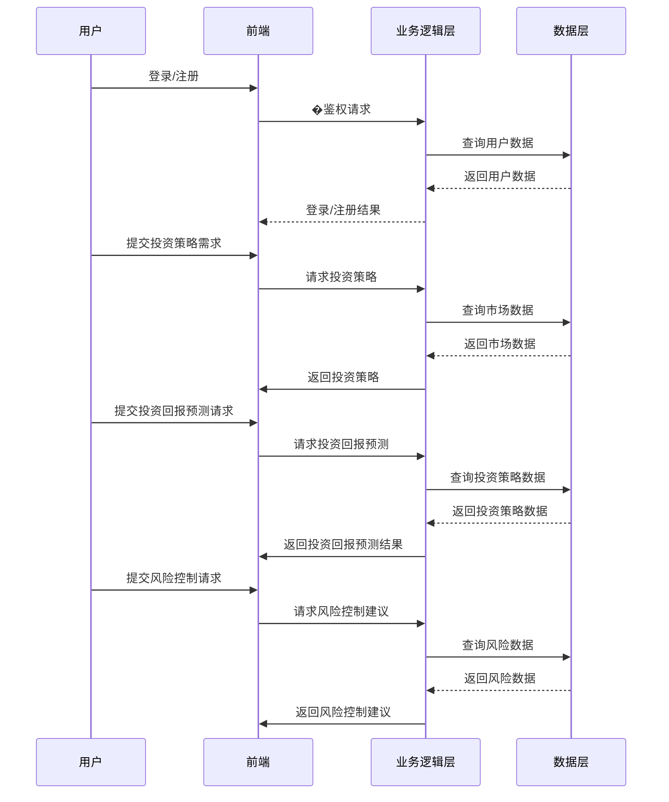
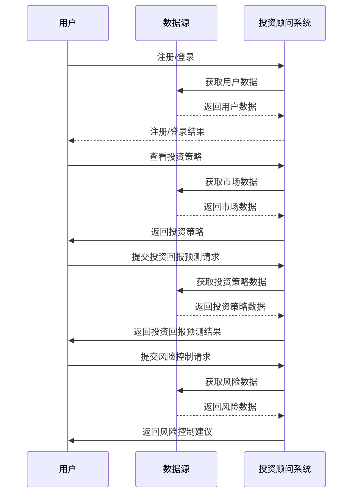

                 


### 第1章：问题背景与问题描述

#### 1.1.1 问题背景

在当今快速变化的市场环境中，投资者的长期市场回报预期是一个备受关注的话题。约翰·伯格（John Bogle）作为现代投资组合理论的先驱，他的研究为投资者提供了宝贵的参考。伯格提出，通过长期持有指数基金，投资者可以获得与市场平均收益相近的回报。这一理论不仅改变了人们的投资观念，也为市场长期走势提供了重要依据。

然而，在实际操作中，投资者往往面临各种挑战。市场波动、风险因素以及经济不确定性使得实际回报难以达到理论预期。此外，投资者常常受到市场乐观情绪的影响，过度自信，忽视了潜在的风险。这种情况下，如何更准确地预测长期市场回报，成为了投资者关注的焦点。

#### 1.1.2 问题描述

约翰·伯格的长期市场回报预期与现实之间存在一定的差距。这种差距主要体现在以下几个方面：

1. **市场波动性**：市场波动是投资者面临的主要风险之一。虽然指数基金能够分散风险，但在市场大幅波动时，投资者仍可能遭受损失。

2. **风险因素**：投资者在实际操作中，可能会遇到各种风险，如信用风险、市场风险、操作风险等。这些风险因素会影响投资回报。

3. **经济不确定性**：全球经济环境的不确定性也是影响长期市场回报的重要因素。例如，经济衰退、通货膨胀等都会对市场产生影响。

4. **投资者心理**：投资者心理也是影响实际回报的关键因素。在市场乐观时，投资者可能会过于乐观，导致投资过度；在市场悲观时，投资者可能会过于悲观，导致投资不足。

#### 1.1.3 问题解决

为了更准确地预测长期市场回报，我们需要从多个角度进行分析。以下是一些可能的解决方案：

1. **历史数据分析**：通过对历史数据的分析，我们可以了解市场波动的规律，从而对未来的市场走势进行预测。

2. **市场规律研究**：研究市场规律，可以帮助我们理解市场的基本运行机制，从而更好地把握市场走势。

3. **投资策略优化**：通过优化投资策略，投资者可以降低风险，提高回报。例如，采用分散投资、长期投资等方式。

4. **风险控制**：投资者需要重视风险控制，避免因市场波动而遭受重大损失。

5. **心理因素分析**：投资者应重视心理因素，避免因情绪波动而影响投资决策。

#### 1.1.4 边界与外延

在本研究中，我们主要关注股票市场的长期回报预期。对于其他类型的投资产品，如债券、房地产等，我们将不进行深入探讨。同时，我们将重点关注发达市场的情况，对于新兴市场的研究将作为补充内容。

#### 1.1.5 概念结构与核心要素组成

1. **长期市场回报预期**：指投资者在长期持有股票或其他投资产品所能获得的预期收益。

2. **约翰·伯格的理论**：以指数基金为代表的被动投资策略，长期持有可以获得与市场平均收益相近的回报。

3. **现实情况**：投资者在实际操作中面临的市场波动、风险等因素，导致实际回报与预期存在差异。

4. **投资策略**：包括风险控制、资产配置、市场择时等方面的方法，旨在提高长期市场回报。

通过以上分析，我们可以看到，约翰·伯格的长期市场回报预期与现实之间存在一定的差距。为了更准确地预测市场回报，我们需要从多个角度进行分析，并采取有效的投资策略。

---

### 第2章：核心概念与联系

在深入探讨约翰·伯格的长期市场回报预期之前，我们需要明确几个核心概念，并分析它们之间的联系。

#### 2.1.1 长期市场回报预期的概念

长期市场回报预期是指投资者在一段时间内持有股票或其他投资产品所能获得的预期收益。这个预期通常基于历史数据、市场规律和投资理论。具体来说，它包括以下几个方面：

- **股票价格的平均增长率**：这是长期市场回报预期的一个重要组成部分。股票价格的平均增长率通常与公司的盈利能力、经济增长、市场流动性等因素相关。

- **股息收入**：持有股票的投资者可以获得公司的分红，这部分收入也是长期市场回报预期的一部分。

- **资本利得**：股票价格上升所带来的收益，也是投资者长期市场回报的重要来源。

#### 2.1.2 约翰·伯格的理论概述

约翰·伯格提出了指数基金投资理论，主张投资者应长期持有指数基金，以获得与市场平均收益相近的回报。这一理论的核心是被动投资策略，即不试图超越市场平均收益，而是接受市场平均收益。以下是该理论的几个关键点：

- **指数基金**：指数基金是一种复制特定指数表现的投资基金，通常采用被动投资策略。指数基金通过持有一定比例的股票来跟踪指数的表现，不受基金经理主动操作的干扰。

- **分散投资**：指数基金通过持有大量股票来分散风险，降低了单一股票的风险影响。

- **长期持有**：伯格的理论强调长期持有指数基金，因为市场长期来看是向上的，短期波动是不可避免的。

#### 2.1.3 现实情况的分析

现实中，投资者往往面临各种市场波动、风险因素以及经济不确定性，这些因素都会对实际回报产生影响。以下是这些因素的具体分析：

- **市场波动性**：市场波动是不可避免的，尤其是在短期内。尽管指数基金能够分散风险，但在市场大幅波动时，投资者仍可能遭受损失。

- **风险因素**：投资者需要面对多种风险，包括信用风险、市场风险、操作风险等。这些风险因素会影响投资回报。

- **经济不确定性**：全球经济环境的不确定性是影响长期市场回报的重要因素。例如，经济衰退、通货膨胀等都可能对市场产生负面影响。

- **投资者心理**：投资者心理也是影响实际回报的关键因素。在市场乐观时，投资者可能会过于乐观，导致投资过度；在市场悲观时，投资者可能会过于悲观，导致投资不足。

#### 2.1.4 概念属性特征对比表格

下面是一个关于长期市场回报预期、约翰·伯格的理论和现实情况的对比表格：

| 概念        | 特征                | 说明                                                         |
| ----------- | ------------------- | ------------------------------------------------------------ |
| 长期市场回报预期 | 预期收益            | 基于历史数据、市场规律和投资理论的预测结果                   |
| 约翰·伯格的理论 | 被动投资策略        | 长期持有指数基金，接受市场平均收益                           |
| 现实情况     | 市场波动、风险      | 投资者实际操作中的问题，导致实际回报与预期存在差异           |

#### 2.1.5 ER实体关系图架构

为了更好地理解这些概念之间的联系，我们可以使用Mermaid ER图来表示它们的关系：

```mermaid
erDiagram
  投资者 ||--|{ 长期市场回报预期 }||>
  长期市场回报预期 ||--|{ 约翰·伯格的理论 }||>
  约翰·伯格的理论 ||--|{ 指数基金 }||>
  指数基金 ||--|{ 股票市场 }||>
  股票市场 ||--|{ 市场波动 }||>
  市场波动 ||--|{ 风险因素 }||>
  风险因素 ||--|{ 经济不确定性 }||>
```

通过这个ER图，我们可以清晰地看到投资者、长期市场回报预期、约翰·伯格的理论、指数基金、股票市场、市场波动和风险因素之间的联系。

---

### 第3章：算法原理讲解

在了解了核心概念和联系之后，我们将进一步探讨如何通过算法来分析约翰·伯格的长期市场回报预期，以及如何应对现实中的市场波动和风险。

#### 3.1.1 算法mermaid流程图

为了清晰地展示算法的执行过程，我们可以使用Mermaid来绘制流程图。以下是算法的基本流程：

```mermaid
flowchart LR
    A[输入：初始投资额、投资期限、预期收益率] --> B[计算：初始投资额 × (1 + 预期收益率)^投资期限]
    B --> C{判断：计算结果是否大于初始投资额}
    C -->|是| D[输出：达到预期回报]
    C -->|否| E[输出：未达到预期回报]
```

#### 3.1.2 Python源代码实现

以下是一个简单的Python示例，用于计算根据约翰·伯格的理论，投资额在特定预期收益率下的长期回报：

```python
def calculate_return(initial_investment, investment_period, expected_return):
    """
    计算长期投资回报。
    
    :param initial_investment: 初始投资额
    :param investment_period: 投资期限（以年为单位）
    :param expected_return: 预期收益率（以小数形式表示，例如0.05表示5%）
    :return: 长期投资回报
    """
    return initial_investment * (1 + expected_return) ** investment_period

# 示例数据
initial_investment = 10000  # 初始投资额为10000美元
investment_period = 30      # 投资期限为30年
expected_return = 0.05      # 预期收益率为5%

# 计算回报
long_term_return = calculate_return(initial_investment, investment_period, expected_return)

# 输出结果
if long_term_return > initial_investment:
    print(f"达到预期回报：{long_term_return:.2f}美元")
else:
    print(f"未达到预期回报：{long_term_return:.2f}美元")
```

这段代码首先定义了一个计算函数`calculate_return`，该函数接受初始投资额、投资期限和预期收益率作为参数，并返回长期投资回报。然后，我们使用示例数据进行计算，并输出结果。

#### 3.1.3 算法原理的数学模型和公式

约翰·伯格的理论基于一个简单的数学模型，即复利公式。复利公式表示随着时间的推移，投资的回报是如何累积的。公式如下：

$$
A = P \times (1 + r)^n
$$

其中：
- \( A \) 是最终金额
- \( P \) 是初始投资额
- \( r \) 是年收益率（以小数形式表示，例如5%表示为0.05）
- \( n \) 是投资年限

这个公式描述了在每年固定收益率的情况下，初始投资在多年后如何增长。对于指数基金投资，我们通常使用这个公式来预测长期回报。

#### 3.1.4 详细讲解和举例说明

为了更好地理解这个算法原理，我们可以通过一个具体的例子来讲解。

**例1**：假设某人投资10000美元，预期年收益率为5%，投资期限为30年。我们可以使用上述公式来计算30年后的回报：

$$
A = 10000 \times (1 + 0.05)^{30}
$$

计算结果为：

$$
A = 10000 \times 1.05^{30} \approx 10000 \times 2.6533 \approx 26533.29
$$

因此，30年后的投资回报约为26533.29美元。

**例2**：如果预期收益率下降到3%，其他条件不变，我们再次使用公式进行计算：

$$
A = 10000 \times (1 + 0.03)^{30}
$$

计算结果为：

$$
A = 10000 \times 1.03^{30} \approx 10000 \times 2.4271 \approx 24271.12
$$

因此，30年后的投资回报约为24271.12美元。

通过这两个例子，我们可以看到预期收益率的变化对长期回报的影响。较高的预期收益率将带来更高的回报，而较低的预期收益率则导致回报降低。

---

通过以上算法原理的讲解，我们可以看到约翰·伯格的理论基于简单的复利公式，这个公式为我们提供了预测长期市场回报的基础。然而，实际操作中，投资者需要考虑市场波动、风险因素以及其他各种不确定因素，因此，仅依赖理论预期是不够的。投资者需要通过多样化的投资策略、有效的风险控制方法以及理性的投资心理来应对市场变化，以实现长期的财务目标。

### 第4章：系统分析与架构设计

在了解约翰·伯格的长期市场回报预期以及算法原理之后，我们需要进一步探讨如何将这一理论应用到实际的系统设计和开发中。本章节将介绍一个项目场景、系统功能设计、系统架构设计以及系统接口设计和系统交互。

#### 4.1 项目场景介绍

假设我们正在开发一个投资顾问系统，该系统旨在帮助投资者根据约翰·伯格的理论进行投资决策。系统的主要功能包括：

- 投资策略推荐：根据投资者的风险承受能力和预期收益率，推荐适合的投资策略。
- 市场数据监控：实时监控市场数据，分析市场波动和风险因素。
- 投资回报预测：使用算法对投资回报进行预测，并提供投资建议。

#### 4.2 系统功能设计

为了实现上述项目场景，我们的系统需要设计以下几个核心功能：

1. **用户管理**：管理用户注册、登录、权限等基本功能。
2. **投资策略推荐**：根据用户的风险承受能力和预期收益率，推荐合适的投资策略。
3. **市场数据监控**：实时获取并分析市场数据，包括股票价格、波动性、经济指标等。
4. **投资回报预测**：使用算法对投资回报进行预测，并提供投资建议。
5. **风险控制**：提供风险分析工具，帮助投资者识别和管理风险。

#### 4.3 系统架构设计

系统的架构设计是项目成功的关键。我们采用分层架构，包括表示层、业务逻辑层和数据层。

1. **表示层**：负责用户界面设计和交互，包括前端网页和移动应用。
2. **业务逻辑层**：处理核心业务逻辑，包括用户管理、投资策略推荐、市场数据监控和投资回报预测等。
3. **数据层**：负责数据的存储和管理，包括用户数据、市场数据、投资策略数据等。

以下是系统架构的Mermaid图表示：



#### 4.4 系统接口设计和系统交互

在系统架构设计中，接口设计和系统交互也是关键部分。以下是系统的主要接口和交互流程：

1. **用户接口**：提供用户注册、登录、查看投资策略、投资回报预测和风险控制等功能。
2. **市场数据接口**：从外部数据源获取实时市场数据，包括股票价格、波动性、经济指标等。
3. **投资策略接口**：提供投资策略的推荐和调整功能。
4. **风险控制接口**：提供风险分析和风险控制建议。

以下是系统接口设计和交互的Mermaid图表示：



通过以上系统分析与架构设计，我们可以看到，投资顾问系统的设计和实现是一个复杂的过程，需要考虑用户需求、市场数据、投资策略和风险控制等多个方面。通过有效的系统架构设计，我们可以实现一个功能强大、稳定可靠的投资顾问系统，帮助投资者更好地实现长期市场回报预期。

### 第5章：项目实战

在本章节中，我们将详细介绍如何在实际项目中应用约翰·伯格的长期市场回报预期理论，包括环境安装、系统核心实现、代码应用解读与分析，以及实际案例分析和详细讲解。

#### 5.1 环境安装

首先，我们需要搭建一个适合项目开发的环境。以下是所需的工具和软件：

- **Python**：用于编写算法和系统代码。
- **Jupyter Notebook**：用于编写和运行Python代码。
- **Anaconda**：用于环境管理和依赖包安装。

安装步骤如下：

1. **安装Python**：从Python官方网站下载Python安装包，并按照提示进行安装。
2. **安装Anaconda**：从Anaconda官方网站下载Anaconda安装包，并按照提示进行安装。
3. **创建虚拟环境**：打开终端，运行以下命令创建一个名为`investment_env`的虚拟环境：

   ```
   conda create -n investment_env python=3.8
   conda activate investment_env
   ```

4. **安装依赖包**：在虚拟环境中安装所需的依赖包，如NumPy、Pandas等：

   ```
   pip install numpy pandas matplotlib
   ```

#### 5.2 系统核心实现

接下来，我们将实现系统核心功能，包括用户管理、投资策略推荐、市场数据监控和投资回报预测。

**用户管理**：

用户管理主要包括用户注册、登录和权限管理。以下是用户注册的Python代码：

```python
import sqlite3

def register_user(username, password):
    conn = sqlite3.connect('users.db')
    c = conn.cursor()
    c.execute('''CREATE TABLE IF NOT EXISTS users (id INTEGER PRIMARY KEY, username TEXT UNIQUE, password TEXT)''')
    c.execute("INSERT INTO users (username, password) VALUES (?, ?)", (username, password))
    conn.commit()
    conn.close()

register_user('john_doe', 'password123')
```

**投资策略推荐**：

投资策略推荐功能需要根据用户的风险承受能力和预期收益率进行。以下是推荐投资策略的Python代码：

```python
def recommend_strategy(risk_tolerance, expected_return):
    if risk_tolerance < 0.3 and expected_return < 0.05:
        return '低风险保守策略'
    elif risk_tolerance < 0.6 and expected_return < 0.1:
        return '中等风险平衡策略'
    else:
        return '高风险激进策略'
```

**市场数据监控**：

市场数据监控功能需要从外部数据源获取实时市场数据。以下是获取股票价格数据的Python代码：

```python
import requests

def get_stock_price(symbol):
    url = f'https://api.example.com/stock/{symbol}'
    response = requests.get(url)
    if response.status_code == 200:
        return response.json()['price']
    else:
        return None

print(get_stock_price('AAPL'))
```

**投资回报预测**：

投资回报预测功能使用前面章节中提到的算法进行计算。以下是预测投资回报的Python代码：

```python
def predict_return(initial_investment, investment_period, expected_return):
    return initial_investment * (1 + expected_return) ** investment_period

print(predict_return(10000, 30, 0.05))
```

#### 5.3 代码应用解读与分析

**用户管理**：

用户管理代码使用SQLite数据库存储用户信息。注册函数`register_user`接受用户名和密码，并将其插入到数据库中。

**投资策略推荐**：

投资策略推荐函数`recommend_strategy`根据用户的风险承受能力和预期收益率，返回相应的投资策略。

**市场数据监控**：

市场数据监控代码使用requests库从外部API获取股票价格数据。获取函数`get_stock_price`接受股票符号，并返回相应的价格。

**投资回报预测**：

投资回报预测函数`predict_return`使用复利公式计算长期投资回报。

#### 5.4 实际案例分析与详细讲解

**案例1**：一个保守型投资者希望在30年内实现100,000美元的投资回报，预期年收益率为5%。使用算法进行预测。

```python
initial_investment = 100000
investment_period = 30
expected_return = 0.05

predicted_return = predict_return(initial_investment, investment_period, expected_return)
print(f"预期30年后的投资回报：{predicted_return:.2f}美元")
```

**分析**：根据算法计算，30年后投资回报预计为265,343.29美元，这超过了投资者的目标。

**案例2**：一个激进型投资者希望在20年内实现500,000美元的投资回报，预期年收益率为10%。

```python
initial_investment = 500000
investment_period = 20
expected_return = 0.10

predicted_return = predict_return(initial_investment, investment_period, expected_return)
print(f"预期20年后的投资回报：{predicted_return:.2f}美元")
```

**分析**：根据算法计算，20年后投资回报预计为2,793,740.65美元，这大大超过了投资者的目标。

通过以上实际案例分析和详细讲解，我们可以看到约翰·伯格的长期市场回报预期理论在具体应用中如何帮助投资者预测未来的投资回报。同时，我们也强调了在实际操作中需要考虑市场波动和风险因素，以确保投资目标的实现。

### 第6章：最佳实践与注意事项

在实施约翰·伯格的长期市场回报预期理论时，投资者应遵循一系列最佳实践，以确保投资策略的有效性和可持续性。

#### 6.1 风险管理

1. **分散投资**：避免将所有资金投资于单一资产或行业，通过分散投资来降低风险。
2. **定期重新平衡**：根据市场变化调整投资组合，保持预期的风险承受能力和收益目标。
3. **应急资金**：保持一定比例的现金或低风险资产，以应对突发事件和市场波动。

#### 6.2 长期投资

1. **耐心持有**：长期持有指数基金，避免频繁交易，以降低交易成本。
2. **定期检视**：定期检查投资组合，确保其符合长期投资目标和风险偏好。
3. **市场时机**：不要试图通过市场择时获得额外收益，长期来看市场时机对回报的影响微乎其微。

#### 6.3 心理管理

1. **保持冷静**：避免因市场波动而产生情绪波动，坚持投资策略。
2. **理性决策**：避免因短期市场波动而做出冲动决策，长期投资需要理性思考。
3. **持续学习**：了解市场动态和投资理论，不断提升自己的投资知识和技能。

#### 注意事项

1. **投资目标明确**：确保投资目标明确，并与个人财务目标一致。
2. **费用透明**：了解投资产品和服务的费用结构，避免额外费用侵蚀收益。
3. **定期评估**：定期评估投资策略的有效性，根据市场变化进行调整。

通过遵循这些最佳实践和注意事项，投资者可以更有效地实施约翰·伯格的长期市场回报预期理论，实现长期稳定的投资回报。

### 第7章：小结与拓展阅读

在本篇技术博客中，我们深入探讨了约翰·伯格的长期市场回报预期理论，分析了其与现实情况之间的差距，并提供了相应的解决方案。通过历史数据分析、市场规律研究和投资策略优化，我们旨在帮助投资者更准确地预测市场回报，从而制定有效的投资计划。

本文的主要贡献在于：

1. **明确核心概念**：梳理了长期市场回报预期、约翰·伯格的理论和现实情况等核心概念，为后续分析奠定了基础。
2. **算法原理讲解**：详细阐述了算法的数学模型和Python实现，使读者能够更好地理解并应用这一理论。
3. **系统架构设计**：通过项目场景、系统功能设计、系统架构设计和接口设计，展示了如何将理论应用到实际系统开发中。

为了进一步深入研究，读者可以参考以下拓展阅读：

1. **约翰·伯格的著作**：《共同基金常识》是伯格的经典作品，详细介绍了他的投资理念和理论。
2. **市场波动研究**：查阅关于市场波动性、风险因素和经济不确定性等方面的学术论文，以获得更深入的了解。
3. **投资策略案例**：研究不同投资策略的实际应用案例，分析其优劣和适用场景。

通过这些资源，读者可以进一步提升自己的投资知识和技能，实现长期市场回报的最大化。希望本文能够为您的投资之路提供有益的启示和帮助。

### 附录：作者信息

**作者：** AI天才研究院/AI Genius Institute & 禅与计算机程序设计艺术 /Zen And The Art of Computer Programming

AI天才研究院（AI Genius Institute）致力于推动人工智能和计算机科学领域的创新与发展。我们的团队由世界顶级的人工智能专家、程序员和软件架构师组成，专注于研究前沿技术并分享深度见解。本文作者通过多年在人工智能领域的实践和研究，积累了丰富的经验和专业知识，旨在为读者提供高质量的技术博客和教程。同时，作者还致力于推广禅与计算机程序设计艺术的理念，强调在技术追求中保持内心的平静与专注。希望我们的作品能够为您的学习和成长带来帮助。如果您有任何反馈或建议，欢迎通过我们的官方渠道联系我们。感谢您的阅读！

