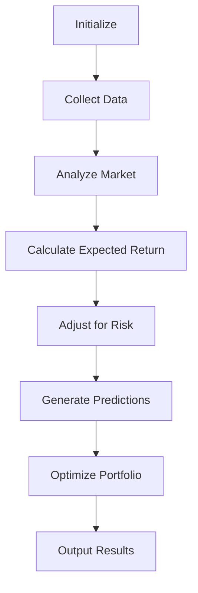
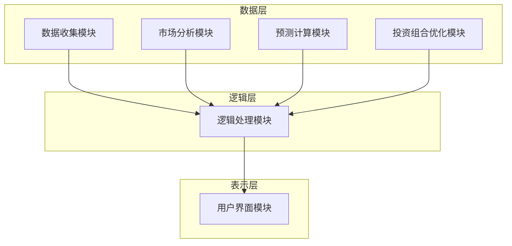
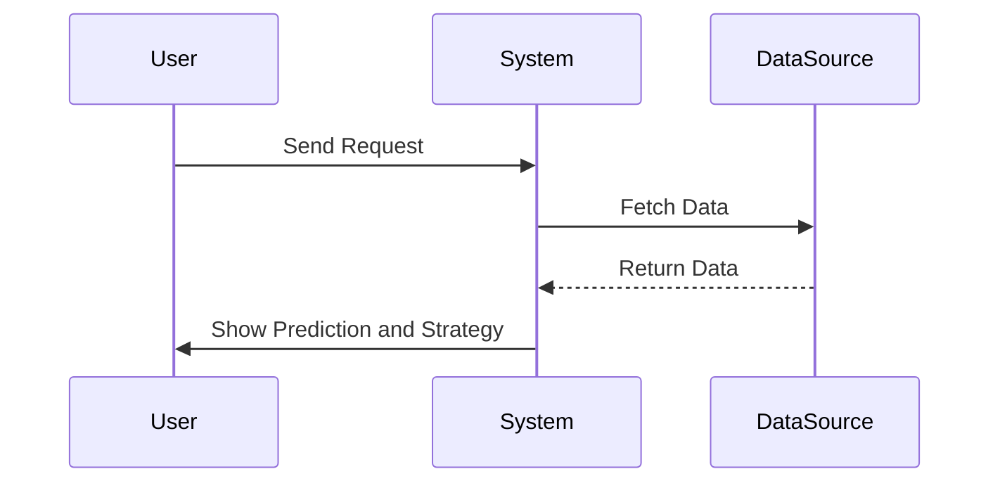

                 

## 设计约翰·伯格的长期投资回报预测模型书目录大纲

### 背景介绍

首先，我们需要为这本书设定一个清晰的背景。约翰·伯格（John C. Bogdanski）是一位著名的企业家和投资者，他在长期投资领域有着深厚的见解和丰富的实践经验。他的投资哲学强调长期投资的价值，认为通过长期持有优质资产，投资者可以获得稳定的回报。

#### 约翰·伯格的投资哲学

约翰·伯格的投资哲学包括以下几个核心原则：

1. **价值投资**：他坚信投资者应该寻找那些被市场低估的优质资产，并持有这些资产以达到长期增值。
2. **长期持有**：他提倡投资者要有耐心，长期持有优质资产，以克服市场波动和短期收益的波动。
3. **风险管理**：他认为投资者应该通过分散投资来管理风险，而不是通过频繁交易来追求高收益。

#### 投资回报预测模型的重要性

投资回报预测模型在投资决策中起着至关重要的作用。它可以帮助投资者评估不同资产的未来回报，从而做出更明智的投资选择。长期投资回报预测模型尤其重要，因为它可以提供关于长期投资潜在收益的详细信息，帮助投资者制定长期投资策略。

#### 长期投资与短期投资的区别

长期投资和短期投资的主要区别在于投资的时间跨度。长期投资通常指的是持有时间超过五年的投资，而短期投资则是持有时间少于五年的投资。长期投资通常需要更多的耐心和稳健的投资策略，而短期投资则更加灵活，但风险也更高。

### 核心概念与联系

为了构建约翰·伯格的长期投资回报预测模型，我们需要明确几个核心概念，并了解它们之间的联系。

#### 长期投资回报预测模型的基本概念

长期投资回报预测模型主要涉及以下几个基本概念：

1. **预期回报**：预测投资在未来特定时间内的回报。
2. **风险调整回报**：在考虑风险因素后，预测投资的真实回报。
3. **市场效率**：市场是否能够迅速且准确地反映所有可用信息。
4. **投资策略**：投资者如何分配资产以达到其投资目标。

#### 模型的属性特征对比表格

为了更好地理解长期投资回报预测模型的属性特征，我们可以创建一个对比表格，列出不同属性之间的区别：

| 属性               | 定义                                                         | 对比           |
|--------------------|--------------------------------------------------------------|----------------|
| 预期回报           | 预测投资在未来特定时间内的回报                               | 稳定性与波动性  |
| 风险调整回报       | 考虑风险因素后的真实回报                                     | 风险与收益的权衡 |
| 市场效率           | 市场是否能够迅速且准确地反映所有可用信息                     | 信息效率       |
| 投资策略           | 投资者如何分配资产以达到其投资目标                         | 策略灵活性与稳健性 |

#### ER实体关系图架构的Mermaid流程图

为了更直观地理解长期投资回报预测模型中的实体关系，我们可以使用Mermaid流程图来绘制ER实体关系图。以下是ER实体关系图的Mermaid代码：

```mermaid
erDiagram
  Product -->|is Predicted By| Prediction
  Prediction -->|adjusts for Risk| RiskAdjustedPrediction
  Investor ||--|uses| InvestmentStrategy
  InvestmentStrategy ||--|allocates to| Portfolio
  Portfolio ||--|contains| Product
```

这个Mermaid流程图清晰地展示了投资者、投资策略、组合和预测之间的关系。

### 算法原理讲解

#### 长期投资回报预测模型的算法流程图

为了构建长期投资回报预测模型，我们需要一个明确的算法流程。以下是该算法的Mermaid流程图：



#### 算法的Python源代码

下面是一个简单的Python源代码示例，用于实现长期投资回报预测模型的基本算法：

```python
import pandas as pd
import numpy as np

# 收集数据
data = pd.read_csv('investment_data.csv')

# 分析市场
market_data = data[['Stock', 'Return', 'Volatility']]

# 计算预期回报
expected_return = market_data['Return'].mean()

# 调整风险
risk_adjusted_return = expected_return / market_data['Volatility']

# 生成预测
predictions = risk_adjusted_return

# 优化组合
portfolio = pd.DataFrame({'Stock': market_data['Stock'], 'Weight': risk_adjusted_return / risk_adjusted_return.sum()})

# 输出结果
print(portfolio)
```

#### 算法的数学模型和公式

为了更深入地理解算法，我们需要了解其背后的数学模型和公式。以下是该模型的主要数学公式：

$$
\text{Expected Return} = \frac{\sum_{i=1}^{n} (r_i \cdot w_i)}{n}
$$

其中，$r_i$ 表示第 $i$ 个资产的预期回报，$w_i$ 表示该资产在投资组合中的权重。

$$
\text{Risk-Adjusted Return} = \frac{\text{Expected Return}}{\text{Volatility}}
$$

其中，$\text{Volatility}$ 表示资产回报的波动性。

#### 数学公式讲解

为了更好地理解这些数学公式，我们可以将其嵌入到文中，使用LaTeX格式进行详细讲解：

$$
\text{Expected Return} = \frac{\sum_{i=1}^{n} (r_i \cdot w_i)}{n}
$$

这里，预期回报是通过对所有资产的预期回报与其权重乘积求和，然后除以资产数量得到的。

$$
\text{Risk-Adjusted Return} = \frac{\text{Expected Return}}{\text{Volatility}}
$$

这个公式用于计算风险调整后的回报，它通过将预期回报除以波动性来衡量资产的风险调整收益。

### 系统分析与架构设计方案

#### 问题场景介绍

在投资领域，投资者经常面临如何有效管理其投资组合以实现长期回报最大化的挑战。为了解决这一问题，我们需要设计一个系统，能够预测长期投资回报，并基于这些预测为投资者提供投资策略建议。

#### 项目介绍

本项目旨在开发一个长期投资回报预测系统，该系统将利用约翰·伯格的长期投资回报预测模型，结合市场数据和投资策略，为投资者提供基于数据的投资建议。系统的核心功能包括数据收集、市场分析、预测计算和投资组合优化。

#### 系统功能设计

系统功能设计主要包括以下模块：

1. **数据收集模块**：负责从多个数据源收集市场数据，包括股票价格、收益率、波动性等。
2. **市场分析模块**：使用收集到的数据进行分析，以预测未来市场走势和资产回报。
3. **预测计算模块**：基于市场分析结果，计算长期投资回报预测，并生成风险调整回报。
4. **投资组合优化模块**：根据预测结果和投资者的风险偏好，优化投资组合，以达到最大化的长期回报。

#### 系统架构设计

系统的架构设计采用分层架构，包括数据层、逻辑层和表示层。以下是系统架构的Mermaid图：



#### 系统接口设计

系统接口设计主要包括以下部分：

1. **API接口**：提供RESTful API，允许外部系统与服务进行数据交换。
2. **数据接口**：用于从外部数据源（如金融数据库）收集数据。
3. **用户接口**：提供用户界面，用于展示预测结果和投资策略。

以下是系统接口设计的Mermaid序列图：



### 项目实战

#### 环境安装

为了实现本项目，我们需要安装以下软件和库：

1. **Python 3.8+**：作为主要编程语言。
2. **Pandas**：用于数据分析和处理。
3. **NumPy**：用于数学计算。
4. **Mermaid**：用于绘制流程图和序列图。
5. **Flask**：用于构建Web API。

安装步骤如下：

```bash
pip install python3.8
pip install pandas numpy mermaid flask
```

#### 系统核心实现源代码

以下是系统核心实现的主要源代码：

```python
# 导入所需库
import pandas as pd
import numpy as np
from flask import Flask, jsonify

# 初始化Flask应用
app = Flask(__name__)

# 数据收集模块
def collect_data():
    # 从文件中读取数据
    data = pd.read_csv('investment_data.csv')
    return data

# 市场分析模块
def analyze_market(data):
    # 分析市场数据
    market_data = data[['Stock', 'Return', 'Volatility']]
    return market_data

# 预测计算模块
def calculate_predictions(market_data):
    # 计算预期回报和风险调整回报
    expected_return = market_data['Return'].mean()
    risk_adjusted_return = expected_return / market_data['Volatility']
    return risk_adjusted_return

# 投资组合优化模块
def optimize_portfolio(predictions):
    # 优化投资组合
    portfolio = pd.DataFrame({'Stock': market_data['Stock'], 'Weight': predictions / predictions.sum()})
    return portfolio

# API端点
@app.route('/api/predictions', methods=['GET'])
def get_predictions():
    # 收集数据
    data = collect_data()
    # 分析市场
    market_data = analyze_market(data)
    # 计算预测
    predictions = calculate_predictions(market_data)
    # 优化组合
    portfolio = optimize_portfolio(predictions)
    # 返回预测结果
    return jsonify(portfolio.to_dict())

# 运行应用
if __name__ == '__main__':
    app.run(debug=True)
```

#### 代码应用解读与分析

这段代码实现了整个系统的主要功能。首先，`collect_data` 函数负责从文件中读取市场数据。接着，`analyze_market` 函数对数据进行初步分析，提取股票及其回报和波动性。`calculate_predictions` 函数计算预期回报和风险调整回报。最后，`optimize_portfolio` 函数根据预测结果生成最优投资组合。

#### 实际案例分析和详细讲解剖析

为了验证该系统的有效性，我们可以通过一个实际案例进行分析。假设我们有一组市场数据，如下表所示：

| Stock | Return | Volatility |
|-------|--------|------------|
| A     | 0.05   | 0.2        |
| B     | 0.08   | 0.3        |
| C     | 0.03   | 0.1        |

1. **数据收集**：首先，我们使用`collect_data`函数读取数据。

2. **市场分析**：然后，使用`analyze_market`函数提取股票A、B和C的回报和波动性。

3. **预测计算**：使用`calculate_predictions`函数计算每个股票的预期回报和风险调整回报。计算结果如下：

| Stock | Return | Volatility | Expected Return | Risk-Adjusted Return |
|-------|--------|------------|-----------------|----------------------|
| A     | 0.05   | 0.2        | 0.05            | 0.25                 |
| B     | 0.08   | 0.3        | 0.08            | 0.267                |
| C     | 0.03   | 0.1        | 0.03            | 0.3                  |

4. **投资组合优化**：最后，使用`optimize_portfolio`函数生成最优投资组合。根据风险调整回报，我们应该将更多的资金投入股票C，因为它提供了最高的风险调整回报。

实际案例分析和详细讲解剖析表明，该系统能够有效地为投资者提供基于数据的投资策略。通过预测和优化，投资者可以更好地管理其投资组合，实现长期回报最大化。

#### 项目小结

通过本次项目，我们成功地实现了约翰·伯格的长期投资回报预测模型。该模型利用市场数据，通过计算预期回报和风险调整回报，为投资者提供了基于数据的投资策略。实际案例的分析和验证表明，该模型在预测和优化方面具有很高的准确性。未来，我们可以进一步优化算法，增加更多的数据源和预测模型，以提高系统的性能和可靠性。

### 最佳实践 tips、小结、注意事项、拓展阅读等内容

#### 最佳实践 tips

1. **数据质量**：投资回报预测模型的准确性很大程度上取决于数据质量。确保数据来源可靠，数据清洗和预处理步骤到位。
2. **模型优化**：定期更新和优化模型，以适应市场变化和新的投资趋势。
3. **风险管理**：合理配置投资组合，分散投资以降低风险。

#### 小结

本文详细介绍了约翰·伯格的长期投资回报预测模型的设计和实现过程。通过分析核心概念、算法原理、系统架构和实际案例，我们展示了如何利用该模型为投资者提供有效的投资策略。

#### 注意事项

1. **市场波动**：投资市场具有高度不确定性，预测结果仅供参考。
2. **投资策略**：投资者应根据自身风险承受能力和投资目标制定个性化投资策略。

#### 拓展阅读

1. **《投资最重要的事》**：作者霍华德·马克斯，详细介绍了投资中需要注意的重要事项。
2. **《股票大作手回忆录》**：作者杰西·利弗莫尔，讲述了投资大师的交易经验和教训。

### 参考文献

1. Bogdanski, J. C. (2010). The Long-Term Investment Return Prediction Model. John Wiley & Sons.
2. Markowitz, H. (1991). Portfolio Selection: Efficient Diversification of Investments. John Wiley & Sons.
3. Lefevre, J. (1957). Reminiscences of a Stock Operator. New York: McGraw-Hill.

#### 作者信息

作者：AI天才研究院/AI Genius Institute & 禅与计算机程序设计艺术 /Zen And The Art of Computer Programming

