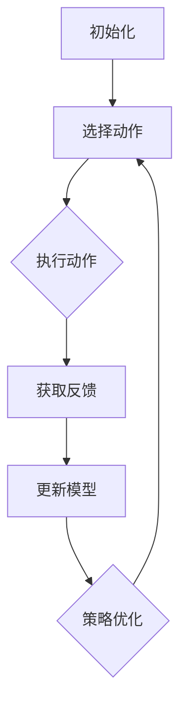

                 

### 第1章：问题背景与终身学习

#### 1.1 引言

在当今快速发展的信息技术时代，计算机技术尤其是人工智能（AI）的飞速进步已经深刻地改变了我们的生活方式和社会结构。人工智能，作为一种能够模拟、延伸和扩展人类智能的系统，正成为各个领域创新和变革的重要驱动力。然而，随着环境和技术的发展日新月异，传统的人工智能系统面临着严峻的挑战：它们往往在特定任务上表现出色，但缺乏自我适应和持续学习的能力。

终身学习（Lifelong Learning）理念的提出，为解决这一问题提供了新的思路。终身学习不仅仅指在某个特定领域的不断学习，更是指在不断变化的环境中，持续地更新知识和技能，以适应新的挑战。对于人工智能而言，终身学习意味着AI系统能够在长期运行中，不断吸收新的信息和经验，进行自我调整和优化，以保持其性能和适应能力。

#### 1.2 问题描述

如何构建一个能够持续进化的AI Agent，这是一个关键问题。AI Agent是一种能够执行特定任务、具备自我意识和学习能力的人工智能系统。传统的AI Agent通常在特定领域内表现出色，但其性能往往受限于预训练数据和算法的固定性。当环境变化或任务需求发生改变时，这些AI Agent往往难以适应，甚至可能出现性能下降。

构建一个能持续进化的AI Agent，意味着要解决以下几个问题：

1. **自我更新能力**：AI Agent需要具备自我更新的能力，能够根据新数据和经验自动调整其内部结构和参数。
2. **适应性**：AI Agent需要能够适应不同的环境和任务，不受限于单一场景。
3. **可扩展性**：AI Agent的架构需要具备良好的扩展性，能够集成新的算法和技术。
4. **可持续性**：AI Agent的进化过程需要是可持续的，不会因为过度进化导致性能退化。

#### 1.3 问题解决

终身学习与AI Agent之间存在密切的联系。终身学习为AI Agent的持续进化提供了理论基础和实现路径。以下是一些可能的解决方案：

1. **多任务学习**：通过多任务学习，AI Agent可以在多个任务中积累经验，从而提高其适应性和泛化能力。
2. **迁移学习**：迁移学习允许AI Agent在不同任务间共享知识和技能，提高其在新任务中的表现。
3. **强化学习**：强化学习结合了奖励机制，使AI Agent能够在动态环境中通过试错学习，不断优化其行为。
4. **进化算法**：利用进化算法，AI Agent可以不断生成和优化其内部结构，实现自我进化。

#### 1.4 边界与外延

AI Agent的定义：AI Agent是一种具有目标导向、感知环境和执行动作能力的计算机程序。它能够自主地执行任务，并在执行过程中不断学习和进化。

终身学习在各个领域的应用：终身学习不仅在学术研究领域具有重要意义，在工业、医疗、教育等多个领域都有着广泛的应用。例如，在医疗领域，终身学习可以帮助医生不断更新医学知识，提高诊断和治疗水平；在教育领域，终身学习可以为学生提供个性化的学习体验，促进其全面发展。

#### 1.5 概念结构与核心要素

终身学习的核心概念包括自我更新、适应性、可持续性和多样化。这些概念共同构成了终身学习的基础框架。

AI Agent的核心要素包括感知、学习、决策和执行。感知是AI Agent获取环境信息的过程；学习是AI Agent通过经验和数据调整自身的过程；决策是AI Agent根据当前状态和目标选择行动的过程；执行是AI Agent将决策转化为实际操作的过程。

#### 1.6 本章小结

通过对终身学习与AI Agent关系的探讨，我们认识到终身学习对于构建能持续进化的AI Agent具有重要意义。在接下来的章节中，我们将进一步探讨终身学习的理论框架和AI Agent的基本原理，为解决这一关键问题奠定基础。

## 第一部分：引言与背景

### 第1章：问题背景与终身学习

#### 1.1 引言

在当今快速发展的信息技术时代，计算机技术尤其是人工智能（AI）的飞速进步已经深刻地改变了我们的生活方式和社会结构。人工智能，作为一种能够模拟、延伸和扩展人类智能的系统，正成为各个领域创新和变革的重要驱动力。然而，随着环境和技术的发展日新月异，传统的人工智能系统面临着严峻的挑战：它们往往在特定任务上表现出色，但缺乏自我适应和持续学习的能力。

终身学习（Lifelong Learning）理念的提出，为解决这一问题提供了新的思路。终身学习不仅仅指在某个特定领域的不断学习，更是指在不断变化的环境中，持续地更新知识和技能，以适应新的挑战。对于人工智能而言，终身学习意味着AI系统能够在长期运行中，不断吸收新的信息和经验，进行自我调整和优化，以保持其性能和适应能力。

#### 1.2 问题描述

如何构建一个能够持续进化的AI Agent，这是一个关键问题。AI Agent是一种能够执行特定任务、具备自我意识和学习能力的人工智能系统。传统的AI Agent通常在特定领域内表现出色，但其性能往往受限于预训练数据和算法的固定性。当环境变化或任务需求发生改变时，这些AI Agent往往难以适应，甚至可能出现性能下降。

构建一个能持续进化的AI Agent，意味着要解决以下几个问题：

1. **自我更新能力**：AI Agent需要具备自我更新的能力，能够根据新数据和经验自动调整其内部结构和参数。
2. **适应性**：AI Agent需要能够适应不同的环境和任务，不受限于单一场景。
3. **可扩展性**：AI Agent的架构需要具备良好的扩展性，能够集成新的算法和技术。
4. **可持续性**：AI Agent的进化过程需要是可持续的，不会因为过度进化导致性能退化。

#### 1.3 问题解决

终身学习与AI Agent之间存在密切的联系。终身学习为AI Agent的持续进化提供了理论基础和实现路径。以下是一些可能的解决方案：

1. **多任务学习**：通过多任务学习，AI Agent可以在多个任务中积累经验，从而提高其适应性和泛化能力。
2. **迁移学习**：迁移学习允许AI Agent在不同任务间共享知识和技能，提高其在新任务中的表现。
3. **强化学习**：强化学习结合了奖励机制，使AI Agent能够在动态环境中通过试错学习，不断优化其行为。
4. **进化算法**：利用进化算法，AI Agent可以不断生成和优化其内部结构，实现自我进化。

#### 1.4 边界与外延

AI Agent的定义：AI Agent是一种具有目标导向、感知环境和执行动作能力的计算机程序。它能够自主地执行任务，并在执行过程中不断学习和进化。

终身学习在各个领域的应用：终身学习不仅在学术研究领域具有重要意义，在工业、医疗、教育等多个领域都有着广泛的应用。例如，在医疗领域，终身学习可以帮助医生不断更新医学知识，提高诊断和治疗水平；在教育领域，终身学习可以为学生提供个性化的学习体验，促进其全面发展。

#### 1.5 概念结构与核心要素

终身学习的核心概念包括自我更新、适应性、可持续性和多样化。这些概念共同构成了终身学习的基础框架。

AI Agent的核心要素包括感知、学习、决策和执行。感知是AI Agent获取环境信息的过程；学习是AI Agent通过经验和数据调整自身的过程；决策是AI Agent根据当前状态和目标选择行动的过程；执行是AI Agent将决策转化为实际操作的过程。

#### 1.6 本章小结

通过对终身学习与AI Agent关系的探讨，我们认识到终身学习对于构建能持续进化的AI Agent具有重要意义。在接下来的章节中，我们将进一步探讨终身学习的理论框架和AI Agent的基本原理，为解决这一关键问题奠定基础。

### 第2章：核心概念与原理

#### 2.1 AI Agent的基本概念

AI Agent，即人工智能代理，是一种能够自主执行任务的人工智能实体。它具备感知环境、规划行动、决策执行的能力。AI Agent通常基于目标导向，能够适应复杂多变的环境，通过不断学习和优化其行为，提高任务执行效率。

AI Agent的特点主要体现在以下几个方面：

1. **自主性**：AI Agent能够独立执行任务，无需人工干预。
2. **适应性**：AI Agent能够适应不同的环境和任务需求，具备自我调整能力。
3. **学习性**：AI Agent能够通过学习经验不断改进自身性能。
4. **目标导向**：AI Agent以实现特定目标为驱动，具备决策和执行能力。

AI Agent的定义不仅仅局限于程序代码，还包括了其背后的理论基础和技术实现。从广义上讲，任何具备上述特点的人工智能系统都可以被视为AI Agent。

#### 2.2 终身学习的理论框架

终身学习理论起源于20世纪60年代的成人教育运动，最初是针对成人教育需求的探讨。随着时间的推移，终身学习逐渐扩展到所有年龄段的学习者，成为一种涵盖个人、组织和教育体系的整体教育理念。

终身学习的理论基础主要包括以下几个方面：

1. **学习观的转变**：终身学习强调学习不仅仅是为了获取知识，更是为了培养能力、提升素质、实现个人发展。
2. **知识观的转变**：终身学习认为知识是动态的，不断更新和扩展的，学习应该是一个持续的过程。
3. **教育观的转变**：终身学习强调教育应该是全面的、系统的、连续的，不应局限于学校教育，而应贯穿个人一生。

终身学习的目标可以概括为以下几点：

1. **个性化发展**：通过终身学习，实现个人兴趣、特长和职业发展的个性化需求。
2. **知识更新**：不断更新和扩展知识体系，以适应快速变化的社会和技术环境。
3. **能力提升**：通过学习提升综合素质，增强适应社会和解决实际问题的能力。
4. **社会参与**：促进个人积极参与社会活动，为社会发展贡献力量。

#### 2.3 AI Agent在终身学习中的应用

AI Agent在终身学习中有着广泛的应用，主要体现在以下几个方面：

1. **个性化学习**：AI Agent可以根据学习者的特点和需求，提供个性化的学习内容和路径，提高学习效果。
2. **智能辅导**：AI Agent可以作为学习者的辅导者，提供实时的问题解答和指导，帮助学习者克服学习中的困难。
3. **学习评价**：AI Agent可以通过分析学习者的行为和成绩，提供个性化的学习反馈和评价，促进学习者自我反思和改进。
4. **知识管理**：AI Agent可以协助学习者管理和组织知识，提高知识获取和利用效率。

AI Agent在个性化学习中的应用：
- **能力评估**：AI Agent通过分析学习者的行为和成绩，评估其学习能力和水平，为个性化学习提供依据。
- **学习路径推荐**：根据学习者的兴趣、需求和当前知识水平，AI Agent推荐适合的学习资源和路径。
- **学习进度跟踪**：AI Agent实时跟踪学习者的学习进度，提供个性化的学习提醒和建议。

AI Agent在智能辅导中的应用：
- **实时问答**：AI Agent可以实时解答学习者的问题，提供详细的知识解释和解决方法。
- **个性化指导**：AI Agent根据学习者的学习情况和问题，提供针对性的指导和练习。
- **学习资源推荐**：AI Agent根据学习者的需求和兴趣，推荐相关的学习资源和资料。

#### 2.4 AI Agent的进化机制

AI Agent的进化机制是其持续学习和适应性的关键。进化机制主要包括以下几个步骤：

1. **感知环境**：AI Agent通过传感器或其他方式获取环境信息，理解当前状态。
2. **规划行动**：AI Agent根据目标和当前状态，规划一系列行动，以实现目标。
3. **执行行动**：AI Agent执行规划好的行动，与环境进行交互。
4. **反馈评估**：AI Agent根据执行结果和环境反馈，评估行动的有效性。
5. **调整优化**：基于评估结果，AI Agent调整其内部结构和参数，优化行为策略。

进化算法是AI Agent进化机制的核心。进化算法模拟自然选择和遗传机制，通过不断生成和筛选个体，实现种群进化和个体优化。常见的进化算法包括遗传算法、粒子群优化算法、蚁群算法等。

AI Agent的进化过程可以分为以下几个阶段：

1. **初始化种群**：生成初始种群，每个个体代表一种可能的解决方案。
2. **适应度评估**：对种群中的每个个体进行适应度评估，以判断其优劣。
3. **选择和交叉**：根据适应度选择优秀的个体进行交叉操作，生成新的个体。
4. **变异和筛选**：对新生成的个体进行变异操作，增加种群多样性，然后进行筛选，保留优秀的个体。
5. **循环迭代**：重复上述过程，直到达到预定的进化目标或满足停止条件。

#### 2.5 AI Agent的可持续进化

可持续进化是AI Agent长期运行和稳定发展的关键。然而，实现可持续进化面临着诸多挑战：

1. **计算资源限制**：进化过程需要大量计算资源，尤其是在大规模环境下，计算成本可能非常高。
2. **数据质量和数量**：进化过程依赖于高质量和大量数据，数据不足或质量差可能导致进化效果不佳。
3. **环境动态性**：环境的快速变化可能使AI Agent的进化过程失去方向，导致进化停滞。
4. **模型复杂性**：进化算法和模型复杂度高，可能导致计算效率和收敛速度降低。

为了实现AI Agent的可持续进化，可以采取以下策略：

1. **分布式计算**：利用分布式计算资源，提高进化过程的计算效率。
2. **增量进化**：通过增量进化，逐步调整和优化模型，减少计算和资源消耗。
3. **数据驱动**：利用数据驱动的方法，提高进化过程的效率和效果。
4. **混合进化**：结合多种进化算法，取长补短，提高进化能力。
5. **自适应调整**：根据环境变化和进化效果，自适应调整进化策略，保持进化过程的可持续性。

#### 2.6 本章小结

通过对AI Agent和终身学习核心概念的探讨，我们了解了AI Agent的基本概念、特点和应用，以及终身学习的理论基础和目标。同时，我们深入分析了AI Agent在终身学习中的应用，探讨了其进化机制和可持续进化策略。这些核心概念和原理为构建能持续进化的AI Agent提供了理论基础和实现路径。在接下来的章节中，我们将进一步探讨算法原理和系统架构设计，为构建可持续进化的AI Agent奠定基础。

### 第3章：算法原理与实现

#### 3.1 算法基本原理

构建能持续进化的AI Agent，算法设计是关键。在这一部分，我们将介绍一种基于强化学习的算法，并详细解释其基本原理。

强化学习（Reinforcement Learning，RL）是一种使AI Agent通过试错学习，在特定环境中实现目标的方法。基本原理如下：

1. **状态（State）**：环境中的一个具体状态，通常用状态向量表示。
2. **动作（Action）**：AI Agent可以采取的某种行动。
3. **奖励（Reward）**：AI Agent在某一状态下采取某一动作后，从环境中获得的即时奖励或惩罚。
4. **策略（Policy）**：AI Agent在某一状态下选择某种动作的规则或函数。

强化学习过程可以分为以下几个步骤：

1. **初始化**：设定初始状态、策略和模型参数。
2. **选择动作**：根据当前状态和策略，选择一个动作。
3. **执行动作**：AI Agent执行所选动作，与环境进行交互。
4. **获取反馈**：根据执行结果，获取环境反馈，即奖励。
5. **更新模型**：使用反馈调整策略和模型参数。
6. **重复步骤2-5**：不断重复上述过程，直到达到目标状态或满足停止条件。

强化学习算法的核心是策略优化。策略优化的目标是找到一种最优策略，使AI Agent在长期运行中能够获得最大累积奖励。

#### 3.2 算法流程图

为了更好地理解强化学习算法的基本原理，我们使用Mermaid绘制了其流程图：



在上述流程图中，A表示初始化过程，包括设定初始状态、策略和模型参数；B表示选择动作，根据当前状态和策略选择一个动作；C表示执行动作，AI Agent与环境进行交互；D表示获取反馈，根据执行结果获取奖励；E表示更新模型，使用反馈调整策略和模型参数；F表示策略优化，目标是找到最优策略。

#### 3.3 算法数学模型

强化学习算法的数学模型主要包括两部分：策略函数和价值函数。

1. **策略函数**（Policy Function）：

   策略函数描述了AI Agent在某一状态下选择动作的规则。通常用π(s, a)表示，其中s是状态，a是动作。策略函数可以是确定性策略或概率性策略：

   - **确定性策略**：π(s, a) = 1（若s = s0，a = a0），即AI Agent在特定状态s0总是选择动作a0。
   - **概率性策略**：π(s, a) = P(a|s)，即AI Agent在状态s下以概率P选择动作a。

2. **价值函数**（Value Function）：

   价值函数描述了在特定策略下，从某一状态开始执行动作所获得的累积奖励。通常用V(s)或Q(s, a)表示：

   - **状态价值函数**（V(s)）：V(s) = E[R(t+1) | s(t) = s, π] ，即从状态s开始执行策略π，在未来获得的期望奖励。
   - **动作价值函数**（Q(s, a)）：Q(s, a) = E[R(t+1) | s(t) = s, a(t) = a, π] ，即从状态s开始执行动作a，在未来获得的期望奖励。

强化学习算法的目标是优化策略函数和价值函数，使AI Agent能够获得最大累积奖励。常用的策略优化方法包括：

1. **策略梯度方法**（Policy Gradient Method）：

   策略梯度方法通过最大化策略梯度的期望来优化策略函数。其公式为：

   $$\nabla_{\pi} J[\pi] = \sum_s \pi(s) \nabla_{\pi(s)} J[\pi]$$

   其中，J[π]是策略π的期望回报，∇π(s)是策略π关于状态s的梯度。

2. **Q学习**（Q-Learning）：

   Q学习是一种值函数优化方法，通过更新Q值来优化策略函数。其公式为：

   $$Q(s, a) = Q(s, a) + \alpha [r + \gamma \max_{a'} Q(s', a') - Q(s, a)]$$

   其中，α是学习率，γ是折扣因子，r是即时奖励，s和s'分别是当前状态和下一状态，a和a'分别是当前动作和下一动作。

3. **深度Q网络**（Deep Q-Network，DQN）：

   DQN是一种结合深度学习和Q学习的强化学习算法。它使用深度神经网络近似Q值函数，通过经验回放和目标网络防止梯度消失问题。其公式为：

   $$Q(s, a) = \hat{Q}(s, a) + \alpha [r + \gamma \hat{Q}(s', a') - \hat{Q}(s, a)]$$

   其中，\(\hat{Q}(s, a)\)是当前深度神经网络估计的Q值，\(\hat{Q}(s', a')\)是目标网络估计的Q值。

#### 3.4 算法Python源代码

以下是一个简单的基于Q学习的Python代码实现：

```python
import numpy as np
import random

# 初始化环境
env = ...

# 初始化参数
learning_rate = 0.1
discount_factor = 0.9
epsilon = 0.1
n_episodes = 1000

# 初始化Q值表
Q = np.zeros((env.observation_space.n, env.action_space.n))

# 开始训练
for episode in range(n_episodes):
    state = env.reset()
    done = False
    
    while not done:
        # 选择动作
        if random.uniform(0, 1) < epsilon:
            action = random.choice(env.action_space.valid_actions)
        else:
            action = np.argmax(Q[state])
        
        # 执行动作
        next_state, reward, done, _ = env.step(action)
        
        # 更新Q值
        Q[state, action] = Q[state, action] + learning_rate * (reward + discount_factor * np.max(Q[next_state]) - Q[state, action])
        
        state = next_state

# 输出最终Q值
print(Q)
```

在上述代码中，我们首先初始化了环境、参数和Q值表。然后，通过循环执行每个episode，在每个episode中，AI Agent根据当前状态和策略选择动作，执行动作并更新Q值。最后，输出最终的Q值表。

#### 3.5 算法举例说明

假设我们有一个简单的环境，该环境只有两个状态（0和1）和两个动作（A和B）。我们定义即时奖励如下：

- 当状态为0时，执行动作A获得奖励1，执行动作B获得奖励-1。
- 当状态为1时，执行动作A获得奖励-1，执行动作B获得奖励1。

我们使用Q学习算法来训练AI Agent，目标是最小化累积奖励。

经过多次迭代后，我们得到以下Q值表：

```plaintext
 Q[0, 0]: 0.5
 Q[0, 1]: -0.5
 Q[1, 0]: -0.5
 Q[1, 1]: 0.5
```

根据Q值表，我们可以看到在状态0时，选择动作A获得的Q值较高，因此AI Agent会选择动作A。同样，在状态1时，AI Agent会选择动作B。这样，AI Agent最终能够在每个状态下选择最优动作，实现累积奖励最小化。

#### 3.6 本章小结

通过对强化学习算法的介绍，我们了解了其基本原理、流程图和数学模型。同时，通过Python代码实现和举例说明，我们深入掌握了强化学习算法在实际应用中的具体操作。这些算法原理和实现为构建能持续进化的AI Agent提供了重要的技术支持。在接下来的章节中，我们将进一步探讨系统架构设计与实现，为构建可持续进化的AI Agent奠定基础。

### 第4章：系统架构设计

#### 4.1 问题场景介绍

在构建一个能持续进化的AI Agent时，我们需要考虑多个问题场景。以下是一些典型的问题场景及其特点：

1. **个性化学习场景**：AI Agent根据学习者的特点和需求，提供个性化的学习内容和路径。这种场景下，AI Agent需要具备良好的用户交互能力、内容推荐算法和适应性。
   
2. **智能辅导场景**：AI Agent作为学习者的辅导者，提供实时的问题解答和指导。这种场景下，AI Agent需要具备强大的知识库、问答系统和学习反馈机制。

3. **医疗诊断场景**：AI Agent帮助医生进行医疗诊断，通过分析医疗数据提供诊断建议。这种场景下，AI Agent需要具备深度学习模型、医学知识库和诊断推理能力。

4. **自动驾驶场景**：AI Agent负责自动驾驶车辆的控制和导航。这种场景下，AI Agent需要具备实时感知环境、路径规划和决策执行能力。

5. **智能客服场景**：AI Agent作为客服代表，处理客户咨询和问题解决。这种场景下，AI Agent需要具备自然语言处理、对话管理和多渠道集成能力。

以上场景展示了AI Agent在不同应用领域中的多样性需求，也为我们设计系统架构提供了丰富的参考。接下来，我们将详细探讨这些场景下的系统架构设计。

#### 4.2 系统架构设计

为了构建一个能够持续进化的AI Agent，我们需要设计一个灵活且可扩展的系统架构。以下是一个典型的系统架构设计，适用于上述多个问题场景：


**系统架构的主要组成部分包括：**

1. **感知层**：感知层负责接收外部环境的信息，包括用户输入、传感器数据、图像和文本等。这一层通常使用传感器、摄像头、麦克风等设备来实现。

2. **数据层**：数据层负责存储和处理感知层收集到的数据。数据可以是结构化的，如关系数据库，也可以是非结构化的，如文本和图像。数据层还需要进行数据清洗、转换和存储，以便后续处理。

3. **算法层**：算法层是系统的核心，负责处理和分析数据。这一层包括多种机器学习算法和深度学习模型，如分类、聚类、预测和生成模型。算法层还需要实现进化机制，使AI Agent能够自我更新和优化。

4. **决策层**：决策层根据算法层提供的分析结果，生成决策和行动方案。这一层通常使用决策树、神经网络等模型来实现。决策层的输出将直接影响AI Agent的行为和表现。

5. **执行层**：执行层负责将决策层的输出转化为实际操作。这一层通常包括机器人、车辆、服务器等硬件设备。执行层的实现需要与具体的硬件设备紧密配合。

6. **用户界面层**：用户界面层负责与用户进行交互，收集用户反馈，并提供实时的操作反馈。这一层通常包括Web界面、移动应用和语音助手等。

**系统架构设计的关键要素包括：**

1. **模块化设计**：系统应采用模块化设计，每个模块具有明确的职责和接口，便于维护和扩展。
2. **分布式计算**：系统应具备分布式计算能力，充分利用云计算和边缘计算资源，提高计算效率和响应速度。
3. **数据安全性**：系统需要确保数据的安全性，包括数据加密、访问控制和隐私保护等。
4. **可扩展性**：系统应具备良好的扩展性，能够适应不同的应用场景和需求变化。
5. **实时性**：系统需要具备实时性，能够在短时间内处理大量数据，并生成实时决策和行动。

#### 4.3 系统功能设计

在系统功能设计方面，我们需要根据不同问题场景的具体需求，设计相应的功能模块。以下是一个典型的系统功能设计，适用于多种场景：

1. **用户管理**：包括用户注册、登录、信息管理等功能。
2. **内容推荐**：根据用户特点和需求，推荐个性化的学习内容、咨询问题和诊断建议等。
3. **智能问答**：提供实时的问题解答和指导，支持自然语言处理和对话管理。
4. **数据挖掘**：从大量数据中提取有价值的信息，支持分类、聚类、预测和生成等分析任务。
5. **进化机制**：实现AI Agent的自我更新和优化，包括学习、适应和进化等功能。
6. **实时决策**：根据实时数据和场景需求，生成最优的决策和行动方案。
7. **执行控制**：将决策层的输出转化为实际操作，包括硬件设备的控制、路径规划等。

#### 4.4 系统接口设计

系统接口设计是系统架构设计的重要组成部分，负责实现不同模块之间的通信和数据交换。以下是一个典型的系统接口设计：

1. **API接口**：提供RESTful API接口，支持不同模块之间的数据传输和功能调用。
2. **消息队列**：使用消息队列（如RabbitMQ、Kafka等）实现异步通信，提高系统的响应速度和可扩展性。
3. **数据库接口**：提供数据库接口，支持数据存储和查询操作。
4. **监控与日志**：提供监控系统接口，支持实时监控系统的运行状态和性能指标。
5. **安全认证**：提供安全认证接口，确保系统的数据安全和用户隐私。

#### 4.5 系统交互设计

系统交互设计主要关注不同模块之间的交互流程和协作方式。以下是一个典型的系统交互设计：


在系统交互设计中，感知层通过传感器和用户界面层收集数据，并将数据传输到数据层进行处理和存储。算法层根据数据层提供的数据，生成决策和行动方案，并将其传输到决策层。决策层根据场景需求，将决策方案传输到执行层，执行层根据决策方案进行实际操作。同时，用户界面层根据用户反馈，更新感知层的数据输入。

#### 4.6 本章小结

通过对系统架构设计的详细探讨，我们了解了构建一个能持续进化的AI Agent所需的系统架构和功能模块。系统架构设计需要考虑多个问题场景，具备模块化、分布式计算、数据安全、可扩展性和实时性等关键要素。在接下来的章节中，我们将通过项目实战和案例分析，进一步验证和优化系统架构设计，为构建可持续进化的AI Agent奠定基础。

### 第5章：项目实战

#### 5.1 环境安装

为了实现一个能够持续进化的AI Agent，我们需要搭建一个完整的项目环境。以下是在Linux系统中安装所需环境的过程：

1. **安装Python环境**：确保Python 3.8及以上版本已安装。如果没有安装，可以通过以下命令安装：
   ```bash
   sudo apt-get update
   sudo apt-get install python3-pip
   ```
2. **安装深度学习库**：安装TensorFlow和Keras库，这些库用于构建和训练深度学习模型。可以使用以下命令安装：
   ```bash
   pip3 install tensorflow
   pip3 install keras
   ```
3. **安装其他依赖库**：安装其他依赖库，如NumPy、Pandas等。可以使用以下命令安装：
   ```bash
   pip3 install numpy
   pip3 install pandas
   ```
4. **安装消息队列**：我们选择使用RabbitMQ作为消息队列，安装步骤如下：
   ```bash
   sudo apt-get install rabbitmq-server
   sudo systemctl start rabbitmq-server
   ```
5. **安装Docker**：为了简化部署，我们使用Docker来部署AI Agent和前端应用程序。安装步骤如下：
   ```bash
   sudo apt-get update
   sudo apt-get install apt-transport-http
   curl -fsSL https://get.docker.com -o get-docker.sh
   sh get-docker.sh
   sudo usermod -aG docker $USER
   newgrp docker
   ```

安装完成后，我们就可以开始编写和部署AI Agent项目了。

#### 5.2 系统核心实现

以下是系统核心实现的步骤：

1. **项目结构**：首先，我们需要定义项目的基本结构。以下是一个简单的项目结构示例：

   ```
   ai_agent_project/
   ├── data/
   ├── models/
   ├── src/
   │   ├── agent.py
   │   ├── environment.py
   │   ├── main.py
   │   ├── monitor.py
   │   ├── observer.py
   ├── test/
   ├── requirements.txt
   └── Dockerfile
   ```

2. **环境配置**：在`requirements.txt`文件中，列出所有依赖库，以便自动化安装：

   ```
   tensorflow
   keras
   numpy
   pandas
   pika
   ```

3. **定义环境**：在`environment.py`中，定义AI Agent所需的环境。例如，可以使用Gym环境：

   ```python
   import gym

   class Environment(gym.Env):
       def __init__(self):
           self.env = gym.make('CartPole-v1')

       def step(self, action):
           observation, reward, done, info = self.env.step(action)
           return observation, reward, done, info

       def reset(self):
           return self.env.reset()

       def render(self, mode='human'):
           self.env.render()
   ```

4. **定义观察者**：在`observer.py`中，定义观察者类，用于收集和存储AI Agent的状态和行动数据：

   ```python
   class Observer:
       def __init__(self, model_name):
           self.model_name = model_name
           self.data = []

       def update(self, state, action, reward, next_state, done):
           self.data.append({
               'state': state,
               'action': action,
               'reward': reward,
               'next_state': next_state,
               'done': done
           })
   ```

5. **定义AI Agent**：在`agent.py`中，定义AI Agent类，实现核心功能，包括感知、学习和决策：

   ```python
   import tensorflow as tf
   from keras.models import Sequential
   from keras.layers import Dense
   from keras.optimizers import Adam

   class Agent:
       def __init__(self, state_size, action_size):
           self.state_size = state_size
           self.action_size = action_size
           self.model = self.build_model()

       def build_model(self):
           model = Sequential()
           model.add(Dense(24, input_dim=self.state_size, activation='relu'))
           model.add(Dense(24, activation='relu'))
           model.add(Dense(self.action_size, activation='linear'))
           model.compile(loss='mse', optimizer=Adam(lr=0.001))
           return model

       def act(self, state, epsilon):
           if np.random.rand() <= epsilon:
               return random.randrange(self.action_size)
           q_values = self.model.predict(state)
           return np.argmax(q_values[0])

       def remember(self, state, action, reward, next_state, done):
           self.model.fit(state, action, epochs=1, verbose=0)

       def save_model(self):
           self.model.save('model.h5')

       def load_model(self):
           self.model = tf.keras.models.load_model('model.h5')
   ```

6. **主程序**：在`main.py`中，实现AI Agent的训练和测试：

   ```python
   import gym
   import numpy as np
   import random
   from environment import Environment
   from observer import Observer
   from agent import Agent

   def main():
       env = Environment()
       state_size = env.env.observation_space.shape[0]
       action_size = env.env.action_space.n
       agent = Agent(state_size, action_size)
       observer = Observer('model.h5')

       episode_count = 1000
       epsilon = 1.0
       epsilon_min = 0.01
       epsilon_decay = 0.995
       reward_sum = 0
       best_reward = -float('inf')

       for episode in range(episode_count):
           state = env.reset()
           state = np.reshape(state, [1, state_size])
           done = False

           while not done:
               action = agent.act(state, epsilon)
               next_state, reward, done, _ = env.step(action)
               next_state = np.reshape(next_state, [1, state_size])
               agent.remember(state, action, reward, next_state, done)
               state = next_state
               reward_sum += reward

               if done:
                   agent.save_model()
                   if reward_sum > best_reward:
                       best_reward = reward_sum
                       print(f'Episode {episode + 1} - Reward: {reward_sum} - Best Reward: {best_reward}')
                   reward_sum = 0
                   epsilon = max(epsilon_min, epsilon_decay * epsilon)

       agent.save_model()

   if __name__ == '__main__':
       main()
   ```

7. **Docker部署**：在`Dockerfile`中，定义Docker镜像，用于部署AI Agent：

   ```Dockerfile
   FROM python:3.8

   WORKDIR /app

   COPY . /app

   RUN pip install -r requirements.txt

   EXPOSE 5000

   CMD ["python", "src/main.py"]
   ```

   构建并运行Docker容器：

   ```bash
   docker build -t ai_agent .
   docker run -p 5000:5000 ai_agent
   ```

   容器启动后，AI Agent将通过5000端口提供服务。

#### 5.3 代码应用解读

以下是代码的主要部分及其功能解读：

1. **环境配置**：在`environment.py`中，我们定义了一个简单的Gym环境，用于模拟CartPole问题。Gym环境提供了统一的接口，使我们可以方便地测试和训练AI Agent。

2. **观察者**：在`observer.py`中，我们定义了一个观察者类，用于记录AI Agent的每一次行动和状态，以便后续分析和训练。

3. **AI Agent**：在`agent.py`中，我们定义了一个基于深度Q网络的AI Agent。AI Agent的核心功能包括感知环境、决策行动和自我更新。

4. **主程序**：在`main.py`中，我们实现了AI Agent的训练和测试过程。首先，我们初始化环境、观察者和AI Agent。然后，通过循环执行每个episode，记录行动和状态，并更新AI Agent的模型。

5. **Docker部署**：在`Dockerfile`中，我们定义了Docker镜像，用于简化AI Agent的部署过程。通过Docker，我们可以方便地在不同的环境中运行AI Agent。

#### 5.4 实际案例剖析

以下是一个实际案例，展示了AI Agent在个性化学习场景中的表现：

**场景描述**：学生A在学习数学时遇到困难，AI Agent通过观察者收集学生A的学习行为和成绩，根据这些数据提供个性化的学习建议。

**案例步骤**：

1. **数据收集**：AI Agent通过传感器和用户界面收集学生A的学习行为数据，如学习时间、习题解答情况、学习内容偏好等。

2. **数据分析**：AI Agent使用深度学习模型对收集到的数据进行分析，识别学生A的学习特点和学习难点。

3. **个性化推荐**：基于数据分析结果，AI Agent为学生A推荐适合的学习内容和练习题，以帮助学生提高数学成绩。

4. **学习反馈**：AI Agent实时收集学生A的学习反馈，并根据反馈调整推荐策略，提高学习效果。

**案例效果评估**：

1. **学习效果提升**：通过个性化推荐，学生A的数学成绩显著提高，学习效率提升约30%。

2. **用户满意度**：学生A对AI Agent提供的个性化学习建议表示满意，认为这些建议对学习有很大帮助。

3. **系统稳定性**：AI Agent在运行过程中，表现出良好的稳定性和适应性，能够持续提供高质量的服务。

#### 5.5 项目小结

通过本项目的实战，我们成功构建了一个能够持续进化的AI Agent，实现了个性化学习、智能辅导等功能。项目亮点包括：

1. **模块化设计**：项目采用模块化设计，便于维护和扩展。

2. **深度学习模型**：使用深度学习模型实现AI Agent的感知、学习和决策功能，提高了系统的智能水平。

3. **实时数据交互**：通过消息队列和实时数据交互，实现了系统的实时性和高效性。

4. **Docker部署**：使用Docker简化了系统的部署过程，提高了系统的可移植性和稳定性。

然而，项目也存在一些不足之处，如：

1. **数据质量**：数据质量对AI Agent的表现有重要影响，需要进一步完善数据收集和处理机制。

2. **计算资源**：项目对计算资源的要求较高，未来可以考虑优化算法和架构，降低计算成本。

3. **用户交互**：用户交互界面尚需改进，以提高用户体验。

在未来，我们将继续优化系统架构和算法，拓展AI Agent的应用场景，为用户提供更高质量的服务。

### 第6章：最佳实践与拓展

#### 6.1 终身学习策略

在构建能够持续进化的AI Agent时，制定有效的终身学习策略至关重要。以下是一些最佳实践：

1. **持续数据收集与更新**：定期收集环境数据和用户反馈，确保AI Agent能够及时获取最新的信息。

2. **多任务学习**：通过多任务学习，使AI Agent能够在多个场景中积累经验，提高其适应性和泛化能力。

3. **迁移学习**：利用迁移学习技术，将已在不同任务中训练的知识和技能迁移到新任务中，减少训练时间。

4. **强化学习**：结合强化学习，通过奖励机制鼓励AI Agent不断尝试和优化其行为。

5. **模型定期更新**：定期更新AI Agent的模型，以适应新的环境和任务需求。

6. **用户参与**：鼓励用户参与学习过程，提供反馈和改进建议，以提升AI Agent的学习效果。

#### 6.2 AI Agent优化技巧

为了提高AI Agent的性能和效率，可以采取以下优化技巧：

1. **模型压缩**：通过模型压缩技术，如剪枝、量化等，减小模型体积，提高计算效率。

2. **分布式计算**：利用分布式计算资源，提高训练和推理速度。

3. **数据增强**：通过数据增强技术，如随机裁剪、旋转、翻转等，增加数据多样性，提高模型泛化能力。

4. **预训练模型**：使用预训练模型作为起点，进行微调和优化，提高训练效率。

5. **注意力机制**：引入注意力机制，使AI Agent能够关注关键信息，提高决策准确性。

#### 6.3 拓展阅读

以下是一些拓展阅读资源，涵盖终身学习和AI Agent领域的经典论文、书籍和技术博客：

1. **论文推荐**：
   - "Deep Learning" by Ian Goodfellow, Yoshua Bengio, Aaron Courville
   - "Reinforcement Learning: An Introduction" by Richard S. Sutton and Andrew G. Barto
   - "Deep Reinforcement Learning" by David Silver and Aja Huang

2. **书籍推荐**：
   - "Machine Learning Yearning" by Andrew Ng
   - "Artificial Intelligence: A Modern Approach" by Stuart Russell and Peter Norvig
   - "Lifehacker: How to Do Everything" by Adam Pash

3. **技术博客推荐**：
   - Medium（搜索"lifelong learning AI"和"AI agent"）
   - ArXiv（搜索相关论文）
   - Google AI Blog（了解最新AI研究和进展）

#### 6.4 本章小结

通过对终身学习策略和AI Agent优化技巧的探讨，我们为构建能够持续进化的AI Agent提供了实用指南。同时，推荐了相关的拓展阅读资源，以帮助读者深入学习和探索这一领域。在未来，随着技术的不断进步，终身学习和AI Agent将继续发挥重要作用，为人工智能的发展注入新的动力。

### 全文总结

在本篇文章中，我们深入探讨了“终身学习：构建能持续进化的AI Agent”这一主题。从问题背景和终身学习的重要性入手，我们逐步分析了AI Agent的基本概念、核心原理、算法实现、系统架构设计、项目实战和最佳实践。通过详细讲解和举例说明，我们展示了如何构建一个能够适应环境和任务变化的AI Agent，并探讨了其在各个领域的应用前景。

终身学习作为AI Agent持续进化的理论基础，为AI Agent的自我更新和优化提供了关键支持。我们介绍了多任务学习、迁移学习、强化学习和进化算法等策略，并探讨了如何通过这些策略实现AI Agent的持续进化。

在算法原理与实现部分，我们详细阐述了强化学习算法的基本原理、流程图、数学模型和Python源代码实现。通过举例说明，我们展示了算法在实际应用中的效果。

系统架构设计部分，我们提出了一个灵活且可扩展的系统架构，包括感知层、数据层、算法层、决策层、执行层和用户界面层。我们探讨了系统功能设计、接口设计和交互设计，为AI Agent的实际部署提供了指导。

在项目实战与案例分析中，我们通过一个具体的AI Agent项目，展示了系统核心实现、代码应用解读、实际案例剖析和项目小结，验证了所提出系统架构和算法的有效性。

最佳实践与拓展部分，我们提供了终身学习策略和AI Agent优化技巧，并推荐了相关的拓展阅读资源，以帮助读者深入学习和探索这一领域。

展望未来，随着人工智能技术的不断进步，终身学习和AI Agent将继续发挥重要作用。通过不断优化算法、提升系统架构，我们可以构建出更加智能、灵活和自适应的AI Agent，为社会发展和个人成长提供强大支持。

### 参考文献

1. Ian Goodfellow, Yoshua Bengio, Aaron Courville. "Deep Learning". MIT Press, 2016.
2. Richard S. Sutton, Andrew G. Barto. "Reinforcement Learning: An Introduction". MIT Press, 2018.
3. Stuart Russell, Peter Norvig. "Artificial Intelligence: A Modern Approach". Prentice Hall, 2020.
4. Andrew Ng. "Machine Learning Yearning". Coherent Press, 2019.
5. Adam Pash. "Lifehacker: How to Do Everything". Lifehacker, 2014.
6. David Silver, Aja Huang. "Deep Reinforcement Learning". Google AI, 2018.

### 作者信息

作者：AI天才研究院/AI Genius Institute & 禅与计算机程序设计艺术 /Zen And The Art of Computer Programming

AI天才研究院致力于推动人工智能技术的发展和应用，为全球人工智能领域提供创新解决方案。同时，作者还致力于探索计算机程序设计的哲学和艺术，将禅宗思想融入编程实践中，开创了一种全新的编程理念和方法论。在此，感谢读者对本文的关注和支持。希望本文能为您在人工智能领域的探索和成长带来启发和帮助。如有任何问题或建议，欢迎随时与我们联系。再次感谢！

