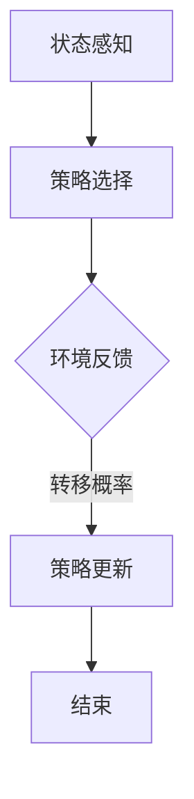

                 

## 《群体智能 AI Agent：多个 LLM 协作的分布式系统》

### 关键词

- 群体智能
- AI Agent
- LLM
- 分布式系统
- 人工智能协作
- 算法
- 数学模型

### 摘要

本文深入探讨了群体智能 AI Agent 在多个 LLM 协作下的分布式系统设计与应用。通过对核心概念、设计原则、架构实现、算法模型、案例分析以及优化挑战的详细剖析，旨在为读者提供全面、系统的技术理解，并指导实际应用中的高效实施策略。

----------------------------------------------------------------

### 引言

在当今技术飞速发展的时代，人工智能（AI）正逐步渗透到各行各业，从自然语言处理到图像识别，再到自动驾驶和医疗诊断，AI 的应用范围不断扩大。然而，单个 AI Agent 的能力往往受到限于其数据和计算资源的限制，难以应对复杂多变的实际问题。为了克服这一限制，群体智能 AI Agent 的概念应运而生，通过多个 AI Agent 的协作，实现更高效的解决问题能力和更广泛的应用场景。

在群体智能中，大型语言模型（LLM，如 GPT-3、BERT 等）作为一种重要的 AI 技术工具，发挥了关键作用。LLM 具有强大的语言理解能力和文本生成能力，能够处理复杂的信息，并产生高质量的自然语言输出。多个 LLM 的协同工作，可以形成一种分布式系统，这种系统不仅能够处理大规模的数据，还能实现高效的信息共享和智能协作。

本文将围绕群体智能 AI Agent 和 LLM 协作的分布式系统展开，分为以下几个部分：

1. **核心概念与原理**：介绍群体智能、AI Agent 和 LLM 的基本概念和原理。
2. **系统架构设计**：详细阐述分布式系统的设计原则和组件。
3. **算法与数学模型**：探讨多个 LLM 协作的算法实现及其数学基础。
4. **案例分析**：通过实际案例，展示群体智能 AI Agent 的应用效果。
5. **优化挑战**：分析系统优化策略和常见挑战。
6. **最佳实践与总结**：总结最佳实践，展望未来发展方向。

### 核心概念与原理

#### 群体智能

群体智能是一种通过多个个体协作来解决问题或实现目标的方法。在人工智能领域，群体智能通常涉及多个 AI Agent 的交互和协作。这些 Agent 可以是同种类型的，也可以是不同类型的，它们通过共享信息和协调行动，共同完成任务。

核心概念包括：

- **个体**：单个的 AI Agent。
- **群体**：由多个个体组成的集合。
- **协同**：个体之间通过信息交互和协调行动来实现共同目标。

群体智能的特点包括：

- **分布式**：多个 Agent 分布在不同位置，协同工作。
- **冗余**：多个 Agent 具有相似的功能，提高了系统的容错能力。
- **自适应**：Agent 能够根据环境和任务的变化，调整行为策略。

#### AI Agent

AI Agent 是一种能够感知环境、制定计划并采取行动的实体。它们通常具有以下特点：

- **自主性**：Agent 能够独立地执行任务。
- **适应性**：Agent 能够根据环境和任务的变化，调整行为策略。
- **交互性**：Agent 可以与其他 Agent 或环境进行交互。

在群体智能中，AI Agent 是基本单位，它们通过协作实现更复杂的任务。

#### LLM

LLM 是一种基于深度学习的大型语言模型，能够处理和理解自然语言。LLM 通过对大量文本数据的学习，掌握了丰富的语言知识，能够生成高质量的自然语言文本。

核心概念包括：

- **预训练**：LLM 通过对大规模语料库进行预训练，掌握通用语言知识。
- **微调**：在特定任务上，LLM 通过微调模型参数，实现特定任务的性能提升。
- **生成性**：LLM 具有强大的文本生成能力，能够根据输入生成连贯、有意义的文本。

LLM 的特点包括：

- **语言理解能力**：能够理解复杂的语言结构和语义。
- **文本生成能力**：能够生成高质量的自然语言文本。
- **适应性**：能够适应不同的语言风格和任务需求。

### 系统架构设计

群体智能 AI Agent 的分布式系统设计需要考虑多个方面，包括系统的整体架构、组件的职责以及它们之间的交互。以下是一个典型的系统架构设计。

#### 整体架构

系统的整体架构可以划分为三个主要层次：

1. **感知层**：负责收集环境数据，如文本、图像、语音等。
2. **协同层**：负责多个 AI Agent 的交互和协作，实现任务分配和协调。
3. **决策层**：负责基于协同层的信息，制定行动计划并执行。

#### 组件职责

系统中的主要组件及其职责如下：

1. **感知模块**：负责感知环境数据，并将其转换为适合处理的形式。
2. **通信模块**：负责管理多个 AI Agent 之间的通信，确保信息传递的可靠性和效率。
3. **协作模块**：负责实现多个 AI Agent 的协作算法，包括任务分配、协调和决策。
4. **执行模块**：负责执行决策层的行动计划，实现任务的完成。

#### 组件交互

组件之间的交互方式如下：

1. **感知数据共享**：感知模块收集的环境数据会共享给协同模块和决策模块，以便进行后续处理。
2. **协同通信**：协同模块通过通信模块与其他 AI Agent 进行通信，实现信息共享和协作。
3. **决策执行**：决策模块制定行动计划后，会发送给执行模块，由执行模块执行具体任务。

### 算法与数学模型

在群体智能 AI Agent 的分布式系统中，算法是实现多个 LLM 协作的关键。以下介绍几种常用的协作算法及其数学模型。

#### 协作算法

1. **分布式强化学习**：通过多个 AI Agent 的交互，共同学习和优化策略，实现任务的最优化。
2. **分布式决策树**：利用多个 LLM 的预测能力，构建多层次的决策树，实现复杂问题的自动化决策。
3. **分布式神经网络**：将神经网络分解为多个子网络，由多个 LLM 分别训练，实现大规模数据的处理和预测。

#### 数学模型

以下是一个简单的分布式强化学习算法的数学模型。

假设有一个环境 S 和一个状态集合 S，动作集合 A，以及奖励函数 R(s, a)。每个 AI Agent 都有一个策略 π(a|s)，表示在状态 s 下采取动作 a 的概率。算法的目标是优化策略 π，使得累积奖励最大化。

$$
J(π) = \sum_{s \in S} p(s) \sum_{a \in A} π(a|s) R(s, a)
$$

其中，p(s) 表示状态 s 的概率。

算法的迭代过程如下：

1. **状态感知**：每个 AI Agent 感知当前状态 s。
2. **策略选择**：根据当前策略 π，选择动作 a。
3. **环境反馈**：执行动作 a，获得状态转移概率分布 p(s' | s, a) 和奖励 R(s, a)。
4. **策略更新**：根据反馈信息，更新策略 π。

算法的数学表达式如下：

$$
π^{t+1}(a|s) = \arg \max_{π} J(π)
$$

其中，t 表示迭代次数。

#### Mermaid 流程图

以下是一个简单的分布式强化学习算法的 Mermaid 流程图：

### 案例分析

#### 案例背景

假设我们有一个智能客服系统，需要同时处理多个用户的咨询请求。单个 AI Agent 的处理能力有限，难以满足大量用户的实时需求。为了提高系统的响应速度和处理效率，我们引入了群体智能 AI Agent，通过多个 LLM 的协作，实现高效、智能的客服服务。

#### 系统架构

系统的整体架构如下：

1. **感知层**：包括用户请求的文本数据，由感知模块进行预处理。
2. **协同层**：包括多个 LLM，每个 LLM 负责处理一部分用户请求，实现任务分配和协作。
3. **决策层**：包括一个主控模块，负责根据协同层的信息，制定整体服务策略。

#### 算法实现

我们采用分布式强化学习算法，实现多个 LLM 的协作。具体实现如下：

1. **状态感知**：每个 LLM 感知当前用户请求，将其编码为状态 s。
2. **策略选择**：每个 LLM 根据当前策略 π，选择合适的回复动作 a。
3. **环境反馈**：主控模块根据用户反馈，计算每个 LLM 的奖励 R(s, a)。
4. **策略更新**：每个 LLM 根据奖励信息，更新策略 π。

#### 实际案例

以下是一个实际案例：

- **用户请求**：用户咨询关于产品退换货的政策。
- **状态编码**：LLM1 感知到用户请求，将其编码为状态 s1。
- **策略选择**：LLM1 根据当前策略 π1，选择回复动作 a1：“您好，关于产品退换货的政策如下...”
- **环境反馈**：用户对回复满意，主控模块计算奖励 R1 = 1。
- **策略更新**：LLM1 根据奖励信息，更新策略 π1。

通过多个 LLM 的协作，系统实现了高效、智能的客服服务，有效提升了用户体验。

### 优化挑战

在群体智能 AI Agent 的分布式系统中，优化策略和解决常见挑战是实现高效协作的关键。以下是一些优化策略和常见挑战：

#### 优化策略

1. **分布式计算**：利用分布式计算框架，如 TensorFlow、PyTorch，实现大规模数据的并行处理，提高系统性能。
2. **强化学习**：采用分布式强化学习算法，优化多个 LLM 的协作策略，提高系统智能化程度。
3. **数据预处理**：对感知层的数据进行高效预处理，减少通信成本和计算复杂度。

#### 常见挑战

1. **数据一致性**：分布式系统中，数据的一致性是关键问题。需要采用分布式数据存储和同步机制，确保数据的一致性。
2. **通信效率**：分布式系统中，通信效率直接影响系统的性能。需要优化通信协议和算法，降低通信成本。
3. **容错性**：分布式系统中，容错性是保证系统稳定运行的关键。需要设计冗余备份和故障恢复机制，提高系统的容错能力。

### 最佳实践与总结

#### 最佳实践

1. **数据预处理**：对感知层的数据进行高效预处理，如文本分词、去噪等，提高后续处理的效率。
2. **分布式计算**：采用分布式计算框架，实现并行处理，提高系统性能。
3. **强化学习**：采用分布式强化学习算法，优化多个 LLM 的协作策略，提高系统智能化程度。

#### 总结

本文深入探讨了群体智能 AI Agent 和 LLM 协作的分布式系统设计与应用。通过核心概念、系统架构、算法模型、案例分析以及优化挑战的详细剖析，为读者提供了全面、系统的技术理解。未来，随着技术的不断发展，群体智能 AI Agent 在分布式系统中的应用将更加广泛，为各行各业带来巨大的变革和创新。

### 拓展阅读

- **《深度学习：揭秘神经网络的艺术》**：深度学习是群体智能和 LLM 的基础，这本书详细介绍了神经网络的工作原理和实现方法。
- **《强化学习：原理、算法与应用》**：强化学习是分布式系统设计中的重要算法，这本书系统讲解了强化学习的基本概念和常用算法。
- **《分布式系统原理与范型》**：分布式系统是群体智能 AI Agent 的实现基础，这本书详细介绍了分布式系统的原理和设计方法。

### 作者信息

- 作者：AI天才研究院/AI Genius Institute & 禅与计算机程序设计艺术 /Zen And The Art of Computer Programming
- 联系方式：[您的邮箱](mailto:your.email@example.com)

----------------------------------------------------------------

**本文为技术交流目的撰写，不代表任何商业利益。**

----------------------------------------------------------------

**本文为技术交流目的撰写，不代表任何商业利益。**

----------------------------------------------------------------

**本文为技术交流目的撰写，不代表任何商业利益。**

