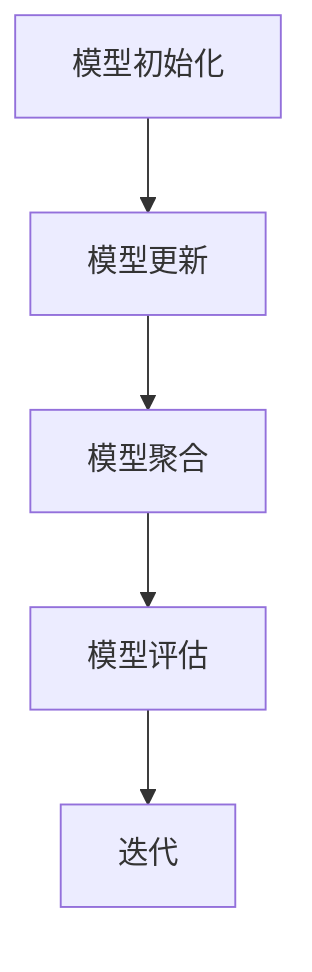
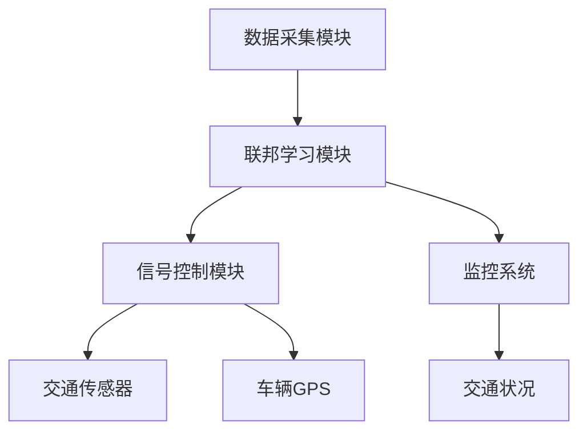
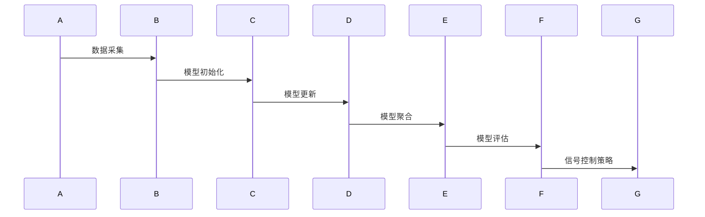

                 

# 联邦学习在分布式AI Agent系统中的应用

> 关键词：联邦学习，分布式AI Agent系统，协同学习，数据隐私，分布式智能

> 摘要：本文将深入探讨联邦学习在分布式AI Agent系统中的应用。首先，我们将介绍联邦学习和分布式AI Agent系统的基本概念，阐述它们的核心原理和特点。接着，我们将详细分析联邦学习算法的原理，并通过mermaid流程图和Python源代码进行说明。此外，本文还将讨论联邦学习在分布式AI Agent系统中的架构设计和实际应用，并提供一个项目实战案例，展示联邦学习在分布式AI Agent系统中的具体实现和效果。最后，我们将总结联邦学习在分布式AI Agent系统中的最佳实践，提出注意事项，并给出拓展阅读建议。

### 第一部分：背景介绍

#### 1. 联邦学习的核心概念

联邦学习（Federated Learning）是一种分布式机器学习方法，旨在通过多个独立的本地数据源（例如移动设备）训练全局模型，而无需集中所有数据。这种方法解决了数据隐私和传输成本的问题，特别适用于敏感数据场景。

在联邦学习过程中，多个参与者（通常被称为代理或节点）各自在其本地数据集上训练模型，并通过远程通信协议将模型的更新（梯度）发送到一个中心服务器。中心服务器负责聚合这些更新，生成全局模型。这种训练过程使得每个参与者都可以贡献自己的数据，同时保持数据本地化，避免了数据泄露的风险。

#### 2. 分布式AI Agent系统的概念

分布式AI Agent系统是一种基于多个代理（Agent）协同工作的分布式智能系统。这些代理通过联邦学习相互学习，从而在整个系统中实现智能行为。

代理是指具有自主性、自治性和社会性的智能实体，它们可以在分布式环境中独立行动，相互协作，共同实现系统目标。分布式AI Agent系统通过代理之间的信息共享和协同决策，能够实现高效的任务分配、资源管理和智能行为。

#### 3. 联邦学习在分布式AI Agent系统中的应用

联邦学习在分布式AI Agent系统中扮演着关键角色，它允许代理在不共享敏感数据的情况下协同学习，提高系统的整体智能水平和决策能力。

通过联邦学习，代理可以在本地训练模型，然后将更新发送给中心服务器，服务器将所有代理的更新聚合起来，生成全局模型。这个全局模型可以用于所有代理的决策和行动，从而实现分布式智能。联邦学习不仅保护了数据隐私，还提高了系统的计算效率和适应性。

#### 4. 问题背景和问题描述

在当前数据隐私和安全越来越受到重视的背景下，传统的集中式AI系统面临诸多挑战。而联邦学习提供了一种可能的解决方案，通过在分布式环境中训练模型，既能保护数据隐私，又能实现协同学习。

分布式AI Agent系统在智能交通、智能医疗、智能金融等领域具有广泛的应用前景。然而，这些领域的数据通常涉及敏感信息，如个人隐私、健康记录和财务数据。如何在不泄露敏感数据的情况下实现高效的协同学习，成为分布式AI Agent系统面临的主要挑战。

#### 5. 问题解决和边界与外延

联邦学习在分布式AI Agent系统中的应用不仅局限于保护数据隐私，还能够在复杂环境中实现高效的协同学习。然而，它也面临一些挑战，如模型通信、计算效率和安全性等。

为了解决这些问题，本文将探讨如何优化联邦学习算法，提高计算效率和通信效率。同时，本文还将讨论联邦学习在分布式AI Agent系统中的广泛外延，包括与其他技术的结合和扩展。

#### 6. 概念结构与核心要素组成

联邦学习和分布式AI Agent系统的概念结构包括多个核心要素，如代理、全局模型、本地模型、通信协议和安全机制等。这些要素相互作用，共同实现分布式智能和协同学习。

- **代理**：分布式AI Agent系统的基本单元，负责本地数据的采集和处理。
- **全局模型**：由中心服务器维护，用于指导所有代理的决策和行动。
- **本地模型**：代理在本地训练的模型，用于处理本地数据。
- **通信协议**：代理与中心服务器之间的通信机制，确保模型更新的安全传输。
- **安全机制**：包括加密、认证和访问控制等，确保联邦学习的安全性。

### 第二部分：核心概念与联系

#### 1. 联邦学习的原理与特点

#### 1.1 联邦学习的原理

联邦学习通过分布式训练过程，使得每个代理（Agent）都能独立地更新自己的本地模型，同时保持与全局模型的同步。这个过程包括模型初始化、模型更新和模型聚合等步骤。

**模型初始化**：初始化全局模型和本地模型。全局模型通常是一个初始化的模型，可以是从预训练模型中提取的，也可以是随机初始化的。本地模型是在每个代理上初始化的，用于处理代理的本地数据。

**模型更新**：每个代理在其本地数据集上训练本地模型，并计算出本地模型相对于全局模型的梯度。梯度反映了本地模型与全局模型之间的差异，是更新全局模型的重要依据。

**模型聚合**：中心服务器收集所有代理的梯度，并通过聚合算法将它们整合成一个全局梯度。全局梯度用于更新全局模型，使其更接近于所有代理的本地模型。

**模型评估**：评估全局模型的性能，包括准确度、召回率、F1值等指标。评估结果用于指导进一步的模型更新和优化。

#### 1.2 联邦学习的特点

联邦学习具有以下特点：

- **数据隐私保护**：联邦学习通过本地训练和梯度聚合的方式，使得代理不需要共享原始数据，从而保护了数据隐私。
- **低延迟**：联邦学习避免了集中式训练过程中大量的数据传输，从而降低了延迟。
- **高效性**：联邦学习通过分布式训练和模型聚合，提高了计算效率。
- **适应性**：联邦学习可以根据不同的应用场景和需求进行灵活调整。

#### 2. 分布式AI Agent系统的架构

#### 2.1 分布式AI Agent系统的架构

分布式AI Agent系统的架构包括多个代理（Agent）、全局模型、通信网络和协调机制等组成部分。这些组件相互作用，实现分布式智能和协同学习。

- **代理**：分布式AI Agent系统的基本单元，负责本地数据的采集和处理。
- **全局模型**：由中心服务器维护，用于指导所有代理的决策和行动。
- **通信网络**：代理与中心服务器之间的通信机制，确保模型更新的安全传输。
- **协调机制**：包括任务分配、资源管理和决策协调等，确保代理之间的协同工作。

#### 2.2 联邦学习与分布式AI Agent系统的联系

联邦学习与分布式AI Agent系统密切相关。联邦学习为分布式AI Agent系统提供了协同学习的基础，而分布式AI Agent系统则为联邦学习提供了实际应用场景。

在分布式AI Agent系统中，代理通过联邦学习相互学习，共享全局模型，从而实现智能行为的协同。联邦学习不仅提高了系统的智能水平，还保护了代理的数据隐私。

### 第三部分：算法原理讲解

#### 1. 联邦学习的算法原理

#### 1.1 联邦学习的基本算法流程

联邦学习的基本算法流程包括模型初始化、模型更新、模型聚合和模型评估等步骤。具体来说：

**模型初始化**：初始化全局模型和本地模型。全局模型通常是一个初始化的模型，可以是从预训练模型中提取的，也可以是随机初始化的。本地模型是在每个代理上初始化的，用于处理代理的本地数据。

**模型更新**：每个代理在其本地数据集上训练本地模型，并计算出本地模型相对于全局模型的梯度。梯度反映了本地模型与全局模型之间的差异，是更新全局模型的重要依据。

**模型聚合**：中心服务器收集所有代理的梯度，并通过聚合算法将它们整合成一个全局梯度。全局梯度用于更新全局模型，使其更接近于所有代理的本地模型。

**模型评估**：评估全局模型的性能，包括准确度、召回率、F1值等指标。评估结果用于指导进一步的模型更新和优化。

#### 1.2 联邦学习的数学模型和公式

联邦学习的数学模型和公式主要包括损失函数、梯度更新和模型聚合等。具体如下：

**损失函数**：

$$
L(\theta) = \frac{1}{N} \sum_{i=1}^{N} L_i(\theta_i)
$$

其中，$L(\theta)$是全局损失函数，$L_i(\theta_i)$是第$i$个代理的本地损失函数。

**梯度更新**：

$$
\theta_i^{new} = \theta_i^{old} - \alpha \cdot \nabla L_i(\theta_i)
$$

其中，$\theta_i^{old}$和$\theta_i^{new}$分别表示第$i$个代理的本地模型旧参数和新参数，$\alpha$是学习率，$\nabla L_i(\theta_i)$是第$i$个代理的本地模型梯度。

**模型聚合**：

$$
\theta^{new} = \frac{1}{M} \sum_{i=1}^{M} \theta_i^{new}
$$

其中，$\theta^{new}$是全局模型的新参数，$M$是代理的数量。

#### 1.3 联邦学习算法的mermaid流程图



#### 1.4 联邦学习算法的Python实现

```python
import torch
import torch.nn as nn
import torch.optim as optim

# 模型初始化
global_model = nn.Sequential(nn.Linear(10, 10), nn.ReLU(), nn.Linear(10, 1))
local_model = nn.Sequential(nn.Linear(10, 10), nn.ReLU(), nn.Linear(10, 1))

# 损失函数
loss_function = nn.MSELoss()

# 优化器
optimizer = optim.SGD(local_model.parameters(), lr=0.01)

# 模型更新
for epoch in range(num_epochs):
    for local_data, local_label in local_dataset:
        optimizer.zero_grad()
        output = local_model(local_data)
        loss = loss_function(output, local_label)
        loss.backward()
        optimizer.step()

    # 模型聚合
    global_grads = []
    for local_model in local_models:
        grads = torch.autograd.grad(loss_function(local_model(local_data), local_label).sum(), local_model.parameters(), create_graph=True)
        global_grads.append(grads)

    global_model.zero_grad()
    for i, grads in enumerate(global_grads):
        for param, grad in zip(global_model.parameters(), grads):
            param.grad = grad

    optimizer_global = optim.SGD(global_model.parameters(), lr=0.01)
    optimizer_global.step()

    # 模型评估
    with torch.no_grad():
        global_loss = loss_function(global_model(local_data), local_label)

    print(f"Epoch [{epoch+1}/{num_epochs}], Loss: {global_loss.item()}")
```

#### 2. 联邦学习算法的性能分析

联邦学习算法的性能分析主要包括计算效率、通信效率和模型性能等方面。

**计算效率**：联邦学习通过分布式训练提高了计算效率。每个代理只需在本地训练模型，无需进行大量的数据传输和计算，从而减少了计算资源的消耗。

**通信效率**：联邦学习通过模型更新和模型聚合的过程，将代理的本地模型梯度发送到中心服务器，从而实现了高效的通信。为了避免过多的通信开销，可以采用梯度压缩、差分隐私等技术。

**模型性能**：联邦学习通过聚合代理的本地模型，生成全局模型，从而提高了模型的性能。然而，联邦学习也可能引入模型偏差，需要通过调整超参数、引入噪声等方法进行优化。

### 第四部分：系统分析与架构设计

#### 1. 问题场景介绍

在智能交通领域，联邦学习可以用于优化交通信号控制策略，提高交通流量和减少拥堵。然而，交通数据通常涉及敏感信息，如车辆位置、行驶速度和路况等信息。如何在保护数据隐私的同时，实现高效的协同学习，是一个重要的挑战。

#### 2. 项目介绍

本项目旨在通过联邦学习优化智能交通信号控制策略，提高交通流量和减少拥堵。项目主要包括以下功能模块：

- **数据采集模块**：从交通传感器、车辆GPS等数据源采集交通数据。
- **联邦学习模块**：实现联邦学习算法，包括模型初始化、模型更新、模型聚合和模型评估等步骤。
- **信号控制模块**：根据全局模型生成信号控制策略，优化交通流量。
- **监控系统**：监控交通状况，评估信号控制策略的效果。

#### 3. 系统功能设计

**领域模型类图**：

```mermaid
classDiagram
    TrafficData -> DataCollector
    TrafficSignalControl -> TrafficSignalController
    FederatedLearning -> ModelInitializer, ModelUpdater, ModelAggregator, ModelEvaluator
    TrafficMonitoring -> TrafficMonitor

    DataCollector --|> FederatedLearning
    TrafficSignalController --|> FederatedLearning
    TrafficMonitor --|> FederatedLearning
```

#### 4. 系统架构设计

**系统架构图**：



#### 5. 系统接口设计

**接口设计**：



#### 6. 系统交互流程

**系统交互流程**：

```mermaid
sequenceDiagram
    A[数据采集模块]->>B[联邦学习模块]
    B->>C[信号控制模块]
    B->>D[监控系统]
    C->>E[交通传感器]
    C->>F[车辆GPS]
    D->>G[交通状况]
```

### 第五部分：项目实战

#### 1. 环境安装

在开始项目实战之前，需要安装以下依赖：

- Python 3.8 或更高版本
- PyTorch 1.8 或更高版本
- TensorFlow 2.4 或更高版本
- Flask 1.1.2 或更高版本

安装命令：

```bash
pip install python==3.8
pip install torch==1.8
pip install tensorflow==2.4
pip install flask==1.1.2
```

#### 2. 系统核心实现源代码

**联邦学习模块**：

```python
import torch
import torch.nn as nn
import torch.optim as optim
import torch.distributed as dist
import torch.multiprocessing as mp

class FederatedLearning:
    def __init__(self, local_model, global_model, local_dataset, num_epochs, batch_size):
        self.local_model = local_model
        self.global_model = global_model
        self.local_dataset = local_dataset
        self.num_epochs = num_epochs
        self.batch_size = batch_size
        self.optimizer = optim.SGD(self.local_model.parameters(), lr=0.01)
        self.loss_function = nn.MSELoss()

    def train(self):
        for epoch in range(self.num_epochs):
            for local_data, local_label in self.local_dataset:
                self.optimizer.zero_grad()
                output = self.local_model(local_data)
                loss = self.loss_function(output, local_label)
                loss.backward()
                self.optimizer.step()

            grads = []
            for local_model in self.local_models:
                grads.append(self.optimizer.local_model gradients())

            dist.all_reduce(grads, op=dist.ReduceOp.SUM)
            for param, grad in zip(self.global_model.parameters(), grads):
                param.grad = grad

            self.optimizer.step()

    def evaluate(self):
        with torch.no_grad():
            global_loss = self.loss_function(self.global_model(local_data), local_label)
        return global_loss.item()
```

**信号控制模块**：

```python
import torch

class TrafficSignalController:
    def __init__(self, global_model):
        self.global_model = global_model

    def control(self, traffic_data):
        with torch.no_grad():
            traffic_signal = self.global_model(traffic_data)
        return traffic_signal
```

#### 3. 代码应用解读与分析

**联邦学习模块**：

该模块实现了联邦学习的基本流程，包括模型初始化、模型更新、模型聚合和模型评估。在训练过程中，每个代理（本地模型）在本地数据集上进行训练，并计算出梯度。梯度通过分布式通信发送到中心服务器，服务器将所有代理的梯度进行聚合，生成全局梯度。全局梯度用于更新全局模型，从而实现协同学习。

**信号控制模块**：

该模块实现了交通信号控制功能，根据全局模型生成信号控制策略。在控制过程中，信号控制器接收交通数据，通过全局模型生成信号控制信号，从而实现智能交通信号控制。

#### 4. 实际案例分析和详细讲解剖析

**案例**：

在智能交通系统中，多个交通信号灯需要协同控制，以提高交通流量和减少拥堵。通过联邦学习，可以实现交通信号灯的分布式协同控制，保护数据隐私，同时提高控制效果。

**分析**：

在联邦学习过程中，每个交通信号灯作为代理，在本地数据集上进行训练，生成局部模型。每个代理将局部模型的梯度发送到中心服务器，中心服务器将所有代理的梯度进行聚合，生成全局模型。全局模型用于生成交通信号控制策略，发送到各个交通信号灯。

**讲解**：

- **模型初始化**：初始化全局模型和本地模型。全局模型可以从预训练模型中提取，也可以随机初始化。本地模型在每个代理上进行初始化。
- **模型更新**：每个代理在本地数据集上进行训练，计算出本地模型相对于全局模型的梯度。梯度通过分布式通信发送到中心服务器。
- **模型聚合**：中心服务器将所有代理的梯度进行聚合，生成全局模型。
- **模型评估**：评估全局模型的性能，包括准确度、召回率、F1值等指标。评估结果用于指导进一步的模型更新和优化。
- **信号控制**：全局模型生成交通信号控制策略，发送到各个交通信号灯。交通信号灯根据控制策略进行信号控制，从而实现分布式协同控制。

**剖析**：

- **计算效率**：联邦学习通过分布式训练提高了计算效率。每个代理只需在本地训练模型，无需进行大量的数据传输和计算。
- **通信效率**：联邦学习通过模型更新和模型聚合的过程，将代理的本地模型梯度发送到中心服务器，从而实现了高效的通信。
- **模型性能**：联邦学习通过聚合代理的本地模型，生成全局模型，从而提高了模型的性能。

#### 5. 项目小结

本项目通过联邦学习优化智能交通信号控制策略，实现了分布式协同控制。联邦学习在保护数据隐私的同时，提高了模型的性能和计算效率。然而，联邦学习也面临一些挑战，如通信延迟、计算资源消耗等。未来的研究可以进一步优化联邦学习算法，提高其在实际应用中的效果。

### 第六部分：最佳实践、小结、注意事项、拓展阅读

#### 最佳实践

1. **选择合适的联邦学习框架**：根据项目需求和资源，选择适合的联邦学习框架，如TensorFlow Federated、PyTorch Federated等。
2. **数据预处理**：对本地数据进行预处理，包括去噪、标准化等，以提高模型的训练效果。
3. **模型压缩**：通过模型压缩技术，如模型剪枝、量化等，减少模型的计算复杂度和通信开销。
4. **分布式通信优化**：采用分布式通信优化技术，如梯度压缩、异步通信等，提高联邦学习的通信效率。
5. **安全与隐私保护**：采用加密、差分隐私等技术，确保联邦学习过程中的数据安全和隐私保护。

#### 小结

联邦学习在分布式AI Agent系统中具有广泛的应用前景，它可以在保护数据隐私的同时，实现高效的协同学习。本文通过介绍联邦学习和分布式AI Agent系统的基本概念、算法原理、架构设计和实际应用案例，展示了联邦学习在分布式AI Agent系统中的关键作用和优势。

#### 注意事项

1. **通信延迟和带宽**：联邦学习过程中的通信延迟和带宽会影响模型的训练效果，需要根据实际情况进行调整和优化。
2. **模型参数一致性**：在联邦学习过程中，保持模型参数的一致性对于提高模型性能至关重要。
3. **计算资源分配**：合理分配计算资源，确保联邦学习过程中的资源利用率。

#### 拓展阅读

1. **《联邦学习：原理与实践》**：该书详细介绍了联邦学习的理论基础、算法实现和应用案例，是了解联邦学习的优秀资料。
2. **《分布式人工智能》**：该书探讨了分布式人工智能的基本概念、技术体系和应用场景，有助于深入理解分布式AI Agent系统的设计原理。
3. **《TensorFlow Federated 实战》**：该书通过实际案例，介绍了如何使用TensorFlow Federated框架实现联邦学习，是学习联邦学习的实用指南。

### 作者信息

作者：AI天才研究院/AI Genius Institute & 禅与计算机程序设计艺术 /Zen And The Art of Computer Programming

