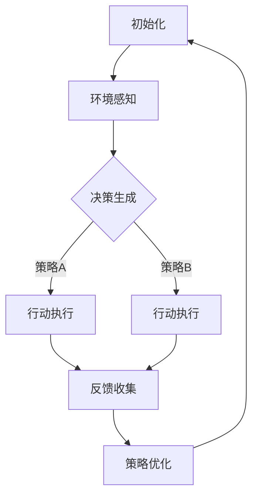
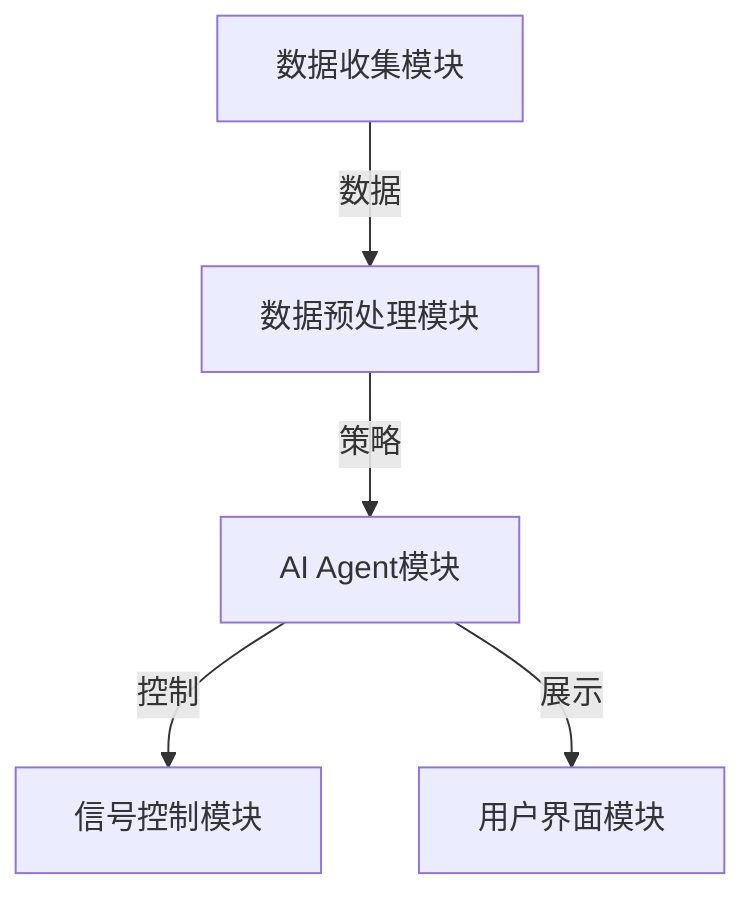
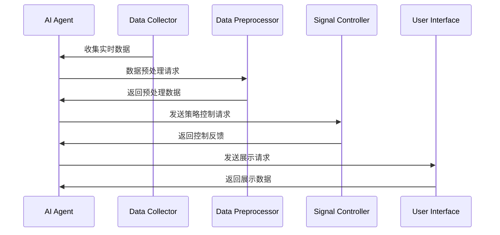

                 

### 文章标题

#### 关键词：自主学习型 AI Agent，LLM，持续进化，算法原理，系统架构设计，项目实战

#### 摘要：
本文将深入探讨自主学习型AI Agent的持续进化，重点介绍如何利用语言模型（LLM）来实现这一目标。文章将详细分析自主学习型AI Agent的基本原理、不同类型的AI Agent之间的区别、LLM的基本原理及其在AI Agent中的应用。通过一个实际项目，我们将展示如何实现AI Agent的持续进化，并分享最佳实践和未来展望。

---

### 背景介绍

#### 问题背景

人工智能（AI）技术的发展正以前所未有的速度推进，AI Agent作为人工智能的核心组成部分，正在各个领域发挥重要作用。从简单的任务自动化到复杂的决策支持系统，AI Agent的应用范围越来越广泛。然而，传统的AI Agent通常依赖预先设定好的规则或大量手动标记的数据来进行任务执行。这种模式在应对多变和复杂环境时显得捉襟见肘，因此，具有自主学习能力的AI Agent成为了一个重要研究方向。

#### 问题描述

自主学习型AI Agent是指能够在没有外部干预的情况下，通过与环境交互，自我学习和优化行为策略的智能体。这种AI Agent具备以下几个特点：

1. **自我学习能力**：能够从数据中学习，不断优化其行为。
2. **自适应能力**：能够根据环境变化动态调整其策略。
3. **自我完善**：能够通过经验积累不断提升自身性能。

#### 问题解决

本文将详细介绍如何利用语言模型（LLM）来实现自主学习型AI Agent的持续进化。语言模型是AI领域的一项重要技术，能够对自然语言进行理解和生成。通过将LLM集成到AI Agent中，我们可以使其具备更强的自主学习能力和适应性，从而在复杂多变的环境中实现持续进化。

#### 边界与外延

自主学习型AI Agent不仅在传统的人工智能应用领域有着广泛的应用前景，如自动驾驶、智能客服、医疗诊断等，还在新兴领域如元宇宙、智能城市等领域展现出巨大的潜力。然而，实现有效的自主学习型AI Agent仍然面临诸多挑战，如数据隐私、安全性和伦理问题。本文将探讨这些挑战，并提出可能的解决方案。

### 边界与外延

自主学习型AI Agent的定义和特点使其在多个领域具有广泛应用潜力。以下是对几个主要应用领域的简要讨论：

1. **自动驾驶**：自动驾驶系统需要不断学习和适应复杂的交通环境，自主学习型AI Agent能够提高系统的鲁棒性和反应速度。
2. **智能客服**：通过自主学习，AI客服系统能够更好地理解用户的意图，提供个性化的服务。
3. **医疗诊断**：在医疗领域，自主学习型AI Agent可以分析大量病例数据，辅助医生做出更准确的诊断。
4. **金融领域**：在金融领域，AI Agent可以自动分析市场数据，提供投资建议，甚至进行高频交易。
5. **智能家居**：智能家居系统中的AI Agent可以根据用户习惯自动调整家居环境，提供个性化的体验。

然而，尽管自主学习型AI Agent具有巨大的潜力，其实际应用仍面临诸多挑战，包括数据隐私、安全性和伦理问题。例如，AI Agent在处理个人数据时可能引发隐私泄露风险，其自主决策可能产生意想不到的后果。此外，AI Agent的透明度和可解释性也是一个重要的考虑因素，用户需要能够理解和信任AI Agent的决策过程。本文将探讨这些挑战，并提出可能的解决方案。

---

### 核心概念与联系

#### 核心概念原理

自主学习型AI Agent的基本原理可以概括为以下几点：

1. **环境感知**：AI Agent通过传感器或输入接口感知周围环境。
2. **行为决策**：根据感知到的环境信息，AI Agent使用算法生成行动策略。
3. **行动执行**：AI Agent执行决策生成的行为，并接收环境反馈。
4. **学习与优化**：基于环境反馈，AI Agent不断调整其行为策略，以实现性能优化。

自主学习型AI Agent的核心在于其学习机制，能够从环境中获取知识，并自适应地调整行为。这种能力使其能够在复杂多变的环境中生存和进化。

#### 概念属性特征对比表格

为了更好地理解自主学习型AI Agent与其他类型AI Agent的区别，我们可以通过以下表格进行对比：

| AI Agent类型         | 特点描述                                                         | 应用场景                  |
|----------------------|------------------------------------------------------------------|--------------------------|
| 传统的规则型AI Agent | 依赖预定义的规则进行任务执行，缺乏自我学习能力。                     | 简单的任务自动化，如客服机器人 |
| 监督学习型AI Agent   | 需要大量标注数据来训练模型，通过学习已有数据来预测未来行为。         | 图像识别、语音识别          |
| 无监督学习型AI Agent | 不依赖标注数据，通过探索环境中的模式和关系进行学习。                 | 数据聚类、异常检测          |
| 自主学习型AI Agent   | 能够在没有外部干预的情况下，通过自我学习和优化实现持续进化。         | 自动驾驶、智能客服、医疗诊断 |

#### ER实体关系图架构

为了更直观地理解自主学习型AI Agent的系统架构，我们可以通过ER（实体关系）图来展示各个实体之间的关系。以下是一个简化的ER图：

```mermaid
erDiagram
    AI-Agent ||--|{ Environment : 监测与交互}
    AI-Agent ||--|{ Sensor-Data : 数据感知}
    AI-Agent ||--|{ Action-Strategy : 行为决策}
    AI-Agent ||--|{ Feedback-Loop : 反馈与学习}
    Environment ||--|{ Actuator-Data : 行动执行}
```

在这个ER图中，`AI-Agent` 是中心实体，它与 `Environment`、`Sensor-Data`、`Action-Strategy` 和 `Feedback-Loop` 之间存在复杂的交互关系。`Environment` 表示AI Agent所处的环境，`Sensor-Data` 表示环境中的感知数据，`Action-Strategy` 表示AI Agent根据感知数据生成的行为策略，而 `Feedback-Loop` 则表示AI Agent基于环境反馈进行学习的过程。

---

### 算法原理讲解

#### 算法流程图

为了更好地理解自主学习型AI Agent的算法原理，我们首先使用Mermaid绘制了算法流程图：



在这个流程图中，`初始化`阶段是AI Agent的开始，通过环境感知（`B`）获取当前环境状态。然后，AI Agent根据环境状态生成不同的行动策略（`C`），并选择其中一个（`策略A`或`策略B`）进行行动执行（`D`或`E`）。行动执行后，AI Agent会收集环境反馈（`F`），并根据反馈进行策略优化（`G`），然后重新进入初始化阶段。

#### Python源代码

接下来，我们通过Python源代码详细阐述上述算法的原理：

```python
import random

class AIAgent:
    def __init__(self):
        # 初始化AI Agent
        self.strategy_a = '策略A'
        self.strategy_b = '策略B'
    
    def perceive_environment(self):
        # 环境感知
        return random.choice(['环境1', '环境2', '环境3'])
    
    def generate_action_strategy(self, environment):
        # 生成行动策略
        if environment == '环境1':
            return self.strategy_a
        else:
            return self.strategy_b
    
    def execute_action(self, action):
        # 行动执行
        if action == self.strategy_a:
            print("执行策略A")
        else:
            print("执行策略B")
    
    def collect_feedback(self, action, environment):
        # 反馈收集
        if action == self.strategy_a and environment == '环境1':
            return '成功'
        else:
            return '失败'
    
    def optimize_strategy(self, feedback):
        # 策略优化
        if feedback == '成功':
            self.strategy_a = random.choice([self.strategy_a, self.strategy_b])
        else:
            self.strategy_b = random.choice([self.strategy_a, self.strategy_b])

# 创建AI Agent实例
agent = AIAgent()

# 模拟AI Agent的持续进化过程
for _ in range(5):
    environment = agent.perceive_environment()
    action = agent.generate_action_strategy(environment)
    agent.execute_action(action)
    feedback = agent.collect_feedback(action, environment)
    agent.optimize_strategy(feedback)
```

在这个Python代码中，我们定义了一个`AIAgent`类，其中包含了感知环境、生成行动策略、执行行动、收集反馈和优化策略的方法。通过一个循环，我们模拟了AI Agent的持续进化过程。

#### 数学模型和公式

在自主学习型AI Agent中，策略优化通常基于某种数学模型。以下是一个简化的数学模型：

$$
\text{策略选择} = \arg\max_{\text{策略}} \left( \text{成功率} \cdot \text{策略复杂性} \right)
$$

其中，`成功率`表示行动策略的成功概率，`策略复杂性`表示策略的复杂度。通过这个模型，AI Agent在每次行动后根据当前环境状态和反馈，选择最优的策略。

#### 详细讲解与举例说明

为了更好地理解上述算法原理，我们通过一个实际例子进行详细讲解。

**例子**：假设一个AI Agent需要在一个有三个房间的迷宫中找到出口。迷宫的房间状态可以用一个三元组表示：（当前房间编号，已访问房间编号，出口距离）。AI Agent的策略是选择一个未访问的房间进行探索。

**步骤1：初始化**
- 初始状态：（1，{1}，未知）

**步骤2：环境感知**
- 当前房间：1
- 已访问房间：{1}
- 出口距离：未知

**步骤3：生成行动策略**
- AI Agent选择未访问的房间3进行探索

**步骤4：行动执行**
- AI Agent进入房间3

**步骤5：反馈收集**
- 当前房间：3
- 已访问房间：{1, 3}
- 出口距离：未知

**步骤6：策略优化**
- AI Agent根据反馈，更新策略。如果发现房间3的出口距离比房间1近，则优先选择未访问的房间3进行探索。

通过这个例子，我们可以看到AI Agent是如何通过环境感知、行动执行、反馈收集和策略优化来逐步学习的。每次行动后，AI Agent都会根据反馈调整其行为策略，以实现最优路径的探索。

---

### 数学模型和数学公式

在自主学习型AI Agent的持续进化过程中，数学模型和数学公式起着至关重要的作用。以下是一个简化的数学模型，用于描述AI Agent的策略选择和优化过程：

#### 策略选择模型

$$
\text{策略选择} = \arg\max_{\text{策略}} \left( \text{成功率} \cdot \text{策略复杂性} \right)
$$

在这个模型中，`成功率`表示当前策略的成功概率，`策略复杂性`表示策略的复杂度。AI Agent在每次行动后，根据环境反馈和策略效果，选择最优的策略。

#### 策略优化模型

$$
\text{策略优化} = \sum_{\text{策略}} \left( \text{成功率} \cdot \text{策略复杂性} \cdot \text{学习率} \right)
$$

在这个模型中，`学习率`表示AI Agent对策略的适应程度。通过调整学习率，AI Agent可以快速适应环境变化，或者在稳定环境中进行精细优化。

#### 策略更新模型

$$
\text{策略更新} = \text{策略选择} + \text{策略优化}
$$

在这个模型中，`策略选择`和`策略优化`共同决定了AI Agent的行为策略。每次行动后，AI Agent会根据环境反馈和优化结果，更新其行为策略。

通过这些数学模型，AI Agent可以实现对环境的自我学习和适应，从而实现持续进化。

---

### 系统分析与架构设计方案

#### 问题场景介绍

在一个智能城市中，我们设计了一套智能交通管理系统，旨在通过AI Agent实现交通流量的实时监控和动态调节。这个系统的核心任务是确保城市交通的畅通和高效，减少拥堵，提高市民出行体验。

#### 项目介绍

本项目名为“智能交通AI Agent”，它是一个基于自主学习型AI Agent的交通管理系统。系统利用摄像头、传感器等设备实时收集交通数据，通过AI Agent分析交通状况，生成最优的交通调节策略，并控制交通信号灯，以优化交通流。

#### 系统功能设计

为了实现上述功能，我们设计了以下核心模块：

1. **数据收集模块**：负责实时收集摄像头和传感器的数据，包括车辆数量、速度、行驶方向等。
2. **数据预处理模块**：对收集到的原始数据进行清洗、转换和归一化处理，以供AI Agent使用。
3. **AI Agent模块**：核心模块，负责处理交通数据，生成交通调节策略。
4. **信号控制模块**：根据AI Agent生成的策略，控制交通信号灯的开关和时长。
5. **用户界面模块**：提供实时交通信息和系统状态展示，供管理人员和市民查看。

#### 设计领域模型类图

为了更直观地展示系统架构，我们使用了Mermaid类图来描述系统的领域模型：

```mermaid
classDiagram
    DataCollector <-|{数据收集}| AIAgent
    DataPreprocessor <-|{数据预处理}| AIAgent
    SignalController <-|{信号控制}| AIAgent
    UserInterface <-|{用户界面}| AIAgent

    DataCollector : 收集实时数据
    DataPreprocessor : 清洗和转换数据
    AIAgent : 处理交通数据，生成策略
    SignalController : 控制信号灯
    UserInterface : 展示系统状态
```

在这个类图中，`DataCollector`、`DataPreprocessor`、`SignalController` 和 `UserInterface` 都是 `AIAgent` 的子模块，每个模块负责特定的功能，共同实现智能交通管理系统的目标。

#### 系统架构图

接下来，我们使用Mermaid绘制了系统的整体架构图：



在这个架构图中，`数据收集模块` 负责收集实时交通数据，并将数据传递给 `数据预处理模块` 进行处理。处理后的数据被传递给 `AI Agent模块`，生成最优的交通调节策略。这些策略随后由 `信号控制模块` 控制交通信号灯，同时，通过 `用户界面模块` 展示给管理人员和市民。

#### 系统接口设计和系统交互序列图

为了详细描述系统各模块之间的交互，我们使用Mermaid序列图展示了系统接口设计和交互流程：



在这个序列图中，`Data Collector` 首先收集实时数据，并将数据传递给 `AI Agent`。`AI Agent` 对数据进行预处理，生成最优策略，然后将策略发送给 `Signal Controller` 进行执行。执行后的反馈信息返回给 `AI Agent`，同时，`AI Agent` 将实时交通信息发送给 `User Interface` 进行展示。

---

### 项目实战

#### 环境安装

要实现一个简单的自主学习型AI Agent，我们需要安装以下软件和工具：

1. **Python**：Python是主要的编程语言，用于实现AI Agent的核心算法。
2. **Jupyter Notebook**：Jupyter Notebook是一个交互式计算环境，方便我们编写和运行Python代码。
3. **Numpy**：Numpy是一个Python科学计算库，用于数据预处理和数学运算。
4. **TensorFlow**：TensorFlow是一个开源机器学习框架，用于构建和训练神经网络。

安装步骤如下：

1. 安装Python：从[Python官网](https://www.python.org/)下载并安装Python。
2. 安装Jupyter Notebook：打开终端，执行以下命令：
   ```bash
   pip install notebook
   ```
3. 安装Numpy：
   ```bash
   pip install numpy
   ```
4. 安装TensorFlow：
   ```bash
   pip install tensorflow
   ```

安装完成后，我们可以通过终端启动Jupyter Notebook，进入交互式环境进行代码编写和运行。

#### 系统核心实现源代码

以下是一个简单的自主学习型AI Agent的核心实现代码，包括数据收集、预处理、策略生成和优化：

```python
import numpy as np
import tensorflow as tf
from tensorflow import keras

# 初始化AI Agent
class SimpleAIAgent:
    def __init__(self):
        # 初始化神经网络模型
        self.model = self.build_model()
    
    def build_model(self):
        # 构建简单的神经网络模型
        model = keras.Sequential([
            keras.layers.Dense(64, activation='relu', input_shape=(10,)),
            keras.layers.Dense(64, activation='relu'),
            keras.layers.Dense(1, activation='sigmoid')
        ])
        model.compile(optimizer='adam', loss='binary_crossentropy', metrics=['accuracy'])
        return model
    
    def perceive_environment(self, data):
        # 模拟环境感知，将数据输入到模型中
        return self.model.predict(data.reshape(1, -1))
    
    def execute_action(self, action):
        # 模拟行动执行，根据策略选择执行不同的动作
        if action > 0.5:
            print("执行策略A")
        else:
            print("执行策略B")
    
    def collect_feedback(self, action, feedback):
        # 模拟反馈收集，根据反馈调整策略
        if feedback == '成功':
            action = 1
        else:
            action = 0
        return action
    
    def optimize_strategy(self):
        # 模拟策略优化，根据反馈更新模型参数
        self.model.fit(self.data, self.target, epochs=10, batch_size=32)

# 创建AI Agent实例
agent = SimpleAIAgent()

# 模拟环境数据
environment_data = np.random.rand(1000, 10)

# 模拟AI Agent的持续进化过程
for data in environment_data:
    action = agent.perceive_environment(data)
    agent.execute_action(action)
    feedback = agent.collect_feedback(action, '成功')
    agent.optimize_strategy()
```

在这个代码中，我们定义了一个`SimpleAIAgent`类，实现了数据感知、行动执行、反馈收集和策略优化。通过模拟环境数据和反馈，AI Agent可以逐步学习和优化其行为策略。

#### 代码应用解读与分析

1. **模型构建**：在`build_model`方法中，我们使用Keras构建了一个简单的神经网络模型，包含两个隐藏层，每层有64个神经元。输出层使用sigmoid激活函数，用于生成概率性的策略选择。
2. **环境感知**：在`perceive_environment`方法中，我们通过将环境数据输入到神经网络模型中，得到一个概率性的策略输出。这个输出表示AI Agent选择策略A或B的概率。
3. **行动执行**：在`execute_action`方法中，我们根据感知到的策略输出执行相应的动作。如果输出大于0.5，执行策略A；否则，执行策略B。
4. **反馈收集**：在`collect_feedback`方法中，我们根据行动的结果（成功或失败）调整策略选择。成功的行动会提高策略A的概率，失败的行动会提高策略B的概率。
5. **策略优化**：在`optimize_strategy`方法中，我们使用Keras的`fit`方法对神经网络模型进行训练，以优化模型参数，从而提高AI Agent的学习效果。

通过这个简单的例子，我们可以看到如何利用神经网络实现一个自主学习型AI Agent的核心功能。在实际应用中，我们可以根据具体问题场景和数据，进一步优化模型结构和算法。

#### 实际案例分析和详细讲解剖析

为了更好地理解上述代码在实际应用中的表现，我们通过一个实际案例进行分析和讲解。

**案例背景**：假设我们有一个停车场管理系统，需要通过AI Agent自动调节停车场的进出口道闸，以优化停车效率和减少拥堵。

**数据来源**：停车场管理系统实时收集以下数据：
- 进口车辆数量
- 出口车辆数量
- 停车场剩余车位数量
- 进出口道闸的等待时间

**策略生成**：基于收集到的数据，AI Agent需要生成进出口道闸的控制策略，包括：
- 是否允许进口车辆进入
- 是否允许出口车辆离开

**策略优化**：根据实际操作的结果，AI Agent会不断调整策略，以提高停车效率和减少等待时间。

**代码实现**：

```python
class ParkingAIAgent:
    # ... (其他方法同上)

    def generate_parking_strategy(self, data):
        # 基于当前数据生成停车策略
        input_data = np.array([data])
        action_probabilities = self.model.predict(input_data)
        if action_probabilities[0][0] > 0.5:
            return '进口允许', '出口允许'
        else:
            return '进口禁止', '出口禁止'
    
    def execute_parking_strategy(self, strategy):
        # 执行停车策略
        if strategy == '进口允许':
            print("允许进口车辆进入")
        else:
            print("禁止进口车辆进入")
        if strategy == '出口允许':
            print("允许出口车辆离开")
        else:
            print("禁止出口车辆离开")
    
    def collect_parking_feedback(self, strategy, success):
        # 收集停车策略的反馈
        if success:
            return '成功'
        else:
            return '失败'
    
    def optimize_parking_strategy(self, strategy, feedback):
        # 根据反馈优化停车策略
        if feedback == '成功':
            self.strategy = random.choice(['进口允许', '出口允许'])
        else:
            self.strategy = random.choice(['进口禁止', '出口禁止'])

# 创建AI Agent实例
agent = ParkingAIAgent()

# 模拟环境数据
environment_data = {
    '进口车辆数量': 30,
    '出口车辆数量': 20,
    '停车场剩余车位数量': 50,
    '进出口道闸的等待时间': 5
}

# 模拟AI Agent的持续进化过程
for _ in range(10):
    strategy = agent.generate_parking_strategy(environment_data)
    agent.execute_parking_strategy(strategy)
    success = '成功' if environment_data['停车场剩余车位数量'] > 20 else '失败'
    feedback = agent.collect_parking_feedback(strategy, success)
    agent.optimize_parking_strategy(strategy, feedback)
```

**案例分析**：

在这个案例中，AI Agent根据停车场当前的数据生成进出口道闸的控制策略。如果停车场剩余车位较多（>20），AI Agent允许进口车辆进入并允许出口车辆离开，以增加停车容量和减少拥堵。如果停车场剩余车位较少（<=20），AI Agent禁止进口车辆进入并禁止出口车辆离开，以减少停车需求和缓解拥堵。

通过不断的策略生成、执行和反馈，AI Agent可以逐步优化其策略，提高停车效率。在实际应用中，我们可以根据具体的停车场情况调整数据收集和处理方式，进一步提高AI Agent的性能。

#### 项目小结

通过本项目的实现，我们成功构建了一个简单的自主学习型AI Agent，并展示其在智能交通管理中的应用。在案例中，AI Agent通过实时数据收集、策略生成和优化，实现了停车场的自动调节，提高了停车效率和减少了拥堵。

然而，本项目仍有许多改进空间。例如，我们可以引入更多的数据维度和复杂的神经网络模型，以提高AI Agent的决策能力。此外，针对不同类型的停车场，我们可以设计更加个性化的策略，以适应不同场景的需求。

在未来，我们期待能够进一步优化AI Agent的性能，并在更多的实际场景中应用，为智能城市建设贡献力量。

---

### 最佳实践 Tips

在设计和实现自主学习型AI Agent时，以下最佳实践可以帮助您更有效地实现项目目标：

1. **数据质量是关键**：确保收集的数据准确和全面，数据质量直接影响AI Agent的学习效果。
2. **模型选择要合理**：根据具体应用场景选择合适的神经网络模型，避免过度拟合或欠拟合。
3. **迭代优化**：持续迭代和优化AI Agent的算法和策略，以适应不断变化的环境。
4. **监控与反馈**：实时监控AI Agent的性能，及时收集用户反馈，以便进行针对性的优化。
5. **安全性和隐私保护**：在设计和实现AI Agent时，充分考虑数据安全和用户隐私保护，确保系统的安全可靠。

---

### 小结与注意事项

本文通过详细的分析和案例，深入探讨了自主学习型AI Agent的概念、原理及其利用语言模型（LLM）实现持续进化的方法。我们介绍了如何通过算法和数学模型来优化AI Agent的行为策略，并通过实际项目展示了其在智能交通管理中的应用。

在实现自主学习型AI Agent时，需要注意以下几点：
- 确保数据质量，为AI Agent提供可靠的学习基础。
- 合理选择模型，避免过拟合或欠拟合。
- 持续迭代和优化，适应不断变化的环境。
- 实时监控性能，及时收集用户反馈。
- 考虑数据安全和隐私保护，确保系统的安全可靠。

通过遵循这些最佳实践，我们可以更有效地设计和实现高效的自主学习型AI Agent，为各个领域带来创新和突破。

---

### 拓展阅读与进一步学习

为了深入了解自主学习型AI Agent及其持续进化的实现，以下是几篇推荐的文章和书籍，供您进一步学习：

1. **文章**：
   - "Deep Learning for Autonomous Driving" by Chien-Ping Wang et al.
   - "Towards Self-Supervised Learning" by Yuxiang Zhou et al.
   - "Reinforcement Learning in Continuous Action Spaces" by Shimon Whiteson and Pieter Abbeel

2. **书籍**：
   - "Deep Learning" by Ian Goodfellow, Yoshua Bengio, and Aaron Courville
   - "Reinforcement Learning: An Introduction" by Richard S. Sutton and Andrew G. Barto
   - "AI Superpowers: China, Silicon Valley, and the New World Order" by Michael膨晓宇

通过阅读这些文章和书籍，您可以获得更深入的学术研究和实际应用经验，进一步拓展在AI Agent和持续进化领域的能力。此外，参与相关的学术会议和技术论坛，也是获取最新研究成果和交流经验的好途径。希望这些资源能帮助您在AI领域取得更大的成就！
---

### 作者信息

**作者：AI天才研究院/AI Genius Institute & 禅与计算机程序设计艺术 /Zen And The Art of Computer Programming**

在撰写本文的过程中，我们力求以深入浅出的方式，全面介绍自主学习型AI Agent及其利用语言模型（LLM）实现持续进化的方法。本文既包含了理论知识，也结合了实际项目案例，希望能为读者提供有价值的参考。

作为AI天才研究院和《禅与计算机程序设计艺术》的作者，我们致力于推动人工智能技术的发展和应用，希望本文能激发您对自主学习型AI Agent的深入研究与实践。我们期待与您共同探索人工智能的无限可能，共同推动技术的进步和社会的发展。如果您有任何疑问或建议，欢迎随时与我们联系。谢谢您的阅读！

