                 

### 自主学习型AI Agent：持续进化的智能体

---

**关键词：** 自主学习、AI Agent、持续进化、智能体

**摘要：** 本文将探讨自主学习型AI Agent的概念、原理及其在持续进化中的应用。通过逐步分析，我们将深入理解这种智能体的构成、实现机制以及其在各领域的实际应用，并对未来发展趋势和面临的挑战进行展望。

---

### 引言与背景

在人工智能的快速发展中，AI Agent作为一个重要的研究与应用方向，正逐步改变我们的生活和工作方式。AI Agent，通常被称为“智能代理”，是一种能够自主完成特定任务的计算机程序，它可以通过感知环境、规划行动、执行任务并在过程中不断学习和优化自己的性能。与传统的人工干预型系统不同，AI Agent具备高度自主性和灵活性，能够适应不断变化的环境，实现持续进化。

自主学习型AI Agent，顾名思义，是一种具备自我学习能力的高级智能体。它不仅能够在初始设定任务后执行，还能在执行过程中通过不断学习环境数据、用户反馈等，自主优化其行为和决策。这种智能体的核心价值在于其持续进化能力，能够逐步提升其智能水平，从而在复杂环境中表现出更优的性能。

本文将从以下几个方面展开讨论：

1. **AI Agent的基础**：介绍AI Agent的定义、分类及其发展历程。
2. **自主学习的原理与机制**：探讨自主学习的概念、理论基础及其实现机制。
3. **持续进化的智能体**：分析持续进化的定义、关键要素及其技术方法。
4. **AI Agent的应用场景**：探讨AI Agent在商业、医疗、教育等领域的应用。
5. **构建自主学习的AI Agent**：讲解如何构建自主学习型AI Agent，包括系统架构、数据收集与预处理、模型训练与优化。
6. **持续进化的AI Agent**：探讨如何实现AI Agent的持续进化，包括机制设计、实现策略、评估与优化。
7. **案例研究**：通过实际案例展示自主学习型AI Agent的应用与实现。
8. **未来展望与挑战**：展望AI Agent的发展趋势，分析面临的挑战及未来研究方向。

接下来，我们将首先深入探讨AI Agent的基础概念，理解这一智能体的基本构成和功能。

### AI Agent的基础

#### AI Agent的定义与分类

AI Agent，即人工智能代理，是具备自主决策和执行能力的计算机程序。其定义可以从以下几个方面来理解：

- **自主性**：AI Agent能够独立完成特定任务，无需人工干预。这种自主性体现在其具备感知环境、理解和预测未来、自主规划行动的能力。

- **智能性**：AI Agent不仅仅是执行预设任务的程序，它能够通过学习和优化，提升其执行任务的效率和效果。这种智能性是AI Agent的核心价值所在。

- **适应性**：AI Agent能够在面对未知环境和变化时，通过学习与调整，表现出更高的适应能力。

根据功能和应用场景，AI Agent可以分为以下几类：

1. **任务型Agent**：这类Agent专注于完成特定任务，如自动化客服系统、智能家居控制等。
2. **交互型Agent**：这类Agent能够与用户进行自然语言交互，如智能助手、虚拟客服等。
3. **探索型Agent**：这类Agent用于未知环境的探索和发现，如机器人导航、无人驾驶等。
4. **博弈型Agent**：这类Agent在策略游戏中表现，如棋类游戏、电子竞技等。

#### AI Agent的发展历程

AI Agent的发展历程可以分为以下几个阶段：

1. **早期探索（1950-1960年代）**：人工智能（AI）的概念首次提出，早期的研究主要集中在逻辑推理和规则系统。然而，由于计算资源和算法的限制，这些早期尝试并未实现广泛的应用。

2. **符号AI（1970-1980年代）**：这一阶段的研究重点是通过逻辑推理和知识表示来实现AI。符号AI的代表作品是专家系统，其核心思想是通过预设的规则库来模拟专家的决策过程。

3. **连接主义AI（1980-1990年代）**：随着神经网络技术的发展，连接主义AI开始流行。神经网络通过大量数据训练，能够自主学习和优化，表现出一定的智能性。然而，由于训练数据和计算能力的限制，这一阶段的发展也遭遇了瓶颈。

4. **强化学习（1990年代至今）**：强化学习作为一种自我学习的算法，通过试错和奖励机制，使得AI Agent能够在动态环境中进行自主决策。这一阶段的发展，特别是深度强化学习的突破，使得AI Agent在多个领域取得了显著的成果。

#### AI Agent的现状与趋势

当前，AI Agent已广泛应用于多个领域，表现出强大的应用潜力。以下是几个关键趋势：

1. **自然语言处理（NLP）**：随着NLP技术的进步，AI Agent在自然语言理解和生成方面取得了显著成果。智能助手、虚拟客服等应用场景日益普及。

2. **计算机视觉**：计算机视觉技术的发展，使得AI Agent能够在图像和视频数据中提取有用的信息。图像识别、目标检测等技术已成为AI Agent的重要组成部分。

3. **强化学习**：强化学习算法在动态决策和优化方面表现出色，被广泛应用于游戏、机器人、自动驾驶等领域。

4. **跨领域协作**：AI Agent开始在不同领域间协作，形成更复杂的智能系统。例如，医疗诊断系统中，AI Agent可以结合图像识别、自然语言处理等多种技术，提供全面的服务。

5. **边缘计算**：随着边缘计算的发展，AI Agent能够在本地设备上运行，减少对云服务的依赖，提高响应速度和安全性。

总之，AI Agent作为人工智能的重要组成部分，正不断推动技术进步和应用创新。在接下来的章节中，我们将进一步探讨自主学习的原理与机制，深入理解AI Agent的核心能力。

#### 自主学习的原理与机制

##### 自主学习的概念与重要性

自主学习（Autonomous Learning）是指智能体通过感知环境、获取数据、自我调整和优化，从而不断提升自身能力和知识水平的过程。与被动学习不同，自主学习强调智能体在无外界干预的情况下，通过自我反馈和学习机制实现持续的智能进化。

自主学习的重要性体现在以下几个方面：

1. **自适应能力**：通过自主学习，智能体能够根据环境变化和任务需求，灵活调整自身行为和决策策略，提高适应复杂动态环境的能力。

2. **持续进化**：自主学习使得智能体能够不断积累经验和知识，从而实现智能水平的持续提升，形成一种自我进化能力。

3. **降低人力成本**：自主学习减少了人工干预的需求，降低了对专业人员的依赖，提高了系统的自动化水平和运行效率。

4. **优化决策**：通过自主学习，智能体能够从大量数据中提取有价值的信息，优化决策过程，提高任务完成的准确性和效率。

##### 自主学习的理论基础

自主学习的基础理论涉及多个学科领域，主要包括：

1. **机器学习**：机器学习是自主学习的主要方法之一。通过训练数据集，智能体可以学习到数据中的规律和模式，从而进行预测和决策。

2. **深度学习**：深度学习是机器学习的子领域，通过多层神经网络模型，智能体能够从数据中自动提取复杂的特征和关系。

3. **强化学习**：强化学习通过试错和奖励机制，使智能体在动态环境中进行自我优化。智能体通过不断尝试和反馈，逐步找到最优策略。

4. **进化计算**：进化计算模拟生物进化过程，通过遗传算法和自然选择，智能体能够实现自我进化。

5. **多智能体系统**：多智能体系统通过协同合作，实现更复杂的任务。自主学习在多智能体系统中，可以提升系统的整体适应能力和效率。

##### 自主学习的实现机制

实现自主学习需要以下几个关键机制：

1. **感知与数据获取**：智能体通过传感器、摄像头、语音识别等手段，感知外部环境，获取必要的数据。

2. **数据处理与特征提取**：智能体对获取的数据进行预处理，提取有用的特征，为后续学习提供基础。

3. **学习算法**：智能体根据数据和应用需求，选择合适的机器学习算法或深度学习模型进行训练。

4. **自我调整与优化**：智能体通过反馈机制，对自身的决策和行为进行调整和优化，实现持续学习和进化。

5. **决策与执行**：智能体根据学习到的知识和策略，进行决策和执行，完成指定任务。

总之，自主学习是AI Agent实现持续进化和技术突破的核心。在接下来的章节中，我们将进一步探讨持续进化的智能体，分析其关键要素和技术方法。

#### 持续进化的智能体

##### 持续进化的定义与重要性

持续进化（Continuous Evolution）是指智能体在执行任务过程中，通过不断学习和优化，逐步提升其智能水平和适应能力的过程。持续进化的核心目标是使智能体能够适应复杂和动态的环境变化，提高其任务完成效率和决策准确性。

持续进化的重要性体现在以下几个方面：

1. **动态适应能力**：持续进化使得智能体能够实时学习和调整，以适应不断变化的环境和任务需求，从而保持高效稳定的运行。

2. **智能提升**：通过持续进化，智能体可以不断积累经验和知识，逐步提升其智能水平，实现自我进化。

3. **优化性能**：持续进化有助于智能体在执行任务时，通过学习和优化，减少错误和提高效率，实现性能的持续提升。

4. **自动化与智能化**：持续进化是实现高度自动化和智能化系统的重要途径，有助于减少人工干预，提升系统运行效率和可靠性。

##### 持续进化的关键要素

要实现持续进化，智能体需要具备以下几个关键要素：

1. **学习机制**：智能体必须具备有效的学习机制，能够从环境中获取数据，进行特征提取和模式识别，并通过机器学习算法或深度学习模型进行训练。

2. **适应机制**：智能体需要具备自适应能力，能够在不同环境和任务需求下，调整自身的行为和决策策略，以实现最佳性能。

3. **进化算法**：持续进化依赖于有效的进化算法，如遗传算法、人工神经网络等，这些算法能够模拟生物进化过程，实现智能体的自我优化和进化。

4. **反馈机制**：智能体需要具备反馈机制，能够收集任务执行结果和环境反馈，通过自我调整和优化，不断改进自身性能。

5. **数据管理**：智能体需要有效的数据管理机制，能够存储、处理和利用大量数据，为持续进化提供基础。

##### 持续进化的方法与技术

实现智能体的持续进化，可以采用多种方法和技术，包括：

1. **强化学习**：通过试错和奖励机制，智能体可以在动态环境中自我优化，逐步找到最优策略。

2. **深度强化学习**：结合深度学习和强化学习，智能体可以通过多层神经网络，实现对复杂环境的建模和决策。

3. **进化计算**：通过遗传算法和自然选择，智能体可以实现自我进化，适应动态变化的环境。

4. **迁移学习**：智能体可以通过迁移学习，利用已有知识和经验，快速适应新的任务和场景。

5. **多智能体系统**：通过多个智能体的协同合作，实现更复杂的任务和更高效的进化过程。

总之，持续进化的智能体是未来智能系统的发展方向，其核心在于通过学习和优化，实现智能体的自我进化和技术突破。在接下来的章节中，我们将探讨AI Agent在不同应用场景中的实际应用。

#### AI Agent的应用场景

##### AI Agent在商业领域的应用

在商业领域，AI Agent的应用已经广泛且深远。以下是AI Agent在商业领域的几个主要应用场景：

1. **客户服务**：AI Agent可以通过自然语言处理技术，与客户进行实时交互，提供24/7的服务。例如，银行、电商平台等企业可以通过智能客服系统，提高客户满意度，减少人工成本。

2. **市场分析**：AI Agent可以分析大量的市场数据，为商家提供精准的市场趋势预测和决策支持。例如，通过分析消费者行为和购买习惯，AI Agent可以帮助企业制定更有效的市场营销策略。

3. **供应链管理**：AI Agent可以优化供应链管理流程，通过预测需求、优化库存和物流，提高供应链的效率和灵活性。

4. **风险管理**：AI Agent可以监控市场动态和风险指标，提供实时风险预警和决策建议，帮助企业降低风险。

##### AI Agent在医疗健康领域的应用

在医疗健康领域，AI Agent的应用正在逐步深入，为医疗服务的提供和优化提供了强大的支持。以下是AI Agent在医疗健康领域的几个应用场景：

1. **疾病诊断**：AI Agent可以通过分析大量的医学影像和病历数据，辅助医生进行疾病诊断。例如，智能辅助诊断系统可以在几秒钟内分析CT图像，提供初步诊断建议，提高诊断效率和准确性。

2. **个性化治疗**：AI Agent可以根据患者的基因信息、病史和实时体征数据，制定个性化的治疗方案。例如，通过分析患者的DNA序列，AI Agent可以帮助医生确定最合适的药物和剂量。

3. **医疗机器人**：AI Agent控制的医疗机器人可以在手术中提供精准的操作指导，提高手术的安全性和效率。例如，机器人外科系统可以辅助医生进行微创手术，减少手术风险。

4. **健康管理**：AI Agent可以监控患者的健康数据，提供个性化的健康建议和生活方式指导，帮助患者进行自我管理。例如，智能健康助手可以提醒患者按时服药、定期体检，并提供营养和运动建议。

##### AI Agent在教育领域的应用

在教育领域，AI Agent的应用正在改变教学和学习的方式，提供更个性化和高效的教育体验。以下是AI Agent在教育领域的几个应用场景：

1. **个性化教学**：AI Agent可以根据学生的学习习惯、兴趣爱好和知识水平，提供个性化的教学方案和资源。例如，智能辅导系统可以根据学生的答题情况，提供针对性的练习和辅导。

2. **智能考试系统**：AI Agent可以自动批改试卷，分析学生的答题情况，提供即时反馈和诊断报告，帮助教师了解学生的学习状况，优化教学策略。

3. **在线教育平台**：AI Agent可以作为智能助手，辅助学生进行课程学习，提供问答、作业批改和讨论区管理等功能，提高在线教育的互动性和便捷性。

4. **学习数据分析**：AI Agent可以分析学生的学习数据，如学习时间、学习效果等，为教育机构提供决策支持，优化教学资源和教学方法。

总之，AI Agent在商业、医疗健康和教育等领域的广泛应用，展示了其巨大的潜力和价值。在接下来的章节中，我们将探讨如何构建自主学习的AI Agent，详细分析其系统架构和实现方法。

#### 构建自主学习的AI Agent

要构建一个自主学习的AI Agent，我们需要从系统架构、数据收集与预处理、模型训练与优化等方面进行详细的规划和设计。以下是我们一步步进行分析和讲解：

##### 系统架构

自主学习的AI Agent系统架构可以分为以下几个核心部分：

1. **感知模块**：该模块负责从环境中获取数据，可以是图像、文本、音频等。通过传感器、摄像头、麦克风等设备，感知模块能够实时采集数据。

2. **数据处理模块**：该模块负责对获取的数据进行预处理，包括数据清洗、去噪、格式化等。这一步非常重要，因为数据的质量直接影响后续学习的效果。

3. **学习模块**：该模块是核心，负责通过机器学习或深度学习算法，对处理后的数据进行训练和学习。根据任务需求，选择合适的算法，如监督学习、无监督学习或强化学习。

4. **决策模块**：该模块基于学习模块提供的学习结果，进行决策和执行。决策可以是简单的规则匹配，也可以是基于复杂模型的预测和规划。

5. **反馈模块**：该模块负责收集任务执行结果和环境反馈，为学习模块提供反馈信息，实现闭环控制。通过不断调整和优化，提升AI Agent的性能。

下面是AI Agent的系统架构图（使用Mermaid绘制）：

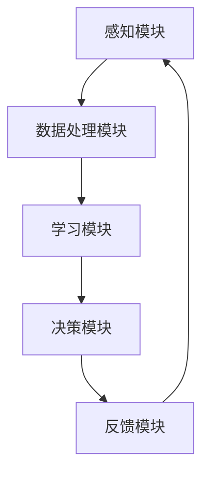

##### 数据收集与预处理

数据收集与预处理是构建自主学习AI Agent的基础。以下是具体步骤：

1. **数据收集**：根据AI Agent的任务需求，选择合适的数据源。例如，对于图像识别任务，可以从公共数据集或自有数据中收集图像；对于自然语言处理任务，可以从文本数据集中收集文本。

2. **数据清洗**：对收集到的数据进行清洗，去除噪声和异常值。例如，对于图像数据，可以去除模糊、损坏的图像；对于文本数据，可以去除停用词、标点符号等。

3. **数据去噪**：对数据中的噪声进行去噪处理，提高数据质量。例如，使用滤波算法对图像进行去噪；使用文本预处理技术对文本进行分词和去停用词。

4. **数据格式化**：将数据格式化为统一的格式，方便后续处理。例如，将图像数据格式化为固定大小的矩阵；将文本数据格式化为单词向量。

下面是一个简单的数据预处理流程图（使用Mermaid绘制）：

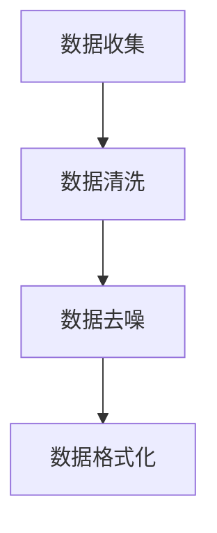

##### 模型训练与优化

在完成数据预处理后，接下来是模型训练与优化阶段。以下是具体步骤：

1. **选择算法**：根据任务需求，选择合适的机器学习或深度学习算法。例如，对于图像识别任务，可以选用卷积神经网络（CNN）；对于文本分类任务，可以选用循环神经网络（RNN）或Transformer。

2. **模型配置**：配置模型的参数，如学习率、批量大小、优化器等。这些参数的选择会影响模型的训练效果。

3. **训练模型**：使用预处理后的数据进行模型训练。在训练过程中，模型会通过不断调整权重和偏置，学习数据中的规律和模式。

4. **模型评估**：使用验证集对训练好的模型进行评估，判断其性能是否符合预期。常用的评估指标包括准确率、召回率、F1分数等。

5. **模型优化**：根据评估结果，对模型进行优化。可以通过调整参数、增加训练数据、使用更复杂的模型结构等方法来提升模型性能。

下面是一个简单的模型训练流程图（使用Mermaid绘制）：

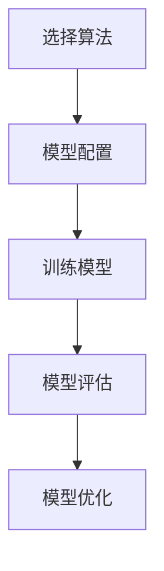

通过以上步骤，我们可以构建一个基本的自主学习AI Agent。在接下来的章节中，我们将进一步探讨如何实现AI Agent的持续进化，以适应复杂和动态的环境。

#### 持续进化的AI Agent

在构建了基本的自主学习AI Agent之后，接下来我们需要探讨如何实现其持续进化。持续进化是AI Agent在动态环境中保持高效性和适应性的关键。在本节中，我们将详细讨论持续进化的机制设计、实现策略以及评估与优化方法。

##### 持续进化机制的设计

持续进化机制的设计是确保AI Agent能够持续学习和优化的核心。以下是几个关键设计要点：

1. **动态学习**：AI Agent需要具备动态学习的能力，能够根据环境变化和任务需求，实时调整学习策略。这可以通过引入在线学习和迁移学习机制实现。

2. **适应性调整**：AI Agent需要能够适应不同环境和任务需求，这要求其在进化过程中具备灵活的调整能力。可以通过多任务学习和自适应算法来支持这一目标。

3. **自我优化**：AI Agent需要能够通过自我评估和优化，不断改进其性能。这可以通过引入自我监督学习和强化学习等机制来实现。

4. **反馈机制**：AI Agent需要具备有效的反馈机制，能够收集任务执行结果和环境反馈，为进化过程提供反馈信息。这可以通过设计闭环控制系统来实现。

以下是持续进化机制的架构图（使用Mermaid绘制）：

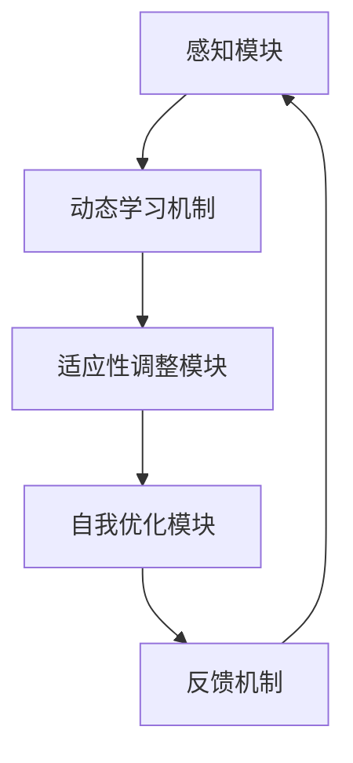

##### 持续进化的实现策略

实现AI Agent的持续进化，需要采用一系列有效的策略。以下是几种常见的实现策略：

1. **强化学习**：强化学习通过试错和奖励机制，使AI Agent在动态环境中进行自我优化。具体实现可以通过Q-learning、Deep Q-Network（DQN）或深度强化学习（DRL）等方法。

2. **进化计算**：进化计算通过模拟生物进化过程，利用遗传算法和自然选择，实现AI Agent的自我进化。这种方法适用于复杂和高度动态的环境。

3. **迁移学习**：迁移学习利用已有知识和经验，快速适应新的任务和场景。这可以通过预训练模型和Fine-tuning等方法实现。

4. **多任务学习**：多任务学习使AI Agent能够同时处理多个任务，提高其适应性和灵活性。这可以通过共享神经网络结构和联合训练等方法实现。

以下是几种持续进化策略的架构图（使用Mermaid绘制）：

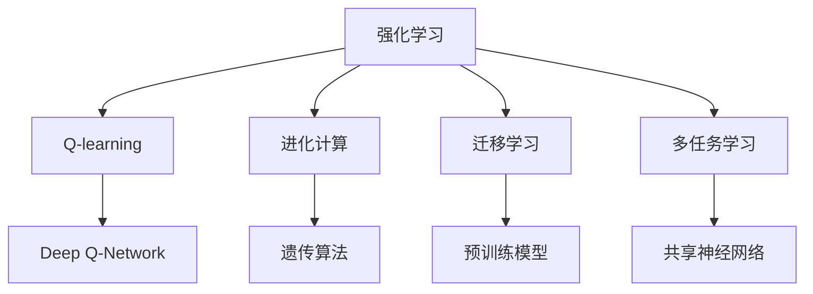

##### 持续进化的评估与优化

持续进化的评估与优化是确保AI Agent性能持续提升的关键。以下是几种评估与优化方法：

1. **性能评估**：通过设置评估指标，如准确率、召回率、F1分数等，评估AI Agent在不同任务和环境下的性能。这可以通过交叉验证和性能测试等方法实现。

2. **进化评估**：对AI Agent的进化过程进行评估，判断其是否达到预期目标。可以通过进化轨迹分析、进化成功率等指标进行评估。

3. **优化策略**：根据评估结果，对AI Agent的进化策略进行调整和优化。可以通过参数调整、算法改进、数据增强等方法实现。

以下是持续进化评估与优化流程图（使用Mermaid绘制）：

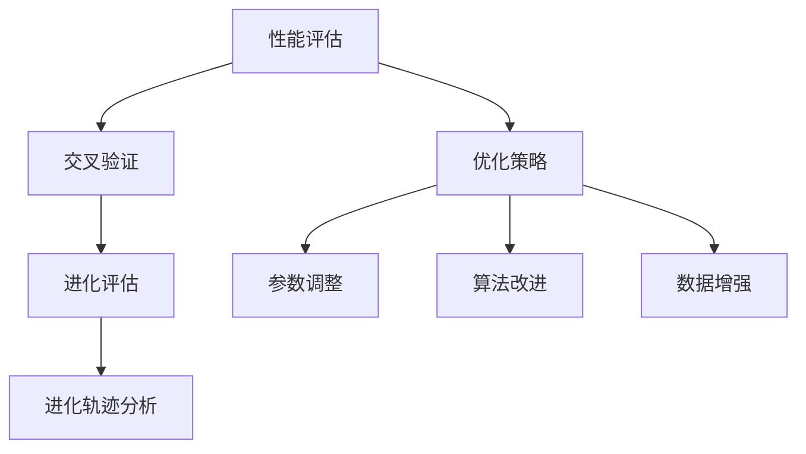

通过以上机制设计、实现策略和评估优化方法，我们可以构建一个具备持续进化能力的AI Agent。在接下来的章节中，我们将通过实际案例展示这些概念和方法的具体应用。

### 案例研究

在本节中，我们将通过三个具体案例，深入探讨自主学习型AI Agent的实际应用和实现过程。这些案例涵盖了不同领域，展示了AI Agent在现实场景中的强大潜力和应用价值。

#### 案例一：智能客服系统的构建

**项目介绍**：智能客服系统是一种基于AI技术的自动化客户服务系统，能够提供24/7的在线客服支持，提升客户满意度和企业运营效率。

**系统功能设计**：智能客服系统的核心功能包括：
- **自然语言处理（NLP）**：理解客户的问题和需求。
- **多轮对话管理**：与客户进行复杂的对话，提供解决方案。
- **知识库管理**：存储常见问题和解决方案，不断更新和优化。

**系统架构设计**：智能客服系统架构图如下（使用Mermaid绘制）：

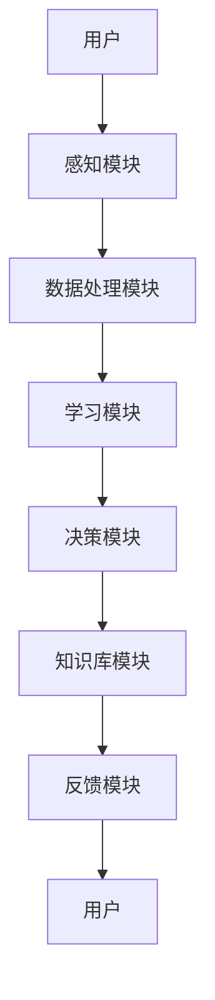

**系统接口设计和系统交互**：智能客服系统通过RESTful API与用户进行交互，接口设计如下：

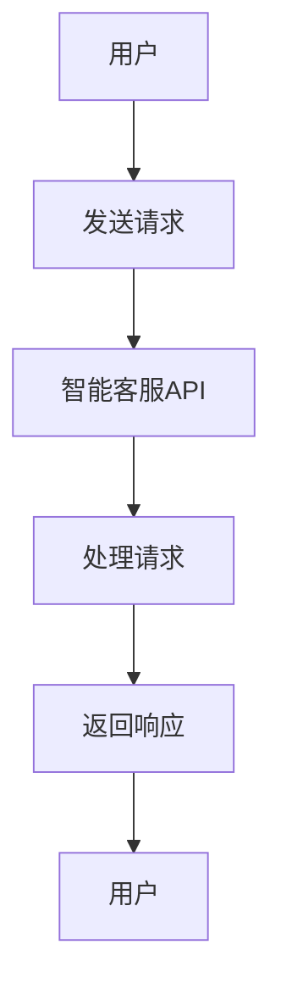

**代码实现**：以下是一个简化的智能客服系统Python代码示例：

```python
import json
from flask import Flask, request, jsonify

app = Flask(__name__)

# 模拟自然语言处理模块
def nlp(message):
    # 实现对消息的理解和处理
    return "您的问题已收到，我们将尽快为您解答。"

# 模拟知识库模块
knowledge_base = {
    "常见问题1": "答案1",
    "常见问题2": "答案2",
}

@app.route('/chat', methods=['POST'])
def chat():
    data = request.get_json()
    message = data['message']
    response = nlp(message)
    
    # 查询知识库
    if message in knowledge_base:
        response = knowledge_base[message]
    
    return jsonify({'response': response})

if __name__ == '__main__':
    app.run(debug=True)
```

**实际案例分析**：在实际应用中，智能客服系统通过不断学习用户的问题和对话模式，优化回答的准确性和效率。通过收集用户反馈，系统可以进一步改进，提升用户体验。

**项目小结**：智能客服系统的成功构建，展示了AI Agent在客户服务领域的应用潜力。通过自然语言处理、知识库管理和多轮对话管理，智能客服系统能够高效地解决用户问题，提高服务质量和运营效率。

#### 案例二：个性化推荐系统的设计与实现

**项目介绍**：个性化推荐系统是一种根据用户行为和偏好，为其推荐相关商品、内容或服务的系统，广泛应用于电商、媒体、社交网络等领域。

**系统功能设计**：个性化推荐系统的核心功能包括：
- **用户行为分析**：分析用户的历史行为，如浏览、购买、评价等。
- **内容特征提取**：提取商品、内容或服务的特征，如类别、标签、关键词等。
- **推荐算法**：基于用户行为和内容特征，为用户推荐相关的商品或内容。

**系统架构设计**：个性化推荐系统架构图如下（使用Mermaid绘制）：

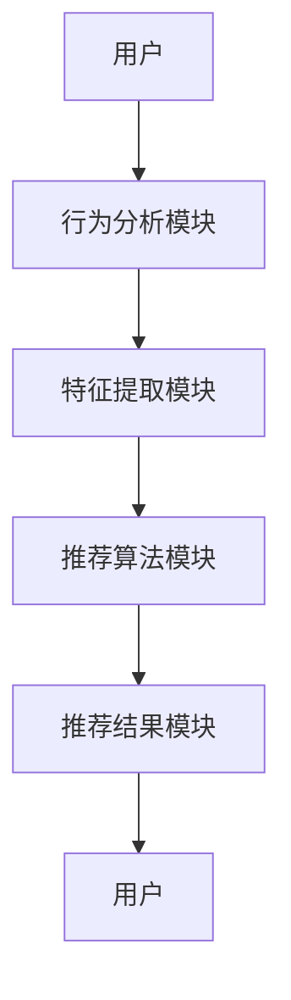

**系统接口设计和系统交互**：个性化推荐系统通过RESTful API为前端应用提供推荐结果，接口设计如下：

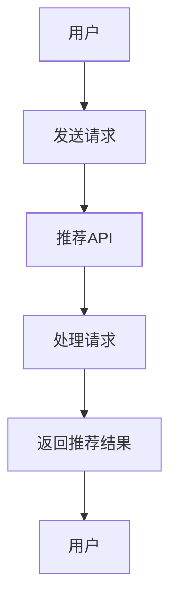

**代码实现**：以下是一个简化的个性化推荐系统Python代码示例：

```python
import json
from flask import Flask, request, jsonify

app = Flask(__name__)

# 模拟用户行为分析模块
user_behavior = [
    {'user_id': 1, 'item_id': 101, 'behavior': 'buy'},
    {'user_id': 1, 'item_id': 202, 'behavior': 'view'},
    {'user_id': 2, 'item_id': 303, 'behavior': 'buy'},
]

# 模拟推荐算法模块
def recommend(user_id):
    # 实现推荐算法，根据用户行为和内容特征推荐商品
    return [item_id for item_id, behavior in user_behavior if behavior == 'buy']

@app.route('/recommend', methods=['GET'])
def recommend_items():
    user_id = request.args.get('user_id', default=1, type=int)
    recommendations = recommend(user_id)
    return jsonify({'recommendations': recommendations})

if __name__ == '__main__':
    app.run(debug=True)
```

**实际案例分析**：在实际应用中，个性化推荐系统通过收集用户行为数据，不断优化推荐算法，提升推荐准确性和用户体验。通过A/B测试，企业可以验证推荐系统的效果，并不断调整和优化。

**项目小结**：个性化推荐系统的成功设计与实现，展示了AI Agent在推荐系统领域的应用价值。通过用户行为分析和推荐算法，个性化推荐系统能够为用户带来个性化的推荐体验，提高用户满意度和企业收益。

#### 案例三：医疗诊断辅助系统的开发

**项目介绍**：医疗诊断辅助系统是一种利用AI技术辅助医生进行疾病诊断和治疗的系统，能够在提高诊断准确率和效率方面发挥重要作用。

**系统功能设计**：医疗诊断辅助系统的核心功能包括：
- **医学图像分析**：对医学图像进行分析，识别病变区域。
- **疾病预测**：根据医学图像和患者信息，预测疾病类型。
- **诊断建议**：为医生提供诊断建议和治疗方案。

**系统架构设计**：医疗诊断辅助系统架构图如下（使用Mermaid绘制）：

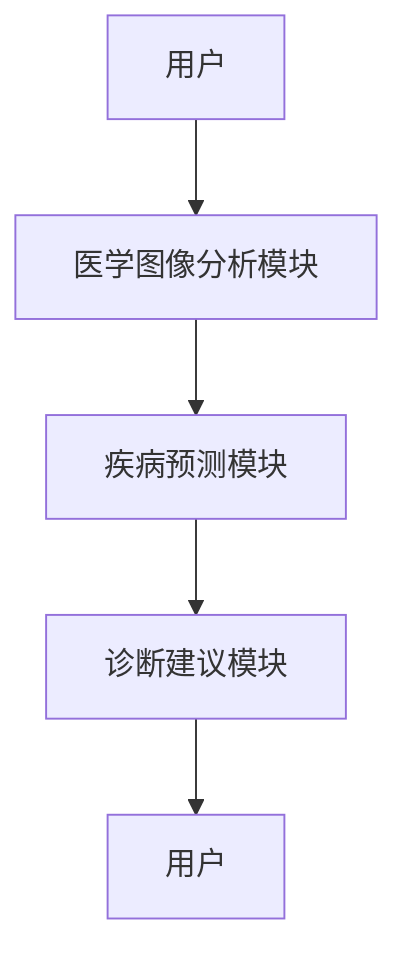

**系统接口设计和系统交互**：医疗诊断辅助系统通过API与医生和患者进行交互，接口设计如下：

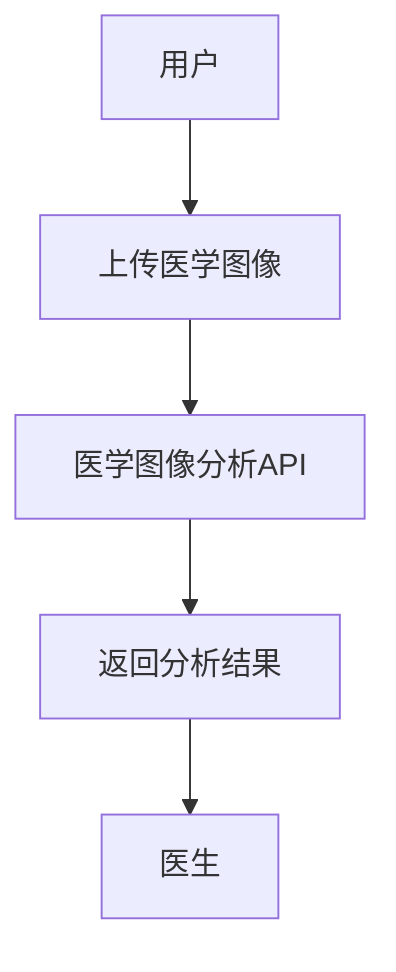

**代码实现**：以下是一个简化的医疗诊断辅助系统Python代码示例：

```python
import json
from flask import Flask, request, jsonify

app = Flask(__name__)

# 模拟医学图像分析模块
def analyze_image(image_data):
    # 实现医学图像分析，识别病变区域
    return "肺部有异常，建议进一步检查。"

@app.route('/diagnose', methods=['POST'])
def diagnose():
    data = request.get_json()
    image_data = data['image_data']
    diagnosis = analyze_image(image_data)
    return jsonify({'diagnosis': diagnosis})

if __name__ == '__main__':
    app.run(debug=True)
```

**实际案例分析**：在实际应用中，医疗诊断辅助系统通过不断学习大量的医学图像数据和病例，提高诊断的准确率和效率。通过与医生的协作，系统可以提供更加精准的诊断建议，辅助医生做出更好的治疗方案。

**项目小结**：医疗诊断辅助系统的成功开发，展示了AI Agent在医疗领域的巨大潜力。通过医学图像分析和疾病预测，医疗诊断辅助系统能够为医生提供有力支持，提高医疗服务的质量和效率。

### 总结与展望

在本篇文章中，我们系统地探讨了自主学习型AI Agent的概念、原理、实现方法以及其在不同领域的应用。通过对AI Agent的深入分析，我们认识到自主学习型AI Agent在应对复杂动态环境、提升智能水平和适应能力方面的巨大潜力。

**核心观点**：

1. **自主学习型AI Agent**：通过自我学习和优化，AI Agent能够不断提升其智能水平和适应能力，实现持续进化。
2. **多样化应用场景**：AI Agent在商业、医疗健康、教育等领域表现出强大的应用价值，为各行业带来了创新和变革。
3. **持续进化机制**：通过动态学习、适应性调整、自我优化和反馈机制，AI Agent能够实现持续进化，保持高效性和适应性。

**未来展望**：

1. **技术突破**：随着深度学习、强化学习、多智能体系统等技术的发展，AI Agent将在更多领域实现突破性应用。
2. **跨领域协作**：AI Agent将与其他技术（如物联网、区块链等）结合，形成更复杂、更智能的智能系统。
3. **伦理与法规**：随着AI Agent的应用日益广泛，其伦理和法规问题也日益突出，未来需要在技术、法律和社会层面进行深入探讨和规范。

**对读者的一些建议**：

1. **深入学习**：对AI Agent相关技术进行深入研究，掌握自主学习、深度学习、强化学习等核心算法。
2. **实践应用**：尝试将AI Agent技术应用于实际问题，通过实践积累经验。
3. **持续关注**：关注AI Agent技术的发展动态，了解前沿研究成果和应用案例，为未来创新奠定基础。

**作者信息**：

作者：AI天才研究院/AI Genius Institute & 禅与计算机程序设计艺术 /Zen And The Art of Computer Programming

---

通过本文的探讨，我们期望读者能够对自主学习型AI Agent有一个全面而深入的理解，为未来在相关领域的研究和应用提供参考和启示。在AI技术的不断进步中，AI Agent将继续发挥其独特的作用，推动人工智能领域的创新发展。

