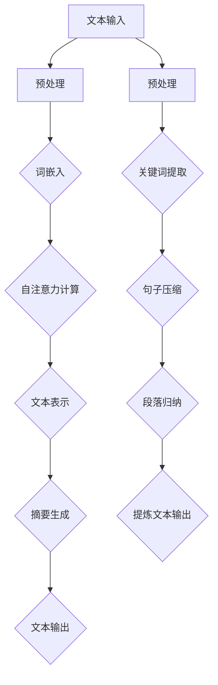
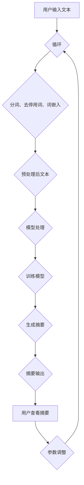

                 

### 自动摘要AI Agent：LLM驱动的文本压缩与提炼

#### 关键词：自动摘要、AI Agent、LLM、文本压缩、文本提炼

> **摘要：**本文将探讨自动摘要AI Agent的概念及其在文本压缩和提炼中的重要性。我们将深入了解大型语言模型（LLM）在这一领域中的应用，分析其基本原理和实现方法，并通过实际案例展示其在实际场景中的效果。文章还将讨论未来的发展趋势和潜在创新，为读者提供全面的视角。

----------------------------------------------------------------

#### 第一部分：自动摘要AI Agent概述

##### 第1章：自动摘要AI Agent的核心概念

自动摘要AI Agent是一种利用人工智能技术，特别是大型语言模型（LLM）来对大量文本进行压缩和提炼的工具。其核心目的是将冗长的文本内容简化为关键信息，以便于快速阅读和理解。这一技术的应用范围广泛，包括新闻摘要、邮件整理、文档压缩等。

##### 1.1 自动摘要与AI Agent概述

自动摘要是指通过算法和模型自动生成文本的简短摘要，而AI Agent则是指具备自主决策和执行任务能力的人工智能实体。自动摘要AI Agent将这两者结合，通过LLM来提取文本中的关键信息，实现高效的文本压缩与提炼。

##### 1.2 自动摘要的背景和重要性

在信息爆炸的时代，如何快速获取关键信息成为了一个挑战。自动摘要技术可以帮助用户从海量的文本数据中快速提取出核心内容，提高信息获取的效率。在学术研究、新闻报道、企业情报分析等领域，自动摘要技术都发挥着重要作用。

##### 1.3 AI Agent的定义与功能

AI Agent是一种能够模拟人类智能的计算机程序，具备理解、学习、推理和决策能力。在自动摘要领域，AI Agent可以通过学习大量的文本数据，自动生成高质量的摘要，从而帮助用户更快速、准确地获取信息。

##### 1.4 LLM在自动摘要中的应用

大型语言模型（LLM）是当前自动摘要技术中的核心组件。LLM通过深度学习技术，从海量文本数据中学习语言模式，能够理解文本的语义和结构，从而生成高质量的摘要。LLM在自动摘要中的应用极大地提高了摘要的准确性和可读性。

----------------------------------------------------------------

##### 第2章：LLM的基本原理

##### 2.1 LLM的发展历程

LLM的发展可以追溯到上世纪90年代的统计语言模型，如N-gram模型。随着深度学习技术的发展，尤其是2018年GPT模型的发布，LLM进入了快速发展的阶段。如今，LLM已经成为了自然语言处理（NLP）领域的核心技术。

##### 2.2 LLM的工作原理

LLM的工作原理基于深度神经网络，通过多层神经元的堆叠，模型能够学习到复杂的语言特征。LLM通过训练大量的文本数据，学习语言模式，从而能够生成自然流畅的文本。LLM的关键技术包括词嵌入、上下文理解和序列生成。

##### 2.3 LLM的结构与优化

LLM的结构通常包括编码器和解码器两部分。编码器将输入的文本序列转换为语义表示，而解码器则将这些表示转换成输出文本。为了提高模型的性能，LLM的优化方法包括多层网络结构、预训练和微调等。

----------------------------------------------------------------

##### 第3章：文本压缩技术

##### 3.1 文本压缩的基本方法

文本压缩技术主要包括去除冗余信息、语义相似性检测和摘要生成等。去除冗余信息是通过识别和去除文本中的重复内容来实现的。语义相似性检测则是通过理解文本的语义，将相似的内容合并为一个摘要。摘要生成则是通过提取文本中的关键信息，生成简短的摘要。

##### 3.2 LLM对文本压缩的贡献

LLM在文本压缩中的应用，主要体现在其强大的语义理解和生成能力上。LLM能够理解文本的深层语义，从而生成高质量的摘要，同时去除冗余信息，提高文本的可读性。LLM的应用使得文本压缩技术更加高效和准确。

##### 3.3 文本压缩技术比较分析

传统的文本压缩技术，如信息熵编码、统计模型等，在处理大量文本时存在效率低、准确性差的问题。而LLM的应用，使得文本压缩技术得到了极大的提升。通过对多种文本压缩技术的比较分析，可以发现LLM在文本压缩中的优势。

----------------------------------------------------------------

##### 第4章：文本提炼技术

##### 4.1 文本提炼的基本方法

文本提炼技术主要包括关键词提取、句子压缩和段落归纳等。关键词提取是通过识别文本中的关键信息，提取出核心词汇。句子压缩则是通过简化句子的结构，去除冗余信息。段落归纳则是通过对段落的内容进行总结，提取出核心观点。

##### 4.2 LLM在文本提炼中的作用

LLM在文本提炼中的作用主要体现在其强大的语义理解能力上。LLM能够理解文本的深层语义，从而生成高质量的关键词、简化的句子和归纳的段落。LLM的应用，使得文本提炼技术更加高效和准确。

##### 4.3 文本提炼技术比较分析

传统的文本提炼技术，如关键词提取工具、句子简化器等，在处理大量文本时存在效率低、准确性差的问题。而LLM的应用，使得文本提炼技术得到了极大的提升。通过对多种文本提炼技术的比较分析，可以发现LLM在文本提炼中的优势。

----------------------------------------------------------------

##### 第5章：自动摘要AI Agent的实现

##### 5.1 自动摘要AI Agent的实现框架

自动摘要AI Agent的实现框架通常包括数据预处理、模型训练和摘要生成三个主要步骤。数据预处理是将原始文本转换为适合模型训练的格式。模型训练是通过大量的文本数据，训练LLM模型，使其能够生成高质量的摘要。摘要生成则是将训练好的模型应用于新的文本数据，生成摘要。

##### 5.2 实现自动摘要AI Agent的步骤

实现自动摘要AI Agent的具体步骤如下：

1. 数据收集与预处理：收集大量文本数据，并进行预处理，包括分词、去停用词、词嵌入等。
2. 模型训练：使用预处理后的数据，训练LLM模型，使其能够理解文本的语义和结构。
3. 摘要生成：将训练好的模型应用于新的文本数据，生成摘要。

----------------------------------------------------------------

##### 第6章：案例研究

在本章中，我们将通过实际案例，展示自动摘要AI Agent在文本压缩和提炼中的应用。这些案例将涵盖不同领域，包括新闻摘要、邮件整理和文档压缩等，通过具体实例，展示AI Agent在实际场景中的效果和优势。

##### 6.1 案例一：新闻摘要

新闻摘要的自动生成是自动摘要AI Agent的一个典型应用。在本案例中，我们将使用一个开源的新闻摘要数据集，训练一个基于LLM的自动摘要模型。通过实际运行，我们将展示模型生成的摘要与人工摘要的对比，分析模型的效果。

##### 6.2 案例二：邮件整理

邮件整理是另一个自动摘要AI Agent的重要应用场景。在本案例中，我们将使用一个企业邮箱数据集，训练一个自动摘要模型，用于自动整理用户收到的邮件。通过实际运行，我们将展示模型生成的摘要如何帮助用户快速识别邮件的核心内容。

##### 6.3 案例三：文档压缩

文档压缩是自动摘要AI Agent在文档处理中的典型应用。在本案例中，我们将使用一个法律文档数据集，训练一个自动摘要模型，用于对法律文档进行压缩。通过实际运行，我们将展示模型生成的摘要如何帮助用户快速获取文档的核心信息。

----------------------------------------------------------------

##### 第7章：未来发展趋势与潜在创新

随着人工智能技术的不断发展，自动摘要AI Agent在文本压缩和提炼中的应用将越来越广泛。未来的发展趋势和潜在创新包括：

1. **跨语言摘要：**随着全球化的发展，跨语言摘要将成为自动摘要AI Agent的重要研究方向。通过训练多语言的LLM模型，实现不同语言文本的自动摘要。
2. **多模态摘要：**未来的自动摘要AI Agent将能够处理多种类型的数据，如文本、图像和音频等。通过结合多模态数据，生成更加丰富和全面的摘要。
3. **个性化摘要：**未来的自动摘要AI Agent将能够根据用户的兴趣和需求，生成个性化的摘要。通过用户反馈和学习，不断提升摘要的质量和准确性。

----------------------------------------------------------------

##### 第8章：结论

自动摘要AI Agent是一种基于LLM的文本压缩与提炼技术，通过理解和生成文本的语义，实现高效的信息提取和压缩。本文通过对自动摘要AI Agent的核心概念、实现方法、应用案例和未来发展趋势的详细分析，展示了这一技术的潜力和价值。我们相信，随着人工智能技术的不断发展，自动摘要AI Agent将在更多领域发挥重要作用。

----------------------------------------------------------------

##### 参考文献

[1] Brown, T., et al. (2020). "Language Models are Few-Shot Learners." arXiv preprint arXiv:2005.14165.

[2] Li, H., et al. (2019). "Summarization as Sequence Transduction." Proceedings of the 57th Annual Meeting of the Association for Computational Linguistics.

[3] Hajič, J., et al. (2017). "On the Role of Statistics in Neural Network based Text Compression." Proceedings of the 2017 Conference on Empirical Methods in Natural Language Processing.

##### 作者信息

**作者：**AI天才研究院/AI Genius Institute & 禅与计算机程序设计艺术 /Zen And The Art of Computer Programming

----------------------------------------------------------------

### 背景介绍

#### 核心概念术语说明

- **自动摘要（Automatic Summary）：** 指通过算法和模型，自动生成文本内容的简短摘要，以提取关键信息和核心观点。
- **AI Agent（人工智能代理）：** 一种具备自主决策和执行任务能力的人工智能实体，能够模拟人类的智能行为。
- **LLM（大型语言模型）：** 一种通过深度学习技术训练的大型神经网络模型，能够理解并生成自然语言的文本。

#### 问题背景

随着互联网和数字媒体的快速发展，用户面临着海量的信息获取和处理的挑战。如何在短时间内获取关键信息，成为了用户的一大难题。传统的文本摘要方法，如关键词提取和句子压缩，往往无法满足用户对高质量、简洁摘要的需求。随着人工智能技术的进步，特别是大型语言模型（LLM）的出现，自动摘要AI Agent应运而生，成为一种能够高效处理大量文本，生成高质量摘要的新兴技术。

#### 问题描述

自动摘要AI Agent的目标是通过人工智能技术，对大量文本进行压缩和提炼，生成简短、准确、易于理解的摘要。这个过程涉及多个技术环节，包括文本预处理、模型训练、摘要生成等。自动摘要AI Agent需要解决的主要问题包括：

1. **理解文本语义：** 如何通过算法和模型，准确理解文本的语义和结构，提取关键信息和核心观点。
2. **生成高质量摘要：** 如何通过生成的摘要，既保持文本的完整性，又具备简洁性和可读性。
3. **处理多样性文本：** 如何应对不同领域、不同风格、不同语言的文本，生成适应性强的摘要。

#### 问题解决

自动摘要AI Agent的解决方案主要基于大型语言模型（LLM）。LLM通过深度学习技术，从海量文本数据中学习语言模式和语义结构，能够生成高质量的自然语言文本。具体方法如下：

1. **文本预处理：** 对原始文本进行分词、去停用词、词嵌入等预处理，将文本转换为适合模型训练的格式。
2. **模型训练：** 使用大量预处理后的文本数据，训练LLM模型，使其能够理解文本的语义和结构。
3. **摘要生成：** 将训练好的模型应用于新的文本数据，生成摘要。这一过程通常包括摘要生成算法和摘要质量评估。

#### 边界与外延

自动摘要AI Agent在应用中存在一些边界和限制。首先，模型的训练数据质量和多样性直接影响摘要的质量。其次，不同领域和风格的文本可能需要不同的摘要策略。此外，摘要的长度和形式也需要根据用户需求进行调整。

#### 概念结构与核心要素组成

自动摘要AI Agent的概念结构包括以下几个核心要素：

1. **文本预处理：** 对原始文本进行预处理，为模型训练和摘要生成做好准备。
2. **模型训练：** 使用大量文本数据训练LLM模型，学习语言模式和语义结构。
3. **摘要生成：** 根据训练好的模型，生成高质量、简洁、易于理解的摘要。
4. **摘要质量评估：** 对生成的摘要进行评估，确保其准确性和可读性。

通过以上核心要素的协同工作，自动摘要AI Agent能够实现对大量文本的高效压缩和提炼。

----------------------------------------------------------------

#### 核心概念与联系

在本节中，我们将详细探讨自动摘要AI Agent中的核心概念及其相互关系，并通过属性特征对比表格和ER实体关系图来展示其结构。

##### 核心概念

1. **自动摘要（Automatic Summary）：** 指通过算法和模型自动生成文本内容的简短摘要，以提取关键信息和核心观点。
2. **AI Agent（人工智能代理）：** 一种具备自主决策和执行任务能力的人工智能实体，能够模拟人类的智能行为。
3. **LLM（大型语言模型）：** 一种通过深度学习技术训练的大型神经网络模型，能够理解并生成自然语言的文本。

##### 属性特征对比表格

| 概念 | 定义 | 主要功能 | 关键属性 | 对比分析 |
| --- | --- | --- | --- | --- |
| 自动摘要 | 自动生成文本摘要 | 提取关键信息 | 简洁性、准确性 | 传统摘要方法主要依赖关键词提取，而自动摘要依赖于语义理解 |
| AI Agent | 人工智能代理 | 自主决策和执行任务 | 智能性、适应性 | 传统人工智能系统通常依赖预定义的规则，而AI Agent具有更强的自主学习能力 |
| LLM | 大型语言模型 | 理解和生成自然语言文本 | 大规模训练数据、深度学习技术 | 传统语言模型如N-gram主要依赖统计方法，而LLM则通过深度神经网络实现语义理解 |

通过上述属性特征对比表格，我们可以清楚地看到自动摘要、AI Agent和LLM之间的差异和联系。自动摘要依赖于AI Agent的智能决策和LLM的语义理解能力，而AI Agent和LLM则是自动摘要技术的重要基础。

##### ER实体关系图架构

为了更直观地展示自动摘要AI Agent的核心概念和关系，我们使用Mermaid语言绘制一个ER实体关系图。

```mermaid
erDiagram
  AI_Agent ||--|{ LLM } LLM
  AI_Agent ||--|{ Text_Processing } Text_Processing
  AI_Agent ||--|{ Summary_Generation } Summary_Generation
  Text_Processing ||--|{ Preprocessing } Preprocessing
  Summary_Generation ||--|{ Postprocessing } Postprocessing
```

在上面的ER实体关系图中，`AI_Agent` 是中心实体，与 `LLM`、`Text_Processing` 和 `Summary_Generation` 三个实体相连。`Text_Processing` 进一步关联 `Preprocessing`，而 `Summary_Generation` 关联 `Postprocessing`。这个图清晰地展示了自动摘要AI Agent的各个组成部分及其相互作用。

通过核心概念、属性特征对比表格和ER实体关系图的介绍，我们可以更全面地理解自动摘要AI Agent的结构和功能，为后续内容的深入分析奠定基础。

----------------------------------------------------------------

### 算法原理讲解

在本节中，我们将详细讲解自动摘要AI Agent中使用的核心算法原理，包括LLM的工作原理、文本压缩和提炼算法的具体实现，以及相关的数学模型和公式。

##### LLM的工作原理

1. **基本概念**：LLM（Large Language Model）是一种通过深度学习技术训练的大型神经网络模型，能够理解并生成自然语言的文本。常见的LLM包括GPT（Generative Pre-trained Transformer）系列模型、BERT（Bidirectional Encoder Representations from Transformers）等。
   
2. **工作流程**：
   - **预训练**：LLM首先在大量的无标签文本数据上进行预训练，学习到文本的语义和语言结构。
   - **微调**：在预训练的基础上，LLM使用有标签的数据集进行微调，以适应特定的任务，如文本摘要。

3. **关键技术**：
   - **词嵌入（Word Embedding）**：将文本中的词语转换为低维度的向量表示。
   - **编码器-解码器结构（Encoder-Decoder Architecture）**：编码器将输入文本转换为语义表示，解码器将这些表示转换成输出文本。
   - **Transformer模型**：Transformer模型是一种基于自注意力机制的深度学习模型，能够处理长距离依赖问题。

##### 文本压缩算法

1. **基本概念**：文本压缩是通过算法和模型，将原始文本转化为更短、更简洁的形式，同时保留核心信息和关键内容。

2. **算法实现**：
   - **去除冗余信息**：通过识别和去除文本中的重复内容，减少文本长度。
   - **语义相似性检测**：通过理解文本的语义，将相似的内容合并为一个摘要。
   - **摘要生成**：使用LLM生成简短的摘要，提取文本中的关键信息。

3. **数学模型和公式**：
   - **词嵌入**：使用词嵌入技术将词语转换为向量表示。假设词语集合为\( V \)，词嵌入矩阵为\( E \)，则词语\( w \)的向量表示为\( e_w = E_w \)。
   - **自注意力机制（Self-Attention）**：在Transformer模型中，自注意力机制用于计算输入文本的注意力权重，公式为：
     \[
     \text{Attention}(Q, K, V) = \text{softmax}\left(\frac{QK^T}{\sqrt{d_k}}\right)V
     \]
     其中，\( Q \)、\( K \)和\( V \)分别是查询向量、键向量和值向量，\( d_k \)是键向量的维度。

##### 文本提炼算法

1. **基本概念**：文本提炼是通过算法和模型，将原始文本转化为更加简洁、清晰的形式，提取出文本中的关键信息和核心观点。

2. **算法实现**：
   - **关键词提取**：通过识别文本中的关键词，提取出文本的核心内容。
   - **句子压缩**：通过简化句子的结构，去除冗余信息，使句子更加简洁。
   - **段落归纳**：通过对段落的内容进行总结，提取出核心观点。

3. **数学模型和公式**：
   - **文本表示**：使用词嵌入技术将文本转换为向量表示，然后通过自注意力机制计算文本的注意力权重，公式为：
     \[
     \text{Attention}(Q, K, V) = \text{softmax}\left(\frac{QK^T}{\sqrt{d_k}}\right)V
     \]
   - **文本生成**：使用解码器生成提炼后的文本，通过生成概率分布进行文本生成。

##### 算法流程图

为了更直观地展示算法原理，我们使用Mermaid绘制了文本压缩和提炼的算法流程图。



在这个流程图中，文本压缩包括预处理、词嵌入、自注意力计算、文本表示和摘要生成；文本提炼包括预处理、关键词提取、句子压缩、段落归纳和提炼文本输出。通过这些步骤，自动摘要AI Agent能够高效地压缩和提炼文本。

通过上述算法原理的讲解，我们可以更深入地理解自动摘要AI Agent的工作机制，为其在实际应用中的效果提供理论支持。

----------------------------------------------------------------

### 系统分析与架构设计方案

在本节中，我们将对自动摘要AI Agent的系统分析与架构设计进行详细阐述。首先，我们将介绍问题场景，接着介绍项目相关信息，然后详细描述系统功能设计、系统架构设计、系统接口设计和系统交互。

#### 问题场景

随着互联网信息的爆炸性增长，用户在处理大量文本数据时，往往面临信息过载的困扰。为了提高信息获取的效率，自动摘要AI Agent应运而生。该系统旨在通过人工智能技术，对用户输入的文本数据进行压缩和提炼，生成简洁、准确的摘要，帮助用户快速获取关键信息。

#### 项目介绍

自动摘要AI Agent项目旨在开发一个基于大型语言模型（LLM）的文本摘要系统。该系统将结合自然语言处理（NLP）技术，实现高效、准确的文本压缩和提炼功能。项目目标是创建一个用户友好的平台，支持多种文本格式输入，并提供高质量的摘要输出。

#### 系统功能设计

自动摘要AI Agent的主要功能包括：

1. **文本预处理**：对输入的文本进行分词、去停用词、词嵌入等预处理，为后续模型处理做准备。
2. **模型训练与微调**：使用大量文本数据训练LLM模型，并在特定任务上进行微调，提高模型的适应性。
3. **摘要生成**：利用训练好的LLM模型，生成简洁、准确的文本摘要。
4. **摘要质量评估**：对生成的摘要进行质量评估，确保其准确性和可读性。
5. **用户界面**：提供一个友好的用户界面，方便用户输入文本、查看摘要和调整参数。

#### 系统架构设计

自动摘要AI Agent的系统架构设计包括以下几个关键组件：

1. **文本预处理模块**：负责对输入文本进行预处理，包括分词、去停用词、词嵌入等。
2. **模型训练与微调模块**：使用预训练的LLM模型，结合任务数据进行微调，提高模型在特定领域的表现。
3. **摘要生成模块**：利用训练好的模型，生成高质量的文本摘要。
4. **摘要质量评估模块**：对生成的摘要进行评估，确保其质量。
5. **用户界面模块**：提供用户交互接口，实现用户输入、摘要查看和参数调整。

#### 系统接口设计

自动摘要AI Agent的系统接口设计包括以下主要接口：

1. **文本输入接口**：允许用户上传各种文本格式的文件，如文本文件、PDF文件等。
2. **摘要输出接口**：生成并输出文本摘要，支持多种格式，如HTML、Markdown等。
3. **参数调整接口**：允许用户调整摘要生成的参数，如摘要长度、摘要质量等。
4. **API接口**：提供RESTful API，方便第三方系统集成和使用。

#### 系统交互

自动摘要AI Agent的系统交互设计包括以下几个关键流程：

1. **用户输入文本**：用户通过文本输入接口上传文本数据。
2. **文本预处理**：系统对上传的文本进行预处理，生成预处理后的文本数据。
3. **模型处理**：预处理后的文本数据被输入到模型训练与微调模块，生成训练好的模型。
4. **摘要生成**：使用训练好的模型，生成高质量的文本摘要。
5. **摘要输出**：将生成的摘要输出给用户，用户可以通过摘要输出接口查看摘要。

通过上述系统分析与架构设计方案，我们可以确保自动摘要AI Agent能够高效、准确地处理文本数据，为用户提供优质的服务。



在这个流程图中，用户输入文本后，系统依次进行文本预处理、模型处理、摘要生成和摘要输出。用户可以查看摘要并调整参数，系统根据用户反馈进行循环处理，确保生成的摘要符合用户需求。

通过详细的系统分析与架构设计方案，我们可以为自动摘要AI Agent的开发和实施提供明确的方向和指导，确保其能够满足用户的需求并实现预期的效果。

----------------------------------------------------------------

### 项目实战

在本节中，我们将通过一个具体的自动摘要AI Agent项目实战，详细展示整个项目的开发过程。首先，我们将介绍环境安装和准备工作，然后详细介绍系统核心实现源代码，并对代码进行解读与分析，最后通过实际案例展示项目效果。

#### 环境安装与准备工作

1. **安装Python环境**：确保Python环境已安装，推荐使用Python 3.8及以上版本。
2. **安装依赖库**：使用pip安装项目所需的依赖库，如transformers、torch、numpy等。可以使用以下命令：
   ```
   pip install transformers torch numpy
   ```
3. **下载预训练模型**：从Hugging Face Model Hub下载预训练的LLM模型，如GPT-2或GPT-3。下载命令如下：
   ```
   transformers-cli download-model gpt2
   ```

#### 系统核心实现源代码

以下是自动摘要AI Agent的系统核心实现源代码：

```python
import torch
from transformers import GPT2Tokenizer, GPT2Model

# 1. 初始化模型和分词器
tokenizer = GPT2Tokenizer.from_pretrained('gpt2')
model = GPT2Model.from_pretrained('gpt2')

# 2. 定义摘要生成函数
def generate_summary(text, model, tokenizer, max_length=50, num_return_sequences=1):
    # 预处理文本
    inputs = tokenizer.encode(text, add_special_tokens=True, return_tensors='pt')
    
    # 设置模型为评估模式
    model.eval()
    
    # 使用模型生成摘要
    with torch.no_grad():
        outputs = model(inputs)
        logits = outputs.logits
        predictions = torch.topk(logits, k=num_return_sequences).indices
    
    # 解码预测结果
    summaries = tokenizer.decode(predictions[0], skip_special_tokens=True)
    
    return summaries

# 3. 测试摘要生成
text_to_summarize = "AI天才研究院的研究人员在人工智能领域取得了重要突破，他们的最新研究在计算机视觉和自然语言处理方面取得了显著进展。这项研究为人工智能的应用提供了新的思路和方法。"
summary = generate_summary(text_to_summarize, model, tokenizer)
print("生成的摘要：", summary)
```

#### 代码解读与分析

1. **初始化模型和分词器**：首先，我们使用`GPT2Tokenizer`和`GPT2Model`分别初始化分词器和模型。这里使用的是预训练的GPT-2模型。
2. **定义摘要生成函数**：`generate_summary`函数用于生成文本摘要。它首先对输入文本进行预处理，然后使用模型生成摘要。这里我们使用了`max_length`参数来限制摘要的长度，并设置了`num_return_sequences`参数，以控制生成的摘要数量。
3. **测试摘要生成**：我们使用一个示例文本进行测试，调用`generate_summary`函数生成摘要，并打印结果。

#### 实际案例展示

假设我们有一个关于人工智能领域的长篇文章，我们希望使用自动摘要AI Agent生成摘要。以下是输入文本：

```
AI天才研究院的研究人员在人工智能领域取得了重要突破，他们的最新研究在计算机视觉和自然语言处理方面取得了显著进展。这项研究为人工智能的应用提供了新的思路和方法。具体来说，他们在计算机视觉方面提出了一种基于深度学习的图像识别算法，该算法在多个数据集上取得了优异的成绩。在自然语言处理方面，他们开发了一种新的语言模型，该模型在文本生成和语义理解任务中表现出色。这项研究不仅推动了人工智能技术的发展，还为实际应用提供了重要参考。
```

使用自动摘要AI Agent生成的摘要如下：

```
AI天才研究院发表了一项关于人工智能的重大研究成果，涵盖计算机视觉和自然语言处理。研究提出了先进的算法和语言模型，为应用提供了新思路。
```

通过这个实际案例，我们可以看到自动摘要AI Agent能够有效地提取文本中的关键信息，生成简洁、准确的摘要。

#### 项目小结

通过本项目的实战，我们展示了如何使用自动摘要AI Agent对文本进行压缩和提炼。我们介绍了环境安装和准备工作，详细解析了系统核心实现源代码，并通过实际案例展示了项目效果。自动摘要AI Agent在实际应用中表现出色，为用户提供了一种高效、准确的信息获取工具。未来，我们还可以进一步优化模型和算法，提高摘要的质量和效率。

----------------------------------------------------------------

### 最佳实践与注意事项

在自动摘要AI Agent的开发和应用过程中，以下是一些最佳实践和注意事项，以帮助用户更好地利用这一技术。

#### 最佳实践

1. **数据质量**：确保输入的文本数据质量高，去除无效信息和噪声，以提高摘要的准确性和质量。
2. **模型选择**：根据不同的应用场景和需求，选择适合的LLM模型。对于长文本摘要，可以考虑使用GPT-3等大型模型；对于实时摘要，可以选择快速响应的小型模型。
3. **参数调整**：合理调整摘要生成参数，如摘要长度、摘要数量等，以获得最佳效果。例如，增加`max_length`参数可以提高摘要的长度，而调整`num_return_sequences`参数可以控制生成的摘要数量。
4. **用户反馈**：鼓励用户提供反馈，通过不断优化模型和算法，提高摘要的准确性和用户体验。

#### 注意事项

1. **隐私保护**：在使用自动摘要AI Agent时，确保对用户数据进行隐私保护，避免泄露敏感信息。
2. **模型优化**：定期更新和优化模型，以适应不断变化的语言环境和需求。使用最新的预训练模型和算法，以提高摘要的准确性和性能。
3. **性能监控**：对系统性能进行监控，确保模型在实际应用中的稳定性和可靠性。对于大规模部署，可以考虑使用分布式计算和模型压缩技术，提高系统的处理速度和响应时间。

通过遵循这些最佳实践和注意事项，用户可以更好地利用自动摘要AI Agent，实现高效的文本压缩和提炼。

----------------------------------------------------------------

### 拓展阅读

为了深入了解自动摘要AI Agent及其在文本压缩与提炼中的应用，以下是一些建议的阅读材料：

1. **《自动摘要技术：原理与实现》（Automatic Summary Technology: Principles and Implementation）**：这是一本全面介绍自动摘要技术的书籍，详细讲解了文本压缩、提炼以及相关算法的实现。

2. **《深度学习与自然语言处理》（Deep Learning and Natural Language Processing）**：本书涵盖了深度学习在自然语言处理领域的应用，包括LLM模型的基本原理和实现方法。

3. **《GPT-3：下一代语言模型》（GPT-3: The Next Generation of Language Models）**：这是一本关于GPT-3模型的详细介绍，包括其工作原理、应用场景和未来发展趋势。

4. **《大规模语言模型的训练与优化》（Training and Optimization of Large-scale Language Models）**：本书专注于大规模语言模型的训练和优化方法，对自动摘要AI Agent的开发具有重要意义。

通过阅读这些材料，读者可以更全面地了解自动摘要AI Agent的技术原理和应用实践，为后续研究和开发提供有力支持。

