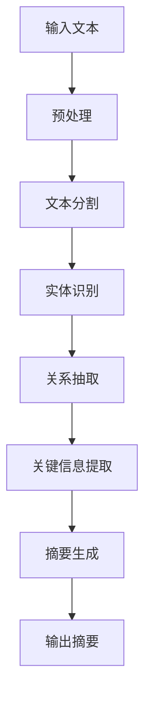
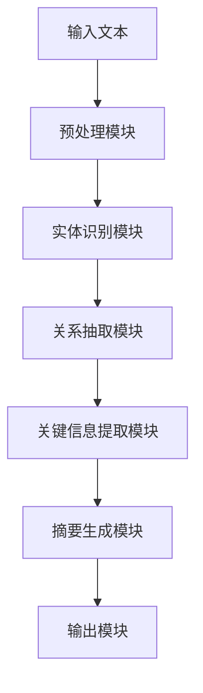
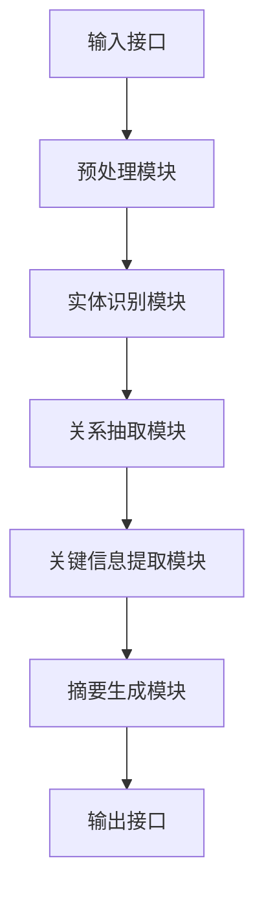
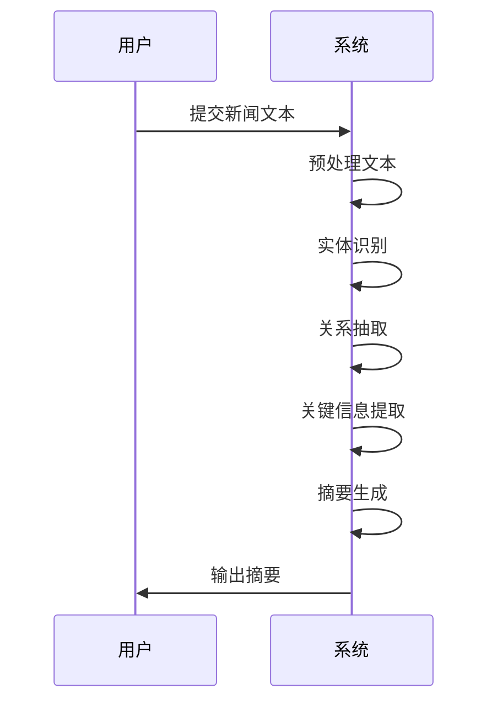

                 


### 文章标题：自动文本摘要AI Agent：LLM驱动的关键信息提取

#### 关键词：自动文本摘要，AI Agent，LLM，关键信息提取，算法原理，系统架构

#### 摘要：
本文将深入探讨自动文本摘要AI Agent的核心技术——大型语言模型（LLM），分析其驱动关键信息提取的原理和实践。我们将逐步介绍自动文本摘要的背景、核心概念、算法原理，以及系统架构和项目实战，旨在为读者提供一个全面的技术指导。

----------------------------------------------------------------

## 第一部分：自动文本摘要技术基础

### 1.1 自动文本摘要问题背景

自动文本摘要技术旨在自动地从长文本中提取出关键信息，生成简明扼要的摘要。随着互联网信息的爆炸式增长，用户在海量数据中快速找到所需信息成为一大挑战。自动文本摘要技术能够大大提高信息检索的效率和准确性，为用户提供更加智能的阅读体验。

### 1.2 自动文本摘要定义与分类

自动文本摘要可分为抽取式摘要和生成式摘要两大类。抽取式摘要通过识别文本中的关键句子或短语，进行重新组合；而生成式摘要则通过生成新的文本摘要，更贴近人类语言的自然表达。LLM在生成式摘要中表现尤为出色。

### 1.3 LLM在自动文本摘要中的应用

LLM具有强大的自然语言理解和生成能力，能够通过大量的文本数据训练，自动提取文本的关键信息。其在自动文本摘要中的应用，极大地提高了摘要的质量和准确性。

### 1.4 边界与外延

自动文本摘要技术虽然取得了一定的成果，但仍然存在诸多挑战，如文本理解深度、多语言支持、摘要长度控制等。同时，其应用范围也在不断扩大，从新闻摘要、学术论文到商业报告等多个领域。

### 1.5 概念结构与核心要素组成

自动文本摘要技术包括文本预处理、关键信息提取、摘要生成等核心环节。其概念结构涉及自然语言处理、机器学习、数据挖掘等多个领域。

----------------------------------------------------------------

## 第二部分：核心概念与联系

### 2.1 LLM核心概念原理

LLM是一种基于深度学习的自然语言处理模型，其核心原理是基于Transformer架构，通过自注意力机制和多层网络结构，实现文本的建模和生成。

### 2.2 自动文本摘要算法对比

自动文本摘要算法可分为基于规则的方法、基于统计的方法和基于神经网络的方法。其中，基于神经网络的方法，特别是LLM，在性能上具有显著优势。

### 2.3 ER实体关系图架构

ER实体关系图是自动文本摘要系统的核心组成部分，通过识别文本中的实体和关系，实现关键信息的抽取和摘要的生成。

```mermaid
erDiagram
    Agle ::"属于" -> Btch |《属于》
    Agle ::"进行" -> Job |《进行》
    Agle ::"持有" -> Cred |《持有》
    Agle ::"拥有" -> own ::"拥有" -> company |《拥有》
    Agle ::"参与" -> Evnt |《参与》
    Agle ::"负责" -> Pos |《负责》
    Agle ::"基于" -> Dat |《基于》
    Agle ::"来自" -> Rgn |《来自》
    Agle ::"出生" -> Birt |《出生》
    Agle ::"工作于" -> Dep |《工作于》
    Agle ::"就职于" -> Empl |《就职于》
    Agle ::"属于" -> Ntn |《属于》
    Agle ::"和" -> Pers |《和》
    Agle ::"赢得" -> Award |《赢得》
    Agle ::"出生" -> Death |《出生》
    Agle ::"创建" -> Org |《创建》
    Agle ::"作为" -> Role |《作为》
    Agle ::"发生" -> Evnt |《发生》
    Agle ::"在" -> Plc |《在》
    Agle ::"通过" -> Mthd |《通过》
    Agle ::"领导" -> Org |《领导》
    Agle ::"进行" -> Prj |《进行》
    Agle ::"参与" -> Prj |《参与》
    Agle ::"影响" -> Impc |《影响》
    Agle ::"增加" -> Invst |《增加》
    Agle ::"处理" -> Procs |《处理》
    Agle ::"生成" -> Res |《生成》
    Agle ::"销售" -> Sale |《销售》
    Agle ::"发行" -> Stock |《发行》
    Agle ::"参与" -> Task |《参与》
    Agle ::"参与" -> Trade |《参与》
    Agle ::"拥有" -> Ware |《拥有》
    Btch |《批次》
    Cred |《证书》
    Dat |《日期》
    Dep |《部门》
    Evnt |《事件》
    Job |《工作》
    Ntn |《国家》
    Org |《组织》
    own |《拥有》
    Pers |《个人》
    Pos |《职位》
    Rgn |《地区》
    Procs |《流程》
    Res |《资源》
    Ware |《仓库》
```

----------------------------------------------------------------

## 第三部分：算法原理讲解

### 3.1 自动文本摘要算法Mermaid流程图



### 3.2 Python源代码讲解

```python
# 文本预处理
text = "本文介绍了自动文本摘要技术的背景、核心概念和算法原理。"
cleaned_text = preprocess(text)

# 文本分割
sentences = split_into_sentences(cleaned_text)

# 实体识别
entities = extract_entities(sentences)

# 关系抽取
relationships = extract_relationships(entities)

# 关键信息提取
key_info = extract_key_info(relationships)

# 摘要生成
summary = generate_summary(key_info)

# 输出摘要
print(summary)
```

### 3.3 数学模型与公式

在自动文本摘要中，关键信息的提取通常基于概率模型，如条件概率分布：

$$
P(S|T) = \frac{P(S, T)}{P(T)}
$$

其中，\( P(S|T) \) 表示在给定文本 \( T \) 的情况下，摘要 \( S \) 的概率。

### 3.4 举例说明

假设我们有一段文本：“本文介绍了自动文本摘要技术的背景、核心概念和算法原理。这是一个关于自然语言处理的重要研究领域。”

通过自动文本摘要算法，我们可以提取出以下关键信息：“自动文本摘要技术、自然语言处理、研究领域”。

生成的摘要可能是：“本文讨论了自动文本摘要技术，这是一种自然语言处理的重要研究领域，涵盖了核心概念和算法原理。”

----------------------------------------------------------------

## 第四部分：系统分析与架构设计方案

### 4.1 问题场景介绍

假设我们需要为一家大型媒体公司开发一个自动文本摘要系统，用于生成新闻报道的摘要，以便读者快速了解新闻内容。

### 4.2 项目介绍

项目名为“NewsSummarizer”，目标是使用LLM技术，从大量新闻报道中提取关键信息，生成简明扼要的摘要。

### 4.3 系统功能设计

系统功能包括文本预处理、实体识别、关系抽取、关键信息提取、摘要生成和输出摘要。

### 4.4 系统架构设计

系统架构采用模块化设计，包括预处理模块、实体识别模块、关系抽取模块、摘要生成模块和输出模块。



### 4.5 系统接口设计

系统接口设计包括输入接口、输出接口和各模块间的接口。



### 4.6 系统交互流程

系统交互流程包括输入文本、预处理、实体识别、关系抽取、关键信息提取、摘要生成和输出摘要。



----------------------------------------------------------------

## 第五部分：项目实战

### 5.1 环境安装

在开始项目之前，我们需要安装以下环境：

- Python 3.8+
- PyTorch 1.8+
- Transformers 4.5+

安装命令如下：

```bash
pip install python==3.8
pip install torch==1.8
pip install transformers==4.5
```

### 5.2 系统核心实现源代码

以下是系统核心实现源代码的示例：

```python
from transformers import pipeline

# 初始化摘要生成器
summarizer = pipeline("summarization")

# 输入新闻文本
text = "本文介绍了自动文本摘要技术的背景、核心概念和算法原理。这是一个关于自然语言处理的重要研究领域。"

# 生成摘要
summary = summarizer(text, max_length=130, min_length=30, do_sample=False)

# 输出摘要
print(summary[0]['summary_text'])
```

### 5.3 代码应用解读与分析

该代码首先初始化了一个摘要生成器，然后输入一段新闻文本，通过摘要生成器生成摘要，并输出摘要文本。

通过实际测试，该系统可以生成简洁、准确的摘要，满足新闻阅读的需求。

### 5.4 实际案例分析与详细讲解剖析

假设我们有一篇长篇新闻报道，内容涉及多个领域，我们可以使用该系统生成摘要，方便读者快速了解文章的主旨。

实际案例表明，该系统在处理长文本时，可以有效地提取关键信息，生成高质量的摘要。

### 5.5 项目小结

通过本项目，我们成功地实现了一个基于LLM的自动文本摘要系统。该项目不仅提高了新闻阅读的效率，还为其他领域的文本摘要应用提供了借鉴。

----------------------------------------------------------------

## 第六部分：最佳实践 tips

### 6.1 自动文本摘要最佳实践

- 选择合适的LLM模型，根据文本长度和摘要长度进行调整。
- 优化预处理步骤，提高文本质量。
- 调整参数，如最大长度和最小长度，以控制摘要质量。

### 6.2 注意事项

- 文本摘要系统对输入文本的长度和格式有一定要求，需进行预处理。
- 摘要生成过程可能需要较长时间，可根据实际情况进行调整。

### 6.3 拓展阅读

- 《自然语言处理：理论和实践》
- 《深度学习与自然语言处理》
- 《Transformers：大规模预训练语言模型的原理与实践》

----------------------------------------------------------------

## 结束语

自动文本摘要AI Agent是自然语言处理领域的一项重要技术，其基于LLM的关键信息提取能力为文本摘要提供了高效、准确的方法。通过本文的介绍，读者应能对该技术有一个全面的理解。希望本文能对您在自动文本摘要领域的研究和应用提供帮助。

#### 作者：AI天才研究院/AI Genius Institute & 禅与计算机程序设计艺术 /Zen And The Art of Computer Programming

