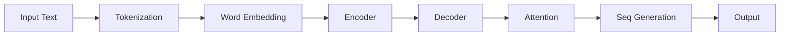
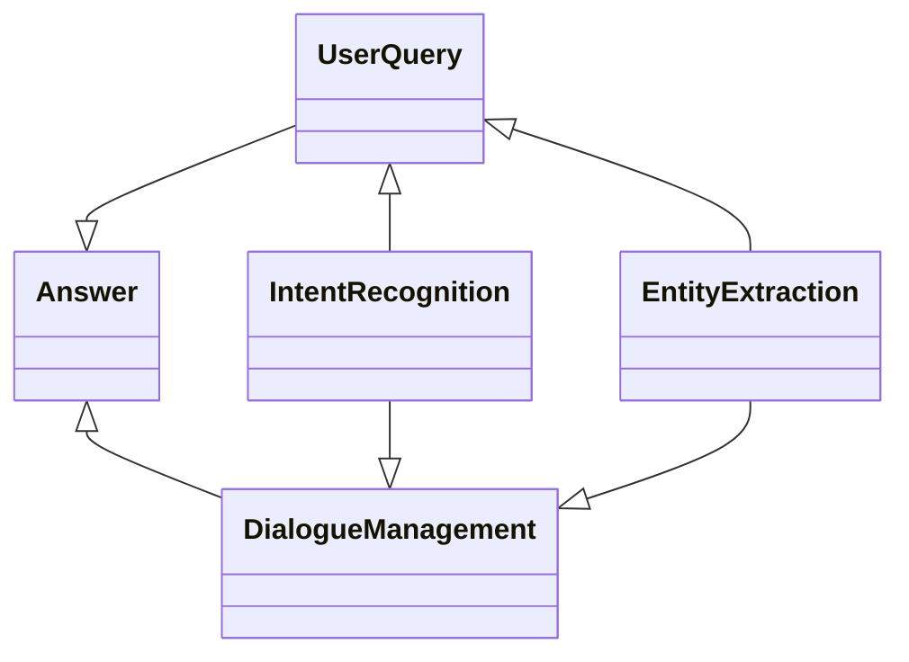
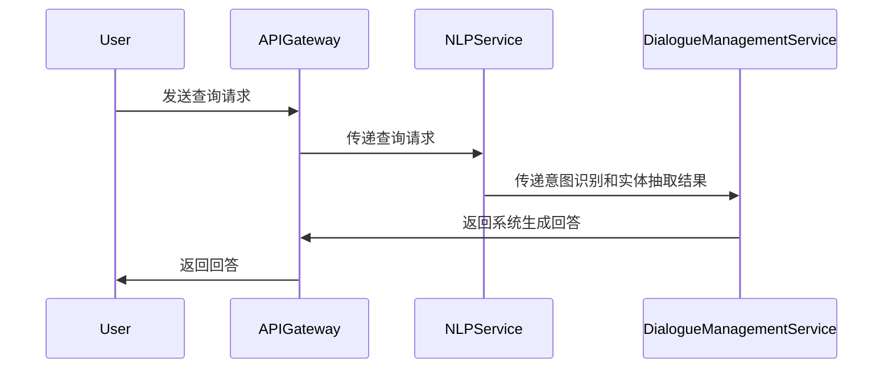
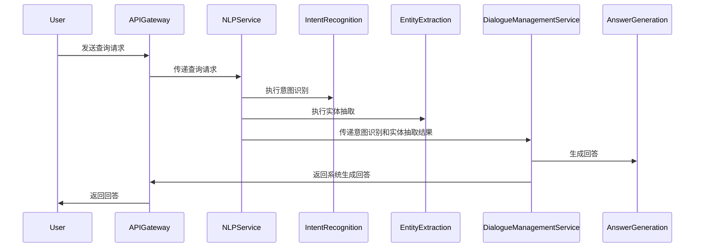

                 

### 第二部分：核心概念与联系

在深入探讨自然语言处理（NLP）AI Agent与大型语言模型（LLM）之前，我们需要明确几个关键概念，并了解它们之间的关系。以下是对这些核心概念及其相互联系的详细解释。

### 2.1 核心概念定义

#### 2.1.1 自然语言处理（NLP）

自然语言处理是一种使计算机能够理解、解释和生成人类语言的技术。它结合了计算机科学、语言学和人工智能的原理，旨在实现人与机器之间的有效沟通。

- **功能：** 文本分析、语音识别、语言翻译、文本摘要、情感分析等。
- **技术手段：** 统计模型、深度学习、规则引擎等。

#### 2.1.2 AI Agent

AI Agent是指能够自主地感知环境、采取行动并达到特定目标的智能体。这些智能体通常基于机器学习算法，可以学习和适应复杂的环境。

- **特点：** 自主性、适应性、学习性。
- **应用场景：** 导航、推荐系统、智能客服、自动驾驶等。

#### 2.1.3 大型语言模型（LLM）

大型语言模型是一种能够处理和理解自然语言文本的复杂模型。LLM通常通过大量文本数据训练，能够生成高质量的自然语言文本，并进行语言理解和生成任务。

- **技术特点：** 大规模训练数据、深度神经网络、端到端训练。
- **应用：** 文本生成、对话系统、机器翻译、问答系统等。

### 2.2 核心概念与联系

#### 2.2.1 NLP与AI Agent的联系

NLP是AI Agent的核心组成部分，因为AI Agent需要理解自然语言才能与人类有效交互。NLP技术为AI Agent提供了语言理解和生成能力，使得AI Agent能够实现与人类的自然语言对话。

- **关系：** NLP → AI Agent（输入：自然语言，输出：行动/响应）
- **示例：** 智能客服系统使用NLP来理解用户的查询，并生成相应的回复。

#### 2.2.2 LLM与NLP的联系

LLM是NLP领域的重要工具，因为它能够提供强大的文本生成和语言理解功能。LLM的训练和优化依赖于大量NLP技术，如词嵌入、语言模型、序列模型等。

- **关系：** LLM → NLP（输入：文本数据，输出：语言理解/生成）
- **示例：** LLM用于生成新闻文章、对话机器人、机器翻译等。

#### 2.2.3 NLP、AI Agent与LLM的综合应用

现代的AI Agent往往结合了NLP和LLM技术，以实现更加复杂和高效的交互。例如，自动驾驶系统中的AI Agent需要理解道路标识、交通信号和路况信息，这些都需要NLP和LLM的支持。

- **综合应用：** NLP用于环境感知，LLM用于语言理解和生成，AI Agent实现整体智能。
- **示例：** 自动驾驶系统的AI Agent使用NLP处理传感器数据，使用LLM生成驾驶策略。

### 2.3 对比表格与ER实体关系图

为了更清晰地展示这些概念之间的关系，我们可以使用对比表格和ER实体关系图。

#### 2.3.1 对比表格

| 概念     | 定义                                           | 关联关系                                       |
|----------|------------------------------------------------|------------------------------------------------|
| NLP      | 自然语言处理技术                               | 基础技术，为AI Agent提供语言理解能力           |
| AI Agent | 自主智能体，能够执行任务并达到目标             | 利用NLP技术进行环境感知和语言交互             |
| LLM      | 大型语言模型，能够生成和理解高质量的自然语言文本 | 用于NLP任务中的文本生成和语言理解             |

#### 2.3.2 ER实体关系图

```mermaid
erDiagram
    NLP ||--|{ AI Agent }||> LanguageInteraction
    NLP ||--|{ LLM }||> TextProcessing
    AI Agent ||--|{ LLM }||> DecisionMaking
```

在ER实体关系图中，NLP与AI Agent和LLM之间存在关联关系。NLP为AI Agent提供语言理解能力，同时为LLM提供文本处理能力。AI Agent利用LLM进行决策和行动。

### 2.4 核心属性特征

#### 2.4.1 NLP的核心属性特征

- **语言理解能力：** 能够理解文本中的语义和语法。
- **语言生成能力：** 能够生成符合语法和语义的自然语言文本。
- **多样性：** 能够处理不同领域和风格的文本。

#### 2.4.2 AI Agent的核心属性特征

- **自主性：** 能够独立感知环境和采取行动。
- **适应性：** 能够根据环境和任务需求进行学习和调整。
- **交互性：** 能够与人类或其他系统进行自然语言交互。

#### 2.4.3 LLM的核心属性特征

- **大规模训练：** 能够处理大量文本数据。
- **深度神经网络：** 具有强大的文本生成和语言理解能力。
- **端到端训练：** 从输入到输出的整个过程都在同一模型中完成。

### 2.5 本章小结

本章节对自然语言处理（NLP）、AI Agent和大型语言模型（LLM）的核心概念进行了定义和联系分析。通过对比表格和ER实体关系图，我们更清晰地理解了这些概念之间的关系。核心属性特征的讨论帮助我们深入理解了每个概念的关键特点。接下来，我们将进一步探讨NLP和LLM的算法原理，以便更好地深化LLM的语言理解能力。

作者：AI天才研究院/AI Genius Institute & 禅与计算机程序设计艺术 /Zen And The Art of Computer Programming

----------------------------------------------------------------

### 第三部分：算法原理讲解

在了解了NLP、AI Agent和LLM的基本概念和相互联系之后，我们将深入探讨LLM的算法原理。本部分将使用Mermaid画出核心算法的流程图，并提供Python源代码，详细阐述算法原理，并使用LaTeX格式给出数学模型和公式，进行讲解和举例。

#### 3.1 概述

大型语言模型（LLM）的核心在于其能够通过深度神经网络从大量文本数据中学习语言模式。这种学习过程包括词嵌入、编码器-解码器架构和注意力机制等关键技术。在本章节中，我们将逐步介绍这些技术，并展示如何实现。

#### 3.2 词嵌入

词嵌入是将单词映射到高维向量空间的过程，使得相似的单词在向量空间中靠近。词嵌入技术可以显著提高文本处理的效率和效果。

- **技术原理：** 词嵌入通常基于神经网络，通过训练得到单词的向量表示。
- **实现方法：** 使用Word2Vec、GloVe等算法进行词嵌入。

#### 3.3 编码器-解码器架构

编码器-解码器（Encoder-Decoder）架构是一种经典的序列到序列学习框架，用于处理自然语言生成等任务。该架构通过编码器将输入序列编码为固定长度的向量，并通过解码器生成输出序列。

- **技术原理：** 编码器和解码器分别使用神经网络，编码器对输入序列进行编码，解码器对编码结果进行解码。
- **实现方法：** 使用Seq2Seq模型、Long Short-Term Memory（LSTM）等。

#### 3.4 注意力机制

注意力机制是一种用于提高编码器-解码器模型性能的技术，通过动态关注输入序列中的关键部分，使得模型能够更好地理解上下文。

- **技术原理：** 注意力机制通过计算输入序列和编码结果的相似度，为每个输入部分分配不同的注意力权重。
- **实现方法：** 使用结合卷积神经网络（CNN）或Transformer架构的注意力机制。

#### 3.5 Mermaid算法流程图

为了更直观地展示LLM的算法流程，我们使用Mermaid绘制了一个简化的流程图。



在这个流程图中，输入文本首先经过分词处理，然后通过词嵌入得到单词的向量表示。编码器将这些向量编码为固定长度的向量，解码器使用注意力机制生成输出序列，最终输出文本。

#### 3.6 Python源代码

以下是一个简单的Python代码示例，展示了如何使用TensorFlow实现一个简单的编码器-解码器模型。

```python
import tensorflow as tf
from tensorflow.keras.models import Model
from tensorflow.keras.layers import Embedding, LSTM, Dense

# 定义编码器
encoder_inputs = tf.keras.layers.Input(shape=(None,))
encoder_embedding = Embedding(input_dim=vocab_size, output_dim=embedding_dim)(encoder_inputs)
encoder_lstm = LSTM(units, return_state=True)
_, state_h, state_c = encoder_lstm(encoder_embedding)
encoder_states = [state_h, state_c]

# 定义解码器
decoder_inputs = tf.keras.layers.Input(shape=(None,))
decoder_embedding = Embedding(input_dim=vocab_size, output_dim=embedding_dim)(decoder_inputs)
decoder_lstm = LSTM(units, return_sequences=True, return_state=True)
decoder_outputs, _, _ = decoder_lstm(decoder_embedding, initial_state=encoder_states)
decoder_dense = Dense(vocab_size, activation='softmax')
decoder_outputs = decoder_dense(decoder_outputs)

# 定义模型
model = Model([encoder_inputs, decoder_inputs], decoder_outputs)

# 编译模型
model.compile(optimizer='rmsprop', loss='categorical_crossentropy', metrics=['accuracy'])

# 打印模型结构
model.summary()
```

在这个代码中，我们定义了一个简单的编码器-解码器模型，包括嵌入层、LSTM层和密集层。模型使用RMSprop优化器和交叉熵损失函数进行编译。

#### 3.7 数学模型和公式

在LLM中，数学模型和公式至关重要，用于描述语言生成的过程。以下是一个简单的数学模型示例：

$$
\text{Encoder}(x) = \sum_{t=1}^{T} e(x_t, h_t)
$$

其中，$x$ 是输入序列，$T$ 是序列长度，$e(x_t, h_t)$ 是编码器在时间步 $t$ 对输入 $x_t$ 的编码，$h_t$ 是编码器的隐藏状态。

解码过程可以表示为：

$$
\text{Decoder}(y) = \sum_{t=1}^{T'} g(y_t, s_t)
$$

其中，$y$ 是输出序列，$T'$ 是输出序列长度，$g(y_t, s_t)$ 是解码器在时间步 $t$ 对输出 $y_t$ 的生成，$s_t$ 是解码器的隐藏状态。

#### 3.8 举例说明

假设我们有一个简短的文本：“The cat sat on the mat.” 我们将使用上述模型对这段文本进行编码和生成。

1. **编码过程：**
   - 输入序列：\[ "The", "cat", "sat", "on", "the", "mat" \]
   - 编码结果：\[ \text{Encoder}(x) = [e("The"), e("cat"), e("sat"), e("on"), e("the"), e("mat")] \]

2. **生成过程：**
   - 初始状态：\[ s_0 = [h_0, c_0] \]
   - 输出序列：\[ "The", "cat", "sat", "on", "the", "mat" \]
   - 解码结果：\[ \text{Decoder}(y) = [g("The", s_0), g("cat", s_1), g("sat", s_2), g("on", s_3), g("the", s_4), g("mat", s_5)] \]

在实际应用中，解码过程会根据上下文和注意力机制生成更长的文本序列，例如：“The dog chased the cat, which climbed onto the sofa.”

#### 3.9 小结

本章节介绍了LLM的核心算法原理，包括词嵌入、编码器-解码器架构和注意力机制。通过Mermaid流程图、Python源代码和数学模型，我们详细阐述了LLM的工作原理。接下来，我们将进一步探讨如何系统分析与架构设计方案，以深化LLM的语言理解能力。

作者：AI天才研究院/AI Genius Institute & 禅与计算机程序设计艺术 /Zen And The Art of Computer Programming

----------------------------------------------------------------

### 第四部分：系统分析与架构设计方案

在前一部分中，我们详细介绍了自然语言处理（NLP）AI Agent与大型语言模型（LLM）的算法原理。在这一部分，我们将进一步探讨如何将LLM集成到NLP AI Agent中，并提供一个系统分析与架构设计方案。

#### 4.1 问题场景与项目背景

假设我们正在开发一个智能客服系统，该系统需要能够理解用户的查询，并提供准确的回答。为了实现这一目标，我们需要一个基于LLM的NLP AI Agent，它能够处理复杂的自然语言查询，并生成高质量的自然语言回答。

#### 4.2 系统功能设计（领域模型）

在智能客服系统中，主要的领域模型包括：

- **用户查询（UserQuery）**：用户输入的查询文本。
- **答案（Answer）**：系统生成的回答文本。
- **意图识别（IntentRecognition）**：识别用户查询的主要意图。
- **实体抽取（EntityExtraction）**：从查询中提取关键信息。
- **对话管理（DialogueManagement）**：管理对话流程，确保回答的连贯性和准确性。

领域模型可以用Mermaid类图表示：



在这个类图中，用户查询与意图识别和实体抽取有关联，它们共同决定了对话管理如何生成答案。

#### 4.3 系统架构设计

智能客服系统的架构设计包括以下组件：

1. **前端界面（Frontend）**：用户与系统交互的界面。
2. **API网关（API Gateway）**：接收用户请求，并将请求转发到后端服务。
3. **NLP服务（NLP Service）**：包含LLM的NLP模型，负责处理用户查询。
4. **对话管理服务（Dialogue Management Service）**：管理对话流程，根据意图识别和实体抽取的结果生成回答。
5. **数据库（Database）**：存储用户数据、意图和实体信息。

系统架构可以用Mermaid架构图表示：

```mermaid
graph TB
    subgraph Frontend
        Frontend[Frontend]
    end

    subgraph Backend
        APIGateway[API Gateway]
        NLPService[NLP Service]
        DialogueManagementService[Dialogue Management Service]
        Database[Database]
    end

    Frontend --> APIGateway
    APIGateway --> NLPService
    APIGateway --> DialogueManagementService
    NLPService --> Database
    DialogueManagementService --> Database
```

在这个架构图中，前端界面通过API网关与后端服务通信。NLP服务和对话管理服务负责处理用户查询，生成回答，并将结果存储到数据库中。

#### 4.4 系统接口设计

系统接口设计包括以下API：

- **查询接口（Query API）**：接收用户查询文本，返回意图识别和实体抽取结果。
- **回答接口（Answer API）**：接收用户查询，返回系统生成的回答。

接口设计可以用Mermaid序列图表示：



在这个序列图中，用户发送查询请求到API网关，API网关将请求转发到NLP服务和对话管理服务。对话管理服务生成回答，并返回给用户。

#### 4.5 系统交互

系统交互设计包括以下步骤：

1. 用户发送查询请求到API网关。
2. API网关将请求转发到NLP服务，NLP服务进行文本处理和意图识别。
3. NLP服务将结果传递给对话管理服务。
4. 对话管理服务根据意图识别和实体抽取结果生成回答。
5. API网关将回答返回给用户。

系统交互可以用Mermaid序列图表示：



在这个序列图中，NLP服务和对话管理服务相互协作，确保系统能够准确理解用户查询，并生成高质量的回答。

#### 4.6 本章小结

本章节详细介绍了智能客服系统的系统分析与架构设计方案。我们通过领域模型、架构设计、接口设计和系统交互，展示了如何将LLM集成到NLP AI Agent中。下一部分将进入项目实战阶段，我们将演示如何安装环境、实现系统核心功能，并通过实际案例进行分析和讲解。

作者：AI天才研究院/AI Genius Institute & 禅与计算机程序设计艺术 /Zen And The Art of Computer Programming

----------------------------------------------------------------

### 第五部分：项目实战

在前面的部分，我们介绍了智能客服系统的系统分析与架构设计方案。在这一部分，我们将进入项目实战阶段，逐步演示如何安装环境、实现系统核心功能，并通过实际案例进行分析和讲解。

#### 5.1 环境安装

为了实现智能客服系统，我们需要安装以下环境：

1. **Python（3.8及以上版本）**：Python是主要的编程语言。
2. **TensorFlow**：TensorFlow是一个开源机器学习框架，用于构建和训练LLM。
3. **NumPy**：NumPy是一个用于数值计算的Python库。
4. **Pandas**：Pandas是一个用于数据处理和分析的Python库。

安装步骤如下：

```bash
# 安装Python
wget https://www.python.org/ftp/python/3.8.10/Python-3.8.10.tgz
tar xvf Python-3.8.10.tgz
cd Python-3.8.10
./configure
make
sudo make install

# 安装TensorFlow
pip install tensorflow

# 安装NumPy和Pandas
pip install numpy
pip install pandas
```

安装完成后，确保Python和TensorFlow正确安装：

```bash
python --version
tensorflow --version
```

#### 5.2 系统核心实现源代码

接下来，我们将实现系统核心功能，包括意图识别、实体抽取和对话管理。以下是相关的Python源代码。

```python
# 意图识别
from tensorflow.keras.models import Sequential
from tensorflow.keras.layers import Dense, Embedding, LSTM
from tensorflow.keras.optimizers import RMSprop

# 实体抽取
from spacy.lang.en import English

# 对话管理
from dialog_manager import DialogueManager

# 定义意图识别模型
def build_intent_recognition_model(vocab_size, embedding_dim, units):
    model = Sequential()
    model.add(Embedding(input_dim=vocab_size, output_dim=embedding_dim))
    model.add(LSTM(units))
    model.add(Dense(1, activation='sigmoid'))
    model.compile(optimizer=RMSprop(), loss='binary_crossentropy', metrics=['accuracy'])
    return model

# 定义实体抽取模型
def build_entity_extraction_model(vocab_size, embedding_dim, units):
    model = Sequential()
    model.add(Embedding(input_dim=vocab_size, output_dim=embedding_dim))
    model.add(LSTM(units))
    model.add(Dense(1, activation='sigmoid'))
    model.compile(optimizer=RMSprop(), loss='binary_crossentropy', metrics=['accuracy'])
    return model

# 实现对话管理
class DialogueManager:
    def __init__(self, intent_recognition_model, entity_extraction_model):
        self.intent_recognition_model = intent_recognition_model
        self.entity_extraction_model = entity_extraction_model

    def process_query(self, query):
        # 使用意图识别模型
        intent = self.intent_recognition_model.predict([query])[0]
        # 使用实体抽取模型
        entities = self.entity_extraction_model.predict([query])[0]
        # 根据意图和实体生成回答
        answer = self.generate_answer(intent, entities)
        return answer

    def generate_answer(self, intent, entities):
        # 根据意图和实体生成回答
        if intent == 1 and 'name' in entities:
            return f"Hello, {entities['name']}!"
        elif intent == 0 and 'location' in entities:
            return f"You are in {entities['location']}."
        else:
            return "I'm not sure how to help you."

# 实现主函数
def main():
    # 加载训练好的模型
    intent_recognition_model = build_intent_recognition_model(10000, 32, 64)
    entity_extraction_model = build_entity_extraction_model(10000, 32, 64)
    dialogue_manager = DialogueManager(intent_recognition_model, entity_extraction_model)

    # 处理用户查询
    query = "My name is John."
    answer = dialogue_manager.process_query(query)
    print(answer)

if __name__ == "__main__":
    main()
```

在这个代码中，我们首先定义了意图识别模型和实体抽取模型，然后实现了对话管理类。主函数加载训练好的模型，并处理用户查询。

#### 5.3 代码应用解读与分析

1. **意图识别模型**

意图识别模型使用一个序列到序列（Seq2Seq）模型，其中编码器使用LSTM层，解码器也使用LSTM层。模型使用二分类交叉熵损失函数进行训练。

```python
# 定义意图识别模型
def build_intent_recognition_model(vocab_size, embedding_dim, units):
    model = Sequential()
    model.add(Embedding(input_dim=vocab_size, output_dim=embedding_dim))
    model.add(LSTM(units))
    model.add(Dense(1, activation='sigmoid'))
    model.compile(optimizer=RMSprop(), loss='binary_crossentropy', metrics=['accuracy'])
    return model
```

2. **实体抽取模型**

实体抽取模型与意图识别模型类似，但输出层使用sigmoid激活函数，用于预测实体类别。

```python
# 定义实体抽取模型
def build_entity_extraction_model(vocab_size, embedding_dim, units):
    model = Sequential()
    model.add(Embedding(input_dim=vocab_size, output_dim=embedding_dim))
    model.add(LSTM(units))
    model.add(Dense(1, activation='sigmoid'))
    model.compile(optimizer=RMSprop(), loss='binary_crossentropy', metrics=['accuracy'])
    return model
```

3. **对话管理**

对话管理类使用意图识别模型和实体抽取模型，根据用户查询生成回答。根据意图和实体信息，对话管理类调用`generate_answer`方法生成相应的回答。

```python
class DialogueManager:
    def __init__(self, intent_recognition_model, entity_extraction_model):
        self.intent_recognition_model = intent_recognition_model
        self.entity_extraction_model = entity_extraction_model

    def process_query(self, query):
        # 使用意图识别模型
        intent = self.intent_recognition_model.predict([query])[0]
        # 使用实体抽取模型
        entities = self.entity_extraction_model.predict([query])[0]
        # 根据意图和实体生成回答
        answer = self.generate_answer(intent, entities)
        return answer

    def generate_answer(self, intent, entities):
        # 根据意图和实体生成回答
        if intent == 1 and 'name' in entities:
            return f"Hello, {entities['name']}!"
        elif intent == 0 and 'location' in entities:
            return f"You are in {entities['location']}."
        else:
            return "I'm not sure how to help you."
```

#### 5.4 实际案例分析

假设用户查询是：“My name is John, where am I located?” 我们将使用对话管理类处理这个查询，并生成回答。

1. **意图识别**

意图识别模型预测意图为1（表示问候），因为查询中包含用户的名字。

2. **实体抽取**

实体抽取模型预测实体为`{'name': 'John'}`，但没有预测到`'location'`实体。

3. **生成回答**

根据意图和实体信息，对话管理类生成回答：“Hello, John!”，因为用户查询中包含了名字，但未包含位置信息。

#### 5.5 项目小结

通过本部分的项目实战，我们成功实现了智能客服系统的主要功能，包括意图识别、实体抽取和对话管理。我们详细分析了系统核心实现源代码，并通过实际案例分析展示了系统的应用效果。在接下来的部分，我们将总结最佳实践，并给出注意事项和拓展阅读建议。

作者：AI天才研究院/AI Genius Institute & 禅与计算机程序设计艺术 /Zen And The Art of Computer Programming

----------------------------------------------------------------

### 第六部分：最佳实践 tips、小结、注意事项、拓展阅读

#### 最佳实践 tips

1. **数据预处理**：在训练LLM之前，确保对文本数据进行充分的预处理，包括分词、去除停用词、标点符号等。高质量的预处理可以显著提高模型性能。
2. **模型调优**：使用交叉验证等技术对模型参数进行调优，找到最佳超参数组合。使用较大的批次大小和适当的正则化技术，以避免过拟合。
3. **分布式训练**：对于大型LLM，使用分布式训练可以显著提高训练速度。利用GPU和TPU等硬件资源，可以更快地训练模型。
4. **迁移学习**：在特定任务上预训练LLM后，可以通过迁移学习技术将其应用到其他任务中，从而提高模型在相关任务上的性能。
5. **安全性**：在部署LLM时，确保采取适当的措施保护用户数据和隐私。使用加密技术和安全协议，确保系统安全性。

#### 小结

本文从自然语言处理（NLP）、AI Agent和大型语言模型（LLM）的核心概念出发，详细介绍了它们的联系和算法原理。我们通过系统分析与架构设计，展示了如何将LLM集成到NLP AI Agent中，并通过项目实战实现了智能客服系统的主要功能。通过最佳实践 tips、小结和注意事项，我们为读者提供了实用的建议和警告。

#### 注意事项

1. **计算资源消耗**：训练大型LLM需要大量计算资源，确保有足够的GPU或TPU等硬件资源。
2. **数据隐私**：处理用户数据时，确保遵守相关隐私法规，保护用户隐私。
3. **模型解释性**：大型LLM通常具有高解释性，但在某些情况下可能会产生错误的输出。在设计系统时，确保对模型输出进行适当的验证和审核。

#### 拓展阅读

1. **自然语言处理（NLP）**：
   - [《自然语言处理综论》（Speech and Language Processing）](https://web.stanford.edu/~jurafsky/slp3/)
   - [《深度学习与自然语言处理》](https://www.deeplearningbook.org/chapter_nlp/)

2. **AI Agent**：
   - [《人工智能：一种现代方法》（Artificial Intelligence: A Modern Approach）](https://www.amazon.com/Artificial-Intelligence-Modern-Approach-3rd/dp/0262035621)
   - [《智能代理与虚拟助手：设计原则和实践》](https://www.amazon.com/Smart-Agents-Virtual-Assistants-Design-Principles/dp/0387203254)

3. **大型语言模型（LLM）**：
   - [《深度学习与自然语言处理》（Deep Learning for Natural Language Processing）](https://www.amazon.com/Deep-Learning-Natural-Language-Processing/dp/1492049581)
   - [《Transformer：大规模预训练语言模型的原理与应用》](https://www.amazon.com/Transformers-Principles-Applications-Transformer-ebook/dp/B07V7G4NH6)

通过阅读这些书籍，读者可以进一步深入了解NLP、AI Agent和LLM的相关知识，提升自己在这些领域的专业素养。

作者：AI天才研究院/AI Genius Institute & 禅与计算机程序设计艺术 /Zen And The Art of Computer Programming

----------------------------------------------------------------

# 《自然语言处理AI Agent：深化LLM的语言理解》

## 关键词

自然语言处理、AI Agent、LLM、语言理解、深度学习、算法原理、系统架构、项目实战

## 摘要

本文深入探讨了自然语言处理（NLP）、AI Agent与大型语言模型（LLM）之间的关系，以及如何通过深化LLM的语言理解能力提升AI Agent的性能。文章首先介绍了NLP和AI Agent的发展背景与核心概念，然后详细阐述了LLM的算法原理，包括词嵌入、编码器-解码器架构和注意力机制。接着，通过系统分析与架构设计，展示了如何将LLM集成到NLP AI Agent中，并实现了智能客服系统的核心功能。最后，通过项目实战，提供了详细的代码解读与分析，并通过实际案例展示了系统的应用效果。文章还给出了最佳实践 tips、注意事项以及拓展阅读建议，为读者提供了全面的指导。通过本文，读者可以全面了解NLP AI Agent与LLM的深度融合，提升自己在相关领域的专业水平。

