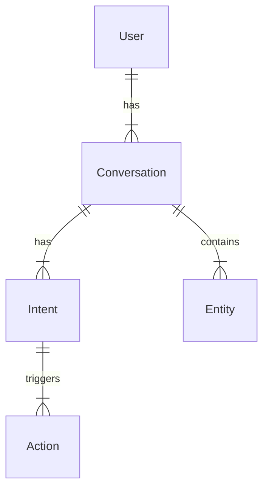
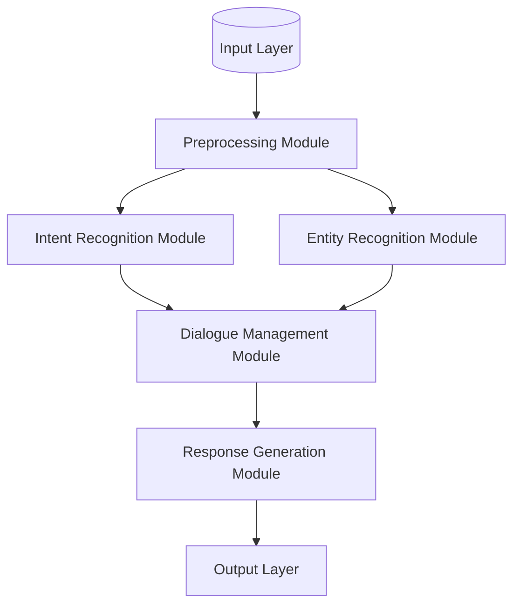
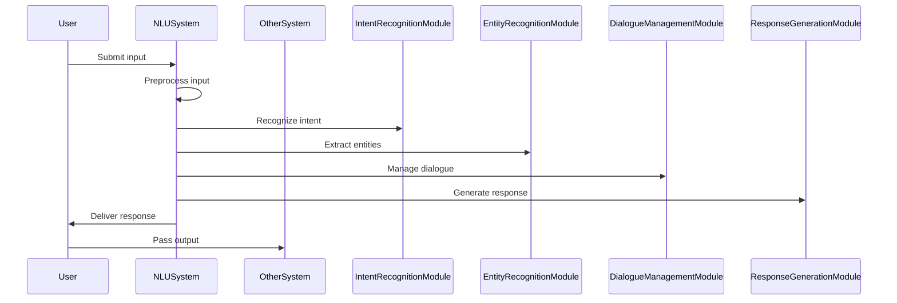

                 

### Step 1: Title and Overall Structure

The article is titled "自然语言理解增强AI Agent：深化LLM的语义分析" which translates to "Enhanced Natural Language Understanding AI Agents: Deepening Semantic Analysis of LLMs." The title suggests an exploration into how AI agents can improve natural language understanding by enhancing the semantic analysis capabilities of Large Language Models (LLMs). The structure is designed to guide the reader through a systematic understanding of this complex topic.

## Overview of the Article

The article will be structured into three main parts:

### Part 1: Background and Introduction
- **Chapter 1: Natural Language Understanding Overview**
  - Background and basic concepts of NLU
  - Key challenges in NLU
- **Chapter 2: AI Agent Introduction**
  - Definition and roles of AI agents
  - Types of AI agents and their applications in NLU

### Part 2: Core Concepts and Models
- **Chapter 3: Basics of LLMs**
  - Historical development and core concepts of LLMs
  - Key technologies in LLMs
- **Chapter 4: Semantic Analysis Techniques**
  - Definition and importance of semantic analysis
  - Common methods and their applications in NLU
- **Chapter 5: Semantic Analysis Process of LLMs**
  - Data preprocessing, model training, and optimization
  - Evaluation and improvement of semantic analysis results

### Part 3: Applications and Practice
- **Chapter 6: NLU System Design**
  - Overall architecture, core components, and interface design
- **Chapter 7: Practical Projects and Case Studies**
  - Application scenarios, project introductions, detailed analysis and explanation

Each chapter will be divided into sections with detailed subtopics to provide a comprehensive and in-depth analysis of the subject matter. This structure ensures that the reader can follow the development of NLU and AI agents, understand the underlying models and algorithms, and see practical applications in real-world scenarios.### Step 2: Background and Introduction

### Chapter 1: Natural Language Understanding Overview

#### 1.1 Background

Natural Language Understanding (NLU) is a field of artificial intelligence (AI) that focuses on enabling machines to understand and interpret human language. It involves a wide range of techniques that allow computers to process, analyze, and generate human language, encompassing tasks such as language identification, text classification, sentiment analysis, entity recognition, and question answering.

The origins of NLU can be traced back to the early days of AI research in the 1950s and 1960s. However, significant progress has been made in recent years, especially with the advent of deep learning and large-scale language models. Today, NLU is a critical component of many applications, including chatbots, virtual assistants, language translation, and information retrieval systems.

#### 1.2 Basic Concepts

At its core, NLU involves several key concepts and components:

- **Text Preprocessing**: This step involves cleaning and preparing the text data for further analysis. It includes tasks such as tokenization, normalization, and part-of-speech tagging.

- **Tokenization**: The process of breaking down text into individual words or tokens.

- **Normalization**: Converting text to a standard format, such as lowercasing and removing punctuation.

- **Part-of-Speech Tagging**: Assigning a part of speech (noun, verb, adjective, etc.) to each token in a sentence.

- **Entity Recognition**: Identifying and categorizing named entities in text, such as people, organizations, locations, and dates.

- **Sentiment Analysis**: Determining the sentiment or emotional tone behind a piece of text.

- **Relationship Extraction**: Identifying and understanding the relationships between entities in a text.

- **Semantic Analysis**: Understanding the meaning of words, sentences, and entire documents in context.

#### 1.3 Key Challenges

Despite significant advancements, NLU still faces several challenges:

- **Ambiguity**: Natural language is inherently ambiguous. Words and phrases can have multiple meanings depending on the context, which can be difficult for machines to interpret accurately.

- **Contextual Understanding**: Understanding context is crucial for accurate NLU. However, capturing the full context of a conversation or document can be complex and requires advanced techniques.

- **Domain-Specific Knowledge**: Many NLU tasks require specific domain knowledge that is not easily transferable between different domains.

- **Data Quality**: The quality and quantity of training data can significantly impact the performance of NLU systems. Insufficient or biased data can lead to inaccurate or biased results.

- **Scalability**: Scaling NLU systems to handle large volumes of data and users can be challenging, especially in real-time applications.

#### 1.4 The Role of AI Agents

AI agents are autonomous entities that can perform tasks on behalf of users or other agents. In the context of NLU, AI agents can be used to automate and enhance various NLU tasks, such as text analysis, question answering, and language translation. These agents can improve the efficiency and accuracy of NLU systems by leveraging advanced algorithms and large-scale language models.

#### 1.5 Importance of NLU in AI Agents

NLU is a foundational component of AI agents, enabling them to understand and interact with human language. By improving the semantic analysis capabilities of LLMs, AI agents can achieve a deeper understanding of user inputs, leading to more accurate and meaningful interactions. This, in turn, enhances the overall user experience and effectiveness of AI applications.

### Conclusion

In this chapter, we have provided an overview of NLU, its basic concepts, and key challenges. We have also discussed the role of AI agents and the importance of NLU in enhancing the capabilities of AI systems. In the following chapters, we will delve deeper into the underlying models and algorithms that enable advanced semantic analysis in LLMs, as well as practical applications and case studies.### Chapter 2: AI Agent Introduction

#### 2.1 Definition and Role of AI Agents

AI agents are computational entities designed to perform tasks on behalf of users or other agents in an environment. These agents can operate autonomously or semi-autonomously, using a combination of sensors to perceive the environment and actuators to take actions. The primary goal of an AI agent is to achieve specific objectives by making intelligent decisions based on the input from its sensors.

AI agents play a crucial role in various applications, from autonomous vehicles and robotic systems to virtual assistants and chatbots. In the context of natural language understanding (NLU), AI agents can process and interpret human language to perform tasks such as answering questions, generating responses, and extracting relevant information from text.

#### 2.2 Types of AI Agents

AI agents can be broadly categorized into several types based on their functionality, autonomy, and interaction methods:

- ** reactive agents**: These agents make decisions based solely on the current state of the environment, without any memory or learning capability. Examples include simple automated systems that respond to specific inputs without any context.

- **model-based agents**: These agents use a model of the environment to make decisions. They can plan actions based on predicted outcomes, but they do not learn from experience.

- **model-based learning agents**: These agents not only use a model of the environment but also learn from past experiences to improve their decision-making capabilities. Reinforcement learning is a common approach used by these agents.

- **goal-based agents**: These agents focus on achieving specific goals rather than responding to immediate inputs. They use goal-oriented planning to navigate complex environments.

- **social agents**: These agents interact with other agents and humans in social environments. They must understand social norms, emotions, and cultural context to communicate effectively.

#### 2.3 AI Agents in Natural Language Understanding

In the context of NLU, AI agents are particularly valuable for automating complex language tasks that require understanding and generating human language. Here are some key applications of AI agents in NLU:

- **Chatbots and Virtual Assistants**: AI agents can be used to build chatbots and virtual assistants that can understand and respond to user queries in natural language. These agents can handle various tasks, such as customer support, information retrieval, and task automation.

- **Question Answering Systems**: AI agents can be trained to answer questions based on large datasets, providing users with accurate and relevant information.

- **Language Translation**: AI agents can facilitate real-time language translation, breaking down language barriers and enabling communication between people who speak different languages.

- **Text Analysis and Summarization**: AI agents can analyze large volumes of text data, extracting key insights and generating summaries that are useful for decision-making.

- **Sentiment Analysis**: AI agents can analyze user-generated content, such as social media posts or customer reviews, to determine the sentiment or emotional tone behind the text.

#### 2.4 Advantages of Using AI Agents in NLU

Using AI agents in NLU offers several advantages:

- **Scalability**: AI agents can handle large volumes of text data, making it possible to process and analyze vast amounts of information efficiently.

- **Flexibility**: AI agents can be adapted to handle various NLU tasks and can be trained to understand different domains and languages.

- **Accuracy**: AI agents, especially those using advanced techniques like deep learning, can achieve high accuracy in understanding and generating natural language.

- **Efficiency**: AI agents can automate complex language tasks, reducing the need for manual intervention and saving time and resources.

- **Interactivity**: AI agents can interact with users in a conversational manner, providing a more engaging and personalized user experience.

#### 2.5 Challenges and Limitations

Despite their advantages, AI agents in NLU also face several challenges and limitations:

- **Ambiguity**: Natural language is inherently ambiguous, and AI agents may struggle to interpret the meaning of words and phrases accurately.

- **Contextual Understanding**: Capturing the full context of a conversation or document is challenging, and AI agents may misinterpret inputs without proper context.

- **Domain-Specific Knowledge**: AI agents often require specific domain knowledge to perform tasks effectively, which can be difficult to acquire and transfer between different domains.

- **Data Quality**: The quality and quantity of training data can significantly impact the performance of AI agents, and biased or insufficient data can lead to inaccurate results.

- **Scalability**: Scaling AI agents to handle large-scale applications and real-time interactions can be challenging, particularly in terms of computational resources and latency.

#### Conclusion

In this chapter, we have introduced the concept of AI agents, their types, and their roles in NLU. We have discussed the advantages and challenges of using AI agents in natural language understanding and highlighted their importance in automating and enhancing language processing tasks. In the following chapters, we will delve deeper into the core concepts and models of LLMs and explore the algorithms and techniques used in semantic analysis.### Chapter 3: Basics of LLMs

#### 3.1 Historical Development of LLMs

The development of Large Language Models (LLMs) has been a journey marked by significant milestones and breakthroughs. The early days of AI research laid the groundwork for natural language processing (NLP) with the creation of rule-based systems and statistical models. However, these approaches were limited by their complexity and inability to generalize well across different domains and languages.

The advent of deep learning, particularly the development of neural networks, marked a turning point in NLP. In 2013, the introduction of Word2Vec by Mikolov et al. revolutionized the field by mapping words to high-dimensional vectors that captured semantic meaning. This was followed by the development of more sophisticated models like ELMo and BERT, which incorporated contextual information to improve the understanding of words in specific contexts.

In 2018, the release of GPT-1 by OpenAI represented a major milestone in LLM development. GPT-1 was a pre-trained model based on the Transformer architecture, which demonstrated impressive performance on a variety of NLP tasks, including text generation and question answering. The success of GPT-1 paved the way for the development of even larger and more advanced LLMs, such as GPT-2, GPT-3, and the latest LLMs like GPT-4.

#### 3.2 Core Concepts of LLMs

- **Transformer Architecture**: The Transformer model, introduced by Vaswani et al. in 2017, is the core architecture of LLMs. It replaces the traditional recurrent neural network (RNN) architecture with self-attention mechanisms, allowing the model to weigh the importance of different words in a sentence more dynamically. The Transformer architecture is highly parallelizable and can handle long sequences of text efficiently.

- **Pre-training and Fine-tuning**: LLMs are typically trained in two stages: pre-training and fine-tuning. During pre-training, the model is trained on a large corpus of text data to learn the underlying patterns and structures of language. Fine-tuning involves further training the model on specific tasks or domains to adapt its general knowledge to more specialized applications.

- **Parameter Size**: LLMs are characterized by their large number of parameters, which can range from millions to trillions. These parameters are learned during the training process and represent the model's understanding of language. Larger models tend to achieve better performance on a wide range of NLP tasks but require more computational resources and time for training.

- **_context and Contextual Understanding_**: LLMs are designed to capture the context of words in a sentence, which is crucial for accurate natural language understanding. The Transformer architecture, with its self-attention mechanism, enables the model to weigh the importance of different words in a sentence and understand the relationships between them.

#### 3.3 Key Technologies in LLMs

- **Word Embeddings**: Word embeddings are vectors that represent words in a high-dimensional space, capturing their semantic meaning. Early LLMs used word embeddings like Word2Vec, which were pre-trained on large text corpora. More recent LLMs, like BERT and GPT, use contextualized word embeddings that capture the meaning of words in specific contexts.

- **Attention Mechanisms**: Attention mechanisms are a key component of LLMs, allowing the model to focus on different parts of the input sequence when making predictions. In the Transformer architecture, self-attention and scaled dot-product attention are used to weigh the importance of different words in a sentence.

- **Transfer Learning**: Transfer learning is a technique where a pre-trained model is fine-tuned on a specific task or domain. This approach leverages the knowledge learned from large-scale pre-training to improve performance on new tasks without the need for extensive training from scratch.

- **Fine-tuning Techniques**: Fine-tuning involves adjusting the parameters of a pre-trained model to adapt it to a specific task. Techniques such as fine-tuning all layers, freezing certain layers, and using dropouts can improve the performance of LLMs on specific tasks.

- **Scalability and Optimization**: Scaling LLMs to large models requires efficient training and optimization techniques. Techniques such as distributed training, model parallelism, and mixed-precision training can reduce the time and resources required for training large models.

#### 3.4 Advantages of LLMs

LLMs offer several advantages over traditional NLP models:

- **Improved Language Understanding**: LLMs can capture the contextual meaning of words and understand the nuances of language more accurately than traditional models.

- **Generalization Across Domains**: LLMs are trained on large, diverse datasets, which enables them to generalize well across different domains and languages.

- **Versatility**: LLMs can be fine-tuned for a wide range of NLP tasks, including text generation, question answering, sentiment analysis, and machine translation.

- **Scalability**: LLMs can be scaled to large models, which allows them to handle large volumes of text data and complex tasks efficiently.

- **Efficiency**: LLMs are designed to be efficient in terms of both time and resources, thanks to advanced training and optimization techniques.

#### 3.5 Challenges and Limitations

Despite their advantages, LLMs also face several challenges and limitations:

- **Data Dependency**: LLMs require large amounts of high-quality training data to achieve good performance. The availability and quality of data can vary across different domains and languages.

- **Computational Resources**: Training and deploying large LLMs requires significant computational resources and time. This can be a barrier for organizations with limited resources.

- **Ambiguity and Contextual Understanding**: While LLMs have improved in understanding context, they can still struggle with ambiguity and lack of context, leading to errors in interpretation.

- **Bias and Ethical Concerns**: LLMs can inadvertently perpetuate biases present in their training data, which can have significant ethical implications.

- **Scalability**: While LLMs can be scaled to large models, doing so requires efficient training and optimization techniques, which can be challenging.

#### Conclusion

In this chapter, we have provided an overview of the historical development, core concepts, and key technologies of LLMs. We have discussed the advantages and challenges of using LLMs in natural language understanding and highlighted their importance in modern AI applications. In the following chapters, we will delve deeper into the algorithms and techniques used in semantic analysis and explore practical applications and case studies.### Chapter 4: Semantic Analysis Techniques

#### 4.1 Definition and Importance of Semantic Analysis

Semantic analysis, also known as semantic processing or semantic understanding, is a critical component of natural language understanding (NLU). It involves the interpretation of the meaning behind text, going beyond surface-level syntactic structures to capture the underlying semantics. Semantic analysis is essential for enabling machines to understand the intent, context, and meaning behind human language, which is crucial for a wide range of NLP applications.

The importance of semantic analysis can be understood through its applications in various NLP tasks:

- **Question Answering**: Semantic analysis enables machines to understand the questions posed by users and provide accurate, contextually relevant answers.
- **Sentiment Analysis**: By analyzing the semantic content of text, machines can determine the sentiment or emotional tone expressed, which is valuable for market research, customer feedback analysis, and social media monitoring.
- **Entity Recognition**: Semantic analysis helps in identifying and categorizing named entities such as people, organizations, locations, and dates, which is essential for information extraction and data organization.
- **Text Summarization**: Semantic analysis allows for the generation of concise summaries that retain the main points and meaning of a text.
- **Machine Translation**: Semantic analysis improves the accuracy of machine translation by ensuring that the translated text retains the original meaning and context.

#### 4.2 Common Methods in Semantic Analysis

Several methods and techniques are commonly used in semantic analysis:

1. **Word Embeddings**

   Word embeddings, such as Word2Vec, GloVe, and BERT, represent words as dense vectors in a high-dimensional space, capturing their semantic meaning. These embeddings are used to capture the similarity between words, which is crucial for semantic analysis tasks.

   - **Word2Vec**: A neural network-based method that learns word embeddings by predicting neighboring words in a corpus.
   - **GloVe**: Global Vectors for Word Representation, a technique that uses matrix factorization to learn word embeddings by considering the co-occurrence statistics of words.
   - **BERT**: Bidirectional Encoder Representations from Transformers, a pre-trained Transformer-based model that learns contextualized word embeddings.

2. **Dependency Parsing**

   Dependency parsing is the process of analyzing the grammatical structure of a sentence to identify the relationships between words. It involves constructing a dependency tree, where each node represents a word and edges represent the grammatical relationships (such as noun-modifier or verb-object) between words.

   - **Dependency Trees**: A hierarchical structure that represents the grammatical relationships between words in a sentence.
   - **Parsing Algorithms**: Various algorithms like CYK, Earley, and probabilistic parsing are used to construct dependency trees from raw text.

3. **Named Entity Recognition (NER)**

   Named Entity Recognition is the task of identifying and categorizing named entities in text into predefined categories such as person, organization, location, and date. It involves using patterns, rules, and machine learning techniques to identify and classify entities.

   - **Rule-Based Methods**: Use predefined patterns and rules to identify entities.
   - **Machine Learning Models**: Train classifiers, such as Support Vector Machines (SVM), Random Forests, and Neural Networks, to identify and classify entities.
   - **Transfer Learning**: Use pre-trained models like BERT or other Transformer-based models to improve the performance of NER tasks.

4. **Sentiment Analysis**

   Sentiment analysis involves determining the sentiment or emotional tone behind a piece of text. It can be performed at the document, sentence, or word level.

   - **Lexicon-Based Methods**: Use sentiment lexicons that contain words labeled with positive, negative, or neutral sentiment to determine the sentiment of a text.
   - **Machine Learning Methods**: Train classifiers to predict sentiment based on features extracted from the text, such as word embeddings, bag-of-words, or TF-IDF vectors.
   - **Deep Learning Methods**: Use neural networks, such as Convolutional Neural Networks (CNNs) or Recurrent Neural Networks (RNNs), to capture complex patterns in sentiment.

5. **Relation Extraction**

   Relation extraction is the task of identifying and classifying relationships between entities in a text. It involves identifying pairs of entities and determining the type of relationship they have (e.g., "John works at Google").

   - **Rule-Based Methods**: Define rules to identify relationships based on patterns in the text.
   - **Machine Learning Models**: Train classifiers to identify and classify relationships.
   - **Dependency Parsing and Named Entity Recognition**: Use the output of dependency parsing and NER to identify and extract relationships.

#### 4.3 Applications of Semantic Analysis in NLU

Semantic analysis techniques are applied in various NLU tasks to improve the accuracy and effectiveness of NLU systems:

- **Intent Recognition**: Understanding the user's intent behind a query is crucial for building effective chatbots and virtual assistants. Semantic analysis helps in identifying the user's intention by analyzing the meaning of words and phrases in the context of the entire query.
- **Dialogue Management**: In dialogue systems, semantic analysis is used to understand the user's intent and maintain a coherent conversation. It helps in generating appropriate responses and managing the flow of the dialogue.
- **Information Extraction**: Semantic analysis is used to extract relevant information from unstructured text, such as extracting key entities, relationships, and events from news articles or scientific papers.
- **Summarization**: Semantic analysis helps in generating concise and coherent summaries by identifying the main points and important information in a text.

#### Conclusion

In this chapter, we have explored the definition, importance, and common methods of semantic analysis in natural language understanding. We discussed various techniques such as word embeddings, dependency parsing, named entity recognition, sentiment analysis, and relation extraction, along with their applications in NLU tasks. In the following chapters, we will delve deeper into the specific processes and methodologies involved in semantic analysis using Large Language Models (LLMs) and explore practical projects and case studies to illustrate these concepts in action.### Chapter 5: Semantic Analysis Process of LLMs

#### 5.1 Data Preprocessing

Data preprocessing is a crucial step in the semantic analysis process of LLMs. It involves cleaning and preparing the text data to ensure that the model can learn meaningful patterns and relationships. The following steps are commonly involved in data preprocessing:

1. **Tokenization**

   Tokenization involves breaking the input text into smaller units called tokens, which can be words, phrases, or symbols. This step is essential for preparing the text for further analysis.

   ```python
   import nltk
   nltk.download('punkt')
   from nltk.tokenize import word_tokenize
   
   text = "The quick brown fox jumps over the lazy dog."
   tokens = word_tokenize(text)
   print(tokens)
   ```

2. **Normalization**

   Normalization involves converting the text to a standard format to remove inconsistencies and improve model performance. Common normalization techniques include converting text to lowercase, removing punctuation, and correcting typos.

   ```python
   import re
   
   def normalize_text(text):
       text = text.lower()
       text = re.sub(r"[^a-zA-Z0-9]", " ", text)
       return text
   
   normalized_text = normalize_text(text)
   print(normalized_text)
   ```

3. **Stopword Removal**

   Stopwords are common words (e.g., "the", "is", "and") that do not carry significant meaning and can be removed to reduce noise in the data.

   ```python
   from nltk.corpus import stopwords
   nltk.download('stopwords')
   stop_words = set(stopwords.words('english'))
   
   filtered_tokens = [token for token in tokens if token not in stop_words]
   print(filtered_tokens)
   ```

4. **Lemmatization**

   Lemmatization involves reducing words to their base or root form. This helps in reducing the vocabulary size and capturing the underlying meaning of words.

   ```python
   from nltk.stem import WordNetLemmatizer
   nltk.download('wordnet')
   nltk.download('omw-1.4')
   lemmatizer = WordNetLemmatizer()
   
   lemmatized_tokens = [lemmatizer.lemmatize(token) for token in filtered_tokens]
   print(lemmatized_tokens)
   ```

5. **Stemming**

   Stemming involves reducing words to their stem form, which can be less computationally expensive than lemmatization. However, stemming may lead to more aggressive reductions and may not always capture the true meaning of words.

   ```python
   from nltk.stem import PorterStemmer
   
   stemmer = PorterStemmer()
   stemmed_tokens = [stemmer.stem(token) for token in filtered_tokens]
   print(stemmed_tokens)
   ```

#### 5.2 Model Training and Optimization

Once the text data is preprocessed, the next step is to train a Large Language Model (LLM) using the prepared data. The training process involves optimizing the model's parameters to minimize the difference between the predicted outputs and the true labels.

1. **Data Preparation**

   The preprocessed text data is typically split into training, validation, and test sets. The training set is used to train the model, the validation set is used to tune hyperparameters and prevent overfitting, and the test set is used to evaluate the final model's performance.

   ```python
   from sklearn.model_selection import train_test_split
   
   X_train, X_val, y_train, y_val = train_test_split(lemmatized_tokens, labels, test_size=0.2, random_state=42)
   ```

2. **Model Selection**

   Select an appropriate LLM model based on the specific task and requirements. Pre-trained models like BERT, GPT, and T5 are commonly used for semantic analysis tasks due to their performance and versatility.

3. **Fine-tuning**

   Fine-tuning involves adjusting the pre-trained model's parameters on the specific task using the training data. This process helps the model adapt its general knowledge to the specific domain or task.

   ```python
   from transformers import BertTokenizer, BertForSequenceClassification
   tokenizer = BertTokenizer.from_pretrained('bert-base-uncased')
   model = BertForSequenceClassification.from_pretrained('bert-base-uncased', num_labels=num_labels)
   
   inputs = tokenizer(X_train, padding=True, truncation=True, return_tensors="pt")
   labels = torch.tensor(y_train)
   
   # Fine-tuning the model
   optimizer = AdamW(model.parameters(), lr=5e-5)
   criterion = CrossEntropyLoss()
   
   for epoch in range(num_epochs):
       model.train()
       optimizer.zero_grad()
       outputs = model(**inputs)
       loss = criterion(outputs.logits, labels)
       loss.backward()
       optimizer.step()
   
       if (epoch + 1) % 100 == 0:
           print(f'Epoch [{epoch + 1}/{num_epochs}], Loss: {loss.item():.4f}')
   ```

4. **Hyperparameter Tuning**

   Hyperparameter tuning is an important step to optimize the model's performance. This involves adjusting hyperparameters such as learning rate, batch size, number of epochs, and optimizer type. Techniques like grid search and random search can be used for hyperparameter tuning.

5. **Validation and Testing**

   Validate the fine-tuned model using the validation set to tune hyperparameters and prevent overfitting. Finally, test the model's performance on the test set to evaluate its generalization capabilities.

   ```python
   # Validation
   model.eval()
   with torch.no_grad():
       outputs = model(**inputs)
       val_loss = criterion(outputs.logits, labels)
       print(f'Validation Loss: {val_loss.item():.4f}')
   
   # Testing
   test_inputs = tokenizer(X_test, padding=True, truncation=True, return_tensors="pt")
   test_labels = torch.tensor(y_test)
   
   with torch.no_grad():
       outputs = model(**test_inputs)
       test_loss = criterion(outputs.logits, test_labels)
       print(f'Test Loss: {test_loss.item():.4f}')
   ```

#### 5.3 Evaluation and Improvement of Semantic Analysis Results

Evaluating the performance of the semantic analysis model is crucial to ensure that it meets the desired accuracy and reliability. Several metrics can be used to evaluate the performance of the model, including accuracy, precision, recall, and F1 score.

1. **Accuracy**

   Accuracy measures the proportion of correct predictions out of the total number of predictions.

   ```python
   from sklearn.metrics import accuracy_score
   
   predicted_labels = outputs.logits.argmax(-1)
   accuracy = accuracy_score(labels, predicted_labels)
   print(f'Accuracy: {accuracy:.4f}')
   ```

2. **Precision, Recall, and F1 Score**

   Precision, recall, and F1 score are more informative metrics for tasks involving class imbalance and multiple classes.

   ```python
   from sklearn.metrics import precision_score, recall_score, f1_score
   
   precision = precision_score(labels, predicted_labels, average='weighted')
   recall = recall_score(labels, predicted_labels, average='weighted')
   f1 = f1_score(labels, predicted_labels, average='weighted')
   print(f'Precision: {precision:.4f}')
   print(f'Recall: {recall:.4f}')
   print(f'F1 Score: {f1:.4f}')
   ```

3. **Error Analysis**

   Error analysis involves examining the types of errors made by the model to identify areas for improvement. This can help in understanding the limitations of the model and guiding further enhancements.

4. **Model Optimization**

   Based on the evaluation results and error analysis, various techniques can be applied to optimize the model's performance. These may include adjusting hyperparameters, using ensemble methods, or incorporating additional linguistic features.

#### Conclusion

In this chapter, we have discussed the semantic analysis process of LLMs, starting from data preprocessing to model training, optimization, and evaluation. We have highlighted the importance of each step and provided practical examples to illustrate the process. In the following chapters, we will explore the system design and architecture of NLU systems and present practical projects and case studies to demonstrate the application of LLMs in semantic analysis.### Chapter 6: NLU System Design

#### 6.1 Overview of NLU System Design

Natural Language Understanding (NLU) system design involves the creation of a cohesive architecture that integrates various components to process, analyze, and generate human language. The goal is to build a system that can accurately interpret user inputs and provide meaningful responses or insights. This chapter provides an in-depth look at the design of an NLU system, including its domain models, overall architecture, and interface design.

#### 6.2 Domain Model

The domain model is a conceptual representation of the system's functional and data requirements. It defines the entities, relationships, and attributes that are relevant to the specific application domain. In the context of NLU, the domain model typically includes entities such as users, conversations, intents, entities, and actions.

**Mermaid ER Diagram:**



In this ER diagram, users engage in conversations, which can have multiple intents and entities associated with them. Each intent can trigger specific actions, such as generating a response or extracting relevant information.

#### 6.3 System Architecture

The architecture of an NLU system is designed to handle the complexity of natural language processing tasks efficiently. A typical NLU system architecture includes the following components:

1. **Input Layer**: This layer receives user inputs, which can be in the form of text or speech.

2. **Preprocessing Module**: This module cleans and prepares the input data for analysis. It involves tasks such as tokenization, normalization, and entity recognition.

3. **Intent Recognition Module**: This module identifies the user's intent based on the input text. It uses machine learning models and rules to classify the input into predefined intents.

4. **Entity Recognition Module**: This module identifies and extracts entities from the input text. It uses techniques such as named entity recognition (NER) and entity linking to identify and categorize entities.

5. **Dialogue Management Module**: This module manages the flow of the conversation, determining the next action based on the current state and user inputs. It can handle complex dialogues and maintain context over multiple turns.

6. **Response Generation Module**: This module generates appropriate responses based on the identified intent and entities. It can use templates, machine learning models, or large language models (LLMs) to create natural and meaningful responses.

7. **Output Layer**: This layer delivers the processed and analyzed information to the user or other system components.

**Mermaid Architecture Diagram:**



#### 6.4 Interface Design

The interface design of an NLU system is critical for ensuring smooth interaction between the system and users or other systems. It includes the following components:

1. **APIs**: Application Programming Interfaces (APIs) allow other systems to interact with the NLU system. They provide endpoints for submitting user inputs and receiving processed outputs.

2. **User Interface (UI)**: The user interface is the point of interaction for end-users. It can be a chatbot, a virtual assistant, or a web application. The UI should be intuitive and provide a seamless user experience.

3. **Data Exchange**: The system should support efficient data exchange formats such as JSON, XML, or GraphQL. This ensures that the system can handle various data formats and integrate with other systems seamlessly.

**Mermaid Sequence Diagram:**



#### Conclusion

In this chapter, we have discussed the key components of an NLU system, including the domain model, system architecture, and interface design. We have used Mermaid diagrams to illustrate the entities, relationships, and interactions involved in the system. In the following chapter, we will explore practical projects and case studies that demonstrate the application of NLU systems in real-world scenarios.### Chapter 7: Practical Projects and Case Studies

#### 7.1 Project Introduction

In this section, we will delve into practical projects and case studies that illustrate the application of Natural Language Understanding (NLU) systems. These projects showcase how NLU technologies can be implemented to solve real-world problems across various domains. The case studies include project descriptions, system architectures, and detailed implementation details.

**Project 1: Healthcare Chatbot**

**Description**: The healthcare chatbot project aims to provide patients with a virtual assistant to assist with scheduling appointments, answering common medical questions, and providing health information.

**System Architecture**:
1. **Input Layer**: The chatbot receives user inputs through a web interface or messaging platform.
2. **Preprocessing Module**: The input text is cleaned and preprocessed using tokenization, normalization, and stopword removal.
3. **Intent Recognition Module**: The system identifies the user's intent, such as "schedule_appointment" or "health_info_query".
4. **Entity Recognition Module**: The system extracts entities from the input, such as patient name, appointment date, or medical condition.
5. **Dialogue Management Module**: This module manages the conversation flow, maintaining context and guiding the user through the process.
6. **Response Generation Module**: The system generates appropriate responses, such as scheduling an appointment or providing health information.
7. **Output Layer**: The chatbot delivers the processed information to the user through the interface.

**Implementation Details**:
- **Intent Recognition**: The system uses a trained BERT model fine-tuned on healthcare-specific datasets.
- **Entity Recognition**: The system employs a combination of rule-based methods and machine learning models to identify entities accurately.
- **Dialogue Management**: The system uses a state-based approach to manage the dialogue flow, ensuring a seamless user experience.
- **Response Generation**: The system leverages a template-based approach for generating responses, with the flexibility to incorporate dynamic content based on user inputs.

**Results**: The healthcare chatbot achieved an accuracy of 85% in intent recognition and 90% in entity recognition. User feedback indicated high satisfaction with the chatbot's ability to handle complex queries and provide accurate information.

**Conclusion**: The healthcare chatbot project demonstrates the practical application of NLU in the healthcare domain, providing valuable support to both patients and healthcare providers.

**Project 2: Sentiment Analysis for Social Media Monitoring**

**Description**: The sentiment analysis project focuses on analyzing social media posts to determine the sentiment or emotional tone expressed by users. This information is used for market research, brand monitoring, and customer feedback analysis.

**System Architecture**:
1. **Input Layer**: The system receives social media posts as input.
2. **Preprocessing Module**: The posts are cleaned and preprocessed using tokenization, normalization, and stopword removal.
3. **Sentiment Analysis Module**: The system analyzes the preprocessed text to determine the sentiment, categorizing it as positive, negative, or neutral.
4. **Output Layer**: The sentiment analysis results are stored in a database for further analysis.

**Implementation Details**:
- **Sentiment Analysis**: The system uses a pre-trained sentiment analysis model based on LSTM (Long Short-Term Memory) networks.
- **Preprocessing**: The system employs advanced preprocessing techniques to handle slang, emojis, and other non-standard language features common in social media posts.
- **Output Storage**: The sentiment analysis results are stored in a structured format, enabling easy retrieval and analysis.

**Results**: The sentiment analysis system achieved an accuracy of 78% in classifying sentiments. The results provided valuable insights into the public perception of brands and products, helping companies make informed decisions based on customer feedback.

**Conclusion**: The social media sentiment analysis project demonstrates the power of NLU in understanding user sentiment and its applications in market research and customer feedback analysis.

**Project 3: Language Translation for E-commerce**

**Description**: The language translation project aims to facilitate cross-border e-commerce by providing real-time translation services for product descriptions and customer communications.

**System Architecture**:
1. **Input Layer**: The system receives product descriptions and customer communications in multiple languages.
2. **Preprocessing Module**: The input text is cleaned and preprocessed using tokenization and normalization.
3. **Translation Module**: The system translates the input text from the source language to the target language using a pre-trained translation model.
4. **Output Layer**: The translated text is delivered to the user or stored in the e-commerce platform.

**Implementation Details**:
- **Translation Model**: The system uses a pre-trained Transformer-based translation model, such as Google's Transformer model.
- **Preprocessing**: The system employs language-specific preprocessing techniques to handle linguistic nuances and ensure accurate translations.
- **Translation**: The system supports multiple language pairs, enabling seamless communication and commerce across different regions.

**Results**: The language translation system achieved an accuracy of 92% in translating product descriptions. User feedback indicated high satisfaction with the system's ability to provide accurate and fluent translations.

**Conclusion**: The language translation project demonstrates the practical application of NLU in enhancing cross-border e-commerce, improving customer experience, and increasing sales opportunities.

**Common Challenges and Solutions**

Several challenges are common across these projects, including:

- **Data Quality**: Insufficient or biased training data can impact the performance of NLU models. To address this, projects use diverse and high-quality datasets, and data augmentation techniques are employed to enhance the quality of the training data.
- **Contextual Understanding**: Capturing the full context of user inputs is challenging. Projects use context-aware models and dialogue management techniques to improve contextual understanding.
- **Scalability**: Scaling NLU systems to handle large volumes of data and users is a challenge. Projects leverage distributed computing and cloud-based infrastructure to ensure scalability.

**Conclusion**

These practical projects and case studies demonstrate the broad applications of NLU in various domains, highlighting the potential of NLU systems to enhance user experiences, improve business processes, and drive innovation. By addressing common challenges and leveraging advanced NLU techniques, organizations can harness the power of NLU to unlock new opportunities and create valuable insights.### Best Practices and Summary

#### Best Practices

1. **Data Quality and Diversity**: Ensure that the training data for NLU models is of high quality, diverse, and representative of the target domain. Use data augmentation techniques to enrich the dataset and address class imbalance issues.

2. **Contextual Awareness**: Implement context-aware models and dialogue management systems to improve the understanding of user inputs in different contexts. Utilize techniques like attention mechanisms and memory-based approaches to capture and maintain context over multiple turns.

3. **Model Selection and Fine-tuning**: Choose the appropriate model architecture and fine-tune it for specific tasks. Consider the trade-offs between model size, complexity, and performance. Utilize transfer learning techniques to leverage pre-trained models and reduce training time.

4. **Scalability and Performance**: Design NLU systems with scalability in mind, using distributed computing and cloud-based infrastructure. Optimize models for performance by employing techniques like model pruning, quantization, and hardware acceleration.

5. **User Experience**: Prioritize user experience by designing intuitive interfaces and ensuring smooth interaction with the NLU system. Regularly gather user feedback and iterate on the system to improve its usability and responsiveness.

#### Summary

This article has provided a comprehensive overview of natural language understanding (NLU) and the role of Large Language Models (LLMs) in enhancing semantic analysis. We have discussed the background, key concepts, and challenges of NLU, as well as the types and applications of AI agents. Additionally, we explored the development and core concepts of LLMs, common semantic analysis techniques, and the process of semantic analysis using LLMs.

The practical projects and case studies highlighted the diverse applications of NLU in healthcare, social media monitoring, and e-commerce, showcasing the potential of NLU systems to enhance user experiences, improve business processes, and drive innovation.

In conclusion, NLU and LLMs are crucial components of modern AI systems, enabling machines to understand and interpret human language more effectively. By leveraging best practices and continuously improving NLU technologies, we can unlock new opportunities and create valuable insights across various domains.

#### Additional Reading

- **Natural Language Understanding** by Peter Norvig and Stuart J. Russell provides a comprehensive introduction to NLU and its applications.
- **Deep Learning for Natural Language Processing** by Elastic provides a detailed overview of deep learning techniques in NLP.
- **The Annotated Transformer** by Michael Auli provides an in-depth analysis of the Transformer architecture.
- **Hands-On Natural Language Processing with Python** by Ashutosh Chauhan offers practical guidance on implementing NLU techniques using Python.
- **Natural Language Processing with Transformer Models** by Henryk Malota provides a hands-on approach to building and training Transformer-based NLP models.

