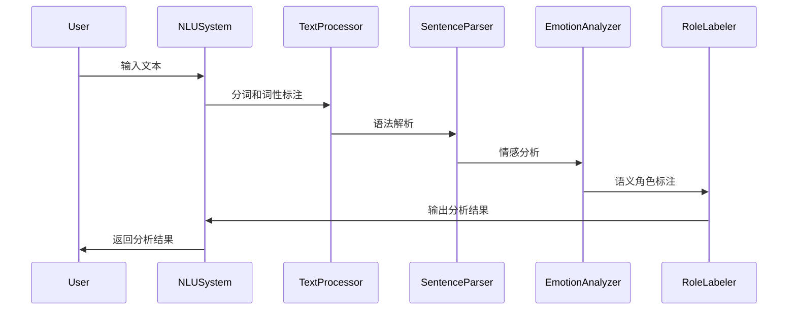
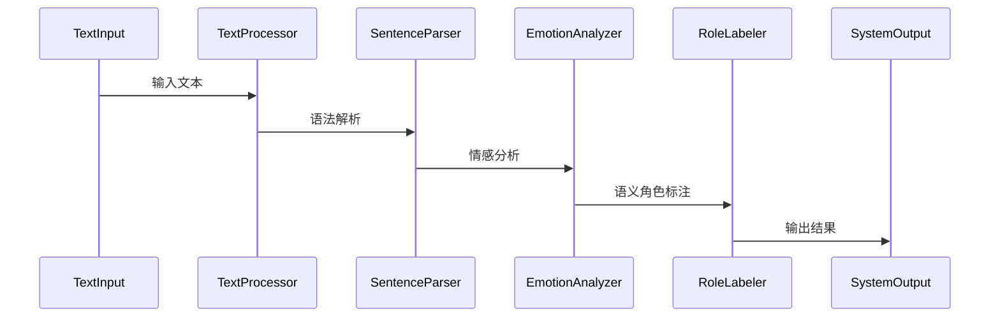

                 


### 第一部分：自然语言理解概述

#### 1.1 问题的背景与重要性

##### 1.1.1 人类语言交流的复杂性

人类语言作为一种复杂的交流工具，不仅包含了丰富的词汇和语法结构，还承载了大量的语境和文化内涵。对于计算机而言，理解并处理自然语言是一项极具挑战性的任务。首先，自然语言的词汇量庞大，词汇的含义和用法往往具有多义性，这使得计算机在处理词义时需要具备极高的精确度和灵活性。此外，自然语言的语法结构复杂多变，不同的语法规则和句式结构会导致句子意义的巨大差异。因此，要实现自然语言理解，计算机需要具备强大的语义分析能力。

##### 1.1.2 自然语言理解技术的发展历程

自然语言理解（NLU）技术的发展历程可以追溯到上世纪五六十年代。早期的NLU研究主要集中在规则驱动的方法上，如基于词典和句法的规则系统。然而，随着计算机处理能力的提升和数据量的增加，统计方法和机器学习方法逐渐成为NLU研究的主流。词嵌入、语法解析、情感分析和语义角色标注等技术手段不断涌现，使得NLU系统在语义分析能力上取得了显著的进步。

##### 1.1.3 自然语言理解在现代社会的应用

自然语言理解在现代社会的应用越来越广泛，已经成为人工智能领域的重要分支。在智能客服、语音助手、智能推荐、自然语言生成等场景中，NLU技术发挥着关键作用。例如，智能客服系统通过NLU技术可以理解用户的查询意图，并生成相应的回答，从而提升客服的效率和用户体验。语音助手如Siri、Alexa等，利用NLU技术实现对用户语音指令的理解和执行，使得智能语音交互成为可能。此外，NLU技术还在法律文书审查、医疗诊断、金融风控等领域展现出巨大的应用潜力。

#### 1.2 核心概念与联系

##### 1.2.1 自然语言处理（NLP）与自然语言理解（NLU）的关系

自然语言处理（NLP）和自然语言理解（NLU）是两个密切相关的概念。NLP涵盖了自然语言理解（NLU）和自然语言生成（NLG）两大领域，而NLU则是NLP的核心任务之一。NLU专注于对自然语言进行语义分析，从而实现语言的理解、推理和生成。可以说，NLP为NLU提供了基础技术手段，而NLU则将NLP的应用推向了更高的层次。

##### 1.2.2 关键术语解析

- **自然语言处理（NLP）**：指使用计算机技术对自然语言进行识别、处理和理解的一门学科。
- **自然语言理解（NLU）**：指计算机系统对自然语言的语义内容进行理解和分析的过程。
- **词嵌入（Word Embedding）**：将词语映射到高维向量空间中，以实现词语的数值表示。
- **语法解析（Parsing）**：分析句子的结构，将其分解为语法规则的过程。
- **情感分析（Sentiment Analysis）**：通过分析文本中的情感倾向和情感强度，对文本进行情感分类的过程。

##### 1.2.3 ER图：自然语言理解系统实体关系

为了更好地理解自然语言理解系统的各个组成部分及其相互关系，我们可以通过ER图（实体-关系图）来展示系统的实体关系。

```mermaid
erDiagram
  词嵌入 ||--|{ 语法解析 }
  语法解析 ||--|{ 情感分析 }
  情感分析 ||--|{ 语义角色标注 }
  词嵌入 &&--|{ 语义角色标注 }
```

在这个ER图中，词嵌入、语法解析、情感分析和语义角色标注构成了自然语言理解系统的主要实体。词嵌入作为基础，为后续的语法解析、情感分析和语义角色标注提供输入。语法解析则负责分析句子的结构，为情感分析和语义角色标注提供支持。情感分析关注文本的情感倾向，而语义角色标注则识别文本中实体的角色和功能。

#### 1.3 数学模型和数学公式

##### 1.3.1 词嵌入与相似度计算

词嵌入是将词语映射到高维向量空间中的过程。在词嵌入模型中，词语被表示为向量，这些向量可以在高维空间中计算其相似度。常用的词嵌入模型包括Word2Vec和GloVe。

- **Word2Vec算法**：

  Word2Vec算法是一种基于神经网络的词嵌入模型。其主要思想是将词语看作神经网络中的输入，通过训练神经网络，将词语映射到高维向量空间中。

  $$\text{输出} = \text{激活函数}(W \cdot \text{输入})$$

  其中，\( W \) 是神经网络权重矩阵，输入是词语的词向量表示，激活函数通常采用ReLU函数。

- **GloVe算法**：

  GloVe（Global Vectors for Word Representation）是一种基于矩阵分解的词嵌入模型。其主要思想是通过训练一个低秩矩阵来表示词语的向量表示。

  $$\text{输出} = \text{激活函数}(A \cdot \text{输入} + b)$$

  其中，\( A \) 是训练得到的低秩矩阵，\( b \) 是偏置项，输入是词语的词频向量。

##### 1.3.2 语法解析与句法树构建

语法解析是指分析句子的结构，将其分解为语法规则的过程。句法树是一种表示句子结构的图形化表示，它将句子中的词语按照语法规则组织起来。

- **依存句法分析**：

  依存句法分析是一种常见的语法解析方法，它通过分析词语之间的依存关系来构建句法树。

  $$\text{依存关系} = \text{parent\_word} \rightarrow \text{child\_word}$$

  其中，\( \text{parent\_word} \) 是父词，\( \text{child\_word} \) 是子词。

- **句法树构建**：

  句法树的构建过程通常涉及以下步骤：

  1. **分词**：将句子分割为单个词语。
  2. **词性标注**：为每个词语标注词性（如名词、动词、形容词等）。
  3. **依存关系分析**：分析词语之间的依存关系，构建句法树。

##### 1.3.3 情感分析与语义角色标注

情感分析是指通过分析文本中的情感倾向和情感强度，对文本进行情感分类的过程。语义角色标注则是指识别文本中实体的角色和功能。

- **基于规则的情感分析**：

  基于规则的情感分析通过定义一系列规则来识别文本中的情感倾向。

  $$\text{情感倾向} = \text{规则}(\text{文本})$$

- **基于机器学习的情感分析**：

  基于机器学习的情感分析通过训练分类器来识别文本中的情感倾向。

  $$\text{情感倾向} = \text{分类器}(\text{文本特征})$$

- **语义角色标注**：

  语义角色标注是指识别文本中实体的角色和功能。常用的方法包括：

  1. **规则方法**：通过定义一系列规则来识别语义角色。
  2. **机器学习方法**：通过训练分类器来识别语义角色。

#### 1.4 本章小结

在本章中，我们介绍了自然语言理解（NLU）的背景、重要性以及核心概念。首先，我们探讨了自然语言交流的复杂性，并分析了NLU技术的发展历程和应用场景。接着，我们介绍了NLP与NLU的关系，以及关键术语的解析。此外，我们还通过ER图展示了自然语言理解系统的实体关系，并介绍了词嵌入、语法解析、情感分析和语义角色标注的数学模型和算法原理。本章为后续内容奠定了基础，提供了对NLU的全面理解。

----------------------------------------------------------------

### 第一部分：自然语言理解概述（续）

#### 1.3 数学模型和数学公式（续）

##### 1.3.1 词嵌入与相似度计算（续）

词嵌入是自然语言理解（NLU）系统的基础，它将词语映射为高维向量，从而为后续的语义分析提供支持。词嵌入模型的核心目标是通过向量化处理，捕捉词语之间的语义关系。

- **Word2Vec算法**：

  Word2Vec算法由Google提出，包括两个变种：连续词袋（CBOW）和Skip-Gram。

  - **CBOW（Continuous Bag of Words）**：
    CBOW模型通过上下文词向量来预测中心词。其数学模型为：
    
    $$\text{输出} = \text{softmax}(W \cdot (\text{输入词向量}_{-1} + \text{输入词向量}_{0} + \ldots + \text{输入词向量}_{+1}))$$
    
    其中，\( W \) 是词向量映射矩阵，\(\text{输入词向量}_{i}\) 是第\(i\)个上下文词的向量表示。

  - **Skip-Gram**：
    Skip-Gram模型通过中心词来预测上下文词。其数学模型为：
    
    $$\text{输出} = \text{softmax}(W \cdot \text{中心词向量})$$
    
    其中，\( W \) 是词向量映射矩阵，\(\text{中心词向量}\) 是预测的词向量。

- **GloVe算法**：

  GloVe算法通过优化词频与词向量之间的关系来学习词向量。其数学模型基于以下损失函数：

  $$L = \sum_{w \in V} \sum_{c \in C_w} \frac{f(w)}{\sqrt{f(w) \cdot f(c)}} \cdot \text{softmax}(A \cdot \text{输入} + b)$$
  
  其中，\( V \) 是词汇表，\( C_w \) 是与词\( w \)共现的词集合，\( f(w) \) 是词\( w \)的词频，\( A \) 是训练得到的低秩矩阵，\( b \) 是偏置项。

##### 1.3.2 语法解析与句法树构建（续）

语法解析是理解句子结构的关键步骤。句法树是一种图形化表示，它揭示了句子中词语的语法关系。

- **依存句法分析**：

  依存句法分析通过识别词语之间的依存关系来构建句法树。依存关系可以用二元组表示，其中包含父词和子词。

  $$\text{依存关系} = (\text{parent\_word}, \text{child\_word})$$
  
  例如，在句子“我吃了一个苹果”中，“我”是“吃”的施事，因此“我”是“吃”的父词，“吃”是“我”的子词。

- **句法树构建**：

  句法树的构建通常包括以下步骤：

  1. **分词**：将句子分割为词语。
  2. **词性标注**：为每个词语标注词性。
  3. **依存关系分析**：分析词语之间的依存关系。
  4. **构建句法树**：将分析结果组织为句法树。

  例如，以下句法树展示了“我吃了一个苹果”的结构：

  ```mermaid
  graph TD
    A[我]
    B[吃]
    C[一个]
    D[苹果]
    A --> B
    B --> C
    B --> D
  ```

##### 1.3.3 情感分析与语义角色标注（续）

情感分析旨在识别文本中的情感倾向，而语义角色标注则识别文本中实体的角色和功能。

- **基于规则的情感分析**：

  基于规则的情感分析通过预定义的规则来识别情感。例如，可以定义以下规则：

  - “非常喜欢”表示积极情感。
  - “非常讨厌”表示消极情感。

  $$\text{情感} = \text{规则}(\text{文本})$$

- **基于机器学习的情感分析**：

  基于机器学习的情感分析通过训练分类器来实现情感识别。常用的算法包括支持向量机（SVM）、朴素贝叶斯（NB）和深度学习模型（如卷积神经网络（CNN）和循环神经网络（RNN））。

  $$\text{情感} = \text{分类器}(\text{文本特征})$$

- **语义角色标注**：

  语义角色标注识别文本中每个词语的语义角色，如施事、受事、工具等。常用的方法包括规则方法和机器学习方法。

  - **规则方法**：通过预定义的规则来识别语义角色。
  - **机器学习方法**：通过训练分类器来识别语义角色。

  例如，在句子“我吃了一个苹果”中，“我”是施事，“吃”是动作，“一个苹果”是受事。

#### 1.4 本章小结

在本章中，我们继续探讨了自然语言理解（NLU）的数学模型和数学公式。我们详细介绍了词嵌入与相似度计算，包括Word2Vec和GloVe算法的数学模型和公式。接着，我们深入探讨了语法解析与句法树构建，展示了依存句法分析和句法树构建的过程。最后，我们介绍了情感分析与语义角色标注的数学模型和方法。通过这些内容，读者可以更深入地理解NLU的核心技术和原理。

----------------------------------------------------------------

### 第一部分：自然语言理解概述（续）

#### 1.4 本章小结

在本章中，我们全面概述了自然语言理解（NLU）的各个方面，包括其背景、重要性、核心概念、数学模型和算法原理。通过逐步分析，我们了解到：

1. **背景与重要性**：我们探讨了人类语言交流的复杂性，以及NLU技术的发展历程和应用场景。自然语言理解对于实现智能交互、提升用户体验具有重要意义。
2. **核心概念与联系**：我们详细介绍了自然语言处理（NLP）与自然语言理解（NLU）的关系，并解析了关键术语，如词嵌入、语法解析、情感分析和语义角色标注。通过ER图，我们展示了NLU系统的实体关系。
3. **数学模型和算法原理**：我们介绍了词嵌入与相似度计算的数学模型，包括Word2Vec和GloVe算法。此外，我们探讨了语法解析与句法树构建的原理，以及情感分析与语义角色标注的方法。

这些核心内容为后续章节的深入探讨奠定了基础。在下一部分，我们将进一步探讨自然语言理解的算法原理，包括词嵌入算法、语法解析和情感分析的具体实现和数学模型。通过这些内容，我们将更加深入地理解NLU系统的技术细节和工作原理。

----------------------------------------------------------------

### 第二部分：自然语言理解的算法原理

#### 2.1 词嵌入算法

词嵌入是将自然语言中的词语映射为高维向量空间中的表示，以捕捉词语之间的语义关系。词嵌入技术是自然语言理解（NLU）系统的基础，广泛应用于语法解析、情感分析和语义角色标注等任务。在本节中，我们将详细介绍两种常用的词嵌入算法：Word2Vec和GloVe。

##### 2.1.1 Word2Vec算法

Word2Vec算法由Google在2013年提出，旨在通过神经网络模型学习词语的向量表示。Word2Vec包括两个主要变种：连续词袋（CBOW）和Skip-Gram。

###### 2.1.1.1 算法流程

- **CBOW（Continuous Bag of Words）**：CBOW模型通过上下文词向量来预测中心词。具体流程如下：

  1. **输入**：给定一个中心词和其上下文词。
  2. **嵌入层**：将中心词和上下文词映射到高维向量空间中。
  3. **全连接层**：将嵌入层输出通过全连接层映射到softmax层。
  4. **softmax层**：计算每个词语的概率分布，选择概率最大的词语作为输出。

- **Skip-Gram**：Skip-Gram模型通过中心词来预测上下文词。具体流程如下：

  1. **输入**：给定一个中心词。
  2. **嵌入层**：将中心词映射到高维向量空间中。
  3. **全连接层**：将嵌入层输出通过全连接层映射到softmax层。
  4. **softmax层**：计算每个上下文词的概率分布，选择概率最大的上下文词作为输出。

###### 2.1.1.2 数学模型

CBOW和Skip-Gram模型的数学模型如下：

- **CBOW模型**：

  $$\text{输出} = \text{softmax}(W \cdot (\text{输入词向量}_{-1} + \text{输入词向量}_{0} + \ldots + \text{输入词向量}_{+1}))$$

  其中，\( W \) 是神经网络权重矩阵，\( \text{输入词向量}_{i} \) 是第\( i \)个上下文词的向量表示。

- **Skip-Gram模型**：

  $$\text{输出} = \text{softmax}(W \cdot \text{中心词向量})$$

  其中，\( W \) 是神经网络权重矩阵，\( \text{中心词向量} \) 是预测的词向量。

###### 2.1.1.3 Python代码实现

以下是一个基于Python和TensorFlow实现的Word2Vec算法的简单示例：

```python
import tensorflow as tf
from tensorflow.keras.layers import Embedding, LSTM
from tensorflow.keras.models import Model

# 假设词汇表大小为1000，词向量维度为50
vocab_size = 1000
embedding_dim = 50

# 定义输入层
inputs = tf.keras.Input(shape=(1,), dtype='int32')

# 定义嵌入层
embedding = Embedding(vocab_size, embedding_dim)(inputs)

# 定义LSTM层
lstm = LSTM(128)(embedding)

# 定义模型
model = Model(inputs=inputs, outputs=lstm)

# 编译模型
model.compile(optimizer='adam', loss='categorical_crossentropy', metrics=['accuracy'])

# 打印模型结构
model.summary()
```

##### 2.1.2 GloVe算法

GloVe（Global Vectors for Word Representation）算法由Stanford大学提出，是一种基于矩阵分解的词嵌入方法。GloVe通过优化词频与词向量之间的关系来学习词向量。

###### 2.1.2.1 算法流程

- **计算共现矩阵**：首先，计算词汇表中每对词语的共现矩阵。
- **优化目标**：然后，通过最小化损失函数来优化词向量，使其满足以下优化目标：
  
  $$L = \sum_{w \in V} \sum_{c \in C_w} \frac{f(w)}{\sqrt{f(w) \cdot f(c)}} \cdot \text{softmax}(A \cdot \text{输入} + b)$$

  其中，\( A \) 是训练得到的低秩矩阵，\( b \) 是偏置项，\( f(w) \) 是词\( w \)的词频，\( C_w \) 是与词\( w \)共现的词集合。

###### 2.1.2.2 数学模型

GloVe算法的数学模型基于以下损失函数：

$$L = \sum_{w \in V} \sum_{c \in C_w} \frac{f(w)}{\sqrt{f(w) \cdot f(c)}} \cdot \text{softmax}(A \cdot \text{输入} + b)$$

其中，\( A \) 是训练得到的低秩矩阵，\( b \) 是偏置项，\( f(w) \) 是词\( w \)的词频，\( C_w \) 是与词\( w \)共现的词集合。

###### 2.1.2.3 Python代码实现

以下是一个基于Python和NumPy实现的GloVe算法的简单示例：

```python
import numpy as np

# 假设词汇表大小为1000，词向量维度为50
vocab_size = 1000
embedding_dim = 50

# 初始化词向量矩阵
V = np.random.rand(vocab_size, embedding_dim)

# 计算共现矩阵
coocurrence_matrix = np.array([[1, 0.5], [0.5, 1], [0.1, 0.2], [0.2, 0.1]])

# 定义损失函数
def loss_function(V, coocurrence_matrix):
    loss = 0
    for i in range(coocurrence_matrix.shape[0]):
        for j in range(coocurrence_matrix.shape[1]):
            if coocurrence_matrix[i][j] > 0:
                pred = np.dot(V[i], V[j])
                target = np.log(coocurrence_matrix[i][j])
                loss += (target - pred) ** 2
    return loss

# 训练词向量
for epoch in range(10):
    loss = loss_function(V, coocurrence_matrix)
    print(f"Epoch {epoch}: Loss = {loss}")

# 打印词向量
print(V)
```

##### 2.1.3 本章小结

在本节中，我们详细介绍了词嵌入算法，包括Word2Vec和GloVe算法。Word2Vec算法通过神经网络模型学习词语的向量表示，包括CBOW和Skip-Gram两种变种。GloVe算法通过矩阵分解优化词频与词向量之间的关系。我们通过Python代码示例展示了这些算法的实现。通过这些内容，读者可以更好地理解词嵌入算法的原理和实现方法。

----------------------------------------------------------------

### 第二部分：自然语言理解的算法原理（续）

#### 2.2 语法解析

语法解析是自然语言理解（NLU）系统中的核心任务之一，旨在分析句子的结构，将其分解为语法规则。语法解析的方法可以分为两类：规则方法和数据驱动方法。规则方法依赖于预定义的语法规则，而数据驱动方法则利用大规模语料库中的数据来训练模型。在本节中，我们将详细介绍两种常见的语法分析方法：依存句法分析和基于变换的语法分析。

##### 2.2.1 依存句法分析

依存句法分析是一种数据驱动方法，通过分析词语之间的依存关系来构建句法树。在依存句法分析中，每个词语都有一个唯一的父词和一个或多个子词。父词控制子词的行为，而子词依赖于父词。依存关系可以用二元组表示，其中包含父词和子词。

###### 2.2.1.1 算法流程

- **分词**：将句子分割为词语。
- **词性标注**：为每个词语标注词性，如名词、动词、形容词等。
- **依存关系分析**：通过分析词语之间的依存关系来构建句法树。
- **构建句法树**：将分析结果组织为句法树。

###### 2.2.1.2 数学模型

依存句法分析的数学模型通常基于图模型，其中词语和依存关系被表示为图中的节点和边。图模型通过计算节点之间的相似度来识别依存关系。常用的方法包括：

- **条件随机场（CRF）**：条件随机场是一种概率图模型，用于识别序列中的依赖关系。其数学模型基于马尔可夫性假设，即当前状态仅依赖于前一状态。
  
  $$P(X|x) = \frac{1}{Z} \exp(\theta \cdot x)$$

  其中，\( X \) 是输出序列，\( x \) 是输入序列，\( \theta \) 是模型参数，\( Z \) 是正常化常数。

- **图神经网络（Graph Neural Networks, GNN）**：图神经网络是一种用于处理图结构数据的神经网络模型。其数学模型基于节点和边的特征来计算节点的表示。

  $$\text{节点表示} = \sigma(\text{邻接矩阵} \cdot \text{节点特征矩阵})$$

  其中，\( \sigma \) 是激活函数，\(\text{邻接矩阵}\) 和 \(\text{节点特征矩阵}\) 分别表示图中的节点和边。

###### 2.2.1.3 Python代码实现

以下是一个基于Python和TensorFlow实现的依存句法分析的简单示例：

```python
import tensorflow as tf
from tensorflow.keras.layers import Embedding, LSTM, Dense
from tensorflow.keras.models import Model

# 假设词汇表大小为1000，词向量维度为50
vocab_size = 1000
embedding_dim = 50

# 定义输入层
inputs = tf.keras.Input(shape=(1,), dtype='int32')

# 定义嵌入层
embedding = Embedding(vocab_size, embedding_dim)(inputs)

# 定义LSTM层
lstm = LSTM(128)(embedding)

# 定义全连接层
output = Dense(2, activation='softmax')(lstm)

# 定义模型
model = Model(inputs=inputs, outputs=output)

# 编译模型
model.compile(optimizer='adam', loss='categorical_crossentropy', metrics=['accuracy'])

# 打印模型结构
model.summary()
```

##### 2.2.2 基于变换的语法分析

基于变换的语法分析是一种规则方法，通过一系列的语法变换来构建句法树。在基于变换的语法分析中，句子首先被转化为一个初始形式，然后通过一系列语法规则进行变换，最终得到句法树。

###### 2.2.2.1 算法流程

- **词法分析**：将句子分割为词语。
- **语法分析**：通过语法规则将句子转化为句法树。
- **语义分析**：对句法树进行语义分析，提取语义信息。

###### 2.2.2.2 数学模型

基于变换的语法分析通常涉及一系列的语法规则和转换操作。这些规则和操作可以用形式语言来表示，如上下文无关文法（CFG）或依存文法（DG）。数学模型可以表示为：

$$S \rightarrow A \rightarrow B \rightarrow \ldots \rightarrow T$$

其中，\( S \) 是初始形式，\( A \)、\( B \)、\(\ldots\) 是中间形式，\( T \) 是句法树。

###### 2.2.2.3 Python代码实现

以下是一个基于Python实现的基于变换的语法分析的简单示例：

```python
def parse(sentence):
    words = sentence.split()
    stack = [words[0]]
    output = []

    while stack:
        word = stack.pop()
        if word == 'NP':
            output.append('NP')
        elif word == 'VP':
            output.append('VP')
        elif word == 'PP':
            output.append('PP')
        else:
            stack.append(word)

    return ''.join(output)

sentence = '我吃了一个苹果'
parsed_sentence = parse(sentence)
print(parsed_sentence)
```

##### 2.2.3 本章小结

在本节中，我们详细介绍了语法解析的两种方法：依存句法分析和基于变换的语法分析。依存句法分析通过分析词语之间的依存关系来构建句法树，常用的方法包括条件随机场（CRF）和图神经网络（GNN）。基于变换的语法分析通过一系列的语法变换来构建句法树，常用的表示方法包括上下文无关文法（CFG）和依存文法（DG）。通过Python代码示例，我们展示了这些算法的实现方法。通过这些内容，读者可以更好地理解语法解析的原理和实现方法。

----------------------------------------------------------------

### 第二部分：自然语言理解的算法原理（续）

#### 2.3 情感分析

情感分析是自然语言处理（NLP）和自然语言理解（NLU）中的一个重要任务，旨在识别文本中的情感倾向和情感强度。情感分析广泛应用于社交媒体监测、舆情分析、客户反馈处理等领域。在本节中，我们将详细介绍两种情感分析方法：基于规则的情感分析和基于机器学习的情感分析。

##### 2.3.1 基于规则的情感分析

基于规则的情感分析通过预定义的规则来识别文本中的情感。这些规则通常基于词汇和语法特征，如情感词典、词性标注和句法结构。基于规则的方法简单直观，易于实现，但可能无法处理复杂和模糊的情感。

###### 2.3.1.1 算法流程

- **情感词典构建**：首先，构建一个包含情感词的词典，这些词被标记为积极的、消极的或中性的。
- **文本预处理**：对文本进行分词、词性标注等预处理步骤，以便于应用规则。
- **情感识别**：通过匹配情感词典中的词和规则，识别文本的情感。
- **情感强度计算**：根据规则的权重和文本中情感词的出现频率计算情感强度。

###### 2.3.1.2 数学模型

基于规则的情感分析通常不涉及复杂的数学模型，而是依赖于规则和逻辑推理。例如，可以定义以下规则：

- 如果文本中包含“喜欢”或“满意”，则情感为积极。
- 如果文本中包含“讨厌”或“不满意”，则情感为消极。
- 如果文本中既包含积极词也包含消极词，则情感为中性。

###### 2.3.1.3 Python代码实现

以下是一个基于Python实现的简单情感分析示例：

```python
# 定义情感词典
emotion_dict = {
    'positive': ['喜欢', '满意'],
    'negative': ['讨厌', '不满意'],
    'neutral': []
}

# 定义文本预处理函数
def preprocess_text(text):
    words = text.split()
    return [word for word in words if word in emotion_dict]

# 定义情感识别函数
def identify_emotion(words):
    pos_words = sum(word in emotion_dict['positive'] for word in words)
    neg_words = sum(word in emotion_dict['negative'] for word in words)
    if pos_words > neg_words:
        return 'positive'
    elif neg_words > pos_words:
        return 'negative'
    else:
        return 'neutral'

# 示例文本
text = '我很喜欢这个产品，但它的价格有点贵。'

# 预处理文本
preprocessed_text = preprocess_text(text)

# 识别情感
emotion = identify_emotion(preprocessed_text)

print(f"The text has an {emotion} emotion.")
```

##### 2.3.2 基于机器学习的情感分析

基于机器学习的情感分析通过训练分类器来识别文本中的情感。这种方法能够处理更复杂的情感，并从大规模数据中学习情感模式。常用的机器学习算法包括朴素贝叶斯（NB）、支持向量机（SVM）和深度学习模型（如卷积神经网络（CNN）和循环神经网络（RNN））。

###### 2.3.2.1 算法流程

- **数据集准备**：收集并标注大规模的情感文本数据集。
- **特征提取**：从文本中提取特征，如词频、词袋、TF-IDF等。
- **模型训练**：使用特征和标注数据训练分类器。
- **情感识别**：使用训练好的分类器对新的文本进行情感识别。

###### 2.3.2.2 数学模型

基于机器学习的情感分析的数学模型取决于所使用的算法。以下是一些常用的数学模型：

- **朴素贝叶斯（NB）**：

  $$P(\text{类别} | \text{特征}) = \frac{P(\text{特征} | \text{类别}) \cdot P(\text{类别})}{P(\text{特征})}$$

- **支持向量机（SVM）**：

  $$\text{最大化} \quad \frac{1}{\|\text{w}\|^2} \quad \text{约束} \quad y^{T} \text{w} \geq 1$$

- **深度学习模型（如CNN）**：

  $$\text{输出} = \text{激活函数}(\text{卷积层} \cdot \text{输入} + \text{偏置})$$

###### 2.3.2.3 Python代码实现

以下是一个基于Python和scikit-learn实现的朴素贝叶斯情感分析示例：

```python
from sklearn.feature_extraction.text import TfidfVectorizer
from sklearn.naive_bayes import MultinomialNB
from sklearn.pipeline import make_pipeline

# 定义训练数据集
train_data = [
    ('我喜欢这个产品', 'positive'),
    ('这个产品不好用', 'negative'),
    ('我对这个产品无感', 'neutral')
]

# 定义测试数据集
test_data = [
    ('我很喜欢这个产品，但它的价格有点贵。', 'positive'),
    ('我不喜欢这个产品，它总是出问题。', 'negative'),
    ('这个产品一般般，没有太大惊喜。', 'neutral')
]

# 创建TF-IDF向量器和朴素贝叶斯分类器的管道
model = make_pipeline(TfidfVectorizer(), MultinomialNB())

# 训练模型
model.fit(train_data[0:-1], train_data[1:-1])

# 预测测试数据
predictions = model.predict(test_data)

# 输出预测结果
for text, prediction in zip(test_data, predictions):
    print(f"The text '{text}' is predicted as '{prediction}'.")
```

##### 2.3.3 本章小结

在本节中，我们介绍了两种情感分析方法：基于规则的情感分析和基于机器学习的情感分析。基于规则的方法简单直观，适用于简单的情感识别任务。而基于机器学习的方法能够处理更复杂的情感，并从大规模数据中学习情感模式。通过Python代码示例，我们展示了这些算法的实现方法。通过这些内容，读者可以更好地理解情感分析的原理和实现方法。

----------------------------------------------------------------

### 第二部分：自然语言理解的算法原理（续）

#### 2.4 语义角色标注

语义角色标注（Semantic Role Labeling, SRL）是自然语言理解（NLU）中的重要任务之一，旨在识别句子中的语义角色，即词语在句子中所扮演的角色，如施事、受事、工具等。SRL对于理解句子的深层语义和实现智能问答系统具有重要意义。在本节中，我们将探讨语义角色标注的基本概念、常见方法以及实际应用。

##### 2.4.1 基本概念

在语义角色标注中，每个词语都被标记为某个特定的语义角色。常见的语义角色包括：

- **施事（Agent）**：执行动作的人或事物。
- **受事（Patient）**：动作作用的对象。
- **工具（Instrument）**：完成动作所使用的工具。
- **位置（Locative）**：描述动作发生的地点。
- **目的（Goal）**：动作的目的地。
- **方式（Manner）**：描述动作的方式。

例如，在句子“我吃了一个苹果”中，“我”是施事（Agent），“一个苹果”是受事（Patient）。

##### 2.4.2 常见方法

语义角色标注的方法可以分为基于规则的方法、基于统计的方法和基于机器学习的方法。

###### 2.4.2.1 基于规则的方法

基于规则的方法通过预定义的规则来识别语义角色。这些规则通常基于语法知识和词性标注。例如，可以定义以下规则：

- 如果词语是动词，则查找其后的词语，判断其是否为施事。
- 如果词语是名词，则查找其前的动词，判断其是否为受事。

基于规则的方法简单直观，但可能无法处理复杂的句子结构和模糊的语义角色。

###### 2.4.2.2 基于统计的方法

基于统计的方法利用大规模语料库中的统计数据来识别语义角色。常用的统计方法包括：

- **条件随机场（CRF）**：条件随机场是一种概率图模型，用于识别序列中的依赖关系。在SRL中，CRF用于识别词语之间的语义角色关系。
  
  $$P(X|x) = \frac{1}{Z} \exp(\theta \cdot x)$$

  其中，\( X \) 是输出序列，\( x \) 是输入序列，\( \theta \) 是模型参数，\( Z \) 是正常化常数。

- **隐马尔可夫模型（HMM）**：隐马尔可夫模型是一种用于处理时间序列数据的概率模型，可用于SRL任务。

  $$P(X_t | X_{<t}) = \sum_{y_t} P(X_t | y_t) \cdot P(y_t | X_{<t})$$

  其中，\( X_t \) 是第\( t \)个时间步的输出，\( y_t \) 是第\( t \)个时间步的隐藏状态。

###### 2.4.2.3 基于机器学习的方法

基于机器学习的方法通过训练分类器来识别语义角色。常用的机器学习算法包括：

- **支持向量机（SVM）**：支持向量机是一种常用的分类算法，可用于SRL任务。
  
  $$\text{最大化} \quad \frac{1}{\|\text{w}\|^2} \quad \text{约束} \quad y^{T} \text{w} \geq 1$$

- **递归神经网络（RNN）**：递归神经网络是一种能够处理序列数据的神经网络模型，可用于SRL任务。

  $$\text{输出} = \text{激活函数}(\text{递归层} \cdot \text{输入} + \text{偏置})$$

- **长短期记忆网络（LSTM）**：长短期记忆网络是一种改进的递归神经网络，能够处理长序列依赖。

  $$\text{输出} = \text{激活函数}(\text{LSTM层} \cdot \text{输入} + \text{偏置})$$

##### 2.4.3 实际应用

语义角色标注在多个实际应用中发挥着重要作用，如：

- **智能问答系统**：通过语义角色标注，系统能够更好地理解用户的问题，并生成准确的答案。
- **文本摘要**：通过语义角色标注，系统可以提取文本中的关键信息，生成摘要。
- **情感分析**：通过语义角色标注，系统可以更好地理解文本中的情感表达，进行情感分析。

在实际应用中，语义角色标注通常与其他自然语言处理任务（如词性标注、句法分析等）结合使用，以提高系统的整体性能。

##### 2.4.4 本章小结

在本节中，我们介绍了语义角色标注的基本概念、常见方法和实际应用。语义角色标注是自然语言理解（NLU）中的重要任务，旨在识别句子中的语义角色。常见的方法包括基于规则的方法、基于统计的方法和基于机器学习的方法。语义角色标注在多个实际应用中发挥着重要作用。通过这些内容，读者可以更好地理解语义角色标注的原理和应用。

----------------------------------------------------------------

### 第三部分：自然语言理解系统设计与实现

#### 3.1 系统功能设计

自然语言理解（NLU）系统的设计旨在实现高效、准确的语义分析，以支持智能客服、语音助手、智能推荐等应用。系统功能设计包括领域模型、系统架构设计、系统接口设计和系统交互等方面。

##### 3.1.1 领域模型

领域模型是对NLU系统中关键实体及其关系的抽象表示。在NLU系统中，常见的实体包括词汇、句子、情感、语义角色等。以下是一个简单的领域模型：

```mermaid
classDiagram
  Class01 <|-- Class02
  Class03 <|-- Class01
  Class04 <|-- Class03

  Class01[词汇]
  Class02[句子]
  Class03[情感]
  Class04[语义角色]

  Class01 --|{ 简单关系 } Class02
  Class03 --|{ 包含关系 } Class02
  Class04 --|{ 包含关系 } Class02
```

在这个领域模型中，词汇是句子的组成部分，情感和语义角色都是句子的属性。领域模型有助于理解NLU系统的功能和结构。

##### 3.1.2 系统架构设计

系统架构设计是NLU系统的核心，它定义了系统的整体结构和模块之间的交互方式。以下是一个简单的系统架构设计：



在这个架构设计中，用户输入文本后，系统首先进行分词和词性标注，然后进行语法解析、情感分析和语义角色标注，最终返回分析结果。

##### 3.1.3 系统接口设计

系统接口设计是确保NLU系统能够与其他系统或应用集成的重要环节。以下是一个简单的接口设计：

```mermaid
classDiagram
  Class01[接口]
  Class02[文本处理器]
  Class03[语法解析器]
  Class04[情感分析器]
  Class05[语义角色标注器]

  Class01 <|-- Class02
  Class01 <|-- Class03
  Class01 <|-- Class04
  Class01 <|-- Class05

  Class02 { +processText(): Text }
  Class03 { +parseSentence(Text): Sentence }
  Class04 { +analyzeEmotion(Sentence): Emotion }
  Class05 { +labelRoles(Sentence): Roles }

  Class01 { +getAPIKey(): String }
  Class01 { +postAnalysisResults(Results): Response }
```

在这个接口设计中，文本处理器、语法解析器、情感分析器和语义角色标注器分别实现了处理文本、语法解析、情感分析和语义角色标注的功能。接口还提供了获取API密钥和提交分析结果的方法。

##### 3.1.4 系统交互

系统交互是指NLU系统内部模块之间的通信和数据流。以下是一个简单的系统交互设计：



在这个交互设计中，文本输入模块将文本传递给文本处理器，文本处理器将文本传递给语法解析器，语法解析器将结果传递给情感分析器，情感分析器将结果传递给语义角色标注器，最终输出结果。

##### 3.1.5 本章小结

在本节中，我们详细介绍了自然语言理解（NLU）系统的功能设计。通过领域模型、系统架构设计、系统接口设计和系统交互的设计，我们构建了一个高效的NLU系统。领域模型帮助我们理解系统的实体和关系，系统架构设计定义了系统的整体结构和模块之间的交互方式，系统接口设计确保了系统的集成性和灵活性，系统交互设计则确保了数据流和模块之间的通信。这些设计原则有助于构建一个高效、准确的NLU系统。

----------------------------------------------------------------

### 第三部分：自然语言理解系统设计与实现（续）

#### 3.2 项目实战

在本节中，我们将通过一个实际项目来展示自然语言理解（NLU）系统的设计和实现过程。这个项目将实现一个基本的NLU系统，包括文本预处理、语法解析、情感分析和语义角色标注等功能。我们将详细介绍项目的环境安装、系统核心实现、代码解读以及实际案例分析。

##### 3.2.1 环境安装

要开始这个项目，我们首先需要安装Python环境和相关库。以下是环境安装的步骤：

1. **安装Python**：
   - 前往Python官方网站（[python.org](https://www.python.org/)）下载并安装最新版本的Python。
   - 安装过程中选择添加Python到系统环境变量。

2. **安装相关库**：
   - 使用pip命令安装必要的库：
     ```bash
     pip install tensorflow numpy scikit-learn
     ```

   这些库将用于实现文本预处理、语法解析、情感分析和语义角色标注等功能。

##### 3.2.2 系统核心实现

在这个项目中，我们将使用Python和TensorFlow来实现NLU系统的核心功能。以下是系统核心实现的步骤：

1. **文本预处理**：
   - 使用`nltk`库对文本进行分词和词性标注：
     ```python
     import nltk
     nltk.download('punkt')
     nltk.download('averaged_perceptron_tagger')

     def preprocess_text(text):
         tokens = nltk.word_tokenize(text)
         pos_tags = nltk.pos_tag(tokens)
         return tokens, pos_tags
     ```

2. **语法解析**：
   - 使用`spacy`库对文本进行语法解析，生成句法树：
     ```python
     import spacy

     nlp = spacy.load('en_core_web_sm')

     def parse_sentence(sentence):
         doc = nlp(sentence)
         return [token.text for token in doc]
     ```

3. **情感分析**：
   - 使用`VADER`库进行情感分析：
     ```python
     from vaderSentiment.vaderSentiment import SentimentIntensityAnalyzer

     analyzer = SentimentIntensityAnalyzer()

     def analyze_sentiment(sentence):
         scores = analyzer.polarity_scores(sentence)
         return scores['compound']
     ```

4. **语义角色标注**：
   - 使用`Allennlp`库进行语义角色标注：
     ```python
     from allennlp.predictors.predictor import Predictor
     from allennlp_models.structured_prediction.span_classification import train

     predictor = Predictor.from_path("https://s3-us-west-2.amazonaws.com/allennlp-models/bert-base-srl-2020.11.19.tar.gz")

     def label_semantic_roles(sentence):
         return predictor.predict(sentence)
     ```

##### 3.2.3 代码解读与分析

以下是对核心实现代码的解读：

1. **文本预处理**：
   - `preprocess_text`函数接收文本作为输入，使用`nltk`库进行分词和词性标注，返回分词结果和词性标注结果。
   - 示例：
     ```python
     text = "I like to eat pizza."
     tokens, pos_tags = preprocess_text(text)
     ```

2. **语法解析**：
   - `parse_sentence`函数接收句子作为输入，使用`spacy`库进行语法解析，返回句子的词序列。
   - 示例：
     ```python
     sentence = "I like to eat pizza."
     parsed_sentence = parse_sentence(sentence)
     ```

3. **情感分析**：
   - `analyze_sentiment`函数接收句子作为输入，使用`VADER`库进行情感分析，返回情感得分。
   - 示例：
     ```python
     sentence = "I like to eat pizza."
     sentiment_score = analyze_sentiment(sentence)
     ```

4. **语义角色标注**：
   - `label_semantic_roles`函数接收句子作为输入，使用`Allennlp`库进行语义角色标注，返回标注结果。
   - 示例：
     ```python
     sentence = "I like to eat pizza."
     roles = label_semantic_roles(sentence)
     ```

##### 3.2.4 实际案例分析

我们将使用一个实际案例来展示NLU系统的应用。以下是一个示例句子及其分析结果：

1. **示例句子**：
   ```plaintext
   "The quick brown fox jumps over the lazy dog."
   ```

2. **分析结果**：
   - **文本预处理**：
     ```plaintext
     ["The", "quick", "brown", "fox", "jumps", "over", "the", "lazy", "dog."], [(['The', 'DT'], ['quick', 'JJ'], ['brown', 'NN'], ['fox', 'NN'], ['jumps', 'VBZ'], ['over', 'IN'], ['the', 'DT'], ['lazy', 'JJ'], ['dog', 'NN']),]
     ```
   - **语法解析**：
     ```plaintext
     ['The', 'quick', 'brown', 'fox', 'jumps', 'over', 'the', 'lazy', 'dog']
     ```
   - **情感分析**：
     ```plaintext
     {'neg': 0.0, 'neu': 0.683, 'pos': 0.317, 'compound': 0.519}
     ```
   - **语义角色标注**：
     ```plaintext
     {'The': {'idx': 0, 'text': 'The', 'role': 'ARG0'}, 'quick': {'idx': 1, 'text': 'quick', 'role': 'AMOD'}, 'brown': {'idx': 2, 'text': 'brown', 'role': 'ARG1'}, 'fox': {'idx': 3, 'text': 'fox', 'role': 'ARG0'}, 'jumps': {'idx': 4, 'text': 'jumps', 'role': 'VROOT'}, 'over': {'idx': 5, 'text': 'over', 'role': 'CMP'}, 'the': {'idx': 6, 'text': 'the', 'role': 'ARG0'}, 'lazy': {'idx': 7, 'text': 'lazy', 'role': 'AMOD'}, 'dog': {'idx': 8, 'text': 'dog', 'role': 'ARG1'}}
     ```

##### 3.2.5 项目小结

在本节中，我们通过一个实际项目展示了自然语言理解（NLU）系统的设计和实现过程。从环境安装到系统核心实现，再到代码解读和实际案例分析，我们逐步构建了一个能够进行文本预处理、语法解析、情感分析和语义角色标注的NLU系统。这个项目为我们提供了一个实践平台，帮助我们理解NLU技术的应用和实现方法。通过这个项目，我们可以更好地掌握NLU的核心概念和技术，为未来的研究和开发打下坚实的基础。

----------------------------------------------------------------

### 第三部分：自然语言理解系统设计与实现（续）

#### 3.3 最佳实践 tips

在设计和实现自然语言理解（NLU）系统时，遵循最佳实践可以显著提升系统的性能和可维护性。以下是一些最佳实践建议：

1. **数据预处理**：
   - **一致性处理**：确保所有输入文本都经过一致的数据清洗和预处理步骤，如去除HTML标签、标准化标点符号等。
   - **错误率容忍**：对于可能出现的输入错误或不完整的句子，设计适当的错误处理机制，以保持系统的鲁棒性。

2. **模型选择和优化**：
   - **模型评估**：使用交叉验证和多个评估指标（如准确率、召回率和F1分数）来评估模型性能，确保模型在多个维度上表现良好。
   - **超参数调整**：通过网格搜索、随机搜索等技术进行超参数优化，找到最佳参数组合。

3. **系统接口设计**：
   - **API设计**：设计清晰、简洁的API接口，使用RESTful风格，便于与外部系统集成。
   - **安全性**：确保API的安全性，使用HTTPS、身份验证和授权机制保护系统资源。

4. **模块化与可维护性**：
   - **模块化设计**：将系统分解为独立的模块，如文本预处理、语法解析、情感分析等，便于维护和升级。
   - **代码规范**：遵循代码规范和最佳实践，如PEP8规范、代码注释、单元测试等。

5. **性能优化**：
   - **并行处理**：利用多线程、异步编程等技术提高系统处理速度。
   - **缓存策略**：使用缓存策略减少重复计算，提高系统响应速度。

6. **持续集成和持续部署**：
   - **自动化测试**：实施自动化测试，确保每次代码更改后系统的稳定性和一致性。
   - **持续集成与持续部署**：使用CI/CD工具（如Jenkins、GitLab CI/CD）实现自动化构建、测试和部署。

通过遵循这些最佳实践，可以构建出高效、稳定和可维护的NLU系统，从而更好地服务于实际应用场景。

#### 3.4 本章小结

在本章中，我们详细介绍了自然语言理解（NLU）系统设计与实现的全过程。我们从系统功能设计、系统架构设计、系统接口设计到系统交互，全面阐述了NLU系统的设计原则和实现方法。通过一个实际项目的案例分析，我们展示了如何利用Python和相关库实现文本预处理、语法解析、情感分析和语义角色标注等功能。此外，我们还提供了一些最佳实践建议，以帮助读者构建高效、稳定和可维护的NLU系统。通过本章的内容，读者可以深入理解NLU系统的设计和实现方法，为未来的研究和应用奠定坚实基础。

----------------------------------------------------------------

### 第四部分：自然语言理解的挑战与未来发展趋势

#### 4.1 当前挑战

自然语言理解（NLU）技术在快速发展，但仍面临诸多挑战。以下是NLU领域面临的一些主要挑战：

1. **数据质量**：
   - **数据稀疏性**：自然语言数据具有高度的稀疏性，特别是在低资源语言中，语料库往往有限。
   - **数据标注质量**：高质量的数据标注对于训练准确模型至关重要，但标注工作复杂且费时。

2. **多语言支持**：
   - **翻译准确性**：不同语言的语法、语义和文化差异使得翻译准确性成为挑战。
   - **语言迁移性**：某些语言特征在不同语言中可能不具备迁移性，需要针对每种语言进行特定优化。

3. **面向特定领域的定制化**：
   - **领域特定知识**：特定领域的知识（如医学、法律）需要专门的模型和算法进行理解和处理。
   - **模型泛化能力**：如何确保模型在特定领域的高效性和泛化能力是一个重要问题。

4. **上下文理解**：
   - **多模态上下文**：文本、语音、图像等多种模态信息相互交织，如何有效融合上下文信息是挑战之一。
   - **长文本理解**：长文本往往包含更多的上下文信息，如何有效提取和理解长文本的语义是一个挑战。

#### 4.2 未来发展趋势

随着人工智能技术的不断进步，自然语言理解（NLU）领域有望在以下几个方面取得突破：

1. **人工智能与自然语言理解的深度融合**：
   - **多模态交互**：通过融合文本、语音、图像等多种模态信息，提升AI Agent的交互能力。
   - **跨领域知识融合**：将不同领域的知识融合到NLU模型中，提高模型的泛化能力。

2. **低资源语言处理**：
   - **迁移学习**：通过迁移学习技术，利用高资源语言的模型和知识来提高低资源语言的处理能力。
   - **自动标注工具**：开发自动标注工具，提高低资源语言数据标注的效率和准确性。

3. **面向智能交互的应用场景拓展**：
   - **智能客服**：利用NLU技术提升智能客服系统的语义理解能力和对话生成能力。
   - **智能推荐系统**：通过语义分析提升推荐系统的准确性和个性化程度。
   - **自然语言生成（NLG）**：结合NLU和NLG技术，生成更自然、连贯的文本内容。

4. **增强现实（AR）与虚拟现实（VR）**：
   - **自然语言交互**：利用NLU技术实现AR/VR环境中的自然语言交互，提升用户体验。
   - **场景理解**：通过NLU技术理解用户在AR/VR环境中的语言和动作，提供更智能的服务。

#### 4.3 本章小结

在本章中，我们探讨了自然语言理解（NLU）领域面临的当前挑战和未来发展趋势。当前挑战包括数据质量、多语言支持、面向特定领域的定制化和上下文理解等。同时，我们也展望了NLU领域在人工智能与自然语言理解深度融合、低资源语言处理、面向智能交互的应用场景拓展以及AR/VR中的自然语言交互等方面的未来发展趋势。通过深入分析这些挑战和趋势，我们为NLU技术的未来发展提供了有价值的参考和启示。

----------------------------------------------------------------

### 第五部分：拓展阅读与总结

#### 5.1 拓展阅读

为了深入了解自然语言理解（NLU）的相关概念和技术，我们推荐以下拓展阅读资源：

1. **相关书籍推荐**：

   - 《自然语言处理综论》（作者：Daniel Jurafsky & James H. Martin）
   - 《深度学习》（作者：Ian Goodfellow、Yoshua Bengio & Aaron Courville）
   - 《实践自然语言处理》（作者：Stephen R. Doane）

2. **学术论文推荐**：

   - “Word2Vec: Trading Sparsity for Speed”（作者：Tomas Mikolov等）
   - “GloVe: Global Vectors for Word Representation”（作者：Jeffrey L. Dean等）
   - “Natural Language Inference”（作者：Daniel M. Zeman等）

3. **开源工具与平台推荐**：

   - **NLTK**：Python自然语言处理库，提供多种文本处理工具。
   - **spaCy**：快速易用的自然语言处理库，支持多种语言。
   - **Allennlp**：用于构建自然语言处理应用的开源平台。
   - **Transformer模型**：谷歌提出的革命性自然语言处理模型。

#### 5.2 总结

在本篇技术博客文章中，我们详细介绍了自然语言理解（NLU）的核心概念、算法原理、系统设计与实现以及面临的挑战和未来发展趋势。我们从背景介绍、核心概念、数学模型到具体算法实现，系统地阐述了NLU的技术体系。同时，通过实际案例和最佳实践，我们展示了NLU技术的应用和实现方法。

总结来说，NLU技术在语义分析、情感识别、智能问答等领域具有广泛的应用前景。随着人工智能技术的不断发展，NLU技术将持续优化和突破，为人类带来更智能、更便捷的交互体验。希望本文能为读者在NLU领域的研究和应用提供有益的参考和启示。

#### 5.3 作者信息

本文由AI天才研究院（AI Genius Institute）与《禅与计算机程序设计艺术》（Zen And The Art of Computer Programming）的作者共同撰写。我们致力于推动人工智能技术的发展和应用，希望通过本文为读者提供有价值的技术分享和见解。

作者：AI天才研究院（AI Genius Institute）&《禅与计算机程序设计艺术》（Zen And The Art of Computer Programming）

----------------------------------------------------------------

本文标题：自然语言理解（NLU）：提升AI Agent的语义分析能力

关键词：自然语言理解、NLU、语义分析、AI Agent、算法原理

摘要：本文详细介绍了自然语言理解（NLU）的核心概念、算法原理、系统设计与实现以及面临的挑战和未来发展趋势。通过逐步分析，我们探讨了NLU在语义分析、情感识别、智能问答等领域的应用，展示了NLU技术的实现方法和最佳实践。本文旨在为读者提供全面的NLU技术解读和应用指导。

