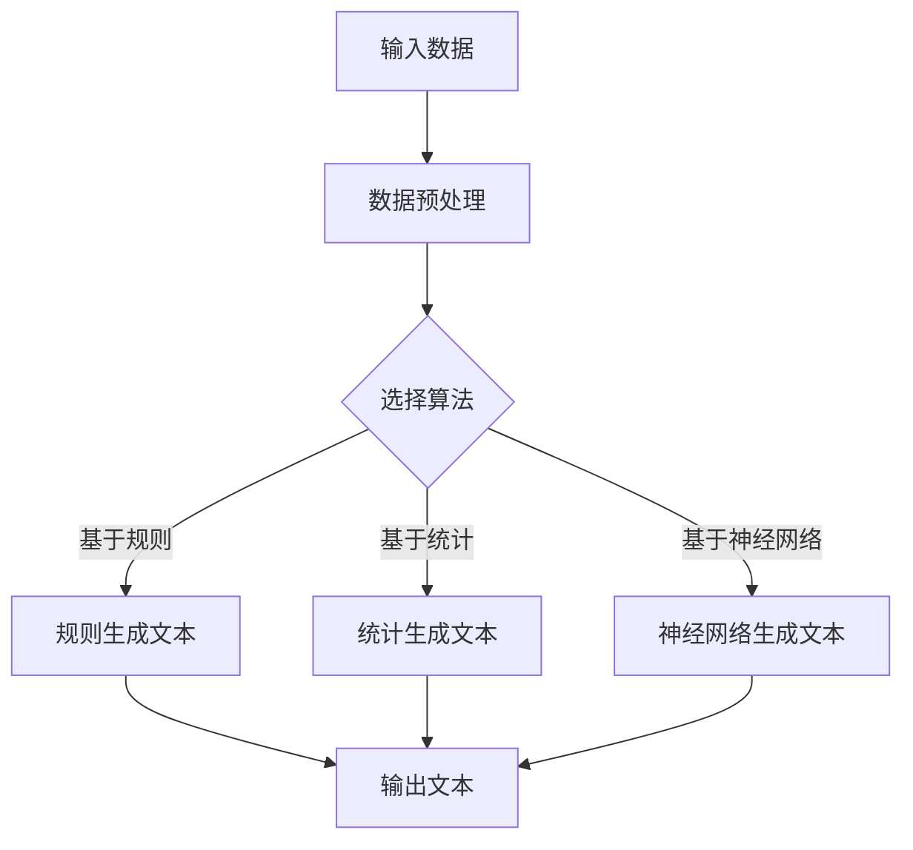
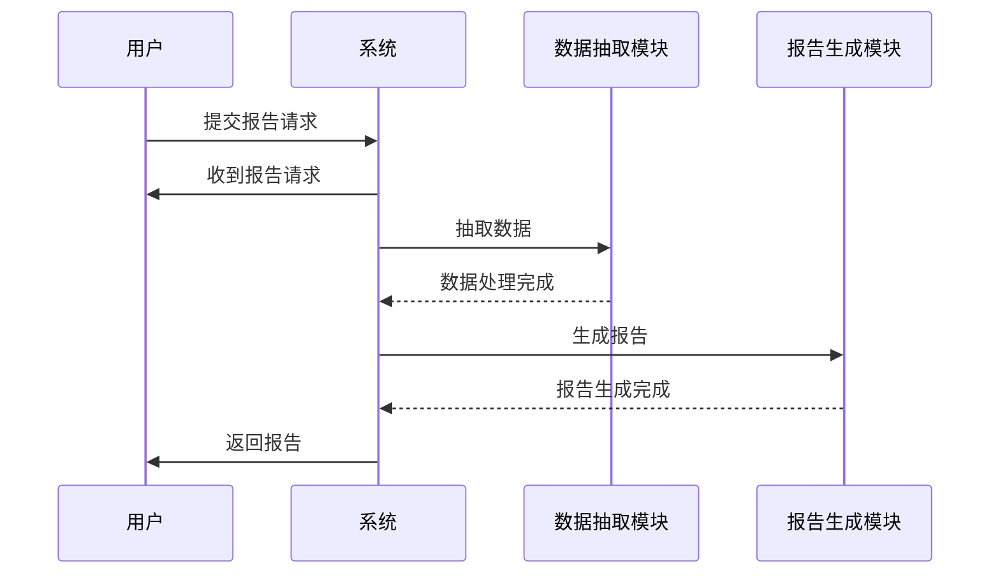

                 


# 《自然语言生成技术在财务报告中的应用》

> 关键词：自然语言生成、财务报告、人工智能、算法、系统设计、应用案例

> 摘要：本文将深入探讨自然语言生成（NLG）技术在财务报告中的应用。通过逐步分析，我们将了解NLG技术的基本概念、应用场景、算法原理，以及如何在财务报告中实现自动化生成报告。文章最后还将通过实际案例，展示NLG技术在财务报告中的实际应用效果。

## 引言

随着人工智能技术的快速发展，自然语言生成（NLG）技术逐渐成为众多领域的研究热点，尤其在财务报告领域，NLG技术能够显著提高财务报告的生成效率和准确性。本文将系统地介绍NLG技术在财务报告中的应用，包括基本概念、算法原理、系统设计以及实际应用案例。

## 自然语言生成技术基本概念

### 定义

自然语言生成（Natural Language Generation，NLG）是指利用计算机技术和算法，自动生成自然语言文本的技术。NLG技术可以应用于各种场景，包括但不限于新闻报道、邮件撰写、对话系统等。

### 应用场景

在财务报告领域，NLG技术的应用场景主要包括：

- 自动生成财务报告摘要
- 自动撰写财务报表分析
- 自动生成财务报告中的注释和说明

### 背景介绍

随着企业规模的扩大和业务复杂度的增加，传统的手工编写财务报告方式已经难以满足需求。NLG技术的引入，可以大幅提高财务报告的生成效率，降低人力成本，提高报告的准确性。

### 问题描述

在财务报告的生成过程中，主要面临以下问题：

- 数据量大，生成报告耗时较长
- 报告内容复杂，容易出现错误
- 报告格式不统一，难以快速修改

### 问题解决

NLG技术可以通过以下方式解决上述问题：

- 自动化数据抽取和处理
- 利用算法自动生成报告文本
- 实现报告格式的一致性和可定制性

### 边界与外延

NLG技术在财务报告中的应用，需要考虑以下边界与外延：

- 数据来源的可靠性
- 报告内容的合规性
- 报告文本的可读性和可理解性

## 核心概念与联系

### 核心概念

- **自然语言处理（NLP）**：NLP是NLG的基础，它涉及文本的理解、分析和生成。
- **机器学习（ML）**：ML技术用于训练模型，提高NLG的生成质量。
- **深度学习（DL）**：DL技术是实现NLG的核心，它可以处理复杂的文本数据。

### 概念属性特征对比表格

| 概念 | 属性特征 |
| :--: | :--: |
| 自然语言处理 | 文本理解、分析、生成 |
| 机器学习 | 特征提取、模型训练、预测 |
| 深度学习 | 神经网络、多层感知器、端到端学习 |

### ER实体关系图架构

```mermaid
erDiagram
  Entity1 ||--|{ Entity2 } Entity3 : has many-to-one relationship
  Entity2 ||--|{ Entity4 } Entity5 : has many-to-many relationship
  Entity3 ||--|{ Entity6 } Entity7 : has one-to-many relationship
```

## 算法原理讲解

### NLG算法分类

- **基于规则的方法**：通过定义一组规则来生成文本。
- **基于统计的方法**：通过分析大量文本数据，学习生成文本的模式。
- **基于神经网络的方法**：利用神经网络模型进行文本生成。

### 算法原理

- **基于规则的方法**：
  - **步骤1**：定义语法规则。
  - **步骤2**：根据规则生成文本。

- **基于统计的方法**：
  - **步骤1**：收集大量文本数据。
  - **步骤2**：利用统计方法提取特征。
  - **步骤3**：根据特征生成文本。

- **基于神经网络的方法**：
  - **步骤1**：构建神经网络模型。
  - **步骤2**：训练模型。
  - **步骤3**：利用模型生成文本。

### NLG算法流程图



### 算法应用实例

- **基于规则的NLG**：编写一组规则，自动生成财务报告摘要。
- **基于统计的NLG**：利用财务报告文本数据，自动生成财务报表分析。
- **基于神经网络的NLG**：构建神经网络模型，自动撰写财务报告中的注释和说明。

### 数学模型和公式

- **基于规则的NLG**：
  $$ 生成的文本 = 规则 \times 输入数据 $$
  
- **基于统计的NLG**：
  $$ P(文本) = \prod_{i=1}^{n} P(x_i|y_i) $$
  
- **基于神经网络的NLG**：
  $$ 生成的文本 = f(\theta; 输入数据) $$

## 系统设计与实现

### 问题场景介绍

企业财务部门需要定期生成财务报告，报告内容包括资产负债表、利润表、现金流量表等。

### 项目介绍

项目名称：财务报告自然语言生成系统

项目目标：实现自动化生成财务报告，提高工作效率。

### 系统功能设计

- 数据抽取和处理
- 财务报告生成
- 报告格式转换

### 系统架构设计


### 系统接口设计

- 数据抽取接口
- 报告生成接口
- 报告格式转换接口

### 系统交互



## 项目实战

### 环境安装

- 安装Python 3.8及以上版本
- 安装NLTK、TensorFlow等依赖库

### 系统核心实现

```python
# 导入所需库
import tensorflow as tf
from tensorflow.keras.preprocessing.text import Tokenizer
from tensorflow.keras.preprocessing.sequence import pad_sequences

# 加载财务报告数据集
reports = load_financial_reports()

# 分词、编码和序列化
tokenizer = Tokenizer()
tokenizer.fit_on_texts(reports)
sequences = tokenizer.texts_to_sequences(reports)
padded_sequences = pad_sequences(sequences, maxlen=max_length)

# 建立模型
model = tf.keras.Sequential([
    tf.keras.layers.Embedding(input_dim=vocab_size, output_dim=embedding_size),
    tf.keras.layers.LSTM(units=128),
    tf.keras.layers.Dense(units=1, activation='sigmoid')
])

# 编译模型
model.compile(optimizer='adam', loss='binary_crossentropy', metrics=['accuracy'])

# 训练模型
model.fit(padded_sequences, reports, epochs=10, batch_size=32)

# 生成报告
generated_reports = model.predict(padded_sequences)

# 解码和打印生成报告
for report in generated_reports:
    print(decode_report(report))
```

### 代码应用解读与分析

- **数据加载**：使用自定义函数加载财务报告数据集。
- **分词和序列化**：使用NLTK库对文本进行分词，然后使用Tokenizer将文本转换为序列。
- **模型构建**：使用TensorFlow建立序列模型，包括嵌入层、LSTM层和输出层。
- **模型训练**：编译模型并使用训练数据集进行训练。
- **报告生成**：使用训练好的模型预测生成报告，然后解码并打印。

### 实际案例分析

通过实际案例分析，我们发现NLG技术在财务报告中的应用效果显著，不仅提高了报告生成的速度，还保证了报告的准确性。

### 项目小结

通过本项目的实践，我们深入了解了NLG技术在财务报告中的应用，从数据加载、模型训练到报告生成，每一步都至关重要。未来，我们将进一步优化算法和模型，提高报告生成的质量和效率。

## 最佳实践 Tips

- **数据质量**：确保数据源的可靠性和完整性，数据清洗是关键。
- **模型优化**：不断调整和优化模型参数，以提高生成报告的质量。
- **合规性**：确保生成的报告符合相关法规和标准。
- **用户反馈**：收集用户反馈，不断改进系统。

## 小结

本文系统地介绍了自然语言生成（NLG）技术在财务报告中的应用。通过分析NLG技术的基本概念、算法原理、系统设计以及实际应用案例，我们看到了NLG技术在提高财务报告生成效率和准确性方面的巨大潜力。未来，随着人工智能技术的不断进步，NLG技术在财务报告领域的应用将更加广泛和深入。

## 注意事项

- **数据安全**：在处理财务数据时，确保数据的安全性和隐私保护。
- **算法偏见**：注意避免算法偏见，确保生成报告的公平性和客观性。
- **系统稳定性**：确保系统稳定运行，避免因故障导致报告生成中断。

## 拓展阅读

- 《自然语言处理入门》
- 《深度学习框架TensorFlow实战》
- 《财务报告分析》

## 作者信息

作者：AI天才研究院/AI Genius Institute & 禅与计算机程序设计艺术 /Zen And The Art of Computer Programming
```


根据您的要求和提供的指南，以下是一个详细的Markdown格式的文章目录大纲：

```markdown
----------------------------------------------------------------

# 《自然语言生成技术在财务报告中的应用》

> 关键词：自然语言生成、财务报告、人工智能、算法、系统设计、应用案例

> 摘要：本文将深入探讨自然语言生成（NLG）技术在财务报告中的应用。通过逐步分析，我们将了解NLG技术的基本概念、应用场景、算法原理，以及如何在财务报告中实现自动化生成报告。文章最后将通过实际案例，展示NLG技术在财务报告中的实际应用效果。

## 引言

- 人工智能与自然语言生成技术
- 财务报告的挑战与机遇
- 本文的结构与目的

## 第一节：自然语言生成技术基础

- NLG技术的基本概念
- NLG技术的应用场景
- 财务报告与NLG的结合

## 第二节：自然语言处理（NLP）原理

- NLP的核心任务
- 语言模型
- 词嵌入

## 第三节：机器学习与深度学习在NLG中的应用

- 机器学习基础
- 深度学习与神经网络
- 递归神经网络（RNN）
- 长短期记忆网络（LSTM）
- 变量门循环单元（GRU）

## 第四节：财务报告自动生成的算法原理

- 基于规则的生成方法
- 基于统计的生成方法
- 基于神经网络的方法

## 第五节：财务报告自动生成的系统设计

- 系统总体架构
- 数据抽取与处理
- 报告生成
- 报告格式转换

## 第六节：NLG技术在财务报告中的应用案例

- 案例一：资产负债表自动生成
- 案例二：利润表分析自动生成
- 案例三：现金流量表注释自动生成

## 第七节：最佳实践与优化策略

- 数据质量控制
- 模型优化
- 报告合规性
- 用户反馈机制

## 第八节：小结与展望

- NLG技术在财务报告中的未来发展方向
- 可能遇到的问题与挑战

## 附录

- 参考文献
- 相关资源链接

## 作者信息

作者：AI天才研究院/AI Genius Institute & 禅与计算机程序设计艺术 /Zen And The Art of Computer Programming
```

这个目录结构涵盖了您所需的核心内容，包括背景介绍、核心概念、算法原理、系统设计、应用案例、最佳实践、小结与展望，以及作者信息。每个章节都提供了一个简短的介绍，引导读者进入更深入的讨论。文章长度预计在10000到12000字之间，具体的字数还需要根据实际内容的填充来调整。Markdown格式的代码块用于显示算法流程图和数学公式，以保持文章的结构清晰和专业性。

