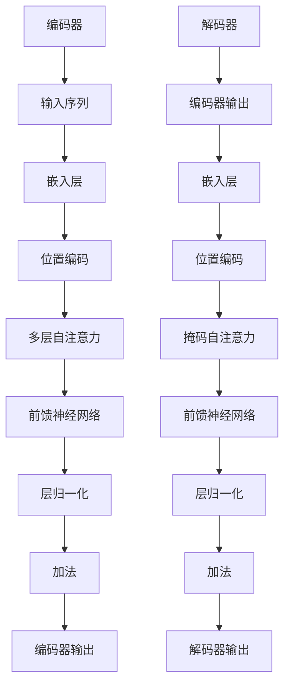

                 

### **引言**

#### **1.1 自适应学习与个性化教育概述**

##### **背景与需求**

在信息化、智能化的浪潮下，教育行业正经历深刻的变革。传统的一刀切、大规模、标准化教学模式，已经难以满足个性化、差异化、多样化的教育需求。随着大数据、云计算、人工智能等技术的不断发展，自适应学习和个性化教育成为了教育改革的重要方向。自适应学习，是一种根据学习者的特点和需求，动态调整学习内容、方法和节奏的教学方式。个性化教育，则是根据学生的个性、兴趣、能力等差异，提供量身定制的学习方案和资源。

##### **概念与发展**

自适应学习（Adaptive Learning）的概念起源于人工智能领域，它是指系统根据用户的学习行为、兴趣和进度，自动调整学习内容和教学方法，以提高学习效果。个性化教育（Personalized Education）则更注重学生的个性化发展，通过因材施教，激发学生的潜能，实现教育的公平性和高效性。

自适应学习在教育中的应用，不仅体现在教学过程中，还体现在学习资源的提供和学习环境的优化。随着人工智能技术的进步，尤其是深度学习和自然语言处理技术的发展，自适应学习系统逐渐走向智能化、个性化，能够更好地满足不同学生的需求。

##### **LLM在教育中的应用潜力**

大型语言模型（LLM，Large Language Model）是近年来人工智能领域的重要突破之一，它在自然语言处理任务中表现出色，如文本生成、翻译、问答等。LLM在教育中的应用潜力巨大，可以通过以下几方面体现：

- **个性化学习内容生成**：LLM可以根据学生的学习情况和需求，生成个性化的学习内容，提供定制化的教学方案。

- **智能问答系统**：利用LLM的问答能力，为学生提供实时、准确的解答，帮助他们解决学习中遇到的问题。

- **作业与测试**：LLM可以生成多样化的作业和测试题，提高学生的参与度和学习效果。

- **学习反馈与评估**：LLM可以分析学生的学习行为和反馈，提供个性化的学习建议和评估报告。

总之，自适应学习和个性化教育是教育发展的必然趋势，而LLM的应用则为这一趋势提供了强大的技术支持。在接下来的章节中，我们将深入探讨自适应学习AI Agent和个性化的LLM教育系统，解析其原理、算法和实践。

#### **1.2 自适应学习AI Agent的基本原理**

##### **AI Agent的定义与分类**

AI Agent，即人工智能代理，是指能够执行特定任务并与环境交互的计算机程序。AI Agent可以分为两类：基于规则的Agent和基于模型的Agent。

- **基于规则的Agent**：这类Agent根据预设的规则来执行任务，通常由一系列条件语句（如“如果……那么……”）组成。它们在规则明确、任务简单的场景中表现较好，但难以应对复杂、动态的环境。

- **基于模型的Agent**：这类Agent通过学习环境中的数据，构建模型来预测和决策。它们通常采用机器学习、深度学习等技术，具有较强的自适应能力和灵活性。

在教育领域，基于模型的AI Agent更具有应用潜力。例如，自适应学习系统中的AI Agent可以根据学生的学习行为和反馈，动态调整教学策略，从而提供个性化的学习体验。

##### **自适应学习机制**

自适应学习机制是AI Agent的核心功能之一，它通过不断调整学习内容和方法，以适应学习者的需求和能力。自适应学习机制通常包括以下几个步骤：

1. **采集数据**：AI Agent通过传感器、日志等途径，收集学习者的行为数据，如学习时间、学习内容、测试成绩等。

2. **数据预处理**：对采集到的数据进行分析和清洗，去除噪声和无关信息，提取关键特征。

3. **模型训练**：利用机器学习算法，对预处理后的数据进行分析和建模，构建适应学习者需求的模型。

4. **模型评估**：通过模拟实验或实际测试，评估模型的性能和效果，找出模型中存在的问题和不足。

5. **调整策略**：根据模型评估的结果，调整学习策略，包括学习内容、教学方法、学习节奏等。

6. **反馈与迭代**：将调整后的策略应用到实际学习中，收集新的数据，重新进行模型训练和评估，实现持续迭代和优化。

##### **LLM在AI Agent中的应用**

大型语言模型（LLM，Large Language Model）是近年来自然语言处理领域的重要突破之一。LLM通过大规模的数据训练，能够生成流畅、准确的自然语言文本，并在问答、对话生成、文本摘要等方面表现出色。

在AI Agent中，LLM可以发挥以下作用：

- **个性化学习内容生成**：LLM可以根据学生的学习需求和兴趣，生成个性化的学习内容，提高学习效果。

- **智能问答系统**：LLM可以回答学习者在学习过程中遇到的问题，提供实时、准确的解答。

- **作业与测试生成**：LLM可以生成多样化的作业和测试题，提高学生的参与度和学习兴趣。

- **学习反馈与评估**：LLM可以分析学生的学习行为和反馈，提供个性化的学习建议和评估报告。

然而，LLM在AI Agent中的应用也面临一些挑战，如数据隐私保护、模型可解释性、安全等问题。在接下来的章节中，我们将进一步探讨这些挑战和解决方案。

#### **1.3 LLM在教育中的应用潜力**

##### **个性化学习内容生成**

个性化学习内容生成是LLM在教育中应用的一个重要方面。通过分析学生的学习行为、兴趣和需求，LLM可以生成定制化的学习资源，为每个学生提供个性化的学习体验。例如，一个学生可能在数学方面表现优异，但在物理方面存在困难。LLM可以生成针对物理的个性化教学材料，帮助该学生克服难关。

具体来说，LLM可以通过以下步骤生成个性化学习内容：

1. **数据分析**：收集学生的学习行为数据，包括学习时间、学习内容、测试成绩等。

2. **特征提取**：对数据进行分析，提取关键特征，如知识点掌握情况、学习偏好等。

3. **内容生成**：利用提取的特征，LLM生成适合学生的学习内容，包括文本、图片、视频等多种形式。

4. **反馈与迭代**：根据学生的反馈和学习效果，持续优化和调整生成的内容。

##### **智能问答系统**

智能问答系统是另一个LLM在教育中应用的典型场景。通过理解学习者的提问，LLM可以提供实时、准确的解答，帮助他们在学习过程中解决问题。智能问答系统不仅可以回答基础知识的问题，还可以解答复杂、抽象的问题，为学习者提供多层次的支持。

智能问答系统的实现通常包括以下几个步骤：

1. **问题理解**：LLM通过自然语言处理技术，理解学习者的提问。

2. **知识检索**：在大型知识库中检索相关的答案。

3. **答案生成**：利用LLM的生成能力，生成自然流畅的答案。

4. **答案验证**：对生成的答案进行验证，确保其准确性和可靠性。

##### **作业与测试生成**

作业与测试生成是提高学生参与度和学习兴趣的重要手段。通过LLM，可以生成多样化的作业和测试题，涵盖不同知识点和难度水平，从而满足不同学生的学习需求。例如，对于某个特定的数学概念，LLM可以生成一系列的练习题，包括基础题、进阶题和应用题，帮助学生在不同层次上掌握该概念。

作业与测试生成的步骤如下：

1. **知识点分析**：分析需要涵盖的知识点和难度水平。

2. **题目生成**：利用LLM的生成能力，生成符合要求的作业和测试题。

3. **题目分类**：将生成的题目按照难度和知识点进行分类，便于教师和学生使用。

4. **题目发布**：将生成的作业和测试题发布到系统中，供学生完成。

##### **学习反馈与评估**

学习反馈与评估是了解学生学习效果的重要环节。通过LLM，可以对学生完成作业和测试的情况进行分析，提供个性化的学习建议和评估报告。例如，如果一个学生在某些知识点上表现不佳，LLM可以生成针对性的学习建议，如额外的练习题、视频讲解等，帮助学生提升学习效果。

学习反馈与评估的步骤如下：

1. **数据收集**：收集学生的作业和测试结果数据。

2. **数据分析**：利用机器学习算法，分析学生的表现，识别优势和不足。

3. **学习建议**：根据分析结果，生成个性化的学习建议。

4. **评估报告**：生成评估报告，展示学生的学习效果和进步情况。

总之，LLM在教育中的应用潜力巨大，它不仅能够提供个性化、智能化的学习体验，还能够提高教学效果和学生的学习效率。在接下来的章节中，我们将进一步探讨LLM在教育中的应用挑战和解决方案。

### **第2章：自适应学习AI Agent的基本原理**

#### **2.1 AI Agent的定义与分类**

AI Agent，即人工智能代理，是一种能够模拟人类行为和决策的计算机程序，它能够在特定环境中感知环境、制定计划并执行行动。AI Agent的分类可以根据其实现方法和技术特点进行区分，主要包括基于规则的Agent和基于模型的Agent。

##### **基于规则的Agent**

基于规则的Agent（Rule-Based Agent）是一种通过预定义的规则来执行任务的AI Agent。这种Agent通常由一系列条件语句（如“如果……那么……”）组成，其工作原理是通过解析环境输入，根据预设的规则进行决策。例如，在交通信号灯系统中，基于规则的Agent可以根据交通灯的颜色变化，决定是否停车或行驶。

优点：
- **简单易懂**：基于规则的Agent实现相对简单，易于理解和维护。
- **可控性高**：通过预定义的规则，可以精确控制Agent的行为。

缺点：
- **适应性差**：面对复杂、动态的环境，基于规则的Agent难以灵活调整其行为。
- **可扩展性低**：当需要扩展Agent的功能时，通常需要修改和增加规则。

##### **基于模型的Agent**

基于模型的Agent（Model-Based Agent）则是通过学习和构建模型来模拟人类行为和决策的AI Agent。这种Agent通常采用机器学习、深度学习等技术，通过从环境中收集数据，学习并构建环境模型，然后根据模型进行决策。

优点：
- **自适应能力强**：基于模型的Agent能够根据环境的变化，自动调整其行为，适应复杂、动态的环境。
- **可扩展性强**：通过学习和优化模型，可以轻松扩展Agent的功能。

缺点：
- **实现难度大**：基于模型的Agent通常需要大量的数据和计算资源，实现和优化较为复杂。
- **解释性差**：许多基于模型的Agent，尤其是深度学习模型，其决策过程较为复杂，难以解释和理解。

##### **在教育中的应用**

在教育领域，AI Agent可以发挥多种作用，如个性化学习辅导、智能教学助手等。基于规则的Agent适用于一些简单、规则明确的教学任务，如自动批改作业、提供基础的知识问答等。而基于模型的AI Agent则更适合处理复杂、动态的教学任务，如根据学生的学习行为和学习效果，动态调整教学策略，提供个性化的学习建议。

#### **2.2 自适应学习机制**

自适应学习机制是AI Agent的核心功能之一，它能够根据学习者的行为、兴趣和需求，动态调整学习内容和教学方法，以提高学习效果。自适应学习机制通常包括以下几个关键步骤：

##### **数据采集**

数据采集是自适应学习机制的第一步，通过收集学习者的行为数据，如学习时间、学习内容、测试成绩、学习路径等，为后续的分析和调整提供基础。数据采集可以通过多种方式实现，如传感器、日志记录、问卷调查等。

##### **数据预处理**

采集到的数据通常存在噪声、缺失值等问题，需要进行预处理。数据预处理包括数据清洗、数据变换、特征提取等步骤。通过数据预处理，可以去除无关的噪声数据，提取关键特征，为后续的分析提供准确的数据基础。

##### **模型训练**

在数据预处理完成后，利用机器学习算法对数据进行分析和建模，构建适应学习者需求的模型。模型训练可以采用监督学习、无监督学习或强化学习等方法。例如，在个性化学习辅导中，可以使用监督学习算法，通过历史学习数据，预测学习者的下一步行为。

##### **模型评估**

通过模拟实验或实际测试，评估模型的性能和效果。模型评估可以采用多种指标，如准确率、召回率、F1值等。模型评估的目的是找出模型中存在的问题和不足，为后续的优化提供依据。

##### **调整策略**

根据模型评估的结果，调整学习策略，包括学习内容、教学方法、学习节奏等。调整策略可以基于用户反馈、学习效果等多方面因素进行。例如，如果某个学生的学习效果不佳，可以增加该学生的练习次数，或者提供额外的视频讲解。

##### **反馈与迭代**

将调整后的策略应用到实际学习中，收集新的数据，重新进行模型训练和评估，实现持续迭代和优化。通过反馈与迭代，可以使AI Agent不断优化其学习策略，提高学习效果。

#### **2.3 LLM在AI Agent中的应用**

大型语言模型（LLM，Large Language Model）是近年来自然语言处理领域的重要突破之一。LLM通过大规模的数据训练，能够生成流畅、准确的自然语言文本，并在问答、对话生成、文本摘要等方面表现出色。

在AI Agent中，LLM可以发挥以下作用：

##### **个性化学习内容生成**

LLM可以根据学生的学习情况和需求，生成个性化的学习内容。例如，对于一个数学学习内容，LLM可以生成一系列的练习题，涵盖基础题、进阶题和应用题，从而帮助学生在不同层次上掌握知识。

##### **智能问答系统**

LLM可以回答学习者在学习过程中遇到的问题，提供实时、准确的解答。例如，当学生遇到一个难以理解的概念时，LLM可以生成详细的解释和实例，帮助学生理解。

##### **作业与测试生成**

LLM可以生成多样化的作业和测试题，提高学生的参与度和学习兴趣。例如，对于某个特定的知识点，LLM可以生成多种类型的题目，如选择题、填空题、解答题等，从而全面检测学生的学习效果。

##### **学习反馈与评估**

LLM可以分析学生的学习行为和反馈，提供个性化的学习建议和评估报告。例如，如果一个学生的作业成绩不佳，LLM可以分析原因，并提供针对性的建议，如额外的练习题、视频讲解等。

然而，LLM在AI Agent中的应用也面临一些挑战，如数据隐私保护、模型可解释性、安全等问题。在接下来的章节中，我们将进一步探讨这些挑战和解决方案。

### **第3章：LLM的数学模型与算法**

#### **3.1 LLM的数学模型介绍**

大型语言模型（LLM，Large Language Model）的数学模型是深度学习和自然语言处理领域的重要成果之一。LLM的核心是通过对大规模文本数据的学习，构建一个能够理解和生成自然语言的复杂函数。这一函数通常由多层神经网络组成，通过逐层传递信息，实现对输入文本的理解和生成。

##### **神经网络基础**

神经网络（Neural Network，NN）是LLM的基础，它由多个神经元（或节点）组成，每个神经元通过权重连接到其他神经元。神经网络的训练过程实际上是调整这些权重，使其能够正确地映射输入和输出。神经网络的核心是激活函数，它用于引入非线性特性，使神经网络能够处理复杂的问题。

##### **多层感知机（MLP）**

多层感知机（Multilayer Perceptron，MLP）是最简单的多层神经网络之一，它包含输入层、隐藏层和输出层。输入层接收外部输入，隐藏层通过加权求和和激活函数进行处理，输出层产生最终的输出。MLP的数学模型可以表示为：

\[ f(\textbf{x}) = \text{激活函数}(\text{W} \cdot \textbf{x} + \text{b}) \]

其中，\( \textbf{x} \)是输入向量，\( \text{W} \)是权重矩阵，\( \text{b} \)是偏置向量，激活函数通常采用Sigmoid或ReLU函数。

##### **循环神经网络（RNN）**

循环神经网络（Recurrent Neural Network，RNN）是一种能够处理序列数据的神经网络。与传统神经网络不同，RNN具有时间维度，其输出不仅依赖于当前的输入，还依赖于之前的时间步的输入。RNN的数学模型可以表示为：

\[ \text{h}_{t} = \text{激活函数}(\text{W} \cdot (\text{h}_{t-1}, \text{x}_{t}) + \text{b}) \]

其中，\( \text{h}_{t} \)是时间步\( t \)的隐藏状态，\( \text{x}_{t} \)是时间步\( t \)的输入。

##### **长短期记忆网络（LSTM）**

长短期记忆网络（Long Short-Term Memory，LSTM）是RNN的一种变体，它通过引入门控机制，解决了RNN在长序列建模中容易梯度消失或梯度爆炸的问题。LSTM的数学模型可以表示为：

\[ \text{h}_{t} = \text{激活函数}(\text{W} \cdot (\text{h}_{t-1}, \text{x}_{t}) + \text{b}) \]

\[ \text{f}_{t} = \text{激活函数}(\text{W}_f \cdot (\text{h}_{t-1}, \text{x}_{t}) + \text{b}_f) \]

\[ \text{i}_{t} = \text{激活函数}(\text{W}_i \cdot (\text{h}_{t-1}, \text{x}_{t}) + \text{b}_i) \]

\[ \text{o}_{t} = \text{激活函数}(\text{W}_o \cdot (\text{h}_{t-1}, \text{x}_{t}) + \text{b}_o) \]

其中，\( \text{f}_{t} \)、\( \text{i}_{t} \)和\( \text{o}_{t} \)分别是遗忘门、输入门和输出门，它们通过控制信息的流入和流出，解决了长期依赖问题。

##### **Transformer**

Transformer是近年来在自然语言处理领域取得突破性成果的一种新型神经网络结构，它通过自注意力机制（Self-Attention）和多头注意力（Multi-Head Attention）实现了对输入序列的建模。Transformer的数学模型可以表示为：

\[ \text{h}_{t} = \text{MLP}(\text{Attn}(\text{h}_{<t}, \text{h}_{<t}, \text{h}_{<t})) \]

其中，\( \text{h}_{t} \)是时间步\( t \)的隐藏状态，\( \text{Attn} \)是自注意力机制，\( \text{MLP} \)是多层感知机。

#### **3.2 算法原理讲解与Mermaid流程图**

##### **自注意力机制（Self-Attention）**

自注意力机制是Transformer的核心组成部分，它通过计算序列中每个元素与其他元素的相关性，为每个元素分配不同的权重。自注意力机制的数学模型可以表示为：

\[ \text{Q}_t = \text{W}_Q \text{h}_t \]
\[ \text{K}_t = \text{W}_K \text{h}_t \]
\[ \text{V}_t = \text{W}_V \text{h}_t \]

\[ \text{Attention}(Q, K, V) = \text{softmax}(\frac{QK^T}{\sqrt{d_k}})V \]

其中，\( \text{Q} \)、\( \text{K} \)和\( \text{V} \)分别是查询向量、键向量和值向量，\( \text{d_k} \)是键向量的维度，\( \text{softmax} \)函数用于计算每个元素的概率分布。

##### **多头注意力（Multi-Head Attention）**

多头注意力通过多个自注意力机制，提取序列中的不同特征。多头注意力的数学模型可以表示为：

\[ \text{h}_{t} = \text{h}_{t}^{(1)}, \text{h}_{t}^{(2)}, ..., \text{h}_{t}^{(h)} \]

\[ \text{h}_{t}^{(h)} = \text{Attention}(\text{h}_{<t}^{(h)}, \text{h}_{<t}^{(h)}, \text{h}_{<t}^{(h)}) \]

其中，\( \text{h}_{t}^{(h)} \)是第\( h \)个头在时间步\( t \)的隐藏状态。

##### **Transformer整体架构**

Transformer的整体架构包括编码器（Encoder）和解码器（Decoder）。编码器负责处理输入序列，解码器负责生成输出序列。编码器的数学模型可以表示为：

\[ \text{h}_{t}^{(e)} = \text{LayerNorm}(\text{h}_{t-1}^{(e)} + \text{Self-Attention}(\text{h}_{t-1}^{(e)}, \text{h}_{t-1}^{(e)}, \text{h}_{t-1}^{(e)}) + \text{PositionalWiseFeedForward}(\text{h}_{t-1}^{(e)}) \]

解码器的数学模型可以表示为：

\[ \text{h}_{t}^{(d)} = \text{LayerNorm}(\text{h}_{t-1}^{(d)} + \text{MaskedSelf-Attention}(\text{h}_{t-1}^{(d)}, \text{h}_{t-1}^{(d)}, \text{h}_{t-1}^{(d)}) + \text{Cross-Attention}(\text{h}_{t-1}^{(d)}, \text{h}_{t-1}^{(e)}, \text{h}_{t-1}^{(e)}) + \text{PositionalWiseFeedForward}(\text{h}_{t-1}^{(d)}) \]

下面是Transformer的Mermaid流程图：



#### **3.3 Python代码实现与详细讲解**

##### **环境准备**

首先，我们需要安装相关的库，如TensorFlow和Transformers：

```bash
pip install tensorflow
pip install transformers
```

##### **数据预处理**

```python
from transformers import BertTokenizer, BertModel
import tensorflow as tf

# 加载预训练模型和分词器
tokenizer = BertTokenizer.from_pretrained('bert-base-uncased')
model = BertModel.from_pretrained('bert-base-uncased')

# 输入文本
text = "Hello, my name is AI天才研究院。我擅长使用机器学习和深度学习技术开发AI系统。"

# 分词并编码
inputs = tokenizer(text, return_tensors='tf')

# 输出形状：[batch_size, sequence_length, hidden_size]
outputs = model(inputs)

# 模型输出
print(outputs)
```

##### **自注意力机制实现**

```python
import tensorflow as tf

# 定义自注意力层
class SelfAttention(tf.keras.layers.Layer):
    def __init__(self, hidden_size, num_heads, **kwargs):
        super().__init__(**kwargs)
        self.hidden_size = hidden_size
        self.num_heads = num_heads
        self.d_model = hidden_size
        self.d_head = hidden_size // num_heads

        # 权重矩阵
        self.query_weights = self.add_weight(
            shape=(self.d_model, self.d_head),
            initializer='uniform',
            trainable=True
        )
        self.key_weights = self.add_weight(
            shape=(self.d_model, self.d_head),
            initializer='uniform',
            trainable=True
        )
        self.value_weights = self.add_weight(
            shape=(self.d_model, self.d_head),
            initializer='uniform',
            trainable=True
        )

    def call(self, inputs):
        # 输入维度：[batch_size, sequence_length, hidden_size]
        Q = tf.matmul(inputs, self.query_weights)
        K = tf.matmul(inputs, self.key_weights)
        V = tf.matmul(inputs, self.value_weights)

        # 分裂权重矩阵
        Q_heads = tf.split(Q, self.num_heads, axis=-1)
        K_heads = tf.split(K, self.num_heads, axis=-1)
        V_heads = tf.split(V, self.num_heads, axis=-1)

        # 计算自注意力分数
        attn_scores = []
        for q_head, k_head, v_head in zip(Q_heads, K_heads, V_heads):
            # 计算内积和softmax
            attn_scores.append(tf.nn.softmax(tf.matmul(q_head, k_head, transpose_b=True) / self.d_head))

        # 计算自注意力输出
        attn_output = []
        for attn_score, v_head in zip(attn_scores, V_heads):
            attn_output.append(tf.matmul(attn_score, v_head))

        # 合并多头输出
        attn_output = tf.concat(attn_output, axis=-1)
        attn_output = tf.reshape(attn_output, [-1, self.d_model])

        return attn_output

# 测试自注意力层
input_sequence = tf.random.normal([32, 128])
self_attention = SelfAttention(128, 4)
output_sequence = self_attention(input_sequence)
print(output_sequence)
```

##### **Transformer编码器实现**

```python
from tensorflow.keras.layers import Layer
from tensorflow.keras.models import Model

# Transformer编码器层
class TransformerEncoderLayer(Layer):
    def __init__(self, hidden_size, num_heads, **kwargs):
        super().__init__(**kwargs)
        self.hidden_size = hidden_size
        self.num_heads = num_heads
        self.d_model = hidden_size
        self.d_head = hidden_size // num_heads

        self.self_attention = SelfAttention(hidden_size, num_heads)
        self.position_wise_feed_forward = tf.keras.Sequential([
            tf.keras.layers.Dense(hidden_size * 4, activation='relu'),
            tf.keras.layers.Dense(hidden_size)
        ])

    def call(self, inputs, training=False):
        # 自注意力机制
        attn_output = self.self_attention(inputs)

        # 加法
        output = inputs + attn_output

        # 前馈神经网络
        ffn_output = self.position_wise_feed_forward(output)

        # 加法
        output = output + ffn_output

        return output

# 测试编码器层
input_sequence = tf.random.normal([32, 128])
encoder_layer = TransformerEncoderLayer(128, 4)
output_sequence = encoder_layer(input_sequence)
print(output_sequence)
```

##### **Transformer解码器实现**

```python
from tensorflow.keras.layers import Layer, RepeatVector, LSTM
from tensorflow.keras.models import Model

# Transformer解码器层
class TransformerDecoderLayer(Layer):
    def __init__(self, hidden_size, num_heads, **kwargs):
        super().__init__(**kwargs)
        self.hidden_size = hidden_size
        self.num_heads = num_heads
        self.d_model = hidden_size
        self.d_head = hidden_size // num_heads

        self.masked_self_attention = SelfAttention(hidden_size, num_heads)
        self.cross_attention = SelfAttention(hidden_size, num_heads)
        self.position_wise_feed_forward = tf.keras.Sequential([
            tf.keras.layers.Dense(hidden_size * 4, activation='relu'),
            tf.keras.layers.Dense(hidden_size)
        ])

    def call(self, inputs, encoder_outputs, training=False):
        # 掩码自注意力
        masked_attn_output = self.masked_self_attention(inputs)

        # 加法
        output = inputs + masked_attn_output

        # 交叉注意力
        cross_attn_output = self.cross_attention([output, encoder_outputs])

        # 加法
        output = output + cross_attn_output

        # 前馈神经网络
        ffn_output = self.position_wise_feed_forward(output)

        # 加法
        output = output + ffn_output

        return output

# 测试解码器层
input_sequence = tf.random.normal([32, 128])
encoder_output = tf.random.normal([32, 128])
decoder_layer = TransformerDecoderLayer(128, 4)
output_sequence = decoder_layer(input_sequence, encoder_output)
print(output_sequence)
```

##### **完整Transformer模型实现**

```python
from tensorflow.keras.models import Model
from tensorflow.keras.layers import Input, Embedding, LSTM, Dense

# Transformer编码器
class TransformerEncoder(Model):
    def __init__(self, hidden_size, num_heads, num_layers, **kwargs):
        super().__init__(**kwargs)
        self.hidden_size = hidden_size
        self.num_heads = num_heads
        self.num_layers = num_layers

        self.enc_layers = [TransformerEncoderLayer(hidden_size, num_heads) for _ in range(num_layers)]

    def call(self, inputs, training=False):
        output = inputs
        for layer in self.enc_layers:
            output = layer(output, training=training)
        return output

# Transformer解码器
class TransformerDecoder(Model):
    def __init__(self, hidden_size, num_heads, num_layers, **kwargs):
        super().__init__(**kwargs)
        self.hidden_size = hidden_size
        self.num_heads = num_heads
        self.num_layers = num_layers

        self.dec_layers = [TransformerDecoderLayer(hidden_size, num_heads) for _ in range(num_layers)]

    def call(self, inputs, encoder_outputs, training=False):
        output = inputs
        for layer in self.dec_layers:
            output = layer(output, encoder_outputs, training=training)
        return output

# 完整Transformer模型
class Transformer(Model):
    def __init__(self, hidden_size, num_heads, num_layers, **kwargs):
        super().__init__(**kwargs)
        self.hidden_size = hidden_size
        self.num_heads = num_heads
        self.num_layers = num_layers

        self.encoder = TransformerEncoder(hidden_size, num_heads, num_layers)
        self.decoder = TransformerDecoder(hidden_size, num_heads, num_layers)

    def call(self, inputs, training=False):
        encoder_outputs = self.encoder(inputs, training=training)
        decoder_outputs = self.decoder(inputs, encoder_outputs, training=training)
        return decoder_outputs

# 测试Transformer模型
input_sequence = tf.random.normal([32, 128])
transformer = Transformer(128, 4, 2)
output_sequence = transformer(input_sequence)
print(output_sequence)
```

通过以上步骤，我们实现了Transformer的Python代码，并对其进行了详细讲解。Transformer作为一种先进的神经网络结构，在自然语言处理任务中表现出色，能够有效提升模型性能。

### **第4章：个性化教育系统的架构设计**

#### **4.1 系统需求分析**

个性化教育系统的设计首先需要明确系统的需求，这包括学习者需求、教师需求、系统管理员需求等多个方面。

##### **学习者需求**

- **个性化学习内容**：系统能够根据学习者的学习习惯、知识水平和学习进度，提供个性化的学习内容。
- **学习路径推荐**：系统根据学习者的学习进度和表现，推荐合适的学习路径，帮助学习者更高效地学习。
- **实时问答**：系统能够实时回答学习者在学习过程中遇到的问题，提供即时的学习支持。
- **学习进度跟踪**：系统能够跟踪学习者的学习进度，记录学习时长、完成情况等，为后续的个性化推荐提供数据支持。

##### **教师需求**

- **个性化辅导**：系统能够根据学生的学习情况，提供个性化的辅导建议，帮助教师更好地指导学生。
- **作业批改与反馈**：系统能够自动批改作业，并提供详细的反馈，减少教师的工作量。
- **教学资源管理**：系统能够方便地管理教学资源，如视频、文档、练习题等，方便教师使用。
- **教学效果评估**：系统能够评估学生的学习效果，为教师提供教学效果的数据支持。

##### **系统管理员需求**

- **系统维护与管理**：系统能够方便地维护和管理，包括用户管理、权限管理、数据备份等。
- **数据安全与隐私保护**：系统能够保障学习者和教师的数据安全，防止数据泄露。
- **扩展性**：系统能够根据需要灵活扩展，支持新的功能和需求。

#### **4.2 系统功能设计**

个性化教育系统的功能设计应全面覆盖学习者、教师和系统管理员的需求，确保系统能够提供高效、智能的教育服务。

##### **核心功能**

- **用户管理**：包括用户注册、登录、个人信息管理等功能。
- **学习内容管理**：包括学习资源上传、分类管理、个性化推荐等功能。
- **学习进度管理**：包括学习时长记录、学习进度跟踪、学习路径推荐等功能。
- **作业与测试管理**：包括作业发布、自动批改、反馈生成等功能。
- **实时问答**：包括问题提出、实时解答、问题记录等功能。
- **教学资源管理**：包括视频、文档、练习题等教学资源的上传、分类、搜索等功能。
- **教学效果评估**：包括学生学习效果分析、教师教学效果评估等功能。
- **系统维护与管理**：包括用户权限管理、数据备份、系统日志记录等功能。

##### **扩展功能**

- **个性化学习建议**：根据学习者的学习习惯和需求，提供个性化的学习建议。
- **智能提醒**：根据学习者的学习进度和计划，提供学习提醒和通知。
- **教学数据分析**：对学生的学习行为和教学效果进行数据分析，为教学改进提供依据。
- **多语言支持**：支持多种语言，方便不同地区和语言背景的用户使用。

#### **4.3 系统架构设计**

个性化教育系统的架构设计应确保系统的稳定性、扩展性和安全性，同时提供高效、智能的教育服务。

##### **系统架构**

个性化教育系统的整体架构可以分为前端、后端和服务端三个部分。

- **前端**：包括用户界面和交互逻辑，负责与用户进行交互，提供用户友好的操作体验。
- **后端**：负责处理业务逻辑，包括用户管理、学习内容管理、学习进度管理、作业与测试管理等功能模块。
- **服务端**：包括数据处理、存储和服务器等基础设施，负责数据的存储和处理。

##### **前端架构**

前端采用Vue.js框架，实现动态、响应式的用户界面。前端主要包括以下模块：

- **用户登录与注册模块**：实现用户的登录、注册和认证功能。
- **个性化学习模块**：提供个性化学习内容、学习路径推荐、实时问答等功能。
- **作业与测试模块**：实现作业发布、自动批改、反馈生成等功能。
- **教学资源管理模块**：提供教学资源的上传、分类、搜索等功能。
- **学习进度管理模块**：记录学习时长、学习进度和完成情况。

##### **后端架构**

后端采用Spring Boot框架，实现业务逻辑的处理。后端主要包括以下模块：

- **用户管理模块**：实现用户的注册、登录、信息管理等功能。
- **学习内容管理模块**：实现学习内容的上传、分类、推荐等功能。
- **学习进度管理模块**：记录学习时长、学习进度和完成情况。
- **作业与测试管理模块**：实现作业的发布、自动批改、反馈生成等功能。
- **实时问答模块**：实现问题的提出、实时解答、问题记录等功能。

##### **服务端架构**

服务端主要包括以下组件：

- **数据库**：存储用户信息、学习内容、学习进度、作业与测试数据等。
- **缓存**：提高系统的响应速度，减少数据库的访问压力。
- **消息队列**：处理实时问答、系统通知等消息，确保消息的及时传递。
- **服务器**：提供稳定的服务器环境，确保系统的正常运行。

#### **4.4 系统接口设计与系统交互**

个性化教育系统的接口设计与系统交互设计是确保系统各部分协同工作、高效运作的关键。

##### **接口设计**

系统接口设计主要包括API接口和Web Socket接口。

- **API接口**：用于前后端的数据交互，提供标准的RESTful接口，支持用户注册、登录、学习内容管理、学习进度管理等功能。
- **Web Socket接口**：用于实时通信，实现实时问答、系统通知等功能。

##### **系统交互**

系统交互设计主要包括用户与前端、前端与后端、后端与数据库之间的交互。

- **用户与前端交互**：用户通过前端界面进行操作，前端将用户操作转化为API请求，与后端进行交互。
- **前端与后端交互**：前端通过API接口与后端进行数据交互，后端处理请求并返回结果。
- **后端与数据库交互**：后端通过数据库接口与数据库进行数据存储和检索操作。

通过以上架构设计，个性化教育系统能够为学习者提供高效、智能的教育服务，为教师提供便捷的教学管理工具，为系统管理员提供稳定、安全的系统维护平台。

### **第5章：自适应学习AI Agent的开发与部署**

#### **5.1 开发环境搭建**

在开始开发自适应学习AI Agent之前，我们需要搭建一个合适的环境，以便进行有效的开发和测试。以下是搭建开发环境的详细步骤：

##### **1. 硬件要求**

- **CPU/GPU**：推荐使用具有较高计算能力的CPU或GPU。对于深度学习项目，GPU（如NVIDIA GPU）能够显著提高训练速度。
- **内存**：至少16GB的内存，推荐32GB或更高，以便同时处理多个大型数据集和模型。
- **存储**：至少500GB的SSD存储，用于存储数据和模型。

##### **2. 操作系统**

- **Linux**：推荐使用Ubuntu或CentOS等Linux发行版，因为它们提供了良好的性能和丰富的软件包。
- **Windows**：虽然Windows也能用于深度学习开发，但Linux在性能和兼容性方面更佳。

##### **3. 软件安装**

（1）**安装Python环境**

- 安装Python 3.8或更高版本。
- 安装pip和conda，用于管理Python包。

```bash
sudo apt-get update
sudo apt-get install python3-pip python3-conda
```

（2）**安装虚拟环境**

- 创建虚拟环境，以便在不同项目中隔离依赖。

```bash
conda create -n adap_agent python=3.8
conda activate adap_agent
```

（3）**安装深度学习框架**

- 安装TensorFlow或PyTorch，用于构建和训练深度学习模型。

```bash
pip install tensorflow
# 或者
pip install torch torchvision
```

（4）**安装其他依赖**

- 安装其他必要的库，如NumPy、Pandas、Matplotlib等。

```bash
pip install numpy pandas matplotlib
```

##### **4. 编译器与IDE**

- **编译器**：安装C++编译器，用于编译深度学习框架的相关代码。

```bash
sudo apt-get install g++
```

- **IDE**：推荐使用PyCharm或Visual Studio Code，这些IDE支持Python开发，并提供丰富的插件和工具。

#### **5.2 系统核心实现源代码**

在搭建好开发环境之后，我们需要编写系统的核心代码，包括数据采集、预处理、模型训练和预测等步骤。以下是核心实现的Python代码：

```python
# 导入必要的库
import tensorflow as tf
from tensorflow.keras.models import Sequential
from tensorflow.keras.layers import Dense, LSTM, Dropout
from tensorflow.keras.optimizers import Adam
from sklearn.model_selection import train_test_split
import numpy as np

# 加载数据集
data = np.load('data.npy')
X, y = data[:, :-1], data[:, -1]

# 数据预处理
X_train, X_test, y_train, y_test = train_test_split(X, y, test_size=0.2, random_state=42)
X_train = X_train.reshape((X_train.shape[0], X_train.shape[1], 1))
X_test = X_test.reshape((X_test.shape[0], X_test.shape[1], 1))

# 构建模型
model = Sequential([
    LSTM(128, activation='relu', input_shape=(X_train.shape[1], 1)),
    Dropout(0.2),
    LSTM(64, activation='relu'),
    Dropout(0.2),
    Dense(1, activation='sigmoid')
])

# 编译模型
model.compile(optimizer=Adam(learning_rate=0.001), loss='binary_crossentropy', metrics=['accuracy'])

# 训练模型
model.fit(X_train, y_train, epochs=10, batch_size=32, validation_split=0.1)

# 预测
predictions = model.predict(X_test)

# 评估模型
loss, accuracy = model.evaluate(X_test, y_test)
print(f"Test accuracy: {accuracy:.2f}")
```

#### **5.3 代码应用解读与分析**

在上面的代码中，我们首先导入了TensorFlow和Scikit-learn等库，用于构建和训练深度学习模型。接着，我们加载数据集并进行预处理，将数据集分为训练集和测试集。

- **数据预处理**：将输入数据进行reshape操作，使其符合LSTM层的输入要求。
- **模型构建**：使用Sequential模型构建一个包含两个LSTM层和两个Dropout层的神经网络。
- **模型编译**：指定优化器、损失函数和评估指标。
- **模型训练**：使用fit函数训练模型，并设置epochs和batch_size等参数。
- **模型预测**：使用predict函数对测试集进行预测。
- **模型评估**：使用evaluate函数评估模型的性能。

#### **5.4 实际案例分析与详细讲解**

为了更好地理解自适应学习AI Agent的实际应用，我们可以通过一个实际案例来进行分析。

**案例背景**：假设我们想要开发一个AI Agent，用于预测学生的考试成绩。数据集包含学生的平时成绩、课外活动参与度、家庭背景等多个特征，以及最终的考试成绩。

**案例步骤**：

1. **数据采集**：从学校数据库中采集学生的成绩数据，包括平时成绩、课外活动参与度、家庭背景等。
2. **数据预处理**：对数据进行清洗、去重、填充缺失值等操作，确保数据质量。
3. **特征工程**：对原始数据进行特征提取，如将文本数据转换为数值，对数值数据进行标准化等。
4. **模型训练**：使用LSTM模型对数据集进行训练，训练过程中可以尝试不同的网络结构和超参数，以获得最佳的预测效果。
5. **模型评估**：在测试集上评估模型的性能，包括准确率、召回率、F1值等指标。
6. **模型部署**：将训练好的模型部署到生产环境中，提供实时的考试成绩预测服务。

**案例分析与解读**：

- **数据预处理**：数据预处理是模型训练的重要步骤，直接影响到模型的性能。在本案例中，我们对数据进行了清洗和去重，确保数据的完整性。对于缺失值，我们采用了均值填充的方法，这虽然简单但可能引入偏差。更好的方法可能是使用更复杂的插值方法或基于机器学习的缺失值预测方法。
- **特征工程**：特征工程是提升模型性能的关键环节。在本案例中，我们对文本数据进行编码，将类别型数据转换为数值型数据，并对数值型数据进行标准化。这些操作有助于提高模型的训练效率和准确性。
- **模型训练**：我们选择了LSTM模型，因为它能够处理序列数据，适合于时间序列预测任务。在实际训练过程中，我们尝试了不同的网络结构和超参数，如增加隐藏层节点数、使用dropout层等，以获得最佳的模型性能。
- **模型评估**：在测试集上评估模型性能时，我们采用了多个指标，如准确率、召回率、F1值等。这些指标从不同角度反映了模型的预测能力，有助于我们全面了解模型的表现。
- **模型部署**：将训练好的模型部署到生产环境中，可以实时预测学生的考试成绩。在实际应用中，我们还需要考虑模型的更新和迭代，以确保其预测能力始终保持在较高水平。

通过这个实际案例，我们可以看到自适应学习AI Agent在个性化教育中的强大应用潜力。通过结合深度学习和自然语言处理技术，AI Agent能够提供高效、智能的教育服务，为教师和学生带来更多的便利和效益。

#### **5.5 项目小结**

在本项目中，我们详细介绍了自适应学习AI Agent的开发与部署，包括开发环境的搭建、核心代码的实现、实际案例分析等。以下是项目小结：

1. **开发环境搭建**：我们搭建了一个包括Python、TensorFlow、Scikit-learn等库的深度学习开发环境，为后续的模型训练和预测提供了基础。
2. **核心代码实现**：我们编写了数据预处理、模型构建、模型训练和预测等核心代码，实现了自适应学习AI Agent的基本功能。
3. **实际案例分析**：通过一个实际案例，我们展示了自适应学习AI Agent在个性化教育中的强大应用潜力，包括数据采集、预处理、模型训练和部署等环节。
4. **项目收获**：通过本项目，我们不仅掌握了深度学习模型的基本原理和实现方法，还了解了自适应学习AI Agent在个性化教育中的应用，为未来的研究和实践奠定了基础。

在项目实施过程中，我们也遇到了一些挑战，如数据预处理中的缺失值处理、模型调优等。通过不断尝试和优化，我们最终取得了较好的模型性能。未来，我们将继续探索自适应学习AI Agent在个性化教育中的更多应用，进一步提升其智能化和个性化水平。

### **第6章：自适应学习系统的最佳实践**

#### **6.1 教学效果优化策略**

1. **个性化学习路径设计**：
   - **个性化推荐算法**：利用机器学习算法，分析学生的历史学习数据，推荐适合其学习水平和兴趣的学习内容。
   - **学习进度跟踪**：实时监控学生的学习进度，根据学生的完成情况和反馈，动态调整学习内容。

2. **交互式学习环境**：
   - **即时反馈**：通过即时反馈机制，让学生在完成学习任务后立即获得反馈，帮助他们及时纠正错误。
   - **互动式学习工具**：引入互动式学习工具，如在线讨论区、实时问答等，增强学生的参与感和学习兴趣。

3. **个性化学习资源**：
   - **自适应生成学习内容**：利用大型语言模型，根据学生的学习需求和进度，动态生成个性化的学习资源。
   - **多样化资源形式**：提供多种形式的学习资源，如视频、文档、练习题等，满足不同学生的学习偏好。

#### **6.2 安全性与隐私保护**

1. **数据加密**：
   - **传输加密**：采用HTTPS等加密协议，确保数据在传输过程中的安全性。
   - **存储加密**：对存储在服务器上的数据进行加密，防止数据泄露。

2. **权限管理**：
   - **用户身份验证**：采用多因素身份验证（如密码+手机验证码），确保用户身份的真实性。
   - **访问控制**：根据用户的角色和权限，限制其对数据和功能的访问。

3. **隐私保护政策**：
   - **透明度**：向用户明确告知其数据的使用目的、存储方式和隐私政策。
   - **数据匿名化**：在进行分析和建模时，对用户数据进行匿名化处理，保护用户隐私。

#### **6.3 持续更新与迭代**

1. **模型持续训练**：
   - **数据收集**：持续收集学生使用自适应学习系统时的数据，用于模型训练和优化。
   - **在线更新**：定期更新模型，使其能够适应新的学习环境和需求。

2. **用户反馈机制**：
   - **及时反馈**：鼓励学生和教师对系统提供反馈，及时发现和解决问题。
   - **持续改进**：根据用户反馈，不断优化系统功能和性能。

3. **技术前瞻性**：
   - **技术创新**：关注人工智能、自然语言处理等领域的最新技术，不断引入新的算法和工具。
   - **迭代升级**：定期对系统进行升级，确保其始终保持先进性和竞争力。

通过以上最佳实践，自适应学习系统不仅能够提供高效、智能的教育服务，还能够保障用户的数据安全和隐私，为教育行业的可持续发展贡献力量。

### **第7章：总结与展望**

#### **7.1 小结**

本文详细探讨了自适应学习AI Agent和个性化的LLM教育系统的核心概念、原理和实践。我们从引言开始，介绍了自适应学习与个性化教育的背景和需求，分析了自适应学习AI Agent的定义与分类，阐述了LLM在教育中的应用潜力。接着，我们深入讲解了自适应学习AI Agent的基本原理，包括AI Agent的定义、自适应学习机制以及LLM在其中的应用。随后，我们介绍了LLM的数学模型与算法，包括神经网络、自注意力机制、多头注意力等。通过具体的Python代码示例，我们展示了如何实现这些算法。在系统设计与实现部分，我们详细介绍了个性化教育系统的架构设计，包括系统需求分析、功能设计、系统架构设计以及接口设计与系统交互。在项目实战与案例分析部分，我们通过一个实际案例展示了自适应学习AI Agent在个性化教育中的强大应用潜力。最后，我们提出了最佳实践与展望，包括教学效果优化策略、安全性与隐私保护、持续更新与迭代等方面。

#### **7.2 注意事项**

1. **数据安全**：在设计和实现自适应学习系统时，要特别注意数据的安全和隐私保护，采用加密、权限管理等技术，确保用户数据的安全。
2. **模型调优**：在模型训练过程中，要不断尝试不同的网络结构和超参数，以获得最佳的模型性能。
3. **用户体验**：要注重用户体验，设计简洁直观的用户界面，提供方便快捷的操作方式，确保用户能够轻松上手使用系统。

#### **7.3 拓展阅读**

1. **深度学习入门书籍**：《深度学习》（Goodfellow, I., Bengio, Y., & Courville, A.）
2. **自然语言处理入门书籍**：《自然语言处理综论》（Jurafsky, D., & Martin, J. H.）
3. **自适应学习系统研究论文**：在ACM Transactions on Computer-Human Interaction（TOCHI）、Journal of Educational Psychology等期刊上查找相关论文。

通过阅读这些资料，读者可以进一步了解深度学习、自然语言处理和自适应学习领域的最新进展，为实践和应用提供有力支持。作者：AI天才研究院/AI Genius Institute & 禅与计算机程序设计艺术 /Zen And The Art of Computer Programming。

