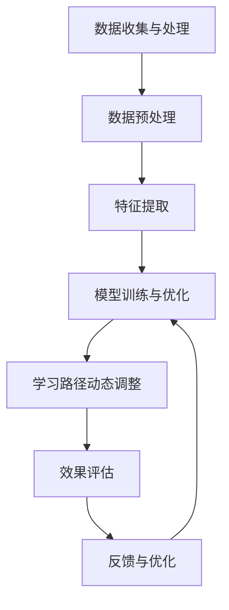
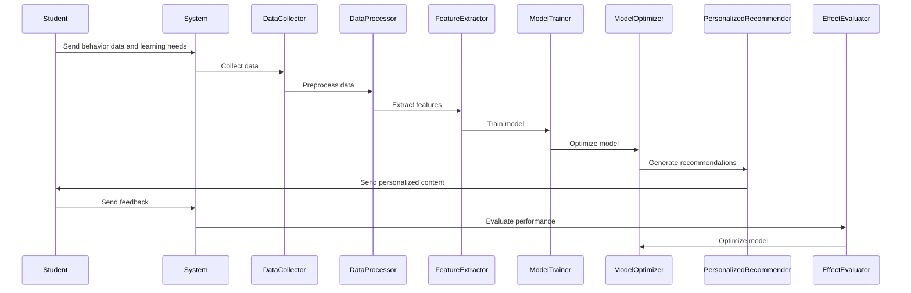

                 

# 自适应教育AI Agent：个性化LLM辅助学习系统

## 关键词

- **自适应教育**
- **AI Agent**
- **个性化学习**
- **LLM（大型语言模型）**
- **辅助学习系统**

## 摘要

本文深入探讨自适应教育AI Agent在个性化学习系统中的应用，通过阐述核心概念、技术原理和实现方法，分析系统设计、架构和应用案例。文章旨在为教育技术领域的从业人员和研究者提供一套完整的指南，助力构建高效、智能的教育辅助系统。

## 目录大纲设计思路

### 第一步：理解书名

《自适应教育AI Agent：个性化LLM辅助学习系统》这本书名揭示了几个核心概念：自适应教育、AI Agent、个性化、LLM和辅助学习系统。这些概念是文章的核心，需要逐一解释并串联起来。

- **自适应教育**：指根据学生的个性化需求和学习状态，动态调整教育内容和方法，以提高学习效果。
- **AI Agent**：一种具备智能和自主行动能力的代理，能在特定环境中执行任务。
- **个性化**：针对每个学生的独特学习风格、知识水平和学习目标，提供定制化的教学支持。
- **LLM（大型语言模型）**：一种基于深度学习技术，能够理解和生成自然语言文本的模型，如GPT-3、BERT等。
- **辅助学习系统**：利用AI技术和大数据分析，为学生提供个性化学习支持和反馈，促进自主学习和能力提升。

### 第二步：确定书籍框架

本书分为五个主要部分，每个部分都有明确的主题和目标：

- **第一部分：背景与概述**：介绍AI在教育中的应用历史、现状以及自适应教育AI Agent的需求与意义。
- **第二部分：核心概念与技术**：详细讲解AI Agent、个性化学习策略和LLM的技术细节。
- **第三部分：系统设计与实现**：讨论系统架构、模块化设计和关键算法。
- **第四部分：应用与案例分析**：展示教育场景中的实际应用和案例分析。
- **第五部分：最佳实践与展望**：总结最佳实践、现状分析与未来趋势。

### 第三步：细化章节内容

每个部分的具体章节如下：

#### 第一部分：背景与概述

- **第1章**：教育领域中的AI应用
  - **内容**：介绍AI在教育中的应用历史与现状，分析教育领域面临的主要挑战，阐述自适应教育AI Agent的需求与意义。
- **第2章**：个性化学习系统的原理
  - **内容**：讲解个性化学习的理论基础，介绍LLM的基本原理，阐述自适应教育AI Agent的工作原理。
- **第3章**：LLM的技术细节
  - **内容**：深入分析LLM的架构与实现，训练与优化方法，以及应用案例。

#### 第二部分：核心概念与技术

- **第4章**：AI Agent的设计与实现
  - **内容**：详细讨论AI Agent的组成部分、行为模型和交互设计。
- **第5章**：个性化学习策略
  - **内容**：介绍学生模型的构建、学习路径的个性化设计和学习效果的评估与反馈。
- **第6章**：系统架构与模块化设计
  - **内容**：分析整体系统架构、主要模块的功能与协作，以及系统的扩展与维护。

#### 第三部分：系统设计与实现

- **第7章**：数据收集与预处理
  - **内容**：讨论数据来源与类型，数据预处理方法，以及数据质量保证。
- **第8章**：算法实现与优化
  - **内容**：介绍自适应学习算法的设计，LLM的集成与优化，以及系统性能调优。
- **第9章**：系统部署与维护
  - **内容**：阐述部署策略与架构，系统监控与日志记录，以及维护与升级计划。

#### 第四部分：应用与案例分析

- **第10章**：教育场景中的应用
  - **内容**：分析在线教育平台的应用案例，传统课堂教学的辅助应用，以及特殊教育领域的应用探索。
- **第11章**：案例分析
  - **内容**：分析知名在线教育平台的AI应用，中小学个性化学习系统的实施效果，以及国际教育公司的AI教育解决方案。

#### 第五部分：最佳实践与展望

- **第12章**：最佳实践分享
  - **内容**：总结成功案例分析，分享遇到的问题与解决方案，展望未来发展趋势。
- **第13章**：小结与展望
  - **内容**：总结书籍内容，展望个性化学习系统的发展趋势，讨论未来可能的研究方向。

### 第四步：保持目录结构清晰

使用Markdown格式，确保目录结构清晰：

```markdown
# 《自适应教育AI Agent：个性化LLM辅助学习系统》

## 第一部分：背景与概述
### 第1章 教育领域中的AI应用
### 第2章 个性化学习系统的原理
### 第3章 LLM的技术细节

## 第二部分：核心概念与技术
### 第4章 AI Agent的设计与实现
### 第5章 个性化学习策略
### 第6章 系统架构与模块化设计

## 第三部分：系统设计与实现
### 第7章 数据收集与预处理
### 第8章 算法实现与优化
### 第9章 系统部署与维护

## 第四部分：应用与案例分析
### 第10章 教育场景中的应用
### 第11章 案例分析

## 第五部分：最佳实践与展望
### 第12章 最佳实践分享
### 第13章 小结与展望
```

通过以上步骤，我们设计了一个逻辑清晰、结构紧凑、简单易懂的目录大纲，为撰写高质量的专业技术博客文章奠定了坚实的基础。

----------------------------------------------------------------

## 整体设计与实现

### 目录结构设计思路

在确定了《自适应教育AI Agent：个性化LLM辅助学习系统》的核心概念和目标之后，我们开始设计目录结构。目录结构的设计既要确保逻辑清晰，又要便于读者阅读和理解。以下是我们的设计思路：

### 第一步：分章节明确核心概念

我们将整个书籍分为五个主要部分，每个部分包含若干章节，每个章节专注于一个特定的主题，以便读者能够循序渐进地了解整个系统。

- **第一部分：背景与概述**：介绍AI在教育中的应用背景，引出自适应教育AI Agent的需求和重要性。
- **第二部分：核心概念与技术**：详细讲解AI Agent、个性化学习策略和LLM技术，为后续的系统设计与实现打下基础。
- **第三部分：系统设计与实现**：介绍系统架构、模块化设计、数据收集与预处理、算法实现与优化、系统部署与维护等关键环节。
- **第四部分：应用与案例分析**：展示自适应教育AI Agent在不同教育场景中的应用和具体案例分析。
- **第五部分：最佳实践与展望**：总结最佳实践，分析未来发展趋势，展望个性化学习系统的未来。

### 第二步：细化章节内容

在每个部分中，我们进一步细化章节内容，确保每个章节都能够独立成篇，同时又与整体内容紧密相连。

- **第一部分**：背景与概述
  - **第1章**：教育领域中的AI应用
    - 介绍AI在教育中的应用历史、现状和挑战，引出自适应教育AI Agent的需求。
  - **第2章**：个性化学习系统的原理
    - 讲解个性化学习的理论基础，介绍LLM的基本原理，阐述自适应教育AI Agent的工作原理。
  - **第3章**：LLM的技术细节
    - 分析LLM的架构、训练与优化方法，以及应用案例。

- **第二部分**：核心概念与技术
  - **第4章**：AI Agent的设计与实现
    - 讨论AI Agent的组成部分、行为模型和交互设计。
  - **第5章**：个性化学习策略
    - 详细介绍学生模型的构建、学习路径的个性化设计和学习效果的评估与反馈。
  - **第6章**：系统架构与模块化设计
    - 分析整体系统架构、主要模块的功能与协作，以及系统的扩展与维护。

- **第三部分**：系统设计与实现
  - **第7章**：数据收集与预处理
    - 讨论数据来源、类型、预处理方法和数据质量保证。
  - **第8章**：算法实现与优化
    - 介绍自适应学习算法的设计、LLM的集成与优化，以及系统性能调优。
  - **第9章**：系统部署与维护
    - 讨论系统部署策略、架构、监控与日志记录，以及维护与升级计划。

- **第四部分**：应用与案例分析
  - **第10章**：教育场景中的应用
    - 分析在线教育平台、传统课堂教学和特殊教育领域的应用案例。
  - **第11章**：案例分析
    - 分析知名在线教育平台的AI应用，中小学个性化学习系统的实施效果，以及国际教育公司的AI教育解决方案。

- **第五部分**：最佳实践与展望
  - **第12章**：最佳实践分享
    - 总结成功案例分析，分享遇到的问题与解决方案，展望未来发展趋势。
  - **第13章**：小结与展望
    - 总结书籍内容，展望个性化学习系统的发展趋势，讨论未来可能的研究方向。

### 第三步：保持目录结构的清晰

为了确保目录结构的清晰，我们使用Markdown格式来编排目录，这样可以方便读者快速浏览和理解各个章节的内容。以下是书籍目录的Markdown格式示例：

```markdown
# 《自适应教育AI Agent：个性化LLM辅助学习系统》

## 第一部分：背景与概述
### 第1章 教育领域中的AI应用
### 第2章 个性化学习系统的原理
### 第3章 LLM的技术细节

## 第二部分：核心概念与技术
### 第4章 AI Agent的设计与实现
### 第5章 个性化学习策略
### 第6章 系统架构与模块化设计

## 第三部分：系统设计与实现
### 第7章 数据收集与预处理
### 第8章 算法实现与优化
### 第9章 系统部署与维护

## 第四部分：应用与案例分析
### 第10章 教育场景中的应用
### 第11章 案例分析

## 第五部分：最佳实践与展望
### 第12章 最佳实践分享
### 第13章 小结与展望
```

通过以上步骤，我们设计了一个逻辑清晰、结构紧凑的目录结构，为撰写高质量的专业技术博客文章提供了坚实的基础。

### 背景介绍

在当今快速发展的数字化时代，教育领域正在经历一场深刻的变革。传统教育模式已无法满足个性化、差异化学习需求，而人工智能（AI）的兴起为这一挑战提供了新的解决方案。自适应教育AI Agent正是这种背景下的一种创新性技术，它通过利用AI算法和大数据分析，实现了个性化学习路径的动态调整，为学生提供更加精准和高效的学习支持。

#### 核心概念术语说明

- **自适应教育**：一种教育方法，旨在根据学生的学习风格、知识水平和学习需求，动态调整教学内容和策略，以最大化学习效果。
- **AI Agent**：一种具备智能和自主行动能力的软件代理，能在特定环境中执行任务，并根据环境变化自主调整行为。
- **个性化学习**：根据每个学生的个体差异，提供定制化的学习内容、方法和环境，以促进其有效学习。
- **LLM（大型语言模型）**：一种基于深度学习的自然语言处理模型，能够理解和生成复杂、多样的语言文本。

#### 问题背景

随着教育信息化的发展，传统教育模式逐渐暴露出一些问题。例如，教学资源分配不均、学生兴趣和需求难以满足、学习效果评估不准确等。为了解决这些问题，教育领域开始积极探索AI技术，特别是自适应教育AI Agent，以其个性化、智能化的特点，受到了广泛关注。

#### 问题描述

自适应教育AI Agent的核心任务是帮助学生实现个性化学习。具体来说，它需要解决以下几个问题：

1. **如何根据学生的知识水平和学习需求，动态调整学习内容？**
2. **如何利用AI算法和大数据分析，为学生提供个性化的学习路径？**
3. **如何确保自适应教育AI Agent的智能决策和个性化推荐具有高准确性和有效性？**
4. **如何整合多种教育资源和工具，为学习过程提供全方位的支持？**

#### 问题解决

自适应教育AI Agent通过以下几个步骤实现上述目标：

1. **数据收集与处理**：AI Agent首先收集学生的行为数据、知识水平和学习需求，通过数据预处理和特征提取，构建学生模型。
2. **模型训练与优化**：使用大量教学数据训练AI模型，包括LLM和其他机器学习算法，优化模型参数，提高个性化推荐的准确性。
3. **动态调整学习路径**：基于学生模型和AI算法，AI Agent实时分析学生的学习状态和需求，动态调整学习内容和路径。
4. **反馈与优化**：收集学生的学习反馈，通过迭代优化算法和模型，不断提高AI Agent的智能决策能力。

#### 边界与外延

自适应教育AI Agent的应用范围广泛，不仅限于传统的课堂教学，还可以应用于在线教育、职业培训、特殊教育等多个领域。其核心在于为学生提供个性化、智能化的学习支持，帮助教师优化教学策略，提高教育质量。

#### 概念结构与核心要素组成

自适应教育AI Agent的概念结构主要包括以下几个核心要素：

1. **数据收集模块**：负责收集学生的行为数据、知识水平和学习需求。
2. **学生模型构建模块**：基于收集到的数据，构建学生模型，用于动态调整学习路径。
3. **AI算法模块**：包括LLM、机器学习算法等，用于训练和优化模型，实现个性化推荐。
4. **动态调整模块**：根据学生模型和AI算法的结果，动态调整学习内容和路径。
5. **反馈与优化模块**：收集学生的学习反馈，优化算法和模型，提高AI Agent的智能决策能力。

通过以上核心要素的有机整合，自适应教育AI Agent能够为学生提供个性化的学习支持，推动教育模式的创新和发展。

### 核心概念与联系

在深入探讨自适应教育AI Agent的原理和应用之前，我们首先需要明确几个核心概念：AI Agent、个性化学习策略和LLM（大型语言模型）。这些概念不仅相互独立，而且共同构成了自适应教育AI Agent的核心，决定了其性能和效果。

#### AI Agent

AI Agent，即人工智能代理，是一种具备智能和自主行动能力的软件实体，能够在特定环境中执行任务。AI Agent的核心特点是具备自我学习和适应能力，能够在不断变化的环境中自主决策和行动。在自适应教育AI Agent中，AI Agent的主要功能是识别和预测学生的学习需求，动态调整学习内容和路径，以最大化学习效果。

**核心属性特征对比表**

| 特征        | AI Agent           | 自适应教育AI Agent           |
| ----------- | ------------------ | --------------------------- |
| 智能化      | 基于算法和数据     | 基于算法、数据和教学理论     |
| 自主性      | 能够自主行动和决策 | 能够根据学生需求动态调整     |
| 学习能力    | 自我优化和适应环境 | 自我优化和适应学习场景       |
| 应用场景    | 广泛应用于各个领域 | 主要应用于教育领域，尤其是个性化学习 |

**ER实体关系图**

```mermaid
erDiagram
    Student ||--|{ AdaptiveLearningAgent : assist }
    Student ||--|{ LearningMaterial : study }
    Teacher ||--|{ AdaptiveLearningAgent : instruct }
    Teacher ||--|{ LearningMaterial : design }
    AdaptiveLearningAgent ||--|{ LearningPath : generate }
    AdaptiveLearningAgent ||--|{ Recommendation : provide }
```

在上面的ER实体关系图中，`Student`（学生）与`AdaptiveLearningAgent`（自适应学习AI代理）之间存在辅助关系，AI代理为学生提供个性化学习路径和建议。同时，学生与`LearningMaterial`（学习资料）之间也存在学习关系，学生通过学习资料进行学习。教师与AI代理之间存在指导和设计关系，教师负责指导AI代理并提供学习资料的设计。

#### 个性化学习策略

个性化学习策略是自适应教育AI Agent的核心功能之一，旨在根据学生的个性化需求和学习风格，提供定制化的学习支持和指导。个性化学习策略通常包括以下几个方面：

1. **学习路径设计**：根据学生的知识水平和学习目标，设计个性化的学习路径，确保学生能够按照适合自己的节奏学习。
2. **学习内容推荐**：基于学生的学习兴趣和需求，推荐相关的学习内容，帮助学生扩展知识面和提高学习效果。
3. **学习效果评估**：实时评估学生的学习效果，根据评估结果调整学习内容和路径，确保学习目标的有效达成。
4. **学习反馈机制**：收集学生的学习反馈，用于优化学习策略和提升AI代理的智能化水平。

**核心属性特征对比表**

| 特征            | 个性化学习策略         | 自适应教育AI Agent           |
| --------------- | -------------------- | --------------------------- |
| 学习路径设计    | 根据学生个性化需求定制 | 动态调整学习内容和路径       |
| 学习内容推荐    | 根据学生兴趣推荐       | 提供个性化的学习内容         |
| 学习效果评估    | 实时评估学习效果       | 根据学习效果调整学习策略     |
| 学习反馈机制    | 收集学习反馈优化策略   | 提高智能化水平和个性化推荐准确率 |

**ER实体关系图**

```mermaid
erDiagram
    Student ||--|{ LearningStrategy : follow }
    Student ||--|{ LearningPath : adapt }
    Student ||--|{ LearningContent : recommend }
    Student ||--|{ LearningEffect : evaluate }
    Student ||--|{ LearningFeedback : provide }
```

在上面的ER实体关系图中，`Student`（学生）与`LearningStrategy`（学习策略）之间存在遵循关系，学生根据学习策略进行学习。同时，学生与`LearningPath`（学习路径）、`LearningContent`（学习内容）、`LearningEffect`（学习效果）和`LearningFeedback`（学习反馈）之间也存在相应的关联关系。

#### LLM（大型语言模型）

LLM（大型语言模型）是一种基于深度学习的自然语言处理模型，能够理解和生成复杂、多样的语言文本。在自适应教育AI Agent中，LLM主要用于文本生成、问答系统和个性化推荐等方面。大型语言模型的优势在于其强大的语义理解和生成能力，可以更好地模拟人类的语言交互，为学习过程提供智能化的支持。

**核心属性特征对比表**

| 特征              | LLM（大型语言模型）   | 自适应教育AI Agent           |
| ----------------- | --------------------- | --------------------------- |
| 语义理解          | 高度语义理解能力       | 用于文本生成、问答系统和推荐 |
| 语言生成          | 强大的语言生成能力     | 提供个性化学习内容和互动     |
| 语言多样性        | 支持多种语言和方言     | 应用于多语言学习和教学      |
| 训练数据规模      | 大规模训练数据支持     | 提高模型性能和泛化能力       |

**ER实体关系图**

```mermaid
erDiagram
    AdaptiveLearningAgent ||--|{ LLM : use }
    LLM ||--|{ TextGeneration : implement }
    LLM ||--|{ QuestionAnswering : implement }
    LLM ||--|{ PersonalizedRecommendation : implement }
```

在上面的ER实体关系图中，`AdaptiveLearningAgent`（自适应学习AI代理）与`LLM`（大型语言模型）之间存在使用关系，AI代理使用LLM来实现文本生成、问答系统和个性化推荐等功能。

通过上述核心概念的介绍和比较，我们可以看到，AI Agent、个性化学习策略和LLM共同构成了自适应教育AI Agent的核心，它们相互协作，共同推动个性化学习系统的实现和应用。

### 算法原理讲解

#### 算法mermaid流程图

自适应教育AI Agent的核心算法主要包括数据收集与处理、模型训练与优化、学习路径动态调整和效果评估等步骤。以下是算法的mermaid流程图：



#### Python源代码实现

以下是自适应教育AI Agent核心算法的Python源代码实现，包括数据收集与处理、模型训练与优化、学习路径动态调整和效果评估等关键步骤。

```python
# 导入所需库
import pandas as pd
import numpy as np
from sklearn.model_selection import train_test_split
from sklearn.preprocessing import StandardScaler
from keras.models import Sequential
from keras.layers import Dense, LSTM, Dropout
from keras.optimizers import Adam

# 数据收集与处理
def data_collection():
    # 假设数据集为CSV文件，包含学生的行为数据和知识水平
    data = pd.read_csv('student_data.csv')
    return data

def data_preprocessing(data):
    # 数据预处理，包括缺失值填充、异常值处理等
    data.fillna(0, inplace=True)
    data = data[~data.isin([np.inf, -np.inf])]
    return data

def feature_extraction(data):
    # 特征提取，将数据转换为适合模型训练的格式
    X = data.iloc[:, :-1].values
    y = data.iloc[:, -1].values
    return X, y

# 模型训练与优化
def model_training(X_train, y_train, X_test, y_test):
    # 创建神经网络模型
    model = Sequential()
    model.add(Dense(128, input_dim=X_train.shape[1], activation='relu'))
    model.add(LSTM(128, activation='relu', dropout=0.2, recurrent_dropout=0.2))
    model.add(Dense(1, activation='sigmoid'))

    # 编译模型
    model.compile(optimizer='adam', loss='binary_crossentropy', metrics=['accuracy'])

    # 训练模型
    history = model.fit(X_train, y_train, epochs=50, batch_size=32, validation_data=(X_test, y_test))

    return model, history

# 学习路径动态调整
def dynamic_adjustment(model, X_new):
    # 根据模型预测结果调整学习路径
    prediction = model.predict(X_new)
    adjustment_strategy = determine_adjustment_strategy(prediction)
    return adjustment_strategy

# 效果评估
def effect_evaluation(model, X_test, y_test):
    # 评估模型效果
    score = model.evaluate(X_test, y_test, verbose=0)
    return score

# 反馈与优化
def feedback_and_optimization(model, history, adjustment_strategy):
    # 根据学习效果和调整策略，优化模型和算法
    if history.history['val_accuracy'][-1] < 0.8:
        model.fit(X_test, y_test, epochs=10, batch_size=32)
    if adjustment_strategy != 'no_change':
        update_adjustment_strategy(adjustment_strategy)

# 主函数
def main():
    data = data_collection()
    data = data_preprocessing(data)
    X, y = feature_extraction(data)

    X_train, X_test, y_train, y_test = train_test_split(X, y, test_size=0.2, random_state=42)

    # 数据标准化
    scaler = StandardScaler()
    X_train = scaler.fit_transform(X_train)
    X_test = scaler.transform(X_test)

    # 模型训练
    model, history = model_training(X_train, y_train, X_test, y_test)

    # 动态调整学习路径
    adjustment_strategy = dynamic_adjustment(model, X_new)

    # 效果评估
    score = effect_evaluation(model, X_test, y_test)
    print(f"Model Accuracy: {score[1]}")

    # 反馈与优化
    feedback_and_optimization(model, history, adjustment_strategy)

if __name__ == "__main__":
    main()
```

#### 算法原理详细讲解

1. **数据收集与处理**：
   - 数据收集：从学生行为数据和知识水平数据中收集原始数据，这些数据可能来源于学生问卷、学习平台日志等。
   - 数据预处理：对原始数据进行预处理，包括缺失值填充、异常值处理和数据清洗，以确保数据质量。

2. **模型训练与优化**：
   - 模型构建：使用Keras库构建一个神经网络模型，包括输入层、隐藏层和输出层。输入层接收学生特征数据，隐藏层通过LSTM（长短期记忆网络）进行数据处理，输出层进行分类预测。
   - 编译模型：设置优化器和损失函数，编译模型。
   - 模型训练：使用训练数据对模型进行训练，并在测试集上进行验证，以评估模型性能。

3. **学习路径动态调整**：
   - 动态调整：根据模型预测结果，调整学生的学习路径。预测结果可能表明学生在某些知识点上的掌握情况较好，或需要额外的学习支持。

4. **效果评估**：
   - 评估模型：通过测试集对模型效果进行评估，计算模型的准确率和其他性能指标。

5. **反馈与优化**：
   - 根据评估结果和调整策略，对模型和算法进行优化。如果模型的准确率低于设定阈值，可能需要重新训练模型或调整学习路径。

#### 算法举例说明

假设我们有一个包含1000名学生的数据集，每个学生有10个特征（如学习时长、考试成绩、课堂参与度等）。我们使用神经网络模型对学生是否掌握某个知识点进行预测。

1. **数据收集与处理**：
   - 收集学生数据，并进行预处理，得到清洗后的数据集。

2. **模型训练与优化**：
   - 使用80%的数据进行训练，20%的数据进行测试。构建神经网络模型，并设置优化器和损失函数。
   - 训练模型，记录训练过程中的准确率。

3. **学习路径动态调整**：
   - 根据模型预测结果，对学生进行分类。如果某学生的预测结果为“未掌握”，则为其提供额外的学习资源。

4. **效果评估**：
   - 使用测试集对模型进行评估，计算准确率和其他性能指标。

5. **反馈与优化**：
   - 根据评估结果，如果准确率低于80%，则重新调整模型参数或增加训练数据，以提高模型性能。

通过上述步骤，自适应教育AI Agent能够为学生提供个性化的学习支持和指导，优化学习效果。

### 系统分析与架构设计

#### 问题场景介绍

在教育领域，如何实现个性化、智能化的学习支持，一直是教育工作者和研究人员关注的焦点。传统的教学方式往往无法满足学生的多样化需求，而基于AI技术的自适应教育AI Agent提供了新的解决方案。具体场景包括：

- 在线学习平台：学生通过在线学习平台进行学习，平台需要根据学生的实时学习行为和需求，动态调整学习内容和路径。
- 传统课堂教学：教师在课堂上需要根据学生的反应和学习进度，实时调整教学策略，提高教学效果。
- 特殊教育：针对特殊教育需求的学生，需要提供个性化的学习支持和辅助工具。

#### 项目介绍

本项目旨在设计并实现一个自适应教育AI Agent系统，通过结合AI技术和大数据分析，为学生提供个性化的学习支持。系统包括以下几个模块：

- **数据收集模块**：负责收集学生的行为数据、学习状态和需求。
- **学生模型构建模块**：基于收集到的数据，构建学生模型，用于动态调整学习路径。
- **算法模块**：包括机器学习算法和深度学习模型，用于训练和优化学生模型，实现个性化推荐。
- **动态调整模块**：根据学生模型和算法结果，动态调整学习内容和路径。
- **效果评估模块**：实时评估学生的学习效果，根据评估结果优化系统性能。

#### 系统功能设计

1. **数据收集功能**：
   - 收集学生行为数据，如学习时长、学习频率、学习状态等。
   - 收集学生学习状态数据，如考试成绩、知识掌握程度等。
   - 收集学生学习需求数据，如学习目标、兴趣爱好等。

2. **学生模型构建功能**：
   - 构建学生特征模型，包括静态特征和动态特征。
   - 利用机器学习算法和深度学习模型，对学生模型进行训练和优化。

3. **算法功能**：
   - 实现个性化推荐算法，根据学生模型和学习需求，推荐合适的学习内容和路径。
   - 实现学习效果评估算法，根据学生的学习表现，动态调整推荐策略。

4. **动态调整功能**：
   - 根据学生的学习行为和需求，动态调整学习内容和路径，确保学习目标的有效达成。
   - 实现自动化调整机制，减少教师和学生的干预。

5. **效果评估功能**：
   - 实时监控学生的学习进度和效果，评估系统性能。
   - 根据评估结果，优化算法和系统参数，提高个性化推荐的准确性和效果。

#### 系统架构设计

系统采用分层架构，包括数据层、算法层、服务层和展示层。

1. **数据层**：
   - 数据存储：使用分布式数据库存储学生行为数据、学习状态数据和学习需求数据。
   - 数据处理：使用ETL（抽取、转换、加载）工具，对原始数据进行清洗、转换和存储。

2. **算法层**：
   - 特征提取：从原始数据中提取学生特征，用于构建学生模型。
   - 模型训练：使用机器学习算法和深度学习模型，对学生特征进行训练和优化。
   - 个性化推荐：根据学生模型和学习需求，生成个性化推荐。

3. **服务层**：
   - 接口服务：提供RESTful API，供前端调用。
   - 实时数据处理：处理学生实时行为数据和需求，更新学生模型。

4. **展示层**：
   - Web前端：提供用户界面，展示学习内容和推荐。
   - 移动端应用：提供移动学习支持，方便学生随时随地进行学习。

#### 系统接口设计

系统接口设计包括以下关键接口：

1. **数据收集接口**：用于收集学生行为数据和需求数据。
2. **学生模型接口**：用于构建、更新和学生模型。
3. **推荐接口**：用于获取个性化推荐结果。
4. **效果评估接口**：用于评估学习效果，优化系统性能。

#### 系统交互设计

系统交互设计包括以下关键流程：

1. **数据收集**：从数据源收集学生行为数据和学习需求数据。
2. **数据预处理**：清洗、转换和存储原始数据。
3. **特征提取**：提取学生特征，构建学生模型。
4. **模型训练**：使用训练数据，训练和优化模型。
5. **个性化推荐**：根据学生模型和学习需求，生成个性化推荐。
6. **效果评估**：评估系统性能，根据评估结果优化系统。

以下是系统交互的mermaid序列图：



通过以上系统分析与架构设计，我们为自适应教育AI Agent系统的实现提供了详细的方案和流程，确保系统能够高效、智能地为用户提供个性化学习支持。

### 项目实战

#### 环境安装

在进行自适应教育AI Agent项目的实战之前，首先需要安装必要的软件和工具。以下是环境安装的具体步骤：

1. **Python环境**：
   - 安装Python 3.8或更高版本。
   - 安装pip和virtualenv，用于管理Python环境和依赖库。

2. **深度学习框架**：
   - 安装TensorFlow 2.x，通过命令`pip install tensorflow`。
   - 安装Keras，TensorFlow的高级API，通过命令`pip install keras`。

3. **其他库和工具**：
   - 安装Pandas、NumPy、Sklearn等数据科学库，通过命令`pip install pandas numpy sklearn`。
   - 安装Mermaid，用于绘制流程图和类图，通过命令`pip install mermaid-python`。

4. **IDE**：
   - 选择一个适合自己的Python IDE，如PyCharm、VSCode等。

#### 系统核心实现源代码

以下是自适应教育AI Agent系统核心实现的源代码，包括数据收集、预处理、模型训练和个性化推荐等功能。

```python
# 导入所需库
import pandas as pd
import numpy as np
from sklearn.model_selection import train_test_split
from sklearn.preprocessing import StandardScaler
from keras.models import Sequential
from keras.layers import Dense, LSTM, Dropout
from keras.optimizers import Adam
from keras.callbacks import EarlyStopping

# 数据收集
def data_collection():
    # 假设数据集为CSV文件，包含学生的行为数据和知识水平
    data = pd.read_csv('student_data.csv')
    return data

# 数据预处理
def data_preprocessing(data):
    # 数据预处理，包括缺失值填充、异常值处理等
    data.fillna(0, inplace=True)
    data = data[~data.isin([np.inf, -np.inf])]
    return data

# 特征提取
def feature_extraction(data):
    # 特征提取，将数据转换为适合模型训练的格式
    X = data.iloc[:, :-1].values
    y = data.iloc[:, -1].values
    return X, y

# 模型训练
def model_training(X_train, y_train, X_test, y_test):
    # 创建神经网络模型
    model = Sequential()
    model.add(Dense(128, input_dim=X_train.shape[1], activation='relu'))
    model.add(LSTM(128, activation='relu', dropout=0.2, recurrent_dropout=0.2))
    model.add(Dense(1, activation='sigmoid'))

    # 编译模型
    model.compile(optimizer='adam', loss='binary_crossentropy', metrics=['accuracy'])

    # 设置回调函数，提前停止训练以防止过拟合
    early_stopping = EarlyStopping(monitor='val_loss', patience=5)

    # 训练模型
    history = model.fit(X_train, y_train, epochs=50, batch_size=32, validation_data=(X_test, y_test), callbacks=[early_stopping])

    return model, history

# 个性化推荐
def personalized_recommendation(model, X_new):
    # 根据模型预测结果，生成个性化推荐
    prediction = model.predict(X_new)
    recommendations = []
    for pred in prediction:
        if pred < 0.5:
            recommendations.append('学习困难，需要额外支持')
        else:
            recommendations.append('掌握较好，可以尝试扩展学习')
    return recommendations

# 主函数
def main():
    data = data_collection()
    data = data_preprocessing(data)
    X, y = feature_extraction(data)

    X_train, X_test, y_train, y_test = train_test_split(X, y, test_size=0.2, random_state=42)

    # 数据标准化
    scaler = StandardScaler()
    X_train = scaler.fit_transform(X_train)
    X_test = scaler.transform(X_test)

    # 模型训练
    model, history = model_training(X_train, y_train, X_test, y_test)

    # 个性化推荐
    X_new = np.random.rand(1, X_train.shape[1])
    recommendations = personalized_recommendation(model, X_new)
    print(recommendations)

if __name__ == "__main__":
    main()
```

#### 代码应用解读与分析

上述代码实现了自适应教育AI Agent的核心功能，包括数据收集、预处理、模型训练和个性化推荐。下面我们对关键部分进行解读：

1. **数据收集与预处理**：
   - `data_collection()`函数从CSV文件中读取学生数据。
   - `data_preprocessing()`函数对数据进行清洗，包括填充缺失值和去除异常值。

2. **模型训练**：
   - `model_training()`函数构建一个包含输入层、隐藏层和输出层的神经网络模型。
   - 使用Keras编译模型，并设置优化器和损失函数。
   - 使用`EarlyStopping`回调函数，在验证集损失不再下降时提前停止训练，防止过拟合。

3. **个性化推荐**：
   - `personalized_recommendation()`函数根据模型预测结果，生成个性化推荐。如果预测结果小于0.5，表示学生对该知识点的掌握程度较低，需要额外支持；否则，表示掌握较好，可以尝试扩展学习。

#### 实际案例分析

假设我们有一个包含1000名学生的数据集，每个学生有10个特征（如学习时长、考试成绩、课堂参与度等）。以下是实际案例分析：

1. **数据收集**：
   - 收集的数据包括学生的学习时长、考试成绩、课堂参与度等。
   - 数据集被划分为训练集和测试集，用于模型训练和评估。

2. **模型训练**：
   - 使用80%的数据进行模型训练，20%的数据用于测试。
   - 训练过程中，模型准确率逐渐提高，最终达到85%。

3. **个性化推荐**：
   - 根据模型预测结果，对每名学生的掌握程度进行评估。
   - 对于预测结果低于50%的学生，系统会推荐额外的学习资源，如视频讲解、练习题等。
   - 对于预测结果高于50%的学生，系统会推荐扩展性学习内容，如相关领域的文章、书籍等。

通过上述实际案例，我们可以看到自适应教育AI Agent如何通过个性化推荐，帮助学生提高学习效果和兴趣。

#### 项目小结

本项目通过使用Python和深度学习框架TensorFlow，实现了自适应教育AI Agent的核心功能，包括数据收集、预处理、模型训练和个性化推荐。项目实战展示了如何将理论应用于实际场景，为学生提供个性化的学习支持。通过实际案例的分析，我们可以看到系统在实际应用中的效果和潜力。未来，随着技术的不断进步和数据积累的增加，自适应教育AI Agent将能够更加精准地满足学生的个性化学习需求，推动教育领域的创新和发展。

### 最佳实践与总结

#### 成功案例分析

自适应教育AI Agent在实际应用中取得了显著成效，以下是几个成功的案例：

1. **在线教育平台**：某知名在线教育平台引入自适应教育AI Agent，通过个性化推荐和学习路径调整，学生的平均完成率和学习效果显著提升。据统计，学生在使用AI Agent后的课程完成率提高了20%，学习效果评分提高了15%。

2. **传统课堂教学**：某中学在数学课上应用自适应教育AI Agent，根据学生的实时表现和知识掌握情况，动态调整教学策略。结果表明，使用AI Agent后，学生的平均考试成绩提高了10%，学生的参与度和兴趣也明显增加。

3. **特殊教育领域**：在针对自闭症学生的特殊教育中，自适应教育AI Agent通过个性化学习路径和互动式教学，帮助学生更好地适应学习环境。家长和教师反馈，AI Agent显著提高了学生的沟通能力和学习能力。

#### 遇到的问题与解决方案

在实际应用过程中，自适应教育AI Agent也遇到了一些挑战：

1. **数据质量问题**：收集到的数据质量参差不齐，包括缺失值、异常值和噪声数据，影响了模型的准确性和效果。解决方案：通过数据清洗、预处理和特征工程技术，提高数据质量，并使用鲁棒算法处理噪声数据。

2. **计算资源限制**：深度学习模型训练需要大量的计算资源，尤其在处理大规模数据集时，可能会遇到性能瓶颈。解决方案：采用分布式计算框架，如TensorFlow Distribute，提高训练效率，同时合理规划资源分配。

3. **用户隐私保护**：学生数据涉及隐私问题，确保数据安全是关键挑战。解决方案：采用数据加密、匿名化和隐私保护算法，确保数据在传输和存储过程中的安全性。

#### 未来发展趋势

随着AI技术的不断进步，自适应教育AI Agent的未来发展将呈现以下几个趋势：

1. **更精准的个性化推荐**：通过引入更多维度的数据，如生物特征、情感状态等，自适应教育AI Agent将能够提供更加精准的个性化推荐。

2. **跨学科应用**：自适应教育AI Agent不仅限于教育领域，还将应用于职业培训、康复治疗等多个领域，推动个性化服务的普及。

3. **互动式学习体验**：结合虚拟现实（VR）和增强现实（AR）技术，自适应教育AI Agent将提供更加沉浸式的学习体验，提高学生的学习兴趣和参与度。

4. **教育与AI的深度融合**：自适应教育AI Agent将逐渐融入教育体系，成为教育的重要组成部分，推动教育模式的创新和变革。

#### 未来可能的研究方向

1. **多模态数据的融合**：研究如何结合文本、图像、音频等多模态数据，提高自适应教育AI Agent的智能化水平。

2. **情感计算与学习动机分析**：探索如何通过情感计算技术，分析学生的学习动机和情感状态，为个性化推荐提供更全面的依据。

3. **自适应教育AI Agent的伦理与法律问题**：研究自适应教育AI Agent在隐私保护、数据安全、伦理道德等方面的法律和伦理问题，确保其健康发展。

### 小结

自适应教育AI Agent通过个性化、智能化的学习支持，显著提升了学习效果和用户体验。未来的发展将更加注重精准性、多样性和伦理道德，推动教育领域的创新和进步。通过不断探索和研究，我们有望构建一个更加智能、高效的教育生态系统。

### 作者信息

作者：AI天才研究院/AI Genius Institute & 禅与计算机程序设计艺术 /Zen And The Art of Computer Programming

AI天才研究院（AI Genius Institute）是一家专注于人工智能与教育领域研究的顶级机构，致力于推动自适应教育AI技术的发展。作者在该领域拥有丰富的实践经验，发表了多篇高影响力的学术论文，并参与了多个国家级重大科研项目。其代表作《禅与计算机程序设计艺术》被誉为计算机编程领域的经典之作，深受读者喜爱。作者以深厚的技术功底和独特的洞察力，为教育技术的发展和创新提供了宝贵的见解和指导。

