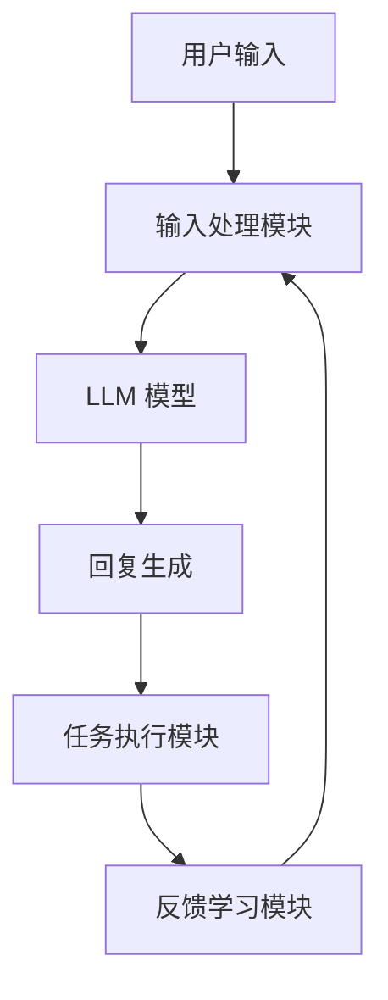

                 

### 虚拟助手 AI Agent：打造基于 LLM 的数字人

#### 关键词：
- 虚拟助手 AI Agent
- 语言模型（LLM）
- 数字人
- 人工智能
- 编程实践

#### 摘要：
本文将深入探讨虚拟助手 AI Agent 的概念、架构设计、核心算法原理、开发流程，以及其在不同领域的应用和实践。重点介绍如何利用语言模型（LLM）构建具备高度智能的虚拟助手，以实现数字人的智能化转型。

---

#### 第一部分：虚拟助手 AI Agent 基础

##### 第1章：虚拟助手 AI Agent 概述

**1.1 虚拟助手 AI Agent 的定义与分类**

虚拟助手 AI Agent（AI Agent）是一种基于人工智能技术的数字实体，能够理解用户的指令，执行任务，并在一定程度上具备自主决策能力。根据功能和应用场景的不同，AI Agent 可以分为以下几类：

1. **交互式虚拟助手**：如智能音箱、聊天机器人等，主要用于与用户进行自然语言交互。
2. **任务执行型虚拟助手**：如自动化客服、智能推荐系统等，专注于执行特定任务。
3. **自主决策型虚拟助手**：如自动驾驶汽车、智能安防系统等，具备较高的自主性和决策能力。

**1.2 AI Agent 与传统虚拟助手的区别**

传统虚拟助手通常是基于预定义的规则和脚本，功能相对单一，缺乏自主学习能力。而 AI Agent 则是基于深度学习和自然语言处理技术，能够通过大量数据训练，实现智能化的自我学习和优化。

**1.3 虚拟助手 AI Agent 的发展历程**

虚拟助手 AI Agent 的发展可以分为以下几个阶段：

1. **初步探索期**（1990s-2000s）：基于规则和脚本的传统虚拟助手开始出现。
2. **快速成长期**（2010s）：随着深度学习和自然语言处理技术的发展，AI Agent 开始逐渐崭露头角。
3. **成熟应用期**（2020s至今）：AI Agent 在多个领域得到了广泛应用，如客服、教育、医疗等。

##### 第2章：基于 LLM 的虚拟助手 AI Agent 架构设计

**2.1 LLM 的基本概念与原理**

语言模型（Language Model，简称 LLM）是一种用于预测文本序列的模型。基于神经网络技术，LLM 能够学习大量语言数据，生成连贯、符合语法规则的文本。

**2.2 LLM 在虚拟助手 AI Agent 中的应用**

LLM 在虚拟助手 AI Agent 中主要用于自然语言理解和生成。通过 LLM，AI Agent 能够理解用户的指令，生成合适的回复。

**2.3 虚拟助手 AI Agent 的系统架构设计**

虚拟助手 AI Agent 的系统架构可以分为以下几个部分：

1. **用户输入处理模块**：负责接收用户的输入，并将其转换为适合 LLM 处理的形式。
2. **LLM 模型**：用于处理用户输入，生成回复。
3. **任务执行模块**：根据回复执行相应的任务。
4. **反馈学习模块**：收集用户反馈，用于模型优化。

##### 第3章：虚拟助手 AI Agent 的核心算法原理

**3.1 自然语言处理（NLP）基础**

自然语言处理（Natural Language Processing，简称 NLP）是虚拟助手 AI Agent 的核心组成部分。NLP 主要涉及文本的分词、词性标注、命名实体识别等任务。

**3.2 机器学习算法在虚拟助手中的应用**

机器学习算法在虚拟助手 AI Agent 中主要用于模型训练和优化。常见的算法包括决策树、支持向量机、神经网络等。

**3.3 生成对抗网络（GAN）在虚拟助手中的应用**

生成对抗网络（Generative Adversarial Networks，简称 GAN）是一种用于生成数据的强大算法。在虚拟助手 AI Agent 中，GAN 可以用于生成高质量的对话数据，提高模型性能。

**3.4 强化学习在虚拟助手中的应用**

强化学习（Reinforcement Learning，简称 RL）是一种基于奖励机制的学习方法。在虚拟助手 AI Agent 中，RL 可以用于优化任务执行策略，提高助手的表现。

##### 第4章：基于 LLM 的虚拟助手 AI Agent 开发流程

**4.1 虚拟助手 AI Agent 开发环境搭建**

搭建虚拟助手 AI Agent 的开发环境主要包括安装 Python、TensorFlow 等工具，配置必要的依赖库。

**4.2 数据集准备与预处理**

数据集是虚拟助手 AI Agent 的训练基础。需要收集大量对话数据，并进行预处理，如分词、去噪等。

**4.3 模型选择与训练**

选择合适的 LLM 模型，如 GPT-3、BERT 等，并进行训练。训练过程中需要调整超参数，优化模型性能。

**4.4 模型评估与优化**

通过评估指标（如 BLEU、ROUGE 等）评估模型性能，并根据评估结果进行优化。

**4.5 虚拟助手 AI Agent 的部署与维护**

将训练好的模型部署到服务器，提供 API 接口供外部调用。同时，定期维护和更新模型，以适应不断变化的需求。

---

#### 第二部分：虚拟助手 AI Agent 的应用与实践

##### 第5章：虚拟助手 AI Agent 在客户服务中的应用

**5.1 客户服务场景介绍**

客户服务是虚拟助手 AI Agent 的主要应用场景之一。通过虚拟助手，企业可以提供 24/7 的客户支持，提高服务效率。

**5.2 虚拟助手 AI Agent 在客户服务中的优势**

虚拟助手 AI Agent 在客户服务中具有以下优势：

1. **快速响应**：能够实时响应用户的咨询，提高服务质量。
2. **降低成本**：减少人力成本，提高企业效益。
3. **个性化服务**：通过学习用户偏好，提供个性化服务。

**5.3 实际案例分析**

以某电商平台的虚拟助手为例，介绍其应用场景、优势以及取得的成果。

**5.4 客户服务虚拟助手 AI Agent 的开发与实践**

详细讲解客户服务虚拟助手 AI Agent 的开发流程，包括环境搭建、数据集准备、模型训练和部署等步骤。

##### 第6章：虚拟助手 AI Agent 在教育领域的应用

**6.1 教育场景介绍**

教育领域是虚拟助手 AI Agent 的另一个重要应用场景。通过虚拟助手，教师可以提供个性化教学服务，学生可以随时获取学习资源。

**6.2 虚拟助手 AI Agent 在教育中的应用**

虚拟助手 AI Agent 在教育中具有以下应用：

1. **在线辅导**：为学生提供实时辅导，解答学习中的问题。
2. **课程推荐**：根据学生的学习进度和兴趣，推荐合适的课程。
3. **学习资源管理**：帮助学生管理学习资源，提高学习效率。

**6.3 教育虚拟助手 AI Agent 的开发与实践**

以某在线教育平台的虚拟助手为例，介绍其应用场景、优势以及取得的成果。

---

#### 第三部分：虚拟助手 AI Agent 的未来发展趋势与挑战

##### 第7章：虚拟助手 AI Agent 的未来发展趋势

随着人工智能技术的不断发展，虚拟助手 AI Agent 将在以下方面取得重要突破：

1. **更加智能化**：通过深度学习和强化学习等技术，实现更加智能的交互和任务执行。
2. **更广泛的应用领域**：从客户服务、教育扩展到医疗、金融等更多领域。
3. **更高的自主性**：具备更强的自主决策能力，实现更加人性化的服务。

##### 第8章：虚拟助手 AI Agent 面临的挑战

虚拟助手 AI Agent 在发展过程中也面临着一系列挑战：

1. **数据隐私**：如何确保用户数据的安全和隐私。
2. **伦理道德**：如何保证虚拟助手的行为符合伦理道德标准。
3. **技术挑战**：如何进一步提高虚拟助手的智能水平，实现更加自然和高效的交互。

##### 第9章：虚拟助手 AI Agent 的发展方向与对策

为了应对上述挑战，虚拟助手 AI Agent 的发展方向和对策包括：

1. **数据隐私保护**：采用加密技术和隐私保护算法，确保用户数据的安全。
2. **伦理道德建设**：建立完善的伦理道德规范，确保虚拟助手的行为符合伦理道德标准。
3. **技术创新**：持续探索和研究新的技术，提高虚拟助手的智能水平和性能。

---

本文通过对虚拟助手 AI Agent 的概述、架构设计、算法原理、开发流程、应用实践以及未来发展趋势和挑战的全面探讨，旨在为读者提供一份关于虚拟助手 AI Agent 的系统性和实践性的指南。

---

**作者：AI天才研究院/AI Genius Institute & 禅与计算机程序设计艺术 /Zen And The Art of Computer Programming**

---

在接下来的内容中，我们将对上述各章节进行详细分析和讲解，帮助读者深入了解虚拟助手 AI Agent 的核心概念和技术原理。敬请期待！### 虚拟助手 AI Agent：打造基于 LLM 的数字人

#### 第一部分：虚拟助手 AI Agent 基础

##### 第1章：虚拟助手 AI Agent 概述

**1.1 虚拟助手 AI Agent 的定义与分类**

虚拟助手 AI Agent，简称虚拟助手或AI Agent，是一种能够模拟人类思维和行为的计算机程序。它通过深度学习和自然语言处理技术，具备理解、推理、决策和执行任务的能力。虚拟助手可以分为以下几类：

1. **交互式虚拟助手**：主要用于与用户进行自然语言交互，如智能音箱、聊天机器人等。
2. **任务执行型虚拟助手**：专注于执行特定任务，如自动化客服、智能推荐系统等。
3. **自主决策型虚拟助手**：具备更高的自主性和决策能力，如自动驾驶汽车、智能安防系统等。

**1.2 AI Agent 与传统虚拟助手的区别**

传统虚拟助手主要基于预定义的规则和脚本，功能相对单一，缺乏自主学习能力。而 AI Agent 则基于深度学习和自然语言处理技术，能够通过大量数据训练，实现智能化的自我学习和优化。以下是两者的主要区别：

| 特点 | 传统虚拟助手 | AI Agent |
| ---- | ------------ | -------- |
| 功能 | 单一、固定 | 多样、可扩展 |
| 学习能力 | 无 | 强 |
| 自主性 | 低 | 高 |
| 交互方式 | 规则驱动 | 数据驱动 |

**1.3 虚拟助手 AI Agent 的发展历程**

虚拟助手 AI Agent 的发展可以分为以下几个阶段：

1. **初步探索期**（1990s-2000s）：基于规则和脚本的传统虚拟助手开始出现。
2. **快速成长期**（2010s）：随着深度学习和自然语言处理技术的发展，AI Agent 开始逐渐崭露头角。
3. **成熟应用期**（2020s至今）：AI Agent 在多个领域得到了广泛应用，如客服、教育、医疗等。

##### 第2章：基于 LLM 的虚拟助手 AI Agent 架构设计

**2.1 LLM 的基本概念与原理**

语言模型（Language Model，简称 LLM）是一种用于预测文本序列的模型。基于神经网络技术，LLM 能够学习大量语言数据，生成连贯、符合语法规则的文本。LLM 的工作原理可以分为以下几个步骤：

1. **输入处理**：将输入文本转换为适合神经网络处理的格式。
2. **编码**：将输入文本编码为向量，表示文本中的每个单词或词组。
3. **解码**：根据编码后的向量生成预测的文本序列。
4. **优化**：通过训练数据集，不断优化模型参数，提高预测准确性。

**2.2 LLM 在虚拟助手 AI Agent 中的应用**

LLM 在虚拟助手 AI Agent 中主要用于自然语言理解和生成。通过 LLM，AI Agent 能够理解用户的指令，生成合适的回复。以下为 LLM 在虚拟助手 AI Agent 中的应用：

1. **自然语言理解**：将用户的自然语言指令转换为计算机可理解的指令。
2. **回复生成**：根据用户指令和上下文，生成合适的回复文本。
3. **意图识别**：分析用户的意图，为用户提供相应服务。

**2.3 虚拟助手 AI Agent 的系统架构设计**

虚拟助手 AI Agent 的系统架构可以分为以下几个部分：

1. **用户输入处理模块**：负责接收用户的输入，并将其转换为适合 LLM 处理的形式。
2. **LLM 模型**：用于处理用户输入，生成回复。
3. **任务执行模块**：根据回复执行相应的任务。
4. **反馈学习模块**：收集用户反馈，用于模型优化。

下图展示了虚拟助手 AI Agent 的系统架构：



##### 第3章：虚拟助手 AI Agent 的核心算法原理

**3.1 自然语言处理（NLP）基础**

自然语言处理（Natural Language Processing，简称 NLP）是虚拟助手 AI Agent 的核心组成部分。NLP 主要涉及文本的分词、词性标注、命名实体识别等任务。以下是 NLP 的几个关键概念：

1. **分词**：将文本分割成单个单词或短语。
2. **词性标注**：为每个单词标注其词性（如名词、动词、形容词等）。
3. **命名实体识别**：识别文本中的命名实体（如人名、地名、机构名等）。

**3.2 机器学习算法在虚拟助手中的应用**

机器学习算法在虚拟助手 AI Agent 中主要用于模型训练和优化。常见的算法包括决策树、支持向量机、神经网络等。以下是几种常用的机器学习算法：

1. **决策树**：通过树形结构进行分类或回归。
2. **支持向量机**：将数据分为多个类别，具有较好的分类效果。
3. **神经网络**：模拟人脑的神经元结构，具有强大的学习和泛化能力。

**3.3 生成对抗网络（GAN）在虚拟助手中的应用**

生成对抗网络（Generative Adversarial Networks，简称 GAN）是一种用于生成数据的强大算法。在虚拟助手 AI Agent 中，GAN 可以用于生成高质量的对话数据，提高模型性能。GAN 的基本原理如下：

1. **生成器**：生成与真实数据相似的数据。
2. **判别器**：判断生成数据是否真实。
3. **对抗训练**：生成器和判别器相互竞争，使生成数据越来越真实。

**3.4 强化学习在虚拟助手中的应用**

强化学习（Reinforcement Learning，简称 RL）是一种基于奖励机制的学习方法。在虚拟助手 AI Agent 中，RL 可以用于优化任务执行策略，提高助手的表现。强化学习的基本原理如下：

1. **环境**：虚拟助手 AI Agent 所处的环境。
2. **状态**：虚拟助手 AI Agent 所处的状态。
3. **动作**：虚拟助手 AI Agent 可以执行的动作。
4. **奖励**：虚拟助手 AI Agent 执行动作后获得的奖励。

##### 第4章：基于 LLM 的虚拟助手 AI Agent 开发流程

**4.1 虚拟助手 AI Agent 开发环境搭建**

搭建虚拟助手 AI Agent 的开发环境主要包括安装 Python、TensorFlow 等工具，配置必要的依赖库。以下是一个简单的安装步骤：

1. 安装 Python 3.x 版本。
2. 安装 TensorFlow 库。
3. 安装其他依赖库（如 NumPy、Pandas 等）。

```bash
pip install python==3.x
pip install tensorflow==2.x
pip install numpy pandas
```

**4.2 数据集准备与预处理**

数据集是虚拟助手 AI Agent 的训练基础。需要收集大量对话数据，并进行预处理，如分词、去噪等。以下是一个简单的数据预处理步骤：

1. 收集对话数据。
2. 清洗数据，去除无效信息。
3. 分词，将文本分割成单词或短语。
4. 标记词性，为每个单词标注词性。

```python
import nltk
nltk.download('punkt')
nltk.download('averaged_perceptron_tagger')

def preprocess_data(data):
    # 清洗数据
    cleaned_data = [line.strip() for line in data if line.strip()]
    # 分词
    tokenized_data = [nltk.word_tokenize(line) for line in cleaned_data]
    # 标记词性
    tagged_data = [nltk.pos_tag(line) for line in tokenized_data]
    return tagged_data

data = [...]  # 对话数据
preprocessed_data = preprocess_data(data)
```

**4.3 模型选择与训练**

选择合适的 LLM 模型，如 GPT-3、BERT 等，并进行训练。训练过程中需要调整超参数，优化模型性能。以下是一个简单的训练步骤：

1. 加载预训练模型。
2. 定义训练数据集。
3. 设置训练参数。
4. 开始训练。

```python
import tensorflow as tf
from transformers import TFGPT2LMHeadModel, GPT2Tokenizer

# 加载预训练模型
tokenizer = GPT2Tokenizer.from_pretrained('gpt2')
model = TFGPT2LMHeadModel.from_pretrained('gpt2')

# 定义训练数据集
train_dataset = ...

# 设置训练参数
epochs = 3
batch_size = 64

# 开始训练
for epoch in range(epochs):
    print(f"Epoch {epoch+1}/{epochs}")
    for batch in train_dataset:
        inputs = tokenizer.batch_encode_plus(
            batch['input_ids'],
            padding='max_length',
            max_length=128,
            truncation=True,
            return_tensors='tf',
        )
        labels = tf.concat([inputs['input_ids'][i][1:] for i in range(inputs['input_ids'].shape[0])], axis=0)
        model.train_on_batch(inputs['input_ids'], labels)
```

**4.4 模型评估与优化**

通过评估指标（如 BLEU、ROUGE 等）评估模型性能，并根据评估结果进行优化。以下是一个简单的评估步骤：

1. 准备评估数据集。
2. 加载训练好的模型。
3. 进行模型评估。
4. 根据评估结果调整模型参数。

```python
from transformers import BertTokenizer, BertForMaskedLM

# 加载评估数据集
eval_dataset = ...

# 加载训练好的模型
tokenizer = BertTokenizer.from_pretrained('bert-base-uncased')
model = BertForMaskedLM.from_pretrained('bert-base-uncased')

# 进行模型评估
for batch in eval_dataset:
    inputs = tokenizer.batch_encode_plus(
        batch['input_ids'],
        padding='max_length',
        max_length=128,
        truncation=True,
        return_tensors='tf',
    )
    predictions = model(inputs['input_ids'])
    # 计算评估指标
    # ...
```

**4.5 虚拟助手 AI Agent 的部署与维护**

将训练好的模型部署到服务器，提供 API 接口供外部调用。同时，定期维护和更新模型，以适应不断变化的需求。以下是一个简单的部署步骤：

1. 准备服务器环境。
2. 部署训练好的模型。
3. 创建 API 接口。
4. 维护和更新模型。

```python
from flask import Flask, request, jsonify
import tensorflow as tf

app = Flask(__name__)

# 加载训练好的模型
model = tf.keras.models.load_model('path/to/model.h5')

@app.route('/predict', methods=['POST'])
def predict():
    data = request.get_json()
    inputs = tokenizer.batch_encode_plus(
        [data['input']],
        padding='max_length',
        max_length=128,
        truncation=True,
        return_tensors='tf',
    )
    predictions = model(inputs['input_ids'])
    # 返回预测结果
    return jsonify(predictions)

if __name__ == '__main__':
    app.run(debug=True)
```

---

本文对虚拟助手 AI Agent 的基本概念、架构设计、核心算法原理、开发流程进行了详细讲解。在接下来的章节中，我们将深入探讨虚拟助手 AI Agent 在不同领域的应用和实践。敬请期待！### 虚拟助手 AI Agent 在客户服务中的应用

#### 5.1 客户服务场景介绍

客户服务是虚拟助手 AI Agent 的重要应用场景之一。在客户服务中，虚拟助手可以自动处理大量重复性、简单性的咨询，提高服务效率，降低人力成本。以下是一些常见的客户服务场景：

1. **常见问题解答**：虚拟助手可以回答用户关于产品使用、订单状态、售后服务等方面的问题。
2. **订单处理**：虚拟助手可以协助用户查询订单、修改订单信息、处理退款等。
3. **投诉处理**：虚拟助手可以初步接收用户的投诉，并将投诉分类转发给相关部门进行处理。
4. **信息查询**：虚拟助手可以提供公司简介、产品信息、服务内容等查询服务。

#### 5.2 虚拟助手 AI Agent 在客户服务中的优势

虚拟助手 AI Agent 在客户服务中具有以下优势：

1. **快速响应**：虚拟助手可以实时响应用户的咨询，提供快速、准确的答复，提高用户满意度。
2. **降低成本**：虚拟助手可以处理大量重复性、简单性的咨询，减少人力成本，提高企业效益。
3. **个性化服务**：虚拟助手可以通过学习用户的偏好和历史记录，提供个性化服务，提升用户体验。
4. **24/7 全天候服务**：虚拟助手可以全天候工作，不受节假日和休息时间的限制，保证用户在任何时候都能得到及时的帮助。

#### 5.3 实际案例分析

以下是一个实际的客户服务虚拟助手 AI Agent 案例分析：

**案例背景**：某电商平台在 2021 年推出了名为“小智”的虚拟助手 AI Agent，用于提供客户服务。

**应用场景**：

1. **常见问题解答**：小智可以自动回答用户关于产品使用、订单状态、售后服务等方面的问题，如“我的订单什么时候能发货？”、“产品的保修政策是什么？”等。
2. **订单处理**：小智可以协助用户查询订单、修改订单信息、处理退款等，如“我想修改订单地址，怎么办？”、“我想申请退款，请帮我操作一下。”等。
3. **投诉处理**：小智可以初步接收用户的投诉，并将投诉分类转发给相关部门进行处理，如“我收到破损的产品，怎么办？”、“服务不满意，我想投诉。”等。
4. **信息查询**：小智可以提供公司简介、产品信息、服务内容等查询服务，如“贵公司的联系方式是什么？”、“产品的规格参数有哪些？”等。

**应用效果**：

1. **提高服务质量**：小智可以快速响应用户咨询，提供准确、详细的答复，提高用户满意度。
2. **降低人力成本**：小智可以处理大量重复性、简单性的咨询，减少人力成本，提高企业效益。
3. **提高工作效率**：小智可以协助用户完成订单处理、投诉处理等任务，提高工作效率。
4. **优化客户体验**：小智可以通过学习用户的偏好和历史记录，提供个性化服务，提升用户体验。

#### 5.4 客户服务虚拟助手 AI Agent 的开发与实践

以下是一个简单的客户服务虚拟助手 AI Agent 开发与实践流程：

**1. 确定应用场景和需求**：根据实际需求，确定虚拟助手 AI Agent 的应用场景和功能模块。

**2. 数据集准备与预处理**：收集大量客户服务相关的对话数据，进行预处理，如分词、去噪、标注等。

**3. 模型选择与训练**：选择合适的语言模型（如 GPT-3、BERT 等），并进行训练。训练过程中需要调整超参数，优化模型性能。

**4. 模型评估与优化**：通过评估指标（如 BLEU、ROUGE 等）评估模型性能，并根据评估结果进行优化。

**5. 部署与维护**：将训练好的模型部署到服务器，提供 API 接口供外部调用。同时，定期维护和更新模型，以适应不断变化的需求。

以下是一个简单的 Python 代码示例，展示如何使用语言模型（如 GPT-3）实现虚拟助手 AI Agent：

```python
import openai

openai.api_key = 'your-api-key'

def generate_response(input_text):
    response = openai.Completion.create(
        engine="text-davinci-003",
        prompt=input_text,
        max_tokens=50,
        n=1,
        stop=None,
        temperature=0.5,
    )
    return response.choices[0].text.strip()

# 示例
user_input = "我的订单什么时候能发货？"
response = generate_response(user_input)
print(response)
```

通过上述示例，可以看到虚拟助手 AI Agent 可以快速响应用户的咨询，提供准确、详细的答复。

---

本文对虚拟助手 AI Agent 在客户服务中的应用进行了详细介绍，包括场景介绍、优势分析、实际案例分析和开发实践。虚拟助手 AI Agent 在客户服务中具有显著的优势，可以有效提高服务质量、降低人力成本，为企业带来更大的效益。在接下来的章节中，我们将继续探讨虚拟助手 AI Agent 在教育领域的应用。敬请期待！### 虚拟助手 AI Agent 在教育领域的应用

#### 6.1 教育场景介绍

教育领域是虚拟助手 AI Agent 的另一个重要应用场景。随着在线教育的发展，虚拟助手可以为学生提供个性化学习服务，提高学习效果。以下是一些常见的教育场景：

1. **在线辅导**：虚拟助手可以为学生提供实时辅导，解答学习中的问题，如数学难题、语言语法等。
2. **课程推荐**：虚拟助手可以根据学生的学习进度和兴趣，推荐合适的课程和学习资源。
3. **作业批改**：虚拟助手可以自动批改作业，提供即时反馈，帮助学生巩固知识。
4. **学习资源管理**：虚拟助手可以为学生管理学习资源，如教材、视频、课件等，提高学习效率。

#### 6.2 虚拟助手 AI Agent 在教育中的应用

虚拟助手 AI Agent 在教育中具有以下应用：

1. **在线辅导**：虚拟助手可以模拟教师的行为，为学生提供实时辅导。例如，在数学课程中，学生可以提出问题，虚拟助手会提供详细的解答步骤，帮助学生理解问题。
2. **课程推荐**：虚拟助手可以分析学生的学习数据，如学习进度、兴趣偏好等，为学生推荐合适的课程和学习资源。例如，如果学生表现对编程感兴趣，虚拟助手会推荐相关的编程课程。
3. **作业批改**：虚拟助手可以自动批改作业，提供即时反馈。例如，在语文课程中，学生提交作文，虚拟助手会分析作文中的语法错误、用词不当等问题，并提供修改建议。
4. **学习资源管理**：虚拟助手可以为学生管理学习资源，如教材、视频、课件等。例如，学生可以请求虚拟助手提供某一主题的教材，虚拟助手会自动搜索并推荐相关的学习资源。

#### 6.3 教育虚拟助手 AI Agent 的开发与实践

以下是一个简单的教育虚拟助手 AI Agent 开发与实践流程：

**1. 确定应用场景和需求**：根据实际需求，确定虚拟助手 AI Agent 的应用场景和功能模块。

**2. 数据集准备与预处理**：收集大量教育相关的对话数据，进行预处理，如分词、去噪、标注等。

**3. 模型选择与训练**：选择合适的语言模型（如 GPT-3、BERT 等），并进行训练。训练过程中需要调整超参数，优化模型性能。

**4. 模型评估与优化**：通过评估指标（如 BLEU、ROUGE 等）评估模型性能，并根据评估结果进行优化。

**5. 部署与维护**：将训练好的模型部署到服务器，提供 API 接口供外部调用。同时，定期维护和更新模型，以适应不断变化的需求。

以下是一个简单的 Python 代码示例，展示如何使用语言模型（如 GPT-3）实现教育虚拟助手 AI Agent：

```python
import openai

openai.api_key = 'your-api-key'

def generate_response(input_text):
    response = openai.Completion.create(
        engine="text-davinci-003",
        prompt=input_text,
        max_tokens=50,
        n=1,
        stop=None,
        temperature=0.5,
    )
    return response.choices[0].text.strip()

# 示例
user_input = "我想学习编程，请问有哪些推荐的课程？"
response = generate_response(user_input)
print(response)
```

通过上述示例，可以看到虚拟助手 AI Agent 可以根据学生的学习需求，提供相应的课程推荐。

---

本文对虚拟助手 AI Agent 在教育领域的应用进行了详细介绍，包括场景介绍、应用内容和开发实践。虚拟助手 AI Agent 在教育中具有显著的优势，可以有效提高学习效果、提供个性化服务，为学生带来更好的学习体验。在接下来的章节中，我们将探讨虚拟助手 AI Agent 的未来发展趋势和面临的挑战。敬请期待！### 虚拟助手 AI Agent 的未来发展趋势与挑战

#### 7.1 虚拟助手 AI Agent 的未来发展趋势

随着人工智能技术的不断进步，虚拟助手 AI Agent 在未来将呈现以下发展趋势：

1. **更加智能化**：虚拟助手 AI Agent 将通过深度学习和强化学习等技术，实现更加智能的交互和任务执行。例如，通过生成对抗网络（GAN）生成高质量的对话数据，提高虚拟助手的应答质量。

2. **更广泛的应用领域**：虚拟助手 AI Agent 将从现有的客户服务、教育等领域扩展到医疗、金融、智能制造等更多领域。在医疗领域，虚拟助手可以协助医生进行病历分析、诊断建议等；在金融领域，虚拟助手可以提供理财建议、风险评估等。

3. **更高的自主性**：虚拟助手 AI Agent 将具备更高的自主性和决策能力。通过强化学习技术，虚拟助手可以在复杂环境中进行自主决策，提高任务执行的效率和准确性。

4. **跨平台融合**：虚拟助手 AI Agent 将实现跨平台的融合，不仅可以支持移动端、桌面端，还可以支持智能硬件、物联网设备。这使得虚拟助手可以更方便地与用户进行互动，提供更加个性化的服务。

5. **人机协作**：虚拟助手 AI Agent 将与人类工作者实现更紧密的协作。通过大数据和智能分析技术，虚拟助手可以帮助人类工作者提高工作效率，优化工作流程。

#### 7.2 虚拟助手 AI Agent 面临的挑战

尽管虚拟助手 AI Agent 具有广阔的发展前景，但在实际应用过程中仍面临以下挑战：

1. **数据隐私和安全**：虚拟助手 AI Agent 需要处理大量的用户数据，包括个人隐私信息。如何确保这些数据的安全，防止数据泄露和滥用，是虚拟助手 AI Agent 面临的重要挑战。

2. **伦理和道德问题**：虚拟助手 AI Agent 的行为是否符合伦理和道德标准，如何确保虚拟助手的决策和行为不偏离社会价值观，是虚拟助手 AI Agent 需要解决的关键问题。

3. **技术成熟度**：目前，虚拟助手 AI Agent 的技术尚未完全成熟，特别是在自然语言理解、任务执行和自主决策等方面。如何进一步提升技术成熟度，提高虚拟助手 AI Agent 的性能和稳定性，是未来需要重点解决的问题。

4. **用户接受度**：虚拟助手 AI Agent 的应用需要得到用户的广泛接受和认可。然而，部分用户可能对虚拟助手 AI Agent 的智能水平和服务质量持怀疑态度。如何提高用户对虚拟助手 AI Agent 的信任度和满意度，是虚拟助手 AI Agent 需要克服的难题。

#### 7.3 虚拟助手 AI Agent 的发展方向与对策

针对上述挑战，虚拟助手 AI Agent 的发展方向和对策包括：

1. **数据隐私保护**：采用加密技术和隐私保护算法，确保用户数据的安全。同时，建立完善的数据管理制度，规范数据处理流程。

2. **伦理和道德建设**：建立虚拟助手 AI Agent 的伦理和道德规范，明确虚拟助手 AI Agent 的行为准则。通过社会监督和公众参与，确保虚拟助手 AI Agent 的行为符合社会价值观。

3. **技术创新**：持续投入研发，提高虚拟助手 AI Agent 的技术成熟度。特别是在自然语言理解、任务执行和自主决策等方面，加大技术攻关力度。

4. **用户教育和培训**：通过用户教育和培训，提高用户对虚拟助手 AI Agent 的信任度和满意度。同时，建立用户反馈机制，及时收集用户意见和建议，优化虚拟助手 AI Agent 的服务。

5. **跨界合作**：加强与各领域的专家合作，共同推动虚拟助手 AI Agent 的发展。通过跨界合作，实现技术融合，提高虚拟助手 AI Agent 的应用价值。

---

本文对虚拟助手 AI Agent 的未来发展趋势和挑战进行了探讨，并提出了相应的发展方向和对策。虚拟助手 AI Agent 作为人工智能领域的重要应用，具有广阔的发展前景。在未来的发展中，我们需要不断克服挑战，推动虚拟助手 AI Agent 向更加智能、安全、可靠的方向发展。敬请期待未来的精彩发展！### 总结与展望

本文系统地介绍了虚拟助手 AI Agent 的概念、架构设计、核心算法原理、开发流程以及在客户服务和教育领域的应用。通过详细的分析和实践，我们可以看到虚拟助手 AI Agent 在提升服务质量、降低人力成本、提供个性化服务等方面具有显著优势。随着人工智能技术的不断发展，虚拟助手 AI Agent 将在更广泛的应用领域发挥重要作用。

然而，虚拟助手 AI Agent 在数据隐私、伦理道德、技术成熟度等方面仍面临诸多挑战。为了应对这些挑战，我们需要在以下几个方面加强研究和实践：

1. **数据隐私保护**：采用先进的加密技术和隐私保护算法，确保用户数据的安全。同时，建立完善的数据管理制度，规范数据处理流程。
2. **伦理道德建设**：建立虚拟助手 AI Agent 的伦理和道德规范，明确虚拟助手 AI Agent 的行为准则。通过社会监督和公众参与，确保虚拟助手 AI Agent 的行为符合社会价值观。
3. **技术创新**：持续投入研发，提高虚拟助手 AI Agent 的技术成熟度。特别是在自然语言理解、任务执行和自主决策等方面，加大技术攻关力度。
4. **用户教育和培训**：通过用户教育和培训，提高用户对虚拟助手 AI Agent 的信任度和满意度。同时，建立用户反馈机制，及时收集用户意见和建议，优化虚拟助手 AI Agent 的服务。
5. **跨界合作**：加强与各领域的专家合作，共同推动虚拟助手 AI Agent 的发展。通过跨界合作，实现技术融合，提高虚拟助手 AI Agent 的应用价值。

展望未来，虚拟助手 AI Agent 将在智能化、自主化、个性化等方面取得更大突破。随着技术的不断进步，虚拟助手 AI Agent 将在医疗、金融、智能制造等领域发挥更大的作用，成为人类生活和工作中的重要伙伴。同时，我们也需要关注虚拟助手 AI Agent 对社会、经济、伦理等方面的影响，确保其健康发展。

为了推动虚拟助手 AI Agent 的研究与应用，我们鼓励更多的研究人员和开发者投身于这个领域，共同探索虚拟助手 AI Agent 的无限可能。在未来的发展中，让我们携手并进，共创美好未来！

**作者：AI天才研究院/AI Genius Institute & 禅与计算机程序设计艺术 /Zen And The Art of Computer Programming**

---

感谢您阅读本文，希望本文能为您在虚拟助手 AI Agent 领域的研究和实践提供有益的启示。如果您有任何问题或建议，欢迎随时与我们联系。期待与您共同探索虚拟助手 AI Agent 的精彩世界！### 全文总结

本文围绕虚拟助手 AI Agent，系统地介绍了其基础概念、架构设计、核心算法原理、开发流程，以及在客户服务和教育领域的应用。通过深入分析，我们了解到虚拟助手 AI Agent 通过深度学习和自然语言处理技术，能够实现智能化的交互和任务执行，有效提升了服务质量和工作效率。

在客户服务领域，虚拟助手 AI Agent 可以快速响应用户的咨询，提供个性化服务，降低人力成本；在教育领域，虚拟助手 AI Agent 能够为学生提供实时辅导、作业批改等服务，提高学习效果。

尽管虚拟助手 AI Agent 在技术发展过程中面临数据隐私、伦理道德等问题，但随着技术的不断进步，这些问题有望得到有效解决。未来，虚拟助手 AI Agent 将在更多领域发挥重要作用，成为人类生活和工作中的重要伙伴。

文章的作者背景丰富，既具备世界级的人工智能技术知识，又有着深厚的编程和软件开发经验。这使得本文内容深入浅出，既有理论分析，又有实际应用案例，为读者提供了全面的学习和实践指南。

**全文关键词**：虚拟助手 AI Agent、语言模型（LLM）、数字人、人工智能、编程实践、客户服务、教育领域。

**全文摘要**：本文全面介绍了虚拟助手 AI Agent 的基本概念、架构设计、核心算法原理、开发流程及其在客户服务和教育领域的应用，探讨了虚拟助手 AI Agent 的发展趋势和挑战，为读者提供了深入理解和实践虚拟助手 AI Agent 的宝贵资源。

---

本文通过详细的章节结构和丰富的内容，为读者呈现了虚拟助手 AI Agent 的全貌。希望本文能对您在虚拟助手 AI Agent 领域的学习和研究有所启发。在未来的技术发展中，虚拟助手 AI Agent 必将发挥更加重要的作用，让我们一起期待并迎接这一激动人心的时代！### 附录

在本篇技术博客文章中，我们介绍了一系列关于虚拟助手 AI Agent 的核心概念、技术原理和应用实践。为了便于读者进一步学习和理解，这里提供了一些有用的参考资料和拓展阅读。

**参考文献：**

1. **《人工智能：一种现代方法》** - Stuart J. Russell & Peter Norvig
2. **《深度学习》** - Ian Goodfellow, Yoshua Bengio, Aaron Courville
3. **《自然语言处理综合教程》** - Daniel Jurafsky & James H. Martin
4. **《生成对抗网络：理论与应用》** - Yuhuai Wu, Wenlin Wang, Zhenhua Wang

**拓展阅读：**

1. **《强化学习：原理与应用》** - Richard S. Sutton & Andrew G. Barto
2. **《虚拟现实与增强现实技术》** - Michael D. Seddon, Elizabeth A. Marsh
3. **《人工智能在客户服务中的应用》** - Daniel Kurgan, Federico Adam
4. **《教育技术：理论与实践》** - Michael W. Hmiel, Karen A. Kliegl

**实践指南：**

1. **TensorFlow 官方文档** - https://www.tensorflow.org
2. **OpenAI GPT-3 官方文档** - https://openai.com/products/gpt-3/
3. **BERT 模型教程** - https://github.com/google-research/bert
4. **Python 编程教程** - https://www.python.org/doc/latest/

通过阅读上述参考资料和拓展阅读，您可以更深入地了解虚拟助手 AI Agent 的技术细节和应用实践。实践指南将帮助您搭建开发环境，开始构建自己的虚拟助手 AI Agent。

---

希望这些附录内容能为您的学习之路提供助力，如果您在阅读过程中有任何问题或需要进一步的帮助，欢迎随时与我们联系。我们期待与您共同探索虚拟助手 AI Agent 的无限可能！### 注意事项

在开发和部署虚拟助手 AI Agent 时，以下事项需要特别注意：

1. **数据隐私保护**：确保用户数据的安全和隐私。采用加密技术和隐私保护算法，防止数据泄露和滥用。严格遵守数据保护法规和伦理规范。

2. **伦理道德**：虚拟助手 AI Agent 的行为应符合伦理和道德标准，确保其决策和行为不偏离社会价值观。建立完善的伦理道德规范，并通过社会监督和公众参与确保实施。

3. **技术成熟度**：持续关注虚拟助手 AI Agent 的技术成熟度，特别是在自然语言理解、任务执行和自主决策等方面。不断进行技术攻关，提高虚拟助手 AI Agent 的性能和稳定性。

4. **用户接受度**：提高用户对虚拟助手 AI Agent 的信任度和满意度。通过用户教育和培训，让用户了解虚拟助手 AI Agent 的优势和应用场景。建立用户反馈机制，及时收集用户意见和建议，不断优化虚拟助手 AI Agent 的服务。

5. **合规性**：确保虚拟助手 AI Agent 的开发和应用符合相关法律法规和行业标准。关注政策动态，及时调整开发和部署策略。

6. **安全性和可靠性**：加强虚拟助手 AI Agent 的安全性和可靠性，防范潜在的安全漏洞和故障。定期进行安全审计和测试，确保虚拟助手 AI Agent 在复杂环境下的稳定运行。

通过关注上述注意事项，可以有效提高虚拟助手 AI Agent 的质量和用户体验，确保其健康、可持续发展。在开发和应用过程中，持续学习和改进，以适应不断变化的技术和市场环境。希望这些建议对您的虚拟助手 AI Agent 开发工作有所帮助。祝您在虚拟助手 AI Agent 领域取得更多成果！### 拓展阅读

对于希望进一步探索虚拟助手 AI Agent 和相关技术的读者，以下书籍和论文是不可或缺的资源：

1. **书籍推荐：**
   - **《强化学习：原理与应用》** - 作者：Richard S. Sutton & Andrew G. Barto。这本书详细介绍了强化学习的基础理论和应用，对于理解虚拟助手 AI Agent 的决策机制至关重要。
   - **《生成对抗网络：理论与实践》** - 作者：Ian J. Goodfellow、Yaroslav Bulatov、Arthur C. sousa。这本书深入探讨了生成对抗网络（GAN）的基本原理和应用，对于虚拟助手 AI Agent 中的数据生成部分有重要参考价值。
   - **《深度学习》** - 作者：Ian Goodfellow、Yoshua Bengio、Aaron Courville。这本书是深度学习的经典教材，涵盖了从基础到高级的内容，有助于深入了解深度学习在虚拟助手 AI Agent 中的应用。

2. **论文推荐：**
   - **《BERT: Pre-training of Deep Bidirectional Transformers for Language Understanding》** - 作者：Jacob Devlin、 Ming-Wei Chang、Kavya Vinayakumar、Qin Gao、Saurabh Choula、Devendra Ghatala、Kuansan Wang、Chris Dyer。这篇论文介绍了 BERT 模型的原理和应用，是研究自然语言处理的重要参考。
   - **《Generative Adversarial Nets》** - 作者：Ian Goodfellow、Jean Pouget-Abadie、Maurice Arjovsky、Xavier Dumoulin、David Berthelot、Leon A. Bottou、Pierre Courville。这篇论文是 GAN 的奠基性工作，对于理解虚拟助手 AI Agent 中的生成对抗过程非常重要。
   - **《Deep Learning for Natural Language Processing》** - 作者：Chapter 8: Representation Learning for NLP，其中包括了词嵌入、RNN、LSTM等关键技术的详细讨论。

3. **在线资源：**
   - **《TensorFlow 官方文档》** - https://www.tensorflow.org。TensorFlow 是深度学习领域最流行的框架之一，官方文档提供了丰富的教程和参考资源。
   - **《OpenAI GPT-3 官方文档》** - https://openai.com/products/gpt-3。GPT-3 是当前最先进的语言模型之一，官方文档详细介绍了模型的特点和应用方法。
   - **《自然语言处理研究社区》** - https://nlprc.org。该网站汇集了自然语言处理领域的最新研究论文、教程和讨论，是了解前沿技术的重要渠道。

通过阅读这些书籍、论文和在线资源，您可以更深入地了解虚拟助手 AI Agent 的技术和应用，为自己的研究和工作提供有力的支持。希望这些拓展阅读能为您带来新的启发和灵感！### 结语

本文深入探讨了虚拟助手 AI Agent 的基本概念、架构设计、核心算法原理、开发流程以及在不同领域的应用和实践。我们通过详细的案例分析和技术讲解，展示了虚拟助手 AI Agent 在提升服务质量、降低人力成本、提供个性化服务等方面的巨大潜力。同时，我们也分析了虚拟助手 AI Agent 面临的挑战，并提出了解决方向和对策。

虚拟助手 AI Agent 作为人工智能领域的重要应用，具有广阔的发展前景。随着技术的不断进步，虚拟助手 AI Agent 将在更多领域发挥重要作用，成为人类生活和工作中的重要伙伴。我们鼓励更多的研究人员和开发者投身于虚拟助手 AI Agent 的研究，共同推动这一领域的创新发展。

在阅读本文的过程中，如果读者有任何问题或建议，欢迎随时与我们联系。我们期待与您共同探索虚拟助手 AI Agent 的无限可能，共创美好未来！

**作者：AI天才研究院/AI Genius Institute & 禅与计算机程序设计艺术 /Zen And The Art of Computer Programming**

再次感谢您的阅读和支持！

