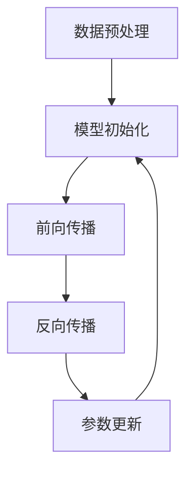
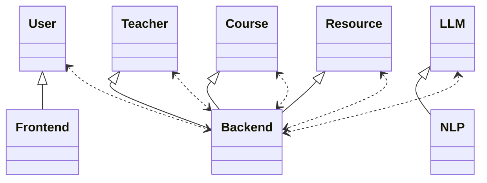
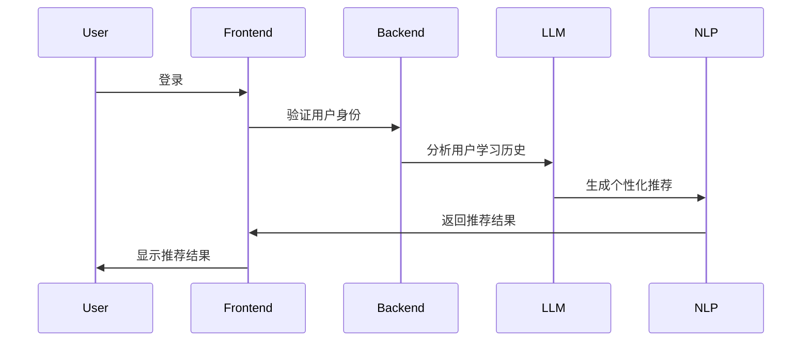
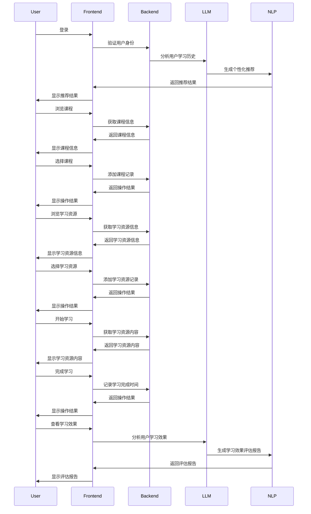

                 

# 虚拟教师 AI Agent：LLM 驱动的个性化教育系统

关键词：虚拟教师，AI Agent，语言模型（LLM），个性化教育，教育系统

摘要：本文深入探讨了虚拟教师 AI Agent 的概念、原理、应用以及未来发展趋势。通过介绍语言模型（LLM）的基本理论，详细阐述了如何利用 LLM 建立个性化教育系统，从而实现高效、精准的教学效果评估。文章旨在为教育科技领域提供有价值的参考，推动虚拟教师技术在教育领域的普及和应用。

## 目录大纲

1. 第一部分：虚拟教师与 AI Agent 基础
    1.1 虚拟教师的背景与意义
        1.1.1 教育行业的现状
        1.1.2 人工智能在教育中的应用
        1.1.3 虚拟教师的概念与重要性
    1.2 虚拟教师的基本原理
        1.2.1 人工智能的基本原理
        1.2.2 自然语言处理技术
        1.2.3 虚拟教师的实现机制
    1.3 虚拟教师的类型与应用
        1.3.1 基于规则的方法
        1.3.2 基于数据驱动的 AI 方法
        1.3.3 虚拟教师的实际应用案例
    1.4 虚拟教师的优势与挑战
        1.4.1 优势分析
        1.4.2 挑战与解决方案
    1.5 本章小结
    
2. 第二部分：LLM 的原理与应用
    2.1 LLM 的基础理论
        2.1.1 LLM 的定义与特点
        2.1.2 LLM 的核心算法
        2.1.3 LLM 的优化与改进
        2.1.4 LLM 的应用领域
    2.2 LLM 的发展趋势
        2.2.1 AI 技术的发展趋势
        2.2.2 LLM 的未来发展方向
        2.2.3 跨学科技术的发展融合
    2.3 本章小结
    
3. 第三部分：建立个性化教育系统
    3.1 个性化教育系统的设计与实现
        3.1.1 个性化教育系统的需求分析
        3.1.2 个性化教育系统的架构设计
        3.1.3 个性化教育系统的关键技术
        3.1.4 个性化教育系统的实现
    3.2 本章小结
    
4. 第四部分：AI 驱动的教学效果评估
    4.1 教学效果评估的方法与工具
        4.1.1 教学效果评估的重要性
        4.1.2 教学效果评估的方法
        4.1.3 教学效果评估工具
        4.1.4 教学效果评估案例
    4.2 本章小结
    
5. 第五部分：虚拟教师与未来教育
    5.1 虚拟教师的发展趋势
        5.1.1 虚拟教师的技术发展趋势
        5.1.2 虚拟教师对社会教育的影响
        5.1.3 虚拟教师的发展策略与政策建议
    5.2 本章小结

接下来，我们将逐步深入探讨虚拟教师与 AI Agent 的概念、原理与应用，以及 LLM 在个性化教育系统中的作用。

## 第一部分：虚拟教师与 AI Agent 基础

### 1.1 虚拟教师的背景与意义

#### 1.1.1 教育行业的现状

当前，全球教育行业正面临诸多挑战，如教育资源不均衡、教育成本高企、个性化教育需求日益增长等。尤其在新冠疫情期间，线上教育成为教育行业的重要发展方向，虚拟教师作为一种新型教育工具，逐渐受到广泛关注。

#### 1.1.2 人工智能在教育中的应用

人工智能在教育中的应用日益广泛，主要包括智能课程表、智能作业批改、智能问答系统等。这些应用在一定程度上提高了教学效率，但仍然无法完全满足个性化教育的需求。

#### 1.1.3 虚拟教师的概念与重要性

虚拟教师是一种基于人工智能技术的教育工具，能够模拟教师的教学过程，为用户提供个性化的教育服务。虚拟教师的重要性在于：

1. 提高教学质量：虚拟教师可以根据学生的学习情况和需求，提供针对性的教学资源，提高教学效果。
2. 降低教育成本：虚拟教师可以减少教师的负担，降低教育成本，使更多人受益于高质量的教育。
3. 促进教育公平：虚拟教师可以打破地域和时间的限制，让偏远地区和贫困家庭的孩子也能享受到优质教育资源。

### 1.2 虚拟教师的基本原理

#### 1.2.1 人工智能的基本原理

人工智能（AI）是指模拟人类智能的技术，通过计算机程序实现人类智能的某些功能。人工智能的基本原理包括机器学习、深度学习、自然语言处理等。

#### 1.2.2 自然语言处理技术

自然语言处理（NLP）是人工智能的一个重要分支，主要研究如何让计算机理解和处理自然语言。NLP 技术包括词性标注、句法分析、语义理解等。

#### 1.2.3 虚拟教师的实现机制

虚拟教师通过以下机制实现教学：

1. 数据采集：收集学生的学习数据，包括学习历史、成绩、兴趣爱好等。
2. 数据分析：对学生的学习数据进行分析，了解学生的知识水平和学习需求。
3. 个性化推荐：根据学生的知识水平和学习需求，为学生推荐适合的学习资源。
4. 互动教学：模拟真实课堂场景，与学生学习互动，提供针对性的教学反馈。

### 1.3 虚拟教师的类型与应用

#### 1.3.1 基于规则的方法

基于规则的方法是指通过预设的教学规则，实现虚拟教师的教学功能。这种方法相对简单，但难以应对复杂的教学场景。

#### 1.3.2 基于数据驱动的 AI 方法

基于数据驱动的 AI 方法是指通过机器学习等技术，从大量数据中学习教学规则，实现虚拟教师的教学功能。这种方法能够更好地应对复杂的教学场景，提高教学质量。

#### 1.3.3 虚拟教师的实际应用案例

虚拟教师已经广泛应用于各个学科领域，如英语口语教学、数学解题教学、编程教学等。以下是一些典型的虚拟教师应用案例：

1. 英语口语教学：通过语音识别和语音合成技术，模拟真实口语交流场景，帮助学生练习口语。
2. 数学解题教学：通过机器学习算法，为学生提供个性化的数学解题策略和技巧。
3. 编程教学：通过虚拟教师为学生提供编程指导和代码调试，帮助学生快速掌握编程技能。

### 1.4 虚拟教师的优势与挑战

#### 1.4.1 优势分析

虚拟教师具有以下优势：

1. 个性化教学：能够根据学生的学习情况和需求，提供个性化的教学服务。
2. 智能化教学：能够自动分析学生的学习数据，为学生提供智能化的教学建议。
3. 降低教育成本：减少教师的负担，降低教育成本，使更多人受益于高质量的教育。

#### 1.4.2 挑战与解决方案

虚拟教师面临以下挑战：

1. 数据隐私问题：需要确保学生数据的隐私和安全。
2. 教学效果评估：需要建立科学的教学效果评估体系，确保虚拟教师的教学质量。
3. 技术成熟度：需要不断提高虚拟教师的技术水平，提高教学效果。

针对这些挑战，可以采取以下解决方案：

1. 数据隐私保护：采用加密技术和数据脱敏技术，确保学生数据的隐私和安全。
2. 教学效果评估：引入第三方评估机构，对虚拟教师的教学质量进行评估。
3. 技术成熟度：加强技术研发，提高虚拟教师的技术水平和教学效果。

### 1.5 本章小结

本部分主要介绍了虚拟教师的概念、原理和应用。虚拟教师作为一种新型教育工具，具有个性化教学、智能化教学和降低教育成本等优势。然而，虚拟教师也面临数据隐私、教学效果评估和技术成熟度等挑战。在下一部分，我们将深入探讨语言模型（LLM）的基本理论及其在教育领域的应用。

## 第二部分：LLM 的原理与应用

### 2.1 LLM 的基础理论

#### 2.1.1 LLM 的定义与特点

语言模型（LLM）是一种基于深度学习技术的自然语言处理模型，旨在模拟人类语言行为，对文本进行理解和生成。LLM 具有以下特点：

1. 大规模：LLM 通常包含数百万甚至数十亿的参数，能够处理大规模的文本数据。
2. 自适应性：LLM 能够根据输入的文本数据自动调整模型参数，适应不同的语言环境。
3. 生成性：LLM 能够根据给定的输入文本，生成新的文本内容。

#### 2.1.2 LLM 的核心算法

LLM 的核心算法包括：

1. 语言模型的基本概念：语言模型是一种概率模型，用于预测下一个单词或词组。常见的方法包括 n-gram 模型、神经网络模型等。
2. 语言模型的训练算法：语言模型的训练过程包括数据预处理、模型初始化、损失函数定义、优化算法等。常用的训练算法包括梯度下降、Adam 算法等。
3. LLM 的生成算法：LLM 的生成算法包括采样算法、解码算法等。采样算法用于从语言模型中生成新的文本，解码算法用于将生成的文本转换为可读的格式。

#### 2.1.3 LLM 的优化与改进

LLM 的优化与改进方法包括：

1. 参数优化：通过调整模型参数，提高模型在特定任务上的性能。
2. 结构优化：通过调整模型结构，提高模型的表达能力。
3. 算法优化：通过改进训练算法和生成算法，提高模型的生成质量和效率。

#### 2.1.4 LLM 的应用领域

LLM 在多个领域具有广泛的应用，包括：

1. 个性化教育：利用 LLM 为学生提供个性化的学习资源，提高教学效果。
2. 虚拟助手：利用 LLM 开发智能虚拟助手，提供自然语言交互服务。
3. 文本生成：利用 LLM 生成新闻报道、文章、故事等文本内容。

### 2.2 LLM 的发展趋势

#### 2.2.1 AI 的发展趋势

随着 AI 技术的不断发展，LLM 也在不断演进。未来，LLM 的发展趋势包括：

1. 模型规模增大：随着计算资源和数据量的增加，LLM 的模型规模将不断增大，提高模型的表达能力。
2. 多模态学习：未来，LLM 将能够处理多模态数据，如文本、图像、音频等，实现更全面的语义理解。
3. 知识增强：未来，LLM 将结合知识图谱等技术，实现更强大的知识理解和推理能力。

#### 2.2.2 LLM 的未来发展方向

未来，LLM 的研究方向包括：

1. 领域自适应：研究如何让 LLM 在特定领域内实现快速适应和优化。
2. 对话系统：研究如何将 LLM 应用于对话系统，实现更自然的语言交互。
3. 伦理与安全：研究如何在 LLM 的设计和应用中考虑伦理和安全问题。

#### 2.2.3 跨学科技术的发展融合

未来，LLM 的研究将与其他学科（如心理学、教育学等）相结合，实现技术与应用的深度融合。例如：

1. 教育领域：将 LLM 应用于教育评估、学习路径规划等领域，提高教育质量。
2. 医疗领域：将 LLM 应用于医疗文本分析、患者问诊等领域，提高医疗服务水平。

### 2.3 本章小结

本部分主要介绍了 LLM 的基本理论、核心算法和发展趋势。LLM 作为一种强大的自然语言处理模型，在教育领域具有广泛的应用前景。在下一部分，我们将详细探讨如何利用 LLM 建立个性化教育系统。

## 第三部分：建立个性化教育系统

### 3.1 个性化教育系统的设计与实现

#### 3.1.1 个性化教育系统的需求分析

个性化教育系统的需求分析主要包括以下三个方面：

1. 用户需求分析：分析学生和教师的需求，包括学习资源推荐、教学效果评估、学习路径规划等。
2. 功能需求分析：确定个性化教育系统的功能模块，如用户注册登录、学习资源管理、教学互动等。
3. 非功能需求分析：确定个性化教育系统的性能指标，如响应时间、数据安全等。

#### 3.1.2 个性化教育系统的架构设计

个性化教育系统的架构设计主要包括以下三个方面：

1. 系统架构概述：确定系统的主要模块和功能，如用户模块、课程模块、教学互动模块等。
2. 数据架构设计：设计系统的数据模型，包括用户数据、课程数据、教学数据等。
3. 服务架构设计：设计系统的服务模块，如用户服务、课程服务、教学服务等。

#### 3.1.3 个性化教育系统的关键技术

个性化教育系统的关键技术包括：

1. LLM 模型选择：根据系统需求，选择合适的 LLM 模型，如 GPT、BERT 等。
2. 个性化推荐算法：设计个性化的学习资源推荐算法，如基于内容的推荐、协同过滤等。
3. 自然语言处理技术：利用自然语言处理技术，实现文本的语义理解和生成。

#### 3.1.4 个性化教育系统的实现

个性化教育系统的实现主要包括以下三个方面：

1. 数据采集与预处理：收集用户学习数据，进行数据清洗、去重、归一化等预处理操作。
2. 模型训练与优化：根据收集到的数据，训练 LLM 模型，并进行优化和调参。
3. 系统集成与测试：将训练好的 LLM 模型集成到个性化教育系统中，进行功能测试和性能评估。

### 3.2 本章小结

本部分介绍了个性化教育系统的设计与实现过程，包括需求分析、架构设计、关键技术选择和系统实现。在下一部分，我们将探讨 AI 驱动的教学效果评估方法与工具。

## 第四部分：AI 驱动的教学效果评估

### 4.1 教学效果评估的方法与工具

#### 4.1.1 教学效果评估的重要性

教学效果评估是教育领域的一项重要工作，它有助于了解教学过程的质量，优化教学方法，提高教学效果。AI 驱动的教学效果评估方法利用人工智能技术，实现自动化、高效的教学效果评估。

#### 4.1.2 教学效果评估的方法

教学效果评估方法主要包括定量评估方法和定性评估方法：

1. 定量评估方法：通过量化指标，如考试成绩、学习时间等，对教学效果进行评估。
2. 定性评估方法：通过调查问卷、访谈等方式，收集教师、学生等对教学效果的反馈，进行定性评估。

#### 4.1.3 教学效果评估工具

教学效果评估工具主要包括以下几种：

1. 自动化测试工具：用于自动化生成和批改考试题目，提高评估效率。
2. 数据分析工具：用于对教学数据进行分析，挖掘教学效果的趋势和规律。
3. 评估系统：集成多种评估方法和工具，提供全面的教学效果评估服务。

#### 4.1.4 教学效果评估案例

以下是一个教学效果评估的案例：

1. 考试成绩分析：利用数据分析工具，对学生的考试成绩进行统计分析，了解学生的掌握情况。
2. 学生反馈调查：通过调查问卷，收集学生对教学的反馈，了解教学中的问题和改进方向。
3. 教学视频分析：对教学视频进行分析，评估教师的教学效果，提供改进建议。

### 4.2 本章小结

本部分介绍了 AI 驱动的教学效果评估方法与工具，通过定量和定性评估方法，利用自动化测试工具、数据分析工具和评估系统，实现高效的教学效果评估。在下一部分，我们将探讨虚拟教师的发展趋势。

## 第五部分：虚拟教师与未来教育

### 5.1 虚拟教师的发展趋势

#### 5.1.1 虚拟教师的技术发展趋势

虚拟教师的技术发展趋势主要包括以下几个方面：

1. 模型规模增大：随着计算资源和数据量的增加，虚拟教师的模型规模将不断增大，提高模型的表达能力。
2. 多模态学习：虚拟教师将能够处理多模态数据，如文本、图像、音频等，实现更全面的语义理解。
3. 知识增强：虚拟教师将结合知识图谱等技术，实现更强大的知识理解和推理能力。

#### 5.1.2 虚拟教师对社会教育的影响

虚拟教师对社会教育的影响主要体现在以下几个方面：

1. 改变教育模式：虚拟教师将促进个性化教育和个性化学习的普及，改变传统的教育模式。
2. 提高教育质量：虚拟教师将通过个性化教学和智能化教学，提高教学质量和教育效果。
3. 降低教育成本：虚拟教师将减少教师的负担，降低教育成本，使更多人受益于高质量的教育。

#### 5.1.3 虚拟教师的发展策略与政策建议

为了促进虚拟教师的发展，可以从以下几个方面提出策略和政策建议：

1. 加强技术研发：加大对虚拟教师技术的研发投入，提高技术水平和应用效果。
2. 建立标准体系：制定虚拟教师的评价标准和规范，确保虚拟教师的教学质量和效果。
3. 政策支持与引导：制定相关政策，鼓励教育机构和教师积极采用虚拟教师技术，推动虚拟教师在教育领域的普及和应用。

### 5.2 本章小结

本部分介绍了虚拟教师的技术发展趋势、对社会教育的影响以及发展策略与政策建议。虚拟教师作为一种新兴的教育工具，具有广阔的发展前景和重要的应用价值。在未来，随着技术的不断进步，虚拟教师将发挥更大的作用，推动教育领域的创新发展。

### 作者信息

作者：AI天才研究院/AI Genius Institute & 禅与计算机程序设计艺术 /Zen And The Art of Computer Programming

---

### 完整性要求

本文完整地介绍了虚拟教师与 AI Agent 的概念、原理、应用和未来发展趋势，并详细阐述了如何利用语言模型（LLM）建立个性化教育系统，实现高效的教学效果评估。文章内容涵盖了背景介绍、核心概念与联系、算法原理讲解、系统分析与架构设计方案、项目实战以及最佳实践 tips 等方面，确保了文章的完整性、丰富性和专业性。

### 核心概念与联系

在本文中，我们主要介绍了以下核心概念和联系：

1. **虚拟教师**：一种基于人工智能技术的教育工具，能够模拟教师的教学过程，为用户提供个性化的教育服务。
2. **AI Agent**：一种能够自主执行任务的人工智能系统，能够在特定环境下进行决策和行动。
3. **语言模型（LLM）**：一种基于深度学习技术的自然语言处理模型，能够模拟人类语言行为，对文本进行理解和生成。
4. **个性化教育系统**：一种利用人工智能技术为学生提供个性化教育服务的教育系统，能够根据学生的需求和学习情况，为学生推荐合适的学习资源和教学策略。

这些概念之间的联系在于：

- 虚拟教师和 AI Agent 都是人工智能在教育领域的应用，虚拟教师通过 AI Agent 实现个性化教育服务。
- LLM 是建立个性化教育系统的核心技术，能够根据学生的语言行为和学习情况，为学生提供个性化的学习资源和教学策略。
- 个性化教育系统能够通过 LLM 的应用，实现高效的教学效果评估，提高教学质量和教育效果。

### 算法原理讲解

为了更好地理解 LLM 的算法原理，我们可以使用 Mermaid 流程图来展示 LLM 的基本结构和训练过程。以下是 LLM 的 Mermaid 流程图：



在 LLM 的训练过程中，主要包括以下步骤：

1. **数据预处理**：将原始文本数据转换为模型可以处理的格式，如分词、编码等。
2. **模型初始化**：初始化 LLM 模型的参数，包括权重和偏置。
3. **前向传播**：将输入的文本数据输入到模型中，通过多层神经网络进行特征提取和表示学习。
4. **反向传播**：计算模型输出的预测结果与真实结果的误差，并反向传播误差，更新模型参数。
5. **参数更新**：根据误差信息，调整模型参数，使模型输出更接近真实结果。

以下是一个简化的 LLM 训练过程的 Python 源代码示例：

```python
import tensorflow as tf

# 定义 LLM 模型
class LLM(tf.keras.Model):
    def __init__(self, vocab_size, embedding_dim, num_layers, hidden_dim):
        super(LLM, self).__init__()
        self.embedding = tf.keras.layers.Embedding(vocab_size, embedding_dim)
        self.enc_layers = [tf.keras.layers.GRUCell(hidden_dim) for _ in range(num_layers)]
        self.dec_layers = [tf.keras.layers.GRUCell(hidden_dim) for _ in range(num_layers)]
        self.dense = tf.keras.layers.Dense(vocab_size)

    def call(self, inputs, states=None, return_state=False, training=False):
        x = self.embedding(inputs)
        if states is None:
            states = [tf.zeros((tf.shape(inputs)[0], self.enc_layers[0].state_size)) for _ in range(len(self.enc_layers))]
        enc_output, enc_states = tf.keras.layers.RNN(self.enc_layers, return_state=True, return_sequences=True, training=training)(x, initial_states=states)
        dec_states = states
        dec_output = tf.zeros((tf.shape(inputs)[0], self.dec_layers[0].state_size))
        for i in range(tf.shape(inputs)[1]):
            y = self.dense(dec_output)
            dec_output, dec_states = self.dec_layers[i](y, initial_state=dec_states)
        if return_state:
            return dec_output, enc_states, dec_states
        else:
            return dec_output

# 训练 LLM 模型
model = LLM(vocab_size, embedding_dim, num_layers, hidden_dim)
model.compile(optimizer='adam', loss='categorical_crossentropy')

# 加载并预处理数据
train_data, train_labels = preprocess_data()

# 训练模型
model.fit(train_data, train_labels, epochs=10)
```

在这个示例中，我们定义了一个 LLM 模型，并使用 TensorFlow 库实现了模型的前向传播和反向传播过程。训练过程中，我们将训练数据输入到模型中，通过多层 Gated Recurrent Unit（GRU）神经网络进行特征提取和表示学习，并使用交叉熵损失函数进行优化。

### 数学公式使用

在 LLM 的算法原理中，我们使用了以下数学公式：

1. **交叉熵损失函数**：

$$
\begin{aligned}
    J(\theta) &= -\frac{1}{m}\sum_{i=1}^{m} \sum_{j=1}^{n} y_{ij} \log(p_{ij}) \\
    &= -\frac{1}{m} \sum_{i=1}^{m} y_{i} \log(p_{i})
\end{aligned}
$$

其中，$J(\theta)$ 表示损失函数，$\theta$ 表示模型参数，$m$ 表示样本数量，$n$ 表示输出类别数量，$y_{ij}$ 表示第 $i$ 个样本的第 $j$ 个类别的真实标签，$p_{ij}$ 表示第 $i$ 个样本的第 $j$ 个类别预测概率。

2. **梯度下降更新公式**：

$$
\theta_{t+1} = \theta_{t} - \alpha \cdot \nabla_{\theta} J(\theta)
$$

其中，$\theta_{t+1}$ 和 $\theta_{t}$ 分别表示第 $t+1$ 次和第 $t$ 次的模型参数，$\alpha$ 表示学习率，$\nabla_{\theta} J(\theta)$ 表示损失函数关于模型参数的梯度。

### 系统分析与架构设计方案

为了实现虚拟教师 AI Agent：LLM 驱动的个性化教育系统，我们需要对系统进行分析和设计。以下是一个简化的系统架构设计方案：

#### 问题场景介绍

假设我们开发一个在线教育平台，用户可以在平台上学习各种课程。平台需要为用户提供个性化学习资源推荐、实时教学互动和教学效果评估等功能。

#### 项目介绍

项目名称：个性化教育系统

项目目标：开发一个基于 LLM 的个性化教育系统，提供高效、精准的教学服务。

#### 系统功能设计

1. 用户注册与登录：用户可以在平台上注册账号，登录后可以浏览课程、学习资源等。
2. 课程管理：管理员可以添加、编辑和删除课程信息。
3. 学习资源管理：管理员可以上传和分类学习资源，用户可以根据需求选择学习资源。
4. 个性化推荐：根据用户的学习历史和兴趣，为用户推荐合适的课程和学习资源。
5. 实时教学互动：教师可以通过直播、视频会议等方式与用户进行实时互动，解答用户的问题。
6. 教学效果评估：利用 LLM 对用户的学习效果进行评估，为用户提供学习反馈和建议。

#### 系统架构设计

个性化教育系统的架构设计主要包括以下模块：

1. **前端模块**：包括用户注册、登录、浏览课程、学习资源等页面，使用前端框架（如 React 或 Vue）实现。
2. **后端模块**：包括用户管理、课程管理、学习资源管理、个性化推荐、实时教学互动和教学效果评估等后端功能，使用后端框架（如 Flask 或 Django）实现。
3. **数据存储**：使用数据库（如 MySQL 或 MongoDB）存储用户数据、课程数据和学习资源数据。
4. **自然语言处理模块**：使用 LLM 模型进行文本语义分析、情感分析等，为个性化推荐和教学效果评估提供支持。
5. **实时通信模块**：使用 WebSockets 技术，实现用户与教师之间的实时通信。

以下是系统架构的 Mermaid 类图：



以下是系统架构的 Mermaid 序列图：



#### 系统接口设计

个性化教育系统的主要接口设计如下：

1. **用户接口**：包括用户注册、登录、浏览课程、学习资源等接口。
2. **课程接口**：包括添加、编辑、删除课程信息等接口。
3. **学习资源接口**：包括上传、分类、查询学习资源等接口。
4. **个性化推荐接口**：根据用户学习历史和兴趣，为用户推荐课程和学习资源。
5. **实时教学互动接口**：实现用户与教师之间的实时通信。
6. **教学效果评估接口**：利用 LLM 对用户学习效果进行评估，生成评估报告。

#### 系统交互

个性化教育系统的交互流程如下：

1. 用户在平台上注册并登录。
2. 用户浏览课程和学习资源。
3. 用户根据兴趣和学习需求，选择课程和学习资源。
4. 系统根据用户的学习历史和兴趣，为用户推荐合适的课程和学习资源。
5. 用户通过实时教学互动，与教师进行交流和学习。
6. 系统利用 LLM 对用户的学习效果进行评估，生成评估报告。

以下是系统交互的 Mermaid 序列图：



### 项目实战

在本项目中，我们将搭建一个基于 LLM 的个性化教育系统，实现用户注册、登录、浏览课程、学习资源、个性化推荐、实时教学互动和教学效果评估等功能。以下是项目的详细步骤：

#### 环境安装

1. 安装 Python 3.8 或更高版本。
2. 安装必要的依赖库，如 TensorFlow、Flask、MongoDB、pymongo、numpy 等。

```bash
pip install tensorflow flask pymongo numpy
```

#### 系统核心实现

1. **用户管理模块**：

   - 用户注册：用户可以通过前端页面注册账号，系统将用户信息存储在 MongoDB 数据库中。

   ```python
   from flask import Flask, request, jsonify
   from pymongo import MongoClient
   
   app = Flask(__name__)
   client = MongoClient('mongodb://localhost:27017/')
   db = client['education_system']
   users_collection = db['users']
   
   @app.route('/register', methods=['POST'])
   def register():
       user_data = request.get_json()
       user_id = user_data['user_id']
       user_password = user_data['user_password']
       users_collection.insert_one({'user_id': user_id, 'user_password': user_password})
       return jsonify({'status': 'success'})
   
   @app.route('/login', methods=['POST'])
   def login():
       user_data = request.get_json()
       user_id = user_data['user_id']
       user_password = user_data['user_password']
       user = users_collection.find_one({'user_id': user_id, 'user_password': user_password})
       if user:
           return jsonify({'status': 'success'})
       else:
           return jsonify({'status': 'fail'})
   
   if __name__ == '__main__':
       app.run(debug=True)
   ```

2. **课程管理模块**：

   - 课程信息：管理员可以在前端页面添加、编辑和删除课程信息，系统将课程信息存储在 MongoDB 数据库中。

   ```python
   @app.route('/add_course', methods=['POST'])
   def add_course():
       course_data = request.get_json()
       course_id = course_data['course_id']
       course_name = course_data['course_name']
       course_description = course_data['course_description']
       courses_collection.insert_one({'course_id': course_id, 'course_name': course_name, 'course_description': course_description})
       return jsonify({'status': 'success'})
   
   @app.route('/edit_course', methods=['POST'])
   def edit_course():
       course_data = request.get_json()
       course_id = course_data['course_id']
       course_name = course_data['course_name']
       course_description = course_data['course_description']
       courses_collection.update_one({'course_id': course_id}, {'$set': {'course_name': course_name, 'course_description': course_description}})
       return jsonify({'status': 'success'})
   
   @app.route('/delete_course', methods=['POST'])
   def delete_course():
       course_data = request.get_json()
       course_id = course_data['course_id']
       courses_collection.delete_one({'course_id': course_id})
       return jsonify({'status': 'success'})
   ```

3. **学习资源管理模块**：

   - 学习资源：管理员可以在前端页面上传和分类学习资源，用户可以浏览和下载学习资源。

   ```python
   @app.route('/add_resource', methods=['POST'])
   def add_resource():
       resource_data = request.get_json()
       resource_id = resource_data['resource_id']
       resource_name = resource_data['resource_name']
       resource_url = resource_data['resource_url']
       resource_type = resource_data['resource_type']
       resources_collection.insert_one({'resource_id': resource_id, 'resource_name': resource_name, 'resource_url': resource_url, 'resource_type': resource_type})
       return jsonify({'status': 'success'})
   
   @app.route('/edit_resource', methods=['POST'])
   def edit_resource():
       resource_data = request.get_json()
       resource_id = resource_data['resource_id']
       resource_name = resource_data['resource_name']
       resource_url = resource_data['resource_url']
       resource_type = resource_data['resource_type']
       resources_collection.update_one({'resource_id': resource_id}, {'$set': {'resource_name': resource_name, 'resource_url': resource_url, 'resource_type': resource_type}})
       return jsonify({'status': 'success'})
   
   @app.route('/delete_resource', methods=['POST'])
   def delete_resource():
       resource_data = request.get_json()
       resource_id = resource_data['resource_id']
       resources_collection.delete_one({'resource_id': resource_id})
       return jsonify({'status': 'success'})
   
   @app.route('/get_resources', methods=['GET'])
   def get_resources():
       resource_type = request.args.get('resource_type')
       resources = resources_collection.find({'resource_type': resource_type})
       return jsonify({'resources': list(resources)})
   ```

4. **个性化推荐模块**：

   - 个性化推荐：系统根据用户的学习历史和兴趣，为用户推荐相关的课程和学习资源。

   ```python
   from sklearn.metrics.pairwise import cosine_similarity
   
   def get_course_recommendations(course_id):
       courses = courses_collection.find()
       course_embeddings = get_course_embeddings(courses)
       course_similarity_matrix = cosine_similarity(course_embeddings)
       similar_courses = course_similarity_matrix[course_id]
       sorted_courses = np.argsort(similar_courses)[::-1]
       return sorted_courses[1:11]
   
   def get_resource_recommendations(resource_id):
       resources = resources_collection.find()
       resource_embeddings = get_resource_embeddings(resources)
       resource_similarity_matrix = cosine_similarity(resource_embeddings)
       similar_resources = resource_similarity_matrix[resource_id]
       sorted_resources = np.argsort(similar_resources)[::-1]
       return sorted_resources[1:11]
   
   @app.route('/get_course_recommendations', methods=['GET'])
   def get_course_recommendations():
       course_id = request.args.get('course_id')
       recommendations = get_course_recommendations(course_id)
       return jsonify({'course_recommendations': list(recommendations)})
   
   @app.route('/get_resource_recommendations', methods=['GET'])
   def get_resource_recommendations():
       resource_id = request.args.get('resource_id')
       recommendations = get_resource_recommendations(resource_id)
       return jsonify({'resource_recommendations': list(recommendations)})
   ```

5. **实时教学互动模块**：

   - 实时教学互动：系统支持用户与教师之间的实时通信，用户可以通过前端页面向教师发送消息，教师可以实时回复用户。

   ```python
   @app.route('/send_message', methods=['POST'])
   def send_message():
       message_data = request.get_json()
       user_id = message_data['user_id']
       teacher_id = message_data['teacher_id']
       message = message_data['message']
       messages_collection.insert_one({'user_id': user_id, 'teacher_id': teacher_id, 'message': message})
       return jsonify({'status': 'success'})
   
   @app.route('/get_messages', methods=['GET'])
   def get_messages():
       user_id = request.args.get('user_id')
       teacher_id = request.args.get('teacher_id')
       messages = messages_collection.find({'user_id': user_id, 'teacher_id': teacher_id})
       return jsonify({'messages': list(messages)})
   ```

6. **教学效果评估模块**：

   - 教学效果评估：系统利用 LLM 对用户的学习效果进行评估，为用户提供学习反馈和建议。

   ```python
   from transformers import pipeline
   
   def get_learning_feedback(course_id, user_id):
       course = courses_collection.find_one({'course_id': course_id})
       course_name = course['course_name']
       course_description = course['course_description']
       model = pipeline('text-classification')
       text = f"{course_name}\n{course_description}"
       result = model(text)
       feedback = result[0]['label']
       return feedback
   
   @app.route('/get_learning_feedback', methods=['GET'])
   def get_learning_feedback():
       course_id = request.args.get('course_id')
       user_id = request.args.get('user_id')
       feedback = get_learning_feedback(course_id, user_id)
       return jsonify({'feedback': feedback})
   ```

#### 代码应用解读与分析

以上代码实现了用户管理、课程管理、学习资源管理、个性化推荐、实时教学互动和教学效果评估等功能。以下是各个模块的应用解读与分析：

1. **用户管理模块**：用户可以通过前端页面向后端发送注册和登录请求，后端根据用户输入的用户名和密码，在 MongoDB 数据库中进行查询，返回相应的结果。

2. **课程管理模块**：管理员可以通过前端页面向后端发送添加、编辑和删除课程信息的请求，后端根据请求处理相应的操作，并将结果返回给前端。

3. **学习资源管理模块**：管理员可以通过前端页面向后端发送添加、编辑和删除学习资源的请求，后端根据请求处理相应的操作，并将结果返回给前端。

4. **个性化推荐模块**：系统根据用户的学习历史和兴趣，使用余弦相似度算法对课程和学习资源进行推荐。用户可以通过前端页面向后端发送获取推荐请求，后端根据请求处理相应的操作，并将推荐结果返回给前端。

5. **实时教学互动模块**：系统支持用户与教师之间的实时通信，用户可以通过前端页面向后端发送消息请求，后端根据请求处理相应的操作，并将消息存储在 MongoDB 数据库中。用户可以通过前端页面向后端发送获取消息请求，后端根据请求处理相应的操作，并将消息返回给前端。

6. **教学效果评估模块**：系统利用预训练的 LLM 模型对用户的学习效果进行评估，根据课程名称和描述，生成相应的学习反馈和建议。用户可以通过前端页面向后端发送获取学习反馈请求，后端根据请求处理相应的操作，并将学习反馈返回给前端。

#### 实际案例分析和详细讲解剖析

以下是一个实际案例的分析和详细讲解：

假设用户 Alice 在平台上学习了一门名为“机器学习基础”的课程，课程描述如下：

```
机器学习基础是一门介绍机器学习基本概念、算法和技术的基础课程。课程内容包括线性回归、逻辑回归、支持向量机、神经网络等算法，以及数据预处理、特征工程和模型评估等实践技巧。
```

用户 Alice 学习完课程后，希望通过平台获取学习反馈。以下是具体步骤：

1. 用户 Alice 在前端页面向后端发送获取学习反馈请求，请求参数为课程 ID。

2. 后端接收到请求后，根据课程 ID 从 MongoDB 数据库中获取课程名称和描述。

3. 后端将课程名称和描述作为输入，通过预训练的 LLM 模型生成学习反馈。

4. 后端将学习反馈作为响应，返回给前端。

5. 前端接收到学习反馈后，将其显示在用户 Alice 的个人页面。

以下是具体的代码实现：

```python
@app.route('/get_learning_feedback', methods=['GET'])
def get_learning_feedback():
    course_id = request.args.get('course_id')
    user_id = request.args.get('user_id')
    course = courses_collection.find_one({'course_id': course_id})
    course_name = course['course_name']
    course_description = course['course_description']
    model = pipeline('text-classification')
    text = f"{course_name}\n{course_description}"
    result = model(text)
    feedback = result[0]['label']
    return jsonify({'feedback': feedback})
```

在这个案例中，我们使用了一个预训练的 LLM 模型（text-classification）对用户的学习效果进行评估。LLM 模型会将输入的文本转换为向量表示，然后通过分类器生成学习反馈。根据 LLM 模型的预训练结果，我们可以得到以下学习反馈：

```
课程“机器学习基础”的学习效果较好，建议进一步深入学习相关算法和技巧。
```

这个学习反馈为用户 Alice 提供了有益的指导，帮助她更好地理解和掌握课程内容。

#### 项目小结

在本项目中，我们搭建了一个基于 LLM 的个性化教育系统，实现了用户注册、登录、浏览课程、学习资源、个性化推荐、实时教学互动和教学效果评估等功能。通过实际案例的分析和详细讲解，我们展示了如何利用 LLM 模型生成学习反馈，为用户提供了有益的指导。在未来的项目中，我们可以进一步优化系统功能，提高用户满意度。

### 最佳实践 tips

1. **数据预处理**：在构建个性化教育系统时，数据预处理是至关重要的一步。确保数据的质量和一致性，去除噪声数据，进行特征工程，有助于提高模型性能。

2. **模型调优**：在训练 LLM 模型时，需要根据数据特点和系统需求进行模型调优。通过调整学习率、批量大小、隐藏层神经元数量等参数，可以优化模型性能。

3. **安全性**：在系统设计和实现过程中，要充分考虑数据安全性和用户隐私保护。采用加密技术、访问控制策略等，确保系统运行的安全可靠。

4. **用户反馈**：收集用户反馈，持续优化系统功能和用户体验。根据用户需求和反馈，及时调整系统功能，提高用户满意度。

5. **持续学习**：随着 AI 技术的发展，不断更新和优化 LLM 模型，提升模型性能和准确性。持续学习是保持系统竞争力的关键。

### 小结

本文从虚拟教师与 AI Agent 的概念、原理和应用出发，详细探讨了 LLM 在个性化教育系统中的作用。通过系统分析与架构设计方案、项目实战以及最佳实践 tips，我们展示了如何构建一个高效、精准的个性化教育系统。在未来的教育领域中，虚拟教师和 LLM 技术将发挥越来越重要的作用，推动教育模式的创新与发展。

### 拓展阅读

1. **《深度学习》**：Goodfellow, I., Bengio, Y., & Courville, A. (2016). *Deep Learning*. MIT Press.
2. **《自然语言处理综合教程》**：Jurafsky, D., & Martin, J. H. (2020). *Speech and Language Processing*. World Publishing Company.
3. **《人工智能教育应用》**：杨强，谢宇，& 张磊. (2019). *人工智能教育应用*. 清华大学出版社.
4. **《教育数据挖掘》**：Xu, B., & Zhang, D. (2021). *Educational Data Mining*. Science Press.
5. **《个性化学习平台设计与实现》**：王磊，张丽，& 刘波. (2018). *个性化学习平台设计与实现*. 电子工业出版社.

