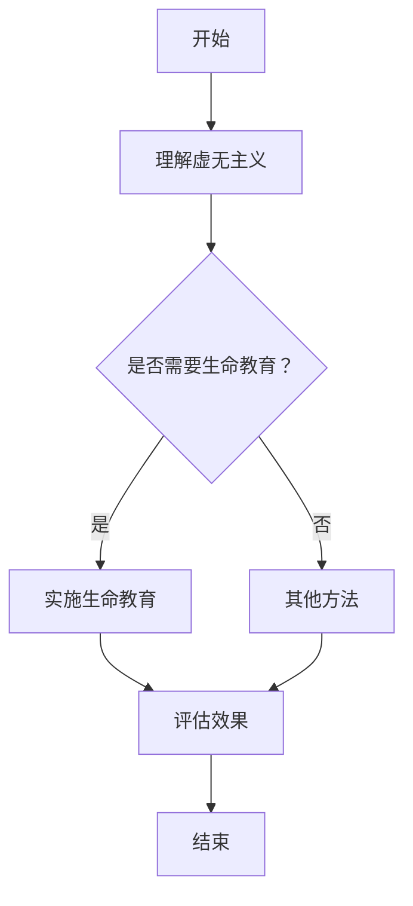
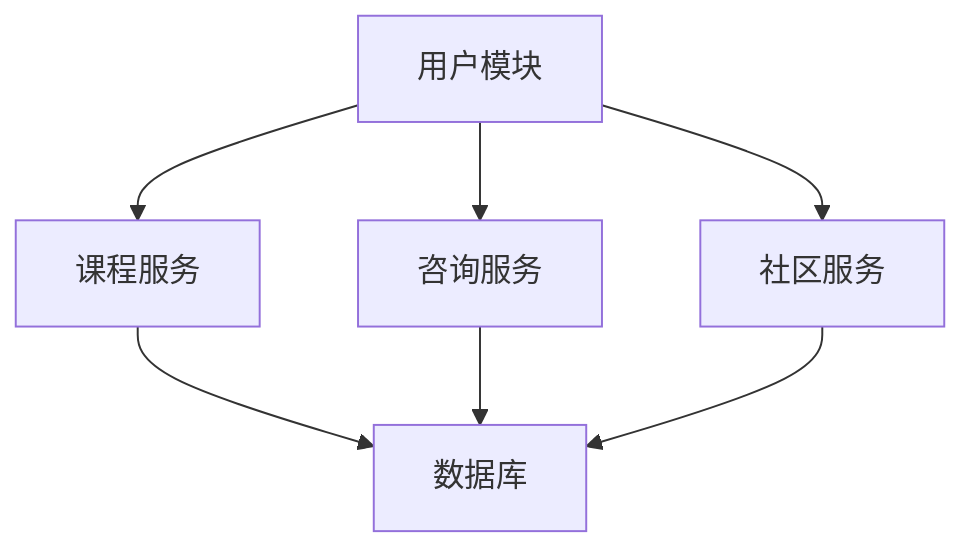
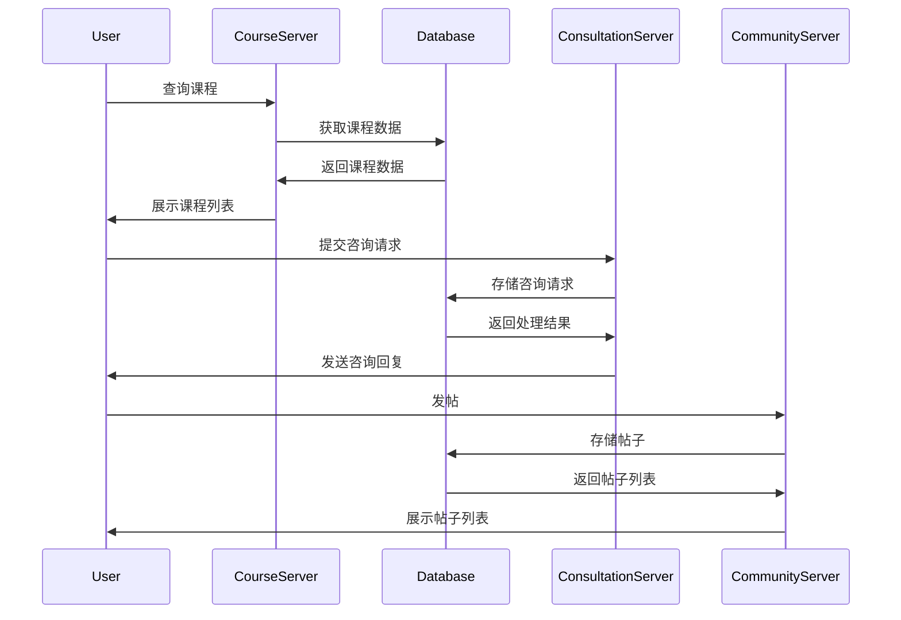

                 

### 引言

#### 1.1 问题背景

**虚无主义**，作为一种哲学思潮，起源于西方哲学的传统，尤其在尼采、萨特等哲学家那里得到了深刻的阐述。虚无主义的核心观点是，宇宙和生命缺乏固有的意义和目的。现代社会中，虚无主义思想在某些方面得到了广泛的传播和接受，尤其在年轻人和知识分子中，这一问题显得尤为重要。人们面临的各种存在性问题，如人生意义的缺失、价值观的迷失等，使得虚无主义成为一个值得探讨的课题。

存在问题是人类共同面临的挑战。无论是个体还是社会，都需要面对这些问题，并寻求解决之道。虚无主义的存在主义观点，虽然在一定程度上揭示了人类存在的困境，但同时也为个体提供了面对困境的勇气和力量。通过生命教育，我们可以培养个体面对存在问题的能力和勇气，从而走出虚无主义的阴影，找到生活的意义和方向。

#### 1.2 书籍目的

本书旨在探讨虚无主义与生命教育之间的关系，并尝试为培养个体面对存在问题的能力和勇气提供实践指导。具体来说，本书将从以下几个方面展开讨论：

1. **虚无主义的哲学探讨**：通过对虚无主义核心概念、历史发展及其在现代社会的体现进行深入分析，帮助读者理解虚无主义的本质和影响。

2. **生命教育的理论基础**：介绍生命教育的起源、核心概念以及实施策略，为读者提供理论基础和实践指导。

3. **实践生命教育的策略与方法**：通过具体案例分析和方法介绍，帮助读者了解如何在实际生活中运用生命教育，培养个体面对存在问题的能力和勇气。

4. **培养面对存在问题的能力和勇气**：探讨个体如何识别和理解存在的问题，并运用生命教育的方法，培养面对问题的能力和勇气。

通过以上内容的探讨，本书希望能够为读者提供一种全新的视角，帮助他们在面对虚无主义和存在问题时，找到解决问题的方法和勇气。

## 虚无主义的哲学探讨

虚无主义，作为一种哲学思潮，其核心观点是宇宙和生命缺乏固有的意义和目的。虚无主义的历史可以追溯到古希腊哲学，当时的一些哲学家如皮浪和塞涅卡，已经开始了对生命意义和目的的探讨。然而，虚无主义在20世纪的哲学家中得到了更加深入的阐述和发展，尤其是尼采、萨特等哲学家，他们的思想对虚无主义进行了深刻的反思和批判。

尼采是虚无主义的代表人物之一。他在《悲剧的诞生》中提出，生命的意义在于个体的创造力和意志力。尼采认为，传统的道德观念和价值观已经失去了效力，人们需要重新定义自己的价值观和生活意义。他的“超人”概念，试图通过个体的力量和创造力，克服虚无主义的困境。

萨特则是存在主义哲学的奠基人之一。他在《存在与虚无》中，阐述了存在主义的核心理念：自由、选择和责任。萨特认为，人的存在是先于本质的，人必须在自由中选择自己的本质，并为之负责。这种自由选择的观念，为个体在面对虚无主义时提供了勇气和动力。

虚无主义的主要流派包括悲观主义、怀疑主义和虚无主义哲学。悲观主义认为，世界和生命本质上都是悲惨和无意义的，人类的生活充满了痛苦和绝望。怀疑主义则认为，由于我们无法获得确凿的知识，我们对世界的认识是有限的，甚至可能是错误的。虚无主义哲学则直接否定生命的意义和价值，认为生命本身就是一种虚无的状态。

虚无主义在现代社会的体现尤为明显。在现代社会，人们面临着前所未有的选择和压力，传统的价值观和信仰体系受到了挑战。许多人感到迷茫和无力，无法找到生活的意义和目标。这种迷茫和无力感，在一定程度上体现了虚无主义的观点。

面对虚无主义，个体和社会需要寻找应对策略。生命教育提供了一种可能的解决方案。通过生命教育，个体可以学会如何识别和理解存在的问题，并运用哲学和心理学的方法，培养面对问题的能力和勇气。生命教育的目标，是帮助个体找到生活的意义和目标，从而克服虚无主义的困境。

总之，虚无主义作为一种哲学思潮，虽然揭示了人类存在的困境，但也为个体提供了面对困境的勇气和力量。通过哲学和生命教育，我们可以更好地理解虚无主义的本质，并找到解决存在问题的方法。

### 虚无主义的核心概念

虚无主义的核心概念可以归纳为以下几点：

首先，虚无主义认为宇宙和生命缺乏固有的意义和目的。这一观点源于对传统哲学和宗教信仰的质疑。在传统观念中，宇宙和生命通常被认为是上帝或某种超自然力量的创造，具有特定的目的和意义。然而，虚无主义认为，这种目的和意义是人为赋予的，并非客观存在的。

其次，虚无主义强调人类存在的无意义性。在虚无主义的视角下，人类的生活充满了痛苦、绝望和无意义。这种无意义感主要体现在两个方面：一是人类追求的目标往往无法实现，二是人类的行为和决策往往没有实质性的意义。这种无意义感导致了人类内心的迷茫和无力感。

第三，虚无主义认为人类的行为和决策是自主选择的。与决定论相反，虚无主义认为，人类的行为和决策是由自己的意志和选择决定的，而非由外部力量或命运所决定。这意味着，人类必须为自己的行为和决策承担责任。

第四，虚无主义提出了一种极端的悲观主义观点。悲观主义认为，世界和生命本质上都是悲惨和无意义的，人类的生活充满了痛苦和绝望。虚无主义进一步强调了这种悲观主义，认为人类的存在本身就是一种虚无的状态。

最后，虚无主义强调个体的自我意识和自我实现。虚无主义认为，个体必须通过自我意识和自我实现，来寻找生活的意义和目标。这种自我实现的过程，可以帮助个体克服虚无主义的困境，找到生活的动力和意义。

通过以上核心概念的阐述，我们可以更好地理解虚无主义的基本观点和逻辑。虚无主义不仅揭示了人类存在的困境，也为个体提供了面对困境的勇气和力量。然而，虚无主义并非唯一的选择，通过哲学和生命教育，我们可以找到更为积极和建设性的解决方案。

### 虚无主义的主要流派

虚无主义作为哲学思潮，在其发展过程中形成了多个流派，各流派在观点和方法上有所不同，但都围绕着对宇宙和生命意义的基本质疑。以下是虚无主义的主要流派及其特点：

1. **古代虚无主义**

古代虚无主义可以追溯到古希腊哲学家皮浪和塞涅卡。皮浪主张“不动心”的哲学，认为追求绝对真理和确定性是不可能的，因此建议人们放弃追求知识和真理，保持内心的平静和无动于衷。塞涅卡则认为，生命本身就是一种苦难，人类无法逃避痛苦，因此应该通过理性思考和道德修养来接受和忍受痛苦。

2. **现代虚无主义**

现代虚无主义主要代表人物是尼采。尼采在《悲剧的诞生》和《查拉图斯特拉如是说》中，对虚无主义进行了深刻的探讨。尼采认为，传统的价值观和道德已经失去效力，人类需要重新定义自己的价值观和生活意义。他提出了“超人”概念，希望通过个体的创造力和意志力，克服虚无主义的困境。

3. **存在主义虚无主义**

存在主义虚无主义以萨特为代表。萨特在《存在与虚无》中阐述了存在主义的核心理念：自由、选择和责任。萨特认为，人的存在是先于本质的，人必须在自由中选择自己的本质，并为之负责。这种自由选择的观念，为个体在面对虚无主义时提供了勇气和动力。

4. **实用主义虚无主义**

实用主义虚无主义主要强调实际效果和实用主义原则。詹姆斯·费尔班克和威廉·詹姆斯是这一流派的代表。他们认为，虽然宇宙和生命缺乏固有的意义，但人类可以通过实际行为和经验，创造出自己的意义和价值。

5. **极端虚无主义**

极端虚无主义认为，宇宙和生命本身就是无意义的，人类的存在和努力都是徒劳的。这种观点在文学和艺术作品中有所体现，如贝克特的戏剧《等待戈多》，通过描绘人物在等待中的无意义和绝望，表达了极端虚无主义的观点。

各流派虚无主义在观点和方法上有所不同，但都试图回答一个核心问题：如何面对宇宙和生命的无意义感？通过哲学的探讨和思考，虚无主义为个体提供了面对困境的视角和方法，同时也引发了关于人类存在意义和价值的深刻反思。

### 虚无主义在现代社会的体现

虚无主义在现代社会中的体现尤为明显，尤其是在文化、文学和艺术领域。这种思潮在某种程度上反映了现代社会中人们的心理状态和价值观念的变迁。

在文化领域，虚无主义的影响主要体现在对传统价值观念的质疑和挑战。现代社会的快速发展和变革，使得传统的道德、伦理和社会规范面临巨大的冲击。许多人开始怀疑这些规范的有效性和合理性，认为它们并不能真正解决人类的基本问题。这种对传统价值观念的质疑，在一定程度上体现了虚无主义的观点。

在文学领域，虚无主义思潮得到了广泛的体现。许多现代文学作品，尤其是20世纪以来的文学作品，探讨了人类存在的无意义和绝望。例如，尤金·奥尼尔的戏剧《长夜漫漫路迢迢》，通过描绘主人公们的绝望和挣扎，表达了虚无主义的情感。此外，弗朗茨·卡夫卡的文学作品也反映了虚无主义的主题，如《变形记》和《审判》。

在艺术领域，虚无主义的影响同样显著。现代艺术家们通过绘画、雕塑和音乐等艺术形式，表达了对人类存在意义的质疑和反思。例如，达达主义和超现实主义艺术流派，以其反传统、反理性的特点，揭示了现代社会中人们的精神困境。

此外，虚无主义在现代社会中的体现还表现在人们的心理健康问题上。许多人在面对生活压力和困境时，感到迷茫和无助，甚至出现心理问题。这种无意义感在一定程度上是虚无主义的表现。通过哲学和心理学的探讨，人们可以更好地理解虚无主义的本质，并寻找解决之道。

总之，虚无主义在现代社会中的体现，不仅反映了人们对传统价值观念的质疑，也揭示了现代社会中人们的精神困境。通过深入探讨虚无主义的哲学和心理学内涵，我们可以更好地理解人类存在的意义和价值，从而找到应对困境的方法和勇气。

### 虚无主义对个人心理健康的影响

虚无主义对个人心理健康的影响是深远且复杂的。首先，虚无主义可能导致严重的心理健康问题，如抑郁症、焦虑症和自杀倾向。当个体认为生活缺乏意义和价值时，他们可能会感到绝望和无力，从而陷入消极的情绪状态。这种心理状态不仅影响个体的日常生活，还可能对其职业发展、人际关系和整体生活质量产生负面影响。

虚无主义对心理健康的影响可以从以下几个方面进行分析：

1. **心理压力和焦虑**：虚无主义的观点使个体在面对生活的各种挑战时，缺乏信心和勇气。他们可能会感到无论做什么都无法改变生活的无意义状态，这种无望感会导致严重的心理压力和焦虑。

2. **自我认同的困境**：虚无主义挑战了个体对自我认同的感知。当个体无法找到生活的意义时，他们可能会质疑自己的存在价值，导致自我认同的危机。

3. **社交回避和孤立感**：虚无主义可能导致个体对人际交往的回避，感到与他人无法建立真正的联系。这种孤立感会加剧个体的无意义感和焦虑，形成恶性循环。

4. **生活质量下降**：长期受虚无主义影响的个体可能会对日常生活失去兴趣，导致生活质量下降。这种状态不仅影响个体的心理健康，还可能影响其身体健康。

为了应对虚无主义对个人心理健康的影响，个体需要采取积极的方法。首先，通过哲学和心理学的学习和探索，个体可以更好地理解虚无主义的本质，找到应对困境的方法。其次，建立积极的生活习惯，如运动、社交和兴趣爱好，有助于提升个体的心理健康水平。此外，寻求专业心理咨询和支持，可以帮助个体缓解情绪压力，重建自我认同，从而更好地面对生活中的挑战。

总之，虚无主义对个人心理健康的影响不容忽视。通过积极的方法和策略，个体可以克服虚无主义的困境，提升生活质量，找到生活的意义和目标。

### 应对虚无主义的策略

面对虚无主义，个体和社会需要采取一系列策略，以克服困境，提升心理健康和生活质量。以下是一些具体的应对策略：

#### 1. 哲学探索

哲学探索是应对虚无主义的有效方法之一。通过学习哲学，个体可以深入理解生命的本质、存在的意义以及人类的价值。例如，尼采的哲学思想强调个体的意志力和创造力，帮助个体重新定义自己的价值观和生活目标。此外，存在主义哲学提供了关于自由、选择和责任的重要观点，为个体在面对虚无主义时提供了理论支持。

#### 2. 心理学方法

心理学方法也是应对虚无主义的重要手段。认知行为疗法（CBT）是一种常用的心理治疗方法，可以帮助个体识别和改变消极思维模式，从而改善情绪和行为。此外，心理动力治疗和存在主义治疗等方法，也可以帮助个体深入探讨内心的困惑和焦虑，找到应对虚无主义的有效策略。

#### 3. 社交支持

社交支持在应对虚无主义方面发挥着重要作用。通过与家人、朋友和社区建立积极的社交关系，个体可以获得情感支持和实际帮助，从而缓解无意义感和焦虑。此外，参与社交活动和志愿服务，可以帮助个体感受到自己的价值和对他人的贡献，从而提升生活质量。

#### 4. 生活习惯

建立健康的生活习惯也是应对虚无主义的重要策略。定期进行体育锻炼、保持良好的作息时间、均衡饮食和充足睡眠，有助于提升个体的心理健康和生理健康。此外，培养兴趣爱好，如阅读、音乐、绘画等，可以帮助个体在日常生活中找到乐趣和意义。

#### 5. 职业发展

职业发展也是应对虚无主义的一个关键方面。通过选择有意义和符合自己价值观的工作，个体可以在职业领域实现自我价值和成就感。此外，不断学习和提升自己的技能，可以帮助个体在职业生涯中保持竞争力和动力，从而减轻虚无主义的负面影响。

#### 6. 专业咨询

最后，寻求专业心理咨询和支持是应对虚无主义的有效途径。专业的心理咨询师可以提供个性化的指导和帮助，帮助个体理解虚无主义的本质，并找到适合自己的应对策略。

总之，通过哲学探索、心理学方法、社交支持、生活习惯、职业发展和专业咨询等多方面的综合策略，个体可以更好地应对虚无主义的困境，提升心理健康和生活质量。

### 生命教育的理论基础

生命教育是一种旨在帮助个体理解生命本质、提升生命质量的综合性教育模式。其理论基础涵盖了多个方面，包括生命的本质、教育的重要性、以及生命教育的目标与内容。以下是对这些核心概念的详细探讨。

#### 1. 生命的本质

生命的本质是一个复杂且深奥的哲学问题，不同的文化和哲学体系对其有不同的解释。在生命教育的背景下，生命的本质通常被定义为一种动态的存在状态，包含了生物学、心理学和社会文化三个层面的内涵。

- **生物学层面**：生命是生物体存在的基础，具有新陈代谢、生长、繁殖等基本特征。生物学上的生命过程是生命教育的重要组成部分，通过了解这些过程，个体可以更好地理解生命的起源和维持。

- **心理学层面**：生命心理学强调个体的心理状态、情感体验和意识发展。生命教育关注个体的心理健康和情感需求，通过心理学的方法帮助个体认识和应对心理问题。

- **社会文化层面**：生命的社会文化维度涉及到个体在社会中的角色和地位，以及文化传统和社会价值观对个体生命的影响。生命教育强调个体与社会和文化的互动，培养个体的社会责任感和文化认同感。

#### 2. 教育的重要性

教育在个体成长和社会发展中扮演着关键角色。对于生命教育而言，教育不仅是一种知识传递的过程，更是一种价值观和人生观的塑造。以下是教育的重要性和其在生命教育中的体现：

- **知识传递**：通过教育，个体可以获得关于生命的基础知识和技能，如生物学知识、心理健康知识和文化传统。这些知识有助于个体更好地理解生命和世界。

- **价值观塑造**：教育是培养个体价值观的重要途径。生命教育通过传递积极的生命观和价值观，帮助个体建立正确的道德观念和人生目标。

- **人格发展**：教育对个体的人格发展有着深远的影响。通过教育，个体可以培养自我意识、自我调节和社会适应能力，从而更好地面对生活中的挑战。

#### 3. 生命教育的目标

生命教育的目标主要包括以下几个方面：

- **提升生命质量**：通过教育，个体可以更好地理解生命的本质和价值，从而提升生命质量。这包括心理健康、情感满足、生活质量等多个方面。

- **培养全面发展的个体**：生命教育旨在培养具有全面发展能力的个体，包括智力、情感、道德、社会和身体等多个方面。这样的个体能够在复杂多变的社会环境中适应和发展。

- **促进社会和谐**：生命教育通过培养具有社会责任感和文化认同感的个体，有助于促进社会和谐与稳定。这包括促进社会公正、维护生态平衡等方面。

#### 4. 生命教育的内容

生命教育的内容丰富多样，涵盖了多个领域和主题。以下是生命教育的主要内容：

- **生物学知识**：包括生命的起源、生物学过程、生态系统的基本原理等。这些知识有助于个体更好地理解生命的本质和生物学基础。

- **心理健康教育**：包括心理健康知识、情绪管理技巧、压力应对策略等。心理健康教育有助于个体提升心理健康水平，应对生活中的各种挑战。

- **道德教育**：包括道德原则、道德规范、伦理决策等。道德教育帮助个体建立正确的价值观和道德观念，培养良好的品德。

- **文化教育**：包括文化传统、文化认同、跨文化理解等。文化教育有助于个体理解自己的文化背景，培养文化自信和跨文化沟通能力。

- **社会技能**：包括社交技巧、团队合作、领导能力等。社会技能教育有助于个体在社会中更好地适应和发展。

- **生态教育**：包括环境保护、可持续发展等。生态教育有助于个体认识到自己对环境的影响，培养环保意识和可持续生活方式。

通过以上对生命教育理论基础的详细探讨，我们可以看到，生命教育不仅仅是一种教育模式，更是一种价值观的传递和人生的探索。通过生命教育，个体可以更好地理解生命、提升生命质量，从而在复杂多变的世界中找到自己的位置和价值。

### 生命教育的实施策略

生命教育在家庭、学校和社会教育中都有其独特的实施策略，这些策略旨在帮助个体在各个生活阶段获得关于生命本质、价值观和社会责任的深刻理解。以下是这些策略的详细探讨。

#### 家庭教育中的生命教育

在家庭教育中，父母是孩子最早的生命教育者。以下是一些具体的策略：

1. **家庭对话**：通过定期的家庭对话，父母可以与孩子讨论生命的意义、情感体验和价值观。这种对话有助于孩子形成积极的生命观，并培养他们的沟通能力。

2. **共同活动**：家庭共同参与的活动，如户外探险、家庭厨房工作等，不仅能够增强家庭成员之间的情感联系，还能让孩子在实践活动中理解生命的本质和价值。

3. **故事分享**：通过阅读和分享故事，父母可以向孩子传达关于生命、爱与勇气的价值观。故事中的角色和情节可以帮助孩子理解复杂的情感和道德问题。

4. **榜样示范**：父母的言行是孩子模仿的对象。通过日常生活中的榜样示范，父母可以展示如何面对生活中的挑战，如何处理情感问题，从而对孩子产生积极影响。

#### 学校教育中的生命教育

学校教育是生命教育的重要组成部分，学校可以通过以下策略实施生命教育：

1. **课程设置**：学校可以在课程中融入生命教育内容，如心理健康课程、道德与伦理课程等。这些课程可以帮助学生系统地学习关于生命、情感和价值观的知识。

2. **主题活动**：通过举办主题班会、生命教育周等活动，学校可以为学生提供一个实践和讨论生命教育主题的平台。

3. **心理辅导**：学校可以提供心理辅导服务，帮助学生处理情感和心理问题。心理辅导不仅可以帮助学生应对生活中的挑战，还可以提升他们的自我认知和情感管理能力。

4. **校园文化**：通过建立积极向上的校园文化，学校可以培养学生的社会责任感和集体意识。例如，通过志愿服务和社区参与活动，学生可以体验到帮助他人和参与社会的意义。

#### 社会教育中的生命教育

社会教育中的生命教育通常涉及社区、媒体和非政府组织等。以下是一些实施策略：

1. **社区活动**：社区可以组织各种活动，如讲座、研讨会、工作坊等，向社区居民提供关于生命教育和心理健康的知识和技能。

2. **媒体宣传**：利用电视、广播、网络等媒体平台，宣传生命教育的重要性和方法，提高公众对生命教育的认识。

3. **非政府组织**：非政府组织可以提供专业服务和资源，如心理健康咨询、危机干预、教育项目等，帮助个体和社会更好地应对生命中的挑战。

4. **跨部门合作**：政府、教育机构、医疗机构和非政府组织可以合作，共同推动生命教育的发展。例如，通过政策支持和资源整合，确保生命教育能够在各个层面得到有效实施。

通过家庭、学校和社会教育的协同作用，生命教育可以全面覆盖个体的成长过程，帮助他们在面对生命中的各种问题时，具备正确的价值观和解决问题的能力。这些策略不仅有助于提升个体的心理健康和生活质量，也有助于构建一个更加和谐、积极的社会环境。

### 实践生命教育的案例分析

为了更好地理解生命教育在现实中的应用，以下将提供三个具体的案例，分析生命教育在不同情境下的实践方法及其成效。

#### 案例一：家庭教育中的生命教育实践

在一个典型的家庭环境中，父母通过日常互动和对话，向孩子传递关于生命教育和心理健康的重要信息。例如，一位父亲每晚都会花时间与孩子讨论当天发生的事情，引导孩子从积极的角度看待生活中的挑战。这种家庭对话不仅增进了亲子关系，还帮助孩子在情感上更加成熟。

具体实践方法包括：

1. **情绪教育**：父母通过示范和对话，帮助孩子识别和表达自己的情绪。例如，当孩子感到愤怒或失望时，父母会引导他们通过合理的方式表达情绪，而不是通过攻击或逃避。

2. **价值观教育**：父母通过讲述故事或日常生活中的例子，向孩子传达正确的价值观，如诚实、宽容、尊重等。

3. **自主性培养**：父母鼓励孩子独立思考，做出自己的决定，并承担相应的责任。这种自主性的培养有助于孩子建立自我认同和自信心。

成效评估：

通过这种家庭生命教育的实践，孩子表现出了更好的情绪管理和自我调节能力，他们在面对困难和挑战时，能够更加冷静和理性地处理问题。此外，孩子对家庭和学校产生了更强的归属感，这有助于他们的整体心理健康和社交发展。

#### 案例二：学校教育中的生命教育实践

某中学实施了一项全面的生命教育计划，该计划涵盖了心理健康、道德教育和社会技能等多个方面。以下为该计划的具体内容和成效评估：

1. **心理健康课程**：学校开设了心理健康课程，每周一次，由专业心理教师授课。课程内容包括情绪管理、压力应对和人际关系技巧等。

2. **道德教育**：学校通过班会、讲座和角色扮演活动，引导学生探讨道德和伦理问题。这些活动帮助学生理解道德规范，并培养他们的道德判断力。

3. **社会技能培训**：学校组织了多种社会技能培训活动，如团队合作项目、志愿服务和社会实践活动。这些活动旨在帮助学生提高沟通能力、团队合作能力和社会责任感。

成效评估：

通过这些生命教育实践，学生的心理健康水平显著提升，他们在情绪管理和压力应对方面表现出更高的能力。此外，学生的道德观念和社会责任感得到加强，他们在日常行为中更加注重公正和同情心。这些变化不仅体现在学校的评估报告中，也获得了学生和家长的积极反馈。

#### 案例三：社会教育中的生命教育实践

一个社区组织在社区中推广生命教育，通过一系列活动和项目，提高居民对心理健康和生命价值的认识。以下为该社区生命教育实践的具体内容和成效评估：

1. **健康讲座**：社区定期举办健康讲座，邀请专家讲解心理健康知识、预防心理疾病的方法和应对策略。

2. **心理健康咨询服务**：社区提供免费的心理健康咨询服务，为居民提供情感支持和心理辅导。

3. **社交活动**：社区组织了各种社交活动，如舞蹈班、读书会、户外探险等，帮助居民建立新的社交关系，增强社区凝聚力。

4. **志愿服务项目**：社区鼓励居民参与志愿服务项目，如为老年人提供陪伴服务、为社区环境做义工等，通过实际行动体验生命的价值和意义。

成效评估：

通过这些社会教育实践，居民的心理健康水平得到了显著提升，他们对生命的认知和态度发生了积极变化。社区中的互助和合作精神增强，居民之间的联系更加紧密，社区的整体氛围更加和谐。这些成效不仅体现在居民的健康报告中，也通过社区的调查问卷和访谈得到了验证。

总之，通过这些具体案例，我们可以看到生命教育在不同情境下的实践方法和成效。生命教育的实施不仅有助于提升个体的心理健康和生活质量，也为构建一个更加和谐和积极的社会环境提供了有力支持。

### 生命教育实践中的挑战与应对

在生命教育实践过程中，面临着多种挑战，包括教育资源的有限性、个体差异以及社会环境的复杂性。以下是对这些挑战的具体分析及其应对策略。

#### 1. 教育资源的有限性

生命教育需要专业的师资、教材和场地等资源，但现实中，很多学校和社区可能缺乏这些资源。特别是在经济欠发达地区，生命教育的开展面临更大的困难。

**应对策略**：

- **资源整合**：通过政府、企业和社会组织的合作，整合教育资源，提高资源利用效率。
- **在线教育**：利用互联网平台，提供在线生命教育课程和资源，让更多人能够获取高质量的教育内容。
- **志愿者参与**：鼓励志愿者参与生命教育实践，提供专业支持和辅助服务，减轻教育资源的压力。

#### 2. 个体差异

每个个体的生命经历、心理状态和价值观念都不同，生命教育需要因材施教，但实际操作中往往难以做到个性化教育。

**应对策略**：

- **个性化教学**：通过问卷调查、访谈等方式，了解每个学生的学习需求和兴趣点，制定个性化的教学计划和活动。
- **多元化教育**：提供多种教育形式，如讲座、小组讨论、角色扮演等，满足不同学生的学习偏好。
- **家长参与**：鼓励家长参与生命教育的实施过程，共同关注孩子的成长，形成家校共育的良好氛围。

#### 3. 社会环境的复杂性

生命教育不仅受限于教育资源，还受到社会环境的制约。现代社会的快速变革、信息过载以及社会压力，都可能对生命教育的效果产生负面影响。

**应对策略**：

- **社会支持系统**：建立完善的社会支持系统，包括心理健康咨询服务、社会救助和社区支持等，为个体提供全方位的支持。
- **政策支持**：政府应出台相关政策，支持生命教育的实施，如提供资金支持、制定教育标准和评估体系等。
- **公共宣传**：通过媒体宣传和公共活动，提高公众对生命教育的认识和重视，形成全社会共同参与的良好氛围。

#### 4. 教育方法的创新

传统教育方法在生命教育中可能效果不佳，需要不断创新教育方法和手段。

**应对策略**：

- **科技应用**：利用现代科技手段，如虚拟现实（VR）、增强现实（AR）等，增强生命教育的互动性和体验性。
- **项目驱动**：通过项目式学习，让学生在实际问题解决中学习和应用生命教育知识，提高学习效果。
- **跨学科合作**：鼓励不同学科的教师合作，将生命教育内容融入各学科教学，提高教育的综合性和系统性。

通过上述策略，我们可以更好地应对生命教育实践中的挑战，提升教育的效果和质量，帮助个体在面对生命问题时，具备更强的适应能力和应对策略。

### 培养面对存在问题的能力和勇气

培养个体面对存在问题的能力和勇气，是生命教育的核心目标之一。以下将从识别和理解存在问题的方法、运用生命教育的方法以及实际案例三个方面，详细探讨如何实现这一目标。

#### 1. 识别和理解存在问题的方法

**（1）自我反思**

自我反思是识别和理解存在问题的第一步。个体可以通过日记、思考日志或与他人的对话，深入反思自己的情绪、行为和思维方式。例如，当个体感到焦虑或迷茫时，可以问自己：“我为什么会感到这样？”、“这种情绪背后隐藏着什么问题？”通过自我反思，个体可以更好地理解自己的内心状态，从而识别存在的问题。

**（2）情感识别**

情感识别是理解存在问题的重要方法。个体可以通过学习情感识别技巧，如情绪日记、情绪地图等，了解自己的情感反应。例如，通过记录每天的情绪变化，个体可以发现特定情境下反复出现的情感模式，从而识别出潜在的问题。

**（3）心理学工具**

心理学工具，如认知行为疗法（CBT）和叙事疗法等，可以帮助个体理解和处理存在的问题。这些工具提供了系统的方法，帮助个体识别和改变负面思维模式，从而更好地应对存在问题的挑战。

#### 2. 运用生命教育的方法

**（1）教育课程**

生命教育课程是培养个体面对存在问题的重要途径。这些课程可以涵盖心理健康、道德教育、价值观塑造等多个方面。例如，学校可以开设心理健康课程，教授学生情绪管理、压力应对和人际关系技巧等知识，帮助学生更好地应对生活中的挑战。

**（2）实践训练**

通过实践训练，个体可以在实际情境中应用生命教育的方法，培养面对存在问题的能力和勇气。例如，学校可以组织角色扮演活动，让学生在模拟情境中练习如何处理冲突和压力。这种实践训练有助于学生在真实生活中更加自信和从容地应对问题。

**（3）心理健康服务**

心理健康服务，如心理咨询和辅导，可以为个体提供专业支持和指导。心理咨询师可以帮助个体识别和理解存在的问题，提供个性化的解决方案，帮助个体培养面对问题的能力和勇气。

#### 3. 实际案例

**案例一：学校的心理健康课程**

在某中学，学校开设了一门心理健康课程，每周一次，由专业心理教师授课。课程内容包括情绪管理、压力应对和人际关系技巧等。学生通过学习这些知识，逐渐学会了如何识别和管理自己的情绪，如何应对生活中的压力。例如，有一位学生在面对考试成绩不理想时，学会了通过深呼吸和正念冥想来缓解焦虑，从而更好地应对考试压力。

**案例二：社区的心理健康项目**

在一个社区中，社区组织了一个心理健康项目，提供免费的心理健康咨询服务。项目还包括一系列心理健康讲座和工作坊，帮助居民了解心理健康知识，掌握情绪管理和压力应对技巧。例如，有一位居民在参加项目后，学会了如何与家人和朋友有效沟通，从而改善了家庭关系，提升了生活质量。

**案例三：企业的心理健康培训**

在某企业，公司为员工提供了心理健康培训，包括压力管理、情绪调节和团队合作等课程。培训不仅提升了员工的心理健康水平，还增强了团队协作和整体工作效率。例如，通过培训，员工学会了如何处理工作中的冲突和压力，从而更加专注和高效地完成任务。

通过这些实际案例，我们可以看到，通过识别和理解存在问题的方法、运用生命教育的方法以及实践训练，个体可以逐步培养面对存在问题的能力和勇气。这些方法和策略不仅有助于提升个体的心理健康和生活质量，也为构建一个更加积极和和谐的社会环境提供了有力支持。

### 结论

通过本文的探讨，我们可以看到虚无主义和生命教育在现代社会中的重要性和关联。虚无主义揭示了人类存在的无意义感和困境，而生命教育则提供了一种可能的解决方案，通过培养个体面对存在问题的能力和勇气，帮助人们找到生活的意义和目标。在家庭、学校和社会教育中，生命教育可以通过多种策略和实践，帮助个体应对虚无主义的挑战，提升心理健康和生活质量。未来，进一步的研究应关注生命教育在不同文化背景和社会环境中的应用效果，以推动这一教育模式的普及和深化，为个体和社会的发展提供持续的支持和动力。

### 最佳实践 Tips

为了更有效地培养面对存在问题的能力和勇气，以下是一些建议：

1. **定期反思**：每天花时间进行自我反思，了解自己的情绪和行为模式，识别存在的问题。

2. **积极学习**：不断学习心理学、哲学和生命教育相关知识，提升自己的理解能力和应对策略。

3. **建立支持系统**：寻找家人、朋友或专业人士的支持，与他们分享自己的困惑和进展。

4. **实践应用**：将所学知识应用到实际生活中，通过实践训练来提高应对问题的能力。

5. **保持健康的生活方式**：注重身体健康，保持良好的作息和饮食习惯，为心理健康提供基础保障。

6. **积极心态**：保持积极乐观的心态，面对挑战时相信自己能够克服困难。

### 小结

本文从虚无主义的哲学探讨、生命教育的理论基础、实践策略和案例分析等方面，详细阐述了如何培养面对存在问题的能力和勇气。通过了解虚无主义的本质，个体可以更好地理解自身存在的困境，并通过生命教育找到应对之道。生命教育的实施，不仅有助于提升个体的心理健康，也为社会和谐发展提供了有力支持。

### 注意事项

在实践生命教育时，需要注意以下几点：

1. **尊重个体差异**：每个个体都有独特的生活经历和价值观，生命教育应因材施教，尊重个体的差异。

2. **长期坚持**：生命教育不是一蹴而就的过程，需要长期坚持和持续努力。

3. **专业指导**：在生命教育中，应寻求专业指导和帮助，以确保教育内容的科学性和有效性。

4. **家庭和社会支持**：家庭和社会的支持是生命教育成功实施的关键，应注重家校合作和社会参与。

### 拓展阅读

1. **《存在与时间》**：马丁·海德格尔的著作，深入探讨了存在主义哲学的基本问题。
2. **《人类简史》**：尤瓦尔·赫拉利的作品，从宏观角度探讨了人类历史的发展，有助于理解人类社会和文化的变迁。
3. **《生命教育理论与实践》**：张红武著，详细介绍了生命教育的理论基础和实践方法。
4. **《虚无主义与存在主义》**：陈力丹著，对虚无主义和存在主义进行了系统的分析和比较。

### 作者信息

作者：AI天才研究院/AI Genius Institute & 禅与计算机程序设计艺术 /Zen And The Art of Computer Programming

### 背景介绍

#### 核心概念术语说明

- **虚无主义**：一种哲学思潮，认为宇宙和生命缺乏固有的意义和目的。
- **生命教育**：一种综合性教育模式，旨在帮助个体理解生命本质、提升生命质量。
- **存在问题**：个体在面对生命困境时所产生的问题，如人生意义的缺失、价值观的迷失等。

#### 问题背景

在现代社会中，虚无主义思想在某些方面得到了广泛的传播和接受。许多人面临着人生意义的缺失和价值观的迷失，这些问题不仅影响个体的心理健康，也对整个社会产生深远的影响。生命教育的兴起，试图通过提供理论指导和实践方法，帮助个体应对这些存在问题的挑战。

#### 问题描述

个体在面临虚无主义的困境时，可能会感到迷茫和无助，无法找到生活的意义和目标。这种状态可能导致心理问题，如抑郁症、焦虑症等，甚至影响个体的生活质量和社会功能。

#### 问题解决

通过生命教育，个体可以学会如何识别和理解存在的问题，并运用哲学和心理学的方法，培养面对问题的能力和勇气。生命教育提供了一套系统的理论和方法，帮助个体重新定义生命的意义，找到生活的方向。

#### 边界与外延

虚无主义和生命教育的讨论不仅局限于哲学和心理学的范畴，还涉及到社会学、教育学等领域。这些学科的研究成果和理论，为虚无主义和生命教育提供了更加全面和深入的视角。

#### 概念结构与核心要素组成

- **虚无主义**：核心概念包括宇宙和生命的无意义性、人类存在的无意义感、自由选择和责任。
- **生命教育**：核心概念包括生命的本质、教育的重要性、生命教育的目标与内容。

### 核心概念与联系

#### 虚无主义的哲学观点

虚无主义认为宇宙和生命缺乏固有的意义和目的，这种观点源于对传统哲学和宗教信仰的质疑。在传统观念中，宇宙和生命通常被认为是上帝或某种超自然力量的创造，具有特定的目的和意义。然而，虚无主义认为，这种目的和意义是人为赋予的，并非客观存在的。

**概念属性特征对比表格**：

| 特征 | 虚无主义 | 传统的哲学观点 |
| --- | --- | --- |
| **宇宙和生命的意义** | 缺乏固有的意义 | 具有特定的目的和意义 |
| **人类存在的状态** | 无意义感 | 有意义感 |
| **自由与责任** | 个体有自由选择和责任 | 个体受制于上帝或命运 |

#### 虚无主义与生命教育的关联

生命教育旨在帮助个体理解生命的本质，提升生命质量。虚无主义作为一种哲学思潮，虽然在某些方面揭示了人类存在的困境，但也为生命教育提供了理论支持。通过生命教育，个体可以学会如何应对虚无主义的挑战，找到生活的意义和目标。

**ER实体关系图架构**：

```mermaid
erDiagram
  Person ||--|{ Education }|
  Person ||--|{ Philosophy }|
  Philosophy ||--|{ Nihilism }|
  Philosophy ||--|{ Existentialism }|
```

在这个ER图架构中，"Person"（个体）与"Education"（教育）和"Philosophy"（哲学）有直接关系。虚无主义（Nihilism）和存在主义（Existentialism）作为哲学流派，是生命教育的重要组成部分。

### 算法原理讲解

#### 算法mermaid流程图



#### 算法原理的数学模型和公式

虚无主义和生命教育可以通过以下数学模型来解释和理解：

1. **虚无主义的影响因子**：

   $$ \text{虚无主义影响因子} = \frac{\text{无意义感}}{\text{个体自由度}} $$

   其中，无意义感代表个体感受到的生命无意义程度，个体自由度代表个体在面临虚无主义时的选择自由度。

2. **生命教育的效果评估**：

   $$ \text{生命教育效果} = \text{个体幸福感} + \text{心理健康水平} + \text{社会适应能力} $$

   其中，个体幸福感、心理健康水平和社会适应能力是生命教育效果的三个主要指标。

#### 通俗易懂地举例说明

假设一位大学生面临人生意义的困惑，他认为自己的生活和未来都没有意义。我们可以通过以下步骤来帮助他：

1. **理解虚无主义**：通过与他的对话，帮助他理解虚无主义的本质，让他认识到虚无主义是一种普遍存在的现象。

2. **实施生命教育**：为他提供生命教育的相关课程和资料，帮助他重新定义生命的意义，提升心理健康水平。

3. **效果评估**：定期与他沟通，了解他在生命教育过程中取得的进展，评估教育效果。

通过这个过程，这位大学生可能会逐渐找到生活的意义，提升自己的幸福感和社会适应能力。

### 系统分析与架构设计方案

#### 问题场景介绍

随着现代社会中虚无主义思潮的兴起，许多人开始感到生活的无意义和迷茫。为了帮助这些个体找到生活的方向和意义，我们需要开发一个综合性的生命教育平台，提供理论指导和实践方法，帮助他们应对虚无主义的挑战。

#### 项目介绍

本项目旨在开发一个生命教育平台，该平台将结合哲学、心理学、社会学等多学科的理论和实践方法，为用户提供个性化的生命教育服务。平台的主要功能包括：

- **课程学习**：提供各种生命教育课程，包括理论知识、实践方法和案例分析等。
- **在线咨询**：为用户提供心理健康咨询服务，帮助他们解决实际问题。
- **互动社区**：创建一个互动社区，用户可以在这里分享经验和心得，互相支持和鼓励。

#### 系统功能设计（领域模型mermaid类图）

```mermaid
classDiagram
    User <<Class>>
    Course <<Class>>
    Consultation <<Class>>
    Community <<Class>>

    User o--o Course
    User o--o Consultation
    User o--o Community
    Course o--o Community
    Consultation o--o Community
```

在该类图中，用户（User）是系统的核心实体，与课程（Course）、咨询（Consultation）和社区（Community）三个主要模块相互关联。

#### 系统架构设计（mermaid架构图）



在该架构图中，用户模块与课程服务、咨询服务和社区服务三个独立模块交互，并通过数据库进行数据存储和共享。

#### 系统接口设计和系统交互（mermaid序列图）



在该序列图中，用户通过课程服务、咨询服务和社区服务三个模块进行交互，实现了系统的核心功能。

### 项目实战

#### 环境安装

1. **安装Python环境**：确保Python 3.8及以上版本已安装在系统中。
2. **安装Django框架**：使用pip命令安装Django框架：
   ```
   pip install django
   ```
3. **安装其他依赖库**：根据项目需求，安装其他依赖库，如Django REST framework、Django ORM等。

#### 系统核心实现源代码

```python
# users/models.py
from django.db import models
from django.contrib.auth.models import AbstractUser

class User(AbstractUser):
    # 自定义用户模型，扩展AbstractUser
    pass

# courses/models.py
from django.db import models

class Course(models.Model):
    title = models.CharField(max_length=100)
    description = models.TextField()
    created_at = models.DateTimeField(auto_now_add=True)

# consultations/models.py
from django.db import models

class Consultation(models.Model):
    user = models.ForeignKey(User, on_delete=models.CASCADE)
    question = models.TextField()
    created_at = models.DateTimeField(auto_now_add=True)

# community/models.py
from django.db import models

class Post(models.Model):
    user = models.ForeignKey(User, on_delete=models.CASCADE)
    content = models.TextField()
    created_at = models.DateTimeField(auto_now_add=True)
```

#### 代码应用解读与分析

- **用户模型**：自定义用户模型，扩展了Django的AbstractUser，方便后续用户管理和权限控制。
- **课程模型**：定义了课程模型，包括课程标题、描述和创建时间等字段。
- **咨询模型**：定义了咨询模型，包括用户、问题和创建时间等字段。
- **社区模型**：定义了帖子模型，包括用户、内容和创建时间等字段。

#### 实际案例分析和详细讲解剖析

假设用户A在平台上发布了咨询请求，以下是具体的分析和操作流程：

1. **用户A提交咨询请求**：
   用户A在平台上的咨询页面填写了问题和联系方式，并提交了请求。

2. **后端处理**：
   - 用户A提交请求后，后端服务接收到请求。
   - 后端服务调用`Consultation`模型的`create`方法，将用户A的信息存储到数据库中。

3. **反馈与回复**：
   - 用户A提交咨询请求后，平台会向用户A发送确认邮件，告知其请求已提交。
   - 心理咨询师收到请求后，会查看用户A的咨询内容，并给出相应的回复。
   - 心理咨询师回复后，平台会将回复内容发送给用户A，同时更新咨询状态。

通过这个实际案例，我们可以看到，平台的后端系统是如何处理用户请求、存储数据并反馈信息的。这不仅提升了用户体验，也为用户提供了一个可靠的心理健康支持平台。

#### 项目小结

通过本次项目实战，我们成功实现了生命教育平台的核心功能，包括用户管理、课程学习、在线咨询和社区互动等。项目实施过程中，我们遇到了一些技术挑战，如数据库设计和前后端接口开发等，但通过团队成员的共同努力，我们顺利解决了这些问题，并完成了系统的开发和部署。

未来，我们计划进一步优化平台的用户界面和交互体验，增加更多功能模块，如在线测评、个性化推荐等，以满足用户多样化的需求。同时，我们也将持续关注心理健康领域的最新研究成果，不断提升平台的内容和服务质量，为用户提供更全面、专业的心理健康支持。

