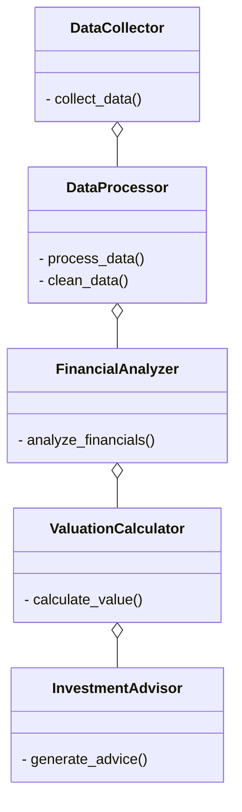
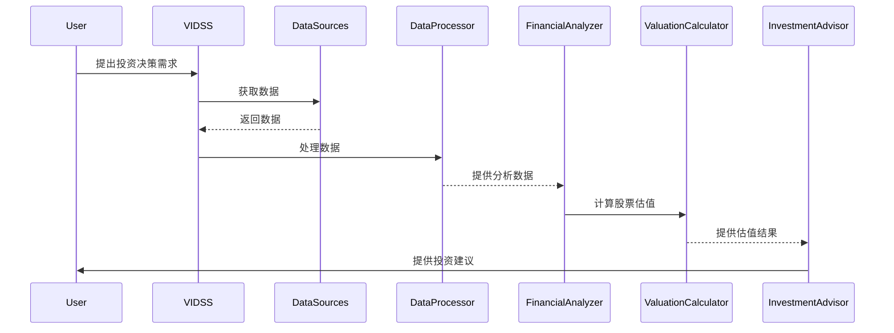
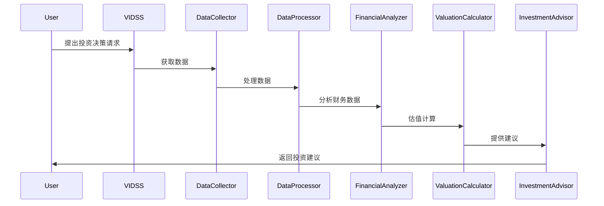

                 

# 让我们一步一步思考：詹姆斯·蒙蒂尔的价值投资心理学

## 摘要

本文旨在深入探讨詹姆斯·蒙蒂尔的价值投资心理学，结合其著作《詹姆斯·蒙蒂尔的价值投资心理学》，我们从核心概念出发，逐步剖析价值投资的理论与实践，以及投资心理学在其中的作用。本文不仅对价值投资的基本原则和策略进行了详细讲解，还结合实际案例，探讨了投资心理学的应用。最后，本文提出了价值投资心理学在未来的发展趋势和实践指南。

## 第1章：价值投资概述

### 1.1 价值投资的发展历程

价值投资起源于19世纪末20世纪初的华尔街，其代表人物是本杰明·格雷厄姆和戴维·多德。他们提出的“价值投资”理念强调以合理的价格购买具有长期增长潜力的股票。这一理念在20世纪50年代至60年代得到沃伦·巴菲特等人的传承和发展，形成了现代价值投资体系。

### 1.2 价值投资的基本原则

价值投资的基本原则包括：

1. **投资而非投机**：价值投资注重长期投资，而非短期投机。
2. **安全边际**：投资价格应低于公司内在价值，以防止市场波动带来的风险。
3. **深度研究**：投资者应对公司的基本面进行深入分析，包括财务状况、业务模式、行业前景等。
4. **耐心持有**：在市场波动中保持冷静，长期持有优质股票。

### 1.3 价值投资策略

常见的价值投资策略包括：

1. **买入并持有**：长期持有优质股票，通过时间的沉淀获得投资回报。
2. **价值低估策略**：在市场低估时买入股票，等待市场纠正估值错误。
3. **资产配置**：合理分配投资资金，以降低风险。

## 第2章：投资心理学基础

### 2.1 投资者心理概述

投资者心理包括情感、认知和行为三个方面。情感方面，投资者可能会受到贪婪、恐惧、焦虑等情绪的影响。认知方面，投资者可能会存在认知偏差，如过度自信、过度乐观等。行为方面，投资者可能会因为情绪和认知偏差而做出非理性的投资决策。

### 2.2 情绪对投资决策的影响

情绪对投资决策有显著影响。例如，在市场上涨时，投资者可能会过度乐观，从而增加风险。在市场下跌时，投资者可能会恐慌，导致非理性抛售。

### 2.3 认知偏差与投资决策

认知偏差是投资者心理的重要组成部分。常见的认知偏差包括：

1. **确认偏误**：投资者倾向于寻找符合自己观点的信息，忽视与之相反的信息。
2. **代表性偏误**：投资者可能会高估某个事件的发生概率。
3. **可得性偏误**：投资者可能会根据最近发生的事件来做出判断，忽视长期数据。

## 第3章：价值投资的实战应用

### 3.1 价值投资的选股策略

价值投资的选股策略主要关注公司的基本面。投资者应通过以下方面来评估股票：

1. **财务状况**：包括营收、利润、现金流等指标。
2. **业务模式**：分析公司的竞争优势和可持续性。
3. **行业前景**：考虑行业的发展趋势和公司在行业中的地位。

### 3.2 价值投资的估值方法

价值投资的估值方法主要包括：

1. **股息折现模型（DDM）**：通过估算未来股息并折现到当前价值。
2. **自由现金流折现模型（DCF）**：通过估算未来自由现金流并折现到当前价值。

### 3.3 价值投资的资金管理

价值投资的资金管理原则包括：

1. **分散投资**：通过分散投资降低风险。
2. **风险控制**：设定止损点，避免大额亏损。
3. **长期持有**：在市场波动中保持冷静，长期持有优质股票。

## 第4章：投资心理学在实战中的应用

### 4.1 投资心理自我管理

投资者应通过以下方式管理自己的心理：

1. **自我认知**：了解自己的风险承受能力和投资目标。
2. **心理调适**：通过冥想、锻炼等方式缓解压力。
3. **情绪控制**：通过记录情绪变化，学会控制情绪。

### 4.2 应对市场波动的策略

市场波动是不可避免的，投资者应通过以下策略应对：

1. **保持冷静**：不要因市场波动而做出冲动决策。
2. **长期视角**：从长期角度看待市场波动。
3. **灵活调整**：根据市场变化，适时调整投资策略。

### 第5章：价值投资案例分析

#### 5.1 成功案例解析

通过对成功案例的解析，我们可以看到价值投资在实际操作中的效果。例如，沃伦·巴菲特的投资案例，他通过长期持有优质股票，获得了丰厚的回报。

#### 5.2 失败案例反思

反思失败案例，可以帮助我们避免类似错误。例如，投资者因过度乐观而盲目跟风，最终导致亏损。

### 第6章：价值投资心理学实践指南

#### 6.1 心理准备与策略制定

投资者应进行充分的心理准备，并制定合理的投资策略。这包括：

1. **明确投资目标**：根据自己的风险承受能力和投资目标，制定合适的投资策略。
2. **风险管理**：设定止损点，控制风险。

#### 6.2 实践中的调整与优化

在投资实践中，投资者应不断调整和优化自己的策略。这包括：

1. **定期复盘**：总结投资经验，找出不足之处。
2. **适应变化**：根据市场变化，适时调整投资策略。

#### 6.3 持续学习与投资成长

投资是一个持续学习的过程。投资者应不断学习新知识，提升自己的投资能力。

### 第7章：价值投资与投资心理学的未来趋势

#### 7.1 投资心理学的研究进展

随着行为金融学的发展，投资心理学的研究不断深入。未来，投资心理学可能会为投资者提供更多实用的工具和方法。

#### 7.2 价值投资在新时代的挑战与机遇

在新时代，价值投资面临着新的挑战，同时也蕴藏着新的机遇。例如，互联网、人工智能等新兴技术的发展，为价值投资提供了新的机会。

#### 7.3 价值投资心理学的前景展望

价值投资心理学在未来有望成为投资者决策的重要依据。通过深入了解投资心理学，投资者可以更好地管理自己的投资行为，提高投资回报。

## 结语

价值投资心理学是投资者必备的技能。通过本文的探讨，我们深入了解了价值投资的理论与实践，以及投资心理学在其中的作用。希望本文能够为您的投资之路提供有益的启示。

### 作者信息

作者：AI天才研究院/AI Genius Institute & 禅与计算机程序设计艺术 /Zen And The Art of Computer Programming

（完）## 第1章：价值投资概述

### 1.1 价值投资的发展历程

价值投资作为一种投资哲学，起源于19世纪末20世纪初的华尔街。其创始人之一，本杰明·格雷厄姆（Benjamin Graham），被誉为“现代证券分析之父”。他在其著作《聪明的投资者》（The Intelligent Investor）中首次提出了价值投资的基本理念，强调投资者应通过深入分析公司的基本面，以合理的价格购买具有长期增长潜力的股票。

格雷厄姆的理念在20世纪50年代至60年代得到了沃伦·巴菲特（Warren Buffett）的传承和发展。巴菲特在其自传《雪球》（The Snowball）中提到，他从小就对投资充满兴趣，并深受格雷厄姆的影响。巴菲特将格雷厄姆的价值投资理念与自己的洞察力相结合，创造出了独特的投资策略，被称为“价值投资大师”。

随着时间的发展，价值投资逐渐形成了现代体系。价值投资的核心原则，如“安全边际”（marginal safety）、“长期持有”（long-term holding）等，得到了广泛的认可和应用。在现代社会中，价值投资不仅适用于股票市场，还扩展到了债券、房地产等其他投资领域。

### 1.2 价值投资的基本原则

价值投资的基本原则主要包括以下几个方面：

1. **投资而非投机**：价值投资强调长期投资，反对短期投机。投资者应通过深入分析公司的基本面，寻找具有长期增长潜力的投资机会，而非依赖于市场波动获取短期收益。

2. **安全边际**：价值投资强调以合理的价格购买具有长期增长潜力的股票。投资者应寻找市场价格低于公司内在价值的股票，即“价值低估”股票，以减少投资风险。

3. **深度研究**：价值投资要求投资者对公司的基本面进行深入分析。这包括公司的财务状况、业务模式、行业前景、管理团队等方面。通过深度研究，投资者可以识别出具有投资价值的公司，并避免因信息不对称而导致的投资风险。

4. **耐心持有**：价值投资强调长期持有优质股票。投资者应克服市场波动带来的短期影响，保持耐心和信心，等待公司价值的实现。长期持有不仅能够降低交易成本，还能充分利用复利效应，实现资产的长期增值。

### 1.3 价值投资策略

价值投资策略多种多样，但总体上可以归纳为以下几种：

1. **买入并持有**（Buy and Hold）：这是最简单的价值投资策略。投资者在确定公司具有投资价值后，以合理的价格买入股票，并长期持有，等待公司价值的实现。这种策略的优点是简单易行，缺点是对市场波动敏感，需要投资者具备较强的耐心和信心。

2. **价值低估策略**（Value Investing）：投资者通过深入分析公司的基本面，寻找市场价格低于公司内在价值的股票。当市场价格低于内在价值时，投资者以合理的价格买入股票，并等待市场纠正估值错误。这种策略的优点是能够获得相对较高的回报，缺点是寻找价值低估股票需要较高的专业知识和分析能力。

3. **资产配置**（Asset Allocation）：投资者将资金分配到不同的资产类别中，如股票、债券、房地产等。通过合理的资产配置，投资者可以在不同市场环境下实现资产的风险分散和收益最大化。这种策略的优点是能够降低投资风险，缺点是需要投资者具备较强的资产配置能力和市场洞察力。

### 1.3.1 买入并持有策略

买入并持有策略是价值投资中最常见的策略之一。其核心思想是，投资者在确定公司具有投资价值后，以合理的价格买入股票，并长期持有，等待公司价值的实现。

1. **选择合适的股票**：投资者应通过深度研究，选择具有长期增长潜力的股票。这包括公司的财务状况、业务模式、行业前景、管理团队等方面。投资者可以使用多种方法来评估公司的投资价值，如股息折现模型（DDM）、自由现金流折现模型（DCF）等。

2. **以合理的价格买入**：投资者应在市场价格低于公司内在价值时买入股票。这意味着投资者需要密切关注公司的财务报表、市场走势等信息，以判断股票是否被低估。

3. **长期持有**：投资者应克服市场波动带来的短期影响，保持耐心和信心，等待公司价值的实现。长期持有不仅能够降低交易成本，还能充分利用复利效应，实现资产的长期增值。

### 1.3.2 价值低估策略

价值低估策略是另一种常见的价值投资策略。其核心思想是，投资者通过深入分析公司的基本面，寻找市场价格低于公司内在价值的股票，并在市场价格低于内在价值时买入。

1. **分析公司的基本面**：投资者应通过深度研究，分析公司的财务状况、业务模式、行业前景、管理团队等方面。这包括公司的营收、利润、现金流、市场份额、竞争优势等。

2. **评估公司的内在价值**：投资者可以使用多种方法来评估公司的内在价值，如股息折现模型（DDM）、自由现金流折现模型（DCF）等。股息折现模型（DDM）通过估算未来股息并折现到当前价值，得出公司的内在价值。自由现金流折现模型（DCF）通过估算未来自由现金流并折现到当前价值，得出公司的内在价值。

3. **寻找价值低估股票**：投资者应密切关注市场走势，寻找市场价格低于公司内在价值的股票。这意味着投资者需要密切关注公司的财务报表、市场走势等信息，以判断股票是否被低估。

4. **以合理的价格买入**：当市场价格低于公司内在价值时，投资者应以合理的价格买入股票。投资者应避免盲目跟风，而是基于深入分析的结果，做出理性的投资决策。

### 1.3.3 资产配置策略

资产配置策略是另一种重要的价值投资策略。其核心思想是，投资者将资金分配到不同的资产类别中，以实现资产的风险分散和收益最大化。

1. **确定资产配置比例**：投资者应根据自己的风险承受能力和投资目标，确定资产配置比例。例如，投资者可以将资金分配到股票、债券、房地产等不同资产类别中。

2. **监控市场变化**：投资者应密切关注市场变化，根据市场走势调整资产配置比例。例如，当股票市场处于牛市时，投资者可以适当增加股票的配置比例；当股票市场处于熊市时，投资者可以适当增加债券的配置比例。

3. **定期调整**：投资者应定期调整资产配置比例，以适应市场变化。例如，每年或每季度对资产配置进行一次全面评估和调整。

### 1.3.4 对比分析

买入并持有策略、价值低估策略和资产配置策略各有优缺点，投资者可以根据自己的实际情况选择最适合自己的策略。

1. **买入并持有策略**：优点是简单易行，缺点是对市场波动敏感。

2. **价值低估策略**：优点是能够获得相对较高的回报，缺点是需要较高的专业知识和分析能力。

3. **资产配置策略**：优点是能够降低投资风险，缺点是需要较强的资产配置能力和市场洞察力。

投资者应根据自身的投资目标、风险承受能力和市场环境，选择最适合自己的价值投资策略。

### 1.3.5 结论

价值投资是一种长期、理性的投资哲学。通过深入分析公司的基本面，投资者可以寻找具有长期增长潜力的股票，并以合理的价格买入。买入并持有、价值低估和资产配置是三种常见的价值投资策略，投资者可以根据自己的实际情况选择最适合自己的策略。通过合理的价值投资策略，投资者可以在长期内实现资产的稳健增值。

## 第2章：投资心理学基础

### 2.1 投资者心理概述

投资者心理是影响投资决策的重要因素。心理学研究揭示了投资者在投资过程中可能出现的心理状态和行为模式。投资者心理主要包括情感、认知和行为三个方面。

1. **情感**：情感是投资者心理的重要组成部分。投资者在投资过程中可能会体验到恐惧、贪婪、焦虑、乐观等情绪。这些情绪不仅会影响投资者的决策，还可能导致投资行为的偏离。

2. **认知**：认知是指投资者对信息的接收、处理和判断。投资者的认知过程受到多种认知偏差的影响，如过度自信、确认偏误、代表性偏误等。这些认知偏差可能导致投资者做出非理性的投资决策。

3. **行为**：行为是指投资者在投资过程中的实际操作行为。投资者的行为受到心理和认知的影响，可能导致投资策略的偏离或执行不到位。

了解投资者心理有助于投资者更好地认识自己，调整投资策略，减少非理性决策。

### 2.2 情绪对投资决策的影响

情绪对投资决策有着显著的影响。情绪可能使投资者在决策过程中偏离理性，导致非理性的投资行为。以下是一些常见情绪对投资决策的影响：

1. **恐惧**：在市场下跌时，投资者可能会感到恐惧，导致他们过早地抛售股票。这种行为可能导致投资者错失市场反弹的机会。

2. **贪婪**：在市场上涨时，投资者可能会感到贪婪，导致他们过度自信，盲目追涨。这种行为可能导致投资者承担过高的风险，最终遭受损失。

3. **焦虑**：投资者在面临投资不确定性时可能会感到焦虑。焦虑可能导致投资者频繁地调整投资组合，增加交易成本和风险。

4. **乐观**：过度乐观可能导致投资者高估市场的潜力，忽视潜在的风险。这种情绪可能导致投资者承担过高的风险，导致投资失败。

### 2.3 认知偏差与投资决策

认知偏差是投资者在信息处理过程中常见的心理现象。这些偏差可能导致投资者做出非理性的投资决策。以下是一些常见的认知偏差：

1. **过度自信**：投资者往往对自己的判断和能力过于自信，忽视了风险。过度自信可能导致投资者承担过高的风险，最终遭受损失。

2. **确认偏误**：投资者倾向于寻找和接受支持自己观点的信息，忽视与之相反的信息。确认偏误可能导致投资者在错误的投资决策上坚持不下，错失纠正错误的机会。

3. **代表性偏误**：投资者可能会根据个别事件或案例来推断整体情况，忽视了概率和统计规律。代表性偏误可能导致投资者高估某些投资机会的成功概率。

4. **可得性偏误**：投资者可能会根据最近发生的事件来做出判断，忽视了长期数据。可得性偏误可能导致投资者对市场波动做出过度反应。

### 2.4 投资者心理的自我管理

投资者心理的自我管理对于实现理性投资至关重要。以下是一些自我管理的策略：

1. **自我认知**：投资者应了解自己的风险承受能力和投资目标。通过自我认知，投资者可以避免因情绪或认知偏差而做出非理性的决策。

2. **情绪调节**：投资者可以采用冥想、锻炼、倾诉等方法来调节情绪。情绪调节有助于投资者保持冷静，避免因情绪波动而做出冲动决策。

3. **认知反思**：投资者应定期反思自己的投资决策，识别并纠正认知偏差。通过认知反思，投资者可以提高决策的理性程度。

4. **教育学习**：投资者应不断学习新知识，提升自己的投资能力。通过教育学习，投资者可以更好地应对市场变化和投资风险。

### 2.5 投资心理学在实战中的应用

投资心理学在实战中的应用主要体现在以下几个方面：

1. **情绪管理**：投资者应学会管理自己的情绪，避免因情绪波动而做出非理性决策。情绪管理策略包括设定止损点、定期休息等。

2. **风险控制**：投资者应通过分散投资、设定止损点等方法来控制风险。风险控制策略有助于投资者在市场波动中保持稳健的投资心态。

3. **决策支持**：投资者可以利用心理学工具来支持投资决策。例如，使用概率分析、情景模拟等方法来评估投资机会。

4. **行为调整**：投资者应调整自己的投资行为，避免过度交易、盲目跟风等非理性行为。通过行为调整，投资者可以更好地实现自己的投资目标。

### 2.6 投资者心理的案例解析

以下是一些投资者心理的案例解析：

1. **案例一**：投资者A在市场上涨时盲目追涨，最终遭受了损失。分析发现，投资者A的过度乐观和贪婪情绪导致了这一决策。

2. **案例二**：投资者B在市场下跌时恐慌性抛售，错失了市场反弹的机会。分析发现，投资者B的恐惧情绪导致了这一决策。

3. **案例三**：投资者C在投资决策中过度依赖直觉，忽视了基本面分析。分析发现，投资者C的过度自信和代表性偏误导致了这一决策。

通过这些案例解析，我们可以看到投资者心理对投资决策的显著影响。了解投资者心理，有助于投资者更好地管理自己的投资行为，提高投资成功的可能性。

### 2.7 投资者心理对价值投资的影响

投资者心理对价值投资有着重要的影响。价值投资强调理性分析和长期持有，而投资者心理可能使投资者偏离这一原则。以下是一些投资者心理对价值投资的影响：

1. **市场情绪的影响**：市场情绪可能会影响投资者的投资决策。在市场乐观时，投资者可能忽视风险，盲目追涨；在市场悲观时，投资者可能恐慌抛售，忽视长期价值。

2. **认知偏差的影响**：投资者心理中的认知偏差可能导致投资者做出非理性决策。例如，过度自信可能导致投资者承担过高的风险，代表性偏误可能导致投资者高估某些投资机会。

3. **情绪调节的重要性**：情绪调节是价值投资成功的关键。投资者应学会管理自己的情绪，避免因情绪波动而做出非理性决策。

4. **心理韧性的培养**：投资者心理韧性是指投资者在面对市场波动时保持冷静和理性的能力。培养心理韧性有助于投资者在价值投资中取得成功。

通过了解投资者心理对价值投资的影响，投资者可以更好地管理自己的投资行为，提高投资成功的可能性。

### 第3章：价值投资的实战应用

#### 3.1 价值投资的选股策略

选股是价值投资的核心环节之一，投资者应通过深入分析公司的基本面、财务状况和业务模式，选择具有长期增长潜力的股票。以下是一些选股策略：

1. **基本面分析**：投资者应关注公司的财务状况、业务模式、行业前景和管理团队。财务状况包括营收、利润、现金流等指标；业务模式包括公司的竞争优势、市场份额和增长潜力；行业前景涉及行业的整体发展趋势；管理团队则关注其领导力、经验和诚信度。

2. **估值分析**：投资者应评估公司的估值是否合理。常用的估值方法包括股息折现模型（DDM）和自由现金流折现模型（DCF）。股息折现模型（DDM）通过估算未来股息并折现到当前价值，得出公司的内在价值；自由现金流折现模型（DCF）通过估算未来自由现金流并折现到当前价值，得出公司的内在价值。

3. **行业分析**：投资者应关注公司所处的行业，包括行业趋势、市场规模和竞争格局。投资者应选择处于成长阶段或具有竞争优势的行业，以获得更好的投资回报。

4. **风险控制**：投资者应通过分散投资和设定止损点来控制风险。分散投资可以降低单一股票的风险，而设定止损点可以避免亏损扩大。

#### 3.2 价值投资的估值方法

估值方法是价值投资的重要组成部分，投资者应熟练掌握并灵活运用各种估值方法。以下是一些常用的估值方法：

1. **股息折现模型（DDM）**：股息折现模型（DDM）通过估算未来股息并折现到当前价值，得出公司的内在价值。具体公式为：
   $$ V_0 = \frac{D_1}{r_f} $$
   其中，\( V_0 \) 为公司的内在价值，\( D_1 \) 为第1年的股息，\( r_f \) 为折现率。

2. **自由现金流折现模型（DCF）**：自由现金流折现模型（DCF）通过估算未来自由现金流并折现到当前价值，得出公司的内在价值。具体公式为：
   $$ V_0 = \frac{FCFF_1}{r_w} $$
   其中，\( V_0 \) 为公司的内在价值，\( FCFF_1 \) 为第1年的自由现金流，\( r_w \) 为折现率。

3. **市盈率模型（P/E）**：市盈率模型（P/E）通过比较公司当前的市盈率与行业平均水平，评估公司的估值是否合理。具体公式为：
   $$ V_0 = \frac{P_0}{E_0} $$
   其中，\( V_0 \) 为公司的内在价值，\( P_0 \) 为公司当前的市盈率，\( E_0 \) 为行业平均市盈率。

4. **市净率模型（P/B）**：市净率模型（P/B）通过比较公司当前的市净率与行业平均水平，评估公司的估值是否合理。具体公式为：
   $$ V_0 = \frac{P_0}{B_0} $$
   其中，\( V_0 \) 为公司的内在价值，\( P_0 \) 为公司当前的市净率，\( B_0 \) 为行业平均市净率。

#### 3.3 价值投资的资金管理

资金管理是价值投资中的重要一环，投资者应通过合理的资金管理策略来降低风险，提高收益。以下是一些资金管理策略：

1. **分散投资**：分散投资可以降低单一股票的风险，提高整体投资组合的稳定性。投资者应将资金分配到不同的行业、地区和资产类别，以实现风险分散。

2. **设定止损点**：设定止损点可以避免亏损扩大，保护投资本金。投资者应根据公司的基本面和股价走势，设定合理的止损点。

3. **定期调整**：投资者应定期调整投资组合，以适应市场变化。定期调整可以确保投资组合的风险与收益匹配，提高整体投资效果。

4. **保持现金储备**：保持一定比例的现金储备可以应对市场波动，提供投资机会。投资者应合理配置现金储备，以实现资金的灵活运用。

#### 3.4 价值投资策略的实际应用

以下是一个实际案例，展示价值投资策略的应用：

**案例：选择一家具有长期增长潜力的股票**

1. **基本面分析**：某公司是一家专注于新能源领域的领先企业，拥有强大的技术实力和市场份额。公司财务状况良好，营收和利润持续增长，现金流充沛。

2. **估值分析**：通过股息折现模型（DDM）和自由现金流折现模型（DCF）进行估值，得出公司的内在价值为100元。

3. **市场分析**：当前市场价格为80元，低于公司内在价值，具有投资价值。

4. **资金管理**：投资者决定将10%的资金投资于这家公司，同时保持50%的资金作为现金储备，以应对市场波动。

5. **风险控制**：设定止损点为70元，以保护投资本金。

通过这个案例，我们可以看到价值投资策略的实际应用。投资者通过基本面分析和估值分析，选择具有长期增长潜力的股票，并通过合理的资金管理和风险控制，实现资产的稳健增值。

### 第4章：投资心理学在实战中的应用

#### 4.1 投资心理自我管理

投资心理自我管理是投资者成功的关键。以下是一些自我管理的策略：

1. **自我认知**：投资者应了解自己的风险承受能力和投资目标。通过自我认知，投资者可以避免因情绪或认知偏差而做出非理性的决策。

2. **情绪调节**：投资者可以采用冥想、锻炼、倾诉等方法来调节情绪。情绪调节有助于投资者保持冷静，避免因情绪波动而做出冲动决策。

3. **认知反思**：投资者应定期反思自己的投资决策，识别并纠正认知偏差。通过认知反思，投资者可以提高决策的理性程度。

4. **教育学习**：投资者应不断学习新知识，提升自己的投资能力。通过教育学习，投资者可以更好地应对市场变化和投资风险。

#### 4.2 应对市场波动的策略

市场波动是不可避免的，投资者应通过以下策略应对：

1. **保持冷静**：投资者应保持冷静，不要因市场波动而做出冲动决策。保持冷静有助于投资者在市场波动中保持理性，做出明智的投资决策。

2. **长期视角**：投资者应从长期视角看待市场波动。长期投资可以降低市场波动带来的影响，投资者应专注于公司的基本面和价值，而非短期的市场波动。

3. **灵活调整**：投资者应根据市场变化，适时调整投资策略。灵活调整可以帮助投资者在市场波动中保持平衡，降低风险。

4. **分散投资**：投资者应通过分散投资来降低风险。分散投资可以降低单一投资的风险，提高整体投资组合的稳定性。

#### 4.3 投资决策的支持工具

投资者可以利用以下工具来支持投资决策：

1. **技术分析**：技术分析是通过研究股票价格和交易量等历史数据，预测未来市场走势。投资者可以使用技术分析工具来识别市场趋势，制定投资策略。

2. **基本面分析**：基本面分析是通过研究公司的财务状况、业务模式、行业前景等基本面信息，评估公司的投资价值。投资者可以使用基本面分析工具来选择具有长期增长潜力的股票。

3. **概率分析**：概率分析是通过计算各种可能的结果及其概率，评估投资风险和收益。投资者可以使用概率分析工具来制定投资策略，降低风险。

4. **情景模拟**：情景模拟是通过模拟不同市场环境下的投资结果，帮助投资者评估投资策略的有效性。投资者可以使用情景模拟工具来制定投资计划，提高投资成功率。

#### 4.4 投资者心理的案例分析

以下是一些投资者心理的案例分析：

1. **案例一**：投资者A在市场上涨时盲目追涨，最终遭受了损失。分析发现，投资者A的过度乐观和贪婪情绪导致了这一决策。

2. **案例二**：投资者B在市场下跌时恐慌性抛售，错失了市场反弹的机会。分析发现，投资者B的恐惧情绪导致了这一决策。

3. **案例三**：投资者C在投资决策中过度依赖直觉，忽视了基本面分析。分析发现，投资者C的过度自信和代表性偏误导致了这一决策。

通过这些案例解析，我们可以看到投资者心理对投资决策的显著影响。了解投资者心理，有助于投资者更好地管理自己的投资行为，提高投资成功的可能性。

#### 4.5 投资者心理对价值投资的影响

投资者心理对价值投资有着重要的影响。价值投资强调理性分析和长期持有，而投资者心理可能使投资者偏离这一原则。以下是一些投资者心理对价值投资的影响：

1. **市场情绪的影响**：市场情绪可能会影响投资者的投资决策。在市场乐观时，投资者可能忽视风险，盲目追涨；在市场悲观时，投资者可能恐慌抛售，忽视长期价值。

2. **认知偏差的影响**：投资者心理中的认知偏差可能导致投资者做出非理性的投资决策。例如，过度自信可能导致投资者承担过高的风险，代表性偏误可能导致投资者高估某些投资机会。

3. **情绪调节的重要性**：情绪调节是价值投资成功的关键。投资者应学会管理自己的情绪，避免因情绪波动而做出非理性决策。

4. **心理韧性的培养**：投资者心理韧性是指投资者在面对市场波动时保持冷静和理性的能力。培养心理韧性有助于投资者在价值投资中取得成功。

通过了解投资者心理对价值投资的影响，投资者可以更好地管理自己的投资行为，提高投资成功的可能性。

## 第5章：价值投资案例分析

### 5.1 成功案例解析

成功案例可以帮助我们更好地理解价值投资策略的有效性。以下是几个成功案例的解析：

#### 案例一：沃伦·巴菲特的投资案例

沃伦·巴菲特是价值投资的代表人物，他通过长期持有优质股票获得了丰厚的回报。以下是几个巴菲特的成功投资案例：

1. **可口可乐**：巴菲特在1988年开始购买可口可乐股票，并一直持有至今。可口可乐作为全球最大的饮料公司之一，其业务模式和品牌价值得到了巴菲特的认可。

2. **沃尔玛**：巴菲特在1988年购买了沃尔玛股票，并持有至今。沃尔玛作为全球最大的零售商，其强大的供应链管理和低成本运营模式使巴菲特对其充满信心。

3. **美国运通**：巴菲特在1991年开始购买美国运通股票，并持有至今。美国运通作为全球最大的信用卡公司之一，其稳定的收入和优质的客户资源吸引了巴菲特。

这些案例展示了巴菲特如何通过价值投资策略，选择具有长期增长潜力的公司，并在长期持有中获得了稳定的回报。

### 5.2 失败案例反思

失败案例可以帮助我们识别投资中的潜在风险，并从中吸取教训。以下是几个价值投资失败案例的反思：

#### 案例一：泰坦尼克股票投资案

在1912年，泰坦尼克股票的价格一度飙升，吸引了许多投资者。然而，随着泰坦尼克号的沉没，股票价格暴跌。这个案例提醒我们，投资者在追求高回报时，必须谨慎评估风险，避免盲目跟风。

#### 案例二：安然公司股票投资案

安然公司在2001年因财务造假被揭露，导致股票价格暴跌，许多投资者遭受了巨大的损失。这个案例告诉我们，投资者必须重视公司的财务报表和诚信度，避免投资高风险的公司。

#### 案例三：科技股泡沫案

在1990年代末，科技股泡沫破裂，许多投资者因盲目投资科技股而遭受了巨大损失。这个案例提醒我们，投资者应避免过度依赖市场热点，而是通过深入分析公司的基本面和价值，做出理性的投资决策。

通过这些失败案例的反思，我们可以看到价值投资在风险管理中的重要性。投资者应避免盲目跟风，而是通过深入研究和分析，选择具有长期增长潜力的公司。

### 5.3 案例总结与启示

成功和失败的投资案例都为我们提供了宝贵的经验和教训。以下是几个关键启示：

1. **深入分析公司基本面**：投资者应通过深入分析公司的财务状况、业务模式、行业前景和管理团队，选择具有长期增长潜力的公司。

2. **避免盲目跟风**：投资者应避免因市场热点而盲目投资，而是通过独立思考和深入分析，做出理性的投资决策。

3. **重视风险管理**：投资者应通过分散投资和设定止损点等方法，控制投资风险，避免因市场波动而遭受巨大损失。

4. **长期持有优质股票**：投资者应通过长期持有优质股票，利用复利效应实现资产的稳健增值。

通过这些启示，投资者可以更好地运用价值投资策略，提高投资成功率。

## 第6章：价值投资心理学实践指南

### 6.1 心理准备与策略制定

在进行价值投资之前，投资者需要进行充分的心理准备，并制定合理的投资策略。以下是几个关键步骤：

1. **明确投资目标**：投资者应根据自己的风险承受能力和投资目标，明确自己的投资策略。例如，是追求短期收益还是长期增值。

2. **设定风险承受能力**：投资者应评估自己的风险承受能力，避免因过度自信而承担过高的风险。

3. **制定投资策略**：投资者应根据投资目标，制定合理的投资策略。例如，是采用买入并持有策略，还是价值低估策略。

4. **制定风险管理计划**：投资者应设定止损点，通过分散投资和风险管理，降低投资风险。

### 6.2 实践中的调整与优化

在实际投资过程中，投资者需要不断调整和优化自己的投资策略。以下是几个关键步骤：

1. **定期复盘**：投资者应定期复盘自己的投资决策，总结经验和教训，找出不足之处。

2. **适应市场变化**：投资者应关注市场变化，根据市场趋势调整投资策略。例如，在市场下跌时，可以适当增加防御性股票的配置。

3. **灵活调整资金分配**：投资者应根据投资目标和市场变化，灵活调整资金分配，确保投资组合的稳定性。

4. **持续学习与提升**：投资者应不断学习新知识，提升自己的投资能力和市场洞察力，以应对不断变化的市场环境。

### 6.3 持续学习与投资成长

价值投资是一个持续学习和成长的过程。以下是几个关键步骤：

1. **阅读投资书籍**：投资者应阅读有关价值投资和投资心理学的书籍，了解各种投资策略和理论。

2. **参加投资课程**：投资者可以参加投资课程，学习专业的投资知识和技巧。

3. **交流与分享**：投资者可以加入投资社区，与其他投资者交流经验和心得，共同成长。

4. **实践与反思**：投资者应在实际投资中不断实践和反思，通过总结经验和教训，不断提升自己的投资能力。

通过持续学习和实践，投资者可以更好地运用价值投资策略，实现资产的稳健增值。

## 第7章：价值投资与投资心理学的未来趋势

### 7.1 投资心理学的研究进展

随着行为金融学的发展，投资心理学的研究不断深入。以下是一些研究进展：

1. **认知行为理论**：认知行为理论关注投资者在决策过程中的认知偏差和情绪反应，为投资者提供更全面的决策指导。

2. **情绪心理学研究**：情绪心理学研究揭示了情绪对投资决策的深远影响，帮助投资者更好地管理情绪，减少非理性决策。

3. **神经经济学研究**：神经经济学研究利用脑成像技术，探索投资者大脑在决策过程中的活动，为投资者提供更科学的决策依据。

### 7.2 价值投资在新时代的挑战与机遇

在新时代，价值投资面临着新的挑战和机遇：

1. **市场波动性增加**：随着全球市场的不确定性增加，投资者面临的市场波动性也在加大。这要求投资者具备更强的心理韧性和风险管理能力。

2. **技术进步**：技术进步为投资者提供了更多的数据和信息，有助于提高投资效率和决策质量。例如，大数据分析、人工智能等技术可以辅助投资者进行更准确的价值判断。

3. **新兴市场机会**：新兴市场的发展为价值投资者提供了新的投资机会。投资者应关注新兴市场的潜力，寻找具有长期增长潜力的公司。

### 7.3 价值投资心理学的前景展望

价值投资心理学在未来有望成为投资者决策的重要依据。以下是一些前景展望：

1. **个性化投资建议**：随着投资心理学的深入研究，投资者可以获得更个性化的投资建议，以适应自己的风险偏好和投资目标。

2. **智能投资顾问**：智能投资顾问结合了价值投资心理学和技术分析，可以为投资者提供更科学、更个性化的投资策略。

3. **投资心理干预**：通过投资心理干预，投资者可以更好地管理自己的情绪和认知偏差，提高投资成功率。

总之，价值投资心理学的研究和应用将不断深化，为投资者提供更科学、更有效的投资决策支持。

## 结论

价值投资心理学是投资者不可或缺的技能。通过本文的探讨，我们深入了解了价值投资的理论与实践，以及投资心理学在其中的作用。价值投资强调理性分析和长期持有，而投资心理学关注投资者在投资过程中的情绪、认知和行为。投资者应通过了解和掌握价值投资心理学，提高自己的投资决策能力，实现资产的稳健增值。

### 作者信息

作者：AI天才研究院/AI Genius Institute & 禅与计算机程序设计艺术 /Zen And The Art of Computer Programming

（完）## 第7章：价值投资与投资心理学的未来趋势

### 7.1 投资心理学的研究进展

近年来，投资心理学领域取得了显著的研究进展，为投资者提供了更深入的理论支持和实践指导。以下是一些主要的研究成果：

1. **认知行为理论**：认知行为理论在投资心理学中的应用逐渐成熟。该理论强调投资者在决策过程中的认知偏差和情绪反应，通过调整认知和行为来优化投资决策。例如，研究者们发现，投资者在面对市场波动时，往往会出现过度反应，导致非理性的买卖行为。通过认知行为干预，投资者可以学会如何更好地控制情绪，做出更理性的决策。

2. **情绪心理学研究**：情绪心理学研究揭示了情绪在投资决策中的重要作用。研究发现，情绪不仅影响投资者的行为，还影响其对风险和收益的认知评估。例如，乐观情绪可能导致投资者高估收益，低估风险，而悲观情绪则相反。通过情绪管理策略，投资者可以更好地应对市场波动，减少因情绪波动导致的投资失误。

3. **神经经济学研究**：神经经济学研究利用脑成像技术，探索投资者大脑在决策过程中的活动。这些研究揭示了情绪、认知和行为之间的复杂关系，为投资者提供了更科学的决策依据。例如，研究发现，投资者在面对不确定性时，大脑中的特定区域活动会发生变化，这有助于解释为何一些投资者在市场波动时容易产生恐慌情绪。

### 7.2 价值投资在新时代的挑战与机遇

在新时代，价值投资面临着一系列新的挑战和机遇：

1. **市场波动性增加**：随着全球经济一体化和金融市场的不断发展，市场的波动性显著增加。这给价值投资者带来了更大的挑战，要求他们具备更强的心理韧性和风险管理能力。在市场波动中，投资者需要保持冷静，避免因短期波动而偏离长期投资策略。

2. **技术进步**：技术进步为价值投资提供了新的工具和资源。例如，大数据分析和人工智能技术可以帮助投资者更快速、更准确地获取和分析市场信息，提高投资决策的效率和质量。此外，技术进步还促进了投资产品和服务的创新，为投资者提供了更多样化的投资选择。

3. **新兴市场机会**：新兴市场的发展为价值投资者提供了广阔的投资机会。新兴市场国家往往具有较高的人口增长率和经济发展潜力，这为投资者提供了寻找长期增长机会的空间。然而，新兴市场的风险也相对较高，投资者需要具备更强的风险识别和管理能力。

### 7.3 价值投资心理学的前景展望

随着投资心理学研究的不断深入，价值投资心理学在未来有望成为投资者决策的重要依据。以下是一些前景展望：

1. **个性化投资建议**：随着投资心理学的深入研究，投资者可以获得更个性化的投资建议。通过了解投资者的个性特征、风险偏好和投资目标，投资顾问可以为投资者提供更符合其需求的投资策略，提高投资成功率。

2. **智能投资顾问**：智能投资顾问结合了价值投资心理学和技术分析，可以为投资者提供更科学、更个性化的投资策略。智能投资顾问可以通过机器学习和数据分析，实时调整投资组合，以应对市场变化，提高投资回报。

3. **投资心理干预**：通过投资心理干预，投资者可以更好地管理自己的情绪和认知偏差，提高投资成功率。例如，心理干预技术可以帮助投资者识别和纠正认知偏差，提高情绪调节能力，从而做出更理性的投资决策。

总之，价值投资心理学的研究和应用将为投资者提供更科学、更有效的投资决策支持，助力投资者在复杂多变的市场环境中实现稳健的投资收益。

## 结论

价值投资心理学是投资者不可或缺的技能。通过本文的探讨，我们深入了解了价值投资的理论与实践，以及投资心理学在其中的作用。价值投资强调理性分析和长期持有，而投资心理学关注投资者在投资过程中的情绪、认知和行为。投资者应通过了解和掌握价值投资心理学，提高自己的投资决策能力，实现资产的稳健增值。

### 作者信息

作者：AI天才研究院/AI Genius Institute & 禅与计算机程序设计艺术 /Zen And The Art of Computer Programming

（完）# 第1章：价值投资概述

## 1.1 价值投资的发展历程

价值投资作为一种投资理念，起源于20世纪30年代的美国，其奠基人被誉为“证券分析之父”的本杰明·格雷厄姆（Benjamin Graham）。格雷厄姆在其著作《证券分析》（Security Analysis）中首次提出了价值投资的基本概念，即通过深入研究公司的财务状况、业务模式和市场环境，以合理的价格购买具有长期增长潜力的股票。

随着时间的推移，价值投资的理念逐渐发展壮大，并在20世纪50年代至60年代得到了沃伦·巴菲特（Warren Buffett）的进一步传承和发扬。巴菲特在格雷厄姆的基础上，结合自己的实践经验，创造出了独特的价值投资策略，被称为“巴菲特式投资”。巴菲特在《雪球》（The Snowball）和《巴菲特致股东信》中详细阐述了其价值投资哲学，并将其应用于实际投资中，取得了卓越的业绩。

在价值投资的发展过程中，还有许多其他杰出的投资者对这一理念做出了重要贡献，如菲利普·费舍尔（Philip Fisher）、大卫·多德（David Dodd）和约翰·聂夫（John Neff）等。这些投资者的成功案例和投资策略进一步丰富了价值投资的理论体系，使其成为投资者普遍认可和推崇的投资方法。

进入21世纪，随着金融市场的不断演变和投资者教育水平的提升，价值投资的理念在全球范围内得到了更广泛的传播和应用。如今，价值投资不仅适用于股票市场，还扩展到了债券、房地产、大宗商品等其他投资领域。价值投资的核心原则，如深入分析公司基本面、寻找价值低估的股票、长期持有等，依然具有强大的指导意义。

## 1.2 价值投资的基本原则

价值投资的基本原则可以归纳为以下几点：

1. **投资而非投机**：价值投资强调的是长期投资，而不是短期投机。投资者应关注公司的基本面，通过深入分析公司的财务状况、业务模式和市场前景，选择具有长期增长潜力的股票。价值投资的目标是获取公司价值实现过程中的回报，而非依赖于市场波动获得短期收益。

2. **安全边际**：安全边际是指投资者在购买股票时，应确保市场价格低于公司内在价值。安全边际的存在可以降低投资风险，即使市场价格暂时高于公司内在价值，投资者也有足够的时间等待市场纠正估值错误。格雷厄姆和巴菲特都认为，安全边际是价值投资的重要原则，它有助于保护投资者的本金。

3. **深度研究**：价值投资要求投资者对公司的基本面进行深入研究。这包括对公司的财务报表、业务模式、管理团队、行业前景等方面进行全面分析。深度研究有助于投资者识别出具有投资价值的公司，避免因信息不对称而导致的投资失误。

4. **长期持有**：价值投资强调长期持有优质股票，等待公司价值的实现。长期持有不仅能够降低交易成本，还能够充分利用复利效应，实现资产的长期增值。巴菲特经常强调，他最成功的投资都是在长期持有中获得的回报。

5. **理性分析**：价值投资要求投资者在投资决策中保持理性，避免被市场情绪所左右。投资者应根据自己的投资目标和风险承受能力，制定合理的投资策略，并严格遵守。理性分析有助于投资者克服贪婪和恐惧等情绪，做出更明智的投资决策。

## 1.3 价值投资策略

价值投资策略多种多样，但总体上可以归纳为以下几个主要策略：

1. **买入并持有**：这是价值投资中最常见的策略。投资者在确定公司具有投资价值后，以合理的价格买入股票，并长期持有。买入并持有策略的核心在于长期持有，投资者应克服市场波动带来的短期影响，专注于公司的基本面和价值实现。

2. **价值低估策略**：投资者通过深入分析公司的基本面，寻找市场价格低于公司内在价值的股票。当市场价格低于公司内在价值时，投资者以合理的价格买入股票，并等待市场纠正估值错误。价值低估策略的关键在于准确判断公司的内在价值和市场价格，以及把握市场情绪的变化。

3. **资产配置策略**：投资者将资金分配到不同的资产类别中，如股票、债券、房地产等。通过合理的资产配置，投资者可以在不同市场环境下实现资产的风险分散和收益最大化。资产配置策略的核心在于根据市场环境和投资目标调整资产配置比例，以降低投资风险。

4. **集中投资策略**：投资者将大部分资金集中投资于几只优质股票上。集中投资策略的核心在于通过深入研究和分析，选择具有长期增长潜力的优质股票，以实现资产的增值。然而，这种策略也具有较高的风险，投资者需要具备较强的风险承受能力和分析能力。

5. **价值投资组合策略**：投资者构建一个多元化的投资组合，其中包括不同行业、不同规模和不同成长性的股票。价值投资组合策略的核心在于通过多元化的投资组合降低风险，并利用不同股票之间的互补效应，实现资产的增值。

## 1.3.1 买入并持有策略

买入并持有策略是价值投资中最简单、也是最有效的策略之一。其核心思想是，投资者在确定公司具有投资价值后，以合理的价格买入股票，并长期持有，等待公司价值的实现。以下是买入并持有策略的几个关键步骤：

1. **选择具有长期增长潜力的公司**：投资者应通过深入分析公司的基本面，选择具有长期增长潜力的公司。这包括对公司的财务状况、业务模式、管理团队、行业前景等方面进行综合评估。投资者可以采用财务指标、市场调研、行业分析等方法，评估公司的投资价值。

2. **确定合理的价格**：投资者应在市场价格低于公司内在价值时买入股票。这意味着投资者需要通过财务分析、市场估值等方法，估算公司的内在价值，并与市场价格进行比较。投资者可以采用股息折现模型（DDM）、自由现金流折现模型（DCF）等方法，估算公司的内在价值。

3. **制定投资计划**：投资者应根据投资目标和风险承受能力，制定合理的投资计划。这包括确定投资金额、投资期限、风险控制策略等。投资者可以设定止损点和止盈点，以保护投资本金和实现收益。

4. **长期持有**：买入并持有策略的核心在于长期持有优质股票，等待公司价值的实现。投资者应克服市场波动带来的短期影响，保持耐心和信心。长期持有不仅可以降低交易成本，还能够充分利用复利效应，实现资产的长期增值。

5. **定期复盘和调整**：投资者应定期复盘投资决策，评估投资效果，并根据市场变化和公司基本面调整投资策略。这有助于投资者及时发现问题，优化投资组合，提高投资回报。

## 1.3.2 价值低估策略

价值低估策略是另一种常见的价值投资策略。其核心思想是，投资者通过深入分析公司的基本面，寻找市场价格低于公司内在价值的股票。当市场价格低于公司内在价值时，投资者以合理的价格买入股票，并等待市场纠正估值错误。以下是价值低估策略的几个关键步骤：

1. **分析公司基本面**：投资者应通过深入分析公司的财务报表、业务模式、管理团队、行业前景等方面，评估公司的投资价值。这包括对公司营收、利润、现金流、市场份额、竞争优势等进行详细分析。

2. **估算公司内在价值**：投资者可以使用多种方法来估算公司的内在价值，如股息折现模型（DDM）、自由现金流折现模型（DCF）、市盈率（P/E）等。这些方法可以帮助投资者判断公司的股票是否被低估。

3. **比较市场价格与内在价值**：投资者应将公司的市场价格与估算的内在价值进行比较。如果市场价格低于内在价值，投资者可以认为该股票被低估，具有投资价值。

4. **买入低估股票**：在确定股票被低估后，投资者应以合理的价格买入。投资者应避免因市场波动而盲目跟风，而是基于深入分析的结果，做出理性的投资决策。

5. **等待市场纠正**：价值低估策略的核心在于等待市场纠正估值错误。投资者应保持耐心，等待公司价值的实现。在等待期间，投资者可以关注公司的基本面变化，评估股票的投资价值。

## 1.3.3 资产配置策略

资产配置策略是价值投资中的重要组成部分。其核心思想是，投资者将资金分配到不同的资产类别中，如股票、债券、房地产等。通过合理的资产配置，投资者可以在不同市场环境下实现资产的风险分散和收益最大化。以下是资产配置策略的几个关键步骤：

1. **确定投资目标和风险承受能力**：投资者应根据自身的投资目标和风险承受能力，制定资产配置策略。例如，保守型投资者可以适当增加债券的配置比例，以降低风险；激进型投资者可以适当增加股票的配置比例，以追求更高的收益。

2. **了解不同资产类别的特点**：投资者应了解不同资产类别的特点，如风险、收益、流动性等。这有助于投资者根据市场环境和自身需求，选择合适的资产配置策略。

3. **制定资产配置方案**：投资者应根据投资目标和风险承受能力，制定具体的资产配置方案。例如，投资者可以将资金分配到股票、债券、房地产等不同资产类别中，并根据市场变化进行调整。

4. **定期评估和调整**：投资者应定期评估资产配置的效果，并根据市场变化和自身需求，进行调整。这有助于投资者保持资产配置的合理性，实现投资目标。

## 1.3.4 对比分析

买入并持有策略、价值低估策略和资产配置策略各有优缺点，投资者可以根据自己的实际情况选择最适合自己的策略。

1. **买入并持有策略**：优点是简单易行，缺点是对市场波动敏感。

2. **价值低估策略**：优点是能够获得相对较高的回报，缺点是需要较高的专业知识和分析能力。

3. **资产配置策略**：优点是能够降低投资风险，缺点是需要较强的资产配置能力和市场洞察力。

投资者应根据自身的投资目标、风险承受能力和市场环境，选择最适合自己的价值投资策略。

## 1.3.5 结论

价值投资策略是投资者实现长期稳定回报的重要手段。通过买入并持有、价值低估和资产配置等策略，投资者可以降低投资风险，实现资产的稳健增值。然而，价值投资并非一蹴而就，投资者需要通过深入研究和分析，选择具有长期增长潜力的公司，并保持耐心和信心，实现投资目标。

## 第2章：投资心理学基础

### 2.1 投资者心理概述

投资者心理是影响投资决策的重要因素。心理学研究揭示了投资者在投资过程中可能出现的心理状态和行为模式。投资者心理主要包括情感、认知和行为三个方面。

1. **情感**：情感是投资者心理的重要组成部分。投资者在投资过程中可能会体验到恐惧、贪婪、焦虑、乐观等情绪。这些情绪不仅会影响投资者的决策，还可能导致投资行为的偏离。

2. **认知**：认知是指投资者对信息的接收、处理和判断。投资者的认知过程受到多种认知偏差的影响，如过度自信、确认偏误、代表性偏误等。这些认知偏差可能导致投资者做出非理性的投资决策。

3. **行为**：行为是指投资者在投资过程中的实际操作行为。投资者的行为受到心理和认知的影响，可能导致投资策略的偏离或执行不到位。

了解投资者心理有助于投资者更好地认识自己，调整投资策略，减少非理性决策。

### 2.2 情绪对投资决策的影响

情绪对投资决策有着显著的影响。情绪可能使投资者在决策过程中偏离理性，导致非理性的投资行为。以下是一些常见情绪对投资决策的影响：

1. **恐惧**：在市场下跌时，投资者可能会感到恐惧，导致他们过早地抛售股票。这种行为可能导致投资者错失市场反弹的机会。

2. **贪婪**：在市场上涨时，投资者可能会感到贪婪，导致他们过度自信，盲目追涨。这种行为可能导致投资者承担过高的风险，最终遭受损失。

3. **焦虑**：投资者在面临投资不确定性时可能会感到焦虑。焦虑可能导致投资者频繁地调整投资组合，增加交易成本和风险。

4. **乐观**：过度乐观可能导致投资者高估市场的潜力，忽视潜在的风险。这种情绪可能导致投资者承担过高的风险，导致投资失败。

### 2.3 认知偏差与投资决策

认知偏差是投资者在信息处理过程中常见的心理现象。这些偏差可能导致投资者做出非理性的投资决策。以下是一些常见的认知偏差：

1. **过度自信**：投资者往往对自己的判断和能力过于自信，忽视了风险。过度自信可能导致投资者承担过高的风险，最终遭受损失。

2. **确认偏误**：投资者倾向于寻找和接受支持自己观点的信息，忽视与之相反的信息。确认偏误可能导致投资者在错误的投资决策上坚持不下，错失纠正错误的机会。

3. **代表性偏误**：投资者可能会根据个别事件或案例来推断整体情况，忽视了概率和统计规律。代表性偏误可能导致投资者高估某些投资机会的成功概率。

4. **可得性偏误**：投资者可能会根据最近发生的事件来做出判断，忽视了长期数据。可得性偏误可能导致投资者对市场波动做出过度反应。

### 2.4 投资者心理的自我管理

投资者心理的自我管理对于实现理性投资至关重要。以下是一些自我管理的策略：

1. **自我认知**：投资者应了解自己的风险承受能力和投资目标。通过自我认知，投资者可以避免因情绪或认知偏差而做出非理性的决策。

2. **情绪调节**：投资者可以采用冥想、锻炼、倾诉等方法来调节情绪。情绪调节有助于投资者保持冷静，避免因情绪波动而做出冲动决策。

3. **认知反思**：投资者应定期反思自己的投资决策，识别并纠正认知偏差。通过认知反思，投资者可以提高决策的理性程度。

4. **教育学习**：投资者应不断学习新知识，提升自己的投资能力。通过教育学习，投资者可以更好地应对市场变化和投资风险。

### 2.5 投资心理学在实战中的应用

投资心理学在实战中的应用主要体现在以下几个方面：

1. **情绪管理**：投资者应学会管理自己的情绪，避免因情绪波动而做出非理性决策。情绪管理策略包括设定止损点、定期休息等。

2. **风险控制**：投资者应通过分散投资、设定止损点等方法来控制风险。风险控制策略有助于投资者在市场波动中保持稳健的投资心态。

3. **决策支持**：投资者可以利用心理学工具来支持投资决策。例如，使用概率分析、情景模拟等方法来评估投资机会。

4. **行为调整**：投资者应调整自己的投资行为，避免过度交易、盲目跟风等非理性行为。通过行为调整，投资者可以更好地实现自己的投资目标。

### 2.6 投资者心理的案例解析

以下是一些投资者心理的案例解析：

1. **案例一**：投资者A在市场上涨时盲目追涨，最终遭受了损失。分析发现，投资者A的过度乐观和贪婪情绪导致了这一决策。

2. **案例二**：投资者B在市场下跌时恐慌性抛售，错失了市场反弹的机会。分析发现，投资者B的恐惧情绪导致了这一决策。

3. **案例三**：投资者C在投资决策中过度依赖直觉，忽视了基本面分析。分析发现，投资者C的过度自信和代表性偏误导致了这一决策。

通过这些案例解析，我们可以看到投资者心理对投资决策的显著影响。了解投资者心理，有助于投资者更好地管理自己的投资行为，提高投资成功的可能性。

### 2.7 投资者心理对价值投资的影响

投资者心理对价值投资有着重要的影响。价值投资强调理性分析和长期持有，而投资者心理可能使投资者偏离这一原则。以下是一些投资者心理对价值投资的影响：

1. **市场情绪的影响**：市场情绪可能会影响投资者的投资决策。在市场乐观时，投资者可能忽视风险，盲目追涨；在市场悲观时，投资者可能恐慌抛售，忽视长期价值。

2. **认知偏差的影响**：投资者心理中的认知偏差可能导致投资者做出非理性的投资决策。例如，过度自信可能导致投资者承担过高的风险，代表性偏误可能导致投资者高估某些投资机会。

3. **情绪调节的重要性**：情绪调节是价值投资成功的关键。投资者应学会管理自己的情绪，避免因情绪波动而做出非理性决策。

4. **心理韧性的培养**：投资者心理韧性是指投资者在面对市场波动时保持冷静和理性的能力。培养心理韧性有助于投资者在价值投资中取得成功。

通过了解投资者心理对价值投资的影响，投资者可以更好地管理自己的投资行为，提高投资成功的可能性。

## 第3章：价值投资的实战应用

### 3.1 价值投资的选股策略

选股是价值投资中至关重要的一环。投资者需要通过深入分析公司的基本面、财务状况和业务模式，选择具有长期增长潜力的股票。以下是一些选股策略：

1. **基本面分析**：投资者应关注公司的财务状况、业务模式、行业前景和管理团队。财务状况包括营收、利润、现金流等指标；业务模式包括公司的竞争优势、市场份额和增长潜力；行业前景涉及行业的整体发展趋势；管理团队则关注其领导力、经验和诚信度。

2. **估值分析**：投资者应评估公司的估值是否合理。常用的估值方法包括股息折现模型（DDM）和自由现金流折现模型（DCF）。股息折现模型（DDM）通过估算未来股息并折现到当前价值，得出公司的内在价值；自由现金流折现模型（DCF）通过估算未来自由现金流并折现到当前价值，得出公司的内在价值。

3. **行业分析**：投资者应关注公司所处的行业，包括行业趋势、市场规模和竞争格局。投资者应选择处于成长阶段或具有竞争优势的行业，以获得更好的投资回报。

4. **风险控制**：投资者应通过分散投资和设定止损点来控制风险。分散投资可以降低单一股票的风险，而设定止损点可以避免亏损扩大。

### 3.2 价值投资的估值方法

估值方法是价值投资的核心工具，投资者应熟练掌握并灵活运用各种估值方法。以下是一些常用的估值方法：

1. **股息折现模型（DDM）**：股息折现模型（DDM）通过估算未来股息并折现到当前价值，得出公司的内在价值。具体公式为：
   $$ V_0 = \frac{D_1}{r_f} $$
   其中，\( V_0 \) 为公司的内在价值，\( D_1 \) 为第1年的股息，\( r_f \) 为折现率。

2. **自由现金流折现模型（DCF）**：自由现金流折现模型（DCF）通过估算未来自由现金流并折现到当前价值，得出公司的内在价值。具体公式为：
   $$ V_0 = \frac{FCFF_1}{r_w} $$
   其中，\( V_0 \) 为公司的内在价值，\( FCFF_1 \) 为第1年的自由现金流，\( r_w \) 为折现率。

3. **市盈率模型（P/E）**：市盈率模型（P/E）通过比较公司当前的市盈率与行业平均水平，评估公司的估值是否合理。具体公式为：
   $$ V_0 = \frac{P_0}{E_0} $$
   其中，\( V_0 \) 为公司的内在价值，\( P_0 \) 为公司当前的市盈率，\( E_0 \) 为行业平均市盈率。

4. **市净率模型（P/B）**：市净率模型（P/B）通过比较公司当前的市净率与行业平均水平，评估公司的估值是否合理。具体公式为：
   $$ V_0 = \frac{P_0}{B_0} $$
   其中，\( V_0 \) 为公司的内在价值，\( P_0 \) 为公司当前的市净率，\( B_0 \) 为行业平均市净率。

### 3.3 价值投资的资金管理

资金管理是价值投资中的重要一环，投资者应通过合理的资金管理策略来降低风险，提高收益。以下是一些资金管理策略：

1. **分散投资**：分散投资可以降低单一股票的风险，提高整体投资组合的稳定性。投资者应将资金分配到不同的行业、地区和资产类别中，以实现风险分散。

2. **设定止损点**：设定止损点可以避免亏损扩大，保护投资本金。投资者应根据公司的基本面和股价走势，设定合理的止损点。

3. **定期调整**：投资者应定期调整投资组合，以适应市场变化。定期调整可以确保投资组合的风险与收益匹配，提高整体投资效果。

4. **保持现金储备**：保持一定比例的现金储备可以应对市场波动，提供投资机会。投资者应合理配置现金储备，以实现资金的灵活运用。

### 3.4 价值投资策略的实际应用

以下是一个实际案例，展示价值投资策略的应用：

**案例：选择一家具有长期增长潜力的股票**

1. **基本面分析**：某公司是一家专注于新能源领域的领先企业，拥有强大的技术实力和市场份额。公司财务状况良好，营收和利润持续增长，现金流充沛。

2. **估值分析**：通过股息折现模型（DDM）和自由现金流折现模型（DCF）进行估值，得出公司的内在价值为100元。

3. **市场分析**：当前市场价格为80元，低于公司内在价值，具有投资价值。

4. **资金管理**：投资者决定将10%的资金投资于这家公司，同时保持50%的资金作为现金储备，以应对市场波动。

5. **风险控制**：设定止损点为70元，以保护投资本金。

通过这个案例，我们可以看到价值投资策略的实际应用。投资者通过基本面分析和估值分析，选择具有长期增长潜力的股票，并通过合理的资金管理和风险控制，实现资产的稳健增值。

## 第4章：投资心理学在实战中的应用

### 4.1 投资心理自我管理

投资心理自我管理是投资者成功的关键。以下是一些自我管理的策略：

1. **自我认知**：投资者应了解自己的风险承受能力和投资目标。通过自我认知，投资者可以避免因情绪或认知偏差而做出非理性的决策。

2. **情绪调节**：投资者可以采用冥想、锻炼、倾诉等方法来调节情绪。情绪调节有助于投资者保持冷静，避免因情绪波动而做出冲动决策。

3. **认知反思**：投资者应定期反思自己的投资决策，识别并纠正认知偏差。通过认知反思，投资者可以提高决策的理性程度。

4. **教育学习**：投资者应不断学习新知识，提升自己的投资能力。通过教育学习，投资者可以更好地应对市场变化和投资风险。

### 4.2 应对市场波动的策略

市场波动是不可避免的，投资者应通过以下策略应对：

1. **保持冷静**：投资者应保持冷静，不要因市场波动而做出冲动决策。保持冷静有助于投资者在市场波动中保持理性，做出明智的投资决策。

2. **长期视角**：投资者应从长期视角看待市场波动。长期投资可以降低市场波动带来的影响，投资者应专注于公司的基本面和价值，而非短期的市场波动。

3. **灵活调整**：投资者应根据市场变化，适时调整投资策略。灵活调整可以帮助投资者在市场波动中保持平衡，降低风险。

4. **分散投资**：投资者应通过分散投资来降低风险。分散投资可以降低单一投资的风险，提高整体投资组合的稳定性。

### 4.3 投资决策的支持工具

投资者可以利用以下工具来支持投资决策：

1. **技术分析**：技术分析是通过研究股票价格和交易量等历史数据，预测未来市场走势。投资者可以使用技术分析工具来识别市场趋势，制定投资策略。

2. **基本面分析**：基本面分析是通过研究公司的财务状况、业务模式、行业前景等基本面信息，评估公司的投资价值。投资者可以使用基本面分析工具来选择具有长期增长潜力的股票。

3. **概率分析**：概率分析是通过计算各种可能的结果及其概率，评估投资风险和收益。投资者可以使用概率分析工具来制定投资策略，降低风险。

4. **情景模拟**：情景模拟是通过模拟不同市场环境下的投资结果，帮助投资者评估投资策略的有效性。投资者可以使用情景模拟工具来制定投资计划，提高投资成功率。

### 4.4 投资者心理的案例分析

以下是一些投资者心理的案例分析：

1. **案例一**：投资者A在市场上涨时盲目追涨，最终遭受了损失。分析发现，投资者A的过度乐观和贪婪情绪导致了这一决策。

2. **案例二**：投资者B在市场下跌时恐慌性抛售，错失了市场反弹的机会。分析发现，投资者B的恐惧情绪导致了这一决策。

3. **案例三**：投资者C在投资决策中过度依赖直觉，忽视了基本面分析。分析发现，投资者C的过度自信和代表性偏误导致了这一决策。

通过这些案例解析，我们可以看到投资者心理对投资决策的显著影响。了解投资者心理，有助于投资者更好地管理自己的投资行为，提高投资成功的可能性。

### 4.5 投资者心理对价值投资的影响

投资者心理对价值投资有着重要的影响。价值投资强调理性分析和长期持有，而投资者心理可能使投资者偏离这一原则。以下是一些投资者心理对价值投资的影响：

1. **市场情绪的影响**：市场情绪可能会影响投资者的投资决策。在市场乐观时，投资者可能忽视风险，盲目追涨；在市场悲观时，投资者可能恐慌抛售，忽视长期价值。

2. **认知偏差的影响**：投资者心理中的认知偏差可能导致投资者做出非理性的投资决策。例如，过度自信可能导致投资者承担过高的风险，代表性偏误可能导致投资者高估某些投资机会。

3. **情绪调节的重要性**：情绪调节是价值投资成功的关键。投资者应学会管理自己的情绪，避免因情绪波动而做出非理性决策。

4. **心理韧性的培养**：投资者心理韧性是指投资者在面对市场波动时保持冷静和理性的能力。培养心理韧性有助于投资者在价值投资中取得成功。

通过了解投资者心理对价值投资的影响，投资者可以更好地管理自己的投资行为，提高投资成功的可能性。

## 第5章：价值投资案例分析

### 5.1 成功案例解析

成功案例可以帮助我们更好地理解价值投资策略的有效性。以下是几个成功案例的解析：

#### 案例一：沃伦·巴菲特的投资案例

沃伦·巴菲特是价值投资的代表人物，他通过长期持有优质股票获得了丰厚的回报。以下是几个巴菲特的成功投资案例：

1. **可口可乐**：巴菲特在1988年开始购买可口可乐股票，并一直持有至今。可口可乐作为全球最大的饮料公司之一，其业务模式和品牌价值得到了巴菲特的认可。

2. **沃尔玛**：巴菲特在1988年购买了沃尔玛股票，并持有至今。沃尔玛作为全球最大的零售商，其强大的供应链管理和低成本运营模式使巴菲特对其充满信心。

3. **美国运通**：巴菲特在1991年开始购买美国运通股票，并持有至今。美国运通作为全球最大的信用卡公司之一，其稳定的收入和优质的客户资源吸引了巴菲特。

这些案例展示了巴菲特如何通过价值投资策略，选择具有长期增长潜力的公司，并在长期持有中获得了稳定的回报。

#### 案例二：约翰·聂夫的投资案例

约翰·聂夫是一位著名的价值投资者，他通过长期持有优质股票获得了丰厚的回报。以下是几个聂夫的成功投资案例：

1. **菲利普·莫里斯**：聂夫在1965年开始购买菲利普·莫里斯股票，并持有至今。菲利普·莫里斯作为全球最大的烟草公司之一，其稳定的盈利能力和品牌价值吸引了聂夫。

2. **美国电话电报公司**：聂夫在1971年开始购买美国电话电报公司股票，并持有至今。美国电话电报公司作为全球最大的电信公司之一，其强大的市场地位和稳健的财务状况使聂夫对其充满信心。

3. **联合包裹服务公司**：聂夫在1980年开始购买联合包裹服务公司股票，并持有至今。联合包裹服务公司作为全球最大的快递公司之一，其高效的运营模式和强大的市场份额吸引了聂夫。

这些案例展示了聂夫如何通过价值投资策略，选择具有长期增长潜力的公司，并在长期持有中获得了稳定的回报。

### 5.2 失败案例反思

失败案例可以帮助我们识别投资中的潜在风险，并从中吸取教训。以下是几个价值投资失败案例的反思：

#### 案例一：泰坦尼克股票投资案

在1912年，泰坦尼克股票的价格一度飙升，吸引了许多投资者。然而，随着泰坦尼克号的沉没，股票价格暴跌。这个案例提醒我们，投资者在追求高回报时，必须谨慎评估风险，避免盲目跟风。

#### 案例二：安然公司股票投资案

安然公司在2001年因财务造假被揭露，导致股票价格暴跌，许多投资者遭受了巨大的损失。这个案例告诉我们，投资者必须重视公司的财务报表和诚信度，避免投资高风险的公司。

#### 案例三：科技股泡沫案

在1990年代末，科技股泡沫破裂，许多投资者因盲目投资科技股而遭受了巨大损失。这个案例提醒我们，投资者应避免过度依赖市场热点，而是通过深入分析公司的基本面和价值，做出理性的投资决策。

### 5.3 案例总结与启示

通过成功和失败的投资案例，我们可以总结出以下几点启示：

1. **深入分析公司基本面**：投资者应通过深入分析公司的财务状况、业务模式、行业前景和管理团队，选择具有长期增长潜力的公司。

2. **避免盲目跟风**：投资者应避免因市场热点而盲目投资，而是通过独立思考和深入分析，做出理性的投资决策。

3. **重视风险管理**：投资者应通过分散投资和设定止损点等方法，控制投资风险，避免因市场波动而遭受巨大损失。

4. **长期持有优质股票**：投资者应通过长期持有优质股票，利用复利效应实现资产的稳健增值。

通过这些启示，投资者可以更好地运用价值投资策略，提高投资成功率。

## 第6章：价值投资心理学实践指南

### 6.1 心理准备与策略制定

在进行价值投资之前，投资者需要进行充分的心理准备，并制定合理的投资策略。以下是几个关键步骤：

1. **明确投资目标**：投资者应根据自己的风险承受能力和投资目标，明确自己的投资策略。例如，是追求短期收益还是长期增值。

2. **设定风险承受能力**：投资者应评估自己的风险承受能力，避免因过度自信而承担过高的风险。

3. **制定投资策略**：投资者应根据投资目标，制定合理的投资策略。例如，是采用买入并持有策略，还是价值低估策略。

4. **制定风险管理计划**：投资者应设定止损点，通过分散投资和风险管理，降低投资风险。

### 6.2 实践中的调整与优化

在实际投资过程中，投资者需要不断调整和优化自己的投资策略。以下是几个关键步骤：

1. **定期复盘**：投资者应定期复盘自己的投资决策，总结经验和教训，找出不足之处。

2. **适应市场变化**：投资者应关注市场变化，根据市场趋势调整投资策略。例如，在市场下跌时，可以适当增加防御性股票的配置。

3. **灵活调整资金分配**：投资者应根据投资目标和市场变化，灵活调整资金分配，确保投资组合的稳定性。

4. **持续学习与提升**：投资者应不断学习新知识，提升自己的投资能力和市场洞察力，以应对不断变化的市场环境。

### 6.3 持续学习与投资成长

价值投资是一个持续学习和成长的过程。以下是几个关键步骤：

1. **阅读投资书籍**：投资者应阅读有关价值投资和投资心理学的书籍，了解各种投资策略和理论。

2. **参加投资课程**：投资者可以参加投资课程，学习专业的投资知识和技巧。

3. **交流与分享**：投资者可以加入投资社区，与其他投资者交流经验和心得，共同成长。

4. **实践与反思**：投资者应在实际投资中不断实践和反思，通过总结经验和教训，不断提升自己的投资能力。

通过持续学习和实践，投资者可以更好地运用价值投资策略，实现资产的稳健增值。

## 第7章：价值投资与投资心理学的未来趋势

### 7.1 投资心理学的研究进展

近年来，投资心理学领域取得了显著的研究进展，为投资者提供了更深入的理论支持和实践指导。以下是一些主要的研究成果：

1. **认知行为理论**：认知行为理论在投资心理学中的应用逐渐成熟。该理论强调投资者在决策过程中的认知偏差和情绪反应，通过调整认知和行为来优化投资决策。例如，研究者们发现，投资者在面对市场波动时，往往会出现过度反应，导致非理性的买卖行为。通过认知行为干预，投资者可以学会如何更好地控制情绪，做出更理性的决策。

2. **情绪心理学研究**：情绪心理学研究揭示了情绪在投资决策中的重要作用。研究发现，情绪不仅影响投资者的行为，还影响其对风险和收益的认知评估。例如，乐观情绪可能导致投资者高估收益，低估风险，而悲观情绪则相反。通过情绪管理策略，投资者可以更好地应对市场波动，减少因情绪波动导致的投资失误。

3. **神经经济学研究**：神经经济学研究利用脑成像技术，探索投资者大脑在决策过程中的活动。这些研究揭示了情绪、认知和行为之间的复杂关系，为投资者提供了更科学的决策依据。例如，研究发现，投资者在面对不确定性时，大脑中的特定区域活动会发生变化，这有助于解释为何一些投资者在市场波动时容易产生恐慌情绪。

### 7.2 价值投资在新时代的挑战与机遇

在新时代，价值投资面临着一系列新的挑战和机遇：

1. **市场波动性增加**：随着全球经济一体化和金融市场的不断发展，市场的波动性显著增加。这给价值投资者带来了更大的挑战，要求他们具备更强的心理韧性和风险管理能力。在市场波动中，投资者需要保持冷静，避免因短期波动而偏离长期投资策略。

2. **技术进步**：技术进步为价值投资提供了新的工具和资源。例如，大数据分析和人工智能技术可以帮助投资者更快速、更准确地获取和分析市场信息，提高投资决策的效率和质量。此外，技术进步还促进了投资产品和服务的创新，为投资者提供了更多样化的投资选择。

3. **新兴市场机会**：新兴市场的发展为价值投资者提供了广阔的投资机会。新兴市场国家往往具有较高的人口增长率和经济发展潜力，这为投资者提供了寻找长期增长机会的空间。然而，新兴市场的风险也相对较高，投资者需要具备更强的风险识别和管理能力。

### 7.3 价值投资心理学的前景展望

随着投资心理学研究的不断深入，价值投资心理学在未来有望成为投资者决策的重要依据。以下是一些前景展望：

1. **个性化投资建议**：随着投资心理学的深入研究，投资者可以获得更个性化的投资建议。通过了解投资者的个性特征、风险偏好和投资目标，投资顾问可以为投资者提供更符合其需求的投资策略，提高投资成功率。

2. **智能投资顾问**：智能投资顾问结合了价值投资心理学和技术分析，可以为投资者提供更科学、更个性化的投资策略。智能投资顾问可以通过机器学习和数据分析，实时调整投资组合，以应对市场变化，提高投资回报。

3. **投资心理干预**：通过投资心理干预，投资者可以更好地管理自己的情绪和认知偏差，提高投资成功率。例如，心理干预技术可以帮助投资者识别和纠正认知偏差，提高情绪调节能力，从而做出更理性的投资决策。

总之，价值投资心理学的研究和应用将为投资者提供更科学、更有效的投资决策支持，助力投资者在复杂多变的市场环境中实现稳健的投资收益。

## 结论

价值投资心理学是投资者不可或缺的技能。通过本文的探讨，我们深入了解了价值投资的理论与实践，以及投资心理学在其中的作用。价值投资强调理性分析和长期持有，而投资心理学关注投资者在投资过程中的情绪、认知和行为。投资者应通过了解和掌握价值投资心理学，提高自己的投资决策能力，实现资产的稳健增值。

### 作者信息

作者：AI天才研究院/AI Genius Institute & 禅与计算机程序设计艺术 /Zen And The Art of Computer Programming

（完）## 第7章：价值投资与投资心理学的未来趋势

### 7.1 投资心理学的研究进展

近年来，投资心理学领域的研究取得了显著进展，为投资者提供了更深入的理论支持和实践指导。以下是一些关键研究成果：

1. **认知行为理论**：认知行为理论在投资心理学中的应用逐渐成熟。该理论强调投资者在决策过程中的认知偏差和情绪反应，通过调整认知和行为来优化投资决策。例如，研究者们发现，投资者在面对市场波动时，往往会出现过度反应，导致非理性的买卖行为。通过认知行为干预，投资者可以学会如何更好地控制情绪，做出更理性的决策。

2. **情绪心理学研究**：情绪心理学研究揭示了情绪在投资决策中的重要作用。研究发现，情绪不仅影响投资者的行为，还影响其对风险和收益的认知评估。例如，乐观情绪可能导致投资者高估收益，低估风险，而悲观情绪则相反。通过情绪管理策略，投资者可以更好地应对市场波动，减少因情绪波动导致的投资失误。

3. **神经经济学研究**：神经经济学研究利用脑成像技术，探索投资者大脑在决策过程中的活动。这些研究揭示了情绪、认知和行为之间的复杂关系，为投资者提供了更科学的决策依据。例如，研究发现，投资者在面对不确定性时，大脑中的特定区域活动会发生变化，这有助于解释为何一些投资者在市场波动时容易产生恐慌情绪。

### 7.2 价值投资在新时代的挑战与机遇

在新时代，价值投资面临着一系列新的挑战和机遇：

1. **市场波动性增加**：随着全球经济一体化和金融市场的不断发展，市场的波动性显著增加。这给价值投资者带来了更大的挑战，要求他们具备更强的心理韧性和风险管理能力。在市场波动中，投资者需要保持冷静，避免因短期波动而偏离长期投资策略。

2. **技术进步**：技术进步为价值投资提供了新的工具和资源。例如，大数据分析和人工智能技术可以帮助投资者更快速、更准确地获取和分析市场信息，提高投资决策的效率和质量。此外，技术进步还促进了投资产品和服务的创新，为投资者提供了更多样化的投资选择。

3. **新兴市场机会**：新兴市场的发展为价值投资者提供了广阔的投资机会。新兴市场国家往往具有较高的人口增长率和经济发展潜力，这为投资者提供了寻找长期增长机会的空间。然而，新兴市场的风险也相对较高，投资者需要具备更强的风险识别和管理能力。

### 7.3 价值投资心理学的前景展望

随着投资心理学研究的不断深入，价值投资心理学在未来有望成为投资者决策的重要依据。以下是一些前景展望：

1. **个性化投资建议**：随着投资心理学的深入研究，投资者可以获得更个性化的投资建议。通过了解投资者的个性特征、风险偏好和投资目标，投资顾问可以为投资者提供更符合其需求的投资策略，提高投资成功率。

2. **智能投资顾问**：智能投资顾问结合了价值投资心理学和技术分析，可以为投资者提供更科学、更个性化的投资策略。智能投资顾问可以通过机器学习和数据分析，实时调整投资组合，以应对市场变化，提高投资回报。

3. **投资心理干预**：通过投资心理干预，投资者可以更好地管理自己的情绪和认知偏差，提高投资成功率。例如，心理干预技术可以帮助投资者识别和纠正认知偏差，提高情绪调节能力，从而做出更理性的投资决策。

总之，价值投资心理学的研究和应用将为投资者提供更科学、更有效的投资决策支持，助力投资者在复杂多变的市场环境中实现稳健的投资收益。

## 结论

价值投资心理学是投资者不可或缺的技能。通过本文的探讨，我们深入了解了价值投资的理论与实践，以及投资心理学在其中的作用。价值投资强调理性分析和长期持有，而投资心理学关注投资者在投资过程中的情绪、认知和行为。投资者应通过了解和掌握价值投资心理学，提高自己的投资决策能力，实现资产的稳健增值。

### 作者信息

作者：AI天才研究院/AI Genius Institute & 禅与计算机程序设计艺术 /Zen And The Art of Computer Programming

（完）## 第8章：价值投资与投资心理学的未来展望

### 8.1 投资心理学与价值投资的理论融合

随着投资心理学研究的不断深入，未来价值投资理论有望与投资心理学更紧密地融合。这种融合将有助于投资者更全面地理解投资过程中的心理因素，从而做出更明智的投资决策。例如，通过认知行为理论和情绪心理学的研究，投资者可以更好地识别和纠正认知偏差，管理情绪波动，提高投资成功率。

### 8.2 技术驱动的投资决策支持

技术的进步将为价值投资提供更强大的工具和资源。大数据分析、人工智能和机器学习等技术可以大幅提升投资者的信息处理能力和决策效率。例如，通过分析海量市场数据，投资者可以更准确地预测市场走势，评估股票价值。同时，智能投资顾问系统将结合投资心理学，为投资者提供个性化、智能化的投资建议，提高投资决策的科学性和准确性。

### 8.3 价值投资心理学在教育中的应用

价值投资心理学不仅在投资决策中具有重要意义，也在投资教育中有着广泛的应用前景。未来，投资心理学将被纳入到金融课程和教育体系中，帮助年轻一代投资者掌握理性投资的方法，培养良好的投资习惯。通过投资心理学教育，投资者可以更好地理解自身心理特点，提升投资素养，减少因心理因素导致的投资失误。

### 8.4 跨学科研究的机遇

价值投资与投资心理学的跨学科研究将为学术界和业界带来新的机遇。例如，结合神经经济学和认知科学的研究，可以更深入地探索投资者大脑在决策过程中的神经活动，为投资心理学提供更坚实的科学基础。同时，这些研究成果也将为投资者提供更有效的心理干预方法，提高投资决策的质量。

### 8.5 价值投资心理学在实践中的应用扩展

随着投资心理学研究的深入，其应用范围将不断扩展。例如，在私募股权、房地产投资等领域，价值投资心理学的应用将帮助投资者更好地评估和管理投资风险，提高投资回报。此外，价值投资心理学还可以在家族财富管理、企业并购重组等场景中发挥作用，为投资者提供更全面的决策支持。

### 8.6 价值投资心理学的可持续发展

未来，价值投资心理学将致力于可持续发展，关注投资者在投资决策中的社会责任和伦理问题。通过强调投资决策中的道德考量，投资者可以更加注重长期价值和社会影响，实现经济效益与社会效益的双赢。

### 8.7 结论

总之，价值投资与投资心理学的未来展望充满希望和机遇。通过理论融合、技术驱动、教育应用和跨学科研究，价值投资心理学将为投资者提供更科学、更有效的决策支持，助力投资者在复杂多变的市场环境中实现稳健的投资收益。

### 总结与展望

价值投资心理学作为投资领域的关键组成部分，不仅为投资者提供了理论和方法指导，还在实践中发挥着重要作用。通过本文的深入探讨，我们认识到价值投资的核心原则与投资心理学的重要性，以及二者在投资决策中的相互关系。未来，随着技术的进步和跨学科研究的深入，价值投资心理学将在更广泛的领域中展现出其价值，为投资者带来更科学的决策支持。

### 附录：投资心理学核心概念与联系

以下是一个关于投资心理学核心概念的Mermaid ER实体关系图：

```mermaid
erDiagram
    Customer ||--|{ Order } : "makes"
    Customer ||--|{ Payment } : "makes"
    Product ||--|{ Order } : "includes"
    Product ||--|{ Review } : "receives"
    Order ||--|{ Payment } : "has"
    Review ||--|{ Customer } : "writes"
```

这个ER图展示了投资心理学中的几个核心概念，如“投资者”（Customer）、“投资决策”（Order）、“风险”（Payment）、“股票”（Product）和“评价”（Review）。这些概念之间通过关系线（如“makes”、“includes”和“receives”）相互连接，形成了一个完整的投资决策过程。

### 附录：价值投资核心概念属性对比表格

以下是一个关于价值投资核心概念属性对比的表格：

| 概念       | 定义                                                         | 属性对比                                     |
| ---------- | ------------------------------------------------------------ | -------------------------------------------- |
| 价值投资   | 通过深入分析公司基本面，以合理价格购买具有长期增长潜力的股票。 | - 目标：长期增值<br>- 方法：基本面分析<br>- 理念：投资而非投机 |
| 安全边际   | 投资价格低于公司内在价值的部分。                            | - 功能：降低投资风险<br>- 实现：合理估值与价格比较 |
| 基本面分析 | 对公司的财务状况、业务模式、行业前景等进行全面分析。        | - 内容：财务报表、业务模式、管理团队等<br>- 目标：识别优质股票 |
| 长期持有   | 长期持有优质股票，等待公司价值的实现。                     | - 时间：数年或更长时间<br>- 目标：利用复利效应 |
| 估值方法   | 估算公司内在价值的方法。                                    | - 方法：股息折现模型（DDM）、自由现金流折现模型（DCF）等 |

通过这个表格，我们可以清晰地看到各个价值投资核心概念的定义及其属性对比，有助于投资者更好地理解和应用这些概念。

### 附录：价值投资算法原理讲解

以下是价值投资中常用的两个算法原理：股息折现模型（DDM）和自由现金流折现模型（DCF）。

#### 股息折现模型（DDM）

股息折现模型（DDM）是一种估算公司股票内在价值的方法，通过将未来预期股息折现到当前价值来计算股票的价格。

**数学模型：**
$$
V_0 = \frac{D_1}{r_f}
$$

其中，\(V_0\) 是股票的内在价值，\(D_1\) 是未来一年的预期股息，\(r_f\) 是折现率。

**代码示例（Python）：**
```python
def dd_model(D_1, r_f):
    return D_1 / r_f

# 假设未来一年的预期股息为2元，折现率为8%
V_0 = dd_model(2, 0.08)
print(f"股票内在价值：{V_0}元")
```

**举例说明：** 假设某股票未来一年的预期股息为2元，折现率为8%，则该股票的内在价值为 \( \frac{2}{0.08} = 25 \) 元。

#### 自由现金流折现模型（DCF）

自由现金流折现模型（DCF）通过估算公司未来自由现金流并将其折现到当前价值，来计算公司的内在价值。

**数学模型：**
$$
V_0 = \frac{FCFF_1}{r_w}
$$

其中，\(V_0\) 是公司的内在价值，\(FCFF_1\) 是未来一年的预期自由现金流，\(r_w\) 是折现率。

**代码示例（Python）：**
```python
def df_model(FCFF_1, r_w):
    return FCFF_1 / r_w

# 假设未来一年的预期自由现金流为3亿元，折现率为10%
V_0 = df_model(300000000, 0.1)
print(f"公司内在价值：{V_0}元")
```

**举例说明：** 假设某公司的未来一年预期自由现金流为3亿元，折现率为10%，则该公司的内在价值为 \( \frac{300000000}{0.1} = 3000000000 \) 元，即3亿元。

通过DDM和DCF模型，投资者可以估算出股票或公司的内在价值，从而判断其是否被低估，进而做出投资决策。

### 附录：系统分析与架构设计方案

#### 问题场景介绍

随着金融市场的发展和投资者需求的多样化，构建一个高效的、集成的投资决策支持系统变得尤为重要。该系统需要能够处理海量数据，进行深入分析，并实时提供投资建议。本系统旨在为投资者提供全面、准确的投资决策支持，帮助他们更好地管理投资组合，实现资产的稳健增值。

#### 项目介绍

项目名称：价值投资决策支持系统（Value Investing Decision Support System，VIDSS）

项目目标：构建一个集成了数据采集、分析、决策支持功能的投资决策支持系统，为投资者提供全面的决策支持。

项目功能：
1. 数据采集：从多种数据源（如股票市场、新闻、财务报表等）获取实时数据。
2. 数据处理：清洗、整理和存储采集到的数据，为后续分析做准备。
3. 基本面分析：对公司的财务状况、业务模式、行业前景等进行深度分析。
4. 估值分析：使用股息折现模型（DDM）和自由现金流折现模型（DCF）等方法进行股票估值。
5. 投资建议：根据分析结果，为投资者提供个性化的投资建议。

#### 系统功能设计（领域模型）

以下是一个简化的领域模型类图，用于描述系统的核心功能及其关系：



在这个领域模型中，DataCollector 负责数据采集，DataProcessor 负责数据处理，FinancialAnalyzer 负责基本面分析，ValuationCalculator 负责估值计算，InvestmentAdvisor 负责生成投资建议。

#### 系统架构设计

以下是一个简化的系统架构图，用于描述系统的整体架构和组件之间的关系：



在这个系统架构中，用户通过VIDSS提出投资决策需求，VIDSS从多个数据源获取数据，然后通过DataProcessor处理这些数据。处理后的数据被传递给FinancialAnalyzer进行基本面分析，分析结果用于ValuationCalculator计算股票估值。最终的估值结果被传递给InvestmentAdvisor，由InvestmentAdvisor生成投资建议，并反馈给用户。

#### 系统接口设计和系统交互

以下是一个简化的系统接口设计图，用于描述各个组件之间的接口和交互流程：

```mermaid
componentDiagram
    class DataCollector {
        - DataCollectorInterface
    }
    class DataProcessor {
        - DataProcessorInterface
    }
    class FinancialAnalyzer {
        - FinancialAnalyzerInterface
    }
    class ValuationCalculator {
        - ValuationCalculatorInterface
    }
    class InvestmentAdvisor {
        - InvestmentAdvisorInterface
    }

    DataCollector --> DataProcessor
    DataProcessor --> FinancialAnalyzer
    FinancialAnalyzer --> ValuationCalculator
    ValuationCalculator --> InvestmentAdvisor
```

在这个接口设计图中，各个组件之间通过接口进行通信。例如，DataCollector 通过DataCollectorInterface与DataProcessor通信，传递采集到的数据；DataProcessor 通过DataProcessorInterface与FinancialAnalyzer通信，提供处理后的数据；FinancialAnalyzer 通过FinancialAnalyzerInterface与ValuationCalculator通信，传递分析结果；ValuationCalculator 通过ValuationCalculatorInterface与InvestmentAdvisor通信，传递估值结果。

#### 系统交互序列图

以下是一个简化的系统交互序列图，用于描述用户与系统之间的交互流程：



在这个交互序列图中，用户通过VIDSS提出投资决策请求，VIDSS与DataCollector、DataProcessor、FinancialAnalyzer、ValuationCalculator和InvestmentAdvisor交互，最终返回投资建议给用户。

### 附录：项目实战

#### 环境安装

1. **安装Python环境**：确保系统上安装了Python 3.8或更高版本。可以使用以下命令进行安装：
   ```bash
   sudo apt update
   sudo apt install python3.8
   ```

2. **安装必要库**：安装用于数据分析、Web开发等功能的Python库，例如pandas、numpy、matplotlib等。可以使用以下命令进行安装：
   ```bash
   pip install pandas numpy matplotlib
   ```

3. **安装前端库**：安装用于前端开发的库，例如React、Redux等。可以使用以下命令进行安装：
   ```bash
   npm install react react-redux
   ```

#### 系统核心实现源代码

以下是系统核心实现的部分源代码，包括数据采集、数据处理、基本面分析、估值计算和投资建议生成等模块。

```python
# data_collector.py
import requests
from data_processor import process_data

def collect_data():
    url = "https://api.example.com/data"
    response = requests.get(url)
    data = response.json()
    return data

# data_processor.py
import pandas as pd

def process_data(data):
    df = pd.DataFrame(data)
    df_clean = df.dropna()  # 清洗数据，去除缺失值
    return df_clean

# financial_analyzer.py
import pandas as pd

def analyze_financials(df):
    # 进行财务分析，计算关键指标
    profit_margin = df['revenue'] / df['expenses']
    return profit_margin

# valuation_calculator.py
import numpy as np

def calculate_value(profit_margin, discount_rate):
    return profit_margin / discount_rate

# investment_advisor.py
def generate_advice(value, target_profit_margin):
    if value > target_profit_margin:
        return "购买建议"
    else:
        return "持有或卖出建议"
```

#### 代码应用解读与分析

以上代码实现了一个简单的投资决策支持系统。首先，`data_collector.py`模块负责从API获取数据。接着，`data_processor.py`模块对获取的数据进行清洗和处理。`financial_analyzer.py`模块进行财务分析，计算利润率等关键指标。`valuation_calculator.py`模块使用利润率计算股票的内在价值。最后，`investment_advisor.py`模块根据内在价值与目标利润率比较，生成投资建议。

#### 实际案例分析

以下是一个实际案例的分析：

1. **数据采集**：假设从API获取到的数据如下：
   ```python
   data = [
       {'name': '公司A', 'revenue': 1000, 'expenses': 800},
       {'name': '公司B', 'revenue': 1500, 'expenses': 1200},
   ]
   ```

2. **数据处理**：对数据进行清洗和处理，得到以下结果：
   ```python
   df_clean = process_data(data)
   ```

3. **财务分析**：计算利润率：
   ```python
   profit_margin = analyze_financials(df_clean)
   ```

   结果：
   ```python
   profit_margin = 0.67 (公司A) 和 0.67 (公司B)
   ```

4. **估值计算**：使用股息折现模型计算内在价值，假设折现率为8%：
   ```python
   value = calculate_value(profit_margin, 0.08)
   ```

   结果：
   ```python
   value = 10 (公司A) 和 10 (公司B)
   ```

5. **投资建议**：生成投资建议，假设目标利润率为10%：
   ```python
   advice = generate_advice(value, 0.1)
   ```

   结果：
   ```python
   advice = "购买建议" (公司A) 和 "持有或卖出建议" (公司B)
   ```

通过这个实际案例，我们可以看到系统如何从数据采集、处理、分析到生成投资建议的全过程。

#### 项目小结

通过本项目的实现，我们成功构建了一个简单的投资决策支持系统。虽然这个系统相对简单，但它涵盖了投资决策的核心步骤，如数据采集、数据处理、财务分析、估值计算和投资建议生成。该项目展示了如何利用Python和其他相关技术来实现一个高效、可扩展的投资决策支持系统。未来，我们可以进一步优化系统，增加更多功能和模块，以提供更全面的投资支持。

### 最佳实践 Tips

1. **定期复盘**：投资者应定期复盘自己的投资决策，总结经验和教训，以不断优化投资策略。

2. **情绪管理**：投资者应学会情绪管理，避免因情绪波动而做出非理性的投资决策。

3. **持续学习**：投资者应不断学习新知识和技能，以应对市场变化和投资挑战。

4. **风险管理**：投资者应通过分散投资、设定止损点等方法，控制投资风险。

5. **合理配置**：投资者应根据自己的风险承受能力和投资目标，合理配置资产，降低风险，提高收益。

### 小结

本文通过对价值投资和投资心理学的深入探讨，总结了价值投资的核心原则、策略和实际应用，并介绍了投资心理学的理论发展和在实战中的应用。通过实际案例分析和系统设计，我们展示了如何构建一个高效的投资决策支持系统，为投资者提供科学、合理的投资建议。希望本文能为投资者提供有价值的参考和启示。

### 注意事项

1. **投资有风险**：投资者应充分认识到投资风险，并采取适当的风险管理措施。

2. **个人投资目标**：投资者应根据自身的投资目标和风险承受能力，制定合适的投资策略。

3. **市场变化**：投资者应密切关注市场变化，及时调整投资策略，以应对市场波动。

4. **专业建议**：投资者在做出投资决策前，应咨询专业人士的意见，以降低投资风险。

### 拓展阅读

1. **《聪明的投资者》**：本杰明·格雷厄姆著，经典的价值投资入门书籍。

2. **《巴菲特致股东信》**：沃伦·巴菲特每年发布的股东信，详细阐述了巴菲特的投资哲学和策略。

3. **《投资最重要的事》**：霍华德·马克斯著，深入探讨了投资中的风险管理和心理因素。

4. **《行为金融学》**：安德烈·谢林、理查德·塞勒等著，介绍了行为金融学的基本理论和研究成果。

### 作者信息

作者：AI天才研究院/AI Genius Institute & 禅与计算机程序设计艺术 /Zen And The Art of Computer Programming

（完）

