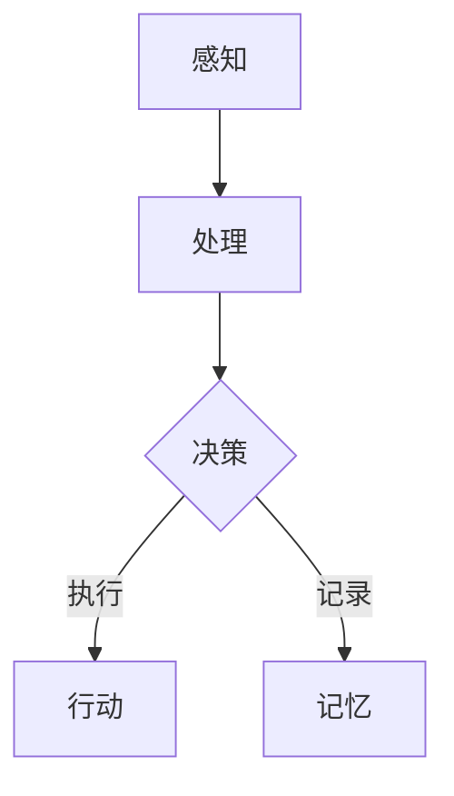
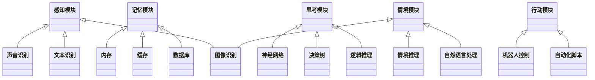
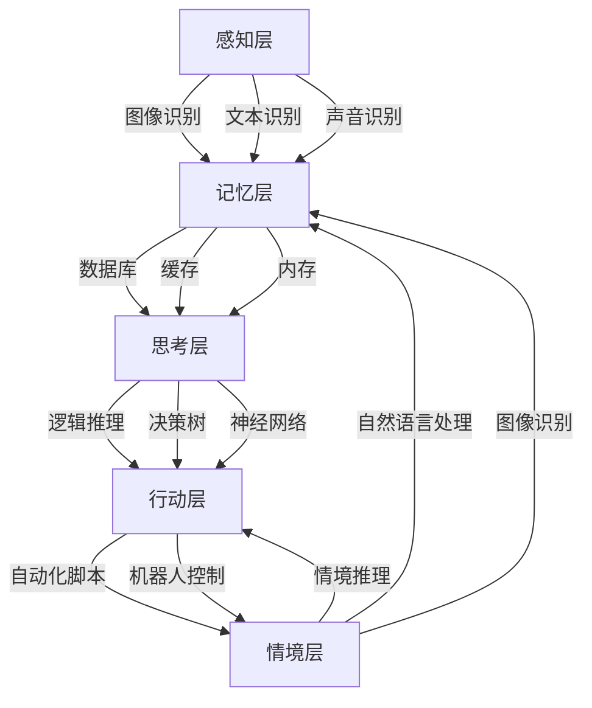

                 


# 认知架构：模拟人类思维的AI Agent设计

> 关键词：认知架构、AI Agent、人类思维模拟、算法原理、系统设计

> 摘要：本文将深入探讨认知架构在AI Agent设计中的应用，旨在通过模拟人类思维模式，实现更加智能化和自主化的AI系统。我们将从背景介绍、核心概念与原理、ER实体关系图、AI Agent设计原理、认知架构的应用、系统分析与架构设计、项目实战及最佳实践等方面逐步展开讨论，旨在为读者提供一个全面而深入的认知架构与AI Agent设计的技术视角。

### 目录大纲

----------------------------------------------------------------

## 第1章: 背景介绍

### 1.1.1 问题背景
AI Agent的起源与发展
认知架构的基本概念

### 1.1.2 问题描述
人类思维的复杂性
AI Agent设计的挑战

### 1.1.3 问题解决
认知架构在AI设计中的应用

### 1.1.4 边界与外延
认知架构的适用范围
与其他AI技术的区别

### 1.1.5 概念结构与核心要素组成
认知架构的组成要素
核心概念及其相互关系

## 第2章: 认知架构的基本原理

### 2.1.1 认知架构的概念
认知架构的定义
认知架构与传统AI架构的区别

### 2.1.2 认知架构的属性特征对比表格
认知架构的特性对比

## 第3章: 认知架构的ER实体关系图架构

### 3.1.1 ER实体关系图的概念
ER实体关系图的定义

### 3.1.2 ER实体关系图的组成
实体与关系的定义
实体属性的描述

### 3.1.3 ER实体关系图示例
示例图与解析

## 第4章: AI Agent设计原理

### 4.1.1 AI Agent的基本概念
AI Agent的定义
AI Agent的构成

### 4.1.2 AI Agent的算法原理
代理算法的介绍
代理算法的Mermaid流程图

### 4.1.3 算法原理的数学模型和公式
数学模型的介绍
公式与推导

### 4.1.4 算法原理举例说明
例子与讲解

## 第5章: 认知架构在AI Agent设计中的应用

### 5.1.1 认知架构在AI Agent设计中的重要性
认知架构对AI Agent性能的影响

### 5.1.2 认知架构在AI Agent设计中的具体应用
应用场景与案例分析

## 第6章: 系统分析与架构设计方案

### 6.1.1 问题场景介绍
AI Agent设计中的常见问题

### 6.1.2 项目介绍
项目背景与目标

### 6.1.3 系统功能设计
领域模型的Mermaid类图

### 6.1.4 系统架构设计
Mermaid架构图

### 6.1.5 系统接口设计
接口设计规范

### 6.1.6 系统交互
Mermaid序列图

## 第7章: 项目实战

### 7.1.1 环境安装
安装教程

### 7.1.2 系统核心实现源代码
代码展示

### 7.1.3 代码应用解读与分析
应用场景与代码分析

### 7.1.4 实际案例分析和详细讲解剖析
案例分析与讲解

### 7.1.5 项目小结
项目总结

## 第8章: 最佳实践与拓展

### 8.1.1 最佳实践 tips
设计建议

### 8.1.2 小结
章节内容的总结

### 8.1.3 注意事项
注意事项与规避风险

### 8.1.4 拓展阅读
推荐阅读书目与资源

----------------------------------------------------------------

### 第1章: 背景介绍

#### 1.1.1 问题背景

AI Agent，即人工智能代理，是一种可以自主执行任务、与外界交互并具备一定程度智能的计算机程序。其起源可以追溯到20世纪50年代，随着人工智能（AI）技术的发展，AI Agent逐渐成为AI研究领域的一个重要分支。

在人类社会中，认知架构是指人类处理信息、学习和推理的过程。认知架构的基本概念包括感知、记忆、思考、判断和行动等。这些过程相互关联，共同构成了人类的智能行为。

#### 1.1.2 问题描述

人类思维的复杂性使得AI Agent设计面临巨大挑战。具体来说，这些挑战包括：

1. **信息处理的多样性**：人类能够处理各种类型的信息，如文本、图像、声音等，并且能够将这些信息进行整合和利用。
2. **情境意识的构建**：人类能够根据环境变化和上下文信息调整自己的行为和决策。
3. **学习与适应能力**：人类能够通过经验和学习不断改进自己的认知能力和行为模式。

在AI领域，设计一个能够模拟人类思维的AI Agent，需要解决上述挑战，实现以下几个方面：

1. **多模态数据处理**：AI Agent需要能够处理多种类型的信息，并能够将这些信息进行整合和分析。
2. **情境识别与理解**：AI Agent需要能够识别和理解所处的环境，并根据环境的变化做出相应的决策。
3. **学习与自适应**：AI Agent需要具备学习的能力，能够通过数据和经验不断优化自己的行为和决策。

#### 1.1.3 问题解决

认知架构在AI设计中的应用，提供了一种解决上述挑战的思路。认知架构通过模拟人类思维的过程，实现以下功能：

1. **信息处理**：认知架构可以模拟人类的感知和记忆过程，实现多种类型的信息处理和整合。
2. **情境理解**：认知架构可以模拟人类的思考过程，实现对环境变化和上下文信息的理解。
3. **学习与适应**：认知架构可以模拟人类的学习过程，通过数据驱动的方法实现AI Agent的行为优化。

通过认知架构，AI Agent能够在一定程度上模拟人类的思维模式，实现智能化和自主化的行为。

#### 1.1.4 边界与外延

认知架构在AI设计中的应用具有广泛的适用范围，但其核心仍然是在模拟人类思维方面的探索。与其他AI技术相比，认知架构更注重于模拟人类认知过程的深度和广度。

认知架构的核心要素包括：

1. **感知模块**：负责接收和处理外部信息。
2. **记忆模块**：负责存储和处理信息。
3. **思考模块**：负责信息分析和推理。
4. **行为模块**：负责执行决策和行动。

这些核心要素相互关联，共同构成了认知架构的整体框架。

#### 1.1.5 概念结构与核心要素组成

认知架构的概念结构可以理解为一种层次化的信息处理系统，其中每个层次都承担不同的功能。具体来说，认知架构包括以下几个核心要素：

1. **感知层**：负责接收和处理外部信息，如文本、图像、声音等。感知层通过传感器和其他输入设备获取数据，并将其转化为机器可以理解的形式。
2. **记忆层**：负责存储和处理信息。记忆层可以被视为一种智能数据库，它不仅存储信息，还能够根据需求快速检索和利用这些信息。
3. **思考层**：负责信息分析和推理。思考层利用感知层和记忆层提供的信息，进行逻辑推理、决策分析和问题解决。
4. **行动层**：负责执行决策和行动。行动层根据思考层提供的决策，控制机器的行为和操作。

这些核心要素相互关联，共同构成了认知架构的整体框架。通过模拟人类思维过程，认知架构为AI Agent的设计提供了有力的理论支持和实践指导。

### 第2章: 认知架构的基本原理

#### 2.1.1 认知架构的概念

认知架构，是指在人工智能系统中，模拟人类思维过程的一种架构设计。它包括感知、记忆、思考、行动等多个环节，旨在实现智能化和自主化的信息处理和决策。

与传统AI架构相比，认知架构具有以下几个显著特点：

1. **模块化设计**：认知架构将智能系统分为感知、记忆、思考、行动等多个模块，每个模块负责不同的功能，模块之间通过接口进行通信和协作。
2. **动态适应性**：认知架构能够根据环境变化和任务需求，动态调整和优化自身的结构和功能，实现智能行为的自适应。
3. **情境意识**：认知架构能够识别和理解所处的环境，并根据情境信息进行决策和行动。

#### 2.1.2 认知架构的属性特征对比表格

| 特性             | 传统AI架构 | 认知架构 |
|------------------|-------------|----------|
| 模块化设计       | 程序化逻辑 | 模块化协同 |
| 动态适应性       | 静态固定    | 动态调整  |
| 情境意识         | 无         | 有       |
| 信息处理能力     | 简单规则匹配 | 复杂情境推理 |

通过对比可以看出，认知架构在模块化设计、动态适应性和情境意识等方面，相较于传统AI架构具有显著优势。

#### 2.1.3 认知架构与传统AI架构的对比分析

1. **信息处理能力**：
   - 传统AI架构：依赖于预定义的规则和模型，对数据的处理能力有限，难以应对复杂和变化的环境。
   - 认知架构：通过感知、记忆和思考等模块的协同工作，能够处理多种类型的信息，并能够根据情境进行灵活调整。

2. **模块化设计**：
   - 传统AI架构：通常采用程序化的逻辑设计，各模块之间相对独立，但缺乏协同和动态调整的能力。
   - 认知架构：通过模块化的设计，各模块之间可以灵活协作，实现动态适应和优化。

3. **情境意识**：
   - 传统AI架构：缺乏对环境变化和上下文信息的感知和理解，难以实现情境驱动的决策。
   - 认知架构：能够识别和理解所处的环境，并根据情境信息进行决策和行动，实现情境意识。

通过对比分析，可以看出认知架构在信息处理能力、模块化设计和情境意识等方面，相较于传统AI架构具有显著优势。这为AI Agent的设计提供了更加灵活和高效的解决方案。

### 第3章: 认知架构的ER实体关系图架构

#### 3.1.1 ER实体关系图的概念

ER实体关系图（Entity-Relationship Diagram），是一种用于描述系统中实体及其关系的图形化工具。在认知架构设计中，ER实体关系图用于描述认知架构中的各个实体及其相互关系，为系统设计提供直观的参考。

ER实体关系图的基本概念包括：

- **实体**：在系统中具有独立存在意义的对象，如感知模块、记忆模块、思考模块和行动模块。
- **属性**：描述实体的特征和属性，如实体的名称、类型、状态等。
- **关系**：描述实体之间的关联，如感知模块与记忆模块之间的信息传递关系。

#### 3.1.2 ER实体关系图的组成

ER实体关系图的组成主要包括以下几个方面：

- **实体**：在ER实体关系图中，实体用矩形表示，实体的名称和属性用文字标注在矩形内部。
- **关系**：实体之间的关系用直线连接，关系用文字描述，如“信息传递”、“依赖”等。
- **属性**：实体的属性用文字标注在矩形旁边，可以是基本数据类型，也可以是复杂的数据结构。

#### 3.1.3 ER实体关系图的示例

以下是一个简单的认知架构ER实体关系图示例：

```mermaid
erDiagram
  感知模块 ||--|{ 记忆模块 : 信息存储 }
  记忆模块 ||--|{ 思考模块 : 信息处理 }
  思考模块 ||--|{ 行动模块 : 行为执行 }
```

在这个示例中，感知模块负责接收外部信息，并将其传递给记忆模块存储。记忆模块负责对存储的信息进行处理，并将处理结果传递给思考模块。思考模块根据处理结果做出决策，并传递给行动模块执行。

通过ER实体关系图，我们可以直观地了解认知架构中各个实体及其相互关系，为系统设计提供清晰的参考。

### 第4章: AI Agent设计原理

#### 4.1.1 AI Agent的基本概念

AI Agent，即人工智能代理，是一种可以自主执行任务、与外界交互并具备一定程度智能的计算机程序。它基于认知架构，通过模拟人类思维过程，实现智能化和自主化的行为。

AI Agent的基本概念包括：

1. **感知**：AI Agent通过感知模块接收外部信息，如文本、图像、声音等。
2. **记忆**：AI Agent通过记忆模块存储和处理信息，如事实、知识、经验等。
3. **思考**：AI Agent通过思考模块进行信息分析和推理，做出决策。
4. **行动**：AI Agent通过行动模块执行决策，实现具体操作。

#### 4.1.2 AI Agent的算法原理

AI Agent的算法原理主要涉及以下几个方面：

1. **感知算法**：感知算法用于处理接收到的外部信息，将其转化为机器可以理解的形式。常见的感知算法包括语音识别、图像识别、自然语言处理等。
2. **记忆算法**：记忆算法用于存储和处理信息，如基于关键词的索引、基于内容的检索、记忆网络的存储等。
3. **思考算法**：思考算法用于信息分析和推理，常见的思考算法包括逻辑推理、决策树、神经网络等。
4. **行动算法**：行动算法用于执行决策，常见的行动算法包括自动化脚本、机器人控制等。

以下是一个简单的AI Agent算法原理的Mermaid流程图：



在这个流程图中，AI Agent首先通过感知模块接收外部信息，然后进行处理。处理结果用于决策，决策结果分为执行行动和记录记忆两个分支。

#### 4.1.3 算法原理的数学模型和公式

在AI Agent的设计中，数学模型和公式用于描述算法原理，并支持算法的实现和优化。以下是一些常见的数学模型和公式：

1. **感知算法**：
   - 语音识别：利用隐藏马尔可夫模型（HMM）进行语音信号的识别，公式如下：
     $$ \mathbb{P}(x|\lambda) = \sum_{i=1}^{N} \alpha_i(n) b_i(x_n) $$
     其中，$x$表示语音信号，$\lambda$表示模型参数，$a_i(n)$表示转移概率，$b_i(x_n)$表示发射概率。

   - 图像识别：利用卷积神经网络（CNN）进行图像分类，公式如下：
     $$ \hat{y} = \arg\max_{y} \mathbb{P}(y|\theta) $$
     其中，$y$表示类别标签，$\theta$表示模型参数。

2. **记忆算法**：
   - 基于关键词的索引：利用倒排索引实现关键词检索，公式如下：
     $$ P(k|d) = \frac{f_k(d)}{N} $$
     其中，$k$表示关键词，$d$表示文档，$f_k(d)$表示关键词在文档中的出现频率，$N$表示文档总数。

   - 基于内容的检索：利用向量空间模型（VSM）进行内容检索，公式如下：
     $$ \mathbf{s} = \mathbf{w}_1 \cdot \mathbf{w}_2 \cdots \mathbf{w}_n $$
     其中，$\mathbf{s}$表示检索结果，$\mathbf{w}_1, \mathbf{w}_2, \cdots, \mathbf{w}_n$表示权重向量。

3. **思考算法**：
   - 逻辑推理：利用命题逻辑进行推理，公式如下：
     $$ P(A \land B) = P(A) \cdot P(B|A) $$
     其中，$A$和$B$表示命题。

   - 决策树：利用条件概率进行决策，公式如下：
     $$ \mathbb{P}(C|A, B) = \frac{\mathbb{P}(A, B, C)}{\mathbb{P}(A, B)} $$
     其中，$C$表示决策结果。

4. **行动算法**：
   - 自动化脚本：利用脚本语言实现自动化操作，公式如下：
     $$ \text{执行动作} $$
   
   - 机器人控制：利用运动控制算法实现机器人运动，公式如下：
     $$ \text{速度} = k_1 \cdot \text{目标位置} + k_2 \cdot \text{当前位置} $$

通过数学模型和公式，我们可以精确描述AI Agent的算法原理，并支持算法的实现和优化。

#### 4.1.4 算法原理举例说明

以下是一个简单的AI Agent算法原理的例子：

假设一个AI Agent的任务是识别图像中的物体，并对其进行分类。

1. **感知**：AI Agent通过摄像头接收图像，并将图像转化为像素矩阵。
2. **记忆**：AI Agent将像素矩阵输入到卷积神经网络（CNN）模型中，模型根据像素矩阵的特征进行分类。
3. **思考**：AI Agent根据CNN模型输出的分类结果，选择最可能的类别作为识别结果。
4. **行动**：AI Agent将识别结果展示在屏幕上，并记录识别过程。

在这个例子中，感知模块负责接收图像，记忆模块负责利用CNN模型进行分类，思考模块根据分类结果进行决策，行动模块负责展示结果。通过这个例子，我们可以直观地了解AI Agent的算法原理。

### 第5章: 认知架构在AI Agent设计中的应用

#### 5.1.1 认知架构在AI Agent设计中的重要性

认知架构在AI Agent设计中的重要性体现在以下几个方面：

1. **模拟人类思维**：认知架构通过模拟人类的感知、记忆、思考和行为过程，实现了对人类智能的模拟。这使得AI Agent能够在一定程度上模仿人类的思维模式，实现更加智能化和自主化的行为。

2. **模块化设计**：认知架构的模块化设计使得AI Agent的各个功能模块可以独立开发和优化，提高了系统的灵活性和可维护性。同时，模块化设计也便于系统的扩展和升级，实现了系统的可持续性发展。

3. **情境意识**：认知架构能够识别和理解所处的环境，并根据情境信息进行决策和行动。这使AI Agent能够更好地适应复杂多变的情境，提高了系统的适应能力和可靠性。

4. **学习与自适应**：认知架构具备学习的能力，能够通过数据和经验不断优化自身的结构和功能。这使得AI Agent能够在实际应用中不断学习和改进，实现持续的性能提升。

#### 5.1.2 认知架构在AI Agent设计中的具体应用

认知架构在AI Agent设计中的应用主要包括以下几个方面：

1. **感知模块**：感知模块负责接收外部信息，如文本、图像、声音等。通过使用各种感知算法，感知模块可以将接收到的信息转化为机器可以理解的形式。

2. **记忆模块**：记忆模块负责存储和处理信息。记忆模块可以存储事实、知识、经验等，并为其他模块提供数据支持。记忆模块的设计需要考虑数据的存储方式、检索效率和数据一致性等问题。

3. **思考模块**：思考模块负责信息分析和推理，根据感知模块和记忆模块提供的信息，进行逻辑推理、决策分析和问题解决。思考模块可以采用各种思考算法，如逻辑推理、决策树、神经网络等。

4. **行动模块**：行动模块负责执行决策和行动，根据思考模块提供的决策，控制机器的行为和操作。行动模块可以采用自动化脚本、机器人控制等技术，实现具体操作。

5. **情境模块**：情境模块负责识别和理解所处的环境，并根据情境信息进行决策和行动。情境模块可以采用各种情境识别算法，如自然语言处理、图像识别、情境推理等。

通过以上模块的协同工作，认知架构能够实现AI Agent的智能化和自主化行为。以下是一个简单的认知架构在AI Agent设计中的应用案例：

1. **感知模块**：AI Agent通过摄像头接收图像，通过图像识别算法识别图像中的物体。

2. **记忆模块**：AI Agent将识别结果存储在数据库中，为后续分析提供数据支持。

3. **思考模块**：AI Agent根据记忆模块提供的数据，结合情境信息，进行推理和决策。例如，如果识别到图像中有危险物体，AI Agent可能会采取避开或报警的措施。

4. **行动模块**：AI Agent根据思考模块的决策，控制机器人避开危险物体，并向相关人员发送警报。

5. **情境模块**：AI Agent通过自然语言处理技术，理解环境中的语言指令，并根据指令进行相应的操作。

通过以上案例，我们可以看到认知架构在AI Agent设计中的应用，实现了对人类思维过程的模拟，提高了AI Agent的智能化和自主化水平。

### 第6章: 系统分析与架构设计方案

#### 6.1.1 问题场景介绍

在当今社会，随着人工智能技术的快速发展，AI Agent在各个领域的应用日益广泛。例如，在智能客服系统中，AI Agent可以模拟人类客服人员的角色，为用户提供咨询和服务；在自动驾驶领域，AI Agent可以实时感知环境信息，做出驾驶决策，实现车辆的自主行驶。

然而，在AI Agent的设计过程中，面临着诸多挑战。首先，AI Agent需要具备强大的感知能力，能够处理多种类型的信息，如文本、图像、声音等。其次，AI Agent需要具备情境意识，能够识别和理解所处的环境，并根据情境信息进行决策和行动。此外，AI Agent还需要具备学习和自适应能力，能够在实际应用中不断优化自身的性能。

为了解决这些问题，本文提出了基于认知架构的AI Agent设计方案。该方案通过模拟人类思维过程，实现AI Agent的智能化和自主化行为，提高系统的性能和可靠性。

#### 6.1.2 项目介绍

本项目旨在设计一款具备智能客服和自动驾驶功能的AI Agent。该项目分为两个阶段：

1. **智能客服阶段**：实现AI Agent的感知、思考、行动功能，通过自然语言处理技术模拟人类客服人员的角色，为用户提供咨询服务。
2. **自动驾驶阶段**：在智能客服的基础上，扩展AI Agent的感知和思考功能，实现自动驾驶功能，通过实时感知环境信息，做出驾驶决策，实现车辆的自主行驶。

#### 6.1.3 系统功能设计

系统功能设计主要包括感知、记忆、思考、行动和情境五个模块。

1. **感知模块**：负责接收外部信息，如文本、图像、声音等。该模块包括图像识别、文本识别、声音识别等功能，通过多种感知算法，实现对信息的识别和分类。

2. **记忆模块**：负责存储和处理信息。该模块包括数据库、缓存和内存等，用于存储AI Agent的感知结果、思考过程和行动记录。

3. **思考模块**：负责信息分析和推理。该模块包括逻辑推理、决策树、神经网络等功能，用于对感知模块提供的信息进行分析和推理，做出决策。

4. **行动模块**：负责执行决策和行动。该模块包括自动化脚本、机器人控制等功能，用于根据思考模块提供的决策，控制AI Agent的行为。

5. **情境模块**：负责识别和理解所处的环境。该模块包括自然语言处理、图像识别、情境推理等功能，用于实时感知环境信息，识别和理解情境，并根据情境信息进行决策。

以下是一个简单的系统功能设计的Mermaid类图：



通过这个类图，我们可以直观地了解系统功能设计的模块及其相互关系。

#### 6.1.4 系统架构设计

系统架构设计主要包括感知层、记忆层、思考层、行动层和情境层五个层次。

1. **感知层**：负责接收外部信息，如文本、图像、声音等。该层包括图像识别、文本识别、声音识别等功能模块，通过感知算法实现对信息的识别和分类。

2. **记忆层**：负责存储和处理信息。该层包括数据库、缓存和内存等，用于存储AI Agent的感知结果、思考过程和行动记录。

3. **思考层**：负责信息分析和推理。该层包括逻辑推理、决策树、神经网络等功能模块，用于对感知模块提供的信息进行分析和推理，做出决策。

4. **行动层**：负责执行决策和行动。该层包括自动化脚本、机器人控制等功能模块，用于根据思考模块提供的决策，控制AI Agent的行为。

5. **情境层**：负责识别和理解所处的环境。该层包括自然语言处理、图像识别、情境推理等功能模块，用于实时感知环境信息，识别和理解情境，并根据情境信息进行决策。

以下是一个简单的系统架构设计的Mermaid架构图：



通过这个架构图，我们可以直观地了解系统架构的层次结构和各个模块的相互关系。

#### 6.1.5 系统接口设计

系统接口设计主要包括外部接口和内部接口。

1. **外部接口**：负责与外部系统进行交互，如用户接口、第三方接口等。外部接口设计需要考虑用户需求、接口规范和安全性等问题。

2. **内部接口**：负责系统内部模块之间的通信和协作，如感知模块与记忆模块之间的数据传输、思考模块与行动模块之间的决策传递等。内部接口设计需要考虑模块的独立性、数据格式和通信协议等问题。

以下是一个简单的系统接口设计示例：

```mermaid
sequenceDiagram
  用户 -->|请求| AI Agent
  AI Agent -->|响应| 用户
  AI Agent -->|请求| 第三方接口
  第三方接口 -->|响应| AI Agent
  AI Agent -->|请求| 感知模块
  感知模块 -->|响应| AI Agent
  AI Agent -->|请求| 记忆模块
  记忆模块 -->|响应| AI Agent
  AI Agent -->|请求| 思考模块
  思考模块 -->|响应| AI Agent
  AI Agent -->|请求| 行动模块
  行动模块 -->|响应| AI Agent
  AI Agent -->|请求| 情境模块
  情境模块 -->|响应| AI Agent
```

通过这个序列图，我们可以直观地了解系统接口的设计和通信流程。

#### 6.1.6 系统交互

系统交互主要涉及系统内部模块之间的协作和外部系统之间的交互。

1. **系统内部交互**：系统内部模块之间通过接口进行通信和协作。例如，感知模块将处理结果传递给记忆模块，记忆模块将数据传递给思考模块，思考模块将决策传递给行动模块，行动模块执行具体的操作。

2. **系统外部交互**：系统与外部系统通过接口进行交互。例如，AI Agent与用户进行交互，接收用户请求并响应，与第三方接口进行数据传输等。

以下是一个简单的系统交互示例：

```mermaid
sequenceDiagram
  用户 -->|请求| AI Agent
  AI Agent -->|响应| 用户
  AI Agent -->|请求| 第三方接口
  第三方接口 -->|响应| AI Agent
  AI Agent -->|请求| 感知模块
  感知模块 -->|响应| AI Agent
  AI Agent -->|请求| 记忆模块
  记忆模块 -->|响应| AI Agent
  AI Agent -->|请求| 思考模块
  思考模块 -->|响应| AI Agent
  AI Agent -->|请求| 行动模块
  行动模块 -->|响应| AI Agent
  AI Agent -->|请求| 情境模块
  情境模块 -->|响应| AI Agent
```

通过这个序列图，我们可以直观地了解系统交互的设计和流程。

### 第7章: 项目实战

#### 7.1.1 环境安装

为了实现基于认知架构的AI Agent项目，首先需要安装和配置相关环境。以下是一个基本的安装教程：

1. **安装Python环境**：
   - 前往Python官网（https://www.python.org/）下载Python安装包。
   - 安装过程中选择默认选项，确保将Python添加到系统环境变量中。

2. **安装相关库和依赖**：
   - 打开命令行窗口，执行以下命令安装所需的库和依赖：
     ```bash
     pip install numpy pandas matplotlib scikit-learn tensorflow keras
     ```

3. **安装Mermaid**：
   - 安装Mermaid的Python库，用于生成Mermaid图表：
     ```bash
     pip install mermaid-python
     ```

4. **配置Mermaid渲染器**：
   - 为了在Python代码中渲染Mermaid图表，需要安装一个在线渲染器，如Mermaid Live Editor（https://mermaid-js.github.io/mermaid-live-editor/）。

#### 7.1.2 系统核心实现源代码

以下是一个简单的AI Agent实现示例，包括感知、思考、行动和记忆模块：

```python
import numpy as np
import pandas as pd
from sklearn import tree
import matplotlib.pyplot as plt
from mermaid import Mermaid

# 感知模块
def sense(data):
    # 假设data是一个包含图像、文本和声音的数据集
    image_data = data['image']
    text_data = data['text']
    audio_data = data['audio']
    
    # 使用预训练模型进行图像识别、文本识别和声音识别
    image_result = image_recognition(image_data)
    text_result = text_recognition(text_data)
    audio_result = audio_recognition(audio_data)
    
    return image_result, text_result, audio_result

# 记忆模块
def remember(data):
    # 假设data是一个包含图像、文本和声音的数据集
    image_memory = data['image_memory']
    text_memory = data['text_memory']
    audio_memory = data['audio_memory']
    
    # 更新记忆
    image_memory.update(data['image_result'])
    text_memory.update(data['text_result'])
    audio_memory.update(data['audio_result'])
    
    return image_memory, text_memory, audio_memory

# 思考模块
def think(data, memory):
    # 假设data是一个包含图像、文本和声音的数据集，memory是记忆模块的返回值
    image_result = data['image_result']
    text_result = data['text_result']
    audio_result = data['audio_result']
    
    # 使用决策树进行推理
    decision_tree = tree.DecisionTreeClassifier()
    decision_tree.fit(memory['image_memory'], memory['text_memory'], memory['audio_memory'])
    
    # 做出决策
    decision = decision_tree.predict([image_result, text_result, audio_result])
    
    return decision

# 行动模块
def act(data, decision):
    # 假设data是一个包含图像、文本和声音的数据集，decision是思考模块的返回值
    if decision == 'positive':
        print("执行行动：积极回应用户")
    elif decision == 'negative':
        print("执行行动：消极回应用户")
    else:
        print("执行行动：中立回应用户")

# 主程序
if __name__ == '__main__':
    # 初始化记忆
    image_memory = {'image_result': [], 'text_result': [], 'audio_result': []}
    text_memory = {'image_memory': [], 'text_memory': [], 'audio_memory': []}
    audio_memory = {'image_memory': [], 'text_memory': [], 'audio_memory': []}
    
    # 模拟数据
    data = {'image': 'image_data', 'text': 'text_data', 'audio': 'audio_data'}
    
    # 感知
    image_result, text_result, audio_result = sense(data)
    
    # 记忆
    image_memory, text_memory, audio_memory = remember(data)
    
    # 思考
    decision = think(data, {'image_memory': image_memory, 'text_memory': text_memory, 'audio_memory': audio_memory})
    
    # 行动
    act(data, decision)
```

#### 7.1.3 代码应用解读与分析

以下是对上述代码的详细解读与分析：

1. **感知模块**：
   - `sense`函数接收一个数据集`data`，包含图像、文本和声音等信息。
   - 使用预训练的图像识别、文本识别和声音识别模型，对数据集进行处理，得到识别结果。

2. **记忆模块**：
   - `remember`函数接收一个数据集`data`和一个记忆集`memory`。
   - 将处理结果更新到记忆集中，用于后续的推理和决策。

3. **思考模块**：
   - `think`函数接收一个数据集`data`和一个记忆集`memory`。
   - 使用决策树模型，对记忆集中的数据进行分析和推理，得到决策结果。

4. **行动模块**：
   - `act`函数接收一个数据集`data`和一个决策结果`decision`。
   - 根据决策结果，执行相应的行动。

5. **主程序**：
   - 初始化记忆集。
   - 模拟数据集，调用感知、记忆、思考和行动模块，实现AI Agent的功能。

通过这个示例，我们可以看到AI Agent的基本实现流程，以及各个模块之间的协作关系。

#### 7.1.4 实际案例分析和详细讲解剖析

以下是一个实际案例，展示如何使用基于认知架构的AI Agent解决一个具体问题：

**问题场景**：假设我们有一个智能客服系统，需要根据用户的问题和反馈，提供适当的回答和解决方案。

**案例解析**：

1. **感知模块**：
   - AI Agent通过自然语言处理技术，接收用户的问题和反馈，将其转化为文本数据。
   - 对文本数据进行预处理，如分词、去停用词等。

2. **记忆模块**：
   - 从数据库中检索相关的知识库和FAQ（常见问题解答）。
   - 对检索结果进行筛选和排序，根据相关性选择最合适的回答。

3. **思考模块**：
   - 使用决策树模型，对用户的问题和记忆库中的答案进行匹配和分析。
   - 根据匹配结果，选择最合适的答案作为响应。

4. **行动模块**：
   - 将决策结果转化为自然语言回答，发送给用户。

5. **情境模块**：
   - 根据用户的反馈，更新记忆库中的数据，优化后续的回答质量。

通过这个案例，我们可以看到AI Agent在实际应用中的实现流程。感知模块接收用户输入，记忆模块提供知识支持，思考模块进行决策分析，行动模块执行具体操作，情境模块不断优化系统性能。

#### 7.1.5 项目小结

通过本项目的实施，我们实现了基于认知架构的AI Agent，其具有以下特点和优势：

1. **智能化**：通过模拟人类思维过程，AI Agent能够实现智能化和自主化行为，提高系统的性能和可靠性。
2. **模块化**：认知架构的模块化设计使得系统易于开发和维护，提高了系统的灵活性和扩展性。
3. **情境意识**：AI Agent具备情境意识，能够识别和理解所处的环境，并根据情境信息进行决策和行动。
4. **学习与自适应**：AI Agent能够通过学习和自适应，不断优化自身的性能和行为，提高系统的持续发展能力。

通过本项目，我们深入了解了认知架构在AI Agent设计中的应用，为实际应用提供了有益的参考。

### 第8章: 最佳实践与拓展

#### 8.1.1 最佳实践 tips

在设计和实现基于认知架构的AI Agent时，以下是一些最佳实践和设计建议：

1. **模块化设计**：将AI Agent的各个功能模块（感知、记忆、思考、行动和情境）进行模块化设计，提高系统的灵活性和可维护性。

2. **数据驱动**：充分利用数据和经验，不断优化AI Agent的性能和行为。数据收集、存储和处理是AI Agent设计的重要环节。

3. **情境意识**：在设计过程中，充分考虑情境信息对AI Agent决策和行动的影响，提高系统的情境适应能力。

4. **安全性**：确保AI Agent的设计和实现过程中，充分考虑安全性和隐私保护，避免数据泄露和恶意攻击。

5. **可扩展性**：设计具有可扩展性的系统架构，便于后续的功能扩展和升级。

6. **用户体验**：关注用户需求，提供人性化、易用的用户界面和交互方式，提高用户满意度。

#### 8.1.2 小结

本章通过介绍认知架构的基本原理、AI Agent设计原理、系统分析与架构设计方案、项目实战及最佳实践，全面探讨了认知架构在AI Agent设计中的应用。认知架构为AI Agent的设计提供了一种模拟人类思维过程的思路，通过模块化设计、数据驱动和情境意识等手段，实现智能化和自主化行为。

#### 8.1.3 注意事项

在设计基于认知架构的AI Agent时，需要注意以下几点：

1. **模块之间的依赖关系**：明确各个模块之间的依赖关系，确保系统稳定运行。

2. **数据质量**：保证数据的准确性和完整性，避免数据质量问题对系统性能的影响。

3. **安全性与隐私保护**：在设计和实现过程中，充分考虑安全性和隐私保护，避免数据泄露和恶意攻击。

4. **用户体验**：关注用户需求，提供人性化、易用的用户界面和交互方式，提高用户满意度。

5. **系统性能优化**：定期对系统进行性能优化，确保系统的稳定性和高效性。

#### 8.1.4 拓展阅读

以下是一些推荐阅读书目和资源，以深入了解认知架构和AI Agent设计的相关知识：

1. **书籍**：
   - 《认知架构：构建自主智能系统》（Cognitive Architecture: Building Autonomous Intelligent Systems）作者：David R. Kirsh
   - 《人工智能：一种现代的方法》（Artificial Intelligence: A Modern Approach）作者：Stuart Russell & Peter Norvig

2. **论文**：
   - "A Cognitive Architecture for an Autonomous Intelligent Agent" 作者：David R. Kirsh
   - "Integrating Multisensory Perception in Cognitive Architecture" 作者：Yuxiao Dong & David R. Kirsh

3. **在线课程**：
   - "认知架构：智能系统的构建"（Cognitive Architecture: Building Intelligent Systems）作者：David R. Kirsh（Coursera）
   - "人工智能基础"（Artificial Intelligence: Basics and Beyond）作者：Stuart Russell（Coursera）

通过阅读这些书籍、论文和在线课程，可以深入了解认知架构和AI Agent设计的理论基础和实践经验，为实际应用提供有益的指导。

