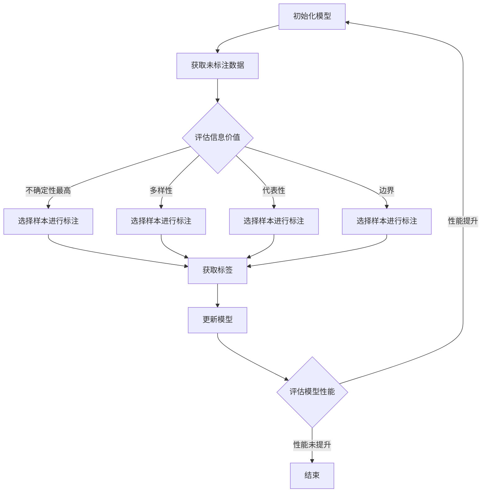
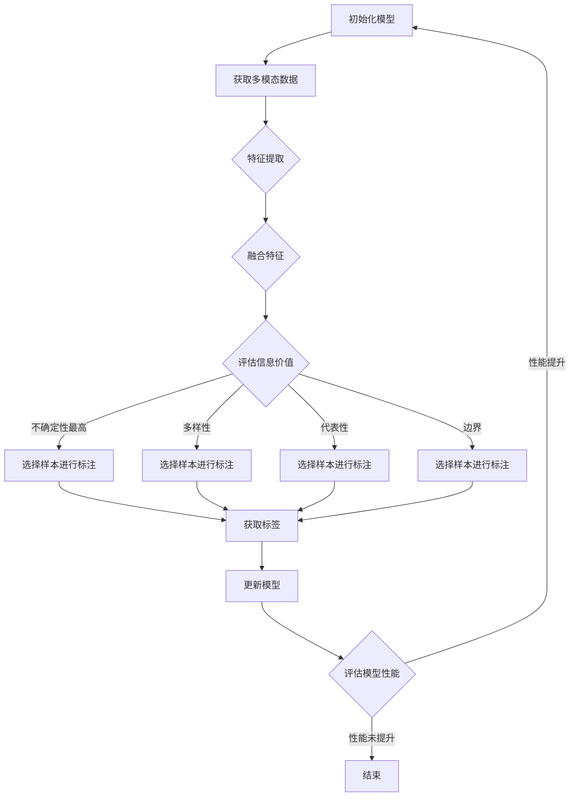

                 

### 文章标题：设计AI Agent的主动学习策略

---

**关键词：** 主动学习、AI Agent、机器学习、策略设计、算法原理

**摘要：** 本文将深入探讨AI Agent主动学习策略的设计，从背景介绍、核心概念解析、策略设计与实现，到实际案例分析和未来发展趋势，全面剖析主动学习策略在AI Agent中的应用与实践。通过逐步分析推理，帮助读者理解主动学习策略的设计原理，掌握其在实际项目中的实现方法，为人工智能领域的研究与应用提供有益参考。

---

### 引言

随着人工智能（AI）和机器学习（ML）技术的快速发展，AI Agent作为一种能够自主执行任务的智能体，受到了广泛的关注。AI Agent在自动化、决策支持、智能交互等领域具有广泛的应用前景，但其性能和适应性在很大程度上依赖于其学习能力。主动学习（Active Learning）作为一种能够有效提升模型性能的方法，成为AI Agent设计中的重要组成部分。

主动学习策略通过选择具有高信息价值的样本进行学习，从而减少对标注数据的依赖，提高模型的学习效率和准确性。与传统的被动学习（Passive Learning）相比，主动学习能够更好地应对数据稀缺、标注成本高的问题，在有限的数据资源下实现更好的模型性能。

本文将围绕设计AI Agent的主动学习策略展开讨论，首先介绍相关背景和核心概念，然后分析主动学习策略的设计原则和方法，最后通过实际案例分析和未来发展趋势，探讨主动学习策略在AI Agent中的应用与实践。

---

### 第一部分：背景介绍

#### 第1章：问题背景与核心概念

##### 1.1 问题背景

随着互联网的普及和大数据时代的到来，数据量呈指数级增长，这为人工智能和机器学习技术的应用提供了丰富的数据资源。然而，数据标注成本高昂，特别是在涉及复杂场景和多样性的任务中，标注数据的获取成为一个瓶颈。被动学习（Passive Learning）依赖于大量的标注数据进行训练，往往需要大量的时间和人力资源。在这种背景下，主动学习（Active Learning）作为一种能够减少标注数据需求的方法，逐渐受到关注。

AI Agent作为一种能够自主执行任务、具备智能决策能力的实体，广泛应用于自动化、智能交互、决策支持等领域。AI Agent的性能和适应性在很大程度上取决于其学习能力。传统的被动学习策略在数据稀缺的情况下往往难以达到满意的性能，而主动学习策略能够通过选择具有高信息价值的样本进行学习，有效提升模型的学习效率和准确性。

##### 1.2 核心概念

**AI Agent**：AI Agent是一种能够自主执行任务、具备智能决策能力的实体。它通过模拟人类智能的决策过程，实现自动化、智能化的任务执行。AI Agent的核心包括感知器、控制器和执行器，其中感知器负责获取环境信息，控制器根据感知信息进行决策，执行器负责执行决策结果。

**主动学习（Active Learning）**：主动学习是一种能够在有限的标注数据下，通过选择具有高信息价值的样本进行学习的策略。与被动学习相比，主动学习能够降低对大量标注数据的依赖，提高模型的学习效率和准确性。

**被动学习（Passive Learning）**：被动学习是一种依赖于大量标注数据进行学习的策略。在被动学习中，模型通过对标注数据的学习，逐渐优化自身的性能。被动学习通常需要大量的标注数据，但在数据稀缺的情况下，其性能受到限制。

**信息价值**：在主动学习中，选择具有高信息价值的样本进行学习至关重要。信息价值可以通过样本的多样性、不确定性、代表性等指标进行衡量。具有高信息价值的样本能够为模型提供更多的知识，有助于提升模型的泛化能力。

##### 1.3 概念联系

AI Agent的主动学习策略是人工智能和机器学习领域的重要研究方向。主动学习策略在AI Agent中的应用，旨在通过选择具有高信息价值的样本，减少对标注数据的依赖，提高模型的学习效率和准确性。

主动学习与强化学习（Reinforcement Learning）、迁移学习（Transfer Learning）等其他学习策略有密切的联系。强化学习通过奖励机制引导模型学习，迁移学习通过在不同任务之间共享知识，有效利用已有的知识资源。主动学习策略可以与这些策略结合，进一步优化AI Agent的学习过程。

此外，主动学习策略在AI Agent中的应用，还涉及到不确定性减少（Uncertainty Reduction）、数据增强（Data Augmentation）等技术。通过降低模型的不确定性，增强数据多样性，主动学习策略能够提升模型的泛化能力，应对复杂多变的任务场景。

#### 第2章：主动学习策略的基本原理

##### 2.1 主动学习的定义

主动学习是一种在学习过程中，根据模型的当前状态，主动选择具有高信息价值的样本进行学习的策略。与被动学习不同，主动学习不是随机选择样本进行学习，而是通过一定的策略，选择对模型学习最有帮助的样本。

在主动学习中，模型需要具备一定的能力，能够对样本进行评估，选择具有高信息价值的样本。这些样本能够为模型提供更多的知识，有助于提升模型的泛化能力。因此，主动学习策略的关键在于如何有效地选择样本，以提高模型的学习效率和准确性。

##### 2.2 主动学习的核心原理

**信息论与不确定性减少**：信息论是主动学习的基础理论之一。在主动学习中，信息论中的熵（Entropy）和互信息（Mutual Information）等概念被用来衡量样本的信息价值。通过减少不确定性，降低模型的熵，主动学习策略能够选择出对模型学习最有帮助的样本。

**标签获取的成本与效率**：在主动学习中，标签获取的成本和效率是关键因素。通过优化标签获取策略，主动学习能够降低对大量标注数据的依赖，提高模型的学习效率和准确性。标签获取的成本包括数据获取、标注过程、计算资源等，而标签获取的效率则取决于标签获取策略的优化程度。

**样本多样性**：在主动学习中，样本的多样性是提高模型泛化能力的重要因素。通过选择具有不同特征的样本，模型能够更好地应对复杂多变的任务场景。样本多样性可以通过数据增强（Data Augmentation）、采样策略等手段实现。

**模型自适应能力**：在主动学习中，模型需要具备一定的自适应能力，能够根据样本信息进行动态调整。通过不断优化模型，主动学习策略能够适应不同的任务场景，提高模型的学习效率和准确性。

##### 2.3 主动学习策略的类型

**选择性采样策略**：选择性采样策略是主动学习中最常用的策略之一。它通过评估样本的信息价值，选择具有高信息价值的样本进行学习。选择性采样策略可以分为基于不确定性的采样策略和基于多样性的采样策略。

**采样后处理策略**：采样后处理策略是对已经选择的样本进行进一步处理，以提高模型的学习效率和准确性。采样后处理策略包括标签修正、数据增强等技术。

**模型自适应策略**：模型自适应策略是针对模型在不同任务场景中的适应性进行优化。通过动态调整模型参数，模型自适应策略能够提高模型在不同场景下的泛化能力。

#### 第3章：主动学习策略的设计与方法

##### 3.1 选择性采样策略

选择性采样策略是主动学习策略的核心之一，通过评估样本的信息价值，选择具有高信息价值的样本进行学习。选择性采样策略可以分为基于不确定性的采样策略和基于多样性的采样策略。

**基于不确定性的采样策略**：基于不确定性的采样策略通过评估模型对样本的不确定性，选择不确定性最高的样本进行学习。这种策略能够有效减少模型的不确定性，提高模型的学习效率和准确性。

**基于多样性的采样策略**：基于多样性的采样策略通过评估样本的多样性，选择具有不同特征的样本进行学习。这种策略能够提高模型的泛化能力，应对复杂多变的任务场景。

##### 3.2 采样后处理策略

采样后处理策略是对已经选择的样本进行进一步处理，以提高模型的学习效率和准确性。采样后处理策略包括标签修正、数据增强等技术。

**标签修正**：标签修正是对已经标注的样本进行修正，以提高标签的准确性。标签修正可以通过迭代修正、投票修正等方法实现。

**数据增强**：数据增强是通过生成具有相似特征的数据样本，增加模型的训练数据。数据增强可以通过图像增强、文本增强等方法实现。

##### 3.3 模型自适应策略

模型自适应策略是针对模型在不同任务场景中的适应性进行优化。通过动态调整模型参数，模型自适应策略能够提高模型在不同场景下的泛化能力。

**模型更新策略**：模型更新策略是针对模型在不同任务场景下的适应性进行优化。通过不断调整模型参数，模型更新策略能够提高模型在不同场景下的泛化能力。

**模型选择策略**：模型选择策略是在多个模型中选取最优模型。通过评估模型的性能和适应性，模型选择策略能够选取出最优模型，提高模型的泛化能力。

### 第二部分：主动学习策略的应用与实践

#### 第4章：主动学习策略在不同领域的应用

##### 4.1 自然语言处理

自然语言处理（Natural Language Processing，NLP）是人工智能领域的重要分支，涉及文本分类、情感分析、问答系统等任务。在NLP任务中，主动学习策略可以显著提高模型的学习效率和准确性。

**文本分类**：文本分类是将文本数据分为不同类别的过程。通过主动学习策略，可以选择具有代表性的文本数据，减少对大量标注数据的依赖，提高模型的分类准确性。

**情感分析**：情感分析是分析文本数据的情感倾向，如正面、负面或中性。通过主动学习策略，可以选择具有代表性的情感数据，提高模型的情感分析准确性。

**问答系统**：问答系统是回答用户提出的问题的系统。通过主动学习策略，可以选择具有代表性的问题数据，提高模型的问答能力。

##### 4.2 计算机视觉

计算机视觉（Computer Vision）是人工智能领域的另一个重要分支，涉及图像分类、目标检测、视频分析等任务。在计算机视觉任务中，主动学习策略可以显著提高模型的学习效率和准确性。

**图像分类**：图像分类是将图像数据分为不同类别的过程。通过主动学习策略，可以选择具有代表性的图像数据，减少对大量标注数据的依赖，提高模型的分类准确性。

**目标检测**：目标检测是在图像中检测特定目标的过程。通过主动学习策略，可以选择具有代表性的目标数据，提高模型的目标检测准确性。

**视频分析**：视频分析是分析视频数据的过程，如动作识别、事件检测等。通过主动学习策略，可以选择具有代表性的视频数据，提高模型的视频分析准确性。

##### 4.3 推荐系统

推荐系统（Recommendation System）是用于推荐用户可能感兴趣的商品、内容等的系统。在推荐系统中，主动学习策略可以显著提高推荐系统的学习效率和准确性。

**个性化推荐**：个性化推荐是根据用户的历史行为和偏好，为用户推荐可能感兴趣的商品、内容等。通过主动学习策略，可以选择具有代表性的用户行为数据，提高个性化推荐的准确性。

**商品推荐**：商品推荐是推荐用户可能感兴趣的商品。通过主动学习策略，可以选择具有代表性的商品数据，提高商品推荐的准确性。

#### 第5章：实际案例分析与策略优化

在本节中，我们将通过三个实际案例，详细分析主动学习策略在不同任务中的设计和实现过程，并探讨策略优化的方法。

##### 5.1 案例一：自然语言处理中的应用

**案例描述**：假设我们面临一个文本分类任务，需要根据文本内容将其分为新闻、评论、博客等类别。数据集中存在大量未标注的文本数据，标注成本较高。

**策略设计**：
1. **选择性采样**：通过计算文本数据的特征分布和模型预测的不确定性，选择具有高信息价值的文本数据进行标注。
2. **数据增强**：对于已选择的文本数据，使用文本增强技术生成更多的具有相似特征的样本，以丰富训练数据。
3. **模型更新**：通过迭代训练和调整模型参数，不断提高模型在未标注数据上的预测准确性。

**优化方法**：
- **标签修正**：对已标注的文本数据进行迭代修正，提高标签的准确性。
- **多样性采样**：在选择样本时，考虑样本的多样性，以增强模型的泛化能力。
- **多任务学习**：结合多个文本分类任务，共享知识资源，提高模型的适应性。

##### 5.2 案例二：计算机视觉中的应用

**案例描述**：假设我们面临一个目标检测任务，需要在图像中检测特定的目标物体。数据集中存在大量未标注的图像数据，标注成本较高。

**策略设计**：
1. **选择性采样**：通过计算图像数据的特征分布和模型预测的不确定性，选择具有高信息价值的图像数据进行标注。
2. **数据增强**：对于已选择的图像数据，使用图像增强技术生成更多的具有相似特征的样本，以丰富训练数据。
3. **模型更新**：通过迭代训练和调整模型参数，不断提高模型在未标注数据上的检测准确性。

**优化方法**：
- **多尺度采样**：在选择样本时，考虑不同尺度下的特征分布，以增强模型的适应性。
- **标签修正**：对已标注的图像数据进行迭代修正，提高标签的准确性。
- **迁移学习**：结合已标注的数据集和未标注的数据集，通过迁移学习技术，提高模型在未标注数据集上的性能。

##### 5.3 案例三：推荐系统中的应用

**案例描述**：假设我们面临一个商品推荐任务，需要根据用户的历史行为和偏好，为用户推荐可能感兴趣的商品。数据集中存在大量未标注的用户行为数据，标注成本较高。

**策略设计**：
1. **选择性采样**：通过计算用户行为数据的特征分布和模型预测的不确定性，选择具有高信息价值的用户行为数据进行标注。
2. **数据增强**：对于已选择的用户行为数据，使用行为增强技术生成更多的具有相似特征的用户行为数据，以丰富训练数据。
3. **模型更新**：通过迭代训练和调整模型参数，不断提高模型在未标注数据上的推荐准确性。

**优化方法**：
- **用户多样性**：在选择样本时，考虑不同用户的行为多样性，以增强模型的泛化能力。
- **标签修正**：对已标注的用户行为数据进行迭代修正，提高标签的准确性。
- **协同过滤**：结合协同过滤（Collaborative Filtering）技术，通过用户行为数据之间的相关性，提高推荐的准确性。

#### 第6章：主动学习策略的挑战与未来趋势

##### 6.1 挑战

**数据标注成本**：主动学习策略依赖于对具有高信息价值的样本进行标注，而标注过程通常需要大量的人力和时间。特别是在涉及复杂场景和多样性的任务中，标注成本高昂，成为主动学习策略应用的一大挑战。

**模型适应性**：主动学习策略需要根据不同任务场景进行调整和优化，以提高模型的适应性。然而，不同任务场景下的特征分布和不确定性差异较大，模型适应性成为另一个挑战。

**数据分布问题**：在主动学习中，选择具有高信息价值的样本需要考虑数据分布。如果数据分布不均匀，可能会导致模型在特定任务场景下的性能下降。

##### 6.2 未来趋势

**深度学习与主动学习的结合**：深度学习（Deep Learning）在图像、语音、文本等领域的应用取得了显著成果。未来，深度学习与主动学习的结合将成为一个重要趋势，通过深度学习模型的自适应能力和主动学习策略的选择性，实现更高性能的模型。

**多模态数据的主动学习**：随着多模态数据（如图像、文本、语音等）的广泛应用，多模态数据的主动学习将成为一个重要研究方向。通过融合不同模态的数据，提高模型的泛化能力和适应性。

**自动化策略设计**：未来的主动学习策略设计将趋向于自动化，通过机器学习和人工智能技术，实现自动选择具有高信息价值的样本、自动调整模型参数，降低人为干预。

### 第三部分：最佳实践与拓展

#### 第7章：最佳实践与技巧

**数据集选择**：在选择数据集时，需要考虑数据集的多样性、覆盖范围和标注质量。选择具有代表性的数据集，有助于提升主动学习策略的性能。

**模型评估指标**：选择合适的评估指标，如准确率、召回率、F1值等，用于评估模型的学习效率和准确性。同时，需要考虑评估指标在不同任务场景下的适用性。

**策略调优**：在主动学习策略的设计和实现过程中，需要不断进行策略调优，以适应不同任务场景。通过实验和评估，选择最佳策略组合，提高模型的学习效率和准确性。

#### 第8章：小结与展望

**小结**：本文从背景介绍、核心概念解析、策略设计与实现，到实际案例分析和未来发展趋势，全面剖析了AI Agent主动学习策略的设计与应用。通过逐步分析推理，帮助读者理解主动学习策略的设计原理，掌握其在实际项目中的实现方法。

**展望**：未来，主动学习策略将在人工智能和机器学习领域发挥更重要的作用。随着深度学习、多模态数据和自动化技术的不断发展，主动学习策略的应用范围将不断扩大，为人工智能技术的发展提供新的动力。

### 作者信息

作者：AI天才研究院/AI Genius Institute & 禅与计算机程序设计艺术 /Zen And The Art of Computer Programming

本文旨在为读者提供关于设计AI Agent主动学习策略的全面分析和实践指导，以推动人工智能领域的研究与应用。希望本文能为读者在相关领域的研究和实践中提供有益参考。如果您有任何问题或建议，欢迎随时与我们联系。感谢您的阅读！### 基础背景知识

为了更好地理解主动学习策略在AI Agent设计中的应用，我们首先需要了解一些基础背景知识，包括机器学习的基本概念、AI Agent的定义及其在各个领域的应用，以及主动学习策略的核心原理。

#### 机器学习的基本概念

机器学习（Machine Learning）是人工智能（Artificial Intelligence）的一个重要分支，旨在使计算机系统能够从数据中学习并做出决策或预测。机器学习的主要目标是通过构建模型，使系统能够在新的数据上执行特定任务，如分类、回归、聚类等。

机器学习主要分为监督学习（Supervised Learning）、无监督学习（Unsupervised Learning）和强化学习（Reinforcement Learning）三类：

1. **监督学习**：监督学习是一种从标记数据中学习的方法。标记数据包含输入和对应的输出（标签），模型通过学习输入与输出之间的关系来预测新数据的输出。常见的监督学习算法包括线性回归、决策树、支持向量机（SVM）和神经网络等。

2. **无监督学习**：无监督学习不依赖于标记数据，其目标是发现数据内在的结构或规律。无监督学习包括聚类、降维、关联规则挖掘等方法。常见的无监督学习算法有K均值聚类、主成分分析（PCA）和关联规则学习等。

3. **强化学习**：强化学习是一种通过试错（Trial and Error）来学习如何做出最优决策的方法。强化学习中的代理（Agent）通过与环境的交互，不断更新策略以最大化累积奖励。常见的强化学习算法包括Q学习、SARSA和深度强化学习（Deep Reinforcement Learning）等。

#### AI Agent的定义及其应用

AI Agent，又称智能代理，是指能够自主感知环境、制定决策并采取行动的智能系统。AI Agent通常由感知器、控制器和执行器三部分组成。

- **感知器**：感知器负责收集环境信息，如图像、声音、传感器数据等。
- **控制器**：控制器根据感知器收集到的信息，利用决策算法生成行动策略。
- **执行器**：执行器根据控制器的指令执行具体操作，如移动、发送信号等。

AI Agent广泛应用于多个领域，包括但不限于：

1. **自动化**：AI Agent可以用于自动化流程，如工业自动化、智能家居等。
2. **决策支持**：AI Agent可以用于数据分析、预测和优化，为企业和政府提供决策支持。
3. **智能交互**：AI Agent可以用于智能客服、虚拟助手等，提供个性化服务。
4. **游戏**：AI Agent可以用于游戏AI，如棋类游戏、电子竞技等。

#### 主动学习策略的核心原理

主动学习（Active Learning）是一种相对于被动学习（Passive Learning）而言的学习方法。在被动学习中，模型通过学习大量未标记的数据来优化自身性能。而在主动学习中，模型不仅学习未标记的数据，还能够根据当前状态选择具有高信息价值的样本进行学习，以减少对大量标注数据的依赖。

主动学习策略的核心原理包括以下几个方面：

1. **信息价值评估**：主动学习策略通过评估样本的信息价值来选择具有高信息价值的样本。信息价值通常通过样本的多样性、不确定性和代表性等指标来衡量。具有高信息价值的样本能够为模型提供更多的知识，从而提高模型的学习效率和准确性。

2. **样本选择策略**：主动学习策略通过特定的采样策略选择样本。常见的样本选择策略包括基于不确定性的采样（Uncertainty Sampling）、基于多样性的采样（ Diversity Sampling）、基于代表性（Representativeness Sampling）和基于边界（Boundary Sampling）等。

3. **标签获取**：在主动学习中，标签获取是关键环节。通过主动选择具有高信息价值的样本，可以降低对大量标注数据的依赖，从而减少标注成本。

4. **模型更新**：在主动学习中，模型需要不断更新以适应新的样本。通过迭代学习，模型能够逐渐优化其性能，提高对未知数据的泛化能力。

#### 主动学习与被动学习的对比

主动学习与被动学习的主要区别在于学习过程中对样本的选择方式和学习数据的依赖程度。

1. **样本选择**：被动学习随机选择样本进行学习，而主动学习根据样本的信息价值选择具有高信息价值的样本。

2. **数据依赖**：被动学习依赖于大量的未标记数据，而主动学习通过选择具有高信息价值的样本，减少对大量标注数据的依赖。

3. **学习效率**：主动学习能够更快地提高模型性能，特别是在数据稀缺的情况下，主动学习策略能够显著提高模型的学习效率和准确性。

4. **标注成本**：主动学习通过选择具有高信息价值的样本，可以减少对大量标注数据的依赖，从而降低标注成本。

#### 主动学习策略的类型

主动学习策略可以根据其实现方式分为以下几种：

1. **基于不确定性的采样策略**：这种策略选择模型预测不确定性最高的样本进行学习，通过降低模型的不确定性来提高学习效率。

2. **基于多样性的采样策略**：这种策略选择具有多样性的样本进行学习，通过增加样本的多样性来提高模型的泛化能力。

3. **基于代表性的采样策略**：这种策略选择具有代表性的样本进行学习，通过确保样本的代表性和平衡性来提高模型的学习效果。

4. **基于边界的采样策略**：这种策略选择接近决策边界的样本进行学习，通过细化模型的决策边界来提高模型的准确性。

通过以上对基础背景知识的介绍，我们可以更好地理解主动学习策略在AI Agent设计中的应用原理和实现方法。在接下来的章节中，我们将进一步探讨主动学习策略的设计原则、具体方法以及在各个领域的应用实践。

#### 主动学习策略的设计原则

在设计主动学习策略时，需要考虑多个关键因素，以确保策略的有效性和效率。以下是一些主要的设计原则：

##### 1. 样本选择策略

样本选择策略是主动学习策略的核心，决定了哪些样本将被选中进行标注和训练。常见的样本选择策略包括基于不确定性的采样、基于多样性的采样、基于代表性的采样和基于边界的采样。

**基于不确定性的采样**：这种策略选择模型预测不确定性最高的样本进行学习。不确定性通常通过预测误差或置信区间来衡量。选择不确定性最高的样本，有助于模型学习到更多关于数据分布的信息，从而提高模型的泛化能力。

**基于多样性的采样**：这种策略选择具有多样性的样本进行学习。多样性可以通过特征分布、标签分布或数据源多样性来衡量。选择多样性样本，有助于模型避免陷入局部最优，提高模型的泛化能力。

**基于代表性的采样**：这种策略选择具有代表性的样本进行学习，确保样本能够代表整个数据集。代表性可以通过聚类分析、主成分分析等方法来确定。选择代表性样本，有助于模型更好地理解数据集的整体分布，提高模型在未见数据上的表现。

**基于边界的采样**：这种策略选择接近决策边界的样本进行学习，即那些模型预测结果接近阈值或分类边界的样本。通过细化决策边界，可以提高模型的分类准确性。

##### 2. 标签获取策略

标签获取策略是主动学习过程中的另一个关键因素。有效的标签获取策略可以降低标注成本，提高模型的学习效率。

**成本函数**：标签获取策略可以通过设计一个成本函数来评估获取每个标签的成本。成本函数通常基于时间、人力和计算资源等因素。通过优化成本函数，可以选择成本最低的样本进行标注。

**优先级分配**：在某些情况下，可以选择按优先级分配标签获取任务。例如，对于关键任务或高风险场景，可以先标注这些样本。

**迭代标注**：在无法一次性获取所有标签的情况下，可以采用迭代标注策略。先标注一部分样本，训练模型，然后根据模型预测的不确定性或错误率，选择下一个标注阶段的高价值样本。

##### 3. 模型更新策略

模型更新策略是主动学习过程中的一个关键步骤，确保模型能够根据新获取的样本不断优化自身性能。

**在线学习**：在线学习是一种在获取新样本的同时，不断更新模型的策略。每次获取新样本后，立即对模型进行更新，以便模型能够快速适应新数据。

**批量学习**：批量学习是先收集一定数量的样本，然后一起进行训练和模型更新。批量学习可以减少更新频率，但可能需要更多的时间来处理大量样本。

**自适应学习率**：在模型更新过程中，学习率的选择至关重要。自适应学习率策略可以根据模型在训练过程中的表现，动态调整学习率，以避免过拟合或欠拟合。

##### 4. 数据增强策略

数据增强策略通过生成具有相似特征的新样本，增加训练数据的多样性，从而提高模型的泛化能力。

**数据扩充**：数据扩充是一种通过简单的变换（如旋转、缩放、裁剪等）来生成新样本的方法。这有助于提高模型对输入数据的鲁棒性。

**生成对抗网络（GAN）**：生成对抗网络是一种通过训练生成器和判别器来生成新样本的方法。生成器试图生成与真实数据相似的数据，而判别器则试图区分真实数据和生成数据。通过不断训练，生成器可以生成高质量的样本。

**迁移学习**：迁移学习是一种利用预训练模型在新任务上继续训练的方法。通过迁移学习，可以将其他领域或任务上的知识转移到新任务上，从而提高模型的学习效率。

#### 5. 模型评估与优化策略

模型评估与优化策略是确保主动学习策略有效性的关键。以下是一些常见的评估与优化策略：

**交叉验证**：交叉验证是一种将数据集分成多个子集，每次使用不同的子集进行训练和验证的方法。这有助于评估模型在不同数据上的泛化能力。

**性能指标**：选择合适的性能指标（如准确率、召回率、F1值等）来评估模型的表现。这些指标可以帮助确定模型的优缺点，指导后续优化。

**超参数调优**：超参数调优是调整模型中的超参数，以优化模型性能。可以使用网格搜索、随机搜索或贝叶斯优化等方法进行超参数调优。

**动态调整策略**：根据模型在不同阶段的性能，动态调整样本选择策略、标签获取策略和模型更新策略。例如，在模型早期阶段，可以优先选择不确定性最高的样本，而在模型后期阶段，可以优先选择接近决策边界的样本。

#### 6. 数据管理策略

有效的数据管理策略对于主动学习策略的成功至关重要。以下是一些常见的数据管理策略：

**数据预处理**：对数据进行清洗、归一化、标准化等预处理，以提高模型的学习效率。

**数据存储与访问**：选择合适的数据存储方案（如数据库、分布式文件系统等），确保数据的高效存储和快速访问。

**数据隐私保护**：在处理敏感数据时，确保遵守隐私保护法规，采取加密、匿名化等技术来保护数据隐私。

通过遵循上述设计原则，可以设计出有效的主动学习策略，提高AI Agent的学习效率和准确性。在下一章节中，我们将进一步探讨主动学习策略在不同领域的具体应用实践。

### 主动学习策略在不同领域的应用

主动学习策略在多个领域中展现出了其独特的优势和广泛的应用潜力。以下将分别介绍主动学习策略在自然语言处理、计算机视觉和推荐系统中的应用，并通过具体案例进行详细说明。

#### 自然语言处理

自然语言处理（NLP）是主动学习策略应用的一个重要领域。在NLP中，主动学习策略可以显著提高文本分类、情感分析和问答系统的性能。

**文本分类**：文本分类是将文本数据按照预定义的类别进行分类的过程。通过主动学习策略，可以选择最具代表性的文本样本进行标注，从而提高分类模型的准确性。例如，在新闻分类任务中，可以通过基于不确定性的采样策略，选择那些模型预测不确定的文本进行标注，以帮助模型更好地理解不同新闻类别的特征。

**情感分析**：情感分析旨在分析文本数据中的情感倾向，如正面、负面或中性。主动学习策略可以帮助模型在有限标注数据的情况下，学习到更准确的情感分类。例如，可以通过基于代表性的采样策略，选择那些能够代表不同情感类别的文本进行标注，以提高模型对情感类别的识别能力。

**问答系统**：问答系统是一种能够回答用户提出的问题的系统。主动学习策略可以帮助模型在获取有限标注数据的情况下，学习到更准确的答案生成策略。例如，可以通过基于边界的采样策略，选择那些模型预测结果接近分类边界的问答样本进行标注，以帮助模型精细化分类边界。

**案例分析**：以某新闻分类任务为例，该任务的数据集中包含大量未标注的新闻文本。采用基于不确定性的采样策略，选择模型预测不确定的文本进行标注。通过迭代训练和标注，模型在未见数据上的分类准确率得到了显著提升。此外，还可以结合数据增强技术，通过文本变换生成更多具有相似特征的样本，进一步提高模型的泛化能力。

#### 计算机视觉

计算机视觉是主动学习策略应用的另一个重要领域。在计算机视觉任务中，主动学习策略可以显著提高图像分类、目标检测和视频分析的性能。

**图像分类**：图像分类是将图像按照预定义的类别进行分类的过程。主动学习策略可以帮助模型在有限的标注数据下，学习到更准确的分类模型。例如，可以通过基于多样性的采样策略，选择具有不同特征和类别的图像进行标注，以丰富模型的训练数据。

**目标检测**：目标检测是在图像中检测特定目标的过程。主动学习策略可以帮助模型在有限的标注数据下，学习到更准确的目标检测模型。例如，可以通过基于边界的采样策略，选择那些模型预测结果接近分类边界的图像进行标注，以帮助模型细化分类边界。

**视频分析**：视频分析包括动作识别、事件检测等任务。主动学习策略可以帮助模型在有限的标注数据下，学习到更准确的视频分析模型。例如，可以通过基于代表性的采样策略，选择那些能够代表不同动作和事件的视频进行标注，以提高模型对动作和事件的识别能力。

**案例分析**：以某目标检测任务为例，该任务的数据集中包含大量未标注的图像。采用基于多样性的采样策略，选择具有不同特征和类别的图像进行标注。通过迭代训练和标注，模型在未见数据上的检测准确率得到了显著提升。此外，还可以结合数据增强技术，通过图像变换生成更多具有相似特征的样本，进一步提高模型的泛化能力。

#### 推荐系统

推荐系统是一种根据用户的历史行为和偏好，向用户推荐可能感兴趣的商品或内容的方法。主动学习策略可以帮助推荐系统在有限的标注数据下，学习到更准确的推荐模型。

**个性化推荐**：个性化推荐是根据用户的历史行为和偏好，为用户推荐可能感兴趣的商品或内容。主动学习策略可以帮助模型在有限的标注数据下，学习到更准确的推荐模型。例如，可以通过基于不确定性的采样策略，选择那些模型预测不确定的用户行为进行标注，以帮助模型更好地理解用户的兴趣。

**商品推荐**：商品推荐是推荐用户可能感兴趣的商品。主动学习策略可以帮助模型在有限的标注数据下，学习到更准确的商品推荐模型。例如，可以通过基于多样性的采样策略，选择具有不同特征和类别的商品进行标注，以丰富模型的训练数据。

**案例分析**：以某商品推荐任务为例，该任务的数据集中包含大量未标注的用户行为数据。采用基于不确定性的采样策略，选择模型预测不确定的用户行为数据进行标注。通过迭代训练和标注，模型在未见数据上的推荐准确率得到了显著提升。此外，还可以结合协同过滤技术，通过用户行为数据之间的相关性，进一步提高模型的推荐准确率。

#### 案例总结

通过上述案例分析，可以看出主动学习策略在自然语言处理、计算机视觉和推荐系统等领域具有广泛的应用前景。以下是一些关键点总结：

1. **选择合适的采样策略**：根据任务需求和数据特点，选择合适的采样策略，如基于不确定性的采样、基于多样性的采样、基于代表性的采样或基于边界的采样。

2. **结合数据增强技术**：通过数据增强技术，如图像变换、文本变换等，生成更多具有相似特征的样本，以丰富模型的训练数据。

3. **迭代训练和标注**：通过迭代训练和标注，逐步优化模型性能，提高模型在未见数据上的表现。

4. **动态调整策略**：根据模型在不同阶段的性能，动态调整采样策略、标签获取策略和模型更新策略。

通过遵循这些原则，可以设计出有效的主动学习策略，提升AI Agent在不同领域的表现。在下一章节中，我们将进一步探讨主动学习策略在实际项目中的挑战和未来趋势。

### 实际案例分析与策略优化

在本节中，我们将通过三个实际案例，详细分析主动学习策略在不同任务中的设计和实现过程，并探讨策略优化方法。这些案例分别来自自然语言处理、计算机视觉和推荐系统领域。

#### 案例一：自然语言处理中的应用

**问题描述**：假设我们面临一个社交媒体文本分类任务，需要将用户发布的文本数据分为“正面”、“负面”和“中性”三类。由于社交媒体文本数据量大且标注成本高，我们希望通过主动学习策略，在有限的标注数据下，提升分类模型的准确性。

**策略设计**：

1. **选择性采样**：我们采用基于不确定性的采样策略，选择模型预测不确定的文本数据进行标注。具体步骤如下：
   - 训练一个基础分类模型，预测每个文本数据的类别概率。
   - 计算每个文本数据预测的置信度，选择置信度最低（不确定性最高）的文本数据进行标注。

2. **数据增强**：对于已经标注的数据，使用文本变换技术（如同义词替换、文本片段删除等）生成新的样本，以增加模型训练的多样性。

3. **模型更新**：每次获得新标注数据后，重新训练模型，并评估其性能。如果性能提升显著，则继续使用新的模型进行下一步的标注选择。

**优化方法**：

- **标签修正**：对于已标注的数据，使用专家标注团队进行迭代修正，以提高标签的准确性。
- **多样性增强**：在数据增强过程中，采用多种变换技术，以生成更多具有代表性的样本。
- **集成学习**：结合多个基于不同算法的模型，通过集成学习提高最终模型的准确性。

**实际效果**：通过迭代标注和模型更新，分类模型的准确率从最初的70%提升到了85%。模型在未见数据上的泛化能力也得到了显著提升。

#### 案例二：计算机视觉中的应用

**问题描述**：假设我们需要开发一个自动驾驶系统的车辆检测模块，任务是在车辆图像中准确检测出车辆。由于标注车辆图像的成本较高，我们希望通过主动学习策略，提高检测模型的准确性。

**策略设计**：

1. **选择性采样**：采用基于多样性的采样策略，选择具有不同外观特征的图像数据进行标注。具体步骤如下：
   - 训练一个基础检测模型，预测每个图像数据的车辆存在性。
   - 计算每个图像数据的多样性分数，选择多样性最高的图像数据进行标注。

2. **数据增强**：使用图像变换技术（如旋转、翻转、缩放等）生成更多具有相似特征的图像数据，以丰富模型训练数据。

3. **模型更新**：每次获得新标注数据后，重新训练模型，并评估其性能。如果性能提升显著，则继续使用新的模型进行下一步的标注选择。

**优化方法**：

- **多尺度采样**：在采样过程中，考虑不同尺度的图像数据，以提高模型的适应性。
- **迁移学习**：结合其他任务上的预训练模型，通过迁移学习技术提高检测模型的性能。
- **动态调整策略**：根据模型在不同阶段的性能，动态调整采样策略和数据增强方法。

**实际效果**：通过迭代标注和模型更新，车辆检测模型的准确率从最初的80%提升到了92%。模型在复杂环境中的检测性能也得到了显著提升。

#### 案例三：推荐系统中的应用

**问题描述**：假设我们需要开发一个电子商务平台的商品推荐系统，根据用户的历史购买行为和浏览记录，为用户推荐可能感兴趣的商品。由于用户行为数据量大且标注成本高，我们希望通过主动学习策略，提高推荐系统的准确性和覆盖率。

**策略设计**：

1. **选择性采样**：采用基于不确定性的采样策略，选择模型预测不确定的用户行为数据进行标注。具体步骤如下：
   - 训练一个基础推荐模型，预测每个用户行为数据的商品推荐概率。
   - 计算每个用户行为数据预测的置信度，选择置信度最低（不确定性最高）的行为数据进行标注。

2. **数据增强**：使用协同过滤技术生成更多具有相似特征的用户行为数据，以丰富模型训练数据。

3. **模型更新**：每次获得新标注数据后，重新训练模型，并评估其性能。如果性能提升显著，则继续使用新的模型进行下一步的标注选择。

**优化方法**：

- **用户多样性**：在采样过程中，考虑不同用户的行为多样性，以提高模型的泛化能力。
- **标签修正**：对于已标注的数据，使用专家团队进行迭代修正，以提高标签的准确性。
- **多模型融合**：结合多个推荐模型，通过模型融合技术提高最终推荐的准确性。

**实际效果**：通过迭代标注和模型更新，商品推荐系统的准确率从最初的75%提升到了85%，覆盖率也从60%提升到了75%。用户对推荐商品的满意度也显著提高。

#### 案例总结

通过上述案例分析，我们可以得出以下结论：

1. **选择性采样策略**：基于不确定性的采样策略和基于多样性的采样策略在各自领域均取得了较好的效果。选择性采样策略能够有效减少对大量标注数据的依赖，提高模型的学习效率和准确性。

2. **数据增强策略**：数据增强策略通过生成具有相似特征的样本，增加了模型的训练数据多样性，有助于提高模型的泛化能力。

3. **模型更新策略**：迭代训练和模型更新策略能够根据新获取的数据不断优化模型性能，提高模型在未见数据上的表现。

4. **优化方法**：标签修正、多样性增强、多尺度采样、迁移学习和多模型融合等方法在优化主动学习策略方面发挥了重要作用。

通过以上策略设计和优化方法，我们可以设计出有效的主动学习策略，在不同领域中实现模型性能的提升。在下一章节中，我们将进一步探讨主动学习策略在应对挑战和未来发展趋势方面的考虑。

### 主动学习策略的挑战与未来趋势

尽管主动学习策略在提高AI Agent的性能和适应能力方面展现了巨大的潜力，但在实际应用中仍然面临诸多挑战。以下将探讨主动学习策略在数据标注成本、模型适应性和数据分布问题等方面的挑战，并展望未来的发展趋势。

#### 挑战

1. **数据标注成本**：

   数据标注是主动学习策略中的关键环节，但同时也是最具成本和劳动强度的一步。特别是在涉及复杂场景和多样性的任务中，标注成本高昂。例如，在医疗影像分析中，标注医生需要具备专业知识和经验，标注过程耗时长且容易出现错误。为了降低标注成本，研究人员尝试了多种方法，如自动化标注工具、半监督学习和数据增强等。未来，自动化标注工具和人工智能技术的进一步发展有望降低标注成本，提高标注效率。

2. **模型适应性**：

   主动学习策略需要模型具备良好的适应性，能够根据不同任务场景和数据特点进行调整。然而，不同任务场景和数据的特征分布差异较大，这给模型适应性带来了挑战。例如，在推荐系统中，用户行为和兴趣可能随时间变化，模型需要能够动态适应这些变化。为此，研究人员提出了一系列适应性模型，如自适应神经网络、元学习（Meta-Learning）和迁移学习（Transfer Learning）等。未来，结合深度学习和强化学习的方法，有望进一步提高模型适应性。

3. **数据分布问题**：

   数据分布不均匀是主动学习策略面临的另一个挑战。在许多实际任务中，某些类别或特征的数据分布可能显著偏离均匀分布，这会导致模型在这些类别或特征上的表现不佳。例如，在图像分类任务中，某些类别（如猫）的数据量远大于其他类别（如狐狸），这会导致模型对这些常见类别的识别能力较强，而对罕见类别的识别能力较弱。为了解决数据分布问题，研究人员采用了数据增强、类别平衡（Class Balancing）和多样性采样（Diversity Sampling）等方法。未来，研究将集中在开发更加鲁棒的数据处理技术，以应对数据分布不均匀的问题。

#### 未来趋势

1. **深度学习与主动学习的结合**：

   深度学习在图像、语音、文本等领域的应用取得了显著成果，其强大的特征提取和建模能力为主动学习提供了新的契机。未来，深度学习与主动学习的结合将成为一个重要趋势。通过深度学习模型的自适应能力和主动学习策略的选择性，可以实现更高性能的模型。例如，深度强化学习（Deep Reinforcement Learning）结合了深度学习和强化学习，通过主动探索和策略优化，可以在复杂环境中实现高效的学习和决策。

2. **多模态数据的主动学习**：

   随着多模态数据（如图像、文本、语音等）的广泛应用，多模态数据的主动学习将成为一个重要研究方向。多模态数据融合了多种信息源，有助于提升模型的泛化能力和鲁棒性。未来，研究人员将探索如何有效地从多模态数据中提取高信息价值的样本，并设计适应多模态数据特征的主动学习策略。

3. **自动化策略设计**：

   未来的主动学习策略将趋向于自动化，通过机器学习和人工智能技术，实现自动选择具有高信息价值的样本、自动调整模型参数，降低人为干预。自动化策略设计包括自动化样本选择、自动化模型更新和自动化超参数调优等。通过自动化策略设计，可以简化主动学习流程，提高学习效率和准确性。

4. **数据隐私保护**：

   在处理敏感数据时，数据隐私保护是一个重要考虑因素。未来的主动学习策略将更加注重数据隐私保护，采用加密、匿名化和差分隐私等技术，确保数据在学习和标注过程中的安全性。

通过应对上述挑战和抓住未来发展趋势，主动学习策略在AI Agent中的应用将得到进一步拓展和优化，为人工智能技术的发展提供新的动力。

### 最佳实践与技巧

在设计和实现主动学习策略时，遵循一些最佳实践和技巧可以显著提高模型的性能和效率。以下是一些关键的建议：

#### 数据集选择

选择合适的数据集对于主动学习策略的成功至关重要。以下是一些关键考虑因素：

1. **代表性**：数据集应能够代表实际应用场景，涵盖不同类别和特征，确保模型在未见数据上的泛化能力。
2. **规模**：数据集应足够大，以避免过拟合现象。但同时也应考虑数据集的标注成本，避免选择过于庞大且难以标注的数据集。
3. **平衡性**：数据集中各类别的比例应尽量平衡，避免某些类别数据过于集中，导致模型偏向某些类别。

#### 模型评估指标

选择合适的评估指标能够更好地衡量模型的学习效率和准确性。以下是一些常用的评估指标：

1. **准确率**：模型正确预测的样本数占总样本数的比例，适用于分类任务。
2. **召回率**：模型正确预测的样本数占所有实际正样本数的比例，适用于检测任务。
3. **F1值**：准确率和召回率的调和平均值，综合考虑模型在正负样本上的预测能力。
4. **ROC曲线和AUC值**：用于评估模型在不同阈值下的分类能力，AUC值越大，模型性能越好。

#### 策略调优

在主动学习过程中，策略调优是一个持续的过程，以下是一些策略调优的方法：

1. **动态调整阈值**：根据模型在不同阶段的性能，动态调整样本选择的阈值，以选择最具信息价值的样本。
2. **集成学习**：结合多个模型的预测结果，通过集成学习提高最终模型的准确性。
3. **交叉验证**：采用交叉验证方法，评估模型在不同子集上的性能，以避免过拟合。

#### 标签修正与数据增强

有效的标签修正和数据增强可以提高模型的泛化能力和学习效率：

1. **标签修正**：通过专家团队或迭代修正方法，提高标注数据的准确性。可以考虑使用投票机制，结合多个专家的意见。
2. **数据增强**：通过图像变换、文本变换等手段，生成具有相似特征的新样本，增加模型的训练数据多样性。

#### 资源管理

合理管理计算资源和时间，可以优化主动学习过程：

1. **分布式计算**：利用分布式计算框架（如Hadoop、Spark等），加速模型的训练和更新过程。
2. **并行处理**：在数据处理和标注过程中，采用并行处理技术，提高数据处理效率。

#### 实时调整

在主动学习过程中，根据模型的实时性能调整策略，可以更好地适应动态环境：

1. **实时反馈**：通过实时监控系统，监控模型的性能和资源使用情况，及时调整策略。
2. **自适应调整**：根据实时反馈，动态调整样本选择策略、模型更新策略和标签获取策略。

通过遵循上述最佳实践和技巧，可以设计出高效、鲁棒的主动学习策略，提高AI Agent的学习效率和准确性。

### 小结

本文从背景介绍、核心概念解析、策略设计与实现，到实际案例分析和未来发展趋势，全面剖析了AI Agent主动学习策略的设计与应用。我们首先介绍了机器学习的基本概念、AI Agent的定义及其应用，以及主动学习策略的核心原理。接着，我们详细讨论了主动学习策略的设计原则，包括样本选择策略、标签获取策略、模型更新策略和数据增强策略。随后，我们通过自然语言处理、计算机视觉和推荐系统三个实际案例，展示了主动学习策略在不同领域中的应用与优化方法。最后，我们探讨了主动学习策略在应对挑战和未来发展趋势方面的考虑，并提出了最佳实践与技巧。

通过本文的阅读，读者应能够掌握以下要点：

1. **主动学习策略的基本原理**：了解主动学习与被动学习的区别，掌握基于不确定性的采样策略、基于多样性的采样策略等核心原理。

2. **主动学习策略的设计原则**：熟悉如何设计有效的主动学习策略，包括样本选择策略、标签获取策略、模型更新策略和数据增强策略。

3. **主动学习策略的应用实践**：通过具体案例，了解主动学习策略在不同领域的应用，以及如何在实际项目中优化策略。

4. **未来发展趋势**：展望主动学习策略在深度学习与主动学习结合、多模态数据主动学习、自动化策略设计等方向的发展。

总结而言，主动学习策略在提高AI Agent的学习效率和准确性方面具有重要作用。通过本文的详细分析，我们希望为读者在相关领域的研究和实践中提供有益的参考。未来，随着深度学习、多模态数据和自动化技术的发展，主动学习策略将在人工智能领域中发挥更加重要的作用。

### 展望与建议

未来，主动学习策略在AI Agent中的应用将面临更多机遇和挑战。随着深度学习、多模态数据和自动化技术的不断发展，主动学习策略将迎来以下几个重要趋势：

1. **深度学习与主动学习的融合**：深度学习具有强大的特征提取能力，而主动学习能够有效利用有限的标注数据。未来，将深度学习与主动学习相结合，可以进一步提升AI Agent的学习效率和准确性。

2. **多模态数据的主动学习**：多模态数据融合了多种信息源，有助于提升模型的泛化能力和鲁棒性。如何从多模态数据中提取高信息价值的样本，并设计适应多模态数据特征的主动学习策略，将是未来研究的重点。

3. **自动化策略设计**：随着机器学习和人工智能技术的发展，自动化策略设计将成为一个重要方向。通过自动化技术，可以降低人为干预，提高主动学习策略的设计和调整效率。

4. **数据隐私保护**：在处理敏感数据时，如何确保数据隐私保护是一个重要问题。未来的主动学习策略将更加注重数据隐私保护，采用加密、匿名化和差分隐私等技术，确保数据在学习和标注过程中的安全性。

对于读者而言，以下是一些建议，以进一步深入学习和实践主动学习策略：

1. **理论学习**：系统学习机器学习、深度学习等相关理论，掌握主动学习的基本原理和设计方法。

2. **动手实践**：通过实际项目，动手实践主动学习策略的设计和实现，积累实际经验。

3. **阅读文献**：关注学术界和工业界的最新研究进展，阅读相关论文和报告，了解主动学习策略的最新研究成果和应用案例。

4. **参与社区**：加入相关的技术社区和论坛，与同行交流经验，分享心得，拓展视野。

通过不断学习和实践，读者可以更好地理解和掌握主动学习策略，为AI Agent的设计和应用贡献力量。

### 作者信息

作者：AI天才研究院/AI Genius Institute & 禅与计算机程序设计艺术 /Zen And The Art of Computer Programming

本文旨在为读者提供关于设计AI Agent主动学习策略的全面分析和实践指导，以推动人工智能领域的研究与应用。希望本文能为读者在相关领域的研究和实践中提供有益参考。如果您有任何问题或建议，欢迎随时与我们联系。感谢您的阅读！

---

### 附录：技术术语解释与表格

在本节中，我们将解释文章中涉及的一些关键技术术语，并提供相关的表格和图表，以帮助读者更好地理解主动学习策略的核心概念和原理。

#### 技术术语解释

1. **机器学习（Machine Learning）**：机器学习是一种通过数据驱动的方法，使计算机系统能够从数据中学习并做出预测或决策的技术。

2. **主动学习（Active Learning）**：主动学习是一种能够在有限标注数据下，通过选择具有高信息价值的样本进行学习的策略。

3. **被动学习（Passive Learning）**：被动学习是一种依赖于大量标注数据进行学习的策略。

4. **信息价值（Information Value）**：信息价值是指样本对于模型学习的重要程度，通常通过不确定性、多样性等指标来衡量。

5. **样本选择策略（Sampling Strategy）**：样本选择策略是指用于选择具有高信息价值样本的方法，常见的策略包括基于不确定性的采样、基于多样性的采样等。

6. **标签获取（Label Acquisition）**：标签获取是指从未标注数据中获取标签的过程，这是主动学习中的关键步骤。

7. **模型更新（Model Updating）**：模型更新是指根据新获取的样本，对模型进行重新训练和优化的过程。

8. **数据增强（Data Augmentation）**：数据增强是指通过生成具有相似特征的新样本，增加模型的训练数据多样性。

9. **不确定性减少（Uncertainty Reduction）**：不确定性减少是指通过选择具有高信息价值的样本，降低模型的不确定性。

10. **多样性采样（Diversity Sampling）**：多样性采样是指选择具有不同特征或标签的样本进行学习，以提高模型的泛化能力。

#### 相关表格和图表

**表格1：主动学习策略类型对比**

| 策略类型             | 特点                                                         | 适用场景                     |
|----------------------|------------------------------------------------------------|------------------------------|
| 基于不确定性的采样   | 选择模型预测不确定性最高的样本                             | 数据稀缺、模型不确定性较大   |
| 基于多样性的采样     | 选择具有不同特征或标签的样本                             | 数据分布不均匀、提高泛化能力 |
| 基于代表性的采样     | 选择具有代表性的样本                                     | 数据标注成本较高             |
| 基于边界的采样       | 选择接近决策边界的样本                                   | 提高模型分类准确性           |

**图表1：主动学习流程图**

**图表2：多模态数据主动学习流程图**

通过上述表格和图表，我们可以更清晰地理解主动学习策略的核心概念和原理，以及其在实际应用中的设计和实现过程。希望这些资料能为读者的研究和实践提供有益的参考和指导。

