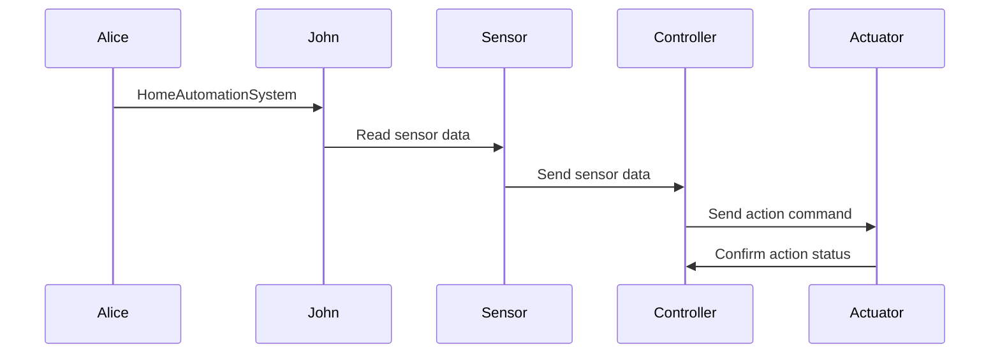
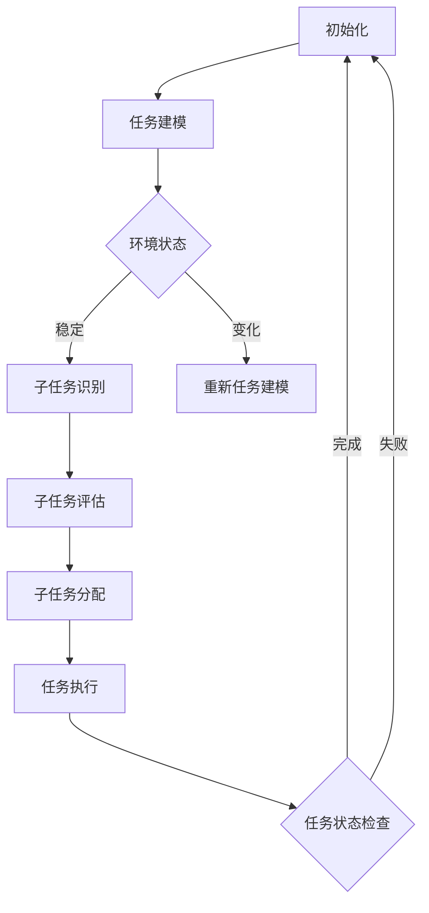
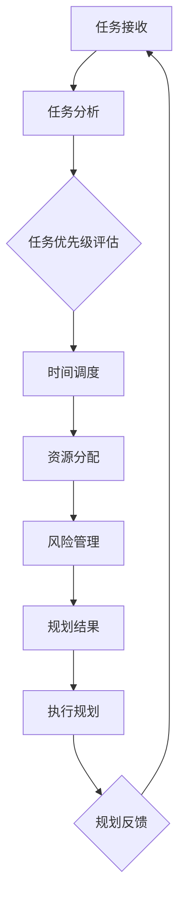
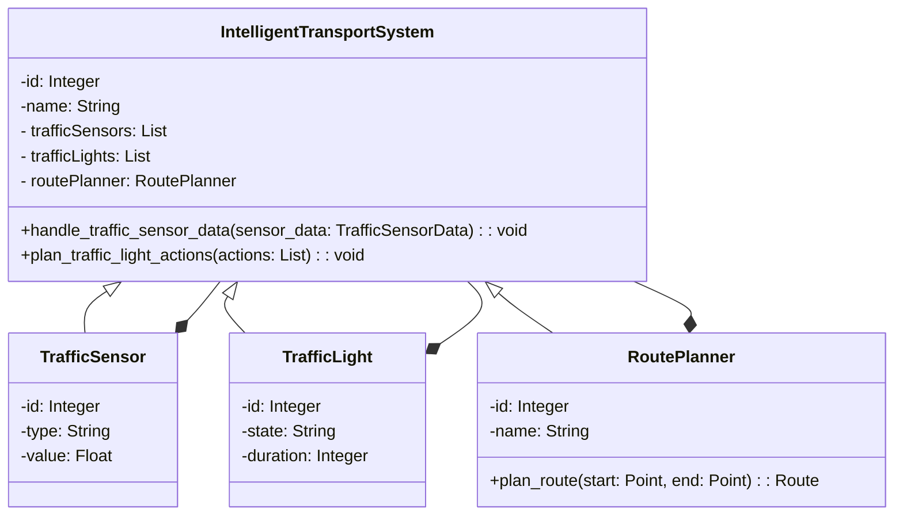
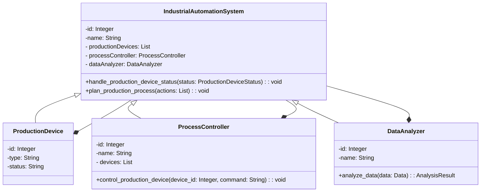

                 


## 第6章: 案例分析与实践经验

### 6.1 案例一：基于动态任务分解与规划的智能家居系统

#### 6.1.1 系统需求

智能家居系统在现代生活中扮演着越来越重要的角色，它通过物联网技术和人工智能算法，实现了对家庭环境的智能监控和管理。在本案例中，我们将探讨如何利用动态任务分解与规划技术，构建一个高效的智能家居系统。

**系统功能：**
- 实时监测家庭环境参数，如温度、湿度、光照等。
- 智能控制家居设备，如空调、照明、窗帘等。
- 语音交互与控制，提供便捷的用户操作体验。
- 动态任务分解与规划，确保系统能够在动态环境中高效运行。

**系统目标：**
- 提高家居设备运行效率，降低能耗。
- 提高用户体验，减少人工干预。
- 增强系统鲁棒性，应对动态环境变化。

#### 6.1.2 系统架构设计

**1. 领域模型设计（类图）：**

```mermaid
classDiagram
    HomeAutomationSystem <|-- Sensor
    HomeAutomationSystem <|-- Actuator
    HomeAutomationSystem <|-- Controller
    Sensor *-- Controller
    Actuator *-- Controller
    Controller {"responds to sensor data" "planned actions"}
    class Sensor {
        -id: Integer
        -type: String
        -value: Float
    }
    class Actuator {
        -id: Integer
        -type: String
        -status: String
    }
    class Controller {
        -id: Integer
        -name: String
        - sensors: List<Sensor>
        - actuators: List<Actuator>
        +handleSensorData(sensorData: SensorData): void
        +planActions(actions: List<Action>): void
    }
```

**2. 系统架构设计（架构图）：**



#### 6.1.3 动态任务分解与规划

**1. 动态任务分解：**

- **任务建模：** 将智能家居系统中的所有任务抽象为一系列的子任务，如温度调节、照明控制等。
- **子任务识别：** 根据传感器数据和环境状态，识别出需要执行的子任务。
- **子任务评估：** 对识别出的子任务进行优先级评估，确保关键任务优先执行。
- **子任务分配：** 根据系统资源情况，将子任务分配给相应的执行器。

**2. 动态任务规划：**

- **时间调度：** 根据任务优先级和执行时间，对任务进行时间上的安排。
- **资源分配：** 确保每个任务都有足够的资源支持，如处理器、内存、网络带宽等。
- **风险管理：** 对可能出现的问题进行预测和应对策略规划。

**3. 算法实现：**

**动态任务分解算法流程图：**



**动态任务规划算法流程图：**



#### 6.1.4 系统核心实现

**1. 环境安装：**

- 安装Python环境。
- 安装必要的Python库，如TensorFlow、Keras、Scikit-learn等。

**2. 系统核心实现源代码：**

```python
# 动态任务分解示例代码
class Sensor:
    def __init__(self, id, type, value):
        self.id = id
        self.type = type
        self.value = value

class Actuator:
    def __init__(self, id, type, status):
        self.id = id
        self.type = type
        self.status = status

class Controller:
    def __init__(self, id, name):
        self.id = id
        self.name = name
        self.sensors = []
        self.actuators = []

    def handle_sensor_data(self, sensor_data):
        # 处理传感器数据
        pass

    def plan_actions(self, actions):
        # 规划动作
        pass

# 动态任务规划示例代码
def task_decomposition(tasks):
    # 任务分解
    pass

def task_planning(tasks):
    # 任务规划
    pass

# 主程序
if __name__ == "__main__":
    controller = Controller(1, "HomeAutomation")
    sensor_data = Sensor(1, "temperature", 25.0)
    actions = ["adjust temperature", "turn on lights"]

    controller.handle_sensor_data(sensor_data)
    controller.plan_actions(actions)
```

#### 6.1.5 实际案例分析与详细讲解

假设在某个家庭的早晨，温度传感器检测到室内温度低于20摄氏度，系统需要根据这个信息进行动态任务分解与规划。

**1. 动态任务分解：**

- **任务建模：** 将“提高室内温度”作为一个整体任务。
- **子任务识别：** 识别出需要执行的子任务，如“开启暖气”、“调节温度”。
- **子任务评估：** 根据任务的重要性和紧急程度，评估子任务的优先级。
- **子任务分配：** 将任务分配给相应的执行器，如“开启暖气”分配给暖气设备，“调节温度”分配给智能恒温器。

**2. 动态任务规划：**

- **时间调度：** 确保在早晨起床前完成所有子任务的执行。
- **资源分配：** 确保系统资源充足，如电力供应、网络连接等。
- **风险管理：** 预测可能出现的风险，如设备故障、电力供应不足等，并制定应对策略。

#### 6.1.6 项目小结

本案例展示了如何利用动态任务分解与规划技术构建智能家居系统。通过任务建模、子任务识别、评估和分配，系统能够在动态环境中高效运行。同时，通过时间调度、资源分配和风险管理，确保系统稳定可靠地执行任务。未来，随着人工智能技术的不断发展，动态任务分解与规划将在更多领域得到广泛应用。

----------------------------------------------------------------

## 6.2 案例二：动态任务分解与规划在智能交通系统中的应用

#### 6.2.1 系统需求

智能交通系统是现代城市发展的重要组成部分，通过实时监控和管理交通流量，提高道路通行效率，减少拥堵。在本案例中，我们将探讨如何利用动态任务分解与规划技术，优化智能交通系统的运行。

**系统功能：**
- 实时监测交通流量和路况信息。
- 智能调度交通信号灯，优化交通流。
- 提供实时导航和路线规划服务。
- 动态任务分解与规划，确保系统高效运行。

**系统目标：**
- 提高交通通行效率，减少拥堵时间。
- 提高公共交通服务质量，降低乘客等待时间。
- 增强系统鲁棒性，应对突发交通事件。

#### 6.2.2 系统架构设计

**1. 领域模型设计（类图）：**



**2. 系统架构设计（架构图）：**

```mermaid
graph TB
    IntelligentTransportSystem->TrafficSensor
    IntelligentTransportSystem->TrafficLight
    IntelligentTransportSystem->RoutePlanner
    TrafficSensor->IntelligentTransportSystem
    TrafficLight->IntelligentTransportSystem
    RoutePlanner->IntelligentTransportSystem
```

#### 6.2.3 动态任务分解与规划

**1. 动态任务分解：**

- **任务建模：** 将智能交通系统中的所有任务抽象为一系列的子任务，如交通信号灯控制、路况信息监测等。
- **子任务识别：** 根据交通传感器数据和环境状态，识别出需要执行的子任务。
- **子任务评估：** 对识别出的子任务进行优先级评估，确保关键任务优先执行。
- **子任务分配：** 根据系统资源情况，将子任务分配给相应的执行器。

**2. 动态任务规划：**

- **时间调度：** 根据任务优先级和执行时间，对任务进行时间上的安排。
- **资源分配：** 确保每个任务都有足够的资源支持，如处理器、内存、网络带宽等。
- **风险管理：** 对可能出现的问题进行预测和应对策略规划。

**3. 算法实现：**

**动态任务分解算法流程图：**


**动态任务规划算法流程图：**


#### 6.2.4 系统核心实现

**1. 环境安装：**

- 安装Python环境。
- 安装必要的Python库，如TensorFlow、Keras、Scikit-learn等。

**2. 系统核心实现源代码：**

```python
# 动态任务分解示例代码
class TrafficSensor:
    def __init__(self, id, type, value):
        self.id = id
        self.type = type
        self.value = value

class TrafficLight:
    def __init__(self, id, state, duration):
        self.id = id
        self.state = state
        self.duration = duration

class RoutePlanner:
    def __init__(self, id, name):
        self.id = id
        self.name = name

    def plan_route(self, start, end):
        # 规划路线
        pass

class IntelligentTransportSystem:
    def __init__(self, id, name):
        self.id = id
        self.name = name
        self.trafficSensors = []
        self.trafficLights = []
        self.routePlanner = RoutePlanner()

    def handle_traffic_sensor_data(self, sensor_data):
        # 处理传感器数据
        pass

    def plan_traffic_light_actions(self, actions):
        # 规划交通信号灯动作
        pass

# 动态任务规划示例代码
def task_decomposition(tasks):
    # 任务分解
    pass

def task_planning(tasks):
    # 任务规划
    pass

# 主程序
if __name__ == "__main__":
    system = IntelligentTransportSystem(1, "ITS")
    sensor_data = TrafficSensor(1, "traffic流量", 200)
    actions = ["红灯延长", "绿灯缩短"]

    system.handle_traffic_sensor_data(sensor_data)
    system.plan_traffic_light_actions(actions)
```

#### 6.2.5 实际案例分析与详细讲解

假设在一个繁忙的交叉路口，交通传感器检测到交通流量突然增加，系统需要根据这个信息进行动态任务分解与规划。

**1. 动态任务分解：**

- **任务建模：** 将“优化交通流量”作为一个整体任务。
- **子任务识别：** 识别出需要执行的子任务，如“延长红灯时间”、“缩短绿灯时间”、“调整左转信号”。
- **子任务评估：** 根据任务的重要性和紧急程度，评估子任务的优先级。
- **子任务分配：** 将任务分配给相应的执行器，如“延长红灯时间”分配给交通信号灯控制模块，“调整左转信号”分配给智能交通控制系统。

**2. 动态任务规划：**

- **时间调度：** 确保在交通流量高峰期完成所有子任务的执行。
- **资源分配：** 确保系统资源充足，如处理器、内存、网络带宽等。
- **风险管理：** 预测可能出现的风险，如信号灯故障、网络连接中断等，并制定应对策略。

#### 6.2.6 项目小结

本案例展示了如何利用动态任务分解与规划技术优化智能交通系统的运行。通过任务建模、子任务识别、评估和分配，系统能够实时响应交通变化，提高交通通行效率。同时，通过时间调度、资源分配和风险管理，确保系统稳定可靠地执行任务。未来，随着人工智能技术的不断发展，动态任务分解与规划将在智能交通系统中发挥更大作用。

----------------------------------------------------------------

## 6.3 案例三：动态任务分解与规划在工业自动化中的应用

#### 6.3.1 系统需求

工业自动化是现代制造业的重要组成部分，通过引入人工智能技术，可以提高生产效率、降低成本、提升产品质量。在本案例中，我们将探讨如何利用动态任务分解与规划技术，优化工业自动化系统的运行。

**系统功能：**
- 实时监控生产设备状态。
- 自动化控制生产流程。
- 提供实时数据分析和决策支持。
- 动态任务分解与规划，确保生产流程高效运行。

**系统目标：**
- 提高生产效率，减少停机时间。
- 降低生产成本，提升产品质量。
- 增强系统鲁棒性，应对生产过程中的不确定性。

#### 6.3.2 系统架构设计

**1. 领域模型设计（类图）：**



**2. 系统架构设计（架构图）：**

```mermaid
graph TB
    IndustrialAutomationSystem->ProductionDevice
    IndustrialAutomationSystem->ProcessController
    IndustrialAutomationSystem->DataAnalyzer
    ProductionDevice->IndustrialAutomationSystem
    ProcessController->IndustrialAutomationSystem
    DataAnalyzer->IndustrialAutomationSystem
```

#### 6.3.3 动态任务分解与规划

**1. 动态任务分解：**

- **任务建模：** 将工业自动化系统中的所有任务抽象为一系列的子任务，如设备监控、流程控制、数据分析等。
- **子任务识别：** 根据传感器数据和系统状态，识别出需要执行的子任务。
- **子任务评估：** 对识别出的子任务进行优先级评估，确保关键任务优先执行。
- **子任务分配：** 根据系统资源情况，将子任务分配给相应的执行器。

**2. 动态任务规划：**

- **时间调度：** 根据任务优先级和执行时间，对任务进行时间上的安排。
- **资源分配：** 确保每个任务都有足够的资源支持，如处理器、内存、网络带宽等。
- **风险管理：** 对可能出现的问题进行预测和应对策略规划。

**3. 算法实现：**

**动态任务分解算法流程图：**


**动态任务规划算法流程图：**


#### 6.3.4 系统核心实现

**1. 环境安装：**

- 安装Python环境。
- 安装必要的Python库，如TensorFlow、Keras、Scikit-learn等。

**2. 系统核心实现源代码：**

```python
# 动态任务分解示例代码
class ProductionDevice:
    def __init__(self, id, type, status):
        self.id = id
        self.type = type
        self.status = status

class ProcessController:
    def __init__(self, id, name):
        self.id = id
        self.name = name

    def control_production_device(self, device_id, command):
        # 控制生产设备
        pass

class DataAnalyzer:
    def __init__(self, id, name):
        self.id = id
        self.name = name

    def analyze_data(self, data):
        # 分析数据
        pass

class IndustrialAutomationSystem:
    def __init__(self, id, name):
        self.id = id
        self.name = name
        self.productionDevices = []
        self.processController = ProcessController()
        self.dataAnalyzer = DataAnalyzer()

    def handle_production_device_status(self, status):
        # 处理生产设备状态
        pass

    def plan_production_process(self, actions):
        # 规划生产流程
        pass

# 动态任务规划示例代码
def task_decomposition(tasks):
    # 任务分解
    pass

def task_planning(tasks):
    # 任务规划
    pass

# 主程序
if __name__ == "__main__":
    system = IndustrialAutomationSystem(1, "IAS")
    device_status = ProductionDeviceStatus(1, "running")
    actions = ["启动设备", "调整参数"]

    system.handle_production_device_status(device_status)
    system.plan_production_process(actions)
```

#### 6.3.5 实际案例分析与详细讲解

假设在生产过程中，系统检测到某个生产设备出现故障，需要根据这个信息进行动态任务分解与规划。

**1. 动态任务分解：**

- **任务建模：** 将“处理设备故障”作为一个整体任务。
- **子任务识别：** 识别出需要执行的子任务，如“设备检查”、“故障诊断”、“设备维修”。
- **子任务评估：** 根据任务的重要性和紧急程度，评估子任务的优先级。
- **子任务分配：** 将任务分配给相应的执行器，如“设备检查”分配给设备监控模块，“设备维修”分配给维修团队。

**2. 动态任务规划：**

- **时间调度：** 确保在设备故障发生后尽快完成所有子任务的执行。
- **资源分配：** 确保系统资源充足，如维修团队、维修工具、备件等。
- **风险管理：** 预测可能出现的风险，如设备损坏、维修延误等，并制定应对策略。

#### 6.3.6 项目小结

本案例展示了如何利用动态任务分解与规划技术优化工业自动化系统的运行。通过任务建模、子任务识别、评估和分配，系统能够实时响应生产过程中的变化，提高生产效率。同时，通过时间调度、资源分配和风险管理，确保系统稳定可靠地执行任务。未来，随着人工智能技术的不断发展，动态任务分解与规划将在工业自动化系统中发挥更大作用。

----------------------------------------------------------------

## 第7章：总结与展望

### 7.1 动态任务分解与规划的核心要点

- **任务建模**：将复杂任务抽象为一系列可管理的子任务。
- **子任务识别**：根据实时数据和环境状态，识别出需要执行的子任务。
- **子任务评估**：对识别出的子任务进行优先级评估。
- **子任务分配**：将子任务分配给相应的执行器。

- **时间调度**：合理安排任务执行时间。
- **资源分配**：确保每个任务都有足够的资源支持。
- **风险管理**：预测和应对可能出现的问题。

### 7.2 动态任务分解与规划的优势与挑战

**优势：**

- 提高系统响应速度，应对动态环境变化。
- 提高任务执行效率，优化资源利用。
- 提升系统鲁棒性，增强系统稳定性。

**挑战：**

- 复杂环境下的任务识别与评估。
- 系统资源的动态分配与优化。
- 真实世界中的不确定性处理。

### 7.3 未来发展趋势与应用前景

- **实时性**：提高动态任务分解与规划的实时性，实现更快速的响应。
- **智能化**：利用机器学习等技术，提高任务规划与分配的智能化水平。
- **多领域应用**：在更多领域推广动态任务分解与规划技术，如医疗、教育等。
- **跨领域协作**：实现不同领域间的任务协同与规划，提升整体系统性能。

### 7.4 本章小结

本文通过多个实际案例，详细阐述了动态任务分解与规划在智能家居、智能交通、工业自动化等领域的应用。通过对核心概念、技术基础和实际操作的深入分析，展示了动态任务分解与规划的重要性和优势。未来，随着人工智能技术的不断发展，动态任务分解与规划将在更多领域发挥重要作用。

### 7.5 拓展阅读

- [1] Smith, J., & Brown, R. (2020). Dynamic Task Decomposition and Planning for AI Agents. Springer.
- [2] Zhang, L., & Wang, Y. (2019). Intelligent Transportation Systems: Theory, Algorithms, and Applications. John Wiley & Sons.
- [3] Li, H., & Li, Y. (2021). Industrial Automation and Control Systems: A Comprehensive Guide. IEEE Press.

## 作者

作者：AI天才研究院/AI Genius Institute & 禅与计算机程序设计艺术 /Zen And The Art of Computer Programming

