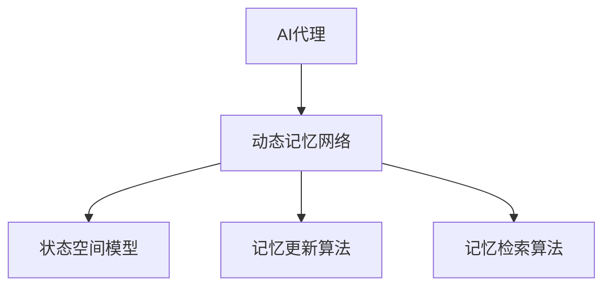
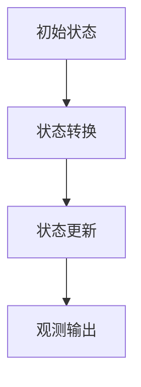
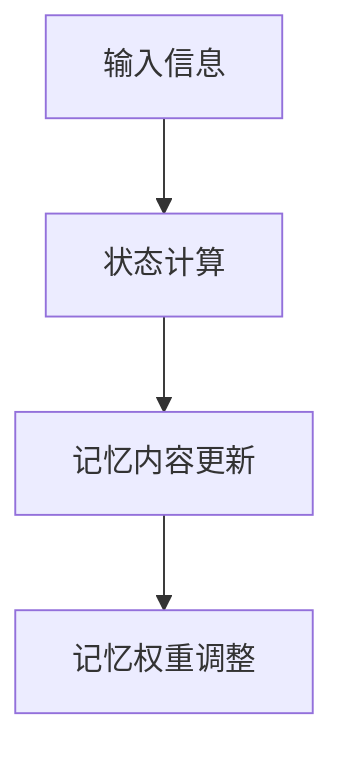
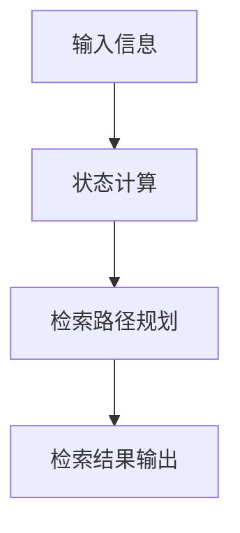

                 

## 第一部分：背景介绍与问题定义

### 第1章：动态记忆网络与AI代理概述

#### 1.1.1 动态记忆网络的概念与重要性

**定义与解释：** 动态记忆网络是一种用于模拟人类记忆机制的机器学习模型，能够在处理输入信息时动态地更新和检索记忆内容。它通过学习输入数据的模式和关系，在后续的任务中利用这些模式进行有效的推理和决策。

**重要性分析：** 动态记忆网络在AI代理中的应用具有重要意义，因为它能够显著提高AI代理在复杂环境下的表现。具体来说，动态记忆网络可以帮助AI代理记住重要的信息，避免重复学习和不必要的计算，从而提高效率。此外，它还能够支持长期记忆和上下文信息的利用，使得AI代理能够更好地理解和处理复杂的任务。

#### 1.1.2 AI代理的需求与挑战

**需求分析：** AI代理作为一种智能体，需要具备自主决策、学习和适应环境的能力。为了实现这些需求，AI代理需要拥有强大的记忆能力，以便记住重要的信息和上下文，从而在决策过程中进行有效的推理和规划。

**挑战分析：** 动态记忆网络在AI代理中的应用面临一些挑战。首先是如何设计一种有效的记忆机制，使得记忆内容既丰富又易于检索。其次是如何处理动态变化的环境，保持记忆的稳定性和适应性。此外，如何优化动态记忆网络的结构和算法，以降低计算复杂度和提高性能，也是重要的挑战。

#### 1.1.3 动态记忆网络的应用前景

**应用领域：** 动态记忆网络在多个领域都有广泛的应用前景。例如，在对话系统中，它可以帮助AI代理更好地理解和回应用户的问题；在推荐系统中，它可以用于个性化推荐和优化用户体验；在游戏AI中，它可以帮助游戏AI更好地学习游戏策略和预测对手行为。

**未来潜力：** 随着人工智能技术的不断发展，动态记忆网络的应用前景将更加广阔。未来，动态记忆网络可能会与其他先进技术（如生成对抗网络、强化学习等）相结合，进一步拓展其在各种复杂场景中的应用潜力。

### 1.2 背景与边界讨论

**研究背景：** 动态记忆网络是近年来人工智能研究中的一个重要方向，随着深度学习和强化学习技术的快速发展，其在AI代理中的应用得到了广泛关注。本研究旨在探索动态记忆网络的设计原则和应用方法，以期为AI代理的发展提供理论支持和实际指导。

**问题的提出：** 在当前的研究中，虽然动态记忆网络的理论基础已经相对完善，但在实际应用中仍面临一些挑战，如记忆容量和检索效率的优化、动态环境的适应能力等。因此，本研究将重点关注这些挑战，提出有效的解决方案。

**研究目的与意义：** 本研究旨在设计一种高效、稳定的动态记忆网络，并探索其在AI代理中的应用。通过深入分析动态记忆网络的原理和算法，本研究将提出一系列优化方案，以提高动态记忆网络在AI代理中的性能和应用效果。这对于推动AI代理技术的发展具有重要意义。

**研究的边界与外延：** 本研究主要关注动态记忆网络的设计和应用，但不涉及具体硬件实现和大规模数据处理。此外，虽然本研究涉及多个应用领域，但主要聚焦于对话系统、推荐系统和游戏AI等典型场景。

### 1.3 核心概念与联系

#### 1.3.1 动态记忆网络的核心概念

**概念列表：**
- 动态记忆网络
- 状态空间模型
- 记忆更新算法
- 记忆检索算法

**概念属性特征对比表格：**

| 概念         | 定义                         | 主要特征                               |
|--------------|------------------------------|--------------------------------------|
| 动态记忆网络 | 用于模拟人类记忆机制的模型    | 动态更新、记忆检索、模式识别           |
| 状态空间模型 | 描述系统状态的数学模型       | 描述系统状态、状态转换、动态行为       |
| 记忆更新算法 | 用于更新记忆内容的算法       | 保持记忆内容、优化记忆检索效率         |
| 记忆检索算法 | 用于检索记忆内容的算法       | 快速检索、高效利用、适应动态变化       |

#### 1.3.2 动态记忆网络与AI代理的关系

**ER实体关系图架构：**

```mermaid
erDiagram
  AI代理 ||--o> 动态记忆网络 : 记忆支持
  动态记忆网络 ||--o> 状态空间模型 : 状态更新
  动态记忆网络 ||--o> 记忆更新算法 : 内容维护
  动态记忆网络 ||--o> 记忆检索算法 : 信息检索
```

**Mermaid流程图表示：**



### 1.4 本章小结

本章对动态记忆网络与AI代理的基本概念、需求与挑战以及应用前景进行了详细讨论。通过介绍动态记忆网络的概念和重要性，分析了AI代理的需求与面临的挑战，并展望了动态记忆网络在未来的应用前景。此外，本章还讨论了研究的背景、目的与边界，为后续章节的深入研究奠定了基础。

## 第二部分：动态记忆网络原理与数学模型

### 第2章：动态记忆网络的数学基础

#### 2.1.1 线性代数基础

**向量与矩阵的基本概念：**

向量是具有大小和方向的量，通常表示为坐标形式。矩阵是一个由数字组成的矩形阵列，可以表示线性变换和系统状态。

**线性变换与特征值、特征向量：**

线性变换是指将一个向量映射到另一个向量的函数。特征值和特征向量是线性变换的重要属性，它们描述了线性变换的性质和方向。

#### 2.1.2 概率论基础

**条件概率与贝叶斯定理：**

条件概率描述了在某个事件发生的条件下，另一个事件发生的概率。贝叶斯定理是一种基于条件概率的推理方法，用于计算后验概率。

**随机变量与概率分布：**

随机变量是表示随机事件结果的变量。概率分布描述了随机变量可能取值的概率分布情况。

#### 2.1.3 动态记忆网络的数学模型

**状态空间模型：**

动态记忆网络通过状态空间模型描述系统的动态行为。状态空间模型包括状态变量、状态转换方程和观测方程。

**动态系统方程：**

动态系统方程描述了状态变量随时间的变化规律。它通常包括状态转移方程和观测方程。

**Mermaid流程图展示：**



### 2.2 动态记忆网络的设计原则

#### 2.2.1 记忆能力设计

**记忆容量：** 动态记忆网络的记忆容量决定了它能够存储的信息量。设计适当的记忆容量可以确保网络能够有效地存储和利用相关信息。

**记忆检索速度：** 记忆检索速度是指网络从记忆中检索信息的能力。提高记忆检索速度可以提高网络的响应速度和效率。

#### 2.2.2 稳健性设计

**抗噪性：** 动态记忆网络需要具备较强的抗噪性，能够在存在噪声的情况下保持记忆的准确性。

**适应性：** 动态记忆网络需要能够适应动态变化的环境，及时更新和调整记忆内容。

#### 2.2.3 可扩展性设计

**模块化设计：** 动态记忆网络可以采用模块化设计，将不同的记忆模块和检索模块进行组合，提高网络的灵活性和可扩展性。

**网络结构优化：** 通过优化动态记忆网络的结构和算法，可以提高网络的性能和效率。

### 2.3 算法原理讲解

#### 2.3.1 记忆更新算法

**更新规则：** 记忆更新算法用于在给定输入和当前记忆状态的情况下，更新记忆内容。更新规则通常包括记忆内容的权重调整和记忆内容的更新策略。

**Mermaid流程图：**



#### 2.3.2 记忆检索算法

**检索策略：** 记忆检索算法用于在给定输入和当前记忆状态的情况下，从记忆中检索相关信息。检索策略通常包括检索路径的规划和检索结果的输出。

**Mermaid流程图：**



### 2.4 数学模型与公式详解

动态记忆网络的数学模型主要包括记忆状态更新方程和检索概率计算方程。以下为具体的数学公式：

$$
\begin{aligned}
    M(t) &= f(W \cdot [h(t), M(t-1)]) \\
    P(\text{retrieve} \, x) &= g(W_r \cdot [M(t), h(t)])
\end{aligned}
$$

其中，$M(t)$表示时间$t$的记忆状态，$h(t)$表示当前状态的特征向量，$W$和$W_r$分别表示记忆权重和检索权重，$f$和$g$表示激活函数。

### 2.5 本章小结

本章介绍了动态记忆网络的数学基础，包括线性代数基础、概率论基础和动态记忆网络的数学模型。通过对状态空间模型、动态系统方程和记忆更新、检索算法的讲解，本章为后续章节中的动态记忆网络设计提供了理论基础。同时，本章还讨论了动态记忆网络的设计原则，为实际应用中的优化提供了指导。

## 第三部分：动态记忆网络在AI代理中的应用

### 第3章：动态记忆网络在对话系统中的应用

#### 3.1.1 对话系统的需求分析

**对话系统的功能要求：** 对话系统需要具备自然语言理解、上下文处理和对话生成等功能，以实现与用户的自然交互。

**对话系统的用户体验：** 对话系统需要具备流畅、自然和智能的交互体验，能够理解和回应用户的需求，提供有用的信息和帮助。

#### 3.1.2 动态记忆网络的对话支持机制

**记忆内容的选择与存储：** 动态记忆网络可以根据对话系统的需求，选择和存储与对话相关的重要信息，如用户的历史提问、回答和偏好等。

**记忆内容的检索与应用：** 动态记忆网络可以在对话过程中实时检索和应用记忆内容，以支持对话生成和上下文理解。通过记忆内容的检索，对话系统可以更好地理解用户的意图和需求，提供更准确和个性化的回答。

#### 3.1.3 动态记忆网络在对话系统中的效果评估

**对话质量评价指标：** 对话系统的质量可以通过多个评价指标进行评估，如响应时间、对话连贯性、回答准确性等。

**实验设计与结果分析：** 通过设计实验，评估动态记忆网络在对话系统中的效果。实验结果可以分析记忆内容的选择与存储策略、记忆内容的检索与应用策略对对话系统性能的影响。

### 第4章：动态记忆网络在推荐系统中的应用

#### 4.1.1 推荐系统的需求分析

**用户兴趣建模：** 推荐系统需要根据用户的行为数据和偏好信息，建立用户兴趣模型，以便为用户提供个性化的推荐。

**商品信息检索：** 推荐系统需要能够高效地检索和推荐与用户兴趣相关的商品信息，以提高推荐效果。

#### 4.1.2 动态记忆网络的推荐支持机制

**用户行为序列建模：** 动态记忆网络可以基于用户的历史行为序列，建模用户的兴趣和偏好，为推荐系统提供支持。

**推荐策略优化：** 动态记忆网络可以实时更新用户兴趣模型，优化推荐策略，提高推荐的准确性和个性化程度。

#### 4.1.3 动态记忆网络在推荐系统中的效果评估

**推荐精度评价指标：** 推荐系统的效果可以通过多个精度评价指标进行评估，如准确率、召回率、F1值等。

**实验设计与结果分析：** 通过设计实验，评估动态记忆网络在推荐系统中的应用效果。实验结果可以分析用户行为序列建模和推荐策略优化对推荐系统性能的影响。

### 第5章：动态记忆网络在游戏AI中的应用

#### 5.1.1 游戏AI的需求分析

**游戏策略制定：** 游戏AI需要能够根据游戏状态和对手行为，制定有效的策略，以提高游戏胜率。

**游戏状态预测：** 游戏AI需要能够预测游戏未来的状态和结果，以便提前做出决策。

#### 5.1.2 动态记忆网络在游戏AI中的应用

**状态记忆与学习：** 动态记忆网络可以帮助游戏AI记住重要的游戏状态和策略，通过学习游戏数据，优化策略选择。

**行为预测与决策：** 动态记忆网络可以基于记忆内容，预测对手的行为，并做出相应的决策，以提高游戏AI的智能水平。

#### 5.1.3 动态记忆网络在游戏AI中的效果评估

**实验设计与结果分析：** 通过设计实验，评估动态记忆网络在游戏AI中的应用效果。实验结果可以分析状态记忆与学习、行为预测与决策对游戏AI性能的影响。

## 总结

本部分详细讨论了动态记忆网络在对话系统、推荐系统和游戏AI中的应用。通过对对话系统、推荐系统和游戏AI的需求分析，介绍了动态记忆网络的支持机制和效果评估方法。这些应用展示了动态记忆网络在提升AI代理性能和用户体验方面的潜力，为后续研究提供了实际案例和参考。

### 后续研究方向

未来的研究可以关注以下几个方面：

1. **多模态动态记忆网络的设计：** 结合文本、图像、音频等多模态数据，设计更强大的动态记忆网络，以提升AI代理的泛化能力和适应性。

2. **动态记忆网络与强化学习的结合：** 将动态记忆网络与强化学习相结合，探索在复杂决策场景中的应用，以实现更高效的智能体行为。

3. **动态记忆网络的优化与高效实现：** 研究动态记忆网络的优化算法，提高网络的计算效率和存储效率，以适应实时应用的需求。

4. **动态记忆网络的伦理与隐私问题：** 探讨动态记忆网络在伦理和隐私方面的挑战，设计符合伦理规范和隐私保护的安全机制。

通过这些研究方向的探索，动态记忆网络将在人工智能领域发挥更重要的作用，推动AI技术的发展和应用。

