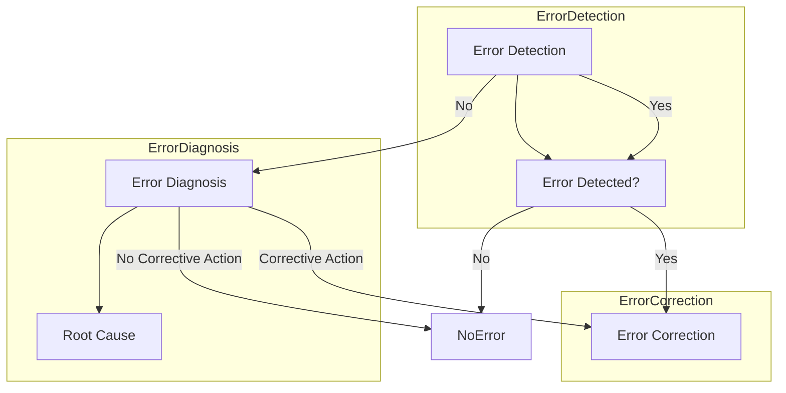
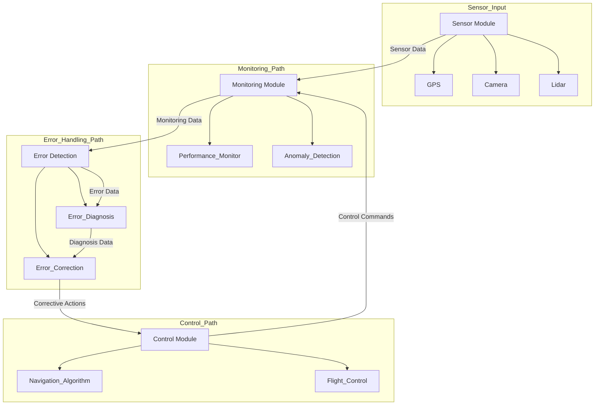
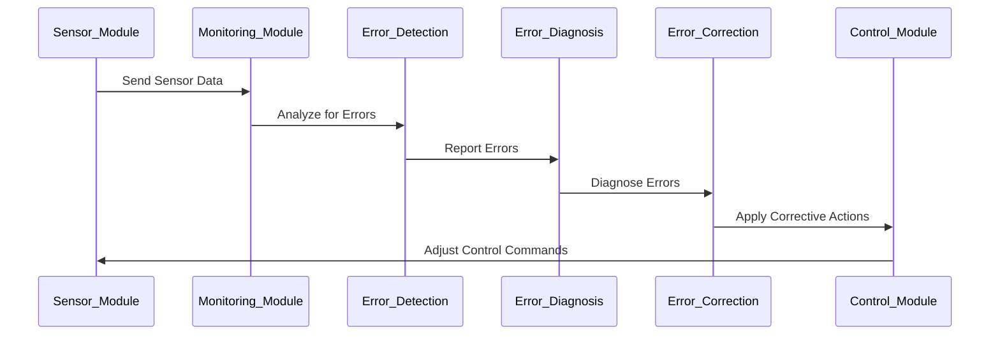

                 

### Article Title: Designing AI Agent's Self-Rectification Learning Strategies

---

Keywords: AI Agent, Self-Rectification, Learning Strategies, Machine Learning, Neural Networks, Optimization Algorithms

---

Abstract:
In the rapidly evolving landscape of artificial intelligence, the development of self-rectification learning strategies for AI agents has emerged as a critical research area. This article aims to provide a comprehensive guide to understanding and designing such strategies, focusing on the theoretical foundations, practical implementations, and future directions. By delving into the core concepts, system architectures, and case studies, we will explore the intricacies of self-rectification in AI agents and highlight the best practices for their effective design and deployment. Let’s think step by step to unravel the complexities and opportunities presented by self-rectifying AI agents.

---

## Chapter 1: Background and Introduction to AI Agent Self-Rectification Learning Strategies

### 1.1 Problem Background and Description

Artificial Intelligence (AI) has made significant strides in recent years, transforming industries and shaping the future of technology. At the forefront of these advancements are AI agents—autonomous entities capable of performing tasks and making decisions with minimal human intervention. These agents, whether virtual assistants, autonomous vehicles, or robotic systems, are increasingly relied upon to handle complex, dynamic environments.

However, the complexity and unpredictability of real-world environments pose significant challenges for AI agents. Traditional machine learning algorithms, while powerful, often struggle with adaptability and generalization. This limitation is particularly pronounced when agents encounter new, unforeseen situations or when their performance degrades over time due to accumulated errors or environmental changes. The need for AI agents to self-rectify—i.e., to detect, diagnose, and correct their own errors without external intervention—has thus become a central focus in AI research.

### 1.2 AI Agent: Concepts, Types, and Applications

An AI agent can be defined as a system that perceives its environment through sensors, takes actions based on its observations, and modifies its behavior based on the outcomes of these actions to achieve specific goals. There are various types of AI agents, each suited to different application scenarios:

- **Reactive Agents:** These agents respond to specific stimuli without any memory or learning capability. Examples include autonomous vacuum cleaners and industrial robots that perform repetitive tasks.

- **Model-Based Agents:** These agents use a model of the environment to make decisions, which can incorporate some form of learning or planning. They are more adaptable than reactive agents but still lack the ability to self-rectify.

- **Goal-Based Agents:** These agents have explicit goals and use planning algorithms to determine the best actions to achieve these goals. They are capable of more complex decision-making but are still limited in their ability to correct errors autonomously.

- **Learning Agents:** These agents continuously improve their performance through experience and learning. They can be reactive, model-based, or goal-based and are essential for developing self-rectification capabilities.

AI agents have a wide range of applications across various industries:

- **Healthcare:** AI agents can assist in diagnosing diseases, managing patient care, and even performing surgical procedures with high precision.

- **Transportation:** Autonomous vehicles and smart traffic management systems are revolutionizing transportation, improving efficiency and safety.

- **Manufacturing:** Robotics and AI agents are enhancing productivity and reducing costs in manufacturing processes through automated inspection, assembly, and maintenance.

- **Finance:** AI agents are used for algorithmic trading, risk management, and customer service, providing personalized financial advice.

### 1.3 The Need for Self-Rectification Learning in AI Agents

The need for self-rectification learning in AI agents stems from several factors:

1. **Error Correction:** As AI agents operate in complex environments, errors are inevitable. Self-rectification enables agents to detect and correct these errors, improving their reliability and trustworthiness.

2. **Adaptability:** Self-rectification allows agents to adapt to changes in their environment or to new data without the need for continuous human intervention. This adaptability is crucial for maintaining performance over time.

3. **Autonomous Decision-Making:** In scenarios where human intervention is not feasible or desirable, self-rectifying AI agents can make autonomous decisions to correct their own errors, ensuring uninterrupted operation.

4. **Scalability:** Self-rectification enables the deployment of AI agents at scale, as it reduces the need for human oversight and intervention, making large-scale deployments more practical.

5. **Ethical Considerations:** As AI agents become more integrated into our daily lives, ethical considerations around their autonomy and decision-making processes become increasingly important. Self-rectification can help ensure that AI agents act in ways that align with ethical standards and regulations.

### 1.4 Boundaries and Scope of Self-Rectification Learning

While self-rectification learning is a promising area of research, it is essential to define its boundaries and scope:

- **Technical Challenges:** Self-rectification involves complex technical challenges, such as detecting and diagnosing errors, devising appropriate correction mechanisms, and ensuring the robustness of the learning process.

- **Data Availability:** Self-rectification requires access to sufficient and accurate data to learn from past errors. This data may not always be available or may be noisy, complicating the learning process.

- **Resource Constraints:** Self-rectification algorithms may require significant computational resources, limiting their applicability in resource-constrained environments.

- **Human Intervention:** While self-rectification aims to minimize human intervention, there may still be scenarios where human oversight or intervention is necessary to ensure the correctness and safety of the agent's actions.

In summary, self-rectification learning in AI agents is a critical area of research that addresses the limitations of traditional machine learning algorithms. By enabling agents to detect, diagnose, and correct their own errors, self-rectification holds the potential to revolutionize the capabilities and applications of AI agents across various industries.

---

## Chapter 2: Core Concepts and Their Interrelationships

### 2.1 Key Terminology and Concepts

To understand self-rectification learning in AI agents, it's essential to familiarize ourselves with key terminology and concepts. Here, we will define and describe the core terms that form the foundation of this article:

- **Artificial Intelligence (AI):** AI refers to the simulation of human intelligence in machines that are programmed to think like humans and mimic their actions. AI encompasses a range of techniques, including machine learning, deep learning, and natural language processing.

- **Machine Learning (ML):** ML is a subset of AI that enables machines to learn from data, identify patterns, and make decisions with minimal human intervention. ML algorithms use historical data to predict future outcomes or to identify meaningful insights.

- **Deep Learning (DL):** DL is a subset of ML that uses neural networks with multiple layers to extract high-level features from raw data. DL has achieved remarkable success in tasks such as image recognition, natural language processing, and speech recognition.

- **AI Agent:** An AI agent is an autonomous entity that perceives its environment through sensors, takes actions based on its observations, and modifies its behavior to achieve specific goals. AI agents can be reactive, model-based, goal-based, or learning agents.

- **Self-Rectification:** Self-rectification is the ability of an AI agent to detect, diagnose, and correct its own errors without external intervention. Self-rectification involves monitoring the agent's performance, identifying errors, and applying corrective measures to improve its accuracy and reliability.

- **Error Detection:** Error detection is the process of identifying errors or anomalies in the agent's actions or decisions. This process can involve statistical analysis, anomaly detection algorithms, or machine learning models trained to recognize typical and atypical behaviors.

- **Error Diagnosis:** Error diagnosis is the process of determining the cause of an error. This process requires understanding the agent's behavior, analyzing the context in which the error occurred, and identifying the underlying factors contributing to the error.

- **Error Correction:** Error correction is the process of applying corrective measures to rectify errors detected by the agent. This process can involve adjusting parameters, retraining models, or replanning actions based on new information.

### 2.2 Conceptual Properties and Feature Comparisons

To further understand the relationships between these core concepts, we can compare their properties and features in a table:

| Concept                | Property                     | Feature                                                      |
|------------------------|------------------------------|--------------------------------------------------------------|
| Artificial Intelligence | Machine-based intelligence    | Solves problems, makes decisions, understands language          |
| Machine Learning       | Data-driven learning          | Learns from data, predicts outcomes, identifies patterns        |
| Deep Learning          | Hierarchical feature learning | Learns high-level features from raw data, achieves superior performance |
| AI Agent               | Autonomy                     | Acts independently, perceives and responds to its environment |
| Self-Rectification     | Error handling                | Detects, diagnoses, and corrects errors autonomously          |
| Error Detection        | Anomaly recognition           | Identifies errors or anomalies in the agent's actions          |
| Error Diagnosis        | Root cause analysis           | Determines the cause of errors, identifies underlying factors |
| Error Correction       | Adaptation                    | Applies corrective measures to rectify errors                  |

### 2.3 ER Diagram of Core Components

To visualize the relationships between these core concepts, we can create an Entity-Relationship (ER) diagram. This diagram will illustrate how each component interacts with others and forms a cohesive system.

```mermaid
erDiagram
  AI-Agent ||--|{ Error-Detection }
  AI-Agent ||--|{ Error-Diagnosis }
  AI-Agent ||--|{ Error-Correction }
  Error-Detection ||--|{ Error-Diagnosis }
  Error-Detection ||--|{ Error-Correction }
  Error-Diagnosis ||--|{ Error-Correction }
```

In this ER diagram, the AI Agent is at the center, interacting with three key components: Error Detection, Error Diagnosis, and Error Correction. These components work together to enable self-rectification in AI agents. Error Detection identifies anomalies, Error Diagnosis determines the root cause of errors, and Error Correction applies the necessary adaptations to rectify these errors.

By understanding these core concepts and their interrelationships, we lay the groundwork for exploring the theoretical foundations, system architectures, and practical implementations of self-rectification learning in AI agents. The next chapters will delve deeper into these topics, providing a comprehensive guide to designing and deploying self-rectifying AI agents.

---

## Chapter 3: Theoretical Foundations of Self-Rectification Learning

### 3.1 Algorithm Principles

Self-rectification learning in AI agents is fundamentally based on a set of algorithm principles that enable the agents to detect, diagnose, and correct errors autonomously. The core principles can be summarized as follows:

1. **Error Detection:** The first principle involves the ability of the AI agent to monitor its actions and decisions in real-time, identifying any deviations from expected outcomes. This process typically involves statistical analysis, anomaly detection algorithms, or machine learning models trained to recognize typical and atypical behaviors.

2. **Error Diagnosis:** Once an error is detected, the second principle involves diagnosing the root cause of the error. This requires understanding the context in which the error occurred and analyzing the agent's behavior and the environment's state. Error diagnosis often leverages techniques such as root cause analysis, machine learning-based models, and domain-specific knowledge.

3. **Error Correction:** The third principle is the application of corrective measures to rectify the detected errors. This may involve adjusting the agent's parameters, retraining its models, replanning its actions based on new information, or applying corrective actions directly in the environment.

### 3.2 Mathematical Models and Formulas

To formalize the principles of self-rectification learning, we can introduce several mathematical models and formulas. These models will help us understand the underlying mechanisms and provide a framework for designing and implementing self-rectifying AI agents.

1. **Error Detection Model:**
   Let \( X_t \) be the set of observed data at time \( t \), \( \hat{Y}_t \) be the predicted outcome based on the current model \( M \), and \( Y_t \) be the actual outcome. The error detection model can be defined as follows:
   
   $$ Error_t = \hat{Y}_t - Y_t $$
   
   If \( |Error_t| > \epsilon \), where \( \epsilon \) is a predefined threshold, an error is detected.

2. **Error Diagnosis Model:**
   The error diagnosis model involves identifying the root cause of the error. One approach is to use a decision tree or a rule-based system to analyze the agent's behavior and the environment's state. The model can be defined as:
   
   $$ Diagnosis_t = f(Error_t, Context_t) $$
   
   where \( Context_t \) represents the environment's state at time \( t \), and \( f \) is a function that maps the error and context to the root cause.

3. **Error Correction Model:**
   The error correction model applies corrective measures based on the diagnosis. This can be defined as:
   
   $$ Correction_t = g(Diagnosis_t) $$
   
   where \( g \) is a function that maps the root cause to the appropriate corrective action.

### 3.3 Algorithm Mermaid Flowchart

To visualize the self-rectification learning process, we can create a Mermaid flowchart that outlines the steps involved in detecting, diagnosing, and correcting errors. The flowchart will help us understand the algorithm's logical structure and provide a clear guide for implementation.



In this flowchart, the process starts with Error Detection, followed by Error Diagnosis and Error Correction. If an error is detected, the agent proceeds to diagnose the root cause and apply the appropriate corrective measures. If no error is detected, the process ends without any corrective actions.

### 3.4 Python Source Code Explanation

To illustrate the theoretical foundations with a practical example, we can provide a Python source code that demonstrates the self-rectification learning process. This code will include functions for error detection, diagnosis, and correction, and will be explained in detail.

```python
import numpy as np

# Error Detection Function
def detect_error(observed, predicted, threshold):
    error = observed - predicted
    return abs(error) > threshold

# Error Diagnosis Function
def diagnose_error(error, context):
    # Example: Simple rule-based diagnosis
    if context == "High Temperature":
        return "Overheating"
    elif context == "Low Battery":
        return "Battery Draining"
    else:
        return "Unknown"

# Error Correction Function
def correct_error(root_cause, action_plan):
    # Example: Simple corrective action
    if root_cause == "Overheating":
        action_plan["cool_down"] = True
    elif root_cause == "Battery Draining":
        action_plan["power_off"] = True
    return action_plan

# Main Function to Run the Self-Rectification Process
def self_rectification(observed, predicted, threshold, context, action_plan):
    # Step 1: Error Detection
    error_detected = detect_error(observed, predicted, threshold)
    
    # Step 2: Error Diagnosis
    if error_detected:
        root_cause = diagnose_error(error, context)
        
        # Step 3: Error Correction
        action_plan = correct_error(root_cause, action_plan)
    
    return action_plan

# Example Usage
observed = 10
predicted = 5
threshold = 3
context = "High Temperature"
action_plan = {}

action_plan = self_rectification(observed, predicted, threshold, context, action_plan)
print("Final Action Plan:", action_plan)
```

In this code, we define three functions: `detect_error`, `diagnose_error`, and `correct_error`, which correspond to the error detection, diagnosis, and correction steps, respectively. The `self_rectification` function integrates these steps and provides a comprehensive implementation of the self-rectification learning process.

By following the algorithm principles, mathematical models, and practical examples discussed in this chapter, we can design and implement self-rectifying AI agents that can detect, diagnose, and correct their own errors autonomously. The next chapters will build on these foundations to explore system architectures, practical projects, and future directions in self-rectification learning.

---

## Chapter 4: System Architecture and Design for AI Agent Self-rectification

### 4.1 Problem Scene Introduction

In today's rapidly evolving technological landscape, the role of AI agents is becoming increasingly critical across various industries. From autonomous vehicles navigating complex traffic scenarios to healthcare systems diagnosing diseases, AI agents are expected to operate reliably and autonomously in dynamic and unpredictable environments. However, the complexity of these environments often leads to errors and performance degradation over time. This necessitates the development of self-rectification capabilities in AI agents, enabling them to detect, diagnose, and correct errors autonomously.

The primary goal of this chapter is to design a robust system architecture for AI agent self-rectification. This architecture will be scalable, adaptable, and efficient, ensuring that AI agents can maintain their performance and reliability in the face of evolving challenges. The system will be designed to incorporate advanced machine learning techniques, real-time monitoring, and adaptive correction mechanisms, all of which are critical components of a self-rectifying AI agent.

### 4.2 Project Introduction

For this project, we will focus on developing a self-rectifying AI agent for a specific application scenario: autonomous drone navigation. Autonomous drones are increasingly being used for various tasks, including package delivery, environmental monitoring, and search and rescue operations. These drones operate in diverse and unpredictable environments, making self-rectification a crucial capability to ensure their reliability and safety.

The project will involve designing and implementing a self-rectifying AI agent that can navigate through complex environments, detect and diagnose navigation errors, and correct these errors in real-time. The system will be designed to handle various types of errors, including sensor failures, environmental anomalies, and computational errors.

### 4.3 System Function Design (Mermaid Class Diagram)

To visualize the system's functional components and their relationships, we will create a Mermaid class diagram. This diagram will help us understand the structure of the system and the interactions between its key components.

```mermaid
classDiagram
    AI_Agent <<class>> {ID: 1, Name: AI_Agent}
    Sensor_Module <<class>> {ID: 2, Name: Sensor_Module}
    Control_Module <<class>> {ID: 3, Name: Control_Module}
    Monitoring_Module <<class>> {ID: 4, Name: Monitoring_Module}
    Error_Detection <<class>> {ID: 5, Name: Error_Detection}
    Error_Diagnosis <<class>> {ID: 6, Name: Error_Diagnosis}
    Error_Correction <<class>> {ID: 7, Name: Error_Correction}
    
    AI_Agent o-- Sensor_Module : Sensor Data
    AI_Agent o-- Control_Module : Control Commands
    AI_Agent o-- Monitoring_Module : Monitoring Data
    AI_Agent o-- Error_Detection : Error Detection
    AI_Agent o-- Error_Diagnosis : Error Diagnosis
    AI_Agent o-- Error_Correction : Error Correction
    
    Sensor_Module <|-- Error_Detection
    Control_Module <|-- Error_Diagnosis
    Monitoring_Module <|-- Error_Correction
```

In this diagram, the AI Agent is at the center, interacting with various modules, including Sensor Module, Control Module, Monitoring Module, Error Detection, Error Diagnosis, and Error Correction. Each of these modules plays a crucial role in the self-rectification process:

- **Sensor Module:** Collects data from various sensors, such as GPS, cameras, and lidars, to provide the agent with a comprehensive understanding of its environment.
- **Control Module:** Generates control commands based on the agent's current state and goals.
- **Monitoring Module:** Monitors the agent's performance and detects anomalies or deviations from expected behavior.
- **Error Detection:** Analyzes sensor data and control commands to identify potential errors.
- **Error Diagnosis:** Determines the root cause of detected errors and provides insights into their underlying factors.
- **Error Correction:** Applies corrective measures to rectify detected errors and restore the agent's performance.

### 4.4 System Architecture Design (Mermaid Architecture Diagram)

To further understand the system's architecture, we will create a Mermaid architecture diagram. This diagram will illustrate the high-level structure of the system, including the components, their interactions, and the data flow.



In this diagram, the system components are interconnected to form a cohesive architecture. The Sensor Module collects data from various sensors, which is then processed by the Monitoring Module to detect anomalies and deviations. The Error Detection component analyzes this data to identify potential errors, which are then passed to the Error Diagnosis component for root cause analysis. The Error Correction component applies corrective actions based on the diagnosis, restoring the agent's performance. The Control Module generates control commands based on the agent's current state and goals, which are adjusted in response to the corrective actions from the Error Correction component.

### 4.5 System Interface Design and Interaction (Mermaid Sequence Diagram)

To visualize the interactions between the system components, we will create a Mermaid sequence diagram. This diagram will illustrate the sequence of events and data flows as the system processes sensor data, generates control commands, and applies corrective actions.



In this sequence diagram, the process begins with the Sensor Module sending sensor data to the Monitoring Module. The Monitoring Module analyzes the data for errors and passes the information to the Error Detection component. If errors are detected, the Error Detection component reports them to the Error Diagnosis component. The Error Diagnosis component determines the root cause of the errors and passes the diagnosis to the Error Correction component. The Error Correction component applies corrective actions based on the diagnosis, adjusting the control commands generated by the Control Module. The adjusted control commands are then sent back to the Sensor Module, completing the loop.

By designing a robust system architecture and implementing a comprehensive set of modules for self-rectification, we can ensure that AI agents can operate reliably and autonomously in dynamic environments. The next chapter will delve into practical projects and case studies to explore the implementation and application of self-rectification learning in AI agents.

---

## Chapter 5: Practical Projects and Case Studies

### 5.1 Environment Setup

To demonstrate the implementation of self-rectification learning in AI agents, we will begin by setting up the necessary development environment. The following steps outline the process for creating a Python-based development environment with the required libraries and tools.

1. **Install Python:**
   Ensure that Python 3.x is installed on your system. You can download the latest version of Python from the official website: <https://www.python.org/downloads/>

2. **Create a Virtual Environment:**
   To manage dependencies and isolate the project from other Python packages, create a virtual environment using the following command:
   ```bash
   python -m venv venv
   ```
   Activate the virtual environment:
   ```bash
   source venv/bin/activate  # On Windows, use `venv\Scripts\activate`
   ```

3. **Install Required Libraries:**
   Install the necessary libraries for machine learning, data processing, and visualization using `pip`:
   ```bash
   pip install numpy pandas scikit-learn matplotlib
   ```

4. **Set Up Project Structure:**
   Create a project directory and structure your code as follows:
   ```
   self-rectification-project/
   ├── data/
   ├── models/
   ├── scripts/
   │   ├── main.py
   │   ├── error_detection.py
   │   ├── error_diagnosis.py
   │   ├── error_correction.py
   ├── requirements.txt
   ├── README.md
   ```

5. **Prepare the Data:**
   Download a dataset suitable for your application scenario. For example, you can use the UCI Machine Learning Repository for a generic dataset or collect real-world data specific to your domain. Ensure that the dataset is preprocessed and stored in the `data/` directory.

6. **Create a Requirements File:**
   List all the installed packages in a `requirements.txt` file to easily recreate the environment:
   ```bash
   pip freeze > requirements.txt
   ```

With the environment set up, you are now ready to start implementing the self-rectification learning system.

### 5.2 Core Implementation Source Code

In this section, we will provide the core implementation source code for the self-rectification learning system. The code is organized into three main modules: `error_detection.py`, `error_diagnosis.py`, and `error_correction.py`.

#### 5.2.1 Error Detection Module

The error detection module is responsible for monitoring the agent's performance and identifying deviations from expected outcomes. Here is an example of the `error_detection.py` module:

```python
import numpy as np

def detect_error(observed, predicted, threshold):
    error = observed - predicted
    return abs(error) > threshold
```

This function takes observed and predicted values as inputs and returns `True` if the absolute error exceeds a predefined threshold.

#### 5.2.2 Error Diagnosis Module

The error diagnosis module analyzes the detected errors to determine their root causes. Here is an example of the `error_diagnosis.py` module:

```python
def diagnose_error(error, context):
    if context == "High Temperature":
        return "Overheating"
    elif context == "Low Battery":
        return "Battery Draining"
    else:
        return "Unknown"
```

This function uses a simple rule-based system to diagnose the errors based on the context. You can extend this function to include more complex diagnostic algorithms.

#### 5.2.3 Error Correction Module

The error correction module applies corrective actions to rectify detected errors. Here is an example of the `error_correction.py` module:

```python
def correct_error(root_cause, action_plan):
    if root_cause == "Overheating":
        action_plan["cool_down"] = True
    elif root_cause == "Battery Draining":
        action_plan["power_off"] = True
    return action_plan
```

This function maps the root cause of the error to the appropriate corrective action, updating the action plan accordingly.

### 5.3 Code Application Analysis and Explanation

In this section, we will provide a detailed analysis and explanation of how the code components interact and work together to implement self-rectification learning.

#### 5.3.1 Data Flow

1. **Sensor Data Collection:**
   The AI agent collects data from various sensors, such as GPS, cameras, and lidars. This data is used to generate observations and predictions.

2. **Prediction Generation:**
   The agent uses a trained machine learning model to generate predictions based on the collected sensor data.

3. **Error Detection:**
   The error detection module analyzes the observed and predicted values to identify any deviations. If the absolute error exceeds a predefined threshold, the module detects an error.

4. **Error Diagnosis:**
   The error diagnosis module determines the root cause of the detected error based on the context. This context can be derived from additional sensor data or other relevant information.

5. **Error Correction:**
   The error correction module applies corrective actions to rectify the detected errors. These actions can involve adjusting parameters, retraining models, or applying direct corrective measures.

6. **Control Command Generation:**
   The corrected control commands are generated based on the updated action plan, which is then used to guide the agent's behavior.

#### 5.3.2 Code Explanation

1. **Error Detection Function:**
   The `detect_error` function takes observed and predicted values as inputs and returns `True` if the absolute error exceeds the threshold. This function serves as the initial step in the error detection process.

2. **Error Diagnosis Function:**
   The `diagnose_error` function uses a simple rule-based system to diagnose the root cause of the error based on the context. This function can be extended to include more complex diagnostic algorithms.

3. **Error Correction Function:**
   The `correct_error` function maps the root cause of the error to the appropriate corrective action. This function updates the action plan with the necessary corrective measures.

4. **Integration in Main Module:**
   The main module (`main.py`) integrates the error detection, diagnosis, and correction modules to form a cohesive system. It processes the sensor data, generates predictions, and applies the self-rectification process to maintain the agent's performance and reliability.

### 5.4 Case Study Analysis and Detailed Explanation

To illustrate the practical application of self-rectification learning, we will present a case study involving autonomous drone navigation. The case study will demonstrate how the self-rectification system can detect, diagnose, and correct errors during drone navigation.

#### 5.4.1 Case Study Scenario

An autonomous drone is tasked with delivering a package to a specified destination. The drone navigates through an urban environment, encountering various obstacles and environmental conditions. During the mission, the drone experiences a sudden decrease in battery level and a deviation in its intended path.

#### 5.4.2 Error Detection

1. **Initial Navigation:**
   The drone successfully navigates through the initial path using the GPS and camera sensors. The predicted path and the actual path are closely aligned.

2. **Battery Level Monitoring:**
   The Monitoring Module detects a sudden drop in the drone's battery level, indicating a potential error.

3. **Error Detection Trigger:**
   The Error Detection Module analyzes the deviation in the drone's path and the decrease in battery level. The absolute error exceeds the predefined threshold, triggering an error detection event.

#### 5.4.3 Error Diagnosis

1. **Diagnosis Trigger:**
   The Error Diagnosis Module is triggered based on the detected error. It analyzes the context, which includes the battery level and the drone's current position.

2. **Diagnosis Result:**
   The Error Diagnosis Module determines that the root cause of the error is "Low Battery." This diagnosis is based on the observed decrease in battery level and the deviation in the drone's path.

#### 5.4.4 Error Correction

1. **Correction Trigger:**
   The Error Correction Module is triggered based on the diagnosis. It applies corrective actions to rectify the detected error.

2. **Correction Actions:**
   The Error Correction Module updates the action plan with the following corrective actions:
   - **Cool Down:** Reduce the drone's power consumption to extend battery life.
   - **Return to Base:** Adjust the drone's route to return to its launch location.

3. **Control Command Generation:**
   The updated action plan is used to generate corrected control commands. These commands are sent to the Control Module, which adjusts the drone's behavior accordingly.

#### 5.4.5 Case Study Results

1. **Battery Level Restoration:**
   The drone successfully implements the corrective actions, reducing its power consumption and extending its battery life.

2. **Path Correction:**
   The drone's route is adjusted to return to its launch location, ensuring safe and efficient navigation.

3. **Mission Completion:**
   The drone returns to its launch location with the package intact, completing the mission successfully.

By implementing a self-rectification system, the drone is able to detect, diagnose, and correct errors autonomously, ensuring its reliability and safety in complex and dynamic environments.

### 5.5 Project Summary and Conclusion

In this chapter, we have explored the practical implementation of self-rectification learning in AI agents, focusing on the autonomous drone navigation case study. We have discussed the environment setup, core implementation source code, code application analysis, and detailed case study analysis.

Key takeaways from this chapter include:

- **Environment Setup:** Setting up a Python-based development environment with the necessary libraries and tools.
- **Core Implementation:** Implementing the error detection, diagnosis, and correction modules in the self-rectification system.
- **Code Application Analysis:** Understanding the data flow and interactions between the code components.
- **Case Study Analysis:** Demonstrating the practical application of self-rectification learning in an autonomous drone navigation scenario.

By following the steps and examples provided in this chapter, you can design and implement self-rectifying AI agents that can operate reliably and autonomously in complex environments. The next chapter will delve into best practices and future directions for self-rectification learning in AI agents.

---

## Chapter 6: Best Practices, Challenges, and Future Directions

### 6.1 Best Practices for Implementing Self-Rectification Learning Strategies

To ensure the successful implementation of self-rectification learning strategies in AI agents, it is crucial to adhere to best practices that address both technical and operational aspects. Here are some key recommendations:

1. **Data Quality and Preprocessing:**
   - **Data Collection:** Ensure the collection of diverse and representative data to train the self-rectification models.
   - **Data Preprocessing:** Clean and preprocess the data to remove noise and inconsistencies. Techniques such as normalization, scaling, and feature selection can enhance model performance.

2. **Model Selection and Training:**
   - **Algorithm Selection:** Choose appropriate machine learning algorithms and techniques based on the specific requirements and constraints of the application.
   - **Model Training:** Use robust training methods, such as cross-validation and transfer learning, to improve model generalization and reduce overfitting.

3. **Error Detection and Diagnosis:**
   - **Threshold Settings:** Set appropriate threshold values for error detection to balance between false positives and false negatives.
   - **Contextual Information:** Incorporate contextual information, such as sensor data and environmental conditions, to enhance the accuracy of error diagnosis.

4. **Error Correction and Adaptation:**
   - **Corrective Actions:** Design and implement effective corrective actions that address the root causes of detected errors.
   - **Adaptive Learning:** Continuously update and adapt the self-rectification models based on new data and feedback to improve their performance over time.

5. **Testing and Validation:**
   - **Simulation Testing:** Conduct thorough simulation testing to evaluate the performance of the self-rectification system in various scenarios.
   - **Real-World Validation:** Validate the system in real-world environments to ensure its reliability, robustness, and safety.

6. **Monitoring and Maintenance:**
   - **Real-Time Monitoring:** Implement real-time monitoring of the AI agent's performance to detect and respond to errors promptly.
   - **Regular Maintenance:** Schedule regular maintenance activities to update models, optimize algorithms, and address potential issues.

### 6.2 Challenges and Solutions in AI Agent Self-Rectification Learning

Despite the promising potential of self-rectification learning, several challenges need to be addressed to achieve practical and effective implementations. Here are some common challenges and potential solutions:

1. **Data Availability and Quality:**
   - **Challenge:** Self-rectification requires access to sufficient and accurate data to learn from past errors.
   - **Solution:** Implement data augmentation techniques, such as synthetic data generation and data imputation, to address data scarcity and quality issues.

2. **Computational Resources:**
   - **Challenge:** Self-rectification algorithms may require significant computational resources, limiting their applicability in resource-constrained environments.
   - **Solution:** Develop lightweight algorithms and optimize the computational efficiency of the self-rectification system to reduce resource requirements.

3. **Scalability and Adaptability:**
   - **Challenge:** Scalability and adaptability are critical for deploying self-rectifying AI agents in large-scale, dynamic environments.
   - **Solution:** Design modular and extensible architectures that allow for easy integration of new models and algorithms, enabling rapid adaptation to evolving environments.

4. **Human Intervention and Trust:**
   - **Challenge:** Human intervention may still be required in certain scenarios, impacting the agent's autonomy and trustworthiness.
   - **Solution:** Develop transparent and explainable AI models to enhance trust and ensure that human intervention is only required when necessary.

5. **Ethical Considerations:**
   - **Challenge:** Self-rectification learning raises ethical concerns related to the agent's autonomy and decision-making processes.
   - **Solution:** Establish ethical guidelines and regulations to govern the development and deployment of self-rectifying AI agents, ensuring they act in alignment with societal values.

### 6.3 Future Directions and Opportunities

The field of self-rectification learning in AI agents offers exciting opportunities for future research and development. Here are some potential directions and areas of exploration:

1. **Advanced Machine Learning Techniques:**
   - **Research:** Explore advanced machine learning techniques, such as reinforcement learning and meta-learning, to enhance the adaptability and efficiency of self-rectification learning systems.
   - **Application:** Apply these techniques to complex and dynamic environments, such as autonomous vehicles and robotic systems, to improve their performance and reliability.

2. **Interdisciplinary Research:**
   - **Research:** Collaborate with experts from various disciplines, including computer science, psychology, and ethics, to address the multifaceted challenges of self-rectification learning.
   - **Application:** Develop integrated solutions that consider both technical and ethical aspects, ensuring the responsible and effective deployment of self-rectifying AI agents.

3. **Real-World Applications:**
   - **Research:** Focus on real-world application scenarios to validate the effectiveness and practicality of self-rectification learning strategies.
   - **Application:** Deploy self-rectifying AI agents in critical domains, such as healthcare, transportation, and manufacturing, to enhance safety, efficiency, and reliability.

4. **Continuous Learning and Improvement:**
   - **Research:** Investigate techniques for continuous learning and adaptation, enabling AI agents to improve their performance over time with minimal human intervention.
   - **Application:** Develop self-rectifying AI agents that can autonomously learn from new data and experiences, continuously refining their models and strategies.

In conclusion, self-rectification learning in AI agents is a critical area of research that addresses the limitations of traditional machine learning algorithms. By adhering to best practices, addressing challenges, and exploring future directions, we can develop self-rectifying AI agents that operate reliably and autonomously in complex and dynamic environments. The journey towards realizing the full potential of self-rectification learning is ongoing, and the contributions from the research community will play a pivotal role in shaping the future of AI.

