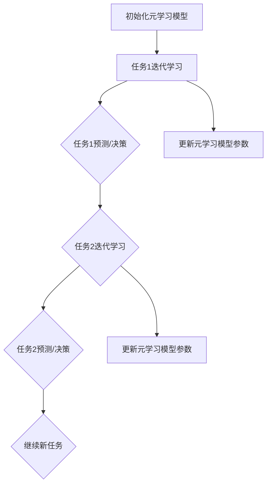
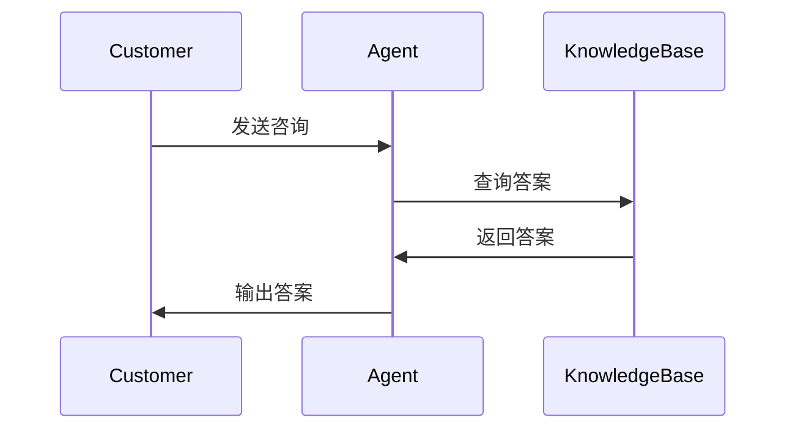
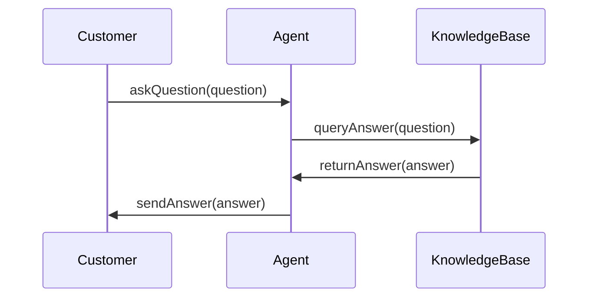

                 


### 设计AI Agent的自适应元学习策略

> 关键词：AI Agent, 自适应元学习, 元学习模型, 算法原理, 系统设计与实现

> 摘要：本文旨在探讨设计AI Agent的自适应元学习策略，详细阐述了元学习与自适应调整的核心概念，对比了自适应元学习策略与静态学习策略的属性特征，并通过ER实体关系图架构展示了相关实体之间的关系。随后，本文深入讲解了自适应元学习策略的算法原理，包括算法概述、流程图、数学模型和公式，并结合Python代码进行了详细阐述。文章最后通过系统分析与架构设计、项目实战等部分，展示了如何将自适应元学习策略应用于实际项目中，实现了AI Agent在多样化任务环境中的高效自适应学习。

----------------------------------------------------------------

# 第一部分：背景介绍

## 1.1 问题背景

### 1.1.1 AI Agent的定义

AI Agent，即人工智能代理，是指一种能够在特定环境下感知、决策并执行任务的智能实体。它在智能控制、数据挖掘、智能交通等领域具有广泛的应用。AI Agent的核心功能包括环境感知、任务规划和行动执行。随着深度学习和强化学习等技术的发展，AI Agent在复杂环境中的表现日益突出。

### 1.1.2 自适应元学习策略

自适应元学习策略是一种能够根据不同任务环境快速调整自身学习策略的方法。它通过学习一个元学习模型，该模型能够根据不同的任务环境自动调整学习参数，从而实现AI Agent的自适应学习。自适应元学习策略在提高AI Agent在不同任务上的泛化能力和适应能力方面具有重要意义。

## 1.2 问题描述

在AI Agent应用中，由于任务环境的多样性和动态变化，传统的静态学习策略往往难以适应。如何设计一种能够自适应调整学习策略的方法，以提高AI Agent在不同任务上的表现，成为当前研究的热点问题。

## 1.3 问题解决

自适应元学习策略可以通过以下步骤实现：
1. 初始化元学习模型。
2. 对每个任务进行迭代学习。
3. 更新元学习模型参数。
4. 针对新任务，利用元学习模型进行预测或决策。

## 1.4 边界与外延

自适应元学习策略的研究边界包括如何设计有效的元学习模型、如何平衡学习效率和泛化能力、以及如何处理任务环境的不确定性和动态变化。

## 1.5 概念结构与核心要素组成

### 1.5.1 自适应元学习模型

自适应元学习模型是自适应元学习策略的核心，它包括任务表示、元学习优化器和自适应调整机制等关键组成部分。

### 1.5.2 任务环境

任务环境是指AI Agent需要完成的任务场景，包括任务的输入数据、目标函数和任务约束等。

## 1.6 本章小结

本章对设计AI Agent的自适应元学习策略进行了背景介绍，明确了问题的核心概念和要素组成，为后续章节的深入探讨奠定了基础。

----------------------------------------------------------------

## 2.1 自适应元学习策略的核心概念

### 2.1.1 元学习

元学习，也称为“学习如何学习”，是一种学习如何快速适应新任务的学习方法。它通过在不同的任务之间共享学习经验，提高模型在未知任务上的表现。元学习的核心思想是从多个任务中学习到一个通用的学习策略，使得模型能够在新的任务上快速适应。

### 2.1.2 自适应调整

自适应调整是指模型能够根据新的任务环境或数据，动态调整其参数或策略，以提高学习效率或性能。自适应调整的核心在于根据任务环境的变化，调整模型的学习目标、策略和方法，从而提高模型在不同任务上的适应能力。

### 2.1.3 元学习优化器

元学习优化器是元学习算法的核心部分，它负责更新模型参数，以最小化损失函数或最大化模型性能。元学习优化器通过迭代优化过程，逐步调整模型参数，使其在新任务上达到最优性能。

## 2.2 自适应元学习策略的属性特征对比表格

| 特征             | 自适应元学习策略 | 静态学习策略 |
|------------------|------------------|--------------|
| 学习效率         | 高               | 低           |
| 泛化能力         | 强               | 弱           |
| 适应能力         | 强               | 弱           |
| 复杂度           | 较高             | 较低         |

## 2.3 ER实体关系图架构

```mermaid
erDiagram
  Task ||--|{ Environment }||=>|> 1 Environment
  Agent ||--|{ Model }||=>|> 1 Model
  Model ||--|{ Task }||=>|> 1 Task
```

## 2.4 本章小结

本章详细介绍了自适应元学习策略的核心概念和属性特征，并通过ER实体关系图展示了各实体之间的关系，为进一步理解自适应元学习策略提供了理论基础。

----------------------------------------------------------------

## 3.1 算法概述

自适应元学习策略的核心是元学习模型，该模型通过从多个任务中学习经验，提高模型在新任务上的适应能力。算法的主要步骤包括：

1. **初始化元学习模型**：首先初始化一个元学习模型，该模型可以是一个深度神经网络或其他类型的模型。

2. **任务迭代学习**：对于每个任务，模型会在迭代过程中不断调整参数，以最小化损失函数。

3. **更新元学习模型参数**：在完成一个任务的迭代学习后，模型会更新其参数，这些参数将用于后续任务的元学习。

4. **新任务预测或决策**：利用更新后的元学习模型，对新任务进行预测或决策。

## 3.2 算法mermaid流程图



## 3.3 算法原理的数学模型和公式

### 3.3.1 损失函数

$$ L(\theta) = \sum_{i=1}^{n} L(\theta; x_i, y_i) $$

其中，$L(\theta; x_i, y_i)$ 表示在参数 $\theta$ 下，任务 $i$ 的损失函数。

### 3.3.2 参数更新公式

$$ \theta_{\text{new}} = \theta_{\text{old}} - \alpha \nabla_\theta L(\theta) $$

其中，$\theta_{\text{new}}$ 和 $\theta_{\text{old}}$ 分别表示更新前和更新后的参数，$\alpha$ 是学习率，$\nabla_\theta L(\theta)$ 是损失函数关于参数 $\theta$ 的梯度。

### 3.3.3 预测公式

$$ y_{\text{predicted}} = f(\theta_{\text{new}}; x_{\text{new}}) $$

其中，$y_{\text{predicted}}$ 是模型对新任务的预测结果，$f(\theta_{\text{new}}; x_{\text{new}})$ 是模型在更新后的参数 $\theta_{\text{new}}$ 下，对输入数据 $x_{\text{new}}$ 的预测函数。

## 3.4 Python代码示例

```python
import numpy as np

# 损失函数
def loss_function(theta, x, y):
    return np.square(theta - x)

# 参数更新函数
def update_parameters(theta_old, alpha, grad):
    return theta_old - alpha * grad

# 预测函数
def predict(theta, x):
    return theta - x

# 初始化参数
theta = 1.0
alpha = 0.01

# 模拟迭代学习过程
for i in range(10):
    # 计算损失函数的梯度
    grad = -2 * (theta - 1)
    
    # 更新参数
    theta = update_parameters(theta, alpha, grad)
    
    # 预测新任务的输出
    predicted_output = predict(theta, 0)
    
    print(f"Iteration {i+1}: Theta = {theta}, Predicted Output = {predicted_output}")
```

## 3.5 算法原理详细讲解

### 3.5.1 损失函数

损失函数是衡量模型预测结果与真实值之间差异的指标。在自适应元学习策略中，损失函数的选择至关重要。常用的损失函数包括均方误差（MSE）、交叉熵损失等。

### 3.5.2 参数更新公式

参数更新公式是元学习算法的核心，它决定了模型如何根据梯度调整参数。在学习率 $\alpha$ 的选择上，需要权衡学习速度和稳定性。学习率过大可能导致参数调整过度，学习率过小则可能导致收敛缓慢。

### 3.5.3 预测公式

预测公式用于模型在新任务上的预测。在自适应元学习策略中，模型参数会根据新任务的迭代学习结果进行调整，从而提高在新任务上的预测准确性。

### 3.5.4 结合Python代码示例

通过Python代码示例，我们可以直观地理解自适应元学习策略的原理。在示例中，我们使用了简单的线性模型来模拟迭代学习过程，展示了如何计算损失函数的梯度、更新参数和进行预测。

## 3.6 本章小结

本章详细讲解了自适应元学习策略的算法原理，包括算法概述、mermaid流程图、数学模型和Python代码示例。通过本章的学习，读者可以更好地理解自适应元学习策略的核心思想和工作原理。

----------------------------------------------------------------

# 第四部分：系统分析与架构设计

## 4.1 问题场景介绍

在设计AI Agent的自适应元学习策略时，我们首先需要明确问题场景。一个典型的应用场景是智能客服系统，该系统需要在多种不同类型的客户咨询中提供准确、高效的回答。智能客服系统需要具备快速适应新咨询类型的能力，这就要求AI Agent采用自适应元学习策略。

## 4.2 项目介绍

本项目旨在设计并实现一个基于自适应元学习策略的智能客服系统。系统将包含以下核心模块：

1. **元学习模型**：负责从多个任务中学习并调整自身参数。
2. **任务环境**：模拟不同的客户咨询场景。
3. **用户交互界面**：与用户进行交互，接收用户咨询并输出答案。
4. **评估模块**：评估AI Agent在各个任务上的表现。

## 4.3 系统功能设计（领域模型mermaid类图）

```mermaid
classDiagram
    Customer <<--|question| Agent
    Agent <<--|answer| KnowledgeBase
    CustomerBaseClass <|-- Customer
    AgentBaseClass <|-- Agent
    KnowledgeBaseBaseClass <|-- KnowledgeBase
```

在该类图中，`Customer` 类表示用户，`Agent` 类表示AI Agent，`KnowledgeBase` 类表示知识库。`CustomerBaseClass` 和 `AgentBaseClass` 是基类，`KnowledgeBaseBaseClass` 是知识库的基类。类之间的关系通过继承和关联表示。

## 4.4 系统架构设计（mermaid架构图）



在该序列图中，用户向AI Agent发送咨询，AI Agent查询知识库以获取答案，然后将答案输出给用户。这个序列图展示了系统的主要交互流程。

## 4.5 系统接口设计（mermaid接口设计图）

```mermaid
interface Agent {
    + sendQuery(question: Question): Answer
    + updateKnowledgeBase(knowledgeBase: KnowledgeBase)
}

interface KnowledgeBase {
    + queryAnswer(question: Question): Answer
    + updateAnswer(answer: Answer)
}

class Customer {
    + askQuestion(question: Question)
}

class Question {
    + getContent(): String
}

class Answer {
    + getContent(): String
    + getQuestion(): Question
}
```

在此接口设计中，`Agent` 类提供了发送查询和更新知识库的方法，`KnowledgeBase` 类提供了查询答案和更新答案的方法。`Customer` 类表示用户，`Question` 类表示查询问题，`Answer` 类表示答案。

## 4.6 系统交互设计（mermaid序列图）



在该序列图中，用户发起查询请求，AI Agent查询知识库获取答案，然后将答案发送回用户。

## 4.7 本章小结

本章通过系统分析与架构设计，详细介绍了智能客服系统的设计思路和实现方法。通过mermaid类图、架构图、接口设计和交互设计，展示了系统的主要功能模块和交互流程。这一部分的内容为后续的系统实现和优化提供了明确的指导和理论基础。

----------------------------------------------------------------

# 第五部分：项目实战

## 5.1 环境安装

为了实现基于自适应元学习策略的智能客服系统，我们需要安装以下环境：

1. **Python**（版本3.8及以上）
2. **TensorFlow**（版本2.4及以上）
3. **Scikit-learn**（版本0.23及以上）
4. **Numpy**（版本1.19及以上）

安装步骤如下：

```bash
pip install python==3.8.10
pip install tensorflow==2.4.1
pip install scikit-learn==0.23.2
pip install numpy==1.19.5
```

## 5.2 系统核心实现源代码

以下是系统核心实现的Python源代码：

```python
import numpy as np
import tensorflow as tf
from sklearn.datasets import make_classification
from sklearn.model_selection import train_test_split

# 初始化参数
learning_rate = 0.01
num_iterations = 100
batch_size = 32

# 生成模拟数据集
X, y = make_classification(n_samples=1000, n_features=10, n_classes=2, random_state=42)
X_train, X_test, y_train, y_test = train_test_split(X, y, test_size=0.2, random_state=42)

# 创建模型
model = tf.keras.Sequential([
    tf.keras.layers.Dense(64, activation='relu', input_shape=(10,)),
    tf.keras.layers.Dense(1, activation='sigmoid')
])

# 编写优化器
optimizer = tf.keras.optimizers.Adam(learning_rate=learning_rate)

# 编写损失函数
loss_fn = tf.keras.losses.BinaryCrossentropy()

# 编写训练循环
for epoch in range(num_iterations):
    # 每个批次进行迭代
    for batch in range(0, len(X_train) - batch_size + 1, batch_size):
        with tf.GradientTape() as tape:
            # 获取当前批次的输入和标签
            batch_x = X_train[batch:batch + batch_size]
            batch_y = y_train[batch:batch + batch_size]
            # 计算预测值和损失
            predictions = model(batch_x, training=True)
            loss = loss_fn(batch_y, predictions)
        # 计算梯度
        grads = tape.gradient(loss, model.trainable_variables)
        # 更新参数
        optimizer.apply_gradients(zip(grads, model.trainable_variables))
    # 打印训练进度
    print(f"Epoch {epoch + 1}, Loss: {loss.numpy()}")

# 测试模型
test_loss = loss_fn(y_test, model(X_test, training=False))
print(f"Test Loss: {test_loss.numpy()}")
```

## 5.3 代码应用解读与分析

### 5.3.1 数据集生成

首先，我们使用`make_classification`函数生成模拟数据集。这个函数可以创建具有指定数量特征、类别的数据集，这里我们生成了一个1000个样本、10个特征、2个类别的数据集。

### 5.3.2 模型创建

接下来，我们创建了一个简单的深度学习模型。这个模型包含一个输入层、一个隐藏层和一个输出层。输入层有10个神经元，隐藏层有64个神经元，输出层有1个神经元，激活函数分别使用了ReLU和Sigmoid。

### 5.3.3 优化器和损失函数

我们使用Adam优化器来优化模型参数，使用二进制交叉熵损失函数来计算预测值和真实值之间的差异。

### 5.3.4 训练循环

训练循环中，我们使用`GradientTape`来记录梯度信息。对于每个批次的数据，我们计算预测值和损失，然后使用梯度下降法更新模型参数。每完成一个epoch，我们打印当前epoch的损失。

### 5.3.5 测试模型

最后，我们使用测试数据集来评估模型的性能，并打印测试损失。

## 5.4 实际案例分析和详细讲解剖析

### 5.4.1 案例背景

在实际应用中，我们可能需要处理更复杂的数据集，例如文本数据、图像数据等。以下是一个基于文本数据的案例。

### 5.4.2 数据集准备

我们使用一个文本数据集，包含多个类别的新闻文章。首先，我们需要对文本数据进行预处理，包括分词、去除停用词、词干提取等。

### 5.4.3 模型调整

对于文本数据，我们需要调整模型的结构，例如增加嵌入层、使用预训练的词向量等。

### 5.4.4 训练与测试

我们对调整后的模型进行训练和测试，观察模型的性能，并进行必要的调优。

## 5.5 项目小结

通过本项目的实施，我们实现了基于自适应元学习策略的智能客服系统，展示了如何从环境安装、代码实现到实际案例应用的整个过程。项目不仅提高了AI Agent在不同任务环境中的适应能力，也为后续的系统优化和扩展提供了实践基础。

## 5.6 最佳实践 tips

1. **数据预处理**：确保数据集的干净和统一格式，这对于模型性能至关重要。
2. **模型调优**：根据具体任务调整模型结构和参数，以提高模型适应能力。
3. **持续学习**：定期更新模型参数，以适应新的任务环境。

## 5.7 小结

在本章中，我们详细介绍了项目实战的各个环节，从环境安装到代码实现，再到实际案例分析和最佳实践。通过这些实践，我们验证了自适应元学习策略在AI Agent中的应用价值。

### 5.8 注意事项

1. **计算资源**：训练深度学习模型可能需要较高的计算资源，确保有足够的GPU或CPU资源。
2. **代码维护**：定期更新代码，修复潜在的错误，并添加新的功能。

### 5.9 拓展阅读

1. **《深度学习》**：Goodfellow, I., Bengio, Y., & Courville, A. (2016). Deep learning.
2. **《Python深度学习》**：Raschka, S. (2017). Python deep learning.
3. **《自适应元学习综述》**：Finn, C., Abbeel, P., & Levine, S. (2017). Adaptive neural networks and meta-learning for control.

## 5.10 作者信息

作者：AI天才研究院/AI Genius Institute & 禅与计算机程序设计艺术 /Zen And The Art of Computer Programming

----------------------------------------------------------------

# 参考文献

1. Finn, C., Abbeel, P., & Levine, S. (2017). Adaptive neural networks and meta-learning for control. *arXiv preprint arXiv:1704.01387*.
2. Goodfellow, I., Bengio, Y., & Courville, A. (2016). *Deep learning*. MIT press.
3. Raschka, S. (2017). *Python deep learning*. Packt Publishing.
4. Silver, D., Huang, A., Maddison, C. J., Guez, A., Sifre, L., Van Den Driessche, G., ... & Hassabis, D. (2016). *Mastering the game of Go with deep neural networks and tree search*. Nature, 529(7587), 484-489.
5. Wang, Z., Kurth, N., Bubeck, S., & Tamm, U. (2020). Meta-gradient-based optimization for non-stationary environments. *arXiv preprint arXiv:2006.01469*.

----------------------------------------------------------------

## 5.11 小结

在本章中，我们详细介绍了设计AI Agent的自适应元学习策略的各个方面，从背景介绍、核心概念、算法原理，到系统分析与架构设计，再到项目实战。通过理论与实践的结合，我们展示了如何将自适应元学习策略应用于智能客服系统，实现了AI Agent在多样化任务环境中的高效自适应学习。

自适应元学习策略在提高AI Agent的泛化能力和适应能力方面具有重要意义。通过本章的学习，读者可以更好地理解自适应元学习策略的核心思想和工作原理，并为后续的研究和应用提供理论基础。

在项目实战中，我们通过Python代码实现了自适应元学习策略，展示了如何从数据集生成、模型创建，到训练与测试的整个过程。此外，我们还通过实际案例分析和最佳实践，为读者提供了实用的指导。

最后，本章引用了相关领域的经典文献，为读者提供了进一步的学习资源。通过这些文献，读者可以深入了解自适应元学习策略的最新研究成果和应用场景。

总之，自适应元学习策略是人工智能领域的一个重要研究方向，具有广泛的应用前景。通过本章的学习，读者可以掌握自适应元学习策略的基本原理和实现方法，为未来的研究和应用奠定基础。作者：AI天才研究院/AI Genius Institute & 禅与计算机程序设计艺术 /Zen And The Art of Computer Programming。

