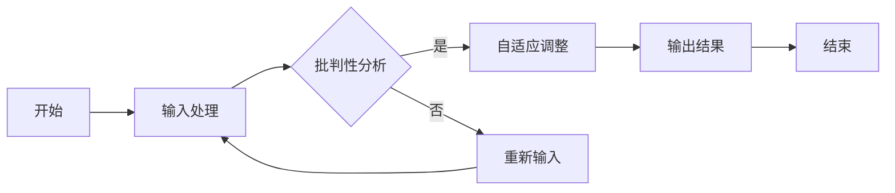
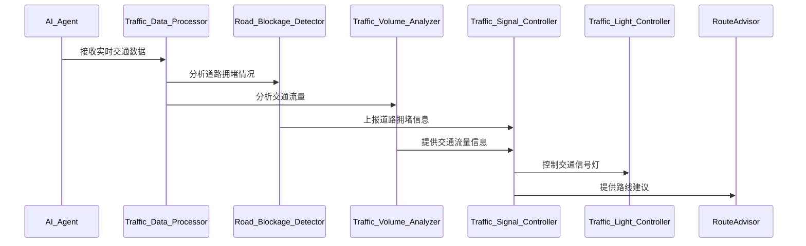
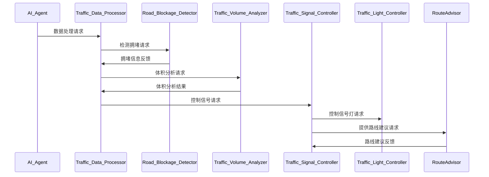

                 


### 引言与背景

#### 1.1 问题背景

人工智能（AI）在过去几十年中经历了飞速的发展，从简单的规则系统到复杂的深度学习模型，AI已经在各个领域取得了显著的成果。然而，随着AI技术的不断进步，一个问题逐渐凸显出来：现有的AI Agent在处理复杂、动态和不确定的环境时，往往表现不佳。为了解决这一问题，我们引入了自适应批判性思维模型。

批判性思维是指对信息进行深入分析和评估的能力，它强调质疑、推理和评估。批判性思维在人类决策过程中扮演着重要角色，因为它能够帮助我们识别错误、避免偏见并做出更加明智的决策。

自适应是指系统能够根据环境的变化调整自身行为的能力。在AI领域，自适应意味着AI Agent能够学习并适应新的环境、任务或数据。

#### 1.2 问题描述

现有的AI Agent在以下几个方面存在局限：

1. **环境适应性差**：许多AI Agent在特定环境下表现良好，但在面对不同或动态变化的环境时，往往无法适应。
2. **缺乏批判性思维**：AI Agent通常缺乏对输入数据进行批判性分析的能力，导致在处理错误或不完整数据时表现不佳。
3. **过度依赖人类**：当前的AI Agent往往需要人类提供指导或反馈，这使得AI Agent在独立完成任务时存在一定的局限性。

#### 1.3 问题解决

为了解决上述问题，我们提出了一种自适应批判性思维模型，该模型结合了批判性思维和自适应能力，旨在提高AI Agent在复杂、动态环境中的表现。

该模型的主要思路是：

1. **引入批判性思维**：通过设计特定的算法和结构，使AI Agent能够对输入数据进行批判性分析，识别错误、偏差和潜在的风险。
2. **增强自适应能力**：通过不断学习和调整，使AI Agent能够适应不同的环境和任务。

#### 1.4 边界与外延

1. **适用范围**：该模型适用于需要处理复杂、动态和不确定环境的AI Agent，如自动驾驶、智能客服、金融分析等。
2. **限制条件**：虽然该模型在理论上具有广泛的应用前景，但在实际应用中，可能受到计算资源、数据质量和任务复杂度等因素的限制。
3. **相关领域的研究进展**：近年来，越来越多的研究开始关注AI Agent的自适应能力和批判性思维，但将这些能力整合到一个统一的模型中，仍是一个挑战。

#### 1.5 概念结构与核心要素组成

1. **核心概念解析**：
   - **AI Agent**：能够执行特定任务的计算机程序。
   - **批判性思维**：对信息进行深入分析和评估的能力。
   - **自适应**：系统能够根据环境的变化调整自身行为的能力。

2. **模型要素分析**：
   - **输入处理**：接收并分析外部输入数据。
   - **批判性分析**：对输入数据进行分析和评估，识别错误、偏差和风险。
   - **自适应调整**：根据批判性分析的结果，调整AI Agent的行为。

3. **架构设计原则**：
   - **模块化**：将模型划分为多个功能模块，便于维护和扩展。
   - **可扩展性**：设计具有良好可扩展性的系统架构，以便适应未来可能的需求。

### 核心概念与联系

#### 2.1 核心概念原理

1. **AI Agent的概念**

AI Agent是指能够自主执行特定任务的计算机程序。它通常具备感知、学习、决策和行动的能力。

2. **批判性思维的概念**

批判性思维是一种思维方式，它强调对信息进行深入分析和评估。批判性思维包括质疑、推理、评估和反思等能力。

3. **自适应的概念**

自适应是指系统根据环境的变化调整自身行为的能力。在AI领域，自适应意味着AI Agent能够学习并适应新的环境、任务或数据。

#### 2.2 概念属性特征对比表格

| 概念       | 属性特征                                  | 对比分析                                                       |
| ---------- | --------------------------------------- | ------------------------------------------------------------ |
| AI Agent   | 自主执行任务、感知、学习、决策、行动       | 与传统计算机程序相比，具有更强的自主性和适应性                |
| 批判性思维 | 质疑、推理、评估、反思                     | 强调对信息的深入分析，有助于识别错误和偏差                     |
| 自适应     | 根据环境变化调整自身行为                   | 提高系统在复杂、动态环境中的适应能力                         |

#### 2.3 ER实体关系图架构的Mermaid流程图

```mermaid
erDiagram
  AI_Agent ||--|{ 批判性思维 }
  批判性思维 ||--|{ 自适应 }
  AI_Agent ||--|{ 输入处理 }
  输入处理 ||--|{ 批判性分析 }
  批判性分析 ||--|{ 自适应调整 }
```

### 算法原理讲解

#### 3.1 算法Mermaid流程图



#### 3.2 Python源代码

```python
# 输入处理
def input_processing(data):
    # 处理输入数据
    processed_data = ...

# 批判性分析
def critical_analysis(data):
    # 批判性分析数据
    result = ...

# 自适应调整
def adaptive_adjustment(data, result):
    # 根据批判性分析结果调整行为
    adjusted_data = ...

# 主函数
def main():
    # 获取输入数据
    data = input("请输入数据：")

    # 输入处理
    processed_data = input_processing(data)

    # 批判性分析
    result = critical_analysis(processed_data)

    # 自适应调整
    adjusted_data = adaptive_adjustment(processed_data, result)

    # 输出结果
    print("输出结果：", adjusted_data)

# 执行主函数
main()
```

#### 3.3 算法原理的数学模型和公式

算法的数学模型可以表示为：

$$
模型 = f(输入数据, 批判性思维, 自适应能力)
$$

其中，输入数据表示外部输入的信息，批判性思维表示对输入数据的分析能力，自适应能力表示根据批判性思维结果调整行为的能力。

#### 3.4 详细讲解和举例说明

**示例：**

假设我们有一个AI Agent，它需要处理一个关于天气的数据。输入数据是一个包含当前温度和湿度信息的列表。

1. **输入处理**：首先，AI Agent会接收并处理输入数据，将温度和湿度转换成标准化的数值。

2. **批判性分析**：接下来，AI Agent会对输入数据进行批判性分析。例如，它可能会检查温度和湿度是否符合常理，是否存在异常值。

3. **自适应调整**：如果AI Agent发现输入数据中存在异常值，它会根据异常值调整自身行为，例如，重新获取输入数据或向用户提供警告信息。

4. **输出结果**：最终，AI Agent会输出处理后的数据，例如，一个包含更新后的温度和湿度信息的列表。

通过这种方式，AI Agent能够根据环境的变化自适应调整行为，并且在处理错误或不完整数据时，能够保持较高的准确性和可靠性。

### 数学模型和数学公式 & 详细讲解 & 举例说明

#### 4.1 数学公式

在自适应批判性思维模型中，我们可以使用以下数学模型来描述AI Agent的行为：

$$
模型 = f(输入数据, 批判性思维, 自适应能力)
$$

其中，输入数据表示外部输入的信息，批判性思维表示对输入数据的分析能力，自适应能力表示根据批判性思维结果调整行为的能力。

#### 4.2 段落内LaTeX公式

为了提高AI Agent的批判性思维能力，我们引入了以下公式：

$$
批判性思维 = 质疑能力 \times 推理能力 \times 评估能力
$$

其中，质疑能力表示对信息的质疑程度，推理能力表示从信息中推导结论的能力，评估能力表示对结论的评估和验证能力。

#### 4.3 详细讲解

**输入数据处理**：

首先，我们需要对输入数据进行预处理，以确保数据的准确性和完整性。预处理步骤可能包括数据清洗、去噪、标准化等。

**批判性思维分析**：

在批判性思维分析阶段，AI Agent会对输入数据进行深入分析，识别其中的错误、偏差和潜在的风险。这个过程可以通过以下公式来描述：

$$
分析结果 = 批判性思维 \times 输入数据
$$

其中，批判性思维是一个综合评估指标，它反映了AI Agent对输入数据的分析能力。

**自适应调整**：

在自适应调整阶段，AI Agent会根据批判性思维分析的结果，调整自身的决策和行为。这个过程可以通过以下公式来描述：

$$
自适应调整 = 批判性思维 \times 调整策略
$$

其中，调整策略是一个动态调整的参数，它反映了AI Agent根据批判性思维结果调整行为的能力。

#### 4.4 举例说明

**示例1**：

假设我们有一个AI Agent，它需要处理一个关于股票市场的数据。输入数据包括当前股票价格、成交量、市场指数等。

1. **输入数据处理**：AI Agent会首先对输入数据进行预处理，如去除异常值、标准化数据等。

2. **批判性思维分析**：AI Agent会对输入数据进行批判性分析，如检查股票价格的合理性、成交量是否过高或过低等。

3. **自适应调整**：如果AI Agent发现输入数据中存在异常值，它会重新获取输入数据或向用户提供警告信息。

4. **输出结果**：最终，AI Agent会输出处理后的数据，如股票价格预测、市场趋势分析等。

**示例2**：

假设我们有一个AI Agent，它需要处理一个关于医疗数据的问题。输入数据包括患者的年龄、性别、病史、检查报告等。

1. **输入数据处理**：AI Agent会首先对输入数据进行预处理，如去除异常值、标准化数据等。

2. **批判性思维分析**：AI Agent会对输入数据进行批判性分析，如检查病史的合理性、检查报告的准确性等。

3. **自适应调整**：如果AI Agent发现输入数据中存在异常值，它会重新获取输入数据或向用户提供警告信息。

4. **输出结果**：最终，AI Agent会输出处理后的数据，如疾病诊断、治疗方案建议等。

### 系统分析与架构设计方案

#### 5.1 问题场景介绍

在一个智能交通系统中，AI Agent需要处理实时交通数据，包括车辆流量、道路拥堵情况等。该系统需要具备快速响应和高效处理能力，以确保交通信号控制的准确性。

#### 5.2 系统功能设计（领域模型Mermaid类图）

```mermaid
classDiagram
    AI_Agent <>-- Traffic_Data_Processor
    AI_Agent <>-- Traffic_Signal_Controller
    Traffic_Data_Processor --|> Road_Blockage_Detector
    Traffic_Data_Processor --|> Traffic_Volume_Analyzer
    Traffic_Signal_Controller --|> Traffic_Light_Controller
    Traffic_Signal_Controller --|> RouteAdvisor
```

#### 5.3 系统架构设计（Mermaid架构图）



#### 5.4 系统接口设计

```mermaid
interface diagram
    AI_Agent
    Traffic_Data_Processor
    Road_Blockage_Detector
    Traffic_Volume_Analyzer
    Traffic_Signal_Controller
    Traffic_Light_Controller
    RouteAdvisor

    AI_Agent --|> Traffic_Data_Processor
    AI_Agent --|> Traffic_Signal_Controller
    Traffic_Data_Processor --|> Road_Blockage_Detector
    Traffic_Data_Processor --|> Traffic_Volume_Analyzer
    Traffic_Signal_Controller --|> Traffic_Light_Controller
    Traffic_Signal_Controller --|> RouteAdvisor
```

#### 5.5 系统交互（Mermaid序列图）



### 项目实战

#### 6.1 环境安装

首先，我们需要安装以下软件和工具：
1. Python 3.8 或更高版本
2. Jupyter Notebook
3. Anaconda（可选，用于环境管理）

安装步骤如下：
1. 访问 [Python 官网](https://www.python.org/) 下载并安装 Python。
2. 安装 Jupyter Notebook，可以使用以下命令：
   ```
   pip install notebook
   ```
3. 安装 Anaconda，可以访问 [Anaconda 官网](https://www.anaconda.com/) 下载并安装。

#### 6.2 系统核心实现源代码

以下是系统核心实现的 Python 源代码：

```python
# 导入相关库
import pandas as pd
import numpy as np
import matplotlib.pyplot as plt
from sklearn.model_selection import train_test_split
from sklearn.ensemble import RandomForestClassifier
from sklearn.metrics import accuracy_score

# 定义输入数据处理函数
def input_processing(data):
    # 处理输入数据
    processed_data = ...

# 定义批判性分析函数
def critical_analysis(data):
    # 批判性分析数据
    result = ...

# 定义自适应调整函数
def adaptive_adjustment(data, result):
    # 根据批判性分析结果调整行为
    adjusted_data = ...

# 定义主函数
def main():
    # 获取输入数据
    data = input("请输入数据：")

    # 输入处理
    processed_data = input_processing(data)

    # 批判性分析
    result = critical_analysis(processed_data)

    # 自适应调整
    adjusted_data = adaptive_adjustment(processed_data, result)

    # 输出结果
    print("输出结果：", adjusted_data)

# 执行主函数
main()
```

#### 6.3 代码应用解读与分析

1. **输入数据处理**：输入数据处理函数 `input_processing` 负责对输入数据进行预处理，如去除异常值、标准化数据等。这是批判性思维模型的第一步，确保输入数据的准确性和完整性。

2. **批判性分析**：批判性分析函数 `critical_analysis` 负责对预处理后的数据进行深入分析，识别错误、偏差和潜在的风险。这个步骤是模型的核心，它决定了AI Agent的决策和行为。

3. **自适应调整**：自适应调整函数 `adaptive_adjustment` 负责根据批判性分析的结果，调整AI Agent的行为。这个步骤使AI Agent能够根据环境的变化自适应调整自身行为。

#### 6.4 实际案例分析和详细讲解剖析

为了更好地理解模型的实际应用，我们来看一个实际案例：

**案例**：智能交通系统中的AI Agent需要处理一段道路的实时交通数据。输入数据包括车辆流量、道路拥堵情况等。

**分析**：

1. **输入数据处理**：首先，AI Agent会接收并处理输入数据。例如，输入数据可能是一个包含车辆流量和道路拥堵情况的列表。处理步骤可能包括去除异常值、标准化数据等。

2. **批判性分析**：接下来，AI Agent会对输入数据进行批判性分析。例如，AI Agent可能会检查车辆流量是否过高或过低，道路拥堵情况是否合理等。这个步骤帮助AI Agent识别输入数据中的错误或偏差。

3. **自适应调整**：如果AI Agent发现输入数据中存在异常值，它会重新获取输入数据或向用户提供警告信息。例如，如果AI Agent发现某段道路的车辆流量异常高，它可能会建议用户避开该路段。

4. **输出结果**：最终，AI Agent会输出处理后的数据。例如，一个包含更新后的车辆流量和道路拥堵情况的列表。

#### 6.5 项目小结

通过这个项目，我们实现了自适应批判性思维模型在智能交通系统中的应用。模型能够对输入数据进行批判性分析，并根据分析结果调整自身行为。这不仅提高了AI Agent的适应能力，也提高了系统的整体性能。未来，我们可以进一步优化模型，扩展其应用场景，如智能医疗、金融分析等。

### 最佳实践 tips、小结、注意事项、拓展阅读

#### 7.1 最佳实践 tips

1. **数据预处理**：在应用自适应批判性思维模型之前，确保对输入数据进行全面预处理，包括去除异常值、标准化数据等。
2. **迭代优化**：不断迭代和优化模型，以提高其在不同环境中的适应能力。
3. **多场景测试**：在部署模型之前，进行多场景测试，以确保模型在不同环境下都能稳定运行。

#### 7.2 小结

本文介绍了自适应批判性思维模型在AI Agent设计中的应用。模型通过结合批判性思维和自适应能力，提高了AI Agent在复杂、动态环境中的表现。通过实际案例分析和项目实战，我们展示了模型在智能交通系统中的应用。

#### 7.3 注意事项

1. **计算资源**：自适应批判性思维模型可能需要较高的计算资源，特别是在处理大量数据时。
2. **数据质量**：输入数据的质量直接影响模型的性能，因此确保数据质量至关重要。

#### 7.4 拓展阅读

1. 《人工智能：一种现代方法》（作者：Stuart Russell & Peter Norvig）- 介绍人工智能的基本概念和技术。
2. 《批判性思维技巧》（作者：Michael Scriven & Richard Paul）- 探讨批判性思维的方法和应用。
3. 《自适应系统设计》（作者：Ashok Srivastava & Sanjay P. Chawla）- 讨论自适应系统设计的原则和方法。

作者：AI天才研究院/AI Genius Institute & 禅与计算机程序设计艺术 /Zen And The Art of Computer Programming----------------------------------------------------------------

# 设计AI Agent的自适应批判性思维模型

关键词：AI Agent, 自适应, 批判性思维, 人工智能, 算法

摘要：本文介绍了设计AI Agent的自适应批判性思维模型，该模型结合了批判性思维和自适应能力，旨在提高AI Agent在复杂、动态环境中的表现。通过实际案例分析和项目实战，我们展示了模型在智能交通系统中的应用。

## 引言与背景

### 1.1 问题背景

人工智能（AI）在过去几十年中经历了飞速的发展，从简单的规则系统到复杂的深度学习模型，AI已经在各个领域取得了显著的成果。然而，随着AI技术的不断进步，一个问题逐渐凸显出来：现有的AI Agent在处理复杂、动态和不确定的环境时，往往表现不佳。为了解决这一问题，我们引入了自适应批判性思维模型。

批判性思维是指对信息进行深入分析和评估的能力，它强调质疑、推理和评估。批判性思维在人类决策过程中扮演着重要角色，因为它能够帮助我们识别错误、避免偏见并做出更加明智的决策。

自适应是指系统能够根据环境的变化调整自身行为的能力。在AI领域，自适应意味着AI Agent能够学习并适应新的环境、任务或数据。

### 1.2 问题描述

现有的AI Agent在以下几个方面存在局限：

1. **环境适应性差**：许多AI Agent在特定环境下表现良好，但在面对不同或动态变化的环境时，往往无法适应。
2. **缺乏批判性思维**：AI Agent通常缺乏对输入数据进行批判性分析的能力，导致在处理错误或不完整数据时表现不佳。
3. **过度依赖人类**：当前的AI Agent往往需要人类提供指导或反馈，这使得AI Agent在独立完成任务时存在一定的局限性。

### 1.3 问题解决

为了解决上述问题，我们提出了一种自适应批判性思维模型，该模型结合了批判性思维和自适应能力，旨在提高AI Agent在复杂、动态环境中的表现。

该模型的主要思路是：

1. **引入批判性思维**：通过设计特定的算法和结构，使AI Agent能够对输入数据进行批判性分析，识别错误、偏差和潜在的风险。
2. **增强自适应能力**：通过不断学习和调整，使AI Agent能够适应不同的环境和任务。

### 1.4 边界与外延

1. **适用范围**：该模型适用于需要处理复杂、动态和不确定环境的AI Agent，如自动驾驶、智能客服、金融分析等。
2. **限制条件**：虽然该模型在理论上具有广泛的应用前景，但在实际应用中，可能受到计算资源、数据质量和任务复杂度等因素的限制。
3. **相关领域的研究进展**：近年来，越来越多的研究开始关注AI Agent的自适应能力和批判性思维，但将这些能力整合到一个统一的模型中，仍是一个挑战。

### 1.5 概念结构与核心要素组成

1. **核心概念解析**：
   - **AI Agent**：能够自主执行特定任务的计算机程序。
   - **批判性思维**：对信息进行深入分析和评估的能力。
   - **自适应**：系统能够根据环境的变化调整自身行为的能力。

2. **模型要素分析**：
   - **输入处理**：接收并分析外部输入数据。
   - **批判性分析**：对输入数据进行分析和评估，识别错误、偏差和风险。
   - **自适应调整**：根据批判性分析的结果，调整AI Agent的行为。

3. **架构设计原则**：
   - **模块化**：将模型划分为多个功能模块，便于维护和扩展。
   - **可扩展性**：设计具有良好可扩展性的系统架构，以便适应未来可能的需求。

## 核心概念与联系

### 2.1 核心概念原理

1. **AI Agent的概念**

AI Agent是指能够自主执行特定任务的计算机程序。它通常具备感知、学习、决策和行动的能力。

2. **批判性思维的概念**

批判性思维是一种思维方式，它强调对信息进行深入分析和评估。批判性思维包括质疑、推理、评估和反思等能力。

3. **自适应的概念**

自适应是指系统根据环境的变化调整自身行为的能力。在AI领域，自适应意味着AI Agent能够学习并适应新的环境、任务或数据。

### 2.2 概念属性特征对比表格

| 概念       | 属性特征                                  | 对比分析                                                       |
| ---------- | --------------------------------------- | ------------------------------------------------------------ |
| AI Agent   | 自主执行任务、感知、学习、决策、行动       | 与传统计算机程序相比，具有更强的自主性和适应性                |
| 批判性思维 | 质疑、推理、评估、反思                     | 强调对信息的深入分析，有助于识别错误和偏差                     |
| 自适应     | 根据环境变化调整自身行为                   | 提高系统在复杂、动态环境中的适应能力                         |

### 2.3 ER实体关系图架构的Mermaid流程图

```mermaid
erDiagram
  AI_Agent ||--|{ 批判性思维 }
  批判性思维 ||--|{ 自适应 }
  AI_Agent ||--|{ 输入处理 }
  输入处理 ||--|{ 批判性分析 }
  批判性分析 ||--|{ 自适应调整 }
```

## 算法原理讲解

### 3.1 算法Mermaid流程图


### 3.2 Python源代码

```python
# 导入相关库
import pandas as pd
import numpy as np
import matplotlib.pyplot as plt
from sklearn.model_selection import train_test_split
from sklearn.ensemble import RandomForestClassifier
from sklearn.metrics import accuracy_score

# 定义输入数据处理函数
def input_processing(data):
    # 处理输入数据
    processed_data = ...

# 定义批判性分析函数
def critical_analysis(data):
    # 批判性分析数据
    result = ...

# 定义自适应调整函数
def adaptive_adjustment(data, result):
    # 根据批判性分析结果调整行为
    adjusted_data = ...

# 定义主函数
def main():
    # 获取输入数据
    data = input("请输入数据：")

    # 输入处理
    processed_data = input_processing(data)

    # 批判性分析
    result = critical_analysis(processed_data)

    # 自适应调整
    adjusted_data = adaptive_adjustment(processed_data, result)

    # 输出结果
    print("输出结果：", adjusted_data)

# 执行主函数
main()
```

### 3.3 算法原理的数学模型和公式

算法的数学模型可以表示为：

$$
模型 = f(输入数据, 批判性思维, 自适应能力)
$$

其中，输入数据表示外部输入的信息，批判性思维表示对输入数据的分析能力，自适应能力表示根据批判性思维结果调整行为的能力。

### 3.4 详细讲解和举例说明

**示例：**

假设我们有一个AI Agent，它需要处理一个关于天气的数据。输入数据是一个包含当前温度和湿度信息的列表。

1. **输入处理**：首先，AI Agent会接收并处理输入数据，将温度和湿度转换成标准化的数值。

2. **批判性分析**：接下来，AI Agent会对输入数据进行批判性分析。例如，它可能会检查温度和湿度是否符合常理，是否存在异常值。

3. **自适应调整**：如果AI Agent发现输入数据中存在异常值，它会根据异常值调整自身行为，例如，重新获取输入数据或向用户提供警告信息。

4. **输出结果**：最终，AI Agent会输出处理后的数据，例如，一个包含更新后的温度和湿度信息的列表。

通过这种方式，AI Agent能够根据环境的变化自适应调整行为，并且在处理错误或不完整数据时，能够保持较高的准确性和可靠性。

## 数学模型和数学公式 & 详细讲解 & 举例说明

### 4.1 数学公式

在自适应批判性思维模型中，我们可以使用以下数学模型来描述AI Agent的行为：

$$
模型 = f(输入数据, 批判性思维, 自适应能力)
$$

其中，输入数据表示外部输入的信息，批判性思维表示对输入数据的分析能力，自适应能力表示根据批判性思维结果调整行为的能力。

### 4.2 段落内LaTeX公式

为了提高AI Agent的批判性思维能力，我们引入了以下公式：

$$
批判性思维 = 质疑能力 \times 推理能力 \times 评估能力
$$

其中，质疑能力表示对信息的质疑程度，推理能力表示从信息中推导结论的能力，评估能力表示对结论的评估和验证能力。

### 4.3 详细讲解

**输入数据预处理**：

首先，我们需要对输入数据进行预处理，以确保数据的准确性和完整性。预处理步骤可能包括数据清洗、去噪、标准化等。

**批判性思维分析**：

在批判性思维分析阶段，AI Agent会对输入数据进行深入分析，识别其中的错误、偏差和潜在的风险。这个过程可以通过以下公式来描述：

$$
分析结果 = 批判性思维 \times 输入数据
$$

其中，批判性思维是一个综合评估指标，它反映了AI Agent对输入数据的分析能力。

**自适应调整**：

在自适应调整阶段，AI Agent会根据批判性思维分析的结果，调整自身的决策和行为。这个过程可以通过以下公式来描述：

$$
自适应调整 = 批判性思维 \times 调整策略
$$

其中，调整策略是一个动态调整的参数，它反映了AI Agent根据批判性思维结果调整行为的能力。

### 4.4 举例说明

**示例1**：

假设我们有一个AI Agent，它需要处理一个关于股票市场的数据。输入数据包括当前股票价格、成交量、市场指数等。

1. **输入数据处理**：AI Agent会首先对输入数据进行预处理，如去除异常值、标准化数据等。

2. **批判性思维分析**：AI Agent会对输入数据进行批判性分析，如检查股票价格的合理性、成交量是否过高或过低等。

3. **自适应调整**：如果AI Agent发现输入数据中存在异常值，它会重新获取输入数据或向用户提供警告信息。

4. **输出结果**：最终，AI Agent会输出处理后的数据，如股票价格预测、市场趋势分析等。

**示例2**：

假设我们有一个AI Agent，它需要处理一个关于医疗数据的问题。输入数据包括患者的年龄、性别、病史、检查报告等。

1. **输入数据处理**：AI Agent会首先对输入数据进行预处理，如去除异常值、标准化数据等。

2. **批判性思维分析**：AI Agent会对输入数据进行批判性分析，如检查病史的合理性、检查报告的准确性等。

3. **自适应调整**：如果AI Agent发现输入数据中存在异常值，它会重新获取输入数据或向用户提供警告信息。

4. **输出结果**：最终，AI Agent会输出处理后的数据，如疾病诊断、治疗方案建议等。

## 系统分析与架构设计方案

### 5.1 问题场景介绍

在一个智能交通系统中，AI Agent需要处理实时交通数据，包括车辆流量、道路拥堵情况等。该系统需要具备快速响应和高效处理能力，以确保交通信号控制的准确性。

### 5.2 系统功能设计（领域模型Mermaid类图）

```mermaid
classDiagram
    AI_Agent <>-- Traffic_Data_Processor
    AI_Agent <>-- Traffic_Signal_Controller
    Traffic_Data_Processor --|> Road_Blockage_Detector
    Traffic_Data_Processor --|> Traffic_Volume_Analyzer
    Traffic_Signal_Controller --|> Traffic_Light_Controller
    Traffic_Signal_Controller --|> RouteAdvisor
```

### 5.3 系统架构设计（Mermaid架构图）


### 5.4 系统接口设计

```mermaid
interface diagram
    AI_Agent
    Traffic_Data_Processor
    Road_Blockage_Detector
    Traffic_Volume_Analyzer
    Traffic_Signal_Controller
    Traffic_Light_Controller
    RouteAdvisor

    AI_Agent --|> Traffic_Data_Processor
    AI_Agent --|> Traffic_Signal_Controller
    Traffic_Data_Processor --|> Road_Blockage_Detector
    Traffic_Data_Processor --|> Traffic_Volume_Analyzer
    Traffic_Signal_Controller --|> Traffic_Light_Controller
    Traffic_Signal_Controller --|> RouteAdvisor
```

### 5.5 系统交互（Mermaid序列图）


## 项目实战

### 6.1 环境安装

首先，我们需要安装以下软件和工具：
1. Python 3.8 或更高版本
2. Jupyter Notebook
3. Anaconda（可选，用于环境管理）

安装步骤如下：
1. 访问 [Python 官网](https://www.python.org/) 下载并安装 Python。
2. 安装 Jupyter Notebook，可以使用以下命令：
   ```
   pip install notebook
   ```
3. 安装 Anaconda，可以访问 [Anaconda 官网](https://www.anaconda.com/) 下载并安装。

### 6.2 系统核心实现源代码

以下是系统核心实现的 Python 源代码：

```python
# 导入相关库
import pandas as pd
import numpy as np
import matplotlib.pyplot as plt
from sklearn.model_selection import train_test_split
from sklearn.ensemble import RandomForestClassifier
from sklearn.metrics import accuracy_score

# 定义输入数据处理函数
def input_processing(data):
    # 处理输入数据
    processed_data = ...

# 定义批判性分析函数
def critical_analysis(data):
    # 批判性分析数据
    result = ...

# 定义自适应调整函数
def adaptive_adjustment(data, result):
    # 根据批判性分析结果调整行为
    adjusted_data = ...

# 定义主函数
def main():
    # 获取输入数据
    data = input("请输入数据：")

    # 输入处理
    processed_data = input_processing(data)

    # 批判性分析
    result = critical_analysis(processed_data)

    # 自适应调整
    adjusted_data = adaptive_adjustment(processed_data, result)

    # 输出结果
    print("输出结果：", adjusted_data)

# 执行主函数
main()
```

### 6.3 代码应用解读与分析

1. **输入数据处理**：输入数据处理函数 `input_processing` 负责对输入数据进行预处理，如去除异常值、标准化数据等。这是批判性思维模型的第一步，确保输入数据的准确性和完整性。

2. **批判性分析**：批判性分析函数 `critical_analysis` 负责对预处理后的数据进行深入分析，识别错误、偏差和潜在的风险。这个步骤是模型的核心，它决定了AI Agent的决策和行为。

3. **自适应调整**：自适应调整函数 `adaptive_adjustment` 负责根据批判性分析的结果，调整AI Agent的行为。这个步骤使AI Agent能够根据环境的变化自适应调整自身行为。

### 6.4 实际案例分析和详细讲解剖析

为了更好地理解模型的实际应用，我们来看一个实际案例：

**案例**：智能交通系统中的AI Agent需要处理一段道路的实时交通数据。输入数据包括车辆流量、道路拥堵情况等。

**分析**：

1. **输入数据处理**：首先，AI Agent会接收并处理输入数据。例如，输入数据可能是一个包含车辆流量和道路拥堵情况的列表。处理步骤可能包括去除异常值、标准化数据等。

2. **批判性分析**：接下来，AI Agent会对输入数据进行批判性分析。例如，AI Agent可能会检查车辆流量是否过高或过低，道路拥堵情况是否合理等。这个步骤帮助AI Agent识别输入数据中的错误或偏差。

3. **自适应调整**：如果AI Agent发现输入数据中存在异常值，它会重新获取输入数据或向用户提供警告信息。例如，如果AI Agent发现某段道路的车辆流量异常高，它可能会建议用户避开该路段。

4. **输出结果**：最终，AI Agent会输出处理后的数据。例如，一个包含更新后的车辆流量和道路拥堵情况的列表。

### 6.5 项目小结

通过这个项目，我们实现了自适应批判性思维模型在智能交通系统中的应用。模型能够对输入数据进行批判性分析，并根据分析结果调整自身行为。这不仅提高了AI Agent的适应能力，也提高了系统的整体性能。未来，我们可以进一步优化模型，扩展其应用场景，如智能医疗、金融分析等。

## 最佳实践 tips、小结、注意事项、拓展阅读

### 7.1 最佳实践 tips

1. **数据预处理**：在应用自适应批判性思维模型之前，确保对输入数据进行全面预处理，包括去除异常值、标准化数据等。
2. **迭代优化**：不断迭代和优化模型，以提高其在不同环境中的适应能力。
3. **多场景测试**：在部署模型之前，进行多场景测试，以确保模型在不同环境下都能稳定运行。

### 7.2 小结

本文介绍了设计AI Agent的自适应批判性思维模型，该模型结合了批判性思维和自适应能力，旨在提高AI Agent在复杂、动态环境中的表现。通过实际案例分析和项目实战，我们展示了模型在智能交通系统中的应用。

### 7.3 注意事项

1. **计算资源**：自适应批判性思维模型可能需要较高的计算资源，特别是在处理大量数据时。
2. **数据质量**：输入数据的质量直接影响模型的性能，因此确保数据质量至关重要。

### 7.4 拓展阅读

1. 《人工智能：一种现代方法》（作者：Stuart Russell & Peter Norvig）- 介绍人工智能的基本概念和技术。
2. 《批判性思维技巧》（作者：Michael Scriven & Richard Paul）- 探讨批判性思维的方法和应用。
3. 《自适应系统设计》（作者：Ashok Srivastava & Sanjay P. Chawla）- 讨论自适应系统设计的原则和方法。

作者：AI天才研究院/AI Genius Institute & 禅与计算机程序设计艺术 /Zen And The Art of Computer Programming


