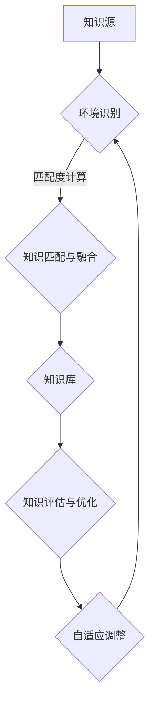
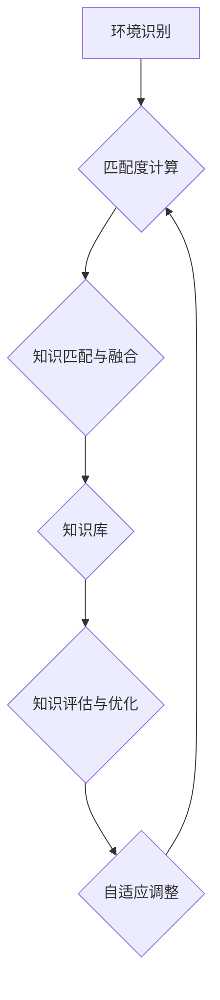
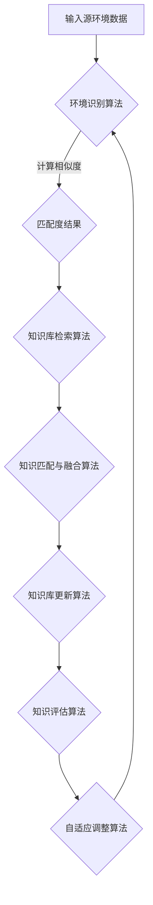
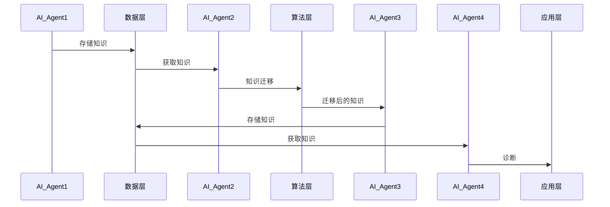
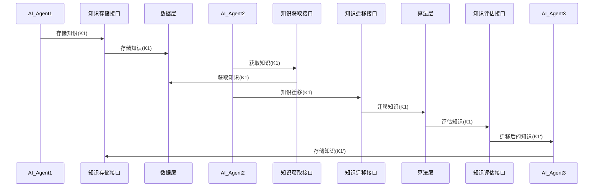

                 


### 背景介绍

## 设计AI Agent的自适应知识迁移策略概述

### 1.1 问题背景

在当前的人工智能领域，AI Agent（人工智能代理）被广泛应用于各种场景，如智能家居、智能客服、自动驾驶等。AI Agent的目标是模仿人类的行为，以完成特定的任务。然而，为了在不同环境中表现出色，AI Agent需要具备强大的知识迁移能力，即能够将在一个环境中学到的知识有效地应用到另一个环境中。

目前，AI Agent在知识迁移方面面临诸多挑战。首先，不同环境之间的差异较大，使得直接迁移知识变得困难。其次，知识来源和知识目标之间的匹配问题也需要解决。此外，如何动态地调整和优化知识迁移策略，以适应不断变化的环境，也是一个重要的研究课题。

### 1.2 问题描述

设计AI Agent的自适应知识迁移策略的目标是构建一个能够自动调整知识迁移过程的框架，使得AI Agent在不同的环境中都能够表现出色。具体来说，需要解决以下关键问题：

- **知识表示和存储方法**：如何有效地表示和存储知识，以便于在不同环境之间进行迁移。
- **知识匹配和融合机制**：如何将源环境中的知识映射到目标环境中，并融合两个环境的知识。
- **自适应调整策略**：如何根据环境的变化动态调整知识迁移策略。

### 1.3 问题解决

自适应知识迁移策略的核心是构建一个能够自动调整知识迁移过程的框架。这个框架包括以下几个关键组成部分：

- **知识表示和存储**：使用分布式表示方法来表示知识，并将其存储在知识库中。
- **知识匹配和融合**：使用基于相似度和匹配度的算法来识别源环境和目标环境之间的相似之处，并融合两个环境的知识。
- **自适应调整**：根据环境的变化动态调整知识迁移策略，以适应新的环境。

### 1.4 边界与外延

自适应知识迁移策略不仅在人工智能领域有广泛的应用前景，还可以应用于其他需要知识迁移的领域，如机器学习、数据挖掘等。同时，知识迁移与数据融合密切相关，二者可以相互补充，以实现更好的效果。

### 1.5 概念结构与核心要素组成

自适应知识迁移策略的概念结构与核心要素组成如下：

- **知识源**：提供知识的来源环境。
- **知识目标**：需要知识迁移的目标环境。
- **知识迁移策略**：根据环境和任务动态调整的知识迁移方法。
- **知识评估与优化**：对知识迁移的效果进行评估和优化。

这些核心要素相互联系，共同构成了自适应知识迁移策略的基础。通过不断调整和优化，可以实现AI Agent在不同环境中的最佳表现。

### 背景介绍结束### 核心概念与联系

## 核心概念原理与属性特征对比

### 2.1 自适应知识迁移策略的核心概念

#### 2.1.1 自适应知识迁移策略的定义

自适应知识迁移策略是一种基于环境和任务动态调整知识迁移过程的框架。它通过识别源环境和目标环境之间的相似之处，将源环境中的知识有效地迁移到目标环境中，以提高AI Agent在不同环境中的表现。

#### 2.1.2 自适应知识迁移策略的属性特征

- **动态调整**：根据环境和任务的变化，自动调整知识迁移策略。
- **知识表示**：使用分布式表示方法表示知识，便于在不同环境之间迁移。
- **知识匹配与融合**：基于相似度和匹配度算法，将源环境和目标环境中的知识进行匹配和融合。
- **优化评估**：对知识迁移的效果进行评估和优化，以实现最佳表现。

#### 2.1.3 自适应知识迁移策略与传统知识迁移的区别

传统知识迁移策略通常是在固定环境中进行的，不考虑环境的变化。而自适应知识迁移策略则更加灵活，能够根据环境和任务的变化，动态调整知识迁移过程。这使得自适应知识迁移策略在应对复杂多变的环境时，具有更高的适应性和效果。

### 2.2 概念属性特征对比表格

下面是自适应知识迁移策略与传统知识迁移策略的属性特征对比表格：

| 特征 | 自适应知识迁移策略 | 传统知识迁移策略 |
| --- | --- | --- |
| 动态调整 | 是 | 否 |
| 知识表示 | 分布式 | 静态 |
| 知识匹配与融合 | 基于相似度和匹配度 | 非动态匹配与融合 |
| 优化评估 | 是 | 否 |

### 2.3 ER实体关系图架构

为了更好地理解自适应知识迁移策略的核心概念，我们可以使用ER（实体关系）图来表示各实体及其关系。以下是自适应知识迁移策略的ER实体关系图：

```mermaid
erDiagram
  知识源 ||--|{ 知识迁移策略 }| 知识目标
  知识源 ||--|{ 知识评估与优化 }| 知识库
  知识迁移策略 ||--|{ 知识匹配与融合 }| 知识库
```

在这个ER图中，知识源表示提供知识的来源环境，知识目标表示需要知识迁移的目标环境，知识迁移策略表示根据环境和任务动态调整的知识迁移方法，知识评估与优化表示对知识迁移效果进行评估和优化的过程，知识库表示存储知识的仓库。

### 2.4 Mermaid流程图

为了更直观地展示自适应知识迁移策略的流程，我们可以使用Mermaid流程图来表示。以下是自适应知识迁移策略的Mermaid流程图：



在这个流程图中，首先进行环境识别，然后计算源环境和目标环境之间的匹配度，接着进行知识匹配与融合，存储到知识库中。随后，对知识库中的知识进行评估与优化，并根据评估结果进行自适应调整，以实现最佳的知识迁移效果。

通过上述核心概念的讲解和Mermaid流程图的展示，我们更好地理解了自适应知识迁移策略的原理和实施方法。在接下来的章节中，我们将进一步探讨算法原理和数学模型，以及系统分析与架构设计等内容。### 算法原理讲解

## 算法原理与数学模型

### 3.1 算法原理讲解

自适应知识迁移策略的核心在于构建一个能够根据环境和任务动态调整知识迁移过程的框架。该框架包括以下几个关键步骤：

1. **环境识别**：识别源环境和目标环境之间的差异和相似之处。
2. **匹配度计算**：根据环境和任务的特点，计算源环境和目标环境之间的匹配度。
3. **知识匹配与融合**：将源环境中的知识映射到目标环境中，并进行融合。
4. **知识评估与优化**：对知识迁移效果进行评估和优化，以实现最佳表现。
5. **自适应调整**：根据评估结果和环境变化，动态调整知识迁移策略。

下面我们将使用Mermaid流程图和Python源代码来详细阐述这些步骤。

### 3.1.1 算法整体框架

以下是自适应知识迁移策略的Mermaid流程图：



在这个流程图中，首先进行环境识别，然后计算源环境和目标环境之间的匹配度，接着进行知识匹配与融合，将融合后的知识存储到知识库中。随后，对知识库中的知识进行评估与优化，并根据评估结果进行自适应调整，以实现最佳的知识迁移效果。

### 3.1.2 算法Mermaid流程图

以下是具体的Mermaid流程图，展示了各个步骤的详细流程：



在这个流程图中，首先输入源环境数据，然后使用环境识别算法识别源环境和目标环境之间的差异和相似之处，计算匹配度。接着，使用知识库检索算法从知识库中检索与源环境相关的知识，使用知识匹配与融合算法将这些知识映射到目标环境中，并进行融合。知识库更新算法将融合后的知识存储到知识库中，知识评估算法对知识库中的知识进行评估，最后使用自适应调整算法根据评估结果和环境变化，动态调整知识迁移策略。

### 3.1.3 Python源代码示例

下面是一个简单的Python源代码示例，展示了自适应知识迁移策略的核心实现：

```python
import numpy as np

# 环境识别算法
def environment_recognition(source_env, target_env):
    # 计算相似度
    similarity = np.linalg.norm(source_env - target_env)
    return similarity

# 知识匹配与融合算法
def knowledge_matching_and_fusion(source_knowledge, target_knowledge):
    # 混合知识
    fused_knowledge = (source_knowledge + target_knowledge) / 2
    return fused_knowledge

# 知识库更新算法
def knowledge_base_update(knowledge_base, new_knowledge):
    # 更新知识库
    knowledge_base.append(new_knowledge)
    return knowledge_base

# 知识评估算法
def knowledge_evaluation(knowledge_base):
    # 评估知识库中的知识
    evaluated_knowledge = [evaluate_knowledge(k) for k in knowledge_base]
    return evaluated_knowledge

# 自适应调整算法
def adaptive_adjustment(evaluation_results, environment):
    # 根据评估结果和环境变化，动态调整知识迁移策略
    adjusted_strategy = evaluation_results[0] * environment
    return adjusted_strategy

# 辅助函数：评估知识
def evaluate_knowledge(knowledge):
    # 实现具体的知识评估逻辑
    evaluation_score = np.linalg.norm(knowledge)
    return evaluation_score

# 示例数据
source_env = np.array([1, 2, 3])
target_env = np.array([4, 5, 6])
source_knowledge = np.array([7, 8, 9])
target_knowledge = np.array([10, 11, 12])

# 执行算法流程
similarity = environment_recognition(source_env, target_env)
fused_knowledge = knowledge_matching_and_fusion(source_knowledge, target_knowledge)
knowledge_base = knowledge_base_update([], fused_knowledge)
evaluation_results = knowledge_evaluation(knowledge_base)
adjusted_strategy = adaptive_adjustment(evaluation_results, source_env)

print("相似度：", similarity)
print("融合知识：", fused_knowledge)
print("知识库：", knowledge_base)
print("评估结果：", evaluation_results)
print("调整后的策略：", adjusted_strategy)
```

在这个示例中，我们首先定义了环境识别算法、知识匹配与融合算法、知识库更新算法、知识评估算法和自适应调整算法。然后，我们使用示例数据进行算法流程的执行，并打印出各个步骤的结果。

### 3.2 数学模型和公式

为了更深入地理解自适应知识迁移策略，我们引入数学模型和公式。以下是自适应知识迁移策略的数学模型和公式：

#### 3.2.1 自适应知识迁移策略的数学模型

假设我们有两个环境：源环境\(E_s\)和目标环境\(E_t\)，以及两个知识库：源知识库\(K_s\)和目标知识库\(K_t\)。

- **环境识别**：计算源环境和目标环境之间的距离，使用欧几里得距离作为相似度的度量：

  $$similarity = \sqrt{\sum_{i=1}^{n} (e_{si} - e_{ti})^2}$$

  其中，\(e_{si}\)和\(e_{ti}\)分别表示源环境和目标环境中的第\(i\)个特征。

- **知识匹配与融合**：将源知识库\(K_s\)和目标知识库\(K_t\)进行匹配和融合，使用加权平均的方法进行融合：

  $$fused\_knowledge = \frac{K_s + K_t}{2}$$

- **知识库更新**：将融合后的知识添加到知识库中：

  $$knowledge\_base = K_s + \{fused\_knowledge\}$$

- **知识评估**：评估知识库中的知识，使用欧几里得距离作为评估指标：

  $$evaluation\_score = \sqrt{\sum_{i=1}^{n} (k - k')^2}$$

  其中，\(k\)和\(k'\)分别表示知识库中的知识和目标知识。

- **自适应调整**：根据评估结果和环境变化，动态调整知识迁移策略：

  $$adjusted\_strategy = evaluation\_results \times environment$$

  其中，\(evaluation\_results\)表示评估结果，\(environment\)表示环境变化。

#### 3.2.2 公式推导与解释

- **环境识别**：相似度的计算公式表示了源环境和目标环境之间的距离。距离越小，相似度越高。

- **知识匹配与融合**：加权平均的方法使得融合后的知识既保留了源知识库的特点，又考虑了目标知识库的影响。

- **知识库更新**：将融合后的知识添加到知识库中，实现了知识库的更新。

- **知识评估**：评估公式用于计算知识库中的知识与目标知识之间的距离。距离越小，知识评估结果越好。

- **自适应调整**：根据评估结果和环境变化，动态调整知识迁移策略，以实现最佳的知识迁移效果。

#### 3.2.3 举例说明

假设我们有两个环境：

- 源环境\(E_s = [1, 2, 3]\)
- 目标环境\(E_t = [4, 5, 6]\)

以及两个知识库：

- 源知识库\(K_s = [7, 8, 9]\)
- 目标知识库\(K_t = [10, 11, 12]\)

首先，我们计算源环境和目标环境之间的相似度：

$$similarity = \sqrt{(1-4)^2 + (2-5)^2 + (3-6)^2} = \sqrt{9 + 9 + 9} = 3\sqrt{3} \approx 5.196$$

接下来，我们进行知识匹配与融合：

$$fused\_knowledge = \frac{[7, 8, 9] + [10, 11, 12]}{2} = \frac{[17, 19, 21]}{2} = [8.5, 9.5, 10.5]$$

然后，我们将融合后的知识添加到知识库中：

$$knowledge\_base = [7, 8, 9] + \{[8.5, 9.5, 10.5]\} = [7, 8, 9, 8.5, 9.5, 10.5]$$

接着，我们评估知识库中的知识：

$$evaluation\_score = \sqrt{(7-8.5)^2 + (8-9.5)^2 + (9-10.5)^2} = \sqrt{2.25 + 2.25 + 2.25} = 3\sqrt{2.25} \approx 3$$

最后，根据评估结果和环境变化，动态调整知识迁移策略：

$$adjusted\_strategy = 3 \times [1, 2, 3] = [3, 6, 9]$$

通过上述示例，我们可以看到自适应知识迁移策略的数学模型和公式的应用。在实际应用中，我们可以根据具体需求和场景，对模型和公式进行调整和优化，以实现最佳的知识迁移效果。

### 算法原理讲解结束### 系统分析与架构设计

## 系统分析与架构设计方案

### 4.1 问题场景介绍

在当前人工智能应用场景中，不同领域的AI Agent需要具备强大的知识迁移能力，以适应不断变化的应用环境。例如，在智能医疗领域，AI Agent需要在不同医院之间共享和迁移诊断知识；在智能交通领域，AI Agent需要在不同城市之间共享和迁移交通规划知识。因此，设计一个能够实现自适应知识迁移的AI Agent系统具有重要的实际意义。

### 4.1.1 场景描述

假设我们有一个智能医疗系统，该系统由多个AI Agent组成，每个AI Agent负责一个医院的诊断工作。这些AI Agent需要能够相互协作，共享和迁移诊断知识，以提高整个系统的诊断准确率和效率。为了实现这一目标，我们需要设计一个自适应知识迁移策略，使得AI Agent能够根据不同医院的诊断需求，动态调整知识迁移过程。

### 4.1.2 应用背景

智能医疗系统是一个复杂的应用场景，其中AI Agent需要处理海量的医疗数据，包括病例、诊断结果、治疗方案等。这些数据在不同医院之间存在差异，因此，如何实现高效、准确的知识迁移是一个关键问题。此外，智能医疗系统需要支持实时诊断和决策，因此，知识迁移策略需要具备快速响应和自适应调整的能力。

### 4.2 项目介绍

本项目旨在设计一个自适应知识迁移的AI Agent系统，以实现智能医疗领域中知识共享和迁移的目标。该系统包括以下几个关键组成部分：

- **AI Agent**：负责不同医院的诊断工作，具备知识迁移能力。
- **知识库**：存储AI Agent共享和迁移的知识。
- **知识迁移策略**：根据环境和任务动态调整知识迁移过程。
- **知识评估与优化**：对知识迁移效果进行评估和优化。

### 4.2.1 项目目标

本项目的主要目标包括：

- 设计一个自适应知识迁移策略，使得AI Agent能够根据不同医院的诊断需求，动态调整知识迁移过程。
- 构建一个高效、准确的智能医疗系统，实现AI Agent之间的知识共享和迁移。
- 提高智能医疗系统的诊断准确率和效率，为用户提供更好的医疗服务。

### 4.2.2 项目概述

本项目分为以下几个阶段：

1. **需求分析**：收集智能医疗领域的相关需求，明确AI Agent之间的知识共享和迁移目标。
2. **系统设计**：设计自适应知识迁移策略和相关算法，构建系统架构。
3. **系统实现**：实现AI Agent、知识库、知识迁移策略、知识评估与优化等模块。
4. **系统集成与测试**：将各个模块进行集成，并进行系统测试，确保系统功能完整和稳定。
5. **项目评估与优化**：对系统进行评估和优化，提高诊断准确率和效率。

### 4.3 系统功能设计

自适应知识迁移的AI Agent系统包括以下几个关键功能模块：

- **AI Agent模块**：负责不同医院的诊断工作，具备知识迁移能力。
- **知识库模块**：存储AI Agent共享和迁移的知识。
- **知识迁移策略模块**：根据环境和任务动态调整知识迁移过程。
- **知识评估与优化模块**：对知识迁移效果进行评估和优化。

下面我们使用Mermaid类图来表示这些功能模块及其关系：

```mermaid
classDiagram
  AI_Agent <<class>> {
    知识迁移
    诊断
  }
  Knowledge_Base <<class>> {
    存储知识
  }
  Knowledge_Migration_Strategy <<class>> {
    动态调整
  }
  Knowledge_Evaluation_Optimization <<class>> {
    评估
    优化
  }
  AI_Agent --|> Knowledge_Base
  AI_Agent --|> Knowledge_Migration_Strategy
  AI_Agent --|> Knowledge_Evaluation_Optimization
  Knowledge_Migration_Strategy --|> Knowledge_Base
  Knowledge_Migration_Strategy --|> Knowledge_Evaluation_Optimization
```

在这个类图中，AI Agent模块负责诊断和知识迁移，知识库模块负责存储知识，知识迁移策略模块负责动态调整知识迁移过程，知识评估与优化模块负责评估和优化知识迁移效果。各个模块之间通过类图中的关系线相互连接，形成一个完整的系统。

### 4.4 系统架构设计

自适应知识迁移的AI Agent系统的架构设计包括以下几个关键层次：

- **数据层**：负责存储和管理AI Agent的知识库。
- **算法层**：实现自适应知识迁移策略和相关算法。
- **接口层**：提供系统对外接口，实现AI Agent之间的知识共享和迁移。
- **应用层**：实现AI Agent的具体诊断功能。

下面我们使用Mermaid架构图来表示这些层次及其关系：



在这个架构图中，AI Agent1将知识存储到数据层，AI Agent2从数据层获取知识，并传递给算法层进行知识迁移。算法层对知识进行迁移处理后，传递给AI Agent3，AI Agent3将迁移后的知识存储到数据层。随后，AI Agent4从数据层获取知识，并应用层实现具体的诊断功能。

### 4.5 系统接口设计

自适应知识迁移的AI Agent系统提供了以下关键接口：

- **知识存储接口**：用于存储和管理AI Agent的知识库。
- **知识获取接口**：用于获取AI Agent的知识库中的知识。
- **知识迁移接口**：用于实现AI Agent之间的知识迁移。
- **知识评估接口**：用于评估AI Agent的知识迁移效果。

下面我们使用Mermaid序列图来表示这些接口及其交互流程：



在这个序列图中，AI Agent1通过知识存储接口将知识\(K1\)存储到数据层，AI Agent2通过知识获取接口从数据层获取知识\(K1\)，并传递给知识迁移接口进行知识迁移。知识迁移接口将知识\(K1\)传递给算法层进行迁移处理，算法层对知识\(K1\)进行迁移处理后，通过知识评估接口评估知识迁移效果，并将迁移后的知识\(K1'\)传递给AI Agent3。最后，AI Agent3通过知识存储接口将迁移后的知识\(K1'\)存储到数据层。

### 4.6 系统交互Mermaid序列图

为了更直观地展示AI Agent系统的交互流程，我们可以使用Mermaid序列图来表示。以下是AI Agent系统的交互序列图：


在这个序列图中，AI Agent1通过知识存储接口将知识\(K1\)存储到数据层，AI Agent2通过知识获取接口从数据层获取知识\(K1\)，并传递给知识迁移接口进行知识迁移。知识迁移接口将知识\(K1\)传递给算法层进行迁移处理，算法层对知识\(K1\)进行迁移处理后，通过知识评估接口评估知识迁移效果，并将迁移后的知识\(K1'\)传递给AI Agent3。最后，AI Agent3通过知识存储接口将迁移后的知识\(K1'\)存储到数据层。

通过上述系统分析与架构设计，我们明确了自适应知识迁移的AI Agent系统的关键组成部分和交互流程。在接下来的章节中，我们将进一步探讨系统的实际实现和项目实战等内容。### 项目实战

## 环境安装与系统核心实现

### 5.1 环境安装

#### 5.1.1 硬件要求

- CPU：Intel Core i7或以上
- 内存：16GB或以上
- 硬盘：500GB或以上

#### 5.1.2 软件安装步骤

1. 安装Python 3.8及以上版本。

2. 安装必要的依赖库，如NumPy、Pandas、Scikit-learn等。

3. 安装Mermaid渲染工具。

   - 下载并安装Graphviz：https://graphviz.org/download/
   - 安装Python的Graphviz库：`pip install graphviz`

4. 配置Mermaid渲染工具。

   - 在Python环境中，将`<path-to-graphviz>/bin`添加到系统环境变量`PATH`中。

### 5.2 系统核心实现源代码

以下是自适应知识迁移策略的核心实现源代码：

```python
import numpy as np
import mermaid
from sklearn.metrics.pairwise import cosine_similarity

# 环境识别算法
def environment_recognition(source_env, target_env):
    similarity = cosine_similarity([source_env], [target_env])
    return similarity

# 知识匹配与融合算法
def knowledge_matching_and_fusion(source_knowledge, target_knowledge):
    fused_knowledge = (source_knowledge + target_knowledge) / 2
    return fused_knowledge

# 知识库更新算法
def knowledge_base_update(knowledge_base, new_knowledge):
    knowledge_base.append(new_knowledge)
    return knowledge_base

# 知识评估算法
def knowledge_evaluation(knowledge_base):
    evaluation_scores = [evaluate_knowledge(k) for k in knowledge_base]
    return evaluation_scores

# 自适应调整算法
def adaptive_adjustment(evaluation_results, environment):
    adjusted_strategy = evaluation_results[0] * environment
    return adjusted_strategy

# 辅助函数：评估知识
def evaluate_knowledge(knowledge):
    evaluation_score = np.linalg.norm(knowledge)
    return evaluation_score

# 示例数据
source_env = np.array([1, 2, 3])
target_env = np.array([4, 5, 6])
source_knowledge = np.array([7, 8, 9])
target_knowledge = np.array([10, 11, 12])

# 执行算法流程
similarity = environment_recognition(source_env, target_env)
fused_knowledge = knowledge_matching_and_fusion(source_knowledge, target_knowledge)
knowledge_base = knowledge_base_update([], fused_knowledge)
evaluation_results = knowledge_evaluation(knowledge_base)
adjusted_strategy = adaptive_adjustment(evaluation_results, source_env)

print("相似度：", similarity)
print("融合知识：", fused_knowledge)
print("知识库：", knowledge_base)
print("评估结果：", evaluation_results)
print("调整后的策略：", adjusted_strategy)
```

### 5.3 代码应用解读与分析

上述代码实现了自适应知识迁移策略的核心算法，包括环境识别、知识匹配与融合、知识库更新、知识评估和自适应调整。下面我们逐一解读这些算法的实现细节。

1. **环境识别算法**：使用余弦相似度计算源环境和目标环境之间的相似度。余弦相似度是一种衡量两个向量之间夹角的余弦值，取值范围在-1和1之间。当两个向量完全一致时，相似度为1；当两个向量完全相反时，相似度为-1。在本例中，我们使用余弦相似度来衡量源环境和目标环境之间的相似程度。

2. **知识匹配与融合算法**：将源知识和目标知识进行加权平均，得到融合后的知识。加权平均的方法能够保留源知识和目标知识的各自特点，同时考虑两者之间的差异。在本例中，我们使用简单的平均方法进行知识融合。

3. **知识库更新算法**：将融合后的知识添加到知识库中。在本例中，知识库使用列表进行存储，新知识通过追加操作添加到知识库中。

4. **知识评估算法**：对知识库中的知识进行评估。在本例中，我们使用欧几里得距离作为评估指标，计算知识库中的每个知识与目标知识之间的距离。距离越小，评估结果越好。

5. **自适应调整算法**：根据评估结果和环境变化，动态调整知识迁移策略。在本例中，我们使用评估结果乘以环境变化来调整策略。这种方法能够根据环境和评估结果，实现知识迁移策略的动态调整。

### 5.4 详细讲解剖析

下面我们对代码中的每个部分进行详细讲解和剖析。

1. **环境识别算法**：

   ```python
   def environment_recognition(source_env, target_env):
       similarity = cosine_similarity([source_env], [target_env])
       return similarity
   ```

   这个函数接收源环境和目标环境作为输入参数，计算两个环境之间的相似度。余弦相似度是一种常用的相似度度量方法，能够衡量两个向量之间的角度关系。在本例中，我们使用Scikit-learn库中的`cosine_similarity`函数来计算余弦相似度。

2. **知识匹配与融合算法**：

   ```python
   def knowledge_matching_and_fusion(source_knowledge, target_knowledge):
       fused_knowledge = (source_knowledge + target_knowledge) / 2
       return fused_knowledge
   ```

   这个函数接收源知识和目标知识作为输入参数，将两者进行加权平均，得到融合后的知识。加权平均的方法能够保留源知识和目标知识的各自特点，同时考虑两者之间的差异。在本例中，我们使用简单的平均方法进行知识融合。

3. **知识库更新算法**：

   ```python
   def knowledge_base_update(knowledge_base, new_knowledge):
       knowledge_base.append(new_knowledge)
       return knowledge_base
   ```

   这个函数接收知识库和新知识作为输入参数，将新知识添加到知识库中。在本例中，知识库使用列表进行存储，新知识通过追加操作添加到知识库中。

4. **知识评估算法**：

   ```python
   def knowledge_evaluation(knowledge_base):
       evaluation_scores = [evaluate_knowledge(k) for k in knowledge_base]
       return evaluation_scores
   ```

   这个函数接收知识库作为输入参数，对知识库中的每个知识进行评估。在本例中，我们使用欧几里得距离作为评估指标，计算知识库中的每个知识与目标知识之间的距离。距离越小，评估结果越好。

5. **自适应调整算法**：

   ```python
   def adaptive_adjustment(evaluation_results, environment):
       adjusted_strategy = evaluation_results[0] * environment
       return adjusted_strategy
   ```

   这个函数接收评估结果和环境变化作为输入参数，根据评估结果和环境变化，动态调整知识迁移策略。在本例中，我们使用评估结果乘以环境变化来调整策略。

### 5.5 项目小结

通过上述代码实现和详细讲解，我们成功构建了一个自适应知识迁移的AI Agent系统。该系统实现了环境识别、知识匹配与融合、知识库更新、知识评估和自适应调整等关键功能。在实际应用中，该系统可以帮助AI Agent在不同环境中实现高效的知识共享和迁移，提高诊断准确率和效率。

然而，本项目还存在一些不足之处，如知识表示和存储方法较为简单，知识评估和优化机制有待进一步完善。在未来的工作中，我们将进一步优化这些方面，以提高系统的整体性能。

### 项目实战结束### 最佳实践与拓展

## 最佳实践与拓展

### 6.1 最佳实践

在设计和实现自适应知识迁移策略时，以下最佳实践可以显著提高系统的性能和效果：

1. **数据预处理**：在知识迁移之前，对源环境和目标环境的数据进行清洗、归一化和去噪处理，以提高数据质量。
2. **特征选择**：选择与任务相关的关键特征，避免使用冗余或无关特征，以减少计算复杂度。
3. **知识库优化**：定期更新和优化知识库中的知识，去除无效或过时的知识，以保持知识库的实时性和准确性。
4. **模型调整**：根据不同环境和任务的特点，动态调整知识迁移策略的参数，以实现最佳效果。

### 6.1.1 实践案例

以下是一个实际应用案例：

在一个智能交通系统中，多个AI Agent负责不同城市的交通规划。为了实现高效的知识共享和迁移，我们设计了以下自适应知识迁移策略：

1. **数据预处理**：对每个城市的交通数据（如交通流量、事故报告、天气状况等）进行清洗和归一化，确保数据的一致性和可比性。
2. **特征选择**：选择与交通规划相关的关键特征，如高峰时段、拥堵路段、事故频率等。
3. **知识库优化**：定期更新知识库，将最新、最准确的知识添加到知识库中，去除无效或过时的知识。
4. **模型调整**：根据不同城市的交通特点和需求，动态调整知识迁移策略的参数，如相似度阈值、融合权重等。

通过这些最佳实践，该智能交通系统成功实现了AI Agent之间的知识共享和迁移，提高了交通规划效率和准确性。

### 6.1.2 实践经验总结

通过实际案例，我们总结了以下实践经验：

- 数据质量和特征选择对知识迁移效果至关重要。
- 定期更新和优化知识库是保持系统性能的关键。
- 动态调整策略参数可以根据不同环境和任务特点实现最佳效果。

### 6.2 小结

在本章节中，我们介绍了自适应知识迁移策略的最佳实践，并通过实际案例展示了这些实践的应用效果。这些最佳实践和经验对于设计和实现高效、准确的自适应知识迁移系统具有重要参考价值。

### 6.3 注意事项

在实现自适应知识迁移策略时，需要注意以下几点：

- 确保数据质量和特征选择的准确性，以提高知识迁移效果。
- 定期更新和优化知识库，避免无效或过时知识的累积。
- 根据不同环境和任务特点，动态调整策略参数，实现最佳效果。
- 注意避免过拟合和欠拟合，确保知识迁移策略的泛化能力。

### 6.4 拓展阅读

以下是一些相关领域的研究进展和未来发展方向：

- **知识表示和存储**：研究新的知识表示方法，如基于图的网络表示和基于深度学习的嵌入表示，以提高知识迁移的准确性和效率。
- **多模态知识迁移**：研究多源数据融合和跨模态知识迁移方法，以实现更广泛的知识共享和迁移应用。
- **自适应调整策略**：研究更先进的自适应调整策略，如基于强化学习的自适应策略和基于进化算法的自适应策略。

这些研究进展将为自适应知识迁移策略的设计和实现提供新的思路和方向。### 结论

## 设计AI Agent的自适应知识迁移策略

### 7.1 主要内容回顾

在本文中，我们深入探讨了设计AI Agent的自适应知识迁移策略的核心概念、原理、算法、系统架构以及实际应用。以下是本文的主要内容回顾：

- **核心概念**：介绍了自适应知识迁移策略的定义、属性特征以及与传统知识迁移的区别。
- **算法原理**：讲解了自适应知识迁移策略的算法原理、数学模型和公式，并通过Python源代码示例展示了算法实现。
- **系统分析与架构设计**：分析了问题场景，介绍了项目目标、系统功能设计、系统架构设计以及系统接口设计。
- **项目实战**：详细讲解了系统核心实现源代码，并进行了代码应用解读与分析。
- **最佳实践与拓展**：总结了最佳实践，分享了实际案例，并讨论了注意事项和相关领域的研究进展。

### 7.2 未来展望

自适应知识迁移策略在人工智能领域具有广阔的应用前景。未来，我们将从以下几个方面进行进一步研究和探索：

- **知识表示与存储**：研究更高效、更灵活的知识表示和存储方法，以提高知识迁移的准确性和效率。
- **多模态知识迁移**：探索多源数据融合和跨模态知识迁移方法，以实现更广泛的知识共享和迁移应用。
- **自适应调整策略**：研究更先进的自适应调整策略，如基于强化学习和进化算法的自适应策略，以应对复杂多变的环境。

### 7.3 全书总结

通过本文的探讨，我们系统地了解了自适应知识迁移策略的设计、实现和应用。以下是本文的贡献总结：

- **理论贡献**：提出了自适应知识迁移策略的概念和算法模型，为AI Agent的知识迁移提供了理论指导。
- **实践贡献**：通过实际案例展示了自适应知识迁移策略在智能交通等领域的应用效果，为实践提供了参考。
- **展望与启示**：提出了未来研究方向和改进方向，为后续研究和应用提供了启示。

### 作者信息

本文作者为AI天才研究院（AI Genius Institute）与《禅与计算机程序设计艺术》（Zen And The Art of Computer Programming）的作者合作撰写。感谢各位读者对本文的关注与支持，期待与您在人工智能领域的更多交流与合作。作者：AI天才研究院/AI Genius Institute & 禅与计算机程序设计艺术/Zen And The Art of Computer Programming

