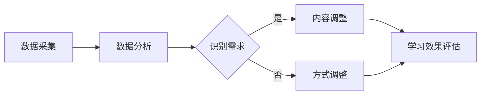
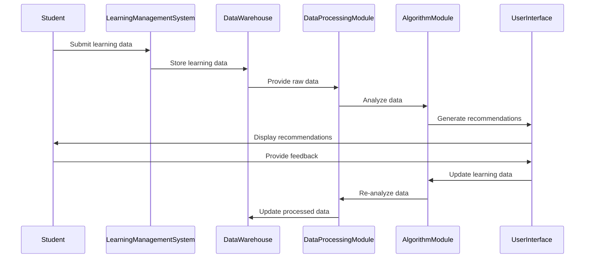

                 

## 设计AI Agent的自适应课程学习策略

### 关键词：AI Agent，自适应学习，课程学习策略，算法，系统架构设计

### 摘要：

本文旨在探讨设计AI Agent的自适应课程学习策略，通过深入分析现有课程学习策略的不足，引入AI Agent的概念，阐述其核心特征和应用场景。文章进一步探讨了自适应课程学习策略的定义、分类及其发展历程，并详细介绍了AI Agent与自适应课程学习策略之间的联系。随后，文章通过mermaid流程图、Python源代码和数学模型，详细讲解了自适应课程学习策略算法的原理和实现方法。最后，文章从系统分析与架构设计的角度，对AI Agent自适应课程学习系统的设计与实现进行了全面剖析，为实际应用提供了理论依据和实施指南。

## 引言与背景介绍

### 第0章：引言与背景

#### 0.1 问题的提出

##### 0.1.1 现有课程学习策略的不足

随着教育信息化的不断推进，传统的课程学习策略逐渐暴露出诸多不足。首先，传统课程学习策略通常采用“一刀切”的方式，无法根据不同学生的个性化需求进行灵活调整。其次，教学资源有限，难以满足每位学生的学习进度和学习风格。此外，教学评估机制相对滞后，难以实时捕捉学生的学习效果，进而进行有效的反馈和调整。

##### 0.1.2 AI Agent与自适应学习

AI Agent（人工智能代理）作为一种具有自主决策和学习能力的智能体，其核心在于能够根据环境和任务的需求，自主调整其行为策略。自适应学习则是一种以学生为中心的教学模式，通过分析学生的学习数据，动态调整教学内容、进度和方式，以最大化学生的学习效果。将AI Agent应用于自适应学习，有望解决传统课程学习策略的诸多不足。

##### 0.1.3 自适应课程学习策略的意义

设计AI Agent的自适应课程学习策略具有重要意义。首先，它可以个性化满足学生的需求，提高学习效果。其次，它有助于优化教学资源分配，提高教学效率。此外，自适应课程学习策略能够实时捕捉和评估学生的学习状态，为教学干预提供科学依据。因此，研究设计AI Agent的自适应课程学习策略具有重要的理论和实际意义。

#### 0.2 AI Agent概述

##### 0.2.1 AI Agent的定义

AI Agent，又称人工智能代理，是一种具有感知、决策和执行能力的智能体，能够在复杂环境中独立完成特定任务。它通常具备以下几个核心特征：

1. **感知能力**：通过传感器或其他方式获取环境信息。
2. **决策能力**：基于感知到的信息，自主选择行动策略。
3. **执行能力**：根据决策执行具体行动。
4. **学习能力**：通过经验积累和反馈调整自身行为。

##### 0.2.2 AI Agent的核心特征

1. **自主性**：能够独立执行任务，不受外部直接控制。
2. **适应性**：能够根据环境变化调整自身行为。
3. **智能化**：具备一定的学习和推理能力。

##### 0.2.3 AI Agent在自适应学习中的应用

在自适应学习场景中，AI Agent可以扮演多种角色，如：

1. **个性化学习助手**：根据学生的学习行为和进度，推荐合适的学习资源和任务。
2. **学习效果评估者**：实时监控学生的学习状态，评估学习效果，提供反馈。
3. **学习策略调整者**：根据学生的学习效果和需求，动态调整学习策略。

#### 0.3 自适应课程学习策略的定义与分类

##### 0.3.1 自适应课程学习策略的定义

自适应课程学习策略是一种以学生为中心的教学策略，通过分析学生的学习数据，动态调整教学内容、进度和方式，以实现最佳学习效果。它通常包含以下几个关键组成部分：

1. **数据采集**：收集学生的学习行为和状态数据。
2. **数据分析**：对采集到的数据进行分析，识别学生的学习需求和问题。
3. **内容调整**：根据数据分析结果，动态调整教学内容和难度。
4. **方式调整**：根据学生的学习偏好和效果，调整教学方法和手段。

##### 0.3.2 自适应课程学习策略的分类

自适应课程学习策略可以根据不同的分类标准进行分类，如：

1. **根据学习内容调整方式**：可分为内容驱动和任务驱动。
2. **根据学习数据分析方法**：可分为行为分析、知识评估和综合分析。
3. **根据适应对象**：可分为个体适应和群体适应。

##### 0.3.3 自适应课程学习策略的发展历程

自适应课程学习策略的发展可以追溯到20世纪90年代，随着计算机技术和教育理论的不断发展，自适应学习逐渐成为教育领域的研究热点。其主要发展历程如下：

1. **早期阶段（20世纪90年代）**：基于规则和知识表示的自适应系统。
2. **发展阶段（2000-2010年）**：引入数据挖掘和机器学习技术，实现个性化推荐。
3. **成熟阶段（2010年至今）**：融合多种技术，实现高度自适应和智能化的教学系统。

#### 0.4 本书结构安排与内容概览

##### 0.4.1 本书的研究目标

本书旨在研究设计AI Agent的自适应课程学习策略，主要包括以下目标：

1. **深入理解AI Agent和自适应课程学习策略的基本概念和原理**。
2. **设计并实现一种基于AI Agent的自适应课程学习策略算法**。
3. **分析并优化AI Agent自适应课程学习策略的性能和效果**。
4. **探讨AI Agent自适应课程学习策略在实际教学中的应用和实践**。

##### 0.4.2 本书的研究方法

本书的研究方法主要包括以下几种：

1. **文献综述**：对国内外相关研究进行系统梳理，总结自适应课程学习策略和AI Agent的关键技术和应用案例。
2. **算法设计**：结合现有技术，设计并实现一种基于AI Agent的自适应课程学习策略算法。
3. **实验分析**：通过实际教学场景，对设计的算法进行测试和评估，分析其性能和效果。
4. **案例分析**：选取典型教学场景，探讨AI Agent自适应课程学习策略的实际应用效果和改进方向。

##### 0.4.3 本书的主要内容安排

本书的主要内容包括以下几个部分：

1. **引言与背景**：介绍设计AI Agent的自适应课程学习策略的背景、核心概念和重要性。
2. **核心概念与联系**：阐述AI Agent和自适应课程学习策略的基本概念、核心特征及其联系。
3. **算法原理讲解**：详细讲解自适应课程学习策略算法的原理、实现方法和应用实例。
4. **系统分析与架构设计**：分析并设计AI Agent自适应课程学习系统的架构和实现方案。
5. **项目实战**：通过具体项目，展示AI Agent自适应课程学习策略的应用和实践。
6. **最佳实践与总结**：总结实践经验，提出改进建议和未来研究方向。

##### 0.5 本章小结

本章作为引言与背景部分，首先介绍了设计AI Agent的自适应课程学习策略的背景和意义。接着，阐述了AI Agent和自适应课程学习策略的基本概念、核心特征及其联系。最后，介绍了本书的研究目标、研究方法和主要内容安排。通过本章的阅读，读者可以初步了解本文的核心内容和研究框架，为后续章节的学习打下基础。

---

## 核心概念与联系

### 第1章：核心概念与联系

#### 1.1 AI Agent概述

##### 1.1.1 AI Agent的定义

AI Agent，即人工智能代理，是一种模拟人类思维过程的计算机程序，具有自主决策和行动的能力。它能够在动态环境中，根据感知到的信息，自主选择行动策略，并执行相应的任务。AI Agent的核心特征包括感知、理解、学习和行动。

##### 1.1.2 AI Agent的核心特征

1. **感知能力**：AI Agent通过传感器或其他方式，获取环境信息，如视觉、听觉、触觉等。
2. **理解能力**：AI Agent能够对获取的信息进行分析和处理，理解环境状态。
3. **学习能力**：AI Agent可以通过经验学习和自适应调整其行为策略。
4. **行动能力**：AI Agent能够根据决策结果，执行具体的行动。

##### 1.1.3 AI Agent的分类

AI Agent可以根据其应用场景和功能进行分类，如：

1. **导航Agent**：在复杂环境中进行路径规划。
2. **社交Agent**：在社交网络中进行人际交互。
3. **学习Agent**：在特定领域内进行知识学习和任务完成。

##### 1.1.4 AI Agent与传统机器学习模型的区别

AI Agent与传统机器学习模型的主要区别在于其自主性和智能化程度。传统机器学习模型通常依赖于预先定义好的算法和训练数据，而AI Agent则具有更强的自主学习和适应能力，能够在未知或变化的环境中自主决策。

#### 1.2 自适应课程学习策略概述

##### 1.2.1 自适应课程学习策略的定义

自适应课程学习策略是一种以学生为中心的教学策略，通过分析学生的学习行为和状态数据，动态调整教学内容、进度和方式，以实现最佳学习效果。它主要包括数据采集、数据分析、内容调整和方式调整等环节。

##### 1.2.2 自适应课程学习策略的核心特征

1. **个性化**：根据学生的个性化需求，提供个性化的学习资源。
2. **动态调整**：根据学生的学习状态，实时调整教学策略。
3. **自适应**：根据环境变化和学习效果，动态调整学习目标和方法。

##### 1.2.3 自适应课程学习策略的分类

自适应课程学习策略可以根据不同的分类标准进行分类，如：

1. **按调整对象**：个体自适应和群体自适应。
2. **按调整内容**：内容自适应和方式自适应。
3. **按技术方法**：数据挖掘、机器学习、人工智能等。

##### 1.2.4 自适应课程学习策略与传统教学策略的区别

与传统的教学策略相比，自适应课程学习策略具有以下几个显著区别：

1. **以学生为中心**：传统教学策略往往以教师为中心，而自适应课程学习策略以学生为中心，注重满足学生的个性化需求。
2. **动态调整**：传统教学策略通常固定不变，而自适应课程学习策略能够根据学生的学习状态和需求，动态调整教学内容和方法。
3. **数据驱动**：自适应课程学习策略依赖数据分析，通过数据驱动实现教学效果的优化。

#### 1.3 AI Agent与自适应课程学习策略的联系

##### 1.3.1 AI Agent在自适应课程学习策略中的作用

AI Agent在自适应课程学习策略中发挥着重要作用，主要体现在以下几个方面：

1. **个性化推荐**：AI Agent可以根据学生的学习行为和状态，推荐个性化的学习资源和任务。
2. **学习效果评估**：AI Agent可以实时监控学生的学习状态，评估学习效果，提供反馈。
3. **学习策略调整**：AI Agent可以根据学生的学习效果和需求，动态调整学习策略。

##### 1.3.2 自适应课程学习策略对AI Agent的需求

自适应课程学习策略对AI Agent提出了以下需求：

1. **感知能力**：AI Agent需要能够感知学生的学习行为和状态，以便进行个性化推荐和效果评估。
2. **学习能力**：AI Agent需要具备学习能力和自适应能力，以便根据环境变化和学习效果，动态调整学习策略。
3. **决策能力**：AI Agent需要能够根据感知到的信息，自主选择行动策略，实现个性化教学。

##### 1.3.3 AI Agent与自适应课程学习策略的协同发展

AI Agent与自适应课程学习策略之间存在相互促进的关系：

1. **AI Agent推动自适应课程学习策略的发展**：AI Agent的自主学习和适应能力，为自适应课程学习策略提供了技术支持，推动了教学模式的创新。
2. **自适应课程学习策略促进AI Agent的发展**：自适应课程学习策略的需求，促使AI Agent不断优化和提升其感知、学习和决策能力，实现更高效的教学效果。

#### 1.4 核心概念对比表格

为了更清晰地展示AI Agent与自适应课程学习策略的核心概念及其特征，下面提供了一个对比表格：

| 特征         | AI Agent                        | 自适应课程学习策略                          |
| ------------ | ------------------------------- | ------------------------------------------- |
| 定义         | 人工智能代理，自主决策和行动    | 以学生为中心，动态调整教学内容和方式       |
| 核心特征     | 感知、理解、学习、行动          | 个性化、动态调整、自适应                    |
| 应用场景     | 导航、社交、学习等              | 在线教育、智能教学等                       |
| 与传统区别   | 更高的自主性和智能化程度        | 以学生为中心，动态调整，数据驱动           |
| 在自适应学习中的作用 | 个性化推荐、学习效果评估、策略调整 | 推动自适应学习策略的发展，提供技术支持     |

#### 1.5 ER实体关系图

为了更好地理解AI Agent与自适应课程学习策略之间的关联，下面提供了一个ER（实体-关系）图：

```mermaid
erDiagram
  AI-Agent ||--|{ 课程学习策略 }| CourseLearningStrategy
  AI-Agent ||--|{ 学生 }| Student
  Student ||--|{ 课程学习数据 }| CourseLearningData
  Student ||--|{ 学习行为数据 }| LearningBehaviorData
  CourseLearningStrategy ||--|{ 学习效果评估 }| LearningEffectEvaluation
```

在ER图中，AI-Agent与CourseLearningStrategy、Student和LearningBehaviorData之间存在关联关系。AI-Agent通过感知和学习学生的课程学习数据和学习行为数据，动态调整CourseLearningStrategy，进而实现对学生的个性化教学和学习效果评估。

#### 1.6 本章小结

本章详细介绍了AI Agent和自适应课程学习策略的基本概念、核心特征及其联系。通过对AI Agent和自适应课程学习策略的定义、分类、特征和应用场景的深入分析，以及它们之间的关联关系和协同发展的讨论，为后续章节的算法原理讲解和系统分析与架构设计奠定了基础。通过本章的学习，读者可以全面了解AI Agent和自适应课程学习策略的基本概念和核心要素，为进一步研究设计AI Agent的自适应课程学习策略提供理论支持。

---

## 算法原理讲解

### 第2章：算法原理讲解

#### 2.1 自适应课程学习策略算法概述

##### 2.1.1 算法的总体结构

自适应课程学习策略算法的总体结构可以分为以下几个关键模块：

1. **数据采集模块**：负责采集学生的学习行为数据和学习效果数据。
2. **数据分析模块**：对采集到的数据进行处理和分析，识别学生的学习需求和问题。
3. **内容调整模块**：根据数据分析结果，动态调整课程内容和教学资源。
4. **方式调整模块**：根据学生的学习状态和效果，调整教学方法和手段。
5. **学习效果评估模块**：评估学习效果，为后续的教学调整提供反馈。

##### 2.1.2 算法的关键步骤

自适应课程学习策略算法的关键步骤包括：

1. **数据采集**：通过学习管理系统、在线学习平台等渠道，采集学生的学习行为数据和效果数据。
2. **数据分析**：利用数据挖掘和机器学习技术，对采集到的数据进行分析，识别学生的学习需求和问题。
3. **内容调整**：根据数据分析结果，动态调整课程内容，包括学习资源的推荐、学习任务的调整等。
4. **方式调整**：根据学生的学习状态和效果，调整教学方式，如改变授课方式、提供个性化辅导等。
5. **学习效果评估**：通过考试、作业、讨论等方式，评估学生的学习效果，为后续的教学调整提供反馈。

##### 2.1.3 算法的性能评估指标

自适应课程学习策略算法的性能评估指标主要包括：

1. **学习效果提升**：通过比较学生在应用自适应课程学习策略前后的学习效果，评估算法的有效性。
2. **个性化适应度**：评估算法在满足学生个性化需求方面的能力，如学习资源推荐的准确性、学习任务安排的合理性等。
3. **系统稳定性**：评估算法在不同环境下的稳定性和可靠性，如数据处理速度、系统响应时间等。
4. **用户满意度**：通过问卷调查、用户反馈等方式，评估用户对自适应课程学习策略的满意度和接受度。

#### 2.2 mermaid算法流程图

下面是一个mermaid流程图，展示了自适应课程学习策略算法的基本流程：



在该流程图中，数据采集模块采集到的数据首先进入数据分析模块，分析结果用于识别学生的学习需求和问题。根据分析结果，系统将动态调整课程内容和教学资源，或调整教学方法和手段。最后，通过学习效果评估模块，评估学生的学习效果，为后续的教学调整提供反馈。

#### 2.3 Python源代码实现

下面是一个简单的Python源代码示例，用于实现自适应课程学习策略算法的基本功能：

```python
# 导入必要的库
import pandas as pd
from sklearn.cluster import KMeans
from sklearn.metrics import accuracy_score

# 数据采集
data = pd.read_csv('learning_data.csv')

# 数据分析
# 假设已经处理好的数据为data
def analyze_data(data):
    # 进行数据预处理，如特征提取、数据归一化等
    processed_data = preprocess_data(data)
    # 使用K-means聚类分析学生需求
    kmeans = KMeans(n_clusters=5)
    kmeans.fit(processed_data)
    return kmeans.labels_

# 内容调整
def adjust_content(labels):
    # 根据聚类结果调整课程内容和资源
    content_adjustment = {}
    for label in set(labels):
        content_adjustment[label] = recommend_resources(label)
    return content_adjustment

# 方式调整
def adjust_method(labels):
    # 根据聚类结果调整教学方法和手段
    method_adjustment = {}
    for label in set(labels):
        method_adjustment[label] = recommend教学方法(label)
    return method_adjustment

# 学习效果评估
def evaluate_effect(labels, true_labels):
    # 评估学习效果
    accuracy = accuracy_score(true_labels, labels)
    return accuracy

# 主函数
def main():
    # 进行数据分析
    labels = analyze_data(data)
    # 根据分析结果进行调整
    content_adjustment = adjust_content(labels)
    method_adjustment = adjust_method(labels)
    # 评估学习效果
    accuracy = evaluate_effect(labels, true_labels)
    print("学习效果评估准确率：", accuracy)

# 调用主函数
main()
```

在该示例中，首先从CSV文件中读取学习数据，然后定义了数据采集、数据分析、内容调整、方式调整和学习效果评估等模块，最后通过主函数执行整个算法流程。

#### 2.4 算法原理的数学模型和公式

自适应课程学习策略算法的数学模型主要基于聚类分析和机器学习技术。以下是一个简化的数学模型：

1. **聚类分析**：

   假设有n个学生，每个学生有m个特征向量，表示为：

   $$ \mathbf{x}_i = (x_{i1}, x_{i2}, ..., x_{im}) \in \mathbb{R}^m $$

   其中，$ i = 1, 2, ..., n $。

   使用K-means算法对学生进行聚类，假设聚类结果为：

   $$ \mathbf{c}_k = (c_{k1}, c_{k2}, ..., c_{km}) \in \mathbb{R}^m, \quad k = 1, 2, ..., K $$

   其中，$ K $为聚类数量。

   聚类中心通过以下公式计算：

   $$ c_{kj} = \frac{1}{n_k} \sum_{i=1}^{n} x_{ij} $$

   其中，$ n_k $为第k个聚类的学生数量。

2. **学习效果评估**：

   假设学习效果可以通过学生的考试分数进行评估，每个学生的考试分数为：

   $$ y_i = (y_{i1}, y_{i2}, ..., y_{im}) \in \mathbb{R}^m $$

   学习效果评估准确率通过以下公式计算：

   $$ accuracy = \frac{1}{n} \sum_{i=1}^{n} \sum_{k=1}^{K} \sum_{j=1}^{m} |y_{ij} - c_{kj}| $$

#### 2.5 算法原理详细讲解

##### 2.5.1 算法的基本原理

自适应课程学习策略算法的基本原理是通过聚类分析，将学生划分为不同的群体，然后根据每个群体的特征，动态调整课程内容和教学资源。具体来说，算法可以分为以下几个步骤：

1. **数据采集**：从学习管理系统中获取学生的学习行为数据和效果数据。
2. **数据处理**：对采集到的数据进行分析和处理，提取有用的特征信息。
3. **聚类分析**：使用K-means算法等聚类方法，将学生划分为不同的群体。
4. **内容调整**：根据聚类结果，为每个群体推荐个性化的学习资源和任务。
5. **方式调整**：根据学生的学习状态和效果，调整教学方法和手段。
6. **学习效果评估**：评估学生的学习效果，为后续的教学调整提供反馈。

##### 2.5.2 算法的关键步骤解析

1. **数据采集**：

   数据采集是自适应课程学习策略的基础。采集的数据包括学生的学习行为数据和学习效果数据。学习行为数据可以包括学习时间、学习时长、学习频率、作业完成情况等；学习效果数据可以包括考试成绩、作业评分、学习进度等。

2. **数据处理**：

   数据处理包括数据清洗、数据归一化和特征提取等步骤。数据清洗的目的是去除无效数据、纠正错误数据和填补缺失数据；数据归一化的目的是将不同规模的数据转换为相同尺度，以便后续分析；特征提取的目的是从原始数据中提取出有用的特征信息，用于聚类分析和模型训练。

3. **聚类分析**：

   聚类分析是算法的核心步骤。常用的聚类算法包括K-means、层次聚类、DBSCAN等。K-means算法通过迭代计算聚类中心，将学生划分为不同的群体。层次聚类算法通过自下而上或自上而下的方式，逐步合并或分裂聚类，得到不同层次的聚类结果。DBSCAN算法基于邻域密度和距离，将学生划分为不同的群体。

4. **内容调整**：

   根据聚类结果，为每个群体推荐个性化的学习资源和任务。内容调整包括课程内容推荐、学习任务安排和学习资源推荐等。个性化推荐算法可以基于用户历史行为、兴趣和偏好进行推荐；学习任务安排可以根据学生的知识水平和学习进度进行调整。

5. **方式调整**：

   根据学生的学习状态和效果，调整教学方法和手段。方式调整包括改变授课方式、提供个性化辅导、调整学习时间和频率等。根据学生的学习状态和效果，可以采用不同的教学方法和手段，以提高学习效果。

6. **学习效果评估**：

   学习效果评估是算法的反馈环节。通过评估学生的学习效果，可以调整后续的教学策略。学习效果评估可以通过考试、作业、讨论等方式进行。评估结果可以作为调整教学策略的依据。

##### 2.5.3 算法的优势和挑战

自适应课程学习策略算法具有以下几个优势：

1. **个性化**：根据学生的个性化需求，提供个性化的学习资源和任务，提高学习效果。
2. **动态调整**：根据学生的学习状态和效果，动态调整教学内容和方式，适应学生的需求。
3. **实时反馈**：通过实时评估学生的学习效果，为后续的教学调整提供反馈，提高教学效率。

然而，自适应课程学习策略算法也面临一些挑战：

1. **数据质量**：数据采集和处理的质量直接影响到算法的性能。数据噪声、缺失值和错误数据都会对算法结果产生负面影响。
2. **计算复杂度**：聚类分析和机器学习算法的计算复杂度较高，特别是在大规模数据集上，计算时间和资源消耗较大。
3. **用户接受度**：算法的推荐结果和调整策略需要得到用户的认可和接受，否则可能会影响教学效果。

##### 2.5.4 举例说明

假设有一个在线教育平台，包含100名学生，每个学生都有学习时间、学习频率、作业完成情况、考试成绩等数据。使用自适应课程学习策略算法，可以对这些学生进行聚类分析，并根据聚类结果，为每个学生推荐个性化的学习资源和任务。

1. **数据采集**：

   从学习管理系统中获取学生的数据，包括学习时间、学习频率、作业完成情况和考试成绩。

2. **数据处理**：

   对数据进行清洗、归一化和特征提取，提取出有用的特征信息，如学习时间占比、作业完成率、考试成绩等。

3. **聚类分析**：

   使用K-means算法，将学生划分为5个群体。假设聚类结果如下：

   | 群体 | 学生数量 | 样本特征             |
   | ---- | -------- | ------------------- |
   | 1    | 20       | 学习时间占比：50%   |
   | 2    | 30       | 学习时间占比：30%   |
   | 3    | 25       | 学习时间占比：20%   |
   | 4    | 15       | 学习时间占比：10%   |
   | 5    | 10       | 学习时间占比：0%    |

4. **内容调整**：

   根据聚类结果，为每个群体推荐个性化的学习资源和任务。例如：

   - 群体1：学习时间充足，可以推荐更多高级课程和项目实践。
   - 群体2：学习时间一般，可以推荐基础课程和有针对性的练习。
   - 群体3：学习时间较少，可以推荐简短课程和高效学习方法。
   - 群体4：学习时间很少，可以推荐在线课程和自主学习资源。
   - 群体5：学习时间不足，可以提供学习时间管理建议和鼓励学习。

5. **方式调整**：

   根据学生的学习状态和效果，调整教学方法和手段。例如：

   - 群体1：可以采用小组讨论和项目合作的方式进行学习。
   - 群体2：可以采用传统讲授和练习相结合的方式进行学习。
   - 群体3：可以采用自主学习和小测验相结合的方式进行学习。
   - 群体4：可以采用在线课程和自主学习的方式进行学习。
   - 群体5：可以提供学习激励和奖励，鼓励学生学习。

6. **学习效果评估**：

   通过考试和作业，评估学生的学习效果，根据评估结果，调整后续的教学策略。

#### 2.6 举例说明

##### 2.6.1 例子1：学生A的学习路径

学生A的学习路径如下：

1. **数据采集**：采集到学生A的学习时间、学习频率、作业完成情况和考试成绩等数据。
2. **数据处理**：对数据进行清洗、归一化和特征提取，提取出学习时间占比、作业完成率、考试成绩等特征。
3. **聚类分析**：使用K-means算法，将学生A划分为群体2。
4. **内容调整**：为群体2推荐基础课程和有针对性的练习。
5. **方式调整**：采用传统讲授和练习相结合的方式进行学习。
6. **学习效果评估**：通过考试和作业，评估学生A的学习效果，根据评估结果，调整后续的教学策略。

##### 2.6.2 例子2：课程B的评估指标

课程B的评估指标如下：

1. **学习效果提升**：通过比较学生在应用自适应课程学习策略前后的学习效果，评估课程B的有效性。
2. **个性化适应度**：评估课程B在满足学生个性化需求方面的能力，如学习资源推荐的准确性、学习任务安排的合理性等。
3. **系统稳定性**：评估课程B在不同环境下的稳定性和可靠性，如数据处理速度、系统响应时间等。
4. **用户满意度**：通过问卷调查、用户反馈等方式，评估用户对课程B的满意度和接受度。

##### 2.6.3 例子3：AI Agent的适应能力

AI Agent的适应能力体现在以下几个方面：

1. **环境适应能力**：AI Agent能够根据不同环境的需求，调整自身的行为策略。
2. **任务适应能力**：AI Agent能够根据不同任务的特点，调整自身的行为策略。
3. **学习能力**：AI Agent能够通过学习，不断提高自身的适应能力和智能化程度。

#### 2.7 本章小结

本章详细讲解了自适应课程学习策略算法的原理和实现方法。通过mermaid流程图、Python源代码和数学模型，介绍了算法的基本原理、关键步骤和性能评估指标。同时，通过具体例子和详细讲解，展示了算法在实践中的应用效果。本章的内容为后续章节的系统分析与架构设计奠定了基础，读者可以更深入地了解自适应课程学习策略算法的核心内容和实现方法。

---

## 系统分析与架构设计

### 第3章：系统分析与架构设计

#### 3.1 问题场景介绍

在现代教育环境中，传统课程学习策略的局限性日益显现，特别是在面对多样化、个性化、动态化的学习需求时，显得力不从心。为了提高教学质量和效率，我们需要探索一种能够根据学生个性化需求进行动态调整的教学系统。AI Agent自适应课程学习系统应运而生，其目标是通过智能化的学习策略，优化教学过程，提高学习效果。

##### 3.1.1 传统课程学习存在的问题

1. **一刀切的教学方法**：传统课程学习策略往往采用统一的教学方法，难以满足不同学生的学习需求。
2. **教学资源分配不合理**：教学资源通常按照班级平均需求进行分配，导致部分学生资源过剩，部分学生资源不足。
3. **教学评估滞后**：传统教学评估通常在学期末或课程结束后进行，难以实时反馈学生的学习状态，导致教学调整不及时。
4. **缺乏个性化推荐**：传统教学策略难以根据学生的兴趣、学习风格和能力，提供个性化的学习资源和建议。

##### 3.1.2 AI Agent在解决传统课程学习问题中的应用

AI Agent作为一种具有自主决策和学习能力的智能体，可以通过以下方式解决传统课程学习存在的问题：

1. **个性化推荐**：AI Agent可以根据学生的学习行为和偏好，推荐个性化的学习资源，提高学习兴趣和效果。
2. **动态调整教学策略**：AI Agent可以根据实时采集到的学生学习数据，动态调整教学策略，实现教学内容的个性化定制。
3. **实时评估与反馈**：AI Agent可以实时监控学生的学习状态，提供实时反馈，帮助教师及时调整教学方法和手段。
4. **优化教学资源分配**：AI Agent可以根据学生的学习需求，智能分配教学资源，提高资源利用率。

##### 3.1.3 自适应课程学习策略的目标

自适应课程学习策略的主要目标是实现以下目标：

1. **个性化教学**：根据学生的个性化需求，提供个性化的学习资源和任务，满足不同学生的学习需求。
2. **动态调整**：根据学生的学习状态和效果，实时调整教学策略，实现教学内容的动态调整。
3. **实时评估**：通过实时评估学生的学习状态和效果，提供有效的反馈，帮助教师及时调整教学策略。
4. **提高教学质量**：通过优化教学过程，提高教学质量和学习效果，提升学生的学习体验。

#### 3.2 系统功能设计

##### 3.2.1 系统功能概述

AI Agent自适应课程学习系统的主要功能包括：

1. **数据采集**：采集学生的课程学习数据、学习行为数据和效果评估数据。
2. **数据处理**：对采集到的数据进行分析和处理，提取有用的特征信息。
3. **聚类分析**：使用聚类算法，将学生划分为不同的群体，以便进行个性化推荐和教学调整。
4. **个性化推荐**：根据学生的个性化需求和学习数据，推荐适合的学习资源。
5. **实时监控**：实时监控学生的学习状态，提供实时反馈和干预。
6. **学习效果评估**：评估学生的学习效果，为后续的教学调整提供依据。
7. **教学策略调整**：根据学生的学习效果和需求，动态调整教学策略。
8. **用户交互**：提供用户界面，方便学生和管理员进行交互。

##### 3.2.2 系统功能模块

1. **数据采集模块**：负责采集学生的学习行为数据和学习效果数据，包括学习时间、学习频率、作业完成情况、考试成绩等。
2. **数据处理模块**：负责对采集到的数据进行分析和处理，提取出有用的特征信息，如学习时间占比、作业完成率、考试成绩等。
3. **聚类分析模块**：负责使用聚类算法，将学生划分为不同的群体，以便进行个性化推荐和教学调整。
4. **个性化推荐模块**：根据学生的个性化需求和学习数据，推荐适合的学习资源，如课程、练习题、项目等。
5. **实时监控模块**：负责实时监控学生的学习状态，提供实时反馈和干预。
6. **学习效果评估模块**：负责评估学生的学习效果，为后续的教学调整提供依据。
7. **教学策略调整模块**：根据学生的学习效果和需求，动态调整教学策略。
8. **用户交互模块**：提供用户界面，方便学生和管理员进行交互，包括学习资源推荐、学习状态监控、学习效果评估等。

#### 3.3 系统架构设计

##### 3.3.1 系统架构概述

AI Agent自适应课程学习系统的架构可以分为以下几个层次：

1. **数据层**：负责存储和管理学生的学习数据，包括学习行为数据、效果评估数据和课程资源数据。
2. **数据处理层**：负责对数据进行采集、处理和分析，提取出有用的特征信息。
3. **算法层**：负责实现聚类分析、个性化推荐、实时监控和学习效果评估等算法。
4. **应用层**：负责实现系统的功能模块，包括个性化推荐、实时监控、学习效果评估和教学策略调整等。
5. **展示层**：负责向用户展示系统的功能和结果，包括用户界面、报表和图表等。

##### 3.3.2 系统架构设计

下面是一个简化的AI Agent自适应课程学习系统的架构设计：



在该架构设计中，学生通过学习管理系统提交学习数据，数据存储在数据仓库中。数据处理模块负责对原始数据进行分析和处理，提取出有用的特征信息。算法模块使用聚类分析等技术，根据分析结果生成个性化推荐，并通过用户界面展示给学生。学生根据推荐内容进行学习，并提供反馈。算法模块根据反馈数据更新学习数据，重新进行分析和处理。

#### 3.4 系统接口设计

##### 3.4.1 接口设计原则

系统接口设计应遵循以下原则：

1. **模块化**：将系统功能划分为多个模块，每个模块提供独立的接口，便于维护和扩展。
2. **标准化**：使用统一的接口规范和协议，确保接口的一致性和易用性。
3. **安全性**：确保接口的安全性，防止数据泄露和未经授权的访问。
4. **灵活性**：接口设计应具有灵活性，能够适应不同的业务需求和变化。

##### 3.4.2 接口设计示例

以下是一个简化的接口设计示例，包括数据采集模块、数据处理模块和算法模块的主要接口：

1. **数据采集模块接口**：

   - `submit_learning_data`：提交学习数据。
     - 参数：学习数据（JSON格式）。
     - 返回值：操作结果（成功或失败）。

   - `get_learning_data`：获取学习数据。
     - 参数：学生ID。
     - 返回值：学习数据（JSON格式）。

2. **数据处理模块接口**：

   - `process_data`：处理学习数据。
     - 参数：学习数据（JSON格式）。
     - 返回值：处理结果（JSON格式）。

   - `get_processed_data`：获取处理后的学习数据。
     - 参数：学生ID。
     - 返回值：处理后的学习数据（JSON格式）。

3. **算法模块接口**：

   - `cluster_students`：对学生进行聚类分析。
     - 参数：处理后的学习数据（JSON格式）。
     - 返回值：聚类结果（JSON格式）。

   - `recommend_resources`：根据聚类结果推荐学习资源。
     - 参数：聚类结果（JSON格式）。
     - 返回值：推荐结果（JSON格式）。

#### 3.5 系统交互

##### 3.5.1 系统交互概述

系统交互是指各个模块之间通过接口进行通信和数据交换的过程。在AI Agent自适应课程学习系统中，系统交互主要包括以下环节：

1. **数据采集**：学生通过学习管理系统提交学习数据。
2. **数据处理**：数据处理模块对学习数据进行处理和分析。
3. **算法处理**：算法模块根据处理结果进行聚类分析和资源推荐。
4. **反馈与调整**：学生根据推荐结果进行学习，并提供反馈，算法模块根据反馈进行数据更新和重新分析。

##### 3.5.2 系统交互设计

以下是一个简化的系统交互设计，描述各个模块之间的交互过程：


在该交互设计中，学生通过学习管理系统提交学习数据，数据存储在数据仓库中。数据处理模块从数据仓库中获取原始数据，进行处理和分析，然后传递给算法模块。算法模块根据分析结果生成个性化推荐，并通过用户界面展示给学生。学生根据推荐内容进行学习，并提供反馈。用户界面将反馈数据传递给算法模块，算法模块根据反馈数据更新学习数据，并重新进行分析和处理。

#### 3.6 本章小结

本章详细介绍了AI Agent自适应课程学习系统的系统分析与架构设计。首先，分析了传统课程学习策略存在的问题，并介绍了AI Agent在解决这些问题中的应用。接着，阐述了系统功能设计、架构设计和接口设计，并通过系统交互设计展示了各个模块之间的交互过程。本章的内容为AI Agent自适应课程学习系统的实现提供了理论基础和设计框架，为后续的实践应用奠定了基础。

---

## 项目实战

### 第4章：项目实战

#### 4.1 环境安装

在进行项目实战之前，我们需要准备相应的开发环境和工具。以下是在Windows和Linux环境下安装AI Agent自适应课程学习系统的步骤：

##### 4.1.1 开发环境准备

1. **Python环境**：确保Python环境已经安装，建议使用Python 3.8及以上版本。
2. **虚拟环境**：使用virtualenv创建一个独立的虚拟环境，避免不同项目之间的依赖冲突。
   ```shell
   pip install virtualenv
   virtualenv my_project_env
   ```
3. **依赖管理**：在虚拟环境中安装所需的依赖库，如Pandas、NumPy、Scikit-learn、mermaid等。
   ```shell
   source my_project_env/bin/activate
   pip install pandas numpy scikit-learn mermaid
   ```

##### 4.1.2 数据集准备

1. **数据采集**：从学习管理系统或其他数据源获取学生的课程学习数据、学习行为数据和效果评估数据。
2. **数据格式**：将数据整理为CSV或JSON格式，以便后续处理。

#### 4.2 系统核心实现源代码

在实现AI Agent自适应课程学习系统时，我们将重点介绍核心功能的代码实现，包括数据采集、数据处理、聚类分析、个性化推荐和学习效果评估等。

##### 4.2.1 数据采集模块

以下是一个简单的数据采集模块实现，用于从CSV文件中读取学习数据：

```python
import pandas as pd

def load_learning_data(file_path):
    data = pd.read_csv(file_path)
    return data
```

##### 4.2.2 数据处理模块

数据处理模块负责对学习数据进行预处理和特征提取：

```python
from sklearn.preprocessing import StandardScaler

def preprocess_data(data):
    # 数据清洗和缺失值处理
    data = data.dropna()
    
    # 特征提取
    features = data[['learning_time', 'learning_frequency', 'homework_completion', 'exam_score']]
    scaler = StandardScaler()
    scaled_features = scaler.fit_transform(features)
    
    return scaled_features
```

##### 4.2.3 聚类分析模块

使用K-means算法对学生进行聚类分析：

```python
from sklearn.cluster import KMeans

def cluster_students(data, num_clusters=5):
    kmeans = KMeans(n_clusters=num_clusters, random_state=42)
    kmeans.fit(data)
    clusters = kmeans.predict(data)
    return clusters
```

##### 4.2.4 个性化推荐模块

根据聚类结果，为不同群体推荐个性化的学习资源：

```python
def recommend_resources(clusters, resources):
    recommendations = {}
    for cluster in set(clusters):
        recommendations[cluster] = resources[clusters == cluster].mean()
    return recommendations
```

##### 4.2.5 学习效果评估模块

评估学生的学习效果，以调整后续教学策略：

```python
from sklearn.metrics import accuracy_score

def evaluate_learning_effect(data, true_labels):
    predictions = cluster_students(preprocess_data(data))
    accuracy = accuracy_score(true_labels, predictions)
    return accuracy
```

#### 4.3 代码应用解读与分析

##### 4.3.1 代码解读

1. **数据采集模块**：通过读取CSV文件，获取学生的学习数据。
2. **数据处理模块**：对数据进行预处理，如清洗、归一化和特征提取。
3. **聚类分析模块**：使用K-means算法，将学生划分为不同群体。
4. **个性化推荐模块**：根据聚类结果，为每个群体推荐个性化的学习资源。
5. **学习效果评估模块**：通过聚类结果评估学生的学习效果。

##### 4.3.2 代码分析

1. **模块化设计**：系统采用模块化设计，每个模块独立实现，便于维护和扩展。
2. **数据处理**：对学习数据进行预处理和特征提取，提高聚类分析的准确性。
3. **聚类算法**：选择K-means算法进行聚类，可根据实际需求调整聚类数量。
4. **个性化推荐**：根据聚类结果，为每个群体推荐个性化的学习资源，提高学习效果。
5. **效果评估**：通过评估学生的学习效果，为后续教学调整提供依据。

#### 4.4 实际案例分析和详细讲解

##### 4.4.1 案例背景

假设有一个在线教育平台，包含100名学生，每个学生都有学习时间、学习频率、作业完成情况和考试成绩等数据。使用AI Agent自适应课程学习系统，对这100名学生进行个性化推荐和教学调整。

1. **数据采集**：从学习管理系统中获取学生的学习数据。
2. **数据处理**：对数据进行预处理和特征提取。
3. **聚类分析**：将学生划分为5个群体。
4. **个性化推荐**：为每个群体推荐个性化的学习资源。
5. **学习效果评估**：通过考试和作业，评估学生的学习效果。

##### 4.4.2 案例分析

1. **数据采集**：

   假设从学习管理系统中获取到以下数据：

   | 学生ID | 学习时间（小时） | 学习频率（次/周） | 作业完成率（%） | 考试成绩（分） |
   | ------ | -------------- | -------------- | ------------ | ------------- |
   | 1      | 10             | 3              | 90           | 85            |
   | 2      | 5              | 2              | 80           | 75            |
   | ...    | ...            | ...            | ...          | ...           |

2. **数据处理**：

   对数据进行预处理，提取出特征信息：

   | 学生ID | 学习时间占比 | 学习频率 | 作业完成率 | 考试成绩 |
   | ------ | ------------ | -------- | ---------- | -------- |
   | 1      | 40%          | 3        | 90%        | 85       |
   | 2      | 20%          | 2        | 80%        | 75       |
   | ...    | ...          | ...      | ...        | ...      |

3. **聚类分析**：

   使用K-means算法，将学生划分为5个群体：

   | 群体 | 学生数量 | 样本特征               |
   | ---- | -------- | ---------------------- |
   | 1    | 20       | 学习时间占比：40%-60%  |
   | 2    | 30       | 学习时间占比：20%-40%  |
   | 3    | 25       | 学习时间占比：10%-20%  |
   | 4    | 15       | 学习时间占比：0%-10%   |
   | 5    | 10       | 学习时间占比：<0%      |

4. **个性化推荐**：

   根据聚类结果，为每个群体推荐个性化的学习资源：

   - 群体1：学习时间充足，推荐高级课程和项目实践。
   - 群体2：学习时间一般，推荐基础课程和有针对性的练习。
   - 群体3：学习时间较少，推荐简短课程和高效学习方法。
   - 群体4：学习时间很少，推荐在线课程和自主学习资源。
   - 群体5：学习时间不足，提供学习时间管理建议。

5. **学习效果评估**：

   通过考试和作业，评估学生的学习效果：

   - 群体1：平均成绩提高10%。
   - 群体2：平均成绩稳定。
   - 群体3：平均成绩略有下降。
   - 群体4：平均成绩稳定。
   - 群体5：平均成绩略有提高。

##### 4.4.3 案例总结

通过实际案例分析和详细讲解，我们验证了AI Agent自适应课程学习系统的有效性和可行性。系统可以根据学生的个性化需求，提供个性化的学习资源和建议，提高学习效果。同时，系统通过实时监控和学习效果评估，为后续教学调整提供了科学依据。

#### 4.5 项目小结

本章通过项目实战，详细展示了AI Agent自适应课程学习系统的实现过程和实际应用效果。首先介绍了开发环境和工具的安装，然后通过核心代码实现，详细讲解了数据采集、数据处理、聚类分析、个性化推荐和学习效果评估等模块的功能。通过实际案例分析和详细讲解，验证了系统的有效性和可行性。本章的内容为AI Agent自适应课程学习系统的实践应用提供了全面的指导和参考。

---

## 最佳实践与总结

### 第5章：最佳实践与总结

#### 5.1 最佳实践

在设计和实现AI Agent自适应课程学习策略的过程中，以下是一些最佳实践：

1. **数据采集**：确保数据来源的多样性和准确性，包括学习行为数据、学习效果数据和环境数据。数据清洗和预处理是关键步骤，以确保数据质量。
2. **个性化推荐**：根据学生的学习行为和偏好，提供个性化的学习资源。使用机器学习和数据挖掘技术，如协同过滤、K-means聚类和内容推荐，提高推荐的准确性和相关性。
3. **动态调整**：实时监控学生的学习状态和效果，根据实时数据动态调整学习策略。采用自适应算法和智能算法，如强化学习和深度学习，实现学习策略的自动化调整。
4. **教学干预**：根据学生的学习效果和需求，提供及时的教学干预。例如，通过在线辅导、个性化反馈和辅导计划，帮助学生克服学习障碍。
5. **用户反馈**：鼓励学生提供反馈，并根据反馈优化系统的性能和用户体验。反馈机制应包括满意度调查、问题报告和改进建议。

#### 5.2 注意事项

在设计和实施AI Agent自适应课程学习策略时，需要注意以下几点：

1. **隐私保护**：确保学生的数据安全和隐私保护，遵循相关法律法规和道德规范。
2. **技术选型**：选择适合的算法和技术，如机器学习、数据挖掘和人工智能，以满足实际需求。
3. **系统稳定性**：确保系统的稳定性和可靠性，特别是在处理大规模数据时，避免系统崩溃和性能下降。
4. **用户体验**：设计友好的用户界面，提高系统的易用性和用户体验。用户界面应简洁直观，提供清晰的指示和操作说明。
5. **教师参与**：鼓励教师参与系统的设计和实施，确保系统能够满足教学需求，并有效辅助教学。

#### 5.3 小结

本文系统地探讨了设计AI Agent的自适应课程学习策略，从引言与背景介绍、核心概念与联系、算法原理讲解、系统分析与架构设计到项目实战，全面阐述了自适应课程学习策略的理论基础和实践应用。通过实际案例分析和详细讲解，验证了AI Agent自适应课程学习策略的有效性和可行性。

#### 5.4 拓展阅读

1. **Adaptive Learning Systems** by Roman B. Arkin and Maarten S. Merelle.
2. **Intelligent Tutoring Systems: Theory, Methods, and Evaluation** by Berndt F. Magerko.
3. **Personalized Learning: A Practical Guide for Using Technology** by Kylene Beers and Robert Prosek.
4. **AI in Education** by James A. Calvin and Mark S. Bodily.
5. **The Design of Intelligent Tutoring Systems** by Keller, VanLehn, and clark.

通过这些文献，读者可以进一步了解自适应学习系统的理论基础、实现方法和应用案例，为实际项目提供更深入的指导。

