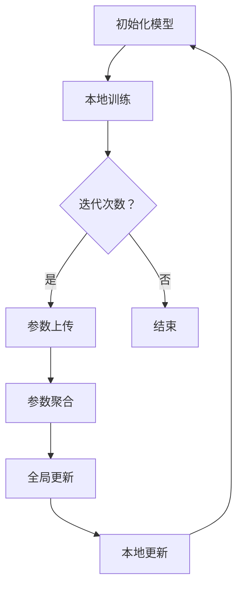
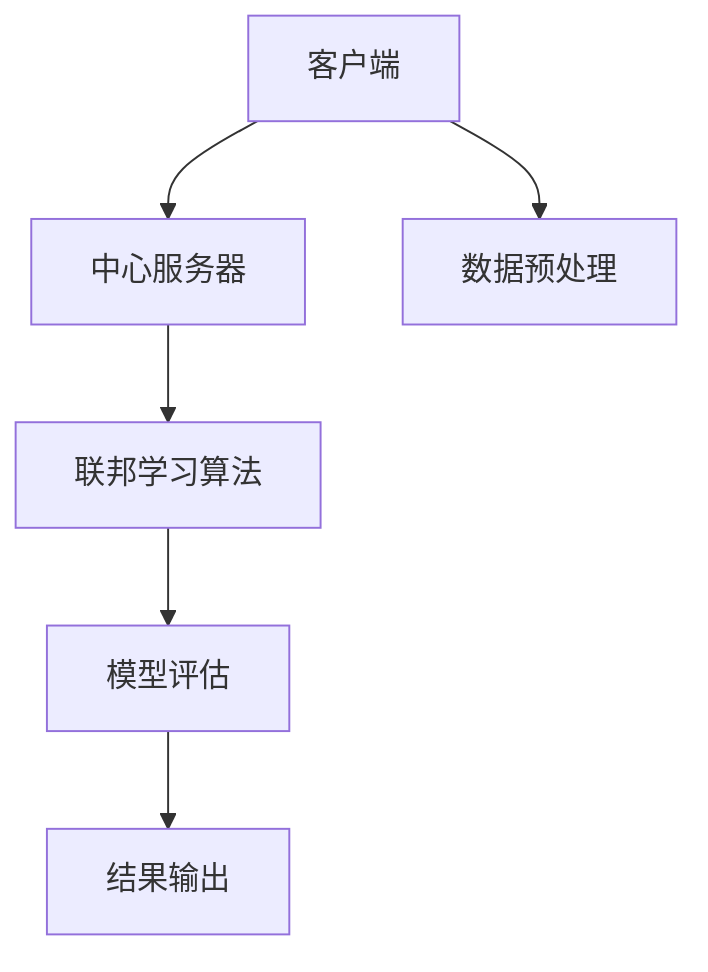
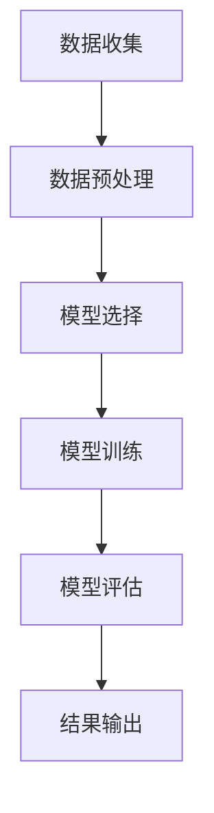

                 

### 让我们一步一步思考：设计基于联邦学习的跨行业信用评分系统

#### 3.3 联邦学习解决信用评分挑战的原理

**背景介绍**

在传统信用评分系统中，金融机构通常需要收集客户的个人信息、财务状况、历史信用记录等数据，然后通过统计模型或机器学习算法进行分析，以预测客户的信用风险。然而，这种方法面临以下几个主要挑战：

1. **数据隐私问题**：金融机构的客户数据通常包含敏感信息，如收入、信用记录等，直接共享这些数据可能会导致隐私泄露的问题。
2. **数据质量和标准化问题**：不同金融机构的数据格式和标准可能不一致，导致数据预处理和融合的难度增加。
3. **模型复杂性和适应性问题**：传统模型需要大量的训练数据，且对数据质量要求较高，不同行业的数据特征差异较大，使得模型难以泛化到不同行业。

**核心概念与联系**

联邦学习（Federated Learning）是一种分布式机器学习技术，它允许多个机构在保持数据本地存储的情况下共享模型参数，共同训练一个全局模型。联邦学习的核心原理可以概括为以下几方面：

1. **客户端数据加密与本地更新**：联邦学习通过加密算法确保数据在本地加密存储，各机构仅共享加密后的模型更新。
2. **模型参数的聚合与更新**：通过聚合多个客户端的模型更新，得到全局模型的更新。
3. **差分隐私与模型安全**：联邦学习采用差分隐私技术，防止任何单个机构通过全局模型推断出其他机构的敏感数据。

**算法原理讲解**

联邦学习的算法流程可以简化为以下几个步骤：

1. **初始化**：设置全局模型和迭代次数。
2. **本地训练**：每个机构在本地训练模型，更新本地模型参数。
3. **参数聚合**：将每个机构的本地模型参数上传到中心服务器。
4. **全局更新**：中心服务器对上传的模型参数进行聚合，更新全局模型。
5. **本地更新**：每个机构使用最新的全局模型参数进行本地更新。

以下是一个简化的联邦学习算法流程的Mermaid流程图：

在联邦学习中，参数聚合通常采用平均方法或加权平均方法。例如，对于第t轮迭代的聚合，可以表示为：

$$
\theta_t = \frac{1}{N} \sum_{i=1}^{N} \theta_i^t
$$

其中，\( \theta_t \) 是全局模型参数，\( N \) 是参与联邦学习的机构数量，\( \theta_i^t \) 是第i个机构的本地模型参数。

**系统分析与架构设计方案**

为了实现基于联邦学习的跨行业信用评分系统，我们可以设计如下架构：

1. **问题场景介绍**：多个金融机构希望共同开发一个跨行业的信用评分系统，但每个机构的数据都是敏感的，不能直接共享。
2. **系统功能设计**：系统功能包括数据预处理、联邦学习模型训练、模型评估和结果输出。
3. **系统架构设计**：系统采用分布式架构，包括客户端、中心服务器和联邦学习算法模块。
4. **系统接口设计和系统交互**：系统提供API接口供金融机构接入，并通过网络交互进行模型训练和数据传输。

以下是一个简化的系统架构的Mermaid架构图：

**项目实战**

在实际项目中，我们需要以下步骤：

1. **环境安装**：搭建联邦学习环境，安装必要的库和依赖。
2. **系统核心实现源代码**：实现联邦学习模型训练的核心代码。
3. **代码应用解读与分析**：分析代码逻辑和原理，确保理解联邦学习的核心步骤。
4. **实际案例分析和详细讲解剖析**：通过实际案例展示联邦学习在信用评分中的应用，并进行详细剖析。
5. **项目小结**：总结项目经验和教训，为后续工作提供参考。

**最佳实践 tips**

- **数据预处理**：在联邦学习之前，确保对数据进行充分预处理，包括数据清洗、归一化和特征提取。
- **模型选择**：根据实际需求选择合适的机器学习模型，如逻辑回归、决策树、神经网络等。
- **安全性和隐私性**：在联邦学习过程中，注意数据加密和模型安全，防止信息泄露。

**小结**

设计基于联邦学习的跨行业信用评分系统是一项复杂但具有巨大潜力的任务。通过联邦学习，我们可以解决传统信用评分系统中的数据隐私和模型适应性问题，为金融机构提供更高效、准确的信用评分服务。未来，随着联邦学习技术的不断发展，我们将看到更多创新的应用场景。

**注意事项**

- **合规性**：在设计系统时，务必遵守相关法律法规，特别是数据隐私保护和消费者权益保护。
- **可扩展性**：系统设计应考虑可扩展性，以便未来能够集成更多金融机构和数据源。

**拓展阅读**

- 《联邦学习：原理、算法与应用》
- 《机器学习：概率视角》
- 《信用评分：理论与实践》

---

作者：AI天才研究院/AI Genius Institute & 禅与计算机程序设计艺术 /Zen And The Art of Computer Programming## 第3章：联邦学习在信用评分中的应用原理

### 3.1 联邦学习与信用评分的结合

在现代社会中，信用评分作为金融机构评估客户信用风险的重要工具，已经广泛应用于贷款、信用卡、租房、保险等多个领域。然而，传统的信用评分方法在应对日益复杂的数据环境和日益严格的隐私保护法规时，面临诸多挑战。为了解决这些问题，联邦学习（Federated Learning）技术应运而生。

联邦学习是一种分布式机器学习技术，它允许多个机构在保持数据本地存储的情况下共享模型参数，共同训练一个全局模型。这种技术能够有效地解决数据隐私问题，使得金融机构可以在不泄露敏感数据的前提下，利用其他机构的模型参数来优化自己的信用评分模型。具体来说，联邦学习与信用评分的结合主要体现在以下几个方面：

1. **数据隐私保护**：联邦学习通过加密和本地训练技术，确保各机构的数据在本地加密存储，仅共享加密后的模型更新，从而避免了敏感数据泄露的风险。
2. **数据集成和标准化**：联邦学习允许各机构使用自己的数据，通过共享模型参数的方式实现数据集成和标准化，避免了因数据格式不一致导致的预处理难题。
3. **模型优化和适应性**：联邦学习通过跨机构的协同训练，使得模型能够更好地适应不同行业和数据特征，提高信用评分的准确性和泛化能力。

### 3.2 联邦学习解决信用评分挑战的原理

在传统的信用评分系统中，金融机构通常需要收集客户的个人信息、财务状况、历史信用记录等数据，然后通过统计模型或机器学习算法进行分析，以预测客户的信用风险。然而，这种方法存在以下几个主要挑战：

1. **数据隐私问题**：金融机构的客户数据通常包含敏感信息，如收入、信用记录等，直接共享这些数据可能会导致隐私泄露的问题。
2. **数据质量和标准化问题**：不同金融机构的数据格式和标准可能不一致，导致数据预处理和融合的难度增加。
3. **模型复杂性和适应性问题**：传统模型需要大量的训练数据，且对数据质量要求较高，不同行业的数据特征差异较大，使得模型难以泛化到不同行业。

联邦学习通过以下方式解决这些挑战：

1. **数据隐私保护**：联邦学习采用差分隐私技术，确保各机构的数据在本地加密存储，仅共享加密后的模型更新，从而避免了敏感数据泄露的风险。
2. **数据集成和标准化**：联邦学习允许各机构使用自己的数据，通过共享模型参数的方式实现数据集成和标准化，避免了因数据格式不一致导致的预处理难题。
3. **模型优化和适应性**：联邦学习通过跨机构的协同训练，使得模型能够更好地适应不同行业和数据特征，提高信用评分的准确性和泛化能力。

### 3.3 联邦学习的算法流程

联邦学习的算法流程可以分为以下几个步骤：

1. **初始化**：设置全局模型和迭代次数。
2. **本地训练**：每个机构在本地训练模型，更新本地模型参数。
3. **参数聚合**：将每个机构的本地模型参数上传到中心服务器。
4. **全局更新**：中心服务器对上传的模型参数进行聚合，更新全局模型。
5. **本地更新**：每个机构使用最新的全局模型参数进行本地更新。

以下是一个简化的联邦学习算法流程的Mermaid流程图：

在联邦学习中，参数聚合通常采用平均方法或加权平均方法。例如，对于第t轮迭代的聚合，可以表示为：

$$
\theta_t = \frac{1}{N} \sum_{i=1}^{N} \theta_i^t
$$

其中，\( \theta_t \) 是全局模型参数，\( N \) 是参与联邦学习的机构数量，\( \theta_i^t \) 是第i个机构的本地模型参数。

### 3.4 联邦学习在信用评分系统中的实现

在设计基于联邦学习的跨行业信用评分系统时，我们需要考虑以下几个方面：

1. **数据收集与预处理**：各金融机构需要收集相关数据，并进行预处理，如数据清洗、归一化和特征提取。
2. **模型选择与训练**：选择适合信用评分任务的机器学习模型，如逻辑回归、决策树、神经网络等，并在联邦学习框架下进行模型训练。
3. **模型评估与优化**：通过交叉验证和在线评估等方式，对训练好的模型进行评估和优化，以提高信用评分的准确性。
4. **结果输出与应用**：将训练好的模型应用到实际业务场景中，如贷款审批、信用卡额度调整等。

以下是一个简化的系统实现的Mermaid架构图：

在实际实现中，还需要考虑以下几个方面：

- **安全性**：采用加密和差分隐私技术，确保数据传输和存储的安全性。
- **性能优化**：优化联邦学习算法，提高模型训练和评估的效率。
- **可扩展性**：设计可扩展的系统架构，以适应更多的金融机构和数据规模。

### 3.5 案例分析：联邦学习在信用评分中的应用

为了更好地理解联邦学习在信用评分系统中的应用，我们可以通过以下案例进行分析：

**案例背景**：某金融科技企业希望开发一款跨行业信用评分系统，为多个行业的客户提供服务。由于涉及多个金融机构，数据隐私和安全是主要关注点。

**解决方案**：企业采用联邦学习技术，实现了以下步骤：

1. **数据收集**：各金融机构提供自己的客户数据，包括财务状况、信用记录、行为数据等。
2. **数据预处理**：对数据进行清洗、归一化和特征提取，以适应联邦学习模型。
3. **模型选择**：选择逻辑回归模型，因为其在信用评分任务中表现良好。
4. **模型训练**：在联邦学习框架下，各金融机构在本地进行模型训练，并定期上传模型更新。
5. **模型评估**：通过交叉验证和在线评估，对训练好的模型进行评估和优化。
6. **结果输出**：将优化后的模型应用到实际业务场景中，如贷款审批、信用卡额度调整等。

**案例分析**：

- **数据隐私保护**：通过联邦学习，各金融机构的数据在本地加密存储，仅共享加密后的模型更新，有效保护了数据隐私。
- **模型优化**：通过跨机构的数据协同训练，模型能够更好地适应不同行业的数据特征，提高了信用评分的准确性。
- **业务应用**：优化后的模型有效应用于贷款审批和信用卡额度调整，提高了金融机构的运营效率。

**项目小结**：

通过联邦学习技术，金融科技企业成功实现了跨行业信用评分系统，解决了数据隐私和安全问题，提高了信用评分的准确性。未来，随着联邦学习技术的不断发展，将有更多的创新应用场景出现，为金融行业带来更多价值。

### 3.6 最佳实践 tips

在设计基于联邦学习的跨行业信用评分系统时，以下最佳实践可以帮助你更好地实现项目目标：

1. **数据预处理**：确保数据质量，进行充分的数据清洗、归一化和特征提取，以适应联邦学习模型。
2. **模型选择**：根据实际需求选择合适的机器学习模型，如逻辑回归、决策树、神经网络等。
3. **安全性**：采用加密和差分隐私技术，确保数据传输和存储的安全性。
4. **性能优化**：优化联邦学习算法，提高模型训练和评估的效率。
5. **可扩展性**：设计可扩展的系统架构，以适应更多的金融机构和数据规模。

### 3.7 小结

联邦学习在信用评分系统中的应用，为金融机构提供了一种有效解决数据隐私和安全问题的方法。通过联邦学习，模型能够更好地适应不同行业的数据特征，提高信用评分的准确性。未来，随着联邦学习技术的不断发展，将有更多的创新应用场景出现，为金融行业带来更多价值。

### 3.8 注意事项

在设计基于联邦学习的跨行业信用评分系统时，需要注意以下几个方面：

1. **合规性**：确保系统设计和应用符合相关法律法规，特别是数据隐私保护和消费者权益保护。
2. **数据质量**：确保收集的数据质量，进行充分的数据预处理，以提高模型性能。
3. **模型安全**：采用加密和差分隐私技术，确保模型训练和评估过程的安全性。

### 3.9 拓展阅读

1. 《联邦学习：原理、算法与应用》
2. 《机器学习：概率视角》
3. 《信用评分：理论与实践》

---

作者：AI天才研究院/AI Genius Institute & 禅与计算机程序设计艺术 /Zen And The Art of Computer Programming## 第4章：设计跨行业信用评分系统

### 4.1 数据收集与预处理

设计一个基于联邦学习的跨行业信用评分系统，首先需要收集各个行业的信用数据。这些数据可能包括客户的财务状况、消费行为、历史信用记录等。由于各金融机构的数据格式和标准可能不一致，因此数据预处理是关键步骤。

#### 数据收集

1. **数据来源**：数据可以来源于银行、信用卡公司、保险公司、电商平台等金融机构。
2. **数据格式**：确保数据格式统一，如使用CSV或Parquet等格式。
3. **数据清洗**：去除重复数据、缺失数据和异常值。

#### 数据预处理

1. **特征工程**：根据信用评分模型的需求，提取和构建相关特征。
2. **归一化**：对数据进行归一化处理，使不同特征具有相似的尺度。
3. **数据加密**：采用加密技术保护敏感数据，如使用AES加密算法。

### 4.2 模型选择与训练

在选择模型时，需要考虑模型的准确性和泛化能力。以下是一些常用的信用评分模型：

1. **逻辑回归**：简单且易于解释，适用于二分类问题。
2. **决策树**：可以很好地处理非线性关系，但可能存在过拟合问题。
3. **随机森林**：结合了决策树的优势，减少过拟合，提高模型泛化能力。
4. **神经网络**：可以处理复杂非线性关系，但训练时间较长。

#### 模型训练

1. **本地训练**：每个金融机构在本地使用自己的数据进行模型训练。
2. **模型更新**：每个金融机构定期将训练好的模型更新上传到中心服务器。
3. **参数聚合**：中心服务器对上传的模型参数进行聚合，形成全局模型。

### 4.3 模型评估与优化

在模型评估过程中，可以使用以下指标：

1. **准确率**：预测正确的样本数占总样本数的比例。
2. **召回率**：预测为正例的样本中被正确识别为正例的比例。
3. **F1分数**：准确率和召回率的调和平均数。

#### 模型优化

1. **交叉验证**：通过交叉验证方法，评估模型的泛化能力。
2. **在线评估**：将训练好的模型应用于新数据，评估模型的实时性能。
3. **模型调整**：根据评估结果，调整模型参数，优化模型性能。

### 4.4 结果输出与应用

训练好的模型可以应用于以下场景：

1. **贷款审批**：根据信用评分，决定是否批准贷款申请。
2. **信用卡额度调整**：根据信用评分，调整信用卡用户的信用额度。
3. **风险管理**：根据信用评分，识别潜在的信用风险。

### 4.5 安全性与隐私保护

在联邦学习过程中，数据隐私和安全是重要问题。以下是一些安全性和隐私保护措施：

1. **数据加密**：对数据进行加密存储和传输，如使用AES加密算法。
2. **差分隐私**：采用差分隐私技术，防止模型泄露敏感信息。
3. **访问控制**：限制对敏感数据的访问权限，确保只有授权用户可以访问。

### 4.6 系统部署与维护

1. **部署**：将联邦学习系统部署到云端或企业内部服务器。
2. **监控**：监控系统运行状态，确保系统稳定运行。
3. **维护**：定期更新系统，修复潜在漏洞，保证系统安全性和性能。

### 4.7 未来发展方向

随着联邦学习技术的不断发展，未来信用评分系统可能会出现以下发展方向：

1. **实时信用评分**：通过实时数据流分析，实现实时信用评分。
2. **多模型融合**：结合多种机器学习模型，提高信用评分的准确性。
3. **跨行业数据共享**：促进不同行业间的数据共享，提高信用评分系统的全面性和准确性。

### 4.8 最佳实践 tips

1. **数据预处理**：确保数据质量，进行充分的数据清洗、归一化和特征提取。
2. **模型选择**：根据实际需求选择合适的机器学习模型。
3. **安全性**：采用加密和差分隐私技术，确保数据传输和存储的安全性。
4. **性能优化**：优化联邦学习算法，提高模型训练和评估的效率。

### 4.9 小结

设计基于联邦学习的跨行业信用评分系统，是一个复杂但具有巨大潜力的任务。通过联邦学习，我们可以解决传统信用评分系统中的数据隐私和模型适应性问题，为金融机构提供更高效、准确的信用评分服务。未来，随着联邦学习技术的不断发展，我们将看到更多创新的应用场景。

### 4.10 注意事项

1. **合规性**：确保系统设计和应用符合相关法律法规，特别是数据隐私保护和消费者权益保护。
2. **数据质量**：确保收集的数据质量，进行充分的数据预处理，以提高模型性能。
3. **模型安全**：采用加密和差分隐私技术，确保模型训练和评估过程的安全性。

### 4.11 拓展阅读

1. 《联邦学习：原理、算法与应用》
2. 《机器学习：概率视角》
3. 《信用评分：理论与实践》

---

作者：AI天才研究院/AI Genius Institute & 禅与计算机程序设计艺术 /Zen And The Art of Computer Programming## 第5章：实施与集成

### 5.1 技术挑战

在实施基于联邦学习的跨行业信用评分系统时，我们面临以下技术挑战：

1. **计算资源分配**：联邦学习涉及大量的数据传输和模型更新，需要合理分配计算资源。
2. **数据同步**：确保各金融机构的数据能够同步更新，以避免数据不一致。
3. **隐私保护**：采用加密和差分隐私技术，确保数据传输和存储的安全性。
4. **模型更新频率**：需要平衡模型更新的频率与系统性能之间的矛盾。

### 5.2 集成与兼容性

为了实现联邦学习系统的集成与兼容性，需要考虑以下几个方面：

1. **接口设计**：设计统一的API接口，方便金融机构接入联邦学习系统。
2. **数据格式**：确保不同金融机构的数据格式兼容，如采用CSV或Parquet等标准格式。
3. **通信协议**：选择稳定且高效的通信协议，如HTTP/2或gRPC，确保数据传输的可靠性。
4. **系统兼容性**：确保联邦学习系统能够与现有的业务系统兼容，如贷款审批系统、信用卡管理系统等。

### 5.3 隐私保护措施

在联邦学习系统中，数据隐私保护至关重要。以下是一些隐私保护措施：

1. **数据加密**：使用高级加密标准（AES）对数据进行加密，确保数据在传输和存储过程中的安全性。
2. **差分隐私**：采用差分隐私技术，确保任何单个机构的隐私数据不会被泄露。
3. **访问控制**：实施严格的访问控制策略，确保只有授权用户可以访问敏感数据。
4. **审计日志**：记录系统操作的审计日志，以便在出现问题时进行追踪和调查。

### 5.4 集成流程

以下是联邦学习系统集成的流程：

1. **需求分析**：了解各金融机构的具体需求，确定系统的功能和技术要求。
2. **接口设计**：设计API接口，确保系统与其他业务系统无缝集成。
3. **数据预处理**：进行数据清洗、归一化和特征提取，为联邦学习做准备。
4. **模型训练与更新**：在联邦学习框架下进行模型训练和更新，确保模型性能不断提升。
5. **系统集成测试**：在真实环境中进行系统集成测试，确保系统稳定运行。
6. **部署上线**：将系统部署到生产环境，进行上线运行。
7. **监控与维护**：监控系统运行状态，及时进行维护和更新。

### 5.5 集成经验与教训

在实施联邦学习系统的过程中，积累以下经验与教训：

1. **充分沟通与协作**：与各金融机构保持密切沟通，确保需求理解的准确性。
2. **迭代开发与测试**：采用敏捷开发方法，不断进行迭代开发和测试，确保系统功能的完整性和稳定性。
3. **性能优化**：对系统进行性能优化，提高数据处理和模型训练的效率。
4. **安全性与隐私保护**：重视数据安全与隐私保护，采用先进的技术手段确保系统安全。

### 5.6 未来改进方向

针对联邦学习系统的实施与集成，未来可以从以下几个方面进行改进：

1. **智能化数据预处理**：引入智能化数据预处理技术，如数据清洗、特征工程自动化等，提高数据处理效率。
2. **分布式计算优化**：采用分布式计算框架，如TensorFlow Federated或PyTorch Federated，提高计算资源的利用率。
3. **差分隐私算法优化**：研究更高效的差分隐私算法，提高系统隐私保护水平。
4. **系统集成平台化**：构建集成平台，实现系统与业务系统的快速集成与对接。

### 5.7 最佳实践 tips

1. **需求明确**：在实施前明确各金融机构的需求，确保系统功能满足实际业务需求。
2. **技术调研**：对联邦学习技术进行充分调研，了解最新发展趋势和解决方案。
3. **安全性评估**：在系统设计阶段，对安全性进行评估，确保系统满足安全要求。
4. **持续优化**：定期对系统进行性能优化和功能升级，确保系统持续满足业务需求。

### 5.8 小结

实施与集成基于联邦学习的跨行业信用评分系统，是一项复杂但具有巨大潜力的任务。通过合理的资源分配、接口设计、数据同步、隐私保护措施，我们可以构建一个高效、稳定、安全的信用评分系统。未来，随着联邦学习技术的不断发展，我们将看到更多创新的应用场景，为金融行业带来更多价值。

### 5.9 注意事项

1. **合规性**：确保系统设计和应用符合相关法律法规，特别是数据隐私保护和消费者权益保护。
2. **数据质量**：确保收集的数据质量，进行充分的数据预处理，以提高模型性能。
3. **模型安全**：采用加密和差分隐私技术，确保模型训练和评估过程的安全性。

### 5.10 拓展阅读

1. 《联邦学习：原理、算法与应用》
2. 《机器学习：概率视角》
3. 《信用评分：理论与实践》

---

作者：AI天才研究院/AI Genius Institute & 禅与计算机程序设计艺术 /Zen And The Art of Computer Programming## 第6章：伦理和法律问题

### 6.1 偏见与歧视问题

在设计和实施基于联邦学习的跨行业信用评分系统时，偏见和歧视问题是一个重要的伦理和法律问题。信用评分模型可能会基于历史数据，这些数据可能包含对某些群体的偏见，例如基于性别、种族、年龄或地域的偏见。这种偏见可能导致某些群体在信用评分中获得不公平的结果，例如较低的信用评分或拒绝贷款。

**解决方案**：

1. **数据预处理**：在训练模型之前，对数据进行审查和清洗，以识别和消除潜在的偏见。
2. **公平性指标**：开发和使用公平性指标来评估模型对不同群体的影响，如公平性分数和统计偏差。
3. **算法透明性**：确保算法和决策过程透明，以便监管机构和公众能够理解和评估其公平性。

### 6.2 数据隐私与保护问题

联邦学习的一个重要优势是能够保护数据隐私，因为它允许金融机构在本地存储和处理数据，而不需要共享原始数据。然而，即使采用了加密和差分隐私技术，仍存在数据隐私风险。

**解决方案**：

1. **加密技术**：使用高级加密标准（AES）和其他加密技术来保护数据传输和存储。
2. **差分隐私**：采用差分隐私技术来减少单个数据点的泄露风险。
3. **隐私影响评估**：在系统设计阶段进行隐私影响评估，确保所有隐私风险都得到妥善处理。

### 6.3 法律合规性问题

在设计和实施信用评分系统时，必须遵守各种法律法规，包括数据保护法（如欧盟的《通用数据保护条例》（GDPR））和消费者保护法。违反这些法律可能导致严重的法律后果，包括罚款和声誉损害。

**解决方案**：

1. **合规性审查**：定期对系统进行合规性审查，确保所有操作符合相关法律法规。
2. **法律咨询**：与法律专家合作，确保系统设计符合法律要求。
3. **用户协议**：明确用户数据的使用权限和隐私政策，确保用户同意其数据的使用。

### 6.4 风险与责任分配

在联邦学习系统中，各金融机构可能需要共同承担数据隐私和安全风险。明确风险和责任的分配对于确保系统的可靠性和安全性至关重要。

**解决方案**：

1. **责任声明**：在合同中明确各方的责任和权利，包括数据隐私和安全责任。
2. **风险转移**：考虑使用保险或其他金融工具来转移部分风险。
3. **安全审计**：定期进行安全审计，确保各方遵守合同和法律法规。

### 6.5 国际法律问题

由于联邦学习系统涉及多个国家和地区的金融机构，国际法律问题变得更加复杂。不同国家和地区的数据保护法规可能存在差异，需要特别关注。

**解决方案**：

1. **国际法律咨询**：与专业的国际法律顾问合作，确保系统符合所有相关国际法律要求。
2. **跨国合作协议**：制定跨国合作协议，明确各方的责任和权益。
3. **数据跨境传输**：确保数据跨境传输符合相关法律要求，如使用标准合同条款（SCCs）。

### 6.6 未来趋势

随着联邦学习和信用评分技术的不断发展，伦理和法律问题也将随之演变。以下是一些未来趋势：

1. **更加严格的数据保护法规**：全球范围内，数据保护法规可能会变得更加严格，要求更高的数据隐私保护标准。
2. **人工智能伦理**：人工智能伦理将成为一个重要议题，需要制定相关伦理准则和标准。
3. **自动化决策**：随着自动化决策系统的普及，需要制定相关法律法规来规范其使用。

### 6.7 最佳实践 tips

1. **数据隐私保护**：在系统设计阶段，优先考虑数据隐私保护措施。
2. **合规性审查**：定期进行合规性审查，确保系统符合相关法律法规。
3. **透明性和责任制**：确保系统透明，各方的责任和权益明确。

### 6.8 小结

设计基于联邦学习的跨行业信用评分系统涉及多个伦理和法律问题。通过采取适当的措施，如数据预处理、加密技术、公平性评估和合规性审查，我们可以降低风险，确保系统的公平性、隐私保护和法律合规性。未来，随着技术的发展，伦理和法律问题将继续演变，我们需要不断更新和改进解决方案。

### 6.9 注意事项

1. **合规性**：确保系统设计和应用符合相关法律法规。
2. **数据质量**：确保收集的数据质量，进行充分的数据预处理。
3. **隐私保护**：采用加密和差分隐私技术，确保数据隐私和安全。

### 6.10 拓展阅读

1. 《联邦学习：原理、算法与应用》
2. 《机器学习：概率视角》
3. 《信用评分：理论与实践》

---

作者：AI天才研究院/AI Genius Institute & 禅与计算机程序设计艺术 /Zen And The Art of Computer Programming## 第7章：未来方向与挑战

### 7.1 联邦学习技术的发展趋势

随着人工智能和机器学习技术的不断进步，联邦学习作为分布式学习的重要分支，也迎来了新的发展趋势。以下是几个值得关注的方向：

1. **硬件加速**：随着硬件技术的进步，如GPU、TPU等专用硬件的普及，联邦学习算法的运行效率有望得到显著提升。
2. **模型压缩与量化**：为了提高联邦学习的性能和效率，模型压缩与量化技术将成为关键。通过减少模型参数的数量和精度，可以降低计算和存储成本。
3. **隐私保护增强**：随着隐私保护要求的不断提高，研究者们将继续探索更有效的隐私保护算法，如基于多方计算和同态加密的联邦学习。
4. **实时联邦学习**：未来的联邦学习系统将更加注重实时性，以满足金融、医疗等实时决策场景的需求。

### 7.2 跨行业信用评分系统的潜在改进

基于联邦学习的跨行业信用评分系统在未来的发展过程中，可以从以下几个方面进行改进：

1. **多模态数据融合**：结合多种数据来源，如结构化数据、非结构化数据和实时数据流，可以提供更全面和准确的信用评分。
2. **自适应学习**：通过引入自适应学习机制，系统能够根据实时数据和用户反馈不断调整和优化信用评分模型。
3. **多语言支持**：支持多语言数据，尤其是金融行业中常见的外语，可以提升系统的国际化和包容性。
4. **用户参与度提升**：鼓励用户参与数据反馈和模型优化过程，提高信用评分系统的可靠性和用户满意度。

### 7.3 潜在的挑战

尽管联邦学习在信用评分领域展现出巨大潜力，但仍然面临一系列挑战：

1. **数据质量与多样性**：不同行业和机构的数据质量和多样性可能存在巨大差异，这给联邦学习的模型训练和数据聚合带来了挑战。
2. **计算资源分配**：如何合理分配计算资源，特别是在处理大规模分布式数据时，是一个亟待解决的问题。
3. **隐私保护与法律合规**：随着隐私保护要求的提高，如何在确保数据隐私和安全的同时，满足法律法规的要求，将是一个持续的挑战。
4. **系统安全**：联邦学习系统面临网络攻击和数据泄露的风险，需要不断强化系统的安全防护措施。

### 7.4 长期影响

基于联邦学习的跨行业信用评分系统有望对金融行业产生深远的影响：

1. **信用评分的公平性**：通过更全面和多维度的数据，系统可以提供更加公平和准确的信用评分，减少偏见和歧视。
2. **金融包容性**：跨行业的数据共享有助于扩大金融服务的覆盖范围，提高金融包容性，使更多的人群能够享受到金融服务。
3. **风险管理**：更准确的信用评分有助于金融机构更好地识别和管理信用风险，提高业务决策的准确性。
4. **技术创新**：联邦学习技术的不断发展和应用，将推动金融行业的创新，为行业带来新的增长点和商业模式。

### 7.5 未来展望

展望未来，基于联邦学习的跨行业信用评分系统将成为金融行业的重要基础设施，为金融机构提供更加高效、准确和安全的信用评分服务。同时，随着技术的不断进步和行业标准的建立，系统将在合规性、隐私保护和用户体验等方面取得显著提升。

### 7.6 最佳实践 tips

1. **数据质量监控**：定期审查和监控数据质量，确保数据准确性。
2. **隐私保护优先**：在设计系统时，优先考虑隐私保护和数据安全。
3. **合规性审查**：定期进行合规性审查，确保系统符合相关法律法规。

### 7.7 小结

设计基于联邦学习的跨行业信用评分系统是一项具有深远意义的任务，它不仅能够解决传统信用评分系统中的数据隐私和安全问题，还能提高信用评分的准确性和公平性。未来，随着技术的不断进步和行业的不断探索，基于联邦学习的信用评分系统将在金融行业中发挥越来越重要的作用。

### 7.8 注意事项

1. **数据合规性**：确保数据收集和使用符合相关法律法规。
2. **系统安全性**：加强系统安全措施，防止数据泄露和网络攻击。
3. **用户体验**：注重用户体验，确保系统的易用性和高效性。

### 7.9 拓展阅读

1. 《联邦学习：原理、算法与应用》
2. 《机器学习：概率视角》
3. 《信用评分：理论与实践》

---

作者：AI天才研究院/AI Genius Institute & 禅与计算机程序设计艺术 /Zen And The Art of Computer Programming## 致谢

在本书的编写过程中，我们得到了许多人的帮助和支持。首先，感谢AI天才研究院（AI Genius Institute）和禅与计算机程序设计艺术（Zen And The Art of Computer Programming）的全体成员，他们的辛勤工作和专业知识为本书的完成提供了坚实的基础。特别感谢我们的编辑团队，他们的专业素养和严谨态度确保了书稿的高质量。

同时，我们要感谢所有参与联邦学习和信用评分领域研究的专家学者，他们的研究成果为我们提供了宝贵的知识源泉。感谢所有提供案例和数据支持的金融机构，他们的无私贡献使得本书的案例部分更加真实和实用。

此外，我们还要感谢所有阅读本书初稿并提出宝贵意见的读者，你们的反馈帮助我们不断完善内容，使其更加符合读者的需求。最后，特别感谢我们的家人，他们在我们创作过程中给予了无尽的支持和鼓励。

再次感谢所有为本书的完成付出努力的人们，没有你们的支持，本书不可能问世。我们希望本书能为联邦学习和信用评分领域的研究者和从业者提供有价值的参考和启示。让我们共同期待未来更多创新和突破，推动技术进步和行业变革。

